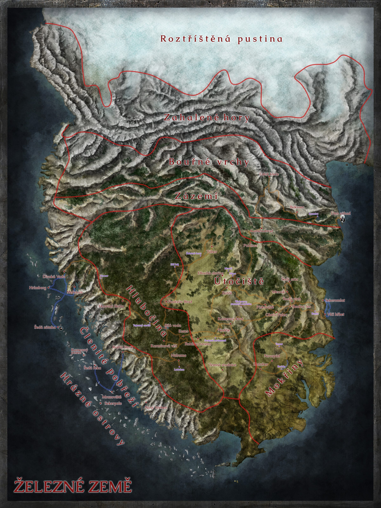

# [INFO] Pravdy a mapa, obecné věci

## Post 650273

**Author:** Orákulum  
**Posted:** 2022-08-25T14:53:27+00:00  
**Source:** https://rpgforum.cz/forum/viewtopic.php?p=650273#p650273

Prostředí Železných zemí  
  
Výchozím prostředím pro vaše dobrodružství jsou Železné země. Jde o drsný poloostrov s izolovanými komunitami a neprobádanou divočinou na hranici známého světa. 

  * Před dvěma generacemi byl váš lid vyhnán ze svého původního domova ve Starém světě do Železných zemí.
  * Počasí je zde drsné. Zimy jsou kruté. Cestování a obchod jsou ve zdejším členitém terénu obtížné a nebezpečné. Nejsou zde žádná prosperující města. Naopak, obyvatelé Železné země žijí v izolovaných vesnicích nebo usedlostech. Jejich domy jsou skromné stavby ze dřeva, kamene a slámy.
  * Mnoho částí Železných zemí je neprozkoumaných a neobydlených, s výjimkou prvorozených bytostí, jako jsou například elfové, obři a vlkům podobní varouové.
  * Peníze zde mají nevalnou hodnotu. Většina obchodů se odehrává pomocí výměnného obchodu a protislužeb.
  * Některá společenstva zůstávají izolovaná a nezávislá, zatímco jiná obchodují se základním zbožím, jako je železo, obilí, dřevo, dobytek, vlna a uhlí.
  * V Železných zemích žije pestrá směsice národů a kultur, a to i v rámci jediného společenstva. Svou postavu a ty, se kterými se stýkáte, si můžete představit, jak chcete, bez ohledu na zeměpisnou polohu, rod, sexuální orientaci a pohlaví.
  * Společenstva se někdy semknou pod vedením vlivného vůdce, ale neexistují žádná království. Územní hranice jsou načrtnuty jen zběžně, pokud vůbec.
  * Rozsáhlé války se v podstatě nevedou, ale nájezdníci a potyčky mezi komunitami hrozí neustále. Některá společenství se živí výhradně nájezdy.
  * Dominantními zbraněmi jsou kopí, sekera, štít a luk. Meče jsou vzácné a velmi ceněné. Někteří válečníci se do boje vydávají odění v železe, jiní věří ve svou zdatnost nebo v sílu svých štítů.
  * Magie je rafinovaná a tajemná. Mystikové se snaží temnotu zahnat prostřednictvím kouzel, ale často jí podléhají. Obřady se vykonávají kvůli požehnání i získání vhledu.
  * Nadpřirozené bytosti a zvířata jsou vzácná, děsivá a nebezpečná.

Pravdy o železných zemích  
  
**_STARÝ SVĚT_**  
Nemoc se jako strašlivá vlna šířila Starým světem a zabíjela všechny, kdo jí stáli v cestě. Tisíce lidí prchaly na lodích. Nákaze však nebylo možné uniknout. Na mnoha lodích byla nemoc potlačena nemilosrdnými opatřeními - vyhazováním přes palubu každého, kdo vykazoval sebemenší příznaky. Jiné lodě byly navždy ztraceny. Přeživší nakonec našli Železnou zemi a učinili ji svým novým domovem. Někteří říkají, že jsme navždy prokleti těmi, které jsme zanechali za sebou, nemoci na pospas.  
  
**_ODKAZY MINULOSTI_**  
Již před mnoha lety sem připluli ze Starého světa jiní lidé, ale zbyl po nich jen barbarský, zdivočelý lid, který nazýváme Zlomení. Čeká i nás jejich osud?  
  
**_ŽELEZO_**  
Impozantní kopce a hory Železných zemí jsou bohaté na železnou rudu. Nejvíce ceněné je černé železo vytavené samotnými hvězdami. Jeho těžba i zpracování jsou nebezpečné a neobejdou se bez znalosti pověstmi opředených tajemství. Prý se kalí v krvi a přísaha složená na černé železo je obzvláště silná, protože je krom železa svázána právě i s krví prolitou při jeho zpracování.  
  
**_SPOLEČENSTVÍ_**  
Žijeme v komunitách zvaných kruhy. Jedná se o osady o různých velikostech, od pastvin s několika rodinami až po vesnice s několika stovkami obyvatel. Některé kruhy patří kočovným lidem. Některé silné kruhy mohou zahrnovat shluk osad. S jinými kruhy obchodujeme (a někdy mezi sebou válčíme).  
  
**_VŮDCI_**  
Vedení je stejně rozmanité jako lidé. Některým komunitám vládne hlava mocné rodiny. Nebo mají radu starších, kteří rozhodují a řeší spory. V jiných mají moc kněží. U některých rozhodují rituální duely v kruhu.  
  
**_OBRANA_**  
Strážci jsou páteř naší ochrany. Slouží svým komunitám tím, že drží hlídky, hlídají okolní pozemky a organizují obranu v době krize. V žádné komunitě jich není mnoho a je-li potřeba, musí přiložit ruku k dílu každý, kdo může. Většina Strážců na svou komunitu silnou vazbu. Jiní, tzv. svobodní strážci, jsou potulní žoldnéři, kteří se nechávají najímat do služeb komunit nebo chrání karavany.  
  
**_MYSTIKA_**  
Magie proudí tímto krajem stejně jako řeky v kopcích. Síla je tu pro ty, kteří se ji rozhodnou využít - ale je velmi nebezpečná a obyčejní lidé se jí obávají - jen opravdu odvážní (či bláhoví) riskují se s ní zaplést...  
  
[**_NÁBOŽENSTVÍ_**](https://rpgforum.cz/forum/viewtopic.php?p=654904#p654904)  
Lidé uctívají staré bohy (ze starého světa, institucializované náboženství) i nové bohy (z Železných zemí, pohanské). V této drsné zemi je modlitba jednoduchou, ale mocnou útěchou.  
  
**_PRVOROZENÍ_**  
Prvorození žijí v izolaci a tvrdě si chrání své vlastní území.  
  
[**_NETVOŘI_**](https://rpgforum.cz/forum/viewtopic.php?p=655545#p655545)  
Železnými zeměmi se potulují nejrůznější netvoři. Obývají především odlehlé končiny, ale na lov se vydávají i do osídlených oblastí. Tam často loví dobytek, ale nezřídka útočí i na pocestné, karavany nebo dokonce osady.  
  
**_BĚSI_**  
Máme se na pozoru před temnými lesy a hlubokými vodami, protože tam číhají příšery. V hlubinách dlouhé noci, kdy je vše zahaleno tmou, se jen blázni odvažují opustit své domovy.

---

## Post 650304

**Author:** Orákulum  
**Posted:** 2022-08-25T21:16:04+00:00  
**Source:** https://rpgforum.cz/forum/viewtopic.php?p=650304#p650304

Mapa  

---

## Post 650357

**Author:** Orákulum  
**Posted:** 2022-08-26T19:12:15+00:00  
**Source:** https://rpgforum.cz/forum/viewtopic.php?p=650357#p650357

[_Rozcestník_ všeho](https://rpgforum.cz/forum/search.php?keywords=Rozcestn%C3%ADk&terms=all&author=&fid%5B%5D=340&sc=1&sf=all&sr=posts&sk=t&sd=d&st=0&ch=300&t=0&submit=Hledat)

**Po oblastech:**

  * [Hrázné ostrovy](https://rpgforum.cz/forum/viewtopic.php?t=17204)
  * [Útočiště](https://rpgforum.cz/forum/viewtopic.php?t=17231)

---

## Post 654904

**Author:** Orákulum  
**Posted:** 2022-10-21T09:41:42+00:00  
**Source:** https://rpgforum.cz/forum/viewtopic.php?p=654904#p654904

Náboženství

_Lidé uctívají staré bohy (ze starého světa, institucializované náboženství) i nové bohy (z Železných zemí, pohanské). V této drsné zemi je modlitba jednoduchou, ale mocnou útěchou._  
  
**Objevy**

  * **Noví bohové** jsou nevyzpytatelní, divocí a dávají velkou moc. Mají často lokální působnost v místě, kde jsou uctíváni, byť existují výjimky (pán Hlubin?) S svými uctívači přímo interagují, diktují jim, co mají dělat, jak mají vypadat rituály. Výměnou za moc často žádají oběti, nezřídka krvavé, i lidské. Kruhy, které se vydaly cestou krvavých obětí navíc často končí špatně.
  * **Staří bohové** jsou vzdálení. Jejich uctívání je spojeno s prověřenými obřady, které vymyslel železný lid, a které mají za úkol učinit jejich moc předvídatelnou a ovladatelnou. Cenou za to ovšem je, že jejich moc a působení je slabé ve srovnání s Novými bohy. Pokud je nějaký někde uctíván, bude to prováděno pomocí stejných rituálů i zvyků napříč celými železnými zeměmi. Nemanifestují ale svou moc přímo, jejich kněží se učí ji získat, kontrolovat a ovládnout pomocí přesně daných rituálů.
  * **Jména** ani Staří ani Noví bohové nemají. Železný lid o nich referuje jako o Pánu hlubin, Paní lovu, Panu ohně a podobně.
  * Jsou zdokumentovány **záměny** Starých bohů za Nové - minimálně na uctívání Paní lovu (Staré bohyně) naskočila v osadě jménem Esos nějaká místní síla a následně se jejím jménem nechala uctívat po nových způsobem a to velmi krvavě a tvrdě. Otázkou také je, jak je to s pánem Hlubin - nevíme o něm moc, ale v kapitole Dobrý sluha, špatný pán jsme o něm trochu mluvili, jako by byl obojím - i starým bohem, kterého dobře známe a dlouho uctíváme stejnými způsoby např. oceánem co obklopuje Železné země, i novým bohem, který je mocný, aktivně zasahuje do dění, žádá si oběti a krev námořníků. Je možné, že stojí někde na pomezí mezi těmito dvěma skupinami.
  * **První lidé** mají své zvláštní cesty, kterak se dostávat k moci, která v jejich pojetí není spojena s bohy. Objevil se u nich zatím jeden společný jmenovatel - to, že nějakým způsobem pracují s dušemi: 
    * **Elfové** nějakým způsobem ovlivňují přímo přírodu, dokáží ovlivňovat živé materie. Jejich magie je fraktální, zanechává v přírodě zvláštní stopy po proměnách. Tvrdí, že existuje jedna duše spojující vše živé - Adan. Tristan jim pomáhal s přenesením lidské duše do Adan, která dává duši a těla elfům.
    * **Trollové** věří, že všechno má duši - i kameny, řeky, mech, krystaly. Jejich magie je založená na šamanských rituálech s různými bylinami, minerály a dalšími přírodními surovinami, není to ale vždy klasické míchání lektvarů a dryáků, občas s nimi dělají podivnosti přímo tím, že je někde nasypou, spálí a pod...
    * **Obři** jsou zatím neprozkoumaní, jen se ví, že jejich čáry i víra mají něco společného s ohněm a zemí.
  * Existují zvláštní síly nebo nadpřirozené entity, které se svým charakterem podobají Starým i Novým bohům, ale nejsou jimi úplně. Zatím jsme potkali tyto: 
    * **Prastarý** : Mocná temná bytost z počátku věků, shromažďuje křivopřísežníky a odpadlé z celých Železných zemí do Karmínové věže
    * **Přísahy** : Po železných zemích chodí žena jménem Nanda, která tvrdí, že Staří i Nový bohové jsou jenom příživníci a paraziti na mnohem starší, všudypřítomné (a neosobní) síle, která pramení z Železných přísah. Tvrdí, že toto je skutečným zdrojem Moci a že by se lidé měli držet přísah a čerpat sílu přímo z nich, ne skrze bohy. Je v tomto velmi výmluvná - už se jí podařilo zkonvertovat na svou víru např. Nekuna, zástupce mistra Hiršama od Rudého vrchu. Prastarý je nepřítelem či antitezí téhle síly.
    * **Smrt** : Myrick se setkal se Smrtí. Smrťák mu řekl, že je něco jako bůh, ale lidé ho patřičně neuctívají. Přeje si ale být uctíván stejně jako bohové, aby se stal jedním z nich.

---

## Post 687955

**Author:** Orákulum  
**Posted:** 2024-01-28T18:12:30+00:00  
**Source:** https://rpgforum.cz/forum/viewtopic.php?p=687955#p687955

Hrozby

_Zde jsou hrozby rozšířené přes více oblastí Železných zemí. Lokální hrozby jsou u jednotlivých oblastí:_

  * _[Bouřné vrchy](https://rpgforum.cz/forum/viewtopic.php?p=676334#p676334)_
  * _[Hlubočina](https://rpgforum.cz/forum/viewtopic.php?p=664215#p664215)_
  * _[Útočiště](https://rpgforum.cz/forum/viewtopic.php?p=650873#p650873)_

  
**Armáda ze severu**

  * První setkání s armádou, na samotě u Bouřného Lesa zabil dezertér Ketilla, manžela Jóry.
  * Měl u sebe hřebce z Bouřných hor, jaké mají ve svých ohradách obři (dal jsem ho Burble, kde vlastně zůstal? Má ho Myrick?)
  * Odněkud se vzali Zlomení
  * Nemoc se dostala mezi obry a kosí je ve velkém, trollové říkali, že ji "přinesl člověk"
  * Trollové tvrdí, že na severu se shromáždilo "moc lidí" aby zabili zlomené
  * Trollové se do věcí lidí a obrů nechtěli plést, ale Eric s jeho bandou, asi jak pátral po nějakém artefaktu, vraždil trolly a znesvětil jejich pohřebiště
  * Trollové se brání a zavolali své soukmenovce z Mokřin, takže takzvaná armáda pravděpodobně teď stojí jak proti Zlomeným, Obrům, tak Trollům.
  * Šedý Sráz napadli trollové, nejspíše je Eric vyprovokoval, ale toho mají jako hrdinu, který je brání - pohřebiště musí být poblíž
  * Bjorn má pocit, že Eric je jen malá ryba, že někdo větší má nějaké vlastní cíle - ten někdo je dost vlivný na to, aby mohl armádu vybavit zbraněmi
  * Nemoc je i v okolí Mezníku a Šedého srázu, minimálně vymřelo osazenstvo tvrze poblíž
  * Přisluhovači Prastarého se chtěli z nějakého důvodu s armádou spojit, vyslali tam posly - poté co jsme je zmasakrovali tam část utekla
  * Lidé z Bílé Vody ví pár věcí o armádě: "je velká, organizovaná, neví se, kdo tomu velí (ale je to někdo důležitý a prý bohatý), jsou do toho nějak zamíchaní Zlomení, Nemoc, a obři. A Eric s jeho bandou kumpánů, kteří prý v horách něco hledají pro svého pána. Myslel jsem, že drancovat trollí pohřebiště vyrazil na vlastní pěst, ale zdá se, že kromě léku na své zmrzačení hledá i něco dalšího.
  * Tábor armády na severu Útočiště - Následovníci Vislaka jdou asi primárně po Zlomených, Eric pro svého pána hledá nějaký artefakt v trollích pohřebištích (a pro sebe lék, nebo mu ho pán slíbil), Prastarého následovníci těžko říct, a pak je tu nesourodá armáda s několika veliteli - ale asi to má celé někdo pod palcem
  * [Nemoc kosí ve velkém obry a armádě to kazí plány](https://rpgforum.cz/forum/viewtopic.php?p=688217#p688217). Nechápu přesně, jestli s nimi chtějí bojovat nebo spolupracovat, ale nechcou od nich nemoc chytit. A Následovníci jsou tu od toho, aby našli lék, nebo ochranu. A Vislak věří, že k tomu potřebuje lépe pochopit, co jsou Zlomení zač. Takže na ně pořádají hony, hledají jejich doupata a skrýše a sbírají stopy o tom, co se s nimi vlastně kdy stalo a jestli za to může nemoc, nebo ne. Protože podle všeho, co o nemoci víme, tak je nemilosrdná a zabíjí. Ale Zlomené jenom poznamenala a nechala žít.

**Nemoc a Zlomení**

  * **Pravdy:** Nemoc se jako strašlivá vlna šířila Starým světem a zabíjela všechny, kdo jí stáli v cestě. Tisíce lidí prchaly na lodích. Nákaze však nebylo možné uniknout. Na mnoha lodích byla nemoc potlačena nemilosrdnými opatřeními - vyhazováním přes palubu každého, kdo vykazoval sebemenší příznaky. Jiné lodě byly navždy ztraceny. Přeživší nakonec našli Železnou zemi a učinili ji svým novým domovem. Někteří říkají, že jsme navždy prokleti těmi, které jsme zanechali za sebou, nemoci na pospas.
  * **Pravdy:** Již před mnoha lety sem připluli ze Starého světa jiní lidé, ale zbyl po nich jen barbarský, zdivočelý lid, který nazýváme Zlomení.
  * Už ti, kteří připluli před mnoha lety, s sebou nesli Nemoc.
  * Spojením nemocných lidí a elfí magie vznikli Zlomení.
  * Zlomení už nemoc nešíří, jsou vyléčení.
  * Ve [Wulanově soutěsce](https://rpgforum.cz/forum/viewtopic.php?p=690903#p690903) roste z valounu černého železa [zvláštní květina](https://rpgforum.cz/forum/viewtopic.php?p=693011#p693011) nasáklá elfí magií, která pravděpodobně způsobila vyléčení Nemoci a vznik Zlomených; místní Zlomení sem nosí ukořistěné meče a dodávají černému železu a květině sílu k zatí neznámému efektu, nejspíš ke zrušení Zlomení

**Postavy**

  * 🪦 Wulan - Kdysi dávno chtěl v centru Útočiště vybudovat nový elfí hvozd. Jeho snaha skončila tragédií, kataklyzmatem a zemětřesením. Zbyla Wulanova zhourcená/ztracená soutěska. Stahují se do ní Zlomení. Wulanova kouzla je pravděpodobně pomohla vytvořit.
  * 🪦 Otani - Elfka stvořená z nakaženého těla - trochu člověk, trochu elf, trochu bytost stínů. Hledá lék na Nemoc v odhalení Wulanovy magie, která to způsobila. Věří, že nemocné (lidi, obry a vůbec) je možné vyléčit pouze "Zlomením". Je mrtvá.
  * Vislak - Člověk, vůdce Následovníků Vislaka, chce vymýtit Nemoc a věří, že ve Zlomených najde lék, kterým nakažené zachrání.
  * Uktannu - Elf, v Nabumě využívají Zlomené jako zdroj nových těl pro elfy. Těla nejsou úplně ideální a chce je očistit - pověřil tím Tristana a Ukamese.
  * Ukames - Elf, kterého Uktannu vyslal do Wulanovy ztracené soutěsky, aby vytvořil nástroj pro očištění duše Zlomených.
  * Tristan - Přísahal objasnit propojení Nemoci a Zlomených pro šamana Uktannu.
  * Nanda - Kněžka "Přísahy", která chce od Zlomených získat meč, který proklel Filze, a který Nanda přísahala očistit.
