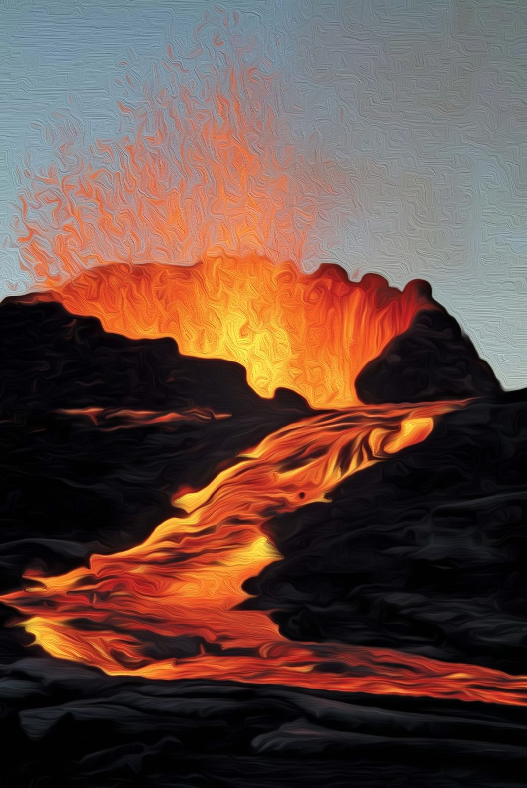

# [HRA] Dobrý sluha, špatný pán

## Post 650283

**Author:** Orákulum  
**Posted:** 2022-08-25T18:05:49+00:00  
**Source:** https://rpgforum.cz/forum/viewtopic.php?p=650283#p650283

Dobrý sluha, špatný pán

  
Zvonění na železnou tyč se rozléhalo mezi domky a chatrčemi. Edda bušil kladivem do zavěšeného prutu co mu síly stačily a na rudým světlem zalité prostranství mezi domky postupně jeden za druhým sbíhali jednotliví osadníci.  
  
"Co se děje?"  
"Nač ten poplach?"  
"Hoří snad?"  
ptali se ti méně chápaví.  
  
Ti chápavější rovnou stočili zrak k úbočí souseda, který jim stejně tak dával obživu, jako byl neustávající hrozbou. Protože přestože byl čas západu slunce, bylo to právě odtamtud a nikoliv ze západního obzoru, odkud osvětlovala osadu rudá záře.  
  

  
"Nový sopouch," pojmenuje konečně Edda důvod toho všeho slonu. "A lávový proud, který z něj vytéká, míří přímo k osadě." Druhou část věty ani nemusel dodávat, toho si všimli všichni - i ti méně chápaví, když je někdo upozornil, kam se mají dívat.  
  
"Ne, nemíří k osadě, míří k řece," míní někdo jiný z davu, ale to hned vyvolá vlnu nevole: "To je snad ještě horší. Láva se valí pomalu. Jestli nám vezme jenom domy, postavíme nové. Ale jestli zničí zdroj naší obživy?"   
  
Další hlasy se přidávají a lidé se začínají hádat o tom, kam vzdálený, avšak přibližující se proud žhavé zkázy vlastně míří. Edda opět zabuší kladivem do prutu, aby hádku přerušil: "Hej, lidi, nehádejte se... musíme se domluvit, dohodnout, co s tím uděláme ...", ale nikdo ho nevnímá. Lidé jen zesílí hlas, aby překřičeli zvonění železného prutu. "Aby jí všichni bohové sprali, kde je Cadigan, když jí potřebujeme," zakleje nakonec Edda a zanechá marného bušení.  
  
Slunce na západě mezitím zcela zapadlo, ale v neuhasínající rudé záři lávy chrlené z nového vedlejšího sopouchu si toho nikdo nevšiml.  
  
_Tímto začíná úvodní událost naší kampaně._

---

## Post 652473

**Author:** Myrick Lysbærer  
**Posted:** 2022-09-19T21:09:36+00:00  
**Source:** https://rpgforum.cz/forum/viewtopic.php?p=652473#p652473

**_.... během západu slunce, kdesi pod soptící horou ...._**  
  
Touhle dobou jsem měl už sedět Basiry - mé nejlepší kamarádky z dětství - za humny. Má domek kousek od osady, na skále nad ústím Šedé řeky. Je odtamtud skvělý výhled na přístav v ústí i zrádné vody před ním a mohla před náročnými plavbami číst vodu. Nechala si ho tak prý postavit. Je totiž jedna z mála, co vodě rozumí. Živí se jako lodivodka.  
  
Mě se to hodilo. Před necelými dvěma týdny jsem na ni narazil na Novém kopci, když jsem hledal cestu do Šedého přístavu. Přestože jsme se desítky let neviděli, okamžitě jsme se poznali. Vyjevil jsem jí svůj záměr, ale hned zkraje mne zchladila a vysvětlila mi, že bych v Šedé řece nejspíš i teď po tolika letech nebyl vítaný.  
  
O několik korbelů a vzpomínek později už byla k mým nápadům o něco vstřícnější a začali jsme trochu plánovat a ještě téže noci jsem byl uložený jako černý pasažér v jednom ze sudů na palubě Themona - knarru, který pomáhá Basira pomáhá provádět zrádnými vodami kolem Šedé řeky.  
  
Od té doby se většinu času schovávám u ní doma, straním se dění v osadě a jen tu a tam vyrážím do různých míst na úpatí sopky, hledat stopy po ... zatím nevím čem. Doposud jsem nenašel odvahu vyjevit vesničanům či místní vůdkyni Cadigan, že jsem tady a jaké jsou mé záměry.  
  
I dnes odpoledne jsem na jednu takovou výpravu vyrazil.  
  
_Ask the Oracle: Unlikely**Viděl mne někdo?** Rolled 20 vs. 25: **Yes**  
Ask the Oracle: 50/50 **Žena?** Rolled 6 vs. 50: **Yes**  
Ask the Oracle: Likely **Viděla mě Yorath?** Rolled 86 vs. 75: **No**_  
  
Naneštěstí mne tentokrát někdo v pustém terénu zahlédl. Zaslechl jsem ženský hlas, jak volá, ptá se kdo jsem. Přemýšlel jsem, jestli je čas konečně přiznat osadníkům svou přítomnost, ale zdála se být daleko a tak jsem se raději rozhodl ztratit se mezi kameny.  
  
_Face Danger -**Podaří se mi uniknout?** (Stín) **Miss**  
Action Score 1 + 1 + 0 = 2 Challenge Dice 9, 8  
Pay the Price [16] **You are separated from something or someone.**_  
  
Ztratil jsem se jí ... protože jsem se vlastně ztratil úplně. Ostrov se od mého dětství hodně změnil a navíc nejedno místo zahalují chuchvalce mlhy. A já ve spěch nedával pozor, kudy a kam vlastně prchám.  
  
Teď zapadá slunce, já jsem nejspíš někde na opačné straně hory než leží osada a a sám. A za chvíli bude všude kolem tma.  
  
Rychle si sedám a snažím se zachytit esenci posledních paprsků slunce ...  
  
_Světlonoš:**Zachytím paprsky zapadajícího slunce?** **Weak Hit**  
Action Score 3 + 3 + 0 = 6 Challenge Dice 5, 7  
**Získávám 3 Světla.**_  
  
Večerní světlo je ale slabé a jsem rád, že jsem zachytil alespoň trochu.

---

## Post 652480

**Author:** Tristan Baldurson  
**Posted:** 2022-09-19T22:17:54+00:00  
**Source:** https://rpgforum.cz/forum/viewtopic.php?p=652480#p652480

**_... mezitím v přístavu ..._**  
  
Zlatavá záře zalévá obzor od západu až k východu a dlouhé stíny se křižují mezi přístavními skladišti a rozestavěnými loďkami. Od zvlněného moře sem fouká ledový vítr a ze středu osady zní poplašné zvonění. Haleema stojí široce rozkročený na hliněném prostranství před dřevěnými moly, roztřesenýma rukama drží svou pracovní sekeru a šedavým popelem pomalovaná tvář je zkroucená zlostí. Jeho děti stojí se opodál choulí před větrem ke své matce, každý v rukou drží menší poloprázdný vak. Dvojice Strážců přešlapuje u mol a sledují je tvrdým pohledem.  
  
"Pusť nás k lodím!" křičí na ně Haleema.  
"Nemůžu, víš to," pokrčí Yorath stoicky rameny. "Každý, kdo chce opustit Šedou řeku musí mít povolení Cadigan. A tvá rodina ho nemá, víme to oba."  
"Cadigan?! Jak si vůbec dovoluješ...?! Kdyby nebylo té ču..."  
"Važ svá slova, Haleemo, nebo toho budeme oba litovat! Uklidni se, vem svou ženu a děti a vraťte se domů."  
"Domů? Moc dobře víš, že už nemáme domov! Shořel, pamatuješ?! A co udělala Cadigan? Nic! Nechává nás tu živořit bez střechy nad hlavou! A podívej se, co se děje v hoře! No podívej! Varoval jsem vás, všechny jsem vás varoval! Ale poslouchal mě někdo? Ne. A teď nás bohové trestají a vy tu budete jen stát a koukat se na to? Jen přes mou mrtvolu!"  
"Bohové trestají jen tebe, že sis zahrával s těmi salamandry," povzdechne si Yorath. "Přinesl sis zkázu na svůj dům sám, neviň z toho ostatní. Ale nechtěj po mně, abych tě teď soudila. Běž pryč, ráno přednesu tvůj požadavek Cadigan a vyčkáme na její rozhodnutí."  
"Ráno už budu na širém moři," procedí Haleema skrze zuby a postoupí vstříc Strážcům.  
"Varuji tě naposledy, Haleemo!" zvolá Yorath. "Poslechni rozum! Nebo svého přítele Tristana!"  
  
  
Sklopím hlavu a přejedu si dlaní přes obličej. Přesně toho jsem se bál. Ale už je pozdě. Vystoupím ze stínu skladiště k ostatním tak pomalu, jak to jenom jde. Hledám vhodná slova, ale má ústa jsou jako Roztříštěná pustina - pustá a prázdná.  
  
"Měj srdce, Yorath," povím nakonec. "Přišli o všechno, o dům, o Eleriho. Nechej je jít."  
"Překvapuješ mě, Tristane," zakroutí Yorath hlavou. V jejím hlase cítím zklamání a hned mě to zamrzí taky. "Přísahal jsi strážit Šedou řeku, pamatuješ? A teď tu na nás budeš něco zkoušet?"  
"Moji přísahu jsem splnil, když se obchodníci rozhodli, že už jsem na ně moc drahý," pokrčím rameny. "Teď tě žádám ve jménu života a oprávněného zármutku, abys Haleemově rodině dovolila jít svou cestou. Jestli na sebe přinesli hněv bohů, bylo by lepší, kdyby s ním odešli na jiný ostrov, co myslíš? Podívej se na nebe, možná máme poslední příležitost nechat je odejít."  
  
_🔀 Compel -**Přesvědčím Yorath, aby je nechala odejít?** (Srdce) - **Weak Hit**  
🎲 Action Score 5 + 2 + 1 = 8 Challenge Dice 9, 7  
✍ +1📈 + They ask something of you in return_  
  
"Máme poslední možnost zastavit chaos," zakroutí nesouhlasně hlavou Yorath a její ustaraný pohled zůstane viset na sopce v dáli. "Neměli bychom přilévat olej do ohně, ne teď. Pojď se mnou do osady, Tristane, a pomoz mi zabránit dalším střetům. Ne jako Strážce, ale jako... bývalý druh, co říkáš? Hned jakmile se situace uklidní, předneseme Cadigan Haleemův požadavek. Máte mé slovo. Ale Haleema se musí obrnit trpělivostí a zdržet se násilí. Mám i já vaše slovo?"  
  
Položím Haleemovi ruku na rameno a jeho sekera klesne k zemi. Podívá se na mě nesouhlasně, ale přikývne. V jeho očích vidím, že nemáme mnoho času.  
  
"Máš naše slovo, Yorath," kývnu. Nemám z toho vůbec dobrý pocit. "Musím se zastavit pro výzbroj, mám ji pořád ještě bezpečně uschovanou. Sejdeme se ve vsi, dorazím snad ještě před půlnocí."  
  
Yorath mi už nevěnuje další pohled a kvapně vyrazí do osady. Druhý Strážce se opře a nespouští oči z nešťastné rodiny. Rozloučím se a vyrazím poklusem do tmy k úpatí hory. Vstříc spálenému Haleemovu domu, mé skrýši a další neklidné noci.

---

## Post 652519

**Author:** Tristan Baldurson  
**Posted:** 2022-09-20T14:26:34+00:00  
**Source:** https://rpgforum.cz/forum/viewtopic.php?p=652519#p652519

Brzy obloukem minu střed osady a dostanu se do úrodného údolí. Pokračuju mezi políčky a pastvinami proti proudu řeky. Burácející hora mi svítí na cestu a s každým krokem připomíná, že bych se měl spíš otočit a utíkat zpátky. Já ale musím ještě kus cesty za poslední ohrady, ke skalnaté pláni, kde stával Haleemův dům, po několik posledních let i můj domov.  
  
S hrůzou sleduju nový lávový proud, který mi míří naproti. Už chápu ten povyk, tohle není dobré. Valí se pomalu a možná spíš směrem k řece než polím, ale ani celý spojený Kruh ho nezastaví. Ucítím úzkost a přidám do kroku.  
  
  
Torzo ohořelého Haleemova domu se tyčí na spálené zemi proti rudému obzoru. Střídavě procházím po praskající krustě tuhnoucí lávy a bořím se do vysoké vrstvy popela. Hádám, že moje skrýš pod skálou zůstala mimo hlavní lávový proud a krumpáč nebo motyka mi bude stačit. Za doutnajícími trámy najdu trosky přístavku a v něm opuštěné nářadí, tvrdé dřevo násad zdá se žáru odolalo. Radši se tu moc nerozhlížím a spěchám s krumpáčem v ruce kousek po úbočí k místu, kde jsem se před lety rozloučil s minulostí. Aspoň do dnešního večera jsem si to myslel.  
  
U skály během chvíle odkryju svrchní vrstvu tuhé hlíny a brzy narazím na kámen. Kleknu si a pustím se do ruční práce. V těžkých kamenných deskách, kterými jsem kdysi truhlu zakryl, je skrytý systém. Stačí jeden špatný pohyb a zhroutí se dolů a pohřbí pod sebou všechno vybavení. Tehdy jsem si říkal, že budu mít na případné vykopání truhly spoustu času. Dnes sotva vidím, ruce mi rychle chladnou a sopka ani neklidný Kruh nečeká. Snažím se nevnímat burácení ani ohnivé záblesky a napínám paměť, co mi hlava dovolí.  
  
_🔀 Secure an Advantage -**Získám své vybavení** (Rozum) - **Strong Hit**  
🎲 Action Score 3 + 2 + 0 = 5 Challenge Dice 4, 1  
✍ Prepare to act: +2📈_  
  
Podaří se mi truhlu dostat bezpečně ven. Otevřu ji a začnu rychle přebírat odložené vybavení. Zub času se na lecčem podepsal, ale to důležité zůstalo v pořádku. Pod pečlivě naskládanou výzbrojí a výstrojí narazím i na objemný balík. Zatají se mi dech. Tuhle kůži jsem zakopal hned po příchodu do Šedé řeky a věřil jsem, že zůstane navždy pod zemí. Bojím se, co s ní probudím. Ale mám stejně velký strach, že to bez ní prostě nezvládnu.  
  
_🔮 Jakou kůži Tristan má (viz BIND, psti po dvacítkách, odds nehrají roli)?  
🎲Rolled 53 = srna-srdce_  
  
Opatrně ji rozbalím. Magii necítím žádnou a ani na nebi se nic nepohne. V pořádku, na to přijde čas později. Teď bych měl vyrazit do vsi za Yorath.

---

## Post 652553

**Author:** Myrick Lysbærer  
**Posted:** 2022-09-20T19:13:23+00:00  
**Source:** https://rpgforum.cz/forum/viewtopic.php?p=652553#p652553

**_.... na opačné straně sopky ...._**  
  
Potřebuji se zorientovat. Uvolním trochu esence světla do dlaní, abych viděl svah před sebou a začnu zvolna stoupat vzhůru do svahu. Jsem si sice vědom, že dva jasné body mohou být vidět z velké dálky, ale protože nikde nevidím světla osady, předpokládám, že kolem už široko daleko nikdo není. A za chvíli by mohlo jít o život, takže za tu trochu rizika to stojí.  
  
🔀 _Zajistit výhodu (ostří)**Vyšplhám někam výš, odkud se půjde zorientovat? Weak Hit **   
🎲 Action Score 6 + 2 + 2 = 10 Challenge Dice 10, 6  
✍ Krátkodobá výhoda: +1📈  
  
A jdu vyzkoušet našeho společného GMa ...   
🔮 Kam vyšplhám? Jak ta krátkodobá výhoda vypadá?_

---

## Post 652570

**Author:** Orákulum  
**Posted:** 2022-09-20T20:40:56+00:00  
**Source:** https://rpgforum.cz/forum/viewtopic.php?p=652570#p652570

Myricku,  
  
cesta sopečným svahem není snadná. Vyvrhnutá láva i popel tu ztuhly do bizarních skalních útvarů, které tě matou svými nepředvídatelnými tvary a mihotavými stíny. Když vystoupáš na menší rovinku k bublajícímu jezírku vařící vody, na chvíli si odpočineš. Máš čas se vydýchat a prohlédnout si alespoň konturu opuštěného pobřeží pod tebou.  
  
Světlo z tvých dlaní a zvuk klokotající vody po chvíli doplní ostrá vůně. A není to síra z jezírka, je to... spálenina. Ostrý zápach spáleného nebo možná jenom pečeného masa. S dalším poryvem větru se vůně ztratí, ale za okamžik ji ucítíš zase. Její zdroj je určitě nedaleko a ať už je to cokoliv, tady v temné pustině to musí být něco zajímavého, odkud určitě najdeš lehce cestu dál.  
  
_Myricku, vydáš se rychle za zdrojem té vůně, než ji vítr definitivně odnese, nebo uděláš něco jiného?_

---

## Post 652654

**Author:** Myrick Lysbærer  
**Posted:** 2022-09-21T11:33:00+00:00  
**Source:** https://rpgforum.cz/forum/viewtopic.php?p=652654#p652654

Jako první mě potěší myšlenka, že možná nevynechám večeři a nebudu hladovět. Pak mi dojde, že by to mohlo být nebezpečné, ale uvědomím si, , že když já cítím vůni, jsem po větru a zdroj pečené vůně neucítí mě.  
  
Ztlumím záři na rukou a chvíli počkám, aby si můj zrak přivykl. Pak pokračuji po čichu. Obezřetně. Mžourám při tom do tmy a hledám zdroj...  
  
_🔀Shromáždit informace -**Copak je zdrojem té vůně? Weak Hit**  
🎲Action Score 5 + 3 + 0 = 8 Challenge Dice 6, 9  
✍️the information complicates your quest or introduces a new danger. +1📈  
  
Putovní GM, co je zdrojem?_

---

## Post 652674

**Author:** Orákulum  
**Posted:** 2022-09-21T13:54:19+00:00  
**Source:** https://rpgforum.cz/forum/viewtopic.php?p=652674#p652674

Myricku,  
  
pokračuješ přítmím mezi ostrými skalisky rovnou za nosem. V průrvě před sebou zahlédneš mihotavé světlo, silnější než tvé dlaně, ale rozptýlené. A když se protáhneš průrvou, pochopíš, odkud se bere to světlo i zápach spáleniny.  
  
V souvislé lávové krustě uvidíš trhlinu, kterou protéká zvolna tuhnoucí magma. Na hraně trhliny leží tělo, od pasu dolů je ohořelé a doutná, spodní část nohou chybí úplně. Podle dlouhých havraních vlasů a zdobeného štítu ležícího vedle poznáš, že je to Sadia, Strážkyně z Šedé řeky, na kterou tě upozorňovala Basira. Sadia měla za úkol provádět průzkum na úpatí sopky a hledat nové sopouchy a lávové proudy. Pravidelně těmito místy procházela a zakreslovala své objevy do podrobných map. Tentokrát nejspíš přehlédla nestabilní terén, který se pod ní propadl a stál ji život.  
  
Když se trochu rozkoukáš a uvědomíš si, že její pouzdro s mapami stále leží pod jejími zády, zahlédneš i mohutný šedivý stín, který se vlní opodál. Zahlédneš taky odlesk dvou zářících bodů a uslyšíš táhlé kňučení. Musí to být Leno, její pes, který ji na průzkumech doprovázel. Věrně sedí po boku své paní a nehnutě zírá na její bezvládné tělo.  
  
_Myricku, máš možnost se opravdu zorientovat v okolí a najít cestu, kam potřebuješ. Ale nevíš, kolik času ti zbývá, než se k mapám dostane oheň. A věrný pes, který tě nezná, může být nebezpečný._

---

## Post 652723

**Author:** Tristan Baldurson  
**Posted:** 2022-09-21T21:40:34+00:00  
**Source:** https://rpgforum.cz/forum/viewtopic.php?p=652723#p652723

_**... v osadě ...**_  
  
Zpátky k osadě se vracím s plnýma rukama a těžkým srdcem. Přišla konečná zkouška síly a jednoty Kruhu? Přežije Šedá řeka tuhle zimu, nebo alespoň noc? Nebo se dnes jenom rodí další Zlomení, jizvy na tváři Železných zemí?  
  
S každým krokem přibývají v dáli na pobřeží další a další světla. Když procházím ještě nesklizenými poli a kolem prvních domů, je na nohou už určitě každý muž, žena i dítě. Doufám, že nejdu příliš pozdě.  
  
_🔮 Je situace lepší nebo horší? 🎲 Rolled 87 = Horší, ale ne zoufalá  
🔮 Action and Theme 🎲 Mourn Greed_  
  
Přidávám do kroku a na náves doběhnu. Jsou tu možná opravdu všichni. V hloučcích a skupinkách, pokřikují na sebe, mávají narychlo popadnutými nástroji, vzpínají ruce k moři a zemi.  
  
"Proč se tu pořád hádáme? Musíme něco udělat s tou sopkou!" volá zoufale Edda.  
"A co chceš dělat s lávou?" okřikne ho někdo, "obětovat vlnám, aby nám přišel sám příliv na pomoc?"  
"Nikdo nám nepomůže! Zasloužíme si trest!" Přepadne mě zoufalství - podle hlasu poznám Haleemu. Odtrhne se od své ženy, vyleze na prázdný sud a roztáhne doširoka ruce.  
  
"Přeorali jsme půdu, oplotili pláně, vylovili moře! To vše ve jménu obchodu, a co z toho máme? Jistě, že se na nás sopka zlobí! Pořád obchod, obchod, ale kdy jsme zapomněli na úctu a zvyky? Kdy jsme prodali pokoru? A co budeme dělat, když přijdeme o obživu? Když nebude sklizeň a dobytek nebude mít co žrát? K čemu nám pak budou obchodníci? Proč by nás měla vést Cadigan, když odsud bude moct odvážet jen mrtvé?! Jak tohle všechno mohla vůbec dopustit?! A proč se před námi schovává? Doveďte někdo Cadigan, chceme odpovědi!"  
  
Proderu se davem dopředu a strhnu ho dolů. Ožene se po mně pěstí, ale je v ní pořád ještě víc zoufalství než síly. Zkroutím mu ruku za zády a odstrčím ho od sebe. Utrhnu z mojí vesty korálek z černého železa s runou ᛒ a nastavím ho v dlani před Haleemu.  
  
"Haleemo, před lety jsi mi nabídl novou cestu i domov a nikdy ti to nezapomenu. Přísahám na železo, že na oplátku odsud dostanu v pořádku tebe i tvou rodinu. Ale prosím, buď trpělivý! Nedovol tvému žalu, aby jsi následoval Eleriho tak brzy!"  
  
Navléknu železný korálek na tkanici a pár pohyby si ho vpletu do vousů. Dělal jsem to už tolikrát, ale dnes se mi třesou ruce. Je to tak dávno. A zároveň mi to připomene ten poslední železný korál, který tam ještě zbývá. Zapomenutý, roky přehlížený kus kovu, který už zarostl a svět na něj nejspíš zapomněl, ale mě pořád každý den táhne strašlivou tíhou dolů.  
  
_🔀 Swear an Iron Vow -**Dosanu Haleemu a jeho rodinu v pořádku z Šedé řeky** (Srdce, Dangerous) - **Weak hit**  
🎲 Action Score 4 + 2 + 0 = 6 Challenge Dice 1, 10  
✍ +1📈 + you are determined but begin your quest with more questions than answers, envision what you do to find a path forward_

---

## Post 652725

**Author:** Myrick Lysbærer  
**Posted:** 2022-09-21T22:10:24+00:00  
**Source:** https://rpgforum.cz/forum/viewtopic.php?p=652725#p652725

**_.. u mrtvé Sadie ..._**  
  
V hlavě mi okamžitě proběhne, že ta zkušená ženská nejspíš udělala chybu, protože se v šeru hnala za mnou.  
  
_Jsem na sebe přísný, ale dám si -1 vůli za tohle zjištění.  
🔀Přetrpět stres **Miss**   
🎲Action Score 1 + 4 + 0 = 5 Challenge Dice 6, 8  
✍️Utrpím navíc -1📉_  
  
To mě na chvíli paralyzuje. Konečně se proberu. Ona tu umřela, ale já tu zkysnout nemusím. S těžkým hlasem se otočím ke zlověstnému stínu pes, který se celou dobu ani nehnul.  
  
"Hodnej pesan. Nojo, já vím, že je to těžký. Panička to má za sebou, ale já bych tu nerad skončil taky. Necháš mě vzít těch pár věcí, co má u sebe viď?"  
  
_🔀Vynucení**Chci, aby mě pes nechal vzít si ty mapy. Weak Hit**  
🎲Action Score 4 + 2 + 0 = 6 Challenge Dice 1, 8  
✍️Udělá, co chci +1📈, ale bude chtít něco na oplátku._  
  
Natáhnu ruku k mrtvé Sadii a pes zvedne hlavu. Ve tváři má smutný výraz a ocas se mi párkrát hne zleva doprava. Pak udělá několik těžkých kroků ke mě a sedne si u mé nohy. Smutně zakňučí.  
  
Oddechnu si, že není agresivní, ale zároveň si uvědomím, že ho tu nemůžu nechat. Budu ho muset vzít zpět do osady ... a i když se mi to podaří udělat nějak nenápadně, stejně to vyvolá otázky.  
  
Skloním se k němu a dotknu se přesky na svém opasku. "Já si tě vzít nemůžu, kamaráde. Se mnou bys neměl šťastnej život. Ale když už jsi přišel o paničku kvůli mě, nenechám tě v tom. Přísahám, že ti nějaké místo k žití najdu."  
  
_🔀Skládám železnou přísahu:**Najdu psovi nový domov. Weak Hit**  
🎲Action Score 4 + 3 + 0 = 7 Challenge Dice 5, 7  
✍️Jsem odhodlaný, ale mám víc otázek než odpovědí. +1📈  
Obtížnost Troublesome - 3 tiky/milník._  
  
Jenže jak to udělat? Nemůžu jen tak přijít do osady - nikdo doposud neví, že tu jsem. A i když by se mi podařilo nějak do osady dostat samotného pesana, vyvolá to otázky, hodně otázek. A ztíží mi to pozdější přiznání mé přítomnosti. Basiře ho taky neudám - pes není zvíře na moře a nemůže zůstávat doma dlouhé dny sám, bez ní.   
  
Ale tohle budu řešit později. Teď se odsud musím dostat.  
  
Sehnu se k Sadii a seberu její mapy. Začnu sbírat okolní kameny a vršit kolem ní mohylu. A pak mne něco napadne ... třeba by mi mohla poradit ona. Už jednou se mi podařilo s mrtvou hovořit.  
  
Sáhnu do své torny a vyndám několik svíček.  
  
_🔀Poselství:**Chci promluvit s mrtvou o tom, co s jejím psem. Strong Hit**  
🎲Action Score 6 + 3 + 0 = 9 Challenge Dice 2, 7  
✍️Duch se zjeví a můžete pár minut vést rozhovor. Vyhodnocuj vhodné tahy (máš +1🎲).  
_  
  
S obavami je rozkládám, pesan mě se smutným kňučením stále sleduje. Jednu po druhé je zapálím....  
  
_🔮Byla to opravdu ona, kdo mě sledoval? Rolled 6 vs. 75:**Yes**  
  
Prosím laskavého putovního GMa, aby mi zahrál první reakci přivolaného ducha.  
_

---

## Post 652751

**Author:** Tristan Baldurson  
**Posted:** 2022-09-22T15:05:47+00:00  
**Source:** https://rpgforum.cz/forum/viewtopic.php?p=652751#p652751

**_... v osadě ..._**  
  
V Haleemově popelem pomalované tváři zahlídnu bolest, opravdovou a upřímnou. A dav kolem nás mezitím propukne v bouřlivou hádku.  
  
Mnoho provolává jméno Cadigan a stejně jako Haleema se dožadují odpovědí. Jiní jim spílají a volají po potrestání buřičů. Další se marně snaží domluvit postup u samotné sopky. A slyším samozřejmě i ty, kteří odevzdaně čekají na znamení bohů. Všichni něco chtějí a většina z nich čeká, že to za ně udělá někdo jiný.  
  
_🔮 Přijde už Cadigan? Rolled 69 vs. 75: Ano_  
  
"Nestůj tady tak, máme problém," sykne na mě Yorath a zatáhne mě za loket stranou. Do rukou mi strčí kopí. Patří Strážcům, dřevo toho už hodně pamatuje a nejspíš jsem ho už kdysi držel v rukách. Štít nečekám, už na něj nemám právo. "Cadigan je tady. A ty jsi mi slíbil, že mi pomůžeš sjednat pořádek!"  
  
Vytrhnu se jí a rozhlédnu. Rozhádaný dav se skutečně rozestupuje a do středu shromáždění míří v doprovodu několika mužů a pochodní Cadigan. Ruch utichá, všichni čekají, co poví. Zahlédnu Haleemu, jak se dere dopředu. Yorath mi ukáže na několik nejhlasitějších nespokojenců. Nevím co dřív. Děje se toho příliš mnoho najednou. Zavřu oči a představím si, že stojím uprostřed zasněženého lesa. Jsem obklopen stromy, mezi kterými krouží smečka vlků. Mají oči křičících vesničanů, Cadigan, Yorath i Heleemy. Co bych s nimi udělal?  
  
_🔀 Secure an Advantage -**Vymyslím způsob, jak pomoct Yorath i Haleemovi** (Rozum) - **Miss**  
🎲 Action Score 2 + 2 + 0 = 4 Challenge Dice 7, 8  
✍ Pay the price  
  
🔮Pay the Price - A surprising development complicates your quest.  
  
Milý náhodný GM, jaký překvapivý vývoj mi situaci zkomplikuje?_

---

## Post 652770

**Author:** Orákulum  
**Posted:** 2022-09-22T21:00:58+00:00  
**Source:** https://rpgforum.cz/forum/viewtopic.php?p=652770#p652770

Tristane,  
  
nejde jen o vlky, ale i o samotné stromy - v bouři se ohýbají a div, že tě netlučou větvemi.   
  
Zatímco se lidé nejblíže Cadigan a její družině snaží ustoupit vzad, udělat jí místo a prokázat úctu, hlouček nespokojenců pokřikuje a tlačí se naopak vpřed, možná i schválně strká do lidí před sebou, ti naráží do dalších, ti strkají nervózně zpět...   
  
Dav lidí kolem družiny Cadigan se tak začíná stahovat a Yorath proto musí občas někoho postrčit zpět štítem - v zásadě aby mu pomohla couvnout proti lidem, co jej tlačí zezadu. Jenže podobných ohnisek neklidu je víc - třeba to, co ti ukázala, takže je třeba, abys podobným způsobem pracoval s ratištěm svého kopí, jinak se dav na tvé straně zhroutí a bouře těl zaplaví Cadigan.   
  
A chaos by mohl někdo využít k unáhlenému činu vedenému zoufalstvím. Skoro jako by to tak někdo snad plánoval či využíval tuto příležitost...  
  
Yorathin úkol bys ale snad ještě zvládl, nebýt smutkem napůl šíleného Haleema. Ten se dere v před, ale dav mu spíš ustupuje, lidé bojící se boží odplaty ho podporují, někteří si dokonce už stihli posypat hlavy popelem a začernili jím tváře... Teď ho povzbuzují, aby to, co vykřikoval před chvílí, vmetl do tváře přímo vůdkyni.   
  
Na Haleemově straně tak není dav tak divoký, není tam třeba zasahovat, ale když tam nebudeš, dostane se Haleema přímo před Cadigan a zahodí tak možnost přednést jí svoji žádost k opuštění ostrova ráno a v klidu.   
  
_Tristane, zkušená strážkyně měla pravdu - k udržení pořádku je strážců málo. A ty nemůžeš být na dvou místech současně - pomoci oběma lidem, kterým jsi svoji pomoc slíbil. Co si vybereš? Co uděláš?_

---

## Post 652771

**Author:** Tristan Baldurson  
**Posted:** 2022-09-22T21:19:12+00:00  
**Source:** https://rpgforum.cz/forum/viewtopic.php?p=652771#p652771

Otočím kopí napříč a ze všech sil vytlačím co nejvíce lidí dozadu, až prvních pár z nich spadne a jako lavina strhnou ostatní. To dá Yorath aspoň trochu času. Stáhnu kopí k tělu a začnu se prodírat za Haleemou. Nenechám ho zničit si život.  
  
_GM, co překvapivého se stane?_

---

## Post 652774

**Author:** Orákulum  
**Posted:** 2022-09-22T21:36:45+00:00  
**Source:** https://rpgforum.cz/forum/viewtopic.php?p=652774#p652774

Haleema se dere v před. Poslední z lidí před ním mu zkouší bránit a trochu se blýsknout před procházející Cadigan - co když pak vyjednají lepší podmínky - ať už obchodu či opouštění ostrova? Jenže těch, co postrkují Haleemu vpřed je víc - příliš dlouho na ni čekali, nervozita, strach a frustrace narůstaly a chtějí se teď vybít. A když je tu teď konečně někdo, kdo promluví místo nich, chtějí, aby se tak stalo...  
  
Haleema vyletí z davu, ale je to Tristan, kdo jej zachytí, aby neskončil v cestě před procházející Cadigan. Sice na ni sípavě křičí, ale ona může předstírat, že jeho selhávající hlas v okolním ruchu neslyší nebo že má teď naléhavější povinnosti než jednoho blázna - a díky tomu se k jejím uším nedonese, to nejhorší, co pro ni Haleema vzteky bez sebe měl.   
  
Cadigan tak mine Tristana, který uklidňuje svého přítele a zpoza hromady popadaných lidí vyletí jejím směrem... mince. Drobný měděný penízek s roztřepeným okrajem, nevalné hodnoty, spíše vzácný tím, že se málokdy používá - zboží se obvykle mění za zboží, snad jen ten kousek, co vždycky chybí či přebývá... A následuje ho další. A za ním dřevěný korálek, pak kostěný knoflík...  
  
"Tady máš naše peníze!" křikne někdo.  
"Náš majetek, o to jediné ti kdy šlo!"   
"Tak už máš dost?!"  
"Zaprodala jsi nás svojí chamtivosti! Nenasytná... couro!"  
  
Začíná toho pršet více a více, a protože si nemůže být Yorath jistá, že mezi věcmi, co Cardigan lidé _vrací_ nebude i kámen, přesune se na házející stranu davu - kde chybí Tristan - a pozdvihne svůj štít...  
  
... jenže tím opustí své místo na druhé straně. A když o její štít cinkne stříbrná náušnice, která se zaleskne ve světle pochodní Cadiganiných družiníků, pár lidí z davu se vrhne po kolenou do bláta. Ne všichni obyvatelé Šedé řeky žijí v dostatku a mohou si dovolit přepych hrdosti.   
  
A pak někdo strčí někoho za nimi. A ten zakopne o klečící... Lidé ze strany, kterou ještě před chviličkou Yorath úspěšně držela, se vyvalí jako polom. Povalí muže s pochodní po straně Cardigan. A pak přes ně začne někdo lézt. Pochodeň je zadušena v blátě.   
Stále sem tam cinkne ozdoba či mince. Tu a tam dokonce stříbrná.   
  
"Proč jí to dáváte, měli bychom si to od ní naopak vzít!" vykřikne někdo.   
"Její pýcha urazila bohy! Ať se kaje! Ať se poníží!"  
  
Teď už jdou lidé i z druhé strany, jeden mladík právě podběhl stále ještě zdvihnutý štít Yorath. Ona se po něm ožene. Toho využije mladá dívka a oběhne strážkyni z druhé strany. Někdo srazí Cardiganinu družiníkovi druhou pochodeň. Někdo se pokusí strhnout Cadigan ozdobný řetěz z hrudi. Cadigan mu úderem spodku dlaně zlomí nos. Její družiníci se na něj vrhnou pěstmi i kopanci.   
  
Část davu se vrhne na dotírající buřiče - ty skutečné i ty domnělé. Cadigan má mezi lidmi stále příznivce, ale teď není moc poznat, kdo je kdo.   
  
Cadigan couvá. Se zbývajícími dvěma pochodněmi pospíchá zpět, stále ještě otevřenou uličkou, zatímco si v houstnoucí tmě začínají výtržníci vybíjet zlost na dvou jejích mužích, co kryli její ústup. A na Yorath.   
  
Všichni mají zatím dostatek soudnosti, aby nesáhli ke zbraním, i když Yorath proti přesile neváhá využívat svého postavení strážkyně - a tvrdých okrajů svého štítu.  
  
_Tristane, je překvapivé, že věc eskalovala tak rychle - bývá zvykem nechat vůdkyni říci, co má na srdci a všichni přece čekali, že začne organizovat lid, aby se nějak pokusil alespoň pozměnit směr proudu lávy... Jako by to někdo podpořil, aby Cardigan nemohla projevit svoji autoritu a naopak byla vina chaosem._

---

## Post 652780

**Author:** Tristan Baldurson  
**Posted:** 2022-09-23T10:08:16+00:00  
**Source:** https://rpgforum.cz/forum/viewtopic.php?p=652780#p652780

Držím Haleemu za loket a táhnu ho i tlačím ven z davu. Nebrání se, jakmile ztratil z očí Cadigan, jeho hněv ztratil svůj účel. V očích se mu lesknou slzy. Žádný trest pro Cadigan mu syna nevrátí, Haleema to ví, ale i tak to chtěl prostě zkusit. Nemám mu to za zlé.  
  
Dereme se mezi lidmi směrem k nejbližšímu stavení. Jsme jako loďka na vzedmutém moři a vlny s námi hází ze strany na stranu. Cítím dupance na svých nohou, tupé údery do zad a cizí lokty v obličeji. S každým dalším nárazem jen přidávám do kroku a hrnu se bez váhání vpřed.  
  
_🔀 Face Danger -**Dostanu nás mimo dav** (Železo) - **Miss with a Match**  
🎲 Action Score 2 + 3 + 0 = 5 Challenge Dice 9, 9  
✍ Pay the price + Ztrácím nervy -1 vůle   
Zapomněl jsem hodit Endure Stress, takže to dohazuju až zpětně a dělám dál nějaké edity.  
  
🔮 Pay the Price - A new danger or foe is revealed.  
  
🔀 **Endure Stress** (Vůle) - **Strong Hit**  
🎲 Action Score 5 + 4 + 0 = 9 Challenge Dice 8, 6  
✍ Embrace the darkness: Take +1📈 _  
  
Ztrácím nervy. Takhle se odsud nikdy nedostaneme. Přivřu oči a soustředím se na jediný bod před sebou, na místo, kde je dav řidší a naše cesta volná.  
  
V tu chvíli je ale zahlédnu - skupinku lidí v kapucích, pod kterými mají nasazené jednoduché kožené masky. A v rukách se zalesknou tasené dýky. Šikovně uhýbají nástrahám zmatku a hbitě postupují ke Cadigan. Na okamžik se jeden z nich ohlédne a naše pohledy se setkají. Je to jenom krátká chvíle, ale vím, že ví, že o něm vím. Zatáhne svého druha za kapuci, ukáže směrem na mě a oddělí se od skupiny směrem k nám. A hned mi zmizí z očí.  
  
Popadnu Haleemu za ramena a zkouším ho tlačit před sebou. Vrah je nám v určitě v patách a je rychlejší než my. Není otázkou jestli, ale kdy.  
  
_Nepřítel je Dangerous: 2 postup za zranění, dává 2 zranění  
Pro přehlednost tu budu pro jednou vést pokrok 🌑🌑🌑🌑🌑🌑🌑🌑🌑🌑  
  
🔀 Enter the Fray - **Jsem přepaden vrahem** (Rozum) - **Miss**  
🎲 Action Score 2 + 2 + 0 = 4 Challenge Dice 6, 9  
📈 Mám 7 hybnost => Pálím hybnost, ruším kostku 6 a mám z toho **Weak hit** \+ Obnova hybnosti  
✍ Bolster your position: Take +2📈 + Nepřítel má iniciativu_  
  
Dnešní noc je krátká a už jsem toho zažil více, než za celé letošní léto dohromady. Jedna další šelma mě tolik nepřekvapí. A když se mi mihne maska s kapucí v zorném poli, jsem připravený.  
  
Odstrčím Haleemu od sebe, otočím se a koncem kopí odrazím výpad dýkou. Stačilo málo. Vrah se na okamžik zarazí, čekal snazší zásah. A určitě se pokusí tlačit dál, dokud je blízko u mě. Zkusím mu to zkomplikovat. Ustupuju dozadu a snažím se mezi nás dostat svoje kopí alespoň na polovinu délky. Ani tady na okraji davu to není úplně jednoduché.  
  
_🔀 Face Danger -**Ustupuju dotírajícímu vrahovi** (Železo) - **Weak hit**  
🎲 Action Score 3 + 3 + 0 = 6 Challenge Dice 9, 1  
✍ Jsem zraněný: 1 zranění + Kopiník: Můžeš hned provést Strike nebo Clash a k hodu máš +1🎲   
  
🔀 **Endure Harm** (Zdraví) - **Weak Hit**  
🎲 Action Score 4 + 4 + 0 = 8 Challenge Dice 10, 2  
✍ You press on_  
  
Vrah se mrštně vyhne kopí a sekne mi přes ruku dýkou. Ucítím bolest, ale kožený rukáv většinu síly zastavil. Trhnu boky a namířím špičku kopí na koženou masku a dostanu se od něj na vzdálenost natažené paže. Vrah se dvakrát ožene do prázdna. Spěchá, se svědkem nepočítal a čím víc času mi dá, tím spíš si nás všimne někdo další. A varuje Cadigan. Zkusím toho využít.  
  
Zezadu do mě pořád vráží nějací lidé, tak nechám kopí párkrát klesnout a nabídnu tím vrahovi příležitost. Když vyrazí proti mně, provedu krátký výpad.  
  
_🔀 Clash -**Zpomaluji vraha výpadem kopí** (Železo) - **Strong Hit**  
🎲 Action Score 3 + 3 + 1 = 7 Challenge Dice 1, 4  
✍ Dávám zranění +1 = 3 + Mám iniciativu  
🌕🌕🌕🌕🌕🌕🌑🌑🌑🌑_  
  
Švihnutí čepele mi zajede do vousů. Chybělo málo, ale dál se vrah prostě natáhnout nemohl. Moje kopí má zaražené hluboko do stehna a ve dvou úzkých štěrbinách masky vidím bolest. Musím do rychle dokončit. Jednou rukou se opřu do kopí a zatlačím ho k zemi, přitom se k němu přisunu, nakloním a druhou rukou vyrazím dopředu a chytím jeho zápěstí s dýkou. Zkroutím ho a přiložím mu jeho vlastní nůž na krk.  
  
_🔀 Strike -**Smrtelně ho zraním** (Železo) - **Strong Hit**  
🎲 Action Score 2 + 3 + 0 = 5 Challenge Dice 4, 2  
✍ Dávám zranění +1 = 3 + Mám iniciativu  
🌕🌕🌕🌕🌕🌕🌕🌕🌕🌕_  
  
V kožené masce se objeví tenká dlouhá škvíra, kterou začne pomalu vytékat krev. Nevím přesně, kam jsem zasáhl, ale vrahovi se podlomí nohy a klesne k zemi. Kleknu k němu a snažím se ho svým tělem před náhodnými pohledy davu. Stáhnu mu masku dolů.  
  
_🔀**End the Fight** \- **Strong Hit**  
🎲 Action Score 10 Challenge Dice 8, 2  
✍ Vrah je mrtvý  
  
Pokud půjde okolo nějaký GM s nápadem, co nebo koho pod maskou Tristan uvidí, může to tu nechat. Jinak budu později pokračovat sám._

---

## Post 652786

**Author:** Orákulum  
**Posted:** 2022-09-23T12:28:44+00:00  
**Source:** https://rpgforum.cz/forum/viewtopic.php?p=652786#p652786

_**... u mrtvé Sadie ...**_  
  
Yoricku, do tváře tě uhodí mrazivý vítr odkudsi od oceánu. Nese s sebou až mrtvolný chlad. Tvé svíčky se jen zavlní a nerušeně hoří dál. Vlasy mrtvé Sadie se ve větru divoce roztančí. A nad jejím tělem ucítíš zvonivý hlas:  
  
"Áááááá...! Leno! Leno! Pomož mi! Táhni! Leno...?"  
  
Chvíli trvá, než si Sadie uvědomí, že její boj je už marný. Hlas se utiší:  
  
"To jsi ty?! Tebe jsem viděla v pláních! Cizinec! Leno, trh..."  
  
Psisko zakňučí, otře se čumákem o tvář mrtvé Strážkyně a olízne Myrickovu tvář.  
  
"Co jsi to..." roztřese se hlas. "Dáš mi na něj pozor, že ano? Postaráš se mi o něj? Chci odsud pryč!"  
  
_Myricku, co uděláš dál?_

---

## Post 652791

**Author:** Myrick Lysbærer  
**Posted:** 2022-09-23T14:34:10+00:00  
**Source:** https://rpgforum.cz/forum/viewtopic.php?p=652791#p652791

"Je mi líto, co se ti stalo. Pustím tě hned. A postarám se o Lena.  
  
Se mnou by nebyl šťastný, ale dovedu ho k dobrému pánovi - a než ho najdu, budu o něj dbát. Ale pověz mi, víš o někom z osady, kdo by se jí mohl ujmout?"  
  
_🔀 Gather information**Chci vědět, kam psa nejlépe udat. Strong Hit with a Match**  
🎲 Action Score 4 + 3 + 1 = 8 Challenge Dice6, 6  
✍️ Dozvím se něco užitečného, je zřejmé, co mám udělat. +2 📈. Bude to se silným příběhovým zvratem v můj prospěch.  
  
🔮Turning Point Oracle Result **Major Plot Twist**  
🎲[22] A secret alliance is revealed._  
  
"Kuno. Vyhledej Kuna. On měl pro Lena vždy slabost."  
  
Vlasy už skoro přestávají vlát, když se na moment znovu rozvlní.  
  
"Počkej. Jsi cizinec. Nemůžeš jen tak přijít k vesnici. Nikdo tě do ní nepustí. Yorath tě zadrží. Ale možná znám cestu. Musíš přijít na naši tajnou schůzku. Před úsvitem, za trojklaným kamenem na sever od osady."  
  
"A i tam musíš být opatrný. Kuno tě k sobě nepustí. Nevěří nikomu. Nechá tě zabít dřív, než se k němu dostaneš. Leda že by si tě spletl se mnou. Když budeš mít můj plášť ... a mou masku."  
  
Torna u mrtvého těla se pohne, převalí a vykoukne z ní roh jednoduché kožené masky.  
  
_Sadia byla součástí spiknutí, které dnes večer využilo příležitosti a rozpoutalo nepokoje v osadě - byť sama už se na místo nedokázala dostat, kvůli odpolední nehodě. A já se teď mohou vydávat za člena toho spolku._  
  
Potom se tělo konečně přestane hýbat.  
Do úsvitu je dost času, dokončím tedy provizorní mohylu.

---

## Post 652804

**Author:** Beltran z Kalné vody  
**Posted:** 2022-09-23T21:31:37+00:00  
**Source:** https://rpgforum.cz/forum/viewtopic.php?p=652804#p652804

**_... o chvíli dříve ..._**  
  
S obavou pozoruji lávový proud v dálce a s ještě o něco větším neklidem rostoucí dav. Nevyznám se ani v jednom, mým živlem byla vždycky chladná voda, bouřlivé moře a ač proměnlivá, tak předvídatelná a čitelná řeka. Stejně tak srdce lidí jsou mi cizí, umím slovy plést jejich myšlenky, ale těžko nadchnu či získám jejich srdce.   
  
Jako námořník - dnes spíše bývalý - ale vytuším přicházející bouři. A ta dnešní bude zlá. Tím spíše, že tu není "kapitánka". Nevím jestli se Cadigan s někým válí, pije nebo si jen užívá horko sauny, ale není, kde je jí nejvíce třeba. Tady.   
  
Raději vylezu na nějakou blízkou střechu, abych mohl bouřící "moře lidu" pozorovat z nadhledu a s odstupem.   
  
_🔀 Secure an advantage**Vylézt na střechu: Miss**   
🎲 Action Score2 + 3 + 0 = 5Challenge Dice8, 9   
✍️ Pay the Price: [36] The current situation worsens._   
  
V houstnoucím šeru je však špatně vidět a večerní rosa též nepomáhá. Vyrvu trochu drnů, jimiž je pokrytá nízká střecha, po níž jsem chtěl pokračovat a sklouznu zase dolů. Než to zkusím podruhé, někdo si mě všimne, tak se raději pohnu jinam.   
  
Nějaký křikloun zatím spílá Cadigan a bohům a než se stihnu pořádně rozhlédnout, zjistím, že zezadu přibylo pár dalších lidí. Pomalu se ocitám na okraji davu, na okraji moře a co hůře, právě přichází Cadigan se svými muži. A já zdaleka nejsem v pozici, z níž bych na ni mohl dohlížet.   
  
Pomalu se snažím plavat davem směrem k ní. S mojí hubenou postavou nehrozí, že bych si davem cestu razil. Místo toho se snažím využívat jeho přirozených proudů, bránit se těm, co mne vedou špatným směrem a spolupracovat s těmi, co správným. Navíc není mým cílem dostat se ke Cadigan přímo, stačí se dostat k místu, k němuž pomalu kráčí.   
  
_🔀 Face danger**Dostat se kam potřebuji (zůstat na nohou): Strong Hit**   
🎲 Action Score5 + 3 + 0 = 8Challenge Dice7, 3   
✍️ Jsem úspěšný: +1 📈_  
  
Zastavím se akorát včas, aby do mě přítomná strážkyně strčila štítem. Srovnám rovnováhu a vytáhnu se na špičky. Akorát včas. Cadigan přichází a začínají na ni pršet drobné mince a ozdoby. Copak se lid Šedé řeky nadobro pominul?  
  
Odpověď na sebe nenechá dlouho čekat. Strážkyně se přesune a dav kolem mě se vzduje jako přílivová vlna a vrhne se sbírat drobné. Také jsem se nemusel dostat zrovna mezi spodinu. I když něco mi říká, že jsem sem mířil záměrně... mezi své.   
  
Na každý pád se snažím zůstat na nohou a hledám... co vlastně? Nejsem si jistý, ale už jsem v životě pár léček připravil, abych poznal, že tu něco nesedí.  
  
_🔀 Face danger**Zjistím včas, co hrozí Cadigan? Miss**  
🎲 Action Score4 + 2 + 0 = 6Challenge Dice8, 10  
✍️ Pay the Price [48]: A new danger or foe is revealed._  
  
Cadigan ustupuje se zbytkem svého doprovodu, nedaleko mě zápasí strážkyně i předvoj Cadigan a všude je zmatek. Nebýt toho strážce s kopím, kterého zahlédnu stranou, vůbec bych si neuvědomil, že nešlo jen o vyhrocenou strkanici, kterých Šedá řeka zažila už několik. Jenže ten strážce - pokud je to vůbec strážce, ale má kopí, pomáhal držet dav, tak musí být - se zdá s někým bojovat!  
  
To ale znamená, že strkanice chce někdo využít, aby odstranil Cadigan. A já jsem - soudě dle toho, kam Cadigan se zbytkem svých mužů ustupuje - na špatné straně davu.   
  
Tentokrát neplavu. Začnu prostě lézt po popadaných, klečících a hlavně klejících lidech před sebou, abych se dostal do hroutící se uličky za vůdkyní ostrova a mohl se za ní rozběhnout.   
  
_🔀 Face danger**Dostanu se z davu včas? Miss with a Match**   
🎲 Action Score3 + 3 + 0 = 6Challenge Dice6, 6   
✍️ Pay the Price [88]: It wastes resources._   
  
_Zatím byly hody a hlavně stanovené ceny překvapivě dost konzistentní s věcmi z Tristanova úhlu pohledu - tak jsem šel s proudem. Nyní nastává Zvrat (nebo to prostě bude jen víc bolet). Předávám to tedy Orákulu a okolo jdoucímu GM. Hodně štěstí... mně_

---

## Post 652806

**Author:** Orákulum  
**Posted:** 2022-09-23T22:33:16+00:00  
**Source:** https://rpgforum.cz/forum/viewtopic.php?p=652806#p652806

Beltran zapadlo do mumraje a Cardigan mu zmizela z očí. Má co dělat se poprat s těly kolem sebe.  
  
A co víc, někde v tom chumlu ztratil svou dýku.

---

## Post 652815

**Author:** Tristan Baldurson  
**Posted:** 2022-09-24T17:00:02+00:00  
**Source:** https://rpgforum.cz/forum/viewtopic.php?p=652815#p652815

**_... v davu u mrtvého vraha ..._**_  
  
🔮 Je vrah z Šedé řeky? Rolled 92 vs. 75: No  
🔮 Viděl ho už Tristan někdy? Rolled 78 vs. 25: No  
🔮 Má u sebe jiný symbol vrahů než masku? Rolled 12 vs. 50: Yes  
🔮 Action and Theme: Solution +Protect_  
  
Stáhnu vrahovi koženou masku a zastaví se mi dech. Tenhle obličej neznám. Nepatřím v Šedé řece k nejoblíbenějším, ale jsem si jistý, že znám všechny. Tohle je cizinec. Kdo by mohl chtít usilovat o život Cadigan? Některý z obchodních rivalů? Nebylo by ale jednodušší zkusit na otevřeném moři zajmout jejich loď? Proč jít po krku přímo...? A jak by se sem na ostrov vlastně...?  
  
Rychle vyloučím možnosti a v hlavě mi zůstane jediné jméno - Basira. Občas otevřeně kritická, dostatečně zkušená a hlavně jedna z mála, kdo by sem dokázal dostat cizince mimo dohled Cadigan a její rodiny.  
  
Sáhnu mrtvému pod halenu a vytáhnu na tkanici přivázaný amulet, nebo spíše medailon ve tvaru malého vyřezávaného štítu. Vypadá jako oddílové štíty Strážců, ale tenhle vzor ani podobu drobného přívěsku jsem ještě nikdy neviděl. Schovám ho do kapsy, otočím tělo tváří k zemi a vyklouznu z davu pryč.  
  
_🔀 Face danger**Ztratím se nenápadně od mrtvoly? Miss**  
🎲 Action Score 4 + 1 + 0 = 5 Challenge Dice 10, 7  
✍️ Pay the Price: Někdo mě u toho viděl_  
  
  
"Haleemo," křiknu tiše a přitlačím ho ke zdi. "Jsi v pořádku?"  
"Já, Tristane,... co se to děje? Kdo to byl?" hlesne a hlas se mu třese. "Proč jsi ho zabil? O co mu jde? Je to kvůli Cadigan? Nějaké povstání? Řekni mi to Tristane, zapřísahám tě, jestli něco víš!"  
"Teď ne," zakroutím hlavou. "Na tohle bude čas později. Musíš hned pryč, jinak tu dnes zemřeš. Najdi Shuru, děti, a schovejte se v lodních dílnách, teď tam nikdo nebude. Pomohu Yorath a přijdu co nejdříve za vámi, ano?"  
  
_🔀 Compel**Poslechne mě Haleema konečně? Miss**  
🎲 Action Score 1 + 2 + 0 = 3 Challenge Dice 6, 7  
✍️ They refuse + Pay the Price_  
  
"Ne," zakroutí hlavou Haleema. "Nenechám tě v tom samotného, příteli. Musím přijít na kloub tomu, co se tady děje. Pojď, pomůžeme Strážcům sjednat tu pořádek a jestli někdo usiluje Cadigan o život, zastavíme ho. A potom, až se to tu uklidní a ona bude v pořádku, z ní dostanu své odpovědi."

---

## Post 652823

**Author:** Beltran z Kalné vody  
**Posted:** 2022-09-25T00:24:50+00:00  
**Source:** https://rpgforum.cz/forum/viewtopic.php?p=652823#p652823

Konečně se mi podaří opustit největší mumraj, peroucí se se strážci, ale hlavně mezi sebou o drobné. Možná si někdo z nich dokonce pomohl k mojí dýce. Mám pro to určité pochopení. Pokud se po dnešku ukáže jako jediná možnost dosud nepředstavitelné - opustit alespoň přechodně Šedou vodu - bude se podomkům a další čeledi hodit cokoli cenného. Nejen aby se odsud dostali, ale aby i přežili jinak než jako divoši v lesích. A stejně jako krysy opouštějící loď, cítí jako první, že bude zle, hodně zle...  
  
Navíc se říká, že z kalné vody nevzejde nikdy nic dobrého. A já tomu opět dávám v duchu zapravdu. Vždyť se na mě podívejte. Snažím se snad prodírat davem dál, hledat Cadigan a varovat ji - před čím vlastně? Nejspíš před tím, že by tu mohlo být více vrahů...   
Ne.  
Klečím místo toho u mrtvého těla otočeného tváří dolů a zkouším najít cokoli cenného, hlavně nějakou zbraň.   
  
Protože i když bych Cadigan rád pomohl - je vždycky dobré mít u vůdkyně osady nějakou tu laskavost, navíc když by nebyla první - rozhodně nehodlám v dnešní bouřlivé noci, po níž může být všechno jinak, riskovat bez uklidňujícího pocitu železa v ruce.   
  
_🔀 Secure an advantage**Najdu nějakou zbraň? Weak Hit**   
🎲 Action Score 6 + 2 + 0 = 8 Challenge Dice 9, 2   
✍️ Your advantage is short-lived. Take +1📈. Řekněme, že nahradit ztracenou dýku není jen na slabou trefu, ale něco by mít mohl..._   
  
Ukáže se, že mi bohové nepřejí. Jistě měl alespoň dýku, ale ta u těla ani nikde blízko není - nebo je, ale já ji ve tmě nevidím. Všimnu si však zajímavého koženého náramku a řemínků omotaných kolem jeho zápěstí a poznám, co to ve skutečnosti je - prak uvázaný tak, aby mu jej nikdo nevytáhl zpoza opasku nebo jej v davu neztratil.   
Chytré - měl bych takhle nějak napříště zajistit svoji dýku...  
  
Vezmu si tedy alespoň tuto jednoduchou zbraň - vhodnou spíš pro dorost či na plašení ptáků - a i když není skoro vidět, zkusím se ještě prohlédnout tvář mrtvého. Rukama, když není zbytí.   
  
🔮 _Nepoznám ho náhodou já? Rolled 18 vs. 25: Yes_  
  
Nemůžu si být jistý, ale podle jizvy pod okem a hladkých tváří je to jeden z Opuštěné. Ale co dělá tady? Že by Katania porušila svoji dohodu s Cadigan? Nepravděpodobné. Spíš se nechal prostě zaplatit - posádka Opuštěné nepatří mezi lidi, co by občas něco nepodnikli na vlastní pěst. Nebo je v tom víc?  
  
Je mi ale jasné, že on na mé otázky neodpoví a naopak, zdržet se tu by znamenalo, že by mohl začít někdo vyslýchat mě. Pokusím se tedy rychle zmizet.  
  
_🔀 Face danger**Ztratím se nenápadně pryč? Weak Hit**   
🎲 Action Score 4 + 2 + 0 = 6 Challenge Dice 10, 3   
✍️ Uspěju, ale všechno je to stresující (1 stres). _   
  
_🔀 Endure stress**Co nervy? Strong Hit**   
🎲 Action Score 4 + 4 + 0 = 8 Challenge Dice 5, 3   
✍️ Embrace the darkness: Take +1 📈_   
  
Cítím na svých zádech studený pot, ale nechám se pohltit okolní temnotou jako starou známou.

---

## Post 652866

**Author:** Tristan Baldurson  
**Posted:** 2022-09-25T16:41:50+00:00  
**Source:** https://rpgforum.cz/forum/viewtopic.php?p=652866#p652866

Sopečným ohněm rozsvícené nebe a desítky pochodní vesničanů vrhají do shromáždění nespočet děsivých stínů. Zahlédnu v nich i rostoucí stín Šedé řeky, Kruhu, který se po dnešní noci ke své slávě už nikdy nevrátí.  
  
S neústupným Haleemou v zádech se zaměřím zpátky na shromáždění. Ke je Yorath? Kde Cadigan? Co další kožené masky, uvidím nějakou? Nikdo z nich se nebude válet v prachu a blátě a sbírat drobnosti. Určitě někoho uvidím.  
  
_🔀 Gather Information**Co se teď kolem děje? Miss**  
🎲 Action Score 1 + 2 + 0 = 3 Challenge Dice 10, 8  
✍️ Yorath má problémy  
  
🔮 Je Cadigan v porřádku? Rolled 9 vs. 75: Yes  
🔮 Uvidím nějaké další vrahy? Rolled 38 vs. 25: No_  
  
Cadigan stojí i se svými muži před poradním sálem, zbraně v rukou, ale bez bezprostředního nebezpečí. Několik Strážců svými štíty odděluje hádající se potížisty. Ale Yorath mezi nimi nevidím. Pak se na opačné straně prostranství mihne nad hlavami davu jen její nalomené kopí a u něj postava s kapucí na hlavě. Potíže.  
  
Vyběhnu podél domů kolem sbírajících lidí, delší ale bezpečnější cestou. Haleema se mnou drží tempo, asi neví, kam tak spěchám. Ještě několik kroků a vyrazím kopím vstříc tasené dýce. Snad nepřijdu pozdě a boj o život Yorath bude mít ještě smysl.  
  
_🔀 Battle**Zachráním Yorath život? Weak Hit**  
🎲 Action Score 3 + 3 + 0 = 6 Challenge Dice 1, 9  
✍️ Pay the price: It forces you to act against your best intentions.  
  
Ještě se zamyslím, co přesně tohle znamená._

---

## Post 652891

**Author:** Myrick Lysbærer  
**Posted:** 2022-09-25T18:42:12+00:00  
**Source:** https://rpgforum.cz/forum/viewtopic.php?p=652891#p652891

Když navrším poslední kámen, soumrak už je u konce a nepočítám-li všudypřítomný nádech rudé, okolí se ponoří do tmy.  
  
Vypustím tedy znovu trochu uloženého světla a prohlédnu si Sadiiny náčrtky. Hlavní sopouch našeho vulkánu i pára zakrývající nebe, která prozrazuje tok Šedé řeky, mi pomohou se zorientovat, byť mě trochu mate jeden nezakreslený výron lávy ve svahu kousek nad místem, kde by měla stát osada.  
  
Zavolám na psa jeho jménem, když už ho znám a vyrazíme. Doufám, že neztratím získanou orientaci.  
  
_🔀 Face Danger**Zabloudím znovu? Weak Hit**  
🎲 Action Score 4 + 3 + 2 = 9 Challenge Dice 10, 8  
✍️ Volím You are tired or **hurt** : Endure Harm (1 harm)._  
  
Bohužel ne všechno jde z jednoduchých map poznat a tak se několikrát spálím o rozpálenou horninu.  
  
_🔀 Endure Harm**Jak snesu spáleninu? Strong Hit**  
🎲 Action Score 6 + 2 + 0 = 8 Challenge Dice 5, 2  
✍️ Embrace the pain: Take +1📈._  
  
Bolest mi připomene, jak špatně bych mohl skončit a zmobilizuje mé síly. Konečně se blížím k osadě.  
  
_🔮Ask the Oracle: Sure thing**Uvidím lávový proud ohrožující osadu?**  
🎲Rolled 63 vs. 90: Yes  
  
🔮Ask the Oracle: Unlikely **Byl mumraj dost dlouhý na to, abych stihl jeho konec?**  
🎲Rolled 45 vs. 25: No_  
  
Když se dostanu blíž k osadě, pochopím, proč Sadia neměla výron lávy zmapovaný. Je úplně nový, musel vyrazit až po jejím ochodu. A lávový proud z něj pramenící se valí směrem k osadě.  
  
_🌕🌕🌕 Dovedl jsem Lena k osadě.  
Vrátím se ke hře, až budete mít vyřešený mumraj._

---

## Post 652961

**Author:** Tristan Baldurson  
**Posted:** 2022-09-26T12:03:49+00:00  
**Source:** https://rpgforum.cz/forum/viewtopic.php?p=652961#p652961

**_... na návsi ..._**  
  
Druhá maskovaná postava je rychlejší i silnější než její mrtvý druh. Sice nejsem zaskočený a mám víc prostoru, sotva si ho ale dokážu držet od těla. Snažím se dostat k Yorath, která bezvládně leží na zemi, ale nedaří se mi to. Pak se do boje vloží Haleema. Ozbrojený jenom zlomeným kopím doráží na vraha bez rozmyslu a cíle. Jen se snaží na někom si vybít zlost a vůbec nedává pozor na své bezpečí.  
  
'Odpusť, Haleemo', pomyslím si a využiju to jako příležitost. Na chvíli se stáhnu, počkám, až se vrah plně zaměří na agresivního Haleemu a potom tvrdě udeřím. Když se konečně můžu zastavit a vydechnout, utíká raněný vrah do stínů a Haleema se drží za krvácející bok. Yorath je v bezvědomí, ale dýchá.  
  
"Na chvíli jsem si myslel, že mě dostane," procedí Haleema skrz zuby, podívá se pod košili a sykne bolestí.  
"Mrzí mě to, vážně," povím a sklopím před ním oči. Vážně jsem riskoval jeho zdraví kvůli Yorath? I když jsem přísahal ho chránit?  
  
_🔀 Endure Stress**Co výčitky svědomí? Weak Hit**  
🎲 Action Score 3 + 3 + 0 = 6 Challenge Dice 4, 6  
✍️ You press on._  
  
Proberu Yorath a pomohu ji na nohy. Pomalu s ní i Haleemou odcházíme z návsi do bezpečí. Oba potřebují ošetření a já si musím vydechnout.  
  
Nad ostrovem vyšel měsíc. Přes bouřící sopku ho nevidím, ale cítím, jak mě pálí na zátylku a vpíjí se mi do hlavy. Vždycky, když se blíží úplněk, mě chyby minulosti táhnou zpátky do temnoty.  
  
_🌙 Pomohl jsem Haleemovi nenechat se zabít na návsi_

---

## Post 652988

**Author:** Orákulum  
**Posted:** 2022-09-26T21:52:48+00:00  
**Source:** https://rpgforum.cz/forum/viewtopic.php?p=652988#p652988

**_... na vědmině návrší ..._**  
  
Jen kousek za vesnicí, na větrném návrší, kam vždy vane slaný vítr od moře stojí skupina nízkých budov. Na dřevěných rámech se tu suší maso ryb i byliny a zároveň klapotají dřevěné talismany na tkanicích. Na jednom z rámů sedí veliký noční pták, jehož oči svítí měsíčním světlem.   
  
Tristan - do nějž jsou z každé strany zavěšeni jeho druzi - zamíří k jedné z chatrčí. Nikdy nepochopil, proč vědmu najde vždycky v ní - v chatrči na nejvyšším bodě návrší - když měla na tomhle pahorku k dispozici i lepší stavby.   
  
"Přicházím hledat tvé dary, vědmo!" ohlásí se a obratem se mu dostane odpovědi:  
"Vejdi a neuškoď!"   
  
Odhrne tedy těžkou látku visící tu místo dveří a skloní se, aby pomohl dovnitř Yorath. Ze zezadu k nim při tom neslyšně doplachtí velký výr a prolétne dovnitř, kde se usadí na jedno s bidel s bylinami.  
  
Chatrč je cítit peřím a ptačím trusem, ale hlavně bylinami a kouřem z ohniště uprostřed, jehož řezavé uhlíky jsou prozatím jediným zdrojem světla.   
  
Zpoza něj se vpřed nakloní Zora. Jako první se zalesknou její oči, o to výrazněji, že horní polovinu tváře má začerněnou, včetně kořene orlího nosu, který tak ještě víc připomíná zobák. V černých vlasech má zapleteny drobné kůstky, kolem krku a ramen má límec ze sovího peří.   
  
Je to vyhublá žena neurčitého věku - příliš zachovalá na stařenu, příliš vrásčitá na mladici. Hlas má pevný a jistě i silný, ale nehovoří nijak hlasitě - mluví přesně tak, aby ji bylo dobře slyšet, ale ani o vlas hlasitěji.  
  
Podá Tristanovi kousek okoralého chleba a misku zvětralého piva - říká se, že kdo pojí a popije pod střechou vědmy, nesmí na ni první vztáhnout ruku, neb bude proklet.   
  
"Cítím krev. Přicházíš tedy žádat o dar uzdravení," řekne a pak náhle odvrátí hlavu směrem k velikému hliněnému hrnci, který je usazen stranou ohně na veliké hromadě písku - a který Tristan v šeru chatrče spíš tuší, než vidí. Vědma natočí hlavu, jako by naslouchala a pak přikývne.  
"Dobře činíš, Tristane, synu Baldurův. Této noci bylo smrti více než dost. Další duše by nemusely chtít projít temnotou... mohly by se vrátit."

---

## Post 653012

**Author:** Tristan Baldurson  
**Posted:** 2022-09-27T11:10:24+00:00  
**Source:** https://rpgforum.cz/forum/viewtopic.php?p=653012#p653012

_**... na vědmině návrší, za úsvitu ...**_  
  
Po neklidné noci se vracím k Zoře. Ohnivý prstenec na nebi stále slabě září a Šedá řeka stále nepřišla s řešením. Čím méně mají lidi času, tím víc propadají sporům i nešťastným řešením.  
  
_🔀 Heal**Ošetřím si ruku? (Rozum) Weak Hit**  
🎲 Action Score 4 + 2 + 0 = 6 Challenge Dice 5, 7  
✍️ Take +2🩸 + Suffer -1📦_  
  
Vědma mě vykázala pryč, když jsem odmítl její pomoc a nechal ji věnovat se zraněním Haleemy a Yorath. Pořezanou ruku si dokážu ošetřit sám, dělal jsem to už... ani si sám nepamatuju. Stálo mě to jen pár bylin z koryta řeky a pár čistých obvazů.  
  
Na zápraží sedí Yorah a obléká se do zbroje. Přivítá mě mlčením. Nakouknu proto dovnitř a pozdravím Zoru i Haleemu. Je mu už lépe. Neptám se ho, co musil vědmě za ošetření slíbit, tyto platby jsou soukromé a nic mi do toho není. Ubezpečím ho, že o Shuru i děti jsem se zatím postaral a čekají na něj. Teď je potřeba vymyslet, co dál.  
  
Posadím se venku vedle Yorath a společně sledujeme neklidné nebe. Trvá dlouho, než promluví.  
"Slíbil jsi mi pomoct uklidnit situaci, Tristane," začne zvolna a váží každé slovo, jako by nad nimi přemýšlela celou noc. "A výsledkem je opak - zmatek, zranění a smrt."  
"Yorath, víš přece, že jsem se snažil. Mrzí mě to, vážně. A zachrá..."  
"Vím a nezapomenu ti to. Ale Kruhu jsi nepomohl."  
"Kruhu není pomoci, Yorath. Někdo usiluje o život Cadigan, někdo z vnějšku, ale s místní pomocí. Strážci kvůli tomu nezamhouřili oka."  
"Vím," kývne Yorath klidně, "už se mi ty těžké zprávy donesly až sem. "Teď mi nabídneš svou pomoc s pátráním, předpokládám správně?"  
"Eh... ne, Yorath. Nemohu, nejsem už přece Strážce Šedé řeky. A chtěl jsem ti připomenout, že Haleema čeká na vyjádření Cadigan. Potřebuji aby..."  
"A já jsem potřebovala, abys mi večer pomohl, Tristane, slíbil jsi mi to" poví Yorath. Hlas má mrtvolně klidný.  
  
_🔀 Compel**Pomůže mi už Yorath s Haleemou? Miss**  
🎲 Action Score 2 + 2 + 0 = 4 Challenge Dice 7, 10  
✍️ Pay the price - test your bond_  
  
Dlouze se na mě podívá, ve tváři se jí nehne jediný sval. Tenhle pohled viděl, když jsme se poprvé setkali a já se měl stát Strážcem po jejím boku. Nevěřila tehdy, že vydržím víc než jeden měsíc.  
  
_🔀 Test Your Bond**Jak tento incident vnímá Yorath? Weak Hit**  
🎲 Action Score 6 + 2 + 0 = 8 Challenge Dice 1, 9  
✍️ Envision what they ask of you, and do it (or Swear an Iron Vow)_  
  
"Ale máš pravdu, včera jsi zachránil alespoň mě. A nejsi Strážce, což je teď výhoda. Všichni Strážci budou mít plné ruce práce s děním na ostrově, Cadigan sotva někoho pustí pryč. A ať už nás tu čeká cokoliv, prosperita nebo záhuba, budeme potřebovat pevné vedení, které bude mít důvěru Kruhu. A já musím vědět, kdo z vnějšku usiluje o postavení Cadigan a proč? Ty se můžeš dostat ven z ostrova, nemáš tu už žádné povinnosti ani zázemí. Zjistíš, co potřebuji vědět a vrátíš se za mnou. Abychom si rozuměli - je mi upřímně jedno, co se stane s Haleemou a jeho rodinou. Bavíme se teď o tvém úkolu a tvé cestě. Jsi jediný, na koho se s tím mohu obrátit, komu věřím. Nezklameš mě opět?"  
  
Krve by se ve mně nedořezali. Nedokážu si připustit, že bych měl odsud odplout. Tolik sil mě stálo se sem dostat, a ještě víc tady vydržet. Spíš jsem doufal ve výpravu zpět do Starého světa, než zpátky na pevninu Železných zemí. A po tolika letech klidu druhá přísaha v tak krátké době. Něco se blíží a mám strach, jestli jsem na to připravený.  
  
Mlčky hledím do země a bezděčně si ze zbroje odříznu další korál z černého železa. Runa ᛖ mě pálí v dlani a zatímco ji vplétám do vousů, cítím, jak se mi do očí chtějí vhrnout slzy. Hlas se mi slabě třese.  
  
"Přísahám ti, Yorath, že zjistím, kdo přišel do Šedé řeky s úmyslem ublížit Cadigan," povím nakonec a podívám se jí do očí. Jsou stále chladné, ale zahlédnu v nic něco nového - naději.  
  
_🔀 Swear an Iron Vow**Přísahám vypátrat vrahy Weak Hit**  
🎲 Action Score 6 + 2 + 1 = 9 Challenge Dice 10, 6  
✍️ +1📈 + You are determined but begin your quest with more questions than answers, envision what you do to find a path forward_  
  
Co zatím o nich vím? Mám v paměti neznámou tvář, v kapse neznámý medailon a podezření na Basiru. To je málo stop a ještě spíš zmatených, ale jako základ to snad stačí. Musím někde získat víc informací, prověřit zapojení dalších lodivodů a zjistit mnohem víc o současných poměrech mimo Šedou řeku. S těžkým srdcem se vydávám zpátky na lov.

---

## Post 653014

**Author:** Myrick Lysbærer  
**Posted:** 2022-09-27T11:57:24+00:00  
**Source:** https://rpgforum.cz/forum/viewtopic.php?p=653014#p653014

**_... v noci, u Basiřina domku nad přístavem ..._**  
  
Obejdu širokým obloukem vesnici, ze které cítím podivnou kombinaci neklidu a ticha.  
  
Čekal bych, že touhle dobou budou všichni shromáždění na návsi, řešit dohadovat se, co dělat s plíživou lávovou zkázou. Místo toho slyším nesourodé tlumené zvuky z různých směrů a ve vzduchu je krom síry cítit pach krve.  
  
Prozatím to nechám být a vstoupím.  
  
_🔮Ask the Oracle: 50/50**Je Basira doma?**  
🎲 Rolled 1 vs. 50: **Yes**  
  
🔮Ask the Oracle: Likely **A má něco společného s tím spinkutím?**  
🎲 Rolled 11 vs. 75: HELL YES! You rolled a match! Envision an extreme result or twist._  
  
Basira sedí u ohně, zírá do něj. V levé ruce třímá masku, u pravé nohy leží zkrvavená dýka.  
  
Zvedne hlavu. "Myricku? To je Leno? Kde je Sadia? Proč nebyla večer ...?" Otázku nedokončí, domyslí si to sama. "Bez ní ... ona měla .... takhle se to ... nemělo ... " A po levé tváři, na které má velkou čerstvou modřinu, se spustí jedna jediná, samostatná slza.   
  
První, co jsem kdy u tak silné ženské, jako je Basira, viděl.  
  
"Obávám se, že za to můžu já ..., i když ne úmyslem. Sadia mě odpoledne viděla na lávových polích. Pokusil jsem se jí ztratit, ona mě pronásledovala a tenká lávová krusta se pod ní propadla," vypálím ze sebe pravdu hned zpříma, protože později bych už nemusel najít odvahu.  
  
_🔀 Test your bond**Ustojí náš vztah tuhle zprávu? Weak Hit**  
🎲 Action Score 3 + 2 + 0 = 5 Challenge Dice 2, 9  
✍️ Vztah je křehký a musím prokázat svou věrnost._  
  
Basira zmlkne a dál na mě hledí pohledem, který hovoří za vše. Ať už se stalo ve vesnici cokoliv a ona v tom měla jakýkoliv podíl, díky absenci Sadie se to asi pěkně zvrtlo - a já na tom mám svůj podíl.  
  
Ruka mi ihned sjede k opasku. "Přísahám při železe, že ať se v noci stalo cokoliv, pomůžu ti dosáhnout tvých cílů a zastoupím při tom chybějící Sadii..."  
  
_🔀 Swear an Iron WoW**pomůžu ti dosáhnout tvých cílů a zastoupím při tom chybějící Sadii... Weak Hit**  
🎲 Action Score 3 + 2 + 1 = 6 Challenge Dice 4, 7  
✍️ you are determined but begin your quest with more questions than answers. Take +1📈, and envision what you do to find a path forward_  
  
"Teď mi ale musíš povědět, co se vlastně stalo."

---

## Post 653051

**Author:** Myrick Lysbærer  
**Posted:** 2022-09-27T21:13:51+00:00  
**Source:** https://rpgforum.cz/forum/viewtopic.php?p=653051#p653051

_🔀 Gather information.**Co všechno dostanu z Basiry? Strong Hit**  
🎲 Action Score 3 + 3 + 1 = 7 Challenge Dice 1, 4  
✍️ you discover something helpful and specific. The path you must follow or action you must take to make progress is made clear. +2📈   
🔮Action and Theme  
🎲Oracle Result Action [12] **Risk** Theme [35] **History**  
_  
  
Basira se rozhodne zariskovat a začne vyprávět celý příběh od začátku. Jak se dala dohromady se Sadií, Kunem a několika dalšími nespokojenci a začali se za úsvitů scházet v tajném kruhu a spřádat plány týkající se budoucnosti osady. Jak se ukázalo, že na schůzkách se řeší jen plané plky a s každou další se ukazovalo, že většina nespokojenců se účastní hlavně kvůli tomu, aby si s tvářemi zakrytými maskami mohli postěžovat a ulevit svému srdci, ale k rázným krokům, jako by byl třeba otevřený výstup proti Cadigan, nikdo odhodlání neměl. Jak se Sadia při jedné ze svých výprav vrátila s tím, že ví, kdy a kde se otevře nový sopouch - Basira se na chvíli odmlčí, jako by přemýšlela, co o tom říct víc, ale nakonec neřekne nic a pokračuje - ale nezanesla jej do map a zamlčela je jak před Cadigan, tak před většinou tajného společenstva a řekla o něm jen Basiře a Kunovi, dvěma největším jestřábům tajného společenství. Jak tahle trojice vymyslela plán na vzpouru, ve kterém figurovalo ohrožení vesnice lávou i najmutí silných paží zvenčí. Jak se Basira na jedné z cest svěřila o tomhle plánu Katanii a opatrně se zeptala cenu, jakou by si její posádka řekla - a Katanie jí odpověděla, že za tak ušlechtilý cíl si nebudou žádat žádné peníze, že jim stačí, kdy Basira dovede jejich loď skrze zrádné vody až na opačnou stranu ostrova. A jak se naivně domnívala, že když dohoda s Katanií bude zahrnovat jen rozdmýchání nepokojů, zůstane jen u toho a pár modřin k tomu.  
  
A nakonec i popsala celý večer. Jak se Sadia neobjevila s varováním a výron lávy zaskočil nejen celou vesnici, ale Basiru a Kuna. Jak poplach přilákal posádku Opuštěné a ta se vmísila do davu s vlastním záměrem. Jak pohár trpělivosti davu přeci přetekl a začal se bouřit sám od sebe, ale maskovaní vyvrhelové místo přilévání do ohně slovy a pěstmi vytáhli dýky a využily zmatku k útoku na Yorath a Strážce.  
  
Před popisem následné bitky se zastaví a pohlédne na mě, jestli jsem si svůj slib nerozmyslel a neodvrátím se. Mě začíná být jasné, že byl trochu unáhlený a že dokončit tento ambiciózní plán asi nebude jen tak.   
  
"Prozraď mi, Basiro, chtěla jsi Cadigan kvůli způsobu, jakým vede osadu, jen odstranit nebo jsi chtěla zaujmout její místo?" zeptám se po krátké tiché výměně pohledů.  
  
_🔮 Chtěla Basira nahradit Cadigan (Yes) nebo jen odstranit (No)?  
🎲 Rolled 66 vs. 75: HELL YES! You rolled a match! Envision an extreme result or twist._  
  
Basira se na mě podívá lesklýma očima, které zadržují slzy ... a pak propukne v hysterický smích.  
  
Když se dosměje, dá mi ruku na rameno a odpoví: "Nic tak přízemního, Myricku, nic tak přízemního ..."  
  
_🔮 Oracle Result Major Plot Twist [88]  
🎲 Two seemingly unrelated situations are shown to be connected._  
  
"... odstranění Cadigan bylo jen prvním krokem. Ale přesto, že jsi můj nejlepší přítel - a přestože máš dar, který tě možná i opravňuje dozvědět se víc, já sama ti teď už víc říct nemůžu. Ne bez souhlasu ostatních. To, že s tebou přišel Leno, vnímám jako znamení, že Sadia by nebyla proti. Ale ještě je tu Kuno. A je také možné, že po událostech z večera se na ranní schůzku dostaví nejeden z doposud letargických členů tajného kruhu a bude mít otázky. Spoustu otázek.  
  
Měl by ses vyspat. Já spát nepůjdu, budu si až do rána připravovat odpovědi."  
  
_🌕🌕 Dozvěděl jsem se o tom, že spiknutí je hlubší než jsem si myslel a nejde jen o vládu nad ostrovem._  
  
Přikývnu, ale ještě chvíli spád nejdu. Místo toho si sednu k zapálenému ohništi a soustředím se na světlo a teplo, které z něj vychází. Neplánovaná procházka mě dost vyčerpala a potřebuji do sebe nabrat zase trochu světla.  
  
_🔀 Světlonoš: Zachytím paprsky ohně z krbu? Weak Hit  
🎲 Action Score 3 + 3 + 0 = 6 Challenge Dice 5, 7  
✍️Získávám 3☀️._  
  
Dlouhé bloudění si ale vybralo svou daň a já usnu uprostřed rituálu.

---

## Post 653054

**Author:** Tristan Baldurson  
**Posted:** 2022-09-27T21:47:40+00:00  
**Source:** https://rpgforum.cz/forum/viewtopic.php?p=653054#p653054

**_... v přístavišti ..._**  
  
V ranním světle se toulám na pobřeží mezi dlouhými moly. Jako každé ráno je už dlouho přístav na nohou, i když většina přítomných toho asi moc nenaspala. Pár rybářů a námořníků postává u zapálených ohňů, popíjí a bouřlivě diskutují události uplynulé noci. Zdá se mi, že neví, co mají vlastně dělat. Nikdo nedal pokyny k ničemu, ale od vsi sem už přijíždí první vrchovaté vozy nejvíc vystrašených vesničanů.  
  
V napjaté atmosféře se připojím ke skupince, pozdravím se s nimi srdečně, vyptávám se na počasí a proudy za obzorem a ukazuju v dlani malý štítu podobný amulet. Jistě se tu najde někdo, kdo ho už někdy někde zahlédl.  
  
_🔀 Gather information.**Co ví námořníci o amuletu? Strong Hit**  
🎲 Action Score 4 + 2 + 0 = 6 Challenge Dice 2, 4  
✍️ +2📈 + you discover something helpful and specific  
  
🔮 Dovedou mě k Opuštěné? Rolled 18 vs. 75: Yes_  
  
Netrvá dlouho a námořník z posádky knarru se mě přímo neomaleně zeptá, kdy jsem sloužil na Opuštěné. Pak vysvětlí, že můj medailon viděl na několika krcích v přístavech okolních Kruhů. A všechny ty krky patřily k posádce Opuštěné. A k dobru dodá pár historek, které se o téhle lodi proslýchají v Hrázných ostrovech.  
  
Takže posádka lodi, která v přístavu samozřejmě není? Tohle je dobrá stopa. Není pravděpodobné, že by se zvládli skrývat až za obzorem a doplout na člunech až do Šedé řeky. Ne, budou tady, jenom je najít. A to je na tomhle ostrově celkem jednoduchý úkol.  
  
_🌕🌕 Zjistil jsem, že vrazi pochází z lodě Opuštěná._

---

## Post 653080

**Author:** Beltran z Kalné vody  
**Posted:** 2022-09-28T10:27:53+00:00  
**Source:** https://rpgforum.cz/forum/viewtopic.php?p=653080#p653080

**_... ještě večer ..._**  
  
Skryt před zraky ostatních pozoruji potyčku strážkyně s neznámými útočníky. Přemýšlím, že bych se zapojil, ale nemám pořádnou zbraň a než seberu odvahu, přiběhnou jí na pomoc dva muži. Využiji tedy své nasbírané odhodlání jinak - pokusím se v znásobeném zmatku odtáhnout mrtvé tělo, které jsem před tím obíral - dojde mi totiž, že mrtvý může mít ještě cenu. Zejména, když si pak spiklenci nebudou moci být jistí, že je skutečně mrtev.   
  
_🔀 Secure an advantage**Ukrýt tělo (Stín) Strong Hit**  
🎲 Action Score 4 + 2 + 0 = 6 Challenge Dice 2, 3  
✍️ Připraven jednat: +2 📈_  
  
Ukryji tělo a s potěšením zjistím, že ten kdo ho porazil, mu nechal na krku koženou masku - zřejmě neměl čas v šeru zápasit s jejími řemínky.   
  
Pak již zůstanu vyčkávat v temnotách a sleduji Cadigan, která po východu měsíce řeční a snaží se zorganizovat alespoň část vesnice k alespoň nějaké činnosti, dát jim směr. Příliš úspěšná není - na to byly bezprostřední události příliš bouřlivé.  
  
_**... později tvé noci ...**_  
  
"Tak mluv... sýčku," vybídne mne Cadigan unaveným hlasem. Tvář má strhanou, ale v očích jí doutná hněv.  
"Má paní?" nadhodím.  
"Přestaň s tím!" štěkne v odpověď, "Nemám čas ani náladu na tvé kličky - pluj přímo, jsi-li toho ještě vůbec schopen. Platím tě za to, abys bděl nad tajemstvími mými i... ostatních."  
"Bdím, má paní. Ale události včerejšího večera zaskočily i mne. Ohnivý had, který se vyplazil ze sopky nebyl jediným nebezpečím této noci, zvedají se vichry a..."  
"To přece vím! K věci, u všech mořských ďasů!"  
"Tedy dobrá..."  
  
Vypovím, co jsem viděl i vše, co o tom dosud soudím. Cítím flustraci i únavu vůdkyně tohoto Kruhu, stejně jako strach, že se jí věci nenapravitelně vymkly z rukou. Strach, který brzy překová v hněv.   
Proto ji předběhnu. Stejně by mě k tomu donutila, tak se raději ochotně nabídnu, abych v jejích očích vypadal lépe.  
  
"Jsem si vědom toho, že jsem měl znát tajemství těch, co na tě chtěli vztáhnout ruku a svoji chybu napravím, má paní," vyhrnu si rukáv a odhalím železný náramek v podobě mořského hada, který si hryže vlastní ocas. Sáhnu pro svoji dýku, abych do něj udělal zářez a... "Já... ztratil jsem svoji zbraň... kdybych mohl být tak smělý, má paní, a zadoufat, že bys snad..."  
Cadigan vstane, tasí vlastní dýku a zvedne mi ji ke krku.  
"Tys ztratil zbraň té noci, co mohla být třeba na moji obranu? Jak příhodné... Chtěl jsi ale snad přísahat, tak přestaň křižovat proti větru a..."  
"To je těžké, když přede mnou stojí sama bouře."  
Cadigan si odfrkne, ale vidím, že ji můj kompliment polaskal ego.   
Překvapím ji tím, že sevřu čepel její dýky, až mi poraní dlaň a pevně se zadívám do očí Cadigan:  
"Při železe a krvi přísahám, že odhalím ty, kdož se proti tobě spikli, a přivedu tě k jejich vůdci."  
  
_🔀 Swear the iron vow**Srdce Weak Hit**   
🎲 Action Score 6 + 1 + 0 = 7 Challenge Dice 4, 7   
✍️ you are determined but begin your quest with more questions than answers. Take +1 📈, and envision what you do to find a path forward_   
  
Cadigan mi pohled chvíli oplácí a pak přikývne. Vtiskne mi svoji dýku do zdravé dlaně a zeptá se:  
"Víš kde začneš?"  
"Vyjma mě mě napadá jen jedna osoba, která by sem dokázala propašovat cizince. A ta osoba o tobě v okolních Kruzích nerozpráví zrovna v dobrém, má paní. Taktéž je to žena, která se umí plavit v bouři..."  
"Basira..."  
"Zjistím, co skrývá. Nebo ještě lépe... koho."  
  
_**... krátce před úsvitem ...**_  
  
Spal jsem jen krátce, ale námořník nemůže spát dlouho, když se zvedají větry. Když zapadne měsíc, před tím, než obzor zezlátne, jsem již oděn v šatech mrtvého, zatímco ležím v řídké trávě na návrší, z nějž pozoruji Basiřin dům.   
Zdá se, že je doma, tak mi nezbývá, než vyčkávat.   
  
_🔀 Secura an advantage**Sledovat nenápadně Basiru (Stín) Weak Hit**   
🎲 Action Score 6 + 2 + 0 = 8 Challenge Dice 6, 10   
✍️ Take +1 📈._

---

## Post 653092

**Author:** Tristan Baldurson  
**Posted:** 2022-09-28T13:21:52+00:00  
**Source:** https://rpgforum.cz/forum/viewtopic.php?p=653092#p653092

_**... na pobřeží ...**_  
  
Proplétám se skalnatými výběžky, o které se pode mnou rozbíjí mořský příboj. Ledová pěna mi občas cákne až do tváře a nedostatek slunečního tepla připomene, že zima je nedaleko. Jak ironické - v době, kdy celé Železné země s obavami vyhlíží příchod prvních mrazů a kněží svými rituály žádají o mírnou zimu, má Šedá řeka strach z přebytku zemského žáru. Stejně jako kdysi ve Starém světě se všeobecná rovnováha nakonec vždycky nějak prosadí.  
  
V křiku racků a burácení vln hledám stopy, tentokrát doslovné. Není moc míst, kudy se mohli vrazi nepozorovaně přikrást až do vsi. A pokud jsem nezabil jediného cizince, šli nejspíš ještě v noci někudy zpátky. A i když je příliv mocná síla, začínám se i já smiřovat s tím, že svou minulost v Železných zemích nikdo neschová.  
  
_🔀 Gather Information**Najdu stopy vrahů cestou ze vsi? Strong Hit**  
🎲 Action Score 3 + 2 + 0 = 5 Challenge Dice 4, 2  
✍️ +2📈 + You discover something helpful and specific_  
  
Projdu skalami stezkou, kterou bych v kůži vraha utíkal ze vsi já a vystoupám na vyvýšené lávové pole. V tuhnoucím prachu, který sopka chrlí celou noc, najdu několik skoro neznatelných šlápot. Vedou v ústraní podél moře dál od osady, do nepřehledného terénu na úbočí sopky. Vydám se po nich.

---

## Post 653093

**Author:** Myrick Lysbærer  
**Posted:** 2022-09-28T13:22:19+00:00  
**Source:** https://rpgforum.cz/forum/viewtopic.php?p=653093#p653093

_**.... před úsvitem u Basiřina domku....**_  
  
Basira mě vzbudí ještě před úsvitem. Kruhy pod očima zakryje maska. Kývne na mě - "Pojď. Čeká nás náročné ráno." Vyrazíme mlčky temnotou. Sílu světla tentokrát nechávám spát, Basira zná cestu a vede mě.  
  
_Betran ze svého úkrytu vidí dvě maskované postavy a psa, jak kráčí do temnoty. Má weak-hit - myslím, že dokud nevyjde slunce, nebude zřejmé, která je Basira a kdo je ten druhý._  
  
Když jinak temně rudá obloha začne na východě zlátnout, dorážíme k velkému trojklannému kameni. Jeho tři vrcholy se tyčí na úbočí sopky nad širokým lávovým polem, ze kterého ční náhodné shluky větších i menších balvanů, vychrlených sopkou po jeho vzniku. Necelé dvě desítky těch nejbližších k trojklannému kameni slouží jako sedátka či opěrky skupince maskovaných lidí.  
  
Nepochybuji, že za dne se většina z nich se vzájemně pozná i navzdory maskám jejich význam je spíše symbolický, než že by skutečně ukrýval identitu. Ale já jsem tu cizinec a nepoznávám nikoho - a doufám, že Sadiin kabát, pes u mého boku a temnota úsvitu budou stačit na to, aby nikdo nepoznal, že jsem vetřelec já.  
  
_🔀 Face Danger**Nepozná mě nikdo? Weak Hit**  
🎲 Action Score 6 + 1 + 0 = 7 Challenge Dice 3, 10  
✍️ you succeed, but face a troublesome cost. Volím -1📉._  
  
Držím se proto raději za Basirou - a Kunem. Kuna poznám snadno. Jako jediný stojí přímo pod jedním z vrcholů trojklanného kamene, čelem k hloučku ostatních. Zamíříme přímo k němu.  
  
_Nechám prostor Beltranovi, který nás sleduje._

---

## Post 653106

**Author:** Tristan Baldurson  
**Posted:** 2022-09-28T18:12:43+00:00  
**Source:** https://rpgforum.cz/forum/viewtopic.php?p=653106#p653106

_**... pobřeží ...**_  
  
Procházím místy, která jsem za ty dlouhé roky navštívil jen zřídka. Nic tu není, nikdo nežije. Vetřelci věděli, kudy vede bezpečná cesta. Znovu si připomenu, že museli mít pomoc z Šedé řeky. To staví do nebezpečí i mě, protože možná je do toho zapletený někdo, kdo zná terén ještě lépe, než já. Možná jich je víc. Možná jsem si pro svůj exil vybral špatný konec světa.  
  
_🔮 Dovedou mě stopy až k lodi? Rolled 54 vs. 75: Yes  
🔮 Zdržuje se někdo na břehu? Rolled 56 vs. 50: No  
🔮 Hrozí mi jiné nebezpečí? Rolled 81 vs. 25: No_  
  
Zpola obejdu sopku, když stopy začnou řídnout. Pokračuju instinktivně směrem, kudy bych šel sám. Cestou najdu ohořelé zbytky pochodní, čerstvě olámané křoví a lidské výkaly. Žádné stopy po táboření, žádný oheň v dálce. A až na úpatí úzké prolákliny, kde břeh padá strmě dolů k vodě, zahlédnu stěžeň a zaslechnu vzdálené nezřetelené hlasy. Překvapí mě, do jak malého prostoru se dokázal lodivod dostat. Lehnu si do trávy a pokračuju k ostrohu plazením. Dole v zátoce čekám Opuštěnou, která ale určitě nebude opuštěná.  
  
_🔀 Face Danger**Prohlédnu si nepozorován Opuštěnou? Weak Hit**  
🎲 Action Score 3 + 1 + 0 = 4 Challenge Dice 3, 9  
✍️ You lose advantage -1📉_  
  
Když natáhnu krk přes skalnatou římsu a vyhlédnu až na palubu lodi, uvolní se několik kamenů a skutálí se dolů do vln. Na Opuštěné se okamžitě pohne několik postav. Přilepím se k zemi a odkulím trochu stranou. Musím být opatrnější. Na podrobné pozorování nezbývá čas. Musím zachytit to nejdůležitější a radši se rychle stáhnout. Na takový znepokojivý cíl bude potřeba dobrý plán. Opatrně znovu nahlédnu dolů.  
  
_🌕🌕 Prohlédl jsem si, jak to vypadá na Opuštěné.  
  
Pokud by měl nějaký kolemjdoucí GM chuť popsat, jak to na Opuštěné vypadá a co nejzajímavějšího co se tam odehrává, má možnost._

---

## Post 653110

**Author:** Orákulum  
**Posted:** 2022-09-28T18:55:58+00:00  
**Source:** https://rpgforum.cz/forum/viewtopic.php?p=653110#p653110

_🔮 Ask the Oracle: Unlikely**Vetřela se část posádky v maskách i na obřad (ano) nebo se stáhli všichni na loď (ne)?**  
🎲 Rolled 12 vs. 25: **Yes**_  
  
Tristan nezahlédl mnoho. Kolem lodi s pětatřiceti veslařskými lavicemi se pohybuje jen něco kolem patnácti námořníků. Část nepochybně padla včera večer, mimo jiné i jeho rukou. Ale i tak chybělo příliš mnoho. Pokud drakkar nepřiplul poloprázdný, nejméně deset, ne-li patnáct členů posádky muselo být ještě někde jinde na ostrově.

---

## Post 653128

**Author:** Myrick Lysbærer  
**Posted:** 2022-09-28T22:02:00+00:00  
**Source:** https://rpgforum.cz/forum/viewtopic.php?p=653128#p653128

**_... pod trojklanným kamenem ..._**  
  
"Zdravím vás, sestry," pozdraví nás muž v masce.   
  
_🔮 Ask the Oracle: 50/50**Uvítá se Kuno s Lenem hned?**  
🎲 Rolled 86 vs. 50: **No**_  
  
Čekal jsem, že pes se k novému páníčkovi rozeběhne sám od sebe, ale věci nejspíš nebudou tak jednoduché.   
  
_🔮 Ask the Oracle: Likely**Spočítal si Kuno ovečky?**  
🎲 Rolled 29 vs. 75: **Yes**_  
  
"Po včerejší noci se sešlo víc lidí než obvykle," pokračuje, "počítal jsem ... a jsou to skoro všichni."  
"Vlastně víc než všichni," dodá polohlasem, "nejméně tři lidé přebývají ... a to jen za předpokladu, že dorazili opravdu všichni zasvěcení. Trochu se ale obávám, že část z nich touhle dobou už míří do přístavu a dožaduje se odjezdu, takže ... se nejspíš chystá pokračování včerejšího večera. Co mi k tomu povíš, Basiro? Tohle úplně nebylo součástí našeho plánu..."  
  
_🔮 Ask the Oracle: Likely**Vybalí to Basira na Kuna hned?**  
🎲 Rolled 52 vs. 75: **Yes**_  
  
I Basira mu odpoví velmi tiše: "Stejně jako nebylo součástí našeho plánu, že Sadia umře na lávových polích. Byla jsem příliš naivní a příliš okolností se odehrálo jinak."  
"Sadia zemřela na lávových polích?" zašeptá otázku zaraženě Kuno. Úplně cítím, jak mě z pod masky propíchne tázavým pohledem. Potom pohled sklouzne na psa a nakonec na Basiru.  
"Ano. Ale mám za ni více jak ucházející náhradu. A můžeš mu věřit, protože on věří mě tak, jako já věřím jemu. A navíc - Sadia s novými bohy uměla jenom hovořit. Zatímco on .... on má přímo jejich dar."  
  
Kuno si mě znovu přeměří a zeptá se: "To je ...?"  
Basira přikývne. "Ano, to je Myrick. Vrátil se ... asi před týdnem. A přísahal, že nám pomůže. Zbavit se obchodníků i okovů staré víry. A čerpat ze síly Šedé řeky v souladu s přáními místních božstev, tak, abychom se nemuseli bát ani sopky samotné, ani jejích obyvatel. A nebyli závislí na jediné lodi. Tak, jak by si to přála Sadia."  
  
🌕🌕 _Zjistil jsem víc o tom, co se ode mne vlastně očekává._  
  
Přikývnu na znamení souhlasu a jedním pevným gestem se dotknu své železné spony na připomínku přísahy, kterou jsem složil.  
  
_🔀 Compel**Chci, aby mne Kuno akceptoval jako náhradu.**(Srdce)** Miss**  
🎲 Action Score 4 + 2 + 0 = 6 Challenge Dice 6, 9  
✍️ Pálím 9📉, dělám z toho **Weak Hit**.  
✍️ +1📈, but they ask something of you in return._  
  
"Tak ať se nejdřív ukáže. Protože s těmi žoldáky utrženými z tvého vodítka budeme mít asi brzy problém," procedí tiše k Basiře Kuno a kývne hlavou ke siluetám, které pomalu přestávají debatovat mezi s sebou a hledí k nám v očekávání vysvětlujících slov.  
  
Otočím se a pokusím se uspíšit ústup tmy a odhadnout, kdo z nich je místní a kdo se vetřel a skrývá dýku či možná i delší čepel pod svým převlekem.  
  
_🔀 Gather Information**Zaskočím vetřelce rychlejším rozpuštěním tmy a zjistím, kdo je kdo?**(Rozum)** Strong Hit**  
🎲 Action Score 3 + 3 + 2 = 8 Challenge Dice 4, 3  
✍️ Zjistím něco určitého, je zřejmé, co mám dělat. +2📈  
  
Odpověď si nechám až po Belrtanově odehrávce, ať se mu nedesyncnu._

---

## Post 653167

**Author:** Tristan Baldurson  
**Posted:** 2022-09-29T14:20:55+00:00  
**Source:** https://rpgforum.cz/forum/viewtopic.php?p=653167#p653167

**_... na skále nad Opuštěnou ..._**  
  
Dopočítám se k nepříjemnému výsledku. Takové síle ozbrojenců by se musela pod vedením Strážců postavit celá ves. Ale pokud mají vetřelci pomoc místních, možná by ani to nestačilo. Sám tady vůbec nic nezmůžu. A odpovědi na mé otázky z úkrytu v trávě nevykoukám. Jestli je skutečně několik členů posádky mimo loď, mohl bych je zkusit najít. Když se ztratí námořník ze zakotvené lodi, vzbudí to pozornost. Ale tady v Šedé řece číhá na cizince jen děsivé a ještě děsivější nebezpečí.  
  
Prohlédnu si sestupy na skalní stěně dolů k lodi a odhadnu, kde bude nejlepší začít s pátráním. Žádné výrazné stopy směrem do vsi jsem nezahlédl. Ať odešli námořníci kamkoliv, bylo to jinam, než odkud jsem přišel. A tolik lidí po sobě jizvu na tváři krajiny zanechá.  
  
_🔀 Gather Information**Vystopuju zbývající členy posádky?**(Rozum)** Miss**   
🎲 Action Score 3 + 2 + 0 = 5 Challenge Dice 7, 9   
✍️ Pay the price 🔮 You are separated from something or someone.  
  
Pokud by měl někdo kolemjdoucí nápad, od koho nebo čeho by mohl být Tristan oddělen, může mi ho tu nechat._

---

## Post 653212

**Author:** Beltran z Kalné vody  
**Posted:** 2022-09-29T21:47:51+00:00  
**Source:** https://rpgforum.cz/forum/viewtopic.php?p=653212#p653212

**_.... před úsvitem u Basiřina domku...._**  
  
Dvě postavy, které opustí Basiřin dům, málem prospím. Naštěstí mne probudí zahoukání nočního dravce, který zakrouží nad námi.   
  
V šeru před úsvitem téměř přehlédnu, že sebou mají psa, na tož abych poznal, zda je jedna z postav Basira - či se jí již zbavili ti, které sem přivedla.   
  
Vydám se opatrně za nimi. Hlídám si vítr, aby mě neucítil pes, ale jinak prostě stačí občas zkontrolovat kterou z možných cest se vydali. Na ostrově není tolik stezek, v nichž by mohli kličkovat - dokud se nedostanou k členitému pobřeží nebo příliš blízko sopce.  
  
_**... pod trojklanným kamenem ...**_  
  
'U soli a skal hlubinného boha! Kolik jich tu je?' prolétne mi hlavou, když vidím shromážděné spiklence. Čekal jsem zbylou čtveřici žoldnéřů, někoho z místních, kdo to celé vymyslel a možná jednoho dva nohsledy. Ukazuje se ale, že vzpoura proti Cadigan měla nejspíš mnohem větší podporu, i když většina jistě zůstala jen u vytváření zmatku a házení pár drobných a nějakých těch ozdob.   
  
Musím se dozvědět víc. Už kvůli přísaze kterou jsem složil - i tomu, abych jako správný lodivod věděl včas, zda a kam se otočí vítr...  
  
Zaměřím se na trojici poblíž. Zrovna něco tiše řeší a připadá mi, je oblečená mírně odlišně, než dvojice, kterou jsem sledoval. Podobně, jak mrtvý, jehož šaty a masku mám teď na sobě. Zariskuji a pokusím se připlížit blíže. Snad mi dobrý vítr přinese k uším něco z jejich slov. A když ne... snad už něco vymyslím.  
  
_🔀 Face Danger**Vyslechnu nenápadně trojici spiklenců?**(Stín)** Weak Hit**   
🎲 Action Score 6 + 2 + 0 = 8 Challenge Dice 10, 2   
✍️ You succeed, but you are delayed: -1📉_   
  
Než se ale dostanu dost blízko, stihnu vyslechnout jen posledních pár vět. Pak se rozhostí ticho, načež jeden z dvojice, kterou jsem před tím sledoval, rozžehne úsvit.   
  
_Myricku, můžeš mi napsat - pokud chceš - co jsem zaslechl od podezřelé trojice. Pak prosím pokračuj, ale pokud začne mela, dej mi šanci do jejího průběhu případně zasáhnout._

---

## Post 653306

**Author:** Myrick Lysbærer  
**Posted:** 2022-09-30T21:08:38+00:00  
**Source:** https://rpgforum.cz/forum/viewtopic.php?p=653306#p653306

Betram slyšel rozhovor od ".....čerpat ze síly Šedé řeky" dál.  
  
Pozvednu hůl a její konec se rozzáří. Předčasný úsvit ozářil několik hloučků a v jeho paprscích se zaleskly čepele připravené rozsévat smrt.   
  
_🔮 Ask the Oracle: Likely**Rozdělili se na dvě skupiny (yes) nebo jsou všichni na shromáždění (no)?**  
🎲 Rolled 81 vs. 75: No  
🔮Ask the Oracle: **Je jich tam spíš 10 nebo 15? (po dvacítkách)...**  
🎲Rolled 17 vs. 50:_  
  
Jedenáct statných mužů v maskách s dýkami a tesáky v rukou utvářelo zadní řadu shromáždění, připraveni vrhnout se do zad nic netušícím účastníkům, až bude jejich pozornost upřená k trojici řečníků.  
  
  
  
_Je to pack bojovníků.  
> Je jich 11.  
> Celkem tam byly necelé dvě desítky lidí, tedy řekněme 18 + Kuno, Basira a já.  
> To znamená, 7 vesničanů + 3 vůdci proti 11 - celkem vyrovnaný boj. Nechávám dangerous obtížnost.  
> Bylo již zahráno, že a) Kuno by nechal zabít vetřelce a b) osadníci si přišli pro odpovědi na včerejšek - je pravděpodobné, že každý má po ruce nějakou zbraň.  
_  
  
"Vrazi ze včerejška, co se rozhodli míchat do našich věcí! Nešetřte je!" vykřikne Kuno a popadne svou sekeru.  
  
_🔀 Enter the Fray**Zaskočím je světlem?**(Stín)****   
🎲 Action Score 4 + 1 + 2 = 7 Challenge Dice 3, 7   
✍️ Prepare to act: Take initiative.  
🌑🌑🌑🌑🌑🌑🌑🌑🌑🌑 _Dangerous: 2 měsíčky/zranění, dávají 2 zranění._  
_  
  
Nelením, roztočím hůl a sám se vrhnu po jeho boku kupředu. Basira a hafan taktéž.  
  
_Asi je fér říct, že první úder jsou osadnící zaskočení a jdeme do přesily, takže pro ten jeden jim zvednu obtížnost o 1 stupeň.  
🔀 Strike **První úder**(Ostří)** Weak Hit**   
🎲 Action Score 1 + 3 + 0 = 4 Challenge Dice 10, 3   
✍️ Udeříme a pak ztratíme iniciativu.  
⚔️ +1🌕.  
🌕🌑🌑🌑🌑🌑🌑🌑🌑🌑 _  
  
Prosvištíme mezi osadníky, kteří se teprve chápou zbraní a udeříme. Já sám naberu překvapeného maskovaného válečníka roztočenou holí se zářícím koncem pod bradu. Ucítím slanou vůni moře, která prozradí, že je to námořník ... a taky pach krve, což mi napoví, že Bernardova sekera nebo Basiřin meč si také našly svůj cíl.  
  
_Co Betram?_

---

## Post 653362

**Author:** Beltran z Kalné vody  
**Posted:** 2022-10-01T22:53:43+00:00  
**Source:** https://rpgforum.cz/forum/viewtopic.php?p=653362#p653362

Nevím, co mě překvapí víc - že se jednomu spiklenci rozzáří hůl, nebo že se do sebe spiklenci vzájemně pustí...   
  
Ale ne, to lžu - nejspíš ze zvyku. Že když se nedaří, zkusí pobít spiklenci žoldnéře, aby se zbavili svědků, jsem čekal. Z toho, co jsem vyslechl, to sice vypadá, že je žoldnéři chtěli předběhnout, ale ani to není nějak zvlášť nečekané.  
  
Ale teď babo raď!   
  
Chtějí snad žoldnéři pobít spiklence a pak doufat v milost (či dokonce odměnu) od Cadigan? Ostatně Katania s ní čas od času spolupracuje... Mám se tedy raději pustit spolu s nimi do spiklenců a pak se pokusit vše mezi Kataniou a Cadigan urovnat?   
  
Co ale když tohle celé Katania naplánovala? Kruh s úrodnou půdou a hlavně izolovaný od okolního moře zrádnými skalisky, útesy i nevypočitatelnými výrony lávy či plynu z mořského dna. by byl nepřekonatelnou pirátskou základnou - s něčím takovým by se k její _opuštěné_ lodi možná přidaly další...  
  
Jenže pak bych asi žoldnéře nepřemluvil, aby šli vyjednávat, a jen bych jim pomohl proti Šedé řece... a pak bych jen těžko splnil svoji přísahu.  
  
Trochu mě zamrzí, že jsem nakonec nešel před svítáním za vědmou, jak jsem měl původně v plánu - teď by byla každá rada drahá.  
  
Jenže nemám čas vážit všechna pro a proti. Po prvotním překvapení se žoldnéři semknou a přejdou do protiútoku - a mé váhání by mohlo znamenat mrtvé lidi z Šedé řeky. A to nakonec rozhodne - ať už spiklenci či ne, pořád jsou to lidé z mého kruhu a i když pocházím z kalné vody... pořád je mi bližší košile než kabát.  
  
Vyhlédnu si záda muže, který se zdá žoldnéřům velet a zadoufám, že si čepel Cadigan najde svoji cestu.  
  
_🔀 Strike**Strike (Ostří) a volím Hrdlořez: +2 harm Weak Hit**   
🎲 Action Score 5 + 3 + 0 = 8 Challenge Dice 4, 10   
✍️ inflict your harm and lose initiative.  
⚔️ 3 harm = +6🌕 = myslím, že velitel je při nejmenším vyřazen.  
🌕🌕🌕🌕🌕🌕🌕🌑🌑🌑_   
  
Dýka zasáhne bezchybně. Velitel hekne, pokusí se dosáhnout si mezi lopatky a pak se skácí obličejem dolů.   
  
Toho využijí vesničané a začnou získávat pomalu na vrch - alespoň početně. Jenže také mají raněné a vyřazené a pirátští žoldnéři nejsou uvyklí se vzdávat.. Bojují teď sice víc každý za sebe, ale každý z nich podobnou situaci zažil - na rozdíl od vesničanů - a teď se jistě zkusí probít.  
  
Potíž je, že já tak trochu stojím v cestě. V šatech a masce muže, který zemřel předchozího večera.  
  
_Myrick?_

---

## Post 653377

**Author:** Myrick Lysbærer  
**Posted:** 2022-10-02T13:16:09+00:00  
**Source:** https://rpgforum.cz/forum/viewtopic.php?p=653377#p653377

Nejsem moc dobrý bojovník a je to znát. Jakmile moment překvapení vyprší, získají zkušení námořníci navrch.  
  
_🔮 Oracle Result: Combat Action  
🎲 [83] Attack with precision_  
  
Útočí zkušeně, vědomi si svých zkušeností i našich slabin.  
  
A pak odněkud překvapivě přiletí dýka a zabodne se jednomu z vetřelců do zad. To vnese trochu zmatku, přiměje nepřítele se ohlédnout a nám dá nepatrnou příležitost - a já se pokusím ji využít.  
  
_🔀 Turn the tide._  
  
Natlačím se k hloučku, hůl svíram obouruč, jak bych se s ni chtěl krýt, ale na poslední chvíli levou ruku uvolním a druhou ji roztočím. Jestli toho někdo využije, bude to ošklivé. Ale třeba mi bude štěstí přát.  
  
_  
🔀 Strike**Riskantní manevr**(Ostří)** Weak Hit**   
🎲 Action Score 2 + 2 + 2 = 6 Challenge Dice 10, 4   
✍️ Udeříme a pak ztratíme iniciativu, +2📈.   
⚔️ +2🌕.  
🌕🌕🌕🌕🌕🌕🌕🌕🌕🌑_  
  
Přestože celkové se nám daří, já se octnu uprostřed hloučku nepřátel, oddělený od ostatních. Stále nemám jediný škrábanec, ale to už víc přisuzuju vůli bohů než vlastnímu umu. A jestli teď nepřijde nějaké další překvapení, čekají mne perné chvilky. I na námořních je ale vidět, že je naše urputnost zaskočila.  
  
_Beltrane?_

---

## Post 653405

**Author:** Beltran z Kalné vody  
**Posted:** 2022-10-02T20:53:15+00:00  
**Source:** https://rpgforum.cz/forum/viewtopic.php?p=653405#p653405

_Ask the Oracle: Likely  
Zkusí se mi dostat někdo na tělo?  
Rolled 44 vs. 75: HELL YES!  
You rolled a match! Envision an extreme result or twist._  
  
Nakonec po mě vystartuje dvojice mužů. Čekal jsem odvetu, ale tihle vypadají nějak moc-  
"To je určitě ten, co včera zabil Sayera - má jeho hadry!"  
"Zákeřnej podlej hajzle! Počkej, až tě dostaneme!"  
Aha.   
  
Tedy... možná se mi jen snaží podlomit morálku, než se ke mě dostanou, a... daří se jim to.   
  
Drápu se do svahu ve snaze udržet si odstup, a při tom už už cítím dýku v zádech. Byla by to ironie - nebo spravedlnost?  
  
Udělám ještě pár kroků a rozhodnu se zariskovat. Skočím vpřed a v prudké půl-piruetě se otočím vzad. Švihnu při tom rukama, jako bych házel kladivem. Mám v nich však prak a v něm o něco větší kámen, než se obyčejně používá.   
  
_🔀 Clash**(Ostří) Weak Hit**   
🎲 Action Score 4 + 3 + 0 = 7 Challenge Dice 8, 1   
✍️ Inflict your harm, but then Pay the Price. Your foe has initiative.  
⚔️ +2🌕.  
🌕🌕🌕🌕🌕🌕🌕🌕🌕🌕_  
  
Kámen zasáhne prvního muže těsně nad pupek a ten se s heknutím předkloní a padne na kolena s vyraženým dechem. Druhý je však skokem u mne, v rukou tesák a v očích pomstu.  
  
_🔀 Face danger**(Ostří) Weak Hit**   
🎲 Action Score 5 + 3 + 0 = 8 Challenge Dice 2, 10   
✍️ You are tired or hurt: Endure Harm (1 harm)._   
  
Švihne obojím proti mě já zkusím uskočit na zad. Zakopnu však o kámen a ucítím, jak chladné železo jen o vlas mine můj krk. Sotva dopadnu na zadek, na nic nečekám a hodím nepříteli do obličeje drn trávy i s jeho hliněným lůžkem. Žoldnéř po něm instinktivně sekne, čím získám vteřinu na víc. Vyšvihnu se do dřepu a přejdu rovnou ve skok vpřed - ze svahu po hlavě dolů.  
  
_🔀 Endure harm** Miss with a Match**   
🎲 Action Score 2 + 4 + 0 = 6 Challenge Dice 6, 6   
✍️ Suffer -1 📈  
Twist za match popíšu později._   
  
Udělám dva kotrmelce a jeden nebo dva "sudy", než skončím tam, kde jsem boj začínal - za velkým kamenem. Krom hlíny ve vlasech mám také pár boulí a naražená žebra, ale žiju. Prozatím.   
  
_Myricku!_

---

## Post 653407

**Author:** Tristan Baldurson  
**Posted:** 2022-10-02T20:59:25+00:00  
**Source:** https://rpgforum.cz/forum/viewtopic.php?p=653407#p653407

_**... na úpatí sopky...**_  
  
Stopy vetřelců mě zavedly od pobřeží do kopcovitého podhůří. Na ztuhlé lávě tu každé jaro raší tráva a sílu nabírají mladé stromky. Nadšený ze snadného postupu jsem rychle ztratil potřebnou pozornost, a když se pod mýma nohama zhoupla země, málem jsem nestihl ani uskočit. Pod tlustou vrstvou čerstvého prachu se přede mnou jako temná řeka plazil líný lávový proud a stačilo jenom málo, abych sklouzl dolů a vydechl tu naposledy.  
  
Nevím, jak a kam se posádka lodi dostala dál, ale pro mě tady jejich stopa končí. Proud je tu pro překonání příliš široký. A i když po proudu postupně bude láva chladnout a časem bych ho zvládl i překročit, může to být až zase u pobřeží a na tak dlouhou zacházku teď nemám čas. Rozhodnu se proto vyrazit naopak proti proudu do kopce, na vyprahlé úpatí sopky. S trochou štěstí vyvěrá láva někde nedaleko a budu ji moct snadno obejít seshora.  
  
_🔮 Location [15] Camp; Location Description [65] Cold  
🔮 Je někdo v tábořišti? Rolled 59 vs. 25: No_  
  
Skalnatým terénem jdu vzhůru až do úzké rokle hustě porostlé křovím a stromy. Tohle místo znám. Je to jedno z mála klidných míst na úpatí sopky, kde vyvěrá pramen podzemní vody a ochlazuje jinak horké skály. Listí je ale suché a po vodě ani památky. Láva si nejspíš našla cestu skrz pramen a korytem potoka do údolí. A kde je čerstvá láva, tam čekají i problémy.  
  
Pokračuju dál mezi stromy a brzy zahlédnu za křovím stoupat kouř. Opatrně vyhlédnu a uvidím něco, co připomíná zbytky tábořiště a v něm zářící oranžové fleky salamandra. Že by tu někdo dříve odpočíval, salamandr ucítil kořist a připlul s lávou z podzemí sem? Nevím, pořád je toho ještě hodně, co o jejich chování nevím. Ale tenhle mi stojí v cestě. Špičkou kopí vyryju do země ochrannou runu a začnu se rychle rozhlížet, jak se s ním co nejlépe vypořádat.  
  
_🔀 Secure an Advantage**Jak nejlépe překonat salamandra?**(Rozum)** Strong Hit with a Match**   
🎲 Action Score 6 + 2 + 1 = 9 Challenge Dice 5, 5   
✍️ You gain advantage. Take control: Make another move now (not a progress move); when you do, add +1🎲  
Edit oproti hodu: Jako **Zabiják** mám +1🎲 a +1📈 při trefě  
  
🔮A trap is sprung._  
  
Nejprve si všimnu jen vyvýšené skalky, ze které bych si ho mohl držet kopím od těla. A pak hustých keřů, zpoza kterých bych ho možná zaskočil náhlým smrtícím výpadem. Ale pak uvidím mezi spadaným listím a popelem i odlesky bílé. Tam, kde končí drápy rozrytá zem, se kolem celého tábora vine široký kruh z bílých oblázků a úlomků solného kamene. Prostý ale silný ochranný obrazec proti pevninským běsům, kteří námořníkům nahání strach. Ale tentokrát se rituál nevydařil a přitáhl z podzemí salamandra. Námořníci utekli a síla obrazce teď drží zmateného netvora ve svém středu. Nemůže pryč. A nemůže mi ublížit, mám ho přímo na ráně.  
  
Vystoupím z křoví a zvolna se blížím k oblázkům a soli. Salamandr mě zpozoruje a hrozivě zasyčí. Drápy rozrývá zem, švihá ocasem a fleky na černé kůži se mu rozpalují do běla. Je bezmocný a ví to, má vztek a strach. Dnes mě ale Haleema neposlal pro jeho vejce. A žádným bezradným vesničanům jsem nepřísahal přinést jeho trofej. Dnes jsem v patách jiné nestvůry.  
  
Pokleknu, naberu do dlaní sopečný prach a vetřu si ho do tváře. Jsem z Železného lidu a on tvor roztaveného železa, bohové nás stvořili z jedné země. Zabořím prsty do hlíny. "Ctím tvou svobodu," promluvím k ještěrovi, ostrovu a všem salamandrům, kterým stejně jako mně dává domov. "Rovnováhu Šedé řeky narušili vetřelci. Má přísaha mě vede v jejich stopách. Tebe vracím ohni a žádám síly ostrova, aby mě vedly na mojí cestě dál."  
  
_🔀 Face Danger**Rozejdeme se se salamandrem v míru?**(Srdce)** Weak Hit**   
🎲 Action Score 1 + 2 + 1 = 4 Challenge Dice 5, 2   
✍️ You succeed, but you are delayed: -1📉_   
  
Vytáhnu prsty z hlíny, třesou se mi. Vezmu do dlaní nejbližší oblázky a sůl a odsunu je stranou. Salamandr zasyčí, přikrčí se a přestane hrabat v zemi. Postavím se a shrnu větší část kruhu. Salamandr vyběhne ven. Zastaví se na dosah od mých nohou. Cítím jeho žár a srdce mi divoce buší. Když vyrazí k lávovému proudu a zmizí ve vrstvě prachu, pořád ještě stojím nehnutě na místě paralyzovaný strachem. Až pak se mi podlomí kolena a já padnu na zem. Překulím se na záda, koukám na modravé nebe a chvíli jenom dýchám. Námořníci určitě získají náskok, ale nemám teď hned sílu pokračovat dál. Tohle bylo poprvé a naposledy, co jsem něco podobného zkoušel.

---

## Post 653415

**Author:** Myrick Lysbærer  
**Posted:** 2022-10-02T21:26:50+00:00  
**Source:** https://rpgforum.cz/forum/viewtopic.php?p=653415#p653415

**_... bitka u trojklanného kamene ...._**  
  
_🔮 Ask the Oracle: Likely**Dají se do mě všici kolem?**  
🎲 Rolled 13 vs. 75: **Yes**_  
  
Naběhnout si do hloučku byl velký risk a jak se ukázalo, tak i chyba. Mořští bojovníci se otočili proti mě. Vrhnu se na zem pod jejich nohy a doufám, že se alespoň některým zbraně navzájem zaklesnou nebo svou ránu zbrzdí, aby nezranili spolubojovníka. Zároveň svou holí mířím na kotníky a kolena. Kdybych alespoň pár z nich srazil na zem...  
  
_🔀 Clash**Úder po nohou**(Ostří)** Strong Hit with a Match**   
🎲 Action Score 3 + 2 + 1 = 6 Challenge Dice 4, 4   
✍️ You bolster your position. Take +1📈. You have initiative.  
_  
  
.... nad hlavou mi třesknou zkřížené meče. Padám na svá kolena a moje hůl obloukem míří na soupeřovo. A když ho zasáhne, její hlavice se rozzáří a v podstatě projde skrz. Leknu se ... nechápu, co se děje .... a ruka mi podklesne. Dalšímu soupeři tak rozžhavená hůl projede lýtkem. Oba dva padají nazad.  
  
Do toho mi záda zkropí sprška krve, jak Kuna s Basirou a ostatními osadníky využijí toho, že námořníci obrátili proti mě, a udeřili na ně.  
  
_🔀 End the Fight**Domlátíme je.**(🌕🌕🌕🌕🌕🌕🌕🌕🌕🌕)** Strong Hit**   
🎲 Action Score 10 Challenge Dice 1, 2   
✍️ This foe is no longer in the fight. They are killed, out of action, flee, or surrender as appropriate to the situation and your intent._  
  
To, co následuje, je masakr. Ještě několikrát máchnu rozpáleným koncem hole, než ho se zasyčením zchladí proud krve z useknutého údu. Kolem mne padají na zem těla ... a já se hrozím toho, zda si mě někdo z našich nesplete s útočníky, ale nejspíš za to může právě doutnající hůl, že poznají, kam nesekat.  
  
I tak si levou rukou kryji hlavu ještě chvíli poté, co rány přestanou dopadat.  
  
_Beltrane, co tvůj match? A týpco, co po tobě šli? Ty jediné jsme asi nezmasakrovali, byli stranou ..._

---

## Post 653424

**Author:** Beltran z Kalné vody  
**Posted:** 2022-10-02T22:14:26+00:00  
**Source:** https://rpgforum.cz/forum/viewtopic.php?p=653424#p653424

Žoldnéř s tesákem ke mě sbíhá - neměl ten mrtvý, jehož šaty mám na sobě, mezi posádkou Opuštěné náhodou bratra?   
  
Pokusím se vyšvihnout na nohy, ale země se mi zhoupne jako loď na otevřeném moři a znovu padnu na kámen, o který jsem se zastavil. Instinktivně si sáhnu na zátylek a ucítím krev. Takže ne jen pár boulí...  
  
Jako opilý se natočím k žoldnéři, který je už u mě a navzdory tomu, že ho brzy ostatní dostanou, se napřahuje k smrtící ráně. I když ví, že ho to bude nejspíš stát život, chce pomstít bratra - žel na špatném člověku - dvakrát žel na mně!  
  
Vzduchem prolétne tesařská sekera a roztříští žoldnéři čelo. Ten padne obličejem na mě. Vyhrabu se a stále vrávoraje se opřu o kámen. Před očima se mi zatmí.  
  
"Beltrrane... ," zaslechnu podivně syčivý a přitom hluboký hlas, který zní jako by proudil z nějaké jeskyně, "ssynu Jitřřenky... dlužíšš nám ssvůj život. Příssahej, že zaplatíšš... příss-sa-hej!"  
  
Násilím se vytrhnu z mdlob, protože cítím, jak padám - jen námořnický instinkt mě zachrání. Nemám čas přemýšlet, jaké bludy se o mě pokouší, protože zjistím, že stále sním!  
  
Před očima mám hotová jatka - osm rozporcovaných a popálených těl. Devátý velitel s dýkou Cadigan v zádech z toho vyšel ještě dobře!  
  
Navíc se mi země stále schvěje pod nohama. Zatím co jsem bojoval s mrákotami, půda kolem Trojklaného kamene popraskala, jako by sama země hltavě pila všechnu tu krev.  
  
Na samotném kameni navíc planou žhnoucí symboly. A nejen na něm, ale i na kameni, za kterým jsem se původně skrýval, a několik i na pár dalších kamenech v okolí. Špatně se čtou - připomínají stopu po záblesku nebo komíhající se pochodni ve tmě, když po jejich zahlédnutí zavřete oči.  
  
Země se přestane chvět a nastane tíživé ticho. Cítím, jak vzduch ztěžkne, jako před bouří. Naše pohledy se instinktivně stočí k sobce a pak hustý dým z jejího ústí... zeslábne.   
  
Ne příliš, necvičené oko by si všimnou snad jen toho, že zmizela rudá záře, kterou jsme pozorovali několik posledních dní. Ale obyvatelé Šedé řeky vědí své - vulkán se po mnoha dnech, kdy se probouzel, o něco zklidnil.   
  
Začnu pomalu chápat, že tohle není sen..  
  
Navíc si nikdo v nastalém zmatku nevšimne, že muž, kterému jsem před tím vyrazil dech, využije situace a pomalu se dostane až na nedaleký vrchol svahu.   
  
_Ask the Oracle: Unlikely  
Zdrhne?  
Rolled 36 vs. 25: No_  
  
Nikdo až na mohutného psa, který kdysi patřil Strážkyni. Vypadá šílený adrenalinem i strachem z neznáma, které kolem nějak propuklo a lovecký instinkt jej zcela pohltí. Vyrazí vpřed se zpěněnou tlamou a nikdo z přítomných jej nedokáže odvolat - a nejspíš ani nechce.   
  
Brzy se ozve výkřik a všichni společně zatajíme dech - žoldnéř měl přeci jen svoji zbraň - ale brzy následuje jen smrtelný chrapot a chvíli na to se pes vrátí se zkrvavenou mordou.   
  
Bohové dnes stáli při nás. I když jak se tak dívám po okolních kamenech... tak náhle nevím kteří.  
  
_Přísahu, že splatím svůj dluh neznámé síle složím, jakmile to fikce dovolí udělat trochu obřadně. Nejpozději však při léčení svého zranění._

---

## Post 653482

**Author:** Myrick Lysbærer  
**Posted:** 2022-10-03T21:55:10+00:00  
**Source:** https://rpgforum.cz/forum/viewtopic.php?p=653482#p653482

Zvedám se. Prostor mezi kameny zalijí paprsky ranního slunce, tentokrát už skutečného, šplhajícího nad obzor.  
  
_🌘 Ucítil jsem, jaké to je, vládnout ohněm._  
  
Dva osadníci a Basira mi pomáhají, bázlivě ale při tom hledí na vyhasínající symboly i konec mé hole. Kuno se zbytkem strojí stranou a jak z nich opadá bázeň, začínají se o něčem dohadovat. Ukazují si při tom na mě a také na čtvrtou stranu konfliktu - neznámého v masce. Je zjevné, že pomohl a bez něj by se konflikt vyvíjel pro přítomné mnohem hůř. Ale stejně tak zjevné je, že tady - podobně jako já - nemá co dělat.  
  
Rozhodnu se předejít nepříjemným otázkám. Sundám si masku a promluvím jako první.  
  
"Obyvatelé Šedé řeky. Na dnešní setkání s vámi mne přivedla více jak jedna železná přísaha. A bylo dobře, že mne sem dovedly, protože nebýt jich, nejspíš by tajemný oheň v kamenech zažehla vaše krev a ne krev vetřelců, kteří přišli zabíjet a zneužít vašich obtíží. A jedna z těch přísah mne zavazuje, abych pokračoval v díle, které začala Sadia a ve kterém již nemůže pokračovat. Nehleďte na mě tedy s nedůvěrou či záští. Ti z vás, co mne neznají - jmenuji se Myrick a přijal jsem přídomek Lysbærer - ten, který nosí světlo. Ti z vás, co mne znali jako mladého chlapce, jehož neovladatelné nadání působilo jen trable - již se mne nemusíte bát. Za dlouhá léta, která jsem strávil mimo Šedou řeku, jsem se naučil svou moc ovládat a neohrozím vás. Byla to právě tahle síla, která nám pomohla zákeřné vetřelce porazit bez jediné ztráty života na naší straně. A to je jisté znamení."  
  
Odmlčím se, abych je nechal si má slova projít hlavou, a pak dodám: "Žádám vás tedy, přijměte mě do svých řad a nechte mě naplnit přísahy, které mne sem dovedly. Neboť váš cíl je i mým cílem." Pak se podívám na neznámého bojovníka, který nám pomohl. "A projevte podobnou shovívavost i jemu ... až se představí. Zaslouží si to - bez jeho nože a praku by nejspíš tekla i naše krev."  
  
_🔀 Compel**Přijmou mne mezi sebe?**(Srdce)** Strong Hit with a Match**   
🎲 Action Score 1 + 2 + 0 = 3 Challenge Dice 1, 1   
✍️ They’ll do what you want or share what they know. Take +1📈. If you use this exchange to Gather Information, make that move now and add +1🎲._  
  
"Viděli jsme tvou moc!"  
"Jsi vyvolený."  
"Ty nejlépe pochopíš, co noví bohové chtějí, když tebe obdařili silou světla."  
"Veď nás!"  
ozve se najednou několik výkřiků.  
  
_🌕🌕Pomohl jsem odrazit útok námořníků, získal důvěru spiklenců a nahradil Sadii na její pozici_.  
  
Pohlédnu na Kuna i Basiru. Kuno přikývne ... a vypadá, že se mu ulevilo. Pohled Basiry mne ovšem provrtává skrz na srkz - vždyť ona o sobě vždycky tvrdila, že povede osadu lépe než Cardigan.  
  
_🔀 Test Your Bond**Ustojí Basira, že budu vůdcem?**(Srdce)** Weak Hit**   
🎲 Action Score 3 + 2 + 0 = 5 Challenge Dice 5, 4   
✍️ Pálím momentum, dělám z toho **Strong Hit**  
✍️ This test has strengthened your bond. Take +2📈._  
  
"Povedu vás ... ale zároveň vždy dám na vaše rady a hlavně moudrost svých nejbližších přátel."  
  
Na tváři Basiry se objeví úsměv. Naše přátelství je pevnější než nějaké tahanice o vůdcovství.  
  
Pak se otočím k neznámému zachránci. "Chceš nám také něco říct?"  
  
_Beltrane?_

---

## Post 653483

**Author:** Beltran z Kalné vody  
**Posted:** 2022-10-03T23:01:50+00:00  
**Source:** https://rpgforum.cz/forum/viewtopic.php?p=653483#p653483

Přikývnu.  
  
Rozvážným krokem dokráčím až k mrtvému vůdci této skupiny žoldnéřů a vytrhnu mu ze zad Cadiganinu dýku, abych schoval do dlaně její rukojeť pro případ, že by ji mohl někdo poznat. Jejím zakrváceným ostřím udělám vrub do svého železného náramku v podobě mořského hada.   
  
Půjde to vůbec dohromady? Oheň a voda?  
  
"Při železe kovaným ohněm a kaleném vodou - přísahám, že splatím dluh novým bohům, kteří zachránili můj život."  
  
_🔀 Swear an Iron Vow****(Srdce)** Weak Hit**   
🎲 Action Score 4 + 1 + 0 = 5 Challenge Dice 3, 8   
✍️ You are determined but begin your quest with more questions than answers. Take +1 📈, and envision what you do to find a path forward._   
  
"A ty mi ukážeš cestu, Myricku Lysbæře, proroku nových bohů!" pohlédnu pevně do očí muže, kterého neznám, a sundám si masku. Ať už mi v hlavě zněly jakékoli síly, není radno je dráždit, a tenhle muž by mi mohl pomoci zjisti, co _u vší soli z paláce hlubinného boha_ po mně vlastně chtějí!  
  
"Neboť to byla jejich vůle, kdo vedl tvoji sekeru, tesaři," pokračuji a nasadím si místo masky úsměv, když oslovuji muže, jemuž z pod ní vyčuhují šedivé vousy, "Protože oba moc dobře víme, že na dálku nepoznáš knarr od drakkaru, no nemám pravdu?"   
  
Přejdu k němu a poplácám ho po rameni. Vrásky kolem očí se mu prohloubí a já poznám, že se usmívá též.   
  
"Znáte mě, jsem Beltran. Narodil jsem se stranou, v Kalné vodě, ale jsem jedním z mužů Šedé vody. A právě tato sounáležitost s Šedou vodou mne přivedla k vám. Kdo mne zná trochu líp, tak ví, že se plavím pro Cadigan - já to nezastírám. Že pro ni někdy pomáhám hlídat nějaká obchodní tajemství? Viděli jste, že se rychlá ruka hodí a okolní svět je nebezpečné místo - ostatně z něj přišli tihle cizáčtí nájezdníci!"  
  
Ve shromážděných lidech to trochu zabručí.  
  
"Ale řeknu vám jedno - i kdybych dnes nesložil přísahu novým bohům, i kdyby mě tato přísaha nezavazovala podobně, jako zavázala našeho proroka... má cesta za vámi nezačala u dveří Cadigan. Ne! Přišel jsem přinést odplatu těm, kteří vztáhli ruku na naše statečné Strážce - na ty, co přísahali chránit naše domovy. A vidím, že noví bozi mne vedli, i když jsem to zatím netušil.  
  
A proto vás prosím o jediné... věřte mi stejně, jako mi důvěřovali oni."  
  
_🔀 Compel**Získám jejich důvěru vzdor své pověsti?**(Stín)** Weak Hit**   
🎲 Action Score 2 + 2 + 0 = 4 Challenge Dice 5, 3   
✍️ They’ll do what you want or share what they know. Take +1📈. If you use this exchange to Gather Information, make that move now and add +1🎲. But they ask something in return. Ask the Oracle if unsure.  
  
Co si žádají na oplátku nechám na jejich vůdcích - Myrickovi, Basíře a Kunovi._

---

## Post 653506

**Author:** Tristan Baldurson  
**Posted:** 2022-10-04T09:30:55+00:00  
**Source:** https://rpgforum.cz/forum/viewtopic.php?p=653506#p653506

_**... ve vyprahlé rokli...**_  
  
Nevím přesně, jak dlouho tu ležím, ztěžka dýchám a hledím na nebe. Myslím na salamandra a oheň, vzpomínám na medvěda a měsíc a jde na mě úzkost. Kam dál ještě můžu utéct, když už i Šedá řeka propadá chaosu?  
  
Když ke mně rokle donese ozvěnu dvou hlasů, uvědomím si, že jsem se tu zdržel příliš dlouho. Rychle se posadím a rozhlédnu. Krom zbytků ochranného obrazce, vyhořelého ohniště a zválené trávy nevidím nic, co by mi mohlo pomoct. Nemám se ani kam schovat a hlasy přitom sílí a už i v křoví zahlédnu pohyb. Vyskočím na nohy.  
  
_🔮 Jsou**dva** nebo tři? Rolled 47 vs. 50: Yes  
🔮 Spíš **námořníci** nebo bojovníci? Rolled 34 vs. 50: Yes_  
  
Z křoví vylezou dvě postavy. Podle jednoduché výbavy, slepených vlasů a širokých ramen poznám, že jde o námořníky. Nedávají pozor na cestu, nesnaží se mluvit potichu. Prostě se vrací na místo, kde před několika hodinami odpočívali a nečekají mě tu stejně, jako nečekám já je. Z útržků rozhovoru pochopím, že nenašli zbytek své posádky a s neúspěchem se vrací ke kapitánce.  
  
_🔮 Oracle Result Descriptor [99]**Careless** \+ Oracle Result Descriptor [23] **Talented**  
🔮 **Budou se prvně bít** a až potom ptát? Rolled 36 vs. 75: Yes  
Jsou to dva námořníci, běžní nepřátelé, takže **Troublesome** \- 3 postupy za zranění, dávají 1 zranění 🌑🌑🌑🌑🌑🌑🌑🌑🌑🌑 _  
  
Jakmile si mě všimnou, zmlknou, zastaví se a vytáhnou z pouzder nože. Jeden se lehce řízne do předloktí a rozmázne si krev přes tvář. Ten tady předtím určitě prováděl ten nepovedený rituál. Druhý se odvážně postaví před něj a vycení na mě zčernalé zuby.  
  
_🔀 Enter the Fray**Kdo získá iniciativu?**(Srdce)** Miss**   
🎲 Action Score 3 + 2 + 0 = 5 Challenge Dice 6, 5   
✍️ Pay the price. Your foe has initiative._  
  
Namířím na něj kopí, rozkročím se a... oči mi zalije rudá šmouha a ucítím v nich ostrou bolest. Zatočí se mi lehce hlava. Tuhle krvavou magii znám, nesmím se nechat moc rozhodit.  
  
_Ztrácím 1🩸  
🔀 Endure Harm **Odolám krvavé magii?**(Zdraví)** Miss**   
🎲 Action Score 3 + 4 + 0 = 7 Challenge Dice 7, 10   
✍️ You also suffer -1📉  
  
🔮Combat Action [73] Create an opportunity._  
  
Zatřesu hlavou, odplivnu si a zavrčím. Mlha z očí lehce ustoupí. Přede mnou stojí už jenom jeden námořník, druhý se mě snaží obejít a obklíčit mě. Ať se otočím kamkoliv, budu mít nekrytá záda. Nechám je ještě se trochu přiblížit a pak udělám rychlou otočku s napřaženým kopím a ještě ho dvakrát nechám obletět kolem svého těla.  
  
_🔀 Face Danger**Udržím se je od těla?**(Železo)** Miss**   
🎲 Action Score 3 + 3 + 0 = 6 Challenge Dice 9, 6  
Pálím hybnost => Weak hit  
✍️ You succeed, but lose advantage: -1📉  
Kopiník: Můžu provést Strike nebo Clash a k hodu máš +1🎲_  
  
Vzduchem se míhá kopí, výpady noži a první nadávky. Vidím rudě, doslova, a mám problém se zorientovat v prostoru. Cítím, že tohle dlouho nevydržím. Nedokážu dost rychle vymyslet dobrý plán. Podlehnu instinktům, pokusím svoje štěstí a vrhnu se do útoku.  
  
_Turn the Tide: Přebírám iniciativu, mám +1🎲 a při trefě +1📈.  
🔀 Clash **Zvrátím průběh konfliktu?**(Železo)** Strong Hit**   
🎲 Action Score 3 + 3 + 2 = 8 Challenge Dice 2, 1   
✍️ You find an opening. Inflict +1⚔️. You have initiative.  
2 ⚔️ kopí +1⚔️ volba = 3⚔️ = 🌕🌕🌕🌕🌕🌕🌕🌕🌕🌑_  
  
Skočím k jednomu z nich a než stihne uhnout, kroužící kopí narazí na jeho trup. Uslyším křupnutí, ale dřevo to není. Ohlédnu se za sebe a druhou stranou kopí provedu rychlý výpad za záda, překvapenému námořníkovi přímo na bradu. Vyplivne krev a pár zubů a zavrávorá dozadu. Otočím se zpátky k prvnímu, přehmátnu po dřevě a širokým úchopem vedu tvrdý bod do břicha. Košilí a koženou vestou projede jako zblízka vystřelený šíp.  
  
_🔀 End the Fight**Jak dopadne konflikt?**(Progress)** Strong Hit**   
🎲 Action Score 9 Challenge Dice 6, 2   
✍️ This foe is no longer in the fight. They are out of action._  
  
Váha bezvládného těla mě málem strhne k zemi. Padnu na kolena a zase těžce dýchám. Přes rudý závoj vidím obrovské množství krve valící se z břicha jednoho námořníka a druhého omráčeného za sebou. Je konec bitvy, začíná výslech.

---

## Post 653510

**Author:** Myrick Lysbærer  
**Posted:** 2022-10-04T10:28:43+00:00  
**Source:** https://rpgforum.cz/forum/viewtopic.php?p=653510#p653510

**_... u trojklanného kamene ....  
_**  
Pohlédnu na Kuna i Basiru.   
  
_🔮 Action and Theme  
🎲 Oracle Result: Action [66] Finish  
_  
_🔮 Action and Theme  
🎲 Oracle Result: Action [57] Await  
_  
  
"Zkoncujme s ním. Slouží Cadigan a tedy starým bohům," pronese Kuno nemilosrdně.   
"Počkej, nebuť tak hrrrr. Deset vetřelců, které bylo třeba zabit jsi neodhalil a tady člověka, který nám pomohl sám a dobrovolně bys hned zabil?"  
"Beztak to udělal jen kvůli tomu, aby se nám vetřel do důvěry. Nevěř mu, Basiro. Ani ty, Myricku."  
"Však já neříkám, že mu máme hned věřit," odpoví Basira. "S tím klidně vyčkám. Ale je škoda zabíjet ruku, kterou vedou naší noví bohové, nemyslíš?"  
  
Zatím poslouchám a přemýšlím...  
  
_Musím AFK, tak si to tu odložím a budu pokračovat později._

---

## Post 653514

**Author:** Tristan Baldurson  
**Posted:** 2022-10-04T12:18:31+00:00  
**Source:** https://rpgforum.cz/forum/viewtopic.php?p=653514#p653514

**_... ve vyprahlé rokli ..._**  
  
Vytrhnu z umírajícího kopí a převalím se na čtyři. Odplivnu si a dolezu k druhému námořníkovi. Odhodím stranou jeho dýku a otočím mu hlavu, aby se nezadusil vlastní krví a zuby. Jsme na špatném místě. Oči mě pálí, cítím doznívající sílu rituálů i žár salamandra, teď k tomu ta krev, spousta čerstvé krve. Neměl bych se tu už moc dlouho zdržovat.  
  
Zatřesu s mužem a poleju mu tvář trochou vody z lahve. Zakašle a pokusí se otevřít oči. Heká a zorničky má roztáhnuté, asi můj úder poškodil víc, než jen zuby.  
  
"Co jste zač a proč jste sem přišli, mluv!" zavrčím na něj zlostně. "Co jste včera dělali ve vsi? No tak!"  
"Aba... Abačchu! Kde je? čo ši š ním udělal?"  
"Už mu nepomůžeš, vypustil duši. Tady, na pevnině. Řekni mi hned, co chci vědět. Nebo to s tebou taky hned skoncuju, na ostrově, daleko od nejbližší vody. Vím moc dobře, že takoví jako ty chtějí zemřít ve vlnách, odevzdat svoje tělo do náruče hlubinného boha. A jestli hned nevyklopíš, na co se ptám, přivážu tě tady a nechám shnít v suchu a vedru. A tvoje duše tu bude trpět a navěky bloudit a marně hledat cestu k pobřeží!"  
  
_🔀 Compel**Dostanu z námořníka informace?**(Železo)** Strong Hit**   
🎲 Action Score 3 + 3 + 0 = 6 Challenge Dice 3, 4   
✍️ They’ll do what you want or share what they know. Take +1📈. If you use this exchange to Gather Information, make that move now and add +1🎲.  
  
_🔀 Gather Information**Co mi poví námořník?**(Rozum)** Miss**   
🎲 Action Score 2 + 2 + 1 = 5 Challenge Dice 5, 7   
✍️ Your investigation unearths a dire threat or reveals an unwelcome truth that undermines your quest. Pay the Price.  
  
🌕🌕 Vyslechl jsem námořníka z Opuštěné  
  
Milí spoluhráči, pokud byste měli nápad, co by námořník mohl Tristanovi říct, tak sem s tím.__

---

## Post 653577

**Author:** Myrick Lysbærer  
**Posted:** 2022-10-04T21:32:21+00:00  
**Source:** https://rpgforum.cz/forum/viewtopic.php?p=653577#p653577

**_... u trojklanného kamene ..._**  
  
Z přemýšlení mě vytrhne Leno, který se vrátí s mordou od krve.   
  
_🌕🌕🌕 Dovedl jsem Lena ke Kunovi._  
  
"Ty, Kuno, poslouchej. Než se rozmyslím, co přesně uděláme s Beltramem. Poslední Sadiino přání bylo, aby Leno našel dobrého pána. A zmínila tebe, že si prý rozumíte. Co si o tom myslíš?"  
  
_🔀 Fulfill Your Vow**Najde Leno nový domov u Kuna?**(Rozum)** Strong Hit**   
🎲 Action Score 6 Challenge Dice 1, 3   
✍️ Your quest is complete. Mark experience (1)._   
  
Kuno podřepne a natáhne ruce ke zkrvavenému hafanovi. Ten se k němu rozeběhne, zvedne přední tlapy a opře se jimi o mužova ramena, srazí čenichem masku a začne mu olizovat vousatou tvář. Zdá se, že Kunovi tohle krvavé vyjádření přátelství nevadí. Podrbe pesana za uchem, stoupne si a souhlasně přikývne.  
  
_🔮 Ask the Oracle: Small chance**Zastavil se lávový proud úplně?**  
🎲 Rolled 24 vs. 10: **No**  
... ale zjevně dost zpomalil._  
  
Já se mezitím otočím zpět k Beltranovi. "Před chvílí jsme byli svědky tvé přísahy novým bohům. Nebudeme po tobě žádat další. Čas ukáže, na které straně opravdu stojíš. Ale když jsi tak nabídl své služby, přeci jen tě o něco požádám. Slunce vyšlo a většina zdejších shromážděných má v osadě nějakou práci ... i kdyby to bylo jen balení toho nejnutnějšího, co potřebují zachránit. Jenže tihle mrtví bojovníci tu nemohou zůstat ležet. Ne na místě, které má takovou sílu. Pomůžeš mi je pohřbít."  
  
Během tohoto proslovu, který říkám nahlas, aby jej slyšeli všichni, kráčím volným krokem k němu. Když už jsem dost blízko, ztlumím hlas a přidám pár dalších slov: "Všiml jsem si, že skládáš sliby podobně neuvážené, jako já. Slibuješ že splatíš, i když není úplně jasné, jakou splátku si noví bohové budou žádat. No ... vlastně mám pocit, že máme dost společného a dostali jsme se oba spíš nedopatřením do téhle šlamastyky. Kývni ... a až odejdou, promluvíme si my dva spolu v klidu a poněkud otevřeněji."  
  
Otočím se.  
  
Osadníci i Kuno se svým novým čtyřnohým přítelem opravdu odchází.  
  
_🔮 Ask the Oracle: Unlikely**Odejde i Basira?**  
🎲 Rolled 55 vs. 25: **HELL NO!**  
You rolled a match! Envision an extreme result or twist._  
  
Překvapí mě, že odchází i Basira, myslel jsem, že ji budu muset přesvědčit.  
  
_No, ona samozřejmě neodchází. Chce si Beltrama prověřit a tak to jen předstírá, aby se vzápětí schovala za nějakým šutrem a sledovala potají, co budeme dělat._  
  
Spokojen s tím, že budeme klid na svůj rozhovor, začnu tahat mrtvé. Zároveň se Beltrama zeptám: "Chtěl by sis s některým z nich promluvit?" a ukážu na mrtvoly, "až budou všichni pryč? Já docela ano ..."  
  
_Beltram?_

---

## Post 653580

**Author:** Beltran z Kalné vody  
**Posted:** 2022-10-04T23:25:02+00:00  
**Source:** https://rpgforum.cz/forum/viewtopic.php?p=653580#p653580

Přikývnu, jak mne Myrick požádá. Ale hrkne ve mně. Zdá se, že nejsem jediný, kdo tu předstírá - nebo alespoň přehání svoji jistotu a odhodlání.   
  
S nejistotou pozoruji též odcházející Basiru. Známe se, oba sloužíme Cadigan. Ona je známá tím, že čím dál více nerada - ostatně to ona mě zavedla za spiklenci. Ona o mne jistě na oplátku ví, že na mě Cadigan už jednou či dvakrát spoléhala s úkolem, který by Basira nikdy nevykonala. Skutečně jsem ji přesvědčil tím, že jsem složil přísahu novým bohům, nebo zkouší udělat stejný trik, jako před nedávnem já?  
  
_🔀 Gather Information**Zpozoruji Basíru?**(Rozum)** Miss**   
🎲 Action Score 3 + 2 + 0 = 5 Challenge Dice 6, 9   
✍️ Your investigation unearths a dire threat or reveals an unwelcome truth that undermines your quest. Pay the Price.  
  
To nechci  Takže pálím 9-ku hybnost a beru Weak hit: ✍️ The information complicates your quest or introduces a new danger. Take +1📈 Což samozřejmě znamená naslouchající Basíru a já musím dál hrát habaďůru..._  
  
Samozřejmě, že tu je! Kapustňačka jedna! Ale tuhle hru mohou hrát dva.  
  
"Budit mrtvé?" vytřeštím oči na Myricka. Copak mne zkouší i on?  
  
"Ty jsi tu prorok," řeknu pak pomalu a na hlas, "Je-li to vůle nových bohů, příjmu ji. Nevím však, co od nich zvíme, co Basíra, Kuno a ty, již nevíte. Nebo snad potřebuješ znát důvody jejich zrady? Ostatně před tím jsi naznačil, že jsem složil svoji přísahu lehkovážně - ale já musel, copak lze vzdorovat pánům, co rozhodují o tvém životě i štěstí? A tihle noví páni jsou tajemní a mocní - ani neznám jejich tvář, natož úmysly. Jsem prostý muž z Kalné vody... a jako takový přijímám jejich přání pánů s pokorou. Cožpak jim nejde o dobro Šedé řeky?  
  
Na druhé straně ty máš na vybranou. Nemusíš budit mrtvé, abys zvěděl. Basíra jistě bude vědět, kolik jich ještě zbývá a kde mají tábor - je to chytrá žena a výjimečná lodivodka. Nikdy bych jí to nepřiznal - nevěřila by mi a myslela by si, že jí chci lízat patu - ale obdivuji se její rozhodnosti. Já vím, jak vést loď, ale nevím, jak vést lidi. Proto následuji ty, kteří to vědí - či alespoň tuší. Ona je jiná - vidí dál - a já jsem rád, že se mi rozhodla dát šanci...  
  
Nechci ji zklamat hned tím, že místo toho, abychom upokojili mrtvé, přidáme Šedé řece další trápení - místní lidé jsou zkoušení až až. Raději bych je odtáhl k moři - ať si je vezme příboj a sežerou krabi. Jsou to námořníci. Nové bohové dostali jejich krev, proč nedat jejich duše starému bohu z hlubin - jak by si to ostatně přáli. Možná to byli zrádci, ale padli v docela čestném boji. Já... doufám, že ať přijde cokoli, budu mít odvahu alespoň k tomu."  
  
_🔀 Secure an Advantage**Sežere mé divadlo Basíra?**(Stín)** Miss**   
🎲 Action Score 3 + 2 + 0 = 5 Challenge Dice 9, 10   
✍️ You fail or your assumptions betray you. Pay the Price - Myslím, že mi Basíra prostě nebude věřit, asi jsem to přehnal s chvalozpěvem na ni  Cenu zaplatím v podobě vůle - tahle hra se mi pomalu vymyká z rukou.  
  
🔀 Endure Stress **Vydrží mi nervy**(Vůle)** Weak Hit**   
🎲 Action Score 4 + 3 + 0 = 7 Challenge Dice 7, 5   
✍️ You press on.   
  
Myricku? Nezapomeň prosím případně odpovědět na naznačené otázky, budeš-li chtít. Co soudíš o nových bozích sídlících v kamenech? Co myslíš, že chtějí - je to dobro Šedé řeky? _

---

## Post 653581

**Author:** Myrick Lysbærer  
**Posted:** 2022-10-05T01:07:33+00:00  
**Source:** https://rpgforum.cz/forum/viewtopic.php?p=653581#p653581

"Ne úplně budit," odpovím na otázku o mrtvých, "jen se jich zeptat na pár věcí, než jejich duše úplně opustí tento svět."  
  
Když vidím, jak moc Beltram přehrává, probleskne mi hlavou, zda to podlézavé divadlo dělá jen pro mne nebo máme ještě nějakého jiného diváka - možná ho někdo doprovázel?  
  
_🔀 Face Danger**Uvědomím si, že tam je Basira?**(Rozum)** Weak Hit**   
🎲 Action Score 3 + 3 + 0 = 6 Challenge Dice 5, 7   
✍️ You succeed, but you are dispirited or afraid: Endure Stress (1🧠)_  
  
Zahlédnu povědomou bloňdatou kštici a ihned pochopím, proč si Basira tolik dávala záležet na zjevném odchodu. A pak ve mě hrkne - proč tu zůstala? Nevěří jen Beltramovi nebo ani mě? Už dvakrát jsem v posledních pár hodinách zkoušel, co vydrží naše přátelství. Objevila se snad nějaká trhlina?  
  
_🔀 Endure Stress**Jak mě zasáhne vědomí, že ano?**(Vůle)** Strong Hit**   
🎲 Action Score 6 + 4 + 0 = 10 Challenge Dice 7, 2   
✍️ Shake it off: If your spirit is greater than 0, suffer -1📉 in exchange for +1🧠._ [/i]  
  
Pochybnosti dostanou navrch a chvíli přemýšlím, jestli také nehrát habaďuru. Pak mě ale napadne něco jiného - budu prostě upřímný a využiji příležitosti k tomu, abych nejen Beltramovi, ale i naslouchající Basiře vyjevil, jak se věci mají. A ještě jí přátelsky popíchnu.  
  
"Prorok, pche ... to, že obyčejní lidé v bázni před magií dělají unáhlená rozhodnutí neznamená, že slyším, co si šeptají bohové," pronesu otevřeně. "Ještě včera jsem byl za vyvrhela, dneska mě mají za proroka, kdoví, co se jim bude honit hlavou zítra?" naznačím vratkost svého postavení. Kdyby tu Basira byla se mnou, jistě by ti to potvrdila - co ona si zažila kvůli tomu, že se mě zastávala."   
  
_🔀 Compel**Přiměje přátelské popíchnutí Basiru vylézt?**(Srdce)** Miss**   
🎲 Action Score 6 + 2 + 0 = 8 Challenge Dice 8, 9   
✍️ They refuse or make a demand which costs you greatly. Pay the Price.  
🔮Oracle Result Pay the Price  
🎲[35] The current situation worsens. Asi teda další -1📉._  
  
Basira se ani nehne. Co když si to popíchnutí vyložila špatně? Že jsem na ni upozornil Beltrama? Jestli doteďka neměla pochybnosti ve mě, možná jsem je právě zasel.  
  
Nervózně popadnu další mrtvolu a pokusím se vyžehlit to naprostou upřímností.  
  
"Opravdovým prorokem byla Sadia - a ano, chtěl bych slyšet, co bohové chtějí, abych mohl splnit svůj slib Basiře a Sadii nahradit. Ale zdá se, že místní bohové si libují v tom propůjčovat mi svou moc bez dlouhého vysvětlování. Vlastně bez jakéhokoliv vysvětlování. Proto jsem mluvil o lehkovážnosti - dal jsem slib, který je bez daru naslouchání velmi těžké splnit. A tak mi neybźvá než vystačit s vlastním rozumem - a plním slib po svém.  
  
Čím víc o motivech bohů ale přemýšlím, tím větší mám pochybnosti o tom, že jim jde o dobro Šedé řeky. Myslím si, že jim jde především o dobro jejich vlastní.  
  
Copak jsi to neviděl? Hora se sklidnila, když země vstřebala krev mrtvých. Člověk nemusí být prorok, aby si tohle znamení vyložil. Noví bohové chtějí uctít. Krví. A bude-li jim toto dopřáno, budou Šedou řeku tolerovat. To si myslím o jejich úmyslech." dodám s jistou mírou znechucení v hlase a pustím u toho nohu jednoho z vlečených mrtvých. "Jsem zvědav, jakou platbu si někdy vyžádají za dar, který dali mě," dodám k tomu.  
  
Návrh odtáhnout mrtvé k moři odsouhlasím. Zdá se, že to už je pro Basiru nezajímavé, protože dál nás nesleduje.  
  
_Beltram měl předtím na ten Compel Weak hit a tedy úspěch. Basira se chtěla přesvědčit, že neprovede něco zrádného - a protože viděla jen podlézavé chování, ale nic, co by nasvědčovalo, že se Beltram otočí proti spiklencům, rozhodla se mu důvěřovat._

---

## Post 653603

**Author:** Orákulum  
**Posted:** 2022-10-05T11:15:12+00:00  
**Source:** https://rpgforum.cz/forum/viewtopic.php?p=653603#p653603

**_... vyschlá rokle...._**  
  
_🔮 Oracle Result: Pay the Price  
🎲 [30] Something of value is lost or destroyed._  
  
Námořník se podívá na Tristana a začne se smát. "Klidně ti to řeknu všechno co vím, protože ty už nezachráníš nic.  
  
Koupila si nás nějaká místní lodivodka, naše kapitánka Katania říkala, že její touha po moci ji musela zatemnit rozum, jinak by nikdy nedovedla Opuštěnou i s celou její posádkou zrádnými vodami až na ostrov. Dostali jsme od ní úkol a kožené masky. Že máme čekat na signál a až ho dostaneme, máme v maskách strhnout dav, co se shromáždí ve vsi, ke vzpouře proti stávajícímu správci.  
  
Jen co zmizela z paluby, Katania vydala nový rozkaz. Malá skupina si měla vzít dýky, rozpoutat krvavou řež a poštvat tím proti sobě osadníky a obchodníky, zatímco sami zmizíme v temnotě. Oslabit osadu před naším vlastním útokem.  
  
Jenže večer se věci zvrtly, zasáhli strážci osady a zemřelo pár dobrých chlapů."  
  
Rozkašle se.  
  
_Ještě budu pokračovat.._

---

## Post 653605

**Author:** Orákulum  
**Posted:** 2022-10-05T12:04:49+00:00  
**Source:** https://rpgforum.cz/forum/viewtopic.php?p=653605#p653605

Když dochrchlá, rozhlédne se, jako by někoho čekal, a pokračuje.  
  
"Ještě v noci Katania přišla s novým rozkazem. Když se nepodařilo poštvat místní proti sobě, pozabíjíme je jednoho po druhém. Od lodivodky věděla, kdy a kde se místní spiklenci schází. Poslala na místo skoro tucet ostrých chlapů a ti touhle dobou už čistí své čepele od krve a chystají se vrátit sem. Až se vrátí, naberou na lodi zbytek chlapů a půjdou vybít zbytek osady.  
  
Rozumíš tomu? Všechno, co je ti drahé, všechno, co jsi tady znal, je už teď v podstatě mrtvé, zničené nebo bude otročit Katanii a posádce Opuštěné. Včetně té hloupé lodivodky. Šedá řeka bude novým kotvištěm Opuštěné. Skrytým, tajným, bezpečným před všemi strážci Železných zemí. Můžeš mě zabít nebo nechat jít, už na tom nic nezměníš."  
  
_My víme, že události se mezitím vydaly jiným směrem. Ale Tristan to zatím neví..._  
  
"A tebe to čeká taky, hned jak se zbytek chlapů vrátí."  
  
Chlapík se znovu rozkašle a je vidět, že chrchlá krev.  
  
_Co udělá Tristan?_

---

## Post 653613

**Author:** Tristan Baldurson  
**Posted:** 2022-10-05T15:10:39+00:00  
**Source:** https://rpgforum.cz/forum/viewtopic.php?p=653613#p653613

"Všechno, co mi bylo drahé, mi už vzala lavina. Měla tvář medvěda, drápy z ledových skal a zabila všechny, kdo jí stáli v cestě. Nedokázal jsem ji zastavit, nedokázal jsem je zachránit.  
  
Možná máš pravdu a Šedá řeka je taky odsouzená k záhubě. Vlastně, přiznám se ti, sám si to myslím. Nevěřím, že bych tomu mohl zabránit a něco změnit. Ale zkusím to. Tentokrát neuteču. Protože co je vlastně Opuštěná? Jenom kus dřeva a železa. A vaše posádka jen banda nemytých vrahů. Dříve nebo později vás tu čeká osud horší než smrt - selhání a zatracení. Ať se tvá duše smaží v žáru sopky navěky."  
  
Zarazím mu dýku do krku až po rukojeť. Čekám, dokud nepovolí chraptění a pak se postavím a rozhlídnu. Není tu moc co dělat. Odtáhnu obě těla k lávovému proudu a shodím je dolů. Nezaslouží si nic lepšího. Zůstala tu spousta krve, narušený ochranný znak a stopy salamandra. To na zahlazení událostí stačí. Teď se musím dostat co nejrychleji do osady.  
  
Vyrazím poklusem do údolí. Cítím únavu v celém těle, oči mě bolí, ale zatnu zuby a pokračuju bez oddechu dál. Třeba to ještě stihnu. Třeba Yorath něco vymyslí. Ne, tentokrát neuteču. Nemám ani kam.  
  
_🔀 Face Danger**Zvládnu cestu do osady?**(Železo)** Miss**   
🎲 Action Score 3 + 3 + 0 = 6 Challenge Dice 6, 7   
✍️ Your progress is undermined by a dramatic and costly turn of events, Pay the Price  
  
🔮Pay the Price [12] You are separated from something or someone._  
  
Když doběhnu na větrné návrší, sotva popadnu dech. Vědma Zora není z mojeho neohrabaného příchodu vůbec nadšená. Ale je to stejně jedno. Yorath tu už není. Nestihl jsem to.

---

## Post 653634

**Author:** Beltran z Kalné vody  
**Posted:** 2022-10-05T19:11:17+00:00  
**Source:** https://rpgforum.cz/forum/viewtopic.php?p=653634#p653634

**_... na pobřeží ..._**  
  
"Pokud jde pánům skal a ohně v první řadě o své vlastní dobro," ušklíbnu se snad poprvé opravdu upřímě, když se dostaneme k moři - mimo doslech nových bohů, "pak se v ničem neliší od jiných pánů. A o službě pánům něco vím - vždy z ní lze získat i něco pro sebe."  
  
Rozhlédnu se po skalnatém pobřeží. Pokud nás Basíra stále ještě sleduje, zde daleko skal, za nimiž může být schována a navíc v příboji, jistě neuslyší, co si povídáme. Díky tomu se o něco více uvolním. Potřebuji to - za poslední noc a ráno se toho stalo více než dost.   
  
"A pokud je to skutečně krev, po čem prahnou, pak mají možná štěstí - a já vlastně taky... Ti muži byli z Opuštěné - žoldnéřského, nebo spíše pirátského drakkaru, jehož kapitánku znám... z jedné pobřežní putyky," neprozradím raději příliš, "Basíra... se musela nechat trochu unést, jestli ho sem dovedla, ale jiné vysvětlení není - tolik lidí by sem nepropašovala ani ona.   
  
Snad by se dali nějak vylákat k Trojklanému kameni... případně jich nejdříve pár zajmout..."  
  
Zarazím se. Nevím, jak cizinec příjme můj pragmatický přístup.   
  
🌕🌕 _Potvrdil jsem si, že by to mohla být krev, čím splatím svůj dluh._  
  
"Tedy... pokud byste je chtěli řešit sami," navážu po krátké odmlce, "Případně by se to dalo nechat na... strážcích. Mohl bych je k Opuštěné dovést, aby nepadlo podezření na někoho z vás. Ale to bych musel nejprve vědět, kde kotví..."  
  
Pohled mi padne ne mrtvé, které sem postupně taháme. Zde, ve slaném vzduchu jsem sebevědomější a tolik se nebojím čar, které hodlá tento podivný cizinec splétat. Ostatně hlubinný bůh je teď blíže...  
  
"Možná... možná by vážně nebylo od věci zeptat se jich na pár otázek."

---

## Post 653640

**Author:** Myrick Lysbærer  
**Posted:** 2022-10-05T19:47:29+00:00  
**Source:** https://rpgforum.cz/forum/viewtopic.php?p=653640#p653640

Uleví se mi. Celou cestu jsem přemýšlel jak to navléct, abych se mohl mrtvých na pár otázek zeptat. A kde kotví loď, která je přivezla, byla jedna z nich. Takže když to Beltram sám navrhl, jen přikývnu.  
  
Zatímco aranžuji tělo a připravuji svíce, prohodím ještě pár slov. "Myslím, že něco podobného si myslela Sadia. Že Šedá řeka bude sloužit místním bohům a zároveň získat něco pro zdejší komunitu. No, když se propadla krustou na lávovém poli, ten kdo vládne zdejším ohňům pro ni nehnul ani prstem." Vlastně ani nevím, proč to říkám - Beltram je světem protřelý muž a jistě nepotřebuje podobná varování. Takže to ze mě vypadlo jen proto, aby řeč nestála.  
  
"U mě je to trochu složitější. Kněží od Rudého vrchu mě učili, že když ti bohové dají dar, mají k tomu svůj důvod. A tvým úkolem není s nimi polemizovat, ale ten dar užívat. Protože když tak nebudeš činit, klidně se může stát, že ti ten dar zase seberou.  
  
Řídím se tím celý život - a zatím mne můj dar nikdy opravdu nezradil. Jistě, zažil jsem spoustu nehod a nepříjemností, ale to protože jsem tu sílu dostatečné neovládal. Nikdy se mi nestalo, že by se síla neprojevila."  
  
Svíčky už mám skoro srovnané a dodám tedy poslední větu, než začne obřad: "Má to jen jeden háček. Kněží od Rudého vrchu uctívali staré bohy. A jejich způsob užívání jsem se učil. Ale můj dar pochází odsud ..."  
  
Pak zapálím svíčky.  
  
_🔀 Poselství**Jak bude probíhat rozhovor s mrtvým?**(Srdce)** Weak Hit**   
🎲 Action Score 6 + 2 + 0 = 8 Challenge Dice 5, 10   
✍️ Duch se zjeví a můžete pár minut vést rozhovor. Vyhodnocuj vhodné tahy (máš +1🎲). Duch také přinese znepokojující zprávy nesouvisející s tvým záměrem. Představ si, co ti poví (zeptej se Orákula) a utržíš -1🧠 (Endure Stress).  
🔀 Endure Stress **Jak unesu zlé zprávy?**(Vůle)** Strong Hit**   
🎲 Action Score 6 + 4 + 0 = 10 Challenge Dice 5, 1   
✍️ Volbu udělám, až bude jasné, jaké zlé zprávy se dozvím._  
  
Mrtvola s sebou cukne a vousy se jí rozvlní v prudkých poryvech, které najednou značnou zmítat tělem, ale navzdory své prudkosti neuhasí svíčky.  
  
_🔮 Ask the Oracle: Likely**Slyší Beltram (nebo kdokoliv jiný poblíž mých rituálu) také odpovědi mrtvých, které dostávám?**  
🎲 Rolled 68 vs. 75: **Yes**_  
  
"Aaááh, moře je tak blízko..... Co ode mne chceš? Proč mne nenecháš odejít do hlubin?" ozve se dunivý hlas vycházející z prostoru kdesi nad tělem.  
  
"Chci odpovědi na své otázky. Dej mi je a pustím tě."  
  
"Dám ti klidně víc odpovědí, než by se ti líbilo. Jen mě nech jít..." skuhrá dunivý hlas.  
  
Soustředím se, abych kladl ty správné otázky a hlavně rozpoznal odpovědi ve změti slov, která se na mne valí. Jako první se zeptám na to, co zajímalo Betrama - kde kotví jejich loď.  
  
_🔀 Gather Information**Kde kotví Opuštěná?**(Rozum)** Weak Hit**   
🎲 Action Score 1 + 3 + 1 = 5 Challenge Dice 4, 7   
✍️ The information complicates your quest or introduces a new danger. Take +1📈.  
  
Shrnutí:  
\- dozvím se, kde kotví Opuštěná, tahle informace mi ale zkomplikuje splnění slibů nebo představí nové nebezpečí  
\- a dozvím se nějakou nepříjemnou zprávu, která naopak s mými záměry vůbec nesouvisí.  
Odpoví mi některý putovní GM?_

---

## Post 653665

**Author:** Orákulum  
**Posted:** 2022-10-06T09:22:50+00:00  
**Source:** https://rpgforum.cz/forum/viewtopic.php?p=653665#p653665

Myricku,  
  
zmítání mrtvého těla se ustálí na pravidelných vlnách, které přichází od moře a směřují do nitra ostrova.  
  
"Opuštěná zakotvila daleko od vesnice, v proláklinách na skalnatém pobřeží, v úzké průrvě, skrytá před očima zvědavců. Byla pod nejvyšším srázem pobřeží. Ale kde kotví teď? Je ještě pořád tam? Nechtěj po mně odpověď, kterou ti nemohu dát, bolí to! Katania na nás nebude čekat věčně. Když se nevrátíme, vyšle stopaře... možná už je vyslala... a když nás nenajdou, odpluje. Už zná cestu, dostane se z ostrova i bez lodivodky, a nejspíš trefí i zpět. A vrátí se s větší silou, nikdy tu už nebudete v bezpečí, che che."  
  
Hlas na chvíli přehluší burácení moře a tělo sebou začne zase silně škubat.  
  
"Pusť mě už! Nech mě jít! Nechápeš, jak to bolí! Jak těžké bude dostat se odsud pryč! Čím díl mě tu budeš držet, tím těžší to bude! Pokud vůbec to půjde! Tohle si přece nikdo nezaslouží! Ááááá... nech mě jít!"

---

## Post 653674

**Author:** Myrick Lysbærer  
**Posted:** 2022-10-06T10:08:11+00:00  
**Source:** https://rpgforum.cz/forum/viewtopic.php?p=653674#p653674

Cloumá se mnou zlost. Chvíli si zahrávám s myšlenkou ho tu nechat, ale pak převáží kázeň získaná u Rudého vrchu. "Nezahrávej si s čarovnými silami víc, než je v danou chvíli nutné," říkával vždy mistr Hiršam.   
  
Propustím ducha a on se zakvílením zmizí.  
  
Slunce na obloze už je vysoko, taháním mrtvol a obřadem jsme strávili půl dne. Podívám se na Beltrama: "Kdoví kolik námořníků na té lodi ještě čeká. A hrozba pozdějšího návratu je sice vážná, ale sopka nespí a lávový proud se nezastavil, jen zpomalil. To mi přijde závažnější riziko - a hlavně udeří dřív."  
  
"Jestli potřebuješ nutně mou pomoc, řekni - můžu s tebou k té lodi jít. Ale nejsem dobrý bojovník. A říkal jsi, že její kapitánku znáš. Přijde mi lepší, aby ses tam případně vypravil sám.   
  
A já se vrátím k osadě. Musím si promluvit s Basirou," a chystám se k odchodu a čekám jestli mě Beltram nechá odejít nebo bude chtít doprovodit k lodi.   
  
_Máš ještě něco?_

---

## Post 653723

**Author:** Beltran z Kalné vody  
**Posted:** 2022-10-07T08:46:55+00:00  
**Source:** https://rpgforum.cz/forum/viewtopic.php?p=653723#p653723

Když Myrick nechá odejít ducha do hlubin, uleví se mi... a pustím rukojeť dýky. Smrt je poslední spravedlivý - pro pány i kmány - a nesu krajně nelibě, že by měl někdo smrtelný mít moc kohokoli věznit v tomto krutém světě dokonce i po smrti.   
  
🌕🌕 _Přísaha Cadigan: Vím, kde najdu Opuštěnou a že je třeba spěchat._  
  
"Pochybuji, že bych Kataniu - kapitánku Opuštěné - přesvědčil, aby na Šedou řeku zapomněla, když tu ztratila tolik mužů. Navíc Cadigan bude chtít hlavu vůdce spiklenců - a pokud nechceš Sadiu zastoupit i v tomhle, radím vám začít s Basirou přemýšlet, čí hlavu jí nabídnete. Nebo vás ještě nepřešla chuť stát se správci?"  
  
Pozorně si při tom Myricka prohlédnu.   
  
"Myslím, že se trochu podceňuješ," usměju se pak na něj, "Viděl jsem, co jsi dnes dokázal jen se svojí holí. Ale souhlasím, že přízeň bohů není dobré pokoušet dvakrát po sobě. Půjdu o Opuštěné říci Cadigan - ostatně pořád _je_ ještě správkyní - a hlavně se pokusit získat proti Katanie nějaké strážce.   
  
Ty běž za Basirou - snad si budete vědět rady - Šedá řeka vás potřebuje."  
  
Vyrazíme s Myrickem část cesty zpět společně. Mezitím ho nechám odpovědět na moji otázku a pak se naše cesty rozdělí.

---

## Post 653726

**Author:** Tristan Baldurson  
**Posted:** 2022-10-07T10:14:13+00:00  
**Source:** https://rpgforum.cz/forum/viewtopic.php?p=653726#p653726

**_... v osadě ..._**  
  
Běhám mezi domky a záhony, zastavuju znepokojené vesničany i nervózní Strážce. Yorath nikde není, nikdo s ní nemluvil. Všichni mají důležitější věci na práci, než osud jedné Strážkyně. Kam se mohla podět? Vydala se sama po mých stopách? Nebo jedná s Cadigan? Konfrontovala Basiru? Není hloupá, ale o Opuštěné neví a možná přecenila svoje síly. Snad ji někdo aspoň zahlédl, i když teď stejně všichni hledí spíš k sopce.  
  
_🔀 Gather Information**Co se stalo s Yorath?**(Rozum)** Weak Hit**   
🎲 Action Score 2 + 2 + 1 = 5 Challenge Dice 8, 4   
✍️ The information complicates your quest or introduces a new danger. Take +1📈_  
  
Bezvýsledné pátrání mě nakonec zavede k přístavu. Minu skupinky vesničanů obtěžkaných tím nejcennějším majetkem, nezastavuju se u váhajících námořníků a rybářů. Intuice mě vede dál. A ještě dřív, než uvidím dům Basiry, zaslechnu z jeho směru dva ostré ženské hlasy. Hádají se. Tohle není dobré, možná jsem měl zůstat ležet v té rokli.  
  
_Našel jsem Yorath, hádá se s Basirou._

---

## Post 653793

**Author:** Myrick Lysbærer  
**Posted:** 2022-10-08T07:52:01+00:00  
**Source:** https://rpgforum.cz/forum/viewtopic.php?p=653793#p653793

**_... na útese, pod kterým skončili mrtví..._**  
  
"Já chuť stát se Správcem nikdy neměl. A události dnešního rána na tom nic nezměnily. A nemyslím si, že Basira je teď v situaci, ve které by o něco takového mohla usilovat. Právě o tom si s ní chci promluvit. Už kvůli tomu, abych mohl splibt slib, který jsem jí dal, potřebuji, aby změnila své cíle."  
  
"Na druhou stranu, co chce nebo nechce Cadigan je už bezpředmětné. Z toho co mi popsala Basira, o pozici respektovaného vůdce přišla nejpozději včera večer tak jako tak. A i kdyby nějakým krvavým zázrakem potlačila povstání toho tuctu odhodlaných, kteří dnes ráno ochutnali krev a porazili tu skupinu hrdlořezů, sama lávový proud nezastaví a staří bohové jí nepomohou. Nevidím cesty, jak by mohla zůstat správcem osady."  
  
Podívám se Beltramovi zpříma do očí. "Myslel-li si svá slova jako varování před případnou pomstou, pak za něj děkuji.  
  
Ale jinak vypadáš jako střízlivě uvažující muž a spíš bych ti spíš doporučoval, abys dokončil pro Cadigan co nejdříve to, co jsi jí přísahal splnit, a pak si zvolil jinou cestu, která nepovede do záhuby. Nejlépe využij křehké důvěry, kterou jsi získal, splať skrz místní svůj dluh a možná u toho přidej ruku k dílu, aby Šedá řeka i za dva týdny pořád stála. Nebo se smiř s tím, že jsi stejně jako mnoho dalších přišel o domov a zmiz, než se věci zvrtnou."  
  
_Ještě něco k tomu?_

---

## Post 653911

**Author:** Beltran z Kalné vody  
**Posted:** 2022-10-09T14:51:16+00:00  
**Source:** https://rpgforum.cz/forum/viewtopic.php?p=653911#p653911

Přikývnu.  
  
"Právě krveprolití bych rád zabránil - ostatně to přesně chtěla pro Šedou řeku Katania. Pokud Basira nesáhne po ostří, pokusím se zařídit, aby se nemstila skrze strážce ani Cadigan - třeba tím, že ji dovedu na místo Sadinia hrobu a prohlásím ji za tu, která vedla místní revoltu; a budu mít svým způsobem pravdu... Víš, kde bych nalezl její hrob?  
  
Co se stane pak je už opravdu v rukou bohů - starých i nových. Souhlasím, že osadu - nebo co z ní zbyde - nejspíše posléze povede někdo jiný. Teď je ale nejdůležitější, aby z ní zbylo co nejvíce - ať už domů či lidí."  
  
Sám sebe překvapím tím, že svá slova myslím upřímně. Skutečně si začínám uvědomovat, co zdejší intriky a touha po moci znamenají pro obyčejné lidi z osady - lidi, mezi něž jsem dříve patřil. A Myrickova další slova mi připomenou dávný slib, který jsem dal své sestře. Možná je skutečně na čase po letech odkládání vyrazit na cestu. Dříve jsem se bál, abych jako nezkušený muž bez zásob a věcí ke směně nejen neskonal na prvním neznámém břehu, ale abych se měl i kam vrátit. Fakt, že to po dnešku nejspíš stejně nebude možné - určitě ne do té stejné osady, jakou jsem znal - je podivně uklidňující.  
  
Nyní je však třeba zachránit, co ještě lze. Vyrazím proto za Cadigan.  
  
_Ať už mi místo Sadinina hrobu Myrick prozradí, zamlčí či mne bude zrazovat od mé lsti, informace o Opuštěné a její posádce půjdu předat Cadigan, ať se může sama rozhodnout, zda a jak tuto hrozbu řešit.  
_

---

## Post 653943

**Author:** Myrick Lysbærer  
**Posted:** 2022-10-09T20:47:03+00:00  
**Source:** https://rpgforum.cz/forum/viewtopic.php?p=653943#p653943

Nápad přehodit Sadii o tělo Cadigan je sice svérázným způsobem, jak uspokojit hněv Správkyně, ale mrtvé už to neublíží. A za svůj dlouhý život jsem už viděl dost na to, abych rozeznal neškodné ohnutí skutečnosti, které od zrádné intriky či křivopřísežnictví.  
  
Popíšu tedy Belttamovi místo, kde jsem Sadii pohřbil v mohyle a rozloučím se.

---

## Post 653947

**Author:** Orákulum  
**Posted:** 2022-10-09T22:56:13+00:00  
**Source:** https://rpgforum.cz/forum/viewtopic.php?p=653947#p653947

**_.... mezi osadou a domkem Basiry...._**  
  
_🔮 Action and Theme Oracle Result Action + Theme  
🎲 [49] Defy [66] Community  
🔮 Ask the Oracle: Unlikely **Přiznala se basira otevřeně (ano) nebo si to Yorath domyslela (ne)?**  
🎲 Rolled 84 vs. 25: **No**_  
  
"Vím moc dobře, že v tom máš prsty Basiro. Nikdo jiný by do Šedé řeky nedokázal přivést cizí loď," burácí Yorath. "Co si o sobě vůbec myslíš, Basiro? Chtěla jsi s jejich pomocí uchvátit moc? Takhle pohrdat tradicemi a uspořádáním našeho kruhu..."  
"Ty mi nic neříkej o pohrdání kruhem, Yorath. K čemu jsou tradice a uspořádání, když je láva kvůli hamižnosti Cadigan zničí, no? Komu jsi složila svůj slib strážce? Kruhu, nebo té chamtivé štice osobně? Kdyby ti jen trochu záleželo na osadnících a jejich osudu, stála jsi včera večer na jiné straně toho davu, po mém boku. "  
"Ale já tam nestála, tak sis místo mě přivezla ty hrdlořezy ...."

---

## Post 653949

**Author:** Myrick Lysbærer  
**Posted:** 2022-10-09T23:47:34+00:00  
**Source:** https://rpgforum.cz/forum/viewtopic.php?p=653949#p653949

Při návratu jsem raději obešel osadu a zamířil rovnou k Basiřině domku - ne všichni obyvatelé jsou spiklenci a vědí o mé přítomnosti i roli v nastávajících událostech. Když ale Basiru doma nenajdu, vyjdu na zápraží a přeci jen zamířím k osadě. V tu chvíli ke mě poryv větru přinese rozčilené hlasy vycházející z poza skály mezi domem a přístavem. Jeden z nich poznám okamžitě.  
  
Vydám se pomalu blíž a napínám uši. Chci vědět, s kým se Basira hádá a o čem.  
  
_🔀 Secure an Advantage**Vyslechnout, s kým se Basira baví a o čem?**(Rozum)** Strong Hit**   
🎲 Action Score 6 + 3 + 0 = 9 Challenge Dice 8, 6   
✍️ You gain advantage. Prepare to act: Take +2📈_  
  
Kvůli poryvům větru slyším tak dvě slova ze tří, ale není těžké poskládat si z toho celého obrázek, že druhý hlas patří strážkyni Yorath a o čem se baví.  
  
Nechci vystavit Basiru dalším otázkám a tak prozatím jen poslouchám z dáli, připraven zakročit, kdyby se rozhovor nějak zvrtnul.  
  
_Tristane, jak to vypadá z tvé strany?_

---

## Post 654056

**Author:** Tristan Baldurson  
**Posted:** 2022-10-10T19:18:10+00:00  
**Source:** https://rpgforum.cz/forum/viewtopic.php?p=654056#p654056

Přešlapuju na místě a rovnám si myšlenky v hlavě. Neměl jsem Yorath říkat, že podezřívám Basiru. Neměl jsem se zdržovat bojem s těmi námořníky. A neměl jsem je zabíjet, ale dotáhnout sem jako svědky. Tolik chyb v tak krátkém čase. Na chvíli se zastydím - kdyby láva postupovala rychleji, nemusel jsem nic z toho řešit.  
  
Odvážím se blíž. Zaslechnu útržek rozhovoru a dojde mi, že Basira nic Yorath nezapírá. Nejde o to 'jestli', ale 'proč a jak'. Možná bude nejjednodušší přímý a prostý útok na svědomí. Dojdu až k nim, rázně a zpříma.   
  
"Basiro," oslovím ji a pokývnu na Yorath. "Přicházím si s tebou promluvit, vyslechni mě," povím, položím svoje kopí k nohám a ukážu jí prázdné dlaně.  
"Ty... jeden! Co tu děláš? Špehoval jsi nás?" vyštěkne Basira. Obrátí svůj hněv na Yorath: "Dovedla sis sem nohsleda, abyste se mě mohli snáz zbavit? A schováváš ho přede mnou? To je ti tak podobné!"  
"Říká ta, která si najmula špinavé ruce na vraždu Správkyně?!" vykřikne Yorath. Na rozdíl ode mě je pořád ozbrojená, stejně tak i Basira. Musím rychle zabránit nejhoršímu.  
  
"Našel jsem loď vetřelců, Opuštěnou, vedenou kapitánkou Katanií. Kotví v jedné z proláklin," povím prostě. Basira zklamaně zakroutí hlavou. "A našel jsem muže z posádky. Přiznali se k tomu, že s pomocí místní lodivodky připluli rozpoutat nepokoje v Kruhu Jsou zodpovědní za včerejší krveprolití. Byl to jejich plán od začátku, rozhodli se zradit Basiru a získat ostrov pro sebe." Tohle Basiru zasáhne. Nevím přesně proč, možná si myslela, že šlo o chybu, nedorozumění? "Dnes ve svém krvavém plánu pokračují. Snaží se postupně vyhladit Šedou řeku a brzy přijdou i sem."  
  
_🔀 Secure an Advantage**Obměkčí Basiru vyložení karet na stůl?**(Srdce)** Weak Hit**   
🎲 Action Score 5 + 2 + 0 = 7 Challenge Dice 9, 1   
✍️ Your advantage is short-lived. Take +1📈_  
  
"Cos to způsobila?" vykřikne Yorath a křísne kopím o skálu tak, že odletí sprška jisker. "To ti nestačilo Kruh rozvrátit? Ty ho chceš úplně zničit?"  
"Já... nechtěla jsem ho zničit," zakoktá se trochu Basira, ale hned přejde do útoku: "Chtěla jsem ho zachránit! Vy si snad myslíte, že s Cadigan jsme měli nějakou budoucnost? Že by tu Kruh přežil pod její nenažranou vládou? Je mi z vás nanic!"  
"Jestli ti chceš zachránit Kruh, pořád můžeš," upřu na ni svůj pohled. "Víš z nás nejvíc o Katanii, Opuštěné i její posádce. Můžeš ještě zabránit nejhoršímu. Pomož nám je zastavit."  
  
_🔀 Compel**Pomůže Basira čelit hrozbě?**(Srdce)** Weak Hit**   
🎲 Action Score 2 + 2 + 0 = 4 Challenge Dice 9, 1   
✍️ They’ll do what you want or share what they know. Take +1📈. If you use this exchange to Gather Information, make that move now and add +1🎲. But they ask something in return. Ask the Oracle if unsure._  
  
"A co bude potom, když vám pomůžu? Budeme dál žít ohnutí pod Cadigan, ve věčném strachu ze sopky? Ne. Jestli je máme zastavit společně, chci od vás vědět, že chcete skutečně zachránit Šedou řeku. Nejen před Katanií, ale i před Cadigan."  
"Šedou řeku už nezachráníme," povzdechnu si. "Bohové jsou proti. Sopka nás tu nenechá žít. Ale chci odsud dostat bezpečně pryč Haleemovu rodinu a každého dalšího, kdo bude chtít. A Cadigan tomu stojí v cestě. Je potřeba nechat promluvit Kruh."  
Basira se zvláštně usměje. "Je toho ještě hodně, co nevíš, ale tohle mi stačí. Ale co ty, Yorath, co říká ta tvoje takzvaná čest Strážců?"  
"Udělej to pro dobro Kruhu, Yorath," povím rychle. "Udělej to kvůli mě. Přísahal jsem ti, že vypátrám vrahy a své slovo jsem dodržel. Můžeš mi věřit, že i tohle společně zvládneme. Prosím."  
Yorath mi už zase věnuje pohled smíchaný z pochopení i výčitek.  
  
_🌙 Pověděl jsem Yorath, co jsem zjistil  
  
🔀 Fulfill Your Vow **Jak dopadne přísaha Yorath?**()** Weak Hit**   
🎲 Action Score 8 Challenge Dice 5, 8   
✍️ There is more to be done or you realize the truth of your quest. Envision what you discover (Ask the Oracle if unsure). Then, mark experience. You may Swear an Iron Vow to set things right. If you do, add +1🎲._  
  
"A můžeš mi, Tristane, přísahat, že to neděláš jenom kvůli ní? Že nechceš pomoct ani Basiře, ani uškodit Cadigan, ani... zapůsobit na mě, ale že chceš skutečně pomoct Kruhu? I když nevěříš v jeho záchranu?"  
  
Chvíli na ni jen mlčky hledím. A v jednom pohledu je víc zkušeností, než má bývalá učitelka nasbírala za celý život v Šedé řece. "Yorath, ty nevíš, jaké to je žít od přísahy k přísaze. Jaké to je zachraňovat jednu osadu odsouzenou k záhubě za druhou. Jaké to je zabíjet jednoho netvora za druhým, i když v temnotách už číhá další. Jaké to je žít s pocitem selhání. Nevíš, co po mně žádáš. Ale při černém železe, které mě tíží, ti přísahám, Yorath, že pomohu Šedé řece. A zastavím vetřelce, kteří se ji snaží zničit."  
  
_🔀 Swear an Iron Vow**Při černém železe, které mě tíží, ti přísahám, Yorath, že pomohu Šedé řece. A zastavím vetřelce, kteří se ji snaží zničit**(Srdce)** Miss**   
🎲 Action Score 2 + 2 + 2 = 6 Challenge Dice 6, 7   
✍️ You face a significant obstacle before you can begin your quest. You press on: Suffer -2📉, and do what you must to overcome this obstacle._  
  
"Ne tak rychle," ušklíbne se Basira. "Moji spolupráci sis možná získal, ale jestli nechceš jít pobít posádku Opuštěné sám, musí to ještě odsouhlasit ostatní. A hlavně náš vůdce."  
"Eh, jací ostatní?" nechápu. To naráží na ty spiklence, o kterých mluvil námořník? Nemají být ti už mrtví? A Basira jejich vůdcem? "A jaký vůdce?"  
  
_Myricku, chceš do toho vstoupit?_

---

## Post 654091

**Author:** Myrick Lysbærer  
**Posted:** 2022-10-10T22:14:29+00:00  
**Source:** https://rpgforum.cz/forum/viewtopic.php?p=654091#p654091

Vůdce? Vždyť ona je .... nebo to myslí to sborové pomatení davu dnes ráno? Jak mi provolali slávu? Oni to myslí vážně?  
  
Vždyť jsem ani nesložil přísahu, že je povedu ..., celé to bylo jen chvilkové ...  
  
No, moc se s tím dělat nedá. Vzpomenu si ale Beltrama a jeho nápad. Možná ho použiji dřív než on.  
  
"Vůdce je poněkud silné slovo .... ale ano, měl bych k tomu možná něco říct," zvolám a vystoupím z poza kamenů.   
  
Vydám se k nim a když dojdu tak blízko, že už není třeba hlasitého křiku pokračuji. "Přinejmenším od dnešního rána, kdy se ti chudáci, kteří jsou vinni jen tím, že odmítli zemřít pod proudem lávy pro rozmar své Správkyně, a ty je proto nazýváš spiklenci, rozhodli poslouchat mne, Myricka Lysbærera, namísto své předchozí vůdkyně Sadie."  
  
_🔀 Face Danger**Podaří se mi udělat narážku tak, aby Basira pochopila, jak to se Sadií navlékám?**(Stín)** Weak Hit**   
🎲 Action Score 2 + 1 + 1 = 4 Challenge Dice 2, 7   
✍️ You succeed, but lose advantage: -1📉_  
  
Yorath i Basira se otočí ke mě a hodí na mě překvapený pohled. Ten Basiřin vyloženě vyjadřuje otázku, co to jako blábolím? Naštěstí má v tu chvíli tvář otočenou ke mě a Tristan ani Yorath tedy nevidí její výraz.   
  
Musím nám získat čas, abych ji mohl alespoň šeptem či gestem naznačit, kam mířím, i když mě to připraví o moment překvapení.  
  
"Je to na delší povídaní, které zahrnuje Strážkyni, umě skrývající svůj talent naslouchat duchům ohně uvnitř hory," záměrně se vyhnu označení 'novým bohům', "a skupinku lidí, kteří byli ve své zoufalé situaci ochotni naslouchat zoufalým radám, které od těchto duchů přinášela. Myslím ale že bude lepší si o tom pohovořit v klidu a bez rizika, že se tu objeví ještě někdo další, kdo bude tomuto rozhovoru naslouchat," ukážu na Basiřina domek stojící o kus na skále nad mořem.  
  
_🔮Ask the Oracle: 50/50**Je Yorath ochotná přesunout se k Basiře dom?**  
🎲Rolled 3 vs. 50: **Yes**_  
  
Cestou syknu na Basiru, ať nechá mluvit mě, že mám nápad, jak z toho nejhoršího ven.  
  
Jakmile se ocitneme na zápraží, začnu se chovat jako dobrý hostitel. Pozvu ostatní k ohni, nabídnu trochu jídla i vodu k umytí mastných rukou.  
  
_🔀 Secure an Advantage**Chci nás dostat do pozice hostitele, což nám zlepší vyjednávací pozici.**()** Miss**   
🎲 Action Score 1 + 2 + 0 = 3 Challenge Dice 7, 5   
✍️ You fail or your assumptions betray you. Pay the Price.  
✍️ A new danger or foe is revealed._   
  
Jenže Yorath mne vzápětí prohlédne. "Tohle se mi nezamlouvá. Že mě to nenapadlo hned tam dole - chceš využít našich zvyků jako štítu? Máš tak nepříjemné zprávy, že se obáváš, že bych na tebe vztáhla ruku?   
  
Tohle je Basiřin dům, ne tvůj - a ty nejsi ten, kdo nás tu hostí.  
  
Jen to, že slibuješ vysvětlení, mne momentálně drží od toho, abych ztrestala tohle tvé znesvěcení tradic. Takže přestaň s okolky a mluv. A věz, že se nebudu zdráhat tasit a setnout tě, pokud se mi nebude líbit co říkáš."  
  
Na sucho polknu. Nejsem dobrý lhář a intrikán. Ale už jsem se touhle cestou vydal a pokud to vyjde, a Beltran sdělí Cadigan podobnou verzi příběhu jako já, může pro Basiru vše ještě dopadnout dobře. A já se jí musím zastat, stejně jako ona se už tolikrát zastala mě.  
  
Začnu tedy vyprávět.  
  
V mé verzi příběhu vede celé spiknutí Sadia, jako prorok ducha ohně pod horou. Kuno a Basira jsou sice její nejbližší spoluspiklenci, ale popíšu, že stejně jako ostatní osadníci podlehli svodům Sadiiných výkladů toho, co si sopka přeje. Když přijde řeč na spolupráci s Katanií a posádkou opuštěné, vylíčím, že Sadia byla dobře obeznámena s Basiřinými názory na Cadigan a s pomocí správných slov ve správnou chvíli mou přítelkyni k tomuhle zbrklému a nedomyšlenému plánu v podstatě navedla. Neopomenu také zmínit pochybnosti, které Basira měla o tomto plánu, a jak je Sadia zaháněla s odkazy na vůli ducha ohně. Nakonec se dostanu k popisu dnešního rána a mé role v příběhu. Popíšu masakr, který se odehrál u trojklanného kamene a nadpřirozené jevy i zpomalení toku lávy, které následovalo prolitou krev. Vyjevím vůli sopečného boha - alespoň tak, jak ji chápu - tedy že za krvé obětiny osadu ušetří a dodám, že celý plán byl přesně takhle nejspíš právě duchem sopky zinscenován právě proto, aby osadníky o nutnosti krvavých obětin přesvědčil, aniž by při tom byla prolita krev místních.  
  
_🔀 Compel**Chci, aby Yorath uvěřila mé verzi příběhu a Basira ji přijala za svou cestu ven z trablů.**()** Weak Hit**   
🎲 Action Score 4 + 1 + 0 = 5 Challenge Dice 7, 1   
✍️ They’ll do what you want or share what they know. Take +1📈. If you use this exchange to Gather Information, make that move now and add +1🎲. But they ask something in return. Ask the Oracle if unsure.  
✍️Acquire_  
  
Ke konci se mi zdá, že střípky, které Yorath, Tristanovi a vlastně i Basiře předkládám do sebe v mém světle zapadají tak dobře, že bych sám chtěl tomuhle výkladu uvěřit. Z úvahy mě přeruší pevný hlas Yorath.  
  
"Takže jestli to chápu správně - mocný duch pod horou vnuknul Sadii, aby přesvědčila Basiru, že sem má přivést hrdlořezy z Opuštěné. Pak Sadii zabil, tebe nastrčil na její místo a propůjčil ti sílu ohně, díky čemuž se tobě a necelému tuctu osadníků podařilo bez větších šrámů půlku z těch hrdlořezů zmasakrovat. A jejich krev pak ducha ohně nasytila natolik, že zpomalil lávový proud, ale ne dost na to, aby ho zcela zastavil. Je to tak?"  
  
Tiše přikývnu.  
  
"Chci důkaz. Přísahej při železe, že mi přineseš nějaký důkaz a já ti uvěřím."  
  
_🔀 Swear an Iron Vow**Přísahám, že přinesu důkaz o zapojení a úmyslech boha sopky.**(Srdce)** Strong Hit with a Match**   
🎲 Action Score 1 + 2 + 0 = 3 Challenge Dice 1, 1   
✍️ You are emboldened and it is clear what you must do next (Ask the Oracle if unsure). Take +2 📈.  
✍️ Vzhledem k nedávnosti událostí a spoustě stop to bude jen Troublesome._  
  
"Přísahám při železe, že tak učiním. A ty přísahej, že až ho uvidíš, odhodíš své pochybnosti a staneš po boku mém a Basiry v našem boji za budoucnost této komunity. I kdyby to mělo zkřížit cestu Cardigan."  
  
Sám jsem překvapený, kde se ve mě vzala ta drzost žádat něco takového a instinktivně ustoupím, když Yorath tasí svou zbraň, vědom si toho, čím mi na začátku rozhovoru hrozila. Ale ona místo toho sáhne na čepel a přísahu, kterou po ni žádám, opravdu složí.  
  
Pak se otočím na Tristana. "Pochopil jsem, že bys rád vyrazil k Opuštěné a napadl ji dřív, než se stane dalším nebezpečím pro osadu. Můžeš počítat se mnou, Basirou a několika z mužů, co bojovali dnes ráno po mém boku. Musím je ale shromáždit. Kde se sejdeme? A kdy? Chceš zaútočit ještě dnes v noci?"

---

## Post 654116

**Author:** Tristan Baldurson  
**Posted:** 2022-10-11T09:35:11+00:00  
**Source:** https://rpgforum.cz/forum/viewtopic.php?p=654116#p654116

Mlčky poslouchám cizincův popis událostí. Nechápu, že jsem toho tady tolik přehlédl. Intriky Sadie. Spiklence. Hlas ohnivých bohů. I když... možná bylo moje dnešní ranní setkání se salamandrem vedené stejnou silou. Každopádně si tu po všech těch letech připadám zase jako cizinec. Cizinec, který pomáhá zatracenému Kruhu, protože tak přísahal.  
  
Aspoň že už vím, na čem jsem a zdá se, že je tu i síla schopná Opuštěnou zastavit. Jenom mám pocit, že je tu ještě něco špatně. Nějaká část vyprávění mi nesedí. Intuice mi říká, že spiklenci nám s Yorath nepoví jen tak celou pravdu.   
  
_🔀 Secure an Advantage**Pochopím, v čem Myrick mlžil?**(Rozum)** Weak Hit**   
🎲 Action Score 6 + 2 + 0 = 8 Challenge Dice 9, 1   
✍️ Your advantage is short-lived. Take +1📈_  
  
Nedokážu si to ještě všechno srovnat, potřebuju zjistit víc. Ale ze zkušenosti vím, že by necelý tucet místních farmářů sotva jen tak zvládl zlikvidovat stejně početnou skupinu hrdlořezů. Tohle je zajímavé. A i když bych rád získal víc času a sledoval další kroky tohohle Myricka a Basiry, musím to zkusit využít hned.  
  
"Nejsem vojevůdce," namítnu na Myrickovy otázky. "A vlastně ani bojovník. Hodně jsem se zapotil u pouhých dvou smradlavých námořníků. Přišel jsem co nejrychleji, abych osadu varoval a dal jí čas na obranu. Ale když už je polovina posádky po smrti, může mít i útok na kotviště šanci. Jestli jsou pod tvým vedením vesničané skutečně tak skvělí bojovníci, budeme mít výhodu a snad i moment překvapení. Zavedu vás tam. Vemte si s sebou lana, přístup k lodi není snadný. Sejdeme se nad osadou u vyhořelého Haleemova domu. Basira ví, kde stojí. A Basira se taky zná nejlépe s kapitánkou. Co myslíš, jak dlouho bude čekat na muže, kteří se nevrátí?"  
  
_🔮Kolik máme času? (Čím víc tím víc) Rolled 18_  
  
"Určitě ne až do dnešní noci," zakroutí hlavou Basira. "Katania není hloupá, v noci nepopluje a do druhého rána čekat nebude. Její loajalita k námezdním svalům není velká. Naopak bychom neměli otálet a vyrazit hned."  
  
_Myricku?_

---

## Post 654142

**Author:** Myrick Lysbærer  
**Posted:** 2022-10-11T16:40:58+00:00  
**Source:** https://rpgforum.cz/forum/viewtopic.php?p=654142#p654142

Basira mě nepotěší, ale má pravdu. Kývnu na souhlas. "Pokud víte o někom, kdo přiloží sekeru či meč k dílu, aniž by obratem vše nenapráskal Cadigan, vezměte ho také. Bude se hodit každá ruka."   
  
Pak mi hlavou probleskne jeden zajímavý nápad, jak spojit zastavení lávy, důkaz pro Yorath a _porážku_ vetřelců do jednoho. "Basira svolá... spiklence, když už tady to slovo zaznělo. A mě řekněte, kdo tu v osadě chová prasata?"   
  
_🔮 Ask the Oracle: Likely**Má někdo v osadě prasata?**  
🎲 Rolled 78 vs. 75: ** **No** **_  
  
Odpověď mě nepotěší. Stěžeň, lana, voskované pytle nebo smolou vymazaný sud, to všechno na lodi bude, ale bez pořádného porážecího nože stejně mrtvé námořníky pořádně neodkrvíme.   
  
Začínám se bát, že aby můj nápad vyšel, budeme je muset zaujmout, odvézt k trojklannému kameni a porazit je až tam. Nebo možná ne až k němu, ale jejich krev se musí vsáknout do země, nesmí odtéct do moře.   
  
Bez dalších slov tuto podivnou schůzku rozpustím.   
  
Když se Basira chystá ihned rozběhnout shánět ostatní spiklence, chytnu ji za ruku. "Počkej chvíli. Něco s tebou musím probrat."  
  
_Tristane, bude ještě nějaká reakce?  
Já si pak odehraju pár slov s Basirou o samotě._

---

## Post 654160

**Author:** Tristan Baldurson  
**Posted:** 2022-10-11T19:28:39+00:00  
**Source:** https://rpgforum.cz/forum/viewtopic.php?p=654160#p654160

Nechám Yorath, aby se zastavila pro své vybavení a provedla modlitby, a sám vyrazím co nejrychleji ke spáleništi za osadou. Ohořelé torzo Haleemova domu už nemá s mým bývalým domovem moc společného. Ale mám jen málo času na přípravu a lepší místo na celém ostrově není.  
  
Nejprve padnu na kolena a zabořím ruce do popela. Je ještě horký. Cítím teplo země a nechávám se do něj vtáhnout. Zavřu oči a tiše šeptám zpola zapomenutá slova. Cítím, že moje spojení s ostrovem sílí. A ať už si Myrick, Basira, nebo všichni ostatní myslí cokoliv, krev místním bohům nedám. Viděl jsem už už dost Kruhů, které tyhle zvyky přivedly k zatracení.  
  
Když mě země přestane hřát, postavím se na nohy a najdu v okolí spáleniště několik ptačích brk. Vpletu si do vlasů pera vrány, racka i vzácného dravce a doufám, že mě jejich oči na nebi povedou.  
  
S vodou dnes společnou řeč nehledám. Chystám se vztáhnout ruku na chráněnce hlubinných bohů a nebudu je zbytečně dráždit.  
  
Ve zbývajícím čase smetu prach v místě bývalého záhonu a dýkou začnu v měkké lávě vyrývat část pobřeží.  
  
_🔀 Secure an Advantage**Podaří se mi připravit vhodné místo přepadu?**(Rozum)** Weak Hit**   
🎲 Action Score 6 + 2 + 0 = 8 Challenge Dice 9, 3   
✍️ Your advantage is short-lived. Take +1📈_  
  
Přes rudý opar před očima se snažím vybavit si obraz a přesnou pozici Opuštěné, podrobnosti z její paluby i letmo zahlédnuté tváře námořníků. Kreslím do země jediné dvě schůdné stezky ve skále a útesy nabízející skrýš i nebezpečí pádu. Terén kolem pobřežní průrvy si vybavuju mnohem snáz než jak vypadala loď samotná. Nakonec si musím přiznat, že o posádce toho vím málo, o kapitánce vlastně vůbec nic. Pro první úder to bude stačit, ale pak už budeme muset plynout se situací.  
  
_Myricku, máš to k dispozici. Tristan je připravený vyrazit k pobřeží._

---

## Post 654167

**Author:** Myrick Lysbærer  
**Posted:** 2022-10-11T21:01:53+00:00  
**Source:** https://rpgforum.cz/forum/viewtopic.php?p=654167#p654167

**_... mezitím v Basiřině domku ..._**  
  
"Basiro, poslyš, chci si o něčem promluvit," oslovím svou přítelkyni během chvatných příprav na boj.  
"Ještě něco s těmi prasaty? Moc jsem nepochopila, kam tím ..."  
"Ne, jedná se o tebe. A taky trochu mě."  
"Poslouchám," zastaví na chvíli Basira broušení meče.  
  
"Jaké jsou vlastně tvé cíle .. teď, po všech těch událostech?" zeptám se celkem napřímo.  
"Zachránit osadu," odpoví skoro automaticky.  
"Víš, že na tohle se tě neptám. Myslím tvé osobní cíle. Ještě včera odpoledne to bylo svržení Cadigan a nástup na její místo, za to bych dal ruku do ohně."  
Mlčení a probodnutí pohledem.  
"Je ti jasné, že přinejmenším ta druhá polovina už je nedosažitelná."  
"To ti to vůdcovství rychle stouplo do hlavy. Brousíš si zuby na to vyfouknout mi místo?"  
To mě rozesměje.  
"O mě vůbec nejde. Prostě jsem nechal lidi, ať si myslí to, co si potřebují myslet. Lehce nabyl, lehce pozbyl, již za pár hodin mohou provolávat slávu jinému vůdci. A mé to vadit nebude ... pokud budu naživu. Ale myslel jsem tebe - pochybuji, že by si Kruh za svou vůdkyni zvolil někoho, kdo přivedl na ostrov loď plnou hrdlořezů.  
"Chceš mi tím říct, že svou přísahu nedodržíš? Že mi s tím nepomůžeš?"  
"Chci ti říct, že jsem přísahal pomoct ti v dosažení tvých cílů. Aniž bych věděl, jaké to jsou. A tahle přísaha stále platí. Ale je na tobě, jaké ty cíle budou - a jestli pro nás oba budou znamenat zkázu nebo klid."  
"Ta čubka musí jako Správce skončit. Z toho neslevím!"  
"To po tobě také nikdo nechce. A dál?"  
  
_🔀 Compel**Redefinuje Basira své cíle?**(Srdce)** Strong Hit**   
🎲 Action Score 4 + 2 + 1 = 7 Challenge Dice 6, 2   
✍️ They’ll do what you want or share what they know. Take +1📈. If you use this exchange to Gather Information, make that move now and add +1🎲.  
🔮**Action and Theme** Oracle  
🎲Result Action [71] **Refuse**_  
  
"Já ... na to ti nechci odpovědět. Zatím. Třeba zemřu v boji a nikdy se to nedozvíš. Pro teď ti musí stačit, že ti dám za pravdu. Přestanu usilovat o to stát se vůdkyní Šedé řeky. Zbavit se Cadigan mi stačí."  
  
_🌕🌕 Přiměl jsem Basiru, aby změnila své cíle na nějaké uskutečnitelné._

---

## Post 654170

**Author:** Beltran z Kalné vody  
**Posted:** 2022-10-11T21:48:13+00:00  
**Source:** https://rpgforum.cz/forum/viewtopic.php?p=654170#p654170

**_... před vesnicí ..._**  
  
Cadigan naleznu kus od vesnice, kde organizuje místní. Kopou jakýsi svod a hlínu vrství po jeho nižší straně jako překážku neodvratně se blížící lávě. Také po straně vrství kameny, cihly a dokonce trámy, cokoli, co ji alespoň zpomalí. Zároveň se snaží nanosit co nejvíce vody, aby mohli roztavený kámen, který ji překová, zchladit a stvořit z něj další zábranu...  
  
Zoufalství.  
  
Mohlo by to ale zafungovat? Na to se Cadigan ptát nehodlám. Prostě musí.  
  
Podívám se, kde má láva při troše štěstí skončit a zatají se mi dech. V polích. Vidím další vesničany, jak se snaží narychlo zklidnit alespoň něco a zbytek posekat, aby zabránili v rozšíření ohně, který by tak pohltil zbytek úrody. Snad poprvé v životě námořníka si přeji, aby dnes bylo bezvětří.   
  
"Zjistil jsi něco?" zeptá se bez okolků Cadigan. Nemá čas. Já také ne.   
"Za vším byla Sadia. Bohové ji za její zradu potrestali - až bude bouře za námi, dovedu tě k její mohyle. Můžeš na ni plivnout."  
Cadigan jen zdvihne obočí, ale pak zavrtí hlavou. "Nepohrdám svými nepřáteli... Co ti vrazi?"  
"Posádka Opuštěné. Katania... se s ní spolčila."  
Cadigan zrudne a zachvěje se jí chřípí. Zdá se být uražena a rozhněvána zároveň. Pevně stiskne rty, ale neřekne nic.   
"Půlka z nich je mrtvá - několik z nich zabili strážci předchozí noci-"  
Cadigan kývne, jako by říkala: 'To vím.'  
"- další se mi podařilo zaskočit a s pomocí místních i bohů pobít."  
Správkyně znovu zdvihne obočí a kývne, tentokrát spokojeně.   
"Nějací mrtví na naší straně?"  
"Ne."  
Tentokrát se v její tváři objeví překvapení a v jejích očích... je to náznak respektu?  
"To je všechno, co víš?"  
"Ne."  
Další zdvižené obočí.  
"Přísahal jsem tě přivést k vůdci těch, co se proti tobě spikli," odpovím klidně, i když mi srdce buší - tohle je klíčová část mého plánu, "Mohu ti nabídnout mohylu Sadii nebo drakkar Katanii. V tom druhém případě bychom však měli s sebou vzít strážce, což doporučuji, i když ji nebudeš chtít potkat osobně - jinak hrozí, že odpluje a později se vrátí s posádkou ještě větších hrdlořezů - sázel bych na psance a piráty, co nemají moc co ztratit."  
  
_🔀 Compel**Spolkne Cadigan návnadu a nechá se rozptýlit aktuálním nebezpečím?**(Stín)** Weak Hit**   
🎲 Action Score 5 + 2 + 0 = 7 Challenge Dice 4, 8   
✍️ They’ll do what you want or share what they know. Take +1📈. If you use this exchange to Gather Information, make that move now and add +1🎲. But they ask something in return. Ask the Oracle if unsure._   
  
Cadigan přimhouří oči a chvíli mlčí.   
"Není tu moc lidí, kteří by pomohli Opuštěné dostat se až k ostrovu... a ty jsi jedním z nich."  
Tentokrát je na mě, abych mlčel.  
"Najdi strážce. Většina jich je v přístavu, pátrají po těch vrazích a chrání lodě..."  
Stále mlčím. Nezeptám se, zda je chrání před tím, aby je vrazi použili k útěku, před vesničany, kteří by se pokusili o totéž či přede mnou nebo Basirou.   
"... ochrana Šedé řeky před násilím je jejich práce. Ať Yorath rozhodne, jestli na ně stačí - či bude riskovat střet s nimi později. Já mám své práce se záchranou své- se záchranou osady dost."  
Otočím se, abych vyrazil, ale v duchu začnu pomalu počítat. Jedna... dvě...  
"A Beltrane?"  
Otočím se a hraji mírně překvapeného.  
"Ano... má paní?"  
"Pomoz jim, budou-li o to stát. Vypořádej se nějak s tou _barakudou_ a já se spokojím s jedinou mrtvou vůdkyní zrádců. Rozumíš?"  
"Jako vždy, má paní," udeřím se pěstí do hrudi a mírně se skloním.   
  
Zamířím do přístavu.  
  
🌙 _Přesvědčil jsem Cadigan, že za vším stála_ hlavně _Sadia. Má to však háček..._

---

## Post 654176

**Author:** Myrick Lysbærer  
**Posted:** 2022-10-11T22:23:47+00:00  
**Source:** https://rpgforum.cz/forum/viewtopic.php?p=654176#p654176

**_.... u spáleného Haleemova domu ..._**  
  
K Haleemovu domu dorazíme ve stejný čas, kdy od osady přichází i Yorath.  
  
_🔮 Ask the Oracle:**Kolik tak sehnala vesničanů (děleno 10).**  
🎲 Rolled **27** => 3  
  
🔀 Face Danger **Ustojí má vřelost přirozenou podezřívavost vůči cizinci?**(Srdce)** Weak Hit**   
🎲 Action Score 6 + 2 + 0 = 8 Challenge Dice 6, 10   
✍️ You succeed, but face a new danger: -1📉_   
  
Doprovází ji Beltram, ještě jeden další muž a žena. Jeden z mužů okamžitě okomentuje moji přítomnost: "Co je to tu za cizáka?"  
"Uklidni se Šekhare, ten je moje starost. A v tuhle chvíli s ním stojíme na stejné straně proti společnému nepříteli."  
Muž si vymění významné pohledy se ženou. "Tady Nakatě se taky nelíbí."  
"Mě se taky nelíbí. Ale na zbytečné strkanice teď nemáme ani čas, ani sílu. Prostě se s tím smiř, že jde s námi."  
  
Dvojice vypadá, že se s tím úplně nesmířila. Přestali remcat, ale v boji si budu muset před nimi krýt záda.  
  
S Beltramem na sebe slabě kývneme, ale jinak zatím mlčím. Předtím jsem ho v tom usilovném vymýšlení vlastní verze příběhu pro Yorath zapomněl zmínit a teď už by náznak toho, že se známe, vyvolal víc otázek než pořebujeme.  
  
**🔮 Ask the Oracle:**A kolik přišlo s Basirou (děleon 10).**  
🎲 Rolled **37**.**  
  
O okamžik později se na cestě objeví Basira se čtyřmi dalšími bojovníky. Zjevně je trochu spravila o situaci, protože se neptají na další plány mě, ale spolu s ostatními otočí svou pozornost k Tristanovi a jeho popelové malůvce.  
  
_Tristane?  
Za mě nás klidně můžeš posunout i do akce..._

---

## Post 654210

**Author:** Beltran z Kalné vody  
**Posted:** 2022-10-12T10:27:35+00:00  
**Source:** https://rpgforum.cz/forum/viewtopic.php?p=654210#p654210

Prohlédnu si náčrt pobřeží. Katania vybrala ke kotvení dobré místo. Soustředila se ale hlavně na to zůstat skryta, takže je pár výhod i na naší straně.   
  
_🔀 Secure an Advantage**Budu počítat s eventualitami?**(Rozum)** Weak Hit**   
🎲 Action Score 1 + 2 + 1 = 4 Challenge Dice 4, 2   
✍️ Your advantage is short-lived. Take +1📈.  
+:sailboat: VODOU ZROZENÝ  
🔓 Když Čelíš nebezpečí, Shromažďuješ informace nebo Zajišťuješ výhodu v souvislosti s tvými znalostmi o plavidlech, cestování po vodě nebo vodním prostředích či takových stvořeních, přidej +1🎲 a získej +1 📈 při trefě._   
  
"Znám to tam," doplním Tristana, "Pokud bude foukat jako obyčejně, Katania by měla být schopna vyvést Opuštěnou vcelku rychle na hlubší vodu, pokud nazná, že je v nevýhodě. Měli bychom se tak snažit dostat spíše před loď, pokud nechceme nějak zablokovat kormidelní veslo...  
Na druhé straně útočit na loď z vody bude ošidné i tak a my nejsme v přesile - myslím, že Katania neodolá téhle vyhlídce na boj. A pokud si počkáme ještě chvíli, až bude vrcholit odliv, mohli bychom to zvládnout.   
Hlavně pozor tady - pobřeží se tam prudce svažuje. A pokud by někdo chtěl lézt tady na ta skaliska, hledejte suché kameny, byť třeba ostré. Lepší poraněná dlaň, než sklouznout zpátky do vln..."  
  
_Můžeme do akce._

---

## Post 654225

**Author:** Tristan Baldurson  
**Posted:** 2022-10-12T13:44:39+00:00  
**Source:** https://rpgforum.cz/forum/viewtopic.php?p=654225#p654225

Když Beltran pozná z mé kresby zátoku, ve které jsem našel Opuštěnou, oddechnu si. Bál jsem se, že tím spíš ostatní zmatu. Ze stejného důvodu nevymýšlím žádný komplikovaný plán - chceme jen zabránit posádce v odplutí. Nemusíme je zabít, nemusíme nikomu donést hlavu kapitánky, nechceme loď potopit. Je to jednoduché. A je mi úplně jasné, že jsem jediný, kdo to tak jednoduše vidí.  
  
K zátoce postupujeme tiše a rychle. Využívám známých stezek a častého krytí. Sopka sleduje každý náš krok a občas vypustí oblak prachu. Nevím, jestli to jsou dobrá nebo zlá znamení.  
  
Na skalách nad zátokou se rozptýlíme a travou se plížíme k útesům. Nejprve zahlédneme zase vrchol stěžně, který se zvolna kymácí na vlnách. Natáhnu krk přes okraj skály a ucítím v obličeji chlad vodní tříště. Doufám, že jsou všichni na svých místech. Yorath mě mávnutím ruky zastaví a chvíli sama nehnutě sleduje zátoku. Potom se na mě významně podívá a ukáže prstem dolů. Pochopím a kývnu také.  
  
Dovedl jsem ji až k vetřelcům, které jsem přísahal zničit. Ať nás bohové chrání od vlastní záhuby.  
  
_🌙 Přepadli jsme Opuštěnou  
  
Námořníci 🌑🌑🌑🌑🌑🌑🌑🌑🌑🌑  
\- Je jich zhruba stejně jako nás a máme s sebou i zkušené bojovníky - Dangerous - 2 posuny za zranění, dávají 2 zranění   
Katania 🌑🌑🌑🌑🌑🌑🌑🌑🌑🌑  
\- Významná kapitánka, ale spíš asi námořník než válečník - Dangerous - 2 posuny za zranění, dává 2 zranění  
  
🔀 Enter the Fray **Jak se mi podaří přepadení?**(Stín)** Weak Hit**   
🎲 Action Score 5 + 1 + 0 = 6 Challenge Dice 4, 6   
✍️ Bolster your position: Take +2📈 Your foe has initiative_  
  
Yorath se tiše jako ještěrka plazí trávou podél srázu. Nejsem zdaleka tak šikovný jako ona, ale oba se nepozorovaně dostaneme až na strmou skálu padající kolmo do moře. Kousek od nás ústí krkolomná stezka dolů. A zhruba od poloviny vede visutý žebřík až na palubu. Dole se někdo pohne, lana žebříku zapraskají. Jde našim směrem. Ztuhnu jako překvapený brouk, Yorath též. Jsme přesně tam, kde jsme chtěli být, ale nemůžeme se ani hnout. Čekám na zvuk první tětivy a hvízdnutí prvního šípu. Snad to přijde co nejdříve.  
  
_Tristan je s Yorath a klidně i někým dalším na srázu skrytý v trávě. Kousek od nich ústí stezka dolů vedoucí do moře, a visutý žebřík vedoucí na palubu. Z paluby se po žebříku nahoru směrem k Tristanovi a Yorath přesunuje nějaký námořník.  
Myricku, Beltrane, co děláte vy?_

---

## Post 654236

**Author:** Myrick Lysbærer  
**Posted:** 2022-10-12T15:57:36+00:00  
**Source:** https://rpgforum.cz/forum/viewtopic.php?p=654236#p654236

Basira našla na opačné straně zátoky skalní převis, ze kterého by se dalo slaňovat k opačné straně lodi. Není tam žádná pěšina ani stezka, ale podle Basiry se tam dá zhoupnout a doskočit přímo na loď. A pokud se to někomu nepovede, přinejhorším se vykoupe.  
  
Já jsem nikdy nebyl přeborník ve skrývání, ale trochu nám pomůže, že občasná pozornost námořníků je zaměřená opačným směrem, nejspíš o očekávání vracejících se kumpánů.  
  
_🔀 Enter the Fray**Jak se mi podaří přepadení?**(Stín)** Strong Hit**   
🎲 Action Score 6 + 1 + 0 = 7 Challenge Dice 3, 1   
✍️ Take +2📈 You have initiative._  
  
Přepad samotný vyšel dokonale ...  
  
_🔀 Face Danger**Jak se mi podaří sestup?**(Ostří)** Weak Hit**   
🎲 Action Score 2 + 2 + 0 = 4 Challenge Dice 5, 3   
✍️ You succeed, but you are tired or hurt: Endure Harm (1🩸)_   
  
... se sestupem už je to horší. Basira se zhoupne jako první a dopadne hladce na palubu. Mě se ale nepodaří odrazit až nad střed lodi a dopadnu na jednu z veslařských lavic. Náraz přijde o okamžik dřív, než jsem ho čekal a kotníkem projede bolest.  
  
_🔀 Endure Harm**A dopad?**(Zdraví)** Strong Hit**   
🎲 Action Score 4 + 4 + 0 = 8 Challenge Dice 7, 4   
✍️ Shake it off: If your health is greater than 0, suffer -1📉 in exchange for +1🩸._   
  
To už ale zahlédnu prvního překvapeného námořníka, jak zvedá hlavu. Potlačím bolest a roztočím svou hůl.  
  
_🔀 Strike**Sejmout prvního námořníka.**(Ostří)** Weak Hit**   
🎲 Action Score 6 + 2 + 0 = 8 Challenge Dice 6, 9   
✍️ Inflict your harm and lose initiative._  
  
Basira udeří a přiměje hrdlořeza, aby mi naběhl do rány. Úder je rychlý. Zapotácí se a spadne pod lavici. Bohužel tam není sám. Kolem sebe slyším dopadat další spiklence, ale i oponenti tasí své zbraně. A tohle je jejich loď, dovedou na ní bojovat lépe než my.  
  
_Námořníci 🌕🌕🌑🌑🌑🌑🌑🌑🌑🌑  
  
Já, Basira a 3 spiklenci jsme naskákali na loď někde v zadní polovině, do chumlu námořníků, kteří se chopili zbraní rychleji, než je nám to milé.  
  
Beltrane?  
A co se dělají námořníci, kteří mířili k Tristanovi?_

---

## Post 654260

**Author:** Tristan Baldurson  
**Posted:** 2022-10-12T23:37:44+00:00  
**Source:** https://rpgforum.cz/forum/viewtopic.php?p=654260#p654260

_A co se dělají námořníci, kteří mířili k Tristanovi?  
🔮 Combat Action [11] Seize something or someone_  
  
Na opačné straně zátoky zahlédnu Basiru a cizince, Myricka, jak se spustí dolů na palubu. K nejasnému hluku na stezce pod námi se přidají ostré výkřiky. Yorath se v tu chvíli postaví a nastaví směrem k vodě štít i zbraň. Čeká spršku šípů, ale zpoza skály místo nich přiletí rybářská síť. Yorath se ji sice pokusí rychle rozetnout, ale něčí silné ruce ji dřív strhnou k zemi. Vyskočím taky na nohy a doufám, že nemají připravenou i druhou.  
  
Uvidím trojici vetřelců. První z nich táhne k sobě síť i zmítající se Strážkyni, další dva za ním na úzké stezce čekají s rezavými sekerami v rukou. Natáhnu se s kopím co nejdál dokážu, skočím až k Yorath, a pokusím se je zatlačit aspoň kousek zpátky, hlavně, aby museli pustit síť.  
  
_🔀 Face Danger**Udržím námořníky v bezpečné vzdálenosti od Yorath?**(Železo)** Miss with a Match**   
🎲 Action Score 4 + 3 + 0 = 7 Challenge Dice 9, 9   
✍️ You fail, Pay the Price. 🔮 A new danger or foe is revealed.  
🔮 Major Plot Twist [62] The true enemy is revealed._  
  
Nejsem dost hbitý ani rychlý. Dostanu se na okraj srázu a zavrávorám. Námořník snadno uhne mým výpadům, přitáhne si síť až k nohám a vycení černé zuby. Yorath kope nohama, štítem se snaží chránit si tělo, ale je vydaná na milost sekerám. Pak se ale stane něco, co nečekám.  
  
Námořník místo útoku jenom překulí Yorath přes skálu a shodí ji dolů. Ozve se hlasité šplouchnutí a chraplavý smích. Voda tu není hluboká a bojím se, že se Yorath spíš zranila pádem, než že by jí hrozilo utopení. Ale to není to nejhorší. Ve zpěněné vodě se vedle štítu na hladině mihne šedivé tělo. Hladké, útlé a s dlouhými bílými vlasy, které připomínají proudy deště. A pak se nad Yorath zavře voda.  
  
_Ve vodě se objeví Sodden 🌑🌑🌑🌑🌑🌑🌑🌑🌑🌑  
\- Formidable - 1 posun za zranění, dává 3 zranění_  
  
"Vodní démon!" zvolám nevěřícně. Jak je možné, že tu posádka Opuštěné ještě...? To ne! Slyšel jsem o kapitánech, kteří temnými rituály dokázaly tahle stvoření spoutat, ale Katania? S touhle věcí ve vodě jsou všichni v mnohem větším nebezpečí, než jsme si mysleli. A Yorath... Zatmí se mi před očima, udělám dva dlouhé kroky od námořníků k hraně útesu a skočím do vody.  
  
_🔀 Face Danger**Skočím bezpečně do vody?**(Železo)** Miss**   
🎲 Action Score 1 + 3 + 0 = 4 Challenge Dice 7, 8   
✍️ You fail, Pay the Price. 🔮 It is harmful. 🔮 Hrozí Dangerous zranění? Rolled 20 vs. 25: Yes  
-2 🩸  
  
🔀 Endure Harm **Jak moc to bolí?**(Železo)** Weak Hit**   
🎲 Action Score 3 + 3 + 0 = 6 Challenge Dice 3, 8   
✍️ You press on._  
  
Nohama rozrazím hladinu a hned nato ucítím náraz do dna. Stisknu zuby a zasyčím bolestí. Ale dobře, dokud mě teď trochu nadnáší slaná voda, bude to ještě dobré. Pokusím se postavit, kopím rozrážím vodu a hledám kolem sebe Yorath i bestii.  
  
_Yorath i Tristan skončili ve vodě vedle lodi. Tristan je zraněný.  
Co děláte vy?_

---

## Post 654288

**Author:** Beltran z Kalné vody  
**Posted:** 2022-10-13T11:05:25+00:00  
**Source:** https://rpgforum.cz/forum/viewtopic.php?p=654288#p654288

Zatímco Myrick doslova vlétne mezi posádku Opuštěné - po tomhle kousku mi už nikdo nevymluví, že ten starý muž není v jádru fanatik spoléhající na přízeň bohů - já volím jinou cestu. Rychle sestoupím o kousek níže a když je Kataniina posádka zaměstnána, skočím rychlou a tichou šipkou do vody - naštěstí to tu znám, takže vím kam, abych si neublížil.  
  
Snažím se dostat nepozorovaně až k lodi, abych měl šanci zajmout Kataniu nebo dostal šanci na jiný přesný úder...  
  
_🔀 Enter the Fray**Nikým neviděn?**(Stín)** Miss**   
🎲 Action Score 4 + 2 + 0 = 6 Challenge Dice 6, 7   
✍️ Pay the price. Your foe has initiative.  
Upozorním na sebe nepřátele a ztratím jednu -🧠, protože... _   
  
Sotva pod hladinou otevřu oči, vytřeštím je a málem zalapám po dechu. Pod lodí se vznáší šedavé utopené tělo. Bílé vlasy kolem něj vlají jako závoj... pak prudce trhne hlavou mým směrem a otevře mléčně bílé oči!  
  
_🔀 Endure Stress**Vydrží mi nervy?**(Vůle)** Weak Hit**   
🎲 Action Score 4 + 2 + 0 = 6 Challenge Dice 10, 3   
✍️ You press on._   
  
Strnu. Snažím se nehybně splývat - hlavně neutíkat. Zatímco si mě běs prohlíží, přemýšlím, že má jediná cesta k záchraně je na palubu lodi, protože ve vodě...  
  
V tu chvíli se vodou rozlehne zadunění, jak do ní spadne cizí tělo. Běs se otočí a vyrazí k němu, nabídnout mu svoji náruč. Já se zatím opatrně vynořím. Pomalu, abych ho nepřilákal zpět.  
  
"Tak tady jsi! Už na tebe čekám, ty jeden zákeřný... tuleni!" přivítá mě ze zádi známý hlas a ještě známější úšklebek.  
"Katanio! Světlo mých očí, tak rád tě... tuleni?!" neodolám, abych si s ní nevyměnil trochu té ironie, ale její nečekané oslovení mne zmate.  
Namísto vysvětlení po mě Katania vrhne oštěp s dlouhým hrotem a útlým lanem na konci. Aha - tuleni...  
  
_🔀 Face Danger**Harpunován?**(Ostří)** Weak Hit**   
🎲 Action Score 1 + 3 + 0 = 4 Challenge Dice 3, 5   
✍️ You succeed, but you are tired or hurt: Endure Harm (1🩸)_   
  
_🔀 Endure Harm**Zaháknut?**(Zdraví)** Weak Hit**   
🎲 Action Score 3 + 3 + 0 = 6 Challenge Dice 4, 9   
✍️ You press on._   
  
Dlouhý hrot harpuny mě zraní na stehně a já v ní hned ucítím ostrý polibek soli. To už jsem pod hladinou a chytám se lana. Počkám, až jím Katania škodolibě trhne zpět - vida rudou barvu pod hladinou, určitě doufá, že přitáhne harpunu i s kusem mého masa. Skutečně přibrzdím lano, aby se zazdálo, že se tak stalo a zakopu nohama, předstíraje bolest. Pak se ale vzepřu celou šíří svého těla proti vodě a škubnu vší silou zpět - já jí dám tuleně!  
  
_🔀 Face Danger**Strhnu rybářku?**(Stín)** Weak Hit**   
🎲 Action Score 6 + 2 + 1 = 9 Challenge Dice 10, 5   
✍️ You succeed, but you are delayed: -1📉 Ale... když Čelíš nebezpečí, Shromažďuješ informace nebo Zajišťuješ výhodu v souvislosti s tvými znalostmi o plavidlech, cestování po vodě nebo vodním prostředích či takových stvořeních, přidej +1🎲 a získej +1 📈 při trefě._   
  
Katania nečeká, že s ní už jednou uvolněná harpuna škubne a na lodi rozhoupané bojem ztratí rovnováhu. Bohužel nepřejde do skoku, jaký byste od nešikovného rybáře čekali a neskončí ve vodě jen kousek ode mne. Namísto toho se jen překulí přes bok lodi a zůstane na něm vyset s nohama ve vodě, takže se může snadno vytáhnout zpět.   
  
_Jak je na tom zatím Myrick? Co Tristan a vodní běs?_

---

## Post 654303

**Author:** Myrick Lysbærer  
**Posted:** 2022-10-13T13:18:42+00:00  
**Source:** https://rpgforum.cz/forum/viewtopic.php?p=654303#p654303

Zaskočí mě, že současně s námi nezahájili útok i Tristan s Yorath. Odněkud se ozve dvojí šplouchnutí. Vykryji úder, zahlednu na zádi kapitánka s harpunou. Musím se znovu krýt, mí spolubojovníci se také brání.  
  
Námořníci se nás snaží obklíčit. To nesmíme dopustit. Odkryje se mi znovu výhled na záď. Kapitánka nikde, pak mi zakryje výhled úder hrdlořeza. Dorazím ho holí. "Tohle by nešlo, musíme se dostat z obklíčení," křičí po mém boku Basira.   
  
Houknu na ní "Na příď..."  
  
_🔀 Clash**Probijeme se z obklíčení?**(Ostří)** Weak Hit**   
🎲 Action Score 4 + 2 + 1 = 7 Challenge Dice 3, 9   
✍️ Inflict 🩸, but then Pay the price. Your foe has inititative.  
Dávám -1🩸=🌕🌕  
Dostávám -2🩸.  
🔀 Endure Harm **Jak moc to bolí?**(Zdraví)** Weak Hit**   
🎲 Action Score 3 + 3 + 0 = 6 Challenge Dice 4, 7   
✍️ You press on.  
  
Námořníci 🌕🌕🌕🌕🌑🌑🌑🌑🌑🌑_  
  
První krev zkropí palubu. Naše i nepřátel. Nestíhám sledovat, jak jsou na tom osadníci, které jsme přivedli s sebou, ale myslím, že už teď litují, že se dali přemluvit. Alespoň že Basira stojí po mém boku a kryjeme si záda podobně, jako za starých časů, když při mě stála, zatímco na nás vesničtí hoši doráželi klacky a kameny. Hlavou mi probleskne, že někteří z nich byli možná ti samí, co teď schytávají sečné rány od námořníků a bojují o holý život.  
  
Dostaneme se přes lavice a středem lodi až na příď, ale nápor útočníků neustává, naopak. Přitvrdí a snaží se nás vytlačit do vody. Je tu málo místa, nemám čas hůl pořádně roztočit. Takže ji popadnu obouruč a místo na obratnost se zkusím spolehnout na svou sílu.  
  
_🔀 Clash**Pomůžou drsnější rány?**(Železo)** Weak Hit**   
🎲 Action Score 3 + 1 + 0 = 4 Challenge Dice 7, 5, Spálím momentum.   
✍️ Inflict 🩸, but then Pay the price. Your foe has inititative.  
Dávám -2🩸=🌕🌕🌕🌕  
🔮 Ask the Oracle: 50/50 **Dostanu čočku (yes) nebo spadnu do vody (no)?**  
🎲 Rolled 18 vs. 50: **Yes**  
🔀 Endure Harm **A jak moc mě bolí tohle?**(Železo)** Miss with a Match**   
🎲 Action Score 1 + 1 + 0 = 2 Challenge Dice 4, 4   
✍️ Suffer -1📉.   
A kvůli Matchi asi přeci jen nastane obojí, na co jsem se předtím ptal.  
  
Námořníci 🌕🌕🌕🌕🌕🌕🌕🌕🌑🌑_  
  
Podaří se mi rozbít hlavu jednomu námořníkovi, dalšího shodit přes palubu. Pak se mi zakousne do ramene meč. Bolestí ucuknu, zapomenu že stojím na samém kraji lodi a uskočím dozadu.   
  
_🔮Ask the Oracle: Likely**Zahučí Basira za mnou?**  
🎲Rolled 10 vs. 75: **Yes**_  
  
Chladná hladina se nade mnou zavře. Tupá rána utlumená vodou a stín nademnou prozradí, že Basira mne následovala. Zadek mi narazí na dno a zvednu hlavu. I od jejího těla se do strany vytváří tmavá oblakovitá skvrna prýštící krve.  
  
_🔮Ask the Oracle: 50/50.**Co ostatní n̶á̶m̶o̶ř̶n̶í̶c̶i̶ osadníci?** Já to dostal za 4/5, piráti zase za 8/10. A tohle by podle popisu už neměli být ti nejdrsnější rabiáti (ti umřeli u kamene), ale spíš druhořadí členové, takže:  
🎲Rolled 3 vs. 50: **Yes** \- no, zahučí taky_  
  
Snažím se zadržet dech, udržet pod hladinou, zorientovat. Do vody padají další těla, další tam už bezvládně plavou.   
  
_🔀 Face Danger**Zadržím dech a odplavu pryč?**(Železo)** Weak Hit**   
🎲 Action Score 4 + 1 + 0 = 5 Challenge Dice 2, 5   
✍️ You succeed, but you sacrifice resources: -1📦_  
  
Plíce mě nezradí a plášť s kovovými sponami nasáklý vodou mne táhne ke dnu, takže nevyplavu hned u lodi a nekoupím ránu do zátylku veslem či kopím od některého z pirátů. Místo toho udělám pár napůl temp, napůl kroků a dostanu se k velkému kameni na kraji zátoky. Je tam ale o něco hlouběji a v tu chvíli mne ten samý plášť zradí. Plíce mě začínají pálit a musím se z něj vyvléct. Podaří se to jen napůl, ale stačí to na to, abych dostal alespoň tvář nad hladinu. Nadechnu se a znovu ponoří. Vysvléknu zbytek.   
  
Druhé vynoření už je opatrné. Vystrčím hlavu vedle velkého kamene, hledím z boku na loď, snažím se nevnímat pálení v ráně v rameni a zkouším se zjistit, co se děje.  
  
_Jak to vypadá u ostatních?_

---

## Post 654321

**Author:** Tristan Baldurson  
**Posted:** 2022-10-13T17:09:04+00:00  
**Source:** https://rpgforum.cz/forum/viewtopic.php?p=654321#p654321

Přešlapuju v chladné vodě, hledám rovnováhu na kamenitém dně a snažím se zorientovat v bitevní vřavě.  
  
_🔮 Bude Sodden dál topit Yorath? Rolled 1 vs. 75: Yes_  
  
V moři kolem lodi plavou další těla, vidím pohyb na skalách i strkanice na palubě. Snažím se překonat odpor vody a dosáhnout na zmuchlanou síť a zdobený štít, který se pohupuje na vlnách kousek ode mě. Cítím úzkost, Yorath už v síti zamotaná není a má už jenom hodně málo času. Běsův instinkt je stáhnout ke dnu a nepustit, dokud si hlubinný bůh neurve násilím další duši. Chci Yorath nějak pomoct, ale ze srázu se ke mně blíží námořníci a musím prvně odrazit je. Snad má Yorath dost sil.  
  
Otočím se k nepřátelům a pokusím se využít délky kopí a vln, abych si je udržel od těla.  
  
_🔀 Face Danger**Udržím si námořníky od těla?**(Železo)** Miss with a Match**   
🎲 Action Score 3 + 3 + 0 = 6 Challenge Dice 10, 10   
✍️ You fail, Pay the Price. 🔮 It wastes resources.  
🔮Major Plot Twist [36] A more dangerous foe is revealed._  
  
Nezvládám se proti přesile udržet. Jeden z námořníků mi po pomalém výpadu zablokuje kopí sekerou a druhý ho mocným úderem zlomí. Nechápu, kde se v něm vzala taková síla. Pak si všimnu, že se k němu z okolí stahuje vodní tříšť zbarvená krví, žíly na rukách má naběhlé a pulzující jako rozvodněné řeky a jeho oči mají barvu soli. Takhle nějak vypadají mystici na vrcholu náročného rituálu, kdy se snaží spojit se svými bohy. Zdá se, že dnes naopak hlubinný bůh dává jasně najevo vůli pomoct svým noshledům. Musím odsud pryč.  
  
Zvednu zlomenou násadu kopí nad hlavu a zařvu jako lavina řítící se do údolí, jako medvěd, který se vrhá zteč s leviathanem. A vrhnu se na námořníky.  
  
_🔀 Turn the tide  
🔀 Strike **Jsou mí bohové silnější než hlubinný bůh?**(Železo)** Strong Hit**   
🎲 Action Score 3 + 3 + 1 = 7 Challenge Dice 2, 3   
✍️ Inflict +1 harm. You retain initiative.  
1⚔️ za zlomenou násadu +1⚔️ za volbu = 2⚔️  
Námořníci 🌕🌕🌕🌕🌕🌕🌕🌕🌕🌕_  
  
Voda kolem mě začne vřít a já ztratím přehled o tom, co se děje. Vzduchem a vlnami se míhají sekery, nelidsky silné ruce a zbytek mojeho kopí. Slyším výkřiky, cítím na tváři ledovou vodní tříšť a horkou krev. Cením zuby, vrčím a řvu a drásám nehty krky námořníků. Děsím sám sebe, ale nedokážu přestat. Ani nechci. Po letech zase cítím prokletí Měsíčního medvěda a ochotně mu podlehnu.  
  
_🌙 V bitvě u Opuštěné jsem si připomněl, že jsem stále prokletý medvědem  
🌙 Rozprášili jsme posádku Opuštěné  
  
🔀 End the Fight **Jak dopadnou námořníci?**(Progress)** Strong Hit**   
🎲 Action Score 10 Challenge Dice 2, 3   
✍️ This foe is no longer in the fight. They are killed, out of action, flee, or surrender as appropriate to the situation and your intent._   
  
Zastavím se až ve chvíli, kdy se dřevěná násada zaboří hluboko do jednoho z těl a já ji nemůžu vytáhnout. Bušení srdce zvolní, světu kolem mě se vrací jeho barvy. Tři námořníci jsou mrtví, ostatní... nevím. A nevím, co na tohle poví hlubinný bůh.  
  
_Co ostatní?_

---

## Post 654340

**Author:** Beltran z Kalné vody  
**Posted:** 2022-10-13T22:07:58+00:00  
**Source:** https://rpgforum.cz/forum/viewtopic.php?p=654340#p654340

🔮 _Ask the Oracle: Unlikely  
Zkusí Katania odplout, i když to znamená se později někde rozbít o skály? Rolled 9 vs. 25: Yes_  
  
Katania se vytáhne zpět do lodi a na chvíli mi zmizí z očí. Rychle si přitáhnu zbytek lana harpuny a zamířím ke skaliskům v ústí průrvy - s běsem ve vodě se prát nehodlám. Ukáže se to jako moudré rozhodnutí, protože do vody kolem lodi nejprve naskáče a napadá celá řada lidí, aby jen o chviličku později začalo zrudlé krví vřít.   
  
Příliš neřeším, jestli se tam tak zuřivě bojuje, nebo se vodní páni perou s pány z hory o všechnu tu krev a nejspíš i duše námořníků a vesničanů - nejspíš obojí. Já chci být hlavně co nejdál a strmé skály průrvy slézat nechci.   
  
_🔀 Face Danger**Dostanu se na skály dříve než k nim dopluje Opuštěná?**(Ostří)** Weak Hit**   
🎲 Action Score 1 + 3 + 0 = 4 Challenge Dice 3, 9   
✍️ You succeed, but lose advantage: -1📉_   
  
Mám pocit, že plavu celou věčnost - zlobí se na mě snad hlubinný bůh? Vyškrábu se na ostré a kluzké skalisko a ohlédnu se. Opuštěná se pomalu blíží. Cože? Proč? Jak? Na palubě nezůstal skoro žádný veslař a v průrvě jde jen málo využít větru. Skoro jako by ji táhl nějaký proud. Na palubě jistě zůstali i padlí - chce je snad hlubinný bůh ve svém paláci ze slz?  
  
Je to ostatně nejpravděpodobnější výsledek. Jestli Katania neumí uprosit vítr, s těmi pár veslaři skončí na skaliscích. Zvolila si snad jen důstojnou námořnickou smrt a náruč svého boha?  
  
Vztyčím se a potěžkám harpunu.  
"Vracím tvé vřelé přivítání, Katanio!" zavolám na ni, sotva mi ji odkryje plachta. Její tvář zkroucená zlostí mi připomene syčící kočku. A luk v jejích rukou, že kapitánka Opuštěné umí rozsévat zkázu, i když se řítí vstříc skaliskům a smrti.   
  
_🔀 Clash**"Přestřelka"**(Ostří)** Miss**   
🎲 Action Score 2 + 3 + 0 = 5 Challenge Dice 8, 10   
✍️ You are outmatched and must Pay the price - dangerou foe: -2🩸. Your foe has inititative._   
  
_🔀 Endure Harm**Jak se držím?**(Zdraví)** Weak Hit**   
🎲 Action Score 4 + 1 + 0 = 5 Challenge Dice 7, 3   
✍️ You press on._   
  
Katania vypustí šíp nízkým obloukem dřív, než stihnu hodit. Zasažené stehno mne zradí a spadnu zpět do vln, má harpuna se jen neškodně zabodne do boku Opuštěné.  
  
Ta mořská čarodějnice určitě mířila na rozkrok! Alespoň že ji i s lodí již brzy rozdrtí čelisti hlubinného boha...

---

## Post 654341

**Author:** Myrick Lysbærer  
**Posted:** 2022-10-14T00:21:55+00:00  
**Source:** https://rpgforum.cz/forum/viewtopic.php?p=654341#p654341

To, co uvidím, mi vyrazí dech. Voda jako kdyby vřela a vyvrhávala těla, ať už mrtvá či živá a vrhala je ve vlnách na bojujícího Tristana, který se nimi rve jako medvěd bojující na zadních. A po hraně této vřavy se k ústí zátoky pomalu zádí napřed na širé moře sune uvolněná Opuštěná. Bez veslařů, se svou kapitánkou u kormidla.  
  
Nejsem jediný, kdo to sleduje.  
  
🔮 Ask the Oracle: Unlikely **Kolik pirátů se dostalo živých na břeh (mod 25).**  
🎲 Rolled 41 vs. 25: **1**  
🔮 Ask the Oracle: Unlikely **A kolik osadníků (mod 25)?**  
🎲 Rolled 85 vs. 25: **3**  
🔮 Ask the Oracle: 50/50 **Spíš spiklenci (yes) nebo ostatní (no)?** \- extrém určí poměr.  
🎲 Rolled 7 vs. 50: **Yes = > pouze spiklenci.**  
🔮 Ask the Oracle: Likely **Je mezi nimi Basira (asi jo, když jich je tolik)?**  
🎲 Rolled 54 vs. 75: **Yes**  
  
Na různých místech se z vody na různých místech škrábe pět různých postav.  
Tři poznávám - dva jsou to spiklenci, kteří se s námi vydali a oddechnu si, když uvidím, že třetím z nich je Basira. Čtvrtý bude asi pirát a pátý je Beltram v ústí zátoky. Loď míří přímo k němu.  
  
Zvedá oštěp či harpunu - kdo ví, kde ji vzal? - a rozmachuje se k vrhnu, ale silueta na zádi lodi se pustí kormidla, založí šíp do luku a prostřelí mu nohu. Harpuna se neškodně zabodne do boku lodi.  
  
Vřava kolem Tristana se mezitím uklidňuje a já si uvědomuji, že nikde nevidím Yorath. Yorath, které jsem složil slib.  
Upírám své oči na neklidnou hladinu, abych si všiml alespoň známky toho, co se s ní stalo.  
  
_🔀 Secure an Advantage**Najdu Yorath?**(Rozum)** Weak Hit**   
🎲 Action Score 1 + 3 + 0 = 4 Challenge Dice 6, 3   
✍️ Your advantage is short-lived. Take +1📈_  
  
Na malý okamžik zahlédnu její rukáv nad hladinou.  
  
_🔮 Ask the Oracle: Small chance**Je ještě na živu?**  
🎲 Rolled 4 vs. 10: **Yes**_  
  
Pak hlavu. Lape po dechu a s čímsi zápasí. Je to bledá postava, cosi nadpřirozeného. Srdce se mi sevře. Jak mám naplnit svou přísahu, pokud ji ta bytost stáhne do hlubin?  
  
Rozhlédnu se po bývalém kotvišti Opuštěné, jestli nezahlédnu alespoň kus lana nebo provazového žebříku, který by se dal statečné strážkyni hodit a dát ji tak alespoň nějakou šanci na záchranu.  
  
_🔀 Face Danger**Najdu v dosahu nějaký kus lana či žebříku?**(Rozum)** Weak Hit**   
🎲 Action Score 4 + 3 + 0 = 7 Challenge Dice 7, 2   
✍️ You succeed, but you are dispirited or afraid: Endure Stress (1 🧠)_   
  
Pak uvidím lano, na kterém jsme se my sami spouštěli na palubu. Plave na hladině pod skalou, ze které jsme slaňovali. Muselo se utrhnout pod některým z posledních z nás. Uvědomím si, jak špatně se situace vyvinula i když jsme se na loď dostali téměř všichni - a o kolik horší by mohla být, kdyby se lano uvolnilo pod prvním a ne pod posledním.  
  
_🔀 Endure Stress**Co se mnou udělá představa pádu?**(Vůle)** Strong Hit**   
🎲 Action Score 4 + 3 + 0 = 7 Challenge Dice 5, 4   
✍️ Embrace the darkness: Take +1📈._   
  
Jatka, která by v takovém případě nastala hned v prvním okamžiku, se mi promítají před očima, zatímco se deru vodou k lanu a tak nemám čas přemýšlet o nebezpečí, které představuje běs topící Yorath - a nedbám na něj.  
  
_Mám záchranné lano, kterým bychom mohli vytáhnout Yorath z vody, pokud ji nějak dostaneme ze spárů Sodden._

---

## Post 654371

**Author:** Tristan Baldurson  
**Posted:** 2022-10-14T14:54:59+00:00  
**Source:** https://rpgforum.cz/forum/viewtopic.php?p=654371#p654371

"Yorath! Yorath!" řvu z plných plic. "Bojuj! Vydrž!"  
  
Neměla by bojovat, naopak se uvolnit, vydechnout a napít. Běs chce duši. Kdyby ji utopil tady, nikam dál ji nepotáhne, a bude hledat další oběť. A nejspíš bychom ji stihli vytáhnout a oživit. Ale i kdyby to Yorath věděla, nebo kdyby mě slyšela, tak neposlechne. Člověk bojující o život to prostě nevzdá, naše podstata to nedovolí. Jsme Železný lid, bojujeme do posledního dechu.  
  
Protřu si oči a rychle se rozhlížím kolem sebe. Někde tu musí být lepší oběť. Někdo živý, raněný nebo v bezvědomí. Duše, která se nebude tak vzpírat. A která ještě může skončit v náručí hlubinného boha. Na vlnách se pohupuje několik mrtvých námořníků a pár osadníků. Dál od sebe uvidím Beltrana, krvácí, ale žije ještě až příliš. Myrick támhle u balvanu taky ne, naopak, ten snad může pomoct.  
  
_🔀 Secure an Advantage**Najdu vhodnou oběť na výměnu?**(Rozum)** Weak Hit**   
🎲 Action Score 2 + 2 + 1 = 5 Challenge Dice 8, 4   
✍️ Your advantage is short-lived. Take +1📈 🐉 +1📈_  
  
Nakonec ho uvidím. Plave bez hnutí na zádech, tvář celou od krve, oči zavřené. Asi silný zásah do hlavy a upadl do bezvědomí. Ale je daleko. Než se k němu dostanu a dotlačím ho po vlnách až k bojující Yorath, může být pozdě. Musím napnout všechny zbytky sil a překonat bolest. Polykám vodu, zakopávám o balvany na dně a odstrkávám od sebe mrtvá těla a jejich výzbroj. Střídavě se těžce deru přes vodu po dně nebo zkouším plavat pár temp, než se dostanu k tělu. Chytím ho za košili a táhnu k bouřící vodě. Loď mezitím odplouvá, ale o to se můžeme postarat později. Teď mám asi poslední možnost to stihnout, Yorath sebou zmítá pořád míň, démon vyhrává.  
  
_🔀 Face Danger**Stihnu to dřív, než běs Yorath utopí?**(Železo)** Strong Hit**   
🎲 Action Score 4 + 3 + 0 = 7 Challenge Dice 1, 3   
✍️ You are successful: +1📈_  
  
Konečně se dostanu až do zpěněné vody. Strčím bezvládné tělo před sebe mezi cáry oblečení Yorath a dlouhé bílé vlasy stvůry. Tělo omráčeného muže se rozhoupe, ale nijak se nebrání. Vlastně zemře ve spánku. Co by za to někteří dali. Volnou rukou nahmatám vestu Yorath a pevně ji stisknu. Druhou mávám nad hlavou a doufám v Myrickovo lano.  
  
"No tak! Vem si ho! Tady ho máš, bez boje! Je tvůj! Ale ji nech jít! Tu ti nikdy bez boje nedám!"  
  
_🔀 Compel**Přistoupí démon na výměnu?**(Srdce)** Weak Hit**   
🎲 Action Score 3 + 2 + 0 = 5 Challenge Dice 4, 8   
📉 Spálím hybnost: Strong Hit  
✍️ They’ll do what you want or share what they know. Take +1📈._  
  
Tah povolí a Yorath vypluje na hladinu. Ve stejný okamžik kolem nás zavíří dlouhé bílé vlasy a muž zmizí pod vodou. Hladina se uklidní. Houpou s námi jen vlny od lodi, která odplouvá ze zátoky.   
  
"Myricku! Pomoc!"  
  
_Tristan má Yorath pevně v rukách. Sodden topí nabídnutou náhradní oběť.  
Co uděláte vy?_

---

## Post 654372

**Author:** Myrick Lysbærer  
**Posted:** 2022-10-14T16:31:14+00:00  
**Source:** https://rpgforum.cz/forum/viewtopic.php?p=654372#p654372

Svíjím lano do smyčky, aby se lépe házel a sleduju Tristana. Nebojuje, místo toho .... dobrý nápad.  
  
Navážu na konec naplavený kus klacku a hodím ho co nejblíž k Tristanovi a Yorath.  
  
_🔀 Face Danger**Dohodím lanem?**(Železo)** Weak Hit**   
🎲 Action Score 4 + 1 + 0 = 5 Challenge Dice 4, 9   
✍️ You succeed, but you are delayed: -1📉  
🌕🌕🌕 Pomohl jsem zachránit Yorath, to je asi důležitý krok u přísahy, kdy jí mám něco odevzdat či ukázat.  
_  
  
Asi na čtvrtý pokus se mi to podaří a když se Yorath chytí, začnu pomalu tahat. Trvá to a Opuštěná mezitím propluje ústím a bez veslařů na palubě jí začnou zmítat vlny a hnát ji na skaliska.

---

## Post 654417

**Author:** Tristan Baldurson  
**Posted:** 2022-10-15T10:31:24+00:00  
**Source:** https://rpgforum.cz/forum/viewtopic.php?p=654417#p654417

Až když dosáhnu na Myrickovu nataženou ruku, uleví se mi. Společně vytáhneme Yorath na břeh. Je slabá, vykašlává vodu, ale jinak je v pořádku. Má víc síly, než většina z nás. Všimnu si vlásčitých popálenin na jejich rukách, krku i tváři - značka démona. Musím Yorath vyléčit. Jinak bude muset opustit ostrov, protože tady už nikdy nebude před běsem v bezpečí.  
  
_🔮**Propluje Katania (nějakým zázrakem) kolem skalisek?** Rolled 35 vs. 10: **No**_  
  
Zanedlouho se od moře ozve náraz a praskání dřeva. Všichni se vydáme na hranu zátoky. Basira tam už čeká, lehce se chvěje a ukazuje na nakloněný drakkar. Opuštěná visí na skále a vlny ji pomalu otáčí dnem vzhůru. Ve vodě mezi útesy plave několik lidí. Jsou daleko a nikdo z nás si není jistý, jestli je mezi nimi i Katania.  
  
Chvíli ještě nehnutě sledujeme potápějící se loď. Slunce zapadající za nekonečné moře dokresluje tíživou atmosféru. Za několik hodin vyjde nad Starým světem, jestli ještě vůbec nějaký je. Ale nás teď trápí přízemnější otázky. Jsme unavení, promočení a je nám zima. Beltran jako první navrhne se utábořit. Nikdo není proti. Jen se vydáme hlouběji do vnitrozemí. Tady blízko krví zbarveného moře není bezpečné zůstávat.  
  
  
Najdu místo na hraně nedalekého lesa. Pramení v něm potok se sladkou vodou a nebudeme mít nouzi o dřevo. Brzy sedíme u rozdělaného ohně a okolí pohltí tma. Dny jsou v tuto roční dobu už krátké.  
  
_🔀 Make Camp**Jaký bude náš odpočinek?**(Zásoby)** Weak Hit**   
🎲 Action Score 2 + 4 + 0 = 6 Challenge Dice 1, 9   
✍️ Choose one: Recuperate: Take +1 spirit._  
  
Studený vítr nám připomene, že zima se blíží. A nikdo neodcházel ze vsi připravený na nocování pod širým nebem. Dnešní noc nebude úplně klidná. Jsem ale rád, že jsme pro tuto chvíli v bezpečí. A máme čas si v klidu promluvit o změnách, které zmítají Šedou řekou.  
  
Když se trochu najím, vytáhnu z torny byliny a tuk a pokusím se ošetřit pohmožděný kotník.  
  
_🔀 Heal**Jak se zvládnu ošetřit?**(Rozum)** Weak Hit**   
🎲 Action Score 3 + 2 + 0 = 5 Challenge Dice 7, 3   
✍️ Your care is helpful. Then, take +2🩸, but you must suffer -1📦._  
  
Tupá bolest neustupuje hned, ale příjemné teplo se rychle rozlije nohou a já vím, že za pár hodin už bude vše v pořádku. Zkusím taky umíchat jednoduchou mast a přiložit ji Yorath na popálená místa. Lék na značky způsobené běsem jsem dlouho nemíchal a potřeboval bych víc času na přípravu, ale já musím vědět, jestli dokážu Yorath jejího prokletí zbavit.   
  
_🔀 Heal**Jak se ošetřit Yorath?**(Rozum)** Miss**   
🎲 Action Score 3 + 2 + 0 = 5 Challenge Dice 8, 6   
✍️ Your aid is ineffective. Pay the Price. It wastes resources -1📦._  
  
Smradlavá a lepivá hmota, kterou umíchám, mi zvedá žaludek. A když si ji Yorath přiloží na tělo, začne ji nepříjemně pálit. Musím si přiznat, že jsem neuspěl a jen vyplýtval zásobu bylin.   
  
  
"Děkuji ti za pomoc," povím potom Myrickovi. "Nevím, jestli jsi riskoval kvůli tvým bohům, tvé přísaze, nebo kvůli nám ostatním. Ale udělal jsi to a já na to nezapomenu. Viděl jsem na vlastní oči sílu, kterou hlubinný bůh plnými hrstmi rozhazuje svým nohsledům. Byla chyba na posádku Opuštěné zaútočit v jejich živlu, teď už to vím. A tuším, že bohové země a ohně nad námi drželi ochrannou ruku. Ale budu muset opustit ostrov. Přísashal jsem to Haleemovi a i Yorath se bude muset uchýlit do vnitrozemí, alespoň na nějaký čas. Bude to nebezpečná cesta a budu rád za každého, kdo se k nám přidá. Budeme potřebovat i schopného lodivoda," dodám směrem k Beltramovi.  
  
Yorath mě poslouchá s hlavou sklopenou a pohledem upřeným do země. Nelíbí se jí, co říkám. A oba víme, že dostat ji z ostrova bude hodně nebezpečné, ale nezbytné.  
  
"Zastavili jsme společně vetřelce," povím Yorath na uklidnění. "Opuštěná se potopila, nikdo z ní se nedostane z ostrova pryč. Šedá řeka je v bezpečí. Alespoň v tomhle směru," pokrčím rameny a vzpomenu si zase na neklidnou sopku. Je tu toho víc, co nás trápí, ale aspoň něco máme ve svých rukách.  
  
_🌙 Drakkar se potopil, vetřelci už nejsou hrozbou  
  
🔀 Fulfill Your Vow **Stačí Yorath tahle křehká rovnováha?**(Progress)** Strong Hit**   
🎲 Action Score 9 Challenge Dice 1, 8   
✍️ Your quest is complete. Mark experience._  
  
Yorath se na mě poprvé dnes usměje a položí mi svou hlavu na rameno. V jejích očích se lesknou slzy. Můžu si z vousů vyplést runové železo, tuhle přísahu jsme splnili. Ale za jakou cenu?  
  
_Myricku, Beltrane, máte slovo. Každý z vás má jednu volbu za táboření._

---

## Post 654450

**Author:** Myrick Lysbærer  
**Posted:** 2022-10-15T20:06:20+00:00  
**Source:** https://rpgforum.cz/forum/viewtopic.php?p=654450#p654450

Během táboření se věnuji hlavně svým zraněním. Není jich málo.  
  
_✍️ Recuperate: Take +1🩸.  
🔀 Heal **Samoheal?**(Železo)** Weak Hit**   
🎲 Action Score 3 + 1 + 0 = 4 Challenge Dice 3, 8   
✍️ Your care is helpful.+2🩸, but -1📉 (your choice)._   
  
Trvá mi to dlouho a ztratím hodně krve.  
  
Osloví mě Tristan a zmíní, jak bůh hlubin rozhazoval svou sílu plnými hrstmi. Pak sdělí Yorath, že musí opustit ostrov. A mě dojde, že ve stavu, ve kterém jsem, už včas lepšího důkazu krvežíznivosti starých bohů než toho, co právě pronesl Tristan, nedostanu.  
  
Je to trochu slabé - můj plán byl zmocnit se několika zajatců a obětovat je duchu sopky u trojklanného kamene. Ale nemám ani zajatce, ani sil. A navíc Yorath to celé neviděla - v době, kdy se to událo, zápasila se Sodden.  
  
A teď se opírá Tristanovi o rameno a v očích má slzy.  
  
Pokusím se jí popsat, o čem Tristan vlastně mluvil,  
  
_🔀 Face Danger**Popíšu scénu tak, aby z ní vyplynulo, že staří bohové lační po krvi?**(Srdce)** Miss**   
🎲 Action Score 1 + 2 + 0 = 3 Challenge Dice 10, 4   
✍️ Your progress is undermined by a dramatic and costly turn of events, Pay the Price  
✍️ It puts you at a disadvantage._  
  
ale celé to nakonec vyzní tak, že mořského boha rozzlobil sám Tristan, ve snaze ji zachránit. Yorath se k němu s ještě větší vděčností přitiskne a už mi vůbec nevěnuje pozornost. Nejspíš jeden z posledních okamžiků, kdy jsem se mohl alespoň pokusit o splnění své přísahy, mi proteče mezi prsty.  
  
_Ještě jsem ten slib nedropnul, ale nejspíš se to brzy stane._

---

## Post 654456

**Author:** Tristan Baldurson  
**Posted:** 2022-10-15T21:32:28+00:00  
**Source:** https://rpgforum.cz/forum/viewtopic.php?p=654456#p654456

Poslouchám Myrickovo líčení událostí a tají se mi u toho dech. V mihotavém světle táborového ohně snad není poznat, jak se u toho celý třesu. Byl jsem si až do dnešního dne jistý, že jsem útěkem do Šedé řeky pouto s Měsíčním medvědem přerušil. Ale co když jsem se pletl a já s ním jsem stále ještě svázaný? Mohl to hlubinný bůh ucítit a chtít mě kvůli tomu potrestat? Může mít Myrick pravdu a za hněv hlubinného boha i naše zranění mohu ve skutečnosti já?  
  
Najednou mám zoufalou potřebu cítit nad sebou ochrannou ruku. Najít vnitřní rovnováhu a vyrovnat hněv vody přízní země a ohně.  
  
"Možná máš pravdu," kývnu na Myricka. "Možná jsem hlubinného boha skutečně rozzlobil já. Spojil jsem se před bojem se zemí i nebem a na vodu... jsem nedbal. Mluvil jsi o tom, že krev prolitá u trojklanného kamene zpomalila proud lávy. O krvavých obětech vím málo, ale i to stačí, abych o nich neuvažoval ani jako o poslední možnosti. I já znám pár jednoduchých rituálů, jak si naklonit síly Železných zemí. A ty jsi zcestoval kus světa, ne? Určitě ses musel setkat i s nějakými jinými způsoby, jak si naklonit bohy ohně. Nebo alespoň znáš místo, kde by tahle znalost mohla být, co říkáš? Kdyby existovala možnost, jak sopku trvale uklidnit, možná bychom vymysleli i způsob, jak nám koupit čas."  
  
_Myricku?_

---

## Post 654460

**Author:** Myrick Lysbærer  
**Posted:** 2022-10-15T22:16:39+00:00  
**Source:** https://rpgforum.cz/forum/viewtopic.php?p=654460#p654460

"Kdyby ses mě zeptal, jak požádat o slitování staré bohy, poslal bych tě do Útočiště, vyhledat chrám na Rudém vrchu. Ale tenhle bůh je ... jiný," pokrčím rameny.   
  
Chvíli přemýšlím, jak moc otevřený mám být kolem svých úmyslů a nakonec si řeknu, že já nemám co ztratit, ale měl bych alespoň částečně krýt spiklence, kteří si mě vyvolili za vůdce.  
"Já doufal, že nějaké námořníky zajmeme, odvedeme .... na místo, kde se naposledy duch sopky projevil při krveprolití ... a provedeme obětinu, která proud lávy zastaví.  
  
Ale bitva dopadla tak, jak dopadla a žádné zajatce nemáme. A ani důkaz o tom, že prolitá krev opravdu zabere, byť jsem o tom bytostně přesvědčen," přiznám před Yorath svou bezradnost. "A podívej se na mě, jak vypadám, jak jsem vyřízený. Necítím se na to zjišťovat o pohnutkách místního boha víc, alespoň pro nejbližší dny. Možná tady Beltram - říkal, že novému bohu už něco dluží. Možná by on mohl nějaký nápad, jak získat čas, který potřebuješ?"  
  
Nakonec dodám: "Popravdě, způsob, jak si naklonit bohy ohně budu muset najít tak jako tak, takže zvažuji, že bych se k tobě přidal. Ale předtím budu muset zatnout zuby a jak jsem přísahal, pomoct Basiře dořešit to, co ....", málem řeknu rovnou sloveso, ale na poslední chvíli se zaseknu a vložím před něj vlastní jméno, ".... Sadia začala. A netuším, kolik mne to bude stát času a jestli to pro tebe nebude příliš pozdě. Bude-li to tak, možná se setkáme někde ve vnitrozemí?"

---

## Post 654483

**Author:** Tristan Baldurson  
**Posted:** 2022-10-16T09:45:16+00:00  
**Source:** https://rpgforum.cz/forum/viewtopic.php?p=654483#p654483

Zakroutím hlavou. Nepodařilo se mi zvolit správná slova a Myrick mě úplně nepochopil.  
  
"Já nepotřebuju získat čas, potřebuje ho Kruh. A potřebuje domov, kde přečká zimu. Na cestách v Zázemí a Bouřných vrších jsem navštívil Kruhy, které, no, také šly cestou krvavých obětí. Některé dokázaly přežít i v horších místech, než je Šedá řeka, ale za strašnou oběť. Možná by se Kruh dokázal dohodnout na nějakém řešení s krví dobrovolníků, než se podaří boha sopky trvale usmířit. Nebo naopak na urychleném přesunu jinam. Ale to teď záleží hlavně na tom, kdo ho bude vést."  
  
Hodně zvolna přežvýkám sousto promočeného sušeného masa a přemýšlím nad každým slovem, které mám na srdci.  
  
"Vzpoura", nebojím se použít výstižné pojmenování, "kterou jste s Basirou a Sadií začali, musí skončit. Musíte se rozhodnout, jestli teď v krizi necháte Šedou řeku dál vést Cadigan, nebo převezmete moc. Na bezvládí a nejistotu nemá teď Kruh čas. Musí se rozhodnout, kterou cestou se vydá, a jestli ta cesta povede z ostrova pryč, nebo naopak s krvavou obětí na úpatí sopky. Já s vašimi způsoby nesouhlasím, ale bránit vám nebudu. Jen chci vědět, na koho se mám obrátit s žádostí o loď. Jestli na Cadigan, Basiru, nebo na tebe. A chci to vědět do rána."  
  
_Může Myrick a Beltran._

---

## Post 654523

**Author:** Orákulum  
**Posted:** 2022-10-16T20:50:11+00:00  
**Source:** https://rpgforum.cz/forum/viewtopic.php?p=654523#p654523

_Ask the Oracle: Likely**Přiměje Tristan Basiru k okamžité reakci (ano) nebo se zařídí sama později (ne)?**  
Rolled 39 vs. 75: **Yes**_  
  
"Slova, která říkáš, nedávají žádný smysl," vstoupí do hovoru Basira, "mluvíš, jako kdybys ty byl cizincem, a ne třeba tady Myrick. Možnosti které nastiňuješ, volby které chceš abychom učinili, neexistují.  
  
Pokud nějakým způsobem mě navzdory udrží vládu Cadigan, je už dávno rozhodnuto - a vesnice pod jejím neschopným vedením shoří.  
  
Já bych klidně volila cestu krvavých obětí, jak navrhoval Myrick - ale jsem vyvrhelem, který ohrozil osadu a sama budu muset Šedou řeku opustit - když ne kvůli tomu, co jsem udělala, tak kvůli tomu co nejspíš v následujících dnech udělám Cadigan. Budu-li vůbec živa.  
  
A Myrick? To, jak dokázal dnes ráno strhnout na svou stranu ty, co již rebelují, bylo působivé. Ale sám jsi viděl, že již o pár hodin později, když měli čas se s chladnou hlavou rozmyslet, šel s námi bojovat jen zlomek těch, co při něm stáli ráno. Zbytek osadníků nejspíš ještě ani teď neví, že se tu vůbec nachází, natož aby je vedl a rozhodoval.  
  
Jak to vidím já, v nejbližších dnech zachvátí Šedou řeku chaos, tak jako tak. Takže jde-li o tvou loď, dávají my smysl jen dvě možnosti - a volba mezi nimi bude tvé rozhodnutí. Buďto jdi za Cadigan dokud ještě můžeš, řádně ji zaplať a opusť společně s dalšími bohatými, co si to mohou dovolit, tento proklatý ostrov. Nebo si počkej na první hodiny chaosu, který nastane, až její vláda padne - využij jich a tu loď si vezmi sám. Odpovídat mi nemusíš, můžeš si to do rána rozmyslet sám."

---

## Post 654604

**Author:** Tristan Baldurson  
**Posted:** 2022-10-17T19:57:10+00:00  
**Source:** https://rpgforum.cz/forum/viewtopic.php?p=654604#p654604

"Z tvých slov se mi obrací žaludek, Basiro", povím a vstanu od ohně. "Podkopala jsi s ostatními pilíře, na kterých Kruh stojí, přivedla sem vetřelce, nechala prolít krev tvých sousedů a teď prostě povíš, že Šedou řeku tak či onak zachvátí chaos a to je všechno? Ty utečeš a necháš to tu shořet? Po všech těch letech, kdy jsi tiše kritizovala Cadigan a prohlašovala, jak bys věci vedla lépe, budeš mlčet? Šedá řeka potřebuje vůdce. A je vaše zodpovědnost jí ho nabídnout. Nemysli si, že když opustíš Šedou řeku, tak ti to nějak pomůže. V Železných zemích není místo tak odlehlé, aby na tebe tvoje minulost zapomněla. Věř mi, vím moc dobře, o čem mluvím."  
  
Nečekám na odpověď a odejdu od ohně pryč. Je mi opravdu fyzicky špatně. Ale nikdo z těch, kteří mě slyšeli, neví, že to není kvůli Basiře. Je mi zle z toho, jaký jsem pokrytec a slaboch. Já jsem přece ten poslední, kdo by měl někomu vyčítat útěk od zodpovědnosti. Nedokázal jsem splnit svou přísahu, utekl až sem, na konec světa, a až do dneška si nepřiznal, že jsem selhal. Zatracená sopka, zatracená Basira.  
  
  
Ani nevím jak dlouho chodím sem a tam lesem. Na cestu mi svítí měsíc, který až tady v Šedé řece začal být zase jenom světlem, ne hrozbou, ne připomínkou všech těch hrůz. Dneska mám ale pocit, že stíny v měsíčním světle zase začínají tancovat a z nebe na mě hledí něco mnohem většího. Možná to je vztek, možná zoufalství, ale rozhodnu se zkusit něco, na co jsem už skoro zapomněl.  
  
Vytáhnu z torny starou srnčí kůži a promnu ji v rukách. Necítím z ní nic než mrtvé zvíře. Svléknu se do půl těla a kůži si navážu přes hrudník a ramena. Trvá mi to, tenhle rituál jsem nepřipravoval už celé roky. Myslel jsem si, že tady v Šedé řece to ani nedokážu. Ale možná se pletu a pouto stále trvá. Po dnešku si musím být jistý. A tohle je způsob, jak to zjistit.  
  
_🔀 Secure an Advantage**Připravím si správně rituál?**(Rozum)** Weak Hit**   
🎲 Action Score 6 + 2 + 0 = 8 Challenge Dice 8, 3   
✍️ Your advantage is short-lived. Take +1📈_  
  
Projdu se mezi stromy a sesbírám ze země několik pírek, chomáč chlupů a trochu bobků. Označím s nimi stromy osvícené měsíčním světlem. Cítím, že potřebuju víc času i prostředků, ale netrpělivost mi nedovolí se víc soustředit. Musí to stačit. Místo je připravené.  
  
Sednu si doprostřed a zavřu oči. Normálně by mělo volání přijít hned. Dnes ucítím dřív chlad a nepříjemný vítr. Už si začínám myslet, že jsem se vážně spletl a pouto s Měsíčním medvědem je skutečně ztracené, ale pak to přijde. Nejprve zaslechnu houkání sovy a rozvlní se mi ramena. Pak ucítím vůni tlejícího listí a otevřu oči. Kolem mě v měsíčním světle tančí přízraky lesních tvorů a já se k nim přidám. Cítím rytmus nočního lesa, bubnování křídel ptáků, šustot hlodavců v křoví a cvrkání hmyzu. Vyskočím na nohy, vrčím a biju se do hrudi, skáču ze strany na stranu. Padám a zase vstávám, válím se na zemi, vyhazuju do vzduchu hrsti prachu a popela. A pak ztratím kontrolu úplně...  
  
_🔀 Bind**Provedu správně rituál?**(Rozum)** Weak Hit**   
🎲 Action Score 1 + 2 + 0 = 3 Challenge Dice 6, 1   
✍️ You or an ally may wear the pelt and add +1 when making moves with the related stat, but the wilds call as you dance; Endure Stress (2 stress).  
  
🔀 Endure Stress **Co se mnou udělá volání divočiny?**(Srdce)** Strong Hit with a Match**   
🎲 Action Score 6 + 2 + 0 = 8 Challenge Dice 7, 7   
✍️ Shake it off: If your spirit is greater than 0, suffer -1📉 in exchange for +1🧠._  
  
...a uslyším volání Železných zemí. Nad hlavou mi krouží orli z Bouřných vrchů. Cítím štiplavý zápach wyvern ze skal v Zahalených horách. Z bažin v Mokřinách slyším mručet krokodýly. Vyjí se mnou vlci z temných lesů Hlubočiny. Vidím pelášící divočáky v údolích Zázemí. Štěkají na mě ovčáčtí psi z Útočiště. A pak uvidím srnu. Stojí na skalisku na břehu moře. Je bílá jako sníh, ozářená měsíčním světlem a kýve na mě hlavou jako stará známá. A já poznávám ta skaliska, i strážní věž opodál. Vím, ke které osadě na Členitém pobřeží patří. A najednou vím úplně jistě a bez nejmenších pochyb, že jsem opravdu pořád ještě spoutaný s Měsíčním medvědem. Že mě ještě nepustil a nepustí, dokud se za ním nevrátím a nedokončím, co jsem začal. A tahle bílá srna mě bude vést.  
  
  
Proberu se na zemi mezi stromy. Z dáli cítím kouř z táborového ohně a sotva slyšitelné hlasy. Pomalu se sbírám na nohy. Srnčí kůže na mých ramenech slabě hřeje a voní životem. Mám plnou hlavu myšlenek. Takhle tento rituál nikdy neprobíhal, ani by asi neměl. Ale povedl se. A já se vracím ke spiklencům a Yorath vyčerpaný, trochu zmatený, ale taky konečně jistý v tom, kam moje cesta vede dál.  
  
_Může zase Myrick a Beltran._

---

## Post 654627

**Author:** Myrick Lysbærer  
**Posted:** 2022-10-17T21:36:18+00:00  
**Source:** https://rpgforum.cz/forum/viewtopic.php?p=654627#p654627

Zprvu sleduji mlčky výměnu mezi Basirou a Tristanem. A když přijde na okamžik, kdy bych se měl postavit za Basiřino rozhodnutí vzdát se vůdcovství - vždyť jsem ji na tu myšlenku sám navedl - jsem příliš pomalý a Tristan zmizí ve tmě.  
  
Otočím se tedy alespoň na ni: "Nenech se zviklat. Rozumím tvým důvodům a myslím si, že ses rozhodla správně. A je-li tvým záměrem následně opustit Šedou řeku a žít život vyvržence ... mohla jsi mi to říct rovnou. Mám s tím jisté zkušenosti. "  
  
_Už vím, co je Basiřin další cíl. Milník netikám, poslední tiknutí si nechám na samotné odstranění Cadigan.  
  
Beltran?_

---

## Post 654631

**Author:** Beltran z Kalné vody  
**Posted:** 2022-10-17T23:39:43+00:00  
**Source:** https://rpgforum.cz/forum/viewtopic.php?p=654631#p654631

V táboře jsem byl zamlklý, jako většina z nás - ať už živých či mrtvých. To, co jsem dnes viděl... vařící krev a vodu, bouřící síly starých i nových bohů, loď vytaženou ze zátoky ve skalní průrvě a vrženou na skaliska... a bledé oči sodden - milenky z hlubin. Alespoň na to poslední jsem se pokusil zapomenout, přebít ten obraz událostmi, jež následovaly.  
  
_Společně hozený Make Campe✍️Take +1 spirit._  
  
Na mysl se však vtírala jedna zásadní otázka. Kdo sem zavlekl tyto lačné síly? Katania? Nebo je probudil cizinec Myrick? Či tu snad číhaly už léta, spolu s Tristanem? U každého z nich jsem zahlédl probuzení mocných sil - a nikdy nepřinesly nic dobrého, jen zkázu a smrt.   
  
Sledoval jsem, jak si ostatní ošetřují zranění a sám začal nahřívat vlastní - vlastně Cadiganinu - dýku a vymývat ránu - byť slaná voda to již zřejmě udělala dostatečně. Uvědomil jsem si však, že ošetřovat se dál sám by v mém případě nemuselo dopadnout dobře. Nejsem bojovník a nemám s něčím podobným mnoho zkušeností - ještě tak ošetřit pohmožděniny či možná zlomeninu...  
  
Navíc mi došlo, že pokud nerisknu trochu té důvěry, nejspíš "ztroskotám" na tomto ostrově jen bozi vědí jak dlouho. A to nechci. Ne kvůli pohledu sodden, ale kvůli tomu, kterým mě počastovala Katania. Nastal čas začít opatrně zkoušet, je-li tento cizinec jen nositelem zkázy nebo snad i naděje, jak mnozí uvěřili u trojklaného kamene.  
  
"Myricku," vybídl jsem ho, když to vypadalo, že by se mi mohl chvíli věnovat, "Myslíš, že by jsi mi mohl pomoci se zraněnou nohou? Kněží, doufám, neučí jen to, jak sloužit bohům, ale snad i jak pomáhat lidem... Mám sebou i nějaké byliny, od Zory... totiž vědmy z Větrného návrší. Ale nikdy si moc nejsem jistý, na co je která."  
  
_Myricku, mohl by jsi prosím ošetřit Beltrana? Zásoby případně zaplatím sám._  
  
Po ošetření následovalo ticho, které nakonec prolomil Tristan, když promluvil o cestě z ostrova. Opětoval jsem jeho významný pohled a mlčky přikývl.   
  
Pak jsem dál mlčky sledoval oheň a naslouchal při tom jejich hovorům, jako lodivod naslouchá hlasům větru i hlubin.   
  
Hovořili nejprve se o svých znalostech čar a rituálů a zmínili krev pro nové bohy. Tristan je proti a tak jsem rád, že mlčím, abych v něm nepodpořil pochybnost o mně. Myrick se svěřil se svým plánem, který měl stran zajatých námořníku a ten se shodoval s mým. Když mě však vybídl, co soudím o nových bozích, pokrčil jsem jen rameny a předstíral ospalost.   
  
Vydržel jsem mlčet a předstírat, že jsem jen stínem málo hořícího ohně dost dlouho, aby ostatní pomalu vyjevily své úmysly. Když začala hádka o možnosti vedení osady... mlčel jsem dál. Byl jsme jako námořník stržený bouří z paluby, který ztratil svoji loď - uvolnil jsem se tedy a nechal unášet proudy, aby mne snad donesly k novému břehu.  
  
Až znovu zazněla slova o opuštění ostrova. Léta jsem s tím váhal, nevěřil jsem, že jsem už dost zkušený, dost silný, dost připraven, abych ji našel...  
  
"Dejte mi loď a já ji dovedu k pevnině," řekl jsem konečně tiše, ale zřetelně. Slova nebyla určena nikomu konkrétnímu, ale platila všem, kteří poslouchali. Všem. Možná i uším, o nichž jsme to zatím netušili...  
  
A pak přišla bouře slov. Vlastně jsem se podivoval, že dokáže zůstávat Tristan tak dlouho klidný. Ale zřejmě svoji zuřivost dal bitvě a trvalo, než se v něm opět vzdul vichr. Nejsmysluplnější v té chvíli bylo nechat ho jít. Promluvím s ním později, až bude zase klidný a rozvážný. A hlavně pokud bude mít loď.  
  
"Nechceš-li tento kruh vést a nemáš-li ani nikoho vhodného...proč odstraňovat jeho vůdce?," navážu pak pomalu na Myrickova poslední slova, "V bouři je i špatný lodivod lepší, než žádný...."  
Hledím dál do ohně, ne na Basiru, přesto jsou má slova určena hlavně jí.  
  
Počkám okamžik, ale než promluví, zavrtím hlavou, abych naznačil, že její odpověď nepotřebuji slyšet, rozhodně ne hned - dluží ji hlavně sama sobě.   
  
"Buď jak buď, nejdůležitější jsou teď stejně ohniví páni," řeknu a začnu se zvedat, "Tristanovi možná vadí prolévat krev nepřátel jinde než v bitvě, ale já nevidím nic zlého na tom, aby některý z těch, kteří chtěli vztáhnout ruku na náš domov, ho napomohli zachránit. I když třeba jen na čas.  
  
Ztroskotání Opuštěné někdo přežil. Ale viděl jsem i jednoho z námořníků zachránit se z vody a utéci z průrvy přes okolní skaliska. Je vyčerpaný, možná zraněný a nezná ostrov tak dobře, jako my. Bojí se rozdělat oheň, takže buď někde mrzne, nebo zamířil k některému z lávových proudů - ke komínům kouře a popela se neodváží - neviděl by, kam šlape.   
  
V noci se špatně stopuje a loví - pokud nejste na moři a měsíc není vysoko. Ale naštěstí je tu s námi ten, který nosí světlo - lysbærer. A i já znám jednu nebo dvě věci, které mne naučila Zora z Větrného návrší..."  
  
Zvednu pohled ke hvězdám i rudé záři v jícnu sopky. Pod košilí nahmatám svůj amulet ze sovích per.   
  
Nikdy ho neslyším přilétat na jeho tichých perutích, které mu tak závidím, ale když hvězdy zakryje jeho stín, poznám, že tu je. Že nade mnou bdí. Ten se, kterého mi u staré vědmy vyprosila matka, když nás nemohl chránit otec. Můj průvodce a strážce.  
  
Můj Sýček.   
  
_Tvá sova se vznáší temnotou._  
_🌙 Přežil jsem střet s námořníky a drancíři a teď vyrážím chytit jednoho z nich jako oběť novým bohům._

---

## Post 654678

**Author:** Myrick Lysbærer  
**Posted:** 2022-10-18T12:06:14+00:00  
**Source:** https://rpgforum.cz/forum/viewtopic.php?p=654678#p654678

Beltranovi s ošetřením nohy rád pomohu.  
  
_🔀 Heal**Ošetření nohy**(Rozum)** Strong Hit**   
🎲 Action Score 4 + 3 + 0 = 7 Challenge Dice 6, 1   
✍️ Your care is helpful. If ally under your care have the wounded condition, he may clear it. Then, give up to +2🩸._  
  
Jeho výzva, abychom šli ulovit a zajmout uprchlého námořníka ve mě pak rozžehne jiskřičku naděje, že přísahy, které jsem dal, ještě dokážu splnit.  
  
Využiji toho, že Tristan zmizel kamsi do do tmy.  
  
"Yorath, chtěla jsi důkaz o vůli starých bohů. Vím, že teď nemáš moc sil, ale dostav se za úsvitu k trojklannému kameni nad osadou. Chce-li opravdu bůh sopky další krev, povede naše kroky a náš lov bude nepochybně úspěšný. A ráno uvidíš na vlastní oči, jestli krvavá oběť proud lávy zastaví nebo ne. Jen, můžu-li tě o něco požádat, neber s sebou Tristana. Chápu, že se krvavé magie bojí - já se jí také bojím. Ale nemáme moc na výběr a znamení byla poměrně jasná. Byl bych nerad, aby se věci pokazily, jen protože na místě bude někdo, komu se zvolená cesta nezamlouvá."  
  
_🔀 Compel**Dorazí Yorath na krvavý rituál?**(Srdce)** Weak Hit**   
🎲 Action Score 1 + 2 + 0 = 3 Challenge Dice 1, 5   
✍️ They’ll do what you want or share what they know. Take +1📈. If you use this exchange to Gather Information, make that move now and add +1🎲. But they ask something in return. Ask the Oracle if unsure._   
  
"Mě se také nezamlouvá. I kdybys touhle obětí boha uspokojil, na jak dlouho? Kde budou obyvatelé Šedé řeky brát další krev?"  
"To není můj problém," skoro odseknu. "Slíbil jsem, že ti dodám důkaz o úmyslech a vůli boha sopky, nikoliv že zajistím budoucnost osady."  
Basira mi položí ruku na rameno, aby mne uklidnila. "Má pravdu. Dokonce i Tristan měl pravdu. To, že já budu muset odejít za to, co jsem spáchala a spáchám, neznamená, že nemám za budoucnost osady odpovědnost. A bohužel nemám jak ... ale ty, se svými schopnostmi? Třeba bys dokázal na něco přijít."  
  
Svěsím hlavu a zklidním se. Stejně jsem přísahal, že ovládnu sílu ohně a světla, abych dokázal vracet život mrtvým. Co je proti tomu pomoc jedné vesnici s libovůlí krvežíznivého boha? Vždyť poznání jednoho mi může pomoct s druhým.  
  
"Tedy dobrá," sjede mi ruka k opasku, "přísahám při železe, že při svém studiu ohně a světla budu hledat cestu, jak pomoci Šedé řece bez krvavých obětí. A až ji najdu, naučím ji osadníky z Šedé řeky."  
  
_Formidable quest: 1 měsíček / milník.  
🔀 Swear an Iron Vow **Přísaha, že najdu jinou než krvavou cestu záchrany Šedé řeky**(Srdce)** Miss**   
🎲 Action Score 2 + 2 + 0 = 4 Challenge Dice 5, 7   
✍️ You face a significant obstacle before you can begin your quest. Envision what stands in your way (Ask the Oracle if unsure) and... you press on: Suffer -2 📈, and do what you must to overcome this obstacle.  
✍️ Your action has an unintended effect.  
🔮 **Action and Theme** Oracle Result  
🎲 Action [53] **Begin** Theme [95] **Warning**_  
  
Jen co to dořeknu, zatřese se země a sopka zaburácí. Hrkne ve mě - a nejspíš ve všech přítomných, protože celá společnost ztichne. Právě jsem přísahal něco, co se místnímu bohu vůbec nezamlouvá. Ztuhnu a ani se nehnu. Čekám, že se v nejbližším okamžiku rozestoupí země a propadnu se do lávové pukliny nebo tak něco. Ale burácení postupně ustane a zlověstné ticho vyplní vzdálené šumění moře a poryvy větru.  
  
"To bylo .... varování," okomentuje událost Basira a přikývnu na souhlas.  
  
_🔮 Ask the Oracle: 50/50**Vidí to Yorath stejně?**  
🎲 Rolled 93 vs. 50: **No**_  
  
"Nebo náhoda. Chci vidět pořádný důkaz. Teď se vyspím abych nabrala sil a zítra ráno se sejdeme u kamene. Nezklamte mne."  
  
Otočím se na Beltrana. "Tak to bychom si měli pospíšit s tím lovem." Sbalíme se, vyrazíme zpět k pobřeží a já vyvolám malou kuličku světla, která nám pomůže nalézt stopy.  
  
_🔀 Gather Information**Najdeme stopy a dokáźeme je sledovat?**(Rozum)** Weak Hit**   
🎲 Action Score 2 + 3 + 2 = 7 Challenge Dice 7, 3   
✍️ The information complicates your quest or introduces a new danger. Take +1📈. A další +1📈 za světlonoše.  
🔮 Ask the Oracle: 50/50 **Je to komplikace (ano) nebo nové nebezpečí (ne)?**  
🎲 Rolled 62 vs. 50: **No**  
🔮 Ask the Oracle: 50/50 **Je to živý nepřítel?**  
🎲 Rolled 83 vs. 50: **No**_  
  
Stopa vede přímo po horní hraně skalisek, které tvoří pobřeží. A bohužel se na ní soustředím tak moc, že si nevšimnu dlouhé čerstvé pukliny na jednom z kamenů, přes které pokračuje, a když na kámen stoupnu, ozve se hlasité prasknutí ...  
  
_🔀 Face Danger**Spadnu ze skály?**(Ostří)** Miss**   
🎲 Action Score 4 + 2 + 0 = 6 Challenge Dice 6, 9   
✍️ Your progress is undermined by a dramatic and costly turn of events, Pay the Price  
✍️ It causes a delay or puts you at a disadvantage._   
  
... skála se podemnou utrhne a sesune se po prudkém svahu o velký kus dolů. Naštěstí dopadnu nezraněný, ale uvězněný na kusu skály v polovině svahu, bez viditelné možnosti jak se dostat bezpečně nahoru nebo dolů.  
  
"Beltrane? Jsi tam?"

---

## Post 654816

**Author:** Tristan Baldurson  
**Posted:** 2022-10-19T20:31:07+00:00  
**Source:** https://rpgforum.cz/forum/viewtopic.php?p=654816#p654816

_**... v lese nedaleko provizorního tábora ...  
**_  
Vracím se zamyšlený. Je toho hodně, co musím přehodnotit. Ne všechno půjde snadno. Zkouším zahnat nepříjemné myšlenky sběrem lesních bylin. V úrodné sopečné půdě se daří dostatku rostlin, kterými můžu nahradit spotřebované zásoby na léčení. A Zora tvrdí, že odvary z bylin nasbíraných při měsíčním světle mají zvláštní sílu. Kdyby jenom věděla, že to neplatí jen pro byliny...  
  
_🔀 Resupply**Dopním si ztracené léčení?**(Rozum)** Strong Hit with a Match**   
🎲 Action Score 2 + 2 + 0 = 4 Challenge Dice 2, 2   
✍️ You bolster your resources. Take +2📦  
  
🔮 Staré a zapomenuté? Rolled 26 vs. 50: Yes_  
  
V mělké průrvě narazím na husté trsy vzácné květiny. Sehnu se k nim a zjistím, že nevyrůstají ze země, ale z ostatků těla. Rozhrnu vrstvu listí a prachu a objevím téměř rozpadlou kostru, ohlodanou a vybělenou. Hruď jí zakrývá ztrouchnivělý štít a pod tělem leží kořeny prorostlé kopí. Je v překvapivě dobrém stavu. V zachovaném ratišti si všimnu ornamentních rytin a i hrot je zdobený. Určitě jde o elfí práci. Vypletu ho z kořenů a vezmu s sebou.  
  
  
Zpátky u ohně chci můj nález ukázat Yorath, ale hned si všimnu, že část společníků odešla.  
"Šli na lov toho námořníka, co utekl," vysvětlí mi Yorath. "Chtějí ho ráno obětovat ohnivému bohu."  
"Aha. Nedivím se, že odešli beze mě. Jsou to blázni. Víra postavená na krvi krade lidskost. Stanou se z nich divoši a pak Zlomení. Pokud dřív nezabijí sebe a nás s nimi."  
"Mám přijít ráno za nimi, podívat se na oběť. Myrick mi chce dokázat, že krev usmíří sopku."  
"Hm. Půjdeš?"  
"Půjdu. Ale ty se mnou nesmíš."  
"Ne. Co když toho námořníka nechytí? Na koho vztáhnou ruku potom?"  
"Na mě určitě ne, to mi věř. Dokážu se o sebe postarat. I v tomhle stavu. A ty máš přece jiné povinnosti, ne?"  
"Haleema," přikývnu.  
"Tak vidíš. A co je důležitější? Jedna zvědavá a nedůvěřivá ženská, nebo tvoje přísaha?"  
Chvíli váhám. "Přísaha. Vyrazím ještě před rozbřeskem a seženu nám loď. Počkáme na tebe."  
"Děkuji. Ale když nepřijdu,..."  
Nadechnu se a otevřu pusu, nic z ní ale nevyjde. Mám strach jí cokoliv slíbit a jsem rád, že to po mně nechce. Nebýt Yorath Strážce, byla by jedním z nejlepších přátel, které jsem poznal.

---

## Post 654819

**Author:** Beltran z Kalné vody  
**Posted:** 2022-10-19T21:14:14+00:00  
**Source:** https://rpgforum.cz/forum/viewtopic.php?p=654819#p654819

**_... ve skalách ..._**  
  
Obezřetně se rozhlédnu, přičemž položím rybářskou síť, kterou nesu. Pak teprve odmotám lano a hodím ho Myrickovi. Jenže lano je poměrně krátké a v dosahu není žádný vhodný výčnělek, kam jej přivázat. Nezbývá než doufat, že Když se zapřu, noha, kterou mi světlonoš tak dobře ošetřil, vydrží.   
  
_🔀 Face Danger**Pojď na horu!**(Železo)** Miss**   
🎲 Action Score 1 + 1 + 0 = 2 Challenge Dice 5, 7   
✍️ You fail, Pay the Price.  
🔮 Pay the Price [93]: It forces you to act against your best intentions._   
  
Jenže skály se na Myricka zlobí. Kloužou a drolí se jak jemu pod rukama, tak mě pod patami. Navíc si musím přiznat, že jeho plnou váhu, kterou kvůli kluzké skále musím držet, prostě nezvládnu udržet dlouho. Nakonec toho raději necháme, než abych ho pustil v nejméně vhodný okamžik.  
  
"To nemá cenu!" zavolám hlasitě, "Boj s Katanií mi vzal příliš mnoho sil. Říkal jsem, že nemáme vyrážet sami dva! Vyrazím pro pomoc, i když to zabere dost času, lepší, než se zabít. Naše zásoby máš, tak vydržíš! Nechám ti to lano. Dolů to raději nezkoušej. Vede odtamtud sice pěšina zpátky sem, ale sestup je příliš riskantní. Tak se drž, za nějakou tu hodinu jsem zpátky!"

---

## Post 654820

**Author:** Myrick Lysbærer  
**Posted:** 2022-10-19T21:39:52+00:00  
**Source:** https://rpgforum.cz/forum/viewtopic.php?p=654820#p654820

V hluku mezi padajícím kamením slyším Beltranovu odpověď. Tedy ne celou, ale alespoň některá slova.  
  
"... mi vzal příliš ... sami dva .... lepší než se zabít .... ti to lano .... dolů ......zkoušej .... pěšina zpátky sem .... sestup je riskantní .... se drž .... zpátky"  
  
Pak mi hodí lano.   
  
Začnu hledat nějaký pěkný kámen, kolem kterého bych lano uvázal, abych se mohl spustit dolů, jak mi Beltran poradil.  
  
_🔀 Secure an Advantage**Hledám pěkný úvaz pro lano.**(Rozum)** Miss**   
🎲 Action Score 1 + 3 + 0 = 4 Challenge Dice 10, 7   
✍️ You fail or your assumptions betray you. Pay the Price.  
✍️ A surprising development complicates your quest._  
  
Obmotám lano kolem kamene a utáhnu uzel. Pevně se zapřu a prudce trhnu, abych vyzkoušel pevnost úvazu.  
  
Kámen - překvapivě lehký - vyskočí z místa, kde zdánlivě pevně seděl a obloukem přelétne hranu skály. Strhne sebou domů i lano, které se mi vysmekne z rukou.  
  
Kecnu s sebou zpátky na zadek. "Beltrame? Jsi tam ještě? Musíme vymyslet něco jiného, dolů to nejde."  
  
Ticho. Nejspíš mi šel někam naproti. Zůstal jsem tu na skále sám.

---

## Post 654821

**Author:** Beltran z Kalné vody  
**Posted:** 2022-10-19T22:03:46+00:00  
**Source:** https://rpgforum.cz/forum/viewtopic.php?p=654821#p654821

_🔀 Secure an Advantage**Uvěřil mi?**(Stín)** Strong Hit**   
🎲 Action Score 6 + 2 + 0 = 8 Challenge Dice 6, 2   
✍️ You gain advantage. Prepare to act: Take +2📈_   
  
Moje lež byla tak dobře zahraná, že jí soudě dle následujících událostí uvěřil i Myrick. Což není vůbec špatně, protože tak vypadá mnohem více jako bezbranný starý muž chycený na skále. Se zásobami. Pod nějž vede cesta...  
  
Trvá to docela dlouho, než námořník sebere odvahu, začnu až přemýšlet, jestli byl dost blízko, aby má slova slyšel. Nakonec se ale objeví a začne se opatrně přibližovat k okraji skaliska. A já se začnu opatrně přibližovat k němu.  
  
_🔀 Secure an Advantage**Překvapím ho?**(Stín)** Weak Hit**   
🎲 Action Score 5 + 2 + 0 = 7 Challenge Dice 1, 10   
✍️ Your advantage is short-lived. Take +1📈_   
  
Podaří se. Námořník se zrovna nakloní nad kraj srázu a ukáže tak Myrickovi svůj ošklivý obličej, když mi pod podrážkou zaskřípou drobné kamínky. Otočí se polekaně ke mě, ale už je pro něj pozdě.

---

## Post 654822

**Author:** Myrick Lysbærer  
**Posted:** 2022-10-19T22:09:27+00:00  
**Source:** https://rpgforum.cz/forum/viewtopic.php?p=654822#p654822

Když se nade mnou někdo nahne ale není to Beltram, pošlu vzhůru paprsek světla, abych si ho v temnotě prohlédl. Ani sám nevím, že tím pomůžu Beltranovi, kterému osvítím jeho cíl.  
  
_🔀 Aid an Ally: Beltram take the benefits of the move.  
🔀 Secure an Advantage **Osvítím ho i pro Beltrana**(Rozum)** Strong Hit**   
🎲 Action Score 6 + 3 + 2 = 10 Challenge Dice 2, 1   
✍️ You gain advantage. Take control: Beltram makes another move now (not a progress move); when he do, adds +1🎲  
_  
  
Nic netušící námořník je osvětlen v celé své kráse.

---

## Post 654823

**Author:** Beltran z Kalné vody  
**Posted:** 2022-10-19T22:58:34+00:00  
**Source:** https://rpgforum.cz/forum/viewtopic.php?p=654823#p654823

V Myrickově světle pochopím, že to není ani tak strach v námořníkově tváři, jako spíš překvapení. Mrká teď na mě částečně oslepenýma očima a já už neváhám a hodím na něj síť.   
  
_🔀 Face Danger**Chytnu ho?**(Rozum)** Strong Hit with a Match**   
🎲 Action Score 2 + 3 + 1 = 6 Challenge Dice 4, 4   
✍️ You are successful: +1📈   
Znásobení z Matche: Zatím beru minimálně tak, že máme vyřešeno._  
  
Když síť dopadne, zatajím dech, zda námořník nezavrávorá na špatnou stranu... ale stane se něco, co nečekám. Se sítí skoro nebojuje a pak prostě padne v před na kolena. Rychle jej srazím tváří dolů a spoutám mu ruce - svým opaskem, když Myrick ztratil lano.   
  
Pochopím při tom jednu věc - dotyčný je opravdu jen námořník, navíc soudě dle jeho hladkých tváří dost mladý. Sice v posádce Katanii se počítá s tím, že každý je připraven k boji, ale ne každý je skutečný válečník nebo má nervy účastnit se všeho, co se při nájezdech děje. A tenhle je právě z takového těsta.   
  
Nejspíš nevydržel ani v předchozím boji a utíkal mezi prvními. A teď když jsme ho vyčerpaného a hladového dostali na kraj skály a já se před jeho světlem oslepenýma očima zjevil jako temný stín - prostě to vzdal. Možná věřil, že nemá s útesem za zády jinou možnost, možná doufal, že když se nechá zajmout, bude nakonec žít. Snad by to byla za lepších časů i pravda.   
  
Ale dnešního rána to pravda nebude. Tento ostrov už totiž nevede Cadigan, ani jiná správkyně. Ostrov má teď jiné pány. A ti jsou hladoví.

---

## Post 654846

**Author:** Myrick Lysbærer  
**Posted:** 2022-10-20T09:16:33+00:00  
**Source:** https://rpgforum.cz/forum/viewtopic.php?p=654846#p654846

_🌕🌕🌕 Získali jsme zajatce, je koho obětovat._  
  
_🔀 Face Danger**Vyškrábu se nakonec nějak nahoru?**(Rozum)** Weak Hit**   
🎲 Action Score 2 + 2 + 0 = 4 Challenge Dice 4, 3   
✍️ You succeed, but you sacrifice resources: -1📦_  
  
Nakonec jsem musel na ochozu nechat víc než jen shozené lano, ale po odlehčení se mi podařilo vyškrábat se na římsu o kousek výš a po té přeručkovat k pěšině, kterou Beltran předtím zmínil.  
  
Noční cesta k trojklannému kameni proběhla v tichém mlčení. Dali jsme si přestávku v závětří jednoho velkého balvanu, ale ne moc dlouhou, jen k nabrání sil, abychom stihli svítání u trojklanného kamene.  
  
Yorath už na místě netrpělivě čekala. Náš zajatec celou cestu také neřekl ani slova, ale když uviděl trojklanný kámen, zčernalý v místech, kde předtím žhnuly jasné symboly a velké tmavé stopy od krve na místě masakru jeho spolubojovníků, najednou mu došlo, co se chystá a začal křičet: "Ne, já ještě nechci umřít! Nechci! Myslel jsem, když jste mě zajatli ..." a propukl v kláč.  
  
Tiše, ale neoblomě ho vlečeme dál směrem ke kameni. "... nechci .. umřít .." vzlyk ".... nechci, prosím ..." vzlyk "  
  
"Jak se jmenuješ?" otočím se k němu, když ho dovedeme až na plácek před kámen.  
  
"Alin," odpoví mezi vzklyky.  
  
"Aline, podívej se. Když neumřeš ty, umře spousta jiných lidí. Dobrých lidí, co se nerozhodli strávit svůj život jako nájezdníci a piráti, ale žijí spořádaně, klidně. A bohové téhle hory se teď zlobí a dožadují se krvavé oběti. Tvé oběti."  
  
Snažím se mluvit klide, jako bych popisoval okolnosti, které už nejde změnit.  
  
"Vem si to takhle. Většina námořníků, co se s tebou plavila - tvých přátel - umřela z naprosto malicherných důvodů. Pro peníze, z rozmaru vaší kapitánky nebo nějakou nešťastnou náhodou. Tvá smrt bude mnohem ušlechtilejších. Zachrání spoustu lidí. Nemáš šanci ji uniknout - ale pořád máš šanci si vybrat, jak zemřeš. Jestli ji přijmeš a zemřeš důstojně - a to bude tvé poslední rozhodnutí, které napraví tvé předchozí životní chyby. A získáš si náš respekt, úctu ... a s ní právo na námořnický pohřeb v moři. Nebo jestli budeš kvičet jako prase před porážkou a sklidíš jen posměch a pak tě tu pohodíme, aby tě rozklovali racci."  
  
_🔀 Compel**Přijme námořník svou smrt?**(Srdce)** Strong Hit**   
🎲 Action Score 6 + 2 + 0 = 8 Challenge Dice 1, 5   
✍️ They’ll do what you want or share what they know. Take +1📈. If you use this exchange to Gather Information, make that move now and add +1🎲._  
  
Alin skloní hlavu, zakousne rty, dál sebou škube ve snaze potlačit pláč, ale přestane vyvádět. Pak se třikrát zhluboka nadechne a řekne: "Udělej, co musíš," narovná se a zvedne hlavu. Ruce stále svázané za zády, ale v jeho postoji se objeví náznak hrdosti, který se doposud skrýval.  
  
V tu chvíli mi konečně dojde, že ho budu muset zabít já.  
  
Ne, že by to byl první člověk, kterého jsem zabil. Železné země jsou drsné a už mnohokrát jsem bojoval. Ale je to poprvé, kdy - byť v zájmu dobra - půjdu někoho popravit. Obětovat. Když jsem předtím přemýšlel o pozabíjení celé tlupy námořníků, bylo to nějaké neosobní. Teď přede mnou stál jeden jediný kluk, který měl jméno a statečně očekával svou smrt.  
  
"Na co čekáš?" vyzval mne a v tónu jeho hlasu cítím prosbu, abych si pospíšil, než vyprchá na krátko získaná odvaha čelit smrti. Podívám se na Yorath. Její pohled říká přesně to samé, co teď cítím já. Celé jsem si to vymyslel, musím to i provést.  
  
Podívám se na Beltrana - vím, že chtěl skrze tohoto mladíka také splácet dluh bohům a dám mu krátký prostor, aby jim vyjevil, že oběť je u za něj. Nemyslím si, že je to úplně nutné - vždyť za dnešní noc jsem byli několikrát svědky toho, jak nás sledují a podrobují zkouškám - ale mistr Hiršam mě učil, že když jde o oběti a božstva, vždycky je lepší dávat věci okázale najevo.  
  
A pak sáhnu k pasu, vytáhnu dýku a přikročím k Alinovi a podívám se mu do očí. "Jsi silný a statečný muž a ten pohřeb do moře si zasloužíš. Máš mou úctu." Ustoupím stranou, zakloním mu hlavu a vedu jeden dlouhý rychlý řez pod krkem. Snažím se, aby byl čistý, rychlý a Alin netrpěl. Kvůli jemu - i kvůli mě.  
  
_🔀 Face Danger**Dopřiju mu milosrdnou a rychlou smrt?**(Rozum)** Strong Hit with a Match**   
🎲 Action Score 4 + 3 + 0 = 7 Challenge Dice 4, 4   
✍️ You are successful: +1📈._   
  
Krev vystříkne a začne zkrápět zem před ním. A okamžitě, jak dopadá, začnou se z místa odkud prýští rozbíhat na všechny strany ke kamenům s vypáleným znamením tenké linky ohně. Tělo mi pomalu ochabuje v rukou, padá dopředu, já ho pouštím a oheň doběhne až k symbolům na kamenech, rozzáří je a ty začnou pulzovat v rytmu vyhasínajícího srdce.  
  
Pod trojklanným kamenem se rozhostí posvátné ticho - a prohlubuje se, jak i sopka vysoko nad námi přestane šumět a praskat. Ticho přeruší až cinknutí dýky o kámen, když mi v úžasu povolí její sevření a vypadne mi z ruky.  
  
_🌕🌕🌕 Yorath viděla na vlastní oči, co krvavá oběť dokáže._  
  
Otočím se na Yorath. "Už mi věříš?"  
  
_🔀 Fulfill Your Vow**Stačí to Yorath jako důkaz?**(Srdce)** Weak Hit**   
🎲 Action Score 9 Challenge Dice 7, 10   
✍️ There is more to be done or you realize the truth of your quest. Envision what you discover (Ask the Oracle if unsure). Then, mark experience. You may Swear an Iron Vow to set things right. If you do, add +1🎲._  
  
"Věřím ti, že krvavá oběť má magickou sílu. Že je spojena s ohněm ... a že provedena zde, upokojí a uklidní horu. Ale stále nejsem přesvědčena o tom, že je to vůle boha nebo bohů. Co když v tom mají prsty salamandři? Nějaký ohnivý běs? Co tebe, Myricku, vede k přesvědčení, že je to zrovna boží vůle?"

---

## Post 654865

**Author:** Tristan Baldurson  
**Posted:** 2022-10-20T13:11:52+00:00  
**Source:** https://rpgforum.cz/forum/viewtopic.php?p=654865#p654865

**_... v osadě, ráno ..._**  
  
Mezi domy přicházím se smíšenými pocity. Pořád si ještě trochu vyčítám, že jsem nechal jít Yorath samotnou. A zároveň mě mrzí, že jsem kvůli Opuštěné nechal nevypočitatelného Haleemu čekat. Už abychom odsud byli co nejdříve pryč.  
  
Haleemu najdu i se Shurou v domluveném opuštěném skladišti. Široké police a desítky sudů tu čekají na naplnění sklizní. Většina nářadí je pryč, nejspíš je potřeba při budování toho provizorního valu. Haleemova rodina je unavená, nervózní, ale jinak v pořádku. Krátce s nimi promluvím a pak se vydám hlouběji do osady zjistit, kam za poslední hodiny Cadigan vesničany dovedla. Bojím se, jestli všechny lodě už dávno neodpluly a kvůli tomu spěchám a chci se zorientovat dříve, než vyjde slunce a osada se zase dá do pohybu.  
  
_🔀 Gather Information**Jaká je situace v osadě?**(Rozum)** Weak Hit**   
🎲 Action Score 4 + 2 + 0 = 6 Challenge Dice 8, 5   
✍️ The information complicates your quest or introduces a new danger. Take +1📈  
  
Budu rád, když mi někdo ze spoluhráčů posune situaci ve vsi - zajímá mě hlavně to, jak to vypadá v přístavu u lodí._

---

## Post 654869

**Author:** Orákulum  
**Posted:** 2022-10-20T13:52:20+00:00  
**Source:** https://rpgforum.cz/forum/viewtopic.php?p=654869#p654869

Když se před Tristanem otevře zátoka s přístavem, vidí, že dneska zatím nevyplula žádná loď.  
  
Jak rybářské bárky, tak obchodnický knarr stále kotví v klidné hadině zátoky. U jedné z lodí je ale malé shromáždění - rybáři se tam o něčem dohadují přímo s Cadigan a třemi dalšími členy její rodiny. Ti jsou ozbrojení a stojí kolem ní jako stráž.  
  
Naopak tam není vidět žádného Strážce - Yorath je u kamene, Sadia mrtvá a ostatní jsou kdoví kde.  
  
Tristan přijde blíž a zaslechne část rozhovoru.   
  
_🔮 Action [43]**Explore**_  
  
"Řekla jsem, že žádná loď - ani ta naše - nevypluje na moře, dokud nebude jasná bezpečná cesta. Basiře už nevěřím a Beltram pro mě plní jiný úkol. Jestli se někdo z vás chce, může vyplout na nějaké z těch vašich bárek zjistit, kudy dnes táhnou proudy. Ale sám - žádné nakládání zboží, žádný odvoz osadníků. Nechci, aby se někdo utopil."  
"Řekni alespoň pravdu Cadigan - nechceš aby nikdo odplul. Chceš nás dál ždímat, i kdyby nás měla sopka uškvařit."  
"I kdyby to tak bylo, já jsem Správce a já rozhoduji. A už jsem rozhodla. Dnes žádná loď na moře nevypluje, dokud nebudu mít jistotu, že na její palubě je schopný lodivod. A jestli se ti to nelíbí, můžeš třeba zkřížit svou motyčku s meči mého muže a mých bratrů."

---

## Post 654888

**Author:** Tristan Baldurson  
**Posted:** 2022-10-20T20:30:46+00:00  
**Source:** https://rpgforum.cz/forum/viewtopic.php?p=654888#p654888

Sleduju to shromáždění, poslouchám a přemýšlím o mojich možnostech.  
  
  
Přijdu rázně blíž a oslovím Cadigan. Povím ji, že s jejím rozhodnutím nesouhlasím. Oznámím, že chci odplout, hned teď, a nikdo mi v tom nebude bránit. Cadigan to odmítne. Vysměje se mojí drzosti. Neudržím se a vyryju v hlíně půlkruh - vyzvu ji na souboj. Cadigan se mi znovu vysměje a zvolí svého zástupce. Bude to její bratr, který žije jen pro boj a rozmáčkne mě v hrsti. Cadigan se zeptá, kdo zastoupí v duelu mě. Rozhodnu se jít sám, nemám ani jinou volbu. Sotva nakreslíme kruh a seběhne se pár lidí, padnou na mě první tvrdé údery široké sekery. Elfí kopí odolá, ale moje svaly ne. Povolím, dostanu zásah a na místě vykrvácím. A v sopce se nehne ani myš.  
  
  
Ne, takhle to nepůjde. V otevřeném konfliktu nemám šanci, i kdybych srovnal počty. Musím na to jinak.  
  
"Cadigan", zvolám ještě trochu z dálky a svižným krokem spěchám ke shromáždění.  
"Tristane?" podiví se Cadigan a prohrábne si dlouze vlasy. "Dlouho jsme se neviděli. Kde je ti konec? Slyšela jsem, že ti shořel dům. Jaká tragédie."  
  
Je to potvora. Nevím, proč nad tím chvílemi pochybuju. Nebojí se drzé provokace, i když neví, co jí přinese.  
  
"Byl to Haleemův dům," doplním něco, co sama moc dobře ví. "A toulal jsem se podél pobřeží. Hledal prozřetelnost na čerstvém vzduchu, v odlehlých částech ostrova."  
  
Teď ztuhne Cadigan. Vím od Beltrana, že už ji o Opuštěné informoval. Ale asi neví, co s tím mám společného já.  
  
"Ráda si o tom poslechnu," vyhrkne rychle. "Pojďme stranou, kde budeme mít klid na povídání," navrhne a ukáže směrem ke skalám za přístavištěm.  
"Rád si s tebou popovídám tady," pokusím se o nenucený úsměv, "škoda to vyprávět později ostatním na vícekrát." Přepokládám, že o Opuštěné ještě nikomu neřekla a chce celou záležitost utajit. Tohle je příležitost, jak se dostat dál.  
  
_🔀 Secure an Advantage**Přitoupí Cadigan na moje podmínky jednání?**(Rozum)** Weak Hit**   
🎲 Action Score 5 + 2 + 0 = 7 Challenge Dice 7, 1   
✍️ Your advantage is short-lived. Take +1📈_  
  
"Jistě," kývne Cadigan s mrazivým úsměvem. "Na výpravy po ostrově vyráží spousta lidí. Všichni jsou určitě zvědaví, co zajímavého jsi našel ty."  
  
Polknu a přešlápnu. Nedošlo mi, že nevím moc o těch, se kterými tu stojíme. Můžou to být všechno spiklenci, kteří u trojklaného kamene pobili vetřelce z Opuštěné. Nebo to mohou být věrní pomahači Cadigan, vliv tu má na to dost. Vlastně vůbec nevím, do čeho jsem se vůbec pustil. Jen příjemné teplo ze srnčí kůže mi dodává jistotu pokračovat v téhle nebezpečné hře dál.  
  
"Našel jsem trosky drakkaru," povím a mezi rybáři to zašumí. Cadigan se na mě zle ušklíbne, ale nic dalšího neříká.  
"Nejspíš je sem zanesly proudy. Chceme se k nim s Haleemou vydat." Zkušená obchodnice se upřímně usměje a zakroutí nevěřícně hlavou. Moje náhlá smělost jí musí aspoň trochu imponovat. Sama to díky ní dotáhla až tam, kde dnes je.  
"Třeba tam najdeme nějaké vybavení, které by pomohlo jeho rodině vybudovat nový domov. Stačí nám malá rybářská bárka, kam se vlezeme my, jeho rodina a nějaká ta kořist." Výraz cadigan opět zvážní. Nevidím v její tváři žádnou emoci, jen mě přísně sleduje, stejně, jako rybáři a její bratři. Už musí vědět úplně přesně, jaké je jádro mojeho obchodu, snažím se být tak zřetelný, jak to jenom jde. Ale dokončím to úplně otevřeně, co mi jenom tahle nejistá situace dovolí.  
"Jedna rybářská loďka tu určitě nebude chybět, kdyby se nám něco stalo. Rozumíš mi, že? Kdybychom se s Haleemou ztratili ve vlnách a nevrátili, zvládnete to i bez té loďky. Jsem si tím jistý. Jen jsem se s ohledem na tvé postavení a naše dobré vztahy chtěl slušně dovolit, než odplujeme."  
  
_🔀 Compel**Dovolí mi Cadigan vzít loď?**(Srdce)** Strong Hit**   
🎲 Action Score 5 + 2 + 1 = 8 Challenge Dice 1, 3   
✍️ They’ll do what you want or share what they know. Take +1📈.  
  
🌙 Sehnal jsem nám loď z Šedé řeky_  
  
"Zlomilo by mi to srdce, kdybyste se nevrátili," odpoví Cadigan chladně bez zaváhání. Je v tomhle opravdu dobrá, není na ni nic znát. Zato já jsem navzdory ledovému podzimnímu větru zpocený na kost. "Ale kdybyste se vrátili," pokračuje ještě Cadigan," ať už jako voduše nebo jiné přízraky, najmu si toho nejlepšího lovce běsů, aby ukončil vaše trápení. Ber to jako můj slib, Tristane."  
  
Kývnu a lehce se ukloním. Není v tom žádná stará sečtělost, to se mi jen podlamují kolena.  
  
"Děkuji, správkyně," povím jenom bez dalšího komentáře. Získal jsem výrazně víc, než v co jsem doufal. Nehodlám to riskovat dalším popichováním.   
  
Cadigan rázným slovem utiší remcající rybáře a i s doprovodem se vydá z přístavu. Já se volným krokem vydám k nepoužívaným loďkám, které čekají na břehu na svou příležitost. Nemám ponětí, co teď s nimi. Nečekal jsem, že se dostanu až tak daleko. Ale teď mám čas a můžu další kroky lépe naplánovat. Ale musím si hlídat záda. S Cadigan člověk nikdy neví.

---

## Post 654909

**Author:** Beltran z Kalné vody  
**Posted:** 2022-10-21T10:35:04+00:00  
**Source:** https://rpgforum.cz/forum/viewtopic.php?p=654909#p654909

**_... u trojklaného kamene ..._**  
  
_🌕🌕 Získali jsme zajatce, je koho obětovat._  
  
"Velicí duchové skal a ohně," pronesu nahlas, když mě Myrick vybídne pohledem, "skuteční páni tohoto ostrova! Od doby, kdy sem přišli naši předci, nám poskytujete teplo, obživu i bezpečí skrze zuby skalisek v okolním moři. I já poznal vaše dobrodiní, vaši ochranu."  
  
Mluvím na hlas a chodím kolem trojklaného kamene, jako bych mluvil ke shromáždění vesničanů, kteří tu ovšem nejsou.   
  
"Nyní přichází čas, abychom vám začali oplácet. Přináším vám tuto první oběť - první za tímto účelem získanou a danou - za sebe i své druhy, jež si zde nadále přejí žít v pokoji. Prosím přijměte tohoto statečného muže, který se za nás vydává."  
  
_🔀 Secure an Advantage**Získám si přízeň?**(Srdce)** Miss**   
🎲 Action Score 4 + 1 + 0 = 5 Challenge Dice 8, 5   
:fire: Spálím ale svoji devítkovou Hybnost - ostatně nasbíral jsem ji hlavně chytáním Alina, tak je to příhodné - a mám rázem:   
_** Strong Hit**_   
You gain advantage. Prepare to act: Take +2📈_  
  
Ucítím jak mi přeběhne po zádech horkost a otočím se čelem k trojklanému kameni. Jako by mě do sebe vtahoval.  
  
Přistoupím k němu a položím na něj dlaň.  
"Ukažte vlídnost a další vám přinesou další oběti," zašeptám a podívám se bokem po Yorath.   
  
_🌕🌕 Přesvědčil jsem duchy, že jsem chytrý užitečný služebník._  
  
Pak kývnu zpět na Myricka a následuje jistý řez a krev valící se z otevřených tepen. Mladík stihne jen zamrkat a hned ztratí vědomí. Naopak duchové ohně se probudí a symboly na kamenech vzplanou. Cítím jejich sílu tepat v kamenech pod mýma nohama. A její ozvěnu ucítím i ve svých žilách, tepe mi ve spáncích... Buch-buch, buch-buch... buch-buch.  
  
_🔀 Fulfill Your Vow**Bude to duchům stačit?**(Postup)** Miss**   
🎲 Action Score 8 Challenge Dice 9, 10   
✍️ Your quest is undone. Envision what happens (Ask the Oracle if unsure) and recomit: Clear all but one filled progress, and raise the quest’s rank by one (if not already epic)._  
  
"Sssloužíšš dobřře, byssstrý havrrane," zašumí mi v uších syčivý hlas, "ale růzzným pánům! Tato krrev byla pro ni... prro vesnici... ne jako _sssplátka_ tvého dluhu!"  
"Udělal jsem už dost!" procedím skrze zaťaté zuby, "Jste jako Cadigan, jen berete a chcete víc..."  
"Takový je užž oheň, jasssný jako obsidiánové perrutě, lačný jako sssto hrdel krrkavců... ale umí i dávat. Sssám jssi to řekl. Teplo, bezzpečččí... sssílu! Ssslužžž a bude ti dáno, vzzpírej se a zzzahyneššš..."  
Na zpoceném čele mi vyraší krůpěje potu. Stisknu zuby a jako v horečce se dotknu trojklaného kamene.  
"Obnovuji svoji přísahu - při rudém železe znovu přísahám, že najdu způsob, jak se zbavit dluhu, jež mě váže k pánům ohně a skal!"  
  
_🌕🌑🌑🌑🌑🌑🌑🌑🌑🌑  
🌶️ formidable (1 pokrok / milník)  
🌕 První milník jako odkaz přísahy, z níž obnovený slib vzešel._  
  
Probere mě až ostrá bolest v dlani. Pravou rukou se opírám o trojklaný kámen v místech, kde zářivě tepal jeden ze symbolů. Symbol, který mám teď vypálen v dlani.   
  
_Myrick?_

---

## Post 654918

**Author:** Myrick Lysbærer  
**Posted:** 2022-10-21T12:53:24+00:00  
**Source:** https://rpgforum.cz/forum/viewtopic.php?p=654918#p654918

Yorathina otázka mě zaskočí. Tak jsem se soustředil na pochybnosti o tom, zda rituál povede ke kýženému cíli, že jsem vůbec nepředpokládal jiný zdroj sil, než nové bohy Železných zemí. A hlavně jsem nečekal pochybující reakci.  
  
S pohledem žádajícím o podporu pohlédnu na Beltrana a Basiru, ale Beltran stojí u kamene, nepřítomně hledí na svou ruku a pořádně mě nevnímá. A Basira místo podpory pronese: "Vesnice je zachráněna před sopkou, alespoň prozatím, nyní je čas zachránit ji před Cadigan."  
  
To zase připoutá pozornost Yorath a svede řeč jinam. "Nestačilo ti to, Basiro? Nebylo těch problémů už dost? Nezapomínej, že jsem pořád Strážkyně. Nedovolím ti vztáhnout na Cadigan ruku."  
  
Udělám pár kroků mezi ně a roztáhnu ruce do širokého gesta. "Uklidněte se, obě. Akutní nebezpečí pro vesnici je zažehnáno - a na řešení Cadigan a jejího postavení tak je mnohem víc času. Není třeba dělat žádná unáhlená rozhodnutí a řešit svárem věci, které se dají řešit v klidu."  
  
Ty, Yorath, se vydej do vesnice a přines tam zprávy o našem úspěchu," otočím se nejprve na jednu stranu. Pak obrátím hlavu k Basiře: "A my dva se postaráme o tělo toho chlapce. Slíbil jsem mu pohřeb do moře, uložíme ho tam, kde jsem včera s Beltranem zanechal jeho druhy. Pak si promluvíme o tom, co bude dál."   
  
_🔀 Compel**Získám čas sklidním situaci?**(Srdce)** Strong Hit with a Match**   
🎲 Action Score 3 + 2 + 0 = 5 Challenge Dice 4, 4   
✍️ They’ll do what you want or share what they know. Take +1📈. If you use this exchange to Gather Information, make that move now and add +1🎲._  
  
V tu chvíli mě překvapí Basira. Vykročí vpřed k Yorath a napřáhne ruku. "Máš pravdu Yorath, má zloba mne zaslepila a málem jsem překročila další hranici. Ze své přísahy osvobodit Šedou řeku ze spárů Cadigan neslevím. Ale slibuji ti, že nebudu jednat tak, abych tebe nebo jiného strážce nutila stát mezi námi. Vždyť já to chci udělat i kvůli vám - abyste mohli žít svobodně a užívat si statků, které zde vypěstujete. Ne vám navzdory. A rozhodně nechci, aby kvůli tomu umírali další osadníci nebo Strážci."  
  
Vstřícné gesto udělá svoje a i Yorath vykročí a nabízenou pravicí potřese. "Chápu, že bys byla radši, kdybych stála po tvém boku, ale to nemohu. Po předvčerejší noci ne. Mohu ti ale slíbit, že pokud neprovedeš nějakou násilnou nepředloženost, nebudu ti stát v cestě. A kdyby snad Cadigan zaútočila jako první, budu tě chránit úplně stejně, jako bych chránila ji, kdybys útok vedla ty. Alespoň po ten krátký čas, po který ještě na ostrově budu," dodá nakonec.  
  
Pokývu na souhlas a popadneme s Basirou mrtvé tělo. "Díky." Odtáhneme Alinovo tělo k moři.

---

## Post 654936

**Author:** Tristan Baldurson  
**Posted:** 2022-10-21T16:27:50+00:00  
**Source:** https://rpgforum.cz/forum/viewtopic.php?p=654936#p654936

**_... v osadě, přístaviště ..._**  
  
Najít použitelnou loďku a pár vesel není zas takový problém. Horší je to se samotným směrem. Tak strašně dlouho jsem nebyl pryč z ostrova.   
  
V zamyšlení dojdu až na oblázkovou pláž, mírné vlny mi omývají boty. Hledím do dáli, na východ vstříc vycházejícímu slunci. Tam někde je Členité pobřeží. Mezi námi žádné větší ostrovy, jen moře a opuštěné skály. A pak ještě kus cesty do Rojřina stesku.  
  
"Díváš se špatným směrem," uchechtne se za mnou někdo. Otočím se a až teď si všimnu starého rybáře se sítí kolem ramen. "Říkal jsi, že ty trosky si našel na druhé straně ostrova. To je na západ. Opačným směrem, víš mladej?"  
"Vím," přikývnu a povzdechnu si. "Jenom jsem už dlouho nebyl na moři, jako většina z nás."  
"I kdybys byl, tyhle proudy nejsou pro každého, heh. Říkám ti, že jestli budete mít štěstí, rozbijete se tak rychle, že ještě zvládnete doplavat ke břehu."  
"To ještě nezní tak zle," pokrčím rameny.  
"Hehe, ty a Haleema doplavete. Děcka i ženská v té vodě dřív zmrznou."  
"Hm. A když budeme mít smůlu? Pověz mi, co nejhoršího by se nám mohlo stát. Chci slyšet, kam až by nás mohly proudy zanést, když nám do toho bude Shura mluvit."  
  
_🔀 Gather Information**Jaké je moře v okolí Šedé řeky?**(Rozum)** Miss with a Match**   
🎲 Action Score 3 + 2 + 0 = 5 Challenge Dice 8, 8   
✍️ Your investigation unearths a dire threat or reveals an unwelcome truth that undermines your quest. Pay the Price.  
  
🔮 Major Plot Twist [2] It was all a diversion.  
✍️ Pay the price: It is stressful -1🧠  
  
🔀 Endure Stress **Jak ustojím tyhle zprávy?**(Srdce)** Weak Hit**   
🎲 Action Score 3 + 2 + 1 = 6 Challenge Dice 3, 6   
✍️ You press on._  
  
"Hehe, proudy nejsou to nejhorší, co vás může potkat. Ani skaliska ne. To si vážně myslíš, zrovna ty, cizáku, že tu Cadigan všechny drží kvůli nebezpečnému moři? Pche! Všechny ty řeči o nebezpečných vodách, lodivodech a tak - to byla jenom zástěrka! Je to už pěkná řádka let, kdy chlapi z její posádky zahlédli ty stíny pod hladinou. A i my, rybáři, v teplých dnech vidíme, jak se lesknou na hladině.  
  
Ty vážně nevíš, o čem mluvím? O mořských hadech přece! Na její široký knarr si netroufnou, ale rybářskou loďku rozkousnou vejpůl! To proto nikoho Cadigan už včera nechtěla pustit, ani když máme lávu za dveřmi. A proto straší skálami a proudy, protože kdyby lidi zjistili, co tam venku na ně skutečně čeká, propadli by panice a sežrali se navzájem.  
  
Tak mi pověz, mladej, pořád si myslíš, že vám za to jeden rozbitý drakkar vážně stojí? Věř mi, rozbít se o první skálu bude to nejlepší, co se vám může stát!"  
  
Nic neříkám, jen vylezu z vody a hodně pomalu se vydám směrem k Haleemově rodině. Tohle není dobré. Naopak. Hlubinný bůh má na nás už teď vztek a teď ještě tohle. Možná bude jednodušší postavit nový dům mimo lávové proudy a zkusit počkat do zimy.

---

## Post 654951

**Author:** Beltran z Kalné vody  
**Posted:** 2022-10-21T22:27:05+00:00  
**Source:** https://rpgforum.cz/forum/viewtopic.php?p=654951#p654951

**_... na vědmině návrší ..._**  
  
Vystoupám na návrší tak rychle, až mě začne píchat v boku. Chviličku popadám dech, zatímco koukám na spícího Sýčka, který hřaduje na hradlu, pod nímž se suší nějaké ryby. Znovu si zopakuji, že tu nesmím nic jíst.  
  
Vstoupím do Zořiny chýše.  
  
"Očekávala jsem tě, Beltrane..." ozve se vědma tichým hlasem.  
"Neočekáváš snad každého? Ostatně každý si někdy najde cestu..." začnu ze široka, jak to mám ve zvyku.  
"Ale _tebe_ očekávám už alespoň dva dny!" utne mě Zora, jak to má ve zvyku zase ona, "Měl jsi asi moc práce, než abys zašel navštívit svou... vědmu."  
"Měl," přiznám.  
"Zase jsem mluvila s tvým otcem..." začne Zora a já střelím pohledem k velikému džbánu, který leží napůl zahrabaný v hromadě písku.   
"Prosím, dnes ne..."  
"Byl by hrdý na věci, které děláš..."  
"Na to, že zabíjím lidi? Už zase..." odseknu.  
"Tentokrát to ale děláš skutečně pro dobro Šedé řeky. Nejen její správkyně..."  
"Jak... jak to víš?" mírně se zarazím. Už si na šero v Zořině chýši zvykám a začínám pomalu i rozeznávat její tvář.   
"Jsem vědma - vím věci!" odfrkne si a napije se z misky něčeho, co páchne jako zkyslé mléko.  
"Pak určitě víš, proč jsem-"  
"Kvůli ohnivé hoře," nenechá mě domluvit.   
"To nebylo těžké uhádnout," ušklíbnu se.  
"Díky bohům za ten oheň, jinak by ses mi dál stranil... Bystrý havrane."  
"Bohům bych za něj právě neděkoval. Ti si vděk nezaslouží vůbec žádný. Dlužím jim za to, že pomohli zachránit můj život, ale oni se mnou jednají div jako bych nebyl otrok..."  
"Jsou to bohové... čeká se od tebe pokora..." nakloní Zora hlavu na stranu a její veliké oči v pomalované tváři připomenou zvědavou sovu.  
"Pokora ano, když o něco prosím," zavrčím, "Úcta jistě. Dary... velká slova vděku - jako když se mluví s obchodníky či jinými pány. Ale plazit se před nimi? Co hůř! Nechat se jimi srážet do prachu? Pak to nejsou bohové, ale... sprostí tyrani."  
"Zle mluvíš o bozích," ušklíbne se vědma a hodí do ohně něco bylin.  
"A kde jinde bych tak měl mluvit, než v chatrči vědmy?" podívám se po amuletech, které se začínají třpytit v okolním šeru, "Navíc... mě to tak naučila matka."  
Dlouho si se Zorou hledíme do očí.  
"Tvá matka zaplatila vysokou cenu, aby tě udržela v bezpečí, Beltrane," řekne tiše Zora.  
"Neprosil jsem se jí o to. Měla mě hodit do slaných síní sotva jsem vyplul z jejích vod. Udělala by lépe."  
"A přesto tu teď stojíš, zdravý a silný, a směle přemýšlíš, jak se vzepřít samotným pánům skal a ohně," pozorují mě vědminy veliké oči, "s pýchou a hrdostí. Kde se v tobě vzala, Havrane? Do teď jsi sloužil Cadigan, hrbil jsi hřbet-"  
"Nehrbil," donutím se sednou naproti ní k řezavým uhlíkům, abych je nemusel vztekle rozkopnout, "Vždy to byl obchod! Vyrážel jsem za hranice Šedé řeky - na volné moře! Plul k pobřeží, byl jsem volný... Možná mi Cadigan neprokazovala tolik úcty, jako já jí, ale nikdy se mnou nezacházela, jako..."  
"..jako s otrokem," přikývne Zora.   
  
Chvíli mlčíme. Vědma mi podá pohár a já se žíznivě napiji.   
"A za mnou jsi přišel, abys zvěděl, jak se postavit bohům?" popíchne mě Zora, "Necháš obry, aby ti vykovali meč z hvězdného kovu zatímco budeš zpívat píseň staršího lidu? Zakalíš ho krví vlastního rodu a nabrousíš druhou stranou temnoty? Staneš se písní, co přináší smrt? Nočním lovcem? Černým ostřím obsidi-"  
"Přestaň se mi vysmívat! Dobře víš, že nejsem žádný hrdina, tím spíše mstitel z legend. Chci jen zvědět, jak co nejrychleji splatit, co jsem jim dlužen a vrátit se na klidné vody - pokud mě slaný bůh ještě příjme..."  
"Jedněm pánům sloužit nechceš, po druhém teskníš, ach, nejsi moc bystrý havran!"  
"Nech si toho... Jitro, co si hraješ na nočního ptáka! Jen blázen nemá Hlubinného pána v úctě, když se vydává do jeho říše. A ač je těžké číst jeho vůli a předvídat jeho vrtochy, je to pán ve své podstatě spravedlivý. A..." zarazím se.  
"A?" nakloní se Zora blíž.  
"A nikdy po mě vlastně nic nechtěl. Tak se pozná dobrý pán!"  
  
Znovu mi podá kalich a já se znovu napiji. Křivda, která mne dosud pálila je jejím nápojem zchlazena a já před sebou začínám vidět cestu. Vlastně množství cest.  
"Přečti moji budoucnost," vybídnu vědmu pak, "Kam mám jít, abych se zbavil svého břímě?"  
"Podej mi dlaň, budu číst z jejích čar," vybídne mě a když nabídnu levou ruku, zarazí se, "Tu druhou!"  
"Tahle je ale od srdce," namítnu, "Vždycky se čte z ní..."  
"Tvé srdce bylo vždycky slabé," zavrtí hlavou vědma, "A budeš-li chtít uniknout ohnivým okovům, tvá cesta povede stínem. Dej mi druhou dlaň!"  
Zaváhám, ale ukáži jí pravou ruku. Zora se krákavě rozesměje.  
"Ha-chá! Vydím, že svoji budoucnost sis do dlaně vypálil sám! Jaký to nápad!"  
"Víš, co ten symbol znamená?"  
"Když se nehýbe, není to symbol," pokrčí rameny vědma, "Musíme ho nejprve rozhýbat..."  
"A jak to-"  
_Plop!_ udělá zátka vytažená z hrdla džbánu.   
"Aha..."  
  
_🔀 Gather Information**Kam se vydat/co hledat/co dělat?**(Rozum+Pouto)** Weak Hit**   
🎲 Action Score 4 + 2 + 1 = 7 Challenge Dice 4, 9   
✍️ The information complicates your quest or introduces a new danger. Take +1📈_   
:crystal_ball: _Potulný GM může zkusit něco vymyslet či nagenerovat_ 

---

## Post 654953

**Author:** Myrick Lysbærer  
**Posted:** 2022-10-21T22:55:14+00:00  
**Source:** https://rpgforum.cz/forum/viewtopic.php?p=654953#p654953

**_.... útes jenž slouží jako pohřebiště námořníků ..._**  
  
"Tak to bychom měli," řeknu, když se za Alinovým tělem, zatíženým kameny, zavře pěnící voda. "Některé sliby je snadné plnit. Přejděme k těm těžkým. Vůdkyní se nechceš stát a dnes ráno jsi v podstatě slíbila Yorath, že nepůjdeš Cadigan zabít za bílého dne předevšemi. A bílý den právě máme. Takže, jaké jsou tvé úmysly?"  
  
_🔮Advance_  
  
"Rozhodně se nemíním teď zastavovat. Už to chci mít z krku," odpoví netrpělivě Basira.  
"A jak?"  
Ticho.  
  
Chvíli přemýšlím a pak mě něco napadne. "Už vím, jak zabít dvě mouchy jednou ranou. Dostat tě z ostrova a zároveň připravit Cadigan o všechny její trumfy, takže se Správcování bude muset vzdát sama."  
  
Tázavý pohled.  
  
"Ukradneme tu ... jak se jmenuje ten knarr, o kterém Cadigan tvrdí že je jediný v okolí."  
"Medvědici?"  
"Jo, tu."  
"A to pomůže jak?"  
"No, zaprvé tě to dostane z ostrova, kde stejně nemáš budoucnost. Takže bude moct začít nový život. Zadruhé, Cadigan bez své lodi nemá žádnou výhodu, skrze kterou by mohla ovládat ostatní. Bude z ní řadový obyvatel ostrova bez možnosti odjet pryč. A nakonec - jakmile s ní doplujeme na nějaký další ostrov, můžeme spoustě obchodníků říct, kde Šedá řeka leží a jak se k ní dostat. Takže až se obchod znovu objeví, Cadigan už nebude jediná obchodnice a tím zmizí poslední důvod ji poslouchat."  
  
_🔀 Compel**Přistoupí Basira na můj plán?**(Srdce)** Weak Hit**   
🎲 Action Score 5 + 2 + 0 = 7 Challenge Dice 10, 4   
✍️ They’ll do what you want or share what they know. Take +1📈. If you use this exchange to Gather Information, make that move now and add +1🎲. But they ask something in return. Ask the Oracle if unsure.  
  
Pokud se někdo kolemjdoucí dostane ke hře dřív než já, může mi napsat, o co si Basira řekne za souhlas s mým plánem._

---

## Post 654964

**Author:** Orákulum  
**Posted:** 2022-10-22T08:16:30+00:00  
**Source:** https://rpgforum.cz/forum/viewtopic.php?p=654964#p654964

_**... útes jenž slouží jako pohřebiště námořníků ...  
**_  
Myricku, Basira se na tebe významně podívá, pak její pohled sklouzne za tebe k sopouchu sopky a dlouho na něm zůstane viset.  
  
"Víš Myricku," začne potom, stále zahleděná k sopce, "z tebe se stal muž víry a nemám ti to za zlé. Ale já vlastně zůstala od dětství stejná - praktická a vedená spíš rozumem. A těžko se mi poslouchá návrh, že prostě odplujeme, necháme tu všechno být, jak je, a budeme jen věřit, že tvá představa dopadne, jak říkáš, a Cadigan skutečně přijde o moc. Nezlob se na mě, ale nemůžu jen někde sedět a doufat. Potřebuji vědět, že tohle všechno mělo smysl, že ty pletichy a prolitá krev přinesly Šedé řece změnu. A proto mi musíš slíbit, že až nastane pravý čas, vrátíš se sem a na vlastní oči se přesvědčíš, že už Cadigan a její hamižná rodina nemá žádnou moc. A pokud by tomu tak nebylo, že napravíš to ty sám osobně. A pak mě vyhledáš a ujistíš, že už můžu klidně spát."  
  
_Myricku, Basira s tvým plánem bude souhlasit, pokud jí slíbíš potvrzení, že tvůj plán skutečně zabral._

---

## Post 654973

**Author:** Orákulum  
**Posted:** 2022-10-22T09:35:20+00:00  
**Source:** https://rpgforum.cz/forum/viewtopic.php?p=654973#p654973

**_... vědmina chýše ..._**  
  
Beltrane, netrvá dlouho, než se Zoře doširoka roztáhnou zorničky a jako noční pták připravený lovit hledí na vypálené znamení.  
  
_🔮 Location Moor[59] + Location Description [75] Lush  
🔮 Landscape Feature [60] Stoneford  
🔮 Trouble [96] Roll twice - Trouble [90] Dangerous tradition - Trouble [48] Isolated by brutal weather_  
  
"Vidím... vidím tě procházet vřesovištěm, Beltrane. Z nebe padá oranžové listí a vločky sněhu, ale blata jsou posetá květinami. Uprostřed květin vidím domy, ke kterým přicházíš. Stojí u řeky... pokryté padajícím listím... a balvany na březích, po kterých ves dostala své jméno. Vidím sněhové vločky dopadat na blata a kamení a hned tát. Země tam pálí a zimy nejsou tak mrazivé. Ale mlha a déšť... musíš se prodrat mlhou hustou tak, že by se dala krájet a přejít bouřky, při kterých je vzduch nabitý elektřinou. Ale vidím tě, že přijdeš až mezi domy, kde je zem nasáklá starou krví a lidé tam žijí beze strachu z bohů..."  
  
Zora sebou trhne, sklopí hlavu a promne si napuchlé oči.  
  
"Víc už nevidím, není to příjemné. Ale tvá budoucnost je jasná, Bystrý havrane. Je ti souzeno najít místo, kde už vyřešili tvůj problém."  
  
_Beltrane, měl by ses vydat do osady Kamenný brod, která dříve obětovala krev svým bohům, ale už to nedělá - znají nějaký jiný způso, jak si bohy usmířit. Budeš ale muset překonat nástrahy drsného počasí, abys tu osadu vůbec našel._

---

## Post 655007

**Author:** Myrick Lysbærer  
**Posted:** 2022-10-22T22:47:07+00:00  
**Source:** https://rpgforum.cz/forum/viewtopic.php?p=655007#p655007

**_... ještě u provizorního mořského pohřebiště..._**  
  
"Přísahám na železo, že tak učiním."  
  
_Zatím to nehážu, pže s tou podmínkou nesplnění mého plánu nedává hod mechanicky smysl. Ostatně o tom, zda můj plán vyjde stejně nejspíš rozhodne závěrečný Progress roll - a kdyby to tam nepadlo, bude to přesně tahle přísaha, kterou budu plnit, abych věci napravil. Takže to případně dohodím potom._  
  
Pohlédnu na oblohu, na které už slunce stoupá vzhůru.  
  
"Yorath už nepochybně donesla zprávy do osady. Nedivil bych se, kdyby uz se lidé srocovali, aby horké novinky probrali. Dost možná i včetně Cadigan. To nám dá příležitost."  
  
Zamíříme podél pobřeží k přístavu, tak abychom se vyhli osadě. To nás vezme kolem Basiřina domku. Lodivodka se tam zastaví a začne si prohlížet moře.  
  
"Co děláš?" zeptám se.  
"Potřebuji si přečíst před odjezdem vodu. Jak jdou proudy, jak vysoko je příliv, kde jsou skaliska."  
"To se mění tak často, že si to nemůžeš jen zapamatovat?"  
"Víš co? Vidíš ty tmavě skvrny, třeba... ale ne, zapomeň na to. Ty bys mi to stejně nevěřil... a kdyby jo, nechci tě zbytečně děsit."  
"Zkus mě..."   
  
_🔀 Gather information  
Strong Hit  
you discover something helpful and specific. The path   
you must follow or action you must take to make progress is made   
clear. Envision what you learn (Ask the Oracle if unsure), and take +2   
momentum._  
  
Když Basira skončí svou přednášku, tiše mlčím. Kdybych tohle věděl, nejspíš bych se nikdy neodhodlal na cestu sem. Ale odsud nějak musím.  
  
No, musím ji teď udržet na živu o to víc, protože silně pochybuji, že bych všechny ty triky a zkušenosti s mořskými hady, co na mě během té chvilky vychrlila, dokázal jen tak uplatnit v praxi.  
  
_Basira mě zasvětila do tajemství mořských hadů a dozvěděl jsem se od ní pár užitečných triků, jak se vyhnout jejich pozornosti. +2📈_

---

## Post 655101

**Author:** Tristan Baldurson  
**Posted:** 2022-10-24T15:19:26+00:00  
**Source:** https://rpgforum.cz/forum/viewtopic.php?p=655101#p655101

**_... v přístavním skladišti ..._**  
  
"Pochop mě, Haleemo, že je to prostě příliš nebezpečné. Až tak, že je možná lepší ještě nějakou dobu zůstat tady."  
"Nepochopím. Nechtěj to po mně."  
  
Takhle se bavíme už dlouhou chvíli. Snažil jsem se Haleemovi popsat hrozbu mořských hadů co nejlépe, ale nepohnulo to s ním. Těžko mít strach z něčeho vzdáleného, když má za zády bouřící sopku a před sebou Cadigan. Shura je nervózní, ale snaží se to na sobě nedat znát a uklidňuje děti. Možná by měly naopak znát pravdu, staré jsou na to dost.  
  
"Můžeme to zkusit sami dva," navrhnu další možnost, "a pokud uspějeme, vrátíme se později s větší lodí pro ostatní."  
"A co když už tu nebudou? To mám nechat svou rodinu ostrovu na pospas? Zbláznil ses, Tristane?"  
"Je bláznovství vyplout nepřipravení do těch vod," namítnu. Snažím se ze všech sil nezvyšovat na něj hlas. Je to těžší a těžší.  
"Tak nás připrav, sakra! Myslíš, že jsem tě vzal pod svou střechu, protože mi tě bylo líto? Ne! Jsi jediný na ostrově, kdo zvládl chytit živého salamandra! Tak mi neříkej, že něco nevymyslíš i s nějakými hady!"  
"Nevím, jestli to bude stačit."  
"Musí."  
  
"Loďka je na kraji přístaviště," procedím skrz zuby, "ta široká s krátkým stěžněm a špinavou plachtou. Potkáme se tam, sami dva. Zjistíme, jak to s těmi hady je a vrátíme se zpátky. To je moje rozhodnutí."  
  
  
Praštím za sebou dveřmi od skladiště a chvíli jenom stojím na větru a čekám, než ze mě odnese zlost. Pak se vydám na místo, kde rybáři čistí ryby. S trochou štěstí bude stačit i improvizovaná návnada. Možná by mohl pomoct kvas. A mouka, hodně mouky.  
  
_🔀 Secure an Advantage**Vyrobím improvizovanou návnadu?**(Rozum)** Miss**   
🎲 Action Score 4 + 2 + 0 = 6 Challenge Dice 9, 6   
✍️ You fail or your assumptions betray you. Pay the Price. 🔮 A friend, companion, or ally is put in harm’s way (or you are, if alone)._  
  
Sehnat těch pár věcí není problém. Osada je skoro prázdná a dlouho mě nenapadá, co se vlastně děje. Až když mám plný pytel silně páchnoucí směsi, uslyším hluk z návsi. Zase, jako by to bylo předevčírem. Rozběhnu se tím směrem, příliš rychle, a pytel se protrhne a vysype na zem. Očima i nosem mi projede bolestivé říznutí a poskočí mi žaludek.  
  
_🔀 Endure Harm**Jak snesu návnadu?**(Zdraví)** Miss**   
🎲 Action Score 1 + 3 + 0 = 4 Challenge Dice 6, 9   
✍️ Suffer -1📉._  
  
Nestihnu se odpotácet stranou a obrátím obsah žaludku vedle děravého pytle. Rychle se motám k návsi. Mám ze sebe radost, tahle návnada by byla dokonalá. Ale místo připraveného pytle mám zvratky v nose, slzy v očích a bojím se, že co mě čeká na návsi, bude ještě horší.  
  
_Co se děje na návsi? Už je tam asi ta Yorath, že, Myricku? Ale co vlastně donesla do osady za zprávy?_

---

## Post 655132

**Author:** Beltran z Kalné vody  
**Posted:** 2022-10-24T21:59:30+00:00  
**Source:** https://rpgforum.cz/forum/viewtopic.php?p=655132#p655132

**_... vědmina chýše ..._**  
  
Přikývnu.  
"Díky," řeknu tiše, "Asi... asi mi neřekneš, kde bych měl začít to místo hledat."  
"Řeknu," vycení Zora zuby v liščím úsměvu, "Tam, kde začneš hledat i svoji sestru."  
"V Železných zemích," odfrknu si v odpověď, "Na kontinentě. Jsem _tak_ rád, že Hrázné ostrovy můžu vyloučit..."  
Vědma jen trhne kostnatými rameny: "Hlavně mi nezapomeň dát něco oplátkou. I když jsi mi drahý, neoplatit vědmě dobré nosí smůlu. A ty si smůlu nemůžeš dovolit riskovat, když se chystáš plout nad říší hlubinného boha..."  
"Jdi do mého domu," přikývnu, "A vezmi, co ti dlužím. Zbytek vezmu já a vydám se na cestu."  
"A nohy tě unesou?" vystřelí Zora, která pod vlivem svého elixíru přešla do dřepu a cukaje rameny a hubeným krkem připomíná dravého ptáka víc a víc. Ale možná se mi to jen zdá, protože vzduch je horký a plný bylin i sovích výtrusů a točí se mi z něj hlava.   
"Na palubě mne udrží," zamumlám, "Jinak se přeceňují - námořník potřebuje hlavně silné ruce..."  
"Co tvé stehno?" zeptá se pak příměji a podá mi cosi v číši. Napiji se, nemám důvod jí nevěřit.   
"Překvapivě dobré... My... Světlonoš mi ho ošetřil dobře."  
"Tak je to pravda!" otevře Zora do široka oči a já mám najednou pocit, že vyletí z chýše ven, "Cizí čarodějník na mém území! A ani se mi nepřišel poklonit!"  
"Není to ča-čarodějník..." ztěžka polknu. Je mi horko, hlava se mi točí a v hrdle mám sucho. Znovu se napiji, "Je to kněz. Nebo tak něco... a... myslím, že brzy zase odejde."  
Vědma si jen odplivne do ohně.  
"Ale postaral se o tebe dobře... má štěstí!" řekne pak.   
"Tak... proč... piju tohle?" vydechnu, když mě země udeří do ramene.  
"Pro jistotu," odpoví vědma a přiloží na oheň, "Horkost, kterou to způsobí, ti vyžene z těla zbytky zlého."  
"Ale já musím... Tristan..."  
"Bude to rychlé," odtuší, když mě překročí, "Namíchal jsem to silné. Nebude to tak dobré, jako kdyby ses potil celý den, ale taky nejsi nemocen. Na případný počátek zlého to bude stačit."  
"Kam..." hlesnu naposledy, než se začnu zmítat zimnicí.   
"Musíš se pak najíst. Kosti mám vyvařené vždycky, ale na cestu se ti budou hodit ještě čerstvá játra. A taky si jdu vzít, co mi patří..."   
Nechá za sebou zapadnout těžký závěs vchodu a já se navzdory planoucímu ohni z březového dřeva propadnu do tmy.   
  
_🔀 Sojourn**Jak úspěšně mě vědma ošetří?** Srdce+Pouto** Strong Hit**   
🎲 Action Score 4 + 1 + 1 = 6 Challenge Dice 4, 2   
✍️ Choose two:   
\- Recuperate: Take +2 health for yourself and any companions.   
\- Consort: Take +2 spirit.  
Plus díky Poutu další volba:   
\- Plan: Take +2 📈.   
Zároveň si ale dám -1 📦 - přeci jen nezaplatit vědmě přináší smůlu _

---

## Post 655133

**Author:** Orákulum  
**Posted:** 2022-10-25T01:25:52+00:00  
**Source:** https://rpgforum.cz/forum/viewtopic.php?p=655133#p655133

**_.... na návsi ...._**  
  
_🔮**Action and Theme** Oracle Result  
🎲 Theme [63] **Resource**  
🎲 Action [36] **Suppress**  
  
🔮 Ask the Oracle: 50/50 **Daří se jí přesvědčit vesničany (menší = víc jo)?**  
🎲 Rolled 15 vs. 50: **Yes**_  
  
Tristan na návsi vidí Yorath, jak přesvědčuje osadníky, že už je zbytečné stavět zeď proti lávě, když je znám způsob, jak sopku upokojit a uklidnit. Že je to zbytečné plýtvání zdroji, které se budou hodit na jiné věci - například opravu Haleemova domu. Přidává barvitý popis toho, co viděla.   
  
Lidé pokyvují hlavami, souhlasí. Je tam skoro celá osada, která byla předtím stavět val.

---

## Post 655134

**Author:** Myrick Lysbærer  
**Posted:** 2022-10-25T01:38:44+00:00  
**Source:** https://rpgforum.cz/forum/viewtopic.php?p=655134#p655134

**_.... u Basiřina domku ..._**  
  
Po výkladu si Basira začne balit věci na cestu. Já nejprve věnuji chvilku času, abych nachytal esenci světla z dopoledního slunce....  
  
_🔀 Lightbearer**Kolik nabiju světla.**(Rozum)** Strong Hit**   
🎲 Action Score 3 + 3 + 0 = 6 Challenge Dice 4, 1   
✍️ Set your light track to 6☀️._  
  
... a pak si také sbalím na cestu. Připomenu Basiře, že toho máme vzít co nejvíc, protože už se sem nejspíš nevrátí.  
  
_🔀 Resupply**Kolik naberu zásob**(Rozum)** Weak Hit**   
🎲 Action Score 4 + 3 + 0 = 7 Challenge Dice 1, 9   
✍️ Take up to +2📦, but suffer -1📉 for each. Beru +1📦 za -1📉._  
  
Nechá na mě, ať vezmu co budu považovat za vhodné. Bohužel její dům neznám tak dobře jako ona, a tak mi to trvá. Nakonec musí čekat ona na mě.  
  
Pak se vydáme z bezpečné vzdálenosti obhlédnout přístav. Kde jsou lodě, kde kotví Medvědice, kde je Cadigan a ostatní.  
  
_🔀 Secure an Advantage**Jak to vypadá v přístavu?**(Rozum)** Weak Hit**   
🎲 Action Score 4 + 3 + 0 = 7 Challenge Dice 8, 5   
✍️ Your advantage is short-lived. Take +1📈_  
  
_Kdyby se sem někdo dostal dřív než já, může mi napsat, jak to vypadá v přístavu a jestli je tam ještě Cadigan._

---

## Post 655175

**Author:** Tristan Baldurson  
**Posted:** 2022-10-25T15:12:59+00:00  
**Source:** https://rpgforum.cz/forum/viewtopic.php?p=655175#p655175

**_... na návsi ..._**  
  
"Tristane!" vykřikne skoro Yorath, když mě uvidí mezi domy. "Vypadáš hrozně! Co se stalo?"  
"Chystal jsem návnadu," povím a opřu se o nejbližší stěnu.  
"Nepovedlo se to, co?" zeptá se Yorath starostlivě.  
"Naopak. Jak dopadl... však ty víš."  
  
Vlastně vím i já. Stačí troch poslouchat dohady vesničanů a podívat se k sopce. Je klidná. Vesničané naopak. Tohle je možná poslední chvíle, kdy vidím skoro všechny pohromadě. Jako rozloučení to stačí.  
  
Vyrazím s Yorath do přístavu. V rychlosti ji vysvětlím můj plán prozkoumat s Haleemou pobřežní vody a hrozbu mořských hadů. Yorath mi zatím popíše události u kamene. Ptá se mě na můj názor a já nevím, co jí říct. Těší mě, že Šedá řeka v příštích dnech neshoří. Mrzí mě, že se zničí do jara sama. Krve není nikdy dost.   
  
_🔮**Vyrazila už Cadigan k shromážděným vesničanům?** Rolled 48 vs. 75: **Yes**  
🔮 **Zůstal vůbec někdo v přístavu?** Rolled 10 vs. 75: **Yes**  
🔮 Posádka Medvědice nebo **někdo jiný?** Rolled 54 vs. 50: No_  
  
  
V přístavu nás přivítá šumění moře, vůně soli a prázdné lodě pohupující se u mol. Jenom pouhý pohled na mohutnou Medvědici mi stačí, abych zase na zádech ucítil ledový pot. Rybářské loďky se naopak i prázdné povážlivě kymácí v ranním větru. U nich se pořád, nebo zase, dohaduje skupina rybářů. Když mě s Yorath uvidí, pochopím důvod jejich sporu.  
"Tristan může odplout, a my ne? Kde je jaká spravedlnost?"  
"Jakto, že po nás chce Cadigan lodivoda na každé bárce, a on může jen tak?"  
"Každý ví, že pro ryby se musí hned ráno. Když může on, můžeme i my, ne?"  
"Ale co Cadigan?"  
"Nic! Vždyť se nikdo nedívá!"  
"A co ta Strážkyně?"  
"Vždyť sotva stojí na nohou!"  
  
  
Jindy by Yorath hned vyrazila jim dokázat, že ji podceňují, ale dnes zůstane po mém boku. Nemám odvahu se zeptat, jestli se skutečně ještě necítí dobře, nebo vypadám tak hrozně já.   
  
Přejdeme po pláži k odstavným člunům. Jeden už je stažený z dřevěné kozy a Haleema do něj skládá svoje věci. A Shura a děti s ním.  
"Haleemo! Řekl jsem, že jenom já a ty!"  
"Zkus mi v tom zabránit, Tristane," pronese Haleema suše a přiváže poslední vak.  
  
Padnu na kolena a schovám tvář do dlaní. Jak tohle může dopadnout?   
  
_Myricku, v přístavu je klid; aspoň tedy dokud jsou všichni ostatní shromáždění stranou a rybáři se jenom dohadují. Medvědice je nehlídaná. Starnou toho všeho uvidíš i Yorath, Tristana a Haleemu se svou rodinou._

---

## Post 655188

**Author:** Myrick Lysbærer  
**Posted:** 2022-10-25T18:05:04+00:00  
**Source:** https://rpgforum.cz/forum/viewtopic.php?p=655188#p655188

Sledujeme s Basirou přístav. Nehlídaná Medvědice vyloženě láká, všimnu si ale i Tristana a Yorath u malé loďky a skupinu námořníků opodál.   
  
Neslyším, co si říkají, ale z dálky to vypadá, že tam probíhají dvě hádky. Tristan s Yorath se hádají s mužem, kterému říkají Haleema a skupinka rybářů se hádá mezi sebou.  
  
"Meli bychom jim pomoct, on pomohl mě s tím, co jsem napáchala," pokývne k Tristanovi Basira.  
"Souhlas. Ale máme teď příležitost, jaká se nemusí opakovat a bude lepší jim pomáhat z paluby Medvědice, než ze břehu. Ostatně, jestli jsem to pochopil správě, také chtějí opustit ostrov. A dva páry rukou navíc se budou hodit. Ty možná umíš číst vodu, ale já ještě nikdy neřídil tak velkou loď."  
  
"Nenápadně?" zeptá se ještě Basira, čímž dá najevo souhlas.  
"Rychle," odpovím.  
  
_🔀 Secure an Advantage**Zmocníme se rychle lodi?**(Ostří)** Miss**   
🎲 Action Score 4 + 2 + 0 = 6 Challenge Dice 8, 7   
✍️ You fail or your assumptions betray you. Pay the Price.  
🔮 A new danger or foe is revealed._  
  
  
Rozeběhneme se, co síly stačí, k lodi. Rybáři jsou daleko, takže nemají šanci nás zastavit, ale spustí povyk. Je nám to jedno, chvátáme dál, přesvědčeni o jistém úspěchu. Pak se na lodi v tyčí silueta.  
  
Nějaký bojovník pospával či odpočíval pod lavici.  
"Klatě, tohle je Nisus, osobní strážce Cadigan. Skvělý válečník," zaláteří Basira, když uvidí horu svalů, jak se sehne pro obouruční sekeru.  
  
_Tristan? A je tu někde i Beltran?_

---

## Post 655206

**Author:** Tristan Baldurson  
**Posted:** 2022-10-25T21:58:44+00:00  
**Source:** https://rpgforum.cz/forum/viewtopic.php?p=655206#p655206

"Tristane! Tristane!" cloumá se mnou Yorath. "Medvědice!"  
  
Otevřu krví podlité oči a kouknu nad sebe, Yorath mě popadne za ramena a otočí k molům. Vidím Myricka a Basiru utíkat ke knarru. A Nisuse se svojí sekerou, jak jim stojí v cestě. Současně na sebe s Yorath vytřeštíme oči. Oba chápeme, o co se snaží.  
  
"Musíme něco udělat!" křičí Strážkyně a hlas jí u toho přeskakuje.  
"Jo, vypadnout," zavrčí od člunu Haleema, "dokud je čas."  
  
Zabořím prsty do kamení a ucítím vlhko a chlad. Nic jiného nás teď ani nečeká. Vytáhnu dva náhodné kameny a schovám si je do kapes. Ať z Šedé řeky vede bezpečná cesta, ať je země při nás a moře klidné.  
  
"Na vodu, hned!" vzdychnu a postavím se na nohy. Optřeme se s Haleemou do člunu a ten se dá zvolna do pohybu. Shura kryje svoje dvě děti tělem, jako by očekávala krupobytí, a spěchá za námi. Loďka poskakuje po kulatině a s každým krokem blíž k vodě je lehčí a lehčí. I tak se mi ruce i nohy třesou a chvílemi se spíš o loď opírám, než že bych ji tlačil. Stojí mě to poslední zbytky sil, ale třeba takhle dostanu jed z hadí návnady z těla rychleji. Napnu svaly a kousnu se do rtu. Už jenom pár kroků k vlnám.  
  
_🔀 Face Danger**Dostaneme se rychle na vodu?**(Železo)** Strong Hit**   
🎲 Action Score 3 + 3 + 0 = 6 Challenge Dice 3, 5   
✍️ You are successful: +1📈_  
  
Ohodí mě sprška ledové vody, když příď loďky narazí na vlny a zhoupne se. Cítím, že tohle jsem potřeboval. Přidržím člun stabilní a Haleema mezitím bere od Shury děti a pomáhá jim dovnitř. Nakonec podá ruku i Shuře, vyhoupne se za ní mezi svoje věci a natáhne se za mnou.  
  
Otočím se za sebe a hledám Yorath. Bojím se, že už bude na molu u Medvědice. Ale stojí za mnou, rty sevřené a kroutí hlavou. "Říkala jsem jí, že jí nebudu stát v cestě, pokud neprovede nějakou násilnou nepředloženost."  
"Tohle není násilí, Yorath, tohle je naděje, touha po svobodě" vzdechnu a natáhnu jí pravici. "Nastup za námi a už nebudeš muset strážit Šedou řeku. Budeš taky volná."  
  
_🔀 Compel**Potlačí Yorath svůj smysl pro povinnost Strážkyně?**(Srdce)** Weak Hit**   
🎲 Action Score 5 + 2 + 1 = 8 Challenge Dice 5, 9   
✍️ They’ll do what you want or share what they know. Take +1📈. But they ask something in return. Ask the Oracle if unsure._  
  
Yorath mi ruku nepodá. Dívá se na mě zkoumavýma modrýma očima a zlaté vlasy jí vlají ve větru.   
  
_Pokračování později, až přijdu na to, co Yorath chce._

---

## Post 655207

**Author:** Myrick Lysbærer  
**Posted:** 2022-10-25T22:13:20+00:00  
**Source:** https://rpgforum.cz/forum/viewtopic.php?p=655207#p655207

_Elitní bojovník bude Formidable._  
  
_🔀 Enter the Fray**Začátek potyčky**(Srdce)** Strong Hit**   
🎲 Action Score 6 + 2 + 0 = 8 Challenge Dice 3, 6   
✍️ Take +2📈 You have initiative.  
🌑🌑🌑🌑🌑🌑🌑🌑🌑🌑  
_   
  
Rychlost se vyplatila, doskočili jsme oba na palubu lodi dřív, než se stihl rozmáchnout. Moje hůl se roztočila a jemu nezbylo než krýt se topůrkem.  
  
_🔀 Strike**Začátek potyčky**(Ostří)** Weak Hit**   
🎲 Action Score 6 + 2 + 1 = 9 Challenge Dice 9, 7   
✍️ Inflict your harm and lose initiative.+1📈 za Prodloužená ruka.  
+1⚔️>🌕🌑🌑🌑🌑🌑🌑🌑🌑🌑_  
  
Hůl tvrdě udeří o dřevo, ale chlápek jako by byl nohama vrostlý do paluby lodě. Stočí sekeru a hůl mi málem vyrazí z ruky. Ustoupím dozadu a lýtka mi narazí do jakési bedny.  
  
Zavrávorám, zakloním se a koutkem oka zaregistruji oblouk čepele. Rozmáchnu se také...  
  
_🔀 Clash**Sekanec obloukem**(Ostří)** Strong Hit**   
🎲 Action Score 6 + 2 + 1 = 9 Challenge Dice 8, 2   
✍️ You find an opening. Inflict +1🩸. You have initiative. +1📈 za Prodloužená ruka.  
+1⚔️>🌕🌕🌕🌑🌑🌑🌑🌑🌑🌑_  
  
... čepel sekery mi zasviští těsně nad nosem zatímco moje hůl udeří na břicho. Basira využívá příležitosti a vezme ho hruškou svého meče přes záda. Je mezi námi a těžkopádná sekera přestává být výhodou. Stále s ní ale nechci dostat.

---

## Post 655208

**Author:** Myrick Lysbærer  
**Posted:** 2022-10-25T22:50:48+00:00  
**Source:** https://rpgforum.cz/forum/viewtopic.php?p=655208#p655208

Udeříme oba naráz.   
  
_🔀 Strike**Obklíčen?**(Ostří)** Weak Hit**   
🎲 Action Score 3 + 2 + 1 = 6 Challenge Dice 5, 7   
✍️ Inflict your harm and lose initiative.+1📈 za Prodloužená ruka.  
+1⚔️>🌕🌕🌕🌕🌑🌑🌑🌑🌑🌑_  
  
Je to ale zkušený bojovník. Uhne se a mám co dělat, aby moje hůl nestefila místo něj Basiru. Alespoň že ona jej udeří, ale vysmekne se z nevýhodné pozice mezi námi a už se rozmachuje ke kružmému seku svou obří sekerou.  
  
_🔀 Clash**Kružmý sek?**(Ostří)** Strong Hit**   
🎲 Action Score 5 + 2 + 1 = 8 Challenge Dice 3, 7   
✍️ You find an opening. Inflict +1🩸. You have initiative. +1📈 za Prodloužená ruka.  
+2⚔️>🌕🌕🌕🌕🌕🌕🌑🌑🌑🌑_  
  
Jsem rychlejší a udeřím ho do boku předtím, než rozmach dokončí. Zavrávorá a toho využiju. Pokusím se ho posledním úderem shodit z lodi.  
  
_🔀 Strike**Shození z lodi.**(Ostří)** Strong Hit**   
🎲 Action Score 4 + 2 + 1 = 7 Challenge Dice 6 < Pálím 10 hybnosti   
✍️ Inflict +1 harm. You retain initiative. +1📈 za Prodloužená ruka.  
+2⚔️>🌕🌕🌕🌕🌕🌕🌕🌕🌑🌑_  
  
Jako první zahučí do vody sekera, jeho tělo následuje.  
  
_🔀 End the Fight**Shození z lodi.**(Postup)** Strong Hit**   
🎲 Action Score 8 Challenge Dice 6, 3   
✍️ This foe is no longer in the fight. They are killed, out of action, flee, or surrender as appropriate to the situation and your intent._   
  
Voda je mělká, ale bez své zbraně se bijci nechce dál bojovat proti rychle se míhající holi a tak ji začne lovit pod hladinou. Basira se už před posledním úderem odpojila, přesekla lano, vázající loď ke břehu a teď rozvíjí plachtu.  
  
Medvědice je naše a za souvislého proudu nadávek od Nisuse míří do hloubky.

---

## Post 655226

**Author:** Tristan Baldurson  
**Posted:** 2022-10-26T09:40:28+00:00  
**Source:** https://rpgforum.cz/forum/viewtopic.php?p=655226#p655226

**_... u rybářského člunu ..._**  
  
Čekám na Yorath s nataženou pravicí.  
  
"Ty po mně chceš, abych přestala být Strážkyně?" zeptá se Yorath. Hlas se jí třese a chápu, že tuhle otázku myslí úplně upřímně.  
"Ostrov už strážit nemůžeš, to víš. Musíš odsud odplout, dostat se do vnitrozemí. Musíš začít znovu. Můžeš začít znovu."  
"Ale... já nic jiného neznám. Nic neumím, Tristane. Byla jsem Strážkyní v Šedé řece celý život."  
  
Stáhnu svoji ruku a u srdce mě zase zabolí. Jen hřejivá náruč mrtvé srny mi dodává odvahu. Utrhnu z vesty runový kroužek z černého železa a stisknu ho v pěsti.  
  
"Přísáhám ti Yorath, že ti pomohu najít nové místo v Železných zemích. Teď ale nastup a popluj s námi."  
  
_🔀 Swear an Iron Vow**Přísáhám ti Yorath, že ti pomohu najít nové místo v Železných zemích.**(Srdce)** Weak Hit**   
🎲 Action Score 5 + 2 + 2 = 9 Challenge Dice 9, 4   
✍️ You are determined but begin your quest with more questions than answers. Take +1 📈, and envision what you do to find a path forward._  
  
Yorath se chytí mé ruky a konečně se vytáhne za námi do člunu. Haleema povolí zdviž a vítr rozmotá plachtu. Zhoupne s námi silný ráz a člun poskočí k moři.  
  
Haleema se vrhne ke kormidlu, ale Yorath ho odstrčí. "Plujeme za nimi," poví chladně a ukáže prstem na Medvědici. "Chci s ní mluvit. A až potom mi Tristane budeš vyprávět o tom širém světě mimo Šedou řeku. A budoucnosti, která mě tam může čekat."  
  
Mlčky kývnu a natáhnu se po otěžích. Vůbec ještě nevím, kde začít. Bude to bolestivé, pro nás pro všechny. Naštěstí se tím budu zabývat až později. Teď je tu Myrick a Basira a ukradená Medvědice.   
  
_Myricku, naše loďka se vás pokusí dohnat. Co děláte vy?_

---

## Post 655229

**Author:** Myrick Lysbærer  
**Posted:** 2022-10-26T10:06:29+00:00  
**Source:** https://rpgforum.cz/forum/viewtopic.php?p=655229#p655229

Hledím s napětím, jak dopadne rozhovor mezi Tristanem, Yorath a Haleemou. Vytrhne mě až Basira:  
  
"Myricku, předpokládám, že s plachtou na knarru jsi to nikdy nezkoušel, takže ke kormidlu. Sama celou tu loď neuřídím."  
  
Přeběhnu na záď a chopím se kormidla.  
  
_🔀 Face Danger**Jaké to je, kormidlovat poprvé velkou loď?**(Rozum)** Strong Hit**   
🎲 Action Score 4 + 3 + 0 = 7 Challenge Dice 5, 1   
✍️ You are successful: +1📈_  
  
Udržet směr jde překvapivě snadno. Nevím, zda na tom má větší podíl příznivý vítr, Basiřina mistrovská práce s plachtou, stabou lodi nebo mám prostě talent, ale knarr mě poslouchá stejně jako malé říční čluny pro dva.  
  
Zvednu hlavu a vidím, že Tristan nalodil všechny, včetně Yorath a míří k nám. Ze břehu na nás i na ně halekají rybáři. Vedu jim loď naproti, abychom se setkali uprostřed zátoky.  
  
"Na té malé loďce nemáte na otevřeném moři při dlouhé plavbě šanci. A nemáte lodivodku, která by se vyznala ve zdejších vodách. My máme stabilní velkou loď a naopak by se nám šikly nějaké ruce navíc. A všichni asi chceme pryč z tohohle proklatého ostrova. Nechcete si přestoupit?" zahalekám na ně z bezpečné vzdálenosti.  
  
"Doufám, že víš co děláš," okomentuje to Basira, "a že až je vezmeme na palubu, nevyhodí nás z ní stejně jako jsme my vyhodili Nisuse."  
  
"Bez tebe zrádné vody plné hadů neproplují," odvětím, "a než budeme za nimi, budu mít snad dost času jim vysvětlit, co a proč jsme vlastně spáchali."  
  
_Tristane? Nastoupíte?_

---

## Post 655230

**Author:** Tristan Baldurson  
**Posted:** 2022-10-26T10:24:38+00:00  
**Source:** https://rpgforum.cz/forum/viewtopic.php?p=655230#p655230

"Tak tohle je ten Myrick, co?" zachechtá se Haleema, až mu vlna naplní hubu slanou vodou. "Má kuráž, líbí se mi!"  
"Takže si musíme vybrat, jestli se vydáme do náruči moře nebo pirátů?" promluví poprvé Shura, ale zároveň začne odvazovat svoje věci od paluby loďky. Ruce se jí přitom třesou nervozitou.  
"Ano, s piráty!" Štěkne vztekle Yorath a pohledem probodává Basiru. "Pusťte mě na..." pokračuje a pokusí se postavit. Je ale příliš slabá a na vlnách neudrží rovnováhu, zavrávorá a dopadne tvrdě zpátky na zadek.  
  
Já pustím otěže, kývnu na Myricka a zamávám na něj smotaným lanem. Počkám ještě chvíli na dobrou vzdálenost a hodím mu ho.  
  
"A co bude s nimi?!" protestuje Yorath dál a zběsile mává rukama k molům. "Nemůžeme jim vzít jedinou velkou loď na ostrovech! To, že vaše rituály teď zabraly, přece neznamená, že s nimi odříznutí od světa vydrží napořád!"  
"Nebudou muset," povím a zabodnu oči do paluby. "Medvědice není zdaleka jediná velká loď na ostrovech. Cadigan není jediný obchodník. Je toho hodně, o čem vám lhali, Yorath."  
"O čem jste mi lhali?" opáčí a strčí do mě silně štítem.  
"Já... já... bude čas to vysvětlit. Teď si rychle nastupme, než se seběhnou další a pokusí se o něco zoufalého. Nechceme mít přece na svědomí další životy, že?"  
  
  
Zaseknu lano a počkám, až si nás Medvědice přitáhne. Heleema hodí na palubu dva pytle, skočí za nimi a s širokým úsměvem a rozevřenou náručí se vrhne na Myricka. Pak ale uslyší vyčítavé "Hej!" a obrátí svoje síly k Shuře a synům. Pomůžu Yorath na palubu a vytáhnu se za ní. Basira nás sleduje s rukama na lanech a mám pocit, že by je radši pustila a... možná nám pomohla, možná nás strčila do vody. Nevím.   
  
_Myricku, nastoupíme._

---

## Post 655233

**Author:** Myrick Lysbærer  
**Posted:** 2022-10-26T11:25:11+00:00  
**Source:** https://rpgforum.cz/forum/viewtopic.php?p=655233#p655233

Jakmile jsou všichni na palubě, otočím loď na širé moře. "Na vysvětlování budeme mít spoustu času během plavby. V první řadě si musíme položit otázku, kam plaveme. Já bych byl nejradši za nějaký rušnější přístav na větším ostrově. Dává smysl i zamířit k nejbližšímu obydlenému ostrovu. Nebo do některé z osad na Členitém pobřeží."  
  
_🔮 Prefix [62] Suffix [74]**Stonemount**  
🔮 Role [44] **Thief**  
Do Kamenného posedu bychom nemuseli vyhodnocovat cestování, je to v podstatě za rohem._  
  
"Nejbližší obydlený ostrov je Kamenný posed. Je to v podstatě jen pár domů na vysoké skále a úzká cesta do zátoky pod nimi. Ale tam bych nejezdila. Je to doupě zlodějů a pirátů, a to je to poslední, co teď potřebujeme."  
S bolestnou vzpomínkou na bitvu na palubě Opuštěné kývnu na souhlas.  
  
_🔮 Prefix [92] Suffix [2]**Frostmoor**  
Mrazoviště je určitě obchodní stanice a cesta do něj bude Troublesome.  
_  
  
"Rušnější přístav je Mrazoviště. Je to kruh s obchodní stanicí. Názvu se nebojte, samotný přístav nezamrzá, kvůli silným větrům, které nenechají hladinu klidnou a jakýkoliv vznikající led ihned roztříští. Ale ledová tříšť vrhaná větrem proti pobřeží nechává na svazích ostrova vyrůstat námrazu těch nejpodivnějších tvarů a z dálky připomíná zasněžené vřesoviště. Proto mu tak říkají."  
  
_🔮Prefix [58] Suffix [27] Newridge  
Role [16] Mercenary  
Cesta do Nového hřebenu by byla Dangerous._  
  
"Chcete-li na pevninu, můžeme se vydat na východ. Členité pobřeží neznám, ale jednou jsem byla s Cadigan ve tvrzi Nový hřeben. Je to místo, kde zimují Svobodní strážci, když nemají zrovna práci a nedá se moc cestovat."  
  
"Mě se nejvíc zamlouvá Mrazoviště. Chtěl bych ho přinejmenším navštívit cestou, není-li to velká zajížďka. Abych tam dokončil svůj plán."  
"A co že je tedy tvým plánem, že to vyžadovalo dopustit se pirátství a odříznout Šedou řeku od možnosti obchodovat?" skočí mi do řeči Yorath.  
"Už jsem říkal, že bude dost času si o tom vyprávět cestou. Teď hlavně tady Basiru, která nás povede, zajímá, kam byste se chtěli vydat vy, že?"  
Basira kývne mlčky a probodává podezřívavým pohledem Yorath. Tyhle dvě se nebudou mít rády.  
  
_Tristane?  
\- do Kamenného posedu nechci  
\- zbylé dvě destinace jsou mi jedno - jen bych rád měl Mrazoviště buďto jako cíl nebo alespoň zastávku na cestě  
\- máš nějaké další návrhy, nápady, kam plout?_

---

## Post 655236

**Author:** Tristan Baldurson  
**Posted:** 2022-10-26T11:56:25+00:00  
**Source:** https://rpgforum.cz/forum/viewtopic.php?p=655236#p655236

"Nový hřeben mě taky napadl. Poznal jsem se tam s Cadigan," povím Myrickovi.ˇ  
  
"Ale Mrazoviště je lepší místo, kde předat nové zprávy o Šedé řece. Budou tam obchodníci, kteří čekají na sklizeň z Šedé řeky, která nepřipluje. Měli bychom zamířit tam."  
  
_Myricku, plujme do Mrazoviště. Můžeš s tím začít, přece jenom nás teď vedeš._

---

## Post 655280

**Author:** Beltran z Kalné vody  
**Posted:** 2022-10-26T23:13:32+00:00  
**Source:** https://rpgforum.cz/forum/viewtopic.php?p=655280#p655280

**_... na návsi ..._**  
  
Na návsi skoro nikdo není. Rozhlížím se zabalený do ovčího rouna, abych neprochladl. Zořin lektvar mi přičaroval horkost a pak do mě ještě nalila horký vývar... Teď zamyšleně přežvykuji kus jater, kterým mi dala na rozloučenou, a přemýšlím.   
Je mi jasné, že chtěla, abych byl na cestu pryč plný sil. Jsem jí za to vděčný. I tak se ale nemohu zbavit nepříjemných myšlenek na to, co všechno asi viděla, že má o mne _takovou_ starost.   
  
Kam se všichni poděli? To vážně uvěřili, že nebezpečí pominulo a šli si odpočinout?  
  
**_... u trojklaného kamene ..._**  
  
Vypustím Sýčka, kterého jsem krmil posledními kousky jater, a z dálky pozdravím Cadigan. Chodí kolem trojklaného kamene a zdá se ztracena v myšlenkách.   
  
"Takže... krev _opravdu_ zastavila lávu líp než val?" zeptá se, když se přiblížím.  
"Ano," přitakám a zbytečně nezmiňuji, že val byl přinejlepším naděje na zmírnění následků.  
"Jak to funguje, stačí..."  
"Ano, stačí podříznout něčí krk a skropit kámen nebo i půdu krví," řeknu bezbarvě, "Asi _je lepší_ u toho něco pronést, poklonit se bohům... _Snad_ bude stačit dát i jen _něco_ krve, aby to dotyčný přežil. Ale na to budete muset přijít sami."  
"Není k tomu třeba ten cizinec? Nebo ty, syn-"  
"-ptej se vědmy," přeruším ji ostře, "Ale myslím, že na odpovědi brzy přijdeš."  
Cadigan přikývne a chvíli mlčí.  
  
"Přijít sami?" nadhodí pak a zdvihne obočí.  
"Chtěl jsem tě požádat, abys mne uvolnila a nechala mě odplout. Pokud ne dříve, tak jakmile vyložíme první část sklizně v Mrazovišti. Chytím pak loď dál. Ohnivým bohům stačilo krev na to, aby zastavily lávu, ale tvrdí, že já osobně jim dlužím víc. Musím jít hledat odpovědi."  
"Ty... je vážně slyšíš?" zadívá se mi Cadigan do tváře, "Tvůj otec... on také slýchal-"  
"Já vím. A ne, nevím, co jsem slyšel. Ale vše vypadá jasně. Vědma mi vyložila budoucnost. _Musím_ pryč."  
"Ale... já tě potřebuji! Věrně jsi mi sloužil v těchto nelehkých časech, vypátral spiklence, pomohl odrazit tu barakudu Katanii..."  
"Takže je má přísaha naplněna?" kuji železo dokud je žhavé, "Nepůjdeš se mnou k hrobu Sadii?"  
  
_🌙 Splnil jsem podmínku Cadigan, že se vypořádám s Opuštěnou, takže jí stačí mrtvá Sadia jako hlava spiklenců.  
**_Při železe a krvi přísahám (Cadigan), že odhalím ty, kdož se proti tobě spikli, a přivedu tě k jejich vůdci._**   
🌕🌕🌕🌕🌕🌕🌕🌕🌕🌕_  
  
_🔀 Fulfill Your Vow**Jak naplním přísahu?**(Postup)** Strong Hit**   
🎲 Action Score 10 Challenge Dice 6, 9   
✍️ Your quest is complete. Mark experience. ⭐⭐_   
  
Cadigan zavrtí hlavou: "Nepůjdu, stačí mi vědět, kde ji najdu a že mám ji i Kataniu z krku. Jsi věrný služebník, Beltrane. Tvá přísaha je tímto splněna."  
Tentokrát nenaznačím úklonu ale jen přikývnu. Pevně se zadívám správkyni do očí.  
"Tentokrát jsem ti nesloužil, Cadigan, ale pomáhal. Slíbil jsem ti pomoc, protože jsem věrný Šedé řece i její správkyni. A to i když se proudy hrozili otočit a bylo by lepší vyčkávat v závětří... Možná že jsem z Kalné vody, ale věřím, že jsem ti dnes prokázal svoji hodnotu."  
Cadigan mi pevný pohled oplatí. Její oči jsou šedomodré a tvrdé jako skaliska na pobřeží pod námi.  
  
_🔀 Forge a Bond**Nakloním si Cadigan?**(Srdce)** Miss**   
🎲 Action Score 4 + 1 + 0 = 5 Challenge Dice 7, 10   
Přehodím obě kostky, protože jsem jí právě splnil přísahu > 🎲 8, 7 = stejně jsem v loji.  
#you are refused. Pay the Price._  
  
A už takové zůstanou.  
  
_Pokračování příště._

---

## Post 655315

**Author:** Myrick Lysbærer  
**Posted:** 2022-10-27T11:41:33+00:00  
**Source:** https://rpgforum.cz/forum/viewtopic.php?p=655315#p655315

**_... na otevřeném moři..._**  
  
_🔀 Undertake a Journey**Jak se podaří vyplutí z Šedé řeky?**(Rozum)** Strong Hit with a Match**   
🎲 Action Score 1 + 3 + 1 = 5 Challenge Dice 4, 4   
✍️ You reach a waypoint. You make good use of your resources: Mark progress.  
🌕🌕🌕🌑🌑🌑🌑🌑🌑🌑_  
  
  
Přestože jsem slíbil vše vysvětlit, první část cesty proběhla mlčky, když nepočítám občasné výkřiky Basiry, která korigovala směr kvůli hadům.  
  
Konečně se otevřelo širé moře a nabrali jsme směr na jihovýchod.  
  
"Zasloužíte si nějaká vysvětlení," vezmu si konečně slovo a začnu mluvit místo Basiry, protože se obávám, že tu by Yorath nebyla ochotná poslouchat. Začnu všem vysvětlovat, jak se věci s Cadigan mají, jak je ohlupovala a udržovala v nevědomosti, aby si udržela monopol. A také jim představím svůj plán, jak přivést do Šedé řeky další obchodníky a proč jsem na to potřeboval Medvědici.   
  
_🔀 Face Danger**Jak přijme Yorath vysvětlení?**(Srdce)** Strong Hit**   
🎲 Action Score 5 + 2 + 0 = 7 Challenge Dice 5, 6   
✍️ You are successful: +1📈_  
  
Nevím, zda je to tím, že jsem cizinec, ale poslechnou si to celé, a i když Yorath skřípe zubama, šetří si zlobu na jiné. Zdá se, že i když stále nesouhlasí s metodami, které jsem zvolil, alespoň důvody chápe.  
  
"Takže teď jedeme do Mrazoviště a tam si promluvíme s kapitány a posádkami dalších lodí? Knarrů?"  
  
Přikývnu. V tu chvíli se ale zároveň ozve i Basira. "A na tu první nemusíme čekat až do Mrazoviště. Plachta na obzoru, podle tvaru je to také obchodní loď. Vrchovatě naložená."

---

## Post 655373

**Author:** Myrick Lysbærer  
**Posted:** 2022-10-28T07:33:15+00:00  
**Source:** https://rpgforum.cz/forum/viewtopic.php?p=655373#p655373

Loď nás nejspíš také spatřila, protože po chvíli změnila směr. Basira si přelezla na příď, chvíli ji pozorovala a pak přeběhla na záď, chopila se kormidla a začala vydávat povely ohledně natočení plachty. "Jedou nám naproti. Tak jim pomůžeme."  
  
_🔮 Ask the Oracle: 50/50**Jsou přátelští (ano) nebo ostražití (ne)?**  
🎲 Rolled 37 vs. 50: **Yes**  
🔮 **Co říká jméno lodi?**  
🎲 Theme [80] **Health**  
_  
  
O chvíli později už si prohlížíme posádku Zlomené ploutve. Je jich pět, kormidelník a jeho pomocník, obchodník s manželkou a svobodný strážce na ochranu.  
  
_🔮**Jak se jmenuje obchodník?**  
🎲 A [14] **Haleema**_  
  
Jestli vzájemné pozdravení bylo poměrně přátelské, tak ledy úplně roztají, když zjistíme, že se obchodník také jmenuje Haleema, jako osadník, kterého Tristan odvezl z ostrova.   
  
Slovo dá slovo, přirazíme a za mírně rozhoupaného soulodění se najednou objeví malá amfora s kořalkou a uzená slanina. A když my přidáme něco čerstvých plodů od Šedé řeky ....  
  
_🔀 Make Camp**Soulodění**(Zásoby)** Strong Hit**   
🎲 Action Score 5 + 4 + 0 = 9 Challenge Dice 1, 3   
✍️ Choose two: Relax: Take +1 spirit. Focus: Take +1 momentum. _  
  
... přátelská atmosféra, dobré jídlo i pití nám na chvíli dovolí zapomenout na starosti, které nás právě sem přivedly.   
To, že jsme nabídli vzácné plodiny pocházející z Šedé řeky samozřejmě vzbudilo zvědavost ... a já na nic nečekám, odhalím jejich původ a zároveň začnu otevřeně popisovat, jak se v Šedé řece věci mají. Když zmíním, odkud plodiny pochází, obchodníci jsou překvapení, přestože je znají. Cadigan zjevně nenechávala nic náhodě a původ svého zboží tajila úplně.  
  
_Co zvolí Tristan?_  
  
Když se chystám přejít k popisu, jak se do Šedé řeky dostat, rozhlédnu se po svých společnících. Yorath mě nedůvěřivě sleduje a tak pečlivě volím slova, abych Šedou řeku nijak neohrozil.   
  
_🔀 Face Danger**Opatrné vyprávění**(Srdce)** Weak Hit**   
🎲 Action Score 6 + 2 + 0 = 8 Challenge Dice 7, 8   
✍️ You succeed, but you are dispirited or afraid: Endure Stress (1 🧠)_  
  
Zapotím se u toho a pohoda, kterou jsem si užíval, je tu tam, ale Yorath vydrží celou dobu mlčet a žvýkat maso. Nakonec se zeptám Haleemy, co vlastně vezou.  
  
_🔮 Ask the Oracle: Likely**Mají zboží, které by se hodilo Šedé řece?**  
🎲 Rolled 40 vs. 75: **Yes**_  
  
A když se ukáže, že by pro ně Šedá řeka mohla být obchodní příležitostí, přesvědčím je, ať se zkusí vydat mezi hady a ostrov navštíví.  
  
_🔀 Compel**Pojedou do Šedé řeky?**(Srdce)** Weak Hit**   
🎲 Action Score 3 + 2 + 0 = 5 Challenge Dice 9, 3   
✍️ They’ll do what you want or share what they know. Take +1📈. If you use this exchange to Gather Information, make that move now and add +1🎲. But they ask something in return. Ask the Oracle if unsure.  
🔮 Escape from something, 🔮 Home_  
  
Moc se jim nechce, spěchají, jako by před něčím utíkali. Zprvu se vyhýbají zmínkám o tom proč, ale nakonec z Haleemovy ženy vypadne, že utíkají před cestováním samotným. Že je těhotná a chce mít náročnou obchodní cestu co nejdříve za sebou. Haleema má prý ale obchodního partnera ....  
  
_🔮 Ask the Oracle: Unlikely**Je Haleemův parťák v Mrazovišti?**  
🎲 Rolled 52 vs. 25: **No**  
🔮 A kde teda?  
🎲 Prefix [26] Suffix [46] **Axe field**_  
  
.... v Sekerpoli - a když jemu řeknu, tak ten určitě obchodování s Šedou řekou zahájí.  
  
S takovou pochopím, že si lákavou obchodní příležitost nechají prozatím proklouznout mezi prsty a vyptám se, kde Sekerpole leží.  
  
_Tristan?_

---

## Post 655400

**Author:** Tristan Baldurson  
**Posted:** 2022-10-28T15:18:07+00:00  
**Source:** https://rpgforum.cz/forum/viewtopic.php?p=655400#p655400

Haleemovi synové nedají odpočinout kormidelníkovi Zlomené ploutve, moc cizinců za celý život nepotkali. Jejich rodiče sedí na zádi Meděvdice a hledí na obzor, do míst, kde nám před časem zmizela Šedá řeka.  
  
"Je tohle boží výsměch?" ptá se Haleema. "Přivedli nám do cesty jiného Haleemu, aby nám ukázali, kde jsme mohli být, kdyby k nám byla Cadigan a její rodina upřímná?"  
"Je to možná znamení, ale ne výsměch, příteli," odpovím. "Máte život před sebou a je na vás, co s ním uděláte. Nechte minulost být a soustřeďte se na to, co máte teď."  
  
Pomohu jim vstát a odvedu je na příď k ostatním. Budoucnost v drsných Železných zemích je čeká.  
  
_🌙 Nechali jsme Šedou řeku za obzorem_  
  
Mlčky poslouchám ostatní. Yorath se opatrně ptá Strážce na poměry na Členitém pobřeží. Zajímá ji i Nový hřeben. Budu si s ní o tom muset promluvit. Basira si s kormidelníkem vyměňuje poznatky o proudech a počasí. Poslouchá jen na jedno ucho, pořád se ohlíží po Yorath, hlídá si záda. Dávám proto taky pozor a zkouším si zapamatovat co nejvíce. Blíží se noc a budeme se chtít dostat do bezpečného místa, než padne tma.  
  
Až teď, když jenom dlouho sedím a poslouchám, docením čistý vzduch. V Šedé řece jsem skoro zapomněl, jaké to je nedýchat neustále kousky popela. Sice pořád neklidně sleduju obzor a s obavami hledám vycházející měsíc, ale už pro mě představa návratu není tak děsivá. Najdu i odvahu na kus jídla a alkohol. Je to nebezpečný lék na zkažený žaludek, ale lepší tu teď nemám.  
  
_🔀 Camp:  
✍️ Relax: Take +1🧠  
✍️ Prepare: When you break camp, add +1🎲 if you Undertake a Journey.  
  
🔀 Heal **Pomůže mi jídlo a pití?**(Rozum)** Weak Hit**   
🎲 Action Score 3 + 2 + 0 = 5 Challenge Dice 1, 6   
✍️ Your care is helpful.   
  
Myricku, beru +2🩸 za společné -1📦 a moje -1📉_  
  
Nakonec toho sním a vypiju víc, než by asi bylo zdravé. Ale je mi lépe. I Haleema si všimne, že se zase usmívám a na chvíli zapomeneme, proč jsme se vlastně vydali na cestu. Na srdci i ve vousech mě ale pořád tíží Yorath. Měl bych překonat svoje obavy a co nejdříve si s ní promluvit.

---

## Post 655401

**Author:** Myrick Lysbærer  
**Posted:** 2022-10-28T15:22:24+00:00  
**Source:** https://rpgforum.cz/forum/viewtopic.php?p=655401#p655401

_Doplňuji ještě k tomu hlídání se před Yorath...  
  
🔀 Endure Stress **Co nervy?**(Rozum)** Strong Hit**   
🎲 Action Score 6 + 4 + 0 = 10 Challenge Dice 4, 5   
✍️ Embrace the darkness: Take +1📈._   
  
Pečlivé přemýšlení nad každým krokem mi pomohlo vyjasnit si budoucí plány. Má mysl je unavená, ale vím co dělat dál.

---

## Post 655405

**Author:** Tristan Baldurson  
**Posted:** 2022-10-28T16:31:01+00:00  
**Source:** https://rpgforum.cz/forum/viewtopic.php?p=655405#p655405

Za Yorath přijdu až když se s posádkou Zlomené ploutve rozloučíme a Basira se věnuje navigaci.  
  
Snažím se jí vysvětlit, že takových lodí je na moři spousta. A stejně tak je hodně cest, kterými se můžou Železní lidé dát. Snažím se jí vysvětlit důležitost volnosti a svobody na příkladu zvířat Železných zemí, která zůstávají silná a zdravá. A na příkladu Zlomených, kteří si sem přinesli pouta Starého světa a nedokázali se jich zbavit. A mluvím o lidech, kteří tu důležitou svobodu berou. O obchodnících, jako Cadigan, kteří by drželi Šedou řeku odříznutou od světa po další generace.  
  
_🔀 Face Danger**Překoná Yorath zášť k Basiře?**(Srdce)** Miss**   
🎲 Action Score 5 + 2 + 1 = 8 Challenge Dice 10, 9   
✍️ You fail, Pay the Price. -1🧠_  
  
Yorath mě nechápe, nesouhlasí a dá to hlasitě najevo. Tak hlasitě, aby ji slyšela i Basira na druhé straně paluby. Podle ní měla přijít změna postupně, s rozvahou a plánem. Bezpečně, aby Kruh nezůstal zranitelný. Ne skrz spiknutí a vrahy. Pořád z ní mluví Strážkyně. Je to v ní příliš hluboko zakořeněné. Chápu ji. A i když to bolí, smířím se s tím, že dokud jí nepomohu najít nový úděl, její vztah k Basiře nezměním.  
  
_🔀 Endure Stress**Jak se s tímhle srovnám?**(Srdce)** Strong Hit**   
🎲 Action Score 6 + 2 + 1 = 9 Challenge Dice 5, 4   
✍️ Shake it off: If your spirit is greater than 0, suffer -1📉 in exchange for +1🧠._  
  
Nechám Yorath s její zlobou a přidám se k Basiře u kormidla. Pořád mi hlavou víří výčitky z špatně zvolených slov, ale naše cesta je teď stejně tak důležitá. Nebo ne? Nevím. Snažím se vzpomenout na popis okolí od kormidelníka a spolu s Basirou vybrat nejlepší cestu dál. Je potřeba najít místo, kde přečkáme bezpečně noc.  
  
_🔀 Undertake a Journey**Jak pokračuje cesta dál?**(Rozum)** Weak Hit**   
🎲 Action Score 2 + 2 + 1 = 5 Challenge Dice 6, 3   
✍️ You reach a waypoint and mark progress, but suffer -1📦.  
  
🌕🌕🌕🌕🌕🌕🌑🌑🌑🌑_  
  
K pevnině se nakonec dostaneme až uprostřed noci, když už skoro není čím svítit. Zakotvíme v široké zátoce, kde fouká jen mírný vítr. Medvědice přestane sebou házet, ale těch pár hodin, než vyjde slunce, strávíme na vlnách. Pro Haleemovu rodinu i Yorath je to první spánek v životě mimo pevnou zem. Domluvíme se na hlídkách. Ostrov je sice temný, ale nemáme jistotu, že je neobydlený. V těchto částech Železných zemí člověk nikdy neví.  
  
_Myricku?_

---

## Post 655440

**Author:** Myrick Lysbærer  
**Posted:** 2022-10-29T11:24:32+00:00  
**Source:** https://rpgforum.cz/forum/viewtopic.php?p=655440#p655440

_🔮 Theme [7] Survival  
🔮 Jsou na ostrově lidé?  
✍️ Rolled 64 vs. 50: No_  
  
Vezmu si první hlídku. Hledím do tmy, střídavě sleduji temné pobřeží, chvíli o něco temnější hrizont.   
  
_🔮 Je to naše přežití?  
✍️ Rolled 20 vs. 50: Yes_  
  
Jak tak bloumám mezi spícími spolucestujícími, začíná se mi do myšlenek vtírat otázka, jak je možné, že v takhle klidné a mírné zátoce, jako stvořené ke kotvení, nezbudoval ještě nikdo žádný přístav. A v tu chvíli se to stane.  
  
_🔮 Small (hound-sized) Beast / mammal Horns / tusks Trap-setter  
🔮 Kolik (děleno 10)? Rolled 68 _  
  
Ze břehu se ozve jakési bolestivé zakňučení, které připomíná volání o pomoc.  
  
Okamžitě zpozorním. Vyvolám několik jisker a pošlu je k pobřeží, zároveň naslouchám tomu hlasu.  
  
_🔀 Face Danger**Nalákají mě do pasti?**(Rozum)** Strong Hit**   
🎲 Action Score 2 + 3 + 2 = 7 Challenge Dice 5, 1   
✍️ You are successful: +1📈_  
  
Jiskry se rozzáří opravdu jasně a osvítí břeh. Na něm skupinku sedmi čtyřnohých bestií s dlouhými rohy a chlupatým tělem. Dva sedí na zadních nohách jako vyjící vlci a vydávají onen podezřelý zvuk. Zbytek hledí na vodní hladinu k lodi.  
  
Jakmile je ozáří světlo, nářek utichne a všichni se postaví na nohy. Ještě chvíli přešlapují sem a tam a pak odběhnou mezi kamení.  
  
Zbytek hlídky věnuji víc vlkům a míň moři. Jako dalšího vzbudím Tristana a všechno mu řeknu.  
  
_Klidné to posuň na ráno a nějak rozmysli, jestli tu půjdeme na břeh, nebo se vydáme dál ... a tak._

---

## Post 655541

**Author:** Tristan Baldurson  
**Posted:** 2022-10-30T11:38:46+00:00  
**Source:** https://rpgforum.cz/forum/viewtopic.php?p=655541#p655541

Do východu slunce nezamhouřím oči. Přemýšlím nad bestiemi, o kterých mi v noci řekl Myrick. Podle popisu to mohou být damaskové, ale možná tady na odlehlých ostrovech žijí tvorové, které neznám. Ráno jsem odhodlaný se vydat na břeh a podívat se po jejich stopách. Potřebujeme doplnit zásoby, alespoň naplavené dřevo na oheň. Jestli to jsou damaskové, nic vážného mi nehrozí. Jestli nejsou... tak tu naštěstí nejsem sám.  
  
S vypětím všech sil se na pádlech dostaneme blíž ke břehu. Vyskočím do vody a rychle se proderu na břeh. Procházím mezi trnitými keři, naplaveným dřevem a hledám v kamení nějaké stopy.  
  
_🔀 Gather Information**Co zjistím o bestiích z noci?**(Rozum)** Miss**  
🎲 Action Score 1 + 2 + 1 = 4 Challenge Dice 9, 5  
✍️ Spálím 📉 a udělám z toho ** Weak Hit**  
✍️ The information complicates your quest or introduces a new danger. Take +1📈_  
  
Cáry chlupů zachycené na keřích mě potěší. Hromádky trusu v kamení ne.  
  
"Damaskové!" zavolám k Medvědici. "Běžně přes den nejsou nebezpeční. Spoléhají na přesilu a moment překvapení. Ale tihle mají hlad. Žerou se už i mezi sebou. Budou agresivní. Musíme být opatrní a rychlí!"  
  
_🔀 Face Danger**Stihnu něco nasbírat, než se objeví damaskové?**(Ostří)** Miss with a Match**   
🎲 Action Score 4 + 1 + 0 = 5 Challenge Dice 9, 9   
✍️ You fail, Pay the Price._   
  
  
Nestihnu si ani všimnout, že se damaskové blíží a už letím na zem. Něco do mě zezadu narazilo tak silně, že dopadnu na hromadu nasbíraného dřeva a v zádech ucítím ostrou bolest. Snad je to jenom naražené a ne otevřená rána. Nemám ale čas to teď zjišťovat.  
  
_-1 🩸  
🔀 Endure Harm **Jak moc mě bolí záda?**(Zdraví)** Strong Hit with a Match**   
🎲 Action Score 2 + 4 + 0 = 6 Challenge Dice 1, 1   
✍️ Embrace the pain: Take +1📈._  
  
"Au!" zařvu bolestí a překulím se na záda. Za sebou vidím statného damaska, jak na mě cení zuby a šermuje rohy ze strany na stranu. Z křoví kolem se derou další.  
  
"Auáááá!" zařvu znovu a ucítím, jak se mi zachvěje krk. Zahodím znalosti bestií a bezpečné plány na jejich pokoření. Přijmu bolest a divokost mojeho domova. "Uááááááááá!" zařvu na damasky, až mi lítají sliny z huby a bestie vytřeští oči.  
  
_🔀 Secure an Advantage**Leknou se mě damaskové?**(Železo)** Weak Hit**   
🎲 Action Score 3 + 3 + 1 = 7 Challenge Dice 4, 9   
✍️ Your advantage is short-lived. Take +1📈_  
  
Damaskové vypoulí oči skoro najednou všichni couvnou dozadu, jako by na ně neřval člověk, ale nějaká mnohem větší stvůra. Někteří padnou na zadní a začnou výt v šíleném souzvuku plačících dětí, bědujících žen a umírajících mužů. Mám jenom pár okamžiků, než zase seberou odvahu. Vyskočím na nohy a pevně stisknu svoje kopí.  
  
_Myricku, co děláš mezitím ty a ostatní? Já bych se teď pokusil vycouvat a odehrál to jenom jako Battle, ale počkám s tím na tebe._

---

## Post 655576

**Author:** Myrick Lysbærer  
**Posted:** 2022-10-30T22:35:38+00:00  
**Source:** https://rpgforum.cz/forum/viewtopic.php?p=655576#p655576

Burcuji a komanduji Basiru, Yorath i Haleemu, aby mi pomohli dostat loď co nejvíc ke břehu, za Tristanova záda.  
  
Aby měl kam zdrhat, až se tohle zvrtne.  
  
_🔀 Secure an Advantage**Připravím ústupovou cestu?**(Železo)** Weak Hit**   
🎲 Action Score 2 + 3 + 0 = 5 Challenge Dice 5, 2   
✍️ Your advantage is short-lived. Take +1📈 - ve prospěch Tristana._   
  
Je mi ale jasné, že jakmile loď rozpohybujeme, bude mít k tomu ústupu jen krátký okamžik. Čekám tedy s posledním povelem na ten správný okamžik.  
  
_Kdybys to potřeboval, klidně si popiš, že tam jsme._

---

## Post 655581

**Author:** Tristan Baldurson  
**Posted:** 2022-10-31T07:53:07+00:00  
**Source:** https://rpgforum.cz/forum/viewtopic.php?p=655581#p655581

Křičím na damasky, máchám kopím vysoko nad hlavou a ustupuju dozadu k vodě. Jejich vytí přechází ve vrčení, vyskočí zpátky na nohy a začnou se zase stahovat ke mně. Musím sklopit kopí, využít jeho délku a prudkými švihy si je držet od těla. Když šlápnu do vody, ohlídnu se a uvidím Medvědici, která se blíží na pomoc. Ustoupím dál do vody, damaskové zkusí pár rychlých výpadů, které odrážím kopím.   
  
_🔀 Face Danger**Dostanu se na Medvědici?**(Železo)** Weak Hit**   
🎲 Action Score 1 + 3 + 0 = 4 Challenge Dice 8, 3   
✍️ You succeed, but lose advantage: -1📉_  
  
Jsem ve vodě skoro po pás, když se ke mně mezi vesly natáhne Haleemova ruka a pomůže mi na palubu. Damaskové pobíhají ve vlnách na pláži a zoufale se odváží i trochu do vody, k plavání se ale neodhodlají. Koukám na ně z paluby, mokrý, unavený a s bolavými zády a bez zásob. Takhle jsem si to nepředstavoval.  
  
"Děkuji," vydechnu k Myrickovi a ostatním. "Měli bychom odplout, tady nic neseženeme. Podcenil jsem přípravu, mrzí mě to. Podruhé tuhle chybu neudělám."  
  
_Myricku? Klidně nás posuň na další úsek cesty, budeš-li chtít._

---

## Post 655668

**Author:** Myrick Lysbærer  
**Posted:** 2022-10-31T20:55:20+00:00  
**Source:** https://rpgforum.cz/forum/viewtopic.php?p=655668#p655668

_🔀 Undertake a Journey**Další úsek cesty?**(Rozum)** Strong Hit with a Match**   
🎲 Action Score 3 + 3 + 0 = 6 Challenge Dice 2, 2   
✍️ You reach a waypoint. You move at speed: Mark progress and take +1📈, but suffer -1📦.  
🔮 Oracle Result Theme  
🎲 [49] Hate_   
  
Jakmile je Tristan na palubě, zavelím k odjezdu. Na obloze se totiž začnou stahovat mračna. Na otevřené moře se dostaneme, když už je bouře skoro unás.  
  
"Mořský bůh se zlobí," pronese Basira a probodne Tristana pohledem, "nejspíš někoho na palubě pěkně nenávidí. Ale myslím, že si s tím poradíme." A pak, místo aby skasala plachtu a jen se snažila udržet zatíženou loď kolmo na vlny, udělá pravý opak.  
  
Nechá plachtu vytaženou a uchytí ji napříč, aby chytla plný zadní vítr. Vyháže nejtěžší věci z našich zásob přes palubu. Pak se chopí kormidla. "Vezměte lana a připoutejte se k lavicím. Bez naložení budeme po hladině klouzat jak po ledu a vítr vás požene rychleji než vlny..."  
  
Pak bouře udeří, oblohu začnou křižovat blesky. Naše loď - navzdory bachratému trupu - letí jako vítr nebo spíš letí s větrem. Basira stojí u kormidla, vlasy ji vlají dopředu a zakrývají tvář, plachta je napjatá k prasknutí. Směje se. "Ukaž co je v tobě, pane moří, ukaž jakou máš sílu ... a já ji zkrotím!" Mraky, které se nás snaží dostihnout, jako by nabývaly tvarů rozhněvané tváře. Objeví se hůlava, strašlivý vodní válec, který by nás nejraději strhnul zpět .. a dovalí se skoro až k naší zádi. Ale naše skvělá kormidelnice mu nedá šanci, na vysoké vlně se nechá vynést do poryvu větru správným směrem a v divokém tanci na vlnách mu opět ujede.  
  
Konečně té nejprudší bouři dojde dech. Vítr dál bičuje plachtu a žene nás dál. Mraky necháme za sebou. Je jasné, že bouře nabírá druhý dech, ale na obzoru už se objeví ostrov a o chvíli později jeho bledé svahy potvrdí, že jde o Mrazoviště, náš cíl. "Vím, že za to budu jednou potrestaná, ale na mě si hlubinný bůh nepřijde. Alespoň dnes ne," okomentuje Basira výsledek a stočí loď do přístavu.  
  
🌕🌕🌕🌕🌕🌕🌕🌕🌕🌑  
_🔀 Reach Your Destination**Jak nás uvítá Mrazoviště?**(Postup)** Strong Hit**   
🎲 Action Score 9 Challenge Dice 2, 3   
✍️ Take +1📈 momentum._  
  
Dorazit do přístavu na čele bouře má své výhody. Přístav je plný lodí ... a stejně tak bude místní krčma plná námořníků. Lepší výchozí situaci pro rozhlášení zpráv o Šedé řece jsem si nemohl přát.

---

## Post 655735

**Author:** Tristan Baldurson  
**Posted:** 2022-11-01T12:57:11+00:00  
**Source:** https://rpgforum.cz/forum/viewtopic.php?p=655735#p655735

Než stihneme navázat lana, přijde k nám místní Strážce. Podle ornamentu na dřevěném štítu nejspíš místní, ale jistý si nejsem. Přejede naši nesourodou skupinu zkoumavým pohledem a nakonec nejprve přivítá Yorath. Ta se taky chopí svého štítu a požádá o místo k zakotvení. Je nám vyhověno. Zbytek povinností nechám na Myrickovi a Basiře. Nejsem schopný místním vysvětlit tak dobře, odkud jsme připluli a proč.   
  
S prvními kapkami deště opustíme Medvědici. Na kluzkých molech, žebřících a můstcích nad zátokou musíme být opatrní, aby nás silné poryvy nestrhly dolů do rozbouřeného moře. Haleemovi chlapci jsou nadšení z nových zážitků, Shura starostlivě hledá nejbližší přístřeší a Haleema si nedůvěřivě prohlíží kolemjdoucí. Yorath je pořád zesláblá, ale i navzdory tomu větru je poznat, že je ráda za pevnou půdu pod nohama. Jsme ale pořád jenom na ostrově, naše cesta vede dál.  
  
Najdeme místní krčmu a zapadneme dovnitř. Yorath se vydá vyjednat něco k jídlu a pití. Já se chvíli ohřívám u širokého ohniště a přemýšlím, jak postupovat dál. Na pobřeží jsem nebyl už mnoho let. Nevím, co dělají mí známí, a jestli vůbec žijí. Kvůli Yorath se musíme dostat z ostrovů co nejrychleji, ale někam, kde najde Haleema s rodinou útočiště. Nemáme možnost je dlouho živit, musí se brzy postavit na vlastní nohy. Vyrazím k obchodníkům, rybářům a námořníkům zjistit co nejvíc. Bouře jsou tu drsné, ale krátké. Brzy budeme moct zase vyplout.  
  
_🔀 Gather Information**Co zjistím o místě, kam bych mohl odvézt Haleemovu rodinu?**(Rozum)** Weak Hit**   
🎲 Action Score 2 + 2 + 0 = 4 Challenge Dice 1, 6   
✍️ The information complicates your quest or introduces a new danger. Take +1📈_

---

## Post 655774

**Author:** Myrick Lysbærer  
**Posted:** 2022-11-02T09:15:26+00:00  
**Source:** https://rpgforum.cz/forum/viewtopic.php?p=655774#p655774

Zatímco Tristan zjišťuje, co a jak dál s Haleemou, já svou pozornost zaměřím na osazenstvo krčmy. Snažím se v tom chumlu roztřídit podle chování poctivé obchodníky od pirátů.  
  
_🔀 Face Danger**Podaří se mi vyloučit z informování o Šedé řece pitáty?**(Rozum)** Strong Hit**   
🎲 Action Score 6 + 3 + 0 = 9 Challenge Dice 5, 4   
✍️ You are successful._   
  
Není to těžké. Některé věci prostě poznáte na první pohled. A jakmile mám jasno, kdo je kdo, začneme s Basirou pomalu obcházet stoly. U každého se zastavíme, prohodíme nejprve pár slov na uvítanou a pak jim pomalu objasním, jak se věci se vzácnými surovinami od Šedé řeky opravdu mají a odkud toto drahocené zboží Cadigan vozí. Basira pak jejich kormidelníky či navigárotory zasvěcuje do tajemství příjezdu na ostrov.  
  
_🔀 Compel**Podaří se mi přesvědčit obchodníky, aby se vydali do Šedé řeky a zahájili tam obchod?**(Srdce)** Strong Hit**   
🎲 Action Score 5 + 3 + 0 = 8 Challenge Dice 7, pálím hybnost za strong hit   
✍️ They’ll do what you want or share what they know. Take +1📈. If you use this exchange to Gather Information, make that move now and add +1🎲.  
🌕🌕 Dovedl jsem do zdárného konce náš plán na ukončení monopolu Cadigan.  
_   
  
Když takhle obejdeme asi pět nebo šest obchodnických rodin a vyhneme se všem podezřelým individuím, venku už zuří bouře. Nemá smysl odcházet a tak si sedneme s Barisou do rohu a objednáme si nějaké jídlo a pití. "Tak co, spokojená s tím, jak se to vyvíjí?"  
  
_🔀 Fulfill Your Vow**Splním slib Basiře?**(Postup)** Strong Hit**   
🎲 Action Score 10 Challenge Dice 7, 5   
✍️ Your quest is complete. Mark experience. +2✨_  
  
Spokojeně přikývne. A poprvé po dlouhé době se jí na tváři objeví ... no, ne úplně úsměv, ale spokojený výraz.

---

## Post 655843

**Author:** Tristan Baldurson  
**Posted:** 2022-11-02T15:32:05+00:00  
**Source:** https://rpgforum.cz/forum/viewtopic.php?p=655843#p655843

Z útržků postřehů od obchodníků se dozvím to, co stejně tuším. Na pobřeží je jenom málo míst, kde by se mohl usadit farmář s rodinou bez vlastního dobytka nebo sadby. Úrodné půdy je málo, lidí moc a zima se blíží. Žádný kruh, kde by snad byla příležitost, osobně neznám, někdy ani jména ne. Ale jedno jméno se mezi námořníky objevuje často, a z úplně jiného důvodu.  
  
Rojřin Stesk.  
  
_🔮 Settlement Trouble [8] Natural disaster_  
  
V místě, které bylo na krátký čas mým domovem, se otřásla země. Námořníci mluví o sesuvech půdy do fjordu, trhlinách v v útesech a štiplavém zápachu, který z nich vychází. Někteří z toho viní kněží, jiní hlubinné démony. Všichni se shodnou na tom, že tradiční rituály jsou přerušené a místo v ohrožení.  
  
  
Neklid v mojem srdci přehluší i bouři venku v Mrazovišti. Tohle nemůžu nechat jen tak být. Vyrazím hned ke stolu, kde sedí Myrick s Basirou. Vysvětlím jim, že se musím vydat do Rojřina stesku. Yorath i Haleemovu rodinu vezmu s sebou. Je to místo, kde se sjíždí hodně karavan. Třeba bude některá z nich mít místo pro zkušeného farmáře bez domova. Chci odplout za pár hodin. Jen co se bouře uklidní, zkusíme s Yorath sehnat nějaké zásoby. Zkusíme štěstí u místních strážců a lovců. A pak seženeme loď, pokud budou mít oni dva s Medvědicí jiné plány. Musím přiznat, že ta je spoutaná s Basirou a jejími znalostmi. Zeptám se Myricka na to, jestli je tohle rozloučení. A pak se začnu chystat na další cestu.  
  
_🔀 Sojourn**Seženeme v Mrazovišti pomoc?**(Srdce)** Miss with a Match**   
🎲 Action Score 2 + 2 + 1 = 5 Challenge Dice 8, 8   
✍️ You find no help here. Pay the Price.  
🔮 Major Plot Twist [94]: Unexpected powers or abilities are revealed.  
  
Myricku, mám nápad, co s tím, ale kdyby sis tenhle twist chtěl vztáhnout na sebe, máš možnost ._

---

## Post 655870

**Author:** Tristan Baldurson  
**Posted:** 2022-11-02T21:18:05+00:00  
**Source:** https://rpgforum.cz/forum/viewtopic.php?p=655870#p655870

Nestihnu se ani představit prvním lovcům, když mě vyruší hluk v zadní části krčmy. Uvidím tam menší hlouček překřikujících se lidí, mihotavé světlo a šedivý kouř. A v centru všeho stojí Haleema.  
  
Doběhnu k nim a prorazím lidmi. "Halee...!" spustím, ale zarazím se. Haleema objímá svého synka, Ravela. Má jen kalhoty, po tvářích mu tečou proudy slz a ruce schovává v hliněném korbelu. Shura s druhým synkem a pár dalších mužů hasí oblečením hořící lavici.  
  
"To byl on, ten kluk!" ukazuje prstem šlachovitý námořník.  
"Chtěl jsem se jenom zahřát...!" pláče Ravel.  
"Ukaž ruce!" zavelí statný strážce.  
  
Haleema nesouhlasně zavrčí, ale strážce strhne korbel stranou. Ravelovy dlaně temně žhnou, jako rozfoukané uhlíky. Kolem nás to zašumí.  
  
"Černokněžník!" ozve se někdo. "Táhni z domu hlubinného pána!" ozve se někdo jiný.  
"Prosím vás, dobří lidé," vzlyká Shura. "To se nikdy nestalo, přísahám! Je to jenom malý chlapec!"  
  
Někdo za mými zády po ní hodí korbel. Shura výskne, Ravel vykřikne a lavice prudce vzplane.  
  
"Ven, ven s nimi, nebo nám tu všechno zničí!"  
"Táhněte odsud, cizáci!"  
"Jděte," praví nesmlouvavým hlasem strážce. "Váš čas zde se naplnil. Jděte, než někoho napadne, že toho kluka utopí. No tak."  
  
Chytím plačící Shuru i jejího syna kolem ramen a tlačím je k východu. Yorath alespoň letmo pokyne strážci a chytí Haleemu. Bloumám očima po rozzlobených tvářích a hledám Myricka a Basiru. Všichni tady ví, že jsme připluli společně. Snad je nenapadne se vzpírat.  
  
_Myricku, u Ravela se projevil stejný "dar", jako v dětství u tebe; předávám slovo._

---

## Post 655872

**Author:** Myrick Lysbærer  
**Posted:** 2022-11-02T21:56:44+00:00  
**Source:** https://rpgforum.cz/forum/viewtopic.php?p=655872#p655872

Co se děje zmerčím okamžitě - neovládaný výron známé síly mi totiž zježí všechny chlupy na těle. Vyrazím k nim.  
  
Tristan se snaží dostat Haleemova rodinu ven a dobře dělá. Kolikrát jsem já zažil něco podobného, jak ten kluk, než jsem se dostal k Rudému vrchu. Místní strážce má naštěstí rozum, takže zatím ubližují jen slova.  
  
Konečně jsme venku. Stále prší, byť čelo bouře už se přehnalo. Skloním se k Ravelovi. "Neboj se, přísahám při železe, že ti pomůžu zkrotit a ovládnout v sobě tuhle sílu, tak jako kdysi pomohli mě."  
  
_Formidable quest: 1🌕/milník  
🔀 Swear an Iron Vow **Pomůžu Ravelovi zvládnout jeho sílu.**(Srdce)** Miss**   
🎲 Action Score 2 + 2 + 0 = 4 Challenge Dice 5, 10   
✍️ You face a significant obstacle before you can begin your quest. Envision what stands in your way (Ask the Oracle if unsure) and... you press on: Suffer -2 📈, and do what you must to overcome this obstacle._   
  
Jenže silný déšť už zhasil jiskru, která v chlapci plála a on na mě hledí vyděšeným pohledem. "Už se ti to někdy stalo? Zažil jsi někdy něco takového? Zůstal jsi někdy sám v noci na lávových polích?" zasypu ho otázkami, ale on jen kroutí hlavou a mlčí. Zasypávám ho dalšími otázkami, ale bez výsledku.   
  
"Budeme ho muset vystavit nějaké situaci, kdy se síla znovu projeví," postavím se nakonec.  
  
V tu chvíli si ale stoupne Shura mezi mne a chlapce a schová ho za svá záda. "Ne! Ty ho ničemu vystavovat nebudeš. Beztak jsi ho tím právě ty nakazil. Dej od něj ty ruce pryč."  
  
To mě natolik zarazí - a zabolí - že se nezmůžu na žádnou reakci.  
  
_Nemůžu začít tenhle slib plnit, dokud mi Shura nesvěří Ravela._

---

## Post 655905

**Author:** Tristan Baldurson  
**Posted:** 2022-11-03T10:21:39+00:00  
**Source:** https://rpgforum.cz/forum/viewtopic.php?p=655905#p655905

K Medvědici sestoupíme s početným doprovodem v zádech. Místní se chtějí přesvědčit na vlastní oči, že skutečně odplujeme.  
  
Shura s dětmi se schová na palubu ke zbytku nákladu, s Myrickem a Haleemou odvazujeme lana, Basira chystá plachtu. Yorath stojí na zádi a nehnutě sleduje strážce na konci mola, kteří drží naštvané námořníky v bezpečné vzdálenosti.  
  
"Na co teď myslíš?" zavolám na ni.  
"Asi nám zachránili život," poví chladně, "a nemůžeme jim ani správně poděkovat."  
  
  
Odrazíme loď a s pomocí vesel se dostaneme z přístavu. Navrhnu cestu do Rojřina stesku a nikdo nic nenamítá. Znám to tam a oni znají mě, neodmítnou nás. Snad, doufám. Nebude lehké přijít do místa, kde se otřásá zem, s vyděšeným Ravelem a tajemným Myrickem.  
  
  
"Tvoje přísaha," povím po vyplutí stranou Myrickovi, "chci vědět víc, co zamýšlíš. Ne hned, bude na to čas, ale dříve, než se s Haleemovou rodinou rozloučím. Chci vědět, jestli bude chlapec v bezpečí. Chápu, že potřebuje pomoct. Ale k některým tvým krokům mám výhrady, to víš. Nech ho teď s matkou, promluvím potom s ní, možná, když mě tvůj záměr přesvědčí. Musíme teď dávat pozor. Mít někoho takového na lodi je nebezpečné. Bojím se, že déšť po celou plavbu nevydrží."  
  
Pak se přidám k Basiře u kormidla a pomůžu vybrat vhodný kurz. Je potřeba doplnit zásoby a mít se na pozoru před počasím i piráty. "Myslíš, že se ti bude Hlubinný bůh za tu předchozí drzost mstít hned?" zeptám se a nechám otázku viset ve vzduchu. Odpověď vlastně ani nepotřebuju.  
  
_Cesta do sousedního regionu: 2 posuny/waypoint 🌕🌕🌑🌑🌑🌑🌑🌑🌑🌑  
  
🔀 Undertake a Journey **Jak začne cesta do Rojřina Stesku?**(Rozum)** Weak Hit**   
🎲 Action Score 3 + 2 + 0 = 5 Challenge Dice 10, 4   
✍️ You reach a waypoint and mark progress, but suffer -1📦._

---

## Post 655906

**Author:** Myrick Lysbærer  
**Posted:** 2022-11-03T10:44:05+00:00  
**Source:** https://rpgforum.cz/forum/viewtopic.php?p=655906#p655906

_🔮Coastal Waters Location  
🎲 [27] Rocks  
🔮 Theme  
🎲 [98] Home_  
  
Pár hodin po opuštění Mrazoviště zakrouží nad lodí racek. Překvapí mě, že bychom už byli blízko pevniny, tipuji že se brzy objeví ostrov.  
  
Ani toho se nedočkám, z moře trčí jen obrovský shluk balvanů. Ale na něm snad stovky, možná i tisícovka racků. Obrovská racčí kolonie.  
  
"Doplníme zásoby?" zeptám se Tristana, který už notnou chvíli kontroluje pytle a přepočítává, co nám zbylo...

---

## Post 655910

**Author:** Tristan Baldurson  
**Posted:** 2022-11-03T12:16:36+00:00  
**Source:** https://rpgforum.cz/forum/viewtopic.php?p=655910#p655910

Pokrčím rameny. Pak projdu celou loď a znovu zjistím, co všechno nám chybí a jestli je tohle opravdu nutné. Je.  
  
"Maso se jíst dá, peří hřeje, trus hoří. Máme sítě i šípy. Nalákáme je na nějaké odpadky, oni žerou všechno."  
  
Říkám to věcně a jednoduše, aby to i jednoduše znělo. Potřebuju uklidnit hlavně sám sebe.  
  
_🔀 Resupply**Seženeme tu něco použitelného?**(Rozum)** Strong Hit**   
🎲 Action Score 6 + 2 + 0 = 8 Challenge Dice 5, 4   
✍️ You bolster your resources. Take +2📦_  
  
O chvíli později zapomene Ravel na svoje trápení. Spolu se svým bratrem sledují nás šest dospělých, jak přebíháme po palubě sem a tam, házíme napříč sítě, skáčeme po nich a zápasíme s uřvanou bílou masou ptáků. Když místo návnady začnou agresivně nalétávat na nás, rozeženeme hejno několika šípy a rychle vypneme plachtu. Pomalu se vzdalujeme od skalisek.  
  
Utřu si pot z čela a setřepu ze sebe peří. Několik jemných per sesbírám do hustého chomáče, namočím ho v oleji a nad vlnami zapálím. Až když ucítím žár a bolest v konečcích prstů, pustím zbytek do moře a otočím se k plným sítím. Teď to bude bolet racky.  
  
_Myricku?_

---

## Post 656009

**Author:** Myrick Lysbærer  
**Posted:** 2022-11-06T08:36:55+00:00  
**Source:** https://rpgforum.cz/forum/viewtopic.php?p=656009#p656009

**_... ještě pri odplutí.._**  
  
To, že mě Shura nepustila ke svému synovi mi umožnilo si uvědomit, jak moc ho potřebuji. To, že ho stihl stejný osud jako mě, ale jeho síla ještě není spoutána a utlučena starými rituály, tak jak se to stalo mě. 🌘

---

## Post 656010

**Author:** Myrick Lysbærer  
**Posted:** 2022-11-06T08:55:07+00:00  
**Source:** https://rpgforum.cz/forum/viewtopic.php?p=656010#p656010

_Undertake a Journey: Action Roll Strong hit  
🌕🌕🌕🌕🌑🌑🌑🌑🌑🌑  
  
Coastal Waters Location [54] Cove  
_  
  
Čas běží, noc i den jsou klidné, zdá se, že i mořský bůh se vybouřil nebo má jiné starosti někde jinde. Nedělám si však iluze, že by zapomněl.   
  
Konečně se před námi objeví pobřeží. Rozeklané se mu neříká náhodou. Jen co naše oko dohlédne, vidíme na sever i na jih ustí mnohých fjordů.   
  
"Který je ten správný?" zeptám se Basiry. Pokrčí rameny. "Tyhle vody neznám. Ale tahle je nějaká jeskyně?" ukáže na temnou skvrnu na skále mezi fjordy na úrovni morske hladiny.   
  
Není malá. Klidně by se tam mohla vejít celá loď.  
  
_Je tam?  
Rolled 8 vs. 25: **Yes** _  
  
"Je tam loď!" vykřiknu, "můžeme se poptat na cestu..."

---

## Post 656031

**Author:** Tristan Baldurson  
**Posted:** 2022-11-06T15:49:31+00:00  
**Source:** https://rpgforum.cz/forum/viewtopic.php?p=656031#p656031

Z lodi v pobřeží jeskyni na mě padne neklid. Přecházím po palubě sem a tam a přemýšlím, co dělat. Znovu a znovu se dívám na útesy, ostrůvky a fjordy, ale nic z toho nepoznávám. Možná jsem tu nikdy nebyl. Nebo možná to bylo jenom příliš dlouho. Potřebuju nějaký orientační bod, a ten je na pobřeží. A posádka tam té lodi nás dřív nebo později stejně uvidí.  
  
Požádám Basiru, aby se k nim přiblížila. Kleknu si na příď a zastíním oči. Pomalu na temném pozadí jeskyně rozpoznávám výrazné detaily. Barvy na přídi, vzor štítů, plachtu. A je to...  
  
_🔀 Gather Information**Co vím o téhle lodi?**(Rozum)** Miss with a Match**  
✍️ Pálím -8📉 => ** Strong Hit with a Match**  
🎲 Action Score 2 + 2 + 0 = 4 Challenge Dice 7, 7   
✍️ You discover something helpful and specific. The path you must follow or action you must take to make progress is made clear. Take +2📈_   
  
... Damula! Znám ji!  
  
"Pluj k nim, Basiro!" zvolám a těžko skrývám radost. Po tak dlouhé době možná spatřím známou tvář. "Je do Damula, s kapitánem Wynnem... alespoň doufám. Byl to muž v nejlepších letech a plný sil, sotva by se mu něco stalo. Mají domovský přístav v Rojřině Stesku a určitě nám pomohou s cestou!"  
  
Zanedlouho už vplouváme do ústí obrovské jeskyně a já z přídě mávám na Damulu, sotva nepadám do vody. Wynne se na mě usmívá, sice mu chybí polovina zubů, ale oči mu pořád ještě jiskří a při podání pravice drtí dlaň. Vysvětlí mi, že se nehodlají zdržet dlouho, cesta je vede podél pobřeží pryč. O podrobnostech mlží, poví jenom, že vezou důležitého pasažéra - překladatele jazyka elfů, který byl povolán k řešení jakéhosi složitého sporu. Mrzí mě, že náš společný čas bude krátký, ale poradí s naší další plavbou a přenechají místo na zakotvení a odpočinek.  
  
_Myricku?_

---

## Post 656036

**Author:** Myrick Lysbærer  
**Posted:** 2022-11-06T19:18:06+00:00  
**Source:** https://rpgforum.cz/forum/viewtopic.php?p=656036#p656036

Uleví se mi, když se ukáže, že jeskyně není pirátská skrýš, ale prosté kotviště v závětří. To, že Tristan zná kapitána Damuly náladu ještě víc vylepší.  
  
Jakmile si lodě vymění místo a zakotvíme, vezmu z našich zásob sekeru, troud a ocílku, seskočím a vyrazím k hromadě vytahaného naplaveného dříví. Vyberu ty nejsušší kusy a začnu připravovat tábořiště. Ne, že by včerejší noc na otevřeném moři byla neklidná, ale zas tolik nespěcháme a klidná zem je klidná zem. A navíc ... potřebuji si v klidu a pohodě znovu promluvit se Shurou, a to dřív, než se na pevnině naše cesty rozdělí.  
  
_🔀 Make Camp**Co vím o téhle lodi?**(Zásoby)** Strong Hit**   
🎲 Action Score 4 + 3 + 0 = 7 Challenge Dice 1, 6   
✍️ Choose two: Recuperate: Relax: Take +1 spirit. Focus: Take +1 momentum._  
  
Odpoledne strávím přemýšlením o tom, jak vlastně Shuru oslovit. A pořádný spánek později v noci povzbudí mou mysl.  
  
_Co zvolí Tristan?_

---

## Post 656057

**Author:** Myrick Lysbærer  
**Posted:** 2022-11-07T08:47:13+00:00  
**Source:** https://rpgforum.cz/forum/viewtopic.php?p=656057#p656057

Když oheň spokojeně plápolá a kouř stoupá vzhůru jedním z mnoha průduchů, vezmu si stranou Tristana.  
  
"Dlužím ti odpověď. Ptal ses mě, co plánuji s tím chlapcem a předtím jsem nevěděl, co ti mám říct. Žádný plán jsem neměl. Když jsem ale dnes při příjezdu viděl jméno té lodi, vnuknulo mi myšlenku ....  
  
Jak možná víš, mě pomohli kněží od Rudého vrchu. Naučili mě čarovným rituálům, které si přivezly ze Starého světa a tím divokou sílu ve mne spoutali a zkrotili ... jako otroka. Naučily jí poslouchat a plnit jednoduché úkoly. Teprve se smrtí mé ženy jsem si uvědomil, jak špatně to bylo. Jaké možnosti jsem ve svém životě promarnil a teď se je, na stará kolena, snažím dohnat.  
  
A teď je tu Ravel, který stojí na začátku cesty. A když najde vhodného učitele, který mu pomůže jeho talent plně rozvinout, může dokázat to, co já ne. Jenže ... vhodného učitele nenajde ani u Rudého vrchu, ani v žádném jiném místě, kde lidé uctívají Staré bohy a magii nedovolí rozhořet se více než plamen svíčky."  
  
Odmlčím se, chvíli přemýšlím, jak to, co se mi hlavou honí říct, ale nakonec se rozhodnu nedělat žádné okolky.  
  
"Tristane, mám úmysl vzít Ravela mezi prvorozvené. Věřím, či přesněji doufám, že tam najdeme někoho, kdo by mu pomohl jeho síly zvládnout, aniž by je v něm zmrzačil tak, jak se to stalo mě."  
  
Podívám se mu do očí. Každé slovo, které jsem řekl, je pravda. Jen jsem zamlčel, že ten nápad rozhořel i ve mě jiskřičku naděje, že prvorození pomohou alespoň částečně napravit škodu, která na mě byla za ty roky napáchána.

---

## Post 656095

**Author:** Tristan Baldurson  
**Posted:** 2022-11-07T17:37:02+00:00  
**Source:** https://rpgforum.cz/forum/viewtopic.php?p=656095#p656095

Sleduju z jeskyně Damulu, dokud nesplyne s obzorem. Zjistil jsem od Wynna dost o tom, jak to vypadá podél pobřeží a ve fjordu před Rojřiným Steskem. Plavba nebude snadná, ale ani nemožná. A na jejím konci mě čekají další známé tváře. Začínám se na návrat možná i trochu těšit. Ale sotva vyjde měsíc, schovám se radši k ostatním do hloubi jeskyně. Tady v temnotě se zatím cítím bezpečněji.  
  
_✍️ Camp: +1🧠 a +1 k Undertake a Journey_  
  
Z pokojného odpočinku mě vytrhne Myrick. Nemám mu to za zlé, sám jsem ho k tomu vyzval.  
  
Z jeho řeči pochopím, že vlastně žádný plán nemá. Byl to impuls, okamžitý nápad, který ho vedl k jeho přísaze. A jestli je jeho instinkt pomoct Ravelovi, můžu mu asi věřit.  
  
"Některé síly se asi neměly vůbec dostat na svět," povím mu potom. "Ale když už tu jsou, budu radši, když se Ravel nedostane ke kněžím z Rudého vrchu nebo jim podobným. Prvorození jsou komplikovaní. Obři ani trolové ti nepomohou. Varou... Ale u elfů bys mohl uspět. Možná. Nebude to snadné. Ale bez jejich pomoci čeká Ravela v Železných zemích samota, nebo osud Zlomených. Promluvím se Shurou."  
  
  
Shuru s Ravelem najdu hlouběji v jeskyni. Daleko od ohně. Jsou tu sami. Ravel jí leží schoulený v klíně a asi spí. Přivítají mě Shuřiny velké oči, zarudlé a smutné. Posadím se k ní a tiše promluvím o dnešním dni. O cestě, na kterou jsme se dostali a o jejím začátku. Vzpomenu na její shořelý dům a mrtvého syna. Nic nenaznačuju - tušíme oba, že za to byl zodpovědný právě Ravel. A vysvětlím Shuře, že jestli Ravel nenajde rychle možnost dát své síle smysl, jestli nenajde svoji cestu, zemře velmi mladý. Nechci ji připravit o druhého syna, ale pokud nic neudělá, přijde o něj stejně.  
  
_🔀 Aid Your Ally - Secure an Advantage**Vyslechne Shura Myricka?**(Srdce)** Weak Hit**   
🎲 Action Score 2 + 2 + 1 = 5 Challenge Dice 4, 7   
✍️ Your advantage is short-lived. Take +1📈  
  
Myricku, tohle je pro tebe._  
  
Shura se opět rozpláče. Je bezradná a ztracená a ochotná poslouchat cokoliv, co jí dodá naději. Požádám noc o klid její duši a zajdu pro Myricka.  
  
"Teď je vhodná chvíle," povím a ukážu k Shuře. "Do rána jí sny zase zarazí klíny do myšlenek a nebude tě poslouchat. A Myricku, upřímně ti radím, nemluv hned o elfech. Jako ostatní z Šedé řeky je Shura zná jen z bájí a příběhů. A ty nejsou zdaleka tak příjemné, aby jim svěřila svého syna. Ale taky jí nelži. Není hloupá a nikdy by ti to neodpustila."  
  
_Myricku, předávám slovo. Máš teď možnost promluvit se Shurou a +1📈 ode mě k tomu.  
Další fázi cesty bych potom zase vyhodnotil já, když jsem tomu věnoval přípravu._

---

## Post 656116

**Author:** Myrick Lysbærer  
**Posted:** 2022-11-08T06:19:55+00:00  
**Source:** https://rpgforum.cz/forum/viewtopic.php?p=656116#p656116

Zajdu za Shurou. Začnu jí vyprávět svůj příběh. Od začátku. Co jsem zažíval jako dítě, jak mě vytrhli z rodiny, jak jsem rok cestoval jako nezvaný a nechtěný přívěšek ke karavanám napříč Železnými zeměmi a strachoval se, jestli něco omylem nezapálím a obchodníci mne nenechají samotného uprostřed zasněžených lesů.   
  
Shura zprvu poslouchá, snad protože chce vědět, co Ravela čeká, ale s každou další nepříjemnou zkušeností propadá v krátký, ale intenzivní záchvat pláče. Když se to stane, jen tiše čekám, zda znovu zvedne hlavu nebo mě pošle pryč.  
  
Tristanova přímluva ale udělala své a Shura pokaždé jen zvedne oči k tázavému pohledu a za slabého vzlykání mne vybídne k pokračování. Až když se dostanu k popisu příjezdu k Rudému vrchu a stovkám povinností a pravidel, kterými mě zahrnul mistr Hiršam a která jsem musel dodržovat, aniž bych rozuměl jejich účelu, najednou mne zastaví.   
  
"Stop, Myricku. Dost! Proč mi to všechno říkáš? Možná by bylo lepší, kdybych to snad nevěděla..."  
  
"Protože, Shuro, Ravela sice čeká podobná a velmi obtížná cesta, ale nemusí být navlas stejná. Nemusí si prožít všechna ta neštěstí a útrapy, která jsem prožíval já. Ano, čeká ho odloučení od rodiny, ale nemusí na to být úplně sám. Může mít s sebou průvodce, někoho, kdo zná úskalí jeho prapodivného daru. Někoho, kdo s ním cestuje přímo do jeho cíle a záleží mu na to, aby dorazil tam, kde mu pomohou."  
  
"K Rudému vrchu?" zeptá se s očima plnýma slz.  
  
"Ne. Nabízím, že ho povedu lepší cestou, než kterou jsem musel kráčet já. Takovou, která tu jiskru síly, co v něm plápolá, nezadusí starými rituálu."  
  
Shura si protře oči a nedůvěřivě se na mě podívá. Přeskočím ve vyprávění dlouhá léta učení i dospělého života, až k oné osudové bouři, kdy zemřela má žena. Když vyprávění dokončím, dodám k němu jen pár vět:  
  
"Kdyby měl jiné učitele, než kněží od Rudého vrchu, možná bych ji býval zachránil. Bolest tohoto vědomí je strašná a sžírá mne každou chvíli, kdy má mysl není zaměstnána něčím jiným. Nechci, aby si něčím takovým musel za třicet zim projít i Ravel. Chci, aby se naučil se svou silou žít, ne jen živořit."  
  
"A kam ho tedy vezmeš? Kdo ho bude učit?"  
  
"Ještě nevím, kdo ho bude učit, ale vím, kam zamíří naše první kroky. Do Hlubočiště, k elfům. Ti obývají železné země mnohem déle než náš lid a znají nové bohy a jejich cesty lépe než kdokoliv z nás..."  
  
_🔀 Compel**Pustí se mnou Ravela?**(Srdce)** Strong Hit**   
🎲 Action Score 6 + 2 + 0 = 8 Challenge Dice 3, 5   
✍️ They’ll do what you want or share what they know. Take +1📈. If you use this exchange to Gather Information, make that move now and add +1🎲.  
✍️ Mohu začít plnit svou přísahu._  
  
Shura se na mě podívá a přikývne. "Dobrá. Snad to tak bude pro něj opravdu nejlepší. Ostatně - přísahal jsi při železe, že mu pomůžeš sílu zvládnout. Cestu, kterou k naplnění této přísahy zvolíš, už nechám na tobě a tvém svědomí."  
  
Skoro jako by si oddechla. Jako kdyby s tím, že Ravel odejde, byla už smířená ... přinejmenším od Tristanova rozhovoru s ní ... ale bála se neznáma, které jej čeká. A tím, že jsem dal jejím představám první obrysy, jsem pomohl tenhle strach překonat.

---

## Post 656135

**Author:** Tristan Baldurson  
**Posted:** 2022-11-08T10:39:30+00:00  
**Source:** https://rpgforum.cz/forum/viewtopic.php?p=656135#p656135

Sedím u ohně s ostatními. Basira s Yorath společně mlčí. Ravelův bratr dříme. Haleema upírá oči do tmy k Shuře a Myrickovi a vrže zuby.  
  
"Nejsem připravený ztratit druhého syna, Tristane," vydechne ztěžka. "Ne teď, ne tak brzy."  
"Jsi připravený ho vidět zemřít?" zeptám se.  
"To není přece to samé."  
"Právě. Když dostane výcvik, tak jednou, až svoje síly ovládne, se k tobě třeba vrátí."  
"To už asi budu mrtvý, Tristane."  
"Nejspíš," přikývnu. "Ale on bude žít."  
"Myrick udělá všechno co bude v jeho silách, aby žil," vstoupí nám do toho Basira. "Znám ho od mala, věřím mu."  
"Byl dlouho pryč," poví příkře Yorath. "Teď obětuje krev bohům. Pobyt v Železných zemích ho mohl změnit."  
"Změní každého, i cizince," přikývnu a věnuji Yorath významný pohled. "I kdo je dříve nepoznal, může v nich snadno najít novou cestu. Je na každém z nás, jakou si vybere."  
  
_🔀 Compel**Uvidí Yorath v Železných zemích příležitost?**(Srdce)** Miss with a Match**   
🎲 Action Score 1 + 2 + 1 = 4 Challenge Dice 9, 9   
✍️ They refuse. Pay the Price. The situation worsens.  
✍️ Roll = 1 => Magie z Bind je vypotřebovaná  
  
🔮 Mystic Backlash [42] You are not yourself, and act against a friend, ally, or companion._  
  
"Tristane! Ne!"  
  
Yorathin výkřik se strašlivě protáhne a její hlas prohloubí. V zátylku ucítím hřejivé teplo měsíčního svitu, který na mě dopadl komínem ve skále. A srnčí kůže, kterou mám převázanou přes ramena, vzplane. Neucítím bolest, ale příval energie a ztratím nad sebou kontrolu. Nečekaná síla mě vrhne dopředu, povalím Yorath a vycením na ni zuby. Zdvihnu pravici a napřáhnu se k úderu.  
  
_🔀 Face Danger**Odolám vražednému běsnění?**(Srdce)** Strong Hit with a Match**   
🎲 Action Score 4 + 2 + 0 = 6 Challenge Dice 3, 3   
✍️ You are successful: +1📈_

---

## Post 656153

**Author:** Tristan Baldurson  
**Posted:** 2022-11-08T14:17:33+00:00  
**Source:** https://rpgforum.cz/forum/viewtopic.php?p=656153#p656153

Zařvu a trhnu sebou na bok. Převalím se přes Yorath a zůstanu ležet na zádech vedle ní. Zároveň mě Haleema popadne za ramena a strhne ze mě srnčí kůži. A Basira na mě napřáhne svoji sekeru.  
  
"Co... co... co se to s tebou stalo?" koktá Yorath a lape po dechu.   
"Tohle..." povím a najednou se zase cítím úplně v pořádku, "je cesta kterou jsem si vybral v Železných zemích já. Cesta spojená s Měsíčním medvědem, s jeho dary i prokletím." Vlastně ne, ne v pořádku, cítím se o dost lépe, než si pamatuju.  
"O čem to mluvíš? A proč jsi po mně skočil?" Yorath se posadí a zírá na mě. V jejím pohledu vidím naštěstí víc zvědavost a starostlivost, ne vztek.   
"Odpusť, Yorath. Všechno vysvětlím, ale bude to dlouhé povídání. Teď je všechno v pořádku, opravdu. Nepůsobí to na mě jako kdysi. Ale zažil jsem... krvavé záchvaty. Proto jsem zůstal v Šedé řece, tak daleko od pevniny a od Měsíčního medvěda, jak to jenom šlo. Byl jsem v bezpečí, i moje okolí. Ale návratu zpátky jsem se bál, je to riskantní."  
"Ale stejně ses rozhodl z Šedé řeky odejít? Kvůli Haleemovi?"  
"Kvůli Haleemovi, kvůli jeho rodině, i kvůli tobě, Yorath."  
  
Yorath mě chytne kolem ramen a sklopí hlavu. Skloním se též a naše čela se potkají. Haleema zahodí kůži a objeme svého chlapce. Basira přešlapuje nervózně na místě. Nevím, jestli se na plavbách s Cadigan setkala s nějakými legendami, ale jestli ano, budu to teď s ní mít těžké. I s Myrickem.  
  
_Myricku, chceš k tomu něco, nebo můžeme odplout?_

---

## Post 656158

**Author:** Myrick Lysbærer  
**Posted:** 2022-11-08T14:45:34+00:00  
**Source:** https://rpgforum.cz/forum/viewtopic.php?p=656158#p656158

Spolu s Shurou sledujeme scénu u ohně se zatajeným dechem. Pak tiše zašeptám: "Zdá se, že nejen Ravel a já, ale i Tristan má problémy s tím, zvládnout dary bohů.  
  
Dnes zvládl se ovládnout, ale dej si na něj pozor Shuro. Bylo by škoda, abys s Haleemou unikla zkáze uhořením, jen proto aby tě následně o jasné noci roztrhal rozzuřený medvěd."  
  
Nahlas ale nic neříkám, jen když se můj pohled potká s Tristanovým, souhlasně kývnu na znamení respektu od člověka, který také v minulosti měl záchvaty ztráty kontroly - byť nad ohněm - a dlouho se učil je zvládat tak, abych nikomu neublížil.  
  
_Můžeme jet._

---

## Post 656161

**Author:** Tristan Baldurson  
**Posted:** 2022-11-08T15:20:18+00:00  
**Source:** https://rpgforum.cz/forum/viewtopic.php?p=656161#p656161

Vyplujeme brzy po východu slunce. Nálada na palubě je mrazivá, silný vítr též. Yorath ke mě čas od času zabloudí významnými pohledy, ale zatím uhýbám a věnuju se práci na lodi. Ještě nevím, jak jí všechno vlastně vysvětlím. A vítr sílí.  
  
_🔀 Undertake a Journey**Jak pokračuje cesta?**(Rozum)** Weak Hit**   
🎲 Action Score 6 + 2 + 1 = 9 Challenge Dice 9, 7   
✍️ You reach a waypoint and mark progress, but suffer -1📦.  
🌕🌕🌕🌕🌕🌕🌑🌑🌑🌑_   
  
Plavba podél pobřeží je náročná. Bojujeme se silným protivětrem a na veslech se v našem počtu sotva zvládneme dostat do zátok a přečkat tam ty nejsilnější poryvy. Rychle mizí dřevo na oheň i jídlo. Nezdržujeme se a pokračujeme dál, co nám síly a vítr dovolí.  
  
_🔮 Coastal Waters Location [18]**Ship** /Boat  
🔮 Location Description [79] **Empty**  
🔮 Je to menší **rybářská loď**? Rolled 64 vs. 50: **No**  
🔮 Je to **drakkar** nebo knarr Rolled 10 vs. 50: **Yes**_  
  
Změna v nekonečném boji s počasím přijde až ve chvíli, kdy obeplujeme ostrý skalnatý mys a za ním na hladině uvidíme drakkar. Pohupuje se na vlnách se staženými plachtami a je příliš blízko na to, abychom ho prvně obezřetně prozkoumali. Na první pohled není nikdo na palubě. A když se přiblížíme, nevidíme vlastně vůbec nikoho. Loď se zdá být opuštěná.  
  
_Myricku, můžeš._

---

## Post 656211

**Author:** Myrick Lysbærer  
**Posted:** 2022-11-09T09:10:06+00:00  
**Source:** https://rpgforum.cz/forum/viewtopic.php?p=656211#p656211

_🔮 Je to loď duchů? Rolled 58 vs. 75: Yes  
🔮 Character Goal [14] Seek a truth_  
  
"Jaká šťastná náhoda. Doplníme spotřebované zásoby," okomentuje objev Yorath. Basira má ale zachmuřený výraz ve tváři. "V lepším případě je to pirátská past. A v horším ..."  
  
"Trochu se přibliž, ale zatím nepřirážej," vyzvu ji, a začnu upírat pohled na palubu.  
  
_🔀 Gather Information**Co zjistím**(Rozum)** Miss**   
🎲 Action Score 2 + 3 + 0 = 5 Challenge Dice 7, 8   
✍️ Your investigation unearths a dire threat or reveals an unwelcome truth that undermines your quest. Pay the Price.  
✍️ You are separated from something or someone._   
  
Basira stočí kormidlo a začne si loď nedůvěřivě prohlížet také. A to je chyba. Přestane sledovat hladinu a o okamžik později do lodi zespoda něco narazí. Není to velká rána, široký knarr se jen rozhoupe, ale já si zakrýval oči kvůli odleskům slunce na vodní hladině, ztrácím rovnováhu, nestíhám se chytit a padám přes palubu.  
  
Klesám na nehluboké dno, nad sebou zahlédnu stín našeho trupu a pod ním .... pod ním množství plavců. Celou posádku drakkaru, utopenou, narážející a strkající zespodu do našeho trupu.  
  
_🔮Kolik jich je (děleno čtyřmi + 10)? Rolled 93 = > 33._  
  
Utopenců je tolik, že zakryjí třpytící se hladinu a zatratím přehled o tom, kde kočí trup Medvědice a začínají jejich těla. A v uších mi zní nežretelné, bublavé, desítkami hlasů opakované: "Proč? Proč? Proč?"  
  
_Tristane, co se děje na palubě, když Myrick přepadl a knarr se začal houpat?_

---

## Post 656276

**Author:** Tristan Baldurson  
**Posted:** 2022-11-09T15:11:07+00:00  
**Source:** https://rpgforum.cz/forum/viewtopic.php?p=656276#p656276

"Muž přes palubu!" zavolám a na tváři se mi rozlije úsměv. Natáhnu se přes rozhoupanou palubu k vodě a co uvidím pod hladinou místo Myricka mi úsměv rychle zmrazí.  
  
"Yorath! Ke stěžni!" zavelím rázně, jako by to snad byla malá holka. "Shuro, kluci, k ní! A ani se nehnout!"  
  
Yorath se na mě udiveně koukne, ale to už i Basira koukne dolů a rychle odskočí od bortu a chytne se pevně lanoví. Strážkyně si klekne doprostřed lodi a obejme Shuru kolem ramen.  
  
"Ta voduše?" zeptá se věcně. Hlas se jí sotva znatelně třese.  
Zakroutím hlavou. "Něco horšího, možná. Basiro, hoď mu lano. Stranou, mimo ta těla. A čisté, bez železa. Haleemo, kormidlo! Přiraz, zvolna! A pak pomoz Basiře!"  
  
Chytím se bortu a čekám, než narazíme do vysunutých vesel. Loď se pořádně zhoupne a já skočím na drakkar. Někde tu bude odpověď na otázku, proč je celá posádka pod vodou.  
  
_🔀 Gather Information**Proč jsou utopenci ve vodě?**(Rozum)** Miss with a Match**   
🎲 Action Score 4 + 2 + 0 = 6 Challenge Dice 10, 10   
✍️ Your investigation unearths a dire threat or reveals an unwelcome truth that undermines your quest. Pay the Price. A new danger or foe is revealed.  
  
✍️ Major Plot Twist [48] A true identity is revealed._  
  
Rychle přeletím palubu očima. Žádné stopy krve, jen zvláštní fleky napůl smyté deštěm. Poválené mísy a lžíce. Někdo je otrávil? Všechny najednou? Museli mu věřit. Kdo by jenom... ale ne! Jenom to ne!  
  
Sehnu se pod lavici a vytáhnu dřevěnou bednu s prázdnými lahvemi. Je na ní vypálená značka, kterou jsme viděli nedávno - znak Damuly a jejího kapitána Wynna. A láhve nechutně zapáchají zkažeností.  
  
Co to provedl? A proč? A v čem všem nám ještě lhal?  
  
_Myricku, předávám slovo._

---

## Post 656309

**Author:** Myrick Lysbærer  
**Posted:** 2022-11-09T21:38:19+00:00  
**Source:** https://rpgforum.cz/forum/viewtopic.php?p=656309#p656309

Snažím se nemyslet na tíhu mokrého oblečení a nepřemýšlet, jak dlouho vydržím z dechem a udržet si přehled o tom, kde je nahoře a kde dole. Koutkem oka zahlédnu jakýsi pohyb, ale v nastalém šeru nevím, co to přesně je.  
  
Požádám v duch světlo, aby mi ukázalo cestu a jakmile bude jasné, kudy k volné hladině, vydám se rychlými tempy.  
  
_🔀 Face Danger**Doplavu k hladině u lana a nadechnu se?**(Ostří)** Strong Hit**   
🎲 Action Score 2 + 2 + 2 = 6 Challenge Dice 2, 5   
✍️ You are successful: +1📈_  
  
Jakmile světlo ozáří dno, zaberu. Držím se u dna a plavu směrem, kde jsem předtím cosi zahlédl. Konečně se nade mnou hladina vyčistí a v jasném kontrastu proti obloze uvidím tenkého svíjejícího se hada, jak si vlny pohazují s hozeným lanem. Plíce už mě začínají pálit a tak zaberu vzhůru. V prosáklém oblečení je hladina dál, než se zdá, už se mi skoro zatmí před očima, když náhle voda zmizí, já ucítím na tváři vzduch a zhluboka vydechnu a nadechnu se.   
  
Rozhlédnu se. Obě lodě se houpou bok po boku, Tristan je na palubě drakaru, ostatní zůstali na Medvědici. Lano, které plave vedle mě, je hozené chytře ze zádi, směrem kde se nepotácí žádní utopenci. Chytím se ho a zavolám na Basiru.   
  
_🔮 Všimnou si umrlci lana? Rolled 60 vs. 25:**No**_  
  
Konečně mně Haleema s Basirou vytáhnou na palubu. Jsem celý promočený, ale živý. Je slyšet, jak umrlci škrábou o trup lodi a i tady nahoře to zní jako opakované sténání "Proč? Proč? Proč?"  
  
Hodím tázavý pohled na Tristana, držícího nějakou lahev: "Kdybych tu byl sám, pokusil bych se jim pomoct ... už proto, že když to nikdo neudělá, věčná muka nakonec znetvoří jejich duše v něco mnohem nebezpečnějšího. Ale nechci vystavovat Haleemu a jeho rodinu nebezpečí. A moc nevím, co vlastně chtějí."  
  
_Máš nějaký nápad, jak zjistit, proč zemřeli? Mě napadá jen vyrazit na moře a dohnat Damulu ... ale to je zajížďka a o držku. Nestydím se (jako hráč) využít Haleemovic rodinu jako výmluvu, proč tohle odložit na neurčito ... _

---

## Post 656356

**Author:** Tristan Baldurson  
**Posted:** 2022-11-10T10:07:49+00:00  
**Source:** https://rpgforum.cz/forum/viewtopic.php?p=656356#p656356

"Cože?" zvednu hlavu od dřevěné bedny. Mám pocit, že na mě někdo mluvil. Vidím na Medvědici Myricka a uleví se mi, ale jenom trochu.  
"Ano, někdo by jim měl pomoct. Ale to bychom museli najít Damulu a vyzpovídat Wynna. A i s ohledem na stav Yorath a Ravela to není bezpečné."  
  
Shura se na mě zamračí, ale moc dobře ví, že nebudu chodit kolem horké kaše. Ravel musí rychle pochopit, co se vlastně děje, a proč už se svou rodinou dlouho nebude. A Yorath, i když během plavby dovedně skrývá popáleniny od voduše, je pořád slabá jako stařena nad hrobem. Potřebuje rychle dál od moře.  
  
"Nevím, jestli je dobrý nápad pokračovat do Rojřina stesku," dodám a svalím se na lavici. Nohy mě neposlouchají. "Možná nám Wynne lhal i o tomhle. Možná je tam všechno jinak a nečeká nás tam klid a bezpečí. Já... nevím."  
  
"Přísahal jsi, že nás dostaneš do bezpečí, pamatuješ?" ukáže Haleema prstem na runové kameny v mojich vousech. "Já ano. Tak buď chlap a pojď nám pomoct s plachtou! Tady nemáme co pohledávat!"  
  
Je možná tvrdý, ale myslí to dobře. Vezmu s sebou jednu prázdnou otrávenou lahev a skočím zpátky na Medvědici. Pár temp vesly a naražení lan dělám jako ve spánku. Nedokážu přestat myslet na tu zradu. Co se to s Wynnem stalo? Nebo byl takový vždy a já si jenom nepamatuju? Co když jsem za ty klidné roky v Šedé řece zapomněl, co jsou Železné země vlastně zač?  
  
_Myricku, šoupnul bych nás dál._

---

## Post 656549

**Author:** Myrick Lysbærer  
**Posted:** 2022-11-12T13:27:57+00:00  
**Source:** https://rpgforum.cz/forum/viewtopic.php?p=656549#p656549

_🔀 Undertake a Journey**Plavba fjordem?**(Rozum)** Weak Hit**   
🎲 Action Score 2 + 3 + 0 = 5 Challenge Dice 8, 4   
✍️ You reach a waypoint and mark progress, but suffer -1📦.  
🌕🌕 🌕🌕 🌕🌕 🌕🌕 🌑🌑  
_   
  
Varování, která jsme obdrželi i epizoda s neklidnými dušemi nás po opuštění lodi duchů přiměly plout velmi opatrně. Nikomu z nás se nechtělo připlout k Rojřině stesku v noci a tak jsme pro jistotu zakotvili na půl cesty a drželi celou noc hlídky.  
  
Na zásobách se to projevilo, ale noc jinak byla klidná.  
  
Po svítání jsme konečně vyrazili k samotnému konci fjordu, kde nás má očekávat cíl naší plavby.  
  
_🔀 Reach Your Destination**Rojřin stesk?**(Postup)** Weak Hit**   
🎲 Action Score 8 Challenge Dice 9, 4   
✍️ You arrive but face an unforeseen hazard or complication. Envision what you find (Ask the Oracle if unsure).  
  
Nechávám to zatím odložené, když někoho něco napadne, může nám zahrát, jinak se k tomu dostanu později sám._

---

## Post 656763

**Author:** Tristan Baldurson  
**Posted:** 2022-11-15T15:54:04+00:00  
**Source:** https://rpgforum.cz/forum/viewtopic.php?p=656763#p656763

S hlavou plnou Damuly, Wynna a otrávených námořníků už od rána přešlapuju na přídi Medvědice. Bojím se, co nás na konci fjordu čeká.   
  
V úžině před poslední zátokou uvidíme vysoko na skalách strážní ohně a vzápětí nás přivítá troubení na roh. Hlídka nás ohlašuje jako přátele a to je dobré znamení. Pak se ale z ranní mlhy vyloupnou na hladině první čluny. Proplouvají kolem nás směrem z fjordu rybářské bárky, ale i větší čluny, naložené a přeplněné. Posádky nás pozorují mlčky, zlověstné ticho ruší jen pár plačících dětí. Ve strhaných tvářích vidíme něco hrůzného, řada lidí je i špinavá a raněná. Tohle není stav, ve kterém by se kdokoliv rozumný vydával na moře.  
  
  
Když dorazíme do přístavu, mlha se rozestoupí a ukáže nám složitou spleť lávek, žebříků a schůdků na strmých útesech. Jádro osady leží nahoře na skalách, ale dnes je i dole na molech příliš živo. Navzdory tomu nás nezastaví žádný člun se Strážci. Nikdo na nás nemává na molech. Nikdo nám nehodí pomocné lano ani neukáže volné místo k přiražení.  
  
"Mám pocit, že tamty lidi znám," ukážu prstem na skupinku nakládající rybářskou bárku. "A tam toho Strážce možná taky. Nejsem si jistý, je to dávno. Všichni mají až moc na spěch. Čekal bych, že po těch otřesech budou obnovovat osadu, ale tohle... tohle není dobré. Bojím se, proč mi to Wynne zamlčel. A jakou v tom hrál vlastně roli."  
"Zajdi za místními Strážci, jestli je znáš," navrhne věcně Basira. "Byl jsi navíc jeden z nich, to je určitě musí potěšit."  
"Ne," odmítnu. "Wynne se přátelí se všemi Strážci a já, no, radši se poptám jinde. Snad si mě ještě pamatují kněží. Není s nimi snadná domluva, ale prostě to zkusím."  
  
  
K Medvědici se vrátím zanedlouho. Nenesu dobré zprávy.  
  
"Situace je složitá," vysvětlím prostě. "Otřesy země zbortily kamenné kruhy, které kněží používají k obřadům. Začali hned s obnovou, ale nebyli dost rychlí. Ze země v okolí začali vstávat nemrtví. A včera v noci napadli osadu. Podařilo se je odrazit, ale několik lidí zemřelo a hodně dalších bylo zraněno. Proto ty lodě ráno - kdo může pryč, snaží se odplout. Práce na obnově vázne a karavany do vnitrozemí nemohou bezpečně odcestovat.  
  
Snažil jsem se najít nám místo, kde bychom mohli složit hlavy, alespoň na chvíli. A..."  
  
_🔀 Gather Information**Seženu nám nějaké dočasné zázemí?**(Rozum)** Miss**   
🎲 Action Score 1 + 2 + 1 = 4 Challenge Dice 6, 4  
✍️ Spálím 5📉 => ** Weak Hit**  
✍️ The information complicates your quest or introduces a new danger. Take +1📈_  
  
"...našel jsem pro nás místo v chrámu. Je tam hodně raněných z noci, ale i teplo a sucho. Můžeme se tam přesunout a domluvit se během dne, jakou cestou se vydáme dál. Kněží nás tam nechají, jak dlouho budeme potřebovat, a jak to situace dovolí. Pamatují si, že jsem jim kdysi pomohl s podobným problémem, jaký Kruh trápí teď. A čekám, že jim budu muset pomoct znovu."  
  
  
Bez zbytečného zdržování začneme vybalovat Medvědici. Co s ní bude dál je problém Basiry a Myricka. Já pomáhám Haleemovi s věcmi a vedu jeho rodinu i ostatní nahoru k chrámu.  
  
"Děkuji, Tristane," poví mi Haleema nahoře na útesech. "Nevím, co bychom bez tebe dělali."  
"Rád jsem pomohl, příteli," povím mu a cítím, že runový kámen ve vousech přestává tak tížit. "Mrzí mě, že jsme nepřipluli do klidnějšího místa, a že se budeme muset rozloučit. Budu muset oplatit kněžím jejich službu a nemůžu vás vzít s sebou, bude to příliš nebezpečné."  
  
_🌙 Přistáli jsme v Rojřině Stesku  
🔀 Fulfill Your Vow **Dostal jsem Haleemovu rodinu do bezpečí?**(Postup)** Weak Hit**   
🎲 Action Score 8 Challenge Dice 4, 9   
✍️ There is more to be done. You may Swear an Iron Vow to set things right. If you do, add +1🎲._  
  
"Sám jsi nám vysvětlil, jak nebezpečné je to tady, Tristane," podívá se na mě Haleema se smutkem i obavami v očích. Chápu, že první kroky v novém světě pro něj budou hodně těžké. "Nevím, jak dlouho tady bez tebe vydržíme."  
"Vím," přikývnu. Další krok mojí cesty je daný, stačí vykročit. Od opasku strhnu ohlazený runový kámen z černého železa, který jsem zaplétal už mnohokrát. "A přísahám při železe, že zastavím hrozbu nemrtvých, která sužuje Rojřin stesk. Dostanete se odsud. Všichni, i Ravel s Myrickem. Můžeš mi věřit."  
  
_🔀 Swear an Iron Vow**Jak začne má přísaha?**(Srdce)** Weak Hit**  
🌶️ Dangerous (2 pokrok / milník)  
🎲 Action Score 4 + 2 + 1 = 7 Challenge Dice 3, 8   
✍️ You are determined but begin your quest with more questions than answers. Take +1 📈, and envision what you do to find a path forward._  
  
"Tos nemusel, Tristane."  
Musel. Potřeboval. Srdce mi buší vzrušením. Nevím vlastně vůbec, co se tu stalo, jakou roli v tom sehrál Wynne a co jsem se zavázal zastavit. Ale cítím vzrušení z toho, že se na tuhle cestu můžu vůbec vydat. A kněží určitě budou vědět víc. Kývnu na Haleemu a vyrazíme za ostatními do chrámu.

---

## Post 656828

**Author:** Myrick Lysbærer  
**Posted:** 2022-11-16T08:53:12+00:00  
**Source:** https://rpgforum.cz/forum/viewtopic.php?p=656828#p656828

Pri nabídce složit hlavu v chrámu se zamračím. Obávám se o Ravela, aby se neprojevil jeho talent a nějaký kněží ho nezačali nutit následování starých rituálů.   
  
_🔮 Theme [47] Freedom_  
  
Tristan mě uklidní, že místní kněží jsou velmi svobodomyslní a ničeho takového by se nedopustili.   
  
Tak nakonec souhlasím.

---

## Post 656838

**Author:** Tristan Baldurson  
**Posted:** 2022-11-16T10:30:43+00:00  
**Source:** https://rpgforum.cz/forum/viewtopic.php?p=656838#p656838

Místní chrám tvoří soustava mnoha kruhových staveb, které jsou vzájemně propletené a propojené. Vznikaly postupně behěm mnoha let, jak rostl věhlas Rojřiny Kletby i místních riruálů a Kruh nabíral na počtu příznivců. Vevnitř je chlad a přítmí, prosvícenné vonnými olejovými lampami.  
  
Žádní dva kněží nejsou stejní. Každý, kdo se odhodlal zasvětit svůj život rituálům, je vítaný. Žijí zde ženy i muží, mladí i staří. Každý oblečen podle svého uvážení, v duchu volnosti a svobody, kterou Rojra toužila dopřát svým následovníkům v Železných zemích. Kněží spojuje jen zaschlé bláto na tvářích a čele - symbol slz, které zde Rojra prolila, a země, kvůli které tolik jejich přívrženců zemřelo.  
  
  
V jednom z prvních sálů narazím na Malika, se kterým jsem domluvil útočiště pro posádku Medvědice. Vysvětluje mlčenlivé Shuře místní pořádky. Když mě zahlédne, omluví se významně na mě kývne.  
  
"Ještě jednou vám děkuji," povím mu, "doufám, že v těchto zdech najdou aspoň na chvíli potřebný klid."  
"Obávám se, že klid v těchto dnech nemůžeme nikomu nabídnout," prohlásí Malik nervózně.  
"Vím, a jsem připraven..."  
"Skutečně?" skočí mi kněz do řeči.  
"Eh... ano. Přísahal jsem na železo, že zastavím nemrtvé, kteří Rojřin Stesk trápí."  
"To je od tebe ušlechtilé, Tristane. Ale všiml jsem si, že stále ještě nosíš svou přísahu k Medvědovi. Tu, kterou jsi nosil už před lety, když jsme se setkali poprvé."  
"A... ano," kývnu a sklopím oči k zemi. "Pamatuješ si to teda dobře."  
"Je našim údělem si pamatovat a nezapomenout, proto zde Rojřin Stesk vznikl i přetrvává. A i když mu teď hrozí zkáza, ptám se, jestli je muž jako ty skutečně připravený nabídnout pomocnou ruku."  
"Přísahal jsem na železo, na černé," povím suše. "A potřebuji vaši pomoc, informace, jestli vám mám být k něčemu platný."  
  
_🔀 Compel**Budou kněží sdílní?**(Srdce)** Miss**   
🎲 Action Score 1 + 2 + 1 = 4 Challenge Dice 8, 9   
✍️ They refuse or make a demand which costs you greatly. Pay the Price.  
  
Ještě si to rozmyslím._

---

## Post 656858

**Author:** Tristan Baldurson  
**Posted:** 2022-11-16T12:39:33+00:00  
**Source:** https://rpgforum.cz/forum/viewtopic.php?p=656858#p656858

"Ne," odmítne mě Malik. "Znamení hovoří jasně. Jestli nám chceš nabídnout pomocnou ruku, můžeš venku s ostatními pracovat na vztyčení pobořených kamenů."  
"Nejsem dělník, Maliku," zavrčím na něj. "Přísahal jsem. A dokončím to ať už s vámi, nebo bez vás."  
  
  
Otočím se a projdu do vedlejšího sálu. Do cesty se mi postaví Yorath.  
"Všechno jsem slyšela," poví. "Nechápu je. Těmhle lidem je potřeba pomoct. Zora by tě nikdy neodmítla. A já taky ne. Pomůžu ti s tím aspoň já."  
"Eh, ne, tohle jsem nechtěl," zakoktám se. "Ty musíš přece hlavně odpočívat a nabírat síly. Vůbec nevíš, do čeho se chceš pustit. Tohle není úkol pro Strážce."  
"Ale já už přece nejsem Strážce, Tristane, nebo jsem?" zeptá se Yorath. "Nevím, co mě tady vlastně čeká. A ani přesně nevím, s kým se do toho chci pustit," dodá trpce. "Budeš mít alespoň příležitost mi o tom konečně víc povědět. A já třeba zjistím, co mi Železné země mohou nabídnout."  
Svěsím ramena a hluboce si povzdechnu. "Eh, dobře. Rychle pryč," chytím ji za paži a vyvedu ven. Děsím se toho, že mi pomoc nabídne i Haleema. A nezvládnu jí teď přiznat, že na většinu tu čeká jen utrpení a smrt.  
  
_🌙 Yorath začala hledat své místo ve společnosti._  
  
"Poptám se místních, co se tu vlastně stalo," rozhodnu se venku na vzduchu. "Někteří si určitě ještě pamatují, s čím jsem jim pomohl. A nebudou mi vyčítat... minulost, jako Malik.  
  
A tedy... eh, dobře. Začalo to vlastně stejně, jako dnes. Vzal jsem do ruky runový kámen z černého železa a přísahal, že zastavím monstrum. Měsíčního medvěda. Byl jsem stejně horlivý jako dnes, stejně odhodlaný. Ale stejně jako dnes jsem se ze všeho nejdříve rozhodl vymyslet plán. Jdeme," dokončím první myšlenku a zamířím po boku Yorath mezi domy, kde lidé zatloukají okna a vyrývají nade dveře runy máčené krví.  
  
_🔀 Gather Information**Co zjistím o útoku nemrtvých?**(Rozum)** Weak Hit**   
🎲 Action Score 6 + 2 + 1 = 9 Challenge Dice 6, 9   
✍️ The information complicates your quest or introduces a new danger. Take +1📈_  
  
  
Netrvá nám dlouho projít velkou část Kruhu a promluvit s místními. Mají na nás málo času, ale vlídná tvář Yorath a moje jméno otevřou některá srdce. Zanedlouho se vracíme k chrámu, kde najdu Myricka.  
  
"Chvíli se tu zdržíme," vysvětlím mu a shrnu události poslední noci. "Mrtví přišli hlavně z lesů na východě. Není tam žádné pohřebiště, nic, odkud by se mohli vzít. A byla to čerstvá těla, mrtvá sotva pár dní. Museli zemřít někdy během toho zemětřesení. Ale kdo to byl? Zatím nevím. Za rozbřesku tím lesem chtěla projet karavana, ale napadli ji. Jsou tam pořád, ve stínu stromů. Nechápu proč. Musíme se tam vydat a prozkoumat to, dokud je stopa čerstvá. Pokud bys mezitím s Basirou a Ravelem odplul - děkuji za cestu z Šedé řeky. Jsem ti zavázán. Dej na chlapce pozor."

---

## Post 656923

**Author:** Myrick Lysbærer  
**Posted:** 2022-11-16T23:21:06+00:00  
**Source:** https://rpgforum.cz/forum/viewtopic.php?p=656923#p656923

Zprávu o příchodu mrtvých z lesů nesu nelibě. Přesně tam jsem se chtěl s Ravelem vydat. Tristanova zmínka o odplutí je tak smysluplnou cestou ven .... cestou, kterou se nechci vydat. Rojřin stesk je navíc znám pro svou neklidnou zemi, zůstat zde by mi mohlo pochopit minulé zkušenosti se sopkou u Šedé řeky.   
  
Podívám se na Basiru, co si myslí ona. Také bude pro sebe hledat nové místo, možná kdyby si zde udělala jméno?  
  
_🔮Ask the Oracle: Likely Chce se Basira přidat k udnead huntu?  
🎲 Rolled 84 vs. 75: No_  
  
Basira na mé ani nepohlédne. Střídavě stáčí pohled k zálivu ve zjevných obavách z toho, že by opustila moře a střídavě její probodávají nenávistným pohledem Yorath. Tyhle dvě ženy si prostě nesedly a jejich vzájemná nevraživost by mohla ohrozit výpravu.  
  
"Nemusíš s nimi vyrážet. Můžeš vyplout. Ale já tu musím ještě pár dní zůstat. Kvůli Ravelovi. Ne, nepůjdu s Tristanem na výpravu, nejsem lovec nestvůr a i z bojů s lidmi jsem si odnesl víc šrámů, než je zdrávo. Spíše se pokusím zjistit trochu víc o silách, které zde hýbou zemí. A pak uvidím, jak jejich výprava dopadne. Uvolní-li cestu na východ, asi se s Ravelem přeci jen vydáme po zemi do Hlubočiny. Ale kdyby hrozba nemrtvých pokračovala, čeká nás opět moře. Byl bych rád, kdybys to těch pár dnů vydržela a počkala, i kdyby to nakonec dopadlo tak, že se rozloučíme."  
  
_🔀 Compel**Přesvědčím Basiru, aby počkala?**(Srdce)** Weak Hit**   
🎲 Action Score 1 + 2 + 0 = 3 Challenge Dice 1, 9   
✍️ They’ll do what you want or share what they know. Take +1📈. If you use this exchange to Gather Information, make that move now and add +1🎲. But they ask something in return. _   
  
"Myricku, trochu méně sebestřednosti by to chtělo," pokárá mne přátelsky Basira. "Jestli se chceš dál plavit spolu, počkám tu na tebe. Ale opravdu tu nebudu trávit dlouhé dny jen kvůli tomu, aby ses se mnou nakonec přišel rozloučit. Rozhodni hned."  
  
_✍️ Počká, když ji neopustím a poplavím se pak s ní._  
  
"Jak se mám rozhodnout, když nevím, co nás čeká?"  
  
"Tak si to zjisti. Dej mi vědět do večera, pokud chceš pokračovat pěšky, zítra ráno vypluji," oznámí mi stále přátelsky, ale nekompromisně.  
  
"Dobrá, dobrá." Pak se otočím zpátky k Tristanovi a vyložím mu situaci.  
  
_Na lov nemrtvých s vámi nejdu. Basira taky ne._  
  
Musím co nejrychleji zjistit něco o tom, jak vážná je hrozba těch nemrtvých. Jenže Tristan už se vyptával a moc toho nevyzvěděl. Možná se jen nevyptával na správném místě. Ptal se živých ... a ti zůstali živí právě protože se s umrlci nesetkali. Ale já bych se mohl zeptat někoho, kdo se s nimi dostal do mnohem bližšího kontaktu. Tak blízkého, že nakonec nepřežil, i když ho třeba odvlekli zpět do vesnice.  
  
Nenápadně se začnu vyptávat, zda tu někoho takového mají, případně kde je uložen či pochován.  
  
_🔀 Gather Information**Mají tu použitelnou mrtvollu na výslech?**(Rozum)** Strong Hit**   
🎲 Action Score 6 + 3 + 0 = 9 Challenge Dice 8, 6   
✍️ You discover something helpful and specific. The path you must follow or action you must take to make progress is made clear. Take +2📈_  
  
Ukáže se, že místní mají obavy, aby takoví mrtví nepovstali a proto nejsou uloženi přímo v osadě, ale pod těžkými kameny na nedalekém mohylovém vrchu.  
  
Nechám si své úmysly pro sebe a o něco později se vytratím ostatním směrem k vrchu.

---

## Post 656966

**Author:** Tristan Baldurson  
**Posted:** 2022-11-17T12:59:20+00:00  
**Source:** https://rpgforum.cz/forum/viewtopic.php?p=656966#p656966

Vydáme se rychle s Yorath na kraj osady. Zásoby během plavby prořídily a je potřeba je doplnit. Vím o několika domech, ze kterých majitelé utekli a odpluli. Určitě v nich zbylo aspoň pár užitečných věcí, které nebudou nikomu chybět.  
  
_🔀 Resupply**Najdu nějaké zásoby ve vsi?**(Rozum)** Miss**   
🎲 Action Score 3 + 2 + 0 = 5 Challenge Dice 8, 7   
✍️ You find nothing helpful. Pay the Price. 🔮 A person or community you care about is exposed to danger._  
  
Zastavíme se ve stavení bývalého farmáře. V noci ho zabili nemrtví, žena odplula. Zápraží je opálené. Tady někde farmář zemřel a než odtáhli jeho tělo, pokusili se aspoň zahladit nákazu, prokletí, nebo jak tomu tady dnes říkají. Dovnitř se musíme vlámat - za dveřmi zůstala hromada z narychlo navršené barikády. Proderu se přes zábranu a pokouším se otevřít okno a pustit dovnitř nějaké světlo. V tu chvíli Yorath vykřikne.  
  
Ohlédnu se a uvidím ji skoro po pás zabořenou v rozbité truhle, policích a dalším harampádí. A zespodu se na ni sápou kostlivé ruce.

---

## Post 656979

**Author:** Tristan Baldurson  
**Posted:** 2022-11-17T16:02:19+00:00  
**Source:** https://rpgforum.cz/forum/viewtopic.php?p=656979#p656979

_Bonewalker: Dangerous - 2 posuny za ⚔, dává 2🩸  
🌑🌑🌑🌑🌑🌑🌑🌑🌑🌑  
  
🔀 Enter the Fray **Jak zareaguju na nemrtvého?**(Rozum)** Weak Hit**   
🎲 Action Score 3 + 2 + 0 = 5 Challenge Dice 1, 5   
✍️ Bolster your position: Take +2📈  
  
🔮 Vytrhne se Yorath sama? Rolled 24 vs. 25: **Yes**_  
  
"Yorath!" vykřiknu a přestanu lomcovat zaseklými okenicemi.   
  
Yorath zakleje, popadne nohu z rozbitého stolu a odrazí od sebe sápající ruce. Pak se nahne dopředu, zapře o truhlu a překulí z hromady ven. Nechápu, kde se v ní ještě bere ta síla bojovat. Barikáda se rozpadne a vykulí se z ní i nedávno zemřelé tělo. Až k ramenům skoro zachovalé, jen z paží visí cáry masa a koukají obnažené kosti. Začne se stavět na nohy a natahuje se k Yorath ležící pod ním.  
  
Popadnu svoje kopí a namířím ho na nemrtvého. Na pár nádechů počkám, než se úplně postaví a dovolí mi zamířit. Když se vzápětí vrhne na Yorath, skočím proti němu a pokusím se ho udržet dlouhým kopím mimo náš dosah.  
  
_🔀 Face Danger**Podaří se mi nemrtvého udržet od Yorath?**(Železo)** Strong Hit**   
🎲 Action Score 5 + 3 + 0 = 8 Challenge Dice 1, 5  
✍️ You are successful: +1📈_  
  
Kopí projede oblečením a zarazí se v hrudním koši. Z pod košile se vyvalí uvolněné svaly a vnitřnosti a čvachtnou na podlahu. Yorath po čtyřech leze rychle směrem ke mně a nemrtvý máchne rukama do prázdna. Pokusí se skočit dopředu, ale jen se hloub nabodne na kopí. Využiju toho, přehmátnu na široko a trhnu kopím stranou. Chci využít energie nemrtvého a narazit s ním vší silou o zeď.  
  
_🔀 Strike**Poškodím nemrtvého silným nárazem?**(Železo)** Strong Hit with a Match**   
🎲 Action Score 6 + 3 + 1 = 10 Challenge Dice 2, 2   
✍️ Inflict +1 harm. You retain initiative.   
  
2⚔️ + 1⚔️ > 🌕🌕🌕🌕🌕🌕🌑🌑🌑🌑_  
  
Ozve se tupá rána a Yorath slabě vykřikne. Ze zdi na ni dopadne sprška roztrhané kůže, svalů a vnitřností. Na kopí se mi zmítá nabodnutá kostlivá silueta v rozedraném oblečení a marně se natahuje dopředu, nedosáhne ani na mé ruce.  
  
Bál jsem se, že tak silná rána ratiště zlomí, ale kopí se jen prohne a slabě zavibruje. Normální by dávno popraskalo, ale elfí práce je něco jiného. Cítím, že tohle dřevo není běžný strom. A že vydrží tolik, co moje dávná zbraň.  
  
_⭐ Advance - Odemykám volbu na 🪡 Kopiník_  
  
Vytrhnu kopí z kostlivce a napřáhnu se, co mi tělo dovolí. Nemrtvý zavrávorá a vrhne se dopředu. Namířím na hrudní kost a bodnu.  
  
_🔀 Strike**Povede se mi hluboké zabodnutí?**(Železo)** Weak Hit**   
🎲 Action Score 4 + 3 + 1 = 8 Challenge Dice 7, 9   
✍️ Inflict your harm and lose initiative.  
  
2⚔️ + 2⚔️ > 🌕🌕🌕🌕🌕🌕🌕🌕🌕🌕_  
  
Hrudní koš praskne a k zemi se sesune hromada kostí. Kopí zůstane zaklíněné ve hromádce pozůstatků, které se formují zpátky na nohy. Zkusím kopí vytrhnout zpátky.  
  
_🔀 Face Danger**Dostanu své kopí zpátky?**(Železo)** Weak Hit**   
🎲 Action Score 1 + 3 + 0 = 4 Challenge Dice 10, 2   
✍️ You succeed, but lose advantage: -1📉_  
  
Kopí vyjede z polorozpadlého těla příliš snadno, zavrávorám a narazím na zeď. Yorath se konečně dostane dost daleko a vyskočí k oknu. Pochopím, o co se snaží a pomůžu jí. Přehmátnu kopí a ratištěm rozrazím zaseklé okenice.  
  
_🔀 Secure an Advantage**Podaří se dostat dovnitř světlo?**(Železo)** Weak Hit**   
🎲 Action Score 6 + 3 + 0 = 9 Challenge Dice 10, 6   
✍️ Your advantage is short-lived. Take +1📈_  
  
Okno se rozletí dokořán a dovnitř se dostane aspoň trocha světla. Nemrtvý odněkud zasyčí a zarazí se. Pak po mně skočí. Ta krátká chvíle zaváhání ale stačí, abych se rozmáchl a pokusil se o konečný úder.  
  
_🔀 Clash**Rozbiju kostru?**(Železo)** Weak Hit**   
🎲 Action Score 2 + 3 + 0 = 5 Challenge Dice 3, 6  
✍️ Pálím 8📉, jinak tohle nikdy neukončím... > Strong Hit  
✍️ You bolster your position. Take +1📈. You have initiative.  
2⚔️ > 🌕🌕🌕🌕🌕🌕🌕🌕🌕🌕_  
  
Kopí hvízdne vzduchem a trefím kostru v poslední okamžik, než mi její napřažené pařáty dosáhnou na obličej. Po místnosti se rozlítnou zbytky agresivního těla. Stojím v pruhu bledého podzimního světla a těžce dýchám.  
  
_🔀 End the Fight**Je už konečně konec?**(Postup)** Strong Hit**   
🎲 Action Score 10 Challenge Dice 4, 6   
✍️ This foe is no longer in the fight. They are killed._

---

## Post 657014

**Author:** Myrick Lysbærer  
**Posted:** 2022-11-18T10:01:57+00:00  
**Source:** https://rpgforum.cz/forum/viewtopic.php?p=657014#p657014

Teprve cestou mi dojde, jak pošetilý nápad je probouzet mrtvé v kraji, kde vstávají nemrtvý. Ale osada už je za mnou a já stoupám po úzké cestičce k malému návrší, plnému kamenných mohyl.  
  
_🔮 Ask the Oracle: 50/50**Hlídá tam někdo?**  
🎲 Rolled 95 vs. 50: **No**_  
  
Vrch je osamělý, mohyly nedbale navršené. Nikdo nechce s mrtvými nic mít nad rámec nutného. Rozhodnu se pro svou snahu najít nějakou čerstvou mohylu mimo dohled osadu.  
  
_🔀 Secure an Advantage**Najdu vhodnou mrtvolu?**(Rozum)** Miss**   
🎲 Action Score 2 + 3 + 0 = 5 Challenge Dice 6, 5   
✍️ You fail or your assumptions betray you. Pay the Price.  
🤯 It's stressful. -2🧠_  
  
Když ale uvidím množství nových mohyl a na mnoha místech trčet kusy mrtvol, protože lidé ve chvatu brali kameny ze starších hrobů jen proto aby co nejrychleji navršili nové, žaludek mi sevře strach. Tady nikdo nedělal řádné obřady, po kterých duše najdou klidu. Tady lidé prostě co nejrychleji naházeli na mrtvoly co nejvíc kamení, aby jim v případě, že povstanou, znemožnili se hýbat.

---

## Post 657100

**Author:** Myrick Lysbærer  
**Posted:** 2022-11-19T10:07:53+00:00  
**Source:** https://rpgforum.cz/forum/viewtopic.php?p=657100#p657100

Místo hledání čerstvé najdu prosté první mrtvolu, která má odhalenou tvář, velký balvan na hrudi a není seschlá na kost. Nevím, zda bude i s takhle starým mrtvým moje síla fungovat, ale zkusit se to musí.  
  
_-2✨, 🔓Můžeš přednost použít i na dlouho mrtvé._  
  
Vytáhnu z torny svíčky a rozmístím je na mohylu. Potom přikleknu a začnu k tělu tiše promlouvat.  
  
_🔀 Poselství**Co mi poví mrtvý?**(Srdce)** Weak Hit**   
🎲 Action Score 5 + 2 + 0 = 7 Challenge Dice 3, 9   
✍️ Duch se zjeví a můžete pár minut vést rozhovor. Vyhodnocuj vhodné tahy (máš +1🎲). Duch také přinese znepokojující zprávy nesouvisející s tvým záměrem. Představ si, co ti poví (zeptej se Orákula) a utržíš -1🧠 (Endure Stress)._  
  
Čekám, kdy s sebou mrtvola škubne a začne kvílet a tak mne zaskočí, když se jen otevřou víčka a můj pohled se potká s černotou prázdných očních důlků vyžraných červi.   
  
"Jsem Melia, cestovatelka," oznámí mi klidným hlasem a já si uvědomím, že tvář, na kterou hledím, má opravdu ženské rysy. Je zajímavé, jak rychle smrt smyje rozdíly, které jsou tak zřetelné, dokud jsme živý. "Kdo jsi ty, a proč jsi mě povolal ze zaslouženého věčného klidu?"  
  
Absence neklidu a utrpení působí jako zjevení - chvíli mi trvá, než mi dojde, že Melia je nejspíš mrtvá už nějaký čas a je tedy se svým osudem smířená. Zatímco ti, se kterými jsem mluvil doposud, byli vždy smrtí zaskočení a teprve se s ní smiřovali. Celou tu chvíli zaskočené mlčím a nechávám vyslovenou otázku bez odpovědi .... a tak Melia pokračuje.  
  
"Počkej, už možná vím. Ty jsi Myrick, ten, který umí hovořit s mrtvými. Tvá žena Ingrid o tobě vyprávěla ... a žádná jiná duše ji nevěřila, že by to bylo možné. Stále čeká, že se s ní znovu spojíš, Myricku. Stýská se jí ... nenalezla stejný klid, jako my ostatní..."  
  
Tahle zpráva mě zaskočí a zabolí u srdce.   
  
_🔀 Endure Stress**Jak nesu zprávu o manželce?**(Srdce)** Weak Hit**   
🎲 Action Score 1 + 2 + 0 = 3 Challenge Dice 8, 1   
✍️ You press on._   
  
Na sucho polku a ruka mi automaticky sjede k opasku. "Přísahám při železe, že navštívím hrob své ženy a promluvím s ní, abych uchlácholil její duši."   
  
_K hrobu je to daleko a je už dlouho mrtvá, udělejme z toho Dangerous quest. 2🌕/milník.  
🔀 Swear an Iron Vow **Přísaha nepřítomné manželce**(Srdce)** Strong Hit**   
🎲 Action Score 6 + 2 + 0 = 8 Challenge Dice 3, 5   
✍️ You are emboldened and it is clear what you must do next (Ask the Oracle if unsure). Take +2 📈._  
  
Je zřejmé, co pro to musím udělat. Vrátit se k Rudému vrchu.

---

## Post 657115

**Author:** Tristan Baldurson  
**Posted:** 2022-11-19T15:18:35+00:00  
**Source:** https://rpgforum.cz/forum/viewtopic.php?p=657115#p657115

**_... v opuštěném domku ..._**  
  
"C... c... co to bylo?" koktá Yorath a krčí se v koutě.  
"Kostlivec," odpovím, "Šedé řeka je nezná, na pevnině ale bohužel docela běžní. Tihle v noci napadli Rojřin Stesk. A tenhle asi zůstal zaklíněný pod tou barikádou. A až náš život ho probudil."  
"Oni cítí živé?"  
Přikývnu. "A snaží se je zničit. O nic jiného jim nejde."  
"Tak proč nějací zůstali v lese u té východní cesty a nejsou tady?"  
"To právě nevím. Ale možná na to přijdeme. Pusť sem ještě trochu světla."  
  
Strčím do zbytků mrtvoly ještě kopím, ale už se nehýbe. Magie, která ho držela v neživotě, vyprchala. Přitáhnu hromadu masa a kostí pod okno. Ze samotného těla už nic nezjistím, ale jeho oblečení je pořád ještě slušně zachovalé. A ať už to bude vzpomínka na domov v kapse, emblém s uctívaným bohem, vzácný opasek nebo něco jiného, zjistím o něm víc.  
  
_🔀 Gather Information**Co zjistím z nemrtvého?**(Rozum)** Strong Hit with a Match**   
🎲 Action Score 4 + 2 + 0 = 6 Challenge Dice 5, 5   
✍️ You discover something helpful and specific. The path you must follow or action you must take to make progress is made clear. Take +2📈_  
  
Stačí zajet prsty pod krví nasáklou košili a nahmatám tenký řetízek. Vytáhnu ho na světlo a zarazím se. Poznávám na něm emblém Damuly. Tenhle člověk někdy patřil k posádce kapitána Wynna. Ten se mi samozřejmě nezmínil o tom, že by mu někdo chyběl. Začínám mít pocit, že se tu děje něco hrozného. A pak najdu v tenkém pouzdru z rákosu srolovaný svitek. Je navlhlý a inkoust rozpitý, ale dostanu z něj tak akorát:  

> Svitek u kostlivce píše: Wynne, obracíme se na tebe jako na spol partnera. Potřebu   
>  hrozba bohů nedovolíme   
>  v Rojřině stesku rituály musí přestat.  
>  Uděláš cokoliv co bude a bez ohledu na následky.   
>  Šedivého božstva. odměnu až po u.  
>  Dopis předlož a získáš odměnu a další úkoly.  
>  S.M.J.

"Bohové!" zvolám a schovám hlavu do dlaní. "Oni narušili rituály naschvál?! Wynne přinesl zkázu Rojřinu Stesku!"  
  
_🌙 Zjistil jsem, že je s nemrtvými spojený Wynne  
  
Myricku, nemám vymyšleného nic víc, co není přímo napsáno. Můžeš s tím pracovat, jak tě napadne._

---

## Post 657340

**Author:** Tristan Baldurson  
**Posted:** 2022-11-22T13:38:28+00:00  
**Source:** https://rpgforum.cz/forum/viewtopic.php?p=657340#p657340

"... co teď s ním?" ptá se mě Yorath, která opatrně překračuje zbytky nemrtvého a od jeho kostlivých se drží v bezpečné vzdálenosti. "Neměli bychom ho pohřbít? Nějak uložit k odpočinku, aby znovu nepovstal?"  
"Ten už není nebezpečný," opáčím. "Síly, které ho držely při neživotě, jsou zpřetrhané. Každá magie má svoje hranice. Každý tok energie, každé spojení se dá přerušit."  
"Já, inu, musím se tě zeptat, Tristane - to tvé spojení s Měsíčním medvědem je stejné? Co se ti stane, když ho přerušíš?"  
"Nevím," povím upřímně. "Nevím ani o nikom, kdo by to zkoušel. Ale to musíš nejprve pochopit, jak jsem k němu vůbec přišel. A abych ti to vysvětlil, potřebuju teď zjistit víc o těch nemrtvých v lesích. Musíme se na ně připravit."  
  
  
Nemám moc možností, jak se nachystat. Pokud nás nečeká v lese nic jiného, jsou kostlivci přímočará hrozba. Cítí živé a jdou po nich jako slepice po flusu. Připravím nám proto aspoň prostou mast z bahna, do kterého nemrtví patří, popela, ve který se už měli obrátit a sražené krve jednoho z nich. Přes mírné protesty Yorath si směsí pomažeme tváře a odhalené části těla.  
  
_🔀 Secure an Advantage**Jak zafunguje mast proti kostlivcům?**(Rozum)** Strong Hit**   
🎲 Action Score 1 + 2 + 1 = 4 Challenge Dice 3, 1   
✍️ You gain advantage. Take control: Make another move now (not a progress move); when you do, add +1🎲  
✍️ 🐉 +1📈_  
  
  
Yorath si rychle všimne, že i když slunce stoupá k poledni, je jí větší zima. Mast působí. Doufám jenom, že je na ni dost silná. Zahřejeme se rychlou chůzí po hraně útesů a lesa, kolem poloprázdných domů, směrem k lesům na východě. Míříme na místo, kde karavanu napadli nemrtví.  
  
_🔀 Face Danger**Nezaskočí nás nemrtví?**(Stín)** Weak Hit**   
🎲 Action Score 6 + 1 + 1 = 8 Challenge Dice 7, 9   
✍️ You succeed, but lose advantage: -1📉  
🔮 Action [37] **Hunt** \+ Theme [42] **Vengeance**_  
  
  
Zanedlouho klečíme s Yorath v hustém jehličnatém podrostu a skrze větve sledujeme široké rozježděné místo na blátivé cestě. Tady se vozy karavany zastavily, zmateně otáčely a rychle odjížděly zpátky k osadě. Kolem dokola se tu povalují zbraně, nářadí i pytle s nákladem. Žádné tělo, žádné stopy po přeživších ani nemrtvých.  
  
Pak se ale ozvou od cesty hlasy, lidské. A vzápětí dorazí několik postav. Poznávám kněze, který je vede. A z jeho drmoleného zaříkání i hulákání, kterým si jeho doprovod dodává odvahu, poznám, že se rozhodli vzít spravedlnost do vlastních rukou.  
  
"Skupina odhodlaných ale nevycvičených vesničanů na lovu nemrtvých je asi to poslední, co tu teď potřebujeme, že?" zašeptá bystrá Yorath. Mlčky přikývnu.

---

## Post 657805

**Author:** Myrick Lysbærer  
**Posted:** 2022-11-25T11:12:04+00:00  
**Source:** https://rpgforum.cz/forum/viewtopic.php?p=657805#p657805

**_... mezi mohylami..._**  
  
Přísahu Melia vyslechne a dodá: "Kvůli tomu jsi mne ovšem nepřivolal, že?"  
  
Zavrtím hlavou. "Ne, cestovatelko Melio. I my jsme cestovatelé svého druhu. Já a mladý chlapec, který čeká ve vesnici. Potřebujeme se dostat do Hlubočiny, za elfy. Ale nevíme, jaká je situace s nemrtvými. Tys padla jejich příčiněním.  
  
Pověz mi: Kolik jich je? Kde jich je nejvíc? Co udělat jinak, abych si nakonec se svou ženou nepromlouval v zásvětí?"

---

## Post 657910

**Author:** Orákulum  
**Posted:** 2022-11-26T10:32:50+00:00  
**Source:** https://rpgforum.cz/forum/viewtopic.php?p=657910#p657910

Myricku,  
  
tvář mrtvé Melii se svraští.  
  
"Čekali na nás podél cesty, kde je vytesaná do skály a voní to tam po borovicích. Nečekali jsme je. Napadli nás rychle a nemilosrdně. Bránili jsme se, ale bylo to marné. Ptáci se rozlétli do všech stran, země se nasákla krví. Já krvácela z boku a plazila se kapradím pryč. Pak vystoupil ze stínu on, a..."  
  
Melia se na moment odmlčí.  
  
"...a s ním elf. A zabili všechny, do posledního. On a jeho muži, kteří smrděli potem a solí. Námořníci. Plazila jsem se dál k Rojřině stesku a slyšela jak začali zpívat. A pak se země otřásla a já ucítila ten strašlivý zápach."  
  
Najednou si uvědomíš, že ve vzduchu je cítit skutečně zvláštní štiplavá vůně.  
  
"Našli mě lidé na kraji osady, ale nedokázali mi už pomoct. A ostatní cestovatelé tam zůstali. Nikdo je nepohřbil, nikdo se s nimi nerozloučil. Zůstali v lese a nemohou odejít - zůstali svázaní s místem, na kterém byli zavražděni. Bylo nás pět rodin, třicet lidí. Jenom já jsem se dostala pryč. Ostatní tam zůstali a s nimi pár mrtvých námořníků. Pořád je tam cítím. Obejdi tu cestu širokým obloukem. Cítí živé a hledají je, ale táhne je to zpátky. Nedokáží odejít moc daleko. Ale Rojřin Stesk je příliš blízko. A on to věděl..."  
  
_Myricku, krátké shrnutí, ať jsme na jedné vlně:  
\- Kapitán Wynne s nějakým elfem přepadli Meliu a další cestovatele na cestě na východ. Zůstalo tam zhruba třicet mrtvých cestovatelů a pár námořníků z Wynnovy posádky.  
\- S jejich krví otřásli Rojřiným Steskem a přerušili rituály kněžích.  
\- Nemrtví se v noci vydali ničit živé v Rojřině Stesku, ale táhne je to zpátky na místo, kde byli zavražděni.  
\- Bezpečná cesta je co nejdále od místa, kde byli zabiti._

---

## Post 657923

**Author:** Tristan Baldurson  
**Posted:** 2022-11-26T12:11:17+00:00  
**Source:** https://rpgforum.cz/forum/viewtopic.php?p=657923#p657923

**_... u cesty v lese ..._**  
  
_🔮 Kolik (po pěti)?Rolled 5 vs. 50: Yes =**Nemrtvý je sám**  
🔮 Kolik jich je? (5+ Po deseti) Rolled 12 vs. 50: Yes = **Vesničanů je šest**  
🔮 Combat Action [47] Ready an action. Action [92] Distract_  
  
V křoví za cestou uslyším šelest a zahlédnu i pohyb. Vesničané si ho nevšimnou, přes to všechno burcování odvahy neví, čemu vlastně čelí. Nemrtvý muž, který se vyvalí na cestu, je překvapí.  
  
Dva nejstatnější chlapi pozvednou štíty a zabuší do nich sekerami. Zbývající tři jen s holemi se rozestoupí za ně. Burcování přestane, povzbudivá slova se jim zaseknou v krku. Kněz zůstane vzadu, vypoulí oči a jako jediný zesílí hlas. Padne na kolena položí ruce na blátivou cestu. Chce dostat nemrtvého tam, kam patří.  
  
Nemrtvý otevře doširoka hubu a zachrčí. Má prázdné ruce, zčásti ohlodané zvěří. Prsty připomínají pařáty dravce. A vrhne se na nejbližšího chlapa se štítem.  
  
"Jdeme!" sykne Yorath. "Musíme jim pomoct!"  
"Ne," chytím ji za halenu a strnu zpátky k zemi. "Je jich tu určitě víc. Nemají taktiku, nemyslí, ale přijdou. Musíme počkat, ať nás taky nepřekvapí."  
  
_🔮 Kolik jich vyleze? (5+ po čtyřech)? Rolled 42 vs. 50: Yes = 15 nemrtvých  
🔮 Ustojí to pomstychtiví vesničané? Rolled 39 vs. 50: Yes_  
  
Muž odrazí nemrtvého štítem a druhý mu srazí sekerou hlavu. Kněz zaúpí, tělo sebou trhne, ale na nohy se nepostaví. Vesničané propuknou v jásot. A pak se z lesa vyvalí další.  
  
Během chvíle se na cestě potácí dobré dva tucty nemrtvých. Muži, ženy, děti. Všichni v cárech cestovního oblečení, málokterý ozbrojený. Na první pohled vypadají všichni podobně. Ale je mezi nimi i muž v kožené zbroji s harpunou v kostlivých rukách. Další z Wynnovy posádky.  
  
Bojovníci se sekerami výhružně zařvou a zabuší znovu do štítů. Pak se všichni stáhnou kolem kněze. Jsou přečíslení, ale jejich odhodlání je silnější. A v rukou kněze se objeví dýka a pochopím, že je ochotný riskovat pro pomstu hodně.  
  
"No tak! Tristane! Přece je nenecháme umřít!" křičí už skoro Yorath.  
"Naše mast!" namítnu. "Pořád o nás ještě neví. Když se stáhnou a odvedou jejich pozornost, můžeme potom..."  
"Když zemřou, nezmůžeme nic! Nebudu se jenom dívat, jak je roztrhají!"  
  
Slabě zavrčím. Mnohokrát jsem pomáhal Kruhům s běsy a netvory po boku místních. Vždy jsem jim vysvětlil plán, dal úkoly a bojoval jako jeden z nich. Nikdy jsem je nepoužíval jako návnadu. To k naší cestě nepatří. Co se to se mnou děje, že nad tím vůbec přemýšlím?  
  
V jeden okamžik vyskočíme s Yorath na nohy a vyběhneme na cestu ke shluknutým vesničanům.  
  
_Nemrtvých je skoro dvakrát víc než nás (large pack vs. small pack) - 1 posun za zranění / dávají 3 zranění. 🌑🌑🌑🌑🌑🌑🌑🌑🌑🌑  
  
🔀 Enter the Fray **Jak vstoupíme do konfliktu?**(Srdce)** Strong Hit**   
🎲 Action Score 6 + 2 + 0 = 8 Challenge Dice 5, 2   
✍️ Take +2📈 You have initiative._  
  
Muži jsou zaskočení, ale dvě kopí namířená vstříc nemrtvým jim dodají odvahy. Na otázky není čas. První pařáty dopadají na štíty a derou se přes připravené hole dopředu. Asi kvůli masti nás nemrtví zatím nechávají být. Mám chvíli čas odrazit pár rukou, postoupit do dobré pozice a zaútočit na ně ze strany.  
  
_🔀 Strike**Co provde první útok ze strany?**(Železo)** Weak Hit**   
🎲 Action Score 2 + 3 + 0 = 5 Challenge Dice 6, 4   
✍️ Inflict your harm and lose initiative.  
2⚔️ =🌕🌕🌑🌑🌑🌑🌑🌑🌑🌑_  
  
Podaří se mi přerazit několik kostí, zlomit pár nohou a urazit i jednu hlavu. Rozpadající se těla se potácí, padají na zem a zůstávají tam ležet. Klečící kněz slabě zaúpí a vidím, že mu z uší vytékají pramínky krve. Ruce zabořené do bláta až po lokty se třesou, ale nemrtví se nevrací k neživotu. Aspoň prozatím.  
  
Výkřiky mě vytrhnou z myšlenky a uvědomím si, že jsem ztratil přehled o ostatních. Yorath stojí bok po boku vedle štítonoše a využívá jeho krytí, muži s holemi divoce máchají sem a tam snaží se přelomit cokoliv, co se jim dostane do cesty. Protivníků je ale pořád příliš moc.  
  
_🔮 Oracle Result Combat Action [47] Ready an action. Action [29] Hold_  
  
Nemrtví klapou sanicemi, mávají rukama a poulí vyschlýma očima. Vrhají se dopředu - a ne na vesničany, ale na jejich zbraně. Pevně tisknou hole, kopí i sekery, nevnímají záseky ani údery a snaží se nám zbraně vytrhnout.  
  
Uhnu stranou a rychlými výpady se snažím udržet nenechavé ruce dost daleko od těla. Těžko lehčí chytit hůl než zmiji.  
  
_🔀 Face Danger**Udržím si svoje kopí?**(Železo)** Weak Hit**   
🎲 Action Score 1 + 3 + 0 = 4 Challenge Dice 6, 2   
✍️ Spálím 7📉 = ** Strong Hit**  
✍️ You are successful: +1📈 🐉 +1🎲 na Strike  
  
🔮 Udrží ostatní své zbraně? Rolled 10 vs. 50: Yes_  
  
Rozkmitám moje kopí a podaří se mi odrazit sápající se ruce. Elfí dřevo v mojich rukách se zase lehce rozvlní. Všimnu si, že ostatní taky zůstávají ozbrojeni, ale nemrtví se na nás tlačí čím dál tím víc. Jsou na nás namačkaní, a jsou namačkaní i na sobě navzájem.   
  
Skočím dozadu, přehmátnu na široký úchop rukama za sebe. Špičkou kopí vyryju v bahnu jednoduchou runu.  
  
"Chcete moji zbraň?" zařvu z plných plic. "Tak tady ji máte!"  
  
Vrhnu se celou svou vahou dopředu a kopím bodnu před sebe v prudkém náporu neskutečné síly. Cítím, jak se zarývá do masa přede mnou.  
  
_🔀 Strike**Jak dopadne silný výpad?**(Silný výpad)** Strong Hit**   
🎲 Action Score 6 + 3 + 2 = 10 Challenge Dice 7, 8   
✍️ Inflict +1 harm. You retain initiative.  
2⚔️ +1⚔️ +2⚔️ (🐉) =🌕🌕🌕🌕🌕🌕🌕🌑🌑🌑_  
  
Několik těl srazím k zemi a další nabodnu na dlouhé kopí. Hrot projede měkkými tkáněmi a zastaví se, až když mám přední ruku mokrou od masa. Ucítím drásající pařáty na svých zádech. Pak zasviští sekera a ruce odletí stranou. Vesničané se rozkřičí a pustí se do rozhozených nemrtvých plnou silou.  
  
_🔀 End the Fight**Jak dopadne souboj?**(Postup)** Strong Hit**   
🎲 Action Score 7 Challenge Dice 6, 2   
✍️ This foe is no longer in the fight. They are killed._   
  
Chvíli ještě zkouším stát a držet nemrtvé tam, kde je chci mít. Pak mi dojdou síly a pod tíhou nabodnutých těl se svalím k zemi. Kolem mě leží dva tucty posekaných a rozlámaných těl, těžce oddechující vesničané a schvácená Yorath. Kněz je na zádech, oči doširoka vytřeštěné, z nosu a uší mu odtéká krev. Nehýbe se a jen slabě dýchá. Bahno na cestě slabě bublá a vtahu je do sebe jeho krev i tělesné tekutiny nemrtvých. Země si bere to, co jí patří. Tuhle bitvu jsme vyhráli.  
  
_🌙 Na cestě v lese jsme zastavili část nemrtvých_

---

## Post 658127

**Author:** Tristan Baldurson  
**Posted:** 2022-11-29T23:07:02+00:00  
**Source:** https://rpgforum.cz/forum/viewtopic.php?p=658127#p658127

"Vstávej, Baldursone," natáhne ke mně jeden ze sekerníků pravici. "Musíme vypadnout pryč!"  
"Ne," mávnu na něj a zůstanu na kolenou, "teď si můžeme odpočinout. Brandun ze sebe vydal všechno, žádní nemrtví se sem ještě nějakou dobu nepřiblíží. Jste všichni v pořádku?"  
Jiný muž si vedle kněze poklekne a poslouchá chvíli jeho dech. "Bude žít," oddechne si. "Vděčíme mu za naše životy. A i vám."  
"Neměli jste sem vůbec chodit," obořím se na něj. "Co jste si vůbec mysleli? Že je seřežete jako bandu chromých lapků? Měli jsme štěstí a Brandun bude ještě dlouho sbírat síly..."  
"Chce říct, že jsme vám rádi pomohli," skočí mi do řeči Yorath a přísně se na mě podívá. "Chápu, že jste chtěli bránit svůj kruh. Byli jste odvážní."  
"Ty jsi Strážce, je to tak?" zeptá se opatrně sekerník. "Tvůj štít i emblém... ten neznám, ale Strážce poznám. A jakého! V těchto dnech by se nám v Rojřině stesku tvůj štít hodil."  
"Možná," poví Yorath a sklopí oči k zemi. "Možná."  
  
  
Postupně se sebereme na nohy a prohlížíme si děsivý obraz v blátivé cestě. Kolem nás leží dobré dva tucty mrtvých mužů, žen a dětí. Je těžké si připomínat, že nezemřeli naší rukou. Ale odkud se tu vzali? A kolik dalších tu ještě je?  
  
Vesničané odnesli kněze Branduna pod košatou borovici a ošetřují si vlastní rány. Alespoň Yorath chodí se mnou po cestě a prostým rituálem posílá ztrápené duše na druhý břeh. Obracím jedno tělo po druhém na záda a zkoumám jejich oblečení, doplňky a zranění. Wynnova muže poznám snadno, na ostatní potřebují víc času.  
  
_🔀 Gather Information**Co zjistím o mrtvých?**(Rozum)** Weak Hit**   
🎲 Action Score 2 + 2 + 0 = 4 Challenge Dice 2, 10   
✍️ The information complicates your quest or introduces a new danger. Take +1📈_  
  
  
Brzy si uvědomím, že situace je vážnější, než se zdá. Z rodových znamení poznám, že buď bylo ve skupině hodně dětí bez rodičů, nebo jejich rodiče jsou ještě někde jinde. Nejspíš je potkal stejný osud. A nebudou daleko. A co je asi ještě hrozivější, je společný znak většiny dětských a ženských těl - čistě a tence prořízlé hrdlo. Kdo je zabil, to udělal chladně, plánovaně. Wynne je popravil. A zdá se, že k tomu měl důvod.  
  
"Musím najít místo, kde zemřeli," povím pak ostatním. "Potřebuju zjistit, co se tu přesně stalo."  
"Pohřbíme je a můžeme se porozhlédnout," odpoví sekerník. "Branduna poneseme, dokud se sám nepostaví na nohy."  
"Ne," zakroutím hlavou. "Těmhle tělům ani duším už není pomoci. Pohřeb jim nic nepřinese. A zvěř si je najde na cestě i vyhrabe ze země, není v tom rozdíl."  
"Už rozumím tomu, že s tebou Malik nechtěl nic mít," zavrčí jeden z vesničanů. "Jméno Baldurson jsem během let slyšel jen v tom nejlepším světle, ale zklamal jsi mě. Tyhle lidi pohřbíme, stejně, jako jsme pohřbili naše rodiny."  
"Akorát mezitím padne tma a nemrtví posílí," rozhodím zoufale rukama. "Vy se nebojíte jim tu čelit v noci?"  
"A ty snad ano?" ušklíbne se muž.  
"Já tu nebudu," odpovím. "Sesbírám nějaké zásoby a jdu prohlédnout okolí. Dělejte, jak chcete. Bez kněze vás pobije i jenom hrstka. Yorath, jdeme?"  
  
Strážkyně se dlouze podívá na mě, na vesničany a na spoustu těl kolem nás. A pak vyrazí za mnou. Mlčky.  
  
Začnu se prohrabovat bednami a pytli, které tu zůstaly po karavaně. Pomalu postupuju cestou dál do lesa a hledám cokoliv užitečného, co by se nám mohlo hodit.  
  
_🔀 Resupply**Najdu tady nějaké vybavení?**(Rozum)** Weak Hit**   
🎲 Action Score 2 + 2 + 0 = 4 Challenge Dice 4, 1   
✍️ Take up to +2📦, but suffer -1📉 for each.  
  
Pokračování později._

---

## Post 658192

**Author:** Tristan Baldurson  
**Posted:** 2022-11-30T16:01:07+00:00  
**Source:** https://rpgforum.cz/forum/viewtopic.php?p=658192#p658192

"Kde jsi ztratil svou úctu k mrtvým, Tristane?" zeptá se mě Yorath po nějaké době. "V Šedé řece ses nikdy takhle chladně nechoval."  
"To nebyli mrtví, jaké znáš z Šedé řeky, Yorath," odpovím. "Jejich duše byly vyrvané z těl a ztracené někde na půl cesty. Nad těly získalo moc něco mnohem většího a děsivějšího, než si dokážeš představit. Možná sami bohové. Kněz Brandun vrátil jejich těla zemi a duše snad došly klidu. Kdyby to udělal hned poté, co byli zavražděni, mělo by to smysl. Ale teď už ne. Má smysl pohřbít lidi, tohle byla monstra. V Železných zemích je mnoho věcí, které jsou jiné, než se na první pohled může zdát."  
"Rozumím. Krom nemrtvých to jsou jaké další? Například?"  
"Například... například Měsíční medvěd. Myslel jsem, že je to jen agresivní medvěd pojmenovaný podle barvy své kůže nebo nějaké staré legendy. Připravil jsem se na něj stejně, jako dříve na jiné podobné medvědy. Ale on to byl bůh."  
  
  
Zvednu pravici a ukážu před nás. Cesta se tu stáčí do krátkého ale prudkého skalnatého srázu. A dole pod srázem je země popraskaná a tráva zbarvená krví. Ucítím podivný zápach a všimnu si malých kamenných mohyl podél cesty.  
  
"Tady nejspíš ti lidé zemřeli. Tady je Wynne přepadl a zavraždil. Jenom ještě nevím, co tu přesně udělal. Pojď, opatrně, porozhlédneme se."  
  
_🔀 Gather Information**Co zjistím na místě přepadu?**(Rozum)** Weak Hit**   
🎲 Action Score 3 + 2 + 0 = 5 Challenge Dice 2, 5   
✍️ The information complicates your quest or introduces a new danger. Take +1📈_

---

## Post 658248

**Author:** Tristan Baldurson  
**Posted:** 2022-12-01T14:41:05+00:00  
**Source:** https://rpgforum.cz/forum/viewtopic.php?p=658248#p658248

Zápach je strašný. Oči a nos mě pálí, hlava začíná bolet. Chci pokračovat dál stranou od prasklin, ale nedaří se mi. Praskliny jsou totiž všude pod srázem a... připomínají letokruhy stromů a i skvrny krve a kamenné mohyly vytvářejí nepravidelné kruhy.  
  
"Provedli tu rituál," procedím skrz zuby k Yorath. "Krví otevřeli zemi, ta se otřásla a zasáhla Rojřin stesk. Wynne udělal, co po něm chtěli v tom svitku."  
"A vypadá to podobně, jako co provedl Myrick s Beltranem a dalšími v Šedé řece, Tristane," poví Yorath. Pravicí si zakrývá ústa. "Krvavou obětí si naklonili nové bohy."  
"Vypadá to tak," přikývnu. "Zkusím se podívat dál, rituály mají svá pravidla. Zkusím z těch mohyl zjistit víc, třeba přijdeme i na to, jak to vrátit do pořádku."  
  
Vykročím dál pod sráz, ale hlava se mi zatočí a padnu na koleno. Spánky mi divoce tepou a ze svědícího nosu vypryští čůrek krve.  
"Nechoď dál, Yorath. Bohové chtějí další krev, cítím to."  
"To není dobrý nápad, Tristane."  
"Vím. Nic nebude. Já jim žádnou svou krev nedám."  
  
Utřu si nos do rukávu a zkusím překonat bolest i slabost. Vydám se vrávoravým krokem k nejbližší mohyle.  
  
_🔀 Face Danger**Odolám nástrahám obětiště?**(Železo)** Strong Hit**   
🎲 Action Score 2 + 3 + 0 = 5 Challenge Dice 3, 4   
✍️ You are successful: +1📈_  
  
Padnu na kolena u hromádky kamenů a ztěžka dýchám. Stejně jako země kolem mě si žádá k upokojeni moji krev, cítím hluboko v sobě hlas bestie, která mi teď dodává sílu, ale dere se na povrch. Dovolím si z ní pro teď jenom čerpat a zaostřím svoje myšlenky k obětišti.  
  
Rozhrábnu rukou mohylu. Většinu tvoří obyčejné úlomky skály, ale mezi nimi je řada cizích kamenů. Lesklé oblázky, ostré temně pruhované desky, kameny prorostlé drobnými krystaly. Některé ani neznám. Wynne si dal tu práci a dovezl je z daleka a ozdobil zvláštními runami. Nastrkám si je do kapes a pomalu se vrátím k Yorath. Musí mě chytit a podepřít.  
  
"Netuším, co jsou tyhle kameny zač," zachrchlám. "Ale Malik by to vědět mohl. A teď se se mnou už bude bavit."

---

## Post 658470

**Author:** Myrick Lysbærer  
**Posted:** 2022-12-04T11:50:19+00:00  
**Source:** https://rpgforum.cz/forum/viewtopic.php?p=658470#p658470

Cestou z pohřebiště zpět do vsi přemýšlím o tom, co dál. Zmínka o elfovi, který se účastnil krvavého obřadu mne nepotěšila a vyvolala víc otázek než odpovědí. Hledám pomoc pro Ravela na správném místě, když první náznak setkání s nimi vypadá takhle? Také zmínka o námořnícich přivolal neklidnou vzpomínku na loď plnou nemrtvých.  
  
Alespoň že rozloučení s Meliou proběhlo bez obtíží. Ještě abych i já kolem sebe nechával pro uzené nemrtvé...  
  
Nakonec dospěji k názoru, že elf takhle daleko od Hlubočiny bude odpadlík a bude lepší se vyhnout i jemu i nemrtvým.  
  
Zpátky v osadě se tedy ještě před návratem k Ravelovi začnu vyptávat na jiné možnosti cesty do vnitrozemí, které se vyhnou nebezpečnému kusů lesa.  
  
__🔀 Gather Information**Zjišťuji info o cestě do vnitrozemí.**(Rozum)** Weak Hit**   
🎲 Action Score 3 + 3 + 0 = 6 Challenge Dice 9, 1   
✍️ The information complicates your quest or introduces a new danger. Take +1📈_   
🔮Theme: Health  
_  
Odkáží mě na starou hřebenovku. Měla by vést bezpečně daleko.. a vysoko.. od nemrtvých. Ale zrazují mne od cesty. Je to nebezpečné, hlavně pro zdraví. Několik dní cesty v chladu a silném větru i nebezpečná místa, kde hrozí pád a zranění.

---

## Post 658825

**Author:** Myrick Lysbærer  
**Posted:** 2022-12-08T21:54:59+00:00  
**Source:** https://rpgforum.cz/forum/viewtopic.php?p=658825#p658825

Varování je tak důrazné, že se rozhodnu na cestu důkladně připravit.  
  
Odpočinout, požádat místní o zásoby za nějakou tu drobnou protislužbu. Také se rozloučím s Basirou, snad se naše cesty ještě někdy zkříží. A čekám, s čím se vrátí Tristan.  
  
_🔀 Sojourn**Načerpávám síly na cestu**(Srdce)** Strong Hit**   
🎲 Action Score 6 + 2 + 0 = 8 Challenge Dice 4, 2   
✍️ You and your allies may each choose two from within the categories. If you share a bond, choose one more.  
  
S přesnou interpretací toho, co a jak se bude dít si počkám na Tristanův návrat. Ale určitě budu brát +2🧠 a +2📦._

---

## Post 658881

**Author:** Tristan Baldurson  
**Posted:** 2022-12-09T19:55:24+00:00  
**Source:** https://rpgforum.cz/forum/viewtopic.php?p=658881#p658881

**_... v lese u obětiště ..._**_  
  
🔮 Půjdou zbývající nemrtví po nás nebo vesničanech? Rolled 35 vs. 75: Yes  
🔮 Půjdou po nás? Rolled 52 vs. 50: No_  
  
Z obětního místa pod skálou zamíříme s Yorath nejkratší cestou přes les k Rojřině stesku. Cesta nám i tak trvá dlouho, oba jsme zesláblí. Ale hrozba zbývajících nemrtvých nás žene kupředu. Když zaslechneme první hlasy, uleví se nám. A teplo ohňů přinese potřebnou úlevu.  
  
Ohřeju si jen krátce ruce u malého strážního ohně na kraji vsi, nechám Yorath odpočívat po boku Haleemy a vyrazím rychle k chrámu. Na Malika ale narazím už u kamenných kruhů. Přísnými pokyny popohání skupinu vesničanů, kteří se snaží zasadit na svoje místo těžký menhir. Opodál zahlédnu i Myricka a kývnu na něj, aby přišel blíž.  
  
"Maliku!" zavolám na kněze tak, že přeruší svoji práci a zle se na mě podívá. "Musíme si promluvit. Hned! Zjistil jsem hodně o těch nemrtvých."  
"Nemám na tebe čas, Tristane. Přísahal jsi, že je zastavíš i bez naší pomoci, ne? Tak proč mě rušíš? Musíme opravy dokončit před setměním."  
"Tohle vám nepomůže," rozhodím rukama a povím to asi hlasitěji, než bych chtěl. Vesničani se pustí nástrojů a lan a čekají, kam tohle povede. "Nepomůže vám to, ne teď. Našel jsem v lese u cesty na východ místo, odkud přišli. Země je tam zjizvená, otevřená. Musíš toho tady nechat a vrátit se tam se mnou. Musíme to místo očistit."  
  
_🔀 Compel**Poslechne mě Malik tentokrát?**(Srdce)** Miss**   
🎲 Action Score 2 + 2 + 0 = 4 Challenge Dice 6, 9   
✍️ They refuse or make a demand which costs you greatly. Pay the Price._  
  
"S tebou nic nemusím, Tristane. Musím dokončit přípravu na rituál, který nás chrání už po generace. A potom pohřbít Branduna a ostatní, které jsi nechal na pospas v lese."  
"Cože? Oni se už vrátili?"  
"Přepadli je nemrtví. Vrátil se jen jeden. Pro ostatní se musíme vydat a donést je domů."  
"Ano, přepadli je nemrtví. Ale společně jsme je porazili..."  
"A? Proč tu nejsou s tebou? Protože jsi je tam nechal samotné a odešel, že? Přišli další, Tristane. A sami na ně nestačili."  
"Chtěli je pohřbít. Blázni. A já je chtěl zastavit. Musel jsem jít svou cestou."  
"Takže jsi zase jednou myslel na sebe a své zájmy a až potom na ostatní?" zeptá se Malik otcovsky. Ucítím slabé bodnutí u srdce. Vím, na co naráží. Ale nečekal jsem, že se teď k tomu vrátí. "Rojřin stesk si pamatuje, cos pro něj udělal. Ale i tentokrát to byla hlavně tvá chuť odplout, která tě k tomu vedla, že? Pamatuji si to správně."  
  
_🔀 Endure Stress**Co tahle výtka se mnou udělá?**(Srdce)** Strong Hit**   
🎲 Action Score 6 + 3 + 0 = 9 Challenge Dice 1, 3   
✍️ Embrace the darkness: Take +1📈._  
  
"Zapomněl ses v minulosti, Maliku. Příliš věříš tomu, co bylo. Rituálům, které vás sice chránili desetiletí, ale teď je tu nedaleko země zjizvená a nedá mrtvým klid, dokud ji někdo nevyléčí. A jestli mi s tím nepomůžete vážně vy, najdu někoho jiného. Třeba Myricka, ten už uklidnil i sopku, že ano? A než to uděláme, zastavím osobně každou nemrtvou věc, která sem po setmění z lesa přijde. To mi můžeš věřit."  
  
_Myricku, předávám slovo._

---

## Post 658891

**Author:** Myrick Lysbærer  
**Posted:** 2022-12-10T14:57:01+00:00  
**Source:** https://rpgforum.cz/forum/viewtopic.php?p=658891#p658891

"Tristane, já ti asi nepomohou. Uklidnil jsem sice sopku, ale nebyl jsem to já, kdo zjistil, čeho si žádá. Byla to Sadie a posléze Beltran, kdo slyšel jejich hlas a rozuměl mu. Já jen v posledním okamžiku pomohl usměrnit síly..."  
  
"A navíc, dal jsem slib Ravelovi, pamatuješ?" pronesu, jak by tyto dvě cesty byly neslučitelné, i když nejspíš nejsou.

---

## Post 658905

**Author:** Tristan Baldurson  
**Posted:** 2022-12-10T21:22:59+00:00  
**Source:** https://rpgforum.cz/forum/viewtopic.php?p=658905#p658905

"Nedal jsi mu slib, Myricku, přísahal jsi na železo, pamatuješ?" pronesu, i když vím, že si ten rozdíl moc dobře uvědomuje. "Kdybys to jenom slíbil, Shura ho s tebou odejít nenechá. A já přísahal, že zbytek rodiny ochráním."  
  
Podám mu pravici a stisknu za předloktí.  
  
"Tohle není rozloučení. Nejspíš budu muset najít Wynneho. A tuším, že mě cesta taky zavede na území elfů. Putuj opatrně. Vyhni se stezce a v noci udržujte oheň."  
  
  
Když odcházím, pokračuje Malik s vesničany ve své práci. Jejich vytrvalost obdivuju i nechápu zároveň. Rojřin Stesk se změnil. Návrat do původní podoby už není možný.  
  
Sednu si k Yorath a vysvětlím ji situaci. Trvá na tom, že příště bude mluvit ona. Bojím se, že má možná pravdu. A když ji povím, že chci po setmění chránit osadu, přijde samozřejmě hned s návrhem - chce získat podporu místních strážců. Dává to smysl, i když nevím, jestli se mnou budou chtít spolupracovat.  
  
Strážce najdeme pohromadě na mohylovém vrchu. Je tam spousta dalších, kteří se přišli rozloučit s Brandunem a dalšími padlými. Obřad je rychlý, snaží se těla očistit a zatížit dřív, než padne večer. Chvíli postojíme opodál a já mezitím Yorath vyprávím, co si o Strážcích pamatuji. Znám je všechny. Dokáží skvěle pracovat s lidmi, usměrňovat mnoho cestovatelů, kteří do Rojřina Stesku přichází z moře i po zemi. Běsům ale nerozumí. Na to je tu Malik a kněží. Ale jejich přísahy jim nedovolí ani v tuto chvíli odložit zbraň.  
  
Po obřadu k nim přistoupíme a krátce k nim promluvíme. Snažím se vysvětlit, jak nejlépe nemrtvým dnes v noci čelit. Vysvětluju, že určitě přijdou. Yorath je trpělivější. Popisuje dnešní střet v domě i lese a snaží se nám vybudovat důvěru. Je skutečně moudřejší, než já.  
  
_🔀 Compel**Pomohou nám v noci strážci?**(Srdce)** Miss**   
🎲 Action Score 1 + 2 + 0 = 3 Challenge Dice 10, 3   
✍️ Pálím 5📉 => ** Weak Hit**  
✍️ They’ll do what you want or share what they know. Take +1📈. If you use this exchange to Gather Information, make that move now and add +1🎲. But they ask something in return. Ask the Oracle if unsure._   
  
Odpovědí je nám dlouhé mlčení. A potom pochyby. Nevěří, že existuje lepší možnost, než se zabarikádovat v domech a přečkat nejhorší. Musím jim dokázat opak. Popíšu jim můj plán. S jejich pomocí bych obranu vybudoval rychleji i spolehlivěji. Ale nezbývá mi, než to udělat sám a doufat, že přijdou.

---

## Post 658909

**Author:** Myrick Lysbærer  
**Posted:** 2022-12-10T23:17:54+00:00  
**Source:** https://rpgforum.cz/forum/viewtopic.php?p=658909#p658909

Sledovat, jak mě a Ravelovi lidé pomáhají sbalit se na cestu pryč, ale Trisana, který se snaží zachránit jejich domovy, jen mlčky sledují a ruku k dílu nepřiloží, to je vskutku rozporuplný pocit.

---

## Post 659107

**Author:** Tristan Baldurson  
**Posted:** 2022-12-13T12:41:34+00:00  
**Source:** https://rpgforum.cz/forum/viewtopic.php?p=659107#p659107

"Plán?" odpovím Yorath na její otázku. "Sami toho moc nezvládneme. Chci nemrtvé udržet stranou od domů a lidí. Zastavíme je na kraji osady a zkusíme tam udržet. V jejich jednoduchosti je naše síla. Přijdou od lesa a budou mířit tam, kde cítí živé. Dokud je někdo neovládá, nepřemýšlí, nedomlouvají se, nespolupracují. Jdou tupě a slepě kupředu. Nachystáme mělký příkop, do něj klestí a založíme oheň. Nezabije je hned, ale osvětlí a zpomalí. Jen je potom potřeba si je držet dál od těla. Pro naše kopí nejlepší volba, řekl bych."  
  
Rychle se pustíme do práce. Můj plán stojí na několika nejistých předpokladech. Nechám si je pro sebe. Yorath nemá s touhle hrozbou dost zkušeností a jiní lovci tu nejsou.  
  
Práci dokončujeme až po setmění. Lesy jsou nepříjemně tiché, osada též. Slyšíme jen vzdálené bušení z posledního zabedňování domů a šplouchání moře hluboko pod námi ve fjordu. Čerstvý mořský vzduch se míchá s hnilobou přicházející z lesa. S Yorath čekáme nedaleko menhirů, na skalnaté planině daleko od nejbližších domků a na dohled k temné hradbě stromů. Vyprávím jí o mých dřívějších podobných lovech, sledujeme připravené příkopy a třením i dechem zahříváme lahve s olejem.  
  
_🔀 Secure an Advantage**Nachystáme dobře místo střetu?**(Rozum)** Strong Hit**   
🎲 Action Score 3 + 2 + 1 = 6 Challenge Dice 5, 4   
✍️ You gain advantage. Take control: Make another move now (not a progress move); when you do, add +1🎲  
✍️ 🐉 +1📈 Compel +1📈_  
  
Yorath si jich všimne první. Temných vrávoravých kontur, sotva postřehnutelných s lesem v zádech. Ale jsou tam. Zase přinejmenším dva tucty. Vydechnu a vyskočíme na nohy.  
  
Tentokrát žádná mast, žádné triky. Nemrtví si nás musí všimnout, musí místo do vsi zamířit k nám, do míst, která jsme jim nachystali. Yorath obezřetně mává nad hlavou štítem a buší do něj kopím. Já trhám ze země trsy suché trávy, házím je do vzduchu a řvu jako raněný tur. Musíme do toho dát víc života, než kolik se choulí v osadě.  
  
Nemrtví se vyloupnou z temnoty několik kroků od nás, natáhnou pařáty a vyrazí kupředu. To už Yorath rozfoukává nad olejem troud a vzápětí planinu ozáří vysoké divoké plameny.  
  
Zase uvidím ta nebohá těla. Čerstvě mrtvá, v otrhaném oblečení, hodně žen i dětí. Někteří máchají sekerami nebo jen topory, pár má v rukách hole nebo spíš klacky. Většině už hoří alespoň kalhoty, ale navlhlá látka a kůže ohni nedovolí, aby je zastavil sám o sobě.  
  
"Nesmíme nikoho pustit dál!" křiknu na Yorath. "Začni s těmi, co hoří nejméně, pár jich je vpravo!"  
"A o ty vlevo se postaráme my!" ozve se za mými zády. Otočím se a uvidím přibíhat Strážce. Jsou zadýchaní, trochu roztřesení, ale v jejích tvářích nevidím strach. "Překvapil si nás, Baldursone! Ale teď už tě v tom nenecháme!"  
  
Zavrčím si pod vousy a vyběhnu mezi plameny.  
  
_Nemrtvých je sicet víc než nás (large pack vs. small pack), ale povedl se přepad a proti skupince s ženami a dětmi stojí cvičení strážci - 2 posun za zranění / dávají 2 zranění. 🌑🌑🌑🌑🌑🌑🌑🌑🌑🌑  
  
🔀 Enter the Fray **Začne střet podle plánu?**(Železo)** Strong Hit**   
🎲 Action Score 6 + 3 + 1 = 10 Challenge Dice 2, 1   
✍️ Take +2📈 You have initiative._

---

## Post 659356

**Author:** Tristan Baldurson  
**Posted:** 2022-12-16T17:37:43+00:00  
**Source:** https://rpgforum.cz/forum/viewtopic.php?p=659356#p659356

Jedním okem pořád sleduju Yorath a ostatní Strážce na druhé straně plamenů. Bojují s vervou, ale jako nezkušené děti proti dospělým. Nemrtvé oheň nepálí. Nesnaží se ho hasit, neválí se po zemi a nepropadají panice. Rány je nebolí, ani useknutá hnáta neobrátí na útěk. Není lehké si na tohle zvyknout. Srdce i hlava pořád čeká něco jiného, než co se děje. První podobné střety vždycky hodně bolí.  
  
Zaútočím na nemrtvé tvrdě, ale s rozvahou. Držím si bezpečný odstup, mířím na nohy a přerážím dotěrné pařáty. Po hlavě jim jdu až ve chvíli, kdy mi nehrozí jiné nebezpečí. Snažím se je vázat na sebe, tlačit na jednu hromadu a udolávat jednoho po druhém. Postupně, chladně, jako by to nikdy nebyli lidé.  
  
_🔀 Strike**Zvládneme nemrtvé postupně likvidovat?**(Železo)** Strong Hit**   
🎲 Action Score 6 + 3 + 0 = 9 Challenge Dice 3, 7   
✍️ Inflict +1 harm. You retain initiative.  
  
2⚔️ +1⚔️ = 🌕🌕🌕🌕🌕🌕🌑🌑🌑🌑_  
  
Cítím na zádech první kapky ledového potu a Strážcům jde pára od úst. A na zemi zůstávají ležet první těla, která se už nezvedají. Na okamžik se stáhnu a pomůžu na nohy jednomu Strážci, kterého nemrtví povalili na záda. Třese se, ale zároveň hned tasí dýku a staví se po bok ostatních. Musíme to rychle skončit, než jim dojdou síly, nebo odhodlání.  
  
Hvízdnu a naznačím kopím nad hlavou kruh. Zbývající nemrtvé, kteří všichni plápolají, rychle obestoupíme a natlačíme na sebe. Valí na nás mrtvolné bulvy, chrčí a máchají rukama, občas některý prudce skočí dopředu na nejbližšího z nás. Odrážíme je, kryjeme si vzájemně boky a srážíme jednu hlavu za druhou.  
  
_🔀 Strike**Podaří se pobít zbývající nemrtvé?**(Železo)** Weak Hit**   
🎲 Action Score 2 + 3 + 0 = 5 Challenge Dice 1, 10   
✍️ Inflict your harm and lose initiative.  
  
2⚔️ +1⚔️ = 🌕🌕🌕🌕🌕🌕🌕🌕🌕🌕_  
  
Dostaneme se k sobě tak blízko, že si vzájemně vidíme do očí. Mezi námi leží na zemi hromada těl. Je ticho, jen všichni těžce dýcháme, jeden ze Strážců nepříjemně kašle. Pak uslyšíme praskání kolem nás. Z trávy se zvedají některá z těl. Zvrácená síla se snaží ještě jednou dát jejich kostem dost síly k dalšímu výpadu. Nevím, kolik jich je, přes jas z hořící země nemám přehled o okolí.  
  
_🔮 Ask the Oracle: Co udělají nemrtví? (Z taktiky po třetinách) Rolled 55 = Attack with the weapons they bore in life_  
  
Za mými zády něco hekne, zachrastí a já stihnu jenom cuknout stranou. Místem, kde jsem měl před okamžikem hlavu, se mihne rezavá sekera. A hned po ní v poslední chvilce odrazím zubatou harpunu. Námořníky z Damuly je náročnější dostat pod zem, kam patří.  
  
Zařvu na ostatní, snad už nikdo další nestihl zaplatit krví. Bodnu kopím proti jednomu z námořníků a zkusím znovu uhnout sekeře druhého. Snad už jich tu není víc.  
  
_🔀 Face Danger**Odrazím od sebe námořníky?**(Železo)** Weak Hit**   
🎲 Action Score 6 + 3 + 0 = 9 Challenge Dice 3, 9   
✍️ You succeed, but lose advantage: -1🩸  
🐉 +1🎲 na Clash_  
  
S nadávek ostatních pochopím, že tihle dva nejsou sami, a že jsem na ně sám. Střídavě vykrývám výpady sekery i harpuny a marně se je snažím zpomalit. Musím couvat dozadu, až do místa, kde ucítím horko a uvědomím si, že už stojím v hořícím klestí. Zaváhám a ucítím trhnutí harpunou o předloktí. Ve tmě nevidím následky, ale cítím, že nátepník povolil a pod ním se otevírá rána.  
  
_🔀 Endure Harm**Jak zvládnu poraněnou ruku?**(Železo)** Weak Hit**   
🎲 Action Score 4 + 3 + 0 = 7 Challenge Dice 7, 4   
✍️ You press on._  
  
Nemám kam dál couvnout. Chytím kopí jednoruč, zapřu ho v podpaždí a přejdu do protiútoku.  
  
_🔀 Clash**Jak zvládnu poraněnou ruku?**(Železo)** Strong Hit with a Match**   
🎲 Action Score 6 + 3 + 1 = 10 Challenge Dice 8, 8   
✍️ You bolster your position. Take +1📈. You have initiative._  
  
Prorazím mezi námořníky, kopím probodnu jednoho a volnou rukou svedu stranou předvídatelný sek sekerou. Vytrhnu ji námořníkovi z ruky a zaseknu hluboko do lebky. Bolest mi projede z předloktí až do prstů a pár okamžiků raněnou ruku vytřepávám. Pak mi pod nohy padne mladý hubený Strážce s jiným námořníkem zakousnutým zezadu v rameni. Skopnu ho dolů a plnou vahou těla ho připíchnu kopím k zemi. Strážce se otočí a vyděšeně na mě zírá. Už si myslel, že máme vyhráno, a teď jsem mu musel zachránit život. Snad už je po všem.  
  
_🔀 End the Fight**Jak jsme zvládli nemrtvé?**(Železo)** Strong Hit**   
🎲 Action Score 10 Challenge Dice 7, 9   
✍️ This foe is no longer in the fight. They are killed._  
  
  
"Baldursone! Lasi!" uslyším největšího ze Strážců křičet a za okamžik padne na kolena vedle ležícího hubeňoura. "Počkej, nehýbej se, ošetříme to!" volá vzrušeně dál a tiskne ruce na krvácející rameno.  
"Přežije to," uklidním ho a rozhlédnu se. Není s kým dál bojovat. I Yorath se opírá o kopí, kolena podlomená, ale usmívá se.  
"Přežili to, zdá se, všichni," zamyslí se Strážce nahlas. "Nebo přijdou ještě další?"  
Zakroutím hlavou: "Ne, z lesů už určitě ne. Můžeme si na chvíli oddychnout. A pak se postarat o to, aby nepřišli už vůbec žádní další."  
  
_🌙 V noci jsme zastavili zbývající zavražděné nemrtvé_

---

## Post 659393

**Author:** Myrick Lysbærer  
**Posted:** 2022-12-17T19:03:59+00:00  
**Source:** https://rpgforum.cz/forum/viewtopic.php?p=659393#p659393

V noci mi to nakonec nedá a nespím. Z bezpečí vesnice sleduji vzdálené světlo a stíny, které se u něj míhají. Vesničané stále ještě neshromáždili všechny slíbené zásoby na cestu, ale sbalil jsem alespoň to nejnutnější, kdyby po bitvě ze stínů vystoupili nemrtví.  
  
Naštěstí to není potřeba a když se na kraji vesnice objeví stateční bojovníci, kteří ji zachránili, mohou si s klidem jít lehnout.  
  
_Jen synchronizační filler, ten Soujorn ve fikci přeci jen chvíli trvá._

---

## Post 659573

**Author:** Tristan Baldurson  
**Posted:** 2022-12-21T12:08:24+00:00  
**Source:** https://rpgforum.cz/forum/viewtopic.php?p=659573#p659573

Už před úsvitem je celá osada na nohou. Vesničané pohřbívají mrtvé, které jsme v noci zastavili. Nevadí jim, že přišli z lesa s úmyslem všechny zabít. Dříve to byli lidé a mělo by se podle toho s nimi zacházet. V Rojřině Stesku je pouto s hodnotami Starého světa silnější, než kde jinde. Je zajímavé si ho připomenout.  
  
Zahříváme se s Haleemou a Yorath u ohně a pozorujeme shon ve vsi.  
"Děje se tu pořád tolik věcí," prohodí zamyšleně Haleema. "O tolik víc, než v Šedé řece. A to jsme žili na úpatí sopky!"  
"Děje," přikývnu. "Ale aspoň na chvíli tu teď bude klid obnovit to, co Wynne zničil."  
"A já ti za to děkuji, Tristane," podívá se mi Haleema do očí. "Že ses postaral o naše bezpečí. A že snad i Ravel s Myrickem dorazí až kam musí."  
  
_🔀 Fulfill Your Vow**Jak vnímá novou situaci Haleema?**(Postup)** Strong Hit**   
🎲 Action Score 8 Challenge Dice 5, 2   
✍️ Your quest is complete. Mark experience._  
  
"Už nejsi vázaný svou přísahou," usměje se ještě a podá mi pravici.  
"Děkuji," usměji se též a odříznu si z vousů runový kámen. Uleví se mi.  
"Udělal jsi toho pro nás hodně, Tristane. Děkujeme ti."  
"A tys mi dal domov, Haleemo. Jen jsem splácel svůj dluh."  
"Udělal jsi víc, než to. Stal ses členem rodiny."  
  
_🔀 Forge a Bond**Co prožité útrapy pro mě a Haleemu znamenají?**(Srdce)** Weak Hit**   
🎲 Action Score 3 + 2 + 0 = 5 Challenge Dice 6, 1  
✍️ Protože jsem teď úspěšně splnil přísahu, mohu přehodit kostky - přehazuji tu 6 z d10  
🎲 1 = Action Score 3 + 2 + 0 = 5 Challenge Dice 1, 1 **Strong Hit with a Match**   
✍️ Make note of the bond, mark a tick on your bond progress track, and choose one. Take +2📈_  
  
Haleema si přitáhne mou pravici a obejme mě kolem ramen. Poplácám ho po zádech a vtisknu mu do dlaně runový kámen z černého železa, který jsem nosil poslední dny na znamení přísahy, kterou jsem mu dal. Kámen je teď jeho. A s ním i všechny přísahy, se kterými je spojený.  
  
  
"Jen se mi tu nerozbrečte," ušklíbne se na nás z druhé strany ohniště Yorath. "Nikdy jsem vás dva neviděla něco takhle prožívat. Ale teď vážně, Tristane, tohle je poučná zkušenost. Přemýšlela jsem už od vyplutí, co se mnou vlastně bude. A když se na vás tak dívám, vlastně to už vím - chci pomáhat lidem. Ne strážit přístav podle rozkazů nějaké Cadigan. Skutečně pomáhat. Ještě nevím, jestli je moje místo mezi Strážci, nebo mezi takovými, jaký jsi ty, ale na to přijdu časem."  
"A čas teď nějaký máme," přikývnu. "Doplníme si zásoby, odpočineme a vydáme se na dál. Věřím, že na téhle cestě budeš mít možnost se rozhodnout, kým chceš být."  
"A možná u toho zjistím i to, co jsi vlastně zač ty," ušklíbne se znovu. A mě zamrazí. Možná ještě nejsem připravený jí říct všechno.  
  
_🌙 Yorath ví, že chce pomáhat lidem._  
  
  
Za východu slunce navštívím Malika. Trvá na tom, že jeho obnovené rituály byly důležitější než moje elfí kopí, ale všechny zásluhy mi nevezme. Naopak se mi zdá, že začíná vidět naše poslední setkání v novém světle. A s novým sluncem nad hlavou se vydám do osady, která si prožila dvě strašné noci a hledám klid a odpočinek i pro sebe.  
  
_🔀 Sojourn**Jakou podporu v Rojřině Stesku získám?**(Srdce)** Strong Hit**   
🎲 Action Score 4 + 2 + 1 = 7 Challenge Dice 5, 2   
✍️ You and your allies may each choose two from within the categories. If you share a bond, choose one more.  
Recuperate: Take +2🩸  
Consort: Take +2🧠  
Provision: Take +2📦_

---

## Post 659850

**Author:** Myrick Lysbærer  
**Posted:** 2022-12-27T12:17:53+00:00  
**Source:** https://rpgforum.cz/forum/viewtopic.php?p=659850#p659850

V následujících dnech postupně shraňuji zásoby na nebezpečnou cestu po hřebenu a lidé mě od ní čím dál víc zrazují. Nebo mne alespoň přesvědčují, že bych neměl jít sám, hory jsou nebezpečné a Ravel ještě není dost silný a zkušený, aby mi byl v případě problémů ku pomoci.  
  
Dle naší dohody si promluvím s Basirou, ale ona mi jen potvrdí své rozhodnutí neopustit vodu a hlavně nově nabytou loď. Zároveň mi sdělí, že nehodlá zůstat v těchto vodách a poplaví s Medvědicí někam jinam, dál, kde nebude hrozit, že se o ni přihlásí původní majitelka.  
  
_Odkládám si Basiru kamsi do schroedingerova stavu na moři, abych ji mohl někdy v budoucnu zase potkat na jiném pobřeží._  
  
Ponechám si pro sebe poznámku, že to je vlastně pirátství, neboť nemám žádného práva moralizovat. Jsem si vědom, že sám nezřídka využívám okolností a nehledím na to, co to bude znamenat pro osudy lidí - či mé jméno.  
  
Jakmile se rozloučíme, uvědomím si, že potřebuji udělat jeden další takovýto krok, kde budu morálku podřizovat okamžitému užitku. Ale tentokrát se to pokusím udělat alespoň trochu se ctí.  
  
Vyrazím za Tristanem a požádám ho, aby mi byl společníkem na nebezpečné cestě. Zdůrazním při tom, že jde o Ravelův osud a především pomoc Haleemovi. A po krátké úvaze, jak naložit se skutečností, že tomu není ani týden, co jsem já jemu obdobnou pomoc odmítl, se rozhodnu tuhle skutečnost nepřejít a omluvit se mu za to.  
  
Ne, že by má omluva vycházela přímo od srdce a cítil jsem nějakou velkou lítost. Ale můj rozum mi říká, že je na místě, aby zazněla - a nejen jako intrika, která ho má přimět se ke mě přidat, ale jako upřímné a rozumné přiznání dřívějšího chybného rozhodnutí.  
  
_Tristane, přijmeš mou omluvu a přidáš se k nám, protože tě o to žádám? Nebo se přidáš jen kvůli Ravelovi a budeme si k sobě ještě chvíli hledat cestu?  
  
Tak jako tak, odehraj si, co potřebuješ, na cestu si pak už založíme nové vlákno.  
_

---

## Post 659868

**Author:** Tristan Baldurson  
**Posted:** 2022-12-27T21:19:10+00:00  
**Source:** https://rpgforum.cz/forum/viewtopic.php?p=659868#p659868

Yorath sbírá síly na cestu v osamění, na útesech vysoko nad přístavem. Dlouhé hodiny pozoruje moře v úzkém fjordu a na východě hledá záblesky oceánu. Celý život strávila v Šedé řece, měla moře na dosah ruky každý den. Teď od něj musí utéct a je na ní vidět, jak těžce to nese.  
  
Já naopak odpočívám u ohňů v chrámech a na blátivých stezkách mezi domy. Neuvědomoval jsem si, jak moc mi chyběly příběhy z cest, zkazky o vzdálených Kruzích a historky z divokých koutů Železných zemí. Bolí mě u srdce, když si uvědomuju, o co všechno jsem během let strávených v Šedé řece přišel. I tak ale bylo dobrovolné vyhnanství příliš nízkou cenou za moje dávné selhání.  
  
Netroufnu si žádat o pomoc místní léčitele, kteří chystali k poslednímu odpočinku i Brandura a další muže, které jsem podle mnohých nechal zemřít v lese. Řada lidí tvrdí, že moje rozhodnutí chápe, ale jejich krev mám i tak na svých rukách. A proto jen využiju volně dostupných zásob bylin a o svoje zranění se postarám sám. Co jsem si zasil, musím si i sklidit.  
  
Malikovi se spíše vyhýbám. Pořád nevím, jestli mi spíše vyčítá moje pochybení, nebo je vděčný za pomoc. Mísí se v něm pohrdání i vděk. Překvapí mě proto, když mě sám vyhledá a nabídne mi trochu zásob na další cestu. Nejsem si jistý, jestli je to spíš gesto, abych na tu cestu bez okolků vyrazil. Ptá se i znovu na ten rituál v lesích, ze kterého smyly deště posledních dní všechny stopy. Neodvážím se o tom s ním znovu mluvit a nechám si nalezené kameny pro sebe. Nechci riskovat křehkou důvěru, kterou jsem tu získal.  
  
Zeptám se ho jen na bílou srnu, kterou jsem viděl ve svojí vizi v Šedé řece. Nejprve dlouho váhá...  
  
_🔀 Gather Information**Co mi Malik poví o bílé srně?**(Rozum)** Miss with a Match**   
🎲 Action Score 1 + 2 + 1 = 4 Challenge Dice 6, 6   
✍️ Spálím 9📉 = ** Strong Hit with a Match**  
✍️ You discover something helpful and specific. The path you must follow or action you must take to make progress is made clear. Take +2📈_  
  
...ale nakonec mi poví víc. Bílou srnu tu vídají každý podzim, když přichází první sníh. A celou zimu potom cestovatelé přináší svědectví, že ji zahlédli v horách, na úpatí hřebenu i na úzkých stezkách vysoko na jeho vrcholcích, jak na ně čeká ve vánici a mlze a pomáhá jim držet se správné cesty do Rojřina Stesku. Podle Malika jde o přízrak povolaný samotnými elfy, kteří si ještě před příchodem lidí takto zabezpečovali náročné a zrádné stezky skrz Železné země. Podle mě jde o znamení, že srna mě skutečně povede dál na mé cestě k Měsíčnímu medvědovi. To mu už ale neříkám.  
  
_🌙 V Rojřině Stesku jsem se ujistil, že mám hledat a následovat bílou srnu  
_  
Krátce promluvím s Yorath a pak najdu v osadě Myricka, který už s Ravelem chystá poslední přípravy na cestu. Pořád jsem se ještě nerozhodl, co udělám s jeho omluvou. Ale na to bude čas později. Vysvětlím mu, že cesta moje a Yorath vede nahoru k hřebenu, ve stopách bílé srny, kterou musím najít. A půjdu Myrickovi po boku tak dlouho, dokud jí nenajdu.  
  
_Myricku, ať už si budeme hledat cestu spíš k sobě nebo jen kupředu, můžeme vyrazit.  
  
Pokračujeme [hledáním společné cesty](https://rpgforum.cz/forum/viewtopic.php?t=17382)._
