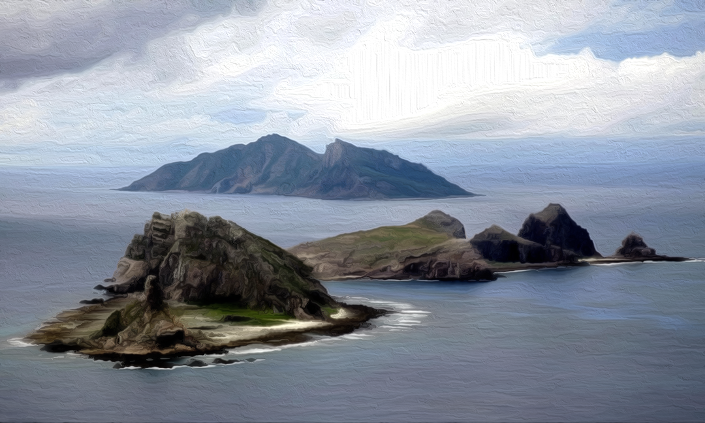
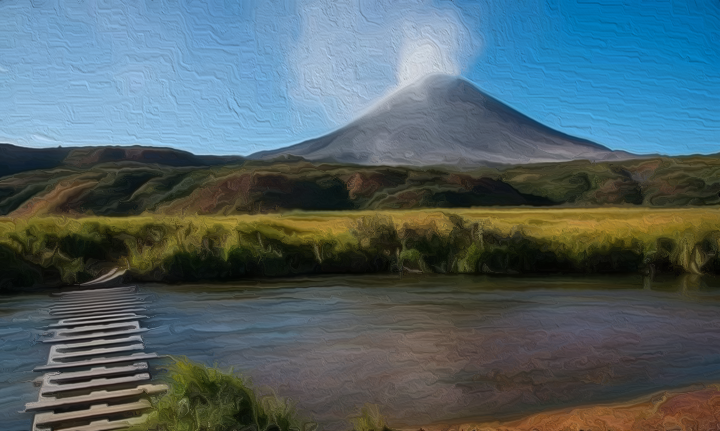
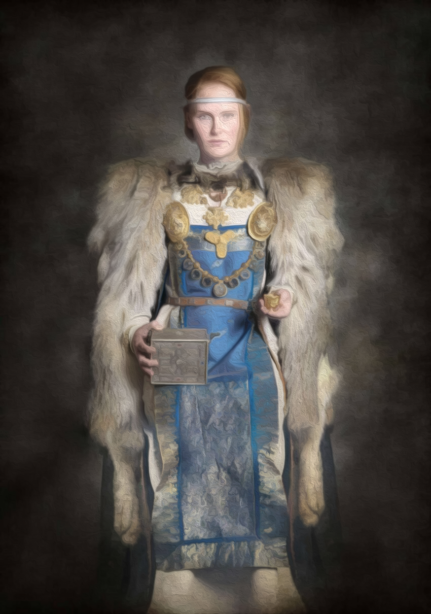
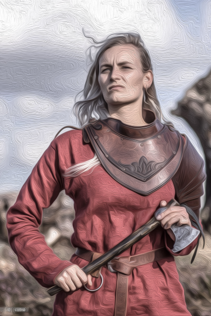
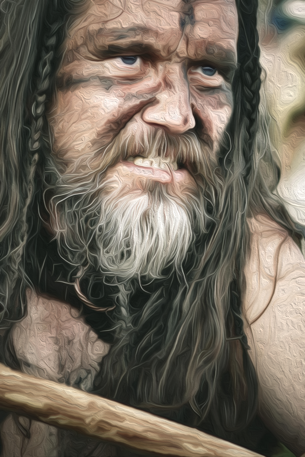
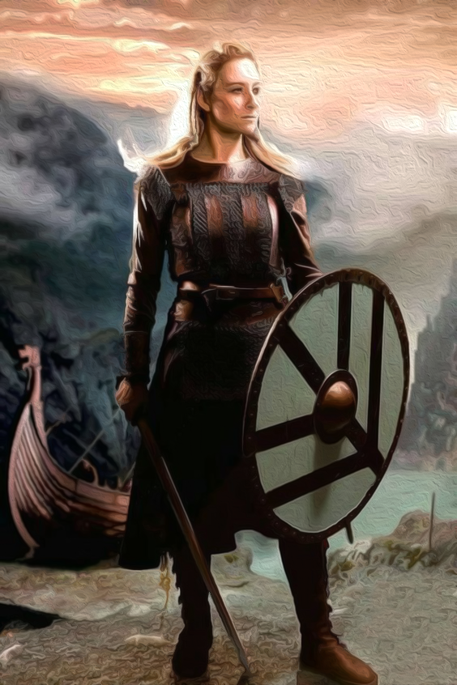
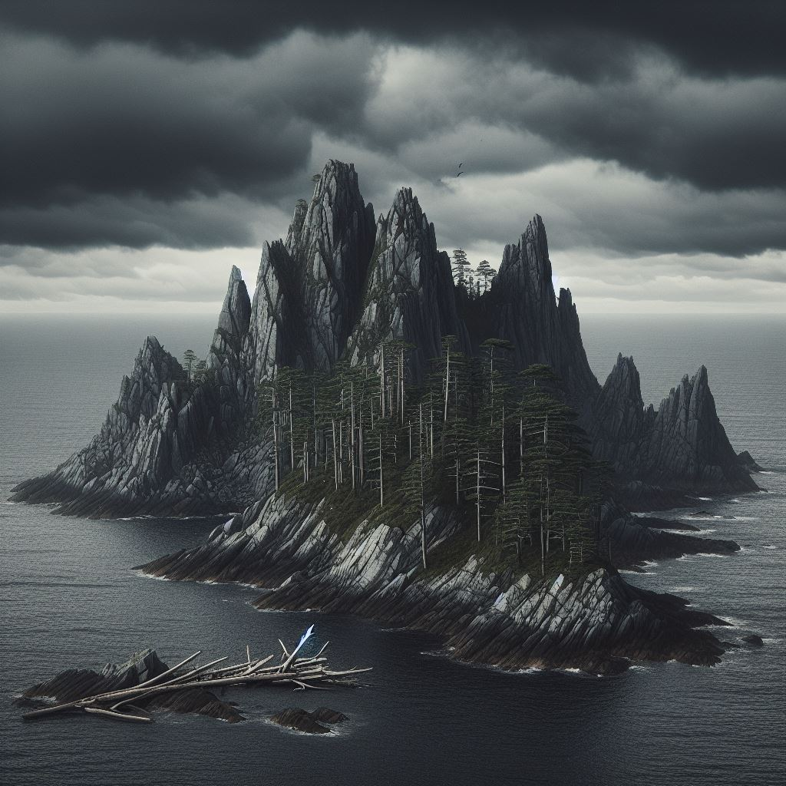

# [LOKACE a NPC] Hrázné ostrovy

## Post 650284

**Author:** Orákulum  
**Posted:** 2022-08-25T18:08:46+00:00  
**Source:** https://rpgforum.cz/forum/viewtopic.php?p=650284#p650284

Hrázné ostrovy

  * Burácející vlny a zrádné proudy
  * Rozeklané skály ukryté těsně pod hladinou
  * Sněhem pokryté útesy vystupující z moře.
  * Nízké mraky a kroutící se mlhy
  * Divoký vítr
  * Plachtící mořští ptáci
  * Rozpadající se vraky dřevěných lodí
  * Rybáři odvážně brázdící divoké moře
  * Číhající mořští nájezdníci

---

## Post 650285

**Author:** Orákulum  
**Posted:** 2022-08-25T18:09:25+00:00  
**Source:** https://rpgforum.cz/forum/viewtopic.php?p=650285#p650285

Rozcestník

**Lokace**  

  * [Hrímborg](https://rpgforum.cz/forum/viewtopic.php?p=690798#p690798)
  * [Kamenný posed](http://rpgforum.cz/forum/viewtopic.php?p=655233#p655233)
  * [Mrazoviště](https://rpgforum.cz/forum/viewtopic.php?p=655255#p655255)
  * [Ostrov Šedá řeka](https://rpgforum.cz/forum/viewtopic.php?p=650356#p650356)

**Postavy**  

  * [Basira](https://rpgforum.cz/forum/viewtopic.php?p=650356#p650356) \- Myrickova kamarádka z dětství
  * [Cadigan](https://rpgforum.cz/forum/viewtopic.php?p=650356#p650356) \- Vůdkyně Šedé řeky
  * [Haleema](https://rpgforum.cz/forum/viewtopic.php?p=650356#p650356) \- Farmář dříve se věnující salamandřím vejcím
  * [Katania](https://rpgforum.cz/forum/viewtopic.php?p=650356#p650356) \- Kapitánka Opuštěné, pirátské a žoldácké lodi
  * [Kuno](https://rpgforum.cz/forum/viewtopic.php?p=650356#p650356) \- Jeden z vůdců spiklenců v Šedé řece
  * [Yorath](https://rpgforum.cz/forum/viewtopic.php?p=650356#p650356) \- Tristanova bývalá mentorka
  * [Zora](https://rpgforum.cz/forum/viewtopic.php?p=650356#p650356) \- Vědma z Šedé řeky

---

## Post 650356

**Author:** Orákulum  
**Posted:** 2022-08-26T19:08:08+00:00  
**Source:** https://rpgforum.cz/forum/viewtopic.php?p=650356#p650356

Ostrov Šedá řeka

  * Ostrov sopečného původu se stále aktivním vulkánem.
  * Proudy lávy stékají po úbočích, popelem zbarvená řeka přivádí vodu do úrodného údolí.
  * Pobřežní vody jsou plné útesů a zrádných proudů, k cestě na ostrov a z něj je nutný velmi schopný lodivod.
  * Ostrov obývá jeden stejnojmenný Kruh, většina obyvatel se živí zemědělstvím, na Hrázných ostrovech jinak velmi vzácným.
  * Kruh je veden rodinou obchodníků, která má dominanci díky lodi třídy knarr schopné zajistit obchod ostrova s okolím.
  * Obchodníci Kruhu tají, že jejich knarr není zdaleka jediný a využívají odříznutí ostrova ve svůj prospěch.
  * Obchodníky momentálně vede smělá a vlivná žena jménem Cadigan, která má za cíl udržet status quo Šedého ostrova.

**Objevy**

  * Tento podzim se sopka otřásá nezvykle silně a proudy lávy se nebezpečně blíží vesnici; část obyvatel by byla pro neprodlenou evakuaci, ale Cadigan je proti.
  * Ukázalo se, že v Kruhu vznikla část nespokojenců, která se tajně schází u trojklanného kamene. Patří mezi ně Basira, Kuno a nově i Myrick. Snaží se svrhnout Cadigan a přinést vedení spojené s uctíváním nových bohů.
  * K ostrovu připlula Opuštěná, loď vedená kapitánkou Katanií. Přivedla je Basira, aby pomohli svrhnout Cadigan.
  * Při shromáždění na návsi došlo k otevřeným nepokojům a nesouhlasu s Cadigan. Vrazi z Opuštěné se pokusili využít situace a zneškodnit Strážce, byli ale odraženi.
  * Spiklenci zlikvidovali posádku Opuštěné.
  * Kruh se dozvěděl, že krvavé oběti uklidňují bohy sopky.
  * Vody kolem ostrova brázdí nebezpeční vodní hadi.
  * Skupinka s Myrickem, Basirou, Tristanem a Yorath ukradla Medvědici a odplula z ostrova.

**POSTAVY**

**Cadigan**

  * Smělá a vlivná obchodnice, vede obchodníky a celou Šedou řeku, snaží se zachovat status quo.
  * Při své obraně spoléhá na své bratry (Nisus).
  * Během nepokojů kvůli probuzené sopce začala ztrácet svůj vliv.

**Basira**

  * Myrickova nejlepší kamarádka z dětství. Dnes už je to dáma v letech, ale stále atraktivní. Živí se jako průvodkyně místními vodami a dělá lodivodku pro obchodníky. Proto jim vidí pod prsty a myslí si, že by byla lepší vůdkyní ostrova, než aktuální šéfová Cadigan.
  * Pozvala do Šedé řeky Katanii s Opuštěnou, aby jí pomohla svrhnout Cadigan. Byla zrazena a musela s pomocí ostatních posádku Opuštěné pobít.
  * Odplula na ukradené Medvědici z ostrova.

**Haleema**

  * Farmář, pro kterého Tristan hledal vejce salamandrů.
  * Po poslední velké erupci zasáhl nový proud lávy Haleemovu farmu a při snaze zachránit rodinné cennosti přišel v ohni jeden z jeho synů, Eleri, o život.
  * Tristan složil Železnou přísahu, že Haleemu s jeho rodinou dostane v bezpečí z Šedé řeky.
  * Má ženu Shuru a dva syny.
  * Odplul na ukradené Medvědici z ostrova.
  * U jeho synka Ravela se projevil stejný "dar", jako má Myrick.
  * Myrick přísahal Ravelovi, že mu pomůže ovládnout svou sílu.
  * Haleema zůstal se Shurou a nejmladším synem krátce v Rojřině Stesku, než vyrazili někam neznámo kam.

**Katania**

  * Kapitánka Opuštěné, pirátské a žoldácké lodi.
  * Byla Basirou pozvána do Šedé řeky, aby pomohla zasít chaos a nabourat místní vládu. Rozhodla se Basiru podrazit a získat Šedou řeku násilím pro sebe, jako bezpečný přístav.
  * Posádka byla spiklenci z Šedé řeky pobita a Opuštěná i s Katanií ztroskotala na pobřežních útesech.
  * Osud Katanie je neznámý.

**Kuno**

  * Jeden z vůdců spiklenců v Šedé řece.

**Yorath**

  * Moudrá Strážkyně ostrova Šedá řeka. Byla Tristanovou mentorkou v dobách, kdy sloužil u Strážců na ostrově. Touží po přátelství, ale krédo Strážců a pověrčivost jí to nedovolí.
  * Zapletla se do spiknutí, když zjistila o úmyslech Basiry, Myricka a ostatních. Je přesvědčená, že spiknutí byl nápad mrtvé strážkyně Sadie.
  * Pomohla spiklencům porazit vetřelce z Opuštěné, málem za to zaplatila životem. Je poznamenaná běsem _Sodden_ a na ostrově už nebude v bezpečí.
  * Odplula na ukradené Medvědici z ostrova.
  * V Rojřině Stesku pomáhala Tristanovi s hrozbou nemrtvých.

**Zora**

  * Vědma a léčitelka žijící na větrném návrší za osadou.

---

## Post 655255

**Author:** Orákulum  
**Posted:** 2022-10-26T15:45:02+00:00  
**Source:** https://rpgforum.cz/forum/viewtopic.php?p=655255#p655255

Mrazoviště  
  
TBD Obrázek

  * Kruh s obchodní stanicí
  * Samotný přístav nezamrzá, kvůli silným větrům, které nenechají hladinu klidnou a jakýkoliv vznikající led ihned roztříští. Ale ledová tříšť vrhaná větrem proti pobřeží nechává na svazích ostrova vyrůstat námrazu těch nejpodivnějších tvarů a z dálky připomíná zasněžené vřesoviště.

**Objevy**

**POSTAVY**

---

## Post 690798

**Author:** Orákulum  
**Posted:** 2024-03-12T12:43:37+00:00  
**Source:** https://rpgforum.cz/forum/viewtopic.php?p=690798#p690798

Hrímborg  

  * Pustý, neobydlený, skalnatý ostrov a s jasnou siluetou. Směrem do vnitrozemí je ostrov jedna velká hora, nebo spíše skupina zrádných skalnatých vrcholů a řídkých lesů pokroucených nízkých borovic. Jsou tu prameny s pitnou vodou, místa pro skrýše na kořist, ale stromů málo.
  * Orientační bod a místo pro přípravy nájezdů na okolní i vzdálenější osady. Zátoky a srázy skal jsou skvělé schovávačky, proto tohle místo milují nájezdníci.

**Objevy**

  * Bjorn se na ostrov vypravil zabít Skysakra, posledního bouřného obra na Ostrovech, jménem Bashtu a získat sekeru svého děda Ledový dráp
  * Bjorn [objevil](https://rpgforum.cz/forum/viewtopic.php?p=690575#p690575), že se na ostrově nachází Dainova Zapomenutá Hlubina
  * Bjorn při průzkumu jeskyní narazil na [podivné magické místo](https://rpgforum.cz/forum/viewtopic.php?p=690679#p690679) \- kus mořského dna i s vrakem lodi
  * Bjorn zabil obra Bashtu a [získal](https://rpgforum.cz/forum/viewtopic.php?p=690696#p690696) Ledový dráp

**POSTAVY**

---

## Post 701309

**Author:** Orákulum  
**Posted:** 2024-10-15T08:17:52+00:00  
**Source:** https://rpgforum.cz/forum/viewtopic.php?p=701309#p701309

Šedá zátoka

  * Široká zátoka s ostrými, ale jen zvolna stoupajícími skalami. Dole u vody se na vlnách houpou prostá dřevěná mola a kolem nich hrstka omlácených rybářských člunů. Na skalách nad přístavem je na skály nalepených několik prostých chatrčí.
  * Bydleli tu rybáři a jejich rodiny.

**Objevy**

  * Bjorn sem [připlul](https://rpgforum.cz/forum/viewtopic.php?p=698353#p698353) na své cestě do Rojřina stesku
  * Od správkyně Kruhu Amary [zjistil](https://rpgforum.cz/forum/viewtopic.php?p=698596#p698596), že nedaleko osady v prokleté Jeskyni zrady má být poklad a Kostěná horda a přísahal, že kletbu zlomí
  * Bjorna při prohledávání jeskyně [zradili](https://rpgforum.cz/forum/viewtopic.php?p=698621#p698621) Sigarrovi muži
  * Bjorn [zjistil](https://rpgforum.cz/forum/viewtopic.php?p=698628#p698628), že jeskyně je skutečně prokletá a Amara ho do ní poslala jako obětního beránka; Kostěnou hordu [zabil](https://rpgforum.cz/forum/viewtopic.php?p=699460#p699460)
  * Bjorn se rozhodl zlomit kletbu rozdělením pokladu, ale to se [nepodařilo](https://rpgforum.cz/forum/viewtopic.php?p=700043#p700043) a vesničané z ostrova i Sigarr se svými muži se navzájem [zradili](https://rpgforum.cz/forum/viewtopic.php?p=700458#p700458) a povraždili

**POSTAVY**

  * Amara - Správkyně kruhu - nejspíš mrtvá
  * [Kostěná horda](https://rpgforum.cz/forum/viewtopic.php?p=700458#p700458) z vesničanů v přístavu a osadě
