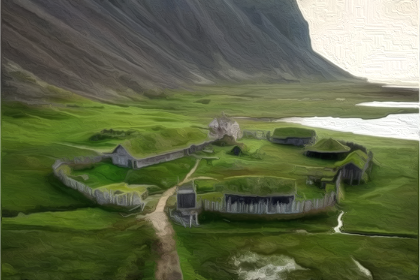
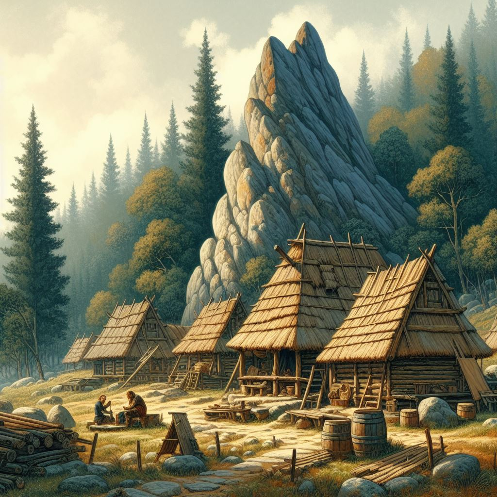
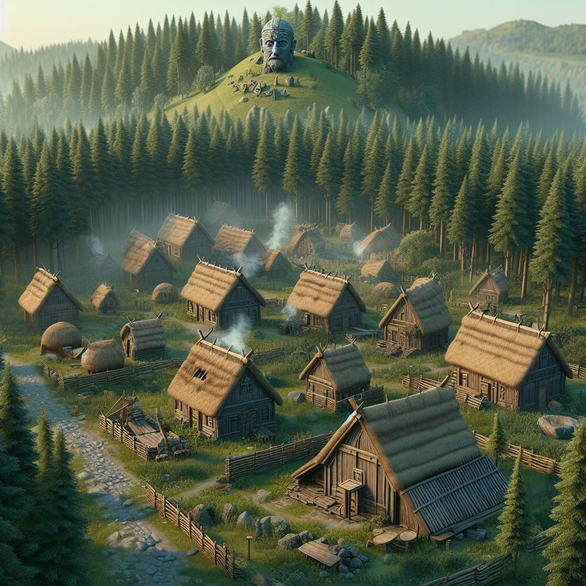
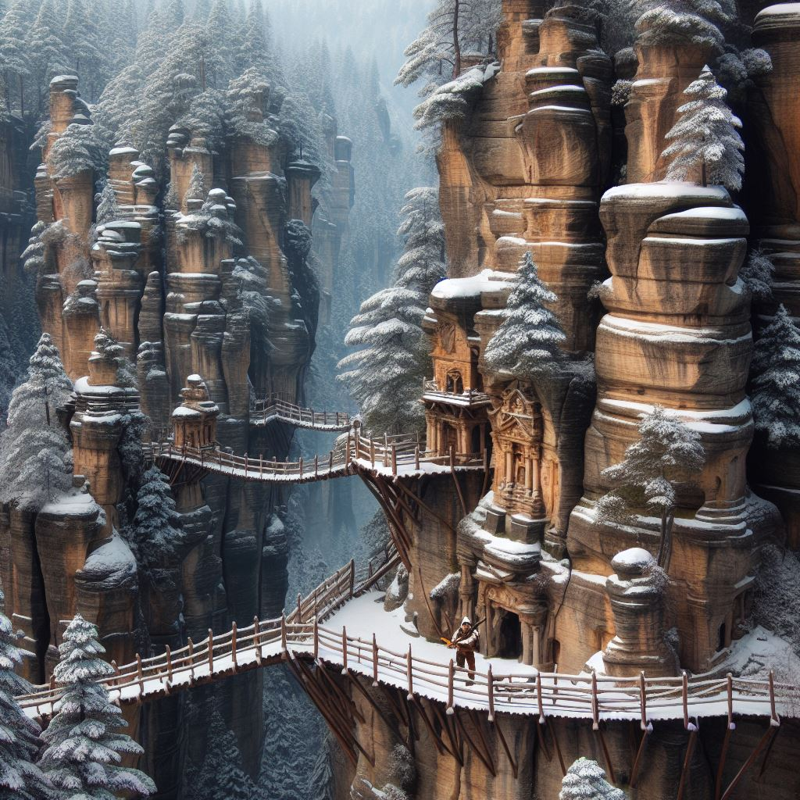

# [LOKACE a NPC] Útočiště

## Post 650871

**Author:** Orákulum  
**Posted:** 2022-09-02T11:19:23+00:00  
**Source:** https://rpgforum.cz/forum/viewtopic.php?p=650871#p650871

Útočiště  

  * Kopce a skalnaté útesy
  * Kapsy hustého lesa, zahalené do stínu.
  * Opevněné osady
  * Zelená vřesoviště
  * Široké řeky, po kterých se plaví obezřetní vodáci.
  * Dlouhé a kruté zimy

---

## Post 650873

**Author:** Orákulum  
**Posted:** 2022-09-02T11:22:06+00:00  
**Source:** https://rpgforum.cz/forum/viewtopic.php?p=650873#p650873

Rozcestník

**Lokace**  

  * [Bouřný les](https://rpgforum.cz/forum/viewtopic.php?p=679067#p679067)
  * [Jeskyně Rattle](https://rpgforum.cz/forum/viewtopic.php?p=685165#p685165)
  * [Dlouhá slatina](https://rpgforum.cz/forum/viewtopic.php?p=696895#p696895)
  * [Naděje](https://rpgforum.cz/forum/viewtopic.php?p=664586#p664586)
  * [Kamenný knot](https://rpgforum.cz/forum/viewtopic.php?p=671439#p671439)
  * [Mezník](https://rpgforum.cz/forum/viewtopic.php?p=685161#p685161)
  * [Obrův Palec](https://rpgforum.cz/forum/viewtopic.php?p=685970#p685970)
  * [Roklina hromu](https://rpgforum.cz/forum/viewtopic.php?p=671440#p671440)
  * [Pavézův Brod](https://rpgforum.cz/forum/viewtopic.php?p=671992#p671992)
  * [Pískoviště](https://rpgforum.cz/forum/viewtopic.php?p=690803#p690803)
  * [Puklina](https://rpgforum.cz/forum/viewtopic.php?p=697239#p697239)
  * [Rudý vrch](https://rpgforum.cz/forum/viewtopic.php?p=650875#p650875)
  * [Sekeromlat](https://rpgforum.cz/forum/viewtopic.php?p=689107#p689107)
  * [Šedý sráz](https://rpgforum.cz/forum/viewtopic.php?p=685160#p685160)
  * [Tábor](https://rpgforum.cz/forum/viewtopic.php?p=688056#p688056)
  * [Temná Studnice](https://rpgforum.cz/forum/viewtopic.php?p=664219#p664219)
  * [Vlčí hřbet](https://rpgforum.cz/forum/viewtopic.php?p=686261#p686261)
  * [Wulanova ztracená soutěska](https://rpgforum.cz/forum/viewtopic.php?p=690903#p690903)
  * [Zátiší](https://rpgforum.cz/forum/viewtopic.php?p=676332#p676332)

**Postavy**  

  * [Beca](https://rpgforum.cz/forum/viewtopic.php?p=664586#p664586) \- vůdkyně v Naději
  * [Cardas](https://rpgforum.cz/forum/viewtopic.php?p=697239#p697239) \- Strážce, mluvčí osadníků z Pukliny
  * [Mistr Hiršam](http://rpgforum.cz/forum/viewtopic.php?p=650875#p650875) \- Kněz, Myrickův učitel z Rudého vrchu
  * Emelyn - kněžka ze Svatyně
  * [Eos](https://rpgforum.cz/forum/viewtopic.php?p=679067#p679067) \- Myrickova dcera
  * [Gethon](Gethon) \- uprchlík z Essu
  * [Indirra](https://rpgforum.cz/forum/viewtopic.php?p=676332#p676332) \- vůdkyně Zátiší
  * [Leela](https://rpgforum.cz/forum/viewtopic.php?p=664586#p664586) \- uchazečka o vedení v Naději
  * [Khinara](https://rpgforum.cz/forum/viewtopic.php?p=664586#p664586) \- kněžka, uchazečka o vedení v Naději
  * 🪦 [Maya](https://rpgforum.cz/forum/viewtopic.php?p=676848#p676848) \- vědma žijící o samotě na hřebenu hory, která dokáže z ohně a vidět vzdálené postavy a místa; zemřela na nějakou nemoc
  * [Morell](https://rpgforum.cz/forum/viewtopic.php?p=677276#p677276) \- bylinkář a léčitel, který žije v izolaci uprostřed otráveného lesa; nemá rád Tristana
  * [Olon](https://rpgforum.cz/forum/viewtopic.php?p=676332#p676332) \- vůdce Strážců v Zátiší
  * [Saskia](http://rpgforum.cz/forum/viewtopic.php?p=650875#p650875) \- kněžka ze Svatyně na Rudém vrchu
  * [Shekhar a Vigo](https://rpgforum.cz/forum/viewtopic.php?p=671440#p671440) \- muž, kterého odvedl z vesnice duch jeho mrtvé ženy Nalii, a jeho starý slepý tchán
  * [Verena](https://rpgforum.cz/forum/viewtopic.php?p=696895#p696895) \- žena z Dlouhé slatiny, která posílá žoldáky obkreslovat runy do vymlácených červích ruin
  * [Vesna](https://rpgforum.cz/forum/viewtopic.php?p=664586#p664586) \- vůdkyně v Naději
  * [Vislak](https://rpgforum.cz/forum/viewtopic.php?p=688056#p688056) \- vůdce Následovníků Vislaka v Táboře

**Hrozby**  

  * Nedaleko [Bouřného lesa](https://rpgforum.cz/forum/viewtopic.php?p=679067#p679067) se potuloval žoldnéř-dezertér z nějaké neznámé armády
  * Skrz jižní část Útočiště táhnou trollové do války - míří na Šedý sráz (viz [hrozba v Mokřinách](https://rpgforum.cz/forum/viewtopic.php?p=676328#p676328))
  * V Šedém srázu se usadil Eric, bývalý lovec nestvůr a Tristanův přítel, teď vůdce nájezdníků, který se od trollů snažil získat mocný artefakt, který by mu vyléčil zraněnou tvář
  * **Následovníci Vislaka** \- mají za cíl zničit zhoubu Nemoci ze Starého světa a Zlomených, hledají pravdu o podstatě nemoci i Zlomených, část i s Vislakem je v táboře armády na severu Útočiště

---

## Post 650875

**Author:** Orákulum  
**Posted:** 2022-09-02T11:23:19+00:00  
**Source:** https://rpgforum.cz/forum/viewtopic.php?p=650875#p650875

Rudý vrch

TBD oprásek  

  * Hora s načervenale zbarvenými boky
  * Na vrchol vede stezka z [Bouřného lesa](https://rpgforum.cz/forum/viewtopic.php?p=679067#p679067), výstup trvá asi hodinu
  * Na vrchu leží Svatyně - místo, kde kněží udržují starou víru v chodu
  * Trojice stupňovitých teras, které tvoří Svatyni i podlouhlé dómy na nich mu pak z téhle strany dodává zvláštní punc, jako by to byl náhrdelník zdobící hruď nějakého bezhlavého hnědočerveného obra
  * Někde na hoře se nachází kameny Rattle, důležité pro trolly

**Objevy**

  * Ravel byl přijat do Svatyně do učení
  * Myrickovi byl zapovězen přístup do Svatyně
  * Tristan dostal od mistra Hiršama povolení spálit Filze na kopci
  * Hiršam dal Tristanovi úkol, aby zajistil, že se Bouřný les nezapojí do války trollů
  * Tristan na vrcholu hory objevil pradávná rituální místa a zničil tam prokletou Filzovu duši
  * Burble se na úpatích za Svatyní setkala s trollem Hrekem, který ji připravil na obřad Rattle
  * Myrick ukradl Hiršamovi ohnivou knihu
  * Myrick "unesl" ze Svatyně svou vnučku Sardu
  * Nanda nasadila knězi Nekunovi brouka do hlavy a ten se rozhodl, že Hiršam musí jako vůdce skončit, nejspíš někdy na jaře
  * Hiršam vyrazil s dalšími kněžími po Myrickových stopách

**POSTAVY**

  * Saskia - kněžka ze Svatyně
  * Emelyn - kněžka ze Svatyně
  * Fric - syn Strážce Jelmy ze [Sekeromlatu](https://rpgforum.cz/forum/viewtopic.php?p=689107#p689107); je nebezpečný a držený na drogách, aby nikomu neublížil
  * Hrek - troll žijící osamoceně na úpatích za Svatyní
  * Nekun - Hiršamův zástupce, který se po rozhovoru s Nandou rozhodl, že je na čase Hiršama odstavit od moci
  * Rami - kněz ze svatyně; Ravelův jediný přítel; ztratil se při cestě na vrchol hory, kde ho zapomněl Tristan
  * Ravel - chlapec z Šedé řeky, kterého se rozhodl Myrick dovést k ovládání ohnivé síly

**Mistr Hiršam**

  * Vůdce kněží starých bohů, spravuje Svatyni
  * Pomohl Myrickovi zkrotit neznámou sílu v něm
  * Patologocky konzervativní ohledně užívání Moci

---

## Post 664219

**Author:** Orákulum  
**Posted:** 2023-02-16T20:39:19+00:00  
**Source:** https://rpgforum.cz/forum/viewtopic.php?p=664219#p664219

Temná Studnice

  * Místo, kde žil jeden z Kruhů provádějící krvavé oběti

**Objevy**

**POSTAVY**

---

## Post 664586

**Author:** Orákulum  
**Posted:** 2023-02-22T00:49:39+00:00  
**Source:** https://rpgforum.cz/forum/viewtopic.php?p=664586#p664586

Naděje

  * Leží na severním konci Bouřlivého lesa.
  * Osada dělá čest svému jménu - nabízí šanci každému, kdo o to stojí.
  * Na kopci stojí několik desítek domů s majestátním dlouhým domem v centru. Vše je obehnáno poctivým příkopem, valem a palisádou. Již z dálky je slyšet rány kovářského kladiva a vidět kouř stoupající z komínů.

**Objevy**

  * Uprchlíci z Essu, Katja a Gethon, našli v Naději nový domov
  * Naději trápí [tajemné vraždy](https://rpgforum.cz/forum/viewtopic.php?p=666931#p666931)
  * Bjorn vraždy vyřešil - zjistil podíl vůdkyně Gwen a zabránil jejímu lynčování - spiklenci byli vyhnáni
  * Tristan dorazil v době, kdy se hledala nová vůdkyně; ze tří kandidátek vybral Tristan Becu a u toho odhalil, že zakázaná jeskyně byla znovu využívaná k temným rituálům - to zaselo vážný svár mezi rodiny Leely a Khinary
  * [Zprávy od vesničanů](https://rpgforum.cz/forum/viewtopic.php?p=681482#p681482): Beca odešla hledat nějaké staré důkazy, že Naději má vést jenom jedna žena. S těmi se teď vrátila, ale rodiny Khinary a Leely jsou už dlouho na nože a celý kruh je prakticky rozvrácený. Beca to chce řešit silou, ale Vesna ne.

**POSTAVY**

  * Vesna - Vůdkyně Kruhu; tmavovlasá a vysoká, sice stará a vrásčitá, ale upřímná, moudrá a plná života. Oblečená i učesaná skromně. Mluví sice málo, ale její hlas je jasný a zvonivý, pokaždé, když promluví, je z ní cítit charisma vůdce. Těší se velké vážnosti a jde z ní respekt.
  * Gethon - uprchlík z Essu
  * Gwen - bývalá vůdkyně Kruhu, která byla vyhnána; Tristan a Bjorn ji zabili u Karmínové věže
  * [Beca](https://rpgforum.cz/forum/viewtopic.php?p=675506#p675506) \- nová spoluvládkyně kruhu; dobrodružná válečnice, která hledá důkazy o tom, že v Naději má vládnout jen jedna žena
  * [Leela](https://rpgforum.cz/forum/viewtopic.php?p=675506#p675506) \- sestra Gwen, která se ucházela o vůdcovství
  * [Khinara](https://rpgforum.cz/forum/viewtopic.php?p=675506#p675506) \- namyšlená kněžka, která se oběťmi v zakázané jeskyni snažila získat vůdcovství

---

## Post 671439

**Author:** Orákulum  
**Posted:** 2023-05-16T12:03:57+00:00  
**Source:** https://rpgforum.cz/forum/viewtopic.php?p=671439#p671439

Kamenný knot

  * Shluk chatrčí pod špičatou skálou, podle které získala osada své jméno
  * Osada zdecimovaná harpyjemi

**Objevy**

  * Bjorn s Myrickem harpyje zlikvidovali a krátce se zdrželi ve zbytcích osady s přeživšími
  * Tristan při průchodu během zimní cesty [zjistil](https://rpgforum.cz/forum/viewtopic.php?p=689873#p689873), že jsou všichni mrtví. Nalezl těla v různém stádiu rozkladu, ale všechna měla společné jedno: Ležela v postelích, na kožešinách či slamnících. Buď je zabila nemoc, nebo otrava. Kamenný Knot je tísnivou hrobkou, kde je jen mráz a smrt.

**POSTAVY**

  * Keelan - jeden z vesničanů - mrtvý jako všichni ostatní

---

## Post 671440

**Author:** Orákulum  
**Posted:** 2023-05-16T12:08:25+00:00  
**Source:** https://rpgforum.cz/forum/viewtopic.php?p=671440#p671440

Roklina hromu

  * Život je zde jednoduchý a těžký, ale pro místní komunitu jistým způsobem naplňující. Muži jsou nemluvní a silní, ženy vytrvalé a tak říkajíc od rány. Většinu roku kácejí staré stromy na okraji Hlubočiny, aby jejich kvalitní dřevo prodávali karavanám, které se tu jednou za čas zastaví.
  * Bouře se vždy z nějakého důvodu drží nad roklinou a pak se rozbijí o hradbu stromů na jihozápad. Někdy je z toho požár.

**Objevy**

  * Bjorn zbavil osadu kletby, kterou na ně seslal druid v podobě smečky monstrózních vlků
  * Tristan našel ztraceného Shekhara, který se snažil přivést k životu svou zesnulou ženu
  * Bjorn a Tristan se tu stavili cestou do Karmínové věže a strávili tu příjemné chvíle
  * [Tristan se tu zastavil](https://rpgforum.cz/forum/viewtopic.php?p=689727#p689727) na začátku zimy cestou na východ

**POSTAVY**

  * Kova - jeden z dřevorubců
  * Shekhar a Vigo - muž, kterého odvedl z vesnice duch jeho mrtvé ženy Nalii, a jeho starý slepý tchán

---

## Post 671992

**Author:** Orákulum  
**Posted:** 2023-05-24T10:27:02+00:00  
**Source:** https://rpgforum.cz/forum/viewtopic.php?p=671992#p671992

Pavézův Brod

  * Kruh, který zavrhl víru v bohy.
  * Ostatní se ho straní.

**Objevy**

  * Tristan nenašel v osadě útočiště a byl vyhnán. Chtěl svou hodnotu prokázat železnou přísahou a likvidací čarodějníka, ale zasáhli elfové a Tristan bez vysvětlení a naplnění přísahy odešel.
  * Tristan s Bjornem se zde krátce zdrželi při cestě na sever; Tristan zjistil, že jeho přísahu už místní neřeší, ale čarodějník mu přísahal pomstu a nechal mu nějaké nástrahy v okolních lesích

**POSTAVY**

  * Bezejmenná potetovaná žena, která se vyzná v magii.
  * Čarodějník, který se usadil na kopci za vesnicí a unáší nepozorné vesničany. Je chráněncem elfů, kteří nedaleko hlídají hranice svého území.

---

## Post 676332

**Author:** Orákulum  
**Posted:** 2023-07-15T17:02:06+00:00  
**Source:** https://rpgforum.cz/forum/viewtopic.php?p=676332#p676332

Zátiší

  * Zátiší leží v údolí sevřeném kopci a divokým lesem. Nahoře na hřebenu nerostou žádné stromy a níž po svazích jsou všechny vychýlené; kvůli silným větrům tady rostou zvláštně zešikma.
  * Osadu kryje vysoká palisáda a jednoduché věže na úbočích údolí.
  * Kruh vede umělec, který vyhraje každoroční sochařskou soutěž.

**V lese nedaleko osady leží[Červí ruiny](https://rpgforum.cz/forum/viewtopic.php?p=675954#p675954)**

  * Ruiny jsou spletenec zapadlých chodeb a místností; žili tu červi se svou královnou, kterou Tristan zabil, masožravý břečťan a přízraky těch, kteří to tu před dávnými věky vybudovali (ti měli k červí královně pozitivní vztah a chránili ji)
  * Kdysi v ruinách někdo choval červy a další netvory
  * Nápovědou k rozložení ruin je [místnost se sochami](https://rpgforum.cz/forum/viewtopic.php?p=676372#p676372) těch, kteří zde žili
  * V podzemních tunelech číhá na kořist z povrchu [masožravý břečťan](https://rpgforum.cz/forum/viewtopic.php?p=676384#p676384) na zvláštním místě z kostí - možná ho tam někdo nastražil úmyslně,
  * V ruinách je [oltář](https://rpgforum.cz/forum/viewtopic.php?p=676431#p676431) zasvěcený kdoví komu a [chrám zapomenutých bohů](https://rpgforum.cz/forum/viewtopic.php?p=676791#p676791) se zvláštně zkamenělými Zlomenými a oltářem, možná Prastarého
  * Pod složitými [schody](https://rpgforum.cz/forum/viewtopic.php?p=676527#p676527) s mechanismy a řetězy je [prostor plný starých strojů](https://rpgforum.cz/forum/viewtopic.php?p=676558#p676558) a mechanismů bez jasného určení; tady leží mrtvá červí královna
  * Úplně na dně je rozsáhlý [archiv](https://rpgforum.cz/forum/viewtopic.php?p=676566#p676566) s kamennými deskami popsanými starými runami
  * Do ruin [chodí](https://rpgforum.cz/forum/viewtopic.php?p=696841#p696841) námezdní Strážci, kteří tu pro ženu Verenu z Dlouhé slatiny obkreslují runy

**Objevy**

  * Kruh trápí červi, kteří sem lezou z ruin v lese a ohrožují osadu; Tristan přísahal červy zastavit.
  * Tristan zabil červí královnu, ale při výpravě do ruin zemřeli i dva vesničané.
  * Tristan navázal pouto s Kruhem a Indirra se rozhodla vytvořit sochu oslavující ty, kteří bojovali s červy.
  * Katja a Masias se usídlili v Zátiší, přinejmenším přes zimu.
  * Tristan s Myrickem [přišli](https://rpgforum.cz/forum/viewtopic.php?p=694930#p694930) do Zátiší hledat pomoct pro nakaženou Sardu zrovna ve chvíli, kdy osadě hrozil bezprostřední útok [Varou](https://rpgforum.cz/forum/viewtopic.php?p=695035#p695035)
  * Tristan se Strážci [zničil](https://rpgforum.cz/forum/viewtopic.php?p=696508#p696508) malou skupinu varou, která se snažila získat kolem Zátiší nové území
  * Myrick v lese nedaleko [narazil](https://rpgforum.cz/forum/viewtopic.php?p=696841#p696841) na žoldáky, kteří pro ženu Verenu z Dlouhé slatiny obkreslují runy ve vymlácených červích ruinách
  * Katja pomohla Myrickovi s léčbou Sardy, ale její rodiče Eos a Flint se rozhodli s ní přes zimu tady zůstat

**POSTAVY**

  * Indirra - vůdkyně kruhu, talentovaná umělkyně
  * Dívka, která se vydala s Tristanem do ruin
  * Eos, Flint a Sarda - Myrickova [rodina](https://rpgforum.cz/forum/viewtopic.php?p=696848#p696848), která tu hledá útočiště do jara, než se vrátí do [Bouřného lesa](https://rpgforum.cz/forum/viewtopic.php?p=679067#p679067)
  * Katja a Masias - uprchlice z Essu a Bjornovo překvapení
  * Olon - hlavní Strážce Kruhu, má slabost pro Indirru

---

## Post 679067

**Author:** Orákulum  
**Posted:** 2023-08-23T13:26:39+00:00  
**Source:** https://rpgforum.cz/forum/viewtopic.php?p=679067#p679067

Bouřný les

  * Osada na konci údolí, přímo pod [Rudým vrchem](https://rpgforum.cz/forum/viewtopic.php?p=650875#p650875)
  * Jediná větší osada v téhle odlehlé části útočiště a právě proto se k ní sbíhají cesty a pěšiny ze všech samot v okolí
  * Z vrchního konce vesnice vzhůru k vrcholu hory se vine kamením vysypaná stezka

**Objevy**

  * Myrick si obnovil svůj bývalý dům
  * Bjorn se spřátelil s místními
  * Srub na kraji osady přepadl jakýsi osamělý žoldnéř - dezertér; zabil muže Ketilla a okradl jeho ženu a dítě; Bjorn přísahal, že ho dopadne a našel ho i zabil
  * Tristan přišel do Bouřného lesa s Nandou a mrtvým Filzem; během promluvy Filzovým duchem Myrick zjistil, že Filze proklel Prastarý a jeho duše začala ohrožovat osadu; podařilo se jí polapit, ale je potřeba ji ještě zničit
  * Tristan zničil Filzovu duši na Rudém vrchu
  * Filzovo posedlé tělo leží ve skalách pod útesem a Myrick přísahal ho zničit
  * Tristan Kruh informoval o Prastarém a Karmínové věži, načež několik lidí, včetně Myrickovy dcery Eos, z Bouřného lesa odešlo
  * Tristan se otevřeně [postavil](https://rpgforum.cz/forum/viewtopic.php?p=681192#p681192) Hiršamovi a kněžím z Rudého vrchu - Kruh v Bouřném lese [se semknul](https://rpgforum.cz/forum/viewtopic.php?p=681215#p681215) před nastávající zimou
  * Bjorn zjistil, že Jóra je čarodějnice a přísahal, že jí pomůže uchránit se před zlobou Ketillovy rodiny
  * Myrick s Tristanem [zničili](https://rpgforum.cz/forum/viewtopic.php?p=690358#p690358) Filzovo tělo posedlé Poděsem; vesničané si myslí, že zabili ledraka a mají je za hrdiny
  * Tristan [neobstál](https://rpgforum.cz/forum/viewtopic.php?p=690441#p690441) v hodnocení jeho činů v Bouřném lese

**POSTAVY**

  * Aedon - osadník a křivopřísežník, odešel s Eos do Karmínové věže
  * Eos - Myrickova dcera - poslechla volání Prastarého a odešla do [Karmínové věže](https://rpgforum.cz/forum/viewtopic.php?p=664218#p664218)
  * Jóra, vdova po Ketillovi; [čarodějnice](https://rpgforum.cz/forum/viewtopic.php?p=681212#p681212), která ve sklepě čerpá skrz hmyz sílu přírody a obává se kvůli svému synovi pomsty Ketillovy rodiny; Bjorn přísahal, že jí pomůže
  * Ketill - osadník, kterého zavraždil žoldák a pomstil Bjorn
  * Nanda - kněžka přísahy, slepá ale vidoucí; kněží z Rudého vrchu ji nemají rádi; přísahala zničit Filzovu duši; [odešla](https://rpgforum.cz/forum/viewtopic.php?p=681180#p681180) do Wulanovy ztracené soutěsky
  * Padma - léčitelka

---

## Post 685160

**Author:** Orákulum  
**Posted:** 2023-12-11T11:08:45+00:00  
**Source:** https://rpgforum.cz/forum/viewtopic.php?p=685160#p685160

Šedý sráz

  * Osada na úpatí dlouhého srázu pokrytého šedými kameny a štěrkem
  * Usadil se tu Eric, nájezdník, který se dostal do sporu s trolly, se svou malou armádou jezdců
  * Kvůli Ericovi trollové zaútočili na Šedý sráz

**Objevy**

  * Bjorn [konfrontoval](https://rpgforum.cz/forum/viewtopic.php?p=680899#p680899) Erica s důkazy o vraždě dezertéra v Bouřném lese a přesvědčil ho, aby si svoje lidi držel pod kontrolou

**POSTAVY**

  * Eric, bývalý lovec nestvůr a Tristanův přítel, teď vůdce nájezdníků, který se od trollů snažil získat mocný artefakt, který by mu vyléčil zraněnou tvář; rusovlasý, nosí masku

---

## Post 685161

**Author:** Orákulum  
**Posted:** 2023-12-11T11:12:56+00:00  
**Source:** https://rpgforum.cz/forum/viewtopic.php?p=685161#p685161

Mezník

  * Osada chráněná palisádou, do které kvůli obavám z nemoci nepouští cizince

**Objevy**

  * V osadě mají jeden případ vážné podivné nemoci, která nějak souvisí s problémy s obry a Zlomenými
  * Bjorn navštívil Ketillovy rodiče a bratra a při tom zjistil, že jeho žena Jóra je čarodějnice a drží nad Ketillovým bratrem nějakou kouzelnou moc

**POSTAVY**

  * Torgan - vůdce Kruhu
  * Rodiče Ketilla, zavražděného muže z [Bouřného lesa](https://rpgforum.cz/forum/viewtopic.php?p=679067#p679067)a Ketillův bratr

---

## Post 685165

**Author:** Orákulum  
**Posted:** 2023-12-11T11:39:03+00:00  
**Source:** https://rpgforum.cz/forum/viewtopic.php?p=685165#p685165

Jeskyně Rattle

  * Divoká jeskyně, ve které mají "žít" kameny Rattle, které hledá trollice Burble
  * Jeden vchod je na západě kopců, ale vede k ledovému obrovi a krysám; hlavní vchod je uprostřed mrtvého údolí a jeden další by mohl být na východě u moře

**Objevy**

  * Myrick v jeskyni narazil na mráz, ledové pasti, hladové krysy a ledového obra
  * Ledový obr Myricka zajal a snažil se ho chránit před nemocí, kterou trpí; Myrick utekl

**POSTAVY**

  * Ledový obr
  * Burble - trollice, která sem s Myrickem přišla hledat kameny Rattle a ztratila se mu; poté s Myrickem dále cestovala až do Wulanovy ztracené soutěsky, kde vyvrcholila její nenávist k lidem, Myricka [zradila](https://rpgforum.cz/forum/viewtopic.php?p=692873#p692873) a odcestovala zpět sem, aby se nakazila Nemocí a stala se Zlomenou

---

## Post 685970

**Author:** Orákulum  
**Posted:** 2023-12-28T18:21:18+00:00  
**Source:** https://rpgforum.cz/forum/viewtopic.php?p=685970#p685970

Obrův Palec  

  * Osada nedaleko rozbité obří sochy; správně se jmenuje Skalisko, Skalní Věž, nebo tak nějak

**Objevy**

  * Před zimou vždy z hor schází jejích vědma, stará a zkušená léčitelka, aby tu přes zimu přebývala a pomáhala s léčením neduhů; první sníh napadl už před týdnem, ale ona nikde. Ani v zimě se vědma nevrátila.
  * Kruh má [problém s nasraným duchem](https://rpgforum.cz/forum/viewtopic.php?p=689888#p689888), který posedává a zabíjí. Tristan slíbil (nepřísahal), že se vrátí a podívá tomu na zoubek.
  * Myrick s Tristanem cestou do osady narazili v lese na běsa a dokázali ho nadobro [zahnat](https://rpgforum.cz/forum/viewtopic.php?p=690638#p690638).
  * Tristan a Myrick si vytvořili s Kruhem pouto, když Tristan [přísahal](https://rpgforum.cz/forum/viewtopic.php?p=690745#p690745) vystopovat zahnaného běsa a zlikvidovat ho nadobro.

**POSTAVY**

---

## Post 686261

**Author:** Orákulum  
**Posted:** 2024-01-03T09:29:45+00:00  
**Source:** https://rpgforum.cz/forum/viewtopic.php?p=686261#p686261

Vlčí hřbet

  * Bohatá vesnice, ve které žijí vedle sebe rybáři a horalové.
  * Osada není přímo na břehu, ale sedí na konci úzkého pruhu skal, postavená na dřevěných lávkách a trupech starých lodí.
  * Přístav plný lodí.

**Objevy**

  * Myrick nešťastnou náhodou [spálil](https://rpgforum.cz/forum/viewtopic.php?p=684999#p684999) srub se zásobami v kopcích nad osadou.
  * Myrick zde strávil odpočinkem dva týdny a odešel, když se [přiblížili](https://rpgforum.cz/forum/viewtopic.php?p=686014#p686014) mnichové z Rudého vrchu, kteří jeho a Sardu hledají.
  * Myrick zjistil, že Kruh má problematické vztahy s osadou [Sekeromlat](https://rpgforum.cz/forum/viewtopic.php?p=689107#p689107) na pobřeží severně a dostal za úkol zjistit, co se přesně děje
  * Myrick [zjistil](https://rpgforum.cz/forum/viewtopic.php?p=688835#p688835), že vztahy jsou napjaté kvůli dávné křivdě a podařilo se mu strážkyni Leelu dotlačit k tomu, aby spor urovnala
  * Myrick také Leele [přiznal](https://rpgforum.cz/forum/viewtopic.php?p=689369#p689369), že omylem zapálil srub v kopcích a zaplatil Leele za to
  * Leela Myrickovi [vysvětlila](https://rpgforum.cz/forum/viewtopic.php?p=689267#p689267), že má Vlčí hřbet problémy s trolly z Mokřin a snaží se před nimi chránit své území

**POSTAVY**

  * Strážkyně Leela
  * Lovec Šekhar
  * Námořník Will

---

## Post 688056

**Author:** Orákulum  
**Posted:** 2024-01-31T10:35:24+00:00  
**Source:** https://rpgforum.cz/forum/viewtopic.php?p=688056#p688056

Tábor

  * Tábořiště "armády ze severu"
  * Chaotický a nepříliš organizovaný tábor obehnaný palisádou, ale se stany i v okolních lesících
  * Tábor hlídají stráže; někteří strážní i lidé v Táboře nosí na rukách jemné železné řetízky, které nemohou odložit
  * V Táboře sídlí především členové armády ze severu; v menším počtu potom i uctívači Prastarého (včetně nějakých uprchlíků z Karmínové věže) a ve stejně malém počtu Následovníci Vislaka

**Objevy**

  * Bjorn a Tristan sem přišli najít unesené ženy rybářů z Bílé vody; vydávali se za žoldnéře
  * Následovníci Vislaka chtějí Nemoc vymýtit a věří, že tajemství léku spočívá ve Zlomených
  * Armáda využívá Následovníky Vislaka k tomu, aby s jejich lékem nebo protiopatřením nechytli nemoc od obrů
  * Nějaké "doupě" Zlomených je nedaleko tábora a Vislak tam hodlá pátrat po dalších stopách
  * Bjorn s Tristanem [ukradli](https://rpgforum.cz/forum/viewtopic.php?p=688484#p688484) otrokářům dvě otrokyně - ženy rybářů z [Bílé vody](https://rpgforum.cz/forum/viewtopic.php?p=685973#p685973)
  * Tristan se mezi jezdci z armády střetl se svým starým přítelem Ericem; porazil ho v souboji, vzal si od něj koně a zjistil, že jejich přátelství je ztracené
  * Eric Tristanovi prozradil, že armáda má v plánu střetnout se i s Měsíčním medvědem

**POSTAVY**

  * Vislak - vůdce Následovníků Vislaka; starý ramenatý zachmuřený muž, oblečený v kůžích a viditelně zvyklý, že ho ostatní poslouchají
  * 🪦 Tajemná stará žena Otani - dokáže procházet stíny a chce, aby Bjorn s Tristanem věděli, že je sleduje; objevila se ve [Wulanově soutěsce](https://rpgforum.cz/forum/viewtopic.php?p=690903#p690903), kde i zemřela
  * Torgan - otrokář, kterého Bjorn porazil v souboji a pak se s ním ožral

---

## Post 689107

**Author:** Orákulum  
**Posted:** 2024-02-16T08:52:20+00:00  
**Source:** https://rpgforum.cz/forum/viewtopic.php?p=689107#p689107

Sekeromlat

  * Kruh na východním pobřeží
  * Dříve obchodovali s Vlčím hřbetem, ale něco obchod přerušilo
  * Kruh [ovlivňoval skrz intriky](https://rpgforum.cz/forum/viewtopic.php?p=688489#p688489) Hiršam z Rudého vrchu

**Objevy**

  * Myrick připlul se Sardou a Willem z Vlčího hřbetu a byl zajat Strážcem Jelmou
  * Myrick vyjevil Jelmovi pravdu a ten ho propustil a omluvil se
  * Jelma přiznal, že dříve zajal i Burble a drží ji na lodi nedaleko od Kruhu; Myrick ji po dohodě s Jelmou propustil
  * Myrick [zjistil](https://rpgforum.cz/forum/viewtopic.php?p=688835#p688835), že obchod mezi Sekeromlatem a Vlčím hřbetem nefunguje kvůli dávné křivdě a uražené ješitnosti

**POSTAVY**

  * Strážce Jelma; je zavázán Hiršamovi za to, že odvedl a stará se o jeho syna Frice, u kterého se objevila nekontrolovaná ohnivá kouzla
  * Okoth - vesničan; hlídal Myricka a stěžoval si na nové pořádky v Kruhu
  * Servan - bylinkář, žije severozápadně od Kruhu, dodává Hiršamovi bylinky a ví o Fricovi

---

## Post 690803

**Author:** Orákulum  
**Posted:** 2024-03-12T13:30:13+00:00  
**Source:** https://rpgforum.cz/forum/viewtopic.php?p=690803#p690803

Pískoviště  

  * Pískovcové skalní věže mezi zasněženými borovicemi. Věže jsou už z dálky viditelně propojené tlustými lany a dole u země vyčuhují kůly vysoké palisády.
  * Bludiště lávek, provazových mostů a žebříků.

**Objevy**

  * Myrick a Tristan se tu [zastavili](https://rpgforum.cz/forum/viewtopic.php?p=690745#p690745) cestou do Wulanovy ztracené soutěsky.
  * Místní zajali elfa, který se jim bez pozvání potuloval po lese; nejí a nespí a Myrick s Tristanem se pokusili situaci vyřešit.
  * Tristan od zajatého elfa [zjistil](https://rpgforum.cz/forum/viewtopic.php?p=690811#p690811), že pátrá po Wulanově ztracené soutěsce a zabloudil; rozhodl se ho vzít si na starost a odvést z Pískoviště pryč.

**POSTAVY**

  * Miro - hlídač, vůdce
  * Mascha - strážkyně

---

## Post 690903

**Author:** Orákulum  
**Posted:** 2024-03-14T15:21:47+00:00  
**Source:** https://rpgforum.cz/forum/viewtopic.php?p=690903#p690903

Wulanova ztracená soutěska

  * Horský průsmyk, úzkou spáru ve skalách. V nějaké širší střední části se soutěska rozevírá do míst, kde jsou pozůstatky elfího lesa, zavalené po zemětřesení a prolezlé Zlomenými a kdoví čím dalším.
  * Wulan, elfí šaman z Hlubočiny, se tu kdysi dávno snažil vypěstovat elfí hvozd; jeho práci ale zničilo zemětřesení a sesuv půdy a skal.
  * Stahují se tu Zlomení a není jasné, jestli to bylo už ve Wulanových dobách, nebo až po katastrofě.

**Objevy**

  * Filze tady posedl Prastarý; Filzova tělo bylo pohřbeno a duše [vypuštěna](https://rpgforum.cz/forum/viewtopic.php?p=679581#p679581), zůstala tu ale čepel, kterou tu Filz našel a nechal, a zůstala s ním spoutaná část jeho duše.
  * Nanda přísahala, že Filzovu zbraň najde a očistí.
  * V Pískovišti Tristan a Myrick [narazili na elfa](https://rpgforum.cz/forum/viewtopic.php?p=690811#p690811) Ukamese, který se do soutěsky vydal vyrobit nástroj k oslabení vůle Zlomených.
  * Myrick a Tristan se na začátku soutěsky [setkali](https://rpgforum.cz/forum/viewtopic.php?p=691257#p691257) s Otani, elfkou, která pátrá po léku na Nemoc a tajemství Zlomených
  * Myrick a Tristan [zachránili](https://rpgforum.cz/forum/viewtopic.php?p=691756#p691756) medvěda před Zlomenými a získali tím přízeň divokých zvířat
  * Myrick a Tristan [objevili](https://rpgforum.cz/forum/viewtopic.php?p=691844#p691844) bývalou Wulanovu věž a pole mrtvých, kde [narazili](https://rpgforum.cz/forum/viewtopic.php?p=692246#p692246) na Nandu
  * Myrick a Tristan [zjistili](https://rpgforum.cz/forum/viewtopic.php?p=692246#p692246), že Zlomení přemýšlí kolektivně jako mravenci, sbírají železné meče a snaží se s jejich pomocí zvrátit své Zlomení
  * Myrick a Tristan [objevili](https://rpgforum.cz/forum/viewtopic.php?p=692246#p692246) tábor Zlomených a mohylu s ostatky Wulana a jeho magie; z tábora osvobodili Eos a jejího muže Flinta a [ztratili](https://rpgforum.cz/forum/viewtopic.php?p=692873#p692873) Burble
  * Tristan z mohyly odnesl část Wulana a [zjištění](https://rpgforum.cz/forum/viewtopic.php?p=693011#p693011), že Nemoc ze Starého světa přetvořila tajemná Wulanova květina, která roste z černého železa
  * Na cestě z Wulanovy soutěsky Tristan v sebeobraně [zabil](https://rpgforum.cz/forum/viewtopic.php?p=693871#p693871) Otani, i když asi nemusel

**POSTAVY**

  * 🪦 Otani - Elfka stvořená z nakaženého těla - trochu člověk, trochu elf, trochu bytost stínů. Hledá lék na Nemoc v odhalení Wulanovy magie, která to způsobila. Věří, že nemocné (lidi, obry a vůbec) je možné vyléčit pouze "Zlomením". Je mrtvá.
  * Nanda - Kněžka Přísahy, která tu přísahala najít a očistit Filzovu zbraň; čeká, až Zlomení dokončí své aktivity s meči a pak Filzovu zbraň získá a očistí.

---

## Post 696895

**Author:** Orákulum  
**Posted:** 2024-06-27T09:52:31+00:00  
**Source:** https://rpgforum.cz/forum/viewtopic.php?p=696895#p696895

Dlouhá slatina

  * Osada nedaleko [Zátiší](https://rpgforum.cz/forum/viewtopic.php?p=676332#p676332)

**Objevy**

  * Myrick v lese nedaleko [Zátiší](https://rpgforum.cz/forum/viewtopic.php?p=676332#p676332) [narazil](https://rpgforum.cz/forum/viewtopic.php?p=696841#p696841) na žoldáky, kteří pro ženu Verenu z Dlouhé slatiny obkreslují runy ve vymlácených [červích ruinách](https://rpgforum.cz/forum/viewtopic.php?p=676332#p676332)(a nechce, aby o tom věděl vůdce Strážců Olon ze Zátiší)

**POSTAVY**

  * Verena - Žena, která posílá žoldáky obkreslovat runy do červích ruin
  * Mai a Kova - žoldáci, kteří pracují pro Verenu

---

## Post 697239

**Author:** Orákulum  
**Posted:** 2024-07-09T09:16:03+00:00  
**Source:** https://rpgforum.cz/forum/viewtopic.php?p=697239#p697239

Puklina

  * Osada na rozlehlé mýtině ohrazené jednoduchou palisádou a zastavěné spletí jednoduchých chatrčí a stanů. Hoří tu několik ohňů a hledí na nás ještě víc unavených očí. Lidi jsou strhaní a opatrní. Za mýtinou je ve vysoké skále široká puklina, v ní žijí další lidé.
  * Podle tradice Kruhu žijí ti, co mají zásluhy, v přívětivém náručí skály. Ti, kteří si místo musí zasloužit, žijí venku před puklinou a pracují.

**Objevy**

  * Tristan s Myrickem [zjistili](https://rpgforum.cz/forum/viewtopic.php?p=696981#p696981), že osadu ohrožuje nějaká bestie, která nedovolí lidem lovit.
  * Myrick [zjistil](https://rpgforum.cz/forum/viewtopic.php?p=697037#p697037), že osadníci odnesli část bestie k sobě do Pukliny a [přesvědčil](https://rpgforum.cz/forum/viewtopic.php?p=697067#p697067) je, aby to vrátili a bestii tím uklidnili.

**POSTAVY**

  * Cardas - Strážce a mluvčí osadníků
