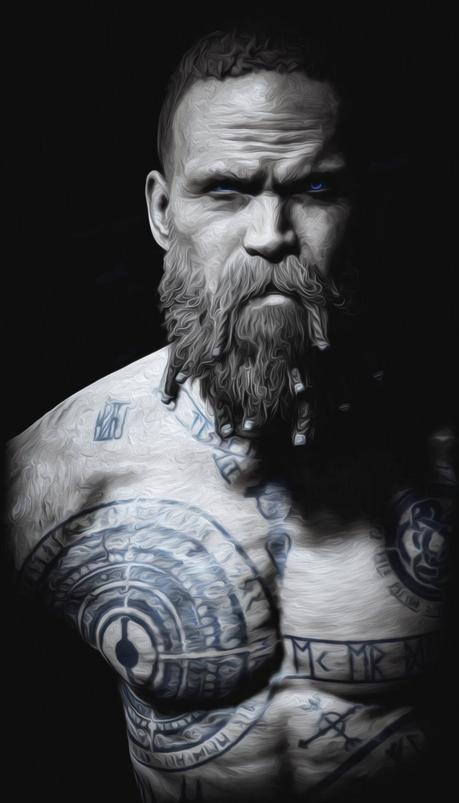

# [POSTAVA] Tristan Baldurson

## Post 651144

**Author:** Tristan Baldurson  
**Posted:** 2022-09-05T19:13:35+00:00  
**Source:** https://rpgforum.cz/forum/viewtopic.php?p=651144#p651144

[POSTAVA](https://rpgforum.cz/forum/viewtopic.php?p=651144#p651144) [PŘEDNOSTI](https://rpgforum.cz/forum/viewtopic.php?p=652344#p652344) [PŘÍSAHY](https://rpgforum.cz/forum/viewtopic.php?p=652345#p652345) [POUTA](https://rpgforum.cz/forum/viewtopic.php?p=652346#p652346) [CESTY](https://rpgforum.cz/forum/viewtopic.php?p=652347#p652347) [PŘÍBĚH](https://rpgforum.cz/forum/viewtopic.php?p=652348#p652348)

**VLASTNOSTI**  
  
🎯 OSTŘÍ **+1** (+1 🧸)  
_Rychlost, mrštnost a šikovnost v boji na dálku_  
❤️ SRDCE **+2**  
_Odvaha, síla vůle, empatie, socializace, loajalita_  
🦾 ŽELEZO **+3**  
_Fyzická síla, odolnost, agresivita, šikovnost v boji na blízko_  
👤 STÍN **+1**  
_Zákeřnost, lstivost a prohnanost_  
🔎 ROZUM **+2**  
_Odborné znalosti, vědomosti a pozorování_  
  
**DOČASNÁ VYLEPŠENÍ**  
😱 +2🎲 a +1📈 při trefě při _Secure an Advantage_ nebo _Compel_ pomocí strachu nebo výhružek  
😱 +1🎲 na _Strike_ , _Clash_ nebo _Battle_  
📿  
  
**ZDROJE**  
  
🩸 ZDRAVÍ  🩸  
🧠 VŮLE 🧠🧠🧠  
📦 ZÁSOBY 📦📦  
  
📈 HYBNOST **1**  
Maximum 10  
Obnova 2  
  
**POSTIHY**  
  
  
**VYBAVENÍ**  
  
🎒 Vybavení lovce nestvůr  
⚔️ Elfí kopí  
🦌 [Jelení kůže](https://rpgforum.cz/forum/viewtopic.php?p=663379#p663379)  
🐺 Vlčí kůže od [šelmy](https://rpgforum.cz/forum/viewtopic.php?p=673847#p673847), kterou zabila Yorath u Essu  
🐺 Vlčí kůže od Bjorna  
🦁 Kůže horského lva (❤️)  
⛷️ Sněžnicolyže  
🪦 [Kamenná deska](https://rpgforum.cz/forum/viewtopic.php?p=689878#p689878) s pozicí Wualnovy ztracené soutěsky  
📔 [Úmluvy](https://rpgforum.cz/forum/viewtopic.php?p=698288#p698288) mezi Železným lidem a obry v Údolí kleče  
🐍 Kus kůže mořského hada  
  
🤦‍♂️ **Selhání**  
_🌒 action roll, 🌓 progress roll_  
  
🌕🌕🌕🌕🌕🌕🌕🌘🌑🌑  
  
⭐ **Zkušenosti**

---

## Post 652344

**Author:** Tristan Baldurson  
**Posted:** 2022-09-17T20:32:22+00:00  
**Source:** https://rpgforum.cz/forum/viewtopic.php?p=652344#p652344

🐉 **ZABIJÁK (SLAYER / Cesta)**  
🔓 Když provádíš _Gather Information_ během stopování netvora nebo běsa, nebo když provádíš _Secure an Advantage_ během příprav na střet s nimi, máš +1🎲 a +1📈 při trefě.  
🔓 Když přísaháš _Swear an Iron Vow_ , že zabiješ netvora nebo běsa, můžeš přehodit jakékoliv kostky. Když vyhodnocuješ _Fulfill your Vow_ a značíš si zkušenosti, získáváš +1🌟.  
🔓 Když zabiješ netvora nebo běsa (přinejmenším Formidable), můžeš si vzít trofej a vybrat si jedno:  
\- Posílíš rituál: Když ty nebo tvůj spojenec provádíte _rituál_ , můžete přehodit jakékoliv kostky (jen jednou).  
\- Prokážeš svou hodnotu: Když provádíš _Sojourn_ , můžeš přehodit jakékoliv kostky (jen jednou).  
  
📌 **KOPINÍK (SKIRMISHER / Bojový talent)**  
Když jsi ozbrojen kopím…  
🔓 Když provádíš _Face Danger_ tak, že si držíš nepřítele v bezpečné vzdálenosti pomocí dosahu tvého kopí, hoď +🦾 nebo +🎯. Pokud máš trefu, můžeš…  
\- 🦾: Provést hned _Strike_ (pokud máš iniciativu) nebo _Clash_ a k hodu máš +1🎲.  
\- 🎯: Získáš +1📈.  
🔓 Když provádíš _Strike_ v souboji na blízko, můžeš se pokusit o silný výpad (rozhodni se před hodem). Pokud to uděláš, máš +1🎲 a udělíš při trefě +2⚔️. Pokud máš trefu a souboj pokračuje, proveď _Face Danger_ +🦾 na získání svého kopí zpět.  
🔒 Když provádíš _Secure an Advantage_ nastavením svého kopí proti výpadu nepřítele, máš +1🎲 a při trefě získáš +1📈.  
  
🧸 **PŘIPOUTÁNÍ (BIND / Rituál)**  
🔓 Když máš oblečenou zvířecí kůži a tančíš v měsíčním světle, hoď +🔎. Při silné trefě můžeš ty nebo tvůj spojenec nosit tuhle kůži a mít +1🎲 při provádění tahů s danou vlastností (vlk-🎯; medvěd-🦾; srna-❤️; liška-👤; kanec-🔎). Když při používání téhle kůže padne při hodu s danou vlastností 1, kouzlo vyprchá. Při slabé trefě viz výše, ale při tvém tanci tě volá divočina; proveď _Endure Stress_ (2🧠).  
🔒 Viz výše, ale můžeš tenhle rituál provádět s kůží netvora. Pokud to uděláš, vyber si jednu vlastnost a přičítej k tahům s ní +2🎲 (místo +1🎲).   
🔓 Když provádíš tenhle rituál, máš +1🎲 a při trefě +1📈.  
  
📿 **TALISMAN (TALISMAN / Rituál)**  
🔓 Když si vyrobíš talisman, popiš ho a urči konkrétní osobu nebo tvora, proto kterému tě chrání. Pak hoď +🔎. Při silné trefě, když nositel talismanu čelí téhle osobě nebo tvorovi nějakým tahem, má +2🎲. Na slabé trefě jako výše, ale má jenom +1🎲. Pokud na tahu prováděném s pomocí talismanu padne 1, kouzlo vyprchá.  
🔓 Jako výše, ale můžeš vyrobit i talisman chránící nositele proti všem nadpřirozeným hrozbám, jako jsou mystické rituály nebo běsi.  
🔓 Když provádíš tenhle rituál, máš +1🎲 a při trefě +1📈.  
  
🌲 **DIVOKÁ KREV (WILDBLOOD / Cesta)**  
🔓 Když provádíš _Face Danger, Secure an Advantage_ nebo _Gather Information_ s pomocí tvých znalostí stopování, práce se dřevem nebo lesních tvorů, máš +1🎲.  
🔒 Když se pomocí _Face Danger, Secure an Advantage_ schováváš nebo plížíš lesem, máš +1🎲 a při trefě +1📈.  
🔓 Když provádíš _Make a Camp_ v lesích, můžeš hodit +🔎 místo (+📦). Pokud to uděláš, ty a každý tvůj společník má při trefě 1 volbu navíc.  
  
😡 **BERSERKER (BERSERKER / Bojový talent)**  
Pokud jsi oblečen jenom do zvířecích kůží...  
🔓 Když provádíš _Secure an Advantage_ nebo _Compel_ ztělesněním svojí divoké povahy, máš+1🎲 a při trefě +1📈.  
🔒Když provádíš _Strike_ nebo _Clash_ a vypustíš u toho svoji zuřivost (rozhodni se před hodem), dáváš při trefě +1⚔️. Potom si vyber jedno:  
\- Nešetříš se: _Endure Harm_ (1🩸)  
\- Ztratíš sám sebe: _Endure Stress_ (1🧠)  
🔓Když během souboje provádíš _Endure Harm_ , a tvé 🩸 je větší než 0, můžeš skrz bolest podpořit svoji divokost (rozhodni se před hodem). Pokud pak máš silnou trefu a rozhodneš se přijmout bolest, získáš +📈 rovné tvému zbývajícímu 🩸. Slabá trefa se počítá jako miss.  
  
✊ **PŘÍSEŽNÍK (HONORBOUND / Cesta)**  
🔓 Když provádíš _Turn the Tide_ , popiš, jak ti přísahy dodávají v tuto chvíli sílu. Potom máš k tahu +2🎲 (místo +1🎲) a při trefě +1📈 (celkem +2📈).  
🔓Když provádíš _Secure an Advantage_ nebo _Compel_ tak, že říkáš tvrdou pravdu, máš +1🎲 a při trefě +1📈. Na slabé trefě nebo missu popiš, jak ti tato tvrdá pravda zkomplikuje současnou situaci.  
🔒 Když provádíš _Fullfill Your Vow_ a hodíš miss, můžeš přehodit jednu challenge die. Pokud znovu hodíš miss, sniž si maximální 🧠 o 1. Můžeš si obnovit svou 🧠, když příště provádíš _Fullfill Your Vow_ a hodíš silnou trefu.  
  
😱 **ZJEV (VISAGE / Rituál)**  
🔓 Když se pomaluješ krví a popelem, hoď +🔎. Při silné trefě můžeš přidat +2🎲 a +1📈 při trefě pokud provádíš _Secure an Advantage_ nebo _Compel_ pomocí strachu nebo výhružek. Když padne při hodu na tah s využitím zjevu 1, kouzlo vyprchá. Při slabé trefě viz výše, ale krev musí být tvoje vlastní; proveď _Endure Harm_ (2🩸).  
🔓Viz výše, ale můžeš si přidat i +1🎲, když provádíš _Strike_ , _Clash_ nebo _Battle_  
🔒 Když provádíš tenhle rituál, máš +1🎲 a při trefě +1📈.  
  
🤝 **PODPORA (LOYALIST / Cesta)**  
🔓 Když provádíš _Aid Your Ally_ , máš +1🎲 a při trefě +1📈 navíc k benefitům, které získá tvůj spojenec.  
🔒 Když tvůj spojenec provádí _Endure Stress_ ve tvé společnosti, má +1🎲 a ty při trefě +1📈.  
🔒 Když podporuješ tvého spojence, který provádí _progress move_ , popiš, jak je podporuješ. Potom hoď jednou _challenge die_. Na 1-9 může tvůj spojenec nahradit jednu svou kostku tou tvojí. Na 10 popiš, jak jsi neúmyslně podkopal jeho akci a tvůj spojenec si musí nahradit jeho nejnižší kostku tou tvou.  
  
🦁 **PUMA (CAVE LION / Společník)**  
🔒 Horlivý: Když tvoje kočka pronásleduje velkou zvěř, můžeš provést _Resupply_ pomocí +🎯(místo +🔎). Pokud to uděláš, vezmi si +1📦 nebo +1📈 při silné trefě.  
🔒 Nevyhnutelný: Když provádíš _Enter the Fray_ nebo _Strike_ tak, že pošleš svoji kočku do útoku, hoď +🎯. Při trefě získáváš +2📈.   
🔓 Ochranářský: Když provádíš _Make Camp_ , tvoje kočka je v pohotovosti. Když si ty nebo tvůj společník vyberete _relax_ , máš +1🧠. Když _focus_ , máš +1📈.

---

## Post 652345

**Author:** Tristan Baldurson  
**Posted:** 2022-09-17T20:32:32+00:00  
**Source:** https://rpgforum.cz/forum/viewtopic.php?p=652345#p652345

_**Přinesu vám hlavu Měsíčního medvěda** _🌕🌕🌕🌕🌕🌑🌑🌑🌑🌑  
🌶️ Extrémní - 🌗 za milník  
🌗 V bitvě u Opuštěné jsem si připomněl, že jsem stále prokletý medvědem  
🌓 V Rojřině Stesku [jsem se ujistil](https://rpgforum.cz/forum/viewtopic.php?p=659868#p659868), že mám hledat a následovat [bílou srnu](https://rpgforum.cz/forum/viewtopic.php?p=654604#p654604)  
🌗 U elfů jsem narazil na [šamana](https://rpgforum.cz/forum/viewtopic.php?p=662701#p662701), který ví o Měsíčním medvědovi mnohé; i to, že je ve skutečnosti bůh  
🌓 Uktannu mi [vysvětlil](https://rpgforum.cz/forum/viewtopic.php?p=674297#p674297), co je Měsíční medvěd zač, a že s ním mohu zachránit svůj domov  
🌗 [Pochopil jsem](https://rpgforum.cz/forum/viewtopic.php?p=676791#p676791), že Měsíční medvěd stojí proti Prastarému  
🌓 [Přestal jsem](https://rpgforum.cz/forum/viewtopic.php?p=678401#p678401) s mým vnitřním medvědem zápasit a přijal svou divokost  
🌗 [Přijal jsem](https://rpgforum.cz/forum/viewtopic.php?p=680291#p680291) úděl Měsíčního medvěda a přísahal ochranu ostatním  
🌓 [Zjistil jsem](https://rpgforum.cz/forum/viewtopic.php?p=688726#p688726), že armáda ze severu má v plánu se střetnout se samotným Měsíčním medvědem  
🌗 [Šířím](https://rpgforum.cz/forum/viewtopic.php?p=700169#p700169) poselství měsíčního medvěda, chráním i ty, kteří na to na první pohled nevypadají  
🌓 [Přijal jsem](https://rpgforum.cz/forum/viewtopic.php?p=701669#p701669), že cesta Měsíčního medvěda je nesmlouvavá  
  
_**[Přísahám](https://rpgforum.cz/forum/viewtopic.php?p=701669#p701669) na železo, že budu ctít způsoby Měsíčního medvěda a budu chránit potřebné za každou cenu. Už se nevzdám.**_ 🌕🌕🌕🌕🌑🌑🌑🌑🌑🌑  
🌶️ Dangerous (🌕🌕 za milník)  
🎲 You are determined but begin your quest with more questions than answers.  
🌕🌕 [Zachránil jsem](https://rpgforum.cz/forum/viewtopic.php?p=701729#p701729) mamutí mládě tak, že jsem zabil svého bývalého společníka  
🌕🌕 Chránil jsem Myricka tak, že jsem se [nechal zajmout](https://rpgforum.cz/forum/viewtopic.php?p=705511#p705511)  
  
**_Nezůstane tu žádný běs, který by posedl strom nebo muže, ženu nebo dítě. Vymýtím vás všechny do posledního a tvoje síla mi v tom pomůže! Tak přísahám[přísahám](https://rpgforum.cz/forum/viewtopic.php?p=694749#p694749) na černé železo!_** 🌑🌑🌑🌑🌑🌑🌑🌑🌑🌑 +1🌟  
🌶️ Formidable (🌕 za milník)  
🎲 You are determined but begin your quest with more questions than answers.  
  
**_[Přísahám](https://rpgforum.cz/forum/viewtopic.php?p=682936#p682936) na železo, že se pomstím Wynnemu! Wynnemu, který ve jménu Prastarého přinesl smrt do Rojřina stesku._** 🌕🌕🌑🌑🌑🌑🌑🌑🌑🌑  
🌶️ Dangerous (🌕🌕 za milník)  
🎲 You face a significant obstacle before you can begin your quest - musím zjistit od některého z kapitánů, kde Wynna vlastně najdu  
🌕🌕 [Narazil jsem](https://rpgforum.cz/forum/viewtopic.php?p=705276#p705276) na Wynneho loď na východním pobřeží  
  
**_[Přísahám](https://rpgforum.cz/forum/viewtopic.php?p=674297#p674297) na černé železo, že objasním tajemství o propojení nemoci ze Starého světa a Zlomených._**🌕🌕🌕🌕🌕🌕🌕🌑🌑🌑  
🌶️ Formidable (🌕 za milník)  
🎲 You are emboldened and it is clear what you must do next.   
🌕 [Zjistil jsem](https://rpgforum.cz/forum/viewtopic.php?p=676791#p676791), že musím pátrat ve skrytých částech zapomenutých místech  
🌕 Dozvěděl jsem se o dalších dvou místech - o [svatyni královny víl](https://rpgforum.cz/forum/viewtopic.php?p=676877#p676877) (Tessarova samota)a o [Wulanově zhroucené soutěsce](https://rpgforum.cz/forum/viewtopic.php?p=677564#p677564) (Později jsem taky zjistil, že je poblíž Tábora taky nějaké místo, kvůli kterému tam jsou Následovníci Vislaka - Železná hora; a [něco](https://rpgforum.cz/forum/viewtopic.php?p=689428#p689428) leží i na druhé straně jezera, v bažinách u Bílé vody)  
🌕 [Zjistil jsem od Otani](https://rpgforum.cz/forum/viewtopic.php?p=691257#p691257), že Zlomené nejspíš vytvořila kombinace Nemoci a elfí magie ve Wulanově soutěsce.  
🌕 [Od Nandy jsem zjistil](https://rpgforum.cz/forum/viewtopic.php?p=692246#p692246), že Zlomení sami od sebe přišli možná na způsob, jak sobě nějak pomoct.  
🌕 [Objevil jsem](https://rpgforum.cz/forum/viewtopic.php?p=693011#p693011) ve Wulanově hrobě tajemnou magickou květinu, která nejspíš Nemoc vyléčila a vytvořila Zlomené  
🌕 [Pomohl jsem](https://rpgforum.cz/forum/viewtopic.php?p=693976#p693976) Ukamesovi získat nástroj k očistě duší Zlomených a dát tak elfům víc času  
🌕 [Získal jsem](https://rpgforum.cz/forum/viewtopic.php?p=699545#p699545) květinu, která mění Nemocné na Zlomené  
  
  
☀️ **_[Přísahám](https://rpgforum.cz/forum/viewtopic.php?p=670169#p670169), že zachovám mlčení o tom, co zjistím od elfů v Nabumě._**  
☀️ Myslete na to, co řekl Myrick. A že na to nejste sami, ani v Železných zemích ne, ani v horách ne. Nevím, co s vámi bude. Ale můžete být klidní, že **vaše rodiny budou v pořádku.** [Pomůžu jim](https://rpgforum.cz/forum/viewtopic.php?p=698164#p698164).  
  
  
_**Při železe[přísahám](https://rpgforum.cz/forum/viewtopic.php?p=701846#p701846), že tě ochráním, za každou cenu, a pomohu najít v téhle jeskyni kámen rattle, Myricku.**_ 🌕🌕🌕🌕🌕🌕🌕🌕🌕🌑   
🌶️ Troublesome (🌕🌕🌕 za milník)  
🎲 You are emboldened and it is clear what you must do next (Ask the Oracle if unsure).  
🌕🌕🌕 [Máme důkaz](https://rpgforum.cz/forum/viewtopic.php?p=702025#p702025), že jsme na správné cestě.  
🌕🌕🌕 [Našli jsme](https://rpgforum.cz/forum/viewtopic.php?p=704059#p704059) rattle  
🌕🌕🌕 [Získali jsme](https://rpgforum.cz/forum/viewtopic.php?p=704610#p704610) kámen Rattle  
  
**_[Přísahám](https://rpgforum.cz/forum/viewtopic.php?p=698288#p698288), že Myrickovi pomohu získat dědictví tvého rodu_** 🌕🌕🌕🌕🌕🌕🌕🌕🌕🌑  
🌶️ Troublesome (🌕🌕🌕 za milník)  
🌕🌕🌕 [Dorazili jsme](https://rpgforum.cz/forum/viewtopic.php?p=701518#p701518) k jezeru Kazeera  
🌕🌕🌕 [Popasovali jsme se](https://rpgforum.cz/forum/viewtopic.php?p=701729#p701729) s nebezpečím v Kazeeře  
🌕🌕🌕 Myrick [našel](https://rpgforum.cz/forum/viewtopic.php?p=701806#p701806), co hledal.  
  
**_Při černém železe[přísahám](https://rpgforum.cz/forum/viewtopic.php?p=680291#p680291), že najdu smysl a cestu v ochraně potřebných._** 🌕🌕🌕🌕🌕🌕🌕🌕🌕🌕  
🌶️ Formidable (1 pokrok / milník)  
🎲 You are determined but begin your quest with more questions than answers.  
🌕 Svým způsobem jsme ochránili čarodějnici a krvavé oběti před [Gwen](https://rpgforum.cz/forum/viewtopic.php?p=681738#p681738)  
🌕 [Pomohl jsem](https://rpgforum.cz/forum/viewtopic.php?p=684426#p684426) zachránit vězně z Karmínové věže  
🌕 [Dovedli jsme domů](https://rpgforum.cz/forum/viewtopic.php?p=689428#p689428) zotročenou rybářku  
🌕 [Zabil jsem pět otrokářů](https://rpgforum.cz/forum/viewtopic.php?p=689809#p689809)  
🌕 [Pomohl jsem](https://rpgforum.cz/forum/viewtopic.php?p=690355#p690355) Myrickovi zlikvidovat běsa, který ve Filzově těle obtěžoval Bouřný vrch.  
🌕 Pomohl jsem [zlikvidovat](https://rpgforum.cz/forum/viewtopic.php?p=690638#p690638) běsa, který ohrožoval Obrův Palec  
🌕 [Zachránil jsem](https://rpgforum.cz/forum/viewtopic.php?p=691756#p691756) život medvědovi  
🌕 [Rozhodl jsem se](https://rpgforum.cz/forum/viewtopic.php?p=693871#p693871) nechat zemřít Otani, i když mohla být užitečná  
🌕 Pomohl jsem pozůstalým dostat se do [Kamenobrodu](https://rpgforum.cz/forum/viewtopic.php?p=697419#p697419)  
🌕 [Zjistil jsem](https://rpgforum.cz/forum/viewtopic.php?p=698164#p698164), že chránit musím hlavně ty, kteří na to na první pohled nevypadají  
  
**_[Přísahám](https://rpgforum.cz/forum/viewtopic.php?p=697755#p697755), že [pomůžu](https://rpgforum.cz/forum/viewtopic.php?p=697803#p697803) očistit Myrickovo jméno. Je blbost, aby zrovna on byl z něčeho podezřelý.  
_**🌕🌕🌕🌕🌕🌕🌕🌕🌕🌑  
🌶️ Troublesome (🌕🌕🌕 za milník)  
🌕🌕🌕 Myrick [očistil](https://rpgforum.cz/forum/viewtopic.php?p=697850#p697850) svoje jméno  
🌕🌕🌕 Dokázali jsme najít Ghalena a připravit [přepad](https://rpgforum.cz/forum/viewtopic.php?p=697963#p697963)  
🌕🌕🌕 [Osvobodili](https://rpgforum.cz/forum/viewtopic.php?p=698142#p698142) jsme Ghalena a předali únosce spravedlnosti   
  
**_[Přísahám](https://rpgforum.cz/forum/viewtopic.php?p=694930#p694930), že vám pomohu odrazit útok, který Zátiší hrozí!_** 🌕🌕🌕🌕🌕🌕🌕🌕🌕🌑  
🌶️ Troublesome (🌕🌕🌕 za milník)  
🎲 You are emboldened and it is clear what you must do next (Ask the Oracle if unsure).  
🌕🌕🌕 [Odrazili jsme](https://rpgforum.cz/forum/viewtopic.php?p=695081#p695081) první provokaci varou.  
🌕🌕🌕 [Dovedl jsem](https://rpgforum.cz/forum/viewtopic.php?p=696354#p696354) jezdce k táboru varou  
🌕🌕🌕 [Pobili jsme](https://rpgforum.cz/forum/viewtopic.php?p=696508#p696508) varou  
  
**_[Přísahám](https://rpgforum.cz/forum/viewtopic.php?p=690745#p690745), že běsa z Obrova Palce vystopuju a nadobro zničím_** 🌕🌕🌕🌑🌑🌑🌑🌑🌑🌑 +1🌟  
🌶️ Troublesome (🌕🌕🌕 za milník)  
🎲 You are emboldened and it is clear what you must do next (Ask the Oracle if unsure).  
🌕🌕🌕 Máme [plán](https://rpgforum.cz/forum/viewtopic.php?p=694215#p694215), jak se běsa zbavit   
🌕🌕🌕 Nachystali jsme účinnou [past](https://rpgforum.cz/forum/viewtopic.php?p=694749#p694749) na Siva  
🌕🌕🌕 [Zničil jsem](https://rpgforum.cz/forum/viewtopic.php?p=694749#p694749) běsa  
  
_**[Přísahám](https://rpgforum.cz/forum/viewtopic.php?p=684426#p684426) na černé železo, že vaše ženy najdu a zachráním.** _🌕🌕🌕🌕🌕🌕 🌕🌕🌕🌕  
🌶️ Dangerous (🌕🌕 za milník)  
🎲 You are emboldened and it is clear what you must do next (Ask the Oracle if unsure).  
🌕🌕 [Získali jsme](https://rpgforum.cz/forum/viewtopic.php?p=687690#p687690) od Kjella cenné informace o poloze tábora a možné cestě dovnitř  
🌕🌕 [Infiltrovali jsme](https://rpgforum.cz/forum/viewtopic.php?p=688053#p688053) tábor  
🌕🌕 Dostali jsme vězněné ženy z klece  
🌕🌕 Dostali jsme vězněné ženy z tábora  
🌕🌕 [Dovedli jsme](https://rpgforum.cz/forum/viewtopic.php?p=689428#p689428) Miri a donesli Ryanu domů  
  
**_A na ten samý kus železa teď[přísahám](https://rpgforum.cz/forum/viewtopic.php?p=683091#p683091), že vás odsud odvedu do bezpečí._** 🌕🌕🌕🌕🌕🌕🌕🌕🌕🌑  
🌶️ Troublesome (🌕🌕🌕 za milník)  
🎲 You are emboldened and it is clear what you must do next.  
🌕🌕🌕 [Našli jsme](https://rpgforum.cz/forum/viewtopic.php?p=683415#p683415) vězňům cestu k útěku  
🌕🌕🌕 [Odcházíme](https://rpgforum.cz/forum/viewtopic.php?p=684180#p684180) s vězni od Karmínové věže  
🌕🌕🌕 [Dovedli jsme](https://rpgforum.cz/forum/viewtopic.php?p=684390#p684390) vězně do Bílé vody  
  
**_[Přísahám](https://rpgforum.cz/forum/viewtopic.php?p=672710#p672710) na železo, že vyženu elfy z Karmínové věže._** 🌕🌕🌕🌕🌕🌕🌕🌕🌕🌕  
🌶️ Dangerous (2 pokrok / milník)  
🎲 You are determined but begin your quest with more questions than answers.   
🌕🌕 [Našel](https://rpgforum.cz/forum/viewtopic.php?p=678122#p678122) jsem Bjorna a řekl mu, co v Karmínové věži hrozí   
🌕🌕 [Dorazili jsme](https://rpgforum.cz/forum/viewtopic.php?p=681747#p681747) do Karmínové věže  
🌕🌕 [Našli jsme](https://rpgforum.cz/forum/viewtopic.php?p=682335#p682335) ve věži příležitost, jak se přisluhovačů zbavit  
🌕🌕 [Získali jsme](https://rpgforum.cz/forum/viewtopic.php?p=682936#p682936) nechtěnou podporu Pomsty  
🌕🌕 [Překazili jsme](https://rpgforum.cz/forum/viewtopic.php?p=683807#p683807) rituál a rozehnali uctívače  
  
**_Na oplátku za přístup na vrchol Rudého vrchu[přísahám](https://rpgforum.cz/forum/viewtopic.php?p=679016#p679016), že se Bouřný les nezapojí do konfliktu trollů a Šedého srázu._**   
🌕🌕🌕🌕🌕🌕🌕🌕🌕🌑  
🌶️ Troublesome (🌕🌕🌕 za milník)  
🎲 You are determined but begin your quest with more questions than answers.  
🌕🌕🌕 [Dal jsem](https://rpgforum.cz/forum/viewtopic.php?p=680669#p680669) Kruhu důležitější starost, než je potenciální válka  
🌕🌕🌕 Bjorn [přesvědčil](https://rpgforum.cz/forum/viewtopic.php?p=680899#p680899) Erica, ať na jih neposílá posly  
🌕🌕🌕 Ukázal jsem Bouřnému lesu, že se nemohou spolehnout na podporu Rudého vrchu   
  
_**[Přísahám](https://rpgforum.cz/forum/viewtopic.php?p=677942#p677942), že Filzovu prokletou duši najdeme a zničíme**_ 🌕🌕🌕🌕🌕🌕🌕🌕🌑🌑 Slayer +1🌟  
🌶️ Dangerous (2 pokrok / milník)  
🎲 You are emboldened and it is clear what you must do next.   
🌕🌕 [Víme](https://rpgforum.cz/forum/viewtopic.php?p=678087#p678087), jak se Filzovy prokleté duše zbavit  
🌕🌕 [Máme](https://rpgforum.cz/forum/viewtopic.php?p=678943#p678943) Hiršamovo svolení provést obřad  
🌕🌕 [Donesl](https://rpgforum.cz/forum/viewtopic.php?p=679419#p679419) jsem Filzovu duši na Rudý vrch  
🌕🌕 Rituálně jsem duši [spálil](https://rpgforum.cz/forum/viewtopic.php?p=679581#p679581)  
  
_**[Přísahám](https://rpgforum.cz/forum/viewtopic.php?p=676877#p676877) na železo, že přinesu od léčitele byliny, které potřebuješ.**_ 🌕🌕🌕🌕🌕🌕🌕🌕🌕🌑  
🌶️ Troublesome (3 pokrok / milník)  
🎲 You are determined but begin your quest with more questions than answers.  
🌕🌕🌕 [Našel jsem](https://rpgforum.cz/forum/viewtopic.php?p=677276#p677276) v lese Morella  
🌕🌕🌕 [Došel jsem](https://rpgforum.cz/forum/viewtopic.php?p=677371#p677371) do Morellovy skrýše  
🌕🌕🌕 [Donesl](https://rpgforum.cz/forum/viewtopic.php?p=677408#p677408) jsem Maye byliny.  
  
**_[Přísahám](https://rpgforum.cz/forum/viewtopic.php?p=675954#p675954) při černém železe, že zabiju červa, který způsobuje trápení Zátiší._** 🌕🌕🌕🌕🌕🌕🌕🌕🌕🌕  
🌶️ Dangerous (2 pokrok / milník) Slayer +1🌟  
🎲 You are emboldened and it is clear what you must do next.   
🌙 Získal jsem pomocníky a zjistil užitečné informace o červech   
🌙 Našel jsem boční vchod do ruin  
🌙 Mám zbraně proti červí královně  
🌙 Našel jsem červí královnu  
🌙 Zabil jsem červí královnu  
  
**_[Přísahám](https://rpgforum.cz/forum/viewtopic.php?p=674641#p674641) že vám Shekhara zase dovedu zpátky._** 🌕🌕🌕🌕🌕🌕🌕🌕🌕🌑  
🌶️ Troublesome (3 pokrok / milník)  
🎲 You are emboldened and it is clear what you must do next.   
🌙 Zjistil jsem, jaký duch Shekhara odvedl a proč s ním šel dobrovolně  
🌙 [Našel](https://rpgforum.cz/forum/viewtopic.php?p=674903#p674903) jsem Shekhara a přesvědčil Nalii, aby ho nechala žít  
🌙 [Vrátil](https://rpgforum.cz/forum/viewtopic.php?p=674903#p674903) jsem Shekhara domů   
  
**_[Přísáhám](https://rpgforum.cz/forum/viewtopic.php?p=669330#p669330) při černém železe, že se domluvím s šamanem Uktanu, aby vás nechal být._** 🌕🌕🌕🌕🌕🌕🌕🌕🌕🌕  
🌶️ Dangerous (2 pokrok / milník)  
🎲 You are emboldened and it is clear what you must do next (Ask the Oracle if unsure).  
🌙 Uktannu nám [dovolil](https://rpgforum.cz/forum/viewtopic.php?p=670169#p670169) začít vztah Essu a elfů vůbec řešit.  
🌙 Elfové mají [brouka v hlavě](https://rpgforum.cz/forum/viewtopic.php?p=671299#p671299), jestli je Essus vhodným zdrojem těl.  
🌙 Získal jsem si elfí důvěru.  
🌙 [Sehnal](https://rpgforum.cz/forum/viewtopic.php?p=673514#p673514) jsem experimentální náhradu za lidi z Essu - Zlomeného.  
🌙 [Dostal jsem](https://rpgforum.cz/forum/viewtopic.php?p=674262#p674262) Zlomeného do Nabumy.  
  
**_[Přísahám](https://rpgforum.cz/forum/viewtopic.php?p=672967#p672967) na železo, že vás zbavím hrozby čarodějníka a vrátím klid vašemu Kruhu!_** 🌑🌑🌑🌑🌑🌑🌑🌑🌑🌑  
🌶️ Troublesome (3pokrok / milník)  
🎲 You face a significant obstacle before you can begin your quest. Envision what stands in your way: Musím nejprve oslabit mystikovu schopnost zření.  
  
**_[Přísáhám](https://rpgforum.cz/forum/viewtopic.php?p=655226#p655226) ti Yorath, že ti pomohu najít nové místo v Železných zemích. _** 🌕🌕🌕🌕🌕🌕🌕🌕🌕🌕  
🌶️ Dangerous (2 pokrok / milník)  
🎲 Weak hit - You are determined but begin your quest with more questions than answers, envision what you do to find a path forward   
🌙 Yorath začala hledat své místo ve společnosti.  
🌙 Yorath [ví](https://rpgforum.cz/forum/viewtopic.php?p=659573#p659573), že chce pomáhat lidem.  
🌙 Yorath díky Tristanovým volbám pochopila, že za pomáhání lidem se občas platí vysoká cena.  
🌙 Yorath si i díky Myrickovi [uvědomila](https://rpgforum.cz/forum/viewtopic.php?p=669405#p669405), že teď potřebuje pomáhat Tristanovi  
🌙 Yorath se odhodlala vyrazit na čas svou vlastní cestou a pomoci lidem z Essu.  
  
**_[Přísáhám](http://rpgforum.cz/forum/viewtopic.php?p=667890#p667890), Myricku, že ty náramky najdu s tebou. _** 🌕🌕🌕🌕🌕🌕🌕🌕🌑🌑  
🎲 Strong hit - You are emboldened and it is clear what you must do next (Ask the Oracle if unsure).   
🌙 [Víme](https://rpgforum.cz/forum/viewtopic.php?p=668797#p668797), kde má wyverna hnízdo.  
🌙 [Jsme na místě](https://rpgforum.cz/forum/viewtopic.php?p=669043#p669043), kde pravděpodobně skončily náramky.  
🌙 [Našli](https://rpgforum.cz/forum/viewtopic.php?p=669246#p669246) jsme náramky  
🌙 [Předali](https://rpgforum.cz/forum/viewtopic.php?p=669330#p669330) jsme náramky Artize  
  
**_[Přísáhám](https://rpgforum.cz/forum/viewtopic.php?p=662701#p662701), že zastavím zhoubu lidí z osady Essus._** 🌕🌕🌕🌕🌕🌕🌕🌕🌑🌑  
🌶️ Dangerous (2 pokrok / milník)  
🎲 Strong hit - You are emboldened and it is clear what you must do next (Ask the Oracle if unsure). Take +2 📈  
🌙 [Zjistil jsem](https://rpgforum.cz/forum/viewtopic.php?p=664437#p664437) co se v Essu vlastně děje.  
🌙 [Vím](https://rpgforum.cz/forum/viewtopic.php?p=666929#p666929), co je zhoubou, která Essus sžírá.  
🌙 [Rozprášil jsem](https://rpgforum.cz/forum/viewtopic.php?p=667264#p667264) posedlé zvířecí posluhovače Paní lovu.  
🌙 Zásluhou Myricka se Essus vzdal Paní lovu.  
  
**_[Přísahám](https://rpgforum.cz/forum/viewtopic.php?p=656763#p656763) při železe, že zastavím hrozbu nemrtvých, která sužuje Rojřin stesk. _** 🌕🌕🌕🌕🌕🌕🌕🌕🌑🌑  
🌶️ Dangerous (2 pokrok / milník)  
🎲 Weak hit - You are determined but begin your quest with more questions than answers, envision what you do to find a path forward   
🌙 Zjistil jsem, že je s nemrtvými spojený Wynne  
🌙 Na cestě v lese jsme zastavili část nemrtvých  
🌙 [Zjistil](https://rpgforum.cz/forum/viewtopic.php?p=658248#p658248) jsem, že nemrtví povstali díky rituálu  
🌙 [V noci](https://rpgforum.cz/forum/viewtopic.php?p=659356#p659356) jsme zastavili zbývající zavražděné nemrtvé  
  
**_[Přísahám](https://rpgforum.cz/forum/viewtopic.php?p=652723#p652723) na železo, že na oplátku odsud dostanu v pořádku tebe i tvou rodinu. _** 🌕🌕🌕🌕🌕🌕🌕🌕🌑🌑  
🌶️ Dangerous (2 pokrok / milník)  
🎲 Weak hit - You are determined but begin your quest with more questions than answers, envision what you do to find a path forward   
🌙 Pomohl jsem Haleemovi nenechat se zabít na návsi  
🌙 [Sehnal jsem](https://rpgforum.cz/forum/viewtopic.php?p=654888#p654888) nám loď z Šedé řeky  
🌙 Nechali jsme Šedou řeku za obzorem  
🌙 [Přistáli](https://rpgforum.cz/forum/viewtopic.php?p=655226#p655226) jsme v Rojřině Stesku  
  
**_Při černém železe, které mě tíží, ti[přísahám](https://rpgforum.cz/forum/viewtopic.php?p=654056#p654056), Yorath, že pomohu Šedé řece. A zastavím vetřelce, kteří se ji snaží zničit. _** 🌕🌕🌕🌕🌕🌕🌕🌕🌕🌑  
🌶️ Troublesome (3 pokrok / milník)  
🎲 Miss - You face a significant obstacle before you can begin your quest. You press on: Suffer -2📉, and do what you must to overcome this obstacle.  
🌙 Přepadli jsme Opuštěnou  
🌙 Rozprášili jsme posádku Opuštěné  
🌙 Drakkar se potopil, vetřelci už nejsou hrozbou  
  
**_[Přísahám](https://rpgforum.cz/forum/viewtopic.php?p=653012#p653012) ti, Yorath, že zjistím, kdo přišel do Šedé řeky s úmyslem ublížit Cadigan_** 🌕🌕🌕🌕🌕🌕🌕🌕🌑🌑  
🌶️ Dangerous (2 pokrok / milník)  
🎲 Weak hit - You are determined but begin your quest with more questions than answers, envision what you do to find a path forward   
🌙 Zjistil jsem, že vrazi pochází z lodě Opuštěná  
🌙 Prohlédl jsem si, jak to vypadá na Opuštěné  
🌙 Vyslechl jsem námořníka z Opuštěné  
🌙 Pověděl jsem Yorath, co jsem zjistil

---

## Post 652346

**Author:** Tristan Baldurson  
**Posted:** 2022-09-17T20:32:41+00:00  
**Source:** https://rpgforum.cz/forum/viewtopic.php?p=652346#p652346

🌕🌕🌗🌑🌑🌑🌑🌑🌑🌑  
  
**[Yorath](https://rpgforum.cz/forum/viewtopic.php?p=650356#p650356)** , moudrá Strážkyně ostrova Šedá řeka. Když mě Kruh najal jako Strážce, byla mým mentorem a naučila mě všemu, co bylo potřeba. Náš vztah zůstal, stejně jako u jiných Strážců, přísně profesionální; věříme totiž, že družba mezi Strážci oslabuje ostražitost a přináší Kruhu pohromu. A ani potom, co jsem se vzdal služby a stáhl se ke svým ovcím, se nám kvůli tomu nedaří vybudovat si zasloužené přátelství.  
  
**[Rojřin stesk](https://rpgforum.cz/forum/viewtopic.php?p=654620#p654620)** , stará osada, kterou v hlubokém fjordu zbudovali utečenci ze Starého světa. I na poměry Železných zemí se zde nezvykle často probouzí mrtví k životu, ať už z řad lidí, nebo i zvířat. Místní se mají na pozoru před zbloudilými kostlivci a přízraky. V době krize jsem místním pomohl zastavit nápor běsů a ochránit posvátná místa.  
  
**[Haleema](https://rpgforum.cz/forum/viewtopic.php?p=650356#p650356)** , farmář původně z Šedé řeky, u kterého Tristan našel dočasný domov. Po poslední erupci sopky a nepokojích v Šedé řece Tristan pomohl Haleemově rodině z ostrova uprchnout, docestoval s ním až do Rojřina stesku a postaral se o to, aby tam byli v bezpečí.  
  
**[Essus](https://rpgforum.cz/forum/viewtopic.php?p=664217#p664217)** , osada dříve sužovaná Paní lovu a elfy, kterou Tristan společně s Myrickem zbavil zhoubného vlivu Paní lovu, ale vrátil tak do náručí elfům. To všechno za velkou cenu, kterou se ale pomalu [daří srovnávat](https://rpgforum.cz/forum/viewtopic.php?p=669330#p669330).  
  
**[Zátiší](https://rpgforum.cz/forum/viewtopic.php?p=676332#p676332)** , osada, ve které jsem nechal Katju a Gethona. Přísahal jsem pomoci Kruhu s hrozbou červů a spolu s pomocí místní dívky se mi podařilo v nedalekých ruinách zabít červí královnu a Kruhu tak zajistit dočasné bezpečí.  
  
**[Myrick](https://rpgforum.cz/forum/viewtopic.php?t=17235)** , mystik, se kterým jsem se potkal v Šedé řece a společně jsme cestovali skrz Železné země. Spojuje nás starost o Ravela, obavy z Prastarého a neschopnost dokončit, co začneme.  
  
**[Bílá voda](https://rpgforum.cz/forum/viewtopic.php?p=685973#p685973)** , kruh, do kterého Tristan s Bjornem dovedli osvobozené vězně z Karmínové věže a potom zachránili vězněné ženy rybářů od otrokářů.  
  
**[Bjorn](https://rpgforum.cz/forum/viewtopic.php?t=17406)** , bijec z Divoké vody, se kterým jsem zcestoval půlku Železných zemí a vymlátil Karmínovou věž.  
  
**[Obrův Palec](https://rpgforum.cz/forum/viewtopic.php?p=685970#p685970)** , osada v Útočišti, kde se bojí úplně všeho, ale už ne běsa, které jsem pomohl vyhnat.  
  
**[Ukames](https://rpgforum.cz/forum/viewtopic.php?p=693976#p693976)** , elf, kterého jsem zachránil, a který se s námi vydal do Wulanovy ztracené soutěsky.

---

## Post 652347

**Author:** Tristan Baldurson  
**Posted:** 2022-09-17T20:32:49+00:00  
**Source:** https://rpgforum.cz/forum/viewtopic.php?p=652347#p652347

🚶 Cesta pobřežím k Rudému vrchu (Formidable) 🌕🌕🌕🌑🌑🌑🌑🌑🌑🌑🌑🌑🌑  
🌕 Došli jsme k poli ledových ker a rozdělili se  
🌕´[urlhttps://rpgforum.cz/forum/viewtopic.php?p=705276#p705276]Došel jsem[/url] k malému přístavu  
🌕 V zajetí [jsme dopluli](https://rpgforum.cz/forum/viewtopic.php?p=705529#p705529) k pitce námořníků  
  
🚶🚶‍♂️ [Cesta](https://rpgforum.cz/forum/viewtopic.php?p=693976#p693976) přes Zázemí a Bouřné vrchy **do Útesu záhad** (Formidable) 🌕🌕🌕🌕🌕🌕🌕🌕🌑🌑  
🌕 Dorazili jsme ke [zničenému táboru](https://rpgforum.cz/forum/viewtopic.php?p=693976#p693976)  
🌕 Dorazili jsme do [Zátiší](https://rpgforum.cz/forum/viewtopic.php?p=694930#p694930)  
🌕 Dorazili jsme do [klidného údolí](https://rpgforum.cz/forum/viewtopic.php?p=696969#p696969)  
🌕 Dorazili jsme do [osady](https://rpgforum.cz/forum/viewtopic.php?p=696981#p696981) v Zázemí  
🌕 Dorazili jsme k [pokácenému kopci](https://rpgforum.cz/forum/viewtopic.php?p=697216#p697216)  
🌕 Dorazili jsme do [Kamenobrodu](https://rpgforum.cz/forum/viewtopic.php?p=697399#p697399)  
🌕 Dorazili jsme do [Údolí kleče](https://rpgforum.cz/forum/viewtopic.php?p=698241#p698241)  
🌕 Dorazili jsme do [Bukovce](https://rpgforum.cz/forum/viewtopic.php?p=701291#p701291)  
  
🚶🚶🏽‍♂️ [Cesta](https://rpgforum.cz/forum/viewtopic.php?p=690745#p690745) z Obrova Palce do Wulanovy ztracené soutěsky (Troublesome Journey) 🌕🌕🌕🌑🌑🌑🌑🌑🌑🌑  
🌕🌕🌕 Dorazili jsme k [pevnosti v lese](https://rpgforum.cz/forum/viewtopic.php?p=690745#p690745)  
  
🚶 [Cesta do Bouřného lesa](https://rpgforum.cz/forum/viewtopic.php?p=689544#p689544) (Dangerous journey) 🌕🌕🌕🌕🌕🌕🌕🌕🌑🌑  
🌕🌕 Došel jsem někam [k Essu](https://rpgforum.cz/forum/viewtopic.php?p=689544#p689544)  
🌕🌕 Došel jsem do [Rokliny hromu](https://rpgforum.cz/forum/viewtopic.php?p=689727#p689727)  
🌕🌕 Došel jsem do [Kamenného knotu](https://rpgforum.cz/forum/viewtopic.php?p=689809#p689809)  
🌕🌕 Došel jsem do [Obrova palce](https://rpgforum.cz/forum/viewtopic.php?p=689878#p689878)  
Dorazil jsem to [Bouřného lesa](https://rpgforum.cz/forum/viewtopic.php?p=689888#p689888)  
  
🚶‍♀️🚶🏽‍♂️Cesta do Bílé vody (Troublesome journey) 🌕🌕🌕🌕🌕🌕🌕🌕🌕🌑  
🌕🌕🌕 Dorazili jsme do [elfího háje](https://rpgforum.cz/forum/viewtopic.php?p=689217#p689217)  
🌕🌕🌕 Dorazili jsme k [zamlženému jezeru](https://rpgforum.cz/forum/viewtopic.php?p=689322#p689322)  
🌕🌕🌕 Dorazili jsme do [Bílé vody](https://rpgforum.cz/forum/viewtopic.php?p=689428#p689428)  
  
🚶‍♀️🚶🏽‍♂️ Cesta na sever Útočiště - Formidable 🌕🌕🌕🌕🌕🌕🌑🌑🌑🌑  
🌕 Došli jsme na [klidné místo](https://rpgforum.cz/forum/viewtopic.php?p=684846#p684846)  
🌕 [Dorazili jsme](https://rpgforum.cz/forum/viewtopic.php?p=685287#p685287) do Pavézova Brodu  
🌕 [Došli jsme](https://rpgforum.cz/forum/viewtopic.php?p=685331#p685331) do lesa k nástraze čarodějníka  
🌕 [Našli jsme](https://rpgforum.cz/forum/viewtopic.php?p=685703#p685703) opuštěný Kruh  
🌕 [Došli jsme](https://rpgforum.cz/forum/viewtopic.php?p=687124#p687124) do planin Útočiště  
🌕 [Došli jsme](https://rpgforum.cz/forum/viewtopic.php?p=687124#p687124) k mystické hoře  
  
🚶‍♀️🚶 [Cesta do Bílé vody](https://rpgforum.cz/forum/viewtopic.php?p=684180#p684180) 🌕🌕🌕🌕🌕🌕🌕🌕🌕🌑 (Troublesome)  
  
🚶‍♀️🚶 **[Cesta do Karmínové věže](https://rpgforum.cz/forum/viewtopic.php?p=681264#p681264)** 🌕🌕🌕🌕🌕🌕🌕🌕🌕🌑  
(Formidable)  
🌕 [Dostali jsme se](https://rpgforum.cz/forum/viewtopic.php?p=681275#p681275) z Bouřného lesa  
🌕 [Došli jsme](https://rpgforum.cz/forum/viewtopic.php?p=681279#p681279) do skalní rozsedliny  
🌕 [Došli jsme](https://rpgforum.cz/forum/viewtopic.php?p=681279#p681279) do Obrova Palce  
🌕 [Dorazili jsme](https://rpgforum.cz/forum/viewtopic.php?p=681382#p681382) do dubového háje  
🌕 [Došli jsme](https://rpgforum.cz/forum/viewtopic.php?p=681470#p681470) k vyschlé řece  
🌕 [Došli jsme](https://rpgforum.cz/forum/viewtopic.php?p=681470#p681470) na hřeben hor  
🌕 [Došli jsme](https://rpgforum.cz/forum/viewtopic.php?p=681482#p681482) do Naděje  
🌕 [Došli jsme](https://rpgforum.cz/forum/viewtopic.php?p=681519#p681519) do Rokliny Hromu  
🌕 [Došli jsme](https://rpgforum.cz/forum/viewtopic.php?p=681738#p681738) k bočnímu vchodu od Karmínové věže  
  
🚶 **[Cesta na Rudý vrch](https://rpgforum.cz/forum/viewtopic.php?p=677408#p677408)** \- Troublesome 🌕🌕🌕🌕🌕🌕🌕🌕🌕🌑  
🌕🌕🌕 [Sešel](https://rpgforum.cz/forum/viewtopic.php?p=677408#p677408) jsem z hřebenu dolů do údolí  
🌕🌕🌕 [Přešli jsme](https://rpgforum.cz/forum/viewtopic.php?p=677522#p677522) planiny  
🌕🌕🌕 [Přišli jsme](https://rpgforum.cz/forum/viewtopic.php?p=677564#p677564) až k Rudému vrchu  
  
🚶 **[Cesta do Zátiší](https://rpgforum.cz/forum/viewtopic.php?p=675787#p675787)** \- Troublesome 🌕🌕🌕🌕🌕🌕🌕🌕🌕🌑  
🌙 Dorazili jsme do osamělé bažiny  
🌙 Došli jsme do divokého lesa  
🌙 Došli jsme do Zátiší  
  
🚶 **[Cesta do Naděje](https://rpgforum.cz/forum/viewtopic.php?p=674358#p674358)** \- Dangerous 🌕🌕🌕🌕🌕🌕🌕🌕🌑🌑  
🌙 Dorazil jsem do Essu  
🌙 Dorazil jsem do Rokliny Hromu  
🌙 Dorazil jsem nevím kam...  
🌙 Dorazil jsem do Naděje

---

## Post 652348

**Author:** Tristan Baldurson  
**Posted:** 2022-09-17T20:32:55+00:00  
**Source:** https://rpgforum.cz/forum/viewtopic.php?p=652348#p652348

**Zázemí**

  * Jsem bývalý lovec nestvůr. Před několika lety složil při jedné zakázce osudovou přísahu: "Přinesu vám hlavu Měsíčního medvěda", kterou jsem ze zatím neznámých důvodů nedokončil a rozhodl se radši utéct na samý okraj Železných zemí - na ostrov Šedá řeka.
  * Zde jsem získal práci jako námezdní Strážce, zaučovala mě zkušená rodačka z ostrova Yorath.
  * Po nějakém čase mě obchodníci přestali platit a já se na ostrově usadil jako jeden ze zemědělců. Pro rodinu farmáře Haleemy hledám na úpatí sopky vejce ohnivých salamandrů a krom jejich prodeje se s rodinou marně snažím o chov mladých ještěrů.
  * Po poslední velké erupci zasáhl nový proud lávy Haleemovu farmu a při snaze zachránit rodinné cennosti přišel v ohni jeden z jeho synů o život. Rodina si prošla dny zármutku a teď se jejich bolest obrátila proti té, která jim brání opustit Šedou řeku a začít nový život - proti Cadigan.

**Vzpomínky**

  * Všechno, co mi bylo drahé, mi už vzala lavina. Měla tvář medvěda, drápy z ledových skal a zabila všechny, kdo jí stáli v cestě. Nedokázal jsem ji zastavit, nedokázal jsem je zachránit.
  * Od přísahy spojené s Měsíčním medvědem jsem utekl, tak daleko, jak to jenom šlo, až do Šedé řeky. V Železných zemích mě pronásledovalo prokletí a dokonce i měsíční světlo.
  * Rituál připoutání je spojen s Měsíčním medvědem, vychází z pouta s ním.
  * Někde kdysi doma to bývalo hodně divoké.
  * Cestu s Měsíčním medvědem jsem si [vybral](https://rpgforum.cz/forum/viewtopic.php?p=656153#p656153); dala mi dary i prokletí - krvavé záchvaty.
  * Kdysi doma Kruh prováděl [očistné krvavé rituály](https://rpgforum.cz/forum/viewtopic.php?t=17530) ze strachu z nemoci, která nás vyhnala ze Starého světa. Z těch, kteří rituály nezvládli, se stali Zlomení.  

  * A tedy... eh, dobře. Začalo to vlastně stejně, jako dnes. Vzal jsem do ruky runový kámen z černého železa a přísahal, že zastavím monstrum. Měsíčního medvěda. Byl jsem stejně horlivý jako dnes, stejně odhodlaný. Ale stejně jako dnes jsem se ze všeho nejdříve rozhodl vymyslet plán.
  * Například... například Měsíční medvěd. Myslel jsem, že je to jen agresivní medvěd pojmenovaný podle barvy své kůže nebo nějaké staré legendy. Připravil jsem se na něj stejně, jako dříve na jiné podobné medvědy. Ale on to byl bůh.
  * Měsíční medvěd bránil Kruhu v provádění [očistných krvavých rituálů](https://rpgforum.cz/forum/viewtopic.php?t=17530). Bylo rozhodnuto, že musí zemřít, ale střet s ním přežil asi jen Tristan a medvěd v podobě laviny smetl jeho osadu.

**Zvyky**

  * Vyrývám kopím ochranné runy do země.
  * Hledám společnou řeč s bohy živlů - se zemí, ohněm, popelem, ptáky a zvěří, s vodou.
  * Základem úspěchu je dobrý plán.

**Dobrý sluha, špatný pán**

  * Haleema se střetnul s Yorath ohledně opuštění ostrova; pokusil jsem se slíbit pomoc oběma najednou. To byla nejspíš chyba.
  * Vyzvedl jsem si svou uschovanou výbavu a složil Železnou přísahu, že Haleemu a jeho rodinu dostanu bezpečně z Šedé řeky.
  * Během shromáždění na návsi jsem zabil jednoho z vrahů cílících na Cadigan. Našel jsem u něj přívěsek v podobě neznámého štítu Strážců.
  * Přísahal jsem Yorath, že jí pomohu zjistit, kdo z vnějšku zaútočil na Cadigan a proč.
  * Stopy mě zavedly k lodi jménem Opuštěná, kterou jsem objevil kotvit na odvrácené straně ostrova.
  * Na lávových polích jsem se střetl se salamandrem a propustil ho ze zajetí.
  * Střetl jsem se s dvojicí námořníků a zabil je.
  * Přísahal jsem Yorath, že zlikviduju vetřelce z Opuštěné. A dozvěděl jsem se o spiknutí vedeném Sadií, Basirou a Myrickem.
  * Během přepadu Opuštěné jsem viděl sílu hlubinného boha, kterou věnoval jednomu z námořníků. A na chvíli jsem se ztratil v medvědím bojovém běsnění.
  * Provedl jsem úspěšně [rituál připoutání](https://rpgforum.cz/forum/viewtopic.php?p=654604#p654604), poprvé po mnoha letech a poprvé v Šedé řece. Uslyšel jsem volání divočiny Železných zemí a zjevila se mi bílá srna, která mě dovede k Měsíčnímu medvědovi.
  * Postupně jsem čelil salamandrovi (a dal mu svobodu ze zajetí), voduši (a úspěšně ji odlákal na návnadu) a damaskům (které jsem podcenil a zvládl pak zastrašit).
  * Pod vlivem měsíce mě [přepadl](https://rpgforum.cz/forum/viewtopic.php?p=656135#p656135) záchvat zuřivosti, ale naštěstí jsem se ovládl.
  * Připluli jsme do Rojřina Stesku a zjistili rozsah problémů, které tam napáchali nemrtví.
  * Přísahal jsem Haleemovi, že jeho rodině zajistím bezpečí a zastavím hrozbu nemrtvých, která ohrožuje Rojřin Stesk.
  * Navzdory konfliktům a neporozumění s vrchním knězem Malikem jsem zjistil, že popraskaná země i nemrtví jsou způsobeni činy kapitána Wynna.
  * Zastavil jsem nemrtvé obtěžující Rojřin Stesk a zjistil u toho, že Wynne zjizvil zemi nějakým tajemným rituálem, který provedl s pomocí neznámého elfa.

**Hledání společné cesty**

  * Cestou do Hlubočiny jsem byl otráven nemocí elfích semen
  * Prokletí Měsíčního medvěda mi pomohlo bojovat s nemocí
  * Cestou do Hlubočiny jsem se seznámil s Bjornem Olafssonem
  * Elfí druid mi zachránil život, ale musel jsem slíbit, že pomohu s problémem v osadě Essus (Orlí skály)
  * V Essu jsem ucítil vliv Paní lovu, ale Měsíční medvěd mě před ním ochránil
  * Vymýtil jsem posedlé posluhovače Paní lovu ve formě zvířat a bohužel i jedné ženy - dívce jménem Artiga jsem v sebeobraně zabil matku
  * Společnými silami se nám s Myrickem podařilo očistit Essus od zhoubného vlivu Paní lovu a vrátit ho tak do područí elfů
  * S Myrickem jsme našli stříbrné náramky mrtvého otce od Artigy a vrátili jí je

**Cesta měsíčním světlem**

  * Provedl jsem v Ledolamu [očistný rituál](https://rpgforum.cz/forum/viewtopic.php?p=670048#p670048).
  * Dostal jsem se s elfy do Nabumy a přísahal, že nikomu nepovím o tom, co jsem tam zjistil.
  * Zjistil jsem, k čemu elfové potřebují lidské "oběti".
  * Pomohl jsem "nasměrovat" Padmu k Adan.
  * Udělal jsem na elfy dojem svými loveckými schopnostmi a získal tak jejich důvěru.
  * Rozloučil jsem se s Yorath, která se rozhodla pomoci Essu na vlastní pěst.
  * Rozhodl jsem se pomoct Essu a elfům tak, že domluvím spojenectví s Pavézovým Brodem, kruhem, ve kterém lidé nevěří na život po životě.
  * V rozvalinách poblíž Karmínové věže jsem pod nátlakem přísahal najádě, že z věže vyženu elfy.
  * V Pavézově Brodu jsem se nesetkal s přijetím. Přísahal jsem zbavit osadu zlého čarodějníka, ale ukázal se z něj chráněnec elfů, kteří mě vyhnali pryč. Musel jsem přísahu opustit.
  * Dovedl jsem do Nabumy Zlomeného a šaman Uktannu přijal možnost, že by Zlomení sloužili jako zdroj života pro Adan
  * Přísahal jsem elfům, že prozkoumám spojení Zlomených a nemoci ze Starého světa
  * Od elfů jsem [zjistil](http://rpgforum.cz/forum/viewtopic.php?p=674297#p674297), že Měsíční medvěd je prastará síla chránící potřebné a mě si vybral jako svůj nástroj
  * [Střetl](https://rpgforum.cz/forum/viewtopic.php?p=674626#p674626) jsem se s elfím odpadlíkem a jeho vlčím monstrem. Musel jsem přísahat, že budu na svých cestách říkat lidem o Prastarém, který se probouzí.
  * [V Roklině hromu](https://rpgforum.cz/forum/viewtopic.php?p=674903#p674903) jsem pomohl Shekharovi, vdovci, který se snažil oživit svou mrtvou ženu.
  * V [Naději](https://rpgforum.cz/forum/viewtopic.php?p=675372#p675372) jsem musel rozhodnout o nové spoluvůdkyni k Vesně. Vybral jsem Becu a při tom zažehnul vážný konflikt v Kruhu.
  * [Katja](https://rpgforum.cz/forum/viewtopic.php?p=675787#p675787) s Masiasem odešla se mnou z Naděje do Zátiší.
  * V [Zátiší](https://rpgforum.cz/forum/viewtopic.php?p=675954#p675954) jsem přísahal zabít červí královnu, která se usídlila shodou okolností v ruinách, do kterých mě poslal Uktannu pátrat po souvislosti mezi Zlomenými a nemocí ze Starého světa.
  * Při prohledávání ruin jsem byl konfrontovaný s přízraky dávno zemřelých, kterým jsem nerozuměl a nebyl schopný od nich nic zjistit. V ruinách se taky objevil [Prastarý](https://rpgforum.cz/forum/viewtopic.php?p=676568#p676568), který posedl dívku a snažil se mi vemluvit, abych mu přísahal pomoct. Odmítl jsem.
  * V ruinách jsem objevil [chrám zapomenutých bohů](https://rpgforum.cz/forum/viewtopic.php?p=676791#p676791) s podivně zkamenělými Zlomenými a oltářem čehosi, co by mohl být Prastarý. Zjistil jsem, že musím zkoumat na dalších podobných zapomenutých místech a hlouběji, než se zdá.
  * [Zabil](https://rpgforum.cz/forum/viewtopic.php?p=676791#p676791) jsem červí královnu a přinesl Zátiší dočasný klid, s místními jsem se sblížil.
  * [Přišel](https://rpgforum.cz/forum/viewtopic.php?p=676848#p676848) jsem na hřeben hory za vědmou Mayou zjistit, kde najdu Bjorna, Myricka a Ravela.
  * [Vyčetl](https://rpgforum.cz/forum/viewtopic.php?p=676877#p676877) jsem z runových kamenů, že se musím vydat do míst, kde sídlí Královna víl.
  * [Setkal](https://rpgforum.cz/forum/viewtopic.php?p=677276#p677276) jsem se s léčitelem Morellem a [získal](https://rpgforum.cz/forum/viewtopic.php?p=677381#p677381) od něj byliny pro Mayu.
  * Cestou na Rudý vrch jsem narazil na [Nandu](https://rpgforum.cz/forum/viewtopic.php?p=677522#p677522), kněžku, která nezvládla splnit svou přísahu mrtvému Filzovi. Vzal jsem ji s sebou na Rudý vrch, kde by jí mohl pomoct Myrick, i když s sebou Nanda nese nějaké temné prokletí.

**Zima přichází do Bouřného lesa**

  * V Bouřném lese při [rituálu](https://rpgforum.cz/forum/viewtopic.php?p=677942#p677942) promluvy s mrtvým Filzem jsme zjistili, že Filzovu duši posedl Prastarý, duše se uvolníla a přísahal jsem ji zničit.
  * Podařilo se mi [uzavřít](https://rpgforum.cz/forum/viewtopic.php?p=678087#p678087) Filzovu duši do provizorního talismanu a vyrazit s ní na Rudý vrch.
  * Přijmul jsem [divokost](https://rpgforum.cz/forum/viewtopic.php?p=678401#p678401) svého vnitřního medvěda.
  * Dostal jsem od mistra Hiršama [svolení](https://rpgforum.cz/forum/viewtopic.php?p=678943#p678943) zničit Filzovu duši na Rudém vrchu, ale na oplátku jsem musel přísahat, že zabráním zatažení Bouřného lesa do války s trolly.
  * [Setkal](https://rpgforum.cz/forum/viewtopic.php?p=679180#p679180) jsem se s Ravelem, zjistil, jak se má a slíbil mu, že se u Hiršama přimluvím, aby se mohl podívat na svoje rodiče.
  * Pod dohledem kněze Ramiho [jsem se vydal](https://rpgforum.cz/forum/viewtopic.php?p=679373#p679373) na Rudý vrch zničit Filzovu duši. Cestou jsem neúspěšně zkoušel [získat podporu](https://rpgforum.cz/forum/viewtopic.php?p=679419#p679419) ohnivých salamandrů a [spojit se](https://rpgforum.cz/forum/viewtopic.php?p=679529#p679529) s kůží jelena. Musel jsem i vyhrožovat a nakonec zpacifikovat kněze Ramiho.
  * Provedl jsem [rituál](https://rpgforum.cz/forum/viewtopic.php?p=679581#p679581) a Filzovu prokletou duši poslal na druhý svět. Zjistil jsem při tom, že pořád nedojde klidu, ale odmítl s tím něco osobně dělat.
  * [Zjistil](https://rpgforum.cz/forum/viewtopic.php?p=679952#p679952) jsem, že jsem kněze Ramiho zapomněl na Rudém vrchu a přitom to byl jediný Ravelův přítel.
  * [Pomohl jsem](https://rpgforum.cz/forum/viewtopic.php?p=681215#p681215) Bouřnému lesu se semknout, soustředit se na zimu a postavil jsem se veřejně proti mistrovi Hiršamovi z Rudého vrchu.

**Karmínová věž**

  * Narazili jsme s Bjornem na Gwen, bývalou vůdkyni Naděje, a zklikvidovali ji.
  * Osvobodil jsem z ruin pod Karmínovou věží Pomstu, prastarou sílu.
  * Spolu s Bjornem jsme osvobodili vězně z Karmínové věže, překazili rituál a celou věž zapálili.
  * Dovedli jsme osvobozené vězně do Bílé vody a přísahali místním rybářům, že osvobodíme jejich ženy od armády ze severu.
  * Cestou jsme se zastavili v [Pavézově brodu](https://rpgforum.cz/forum/viewtopic.php?p=685331#p685331), kde jsem si to "vyříkal" s místními a zjistil, že čarodějník mi v lesích okolo Kruhu připravil pomstu; s nástrahami čarodějníka v lese jsme se vypořádali.
  * [Dostali jsme se](https://rpgforum.cz/forum/viewtopic.php?p=687934#p687934) do Tábora "v přestrojení" za následovníky Vislaka a získali přijetí u samotného Vislaka.
  * S Bjornem jsme [ukradli](https://rpgforum.cz/forum/viewtopic.php?p=688484#p688484) otrokářům dvě otrokyně - ženy rybářů z [Bílé vody](https://rpgforum.cz/forum/viewtopic.php?p=685973#p685973).
  * [Střetl jsem se](https://rpgforum.cz/forum/viewtopic.php?p=688670#p688670) v Táboře se svým starým přítelem Ericem; porazil ho v souboji, vzal si od něj koně a [zjistil](https://rpgforum.cz/forum/viewtopic.php?p=688726#p688726), že naše přátelství je ztracené. Navíc vím, že Eric má v plánu se střetnout i s Měsíčním medvědem.
  * Během cesty z Tábora do Bílé vody nám [zemřela](https://rpgforum.cz/forum/viewtopic.php?p=689140#p689140) jedna ze zachraňovaných žen rybářů Ryanna.
  * Cestou do Bílé vody jsme [našli](https://rpgforum.cz/forum/viewtopic.php?p=689217#p689217) krátké útočiště u elfů; zjistil jsem, že někteří z nich jsou za naše zničení Karmínové věže vděční.
  * [Vrátili jsme](https://rpgforum.cz/forum/viewtopic.php?p=689428#p689428) v Bílé vodě rybářům osvobozenou Miri a předali tělo mrtvé Ryanny; s Kruhem jsme navázali pouto.
  * Navázal jsem [přátelství](https://rpgforum.cz/forum/viewtopic.php?p=689528#p689528) \- pouto - s Bjornem.

**Cesta měsíčním světlem**

  * Na cestě z Bílé vody [jsem se ztratil](https://rpgforum.cz/forum/viewtopic.php?p=689727#p689727) v elfí magií poznamenaném hvozdu a zjistil jsem, že v sobě mám pořád ještě něco málo z elfího sémě a spojení s Adan.
  * [Narazil jsem](https://rpgforum.cz/forum/viewtopic.php?p=689809#p689809) na skupinu otrokářů a rozhodl se je všechny pobít.

**Zima přichází do Bouřného lesa**

  * V Bouřném lese jsem [pomohl](https://rpgforum.cz/forum/viewtopic.php?p=690015#p690015) Myrickovi promluvit s jeho zemřelou ženou Ingrid.
  * S Myrickem jsem [zničil](https://rpgforum.cz/forum/viewtopic.php?p=690355#p690355) posedlou Filzovu duši.
  * Bouřný les mé skutky [nepřijal](https://rpgforum.cz/forum/viewtopic.php?p=690441#p690441) a skončil jsem jako výstraha ostatním.

**Putování zimou**

  * Cestou do Obrova Palce jsme s Myrickem v lese [narazili](https://rpgforum.cz/forum/viewtopic.php?p=690552#p690552) na běsa, který Obrův palec terorizoval; společnými silami jsme ho [zahnali.](https://rpgforum.cz/forum/viewtopic.php?p=690619#p690619)
  * V Obrově Palci jsme našli útočiště; získali jsme pouto s Kruhem, když jsem přísahal, že vystopuju a nadobro zlikviduju běsa, kterého jsem předtím jenom zahnal.
  * [Přemýšlel jsem](https://rpgforum.cz/forum/viewtopic.php?p=690745#p690745) nad svou minulostí a chybami, které jsem udělal; uvědomil jsem si význam a sílu strachu a přátelství.
  * V Pískovišti [jsem se setkal](https://rpgforum.cz/forum/viewtopic.php?p=690811#p690811) s vězněným elfem Ukamesem a dokázal mu zajistit propuštění a doprovod do Wulanovy ztracené soutěsky
  * Na začátku Wulanovy soutěsky [jsem se znovu setkal](https://rpgforum.cz/forum/viewtopic.php?p=691257#p691257) s Otani, tajemnou ženou z Tábora a zjistil, že se prý musím rozhodnout, jestli budu chránit lidi nebo elfy
  * Ve Wulanově soutěsce [jsme zachránili](https://rpgforum.cz/forum/viewtopic.php?p=691756#p691756) medvěda před Zlomenými a získali tím přízeň divokých zvířat
  * Ve Wulanově soutěsce jsme zachránili z uvěznění Eos a jejího muže Flinta, ztratili Burble a [zjistil jsem](https://rpgforum.cz/forum/viewtopic.php?p=693011#p693011), že zastavení Nemoci a Zlomení lidí způsobila Wulanova květina, která roste z černého železa (v soutěsce byla magie květiny příliš silná a zvytky elfího sémě mi nedovolili se k ní přiblížit)
  * Na cestě z Wulanovy soutěsky jsem v sebeobraně [zabil](https://rpgforum.cz/forum/viewtopic.php?p=693871#p693871) Otani, i když jsem asi nemusel
  * Na cestě z Wulanovy soutěsky jsem pomohl elfovi Ukamesovi získat část Wulana a [získal](https://rpgforum.cz/forum/viewtopic.php?p=693976#p693976) s ním pouto
  * V divočině jsem [zničil](https://rpgforum.cz/forum/viewtopic.php?p=694749#p694749) běsa z Obrova palce a přísahal, že zničím všechny podobné běsy, kteří v Železných zemích posedávají lidi a rostliny
  * Cestou přišla Sarda ke [zranění](https://rpgforum.cz/forum/viewtopic.php?p=694930#p694930) a vyhledali jsme pomoc v Zátiší
  * [Zátiší](https://rpgforum.cz/forum/viewtopic.php?p=676332#p676332) bylo napadené Varou, společně s místními Strážci jsem je odehnal a pak v lese vystopoval a [pozabíjel](https://rpgforum.cz/forum/viewtopic.php?p=696508#p696508)
  * S Myrickem jsme [vyrazili](https://rpgforum.cz/forum/viewtopic.php?p=696900#p696900) ze Zátiší na cestu do Útesu záhad.
  * [Navštívili](https://rpgforum.cz/forum/viewtopic.php?p=696900#p696900) jsme Mayu a zjistili, že je už mrtvá. Myrick od ní i tak zjistil, jak pomoct Sardě. Utkali jsme se při tom s horským lvem.
  * [Dorazili](https://rpgforum.cz/forum/viewtopic.php?p=696981#p696981) jsme do osady Puklina, která se zapletla s podivnou skalní bestií. Podařilo se nám spor [vyřešit](https://rpgforum.cz/forum/viewtopic.php?p=697067#p697067).
  * [Narazili](https://rpgforum.cz/forum/viewtopic.php?p=697216#p697216) jsme na dřevorubce, které pozabíjeli vlci, kteří se snaží něco nakrmit. [Přesvědčili](https://rpgforum.cz/forum/viewtopic.php?p=697237#p697237) jsme rodiny dřevorubců, aby odešly do [Kamenobrodu](https://rpgforum.cz/forum/viewtopic.php?p=697243#p697243), kam jsme je i dovedli.
  * V Kamenobrodu byl unesen obchodník Ghalen a Myrick se stal [podezřelým](https://rpgforum.cz/forum/viewtopic.php?p=697478#p697478). Rozhodli jsme se Ghalena společně se Strážci [vypátrat](https://rpgforum.cz/forum/viewtopic.php?p=697523#p697523). Ghalena jsme našli a [zachránili](https://rpgforum.cz/forum/viewtopic.php?p=698142#p698142). Dostal jsem se do konfliktu se Strážci a [slíbil](https://rpgforum.cz/forum/viewtopic.php?p=698164#p698164) únoscům Ghalena, že jim někdy v budoucnu pomůžu.
  * S Myrickem jsme [dorazili](https://rpgforum.cz/forum/viewtopic.php?p=698288#p698288) do Údolí kleče, kde má zimovat obryně Tenura. Narazili jsme na opuštěnou hornickou karavanu a [vydali se](https://rpgforum.cz/forum/viewtopic.php?p=698359#p698359) hledat horníky do opuštěného dolu na černé železo.
  * V dole jsme našli všelijakou havěť, obřího pavouka a [zbylé horníky](https://rpgforum.cz/forum/viewtopic.php?p=699363#p699363) z karavany, kterým jsme pomohli ven
  * V doupěti obřího pavouka jsem [našel](https://rpgforum.cz/forum/viewtopic.php?p=699545#p699545) elfí květinu, která roste z černého železa, a dokáže Nemocné proměnit ve Zlomené
  * Našli jsme [obří zimoviště](https://rpgforum.cz/forum/viewtopic.php?p=699755#p699755), na které se dobývali horníci pod vedením Kalida z nedalekého Kruhu, kteří přišli o svůj důl a snažili se zabrat tento; v nastalém konfliktu s obryní Tenurou jsem ji [zabil](https://rpgforum.cz/forum/viewtopic.php?p=700169#p700169) a horníci odešli hledat jiný důl
  * Myrick při rituálu "[oživil](https://rpgforum.cz/forum/viewtopic.php?p=700422#p700422)" Tenuru, ta jako nemrtvá obryně teď [terorizuje](https://rpgforum.cz/forum/viewtopic.php?p=700795#p700795) okolí
  * [Získal jsem](https://rpgforum.cz/forum/viewtopic.php?p=700909#p700909) jako problematického společníka horského lva
  * S Myrickem jsme došli k jezeru [Kazeera](https://rpgforum.cz/forum/viewtopic.php?p=700909#p700909), kde jsme se střetli s Oblačnou bohyní jménem [Anunna](https://rpgforum.cz/forum/viewtopic.php?p=701629#p701629) v mamutí podobě. Selhal jsem jako bojovník a můj lví společník mě [opustil](https://rpgforum.cz/forum/viewtopic.php?p=701669#p701669). Annuna mě vystavila zkoušce, při které jsem musel lva [zabít](https://rpgforum.cz/forum/viewtopic.php?p=701729#p701729). [Přísahal](https://rpgforum.cz/forum/viewtopic.php?p=701669#p701669) jsem, že budu stejně jako Měsíční medvěd chránit potřebné bez ohledu na prostředky a následky.
  * S Myrickem jsme [dorazili](https://rpgforum.cz/forum/viewtopic.php?p=701846#p701846) k [Útesu záhad](https://rpgforum.cz/forum/viewtopic.php?p=690840#p690840).
