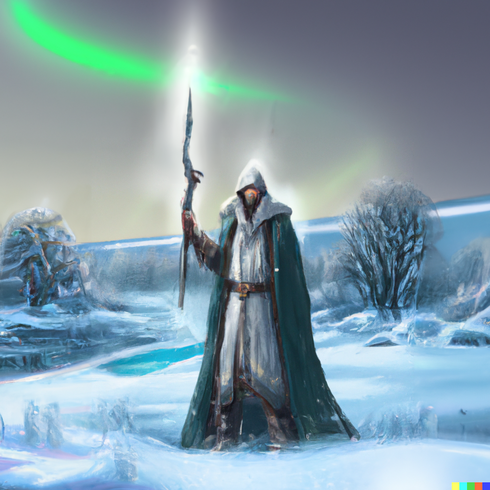

# [POSTAVA] Myrick Lysbærer

## Post 651159

**Author:** Myrick Lysbærer  
**Posted:** 2022-09-06T05:38:37+00:00  
**Source:** https://rpgforum.cz/forum/viewtopic.php?p=651159#p651159

Myrick Lysbærer  

_Zdroj: DALL·E: full picture viking sage with staff, detailed sad face, photorealistic digital paint, deep, winter landscape, aurora borealis_

**Vlastnosti:**  
🎯 **2** OSTŘÍ  
* Rychlost, obratnost a boj na dálku.  
❤️ **2** SRDCE  
* Odvaha, vůle, empatie, socializace a loajalita.  
🦾 **1** ŽELEZO  
* Síla, odolnost, agresivita a boj zblízka  
👤 **1** STÍN  
* Nenápadnost, úklady a prolhanost  
🔎 **3** ROZUM  
* Znalost, moudrost a postřeh  
  
**Zdroje:**  
🩸 ZDRAVÍ=1   
🧠 VŮLE=1  
📦 ZÁSOBY=2  
  
📈 HYBNOST=3  
Max:+9 / Reset: =1  
  
**Prokletí:** Kult smrti  
  
✨ ZKUŠENOST=0  
  
**Přednosti:**  
☀️ SVĚTLONOŠ=2  
🔓Soustředíš-li se na zdroj světla a zachycuješ jeho esenci, hoď+🔎.  
Silná trefa - Máš 6 světla.  
Slabá trefa - Máš 3 světla.  
Pokud hraješ tah, abys překonal či prošel temnotou, můžeš si přidat +2🎲 za -1☀️.  
🔓Můžeš používat světlo v boji proti tvorům temnoty (Strike nebo Clash). Řekni, kolik☀️uvolníš a hoď+☀️ místo 🎯 nebo 🦾 a uber si příslušné množství ☀️.   
Trefa - Tvé světlo je zbraň (Zásah 1+☀️).  
🔓Pokud provádíš rituál zachycení, máš +1🎲 a při trefě získáš +1📈.  
  
🦯 Prodloužená ruka  
Pokud třímáš hůl ..  
🔓Ve tvých rukou je prostá hůl smrtící zbraní (zásah 2). Pokud ji použiješ jednoruč (zásah 1), můžeš při úderu (Strike nebo Clash) házet+🎯 místo 🦾. Uděláš-li to, máš +1🎲 a při trefě získáš +1📈.  
🔓Získáváš-li výhodu (Secure an Advantage) pomocí 🎯 a hole, abys odzbrojil, omráčil a pod svého nepřítele, , máš +1🎲 a při trefě získáš +1📈.  
🔓Pokud cestuješ a máš silnou trefu nebo doprovázíš spojence, který má silnou trefu, tvá hůl je ti oporou a pomáhá ti na cestě. Máš +1📈.  
  
🕯️Poselství  
🔓Pokud obklopíš pozůstatky nedávno zabité inteligentní bytosti rozsvícenými svíčkami a přivoláš jejího ducha, hoď+❤️. Cíl musíš znát přímo ty nebo někdo, kdo je s tebou.  
Silná trefa: Duch se zjeví a můžete pár minut vést rozhovor. Vyhodnocuj vhodné tahy (máš +1🎲).  
Slabá trefa: Jako u silné, ale duch také přinese znepokojující zprávy nesouvisející s tvým záměrem. Představ si, co ti poví (zeptej se Orákula) a utržíš -1🧠 (Endure Stress).  
🔓Můžeš přednost použít i na dlouho mrtvé.  
🔓Při provádění tohoto rituálu máš +1🎲 a při trefě získáš +1📈.  
  
🔥 Věštění z ohně  
🔓Díváš-li se do plamenů, abys zjistil něco o vzdálené osobě či místě, hoď+👤. Přidej si +1🎲, pokud sdílíte pouto.  
Silná trefa: Můžeš zjišťovat informace (Gather information) s pomocí 👤 a 🔎.  
Slabá trefa: Jako u silné, ale musíš něco objetovat: Krev (Endure -2🩸), něco cenného (Endure -2🧠), zásoby (📦).  
🔒Můžeš hledět i do minulosti.  
🔓Při provádění tohoto rituálu máš +1🎲 a při trefě získáš +1📈.  
  
⭕Ochranný kruh  
🔓 When you walk a wide circle, sprinkling the ground with salt, roll +wits.  
On a strong hit, choose two.  
On a weak hit, chose one.  
• When a foe first crosses the boundary, take +1 momentum.  
• When you first inflict harm against a foe within the boundary, inflict +1 harm.  
• Your ward is ‘likely’ (Ask the Oracle) to trap a foe within the boundary.   
🔓As above, and improve the effect of your ward (+2 momentum, +2 harm, and ‘almost certain’).  
🔓When you perform this ritual, add +1 and take +1 momentum on a hit.  
  
👻 Spirit-bound  
🔓 You are haunted by someone whose death you caused through your actions or failures. When you consult with their spirit to Secure an Advantage or Gather Information, add +1🎲 and take +2📈 momentum on a hit. On a weak hit, also Endure Stress (-1🧠).

---

## Post 652288

**Author:** Myrick Lysbærer  
**Posted:** 2022-09-16T13:00:06+00:00  
**Source:** https://rpgforum.cz/forum/viewtopic.php?p=652288#p652288

**Pouta:**  
  
[Basira](https://rpgforum.cz/forum/viewtopic.php?p=650356#p650356)

  * Moje nejlepší kamarádka z dětství. Dnes už je to dáma v letech, ale stále atraktivní. Živí se jako průvodkyně místními vodami a dělá lodivodku pro obchodníky. Proto jim vidí pod prsty a myslí si, že by byla lepší vůdkyní ostrova, než aktuální šéfová Cadigan.
  * Když jsem byl malý, byl jsem si s Basirou a dalšími kamarády hrát v lávových polích mezi proudy tekoucí lávy (což bylo zakázané). Najednou se z jednoho proudu vynořil salamandr a krusta na lávových polích začala praskat. Všechny děti se daly na útěk, ale mě prasklina oddělila od ostatních. Víc si nepamatuju, vzbudil jsem se až o pár dnů později doma. Lidé od Šedé řeky mě prý našli dál po proudu na zatvrdlé lávě v bezvědomí. Od té doby se začalo projevovat mé magické nadání a lidé z osady i děti se nás začali stranit. Jediná výjimka byla právě Basira, která zůstala mou nejlepší a jedinou kamarádkou i když kolem mne docházelo k incidentům s náhodnými výrony magie. Naše cesty se rozešly, když se osadníci dozvěděli o chrámu na Rudém vrchu a přinutili matku mě tam poslat.
  * Při své cestě zpět jsem se potkal s Basirou a ta se opět zachovala přátelsky. Pomohla mi dostat se do Šedé řeky - propašovala mě na palubu. Od té doby tu žiji už několik týdnů, zatím bez vědomí obchodníků i osadníků.

[Kněží z Rudého vrchu](https://rpgforum.cz/forum/viewtopic.php?p=650875#p650875)

  * Když jsem se po dlouhých peripetiích dostal do Svatyně na Rudém vrchu, tamní kněží mne přivítali s pochopením, které jsem ve své rodné vsi nezažil. Jejich svatyně na úbočí vyhaslé sopky se zdála být ideálním místem pro cvičení mých sil.
  * Mistr Hiršam mne učil ovládnout sílu, která se ve mne probudila, pomocí meditací a obřadů se svíčkami. Ukázal mi, jak v sobě uschovat paprsky světla pro později.
  * Cítil jsem, že síly je ve mě víc ... ale Hiršam mi nechtěl dovolit experimentovat se svou silou nad rámec bezpečných cvičení, předávaných z mistra na žáka v řádu. Zprvu mi tajil proč, ale nakonec prozradil, že se obává, že síla mých kouzel by mohla probudit zpět k životu Rudý vrch a on se bojí, že erupce zničí nejen chrám, ale i přilehlé osady.
  * Po mnoho let jsem tedy žil a cvičil jen to málo, co mi bylo dovoleno. Pomáhal jsem přinášet světlo tam, kde ho bylo potřeba - do dlouhých nocí, temných dolů i posledních chvil v životě železného lidu. Pomalu jsem dospěl, našel si ženu Ingrid a prožil s ní ta nejlepší léta. Vychoval a provdal dceru Eos a konečně zapadl a našel své místo v tamním kruhu. Nejspíš bych tam i spokojeně zemřel, kdyby jednoho dne nepřišla bouře, která zastihla mou ženu na širých pláních.
  * Hned jak počasí dovolilo, vyrazil jsem ještě za temné noci za ní. Hledal jsem ji a doufal, že mě světlo přivede. Nakonec jsem ji nalezl, promrzlou na kost, umírající. Dal jsem snad všechnu sílu do improvizovaného obřadu, který jsem doufal, že přivede opět teplo do jejího těla a dodá jí síly k životu. Nedokázal jsem ale víc, než dodat její duši sílu k dlouhému rozhovoru - rozhovoru který trval ještě dlouho potom, co z jejího těla život dávno vyprchal.
  * Její poslední slova byla slova povzbuzení - prý když jsem dokázal tohle, dokážu cokoliv. O Eos je prý postaráno a než abych zbytek života po Ingrid tesknil v prázdném domě, mám vyrazit do světa za poznáním, dokud jsem v nejlepších letech.
  * Té noci jsem složil železnou přísahu, že **ovládnu sílu světla i ohně natolik, abych dokázal vracet život mrtvým**.
  * Promluvil jsem si o tomto zážitku i úmyslu s Hiršamem - v té době již starým mužem na smrtelném loži. Nevymlouval mi to - a doporučil mi, abych se vydal za poznáním do míst, kde to všechno začalo. Do své rodné osady u Šedé řeky.

Tristan  
  
Rodina  
  
**Zrušená:**  
Ravel

---

## Post 652893

**Author:** Myrick Lysbærer  
**Posted:** 2022-09-25T18:50:38+00:00  
**Source:** https://rpgforum.cz/forum/viewtopic.php?p=652893#p652893

**Přísahy:**  
  
Slib mrtvé manželce  
Přísahám u železa, že **ovládnu sílu světla i ohně natolik, abych dokázal vracet život mrtvým**.  
_Epický (1 srpek/milník)_  
🌕 

  * 🌘 V boji po boku spiklenců od Šedé řeky jsem díky šťastné náhodě ucítil, jaké je to vládnout ohněm.
  * 🌘 Vyzkoušel jsem si, jaké je to obětovat ohni člověka.
  * 🌘 Rave, syn Haleema a Shury, je nadaný stejnou mocí jako já.
  * 🌘 Zjistil jsem, že příliš lpím na rituálech a to mi brání v plném rozvinutí mých sil.

🌗 
  * 🌘 Už vím, že se musím o síle učit od všech prvních lidí, mám-li ji plně pochopit.
  * 🌘 Stal jsem se krom Lysbærera i Dødenstjenerem.

🌑🌑🌑🌑🌑🌑🌑🌑  
  
  
Druhý slib Ravelovi  
Přísahám při železe, **že až budeme svědky toho, jak tvorové noci, mrví nebo běsové ohrožují nevinné, postavíme se jim a zaženeme je, nebo u toho společně zemřeme.**.  
_Nebezpečný (2 🌕/milník)_  
🌕🌕 Obětoval jsem se za ostatní při pokusu vyrvat Tessara ze spárů královný víl.  
🌕🌕 Ravel se alespoň dostatečně dozvěděl, jak jsme nasazovali život při záchraně osady před Filtzem.  
🌑🌑🌑🌑🌑🌑  
  
Slib Sardiným rodičům  
Přísahám při železe, **že seženu něco, co vyléčí Sardu od stínu..**.  
_Nebezpečný (2 🌕/milník)_  
🌑🌑🌑🌑🌑🌑🌑🌑🌑🌑  
  
Slib divožence v horách  
Přísahám při železe, **že ti seženu náhradu, která ti bude dělat zábavu.**.  
_????_  
🌑🌑🌑🌑🌑🌑🌑🌑🌑🌑  
  
Slib smrťákovi  
Přísahám ti při železe, smrti, převozníku, otevírači brány, herolde, který ohlašuje příchod na hostinu, průvodče prázdnotou, že **přivedu první i železný lid k tomu, aby přijal smrt jako jednoho z bohů a začal ho uctívat se všemi patřičnými poctami!**  
_Formidable (1 🌕/milník)_  
🌕 Vím, pod jakým jménem budu Smrťákovi sloužit.  
🌕 Pŕivedl jsem do Bouřného lesa oddíl nemrtvých bojovníků a ukázal místním, jak jsou užiteční.  
🌕 Pomohl jsem válečníkům na onen svět a pochopil jsem, jakým způsobem mám Sloužit smrti, aby ji lidé začali uctívat.  
🌕 Přestal jsem se smrti bát a naučil jsem se ochranné znamení ze Smrti vyplývající.  
🌕 Ukázal jsem sílu Smrti Horníkům v Údolí kleče.  
🌑🌑🌑🌑🌑  
  
  
  
|Slib dceři Eos  
Přísahám u železa, že **vnučku Sardu přivedu zpět za dcerou Eos.**.  
🌕 Osvobodil jsem Sardu z Rudého vrchu.  
🌕 Eos se vrací do Bouřného lesa  
🌕 Víme, že se vrací soutěskou na severu.  
🌕 Eos je v soutěsce   
🌕 Zjistil jsem, kde je asi ve hvozdu Eos.  
🌕 Našel jsem Eos a Sardu v zajetí zlomených.ˇ  
NESPLNĚNO, RESET SE ZVEDNUTÍM OBTÍŽNOSTI.  
**Dostanu vás odsud všechny. Živé. A plné sil. Vrátíme se domů. Do vašeho domova**. To přísahám při železe.  
_Extreme (1 🌗/milník)_  
🌗 

  * 🌗 Dostal jsem rodinu z Wulanovy soutěsky
  * 🌗 Zachránil jsem Eos přes pohlcením Stínem
  * 🌗 Už se zase vnímáme jako rodina.

🌑🌑🌑🌑🌑🌑🌑🌑🌑  
  
  
Slib Sardě u jeskyně Rattle  
Přísahám u železa, že **ti přinesu kámen Rattle, aby sis ho mohla prohlédnout.**.  
_Troublesome (3 měsíčky/milník)_  
🌕🌕🌕 Uzavřeli jsme první neuspěšnou výpravu za kameny a shodli se, že to zkusíme jinde.  
🌕🌕🌕 Víme, že kameny Rattle jsou u Útesu záhad.  
🌑🌑🌑🌑  
  
Slib Kiře od Kamenobrodu  
Přísahám u železa, že **očistím své jméno a pomůžu osvobodit Ghalena.**.  
_Troublesome (3 měsíčky/milník)_  
🌕🌕🌕 Byl jsem zraněn a přesto jsem pomohl z ledu Kiře a jejím druhům. To ze mě sňalo podezření a očistil jsem jméno.  
🌑🌑🌑🌑🌑🌑🌑  
  
  
**Splněné:**  
Slib Lenovi, Sadiinumu psovi  
Přísahám u železa, že **ti najdu místo k žití**.  
_Troublesome (3 měsíčky/milník)_  
🌕🌕🌕 Dovedl jsem Lena k osadě.  
🌕🌕🌕 Přivedl jsem Lena až ke Kunovi  
🌑🌑🌑🌑  
**SPLNĚNO** \- Kuno si Lena vzal k sobě.  
  
Slib Yorath  
Přísahám, že ti **přinesu důkaz o zapojení a úmyslech boha sopky**.  
_Troublesome (3 měsíčky/milník)_  
🌕🌕🌕 Pomohl jsem zachránit Yorath, takže mám komu ten důkaz dát.  
🌕🌕🌕 Získali jsme zajatce, je koho obětovat.  
🌕🌕🌕 Yorath viděla na vlastní oči, co krvavá oběť dokáže.  
🌑  
**UZAVŘENO** \- Yorath uvěřila, že krvavé oběti jsou řešením problémů osady, ale stále není přesvědčena o tom, že je to projev boží vůle.  
  
Slib Basiře  
Přísahám při železe, že ať se v noci stalo cokoliv, **pomůžu ti dosáhnout tvých cílů a zastoupím při tom chybějící Sadii...**  
_Nebezpečný (2 měsíčky/milník)_  
🌕🌕 Zjistil jsem, že Basiřin cíl je mnohem hlubší, než prosté svrhnutí Cardigan a nastoupení na její místo.  
🌕🌕 Basira, Kuma a Sadia chtěli opustit víru ve staré bohy a začít uctívat nové, místní božstvo. Sadia zprostředkovávala kontakt s místním božstvem a já ji mám teď nahradit.  
🌕🌕 Pomohl jsem vypráskat námořníky, které si Basira tak neobratně najala a získal důvěru spiklenců natolik, že po mě chtějí, abych je vedl.  
🌕🌕 Přiměl jsem Basiru, aby změnila své cíle na nějaké uskutečnitelné.  
🌕🌕 V Mrazovišti jsme našli dost obchodníků, kteří byli dost odvážní na plavbu mezi hady a zároveň dost poctiví na to, aby nevyrazili Šedou řeku vyplenit.  
**SPLNĚNO** \- Basira se spokojila s dosaženým výsledkem a předpokladem, že konstelace okolností už zbaví Cadigan vlády nad Šedou řekou.  
  
Slib, že zachráním Tristana  
Přísahám u železa, že **udělám, co je v mých silách, abych tě vysekal ze smrti kvůli nemoci z pylu**.  
_Nebezpečný (2 🌕/milník)_  
🌕🌕 Dovedl jsem Tristana k elfům a jejich šaman zpomalil průběh nemoci.  
🌕🌕 Přišli jsme s Tristanem na to, co je zhoubou Essu, o jejíž odstranění elfové požádali výměnou za odstranění nemoci  
🌕🌕 Pomohl jsem Tristanovi vyhnat zhoubu z Essu, což by mělo jít na ruku elfům.  
🌕🌕 Byl jsem svěděk Tristanova rozhovoru s elfy, vím že jeho nemoc je zastavena.  
🌑🌑  
**SPLNĚNO** \- Tristanova nemoc je zastavena a to mu stačí. Má teď spoustu času hledat léčbu.  
  
Slib, že vrátíme náramky  
Přísahám u železa, že **získám náramky tvého otce.**.  
_Nebezpečný (2 🌕/milník)_  
🌕🌕 Zjistili jsme, co se mu stalo.  
🌕🌕 Našli jsme wyverní hnízdo  
🌕🌕 Získali jsme náramky z jejího káleniště.  
🌕🌕 Vrátili jsme je právoplatné majitelce.  
🌑🌑  
**SPLNĚNO** \- Artega přísahala, že pomstí svou matku a zabije Paní lesů, a tedy přijala náramky a odpustila nám smrt matky.  
  
Slib své přesce  
Přísahám u železa, že **tě nechám přechovat zpět do podoby, která je hodna slibů, které v sobě nosíš-.**.  
_Problémový (3 🌕/milník)_  
🌕🌕🌕 Nechal jsem si ho překovat u první kovářky, co jsem potkal.  
🌑🌑🌑🌑🌑🌑🌑  
**UZAVŘENO** \- Přeska už je zase funkční. Moje sliby by si asi zasloužily něco lepšího, ale co se dá dělat, život jde dál.  
  
Slib Luciusovi  
Přísahám při železe, že se vypravíme do Novopádu a přineseme vám odtamtud informace o tom, jak to tam vypadá.  
_Problémový (3 🌕/milník)_  
🌕🌕🌕 Zjistili jsme, že Novopád je pevnost nájezdníků.  
🌕🌕🌕 Bjorn dostal nabídku Zlatobor přepadnout. Vyříkali jsme si, že já to neudělám.  
🌕🌕🌕 Varovali jsme Zlatobor  
🌑  
**UZAVŘENO** \- Luciovi to nestačilo, chtěl po nás i obranu vesnice. Na to jsem se mu už vykašlal.  
  
Slib daný kovářce Nan  
Přísahám při železe, že **jestli nám Fanir ještě někdy zkříží cestu, postarám se, aby ho nějaký takový osud stihnul**.  
_Troublesome (3 měsíčky/milník)_  
🌕🌕🌕 Fanir je na naší stopě.  
🌕🌕🌕 Mám trollku, spojenkyni proti Fanirovi  
🌕🌕🌕 Předhodil jsem Fanira Nan, umírajícího, ale živého.  
🌑  
**UZAVŘENO** \- Nan to nestačilo, chtěla mě donutit ho potrestat.  
  
Druhý slib daný kovářce Nan  
**Jestli to neuděláš,** tak přísahám, při železe, že **ho nažhavím já, a pak tě s ním zabiju, jen abys přestala otravovat život náhodným kolemjdoucím svými jedovatými intrikami**.  
_Troublesome (3 měsíčky/milník)_  
🌕🌕🌕 Nan vezme mou výhružku vážně.  
🌕🌕🌕 Nan přijme můj návrh, jak ze situace vybruslit  
🌕🌕🌕 Udržel jsem Fanira na živu, takže ho Nan mohla potrestat  
🌑  
**SPLNĚNO** \- Nan potrestala Fanira a ten nezemřel a bude s tím žít do konce života.  
  
Slib Burble za to, že bodla víle  
Přísahám při železe, že **ti pomůžu se očistit**.  
_Troublesome (3 🌕/milník)_  
🌕🌕🌕 Zdá se, že pokání může dát Burble rovnou víla.  
🌕🌕🌕 Zkusil jsem Burble přesvědčit, že stačí mít pokání zajištěné dohodou.  
🌑🌑🌑🌑  
**UZAVŘENO** \- Burble mi vysvětlila, že nestačí a že je to celé mnohem složitější.  
  
Slib Ravelovi  
Přísahám u železa, že **ti pomůžu zkrotit a ovládnout v sobě tuhle sílu, tak jako kdysi pomohli mě.**.  
_Hrozivý (1 🌕/milník)_  
🌕 Dovedl jsem Ravela k elfům.  
🌕 Našel jsem Ravelovi ochránce, který ho vyvede z Hlubočiny.  
🌕 Pochopil jsem, že Ravel se nesmí vydat cestou k žádnému z extrémů.  
🌕 Bjorn mi pomohl uvědomit si, že Ravela musím naučit, že nositelem síly je člověk a jeho vůle, úmysly, nikoliv oheň sám.  
🌕 Vymluvil jsem Ravelovi cestu bojovníka.  
🌕 Dovedl jsem Ravela k Rudému vrchu, kde (mi) ho vzali do učení.  
🌑🌑🌑🌑  
**UZAVŘENO** \- Ravel se ješté nerozhodl kterou cestu zvolí, i když mistr Hiršam to chce rozhodnout za něj. Slíbil jsem, že se vrátím po zimě a optám.  
  
Ravelova zima  
Přísahám u železa, že **ti najdu bezpečný kruh kde přečkáš zimu.**.  
_Nebezpečný (2 🌕/milník)_  
🌕🌕 Ravel našle místo ve Svatyni Rudého vrchu, ale není zřejmé, zda je to pro něj bezpečné místo.  
🌕🌕 Ravel si v Kruhu vede dobře, mohl by tu zůstat, kdyby opravdu chtěl.  
🌕🌕 Vyhledal jsem Ravela, když už měl zkušenost s tím, jak to chodí ve Svatyni a nabídl jsem možnost odejít nebo zůstat. A nechal to na něm.  
🌑🌑🌑🌑  
**SPLNĚNO** \- Ravel zůstane ve Svatyni přes zimu.  
  
Slib z chatrče na blatech  
Přísahám při železe, že **způsobenou škodu nahradíme**.  
_Nebezpečný (2 🌕/milník)_  
🌕🌕 Kontakt s trollí majitelkou začal přátelsky.  
🌕🌕 Burble dostala první splátku z Fanirova lootu.  
🌕🌕 Burble dostala koně.  
🌕🌕 Vysvobodit jsem Burble z ostrova  
🌑🌑  
**SPLNĚNO** \- Už Burble nic nedlužím.  
  
Opravený slib Burble za to, že bodla víle  
Přísahám při železe, že **ti pomůžu se očistit a budu toho respektovat trollí zvyky a nechám se vést.**.  
_Dangerous (2 🌕/milník)_  
🌕🌕 Vím, kde "žije" kámen Rattle, Burble ho potřebuje k rituálu.  
🌕🌕 Zjistil jsem přesnou polohu kamene "Rattle".  
🌕🌕 Dovedl jsem Burble k jeskyni Rattle.  
🌕🌕 Po vyzvednutí Rattle ublížil Burble Strážce že Sekeromlatu. Přiměl jsem ho odčinit to po trollím způsobu.   
🌑🌑  
**SPLNĚNO** \- Burble už mě naučila respektovat trollí zvyky.  
  
Slib Sardě u jeskyně Rattle  
Přísahám u železa, že **ti přinesu kámen Rattle, aby sis ho mohla prohlédnout.**.  
_Troublesome (3 měsíčky/milník)_  
🌕🌕🌕 Dorazil jsem do Sekeromlatu  
🌕🌕🌕 Zjistil jsem, že za přerušení vztahu může křivda od Leely, ale projevila se až když křivdu rozdmýchal Hiršam.   
🌕🌕🌕 Vrátil jsem se k Leele a všechno jí řekl.  
🌑  
**SPLNĚNO** \- Leela se omluví Sekeromlatským a obchod se obnoví.  
  
Slib Filtzovi  
"Přísahám při železe, že**ti osobně uspořádám pohřeb, jaký si zasloužíš** , a pokud svou přísahu nedodržím, klidně mě stihni kletbou, kterou jsi stíhal Nandu," vypadne ze mě náhle, aniž bych domyslel všechny souvislosti.  
_Dangerous (2 🌕/milník)_  
🌕🌕 Máme Filzovo tělo i duši.  
🌕🌕 Zajistil jsem na noc provizorně Filtzovo tělo obřadem  
🌕🌕 Filtzovo tělo nad ránem posedl běs. Porazil jsem ho a z těla vyhnal, ale nezahnal úplně. On teď straší kolem místa na skále, kam tělo spadlo.  
🌕🌕 Vyhnal jsem běsa z Filzova těla.  
🌕🌕 Pohřbil jsem Filzovo tělo.  
**SPLNĚNO** \- Filzovo tělo i duše jsou spáleny.  
  
  
Nemocná Sarda  
Přísahám při železe, že donesu Sovu, aby se Sarda vyléčila.  
_Problémový (3 🌕/milník)_  
🌕🌕🌕 Našel jsem cestu k Sově  
🌕🌕🌕 Nasbíral jí  
🌕🌕🌕 Vrátil se zpátky, ale pozdě  
🌑  
**UZAVŘENO** \- Zastavilo to šíření Stínu, ale nevyhnalo. Dal jsem nový slib, že najdu skutečný lék.  
  
Druhý slib mrtvé manželce  
Přísahám u železa, že **si z tebou promluvím, abys nalezla klid.**.  
_Nebezpečný (2 🌕/milník)_  
🌕🌕 Naučil jsem se mluvit s dlouho mrtvými.  
🌕🌕 Smrťák mi připomněl, že si s ženou chci promluvit před svou smrtí, ne po ní.  
🌕🌕 Slyšel jsem Ingrid hlas, i když jsem ji zatím nemohl sám oslovit.  
🌕🌕 Ingid mě posedla, občas si s ní povídám.  
🌑🌑  
**UZAVŘENO** \- Mluvím se ženou často, protože mě posedla. Ale klid nalezne, teprve až zemřu a přejdeme na druhou stranu spolu.  
  
Slib Halímovi  
Přísahám při železe, že **najdu dědictví tvého rodu, Halímo** , a přijmu ho jako dar, který napraví křivdy, které se mi v Kamenobrodu staly  
_Troublesome (3 🌕/milník)_  
🌕🌕🌕 Dorazili jsme do Kazeery  
🌕🌕🌕 Vypořádali jsme se s Oblačným mamutem i lvem, takže okolí je bezpečné.  
🌕🌕🌕 Vyzvedl jsem dědictví  
**SPLNĚNO** \- Byly to ochranné runové kameny, to je dar, který napravil křivdy.
