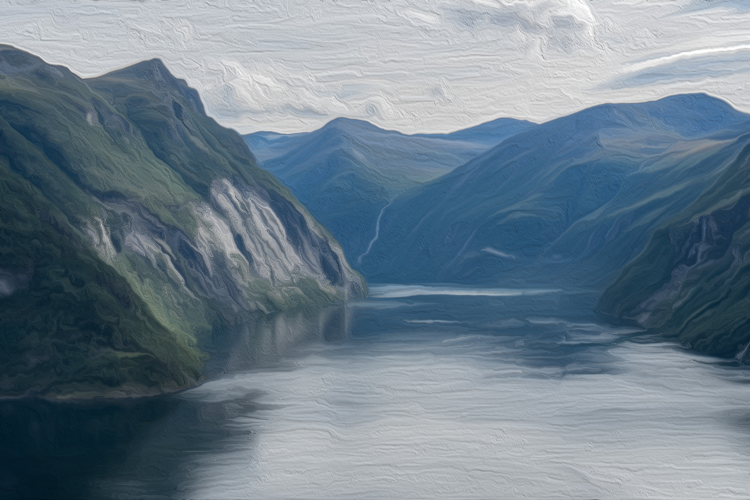
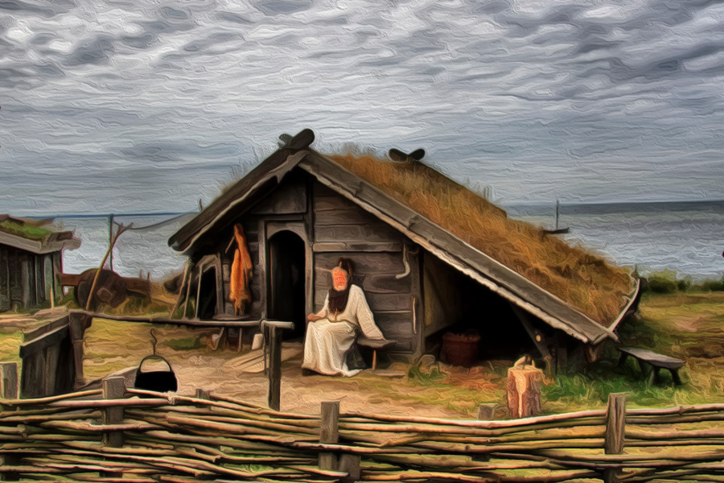

# [LOKACE a NPC] Členité pobřeží

## Post 654617

**Author:** Orákulum  
**Posted:** 2022-10-17T20:38:28+00:00  
**Source:** https://rpgforum.cz/forum/viewtopic.php?p=654617#p654617

Členité pobřeží

  * Úzké fjordy
  * Osady postavené na skalnatých březích
  * Obchodní lodě s pestrobarevnými plachtami
  * Stavitelé lodí bušící kladivem do dřevěných trupů lodí
  * Nájezdníci hrající na válečné bubny
  * Hejna kosatek klouzajících po vlnách.
  * Obludní hadi vystupující z nezměrných hlubin.

---

## Post 654618

**Author:** Orákulum  
**Posted:** 2022-10-17T20:39:34+00:00  
**Source:** https://rpgforum.cz/forum/viewtopic.php?p=654618#p654618

Rozcestník

**Lokace**  

  * [Divoká Voda](https://rpgforum.cz/forum/viewtopic.php?p=660648#p660648)
  * [Havraní Skála](https://rpgforum.cz/forum/viewtopic.php?p=690375#p690375)
  * [Rojřin Stesk](https://rpgforum.cz/forum/viewtopic.php?p=654620#p654620)
  * [Mečelom](https://rpgforum.cz/forum/viewtopic.php?p=690801#p690801)
  * [Nový hřeben](https://rpgforum.cz/forum/viewtopic.php?p=655818#p655818)

**Postavy**  

  * [Malik](https://rpgforum.cz/forum/viewtopic.php?p=654620#p654620) \- vrchní kněz v Rojřině Stesku
  * [Brandur](https://rpgforum.cz/forum/viewtopic.php?p=654620#p654620) \- kněz z Rojřina Stesku, zemřel při boji s nemrtvými
  * [Mila](https://rpgforum.cz/forum/viewtopic.php?p=690375#p690375) \- vůdkyně Havraní skály
  * [Mioll a Asmunda](https://rpgforum.cz/forum/viewtopic.php?p=690801#p690801) \- unesené a zajaté Bjornovy děti
  * [Wynne](https://rpgforum.cz/forum/viewtopic.php?p=654620#p654620) \- kapitán lodi Damula, někdejší Tristanův přítel

---

## Post 654620

**Author:** Orákulum  
**Posted:** 2022-10-17T20:53:34+00:00  
**Source:** https://rpgforum.cz/forum/viewtopic.php?p=654620#p654620

Rojřin Stesk

  * Stará osada, kterou v hlubokém fjordu zbudovali utečenci ze Starého světa.
  * Dle dochovaných svědectví byla Rojra ve Starém světě vlivnou duchovní, která vedla jednu z výprav do Železných zemí. Po připlutí na toto místo neunesla zprávy o nemilosrdném zabíjení nemocných nebo zdánlivě nemocných lidí na palubách jejich lodí. Přestala jíst, pít a po zbylé dny svého života truchlila za příliš vysokou cenu, kterou její lidé za vidinu lepší budoucnosti zaplatili. Těsně před smrtí potom proklela všechny, kdo během plavby do Železných zemí vztáhli ruku na někoho ze svých bližních.
  * Zdejší Kruh vedou kněží, kteří s pomocí náročných a nepřetržitých rituálů zabraňují rozšíření Rojřina prokletí. Nebo tomu alespoň věří.
  * I na poměry Železných zemí se zde nezvykle často probouzí mrtví k životu, ať už z řad lidí, nebo i zvířat. Místní se mají na pozoru před zbloudilými kostlivci a přízraky.  

  * Místní chrám tvoří soustava mnoha kruhových staveb, které jsou vzájemně propletené a propojené. Vznikaly postupně behěm mnoha let, jak rostl věhlas Rojřiny Kletby i místních riruálů a Kruh nabíral na počtu příznivců. Vevnitř je chlad a přítmí, prosvícenné vonnými olejovými lampami.
  * Žádní dva kněží nejsou stejní. Každý, kdo se odhodlal zasvětit svůj život rituálům, je vítaný. Žijí zde ženy i muží, mladí i staří. Každý oblečen podle svého uvážení, v duchu volnosti a svobody, kterou Rojra toužila dopřát svým následovníkům v Železných zemích. Kněží spojuje jen zaschlé bláto na tvářích a čele - symbol slz, které zde Rojra prolila, a země, kvůli které tolik jejich přívrženců zemřelo.
  * Mrtví zde jsou uložení pod těžkými kameny na nedalekém mohylovém vrchu.

**Objevy**

  * V Rojřině Stesku se otřásla země. Námořníci mluví o sesuvech půdy do fjordu, trhlinách v v útesech a štiplavém zápachu, který z nich vychází. Někteří z toho viní kněží, jiní hlubinné démony. Všichni se shodnou na tom, že tradiční rituály jsou přerušené a místo v ohrožení.
  * Na osadu se v noci nahrnuli nemrtví z okolí. Několik lidí zabili a zranili. Ráno spousta prchá. Karavana mířící na východ se musela vrátit. V lesích se tam pořád zdržují nemrtví.
  * Kapitán Wynne [narušil](https://rpgforum.cz/forum/viewtopic.php?p=657115#p657115) rituály naschvál.

**POSTAVY**

  * Malik - vrchní kněz v Rojřině Stesku
  * Brandur - kněz z Rojřina Stesku, zemřel při boji s nemrtvými

**Wynne**

  * Kapitán lodi Damula, dávný Tristanův přítel
  * Odplouval z Rojřině Stesku krátce poté, co se tam otřásla země
  * Od někoho s iniciály "S.M.J." dostal za [úkol](https://rpgforum.cz/forum/viewtopic.php?p=657115#p657115) přerušit rituály v Rojřině Stesku. Přepadl cestovatele nedaleko osady, zavraždil je a tajemným [rituálem](https://rpgforum.cz/forum/viewtopic.php?p=658248#p658248) s pomocí od [neznámého elfa](https://rpgforum.cz/forum/viewtopic.php?p=657910#p657910) otevřel zemi. Zemřelo u toho i několik jeho členů posádky.

---

## Post 655818

**Author:** Orákulum  
**Posted:** 2022-11-02T13:51:32+00:00  
**Source:** https://rpgforum.cz/forum/viewtopic.php?p=655818#p655818

Nový hřeben

Obrázek TBD 

  * Tvrz, kde zimují Svobodní strážci, když nemají zrovna práci a nedá se moc cestovat.

  
**Objevy**

**POSTAVY**

---

## Post 660648

**Author:** Orákulum  
**Posted:** 2023-01-08T19:59:35+00:00  
**Source:** https://rpgforum.cz/forum/viewtopic.php?p=660648#p660648

Divoká voda

  * Osada nájezdníků na severu Členitého pobřeží, Bjornův původní domov.
  * Před pádem z vnitrozemí údolí chrání jednoduchá kamenná věž Hláska

  
**Objevy**

  * Bjorn [přijel](https://rpgforum.cz/forum/viewtopic.php?p=690383#p690383) domů a vydal se na výpravu na obra
  * Bjorn [se vrátil](https://rpgforum.cz/forum/viewtopic.php?p=690979#p690979) s trofejí ze zabitého obra a svými dětmi, které osvobodil ze zajetí v Mečelomu; Bjorn získal zpět svou ztracenou čest
  * Bjorn [odplul](https://rpgforum.cz/forum/viewtopic.php?p=693103#p693103) se Sigarrem na jih

**POSTAVY**

  * Havarr - mystik, který [žije](https://rpgforum.cz/forum/viewtopic.php?p=690291#p690291) nedaleko od osady
  * Olaf Mocný - náčelník, Bjornův otec
  * Sigarr - strážce u palisády
  * Sigrid, Mioll a Asmund - Bjornova bývalá žena a děti; děti zachránil ze zajetí v Mečelomu

---

## Post 690375

**Author:** Orákulum  
**Posted:** 2024-03-05T13:16:52+00:00  
**Source:** https://rpgforum.cz/forum/viewtopic.php?p=690375#p690375

Havraní skála

  * Osada vklíněná mezi skalní stěny, malá a skromná. Ostré krákání havranů, kteří tu létají v obrovských hejnech.
  * Minulou zimu zachvátila osadu nemoc, mnoho lidí onemocnělo, mnoho zemřelo. A tuto zimu je to tady znova. A bylinkář zemřel taky.

**Objevy**

  * Bjorn [se tu zastavil](https://rpgforum.cz/forum/viewtopic.php?p=690160#p690160) při cestě do Divoké vody a strávil několik týdnů bylinkařením a léčením nemocných.

**POSTAVY**

  * Mila - vůdkyně kruhu, chladná lovkyně, která už zažila mnoho zim
  * Toman - Strážce osady

---

## Post 690801

**Author:** Orákulum  
**Posted:** 2024-03-12T13:22:27+00:00  
**Source:** https://rpgforum.cz/forum/viewtopic.php?p=690801#p690801

Mečelom

  * Mečelomští jsou nesmlouvaví, nerudní, ale nejvíce jim jde o zisk.

**Objevy**

  * Bjorn [připlul](https://rpgforum.cz/forum/viewtopic.php?p=690842#p690842) do osady a vyjednal výměnu svých dětí.
  * Bjorn dal přes držku Ulfarovi a získal tím pozvání na chvíli odpočinku.
  * Osadu [trápí mocný duch](https://rpgforum.cz/forum/viewtopic.php?p=690860#p690860), který se usadil v jeskyních a asi ho přitahuje pomsta za nespravedlivou smrt. Pokud by Bjorn ducha zlikvidoval, Mečelom by přemýšlel o obnovení vztahů s Divokou vodou.

**POSTAVY**

  * Mioll a Asmunda, unesené a zajaté Bjornovy děti
  * Ulfar - mladý válečník, který Bjorna vyzval k duelu
