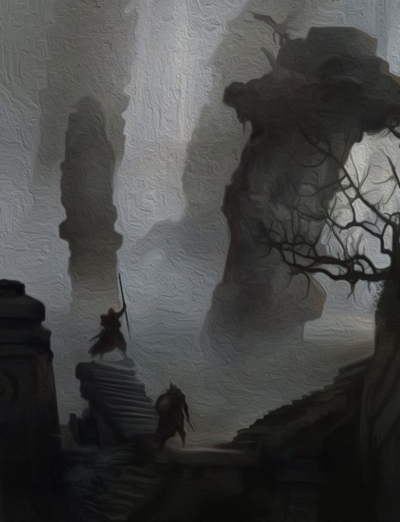
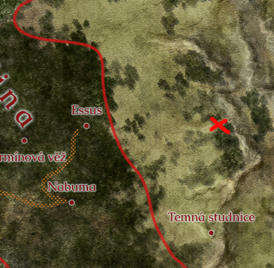

# [HRA] Hledání společné cesty

## Post 659903

**Author:** Orákulum  
**Posted:** 2022-12-28T17:21:36+00:00  
**Source:** https://rpgforum.cz/forum/viewtopic.php?p=659903#p659903

_Myrick s Tristanem[vyráží z Rojřina Stesk](https://rpgforum.cz/forum/viewtopic.php?p=659868#p659868)u do nitra Železných zemí._  
  
Ruch Rojřina Stesku odnesl vítr a teplo ohňů vystřídal vtíravý vítr. Nepřetržitý, neustávající studený vítr. Ale ani ten nedokázal rozehnat hustou mlhu z mořských mraků visících na skalách v podhůří. Slunce se schovalo za těžkým bělavým závojem a už tak krátké dny se smrskly na několik hodin jednolité šedi.  
  
Cesta vzhůru na hřeben vedla skrz ostrá skaliska, po hladkých ledových plotnách a kolem nízkých skomírajících stromů. Krákání vran se stalo jediným doprovodem skupiny mířící do lesů na východě.  
  

---

## Post 659905

**Author:** Tristan Baldurson  
**Posted:** 2022-12-28T17:31:26+00:00  
**Source:** https://rpgforum.cz/forum/viewtopic.php?p=659905#p659905

Před odchodem jsem strávil hned několik hodin vyptáváním se na cestu. Dokonce jsem si sehnal hned dva hodně hrubé náčrtky okolních kopců a stezek skrz hory.  
  
Z náčrtků se staly už během prvního dopoledne jen navlhlé rozpité cáry nečitelného inkoustu. Pokaždé, když jsem se zastavil a marně v mlze hledal pokračování stezky, zůstala Yorath u Ravela a kontrolovala jeho stav. Ještě máme možnost se vrátit, zatím bychom našli cestu zpátky. Ale nemusel jsem se nikoho ptát, abych věděl, že jediná cesta vede kupředu.  
  
_Cestujeme do sousedního regionu - Dangerous 🌑🌑🌑🌑🌑🌑🌑🌑🌑🌑  
  
🔀 Undertake a Journey **Jak zahájíme naši cestu?**(Rozum)** Strong Hit with a Match**   
🎲 Action Score 2 + 2 + 1 = 5 Challenge Dice 4, 4   
✍️ You reach a waypoint. You make good use of your resources: Mark progress.  
  
🌕🌕🌑🌑🌑🌑🌑🌑🌑🌑_  
  
Zastavujeme se často. Hledám značky cestovatelů vyryté ve skalách, stará ohniště a další stopy po stezkách. Když se šero podzimního dne přehoupne do temnoty nastávající noci, nemáme už kam dál stoupat. Podařilo se nám vyšplhat až pod hřeben a nemuseli jsme se ani jednou vracet.  
  
Ještě než nás nedostatek světla přinutí rozdělat první oheň, najde Ravel ve skalách na úpatí posledního útesu prostornou jeskyni. Její temné ústí nás vítá do jediného místa po celodenním putování, kde by snad mohlo být závětří. Vidina klidného spánku je lákavá. Ale nenechám nic náhodě a porozhlédnu se po okolí. Vím, jaké stopy tady hledat. Doufám v ty nejmenší. A zvířecí.  
  
_🔀 Gather Information**Obývá něco jeskyni?**(Rozum)** Weak Hit**   
🎲 Action Score 3 + 2 + 0 = 5 Challenge Dice 2, 6   
✍️ The information complicates your quest or introduces a new danger. Take +1📈_  
  
"Skalní puma," oznámím ostatním, když najdu, co jsem najít nechtěl. "Teď tady není a ani dlouho nebyla, myslím. Loví na velké ploše a mívají více doupat. Možná bychom se tu mohli utábořit a mít klid až do rána. Ale jestli se vrátí, bude o svoje loviště bojovat. Bylo by to hodně nebezpečné. Nevím, jestli bych si s ní poradil."  
  
_Myricku, co navrhneš, to bude. Utáboříme se?_

---

## Post 659962

**Author:** Myrick Lysbærer  
**Posted:** 2022-12-29T10:29:25+00:00  
**Source:** https://rpgforum.cz/forum/viewtopic.php?p=659962#p659962

Když po těch všech pirátech, sopkách, netvorech a nemrtvých z Tristana vypadne, že nám hrozí návštěva obyčejného zvířete, nahlas si oddechnu. "To zvladneme. Přiložíme, aby oheň pořádně plápolal, budeme držet hlídky."  
  
Jak zmíním, tak to i provedu. Ostatně jasný oheň nepotřebuji jen kvůli zahnání zvířete. Stejně tak je pro mě uklidňující přítomnost silného světla, zahánějícího temnotu.  
  
_🔀 Secure an Advantage**Příprava na táboření**(Rozum)** Strong Hit**   
🎲 Action Score 1 + 3 + 0 = 4 Challenge Dice 1, 3   
✍️ You gain advantage. Take control: Make another move now (not a progress move); when you do, add +1🎲_   
  
_🔀 Make Camp**Táboření**(Rozum)** Strong Hit**   
🎲 Action Score 4 + 4 + 1 = 9 Challenge Dice 1, 4   
✍️ Choose two..._

---

## Post 660038

**Author:** Tristan Baldurson  
**Posted:** 2022-12-30T18:24:59+00:00  
**Source:** https://rpgforum.cz/forum/viewtopic.php?p=660038#p660038

Myrickovo "to zvládneme" zní jako slova člověka, který nikdy nebojoval se skalní pumou o doupě. Strávím část noci trpělivým vysvětlováním, co takové zvíře dokáže. Yorath na mě chvílemi syčí a posunkuje směrem k dřímajícímu Ravelovi. Jestli v Šedé řece mohly být děti s nástrahami světa seznamované postupně a s citem, tady si to dovolit nemůžeme. Jen ať se učí.  
  
Než jdu spát, přiznám ostatním, že mluvit nahlas a vzpomínat mi pomáhá. Je toho hodně, co jsem během let v Šedé řece nepotřeboval a zapomněl. A bojím se, že nepřipravenost může mít kruté následky. Jsem vděčný, že moje poučování poslouchali.  
  
Ještě před východem slunce jsem zase na nohách a procházím skaliska poblíž jeskyně. Po pumě ani památky. Ale z menších stop zvěře a kroužení dravců nad hřebenem usoudím, kudy nejlépe dál.  
  
_Táboření: Focus +1📈 a Prepare +1🎲 na další Undertake a Journey._

---

## Post 660073

**Author:** Myrick Lysbærer  
**Posted:** 2022-12-31T13:12:46+00:00  
**Source:** https://rpgforum.cz/forum/viewtopic.php?p=660073#p660073

Po zbytek noci poslouchám Tristanovo vyprávění o zvířatech a odpočívám. Je to poučné, zajímavé a i když se Tristan snaží, aby to znělo strašidelně, je to mnohem příjemnější, než přemýšlet o démonech, světě mrtvých ve kterém na mě čeká moje žena či hrůznách posledních dní.  
  
_Táboření: +1🧠 a +1❤️._  
  
Když skončí, usnu klidným spánkem až do chvíle, než přijdu na řadu s hlídkou. I tak vidím na jejím konci, jak Tristan svědomitě prohledává okolí a rozmýšlí cestu dál. Nechám to tedy na něm, je v tomhle ohledu zkušenější.  
  
_Tak nás posuň, když sis nasyslil tu +1._

---

## Post 660128

**Author:** Tristan Baldurson  
**Posted:** 2023-01-01T16:58:32+00:00  
**Source:** https://rpgforum.cz/forum/viewtopic.php?p=660128#p660128

_🔀 Undertake a Journey**Jak bude pokračovat cesta?**(Rozum)** Strong Hit**   
🎲 Action Score 5 + 2 + 1 = 8 Challenge Dice 1, 7   
✍️ You reach a waypoint. You make good use of your resources: Mark progress.  
  
🌕🌕🌕🌕🌑🌑🌑🌑🌑🌑_   
  
Za východu slunce vyrazíme dál. Dny jsou čím dál kratší a terén na zamlženém hřebenu nebezpečný. Musíme využít každou trochu světla, která se nám nabídne.  
  
Krom špatné viditelnosti nás dál trápí i mrholení, které nám na holých skalách namrzá pod nohama. Postupujeme opatrně, těsně bok po boku, často odpočíváme. Několikrát na horizontu před námi zahlídnu siluetu srny. A nikdy nenajdu žádné její stopy. Začínám si myslet, že sledujeme jenom přízrak. Ale nebylo by to poprvé.  
  
_🔮 Location [60] Moor + Location Description [53] Abandoned_  
  
Zastavíme se až když sestoupíme do širokého údolí a skaliska přejdou v nekonečné trsy nepoddajné trávy. Pak mlha zhoustne a pod nohami nám začne čvachtat. Dostali jsme se na horská blata.  
  
Co nás překvapí, je nepřirozené ticho. Neslyšíme ptáky na nebi ani v korunách stromů, z tůní nekvákají žáby. Tohle místo je opuštěné, až příliš.   
  
_🔮 Ask the Oracle: Unlikely Je tu i opuštěná osada: Rolled 11 vs. 25: HELL YES!_  
  
Pak Yorath ukáže do dálky, kde se z chomáčů mlhy vyrýsují ostré kontury nějaké stavby. A další, a další. Poznáme nízká stavení, tmavá pootevíraná okna a mechem zarostlé střechy. A nikde nikdo. Co se tady stalo?  
  
_Myricku, předávám slovo._

---

## Post 660162

**Author:** Myrick Lysbærer  
**Posted:** 2023-01-01T22:06:20+00:00  
**Source:** https://rpgforum.cz/forum/viewtopic.php?p=660162#p660162

V první chvíli ve mě hrkne. Další nemrtví! To snad aby na nás raději skočila ta Tristanova horská puma, než řešit další nemrtvé.  
  
Ale pak si všimnu mechu, vysoké trávy, děr v hnilobou sežraných prknech a větví, které na mnoha místech rozervaly střechy domů a uvědomím si, že je to něco jiného. Tady není přítomná smrt - opak života. Tohle místo je živé až až, jen tu nejsou žádní živočichové.  
  
Jako kdyby odsud duchové bažin před lety vyhnali lidi, jejich zvířata a s nimi i všechny ostatní členy zvířecí říše ... a nechali celou vesnici, co vesnici, celá blata propadnout stromům.  
  
Zatímco přemýšlím, pokračujeme pomalu blíž a ve mě začne hlodat semínko pochybností. Je to opravdu tak? A stalo se to opravdu před lety? Nebo to jen tak vypadá? Natáhnu ruku a pohladím mech na malé kamenné zídce, ohraničující kousek pevné země. Vezmu do ruky kousek ztrouchnivělého plůtku a rozdrobím ho mezi prsty. Nasaji okolní vzduch a snažím se rozpoznat v něm přítomné vůně a pachy....  
  
_🔀 Gather Information**Co se tu teda stalo? A kdy?**(Rozum)** Strong Hit**   
🎲 Action Score 6 + 3 + 0 = 9 Challenge Dice 4, 3   
✍️ You discover something helpful and specific. The path you must follow or action you must take to make progress is made clear. Take +2📈_  
  
A pak si toho všimnu. Některé větve, ač seschlé a polámané, jsou spletené do jakýchsi značek. Stejně tak nalézám pravidelné bochánky mechu či zřetelné obrazce v trávě, kde se stébla sklání, aniž by je ohýbal vítr.  
  
Pozůstatky přírodní magie. Staré, vyvanulé, ale kdysi silné, nezkrocené a využité v plném jejím potenciálu. Tak silné, že jsou dodnes patrné. Takovýmto způsobem umí s magií zacházet pouze prvorození.  
  
A jestli s místními osadníky zatočili právě takhle, pak to znamená, že už jsme na jejich území. Protože své území si takhle tvrdě brání.  
  
Podělím se s ostatními o své myšlenky a rovnou nadhodím otázku, jak bychom měli postupovat dál, abychom je nerozhněvali a přiměli je přinejmenším nás vyslechnout.

---

## Post 660170

**Author:** Myrick Lysbærer  
**Posted:** 2023-01-02T07:30:42+00:00  
**Source:** https://rpgforum.cz/forum/viewtopic.php?p=660170#p660170

Sedneme si do prohlubně, u které zkácená větev vytváří přirozenou lavičku a nahlas debatujeme. O okamžik později všimnu, že chybí Ravel. Hrkne ve mě. První problém a já se zapomenu a přestanu ho hlídat. Začnu se zmateně rozhlížet a hledat ho. Zavolám a odpověď přijde odněkud shora. "Tady, pojďte se na něco podívat! V čem to vlastně sedíte."  
  
Zvednu hlavu. Ravel sedí na větvi jednoho ze stromů a mává na nás. "Vylezte sem někdo, protože mě to nebudete věřit. Říkal jsem si, že jestli jejich magie nechává i po letech stopy v krajině, nebudou jen malé, ne? A chtěl jsem se rozhlédnout. No, tak v jedné takové pokroucenině teď přímo sedíte, kousek napravo od vás je další, nalevo také."  
  
Šplhám na strom za Ravelem, abych se přesvědčil. Nejde mi to tak snadno, jako jemu, jsem přeci jen už muž v letech, ale nakonec se tam dostanu. A má pravdu. Seděli jsme přímo v další značce, tak pětkrát, šestkrát větší, než byla ta původní. A dvě další podobné byly opodál, jedna v podobě pokrouceného pařezu, druhá méně patrná, velký kámen zpola překrytý kapradinou. A hlavně - vždy shluk drobnějších značek lemuje některou větší. A jestli kouzlo kdysi zasáhlo celou vesnici a i ty větší značky lemují ...  
  
Začnu šplhat po stromě ještě výš, až do výšky, kde se země pomalu začíná ztrácet v mlžném oparu. A tam pohlédnu dolů a v porostu se mi vyjeví ...  
  

  
"Už vím, kam dál," halekám dolů. "Jejich magie nechává za sebou opravdu silné stopy. A budou patrné z dálky. Musíme zpátky na hřeben, až na jeho východní okraj. Nebo na jiný hřeben, to je jedno, všechny se táhnou od západu na východ. A dojít po něm až na nejzazší skálu, zasahující až do Hlubočiny. Tam počkáme na hezké počasí. A to by se proti nám museli spiknout všichni bohové, abychom pak v té zeleni nezahlédli známky čerstvějšího působení těchto sil. A tam budou elfové.  
  
_Další zastávka bude vyhlídka na Hlubočinu.  
  
🔀 Undertake a Journey **Cesta na hřeben**(Rozum)** Weak Hit**   
🎲 Action Score 2 + 3 + 0 = 5 Challenge Dice 3, 9   
✍️ You reach a waypoint and mark progress, but suffer -1📦.  
  
🌕🌕🌕🌕🌕🌕🌑🌑🌑🌑_   
  
Nakonec se ukáže, že až třetí hřeben se opravdu táhne daleko na východ - a tohle zdržení nás stojí pár dnů cesty a nějaké zásoby.

---

## Post 660219

**Author:** Myrick Lysbærer  
**Posted:** 2023-01-02T21:35:20+00:00  
**Source:** https://rpgforum.cz/forum/viewtopic.php?p=660219#p660219

_🔮Action and Theme  
🎲 [81] Fellowship_  
  
Postupujeme po hřebenu kupředu a už pře námi vidíme rozlehlou zeleň hlubočiny. K polednímu dojdeme ke skupině kamenů a protože nálada je všeobecně dobrá a den slunečný, rozložíme zásoby a hodíme na cestovní pánvičku klobásky ze zásob z Rojřina stesku. Ravel je do sebe hladově naháže a Yorath se s jídlem také nemaže, zatímco já s Tristanem si sedneme na kámen a vychutnáváme každé sousto.  
  
Neklidný Ravel se chce po dlouhé cestě nějak zabavit a tak požádá Yorath, aby mu ukázala pár úderů mečem. Za chvíli už spolu vedou cvičný souboj. Necháme je s Tristanem, ať se zabaví a prohodíme pár slov o tom, jak je prospěšné čas od času cítit na tvářích teplo slunce.   
  
Yorath samozřejmě Ravela porazí, vyrazí mu meč z ruky, ale ten na nic nedbá, rozběhne se, kopne ji do kotníku a naboří hlavou do břicha. Oba se svalí na zem a vybuchnou smíchy.  
  
Chci se také smát, užít si tenhle světlý okamžik naší cesty, ale něco mě zneklidní. Na obzoru nad Hlubočinou se objeví mračno černých bodů - snad hejno vran nebo jiných ptáků. Co se ale podezřelé je, že nekrouží splašeně sem a tam, jak to ptáci dělávají, ale míří přímo k nám.  
  
_Tristane?_

---

## Post 660223

**Author:** Tristan Baldurson  
**Posted:** 2023-01-02T22:51:19+00:00  
**Source:** https://rpgforum.cz/forum/viewtopic.php?p=660223#p660223

Zacloním si rukou oči a hledím nehnutě proti slunci na ten zvláštní černý úkaz na obloze.  
  
"To jsou netopýři?" zeptá se Yorath neklidně.  
"Nebo nějaký podivný oblak dýmu?" navrhne Ravel, schová si dlaně do kapes a začne se slabě třást.  
"Ne..." zakroutím hlavou, "jsou to vrány. Špehové elfů. Rychle!"  
  
Popadnu Myricka za rukáv a trhnu s ním k zemi. Skočím k ohništi, shodím z něj pánvičku i zbytky jídla do křoví a rychle zadupu uhlíky. Pak se schovám za nejbližší kámen a máváním ruky naznačím ostatním, aby mě následovali.  
  
"Co se děje, Tristane?" sykne na mě z křoví schovaná Yorath. "Říkal jsi, že patří elfům? To je přece dobře, ne? S těmi se přece chceme potkat!"  
"Ne, ne, ne..." zakroutím hlavou a zatnu zuby. "Nechceme. Ne takhle. Nevím. Chci si vybrat, s kým se potkáme. Ne..."  
  
Víc nestihnu říct. Nebe nad námi se zatemní a náš šepot přeruší hukot stovek vířících křídel. Vrány zakrouží nad kameny, jako by věděly, že se tu schováváme. Nebo o nás možná opravdu ví...  
  
_🔀 Face Danger**Schováme se před ptáky?**(Stín)** Strong Hit with a Match**   
🎲 Action Score 6 + 1 + 0 = 7 Challenge Dice 3, 3   
✍️ You are successful: +1📈_  
  
Můj pohled se na krátký okamžik potká s vystrašeným Ravelem. Pak šelest křídel utichne a obloha se rozjasní. Vykouknu zpoza kamene a uvidím hejno vran vysoko nad námi, jak míří zpátky k hlubokým hvozdům Hlubočiny. Oddechnu si. A pak si všimnu černých šmouh na nebi, které se k nám snáší.  
  
Vyskočím z úkrytu a rozběhnu se po skále. Prodírám se křovím a vrávorám na volných kamenech, ale oči mám přilepené k obloze a ženu se dopředu, co mi síly stačí. Černé šmouhy klesají k zemi a já poznám, že to je skutečně několik černých vraních per, které po sobě elfí špehové zanechali. O něco zakopnu, rukama hrábnu o zem a rychle skočím dopředu. Musím je chytit...  
  
_🔀 Face Danger**Chytím vraní pera?**(Ostří)** Weak Hit**   
🎲 Action Score 5 + 1 + 0 = 6 Challenge Dice 10, 1   
✍️ You succeed, but you are tired or hurt: Endure Harm (1🩸)  
  
🔀 Endure Harm **Jak vážný byl pád na zem?**(Zdraví)** Strong Hit**   
🎲 Action Score 5 + 4 + 0 = 9 Challenge Dice 5, 7   
✍️ Shake it off: If your health is greater than 0, suffer -1📉 in exchange for +1🩸._  
  
...v letu hrábnu rukama do vzduchu a dopadnu tvrdě na kamení. Bolestí syknu, ale tohle není nic, co bych během chvíle nerozchodil. Důležité je, že v dlaních pevně držím několik vraních per. Chytil jsem je dřív, než se dotkly země.  
  
Postavím se na nohy a zabalím opatrně pera do kusu látky. To už na mě nechápavě kouká udýchaná Yorath. Usměju se na ni.  
  
"Nesměly se dotknout země, protože patří vzduchu, ztratily by svou moc," vysvětluju rychle. "A neprolil jsem krev. Při vzduchu, ve kterém žijí, ve vzduchu, kde jsem je chytil... z těhle per můžeme udělat silnou ochranu před zvědavýma očima. Nebudeme muset zpátky do hor... můžeme pokračovat přímo k elfům. S tímhle ano. Budu potřebovat už jenom pár věcí a budeme v bezpečí. Můžete začít hledat dole v údolí stopy po elfí magii, budu s tímhle brzo hotový."  
  
_Myricku?_

---

## Post 660225

**Author:** Myrick Lysbærer  
**Posted:** 2023-01-02T23:09:07+00:00  
**Source:** https://rpgforum.cz/forum/viewtopic.php?p=660225#p660225

"Jsem rád, že jsi tu, Tristane, mě by něco takového rozhodně nenapadlo," pochválím nebvyklý a nepříliš pochopitelný akrobatický výkon. Ale předpokládám, že Tristan ví, co dělá a proč to dělá a mělo to smysl.  
  
"Další část cesty tedy povedeš ty. Ale teď mě nech podívat se do kraje, abych ti ukázal kam," vylezu na nejvyšší kámen a zahledím se k Hlubočině.  
  
_🔀 Gather Information**Co je vidět v Hlubočině?**(Zdraví)** Weak Hit**   
🎲 Action Score 5 + 3 + 0 = 8 Challenge Dice 9, 2   
✍️ The information complicates your quest or introduces a new danger. Take +1📈  
🔮Ask the Oracle: 50/50 Je nová komplikace cestou (yes) nebo až v cíli (no)?  
🎲Rolled 18 vs. 50: Yes  
_   
  
Chvíli to trvá, ale přeci jen si začnu v korunách stromů na jednom místě asi tři dny cesty odsud všímat povědomých vzorů. "Vidíš? Tam východně? To je náš cíl. Alespoň doufám," ukazuji úkaz Tristanovi.  
  
Bohužel mezi námi a místem, na kterém ukazuji, je v korunách stromů vidět ještě jeden vzor - dlouhá linie vlnící se krajinou, kde stromy zcela chybí. Řeka, a pěkně široká.  
  
_🔀 Aid and Ally - ty povedeš, tak ty si užij zvednuté momentum. A další zastávka bude u řeky. Je to tvoje._

---

## Post 660245

**Author:** Tristan Baldurson  
**Posted:** 2023-01-03T10:51:04+00:00  
**Source:** https://rpgforum.cz/forum/viewtopic.php?p=660245#p660245

"Hm," přikývnu na Myrickovo ukazování, i když žádné vzory ve stromech na východě nevidím. Víc mě trápí ta řeka. Yorath s každým dalším dnem dál od moře ztrácí jizvy ze setkání s voduší. A u řeky budeme muset být zase hodně opatrní.  
  
Prohlídnu si krajinu blíž pod hřebenem a zahájím sestup. Rád bych se vyhnul řece a nějak ji úplně obešel, ale bojím se, že to nebude možné.  
  
"Tristane. Tristane!" sykne na mě zakrátko Yorath. "Proč se vyhýbáš elfům? Nerozumím tomu. Máme se jich bát?"  
"Ne," zakroutím hlavou a chvíli hledám správná slova. "Vy ne. Já... pomáhal jsem dříve Kruhům s lesními běsy. Bylo to daleko, ale elfové si pamatují. U některých z nich by z toho mohly být problémy. A pak je tu ten elf, co pomáhal Wynneovi zničit Rojřin Stesk. Měli bychom být prostě jenom opatrní.  
  
  
_🔀 Undertake a Journey**Jak probíhá cesta k řece?**(Rozum)** Strong Hit**   
🎲 Action Score 4 + 2 + 0 = 6 Challenge Dice 1, 3   
✍️ You reach a waypoint. You make good use of your resources: Mark progress.  
  
🌕🌕🌕🌕🌕🌕🌕🌕🌑🌑_  
  
Slunečný čas na hřebenu trval příliš krátce. Brzy poté, co sestoupíme dolů, zase cestujeme mlhou a nekonečným mrholením. Místo holých skal a námrazy ale hledáme cestu v hustých prastarých lesích, v celodenním šeru pod hustými korunami stromů a prodíráme se divokým podrostem. Chvílemi bych si přál, abysme narazili na nějaké zdržení, jakékoliv, a já měl víc času vymyslet, jak vlastně dál. Ale po dvou dnech cesty dojdeme až na břeh široké řeky. A já vím tolik, co na začátku.  
  
"Zkusíme najít nějaké užší místo?" navrhnu ostatním. "Yorah, Ravele, odpočiňte si. Půjdu s Myrickem prvně proti proudu a za chvíli se zase vrátíme."  
  
Protáhnu si záda a vyrazím travnatým břehem proti vodě. V blátu u mělčin vidím řadu různých stop zvěře i nejspíš netvorů. Nezdržuju se zkoumáním, co všechno tu žije, a s očima upřenýma k řece hledám nejlepší místo pro přechod.  
  
_🔀 Gather Information**Jaké možnosti s překročením řeky máme?**(Rozum)** Miss**   
🎲 Action Score 2 + 2 + 0 = 4 Challenge Dice 6, 10   
✍️ Your investigation unearths a dire threat or reveals an unwelcome truth that undermines your quest. Pay the Price.  
  
🔮 Pay the Price [47] A new danger or foe is revealed.  
🔮 Theme [80] Health + Theme [74] Ruin_  
  
V křoví na druhém břehu zahlédnu něco, co vypadá jako... jako opracované dřevo. Vlezu do po pás vysoké trávy nebo rákosí a prodírám se blíž k vodě, abych lépe viděl. S každým dalším krokem se mi ale hůř dýchá a než si uvědomím, co se děje, je pozdě.  
  
Pustím na moment druhý břeh z očí a zjistím, že kolem mě poletuje obrovský prach žlutého pylu. Nesmím ho vdechnout!  
  
"Mrku!" štěknu na Myricka krátce, "Pozor! Jed!"  
  
Ucítím tepot v uších a padnu na kolena do trávy. Zkouším se po čtyřech dostat pryč dřív, než mi dojde dech.  
  
_🔀 Face Danger**Nadýchám se jedovatého pylu?**(Železo)** Weak Hit**   
🎲 Action Score 4 + 3 + 0 = 7 Challenge Dice 8, 2   
✍️ You succeed, but you are tired or hurt: Endure Harm (1🩸)  
  
🔀 Endure Harm **Jak si s tím moje tělo poradí?**(Zdraví)** Miss**   
🎲 Action Score 1 + 4 + 0 = 5 Challenge Dice 7, 9   
✍️ Suffer -1📉. _  
  
Vyškrábu se z trávy k Myrickovým nohám a dojdou mi síly.   
  
"Nechoď tam!" povím slabě. "Je to jedovaté. A nemoc, kterou to lidem přináší... nechceš. Rychle zpátky za Yorath a Ravelem! Musíme je varovat!"  
  
Pomalu se zvedám na nohy. V nose i krku mě začíná slabě pálit. Nezvládl jsem to. Mám víc času, než jenom pár hodin, ale méně, než pár dní.  
  
_Myricku, můžeš._

---

## Post 660367

**Author:** Myrick Lysbærer  
**Posted:** 2023-01-04T21:58:29+00:00  
**Source:** https://rpgforum.cz/forum/viewtopic.php?p=660367#p660367

"Zůstaň tady, něco vymyslíme ..." odpovím Tristanovi a ustupuji o pár kroků zpět. Chvátám směrem, kam se vydali druzí dva pátrači, abych je varoval před nebezpečím.  
  
_🔀 Face Danger**Stihnu je doběhnout, než do toho někdo z nich vlétne?**(Zdraví)** Weak Hit**   
🎲 Action Score 6 + 2 + 0 = 8 Challenge Dice 9, spáleno 10 hybnosti   
✍️ You succeed, but you are tired or hurt: Endure Harm (1🩸)_   
  
Deru se vpřed ze všech sil, cítím jak mě pálí plíce i bodavou bolest ve svalech.  
  
_🔀 Endure Harm**Co na to moje plíce?**(Zdraví)** Strong Hit**   
🎲 Action Score 6 + 4 + 0 = 10 Challenge Dice 5, 3   
✍️ Embrace the pain: Take +1📈._   
  
Je to ale povznášející pocit - je to bolest, která má smysl. Bolest, kterou má cenu zaplatit. Takových situací moc není.  
  
Doběhnu přesně ve chvíli, kdy se Yorath chystá udělat tu samou chybu co Tristan. "STŮJ!" zařvu z posledního dechu, ale vyjde ze mě jen zasýpání, které přejde v hrozivý bolestivý kašel, jak se plíce snaží zbavit ledového vzduchu. To ale stačí, aby se bojovnice otočila a vydala ke mě: "Co se děje, Myricku? Co děláš tady?"  
  
O chvíli později už je vše vysvětleno - nebo alespoň to málo, co mi Tristan stihl říct a opatrně se vracíme k místu, kde jsem ho opustil. "Mluvil o nemoci a o tom, že má pár hodin, možná dnů. Promluvíme s ním raději z bezpečné vzdálenosti," vysvětlím, proč nejdeme dál, když uvidíme lovce nestvůr opodál na boku v trávě.  
  
"Tristane, cítím vinu, že jsem tě na tuhle výpravu vytáhl a přísahám při železe, že udělám co je v mých silách, abych tě z toho vysekal. Ale, kurva, řekni mi, co se tu děje? Co se ti stalo? Vypadá to, že to víš ..." křičím na něj, zatímco se držím za železnou přesku svého pasu.  
  
_Zachránit Tristana před smrtí z kytičkové nemoci bude Dangerous - 2 tiky/postup  
🔀 Swear an Iron Vow **Jak začne přísaha?**(Zdraví)** Miss**   
🎲 Action Score 2 + 2 + 0 = 4 Challenge Dice 8, 9   
✍️ You face a significant obstacle before you can begin your quest. Envision what stands in your way (Ask the Oracle if unsure) and... you press on: Suffer -2 📈, and do what you must to overcome this obstacle._   
  
Jenže Tristan mi neodpovídá - buďto nechce nebo nemůže odpovědět ... nebo už je v bezvědomí. V zoufalství kecnu na zadek na nejbližší kámen.  
  
_Tristane, jak to je? Nechceš? Nemůžeš? Je nějaký jiný důvod? Nebo si mám něco vymyslet já?_

---

## Post 660411

**Author:** Tristan Baldurson  
**Posted:** 2023-01-05T10:43:37+00:00  
**Source:** https://rpgforum.cz/forum/viewtopic.php?p=660411#p660411

Skrz hustou trávu vidím blížit se něčí nohy. Mám pocit, že na mě někdo něco volá, ale v uších mi hučí a slyším jenom dunivý tlukot mojeho srdce. Snažím se zaostřit a zjistit, jestli je to opravdu Myrick, ale před očima mi lítají temně krvavé šmouhy a celý svět se smrskne do nezřetelných pruhů podivných barev. Zkouším se postavit, ale překulím se jenom na čtyři a místo zavolání jenom chrčím a od huby mi jde pěna. Zkusím zamávat, ale jenom hrábnu rukou před sebe a nehty se snažím drásat trávu, jako by to by to byl kmen stromu a já měl drápy.  
  
Moje tělo se snaží bojovat. A medvědí prokletí mu v tom pomáhá.  
  
Tohle je jediná jasná myšlenka, která mi prolítne hlavou. Upnu se na ni a zkouším se ze všech sil soustředit na to, že nejsem zvíře. Ještě ne, prosím...  
  
_🔀 Face Danger**Dokážu v sobě najít kus lidskosti?**(Rozum)** Miss with a Match**   
🎲 Action Score 1 + 2 + 0 = 3 Challenge Dice 4, 4  
✍️ Pálím 5📉 = ** Strong Hit**   
✍️ You are successful: +1📈_  
  
Ze všech sil se snažím postavit na nohy. Sotva se mi povede zvednout ruce ze země, ztratím rovnováhu a spadnu zpátky do trávy. Mezi stébly vidím vystrašenou Yorath a sedícího Myricka. A za nimi mihotavý přízrak bílé srny. Dívá se na mě a pokyvuje hlavou, podobně, jako když mě Yorath poprvé viděla cvičit se štítem Strážců. Nevím, jestli to znamená, že se mám dál Měsíčnímu medvědovi bránit, nebo ho naopak přijmout a nechat si jeho prokletím pomoct. Ale najednou jsem schopný nad tím zase jasně přemýšlet. To teď potřebuju nejvíc.  
  
"Yorath," zavrčím pomalu, "pamatuješ na náš první boj?"  
"A Myricku, pověz mi něco o Rudém vrchu a těch strašných kněžích. Chci slyšet víc o lidech. O tom, co dělají."  
  
Překulím se na záda, koukám na nebe a poslouchám Yorath. Připomíná mi, co jsem vlastně zač. Ale zároveň u toho přemýšlím, jestli nejsem už dlouho něco jiného. Něco víc. A jestli není chyba, se tomu tak bránit.  
  
_Myricku, Tristan by potřeboval ještě trochu přesměrovat myšlenky k lidem a lidskému společenství. Dokázal bys ho něčím pošťouchnout? Pak určitě zvládne srozumitelně vysvětlit, co o té nemoci ví._

---

## Post 660496

**Author:** Myrick Lysbærer  
**Posted:** 2023-01-05T22:50:35+00:00  
**Source:** https://rpgforum.cz/forum/viewtopic.php?p=660496#p660496

Konečně se Tristan ozve ... ale vypadá, že je mimo. Mám mluvit o Rudém vrchu? A strašných kněžích? Vždyť nebyli strašní ... teda ano, zabili ve mě přirozenou divokost magie, ale nebyli zlí. Jen ... přísní a přesvědčení o své pravdě a tom, že o ní mám přesvědčit je.  
  
Ale něco z mého instinktu mi řekne, že Tristan má důvod, proč to chce slyšet. A tak nad tím nepřemýšlím a začnu to říkat přesně tak, jak se mi to honí hlavou ... či možná, jak mi to jde od srdce. "Tristane, ti kněží ... nebyli strašní. Ano, zabili ve mě přirozenou divokost magie, ale nebyli zlí. Jen ... přísní a přesvědčení o své pravdě ....."  
  
Zatímco ze sebe dál souká slova stylem, co na srdci, to na jazyku, hledím, jaký to má efekt.  
  
_🔀 Secure an Advantage**Vypadne mi ze srdce něco lidského, co Tristanovi pomůže?**(Srdce)** Strong Hit**   
🎲 Action Score 6 + 2 + 0 = 8 Challenge Dice 5, 4   
🔀 Aid an ally - dělám to pro Tristana, aby získal kontrolu.  
✍️ You gain advantage. Take control: Make another move now (not a progress move); when you do, add +1🎲_

---

## Post 660516

**Author:** Tristan Baldurson  
**Posted:** 2023-01-06T09:48:04+00:00  
**Source:** https://rpgforum.cz/forum/viewtopic.php?p=660516#p660516

Upnu se k Myrikově hlasu a zavřu oči. Vzpmínám na dobu, kdy byl můj život ještě jednodušší, na dobu před tou přísahou, lavinou, vším. Tlak z uší ustupuje a když otevřu oči, má svět zase svoje normální barvy a obrysy.   
  
Co to po mně předtím chtěl? Ano, tu nemoc. Zkouším se soustředit a přetlačit zmatek, který teď v hlavě mám.  
  
_Tohle bylo stresující -1🧠  
  
🔀 Endure Stress **Zvládnu vysvětlit, co se děje?**(Vůle)** Weak Hit**   
🎲 Action Score 3 + 4 + 1 = 8 Challenge Dice 9, 1   
✍️ You press on._  
  
Pomalu dojdu k Myrickovi a sednu si vedle něj. Yorath ustoupí, ale kývnu na ni, že nemusí.  
  
"Tuhle nemoc znám jenom trochu," začnu vysvětlovat. "Není nakažlivá. Ten pyl... ten z té trávy tam u vody... se usadí v těle a vyklíčí. Někdy rychle, jindy pomaleji. A rostliny si tě vezmou, zevnitř. Hrozná smrt. Viděl jsem následky a... snad to nečeká i vás. Říkalo se, že ten pyl je očarovaný, elfí ochranná magie, kterou chrání svoje území. Jestli hledat lék, tak u nich. Zkusím to zatím v sobě zadusit, ale nevím, kolik času přesně mám."  
  
_Myricku, můžeš._

---

## Post 660562

**Author:** Bjorn Olafsson  
**Posted:** 2023-01-06T16:51:34+00:00  
**Source:** https://rpgforum.cz/forum/viewtopic.php?p=660562#p660562

Vít skučí ve skalách nebo ševelí ve větvích stromů celý den. Nejsem si jistý, jak je to dlouho, co jsem vyrazil na cestu bez cíle. Dny, týdny, měsíce? Poté, co se přihodilo v Divoké Vodě jsem stejně potřeboval přemýšlet. Procházím zapomenutou stezkou a kromě mého věrného společníka, Torra, psa černého jako sama noc, mi už společnost dělají jen stromy, vítr, a několik prvních sněhových vloček, které se snášejí z oblohy při vzácných chvílích bezvětří.  
  
Pozdě odpoledne mě vytrhne z myšlenek silueta opuštěného domu skrytého částečně mezi stromy kus od srázu. Něco, doteď nevím co, mě přiměje přijít blíž. Ano, srub je opuštěný, okna jen prázdné díry do temnoty, část střechy zborcená. V tomto nečasu to může být vhodný dočasný úkryt pro nás dva...  
  
_Co je ale tohle, barikáda? A krev?_ Dveře někdo narychlo zahradil stolem, a na trámu jsou stopy po krvi, stejně jako na prahu. Všude kolem je ticho, tak pokrčím rameny, zatlačím a proniknu dovnitř. Torr se naježí a zavrčí. Na podlaze leží mrtvá žena. Ne příliš dlouho mrtvá, den, možná více? Na podlaze je několik stop krve, žena leží na zádech. Rána na hrudi nevypadá tak vážně, že by na ni jeden umřel. Ale barva tváře, rtů, nepřirozeně vytřeštěné oči, to vše naznačuje jedno – jed. Tohle nezpůsobil člověk.  
  
Vkročíme dovnitř, chystám se sklonit a ženu prohlédnout, když se Torr znovu přikrčí, ale místo aby vrčel jak má ve zvyku, popoběhne k troskám vedle krbu, zakňučí a zahrabe packou. Když některé trosky odhrnu a zvednu desku zakrývající provizorní úkryt, zůstanu stát s pusou dokořán. Z místa na mě zírá vykulenýma očima chlapec, špinavý, promrzlý, zahalený v páchnoucí kožešině.  
  
Pokusím se k němu instinktivně natáhnout ruku, i když mi dojde, jak marná je to snaha. Při pohledu na mě, zarostlého, ošklivého, zajisté nevábně smrdícího, chlapa jako hora v medvědích kožešinách ... taky bych utekl. Ale o to větší je překvapení, když chlapec vyleze, chytí mě za ruku a pak se přitulí. Ať už jeho matku zabilo cokoli, muselo to být strašlivé, mnohem hroší, než v horách toulající se bojovník a hrdlořez, nájezdník ze severu Členitého pobřeží.  
  
...  
  
O hodinu později sedíme naproti sobě ve srubu, mezi námi praská malý ohníček. Chlapec žvýká tvrdý chleba a Torr mu spí stočený u nohou. Klukovi je kolik? Dva nebo tři, či nad čtyři? _Kdyby ses více zajímal o své děti, když vyrůstaly, tak bys to třeba i poznal._ Ženu, kterou jsem odnesl ven, pohřbím zítra. Snad v tomhle příšerném počasí nepřiláká žádné dravce. Jediné, co jsem u ní našel, je drobný kovový přívěsek, který teď svírám v kapse. Chlapec nemluví, jen mě tiše pozoruje a občas pohladí Torra.   
  
„Budu ti říkat Překvapení,“ sdělím mu. Neodpovídá. „Půjdeme do údolí, najdu ti nějaké místo, kde můžeš zůstat. Se mnou zůstat nemůžeš. Tedy, alespoň ne napořád,“ dodám abych ho nevyděsil. Proč jsem tady? Co se to stalo? Je to znamení. Pak mi to dojde.  
  
_Přísahám, že pro tebe najdu novou rodinu, maličký,_ řeknu si v duchu, jak jsem zvyklý v posledních dnech. Dotknu se ostří své sekery pověšené na opasku a něco se ve mně pohne.  
  
_🔀 Swear an Iron Vow**Přísaha**** Weak Hit**   
🎲 Action Score 3 + 1 + 0 = 4 Challenge Dice 1, 4   
✍️ You are determined but begin your quest with more questions than answers. Take +1 📈, and envision what you do to find a path forward._  
  
Venku skučí vítr a dírou po znovu zahrazených dveřích i ve střeše sem vniká chlad. Chtěl bych říct, že mám plán, ale netuším, co budu dělat. Jak se stará o tak malé dítě? Vždyť to vůbec nevím! Venku se ozve zapraskání. Torr ihned otevře oči a hluboce a tiše zavrčí. Tak, že to není téměř slyšet, spíše jen cítit. Přiložím si špinavý ukazováček k ústům, chlapec přikývne. Tiše se zvednu, pár plavnými kroky se dostanu pod díru ve střeše, chytím se a velmi tiše se vyhoupnu nahoru.  
  
_🔀 Secure an Advantage**Vylézt tiše a nepozorovaně na střechu**(Stín)** Weak Hit**   
🎲 Action Score 3 + 2 + 0 = 5 Challenge Dice 1, 9   
✍️ Your advantage is short-lived. Take +1📈_  
  
Vyhoupnu se na trám a proti tmavnoucímu nebi vedle hor na okamžik uvidím siluetu. Bestie se vrátila. Mám jen vteřinu, abych se rozhodl. Padající trosky mě prozradí a já se svezu na zem ven, ze zad strhnu štít a do druhé ruky vklouzne násada sekery.

---

## Post 660609

**Author:** Myrick Lysbærer  
**Posted:** 2023-01-07T22:23:13+00:00  
**Source:** https://rpgforum.cz/forum/viewtopic.php?p=660609#p660609

_🌕🌕 Už vím, co Tristanovi je._  
  
Uleví se mi, když se dozvím, že nemoc není nakažlivá. I tak se ale musíme dostat na druhý břeh řeky a začíná nás tlačit čas, nemůžeme tu zůstat příliš dlouho.  
  
Jenže brod je v nedohlednu a pokud břehy stráží podobné elfí pasti? A stavět vor nebo vypalovat kánoi jednak dlouho potrvá ... a navíc, mohlo by to elfy rozzlobit. Jsme na jejich území přeci jen hosté.  
  
Na druhou stranu, jsme-li na jejich území, možná se nemusíme tolik snažit dostat my k nim. Možná by stačilo, kdyby se dostali oni k nám.  
  
"Ravele, Yorath, nasbírejte nějaké klestí. Nevadí, když bude mokré, naopak, možná se to bude i hodit. Dejte ale pozor, ať nevpadnete do podobné nástrahy jako Tristan. Hledejte raději dále od řeky." Já sám najdu vhodné místo, kde je porost alespoň trochu nižší a elfové - pokud se můj plán podaří - se při svém příchodu buďto budou muset ukázat nebo mezi námi bude větší vzdálenost.  
  
Pak se pokusím rozdělat oheň - takový, aby byl vytrvalý a hořel navzdory vlhkosti.   
  
_🔀 Secure an Advantage**Tak jsem chtěl rozdělat oheň, co přiláká elfy.**(Stín)** Miss with a Match**   
🎲 Action Score 1 + 3 + 0 = 4 Challenge Dice 7, 7   
✍️ You fail or your assumptions betray you. Pay the Price.  
🔁 It causes a delay or puts you at a disadvantage._  
  
Za malou chvíli už palouček, kam jsme se přesunuli, zaplní bílý dým z páleného klestí. Příliš pozdě si uvědomím, že vůně spáleného dřeva je až příliš příjemná a uspávací.  
  
_🔮 Přepadnou nás v ospalosti elfové (yes) nebo někdo jiný, horší (no)?  
🎲 Rolled 32 vs. 25: No  
🔮 Oracle Result Major Plot Twist [60]  
🎲 You are too late.  
  
Tristane? Co s tím?_

---

## Post 660613

**Author:** Bjorn Olafsson  
**Posted:** 2023-01-07T23:56:47+00:00  
**Source:** https://rpgforum.cz/forum/viewtopic.php?p=660613#p660613

Bytost se na chvíli přikrčí, takže je možné si ji trochu prohlédnout. Je menší než já, vágně humanoidních tvarů, ale je to spíše hromada pokroucených větví, šlahounů pokrytých trny, ve středu chuchvalec chlupů, ostrých zubů a nenávistně planoucích očí. Jeho vlhký dech vytváří oblaka páry a zvuk, který při tom vydává, bych přirovnal k psovi, který se dusí. Je to menší než já, ale není radno jej podceňovat. _Sarrish_ , vzpomenu si, jak čarodějnice z našeho kmene nazývaly tato elfí magií přivolaná stvoření, aby nemilosrdně lovily lidi, kteří vstoupili na jejich území.  
  
Sarrish nenávistně zasyčí a jeho tělo se pohne bez jasně definovaných tvarů, trochu jako vlna na moři. Větve rozrážejí hlínu a vytrhávají trávu, šlahouny se zlověstně sunou podrostem.   
  
„U bohů, ty jsi ale ohavný,“ ohodnotím výsledek elfí magie s nadhledem. Co mi chybí v odvaze, vždy jsem až požehnaně vyvážil hloupostí. Zařvu a vyrazím štítem napřed, sekera připravená k úderu.  
  
_**Sarrish**  
Úroveň: Nebezpečný (2 🌕 za ⚔️, dává 2 ⚔️)  
Znaky_

  * _Oživlá hromada větví, šlahounů jedovatého víno, a něčeho co chcíplo_
  * _Tichý když je potřeba_
  * _Výtvor elfí magie_

_Impulsy_

  * _Lovit lidi_

_Taktika_

  * _Nalákat na zraněné nebo bezbranné_
  * _Působit drobná, ale jedovatá zranění_
  * _Částečně splynout s okolím_

  
_🔀 Enter the Fray**Začátek boje se Sarrishem**(Srdce)** Weak Hit**   
🎲 Action Score 6 + 1 + 0 = 7 Challenge Dice 7, 5   
✍️ Bolster your position: Take +2📈 (+6)_  
  
Neudělám ani pět kroků, když uslyším sunutí šlahounů v mokrém listí, a z nenadání proti mě vystřelí asi tři. Jeden mi jde po nohou, další dost nebezpečně do obličeje. Jenže ... jsem to čekal. Padnu na koleno a celý se přikrčím za štítem. Zapřu se vší silou a ihned, jak ucítím náraz, vyrazím kupředu...  
  
_🔀 Face Danger**Zablokovat první útok stvůry a získat tak překvapení**(Železo)** Weak Hit**   
🎲 Action Score 2 + 3 + 1 [🛡️](https://rpgforum.cz/forum/viewtopic.php?p=660426#p660426) = 6 Challenge Dice 4, 9   
✍️ You succeed, but you are delayed: -1📉 (+5)_   
  
Plán to byl skvělý, akorát nevyšel tak docela. Šlahouny zasáhly štít, vyrazil jsem kupředu s cílem setnout příšeře hlavu. Prudké škubnutí za štít narušilo mou rovnováhu a najednou na mou hruď míří jedna z ostrých větví. Vytrhnu štít a i bez účinného krytu se stočím bokem a tnu po stvůře.  
  
_🔀 Clash**Neohrožený útok ze špatného krytu**(Železo)** Weak Hit**   
🎲 Action Score 1 + 3 + 0 = 4 Challenge Dice 2, 9   
✍️ Inflict 🩸, but then Pay the price (Inflict 2🩸, Endure Harm 2🩸, mám 3🩸). Your foe has inititative.  
Take +1📈 on hit ([🛡️](https://rpgforum.cz/forum/viewtopic.php?p=660426#p660426), mám 📈+6)_  
🌕🌕🌕🌕🌑🌑🌑🌑🌑🌑  
  
Sekera se zaťala do míst, kde se větev srůstá s chlupatým tělem něčeho, co podle pachu chcíplo tak před týdnem. Vytryskne černá krev a něco zapraská. Botou přidupnu jeden ze šlahounů a seknu znovu do změti úponků a zubů. Tady mé štěstí končí, najednou zahlédnu svazek trnů, ucuknu a místo přes tvář mě šlahoun švihne kolem krku a přes záda. Hrubou kožešinou projde jen na několika místech, ale jed pálí jako oheň.  
  
_🔀 Endure Harm**Zásah otráveným šlahounem**(Železo)** Weak Hit**   
🎲 Action Score 4 + 3 + 0 = 7 Challenge Dice 2, 8   
✍️ You press on._  
  
Začínám si uvědomovat, že tohle NENÍ dobré. Teď a nebo nikdy, bleskne mi hlavou. Zahraju zavrávorání, jdu do otočky, jako bych se měl zřítit na hromadu ostrých hrotů a jedu, kterými Sarrish je. V poslední chvíli a vypětím všech sil do cesty vrazím štít, překulím se přes něj a vší silou tnu.  
  
_🔀 Turn the Tide 🔀 Strike**Teď a nebo nikdy**(Železo)** Strong Hit**   
🎲 Action Score 4 + 3 + 1 (Turn the Tide) = 8 Challenge Dice 7, 4   
✍️ Inflict +1 harm (3🩸). You retain initiative.  
Take +1📈 on hit (Turn the Tide, mám 📈+7)_   
🌕🌕🌕🌕🌕🌕🌕🌕🌕🌕  
  
Sekera se zasekne přesně a hluboko. Vytrhnu ji z rozpolcené lebky a seknu znovu v širokém oblouku. Stvůra příšerně zavyje v agónii. Zařvu a při tom vyprsknu krev. Botou dupnu přímo doprostřed změti krve, vnitřností a tlejících rostlin.  
  
_🔀 End the Fight**Tak už chcípni!**(Postup)** Strong Hit**   
🎲 Action Score 10 Challenge Dice 2, 5   
✍️ This foe is no longer in the fight. They are killed, out of action, flee, or surrender as appropriate to the situation and your intent._  
  
„Zkurvený sráči, to máš za to,“ ulevím si a padnu na záda vedle mršiny. Servu si z těla zbytky šlahounu a pak se jen dívám na snášející se vločky. U všech bohů, měl jsem více štěstí, než rozumu. Jako ostatně vždy.  
  
_Výsledek: 📈+7, zbývá 3🩸, milník_

---

## Post 660651

**Author:** Tristan Baldurson  
**Posted:** 2023-01-08T20:49:51+00:00  
**Source:** https://rpgforum.cz/forum/viewtopic.php?p=660651#p660651

Vzbudí mě křik. Vyskočím na nohy a popadnu kopí dřív, než se mi pořádně rozlepí oči. Rozkoukám se, přes dým z ohniště to jde těžko. Jsme tu jenom tři. A pak zase uslyším křik.  
  
_🔮 Chybí Yorath (yes) nebo Ravel (no)? Rolled 53 vs. 50: No_  
  
Nedbám na hrozby a kouzla a vyběhnu pár kroků k řece. Slyším v ní šplouchání a teď už poznám i Ravelův hlas. Dostanu se na výhled na hladinu a zamžourám.  
  
Skoro na druhém břehu se ve vodě zmítá Ravel zamotaný do spleti větví. Napadne mě, že chtěl nasbírat další dřevo a spadl do vody. Pak se ale dostane na mělčinu a zděsím se. Ta změť větví táhne Ravela! Sakra, tohle ne!  
  
"Ne!" zakřičím a popadnu za opasek Yorath, která běží kolem mě. "Je pozdě, nechytíme ho, má náskok. Musíme postupovat s rozumem!"  
"Tristane! Já tě..." zavrčí Yorath rozzlobeně, vytrhne se mi, ale k vodě dál neběží. Vidím na ní, že je vztekem bez sebe. A nemusím si prohlížet Myricka, abych poznal, že na tom bude podobně.  
  
Padnu na kolena a začnu se přehrabovat v trávě. Musím zjistit, co tohle je. Zlomený? Jezinka? Sharris? Hledám stopy, pozůstatky, cokoliv.  
  
_🔀 Gather Information**Co odneslo Ravela?**(Rozum)** Weak Hit**   
🎲 Action Score 2 + 2 + 1 = 5 Challenge Dice 5, 2   
✍️ The information complicates your quest or introduces a new danger. Take +1📈 🐲 +1📈_  
  
"Sharris," procedím za chvíli skrz zuby. "Hnusná věc. Další kouzla elfů. Jsou to lovci lidí a tenhle ulovil Ravela. Jestli ho nezabil hned, chce ho živého. To je dobrá i špatná zpráva zároveň. Budeme ho stopovat a najdeme ho. Ale jestli nebudeme dost rychlí, Ravel uschne, naštve se a zapálí ho i všechno kolem sebe. A pak ho Sharris zabije. Musíme si pospíšit. Vymyslete, jak se dostat přes řeku. Musí nám stačit větší strom a budeme plavat. Nic lepšího nemáme. Připravím nás zatím na tu potvoru."  
  
Yorath přikývne a zamíří k řece. Je opatrná, kopím zkoumá terén, nespěchá. Skvěle.   
  
Já prsty přeberu hromádku, kterou jsem tu nasbíral. Dubová kůra, květy a trny planých růží, srst něčeho... lišky? Možná. Každá věc v divočině má svého protivníka. I rostliny. Duby popíná a utlačuje břečťan. Růžím vadí... něco určitě. Lišky loví vlci, medvědi, netvoři. Nějaký břečťan jsem viděl růst nedaleko, tady u řeky je ho spousta. A zbytek nějak vymyslím později.  
  
_🔀 Secure an Advantage**Jak připravím ochranu proti Sharrisovi?**(Rozum)** Strong Hit**   
🎲 Action Score 6 + 2 + 1 = 9 Challenge Dice 7, 2   
✍️ You gain advantage. Prepare to act: Take +2📈 🐲 +1📈  
  
Myricku, můžeš._

---

## Post 660725

**Author:** Myrick Lysbærer  
**Posted:** 2023-01-09T14:02:00+00:00  
**Source:** https://rpgforum.cz/forum/viewtopic.php?p=660725#p660725

Slyším křik a pak Tristanovi nadávky z velké dálky a snažím se rozlepit si oči a otevřít je. Dá to neskutečné úsilí, tělo i mysl by tolik chtěly pokračovat ve spánku ...  
  
Teprve ostrá výměna mezi Tristanem a Yorath mě konečně probere a pozvednu hlavu.  
  
Jsou oba zády ke mě, Tristan něco hledá na zemi, Yorath supí a ukazuje k řece. Rozhlédnu se, kde je Ravel a konečně mi docvakne proč je najednou tolik zmatku.  
  
Pokusím se vyskočit na nohy, ale zavrávorám. Yorath už míří k řece a od pasu vytahuje malou sekerku. Tristan se dál věnuje přírodě. Chce se mi Yorath zastavit - co tomu řeknou elfové, když vstoupíme do Hlubočiny na pokáceném stromě? Ale pak si uvědomím, že bez toho, abychom zachránili Ravela, nemá vůbec smysl za elfy chodit a je jedno, co tomu řeknou. A tak přiložím ruce k dílu.  
  
Sekáme tenké kmínky - na pořádný strom nemáme vybavení a použít ztrouchnivělý padlý se nám po Tristanově zkušenosti nechce - a snažíme se zbudovat jednoduchý vor.  
  
_🔀 Secure an Advantage**Jaký postavíme vor?**(Rozum)** Weak Hit**   
🎲 Action Score 1 + 3 + 0 = 4 Challenge Dice 9, 3   
✍️ Your advantage is short-lived. Take +1📈_  
  
Dílo se příliš nedaří - to, co vyrobíme, vypadá spíš jako rozbalená otep, než bytelný vor. Ale jednoho člověka s lanem by tenhle proutěný plovák uvézt mohl.  
  
"Půjdu první. Byl jsem to já, kdo vymyslel nápad s pálením mokrého listí, měl jsem jsem si víc dát pozor, co vlastně pálíme. Ravela jsem do téhle výpravy také zatáhl já, a nakonec, Tristan je zaneprázdněn a může každou chvíli potřebovat pomoc přítelkyně. No a nakonec - kdyby se něco semlelo, bude potřeba silných rukou, co mě vytáhnou. Já tobě stejně posloužit nemohu," vysvětlím Yorath, proč na provizorní plavidlo tak hrrr nasedám. Polovina z těch důvodů jsou samozřejmě výmluvy a jdu hlavně kvůli výčitkám svědomí, ale špetka pravdy na každém z nich přeci jen je.  
  
_🔀 Face Danger**Natáhnu provaz přes řeku?**(Železo)** Miss**   
🎲 Action Score 1 + 1 + 0 = 2 Challenge Dice 3, 2   
✍️ You fail, Pay the Price.  
🔮 It causes a delay or puts you at a disadvantage._  
  
Zápasím s vodou ze všech sil, ale netrvá to dlouho, a proud mě strhne. Yorath se zapře o storm a udrží mě. Cítím ale, jak mi proud mezi nohami a pod rukami trhá to jediné, co mě drží nad vodou. Bývalá strážkyně začne zápasit s časem o můj život. S každým jejím zabráním se posunu trochu blíž proti proudu a k ní, ale zároveň proud utrhne další z tenkých kmínků a voda mi víc a víc zalévá obličej.  
  
Smýkám s sebou, abych se alespoň tu a tam dokázal nadechnout a držím se vší silou provazu, který mne táhne zpět. Když mě konečné Yorath dostane na mělčinu, kde je proud slabší a mohu se postavit, z provizorního plavidla nezbude víc, než pár větví, které mi křeč nedovolila pustit.  
  
Promočený a zkleslý se vracím na břeh ve stejnou chvíli, kdy má Tristan, zdá se, nasbíráno.

---

## Post 660746

**Author:** Bjorn Olafsson  
**Posted:** 2023-01-09T17:25:19+00:00  
**Source:** https://rpgforum.cz/forum/viewtopic.php?p=660746#p660746

Když se konečně zvednu a dojdu do srubu, je už tma. Necítím se zrovna nejlépe, ale bylo už i hůř. Chlapec sedí stále na místě, bez emocí a stále nic neříká. Z pohledu mu vyčtu, že je sice rád, že jsem se vrátil, ale to ona taky... Torr leží vedle něj, vyskočí a radostí mi olíže ruce od krve, není zvyklý, že ho nechám hlídat, zatímco bojuji.  
  
„Hodný,“ pochválím ho a usadím se k ohni. Prohledávám batoh, než najdu co potřebuji: pár pruhů čistého plátna, prášek z rozdrcených bylin a trochu pálenky. Sundám si kožešiny a můžu si krk vykroutit, abych si na zranění viděl. Pak pokrčím rameny (au!) a zkusím směs alkoholu s bylinami vetřít do ran a ovázat.  
  
_🔀 Heal**Ošetření zranění**(Rozum)** Weak Hit**   
🎲 Action Score 6 + 1 + 0 = 7 Challenge Dice 1, 8   
✍️ Your care is helpful. If you (or the ally under your care) have the wounded condition, you may clear it. Then, take or give up to +2🩸, but you must suffer -1📦 or -1📉 (your choice).  
Výsledek: +2🩸, -1📦_  
  
Když se ráno vzbudím, cítím se mnohem lépe. Na kopci a v lese se válí přízemní mlha, lezavý chlad mě probere lépe než facka. Ženu pohřbím do mělkého hrobu a zahážu většími kameny. Nemohu říct, že bych při tom cítil nějaké emoce, je to námaha, práce, při které si vyčistím hlavu. Torr je s Překvapením, a já nějak ani netoužím po tom, aby se toho účastnili.  
  
Nad ohněm opálím Sarrishovu useknutou hlavu, pak ji zabalím do látky napuštěné voskem a strčím do pytle, který si přivážu k pasu. Netuším, k čemu mi trofej bude, a vyhodit ji můžu vždycky. Ale tak trochu doufám, že narazím na toho elfího zmetka, co ho přivolal. Zabít tohle stvoření nenaplnilo moji chuť po odplatě ani náhodou.  
  
Jakmile je hotovo, sbalím věci a popřemýšlím, co dál. V první řadě musím počítat s tím, že půjdeme pomaleji. Chlapec daleko nedojde, takže ho většinu cesty musím nést. Vystřídám, co se dá, chvíli jej nesu přes rameno, pak ťape vedle nás, chvíli ho mám za krkem. Z lana udělám jakýsi postroj, jakým si ho připevním na záda – což byl nejblbější nápad, protože postroj dře, tlačí a sjíždí. Zachraňovat dítě, pěkná hloupost.  
  
Míjíme hraniční kámen, který chvíli zkoumám. Podle všeho teprve vstupujeme na území elfů. Buď elfové nectí staré úmluvy, nebo se stalo něco jiného. Sarrish, na kterého jsem narazil, tam vůbec neměl být. Představím si tvář mrtvé ženy: A ty jsi v lese u ruiny srubu dělala co? Sama s dítětem? Bez vybavení? Beze zbraní?  
  
Zamíříme k jihu do údolí a pak na západ, abychom vyšli z území elfů, ale cestu nám z ničeho nic přehradí řeka. Jdeme po proudu a já se snažím najít brod.  
  
_🔀 Gather Information**Hledání brodu**(Rozum)** Strong Hit with a Match**   
🎲 Action Score 6 + 1 + 0 = 7 Challenge Dice 4, 4   
✍️ You discover something helpful and specific. The path you must follow or action you must take to make progress is made clear. Take +2📈_   
  
„To je ale sakra štěstí,“ zamumlám, když při další z mnoha přestávek obhlížím řeku. Nedůvěřivě prohlížím břehy i řeku znenadání rozlitou do boků a se šuměním přeskakující ostré kameny. Hledám jakékoli náznaky nebezpečí, nebo i toho, že by to mohla být léčka, past, elfí iluze, cokoli. Nakonec řeku přejdeme a pokračujeme po proudu, kde doufám, že narazíme na nějakou usedlost nebo alespoň schůdnější terén směrem na západ.  
  
Ujdeme asi tři míle, když uslyším od řeky hlasy, křik, nadávky. Z vyvýšeného místa vidím skupinu, jak se, patrně neúspěšně, snaží zoufale dostat přes řeku. Mám už dost samoty, navíc, vlastně už stejně nejsem sám. Nevypadají na skupinu hrdlořezů, spíše nějaká výprava. Zeptám se, kudy k nejbližší osadě, a taky je musím varovat, pomyslím si a vyrazíme k nim. Vysoký zadumaný muž v medvědí kožešině, velký černý pes, a chlapec, kterého nožičky už téměř nenesou. Jdeme tak, abychom byli vidět z daleka, abychom nepůsobili jako hrozba, ruce držím dál od zbraní.

---

## Post 660800

**Author:** Tristan Baldurson  
**Posted:** 2023-01-10T10:26:41+00:00  
**Source:** https://rpgforum.cz/forum/viewtopic.php?p=660800#p660800

Ve spěchu upletu z břečťanu tři jednoduché náramky. Není to moc, ale je to aspoň něco.  
  
Pak se leknu, když uvidím Myricka celého mokrého a Yorath udýchanou. Co se to tu semlelo?  
  
Rychle pochopím, že překonání řeky je zatím v nedohlednu. Ale jsem rád, že je Myrick v pořádku. To se takhle po hlavě vrhnul do proudu, bez pořádné přípravy a plánu? Koho mi tím jenom připomíná?  
  
  
Sotva jim stihnu předat náramky, když z nedalekého křoví vyletí hejno ptáků a my uvidíme cizího člověka.  
  
"Ericu!" vykřiknu, ale hned se zarazím. Tenhle chlap je mu trochu podobný, ale není to on.  
  
"Eh, ne, kdo jsi?" zavolám na něj a sáhnu po kopí. Jsme sice tři, ale Myrick vypadá strhaně, Yorath unavená a on má hodně velkého psa. Potom si ale všimnu, že ho doprovází ještě někdo. Dítě.  
  
Kývnu na moje společníky, ať se drží zpátky, a vyjdu cizinci pár kroků naproti. Kopí nepouštím z rukou.  
"Jmenuju se..." začnu a zarazím se. Je vůbec dobrý nápad říkat mu moje jméno? Co když už o mně slyšel? "... ehm... kdo jsi a co tu chceš? A co máš společného s elfy? Mluv!"  
  
_Bjorne a Myricku, předávám slovo._

---

## Post 660853

**Author:** Bjorn Olafsson  
**Posted:** 2023-01-10T14:47:09+00:00  
**Source:** https://rpgforum.cz/forum/viewtopic.php?p=660853#p660853

Když se cizinec takhle přiřítí, Torrovi se jeho tón hlasu vůbec nelíbí. Naježí se, zavrčí a vycení zuby. Plesknu ho přes čumák, aby toho nechal. Uklidní se a ublíženě se na mě podívá.  
  
Přikývnu na znamení, že když už jsem sem takhle nakráčel, nezdráhám se zodpovědět otázky, které mi položil. Ruce si založím, abych tím dal najevo, že já po zbraních sahat nebudu, a výmluvně se podívám k jeho kopí, abych naznačil, že bychom si mohli promluvit jako civilizovaní lidé.  
  
„Jsem Bjorn Olafsson,“ prohlásím hrdě, ale ne přehnaně. Je zvláštní, jak se věci mění. Před rokem bych zařval „Bjorn Olafsson z Divoké Vody“, zároveň přitom práskl sekerou do štítu, a urazil se, že se neznámý nepředstavil první. Ještě předevčírem bych řekl „Bjorn“ a vypadal u toho jako spráskaný pes. Dnes už jsem zase trochu více sám sebou, otec by se za mě už snad nestyděl, tak mi jeho jméno jde zase přes rty.  
  
„S elfy mám ... nevyřízené účty, hlavně kvůli tady chlapci,“ zavrčím.   
  
„Hledám nějakou osadu, kde bych ho mohl nechat. Přišel o rodinu,“ na chvíli se zamyslím. Mrtvá žena nemusela být jeho matka, jak jsem předpokládal. Ale dokud nepromluví, tak se svých domněnek budu držet.  
  
„Pokud chcete přejít přes řeku, o kus proti proudu je brod. Ale raději bych vyrazil na západ. Elfové se nezdají být v dobrém rozmaru, zabíjejí i na lidském území, daleko od hraničního kamene. Že se touláme po jejich lesích nemusí brát zrovna shovívavě. Včera se mě pokusilo zabít tohle,“ dokončím a pokud cizinec nevypadá, že by mě probodl kopím, tak z pytle vytáhnu sharrisovu hlavu a ukážu mu ji.  
  
V průběhu řeči si lépe prohlédnu jeho společníky, i jeho samotného. Když monolog zakončím, tak doufám, že bude také trochu sdílnější.

---

## Post 660857

**Author:** Tristan Baldurson  
**Posted:** 2023-01-10T14:58:58+00:00  
**Source:** https://rpgforum.cz/forum/viewtopic.php?p=660857#p660857

"Já jsem Tristan", povím, když se odmlčí. Tohle bude zatím stačit.  
  
Sleduju cizince celou dobu a nezdá se mi, že by něco skrýval. Ani v okolí nevidím žádné stopy po někom dalším v záloze. Možná prostě mluví pravdu. Pořád se sice bojím, že je chyba mu věřit, ale Ravel nemá moc času. A já ostatně taky ne.  
  
"Shariss," povím, když uvidím obsah pytle. Pěstí naznačím gesto respektu. "Jestli jsi ho zabil sám, všechna čest. Podobný se tu před chvílí objevil a odtáhl přes řeku jednoho z nás. Musím ho najít, i když to znamená cestu hlouběji do elfího území."  
  
"Jestli to tu znáš," ozve se za mými zády Yorath, "hodila by se nám tvoje pomoc. Ten sha... ta stvůra odtáhla mladého chlapce, není o tolik starší, než ten tvůj. Musíme tomu hochovi pomoct, tomu rozumíš, že?"  
  
Hraje na city, chytré. I když, vážně stojíme o pomoc někoho cizího? Ale na to teď není vážně čas. Přehodím kopí jen do jedné ruky a sklopím ho k zemi. Pak se ohlédnu přes rameno k našemu táboru.  
  
"Yorath, Myricku, poberte si všechny věci. Musíme k tomu brodu, hned. Na dalším se domluvíme cestou."  
  
_Můžete._

---

## Post 660860

**Author:** Myrick Lysbærer  
**Posted:** 2023-01-10T15:04:43+00:00  
**Source:** https://rpgforum.cz/forum/viewtopic.php?p=660860#p660860

"Já jsem Myrick Lysbærer. Mým nástrojem je oheň a světlo," dodám na vysvětlení ke svému přízvisku, "i když teď to tak úplně nevypadá," pokusím se o vtipnou narážku na svou promočenost, která má prolomit ledy v napjaté atmosféře.  
  
Pak mě Tristan pobídne ke sbalení, takže zmlknu a dám se do toho. Osuším a ohřeju se později, teď jde Ravelovi o život.  
  
_Asi si pak časem hodím face danger, jak to zvládám. Teď můžeme k brodu a dál._

---

## Post 660876

**Author:** Bjorn Olafsson  
**Posted:** 2023-01-10T16:19:06+00:00  
**Source:** https://rpgforum.cz/forum/viewtopic.php?p=660876#p660876

Přikývnu když se Tristan představí, a za chvíli znovu na znamení, že rozumím.  
  
„Jestli je to jak říkáte, pomůžu rád,“ nemám důvod jim nevěřit.  
  
„V první řadě, pokud na vás nezaútočil, ho odtáhl a nezabil, ví, že půjdete za ním. Je to záměr. Bude to past. Ať už je tam těchhle zrůdiček více, nebo je tam jiné nebezpečí. Zní to možná hloupě, ale není třeba spěchat. Za druhé, o mně neví, čehož můžeme využít. Umím se slušně plížit, když na to přijde. Ale ne s ním,“ kývnu k dítěti. Chlapec si zvědavě prohlíží naše nové společníky. Zase má ten pohled, ať už neznámí představují nebezpečí nebo ne, proti hrůzám, které prožil, to patrně nic není.  
  
„A abych byl ale upřímný, zajímá mě, co tady vlastně děláte vy,“ zamračím se, „pokud je to ale tajemství...“ Pokrčím rameny. Sám mám tajemství.

---

## Post 660897

**Author:** Tristan Baldurson  
**Posted:** 2023-01-10T21:57:11+00:00  
**Source:** https://rpgforum.cz/forum/viewtopic.php?p=660897#p660897

Poslouchám Bjorna s nedůvěrou. Ví toho nějak moc o nestvůrách. Je taky lovec? Měl bych to jméno znát... ale byl jsem tak dlouho v Šedé řece. Nebo se jenom bojím přiznat, že může mít pravdu a jdeme do pasti. Ale tyhle myšlenky mi letí hlavou ve chvíli, kdy už stejně míříme k brodu.  
  
Bjornovi vysvětlím, že dokud se nepozná s Ravelem, je těžké vysvětlovat, co přesně v těhle končinách děláme a proč. O moji nemoci zatím mlčím. Nejsem si jistý, nakolik mu můžu věřit. Důležité je, že později potřebujeme najít elfy, nebo jiného schopného léčitele. Na toho on ale stejně nevypadá.  
  
I Yorath namítne, že na sledování netvora bychom s sebou neměli brát dítě. Ale nikdo z nás nemá dost času to řešit. Když přebrodíme řeku, zamířím hned zpátky proti proudu a hledám stopy po sarrishovi i Ravelovi. Věřím Yorath, že zatímco se přehrabuju v trávě a křoví, mi ona hlídá záda.  
  
_🔀 Gather Information**Kam vedou stopy?**(Rozum)** Weak Hit**   
🎲 Action Score 2 + 2 + 1 = 5 Challenge Dice 5, 4   
✍️ The information complicates your quest or introduces a new danger. Take +1📈 🐲 +1📈_  
  
Oddechnu si, když se nepotvrdí moje nejhorší obava - zdá se, že netvor netáhne Ravela přímo k elfům. Potrhaná tráva, rýhy v hlíně i pach, který chytne Bjornův pes, vedou od řeky do nedalekých blat, možná slepého ramena řeky. Po elfech ani památky. Ale co je to tu za past, která na nás asi čeká?  
  
Zastavíme se na menším palouku a vyměníme si nervózní pohledy.  
  
"Tvrdil jsi, že se dokážeš plížit," povím k Bjornovi, "a teď máš možnost to dokázat. Měli bychom zjistit, co na nás čeká. Na psa i chlapce dohlédneme, u nás budou v bezpečí. A pokud by ses nevrátil, postaráme se o ně."  
  
Nesnažím se, aby to znělo jako výhružka. Ale stejně zní. Co na srdci, to na jazyku.  
  
_Můžete._

---

## Post 660915

**Author:** Myrick Lysbærer  
**Posted:** 2023-01-11T07:31:45+00:00  
**Source:** https://rpgforum.cz/forum/viewtopic.php?p=660915#p660915

Jsem nervózní a nevím, co si počít. Občas se věci sejdou tak, že ani celoživotní zkušenost vám neřekne, co dělat dál.  
  
Ravel je především moje odpovědnost, já jsem ho kvůli přísaze vzal k elfům, ale nějaké plížení se a lov nestvůr je věc, kterou jsem nikdy nezkoušel a jsem v tomto směru zcela závislý na Tristanovi, Yorath a Bjornovi. Můžu jim nanejvýš svítit, kdyby k boji s sharrisem došlo po tmě.  
  
A zároveň zdá se, že mezi těmihle dvěma to od začátku dost jiskří a to ne zrovna sympatiemi. Na jednu stranu se na Tristana zlobím, zdá se mi, že je na Bjorna ostrý bezdůvodně a s člověkem, který nabídne pomoc, bychom měli mluvit lépe. Na druhou stranu celé je to hrozně podezřelé - chvíli poté, co zjistíme, že Ravela unesl shariss se objeví neznámý chlapík s nemluvným dítětem a vytáhne uříznutou hlavu jiného sharisse? Buďto jsme měli neskutečné štěstí ... anebo to je součást celé pasti. Pak se ale zase Tristan chová příliš okatě, když dává najevo, že ví...  
  
Zapletu se do svých myšlenek natolik, že si ani nevšimnu ... _Bjorn?_

---

## Post 661079

**Author:** Bjorn Olafsson  
**Posted:** 2023-01-12T11:49:25+00:00  
**Source:** https://rpgforum.cz/forum/viewtopic.php?p=661079#p661079

Ušklíbnu se nad Tristanovými slovy: „Já se vrátím.“ Znám toho chlapa jen chvíli a už se mi začíná líbit. Na nic si nehraje, je jako otevřená kniha − alespoň vůči mně. To naopak Myrick mi dělá starosti, je nervózní, tajemný, prý oheň a světlo. Naštěstí nevypadá jako typ, co vám vrazí kudlu do zad, tak to nechám být.  
  
Přivolám Torra a společně zmizíme v podrostu směrem, kterým vedou stopy. Když jsme z dohledu, na chvíli si kleknu na zem a zavřu oči. Rozdrtím kousek zuhelnatělé kůry v prstech a pronesu tichou a krátkou modlitbu. Natáhnu svou mysl do nejhlubších zákoutí a sáhnu po stínech. Slyším jejich šepot a vnímám jejich neslyšné kroky. Říše stínů, tak blízko a přece tak nedosažitelná. Když vstanu a téměř obřadně zvednu paže, vše potemní. Kdyby mě a Torra někdo teď pozoroval, musel by na chvíli zamrkat, nebo si promnout zrak, a pak ... bychom už byli pryč.  
  
_🔀 Shadow-walk (Stín)** Miss**   
🎲 Action Score 2 + 2 + 0 = 4 Challenge Dice 5, 7   
✍️ Pálím +9📉 🠪 **Strong Hit**  
✍️ Při silné trefě získej +1📈 (mám +3). Pak přehoď libovolné kostky (pouze jednou) když provádíš tah aby ses skryl, plížil, nebo někoho přepadl._  
  
Zahaleni ve stínech chvíli sledujeme stopy. Je to snadné, jako by je zanechal takhle zřetelné záměrně. Utvrdí mě to v domněnce, že je to past, ale kdo ví, jak je sofistikovaná. Doufám, že ne příliš. Pak, když se přede mnou otevřou mokřady, ucítím ve vzduchu hnilobu a okolí ztichne, zamířím bokem. Poblíž je obrovský starý mrtvý strom. Do změti větví se pokusím vylézt, abych neupoutal pozornost. Musím být blízko.  
  
_When you attempt something risky with deception, stealth, or trickery...  
🔀 Face Danger **Proplížit se a vyšplhat na starý strom, abych měl přehled a nepadl do pasti**(Stín)** Weak Hit**   
🎲 Action Score 5 + 2 + 0 = 7 Challenge Dice 7, 6   
✍️ You succeed, but you are delayed: -1📉 (mám +2)_  
  
Instinkt mě nezklamal. Přede mnou se rozprostře část mokřadů, pohled na místo, kde Ravela drží, i blízké okolí. Potíž je v tom, že jsem více blízko, než jsem čekal. Chvíle, kdy mohu lézt se střídají s chvílemi, kdy musím jen neslyšně sedět za mohutným kmenem, občas nahlížet, a čekat. Čekání mě ubíjí, čas plyne a já se začínám bát, že ostatní nevydrží v nečinnosti a všechno pokazí... Ještě chvíli, jen chvilku! Konečně mohu vše obhlídnout.  
  
_When you assess a situation, with deception, stealth, or trickery...  
🔀 Secure an Advantage **Zhodnotit situaci a vymyslet plán**(Stín)** Miss**   
🎲 Action Score 1 + 2 + 0 = 3 Challenge Dice 9, 7   
✍️ [👤](https://rpgforum.cz/forum/viewtopic.php?p=660426#p660426) Reroll any dice 🠪 Přehodím všechno.  
🎲 Action Score 3 + 2 + 0 = 5 Challenge Dice 3, 4 🠪 **Strong Hit**  
✍️ You gain advantage. Prepare to act: Take +2📈 (mám +4)_  
  
...  
  
Skupina je už velmi nervózní, domlouvají se co podniknout, když jsem se nevrátil. Trvá to moc dlouho. Zvažují, co se stalo, jedna varianta je horší než druhá: Zradil jsem, jsem mrtev, utonul jsem v močálu. Rozebírají své možnosti, optimismu by člověk pohledal.  
  
„To nebude potřeba,“ vynořím se nečekaně ze stínů, někteří z nich sebou vyloženě trhnou.  
  
Než se stihnou na cokoli ptát, skloním se a klackem do říčního písku načrtnu plánek.  
  
„Tady je doupě. Je to nějaká snad jeskyně, propad, nebo něco takového. Celkem jsou tam ty zrůdy tři nebo čtyři. Myslím, že chlapec je tam, ale neviděl jsem ho. Půda je podmáčená, hlavně blíže k doupěti. Myslím, že to byl záměr. Vylákat vás blíž, a ve chvíli, kdy se začnete bořit a ztrácet půdu pod nohama, tak se na vás vrhnou.“  
  
„O něco blíž, tady,“ udělám čáru, „je padlý strom. A kolem je půda ještě poměrně pevná. Napadlo mě, že by se mohl někdo schovat za ním, a někdo dělat návnadu. Můžete se tvářit, že jste se rozdělili, a k doupěti zamířit jen někdo. Když budou v přesile, nevydrží a vyřítí se za ním. Ostatní se skryjí a vyskočí až budou na dosah. Tím by alespoň mohly být šance vyrovnané. Když to vyjde.“  
  
„No a pak tady, blíž k doupěti, je starý mrtvý strom. Už jsem na něj vylezl, mám s sebou luk. Tím bychom mohli zvrátit poměr sil v náš prospěch.“  
  
„Je tady ale ještě něco. Zahlédl jsem elfa. Jednoho, jen si to tam obcházel. Proto jsem se tak zdržel. Když se díval mým směrem, neodvážil jsem se ani pohnout. Myslím, že odešel, ale těžko říct. Takový čahoun, vyzáblý, s orlím xichtem. V tmavé róbě, ale ne zrovna ukázka elfí krásy a ušlechtilých rysů, jestli mi rozumíte. Zašlý, shrbený, řekl bych až zlomený, s nenávistným a možná i trochu šíleným pohledem. Známý?“ pokusím se o vtip tentokrát já a čekám, co na můj „plán“ řeknou. Je to spíše překomplikovaná slátanina, jak by řekli moji bývalí spolubojovníci. Ale já si prostě nemůžu pomoct.

---

## Post 661095

**Author:** Myrick Lysbærer  
**Posted:** 2023-01-12T15:51:38+00:00  
**Source:** https://rpgforum.cz/forum/viewtopic.php?p=661095#p661095

"Půjdeme-li napřímo, já budu návnada. Vy všichni jste zdatní v boji a máte zbraně. Já jen hůl. A Ravelovi to dlužím," odpovím nejprve. Pak ale dodám: "Co ale nejprve ulovit elfa?"

---

## Post 661099

**Author:** Bjorn Olafsson  
**Posted:** 2023-01-12T17:24:38+00:00  
**Source:** https://rpgforum.cz/forum/viewtopic.php?p=661099#p661099

Když Myrick zmíní, že by byl návnada on, zamyšleně přikývnu. Tak jsem to myslel. Žvýkám kousek sušeného masa a dívám se někam do dáli, když Myrick přijde se svým nápadem. Zakuckám se a vytřeštím oči. Konečně kousek masa vyplivnu a zadívám se na něj.  
  
„Cože?!“ ujede mi. Pátravě si ho měřím a doufám, že svůj nápad vysvětlí trochu více. Myslel jsem, že mu jde hlavně o záchranu Ravela.

---

## Post 661134

**Author:** Myrick Lysbærer  
**Posted:** 2023-01-12T22:11:48+00:00  
**Source:** https://rpgforum.cz/forum/viewtopic.php?p=661134#p661134

"No, říkali jste, že ty nestvůry ... ty sharisse ... povolávají a možná i ovládají elfové. A jsou tam tři nebo čtyři, což je velké sousto i pro zkušené bojovníky. Takže co místo čtyř sharissů lovit jednoho elfa a toho pak přimět, aby jim nařídil vydat Ravela?" vysvětluji, kudy se mé myšlenky upírají.  
  
Pohled mi při tom padne na Tristana. Co že to povídal? Že ta nemoc způsobí, že ho rostliny prožerou zevnitř? Nepopsal ale náhodou přesné takhle i sharisse?  
  
"Ty, Tristane ... upřímě ... jak vlastně elfové ty sharisse vyvolávají? Z čeho ... či koho ... vznikají?" odhodlám se zeptat napřímo.

---

## Post 661195

**Author:** Tristan Baldurson  
**Posted:** 2023-01-13T10:51:21+00:00  
**Source:** https://rpgforum.cz/forum/viewtopic.php?p=661195#p661195

Trpělivě poslouchám a významnými pohledy držím Yorath s námi. Vidím na ní, jak s každou další chvílí plánování trpí, cítím její potřebu jednat hned teď. Sama děti nemá a Ravela chrání pudem, který já nikdy nepochopím. Ale vím, že nesmíme udělat chybu, jinak o něj přijdeme. A Ravela ztratit prostě nesmíme.  
  
Vyslechnu si návrh Bjorna i Myricka a cítím, jak mi běhá mráz po zádech. Bjorn má dobrý nápad, ale neznám ho a nevěřím mu. Myrick špatný nápad, ale znám ho a... a obětoval krev bohům.  
  
"Bjornův plán je dobrý," povím s pohledem sklopeným k náčrtku v písku. "Lov elfa je příliš riskantní. I kdybychom ho chytili, může nás zradit. Místo toho, aby sharrishové Ravela pustili, v okamžiku ho zabijí. Bude mít rukojmí. Nestvůry jsou... jednoduché, mají čitenlé instinkty. Ne vždy pochopitelné, ale jasné a srozumitelné. Lidé a elfové... to je jiné. Nevěřím jim. Musíme nejdřív dostat Ravela do bezpečí a až potom konfrontovat elfa. A třeba se ho i zeptat, jakým rituálem sharisshe vytváří. Já znám jen báchorky a ty nám teď nepomůžou."  
  
Chytím do dlaně jeden z runových kamenů z černého železa, ale jen ho pevně stisknu a zase pustím. Tady není důvod pro přísahu. Všichni víme, co chceme a musíme udělat.   
  
Nožem udělám do Bjornova náčrtku tři značky k padlému stromu. "Já, ty a Torr," podívám se Bjornovi zpříma do očí. "Yorath s lukem na stromě, je z nás nejhbitější a nikdo si jí nevšimne. A jestli zahlédne elfa..."  
  
Yorath je dobrý střelec, ne skvělý, ale dobrý. Ale nechci mít Bjorna v zádech, zatím ne.  
  
_Co vy dva? Já bych se mohl přesunout k Enter the Fray._

---

## Post 661202

**Author:** Myrick Lysbærer  
**Posted:** 2023-01-13T11:26:50+00:00  
**Source:** https://rpgforum.cz/forum/viewtopic.php?p=661202#p661202

Rozhodně nehodlám zasahovat do plánování, když se ho uchopí zkušení bojovníci. Přednesl jsem svůj návrh, byl zamítnut a to respektuji. Oni ví, co dělají, já jen hádám.  
  
Podvolím se.  
  
_Návnada hlásí připravenost._

---

## Post 661225

**Author:** Bjorn Olafsson  
**Posted:** 2023-01-13T13:04:43+00:00  
**Source:** https://rpgforum.cz/forum/viewtopic.php?p=661225#p661225

Zazubím se a napřáhnu ruku k Tristanovi na znamení vratké a prozatím dočasné důvěry: „Pojďme na to. Je třeba trochu prosekat to oživlé křoví.“  
  
Překvapení vezmu samozřejmě s sebou. Najdu mu úkryt nedaleko padlého stromu, naštěstí je chlapec zvyklý mlčet a pohybovat se tiše. Pevným pohledem a poplácáním po rameni mu dodám odvahy. Nebojím se o něj, počítám, že jestli se Tristan, já a Torr do těch potvor pustíme, nebude moc co sbírat, natož aby mohly něco ohrozit. A jestli Yorath sejme alespoň jednoho cestou, tak by to mohl být rychlý masakr.  
  
Že by plán mohl nevyjít, to si vůbec nepřipouštím. Vždyť je to můj plán...

---

## Post 661249

**Author:** Myrick Lysbærer  
**Posted:** 2023-01-13T14:03:15+00:00  
**Source:** https://rpgforum.cz/forum/viewtopic.php?p=661249#p661249

O chvíli později už mířím do míst s pevnou zemí a kládou. Opírám se o svou hůl a opatrně zkouším terén, abych někde neuvízl příliš brzy.  
  
"Ravele? Chlapče, jsi tu?" volám, abych na sebe upozornil příchozí. Odpověď zatím nepřichází. Nedojdu ani ke kmeni, když se opodál v mokřadu na třech místech pohne zeleň. Pohybují se do stran, koordinovaně. Čtvrtého nevidím, ale to neznamená, že se tu někde neskrývá. Nebo hlídá Ravela.  
  
"Tak co, vy rostlinné zrůdy? Přišli jste ochutnat oheň, který ve mě plane? Klidně si to s vámi rozdám," pozvedávám svou hůl. Spíš si tím dodávám odvahu, než že bych jim reálně hrozil - v téhle vlhkosti a s tím, že jsou to tvorové rostlin, nikoliv temnoty, by moje magie stejně nebyla co platná.  
  
Snad jsou moji společníci připravení. Tvorové se blíží.  
  
Vystoupím na kmen, abych byl trochu výš, připraven se bránit.  
  
Vrhnou se kupředu.  
  
_🔀 Enter the Fray**Čelem na kládě.**(Srdce)** Miss**   
🎲 Action Score 1 + 2 + 0 = 3 Challenge Dice 7, 4   
✍️ Pay the price. Your foe has initiative.  
🔮 The current situation worsens._  
  
V tu chvíli se kláda zachvěje a z otvorů v ní začnou vylézat šlahouny. Past sklapla. Ta jejich. Čtvrtý sharris byl ukrytý v ní.

---

## Post 661256

**Author:** Bjorn Olafsson  
**Posted:** 2023-01-13T14:27:10+00:00  
**Source:** https://rpgforum.cz/forum/viewtopic.php?p=661256#p661256

Je to nádhera. Adrenalin z počínajícího přepadu, plížení se lesem, s černým stínem, kterým je Torr, po mém boku. Yorath už je určitě taky na místě. To bude nádhera... Myrick už je u klády, teď ji obejde a až bude tak o sto kroků dál a my za ní perfektně schovaní, tak na sebe upoutá pozornost, přiběhne a...  
  
„Co to sakra dělá?“ zašeptám, když se už od klády rozkřikuje na všechny strany. To mělo být naše místo!  
  
O chvíli později pochopím, že to nevyšlo. Zrůdy jsou blíž, šly nám naproti. A ta čtvrtá, u všech bohů, vždyť je přímo u něj! Chvíli bojuji s nutkáním tam prostě vletět jako vichřice a rozdávat rány hlava nehlava. Když ale Myricka slyším, jak neohroženě vykřikuje o ohni a že si to s nimi rozdá, vezmu ho za slovo a doufám, že chvíli vydrží.  
  
Trocha improvizace je nutná, počkám, promiň Myricku. Místo odpočinku naopak zrychlím, a ve chvíli, kdy jsou zrůdy alespoň trochu přesvědčené, že je tam sám, a chuť po jeho krvi zahltí jejich další smysly, se najednou vynořím z podrostu a vody.  
  
_🔀 Enter the Fray**Vynořit se z bažin**(Stín)** Weak Hit**   
🎲 Action Score 4 + 2 + 0 = 6 Challenge Dice 9, 3   
✍️ Prepare to act: Take initiative._

---

## Post 661262

**Author:** Tristan Baldurson  
**Posted:** 2023-01-13T15:08:29+00:00  
**Source:** https://rpgforum.cz/forum/viewtopic.php?p=661262#p661262

Plížím se lesem k palouku po boku Bjorna a Torra. Mám pocit, že ví moc dobře, co dělá. Pomalu se přestávám tak strašně bát. Přesto co pár kroků těkám k očima k předloktí, na kterém mám namotaný břečťan s několika velkými pery a stébly divoké trávy. Doufám, že mě ochrání.  
  
Pak Bjorn zašeptá a já natáhnu krk a kouknu dopředu. Myrick! Kývnu mlčky na Bjorna a ten se oddělí stranou. Já se ještě pár kroků rychle přikrčeně plížím, pak přejdu do poklusu. Stvůry jsou už kolem Myricka, když se rozběhnu, zařvu a vlítnu mezi ně.  
  
_🔀 Enter the Fray**Zaskočím sharrishe?**(Srdce)** Miss**   
🎲 Action Score 5 + 2 + 0 = 7 Challenge Dice 9, 10   
✍️ Spálím 10📉 => ** Weak Hit**  
✍️ Bolster your position: Take +2📈  
  
Sharrishovů jsou Nebezpeční (2 🌕 za ⚔️, dává 2 ⚔️) a je jich malá skupina => +1 nebezpečnost (1 🌕 za ⚔️, dává 3 ⚔️)   
🌑🌑🌑🌑🌑🌑🌑🌑🌑🌑_  
  
Doběhnu až k Myrickovi, tělo na tělo, bok po boku. Měl tu stát Bjorn a nejradši bych byl za Yorath. Ale není čas propadat lítosti.  
  
I Myrick má dlouhou hůl, tak přehmátnu kopí na největší délku a švihnu kolem mě v širokém půlkruhu. Přeseknu několik nejslabších šlahounů a o krok couvnu. Musím udržet dotírající netvory aspoň chvíli, než nás podpoří Yorath a Bjron.  
  
_🔀 Face Danger**Udržím si sharrishe dál od těla?**(Železo)** Miss**   
🎲 Action Score 1 + 3 + 0 = 4 Challenge Dice 9, 4   
✍️ You fail, Pay the Price._  
  
Útočící šlahouny jsou ale všude a kopí je jen jedno. Ucítím ostrou bolest v lýtku, trhnutí a už ležím na zemi. Překulím se na záda a snažím se uvolnit omotanou nohu.  
  
_Beru -3🩸  
  
🔀 Endure Harm **Co se mnou udělá zranění?**(Železo)** Weak Hit**   
🎲 Action Score 3 + 3 + 0 = 6 Challenge Dice 10, 5   
✍️ You press on.  
  
Předávám slovo._

---

## Post 661265

**Author:** MarkyParky  
**Posted:** 2023-01-13T15:27:01+00:00  
**Source:** https://rpgforum.cz/forum/viewtopic.php?p=661265#p661265

Jakmile mi začnou šlahouny omotávat nohy, zpanikařím. Pak kláda pukne, jak se skrz její prohnilé dřevo prodere vzhůru shariss. Mou ruku s holí vede spíš instinkt než nějaká bojová technika.  
  
_🔀 Clash**Sežere mě Šariš?**(Ostří)** Strong Hit**   
🎲 Action Score 2 + 2 + 1= 5 Challenge Dice 1, 3   
✍️ You inflict your harm: 1⚔️. You bolster your position. Take +1📈. You have initiative.  
🦯 Při trefě získáš +1📈.  
Šarišové 🌕🌑🌑🌑🌑🌑🌑🌑🌑🌑  
_  
  
Ozve se křupnutí, jak hůl narazí do tvrdého dřeva mezi šlahouny ... nebo to byla lebka? ... a nestvůra ucukne zpět. Nečekám a biju dál, dokud ji nepřinutím pustit mě.  
  
_🔀 Strike**Zatluču ho?**(Ostří)** Weak Hit**   
🎲 Action Score 3 + 2 + 1 = 6 Challenge Dice 6, 3   
✍️ Inflict your harm: 1⚔️ and lose initiative.  
🦯 Při trefě získáš +1📈.  
Šarišové 🌕🌕🌑🌑🌑🌑🌑🌑🌑🌑_   
  
S tělem se to daří - nestvůra zaleze téměř celá zpět do kmene, ale její šlahouny mě víc a víc obmotávají nohy, až k pasu. Potřeboval bych meč, nikoliv tupou hůl.

---

## Post 661267

**Author:** Bjorn Olafsson  
**Posted:** 2023-01-13T15:48:15+00:00  
**Source:** https://rpgforum.cz/forum/viewtopic.php?p=661267#p661267

Vzrušení z počínajícího boje, tep v uších, napětí, vysoké sázky. Ani jsem si neuvědomoval, jak mi při osamoceném putování po horách a lesích pořádný přepad chyběl.  
  
Zařvu, abych si dodal sil, a pak na Sharrise, který teprve zjistil, že nebezpečí není jen před ním, vletím.  
  
_🔀 Strike**Překvapivý útok ze zálohy**(Ostří)** Miss**   
🎲 Action Score 1 + 3 + 0 = 4 Challenge Dice 6, 8   
✍️ Your attack fails and you must Pay the Price. Your foe has initiative._  
  
Vrazím do něj štítem, a je to jak vrazit do pařezu. Tohle jsem nečekal. K seku sekerou už nedojde, země se zvedne a udeří mě do obličeje. Chvíli vidím hvězdičky.  
  
_🔮 Endure stress (likely) or The current situation worsens.  
**Yes: Padnu do bláta a utrpím stres z toho, jak jde vše do háje.  
No: Další komplikace, elf nastupuje na scénu. **  
✍️ Rolled 46 vs. 75: Yes  
_  
_🔀 Endure Stress**Všechno jde do háje... A je to moje chyba.**(Vůle)** Weak Hit**   
🎲 Action Score 4 + 3 + 0 = 7 Challenge Dice 2, 8   
✍️ −3🧠 / You press on._   
  
Když se zvedám z bahna, vidím vše jako v mlze. Jak Myrick statečně bojuje holí a až po pás je ve šlahounech. Za chvíli přijde pár ostrých ran a jed, a já mu nejspíše nestihnu pomoci. Tristan se také válí na zemi, ale na rozdíl ode mne ne vlastní vinou, vidím krev a slyším jeho řev.  
  
Můžu za to já. A já to tak nenechám. Nade mnou se zjeví ošklivý nestvůrný obličej a po rukách mi zašátrají první šlahouny.

---

## Post 661275

**Author:** Tristan Baldurson  
**Posted:** 2023-01-13T19:38:58+00:00  
**Source:** https://rpgforum.cz/forum/viewtopic.php?p=661275#p661275

Koutkem oka za sebou zahlédnu Myricka, který už je taky omotaný šlahouny a je na tom možná hůř, než já. Ale ještě se drží na nohou. Já svoje lýtko skoro necítím, bolest se slila se vztekem v jednolité pálení v celém těle. Sharrish se mnou smýkne a přitáhne si mě ke svojí mordě. Hlad a primitivní pudy je něco, na co se můžu spolehnout.  
  
Přehmátnu si kopí, abych v něm měl větší sílu a namířím ho k nohám. Sharrish mě posune o další kus dál k sobě. Natáhnu k němu ruku omotanou břečťanovým talismanem a on na okamžik povolí v tahu. Víc nepotřebuju. Popadnu kopí zase obouruč, zakloním ruce co nejdál za hlavu, vydechnu a srovnám hrot a pak vší silou bodnu podél těla do míst, kde se mezi změtí větví objeví žlutozelené zuby.  
  
_🔀 Clash**Odrazím sharrishe, který mě srazil?**(Železo)** Strong Hit**   
🎲 Action Score 1 + 3 + 0 = 4 Challenge Dice 1, 3   
✍️ You bolster your position. Take +1📈. You have initiative.  
  
2⚔️ => 🌕🌕🌕🌕🌑🌑🌑🌑🌑🌑_  
  
Potvora zaskučí, pustí moji nohu a zmítá se v bolesti na zemi. Rychle dýchám a koukám kolem sebe. Bjorn je nedaleko a má plné ruce práce. Já jsem jediná volná kořist pro zbývajícího sharrishe. Zahlídnu ho kus ode mě, jak se rychle přibližuje mezi kalužemi. Možná je dost chytrý a čeká, že se pokusím postavit. Ale vím, že noha mi to teď stejně nedovolí. Položím si kopí na tělo, na okamžik uvolním ruce a jenom lehce stočím hrot jeho směrem. Sharrish se blíží strašnou rychlostí. Do země vedle něj se zabodne šíp. Skvěle, nezpomaluje. Už jenom pár kroků. Trhnu rameny, trochu sebou smýknu na zádech bodnu vší silou proti stvůře.  
  
_🔀 Strike**Probodnu sharrishe?**(Železo)** Weak Hit**   
🎲 Action Score 1 + 3 + 1 = 5 Challenge Dice 1, 6   
✍️ Inflict your harm and lose initiative.  
🐲 Hluboké bodnutí  
2⚔️ + 2⚔️ => 🌕🌕🌕🌕🌕🌕🌕🌕🌑🌑 _  
  
Uslyším křupnutí, děsivé zakvílení, čvachtnutí a pak tlak na najednou povolí. Kopí projede skrz příšeru jako šídlo látkou a sharrish zůstane viset nabodnutý na půli ratiště. Cuká sebou ve smrtelné křeči, odkapává z něj na mě sliz a hnus, kolem obličeje se mi míhají ostnaté šlahouny. Otočím kopím dokola a povolím stisk. Mrtvý chuchvalec větví a šlahounů mě zalehne.  
  
_Můžete._

---

## Post 661279

**Author:** Bjorn Olafsson  
**Posted:** 2023-01-13T21:13:51+00:00  
**Source:** https://rpgforum.cz/forum/viewtopic.php?p=661279#p661279

Mihne se černý stín a Torr se vrhne na nestvůru, škube z ní větve a šlahouny. Chvilkové zaváhání ihned využiji a narvu Sharrisovi do mordy štít, rozmáchnu se sekerou...  
  
_🔀 Clash**Několik rychlých seků za sebou**(Železo)** Strong Hit**   
🎲 Action Score 6 + 3 + 0 = 9 Challenge Dice 1, 2   
✍️ You find an opening. Inflict +1🩸. You have initiative.  
✍️ 🐺 +1🩸, +1📈   
(Celkem 4🩸)_  
🌕🌕🌕🌕🌕🌕🌕🌕🌕🌕  
  
...a znovu a znovu, se prosekávám směrem k Myrickovi. Z protivníka nezbude nic, co by stálo za zmínku. Zaregistruji koutkem oka, že z dalšího monstra se stal jehelníček. Trčí z něj čtyři šípy a svíjí se v agónii.  
  
Když se vynořím nad padlým stromem, kam zalézá poslední Sharris, ze kterého jde vidět jen změň šlahounů, odhodím štít, vyplivnu krev, a chytím sekeru obouruč.  
  
_🔀 End the Fight**Dorazit posledního**(Postup)** Weak Hit**   
🎲 Action Score 10 Challenge Dice 1, 10   
✍️ This foe is no longer in the fight. They are killed, out of action, flee, or surrender as appropriate to the situation and your intent. But, you must also choose one...  
✍️ Your victory is short-lived: A new danger or foe appears, or an existing danger worsens_  
  
Mocnému úderu sekery neodolá ani ztrouchnivělé dřevo, ani lebka posledního Sharrise. Je po boji, stvůry jsou mrtvé. Tak proč nemám pocit, že jsme zvítězili?  
  
„To stačí,“ řekne elf, když vyjde ze stínu jeskyně, postrkujíc Ravela před sebou, obsidiánovou dýku přiloženou na jeho krku. „Odložte zbraně,“ zasyčí.

---

## Post 661284

**Author:** Myrick Lysbærer  
**Posted:** 2023-01-13T21:51:48+00:00  
**Source:** https://rpgforum.cz/forum/viewtopic.php?p=661284#p661284

_🔮Ask the Oracle: Unlikely Odsnajpuje elfa Yorath?  
🎲Rolled 28 vs. 25: No_  
  
Elfova slova zastaví mou snahu strhat ze sebe šlahouny a trny.  
  
_🔀 Face Danger**Prý v nich byl jed?**(Postup)** Strong Hit with a Match**   
🎲 Action Score 2 + 1 + 0 = 3 Challenge Dice 2, 2   
✍️ You are successful: +1📈_  
  
Cítím se bojem tak nějak povzbuzený, necítím žádnou bolest ve škrábancích.  
  
_Tak ten jed mě asi nějak naboostoval či co ..._  
  
Vím, že někde ve větvích je Yorath s lukem, ale protože nevystřelila, nejspíš nemá dobrou ránu. Nebo si myslí, že bude elf užitečný. Je dobře, že zůstala skrytá.  
  
"Co od nás chceš? Proč jsi ho unesl? A proč si myslíš, že tahle situace má pro tebe nějaké východisko?" obořím se na elfa. "Když kluka podřízneš, umřeš. To je jasné. Když jsme si poradili se čtyřmi sharissy, poradíme si i s tebou. Takže říznout se neodvážíš. Utéct nám také nedokážeš - ne s klukem na krku. Tvá jediná naděje spočívá v dohodě. Možná kdybys tu dýku z jeho krku sundal jako první a ukázal dobrou vůli, přesvědčil bych své bojovné přátele, že ji ukážeme také. Ale musíš začít.."  
  
_🔀 Compel**Přesvědčím ho ke složení zbraně?**(Srdce)** Miss**   
🎲 Action Score 1 + 2 + 0 = 3 Challenge Dice 8, 7   
✍️ They refuse or make a demand which costs you greatly. Pay the Price.  
🔮The current situation worsens._  
  
Elf na oko vzdálí dýku od krku a pak procedí mezi zuby: "Když mu budete zachraňovat život, jen těžko mě budete nahánět po lesích," a bodne ho z boku pod žebra. Ravel vykřikne. Elf ho kopne mezi lopatky a zatímco chlapec padá do bláta, sám zmizí ve křoví. "Ravele!" vykřiknu a vrhnu se kupředu....

---

## Post 661287

**Author:** Tristan Baldurson  
**Posted:** 2023-01-13T22:13:10+00:00  
**Source:** https://rpgforum.cz/forum/viewtopic.php?p=661287#p661287

"Ravele!" zařvu s Myrickem, překulím se na břicho a syknu bolestí. Ta noha není v pořádku. Posadím se, shodím ze zad tornu a zajedu do ní roztřesenýma rukama. Co vlastně potřebuju? Něco na krvácení? Proti šoku? Modlitbu?  
  
Vyhazuju části svoji výbavy a zoufale hledám cokoliv, bylinu nebo mast, která by Ravelovi mohla zachránit život.  
  
_🔀 Aid your Ally - Secure an Advantage**Najdu užitečné léčivo?**(Rozum)** Miss**   
🎲 Action Score 6 + 2 + 0 = 8 Challenge Dice 9, 8   
✍️ You fail or your assumptions betray you. Pay the Price._  
  
Nedokážu se soustředit. Krev ve mě vře, z jedné strany slyším Myricka a sténajícího Ravela, z druhé vyděšené výkřiky Yorath. V trávě kolem mě se pomalu rozmáčí spousta mých zásob, ale nemám v ruce nic, co by pomohlo.  
  
_Snižme si, prosím, -1📦._

---

## Post 661294

**Author:** Bjorn Olafsson  
**Posted:** 2023-01-14T07:50:40+00:00  
**Source:** https://rpgforum.cz/forum/viewtopic.php?p=661294#p661294

Smutně sleduji vývoj událostí. Chtěl jsem se vrhnout ke svým zásobám a snad nějak pomoci, ale mé léčitelské umění je vhodné jen pokud chcete někoho nenápadně zabít. Jestli Ravela dokáže někdo zachránit, tak já to rozhodně nejsem. Myrick, Tristan, přibíhající Yorath. Jsem tu navíc... A pak si připomenu elfova poslední slova, popadnu sekeru a vyrazím za ním.  
  
Stopař jsem stejně mizerný, jako léčitel, tak vše vsadím na jednu kartu. Když utíká, určitě kus poběží rovně a až se nám ztratí, tak teprve začne kličkovat a schovávat se. Sice má výhodu znalosti terénu, ale já jsem ucházející sprinter. Dám do toho všechno a dokud můžu, tak běžím naplno.  
  
_🔀 Face Danger**Doběhnu elfa?**(Ostří)** Miss**   
🎲 Action Score 1 + 2 + 0 = 3 Challenge Dice 5, 6   
✍️ You fail, Pay the Price._  
  
Uběhl jsem pořádný kus mokřadem a rozhodně to nebylo snadné. Ale už nemůžu. Svalím se na zem a těžce oddechuji. V dálce slyším křik, jak se ostatní snaží zachránit Ravela. Jsem tu sám. Selhal jsem.  
  
_🔀 Endure Stress −1🧠**Vyrovnat se se svým selháním**(Vůle)** Miss with a Match**   
🎲 Action Score 3 + 1 + 0 = 4 Challenge Dice 8, 8   
✍️ Suffer -1📉. If you are at 0 spirit, you must mark shaken or corrupted (if currently unmarked) or roll on the table._  
  
Tohle je na mě moc. Zvednu se a zařvu. Zařvu tak, že mě musí slyšet všichni a všechno v okolí. Řvu jako zvíře.  
  
„Elfe! Přísahám, že tě najdu, i kdybych měl spálit celý tenhle les na popel. A že tě zabiju. A přísahám, že to bude takové umírání, že si budeš už přát, abys byl už dávno mrtvý!“  
  
_🔀 Swear an Iron Vow**Přísahám, že má pomsta elfímu odpadlíkovi bude strašná!**(Srdce)** Weak Hit**   
🎲 Action Score 2 + 1 + 0 = 3 Challenge Dice 10, 2   
✍️ You are determined but begin your quest with more questions than answers. Take +1 📈, and envision what you do to find a path forward._  
  
Když se zklidním a dlouze vydýchám, mé oči padnou na něco, co do močálu nepatří. Ze země zvednu zakrvácenou dýku z obsidiánu.

---

## Post 661332

**Author:** Myrick Lysbærer  
**Posted:** 2023-01-14T23:03:31+00:00  
**Source:** https://rpgforum.cz/forum/viewtopic.php?p=661332#p661332

Vrhnu se k Ravelovi. Rána není hluboká a moc nekrvácí, elf si dal záležet aby mu dal šanci to přežít - a nám důvod věnovat se léčení místo pronásledování. Jenže jak chlapec upadl do bláta, dostaly se do rány nečistoty. A to je zlé.  
  
_🔀 Heal****(Rozum)** Weak Hit**   
🎲 Action Score 4 + 3 + 0 = 7 Challenge Dice 5, 10   
✍️ Your care is helpful. If you (or the ally under your care) have the wounded condition, you may clear it. Then, take or give up to +2🩸, but you suffer -1📦._   
  
Chvatně vytahuji ze zásob trochu čisté vody, abych ránu omyl, plátno a také trochu pálenky. Stará moudrost kněží od Rudé skály říkala, že oheň zatáhne ránu aby přestala krvácet a zároveň vypálí zárodky otravy krve. A pálenka hoří rychle a prudce.   
  
Během zákroku Ravel křičí, já křičím na Tristana, aby pořádně držel, Yorath křičí na mě, jestli jsem se nezbláznil ... ale nějak zákrok dokončím. Nakonec ještě pro jistotu vezmu sušené býlí proti horkosti, které mi na cestu dala jedna babice z Rojřina stestku a tuk, kterým budeme mazat spáleninu, aby nepopraskala. Obé připravím k použití, až Ravel, který během léčení omdlel bolestí, přijde k sobě.  
  
_Přežije to._

---

## Post 661394

**Author:** Tristan Baldurson  
**Posted:** 2023-01-15T13:55:28+00:00  
**Source:** https://rpgforum.cz/forum/viewtopic.php?p=661394#p661394

Až když si Myrick utře zpocené čelo, odbelhám se kus stranou a podívám se pod svoji nohavici. Noha dostala zabrat, ale není to nic, co bych už neviděl. Jindy by stačil klid a čas, ale teď nemáme ani jedno. Opláchnu si z rukou Ravelovu krev a pokusím se vrátit pohmožděné klouby do původního stavu.  
  
_🔀 Heal**Povede se mi ošetřit nohu?**(Rozum)** Strong Hit**   
🎲 Action Score 6 + 2 + 0 = 8 Challenge Dice 5, 3   
✍️ Your care is helpful. Take +2🩸._  
  
Se zpevněnou nohou a slabší tupou bolestí se vrátím k ostatním. Máme toho hodně, co si říct, ale pořád jsme na místě, kde není úplně bezpečno. A brzy bude tma.  
  
Navrhnu podívat se v okolí po nějakých zásobách a přesunout se zpátky k řece na přenocování. Brod není daleko a k elfům můžeme pokračovat i zítra, až bude aspoň Ravel trochu při síle. Já to už nějak zvládnu.  
  
Tak či onak si podobně jako Bjorn uříznu několik částí z těl sharrishů. Nepotřebuju ale hlavu zdechliny, beru spíš kořeny šlahounů a najdu i pár čerstvých pupenů. Pořád mi hlavou vrtá Myrickův dotaz. Co když jsou sharrishové opravdu důsledek mojí nemoci? Nakažené, které jsem viděl dříve, vypadali jinak, ale i tak...  
  
_Co vy na to?_

---

## Post 661430

**Author:** Myrick Lysbærer  
**Posted:** 2023-01-15T18:38:03+00:00  
**Source:** https://rpgforum.cz/forum/viewtopic.php?p=661430#p661430

Souhlasím s přesunem k brodu, ale čekáme, než se Ravel probere z mdlob. Času využiju k prohledání doupěte a okolí. Ten elf tu někde musel mít zásoby...  
  
_🔀 Resupply**Co najdu po elfovi**(Rozum)** Miss**   
🎲 Action Score 1 + 3 + 0 = 4 Challenge Dice 6, 4   
✍️ You find nothing helpful. Pay the Price.  
🔮Your action has an unintended effect. Theme [31] Hope_  
  
Nenajdu nic, než podivný amulet - a ani ten není přímo v doupěti, ale zůstal viset na větvích křoviska, kterým elf unikal.   
  
Vezmu si ho k sobě. Nevím sice, co znamená, ale naplní mě nadějí. Že vyléčíme Tristana, že pomůžu Ravelovi, že si promluvím se svou dávno mrtvou ženou.  
  
_Je to prokletý předmět, dává falešnou naději. Nejspíš má dost co dočinění s elfovým osudem._

---

## Post 661433

**Author:** Bjorn Olafsson  
**Posted:** 2023-01-15T19:05:50+00:00  
**Source:** https://rpgforum.cz/forum/viewtopic.php?p=661433#p661433

Vrátím se k ostatním, jen se zběžně přesvědčím, jak je na tom Ravel, a když vidím, že to možná přežije, dál se tím nezabývám. Všichni viděli, že jsem za elfem vyrazil a vrátil se s prázdnou. Je vidět, že nejsem zraněný, ale dost nesvůj. Cizí krev ani bahno ze sebe neomyji ani neotřu. Jsem zamlklý.  
  
Ostatních se spíše straním, snažím se jim neplést do cesty. Nejdříve obejdu mrtvé stvůry a svůj pytel s trofejí doplním o další kousky. Další hlavy už nesbírám, ale tady ulomím roh, tady vytrhám pár drápů, tu vylámu pár zubů. Nad jedním z nich se potkám z Tristanem, který ho obírá o popínavé šlahouny plné jedu. Počkám, jen kývnu na znamení respektu.  
  
_🔮 Ask the Oracle: Unlikely  
**Je některý Sharris zjevně lidského původu?**  
Rolled 44 vs. 25: HELL NO!  
You rolled a match! Envision an extreme result or twist._  
  
Později sedím trochu stranou, stále špinavý. Kdo mě pozorně sledoval, všiml si že nejím. Jsem pohroužen do svých myšlenek. Torr mi leží u nohou, podřimuje, ale při každém zašustění či zapraskání zvedne hlavu a nastraží uši. Překvapení sedí s námi a zase chroupe tvrdý chléb. Chlapec si na něj už zvykl, neprotestuje, vlastně, jak je u něj zvykem, neříká nic.  
  
Stále přemýšlím nad tím, co musím udělat, co se stalo, co jsem slíbil. A nakolik se mé cesty opravdu protkávají s Tristanem, Myrickem, Yorath a Ravelem. Nakolik jsem jim pomohl a nakolik je jen zatáhl do většího nebezpečí.  
  
Bezmyšlenkovitě si při tom pohrávám s elfí obsidiánovou dýkou, na které jsou stopy zaschlé krve.

---

## Post 661437

**Author:** Tristan Baldurson  
**Posted:** 2023-01-15T20:28:58+00:00  
**Source:** https://rpgforum.cz/forum/viewtopic.php?p=661437#p661437

Sedím mlčky u ohně a hledím do plamenů. Tedy, ne do plamenů, ale skrz ně na zem, kde spí Ravel. Cítím, jak mi únava tlačí víčka dolů, ale piju po douškách další a další vodu a snažím se ze všech sil vydržet vzhůru. Potřebuju vidět, že žije.  
  
"Jdi si lehnout," sykne mi do ucha Yorath. "Pohlídáme ho, slibuju."  
"Ne, ještě ne..." zamručím.  
"Já se neptala, Tristane," poví rázně. "Je to příkaz, rozumíš?"  
"Já... ne!" kouknu se na ni a trochu vycením zuby. Yorath si povzdechne. "Tohle je moje chyba, chápeš? Měl jsem si dřív všimnout, jakou silou vládne. Neměl jsem nechal shořet Haleemův dům. Neměl jsem ho brát z Šedé řeky pryč. A neměl jsem, hlupák, vlézt do těch zatracených kytek! Měl jsem být vzhůru, když ho sharrish bral! Je to moje vina a nemůžu jít prostě jenom tak spát!"  
  
Yorath se kousne do rtu, vzdychne a zavrtí prudce hlavou. Beze slova se otočí a sedne si zpátky k Ravelovi. Hladí ho po vlasech a něco mu šeptá do ucha. Jak moc bych tohle potřeboval i já.  
  
Kouknu se na Bjorna a Myricka. Tohle jsem před nimi říkat nemusel. Ale stalo se. A nehodlám čekat, než něco poví sami.  
  
"Chci ti poděkovat, Bjorne," povím po chvíli. "Dovedl jsi nás až k němu a pak... ses bil statečně, myslím. Moc jsem toho neviděl. Jen Myricka, jak houževnatě zápolil. Mrzí mě, že to nedopadlo lépe," povzdechnu si. "A chytit tady elfa na útěku není lehké. Nezvládl by to myslím nikdo z nás. Slyšel jsem tě... křičet z lesa. Vím, co jsi přísahal. A možná se naše cesta s tou jeho proplete, tuším to. Jen jsem se tě chtěl zeptat - proč sbíráš ty trofeje sharrishů? Není to myslím bezpečné, nosit je na elfím území."  
  
Nechám otázku viset ve vzduchu a posadím se blíž k ohni. Cítím, jak moc si potřebuju odpočinout. Měsíc skrz těžké mraky a hustý závoj mraků naštěstí nevidím. Snad bude dnešní noc klidná.  
  
_🔀 Make Camp**Jak vypadá táboření?**(Zásoby)** Miss**   
🎲 Action Score 2 + 2 + 0 = 4 Challenge Dice 5, 7   
✍️ You take no comfort. Pay the Price.  
  
🔮 It causes a delay or puts you at a disadvantage => V noci nás vyplaví spodní voda z řeky. Odehrajte si, co kolem táboření chcete a pak to jenom někdo šoupněte do popisu._

---

## Post 661525

**Author:** Bjorn Olafsson  
**Posted:** 2023-01-16T14:24:17+00:00  
**Source:** https://rpgforum.cz/forum/viewtopic.php?p=661525#p661525

Co říkají ostatní poslouchám jen tak na půl. To až přijde Tristan a dá se se mnou do řeči, tak teprve zpozorním.   
  
Bezděky si odfrknu na jeho slova díků: „Stálo to dost za houby. Ale co se stalo, stalo se. Určitě už tě to napadlo, tak ti to ulehčím. Tam odkud pocházím jsem zabíjel, drancoval, loupil a vraždil. Jsem nájezdník, zloděj, násilník. Tak to u nás chodí. A neříkám to proto, aby sis myslel, že jsem se nějak polepšil, že jsem zvyky svého lidu odvrhl, a kudy chodím, tudy pomáhám. Spíše naopak.“  
  
Ačkoli bych tomu asi chtěl sám věřit, můj hlas je nejistý. Sebevědomí, které jsem vyzařoval při našem prvním setkání, je pryč, i když za maskou tváře vytesané z kamene a světle plamenů je to těžké postřehnout. Je vidět, že jsem zmatený a rozpolcený, a patrně by mi pomohlo pár hltů tvrdého chlastu. Jenže ten mi nedávno došel, když jsem si čistil rány.  
  
Dýku schovám. Chvíli přemýšlím, že bych ji prostě přihodil do pytle s trofejemi, pak ji přece jen uznám hodnu lepšího místa a uložím v batohu.  
  
„Pak se ale ke mě připletl on,“ kývnu k chlapci, který spí zachumlaný to Torrova kožichu. „A vy. Jenže, co si s tím mám počít? Jsem opravdu špatný v tom, abych na někoho dával pozor, někomu pomáhal, nebo jen s někým spolupracoval. Já umím jen s bandou takových, jako jsem já sám, jít do útoku. Plenit a brát slabším. A pak sedět, pít, a zase, cokoli co chci, si vzít. Nebo při tom zemřít.“  
  
„On zůstal sám. A žena, která byla s ním, nebyla na elfím území, přesto ji sharris zabil. Proto sbírám trofeje. Někdo za tohle zaplatí. Jenže, moc to nedává smysl. Cestovala s ním sama, když ji stvůra zabila, neměla u sebe skoro nic. Jen tohle,“ vytáhnu z kapsy přívěšek z kovu, „říká ti to něco?“  
  
„A vlastně jste mi slíbili, že mi prozradíte něco k té vaší výpravě,“ dodám hlasitěji, aby se mohli připojit ostatní. Počítám, že jak Tristan tvrdil, že setkání s Ravelem mi věci osvětlí, tak to asi bez dalšího vysvětlování nepůjde. Jsem slušně natvrdlý.  
  
_Bjorn obvykle nebývá taková troska, ale zbyl mi +1 spirit ._

---

## Post 661654

**Author:** Myrick Lysbærer  
**Posted:** 2023-01-17T12:59:57+00:00  
**Source:** https://rpgforum.cz/forum/viewtopic.php?p=661654#p661654

Bjornovu upřímnost oplatím vlastní a rozpovídám se o účelu naší cesty.  
  
Prohodím pár slov o sobě a své minulosti - jak jsem u Šedé řeky získal nadání ovládat světlo a oheň i o útrapách s tím spojených, jak mi kněží od Rudého vrchu pomohli tuhle moc svázat a o co jsem tím přišel - včetně toho, že právě díky onomu svázání jsem neměl dost sil na to udržet ve vánici na živu svou ženu.  
  
Události, které se staly po mém návratu k Šedé řece přeskočím ... _no dobře, Myrickova upřímnost má své meze, není třeba vyžvanit úplně všechno hned_ ... rovnou ke scéně v hostinci, kde se podruhé projevilo Ravelovo nadání a vysvětlím, že jakmile jsem si uvědomil, že Ravel je mladší verzí mého já, přísahal jsem mu pomoci. A tahle pomoc je důvodem, proč jsme zde - domnívám se, že jen elfové, kteří nechávají magii působit v celé své síle, v jaké plyne po kopcích a v údolích, mohou mladého chlapce učit. Nechci, aby jeho moc zkryplili kněží Starých bohů stejným způsobem, jakým to udělali mě.  
  
Myšlenka na to, že jsem kvůli nim vlastně takový čarodějný krypl mě trochu rozpálí a svůj hněv ventiluji zuřivým teologickým výkladem. Vyslovím nahlas, co si myslím už dlouho - že kněží Starých bohů tak dlouho precizovali své rituály, aby měly nad kouzly a zázraky absolutní kontrolu, až tím zcela potlačil jejich moc a proměnily je prázdnou skořápku zdobenou tak nanejvýš pouťovými triky. Zatímco zde, v Železných zemích, jsou proudy magie ještě nespoutané, Noví bohové jsou mocní a prvorození nepochybně znají cestu, kterak ji využívat, aniž by ji to oslabovalo. Během výkladu zuřivé máchám rukami, popocházím sem a tam a vlastně si ani nevšímám, zda mě Bjorn sleduje a poslouchá nebo ne.  
  
Tím že se vypovídám, se ale trochu uklidním a začnu zase přemýšlet. Ravel mi teď nedělá tolik starostí, hlavní zdrojem obav je Tristan. Bojím se hlavně jednoho - aby se přes noc či nad ránem neproměnil v dalšího sharisse. Požádám tedy Bjorna, aby mi ukázal trofeje. "Co si o nich myslíš?" zeptám se ho, "byli to kdysi lidé?", v duchu je při tom srovnávám s tím, co o své nemoci zatím říkal Tristan i s příznaky, které jsem měl zatím tu možnost sledovat.  
  
_🔀 Gather Information**Bude z Tristana Šariš?**(Stín)** Weak Hit**   
🎲 Action Score 2 + 3 + 0 = 5 Challenge Dice 2, 5   
✍️ The information complicates your quest or introduces a new danger. Take +1📈...  
  
Prosím Bjorna, aby doplnil interpretaci toho svého HELL, NO! a já si pak rozmyslím, co s tím dál.  
_

---

## Post 661656

**Author:** Tristan Baldurson  
**Posted:** 2023-01-17T13:16:35+00:00  
**Source:** https://rpgforum.cz/forum/viewtopic.php?p=661656#p661656

"Takové jako ty jsem přísahala zabíjet...," pronese Yorath tvrdě, když Bjorn přizná svůj původ.  
"Eh, ano, dříve," skočím jí do řeči. "V Šedé řece, kde jsi byla Strážkyní. Teď už nejsi."  
"Ano, Tristane, ale pořád chci..."  
"Pomáhat lidem, já vím. Dnes Bjorn pomohl nám a Ravel tu je s námi i díky němu. Nezapomínej na to, prosím."  
  
Yorath toho už moc nepoví, jenom si mlčky opravuje štít a kopí. Výmluvné je to dost. Já sám nevím, co si o nájezdníkovi s nalezeným dítětem mám vlastně myslet. Ale nemám síly si myslet nic pořádného. Jsem unavený.  
  
Jenom se ještě obrátím k Bjornovi, natáhnu se po tom přívěsku a chvíli ho obracím v prstech. Potom...  
  
_🔮 Říká ten přívěsek Tristanovi něco? Rolled 48 vs. 75: Yes  
🔮 Theme [57] Blood + Action [83] Support  
🔮 Settlement Manmade Edifice [47] Darkwell_  
  
...mu ho s těžkým povzdechnutím vrátím.  
  
"Říká mi to něco. Nosili ho lidé z několika Kruhů, kteří... no, byli přesvědčení, že nás všechny v Železných zemích čeká osud Zlomených. Věřili, že si musí naklonit místní nové bohy, aby si zachovali lidskost. A dělali to tím nejzvrácenějším způsobem - pomocí krvavých obětí. Chápeš to? Aby zajistili budoucnost pro své děti, neváhali některé z nich podříznout na oltáři. Možná ta žena, matka, s malým utekla, když na něj přišla řada? Nebo ten přívěsek jenom někde našla a věřila, že jí přinese štěstí? Nevím. Ale pamatuju si ještě jedno místo, kde tihle... lidé... dříve žili. Jmenuje se Temná Studnice a možná tam jsou pořád. Nemyslím si ale, že by ten chlapec měl skončit na takovém místě..."  
  
Zaženu nepříjemné vzpomínky a chvíli popadám dech. Cítím, že mám plíce sevřené a srdce buší příliš rychle. Musím si odpočinout.  
  
"Kdybys s námi nechtěl pokračovat," dodám ještě Bjornovi, "můžeš zkusit chlapce dovést do Rojřina Stesku. Je to nejbližší osada, o které vím. Jenom tam neříkej, co jsi zač. O chlapce by se postarali, ale ty bys skončil v hlíně a pod těžkým kamenem." Radši nenavrhuju, aby se u Malika odkázal na moje jméno. Pořád si nejsem jistý, jestli se chci k tomuhle zatoulanému nájezdníkovi vůbec hlásit.  
  
  
Přesunu se dál od ohně a lehnu si do trávy. Snažím se zklidnit srdce a dýchat a nemyslet na to, že mám určitě horečku. Jak zabít ta semena ve mně? Přemýšlím a hledám ten pověstný 'klid na lůžku', ale nedaří se mi. Kypí ve mně vztek. A ztrácím chuť tu jenom tak ležet, chci bojovat. Zavřu oči a ve vzpomínkách sklouznu do míst, kde jsem už roky nebyl. K té děsivé noci, měsíci, medvědímu řevu a lavině. Ke všem těm mrtvým. Srdce se mi divoce rozbuší a celé tělo zalije pot. Zatnu pěsti, až se mi nehty zaryjí pod kůži a ucítím krev. Musím vydržet. Jsme blízko. A tu nemoc v sobě zadusím a zemřu jenom pokud by se to nepovedlo.  
  
_Vážná nemoc -3🩸  
  
🔀 Endure Harm **Ustojím tuhle noc s nemocí?**(Železo)** Strong Hit**   
🎲 Action Score 6 + 3 + 0 = 9 Challenge Dice 8, 4   
✍️ Embrace the pain: Take +1📈._  
  
Zanedlouho se mi už zase lépe dýchá, i když běhám po zasněžených kopcích a s ostatními medvíďaty hledáme syslí nory, do kterých bychom se mohli prohrabat. Nad námi se lesknou nekonečné ledovce a vítr nám zpívá píseň roztříštěné pustiny. Vím, že to je jenom sen, ale cítím se skvěle.

---

## Post 661665

**Author:** Bjorn Olafsson  
**Posted:** 2023-01-17T15:36:12+00:00  
**Source:** https://rpgforum.cz/forum/viewtopic.php?p=661665#p661665

Myricka poslouchám pozorně, i když na to chvílemi nevypadám. Snažím se v hlavě udělat si trochu pořádek a skupinu si zařadit. Pěkně nesourodá parta, jen co je pravda. Myšlenky týkající se magie mě zaujmou, i když jsou pro mě jen takovým zpestřením. Vždy jsem zastával názor, že s magií se dá nejlépe vypořádat chladnou ocelí. Nejlépe vypracovanou do různých ostrých tvarů a nebo v množství nepostrádajícím dost setrvačnosti. Každopádně mě vyprávění a výklad fascinuje, ale otázky žádné nepokládám, abych nevypadal za blbce.  
  
Nakonec se Myrick zeptá a to mě konečně probere ze zamyšlení.  
„Jsem přesvědčený, že ne. Každá z těch stvůr má rostlinný základ, ostružina, divoké víno, trnovník, popínavá jedovka. Pak další věci, hrst kamení, zlámané větve. A v centru je vždycky něco chcíplého. Jezevec, kuna, rys, horská koza,“ rozkládám trofeje.   
  
„Nic většího, žádný vlk, žádný medvěd, není tu jelen, a ani člověk. Navíc, pokud loví lidi, a použít člověka by šlo, nevěřím, že by alespoň jeden z nich nebyl lidský. Ať už tohle dělá jakkoli zvrhlá magie, z lidí to nejde,“ uzavřu a sám jsem překvapený svou rozhodností.  
  
Myrick si to nechává projít hlavou. A tak dále hovořím s Tristanem. Když se do toho vloží Yorath, jen si zamumlám pod vousy, že „přísaha je přísaha“ a střelím po ní očima, že jako jestli to chce vyřešit rovnou, tak se tomu nebráním. Naštěstí ji Tristan trochu uklidní a tak to nechám být. Je pěkně ostrá.  
  
Když Tristan vypráví o tom, co nejspíše přívěsek znamená, přikyvuji. Tak tohle nebude snadné. Jeho návrhy jsou dobré, ale asi si to budu muset ještě promyslet. „Uvidíme,“ pronesu neurčitě a zívnu.   
  
Všichni jsou pohrouženi do svých myšlenek, činností, nebo se chystají jít spát. Dobrý nápad. Zachumlám se do kožešiny, zkontroluji Torra s Překvapením, a jdu také spát.  
  
...  
  
Probudí mě mokro. Jako nebylo by to poprvé, co bych se pomočil, ale tohle je jiné... Pes zakňučí, někdo se převalí ze spaní. Je hluboká noc. Zvednu se a už tuším, co se stalo. Přes noc v řece přibylo vody, a naše útulná dolinka se zalila vodou.  
  
„Kurva,“ procedím a fouknu do žhavých uhlíků, aby se oheň trochu rozhořel. Možná jsem první, kdo se probudil, ale jen o chvíli. Všichni jsou mokří, rozmrzelí, nevyspalí. Zásoby navlhlé, studené a crčí z toho voda. Ravel má horečku. Nadávek přibývá. Když se nám podaří vše posbírat, přesunout se výš a alespoň najít nějaký zákryt proti větru, uplyne hodina. Všichni jsme vyčerpaní, promrzlí a podráždění. Choulíme se u ohně, abychom trochu proschli. Někdo se s někým hádá, ale je mi to fuk. Znovu usínám.  
  
...  
  
Když se ráno vzbudím, nízkou mlhou už prosvítá slunce. Většina spí. Torr zvedne hlavu, ale pak ji zase skloní. Jediný, kdo už je vzhůru, je Yorath. Usměji se na ni, zpraží mě nesouhlasným pohledem. Seberu luk a naznačím jí, že chci něco říct, ale nechci rušit ostatní. Popojdeme dál.  
  
„Mohli bychom něco ulovit, když už jsme vzhůru. S lukem ti to jde,“ zkusím neobratnou lichotku a nabídku k usmíření v jednom. Odfrkne si.  
„Musím hlídat,“ namítne.   
„Torr je pohlídá, když tak všechny vzbudí,“ vrátím námitku a pes zase zvedne hlavu, když mě uslyšel šeptem pronést jeho jméno. Yorath zavrtí hlavou.   
Zkontroluji šípy, sekeru u pasu, a vyrazím: „Když musíš, tak musíš...“  
  
O chvíli později mě doběhne, s lukem a šípy. V jejím hlase je naštvanost a zlost. „Počkej!“ zasyčí a to, že musí pohlídat hlavně mě, si nechá pro sebe.  
  
_🔀 Resupply**Lov s Yorath**(Rozum)** Strong Hit**   
🎲 Action Score 4 + 1 + 0 = 5 Challenge Dice 4, 2   
✍️ You bolster your resources. Take +2📦_  
  
Ostatní vzbudíme, když se vracíme v dobré náladě. Povídáme si, směju se něčemu vtipnému, co Yorath řekla, ona do mě šťouchne loktem. Kontrast proti včerejšímu večeru je do očí bijící. Já jsem nejspíše překonal část včerejších depresí, ona už mě nechce zabít. Patrně je přesvědčená, že mi může pomoct, abych se napravil. Chudák.  
  
„Vstávejte spáči! Přiložte na oheň!“ zvoláme. Neseme několik divokých králíků, pár bažantů, skoro plný pytel lesního ovoce, houby, a Yorath voní bylinami, co nasbírala.  
  
_Nezapomeňte si přidat +2📦._

---

## Post 661679

**Author:** Myrick Lysbærer  
**Posted:** 2023-01-17T20:27:14+00:00  
**Source:** https://rpgforum.cz/forum/viewtopic.php?p=661679#p661679

Když Bjorn večer vyvrátí moje nejhorší obavy ohledně Tristanova osudu oddechnu si.  
  
_Vylučovací diagnóza je taky diagnóza, 🌕🌕._  
  
Usínám naplněn nadějí, že zítra opět vyrazíme na cestu a narazíme na nějaké elfy. A ti pomohou jak Ravelovi tak Tristanovi.  
  
Ten pocit je natolik silný, že mě neprobudí ani drkot zubů, jak Tristan v noci bojuje se zemnicí. Až ranní výplach tábora mě přiměje otevřít oči.  
  
Špatná nálada netrvá dlouho, naděje ji brzy opět přebije. A když se k tomu přidá skvělá snídaně od Yorath a Bjorna, mezi kterými navíc zjevně polevilo napětí, i okolní hvozd se najednou zda býti prosluňeným parkem.  
  
_🔀 Face Danger**přivede mě bezstaristnost do nějakých trablů?**(Srdce)** Weak Hit**   
🎲 Action Score 5 + 2 + 0 = 7 Challenge Dice 5, 9   
✍️ You succeed, but you are dispirited or afraid: Endure Stress (1 🧠)_  
  
Když vyrazíme na cestu hlouběji do Hlubičiny, musí mě ostatní několikrát okřiknout, kdykoliv si začnu pískat nebo se bezstarostně ženu kupředu. Až se musím zastydět a začít se víc kontrolovat.  
  
Mají samozřejmě pravdu.. ale i tak mi přijde, že sýčkují až moc.  
  
_🔀 Undertake a Journey****(Rozum)** Weak Hit**   
🎲 Action Score 6 + 3 + 0 = 9 Challenge Dice 1, 10   
✍️ You reach a waypoint and mark progress, but suffer -1📦._   
  
Cesta je nakonec výrazně náročnější, než jsme čekali. Ač to že skalního ostrohu nevypadalo, lesy jsou protkané stržemi a roklemi a neustálé šplhání vzhůru i opatrné sestupy stojí hodně energie, zvlášť když musíme pomáhat Překvapení, Ravelovi a místy i nemocnému Tristanovi. Takže když dojde na oběd, zásoby z raního lovu v nás mizí rychleji, než by bylo rozumné v neznámém terénu.  
  
_🔮 Narazíme my na elfy (yes) nebo elfové na nás (no)? 8: Yes  
🔮 Location: Forest, Theme: Risk   
  
🔀 Reach Your Destination ****(Postup)** Strong Hit**   
🎲 Action Score 10 Challenge Dice 8, 5   
✍️ _   
  
Pokračujeme v cestě a o chvíli později uslyšíme uprostřed lesa výkřiky omladiny. Jazyků nerozumíme, takže to budou mladí elfové, ale intonace a tón hlasu je srozumitelný i nám. Povzbuzování, výkřiky úžasu, výbuchy radosti. Jak se blížíme, uvědomujeme si navíc, že zvuky jdou spíše shora, z korun stromů.   
  
"Zní to podobně, jako když jsme s ostatními chodili na zapřenou skákat na čerstvá lávová pole," okomentujte překvapivě situaci Ravel.   
  
"To znamená, že tu elfí omladina dělá něco, co by dělat neměla. Nebo možná i měla, s jejich zvyky nikdy nevíš, ale je to nebezpečné a riskantní," odpovím mu. "A taky to znamená, že jejich osada, či v čem vlastně žijí, bude nedaleko."  
  
_Došli jsme do blízkosti elfí osady, elfové o nás zatím neví, my o nich jo..._

---

## Post 661749

**Author:** Bjorn Olafsson  
**Posted:** 2023-01-18T17:28:35+00:00  
**Source:** https://rpgforum.cz/forum/viewtopic.php?p=661749#p661749

Myrick na mě působí trochu zvláštně. Jeho nálada je nějak moc dobrá, až bezstarostná. Na to, že Ravel včera málem zemřel, a vlastně my všichni, nevyspali jsme se a jsme na nepřátelském území. Možná mám chuť propadnout iluzi, že ho tak povzbudilo dobré jídlo a méně napjatá atmosféra v družině. Pravda, neznám ho, třeba je takový obvykle.  
  
_🔮 Ask the Oracle: Unlikely  
Usoudím, že Myrickovo chování je podivné?  
Rolled 18 vs. 25: Yes  
_  
„Tristane, nepřijde ti Myrick, ... zvláštní?“ nadhodím, když si Myrick už asi potřetí začíná prozpěvovat. Ale dále už to rozebrat nestihneme, uslyšíme hlasy elfů a všichni ztichnou.  
  
Dojde mi několik věcí. Nejen, že vlastně netuším, co si od setkání ostatní slibují. Každopádně já znervózním a uvědomím si, že stejně jako nám mohou elfové pomoci, tak úplně stejně to může skončit masakrem. Možná by nebylo od věci mít nějaké to eso v rukávu...  
  
Chvíli zvažuji, jak moc riskovat. Nakonec se rozhodnu to nepřehánět a neprovokovat. Nejdříve jsem se chtěl schovat s lukem a skupinu krýt, ale to by mohlo dopadnout i v případě úspěchu všelijak. Ale kdo může zazlívat psovi, že se schoval v křoví?  
  
Přivolám Torra, skloním se k němu a něco mu pošeptám. Samozřejmě nerozumí mým slovům, ale hru na schovávanou zná dobře. Odběhne do křoví, kde si lehne a přikrčí se. Kdo ví, třeba by mohl velký pes, který z nenadání vyskočí z křoví, zvrátit výsledek kdejaké nečekané situace. A při nejhorším je to jen pes.  
  
_🔀 Secure an Advantage****(Stín)** Weak Hit**   
🎲 Action Score 3 + 2 + 0 = 5 Challenge Dice 1, 7   
✍️ Your advantage is short-lived. Take +1📈_  
  
_🔮 Ask the Oracle: 50/50  
Kdo s námi bude chtít mluvit první, nějaký mlaďoch (yes), nebo někdo z dospělých (no)?  
Rolled 99 vs. 50: HELL NO!  
You rolled a match! Envision an extreme result or twist._

---

## Post 662186

**Author:** Orákulum  
**Posted:** 2023-01-22T06:31:37+00:00  
**Source:** https://rpgforum.cz/forum/viewtopic.php?p=662186#p662186

Bjornův pes se přiblíží k hustému křovisku a pak se zastaví, naježí chlupy, odhalí zuby a upře na něj svůj pohled.  
  
Skrýš, kterou Bjorn zvolil pro psa, si už jako úkryt zvolil někdo jiný. V hustém podrostu je patrná postava dospělého elfa. Stojí přímo uprostřed křoviska, vzpřímeně, jako by snad hlavní větve procházely přímo skrze ní a hledí vzhůru do korun stromů, do míst, odkud se ozývají mladé hlasy.  
  
Nikde nejsou patrné žádné zlámané větve, které by prozrazovaly, kudy se dovnitř prodral, jen větve na vzdálenější straně křoviska jsou na svých koncích stočené do tvaru spirály.  
  
_Jako první s námi bude mluvit dospělý elfí čaroděj, vládnoucí rostlinou magií. Buďto dohlíží na nebo špehuje elfí mládež v korunách. Teď má psa v zádech. Máme ale jen krátký okamžik, než si ho všimne._

---

## Post 662207

**Author:** Myrick Lysbærer  
**Posted:** 2023-01-22T13:39:27+00:00  
**Source:** https://rpgforum.cz/forum/viewtopic.php?p=662207#p662207

Když Bjornův pes zaváhá, zpozorním a hledím na siluetu. Když zaváhá i Bjorn a Tristan, najednou se leknu, že bychom mohli ztratit výhodu překvapení.  
  
Povykročím, dám před sebe ruce s otevřeným dlaněmi na důkaz, že netřímám žádnou zbraň a odkašlu si. Elf sebou trhne a otočí se.  
  
"Eh, .... dobrý den ..." vyslovím opatrně a čekám, zda vůbec rozumí jazyku železného lidu.  
  
_🔀 Face Danger****(Srdce)** Miss**   
🎲 Action Score 6 + 2 + 0 = 8 Challenge Dice 8, 10   
✍️ Your progress is undermined by a dramatic and costly turn of events, Pay the Price  
🔮 The current situation worsens._  
  
Elf s sebou trhne, otočí se. Pohlédne na nás a začne cosi zaříkat. Jazyku nerozumím, ale cítím, jak mi naskočí husí kůže. Všude kolem nás začnou šumět a praskat větvičky a když se rozhlédneme, vidíme jak křoviska houstnou a roztahují se, aby utvořily neprostupnou bariéru. Zešeří se, jak se koruny stromů nad námi se zachvějí a obrazí novým hustými listí, které zakrývá těch několik málo skulin, kterými doposud pronikaly paprsky slunce.  
  
_Elfák nás zkouší obklíčit/uvěznit magií rostlin._

---

## Post 662236

**Author:** Bjorn Olafsson  
**Posted:** 2023-01-22T20:22:33+00:00  
**Source:** https://rpgforum.cz/forum/viewtopic.php?p=662236#p662236

Husí kůže naskočí i mi. Vypadá to, že Myrick neudělal zrovna dobrý dojem, ale možná se elf jen lekl. Nevypadá, že by nás předtím zpozoroval, i když my jej také ne. Když pronáší zaklínadlo, v jeho masce z ebenově černého dřeva se objeví několik zářivých zelených linek. Každopádně, tohle je chvíle, které jsem se bál, a na kterou jsem se snad i připravil.  
  
„Pane!“ oslovím ho tak nahlas, jak je jen potřeba, abych přehlušil náhle oživlý les. Udělám rázný krok kupředu, ale jen jeden.  
  
„Přišli jsme v míru, s prosbou o pomoc. Máme zbraně, ale nejsme nepřátelé, chceme si jen promluvit. Kdybychom chtěli a měli to v plánu, mohli jsme zaútočit už dávno. Ale pokud budeme muset,“ významně mávnu rukou, abych naznačil, že se mi jeho magie nelíbí, „budeme se bránit!“  
  
_🔀 Compel****(Železo)** Weak Hit**   
🎲 Action Score 5 + 3 + 0 = 8 Challenge Dice 4, 10   
✍️ They’ll do what you want or share what they know. Take +1📈. If you use this exchange to Gather Information, make that move now and add +1🎲. But they ask something in return. Ask the Oracle if unsure._  
  
Torr dodá mým slovům trochu na váze hlasitým zavrčením. Elf se nezdá vyveden z míry, spíše zaskočen mou drzostí. Výhrůžka vyjde naprázdno, jako když sekerou neopatrný dřevorubec křísne o kámen. Ale magie přece jen poleví a les se vrátí do normálu. Upře na mě prázdný pohled zpoza masky. Jestli je slepý, pak i přesto má perfektní přehled o situaci.  
  
„Jsi troufalý a drzý, muži z lidského plémě,“ jeho hlas je zpěvný, cizí, ale výslovnost precizní. „Narušujete naše zvyky a vysmíváte se staré dohodě. Tvá slova postrádají moudrost, kroutí se jako hadi, a prskají jako naježená kočka. Ale je v nich zrnko pravdy. Nuže, nechám vás přednést vaši prosbu. Pak rozhodnu. Ale nejdříve, řekni, ty jsi nepřišel s nimi.“  
  
Tím mě překvapí, jak jako ne? No, vlastně... Aniž si uvědomím, co dělám, zavrtím hlavou.  
  
„Cítím z tebe krvavou přísahu, ty nepřicházíš pro radu,“ a sakra, vidí do mě. „My spolu promluvíme později. Možná.“   
„Nyní, odložte zbraně a vy,“ ukáže v průběhu plynulé přeměny z keře na muže na mé společníky, „mluvte.“  
  
Cítím se trochu osamělý, když vyzve Myricka, Tristana a Yorath, a já stojím opodál. Všimnu si, že mladí elfové slezli ze stromů. Jsou jako stíny mezi stromy, ale protože jsou zvědaví, pár jich zahlédnu. Jsou nazí, nebo nejspíše nazí. Celé tělo pomalované barvami, nejvíce zelenou, rudou a modrou. Nemají masky, obličej jedné z dívek – či snad chlapce – který zahlédnu, prozradí věk na hranici plnoletosti. I když, těžko říct, pokud jsou zkazky o jejich dlouhověkosti pravdivé, odhadnout věk není možné. Zahledím se do velkých, hnědých mandlových očí, které bych na tu vzdálenost ani neměl vidět. Je to jako přelud. A pak je pryč.

---

## Post 662307

**Author:** Tristan Baldurson  
**Posted:** 2023-01-23T16:26:57+00:00  
**Source:** https://rpgforum.cz/forum/viewtopic.php?p=662307#p662307

Poslední část cesty vnímám jenom přes hustý závoj mlhy. Tady v lesích je sice pořád nepříjemné vlhko a lepkavo, ale tahle mlha mi nevisí před očima, prodírá se zevnitř, spolu s něčím hrozným, co ve mně klíčí. Snažím se držet tempo a nebrzdit ostatní. Věřím Yorath i Myrickově přísaze, ale kdyby se situace nečekaně zhoršila... kdo ví.  
  
Yorath se čím dál tím víc vyptává na elfy. Snaží se být ohleduplná k mojemu stavu, ale zvědavost jí nedá. Chápu to. Během poslední doby poznala víc nových míst a lidí, než za celý předchozí život. Ale elfové, jiná rasa, jiná kultura, to je něco úplně jiného. A já vlastně moc nevím, co jí říct.  
  
"Elfové jsou... jako příhody ze Starého světa - zvláštní, cizí, těžko uvěřitelné. Nemají s námi skoro nic společného, ale přesto jsou nám ze všech obyvatel Železných zemí nejblíže. Mají své touhy, kterým nerozumíme, a strach, který nesdílíme. Jsou chytří a nevypočitatelní. Z těch málo společných věcí vyniká jedna nade všechny - vůle přežít. Tu vzájemně sdílíme a ta může za spoustu konfliktů i výjimečné spolupráce."  
  
  
"Dobrý den?" zašeptám po Myrickovi a nevěřím svým uším. Chtěl bych elfovi pokynout rukou, ale nejsem schopný pustit kopí. A vlastně ho ani odložit, sotva se držím na nohou.  
  
Povystoupím kousek před ostatní. "Potřebujeme pomoct," soukám pomalu ze sebe. Patro se mi lepí a těžký jazyk neposlouchá. "Tady Ravel," kývnu hlavou k hochovi, "hledá směr na nové cestě, na kterou ho zavedly jeho síly. Pradávné, lidmi obávané. Myrick poví víc. A... ehrmhm..." rozkašlu se a Yorath mě musí podepřít.  
"A ty mě budeš žádat, abych od tebe odehnal smrt?" ozve se zvonivý hlas za maskou. "Cítím život, který v tobě bují. Řekni mi, proč bych měl zadusit něco nového a krásného, abych ten tvůj vyhasínající život zachránil?"  
"Mám poslání. Musím se postavit Měsíčnímu Medvědovi. Musím... ehrmrh..."  
"Nemáš už na to dostatek sil. Umíráš."  
"Došel jsem až sem. Jiní by byli už mrtví. Mám.... ehrmhm.... dost sil, abych udělal, co je potřeba. Budu přísahat..."  
"Přísaha na železo váže vás, lidi, lačné a nerozvážné. Jste jako mláďata. Pro nás nemají tvá slova hodnotu."  
"Budu přísahat, na co bude potřeba. Udělám cokoliv."  
  
_🔀 Compel**Pomůže elf s nemocí?**(Srdce)** Miss**   
🎲 Action Score 5 + 2 + 0 = 7 Challenge Dice 9, 10   
✍️ They make a demand which costs you greatly. Pay the Price._  
  
"Cokoliv? Skutečně, jako vlčí mládě zahnané do kouta, které syší a prská, ale kousnout nedokáže. Ale přežil jsi až do této chvíle, pravda. Nuže, možná ti pomůžeme."  
  
_🔮 Settlement Trouble [50] Provisions are scarce  
🔮 Mohou za to lidé? Rolled 31 vs. 75: Yes  
🔮 Je potřeba je odstranit? Rolled 77 vs. 75: HELL NO!_  
  
"Co po mně chcete?" vysoukám ze sebe z posledních sil.  
"Později, později. Teď mě ještě zajímá příběh toho chlapce Ravela. Až poté rozhodnu, co s bude."  
  
_Ještě si potom vymyslím, co přesně po Tristanovi budou chtít, ale bude to nějak souviset s jejich vlastními problémy.  
Myricku?_

---

## Post 662566

**Author:** Myrick Lysbærer  
**Posted:** 2023-01-26T23:38:55+00:00  
**Source:** https://rpgforum.cz/forum/viewtopic.php?p=662566#p662566

Vůbec se mi nelíbí, že mám začít vyprávět. Aby Ravelův příběh dával smysl, musím nejprve začít od sebe - a popsat, co mi udělali kněží od Rudého vrchu. A kdo ví, jak elf zareaguje, když se dozví, že lidé takto krotí a svazují síly zdejší země.  
  
Ale lhát nemá smysl a nikdy mi to nešlo. A jestli se to má zvrtnout, ať za to může přehnaná upřímnost a ne nepovedená intrika.  
  
Začnu vyprávět ...  
  
_🔀 Face Danger**Naštve elfa můj osud?**(Srdce)** Weak Hit**   
🎲 Action Score 1 + 2 + 0 = 3 Challenge Dice 2, 5   
✍️ You succeed, but you are dispirited or afraid: Endure Stress (1 🧠)_  
  
... a proto jsem se Rozhodl vzít Ravela k vám. Protože vaše cesty jsou jiné než cesty lidí a věřím, že mu dokážete pomoci, aniž byste v něm jeho sílu zadusili. Skončím vyprávění celý opocený a s obavami hledím na elfovu masku.  
  
_🔀 Endure Stress**Jak to unesu**(Vůle)** Weak Hit**   
🎲 Action Score 5 + 4 + 0 = 9 Challenge Dice 10, 1   
✍️ You press on._  
  
"Tvé pohnutky jsou srozumitelné. A dokonce i pochopitelné," pronese nakonec hlas pod maskou a mě se uleví. "Dokonce i tvé rozhodnutí vyhledat pomoc provorozených bylo správné," udělá dlouhou pauzu, aby pak dalšími větami zchladil mé očekávání, "Bohužel sis vybral nesprávné prvorozené. V této osadě není nikdo, kdo by tvá očekávání mohl naplnit. A nejspíš ani v celé Hlubočině. My elfové vládneme mocí, která proudí v živých. Rostlinstvu, živočichům. Ale síla ohně? Ta pramení z hlubin země, které jsou doménou obrů."  
  
Ravel na mne pohlédne zděšeným pohledem. Otočím se zpět na elfa. "Chápu. Mohu přesto žádat o pomoc? Přístřeší? Uzdravení tady pro našeho průvodce a ... přítele? Prosím ... nepotřebujeme vaše jídlo, rádi s čímkoliv pomůžeme, jen tu střechu nad hlavou a ... trochu té moci vlády nad živými."  
  
Nejsem zvyklý prosit, neumím to. Ale v téhle situaci mě nic lepšího nenapadne.  
  
_🔀 Sojourn**Vezmou nás mezi sebe?**(Srdce)** Miss**   
🎲 Action Score 3 + 2 + 0 = 5 Challenge Dice 6, 10   
✍️ You find no help here. Pay the Price.  
🔮You are separated from something or someone._   
  
"NE!" odmítne rezolutně elf. "Přístup do naší osady je vám zapovězen a přístřeší si hledejte v lese. Tak praví naše zákony a zvyky. Řekl jsem, že možná pomůžeme, aby on nezemřel ... a toto slovo platí. Ale nechtěj po mě víc."

---

## Post 662701

**Author:** Tristan Baldurson  
**Posted:** 2023-01-28T14:35:24+00:00  
**Source:** https://rpgforum.cz/forum/viewtopic.php?p=662701#p662701

Zůstaneme sami. Těžko se mi dýchá, vlezlá vlhkost a tíha lesa mi nedovolí odpočinout. Elfové nás nepustili dál, ale ani nevyhnali pryč. Jenom mlhavě tuším, co teď bude s Ravelem. Co se stane se mnou, nemám zdání. Ale snad to bude rychle.  
  
Zkouším se postavit a dojít k nedalekému potoku. Mám hroznou žízeň, jako bych měsíce nepil. Yorath mě chytí zezadu za ramena, kroutí hlavou a vede zpátky. Chci se jí vytrhnout, ale zapřu se. Sám sem ji o to předtím požádal, to si pamatuju. Na patře ale cítím hořkost a v uších mi pulzuje horká krev. Možná by mě měla svázat. Ale pak se rozestoupí křoví a uvidíme elfí masku.  
  
"Vrátil ses," poví Yorath chladně a já pochopím, že je to ten stejný elf, co dříve. "Proč? Vyhnat nás ještě dál?"  
"Nesu lék," poví a mně se podlomí kolena.  
"Lék?" skoro vykřikne Yorath, opře mě o strom a rozeběhne se k ostatním. "Kde ho máš? No tak?!"  
  
Zatočí se mi hlava a spadnu do trávy. Když se svět přestane točit, uvidím nad sebou dřevěnou masku a za ní dvojici ledových očí. Yorath stojí opodál, s rukama založenýma a hledí do země.  
  
"Tristane, vlčí mládě, medvědí bojovníku, poslouchej má slova!" poví elf. Pootevřu oči a zachrčím. "Dřevo promluvilo. Dostaneš podruhé dar života. Ale bude ti odebrán, pokud nedodržíš své slovo."  
  
Zase slovo? Proč všechny kultury stojí na slovech?  
  
"Přísahám.." začnu ze sebe soukat, ale krátké mrknutí za maskou mě zastaví.  
"Vaše přísahy pro nás nemají žádný význam," zopakuje elf. "Neseš v sobě sémě života a to pozná, jestli jsi nesešel z cesty. Zradíš-li sám sebe, zahubí tě. Teď pij, pomůže ti to nabrat síly, které potřebujeme..."  
  
Podá mi do dlaní kožený vak a v okamžiku překlopím jeho obsah do sebe.  
  
_🔮 Ask the Oracle: 50/50 Kolik toho elf poví sám od sebe? Rolled 2 vs. 50: Yes = Skoro nic._  
  
"Síly, které tě dovedou na východ do místa zvaného Essus. Tam v sousedství s prastarým lesem žijí lidé. Jsou pro nás důležití, potřebujeme je. A oni umírají. Tvým závazkem je zastavit jejich zhoubu a zachovat je pro nás. Jestli selžeš, sémě tě zahubí."  
  
Bojím se, že mi to bude muset zopakovat. V krku ucítím řezavou bolest, která se rozlije do břicha a plic. Začnu sebou cukat.  
  
_🔀 Heal**Postaví mě lék na nohy?**(Wits)** Weak Hit**   
🎲 Action Score 3 + 2 + 0 = 5 Challenge Dice 5, 2   
✍️ Your care is helpful. Take or give up to +2🩸, but you must suffer -1📦 or -1📉 (your choice).  
  
Beru s dovolením -1📦 or -1📉._  
  
Yorath rychle pochopí situaci a přiskočí ke mně s mojí tornou. Vyhážu skoro všechno, než se dostanu k bylinám a mezi nimi tu, která udrží můj žaludek pod kontrolou. Nesmím zvracet, musím to udržet v sobě.  
  
Elf čeká, dokud se celý zpocený nevyhrabu na nohy. Trochu se třesu, ale dýchá se mi výrazně lépe. Poprvé si ho můžu pořádně prohlédnout.  
  
"Slyšel jsem tě a rozuměl," povím pomalu. A ať už si o tom bude myslet cokoliv, strhnu si od pasu korál z černého železa a stisknu ho pevně v ruce. "A přísahám, že zastavím zhoubu lidí z osady Essus," ať už to znamená cokoliv, pomyslím si.  
  
_🔀 Swear an Iron Vow**Jak začnu tenhle závazek?**(Srdce)** Strong Hit with a Match**   
🎲 Action Score 6 + 2 + 0 = 8 Challenge Dice 7, 7   
✍️ You are emboldened and it is clear what you must do next (Ask the Oracle if unsure). Take +2 📈._  
  
"Od dítěte Měsíčního medvěda bych nic jiného neočekával," ozve se zpoza masky.  
"Ty víš... vy znáte Měsíčního medvěda?" povím nahlas, co už chvíli tuším. "Chci vědět víc."  
  
_Zatím střih a slovo ostatním. Klidně si to i posuňte dál a já pak navážu jindy a jinde.  
Každopádně počítám s tím, že osada Essus je pro elfy důležitá jako zdroj "obživy". Ale Tristan o tom zatím vůbec netuší._

---

## Post 662800

**Author:** Myrick Lysbærer  
**Posted:** 2023-01-29T22:18:54+00:00  
**Source:** https://rpgforum.cz/forum/viewtopic.php?p=662800#p662800

Z povzdálí sleduju elfa s Tristanem u potoka. Je zajímavé vidět, že navzdory jejich odlišnostem se přinejmenším v jednom nelišíme. Pokrytectví, s jakým nejprve poplival Tristanovu ochotu přísahat na železo, aby si obratem vynutil slib, jen po svém způsobu, je dokonale lidské.  
  
Z pozorování mne vytrhne Ravel a jeho dotaz: "Co bude se mnou, když nás tu elfové nechtějí?" Pokleknu k němu a vysvětlím mu, co jsem se dozvěděl o elfech a obrech. "A znamená co?" zeptá se mě, nejspíš protože si zatím nechce připustit to, co mu odpovím. Tak mu to rovnou řeknu, nač chodit kolem horké kaše. "To znamená dlouhou a nebezpečnou cestu. Ale na její plánování je ještě čas. Teď potřebujeme zvládnout dvě věci - pomoci Tristanovi a vypadnout z Hlubočiny. A obě budou nebezpečné samy od sebe." Ravel tupě přikývne, ale myslím si, že si pořád nedovede představit, co se vlastně za mými slovy skrývá.  
  
_Za mě klidně posun._

---

## Post 662836

**Author:** Bjorn Olafsson  
**Posted:** 2023-01-30T12:04:50+00:00  
**Source:** https://rpgforum.cz/forum/viewtopic.php?p=662836#p662836

Po čas, který tráví mí společníci čekáním na odpovědi a rozhodnutí týkající se jejich osudu, si připadám trochu nepatřičně. Mně o nic nejde. Tedy, kromě něj, uvědomím si při pohledu na Překvapení, jak se tahá se psem o trs trávy. V závěru naší cesty se Yorath několikrát pokusila získat si u chlapce důvěru či vypáčit z něj nějaké to slovo. Neúspěšně. Torr zvítězí, chomáč trávy rozcupuje na malé kousky a spokojeně se svalí na zem. Pár smítek mu přistane na čumáku a on hlasitě kýchne. Je to tak komický výjev, že se musím pousmát, i chlapci se na obličeji mihne úsměv. Třeba je to dobré znamení.  
  
Abych se nenudil, obejdu naše okolí. Pokusím se vyrobit pár šípů. Rozdělám malý oheň. Sešiju roztržené kalhoty. Ohřeji něco z našich zásob a nabídnu ostatním. Vysuším, co je třeba. Prohodím s každým pár slov, poplácám je po rameni, přikyvuji, když mají chuť si promluvit.  
  
_🔀 Make Camp**Odpočinek na elfím území?**(Zásoby)** Weak Hit**   
🎲 Action Score 1 + 2 + 0 = 3 Challenge Dice 10, 1   
✍️ Choose one... Relax: Take +1 🧠._  
  
„Ty,“ probere mě z osamělého zamyšlení skupina elfů, kteří se objeví tak trochu opodál. Jsou tři. Jejich šedivé masky jsou protkávané rudými linkami, drží kopí a jejich hruď kryje lehká zbroj z černých kovových kroužků.   
  
„Uktannu mi oznámil, že tě sem přivedla krvavá přísaha a že mám s tebou promluvit,“ jeho hlas je jiný. Lidská řeč mu rozhodně přes rty nejde tak zpěvně, mluví ostře a s nádechem rozkazu. Pokyne mi, že se mnou chtějí mluvit dál od ostatních. Tristan i Myrick jsou zaujatí svými záležitostmi a svých starostí mají dost. Torr je s Překvapením, Yorath s Ravelem. Podvolím se a poodejdeme dál.  
  
Když se zastavíme, elfové se na mě zahledí z pod svých masek. Nemluví, ale jejich pohledy přímo vybízejí, abych mluvil první já.  
„Zrůda, která zabila chlapci matku a napadla i mě, vyvolaná elfskou magií, zaútočila na lidské straně hranic,“ začnu a hned jsem přerušen.  
  
„Jak můžeš vědět, že je to magie elfů?“ promluví další z nich. Jeho hlas je nepřátelský a ostrý, výslovnost chabá. Čeká jen na záminku, aby mě mohl utnout a rozhovor ukončit.  
  
Vytáhnu zbytky sharrisů, zuby, rohy, úlomky kostí.  
„O něco později nás napadli znovu. Vedl je elf bez masky a měl u sebe tohle,“ nakonec vybalím obsidiánovou dýku.  
  
Elfové nic neříkají, ale ani nemusí. Rychlé pohledy, které si trojice vymění, jsou výmluvné až dost.  
  
„Nenarušujeme hranici na západě, i když lidé ji ignorují často. Není to naše práce, není to nic, co bychom schvalovali. Odpadlíci, kteří věří, že smrt všech lidí je jediná správná cesta, mají toto na svědomí. My se zříkáme odpovědnosti,“ tvrdí alibisticky a patrně mu vůbec nedochází, že pro lidi je elf jako elf.   
  
„Nemícháme se mezi ostatní elfská společenství a sídla lidí. Nepřísluší nám to,“ pokračuje opatrně, ale já začínám tušit, že situace je sice příliš netěší, ale nehodlají s tím nic udělat, pokud nemusí. Leda by to udělal někdo za ně...  
  
„Takže, pokud je to tak, jak říkáte, pokud útoky na lidi těmito odpadlíky neschvalujete, pak nebude vadit, když tomu učiním přítrž? Když pomstím nečestně zabité, když ukončím tohle šílenství? Pak byste mi možná mohli pomoci?“  
  
_🔀 Compel**Přesvědčím elfy, aby mi pomohli porazit odpadlíky?**(Železo)** Weak Hit**   
🎲 Action Score 1 + 3 + 0 = 4 Challenge Dice 2, 7   
✍️ They’ll do what you want or share what they know. Take +1📈. If you use this exchange to Gather Information, make that move now and add +1🎲. But they ask something in return. Ask the Oracle if unsure._  
  
„Nepomůžeme, je to tvá krvavá přísaha a my se nehodláme tvou krví pošpinit. Věz ale, že dva dny cesty na sever je místo zvané Karmínová věž. Je to dávno zapomenuté místo, ruiny, připomínající temnou historii našeho lidu. Tam najdeš, co hledáš, a budeš moci utišit tvou touhu po pomstě. Nebudeme ti bránit. Pokud však uspěješ, nevracej se. Tvá věc není naší věcí. Nechceme s tebou nic mít.“  
  
S těmito slovy elfové posbírají a seberou všechny mé důkazy, otočí se a bez rozloučení zmizí v lese.  
  
...  
  
O něco později se připojím k ostatním. Vypadá to, že své záležitosti mají vyřešené. Balí se. Tristan vypadá trochu lépe. Elfí druid Uktannu nás pozoruje zpovzdálí, nezkušený pozorovatel by jej klidně zaměnil za keř. Tuším, jak pořídili, něco jsem zaslechl.  
  
„Musím co nejdříve najít lidskou osadu, kde bude Překvapení v bezpečí. Počasí se horší a je to jen dítě. Nemůže jít tam, kam musím já. Jestli je ten Essus někde poblíž, pak půjdu s vámi, pokud dovolíte. Třeba když jim pomůžeme, tak se o něj postarají. A pak musím splnit své závazky, své přísahy. Tuším, že naše cesty se nejspíše rozejdou, ale možná ještě chvíli budeme cestovat spolu?“

---

## Post 662912

**Author:** Tristan Baldurson  
**Posted:** 2023-01-31T23:03:16+00:00  
**Source:** https://rpgforum.cz/forum/viewtopic.php?p=662912#p662912

Jistě, že je Měsíční medvěd bůh. Proč jsem o tom vůbec pochyboval? Všechny ty příběhy, pověry a znamení zněly příliš jasně, aby to byla pravda. Pořád jsem v koutku duše doufal, modlil se, aby to byla jenom pověst a já se zapletl s nějakým vzácným, ale pochopitelným medvědem. Ale ne. Druid Uktannu mi to mezi čtyřma očima vysvětlil jasně - Měsíční medvěd je prastarý bůh Železných zemí. A já přísahal ho zabít? Co budu dělat? Uktannu ví víc, než zatím přiznává. Musím udělat, co po mně chce a pak snad poví víc.  
  
_🌙 U elfů jsem narazil na[šamana](https://rpgforum.cz/forum/viewtopic.php?p=662701#p662701), který ví o Měsíčním medvědovi mnohé; i to, že je ve skutečnosti bůh  
  
Přísaha k vyřešení problému v Essu: Dangerous (2 pokrok / milník)  
🔮 Essus Trouble [97] Roll twice  
🔮 Essus Trouble [9] Old wounds reopened + [44] An innocent is accused_  
  
Je to zvláštní náhoda, ale Essus znám. Před lety jsem ho navštívil, ještě s Ericem. Zaháněli jsme divoké běsy. Že by to byl problém i tentokrát?  
  
  
Myšlenky mi plynou příliš pomalu. Těžko si vybavuju vzpomínky, nedaří se mi naplánovat cestu ani srozumitelně vysvětlit ostatním, co Essu vím. Pamatuji si, že lidé mu říkají jinak - Orlí skály. A nebývá tam bezpečno, nejenom kvůli tomu, že leží příliš blízko elfímu území.  
  
Víc zjistíme, až dorazíme na místo. Než dohoří oheň, máme čas si o tom promluvit. A já cítím, jak mi teplo a pár hodin bez pochodu dělá dobře. Ale hluboko uvnitř cítím, že elfí zárodky pořád přežívají a čekají.  
  
_Camp: Recuperate: Take +1🩸  
  
Myricku, přidáš se taky na cestu do Essu - Orlích skal? Mohlo by to být cestou k obrům, pokud bys měl zájem.  
Myslím, že to bude jenom Troublesome cesta a jsem připravený vyrazit._

---

## Post 663191

**Author:** Tristan Baldurson  
**Posted:** 2023-02-04T21:05:15+00:00  
**Source:** https://rpgforum.cz/forum/viewtopic.php?p=663191#p663191

Vyrazíme z rozbřesku. Celou cestu drobně prší, ale přes husté koruny nad hlavami nevidíme, jestli to padá z mraků, nebo jenom ze stromů. Tady v Hlubočině je možné cokoliv.  
  
"Tak k obrům, ano?" zeptám se Myricka mimoděk. "To je... no, náročný krok. Už ses s nimi někdy potkal? Jak jste spolu vycházeli? Mezi námi lovci se říkalo, že je jediný způsob, jak s nimi jednat - vyhnout se jim. Až příliš se blíží netvorům a někteří, no... vůbec mě nenapadá, co vás u nich vlastně čeká. A už kvůli Ravelovi doufám, že ty nějakou představu máš."  
  
Yorath přitom na mě už zase hodí jeden z těch přísných pohledů. Mám pocit, že Bjorn se se svým klukem zdaleka tak nemaže, jako by ona chtěla, abysme se s Myrickem chovali k Ravelovi. Chápu, zná ho od mimina. Ale Železné země na něj vlídné taky nebudou.  
  
_🔀 Undertake a Journey**Jak začne cesta do Orlích skal?**(Rozum)** Miss**   
🎲 Action Score 2 + 2 + 0 = 4 Challenge Dice 9, 6  
✍️ -7📉 =>** Weak Hit**  
✍️ You reach a waypoint and mark progress, but suffer -1📦.  
  
Cesta do Orlích skal: 🌕🌕🌕🌑🌑🌑🌑🌑🌑🌑_  
  
Svoji pravou tvář nám ukážou hned na zkraje naší cesty. Vrátíme se k široké řece a postupujeme proti jejímu proudu. Čekal jsem to jednodušší. Země je tu často podmáčená a musíme širokými oblouky obcházet bažinatá slepá ramena a hledat úzké stezky poseté stopami zvěře, které se klikatí v neprostupném podrostu. Stojí nás to čas, síly i zbytek jídla, které Bjorn sehnal. Nic naplat, čeká nás další lov.  
  
Krátce po setmění nám cestu přehradí úzká, mnohem divočejší říčka a já si konečně oddechnu. Tohle musí být Orlice, která sem přitéká z Essu, nebo po našemu z Orlích skal. Stačí ji teď sledovat a spolehlivě dorazíme až do našeho cíle. A určitě to bude bezpečnější, než se motat na elfích stezkách.  
  
Dovedu nás na širokou písčitou náplavu na soutoku Orlice a široké řeky. Dál už dnes nepůjdeme. Odpojíme se s Bjornem od ostatních a zaboříme naše oči do změti stop u vody. V těhle končinách není bezpečno a chci aspoň tušit, co tu na nás v noci může vyběhnout.  
  
_🔀 Gather Information**Co nám hrozí na soutoku řek?**(Rozum)** Strong Hit with a Match**   
🎲 Action Score 2 + 2 + 0 = 4 Challenge Dice 1, 1   
✍️ You discover something helpful and specific. The path you must follow or action you must take to make progress is made clear. Take +2📈  
  
🔮 Které zvíře to bude? Rolled 46 vs. 50: Srna_  
  
Zaraduju se, když v bahnu rozpoznám stopy menší skupiny vysoké. Určitě srny, některé hlubší snad i jelen. Nic dalšího. A ani Torra neslyším vrčet. Zdá se, že by se nám tu mohlo podařit počíhat na večeři.  
  
_Navrhuji tady zkusit ulovit jelena a utábořit se. Co ostatní?_

---

## Post 663196

**Author:** Myrick Lysbærer  
**Posted:** 2023-02-04T22:59:25+00:00  
**Source:** https://rpgforum.cz/forum/viewtopic.php?p=663196#p663196

Když se mě Tristan zeptá, jestli jsem potkal obry, pozdvihnu obočí.  
  
"Potkal jsem jich asi tolik, kolik elfů ... do včerejška. Tristane, tahle výprava není objíždění příbuzných v okolních vesnicích o svátku slunovratu. Vlastně to není ani objíždění normálních lidských osad. Kdyby řešení Ravelova problému bylo v lidských osadách, tak bych zvolil bezpečnější cestu, nemyslíš? Nebo se snad domníváš, že volím nebezpečí jen tak, z potěšení z rizika? Kdybych byl takový, nestál bych to s vámi v tomhle svém požehnaném věku, to by ti mělo být jasné."  
  
Zatímco Tristan s Bjornem vyrazí na lov, já se vydám k oběma chlapcům. Už jsme s Ravelem několikátý den a zatím to byla na tak mladého kluka hodně dospělácká výprava. Myslím, že by si zasloužil trochu odpočinku přiměřeného jeho věku. A zároveň si říkám, že by nějaká hra nebo vyprávění mohla pomoct roztát nemluvné Překvapení.  
  
_🔀 Secure an Advantage**Roztaje nám Překvapení?**(Srdce)** Miss**   
🎲 Action Score 3 + 2 + 0 = 5 Challenge Dice 6, 8   
✍️ You fail or your assumptions betray you. Pay the Price.  
🔮It is stressful._   
  
Začnu tak, že se zeptám Ravela, co by touhle dobou dělal doma. Potěší mě, že se okamžitě chytne a začne vyprávět. O kamarádech, o výpravách za humna, o rodičích. Zaposlouchám se a trochu si přestanu všímat, co na to Překvapení. Že je něco špatně si uvědomím až ve chvíli, kdy se mi za zády ozve výbuch nezastavitelného pláče.  
  
Okamžitě mě sevře u srdce, když si uvědomím, že jsem způsobil pravý opak toho, co jsem chtěl. Ravel svým vyprávěním Překvapení připomenul nějaké trauma.

---

## Post 663218

**Author:** Bjorn Olafsson  
**Posted:** 2023-02-05T14:50:27+00:00  
**Source:** https://rpgforum.cz/forum/viewtopic.php?p=663218#p663218

Že si mě Tristan vybere jako parťáka na lov, to mě na jednu stranu těší, protože to vypadá, že mi už více věří. Na druhou stranu, budu mu platný jako stuha do vlasů berserkerovi. Ve změti stop nic nevidím, tak jen pokývám nad Tristanovým nadšením. Torr sice vypadá jako schopný lovecký pes, ale po jedné ráně do čenichu v bitvě nejsem přesvědčený, že cítí něco více než já. A to ani nemluvím o tom, že poslední úspěšný lov byl více o tom, abych se spřátelil s Yorath a zahnal špatnou náladu. A že jsme měli štěstí a vrátili jsme se jako nejlepší lovci v okolí...  
  
Chystám se Tristanovi něco z mých myšlenek sdělit, když upozorní na stopy, které už nepřehlédnu ani já. Tedy, když na ně přímo ukáže. Nechám Tristana číhat na místě a s Torrem vyrazíme na okolo kolem malého lesíka, ze kterého to snad vypadá, že zvěř nejčastěji chodí v říčce pít. Když se dostaneme na místo, vyrazíme mezi stromy. Běžíme a děláme hluk, ne nějak moc, ale občas třesknu klackem o strom nebo Torr zaštěká.  
  
_🔀 Aid Your Ally**Plašení zvěře v lese**(Ostří)** Strong Hit**   
🎲 Action Score 3 + 2 + 0 = 5 Challenge Dice 3, 4   
✍️ You gain advantage, your ally gets both.  
Take control: Make another move now (not a progress move); when you do, add +1🎲  
Prepare to act: Take +2📈_  
  
O účinku mého počínání mám dost vážné pochyby, až do chvíle, kdy se z křoví zvedne jelen. Zvíře je zmatené a překvapené, vyškrábe se na nohy a pak se dá na útěk, přímo směrem k místu, kde je Tristan.

---

## Post 663296

**Author:** Tristan Baldurson  
**Posted:** 2023-02-06T09:27:00+00:00  
**Source:** https://rpgforum.cz/forum/viewtopic.php?p=663296#p663296

Čekám u napajedla a co chvíli si utírám zpocené ruce, aby mi luk v kritický okamžik nevyklouzl. Nejsem žádný skvělý střelec, ale jelen se mě aspoň nesnaží zabít, takže je to lepší zbraň, než těžké kopí. Tvář mám pomazanou směskou bláta a nalezené srsti, která mi začíná zatékat do očí. Když uslyším Torrův štěkot, založím šíp a zpozorním. Na majestátního jelena vystřelím dřív, než si ho stihnu pořádně prohlédnout.  
  
_🔀 Resupply**Lov jelena**(Rozum)** Weak Hit**   
🎲 Action Score 4 + 2 + 1 = 7 Challenge Dice 10, 6   
✍️ Take +2📦 suffer -2📉.  
🤝 Doplňte si zásoby._  
  
Samozřejmě minu, ale stihnu vyběhnout a na poplašené zvíře vystřelit znovu. Nakonec mě to stojí několik šípů a pocit studu, ale zvířeti se konečně podlomí nohy a já mohu jedním rychlým řezem přes krk zbavit dalšího trápení. Dřepím po kolena ve vodě a těžce dýchám.  
  
"Možná bych měl zůstat u nestvůr a tohle nechat hbitějším," prohlásím, když se objeví Bjorn. Mám tušení, že to vidí podobně. "Pomoz mi s ním. Vyvrhneme ho tady, ať vnitřnosti odnese voda dál od tábora. Opatrně na kůži, potřebuju ji celou."  
  
Za chvíli už stahuju jelena a dávám si záležet, aby to i v těhle podmínkách dopadlo co nejlépe. Pomrkávám při tom na Bjornovy medvědí kožešiny. "Tyhle jsi... skolil sám?" zeptám se nakonec. "Taky se chystám na lov medvěda. Možná bych od tebe mohl pochytit nějaké zkušenosti."  
  
  
S úlovkem se vrátíme k ostatním. Yorath nás přivítá úsměvem a vyhrne si rukávy. Čeká nás další práce. Překvapí mě zarudlá tvář Bjornova chlapce. Bál se o něj? Těžko říct. "Že tys ho strašil obry, co?" obořím se na Myricka a doufám, že v tom vyčte můj žertovný tón. "Jsou opravdu velcí jak dva chlapi a holýma rukama vytrhnou mladý stromek i s kořeny. Ale taky se oddaně starají o svoje stáda. Jako se my staráme o sebe navzájem. A taky jsou pořád na cestách, jako my. Není lehké je najít. Ale těžké je přehlédnout."  
  
  
_🔀 Make Camp**Jaký nás čeká odpočinek?**(Zásoby)** Weak Hit**   
🎲 Action Score 4 + 3 + 0 = 7 Challenge Dice 6, 10   
✍️ Take +1 health for you and any companions.  
🤝 Nezapomeňte si taky něco vybrat._  
  
Když padne noc, sedíme u ohně a s čerstvou pečení doplňujeme síly. Na klíně mám rozhozenou jelení kůži a odřezávám z ní poslední zbytky vaziva. Správně bych ji teď měl začít sušit, pak chystat na další zpracování. Na to ale nemám čas ani znalosti. A navíc cítím, že Měsíční medvěd je radši, když je kůže čerstvá a ještě se stopami krve. Takhle mě to neučili, ale prostě to tak cítím.  
  
_🔀 Secure an Advantage**Jak si zvládnu připravit kůži?**(Rozum)** Weak Hit**   
🎲 Action Score 4 + 2 + 0 = 6 Challenge Dice 4, 9   
✍️ Prepare to act: Take +2📈.  
  
Předávám slovo ostatním, ale než vyrazíme na cestu, ještě bych si rád něco krátkého odehrál._

---

## Post 663379

**Author:** Tristan Baldurson  
**Posted:** 2023-02-07T10:33:23+00:00  
**Source:** https://rpgforum.cz/forum/viewtopic.php?p=663379#p663379

Když padne noc, vyrazím z kůží k řece. Tady, kde nebe nezakrývá souvislá vrstva stromů, uvidím nejprve ve vodě a pak i nad sebou měsíc. Jeho světlo je oslepující i mámivé zároveň.  
  
Svléknu se do půl těla a převážu si kůži přes záda. Zbytky vysrážené krve načrtnu na kameny u břehu runy měsíce, medvěda, jelena a života. Rozházím kolem sebe pár per od elfích vran, chlupy hladových damasků a hrst trnů a zubů zabitého sarrishe. Pak vstoupím do vody a padnu v kotouči měsíčního světla na čtyři.  
  
Zavřu oči a poddám se rytmu šplouchání vln. Vyskočím vysoko do vzduchu a chytím se za žebra, kam jsem jelena zasáhl prvním šípem. Ucítím jeho bolest a pokračuju v děsivém tanci naděje a smrti.  
  
_🔀 Bind**Připoutám k sobě sílu jelena?**(Rozum)** Miss**   
🎲 Action Score 1 + 2 + 0 = 3 Challenge Dice 3, 8   
✍️ -6📉 =** Weak Hit**  
✍️ You or an ally may wear the pelt and add +1 when making moves with the related stat, but the wilds call as you dance; Endure -2🧠.  
  
🔀 Endure Stress **Jak to ustojím?**(Srdce)** Weak Hit**   
🎲 Action Score 6 + 2 + 1 = 9 Challenge Dice 8, 9  
✍️ You press on._  
  
Z řeky vylezu po čtyřech, promočený a zmrzlý. Před očima se mi míhají mraky šípů a poslední okamžiky zvířete, které jsem tak nešikovně zabil. Chce se mi z toho brečet. Otřu si tvář a na kraji lesa uvidím několik srn. Stojí nehnutě mezi stromy a sledují mě. Naše pohledy se potkají. Netuším, co si myslí. A radši to nechci vědět. Zavrčím na ně a vydám se pomalu zpátky do tábora.   
  
_Předávám slovo._

---

## Post 663387

**Author:** Bjorn Olafsson  
**Posted:** 2023-02-07T12:03:59+00:00  
**Source:** https://rpgforum.cz/forum/viewtopic.php?p=663387#p663387

„Přesně tak,“ souhlasím s Tristanem, když je jelen uloven. „Přenechat to hbitějším, mrštnějším, mladším a krásnějším,“ dodám a raději se vyhnu zmínce o tom, co, nebo spíše koho, bych měl zabíjet já.  
  
Když při úpravě kořisti zavede Tristan řeč na medvědí kožešinu, ušklíbnu se, jako mě už viděl za těch pár dní se ušklíbnout mnohokrát: „Skolil, ale taky jsem při tom málem přišel o život. Rady žádné nedám, nejsem lovec. Není to pro mne trofej, ale spíše připomínka, že nemám být hlupák a vrhat se do všeho po hlavě. Přežil jsem tehdy, ale není to na žádné hrdinské vyprávění. Pamatuji si jen spousty pití, blbou sázku, horu svalů, drápy, zuby, a bolest. A krev. Týdny v horečce, jizvy, které zůstaly.“  
  
„Ale to je dávno. Jestli jdeš na medvěda, tak mám jen jednu radu. Nechoď sám.“  
  
...  
  
V táboře si zase se všemi zvesela povídám. Bavím obhroublým humorem, zkusím rozveselit Překvapení zápasem s Torrem (vždycky vyhraje), a hlasitě lituji, že nemám žádnou pálenku. Něco falešného, ale hrozně chytlavého, zazpívám. Později si sednu k ohni, i když trochu opodál. Chvíli koukám do plamenů, chvíli pozoruji ostatní. Přemýšlím, odpočívám, a když se zahledím na projasněnou oblohu plnou hvězd, ani nevím kdy, usnu.  
  
_✍️ Relax: Take +1 spirit_

---

## Post 663631

**Author:** Myrick Lysbærer  
**Posted:** 2023-02-09T23:54:39+00:00  
**Source:** https://rpgforum.cz/forum/viewtopic.php?p=663631#p663631

Zatímco Tristan a Bjorn se baví o medvědech, já zpytuji svědomí a snažím se uvědomit si, kde jsem udělal s Překvapením chybu. Nesmí se to opakovat. Nebo alespoň ne dokud jsme na území elfů. Plačící dítě znamená prozrazení a nežádoucí pozornost.  
  
Musím se víc soustředit.  
  
_✍️Focus: +1📈_

---

## Post 663893

**Author:** Tristan Baldurson  
**Posted:** 2023-02-13T16:13:30+00:00  
**Source:** https://rpgforum.cz/forum/viewtopic.php?p=663893#p663893

Před usnutím mi v uších pořád ještě zní Bjornova slova: "Jestli jdeš na medvěda, tak mám jen jednu radu. Nechoď sám." Dává to smysl, ale kde někoho seženu? Všichni, kteří mi s Měsíčním medvědem mohli pomoct, jsou mrtví. Nebo jsem mrtvý já pro ně.  
  
Neklidné myšlenky vystřídají divoké sny a po nich těžké ráno. Už zase mrholí a vlhké oblečení váží víc, než bych chtěl. Rychle něco málo pojíme a vyrazíme proti proudu Orlice dál.  
  
_🔀 Undertake a Journey**Jak probíhá cesta dál do Orlích skal?**(Rozum)** Weak Hit**   
🎲 Action Score 1 + 2 + 0 = 3 Challenge Dice 1, 7   
✍️ You reach a waypoint and mark progress, but suffer -1📦.  
🤝 Máme teď aktuálně 2📦.  
  
Cesta do Orlích skal: 🌕🌕🌕🌕🌕🌕🌑🌑🌑🌑  
  
🔮Location [25] Fen + Location Description [97] Desolate_  
  
Postupujeme docela pomalu. Nikdo z nás vlastně není stavěný na dlouhé pochody Snad s výjimkou Bjorna a hlavně Torra, který chvílemi překypuje energií. Zásoby mizí rychleji, než je stíháme doplňovat. Ale cíl naší cesty je už nedaleko. A jak se blíží, zasypává mě Yorath dalšími a dalšími otázkami. Chápu, je to teprve druhý lidský kruh, který máme na pevnině navštívit. Ale nevím, co přesně jí vlastně říct. Posledně to bylo hodně divoké místo, běsové byly jen jeden z menších problémů. Nečeká nás tam asi nic příjemného. A nechápu, k čemu jsou místní elfům vlastně dobří. A když mi Yorath vyčte, že na ni místo odpovědí jenom nepříjemně vrčím, sklopím radši oči k zemi a přidám do kroku, abych šel chvíli sám.  
  
  
Cestu přerušíme na okraji rozsáhlého údolí, ve kterém se tok Orlice zpomaluje a její břehy tvoří těžko průchodná bažina. Přesto je to nejlepší cesta, jak se dostat dál. Ale nespěcháme. Srdce mi svírá tíživé ticho, které tu vystřídalo živý les. K tomu se přidává pach hniloby a z bažin vyčuhující torza zapadlých mrtvých zvířat, na kterých hodují mraky komárů. Jsem si jistý, že se to tu bude hemžit nejrůznějšími mrchožrouty. Hnusí se mi, maso má být přece čerstvé a ještě krvavé.  
  
U nejbližší tůně naberu do dlaně mazlavé bahno a rozetřu si ho kolem kotníků pod kalhotami až ke kolenům; jednoduchá a většinou spolehlivá ochrana proti utonutí. A rozděláme taky co nejvíce ohně, i Ravel dostane svou vlastní pochodeň. Přimíchám do ní trochu pryskyřice, která pomáhá odhánět komáry a další verbež.  
  
_🔀 Secure an Advantage**Pomůže nám příprava projít bažinami?**(Rozum)** Strong Hit**   
🎲 Action Score 5 + 2 + 0 = 7 Challenge Dice 5, 3   
✍️ You gain advantage. Take control: Make another move now (not a progress move), and add +1🎲. Prepare to act: Take +2📈._   
  
Seřadíme se a zvolna vyrazíme dál. Chlapce si držíme mezi sebou a s Yorath s pomocí našich kopí kontrolujeme zemi před sebou. Nečekám, že by se pod námi najednou propadla, ale že z ní na nás něco vyskočí.  
  
_🔀 Gather Information**Jak jsou bažiny bezpečné?**(Rozum)** Weak Hit**   
🎲 Action Score 4 + 2 + 1 = 7 Challenge Dice 6, 9   
✍️ The information complicates your quest or introduces a new danger. Take +1📈  
  
🔮Action [84] Follow + Theme [83] Religion  
🔮Ví už o nás? Rolled 16 vs. 25: Yes  
🔮Jaká je míra agresivity (Čím víc tím víc)? Rolled 42 vs. 50: Yes_  
  
"Zatraceně..." procedím skrz zuby. "Čekal bych všechny možné potvory, ale tyhle vážně ne. Já hlupák."  
  
Sehnu se a rozhrnu hustý vřes. Obličejem dolů tu v bahně leží člověk, asi muž. Leží tu už dlouho, vlastně zbylo jenom torzo. Yorath zakryje Překvapení oči. Já sáhnu na krk mrtvému a strhnu z něj kožený řemen, na kterém se houpe železný talisman. "Uctívač..." zavrčím, ale Ravel mi vystrašeným zakňučením skočí do řeči. Kus od nás se mezi stromy objeví několik menších ohňů. Jistě, určitě jsme byli vidět už z dálky. Vůbec mě nenapadlo se krýt. A tihle uctívači chodí málokdy po světě sami. Sakra.  
  
_Předávám slovo.  
Narazili jsme v bažině na nějaké uctívače, sám zatím nevím koho nebo čeho, kteří v tuhle chvíli nejsou ani vyloženě přátelští, ani nepřátelští. Ví o nás. Kdo z vás je chce pozdravit?_

---

## Post 663895

**Author:** Myrick Lysbærer  
**Posted:** 2023-02-13T17:02:25+00:00  
**Source:** https://rpgforum.cz/forum/viewtopic.php?p=663895#p663895

_🔮Ask the Oracle: Unlikely Znám ten talisman? Rolled 57 vs. 25: No_  
  
Letmý pohled na talisman mi nic neřekne. Hlasy se blíží pomalu, není v nich známka agresivity, ale zároveň je zřejmé, že míří k nám.  
  
Alespoň mě uklidní, když zaslechnu lidskou řeč. Na druhou stranu - co dělají lidé takhle uprostřed Hlubočiny? Nejspíš si v tuhle chvíli kladou stejnou otázkou.  
  
Počkáme ještě chvíli, než první z nich vystoupí mezi křovisky a uhnilými kmeny.   
  
_🔮Kolik jich je? (Čím víc tím víc, až někam k tuctu..) Rolled 29 vs. 25: No_  
  
Nakonec se mi uleví, když se ukáže, že trojice ohňů jsou tři uctívači, každý třímající jednu pochodeň.  
  
_🔮Ask the Oracle: Unlikely Jsou to věrní uctívači starých bohů (yes) nebo odpadlíci (no)? Rolled 26 vs. 25: No_  
  
Všichni tři vypadají, jako že ještě před pár měsíci patřili nějakému kruhu, ve kterém se uctívají stará božstva. Na záplatovaných a mechem zarostlých rouchách jsou stále patrné zbytky výšivek Paní lovu. Ale většina symbolů byla zjevně dávno odpárána či strhána a místo obvyklých rohatých věnců, které kněžstvo Paní lovu nosívají má tahle trojice na krku stejné kožené řemínky a talismany, jako onen mrtvý. A mají vousy. Kněží Paní lovu nikdy nenosili vousy...

---

## Post 664021

**Author:** Myrick Lysbærer  
**Posted:** 2023-02-14T22:47:11+00:00  
**Source:** https://rpgforum.cz/forum/viewtopic.php?p=664021#p664021

_🔮 Character Oracle Result Goal [31] Find a home_  
  
"Lidi! Opravdový lidi," ozve se, "Jsme zachráněni!"  
  
Pak jejich pohled sklouzne na vyzáblou mrtvolu.   
  
_🔮 Oracle Result A [7] Katja ... hmm, to asi nebude jméno mrtvého chlapa.  
🔮Oracle Result A [16] Morter _  
  
"Morter! To je Morter! Tak tady skončil," vykřikne náhle ženský hlas a prostřední z oné trojice se vrhne kupředu.  
"Počkej Katjo, nevíme co jsou zač," chytne ženu jeden z mužů za ruku a pozvedne pochodeň, aby nás osvítila.  
  
"Co jste zač?"

---

## Post 664047

**Author:** Bjorn Olafsson  
**Posted:** 2023-02-15T13:19:34+00:00  
**Source:** https://rpgforum.cz/forum/viewtopic.php?p=664047#p664047

Nestihnu si mrtvolu ani prohlédnout, a už jsou tu ti tři. Naštěstí vypadají spíše vystrašeně, než nebezpečně. I když je to úleva, ihned zbystřím, co že za nebezpečí jim – a tudíž i nám – hrozí.  
  
„Já jsem Bjorn, syn Olafův, a tohle jsou mí společníci. Myrick, Tristan, Yorath, Ravel a Překvapení,“ postupně píchnu prstem ke každému z nich.   
  
„Míříme do osady Essus. A teď, když víte, co jsme zač a co tady chceme, je řada na vás. A můžete zkusit přidat, před čím jste zachráněni. Morter, Katja...“ napovím a tázavě se podívám na další dva.  
  
_🔮 Ask the Oracle: Unlikely Je cíl naší cesty pro vyznavače problém? Rolled 13 vs. 25: Yes_  
  
„Co chcete v Essusu? Proč tam jdete?“ zakoktá se muž, který se zdá z trojice nejopatrnější. Poodstoupí od nás a Katju táhne s sebou. „Jste s nimi?“  
  
„Chlapče. Nedával jsi pozor. Takže se zeptám ještě jednou, ale naposled. Kdo jste, co tu chcete, a čeho se u všech bohů tak bojíte? Odpověz!“ postupně zvyšuji hlas.  
  
_🔀 Compel**Přinutit odpovědět**(Železo)** Miss**   
🎲 Action Score 1 + 3 + 0 = 4 Challenge Dice 10, 8   
✍️ They refuse or make a demand which costs you greatly. Pay the Price._  
  
_🔮 Your action has an unintended effect._  
  
Teprve teď si uvědomím, že můj stále hlasitější hlas je na tomhle místě jako bouře. Ticho by mu slušelo víc. Úplně jim vidím na očích, jak mě chtějí zarazit, ten děs, ta hrůza je úplně znehybnila.

---

## Post 664227

**Author:** Tristan Baldurson  
**Posted:** 2023-02-16T21:40:33+00:00  
**Source:** https://rpgforum.cz/forum/viewtopic.php?p=664227#p664227

Až když do mě Yorath šťouchne kopím, uvědomím si, že příliš dlouho vrčím a cením na cizince zuby. Vytřeštím na ni oči a chci něco říct, ale jenom na prázdno polknu. A vyděšený výraz z očí té podivné trojice nezmizí, ani když Bjorn přestane křičet.  
  
_🔮 Kolik je pronásledovatelů (čím víc tím víc, až někam k tuctu) Rolled 21 vs. 50: Yes_  
  
Ohlídnu se přes rameno a za námi, někde dál na blatech, uvidím tři mihotavá světla. Jsou to pochodně, ale oheň je podivně zbarvený do zelena. Napadne mě hned několik netvorů, ze kterých by takové světlo šlo vyrobit, ale tohle mi k ničemu nebude dobré.  
  
"Na...na...našli nás!" zavýskne žena, které říkají Katja a zakryje si dlaní ústa. Celá se třese.  
"Vy!" houkne na nás zarostlý muž a přiskočí blíž, nehledě na tasené zbraně. "Pomoze nám! Nesmí nás tu chytit! My jsme..." chce pokračovat, ale hlas ho zradí. Zelená světla se blíží přímo k nám. Tady je těžké se schovat, navíc s pochodní v ruce.  
  
Svítím si kolem sebe a rozhlížím se. Nemáme moc dobrou pozici pro slušnou obranu ani úkryt. Můžeme zkusit utéct, ale... Všude kolem jsou zrádná blata a jak se dívám do vyděšenou tvář Překvapení a na Ravela, který sebou neklidně ošívá, nemůžeme to riskovat. Nemůžu ohrozit jejich život. Trojice si všimne, jak se rozhlížím a váhám.  
  
"Postarejte se o ně, nebudeme vám překážet," vyhrkne třetí muž a začne tahat své dva společníky pryč.  
"Ne!" vytrhne se mu roztřesená Katja. "Co když jdou do Essu, protože se znají? Co když potom půjdou po nás všichni najednou?"  
"Nebudeme mezi vámi stát", procedím skrz zuby. "Dělejte si co chcete, ale nás do toho netahejte."  
"Tristane! Nemůžeme odmítnout naši pomoc!" vrhne na mě Yorath zoufalý pohled.  
"Měli zůstat věrní Paní lovu, pak by se z nich nestala lovená zvěř," odfrknu si.  
"Vy tomu nerozumíte!" výskne Katja. "Nechtějí nás jenom zabít! Je to mnohem horší!"  
  
Zelená světla jsou už blízko. Dokonce proti horizontu vidím matné obrysy postav, které je nesou. Není moc času na rozhodování. A já už nezvládám ustát ten tlak. Cítím, jak se mezi sebou bijí prosby lidí okolo mě a medvědí zuřivost uvnitř.  
  
"Já se bojím Tristane," špitne Ravel. "Chci pryč!"  
"Taky se bojím," syknu krátce. "Ale nikoho dalšího už napospas bohům nenechám."  
  
  
Udělám pár rychlých kroků vstříc světlům a zastavím se, až když se země se mnou zhoupne. Zamávám nad hlavou kopím a pochodní. Že by mohli třeba střílet, mě vůbec nenapadne.  
  
"Hej vy tam!" zařvu z plných plic. "Stůjte! Nechceme s vámi mít nic společného! Je nás hodně, vidíte ty ohně, a vy jenom tři! Nemáte proti nám žádnou šanci a já se dneska už nebudu s nikým párat, jasný?" Za zády uslyším hrdelní Torrovo vrčení. Dobrý pes. "Otočte se a táhněte, odkud jste přišli! Nebo budete litovat, že vás není aspoň třikrát víc! No tak?!"  
  
_🔀 Compel**Zastavím blížící se cizince?**(Železo)** Weak Hit**   
🎲 Action Score 1 + 3 + 0 = 4 Challenge Dice 1, 9   
✍️ They’ll do what you want or share what they know. Take +1📈. But they ask something in return. Ask the Oracle if unsure.  
  
🔮 Mohou chtít i něco jiného než ty tři odpadlíky? Rolled 38 vs. 25: No_  
  
Postavy se zastaví. Ve večerním šeru jsou pořád ještě příliš daleko na to, abysem je pořádně viděl. Pak jeden z nich zavolá. Ani se mezi sebou vůbec neradí.  
  
"Cizinče! Vydejte nám je! Ty tři zrádce! A my se vrátíme! Odkud jsme přišli! Ale jen s nimi! Jinak si je vezmeme! Přes vaše mrtvoly!"  
  
_Nějaký nápad, co s tím? Já jsem připravený na Enter the Fray a násilné řešení._

---

## Post 664302

**Author:** Myrick Lysbærer  
**Posted:** 2023-02-17T14:58:13+00:00  
**Source:** https://rpgforum.cz/forum/viewtopic.php?p=664302#p664302

Pozvednu svou hůl a nechám rozzářit jejího hrot tak, aby osvítila a oslnila příchozí, zatímco nás chová do stínu.  
  
_Secure advantage, weak hit  
🔮 Theme: Wealth  
_  
  
Světlo vydá jen krátký záblesk, ale osvítí trojici dobře vybavených a na rozdíl od kněží Paní lovu hlavně zjevně nestrádajících lovců či bojovníků.

---

## Post 664311

**Author:** Bjorn Olafsson  
**Posted:** 2023-02-17T19:09:07+00:00  
**Source:** https://rpgforum.cz/forum/viewtopic.php?p=664311#p664311

Poslouchám Tristana a přikyvuji. Navenek to vypadá, že se mi nálada horší a obličej potemní, ale ve skutečnosti se vnitřně celý třesu konečně bojovat s někým a ne s něčím. Nachystám sekeru. To »Přes vaše mrtvoly!« neznělo zrovna přesvědčivě. Torr zavrčí. Pes vždycky vycítí strach.  
  
„Hoši,“ snažím se uklidnit Ravela s Překvapením, „držte se u Yorath. My tady s pány vyřídíme to nedorozumění a hned jsme zpět.“ Postupně zvyšuji hlas aby mě i oni slyšeli. Pohybem očí Yorath ale hlavně naznačím, že těm třem odpadlíkům nevěří ani nos mezi očima, tak ať pohlídá hlavně je. Celé to dost smrdí.  
  
Vykročím napřed, Torr jde kousek za mnou a jako na povel už nevrčí. Doufám, že se ostatní přidají. Jako na zavolanou se zableskne Myrickova hůl a tak je přeletím očima.  
  
_🔮 Ask the Oracle: 50/50 Jsou to opravdoví bojovníci (yes), nebo jen dobře vybavení holomci (no)? Rolled 10 vs. 50: Yes_  
  
Bohužel, to nevypadá úplně dobře. Takhle z větší blízky je vidět, že jsou to ostřílení lovci. Sice trochu nesví a napjatí, možná překvapení setkáním s námi. Ale podle držení zbraní a těla, žádní břídilové. Jejich výhrůžky nejsou úplně liché.  
  
_✍️ Trestná výprava Paní Lovu: Formidable foe − 1 progress per harm; inflicts 3 harm.  
Jeden by byl Dangerous, ale jako skupina tří jsem zvýšil obtížnost.  
🌑🌑🌑🌑🌑🌑🌑🌑🌑🌑_  
  
Snažím se jít uvolněně a sebevědomě. Jdu se zbraní svěšenou, vlastně téměř skrytou za zády, aby nebyla moc vidět. Trochu to vypadá, že ji mám vlastně jen u pasu a rukou se o ni opírám. Štít nesundávám.   
  
„Mluvíte rozumně, samozřejmě, že se rozumně domluvíme,“ napřáhnu volnou ruku v přátelském gestu, ale už ji vedu s cílem získat kontrolu, „jistě jste v právu, však ti tři vypadají jako uprchlí vězni. A vlastně teď vidím, že zrovna vás hledáme a...“  
A už nic. Vyberu si nejslabšího protivníka, kterého na chvíli rozptýlilo světlo, zařvu a nečekaně se na něj vrhnu s cílem odchýlit rukou jeho kopí, rozrazit jejich formaci, a z boku ho seknout sekerou.  
  
_🔀 Enter the Fray**Útok bez varování**(Stín)** Weak Hit**   
🎲 Action Score 3 + 2 + 0 = 5 Challenge Dice 10, 4   
✍️ Prepare to act: Take initiative._  
  
_🔀 Strike**Rozražení formace**(Železo)** Weak Hit**   
🎲 Action Score 4 + 3 + 0 = 7 Challenge Dice 7, 6   
✍️ Pálím +8 momentum ➔ **Strong Hit**   
✍️ You find an opening. Inflict +1🩸. You have initiative.  
✍️ 🐺 +1🩸, +1📈 _  
🌕🌕🌕🌕🌑🌑🌑🌑🌑🌑  
  
Chvíle překvapení, rána ramenem, a jeden lovec se zapotácí a musí ustoupit. Kryju se za jeho tělem, vzápětí jej seknu sekerou, ustoupím z dosahu, a o chvilku později na něj z druhé strany skočí Torr, strhne jej za nohu na zem a trhá. Překvapené ticho na obou stranách vystřídá příšerný jekot a bojový řev ostatních lovců.

---

## Post 664320

**Author:** Tristan Baldurson  
**Posted:** 2023-02-17T22:47:03+00:00  
**Source:** https://rpgforum.cz/forum/viewtopic.php?p=664320#p664320

Ohlédnu se za sebe, abych se ještě jednou podíval na ty 'zrádce', které jsem se rozhodl chránit. Jediný pohled na Katjiny mokré oči mi stačí. Nenechám je v tom.  
  
Odfrknu si, přešlápnu a hlavou mi prolítne obava, jestli mi ostatní odpustí, když zkropím zem krví. Pak se ale zableskne světlo, promluví Bjorn, nabídne cizincům pravici a vzápětí po nich skočí. Už nemusím na nic čekat.  
  
Skočím dopředu a zabořím se lehce do bahna. Seknu kopím po kružnici před sebou, snažím se pokrýt celý prostor mezi Bjornem, cizinci a ostatními. Nesmí se dostat k chlapcům.  
  
_🔀 Enter the Fray**Jak vstoupím do boje?**(Srdce)** Strong Hit**   
🎲 Action Score 5 + 3 + 0 = 8 Challenge Dice 7, 6   
✍️ Take +2📈 You have initiative._  
  
Torr vrčí a trhá ječícího muže, dva další křičí k nebi slova, která jsem už někde slyšel, ale nedokážu je zařadit. Dodávají si odvahu a to je bude stát život. Asi čekají, že se budeme bránit, držet formaci a chránit uctívače. Bjornův divoký výpad je zaskočil. A já cítím, jak krev ve mě vře a žene mě dopředu ještě rychleji, ještě zběsileji.  
  
Sklopím kopí dopředu, přitisknu ho paží k tělu a vyběhnu. V nejasném světle pochodní se hrot kopí jenom mihne prostorem jako šíp mířící přímo na srdce.  
  
_🔀 Strike**Podaří se zapíchnout lovce?**(Železo)** Strong Hit**   
🎲 Action Score 5 + 3 + 1 = 9 Challenge Dice 2, 4   
✍️ Inflict +1 harm. You retain initiative.  
2⚔️ + 1⚔️ + 2⚔️(🪡) = 5⚔️   
🌕🌕🌕🌕🌕🌕🌕🌕🌕🌑_  
  
Tři rychlé kroky. Čtvrtý. Náraz, na okamžik slabý tlak proti rukám. Zaberu v blátě, podklouzne mi noha. Kopí projde brněním a já pokračuju dopředu. Krok, dva. Zastaví mě cizincův vyděšený obličej, na tři prsty od mého. Většina mojeho kopí trčí z jeho zad. Cítím, jak mě táhne k zemi. Povolím kolena a natočím ho jako živý štít k poslednímu přeživšímu. Mám to k němu tak tři kroky, možná čtyři...  
  
_Myricku?_

---

## Post 664323

**Author:** Myrick Lysbærer  
**Posted:** 2023-02-17T23:16:23+00:00  
**Source:** https://rpgforum.cz/forum/viewtopic.php?p=664323#p664323

_Já si myslím, že je rozhodnuto a měls to hodit ... tak si asi dovolím to hodit já. Nemá smysl, abychom tuhle příležitost promarnili mým missem nebo weakhitem.  
  
🔀 End the Fight **Co ostatní na tu smršť**(Postup)** Weak Hit**   
🎲 Action Score 9 Challenge Dice 9, 7   
✍️ Others won’t forget: You are marked for vengeance.  
  
Hmmm, tys to tušil, viď?_  
  
  
Tristan i Bjorn smetou dva bojovníky. Třetí s vyděšeným výrazem ve tváři zahodí pochodeň a ztratí se ve tmě. Necítím potřebu mu ublížit. Už chci říct ostatním, že ten už si na nás nikdy netroufne, když se odkudsi ze tmy ozve: "Za tohle zaplatíte! Všichni!"  
  
Začnu si trochu vyčítat, že jsem se také nezapojil do samotného boje a spokojil se úvodním kouzlem. Mohl jsem toho třetího dostat nebo alespoň zpomalit. Rychle tu myšlenku zaženu a obrátím svou pozornost ke dvěma mrtvým.  
  
To by bylo, aby mezi tím skvělým vybavením nebylo něco, co se nám bude hodit.  
  
_🔀 Resupply**Něco šikovného u mrtvol?**(Rozum)** Strong Hit**   
🎲 Action Score 1 + 3 + 0 = 4 Challenge Dice 1, 3   
✍️ You bolster your resources. Take +2📦_  
  
Nemýlil jsem se.

---

## Post 664370

**Author:** Myrick Lysbærer  
**Posted:** 2023-02-18T23:52:09+00:00  
**Source:** https://rpgforum.cz/forum/viewtopic.php?p=664370#p664370

Zatímco obírám mrtvoly, otočím se na trojici, kterou jsme zachránili. "Co tam tak stojíte? Pojďte mi pomoc. A otevřete konečně klapačky, protože jestli se nepletu, právě jsme vám zachránili život. Takže co projevit trochu vděčnosti a začít věci trochu vyjasňovat. Pro začátek si připravte odpovědi na následující otázky:  
  
Kdo jste, a proč jste zavrhli paní Lovu, koho teď uctíváte a co je to za přívěsky?  
Proč po vás šli ti lovci a proč si svítili zelenými pochodněmi?  
Kam míří ten, co uprchl a komu máme za vaše osvobození zaplatit?"  
  
Dám jim chvilku na vstřebání a pak, v okamžiku kdy se otevírají první ústa, přihodím ještě jednu: "A co s tím vším má u bohů společného Essus a elfové?"  
  
_🔀 Compel**Něco šikovného u mrtvol?**(Rozum)** Weak Hit**   
🎲 Action Score 2 + 2 + 0 = 4 Challenge Dice 5, 10 => Pálím momentum.   
✍️ They’ll do what you want or share what they know. Take +1📈. If you use this exchange to Gather Information, make that move now and add +1🎲. But they ask something in return. Ask the Oracle if unsure._  
  
"Do- do- dobře, všechno vysvětlím. Ale ... přísahej, že nás neodvlečete zpátky a pomůžeš nám se z téhle hrůzné divočiny dostat." rozkoktá se žena.  
  
Hlavou mi projede, že už s sebou táhneme skoro celou osadu, o kterou je třeba pečovat, ale touha po tom, přijít celé té situaci na kloub a navíc pomoci Tristanovi je silnější, takže mi ruka skoro samozřejmě sjede ke sponě u opasku. "Přísahám při železe, že vás odsud dostaneme, ale teď už mluv. A připrav se na to, že budu klást doplňující otázky."  
  
_🔀 Swear an Iron Vow**Jak začneme z přísahou**(Srdce)** Miss**   
🎲 Action Score 2 + 2 + 0 = 4 Challenge Dice 6, 5   
✍️ You face a significant obstacle before you can begin your quest. Envision what stands in your way (Ask the Oracle if unsure) and... you press on....  
  
S dovolením si rozhodnutí oddálím do okamžiku, kdy bude tahle celá situace rozpletená._   
  
Když začnou odpovídat, tvář se mi zachmuří starostmi, ale poslouchám a snažím se rozplést si v hlavě celé to klubko událostí a doptávat se na ty správné věci.  
  
_🔀 Gather Information**Co z nich vypadne?**(Srdce)** Weak Hit**   
🎲 Action Score 2 + 3 + 1 = 6 Challenge Dice 10, 5   
✍️ The information complicates your quest or introduces a new danger. Take +1📈_

---

## Post 664437

**Author:** Myrick Lysbærer  
**Posted:** 2023-02-19T22:22:51+00:00  
**Source:** https://rpgforum.cz/forum/viewtopic.php?p=664437#p664437

"Paní Lovu jsme nezavrhli. Sloužíme jí věrně. Já nikoho nezradila, celé je to nějaký omyl," pronese žena, která byla tak ochotná začít vyprávět.  
  
Slovo jí ale vezme muž, který předtím řekl, že nebudou překážet: "Katja ještě pořád nepochopila, o co v Essosu běží .. a odmítá si to připustit," položí ženě ruku na rameno. "Já jsem Edda ... a tohle je Gethon...," ukáže na fousáče.  
  
"Já jsem opravdu zrádce, mě jedinému dali na krk tohle zaslouženě," pokračuje, "protože já jediný jsem dost starý na to, abych si pamatoval, jak se Paní Lovu uctívá ... a nemlčel jsem o tom. Katja, Gethon, ti už oba vyrostli v Essosu a provinili se jen tím, že byli v nesprávný čas na správném místě."  
  
"Já prohlédl až v okamžiku, kdy mi na krk dali tohle prokletí," přidá se s vysvětlováním Gethon. "Předtím jsem si myslel, že když už si kněží jako lovenou oběť zvolí člověka, vždy je to opravdový zrádce a zločinec. Že tím nejen uctívají Paní, ale zároveň očišťují naší komunitu. Ale když jsem pak slyšel ta obvinění ... a jakési kouzlo mi ucpalo ústa a zabránilo se hájit ..."  
  
"Je to tak," vezme si slovo zase Edda. "Jsme psanci. Vybraní kněžími jako další oběť pro .... nevím, co to naši kněží teď uctívají, ale nemyslím si, že to je Paní Lovu. A pokud ano, tak je to nějaká její odvrácená či spíše zvrácená tvář. Už to, že se součástí obřadu stal lov zvířete, bylo poněkud nezvyklé .. a divoké. Ale když se do toho zapletly lidské oběti...."  
  
"Ty tvé řeči nás dostaly do tohohle problému," okřikne ho Katja. "To, že tu jsme, není dílo paní. To museli chybovat naši kněží. Ano, o nich mám pochybnosti, ale o cestách a způsobech naši paní nikoliv."  
Edda se jen uchechtne. "Jak můžeš nepochybovat, když neznáš nic jiného?"  
  
"Ať už chyboval kdokoliv, je to jedno," mluví zase Gethon. "Udělali z nás kořist, která měla být ulovena a obětována. Ta trojice se zelenými pochodněmi, to byli Lovci, vykonávající vůli kněžích. Aby Paní Lovu, naši obět přijala..."  
"Říkám ti, že to NENÍ Paní lovu," skočí Gethonovi do řeči Edda.  
"A co jiného to tedy je, když to vyžaduje, aby její oběti nejprve byly uloveny? Ha?"  
  
Vstoupím do jejich rozmíšky. "Uklidněte se. Oba. Všichni tři. Jestli se chcete dostat živí do Útočiště, musíte nám říct všechno, bez zbytečných hádek a okolků. Nechte mě to shrnout, jestli tomu rozumím dobře.  
  
Vy tři jste byli označeni za zrádce, i když dva z vás tvrdí, že jsou nevinní?"  
"Ano."  
"Pak s vámi provedli nějaký soud či co, kde jste nemohli mluvit, dali vám na krk ty železné věci a vypustili vás do lesa jako kořist?"  
"Ano."  
"A od té doby vás tady po blatech nahání tamta trojice?"  
"Ano."  
"Jak dlouho, pro bohy?"  
"Moc dlouho ne. Asi čtyři dny..."  
  
Pohlédnu na ohlodané torzo. Asi bychom fakt měli být rádi, že jsme tu narazili na lidi a ne na to, co má na svědomí jeho.  
  
"Proč jste si ty talismany nesundali?"  
"Jsou proklaté. Nevíme, co ta kletba udělá, když se jí vzepřeme. Bojíme se..."  
"A v Essosu se tedy uctívá Paní Lovu tím, že se pořádají hony na lidi, a když je doženou, tak je obětují"  
"Ano."  
"Zločince a zrádce."  
"Ano."  
"A kdo je zločinec a zrádce určuje ten soud, kde se lidi nesmí hájit..."  
  
Katja neodpoví a konečně se jí v očích objeví záblesk pochopení.  
  
"Dobrá ... a teď jiné otázky. Co s tím mají co dočinění elfové?"  
"Elfové?"  
"Ano, elfové. Essos hledáme tak trochu i kvůli nim."  
"Elfové už ale Essos neohrožují. Už mu dali pokoj..."  
"Jak je to dlouho, co mu dali pokoj?"  
"No, není to ani rok. Ale kněží se postarali o to, aby moc Paní Lovu vzrostla. A ta je zahnala."  
"A teď mě nechte hádat. Moc Paní Lovu vzrostla poté, co kněží přestali na obřady lovit jen zvířata. A od té doby roste dál, stejně jako rostou počty obviněných.  
  
Slabá přikývnutím vyjadří souhlas. Edda při tom má výraz 'Já jsem jim to celou dobu říkal,' zatímco obličeje Katjy s Gethonem odrážejí výčitky, které je tíží. Kolik jen za ten necelý rok proběhlo podobných obřadů, kterým přihlíželi, aniž by hnuli prstem?  
  
Pohlédnu na Tristana - vyprávění o kruzích, ve kterých se to zvrtlo při uctívání s pomocí krve je jeho oblíbené téma. Vypadá to, že po návštěvě Essosu přijde do jeho dlouhého seznamu příkladů jeden další.  
  
_Pro jistotu v kurzívě, co jsem tím chtěl říct:  
V Essosu uctívají něco, co považují za Paní Lesa.  
Při tom už dlouho dělali netradiční rituály, zahrnující lov zvěře.  
Cca před rokem začali lovit i lidi, nejprve usvědčené zločince, ale teď už nejspíš kohokoliv nepohodlného či v nesprávnou chvíli na nesprávném místě.  
Od té doby, co zapojili lidské oběti, moc uctívané bytosti roste.  
Díky tomu kněží mohli vyhnat elfy.  
  
Nalezená skupinka jsou trojice takových obětí.  
Železné talismany jim dali na krk během soudu před honem, bojí se je sundat.  
Trojice se zelenými pochodněmi jsou pak lovci, kteří je mají ulovit a odvléct na obřad jako kořist.  
_

---

## Post 664485

**Author:** Bjorn Olafsson  
**Posted:** 2023-02-20T14:24:57+00:00  
**Source:** https://rpgforum.cz/forum/viewtopic.php?p=664485#p664485

Zaujatě poslouchám vyprávění a jsem stále více zachmuřený. Tohle věci komplikuje.  
  
„To mění situaci. Nemůžu s vámi pokračovat dál do Essosu. Musím pro Překvapení najít domov, ale tam to není. Nemůžu to už dál oddalovat, zima se blíží a on je stále hubenější a vyčerpanější. Tohle není život pro tak malé dítě. Vždyť ani nemá pořádné boty a já nejsem žádný táta,“ vyložím, co mě tíží.  
  
„Chci zamířit do Útočiště, tam snad najdu osadu, kde bude moci chlapec zůstat. Vím, že vaše přísahy vás táhnou dál, postavit se silám v Essosu. Nabízím, že Katju, Eddu a Gethona vezmu s sebou. Vezmu tvou přísahu na sebe, Myricku, pokud s tím budeš souhlasit. Ale musím jít.“

---

## Post 664503

**Author:** Tristan Baldurson  
**Posted:** 2023-02-20T22:17:50+00:00  
**Source:** https://rpgforum.cz/forum/viewtopic.php?p=664503#p664503

Sedím opodál a poslouchám uctívače. Prohlížím si jejich ztrhané výrazy, zašlé oblečení a těžké talismany. Přemýšlím, jakými hrůzami museli projít. A utírám u toho ze sebe krev mrtvého lovce. Mám ji na rukách až po lokty, na košili i kůžích. Když se nikdo nedívá, s chutí ji ze sebe olíznu. Paní lovu by ze mě měla radost.  
  
"Musíme odsud hned odejít," povím, když výslech skončí. "Mrchodravci už určitě ucítili tyhle dva," ukážu do bláta na mrtvoly, "a o tuhle kořist se strhne řež. Chci být tou dobou už jinde."  
  
Posbírám si svoje věci a chvíli ještě jednou zkoumám cizince. Nezdá se, že by lhali. A v Essu to bude ještě těžší, než posledně. A elfové? Že je už neohrožují? To mělo znamenat co?  
  
_🌙 Zjistil jsem co se v Essu vlastně děje._  
  
Zaženu neklidné myšlenky a zacílím myšlenky na jednoduché věci. Na krev, na přežití.  
  
"Ten chlapec by do Essu neměl chodit," kývnu souhlasně na Bojrna. "Teda, ani jeden z chlapců," kouknu úkosem na Myricka. "Bude to nebezpečné a já jeho matce slíbil, že bude v bezpečí. Jako by nestačili elfové a... a vůbec. Možná byste měli všichni odejít někam do Útočiště. Však já se s nimi zvládnu poprat i sám. Nebo po boku Yorath, samozřejmě. Na medvěda nemám chodit sám."  
  
Zkusím se na ostatní usmát, jde to ztuha. Znovu mi oči sklouznou k těm těžkým železným amuletům na hrudích cizinců. Promnu si runové kameny z černého železa v mých vousech. Jaké by to asi bylo, najít odvahu a to železo prostě zahodit?  
  
_Myricku, Bjorne, ať už se domluvíte jakkoliv, Tristan bude pokračovat do Essu. Jsem ochoten udělat prvně odbočku k hranicím Hlubočiny a Útočiště, pokud tam vyrazíme rovnou teď._

---

## Post 664514

**Author:** MarkyParky  
**Posted:** 2023-02-20T23:28:39+00:00  
**Source:** https://rpgforum.cz/forum/viewtopic.php?p=664514#p664514

Když Bjorn nabídne, že na sebe převezme mou přísahu, vytrhne mi trn z paty. Hned poté, co jsem ji vyslovil, jsem si uvědomil, že jsem přísahal také Tristanovi a právě kvůli němu do Essosu musíme. Takže bychom je museli vzít s sebou.  
  
Takhle to bude monohem lepší. A když Tristan přidá ještě návrh, že by mohl vzít i Ravela, trochu se i zastydím, že já - zkušený starý muž - jednám tak nerozvážně a nenapadlo mě to dřív.  
  
"Přísahal jsem, že ti pomůžu Tristane - takže tě neopustím. Ale v tom ostatním máte pravdu a bude lepší, když se rozdělíme."  
  
_🔮Oracle Result Prefix [48] Suffix [19] Stormhope_  
  
"Navrhuji, abychom se sešli v osadě Naděje na severním konci Bouřlivého lesa. Je snadné to najít a alespoň co si pamatuji ta osada dělá čest svému jménu. Nabízí šanci každému, kdo o to stojí.  
  

  
Pak se otočím zpět na Tristana. "Myslím, že bychom neměli otálet. Ten lovec má náskok jen desítek minut a zanechává zřetelnou stopu. Využijme toho a vyražme, dokud je patrná lidskému oku, když se nemůžeme spolehnout na Bjornova psa."

---

## Post 664557

**Author:** Bjorn Olafsson  
**Posted:** 2023-02-21T14:26:59+00:00  
**Source:** https://rpgforum.cz/forum/viewtopic.php?p=664557#p664557

„Naděje. Jasně, ta nepůjde přehlédnout,“ vezmu kolem ramen Ravela a Překvapení. Na tak nečekaný zvrat v plánech a že má jít se „strýčkem“ Bjornem, se Ravel drží dobře. Pak chlapce pustím, ať se můžou s ostatními rozloučit. Sám se cítím trochu rozpačitě. Musím si v duchu přiznat, že za tu chvíli mi skupina přirostla k srdci.  
  
„Jako oko v hlavě,“ ubezpečím Myricka a přejedu si prstem po staré jizvě, která oko jen těsně minula. Pak se oba rozesmějeme. Podám Myrickovi ruku a přikývnu. „Než zapadnou cesty sněhem, tak ať jste v Naději. Zimu nejraději trávím u krbu a ne běháním po lese a hledáním lidí, na kterých mi záleží. Jasný?“  
  
Pak poplácám po rameni Tristana. „Na medvěda se chodí alespoň ve třech. A dej se do pořádku, chlape, co vydržíš v boji už vím, ale musíme ještě vyzkoušet, kdo vydrží víc v pití a hraje lépe kostky. Nebo kdo líp vesluje a kdo líp plachtí, kdo lépe leze po skále. Hodně štěstí.“  
  
„No, když teď budeš lovit bez Bjorna, tak to budeš mít půst, děvče,“ dobírám si ji, „aspoň nebudeš tlustá a ošklivá.“  
„To ty už dávno jsi,“ vrátí mi Yorath. Chci ji ještě nečekaně dloubnout do žeber, ale je rychlejší a přes ruku mě pleskne.  
  
Seberu kopí po mrtvých lovcích. První dám do ruky Gethonovi. Vousáč přikývne a přijme ho, ač nerad. Druhé držím v ruce a měřím si Eddu. Vyzáblý, starý, navíc prý zrádce. Jeho vystrašený pohled mluví za vše. Druhé kopí vrazím do rukou Katje dříve, než stihne protestovat.  
  
„Buďte s bohy,“ utnu loučení. Na patě se otočím a vyrazím k východu. Cestou přemýšlím, jak se to stalo, že se z Bjorna nájezdníka stal Bjorn ochránce nevinných a chůva...  
  
_[Bjorn se oddělil od ostatních](https://rpgforum.cz/forum/viewtopic.php?p=664595#p664595), kteří míří do osady Essus, aby doprovodil uprchlíky, Ravela a Překvapení na cestě do osady Naděje v Útočišti._

---

## Post 664587

**Author:** Tristan Baldurson  
**Posted:** 2023-02-22T01:26:37+00:00  
**Source:** https://rpgforum.cz/forum/viewtopic.php?p=664587#p664587

Když Myrick opakuje svoji přísahu, bodá mě u srdce. Probodnu očima Yorath a doufám, že něco poví. Jen pokrčí rameny.  
  
Promluvím s ní, až když si Bjorn balí věci. "Dávám ho z ruky do ruky jednomu cizinci po druhém," vyklopím ze sebe, co mě tíží. "Kdyby to viděl Haleema...".  
Yorath se na mě přísně podívá. "Haleema tu není, ani Shura ne. A nebudou tu, Tristane. Bjornovi věřím. A lepší možnost nemáme. Chceš ho snad brát s sebou do Essu?"  
Zakroutím hlavou.  
"Tak vidíš," poví smířlivěji. "Všechno bude v pořádku, uvidíš. Nenecháváš ho ničemu napospas, naopak, lépe ho ochránit nemůžeme."  
Chci jí vmést do tváře nějakou lepší možnost, ale žádná mě nenapadá. Chci se hádat, rvát se s ní, rvát se se všemi. A vůbec nevím jak na to.   
  
  
Na Bjornovo rozloučení jenom zabručím. Ravela chci pohladit po vlasech, ale místo toho mu podám pravici. Musí dospět co nejrychleji to půjde. Pak mlčky kývnu na Myricka a Yorath. Zabručím na vycházející měsíc rychle vyrazím po lovcově stopě. Věřím, že nás zavede až do Essu.  
  
  
_🔀 Undertake a Journey**Dorazíme do Essu?**(Rozum)** Miss with a Match**   
🎲 Action Score 2 + 2 + 0 = 4 Challenge Dice 5, 5  
✍️ -8📉 = **Strong Hit**  
✍️ You reach a waypoint. You move at speed: Mark progress and take +1📈, but suffer -1📦.  
🤝 Myricku, odečti si prosím 📦.  
  
Cesta do Essu: 🌕🌕🌕🌕🌕🌕🌕🌕🌕🌑_  
  
Sledování stop mě začne štvát už před půlnocí. Několikrát se zastavujeme a vracíme. Přemýšlím, kde asi teče Orlice a jestli by nebylo rychlejší postupovat podél jejího koryta. A snažím se odhadnout, kudy bych byl prchající lovec a na mé šikovnosti závisel můj život. Ale tohle všechno přemýšlení mě začne štvát ještě víc. Než si to vlastně uvědomím, ženu vedu nás lesem bez ohledu na pevnou cestu, stopy nebo hvězdnou oblohu. Poslouchám jenom instinkt a jako bysem byl sám jenom velký chlupatý pes, ženu se dopředu přímo za nosem a jenom někde hodně hluboko v sobě tuším, že jdeme správně.  
  
_🔀 Reach Your Destination**Jaký je náš příchod do Essu?**(Postup)** Strong Hit**   
🎲 Action Score 9 Challenge Dice 4, 1   
✍️ The situation at your destination favors you. Take +1 momentum._  
  
Ještě před svítáním nás v lese začnou obklopovat první skalní věže a než se stihnu zastavit, přijdeme až ke břehu Orlice a kus proti proudu uvidíme první stavení, namačkaná v úzké skalnaté roklině. Krom šumění řeky je tu klid. Z osady stoupá podél skal kouř z několika ohňů. A je tam klid. Žádný shon, žádné hlídky tam, kde bych je čekal. Je možné, že jsme dorazili dříve, než ten lovec? Les je zrádný...  
  
_Myricku, máš slovo._

---

## Post 664665

**Author:** Myrick Lysbærer  
**Posted:** 2023-02-22T22:29:05+00:00  
**Source:** https://rpgforum.cz/forum/viewtopic.php?p=664665#p664665

První část cesty pořád dokola vysvětluji Tristanovi, proč bylo lepší nechat jít Ravela s Bjornem. Nejspíš tím přesvědčuji víc jeho než sebe. Zmlknu až když se blížíme k Essu, v obavách, abych nás neprozradil.  
  
_🌕 Našel jsem Ravelovi ochránce, který ho vyvede z Hlubočiny.  
🌕🌕🌑🌑🌑🌑🌑🌑🌑🌑_  
  
Bezstarostnost, s jakou nás uvítá vesnice, mě příjemně překvapí. Možná jsme se opravdu obávali zbytečně. Jediné, co mě zarazí je, že nevidím na první pohled žádnou svatyni nebo alespoň obětní místo. Ve Starém světě vždy osady stály kolem nebo v těsné blízkosti. Ale tady ...  
  
... pak si vzpomenu na Šedou řeku a trojklanný kámen. Ten také byl daleko od vesnice a přesto se stal obřadištěm. Zdá se, že v Železných zemích je pravidlem, že se noví bohové se silněji projevují na nějakých zvláštních místech - a nejinak to bude i tady, v Essu.  
  
Přesunu tedy svůj pohled ze středu vesnice na její okraje. Hledám pěšinu, cestičku nebo jiné znamení, které by nám prozradilo, kde přesně se odehrávají ony krvavé obětiny, které daly moc síle, co zahnala elfy, ale zároveň tak moc sužuje místní.  
  
_🔀 Gather Information**Kdepak je obětiště?**(Rozum)** Strong Hit**   
🎲 Action Score 6 + 3 + 0 = 9 Challenge Dice 3, 1   
✍️ You discover something helpful and specific. The path you must follow or action you must take to make progress is made clear. Take +2📈_  
  
Pěšina, kterou hledáme, mi padne do oka vzápětí. Z rokliny odbočuje téměř kolmo na skálu a ústí do prohlubně za velkým kamenem. Nepochybně tam bude nějaká soutěska. Pak mi oko sklouzne zpět na osadu a uvidím, jak z dlouhého domu uprostřed vyjde staršina s bohatou čelenkou z paroží a vydá se k řece.  
  
Místní kněz, nejspíš hlava celého toho podniku.  
  
Chvíli přemýšlím, jestli nevyužít situace a neproklouznout do soutěsky. Porozhlédnout se po obětišti bez přítomnosti hlavního uctívače vypadá jako dobrý nápad.  
  
Otočím se k Tristanovi a Yorath, abych jim to navrhl a jakmile uvidím jejich statné postavy, změním názor. Naše skupina není úplně stvořena k tomu, plížit se někde křovisky podél skal. Zato přepadnout osamělého starce, který se příliš spoléhá na svou úctu v osadě a vydal se k řece bez ochrany ....  
  
_🔀 Secure an Advantage**Dokážeme se mu přilpížit do zad?**(Stín)** Weak Hit**   
🎲 Action Score 2 + 1 + 0 = 3 Challenge Dice 1, 4   
✍️ Take control: Make another move now (not a progress move), and add +1🎲._  
  
Najdeme ho u břehu, od vesnice nás dělí pás keřů a stromů, takže jsme mimo dohled. Stařec si odložil roucho, stojí po pás ve studené vodě a myje se. Jeho otužilost mě překvapí, ale neváhám a společně s Tristanem a Yorath se vrhneme kupředu.  
  
_🔮 Ask the Oracle: Likely**Je to fakt jen větchý starec (yes) nebo má v rukávu nějaké eso v podobě čarovné moci (no)**   
✍️ Rolled 89 vs. 75: **No**  
Tak to si to zaslouží Enter the fray a s čarovnou mocí bude alespoň Formidable.  
  
🔀 Enter the Fray **Přepad starce**(Stín)** Strong Hit**   
🎲 Action Score 2 + 1 + 1 = 4 Challenge Dice 3, 1   
✍️ Take +2📈 You have initiative._   
  
Vzápětí si uvědomím, že Tristan a Yorath mě spíš sledují, než že by se hrnuli po mém boku. Netuším, zda je to protože pro zkušené bojovníky je pod jejich úroveň zasadit zákeřný úder zezadu nebo zda dávají prostor mé holi, která na rozdíl od jejich ostrých zbraní starce spíše jen omráčí, každopádně snažím se, aby můj úder byl spíše rychlý, než silný. Nechci ho hned zabít.  
  
_🔀 Strike**Úder na starce**(Ostří)** Strong Hit**   
🎲 Action Score 5 + 2 + 1 = 8 Challenge Dice 1, 6   
✍️ Inflict +1 harm. You retain initiative.  
⚔️+⚔️  
🌕🌕🌑🌑🌑🌑🌑🌑🌑🌑_   
  
Úder vedu na hlavu, ale nějaká neznámá síla mi stočí ruku, takže ho zasáhnu jen do ramene. Naštěstí ho to alespoň srazí do vody a stále mám navrch, přesto mě to překvapí.  
  
_Co Tristan a Yorath?_

---

## Post 664736

**Author:** Tristan Baldurson  
**Posted:** 2023-02-24T03:31:42+00:00  
**Source:** https://rpgforum.cz/forum/viewtopic.php?p=664736#p664736

_🔀 Enter the Fray**Jak to začnu?**(Srdce)** Strong Hit with a Match**   
🎲 Action Score 6 + 3 + 0 = 9 Challenge Dice 6, 6   
✍️ Take +2📈 You have initiative._  
  
Yorath se do boje ve vodě nehrne, nedivím se jí. Lehce z ní vytřepu nepříjemné vzpomínky a ukážu ke vsi, aby hlídala, že zůstaneme sami. Potom sám vlezu do řeky a hrnu se chladnou vodou za Myrickem. Pod nohama mi lehce kloužou kameny, ale opírám se o kopí a stihnu se u toho i v jednu chvíli sehnout a hrábnout do vln až ke dnu. Ten se ještě bude divit.  
  
Když se sražený stařec zase vynoří z vody a shrne si šedé mokré vlasy z tváře, stojím už přímo proti němu. Vyvalí na mě oči. Rukama si dál hrabe ve vlasech, a už si je neuklízí, ale zoufale cosi hledá. Vytáhnu z vody pravici a pozvednu před ním jeho čelenku z paroží, kterou jsem před chvílí vylovil.  
  
"Hledáš tohle?" zazubím se. "Hezká věc. ¨Vím moc dobře, co pro takové jako jsi ty znamená. A tyhle točité parohy patří jelínkům až ze Zahalených hor, že? To je přímo životní sbírka! Byla by škoda, kdyby ti to uplavalo. Když se nebudeš cukat a hezky uděláš, co chceme, třeba ti to i vrátím."  
  
_🔀 Compel**Co on na to?**(Železo)** Strong Hit**   
🎲 Action Score 6 + 3 + 0 = 9 Challenge Dice 7, 2   
✍️ They’ll do what you want._  
  
Starci se zablýskne v očích, ale než skončím, kouká na mě jako štěně, co chce v bouři pustit do chalupy. Odfrknu si a ukážu na břeh. "Mazej! A hezky potichu!" popoženu ho a rád ho ze studené vody následuju.   
  
Zůstanu stát těsně u vody a zamávám na Yorath. Stařec se třese a natáhne ke mně dlouhé vyzáblé prsty, ale jenom ho přes ně plesknu násadou kopí. "Ne tak rychle. Pořád by mi to mohlo vyklouznout z ruky do proudu. A tady přítel se tě asi chce na něco zeptat."  
  
_Myricku, máš slovo._

---

## Post 664741

**Author:** Myrick Lysbærer  
**Posted:** 2023-02-24T08:56:52+00:00  
**Source:** https://rpgforum.cz/forum/viewtopic.php?p=664741#p664741

Jsem zaskočen a překvapen hned na třikrát.  
  
Nejprve magickou silou, chránící staříka. Potom tím, že Tristan nezaútočí, ale jen staříkovi sebere parožitý věnec a chová se k němu, jako by to byl obyčejný stařík. A nakonec tím, že se stařec podvolí.  
  
A pak mi to dojde. Tristan tu sílu necítí, neví, proti čemu stojí - a myslí si, že jsem jenom minul nebo chtěl starce srazit. A stařec se podvolil jen na oko a při nejbližší příležitosti nás překvapí.  
  
Přistoupím na tuhle hru také a dávám si na to pozor, připraven při prvním náznaku problémů zakročit...  
  
_🔀 Secure an Advantage**Co on na to?**(Rozum)** Strong Hit**   
🎲 Action Score 1 + 2 + 0 = 3 Challenge Dice 4, 6 => Pálím 10 momentum   
✍️ You gain advantage. Take control: Make another move now (not a progress move), and add +1🎲. Prepare to act: Take +2📈._   
  
... takže si v pravdě na poslední chvíli uvědomím, že nemám hlídat staříka samotného, ale okolí cesty k vesnici. Protože to není on, kdo je nebezpečný, ale moc, která ho chrání ....

---

## Post 664772

**Author:** Myrick Lysbærer  
**Posted:** 2023-02-24T13:27:43+00:00  
**Source:** https://rpgforum.cz/forum/viewtopic.php?p=664772#p664772

"Nasaď si ji ... nasaď si tu korunu z paroží. Cítím v tobě schopnost využívat Moc. Ale spoutanou. Pomohu ti osvobodit se... Ten stařec už byl slabý, ale ty ... ty bys s ní dokázal ..." ševelí koruny stromů téměř ženským hlasem a já si uvědomím, že mluví ke mě.  
  
_🔀 Face Danger**Odolám mámení Paní Lovu?**(Srdce)** Strong Hit**   
🎲 Action Score 4 + 2 + 1 = 7 Challenge Dice 2, 6   
✍️ You are successful: +1📈_  
  
Vím, že je to jen mámení, ale pochopím, proč stařec tak rychle sklonil hlavu a jaké štěstí měl Tristan, když z vody vylovil jeho čelenku.   
  
_\- Stařec je vůdce místní sekty.  
\- Čelenka je nejen odznak moci, ale skutečný artefakt, skrze který místní Moc promlouvá, dodává sílu či naopak ovládá jejího nositele._

---

## Post 664884

**Author:** Myrick Lysbærer  
**Posted:** 2023-02-25T22:08:17+00:00  
**Source:** https://rpgforum.cz/forum/viewtopic.php?p=664884#p664884

Odvedeme starce stranou ... od vesnice i od vody.  
  
"Tak, byl jsi uloven. Paní Lovu mi zrovna našeptává, co s tebou mám udělat - a já přemýšlím, jestli ji mám poslechnout. Hlas má pevný, přesvědčivý.   
  
Jenže starče, víš co já ve skutečnosti slyším v jejím hlase? Škemrání a skuhrání. Podlézavou snahu dostat se mi pod kůži a hlad. Hlad, který ji svírá a nutí skočit po každém, kdo by jí mohl krmit ... a pak si ho pomalu, nenápadně obmotat kolem prstu, aby to nakonec byl on, kdo škemrá o její přízeň.  
  
Co všechno slíbila tobě? A dala ti to? Dala všechnu tu moc, co ti slíbila? Nebo ti dala jen ochutnat..."  
  
_🔀 Compel**Chci starci předvést, jak jsem silný a rozmluvit ho.**(Srdce)** Weak Hit**   
🎲 Action Score 6 + 2 + 0 = 8 Challenge Dice 2, 9   
✍️ They’ll do what you want or share what they know. Take +1📈. If you use this exchange to Gather Information, make that move now and add +1🎲. But they ask something in return. Ask the Oracle if unsure._   
  
"Zahanala elfy..." kuňkne stařec.  
  
"A? Neříkej mi, žes jí tak oddaně sloužil, žes hnal svoje vlastní lidi na její obětní oltář, žes pořádal ti divoké hony na vlastní lidi jen protože zahnala elfy..."  
  
"Zahnala elfy skrze mne. Lidé věřili, že jsem to byl já, moje obřady, co je zahnalo. Získal jsem úctu ... postavení ... moc."  
  
"A? I to mi přijde málo ... lidé jsou kvůli úctě a postavení schopní ledasčeho, ale jen málokdy překročí jistou mez..."  
  
Stařec se mi podívá do očí a já v nich uvidím strach. Strach z toho, co se mu stane, když se rozhovoří. Není těžké to poznat.  
  
"Už jsme přísahali, že zhoubu, která sužuje tuto vesnici, vykořeníme," odpovím mu na nevyslovené přání, "takže se Paní lovu ... nemusíš bát. Ne víc, než nás.."  
  
Záměrně zamlčím, komu jsme přísahali. Vždyť ani nevím, co vlastně elfové po místních lidech chtěli - a doufám, že to vytáhnu právě ze starce. Místo toho pokračuji myšlenkami, které se mi tak nějak samovolně derou na jazyk.  
  
"Vím, jak ji zkrotit. Vím, co je potřeba udělat, aby si přestala brát svou krutou a rostoucí daň. Stačí se vrátit ke starým pořádkům. Udělat obřady tak, jak se to dělalo ve Starém světě. Podle vyzkoušených, dlouhými staletími precizovaných rituálů, které si bezpečným způsobem vezmou od Paní lovu jen tolik moci, kolik uneseme, výměnou za dary a obětiny, které si můžeme dovolit."  
  
Ta poslední věta není z mé hlavy. Slýchával jsem ji často od mistra Hiršama, když mě učil, jak zacházet se silou ohně. Už dávno jsem ji upozadil, a teď si navíc uvědomuji, že po smrti mé ženy i událostech s Ravelem jsem ji - pln pýchy a přesvědčení o vlastní důležitosti - úplně potlačil.  
  
Jenže zatímco já jsem praktickou ukázkou toho, co se stane, když moc Bohů příliš svážeme do řetězů starých rituálů, Essos mi ilustruje opačnou stranu mince - jak to dopadá, když se otěže Moci povolí příliš a staré rituály se zcela zapomenou. Pohlédnu na Tristana a najednou si uvědomím, že tenhle proti mě mladý bojovník je mnohem rozvážnější a moudřejší než já ve svém věku. Kolikrát už mne za naši cestu varoval, že si nemám zahrávat s krvavou magií? Kolikrát vyjádřil obavy o Ravelův osud a jestli jsem zvolil správnou cestu? A já, ve své aroganci, jsem jeho varování neslyšel.  
  
Možná naše cesty spojili dohromady Bohové - nejprve po dobrém, když mne jen varoval, a pak po zlém, když ho nakazily tou zákeřnou chorobou, jejíž hrozba nás dovedla až sem. Ne kvůli Tristanovi, ale kvůli mne, aby mě otevřela oči.  
  
Ani jedna z cest, která se před Ravelem prozatím nabízela, ho neučiní šťastným. Vydá-li se po nich, skončí buďto jako já nebo jako zajatý stařec tady přede mnou. Až se s ním znovu setkám, nevezmu ho k obrům, ne hned. Budeme spolu spíš dlouho hovořit ... a hledat pro něj třetí cestu.  
  
_🌕 Pochopil jsem, že Ravel se nesmí vydat cestou k žádnému z extrémů._  
  
Mě přemýšlení je asi delší, než se zdá mé mysli, protože Yorath do mě drkne a poukáže na starce, který - uklidněn mým plánem, kterak dostat pod kontrolu moc Paní lesa - čeká na otázky, které mu položím.  
  
Abych neprozradil příliš, že se mi myšlenky zatoulaly úplně jinam, pozměním trochu téma.  
  
"Než začneme, pověz mi ještě jednou, jak to bylo s těmi elfy?"  
  
_🔀 Gather Information**Jak to bylo s elfy?**(Rozum)** Strong Hit**   
🎲 Action Score 5 + 3 + 1 = 9 Challenge Dice 8, 7   
✍️ You discover something helpful and specific. The path you must follow or action you must take to make progress is made clear. Take +2📈  
  
Jestli vás někoho napadá, co vlastně ti elfáci po Essosanech chtěli, sem s tím. Když se tu nic neojeví, něco vymyslím nebo vytáhnu z orákula ráno.  
_

---

## Post 664892

**Author:** Myrick Lysbærer  
**Posted:** 2023-02-26T10:45:25+00:00  
**Source:** https://rpgforum.cz/forum/viewtopic.php?p=664892#p664892

"Tak tedy o elfech."  
  
_🔮 Theme [92] Loss Action [29] Hold_  
  
"Byl jsem ještě mladík, když se v naší osadě - jmenovala se Sova a ležela v úrodném údolí na jihu Útočiště - objevila nemoc. Ano, myslím tu nemoc, před kterou naši dědové utekli ze Starého světa.  
  
Už tehdy byla osada zasvěcena Paní lovu, tenkrát jsme ji ale - jak pravíš - ještě uctívali starými způsoby. Naši kněží tehdy vyvěštili, že jde o trest. Že nás Paní lovu před nemocí nechrání, protože jsme opustili její zvyky. Lov jsme nahradili zemědělstvím a místo srn a zajíců dostávala jako obětiny kozy a králíky.  
  
Rada kněžích vyvěštila, že nemoci se zbavíme, když najdeme pro život nové místo, ve kterém budeme moct Paní uctívat tak, jak se náleží .. a runové kameny tomu místu přisoudily jsméno Essos. V naší osadě bývalo vždy zvykem, že všechno rozhodovali kněží. Ale toho večera kněží k rokování sezvali celou osadu, vše jí vyložili a do hluboké noci promlouvali lidé a předkládali svá pro a proti. Až když byl měsíc vysoko nad obzorem, padlo rozhodnutí. Následujícího dne rána každý sbalil co unesl a lidé ze Sovy se vydaly za svým novým životem. Za námi jsme zanechali jen nemocné a nepřesvědčené.  
  
Putovali jsme skoro dva roky, až jsme dorazili k hranicím Hlubočiny. Do Roklina hromu. Tak se jmenovala poslední osada, u které jsme tábořili před odchodem do divočiny. Lidé tam byli nevlídní, nedůvěřiví k cizincům, ale když už s námi prohodili pár slov, vždy opakovali to samé. Snažili se nás odradit od našeho záměru a varovali nás před elfy.  
  
Tehdy jsem si ještě myslel, že je to povídačka, kterou starší straší malé děti, aby se nezaběhli do lesů. Ó, jak jsem se mýlil.  
  
První roky v Essu byly krušné. Drsná příroda si vybírala svou daň, les byl nepřátelský, na lov se muselo chodit ve skupinách a i tak se stávalo, že někdo z výpravy prostě zmizel a když jsme ho hledali, našli jsme jen větve a trávu zkroucenou do podivných obrazců. Zbavili jsme se však nemoci a kněží to měli za dobré znamení. V té době už jsem byl v učení na to stát se jedním z nich a nespočetněkrát jsem je slýchal rokovat o tom, že je lepší, když si les vezme jednou, dvakrát do roka pár mužů, než když si nemoc vzala během několika týdnů polovinu osady. Trvalo to několik let a čím dál častěji se objevovaly zkazky o tom, že během těch záhadných zmizení někdo viděl elfa. Dokonce se našli i tací, kteří tvrdili, že elfa postřelili z luku, i když jsme nikdy nenašli žádné mrtvé elfí tělo.  
  
A pak, jednoho dne, zmizel Tegan, náš tehdejší vůdce. Všichni si mysleli, že si ho také vzal les - kousek za jeho chatrčí jsme objevily pokroucené keře. Vrátil se asi po týdnu, v doprovodu tří elfů, s tváří bledou a třesoucíma se rukama. Celé odpoledne strávili s ostatními kněžími v Teganově dlouhém domu a tentokrát byli učedníci ze zasedání vyloučeni. Neskutečně mě to rozčílilo, neboť to byl poslední rok mého učení a cítil jsem se dotčen, že se nemohu podílet na něčem tak zásadním. Nemusel jsem čekat dlouho, ještě téhož večera, když se snesla tma, zažil jsem podruhé za svůj život, že bylo svoláno shromáždění celé vesnice.  
  
Samozřejmě, že za mizením našich lovců byli elfové. Uvedli se arogantním proslovem o tom, že les patří jejich lidu a mají právo v něm lovit koho chtějí, včetně lidských vetřelců. A pak, s ještě větší přezíravostí předložili osadníkům z Essosu svou velkorysou nabídku. Doposud si své úlovky vybírali bez našeho vědomí a když unesli silného muže, zbytečně oslabili naši osadu. A stejně tak jim fakt, že se naši lovci bránili, způsoboval potíže a ztráty. Jejich návrh byl prostý. Sami si máme mezi sebou volit, koho z nás si odvedou, mají jen jednu podmínku. Nesmí to být lidé nemocní či těsně před smrtí.  
  
Jakmile elfové dohovořili, ozvali se nesouhlasné výkřiky, všichni osadníci z Essu se obraceli na kněží či hrozili zbraněmi, ale elfové již jen mlčky stáli a sledovali, jak naši kněží postupně vysvětlují výhody takové dohody a znovu připomínají hrozbu nemoci, která by nás mohla potkat tam venku, na širých pláních útočiště.  
  
Našli se někteří, které ani to nepřesvědčilo a v několika následujících týdnech Essos opustili. Většina se ale nakonec podvolila. Ještě téhož večera byla ustanovena pravidla, podle kterých se budou vybírat oběti elfům. Vůle komunity byla jasná. Půjde o děti, které ještě nezastanou příliš práce a nemají rozum z dospěláckých záležitostí. O tom, které dítě bude obětováno, bude rozhodovat los. A takové vyvolené dítě bude od svého narození vychováváno tak, aby bylo smířené se svým osudem.   
  
Plynuly roky, příroda zkrotla, únosy ustaly a já se s učedníka stal knězem. Začal jsem chodit na obřadní místo nad vesnicí a naslouchat hlasu, tam ke mě hovořil. Nebyl jsem sám, i ostatní ho slýchávali a nepřišlo nám to divné. Vykládali jsme si to jako dobré znamení, že jsme opět uctíváme Paní lovu tak, jak je to správné. Hlas nás ovšem vedl a zvyky a obyčeje se postupně měnily. Někteří starší byli proti zavádění nových pořádků, já jsem ovšem tehdy Paní zcela uvěřil ... a s tím, jak jsem při obřadech zaváděl víc a víc změn, ke kterým mě vedla, rostl můj vliv v osadě i její síla. Za pár let jsem najednou byl ustanoven vůdcem osady, o celé roky dříve, než tomu bývalo zvykem. Všichni kněží mě poslouchali na slovo, osadě se nevýslovně dařilo ...."  
  
Kněz se nadechne, podívá se mi do očí a v jejich koutku se objeví slza.  
  
"... a pak, jako blesk z čistého nebe vybral los k obětování elfům mou jedinou dceru Padmu."  
  
Stařec přestal mluvit, jako kdyby bylo najednou řečeno vše, co řečeno být mělo. Neměl sílu pokračovat dál, ale pro mě nebylo těžké si domyslet, co následovalo.  
  
Zatímco jeho dcera pomalu vyrůstala do věku, kdy měla být odvedena elfy, moc, kterou místní považovali za ztělesnění Paní lesa, začala nejprve nenápadně, ale později o to důrazněji vkládat do mysli mocí omámeného muže myšlenku, že věci mohou být jinak. Že stačí málo a zdejší lidé dostanou od své bohyně sílu postavit se elfům. Že není třeba posílat na smrt nevinné děti, když je možné potrestat zločince. Že když místo losu dostane odsouzenec šanci v podobě lovu, jedná se vlastně o boží soud.  
  
"A tak jste jednoho večera, ne náhodou jen pár týdnů před tím, než měla být Padma odvedena elfy a nepochybně opět po rokování celé vesnice, vyhlásili první lov a po něm provedli první lidskou oběť," dokončím za starce myšlenku, kterou se on sám neodvážil vyslovit.  
  
"Jmenoval se Erin a bohové jsou mi svědkem, že to na sebe sám přivolal..." odtuší skoro šeptem stařec. "V záchvatu vzteku zabil mladou dívku, když mu chrstla do klína vědro vody během toho, co se ní neobratně flirtoval."  
  
"Předpokládám tvou dceru? Padmu?"  
🔮**Byla tou dívkou přímo Padma?** Rolled 33 vs. 25: **HELL NO!**  
  
"Ne, byla to elfka ..." dodá. "Elfka, která nám přišla oznámit, kde a kdy dojde k předání Padmy."

---

## Post 666929

**Author:** Tristan Baldurson  
**Posted:** 2023-03-18T22:30:39+00:00  
**Source:** https://rpgforum.cz/forum/viewtopic.php?p=666929#p666929

Starce přeruší výbuch Yorath. Oči má vlhké a hlas se jí třese.  
  
"Takže v Essu celé roky umírali nevinní lidé? Oběti elfů, bezbranné děti, falešně obvinění vězni? A nikdo s tím nic nedělal? Jenom jste si přehazovali, jako horkou bramboru, volbu kdo to bude? Je mi z vás nanic! Přišli jsme, abychom vám pomohli od nějaké strašné zhouby, ale vždyť ta zhouba jste vy sami! Tristane, no tak! Zrovna ty k tomu nic nepovíš?"  
  
  
Hledím na Yorath s očima otevřenýma dokořán, ale sotva ji vidím. Nedokážu se pohnout. V prstech mi brní čelenka z paroží a do hlavy se od ní vkrádají divoké obrazy pralesa a sněhové vánice a zuřivé šumění větví a řev nestvůry. Cítím, jako by mně ten les mluvil a chtěl, abych se stal jeho součástí. A přívaly sněhu se ho snažily zasypat a umlčet. Na scenérii se začne snášet krvavý déšť z kůže jelena, která mi visí přes ramena. Mám toho dost.  
  
_🔀 Face Danger**Vyhraje Paní lesa nebo Měsíční medvěd?**(Srdce)** Miss**   
🎲 Action Score 1 + 2 + 1 = 4 Challenge Dice 8, 4  
✍️ -7📉 => **Weak Hit**  
✍️ You succeed, but you are dispirited or afraid: Endure Stress (1 🧠)  
  
🔀 Endure Stress **Co to se mnou udělá?**(Srdce)** Weak Hit**   
🎲 Action Score 5 + 2 + 0 = 7 Challenge Dice 1, 8   
✍️ You press on._  
  
Rudý sníh konečně zasype poslední koruny stromů a ševel větví zanikne v medvědím řevu. Kůže na mých ramenech zebe. Její síla je pryč.  
  
Odhodím tu zatracenou čelenku na zem do trávy a postavím se čelem ke starci. "Chci slyšet zbytek!" procedím na něj skrz zuby. "Jak jste dokázali zahnat elfy? Jakou sílu vám tahle věc dala?"  
  
_🔮 Action [99] Charge + Theme [69] Prize  
🔮 Ví to vůbec? Rolled 76 vs. 50: No_  
  
"Já... já nevím! Vážně, musíte mi věřit!" kroutí se stařec a z očí nespouští svoji členku. Prsty se mu kroutí a ruce bezděčně natahují dolů do trávy, ale zatím stačí jedno švihnutí kopím a nic víc nezkouší. "Oni přišli, samozřejmě, když se ta elfka nevrátila. Obklíčili ves, zůstali skrytí mezi stromy a celou noc zpívali děsivou píseň o tom, jak strašnou cenu za tu urážku zaplatíme. My se zabarikádovali támhle v hlavním domě," mávne rukou za sebe do rokliny, "a modlili se k Paní. A ráno prostě byli pryč a už se nevrátili! Nikdy! To naši víru v paní ještě posílilo a po Erinovi následovali další."  
  
Zabručím. Jak mám elfům pomoct, když nevím, co je vlastně drží pryč? Ale je to jedno. Přísahal jsem, že zastavím tu zhoubu. A už vím, co to je. Leží mi u nohou. A je zakořeněná v myslích všech v Essu. Očista bude bolet.  
  
_🌙 Vím, co je zhoubou, která Essus sžírá._  
  
"Musíme tohle zničit," šťouchnu do čelenky opatrně a podívám se na Myricka. "A všechno další, co je s touhle Paní lovu spojené."  
"A co bude potom?" koukne na mě Yorath vyčítavě. "Necháme je zase elfům napospas? Nebo je necháme, aby obětovali nevinné děti?  
"Elfům to dlužím, Yorath. Zachránili mi život. A přísahal jsem na černé železo. Já už od žádné další přísahy neuteču, prostě ne. Nebudu rozhodovat o tom, kdo je tu dobrý a kdo špatný. Jenom dokončím, co jsem začal."  
"Cože jsi komu přísahal?" vykřikne na mě kněz a tvář se mu zkřiví vztekem.  
  
_Myricku, můžeš._

---

## Post 666968

**Author:** Myrick Lysbærer  
**Posted:** 2023-03-19T20:54:57+00:00  
**Source:** https://rpgforum.cz/forum/viewtopic.php?p=666968#p666968

"My ne, Tristane. My to zničit nemůžeme.To by nestačilo. Jestli má být tahle zhouba zcela vykořeněna, musí ji zničit oni," ukážu na starce a k osadě. "Náš úkol je jiný. Postarat se, aby k tomu našli sílu i odhodlání."  
  
_Myrick si myslí, že když my zničíme paroží, mysl Essesanů zůstane otrávená a čase zlu zase podlehnou. Zatímco pokud je přimějeme, aby se moci vzdali a čelenku z paroží spálili oni sami, mohlo by je to opravdu osvobodit._  
  
Když kněz vykřikne svou otázku jen těsně poté, co se nad lidskými oběťmi rozčilovala Yorath, otočím se na Tristana.  
  
"Ale stařec klade správnou otázku. A myslím, že by i Yorath tahle odpověď zajímala. CO přesně jsi elfům slíbil za své uzdravení?  
  
A pokud se to dá splnit bez návratu k lidským obětem - co na to elfové řeknou? Uzdraví tě i tak?"

---

## Post 667007

**Author:** Tristan Baldurson  
**Posted:** 2023-03-20T10:26:41+00:00  
**Source:** https://rpgforum.cz/forum/viewtopic.php?p=667007#p667007

"Přísahal jsem, že zastavím zhoubu lidí z osady Essus, Myricku," připomenu mu s dlouhým povzdechem. "Takže tahle čelenka a Paní lovu, nebo co je to za sílu, která tu lidem plete hlavu, musí zmizet. A neodejdu, dokud to nedokončím."  
  
Stařec se na chvíli přestane na mě mračit. Příliš brzy.  
  
"Ale elfům je jedno, co jsem přísahal, nic to pro ně neznamená. Chtějí pro sebe Essus, teda, lidi z Essu. Nevěděl jsem předtím proč. Když jsem tu byl naposledy, nikdo mi nic o elfech ani obětech neřekl," podívám se na kněze přísně. Kdybych to věděl... "Je mi jedno, jak se s elfy domluví. Je to jejich věc, ne moje. Podle mě se můžou sebrat a odejít. Vždycky mohli. Ale mají pořád z něčeho strach - z nemoci, z elfů, z Paní lovu. Nemyslím si, že se jim dá nějak pomoct."  
  
_Můžeš._

---

## Post 667011

**Author:** Myrick Lysbærer  
**Posted:** 2023-03-20T10:49:58+00:00  
**Source:** https://rpgforum.cz/forum/viewtopic.php?p=667011#p667011

Hledím na Tristana a přemýšlím, jestli mu to jen nedochází, sám před sebou tu nepříjemnou myšlenku potlačuje nebo se naopak už smířil se svým osudem a jen se snaží čestně dokončit přísahu, kterou dal v nejvyšší nouzi.  
  
"Tristane, jak sám říkáš, elfům je jedno, co jsi přísahal. Nic to pro ně nezajímá. Je zajímá, jestli dostanou zpět své oběti. Tisíckrát můžeš mít čisté svědomí, že svou přísahu jsi splnil, ale pokud se místní s elfy nijak nedomluví - odejdou nebo se jim postaví se sekerami v rukou - tak elfové tvou nemoc nevyléčí.  
  
Ať už jsi přísahal nebo nepřísahal, ať už ti řekli nebo neřekli, co chtějí, tohle je podstata obchodu, do kterého tě navezli." Při slově obchod je z mých úst slyšet opovržení, protože to považuji od elfů za sprosté vydírání a podraz.   
  
"Nemůžeš říct, že je ti jedno, jak se místní s elfy domluví, protože to není jedno. Rozhodne to o tvém osudu. O tom, jestli léčbu na tvou nemoc budeme hledat u elfů nebo někde jinde. A protože jsem přísahal, že ti pomohu, rozhodne to i o mém osudu. Takže se k tomu postav čelem a řekni mi, co zde chceš dělat. Chceš pomoct lidem s Essosu z dobrého srdce a přesvědčení, vykašlat se na elfy, s vědomím, že pak půjdeme tvou záchranu hledat jinam? Nebo chceš pomoci elfům k obětinám, sobě od nemoci a završit tak obchod, který jsi s nimi nevědomky uzavřel? Myslím, že i já i Yorath si zasloužíme odpověď."

---

## Post 667043

**Author:** Tristan Baldurson  
**Posted:** 2023-03-20T13:18:16+00:00  
**Source:** https://rpgforum.cz/forum/viewtopic.php?p=667043#p667043

Chvíli na Myricka jenom tupě hledím a čekám, jestli bude ještě něco dalšího dodávat. Na tohle jsem už příliš unavený.  
  
"Udělám jenom to, co po mně elfové chtěli," zavrčím pak. "Zastavím zhoubu Essu," kopnu do čelenky v trávě, "tak, aby lidi zůstali v pořádku. To je všechno. O zbytek se už prostě musí postarat oni sami - jak lidi, tak elfové. Já ne. A ty se už nebudeš muset starat o moje zdraví."  
  
Cítím v sobě vztek, který roste s každou další větou téhle nesmyslné hádky. A věřím tomu, že tenhle vztek si poradí i se zbytky elfí nemocí, kdyby na mě ušili nějaký podraz. Rozsápe ji, roztrhá, udusá pod přívaly sněhu.  
  
"A nemluv o těch lidech pořád jako o obětech. Nevíš, co s nimi elfové dělali, nikdo z nás to neví. Jestli je někdo někoho obětoval, jsou to tihle," ukážu hrotem kopí na kněze, "elfové si brali, lovili. A já v tom vidím sakra rozdíl."

---

## Post 667051

**Author:** Myrick Lysbærer  
**Posted:** 2023-03-20T14:51:21+00:00  
**Source:** https://rpgforum.cz/forum/viewtopic.php?p=667051#p667051

Asi jsem zasáhl do citlivého místa, když vidím, jak to Tristana rozčílilo. Ale nějakou odpověď jsem dostal a riziko, že budeme hledat jiný lék po všech zapomenutých koutech světa jsem znal od začátku, takže do problému dál neryju a přejdu k praktickému řešení - obrátím se na starce:  
  
"Vím, že stále slyšíš šeptání takřečené Pání. Ale teď, když nemáš na hlavě její čelenku ... nekoluje ti v žilách její moc ... a hledíš své minulé skutky a rozhodnutí s nezakalenou myslí .... necítíš se najednou svobodný? Nemáš pocit, že poprvé, po dlouhé době můžeš z vlastní vůle udělat správnou věc?"  
  
_🔀 Compel**Přesvědčím starce.**(Srdce)** Strong Hit**   
🎲 Action Score 4 + 2 + 0 = 6 => Pálím 10 hybnosti Challenge Dice 7, 9   
✍️ They’ll do what you want or share what they know. Take +1📈. If you use this exchange to Gather Information, make that move now and add +1🎲._  
  
Stařec nejprve hledí k zemi, ale když ho pevným hlasem vyzvu: "Slyšíš mě? Máš šanci odčinit hrůzy, které jsi pomáhal páchat. Zahodíš ji?" tak mi pohlédne do tváře a uvidí v ní tolik upřímné naléhavosti, že se zeptá: "A co jako mám udělat? Mám snad vést obřad, ve kterém se Essus zřekne Paní lovu?"  
  
"Tak by to bylo nejlepší," přikývnu a pohlédnu na Tristana i Yorath. "Ale v první řadě bys měl k tomu svolat všechny dospělé, jak je tomu u vás zvykem. Je potřeba, aby se toho zla vzdala opravdu celá vesnice."

---

## Post 667093

**Author:** Tristan Baldurson  
**Posted:** 2023-03-20T23:21:29+00:00  
**Source:** https://rpgforum.cz/forum/viewtopic.php?p=667093#p667093

"Hm, tak jdeme do vesnice," pronesu a zahledím se k poklidně vypadající roklině. "Neříkej nic, co ti Myrick nedovolí. Mě si tu možná bude ještě někdo pamatovat. A neměl by to být problém. S Ericem jsme tu odvedli dobrou práci."  
  
Otočím se k Yorath: "Zůstaň s ním, prosím. Potřebuje ochranu, pevnou ruku a bytelný štít. Kdyby vám hrozilo nebezpečí, křič, budu poblíž. Musím se tu porozhlédnout. Tahle Paní se určitě nenechá vyhnat tak snadno. Bude se bránit. Možná skrz posedlé dravce, možná skrz přízraky, nebo nějak jinak. Zatím nevím. Ale velká magie zanechává stopy, jak ta elfí, tak ta božská. Zjistím, co nám tu hrozí a připravím se na to. Pak ten obřad nic nepřeruší."  
  
  
Vyrazím z ostatními a před prvními domy se odpojím. Stoupám nejprve po příkré stezce nahoru na skálu k obětišti. Zeshora mám i dobrý výhled na Kruh pod sebou. Výzdoba domů, oblečení, doplňky. Drobnosti, které jsou v každém místě Železných zemí jiné, ale přece v nich je alespoň nějaký řád. A je to už dávno, ale v téhle osadě jsem osobně byl. Jestli je to tu prolezlé vlivem Paní lovu, objevím to.  
  
_🔀 Gather Information**Jaké hrozby tu od Paní lovu čekají?**(Rozum)** Weak Hit**   
🎲 Action Score 2 + 2 + 1 = 5 Challenge Dice 1, 10   
✍️ The information complicates your quest or introduces a new danger. Take +1📈  
  
Co přesně Tristan najde a jak to může ohrožovat obřad napíšu později._

---

## Post 667203

**Author:** Tristan Baldurson  
**Posted:** 2023-03-21T22:54:08+00:00  
**Source:** https://rpgforum.cz/forum/viewtopic.php?p=667203#p667203

_🔮 Theme [46] Corruption + Theme [13] Time  
🔮 Je to corruption těch tipovaných zvířat? Rolled 42 vs. 75: Yes  
🔮 Je potřeba to zastavit rychle? Rolled 40 vs. 75: Yes  
🔮 Jak je to nebezpečné (Troublesome > Formidable)? Rolled 10 vs. 50: Yes = Troublesome_  
  
V osadě pod skalou si ničeho nevšimnu a netrpělivost mě žene dál. Protáhnu záda a pokračuju stezkou dál nahoru. Minu velký kámen a přede mnou se otevře úzká soutěska. Ucítím chlad a vlhko. Spíš než skalní průrvu to tu připomíná jeskyni. A už po pár krocích se moje domněnka potvrdí - soutěska se otevře do širokého kruhovitého prostranství s masivním menhirem uprostřed. Okolní skály stoupají vysoko a mizí až v hustých korunách stromů.  
  
Opatrně obejdu menhir. Připomíná mi trojklaný kámen z Šedé řeky. Cítím se tu zvláštně. Ne v nebezpečí, naopak. Cítím hlad. Ale jsem tu sám. Až po chvíli se očima zastavím v udusané hlíně kolem kruhu. Krom svých stop tu vidím celé řady menších. A ne lidských. Země je posetá desítkami malých nohou, nejspíš krys, lasic a lišek, možná i nějaký jezevec nebo něco zvláštnějšího. Jistě, na velké dravce nemá Paní lovu energii, když se tak snaží poplést hlavu lidem. Ale ty nejmenší zvířecí lovce sem láká. A jistě je nenechá jenom přihlížet, jak Myrick s knězem rozpouští její moc.  
  
Chtěl bych o téhle pestré smečce zjistit víc a připravit se na ni, alespoň sítěmi, ale nezbyde na to čas. Ve skalách nad hlavou se začne rozléhat pištění, syčení a prskání. Možná je Myrick hodně rychlý, možná se jenom Paní nelíbí, co tu pohledávám.   
  
Strhnu ze zad kopí a přitisknu se zády k menhiru. Obcházím ho zvolna dokola a čekám, ze které pukliny se na mě posedlá zvěř vyřítí.  
  
_🔀 Enter the Fray**Jak se připravím na útok?**(Srdce)** Weak Hit**   
🎲 Action Score 3 + 2 + 0 = 5 Challenge Dice 8, 4   
✍️ Bolster your position: Take +2📈  
Cíl: Rozprášit posedlá zvířata - Troublesome 🌑🌑🌑🌑🌑🌑🌑🌑🌑🌑_

---

## Post 667264

**Author:** Tristan Baldurson  
**Posted:** 2023-03-22T14:47:43+00:00  
**Source:** https://rpgforum.cz/forum/viewtopic.php?p=667264#p667264

_🔮 Combat Action [39] Take a decisive action._  
  
Vyřítí se ze všech puklin najednou. Směs chlupatých těl co piští a prská a žene se přímo k menhiru. Lezou si vzájemně do cesty, větší šlapou po menších, hlavně rychle a co nejvíc z nich najednou. Vůbec se nedrží zkrátka. Paní lovu mě chce zaskočit a pohltit, zničit jediným úderem. Možná si hodně věří. Spíš ji štve, že mě před jejím vlivem ochránil Měsíční medvěd.  
  
Vycením zuby a hrdelně zachraptím, jako rosomák zatlačený do kouta. Rozmáchnu se, křísnu kopím o zem a vyryju v hlíně široký půlkruh tak hluboký, že místy od železného hrotu odlítají jiskry. Švihnu po kruhu zpátky a hned zase v opačném směru. Naberu první těla a odhodím je stranou. Snad jich takhle rozpráším a zpomalím co nejvíc.  
  
_🔀 Face Danger**Rozbiju útočnou vlnu zvířat?**(Železo)** Weak Hit**   
🎲 Action Score 6 + 3 + 0 = 9 Challenge Dice 4, 10   
✍️ You succeed, but you are tired or hurt: Endure Harm (1🩸)  
  
🔀 Endure Harm **Co mi udělají kousance?**(Železo)** Weak Hit**   
🎲 Action Score 1 + 3 + 0 = 4 Challenge Dice 2, 7   
✍️ You press on._  
  
Je to jako zametat před dveřmi. Havěť lítá všemi směry a jejich rozhodný výpad zarazím hned v počátku. Jen najednou ucítím bodavou boles v rameni a lechtání za uchem. Povolím kopí, sáhnu si na záda a strhnu z nich ryšavou lasici s doširoka otevřenýma rudýma očima. Hodím ji proti dorážejícím myším a vzápětí plesknu další, která se mi po menhiru snaží dostat do zad. Tady nemůžu zůstat.  
  
Přelítnu očima skálu, najdu místo bez puklin a děr a rozběhnu se k němu. Cestou zkouším kopím bodnout nebo seknout cokoliv, co mi vleze pod nohy.  
  
_🔀 Clash**Jak zvládnu ústup ke skále?**(Železo)** Strong Hit**   
🎲 Action Score 2 + 3 + 1 = 6 Challenge Dice 1, 5   
✍️ You find an opening. Inflict +1🩸. You have initiative.  
2⚔️ + 1⚔️ = 3⚔️  
🌕🌕🌕🌕🌕🌕🌕🌕🌕🌑_  
  
Teď začne stříkat první krev. Po menší havěti seshora sekám a šlapu, do větší bodám a rozbíjím ji o kameny. Zvířata úplně ztratila jakékoliv instinkty. Nesnaží se mě obklíčit nebo se mi dostat k citlivým místům, neschovávají se za balvany ani se nesnaží utéct. Pod vlivem Paní jenom slepě nabíhají na moje kopí, další, další a další. Tohle bude jenom otázka pevného žaludku.  
  
Když se konečně přitisknu zády ke skále a krátce vydechnu, je země kolem menhiru posetá drobnými těly. A spousta najednou uvolněných posedlých duší mi tlačí na spánky.  
  
_🔀 End the Fight**Stačí tohle, aby byl pro teď pokoj?**(Postup)** Strong Hit**   
🎲 Action Score 9 Challenge Dice 3, 8   
✍️ This foe is no longer in the fight. They are killed._  
  
Chvíli trvá, než tlak povolí a já slyším zase jenom svůj dech a bušící srdce. V roklině po přítomnosti Paní lovu zůstane jen pach vnitřností a krve. Kleknu si do hlíny a zabarvím svoje dlaně prolitou krví. Chvíli na ně nehnutě hledím, a když se přestanou třást, obtisknu si je na tvář a hruď. Tohle si o Paní lovu myslím. A tihle její přisluhovači už Myrickův obřad nezastaví.  
  
_🌙 Rozprášil jsem posedlé zvířecí posluhovače Paní lovu._

---

## Post 667324

**Author:** Orákulum  
**Posted:** 2023-03-23T14:02:26+00:00  
**Source:** https://rpgforum.cz/forum/viewtopic.php?p=667324#p667324

Kněz zvolna kráčí proti proudu řeky, jen co noha nohu mine. Není to jeho stářím. Zpomalují ho myšlenky, se kterými se musí vyrovnat. Co chvíli se otáčí na cizince, kteří ho doprovází, a na čelenku, kterou nesou.  
  
"Sidan," poví najednou do šumění trávy, "jmenuji se Sidan. Měli bychom znát svá jména, když se dnes chystáme změnit Essus."

---

## Post 667331

**Author:** Myrick Lysbærer  
**Posted:** 2023-03-23T14:34:11+00:00  
**Source:** https://rpgforum.cz/forum/viewtopic.php?p=667331#p667331

"Myrick. Řečený Lysbærer."  
"Tak snad to má důvod, to tvoje přízvisko, a přineseš trochu světla do naší vesnice," odpoví mi Sidan.  
  
Opustíme říčku a dojdeme až na kraj osady. Stařec ukáže na čelenku. "Lidem bude připadat divné, když ji nebudu mít na hlavě. Nebudou věřit tomu, že čekám na jejich rozhodnutí, budou si myslet, že už je rozhodnuto."  
  
Vezmu ho za ramena a podívám se mu z hluboka do očí. "Buď ke mě upřímný Sidane, je to trik nebo ti na nich opravdu záleží?" Nedovolím mu ucuknout a svým upřeným pohledem ho nutím k udržování očního kontaktu. Chci cítit, co on cítí.  
  
_🔀 Face Danger**Prohlédnu starce?**(Rozum)** Miss**   
🎲 Action Score 3 + 3 + 0 = 6 Challenge Dice 10, 8   
✍️ You fail, Pay the Price.  
🔮It's stressful. Paní je formidable, tak -3 🧠._   
  
Jenže jeho prázdný pohled nevyjadřuje nic jiného než naprostou odevzdanost tomu, co musí vykonat. Zda to něco je vůle paní a on rezignoval na snahu se jí vzepřít nebo naopak podvolení se naší vůli, to není vůbec z ničeho poznat. A já si uvědomím, že nad situací zdaleka nemám takovou kontrolu, jako jsem si myslel.  
  
_🔀 Endure Stress**Jak to ustojím**(Srdce)** Weak Hit**   
🎲 Action Score 2 + 3 + 0 = 5 Challenge Dice 3, 10   
✍️ You press on._

---

## Post 667351

**Author:** Myrick Lysbærer  
**Posted:** 2023-03-23T19:30:37+00:00  
**Source:** https://rpgforum.cz/forum/viewtopic.php?p=667351#p667351

Je jen jeden způsob, jak to zjistit.  
  
Kývnu na Yorath, aby měla svůj meč připravený a podám starci korunu.  
  
_Ask the Oracle: 50/50 Byl to podraz? Rolled 81 vs. 50: No_  
  
Stařec si ji velmi opatrně vezme do rukou a chvíli si ji prohlíží. Pak se mi ještě jednou podívá do očí, jako by v nich něco hledal a korunu si dá do podpaždí.  
  
Začne obcházet vesnici směrem až k dlouhému domu v jejím čele. Tam se zastaví.  
  
Narovná se a třesoucí se rukou si položí věnec na hlavu. Rázným krokem vykročí vpřed, do prostoru před dlouhým domem.  
  
"Slyšte mě občasné Essu." Lidé se zastaví, zvednou hlavy, několik popojde blíž.  
  
"Já, Sidan, staršina a kněží této vesnice," pokračuje stařec hlasem, který se mu mírně chvěje, "svolávám na dnešní večer radu všech dospělých osadníků, neboť Essos čeká velké a vážné rozhodnutí. Rozhodnutí důležité pro osud nás všech."  
  
Mezi lidmi to začne šumět, další zvědavci vystrkují hlavy ze svých domků nebo přerušují práci.   
  
"Co chceš probírat, Sidane?" zepta se jeden statný muž.  
  
"To uslyšíte večer. Až sluneční kotouč políbí svahy na západě, dostavte se v hojném počtu do mého domu. Doma zanechte všední a osobní strasti a přijďte s hlavou otevřenou k řešení velkého problému náš všech. Tak jak je naším zvykem."  
  
Muž přikývne, lidé si začnou mezi sebou povídat a Sidan se rychle otočí a zpadne do dlouhého domu.  
  
Rychle vběhneme tamtéž zadem.  
  
_🔀 Face Danger**Uvidí nás někdo?**(Stín)** Miss**   
🎲 Action Score 2 + 1 + 0 = 3 Challenge Dice 4, 6   
✍️ You fail, Pay the Price.  
🔮It forces you to act against your best intentions.  
🔮Oracle Result A [9] Artiga, Věk? Rolled 6_   
  
Jenže ve vší smůle si u zadního vchodu si staví z klacíků a mechu v kořenech stromů malé děvče.  
  
Zvedne hlavu a mě prolétne hlavou myšlenka, že jestli nás uvidí a napráší to rodičům, podryje to autoritu starcova rozhodnutí úplně stejně, jako vystoupení na veřejnosti bez čelenky.  
  
Ruce mi vylítnou skoro automaticky, pokusím se popadnout dívenku ...  
  
_🔀 Battle**Unesu jí?**(Železo)** Weak Hit**   
🎲 Action Score 4 + 1 + 0 = 5 Challenge Dice 3, 6   
✍️ You achieve your objective, but not without cost. Pay the Price.  
🔮Something of value is lost or destroyed._  
  
... a smýknu s ní dovnitř.  
  
Vydechnu, ale ve stejný okamžik se zepředu od Sidana i zezadu od Yorath naráz ozve ta samá věta: "Myricku, ty jsi se snad zbláznil?" a já si uvědomím, že jsem právě zničil svůj obraz jako racionálně uvažujícího a rozhodného muže s jasným plánem a s tím jsem ztratil i pracně získanou důvěru Sidana i Yorath.  
  
Sidan už nemá korunu na hlavě, drží ji v ruce a ztěžka usedne na dlouhou dřevěnou lavici. "Do čeho jsem se to jen zapletl."  
Yorath významně mlčí, ale za naši krátkou společnou cestu vím, že to znamená to nejhorší - že už jí nestojím za to se ozvat.

---

## Post 667470

**Author:** Tristan Baldurson  
**Posted:** 2023-03-24T22:33:31+00:00  
**Source:** https://rpgforum.cz/forum/viewtopic.php?p=667470#p667470

Ani nevím, jak dlouho sedím v chladné průrvě a hledím na menhir. Myrick nechtěl, aby nás tu místní viděli po boku kněze, zmínil se o autoritě nebo čem. Nepochopil jsem ho a nestihl se zeptat. Teď mám aspoň čas nad tím přemýšlet. A trochu mi to i dává smysl.  
  
Je tu klid. Osamoceně sem nikdo asi nechodí. Pokud vůbec sem ještě někdo chodí a nečekají jenom na výsledky lovu. Na co tu ale čekám já? Slunce brzy zapadne a... mám sejít zpátky, až dole začne obřad? Nebo až skončí?   
  
"Myricku, Myricku," zabručím si pod vousy. "Těžko se mi s tebou plánuje."  
  
Ale dobře, plánovat přece umím i bez něj. Před lety jsem tu seděl s Ericem a přemýšleli jsme, jak vyhnat běsa z lesa. Možná to už tehdy byla nějaká temná část Paní lovu, nejspíš. A dneska je to vlastně podobné. Jak se můžu připravit na to, co tu chceme vyhnat? Stojím proti... lidem. Proti jejich přesvědčení, zvykům, strachu. Možná některým budu muset domluvit. Možná to bude bolet.  
  
Ponořím se do myšlenek a vzpomínám na všechny ty kruhy, které jsem navštívil, a které měly problémy s vírou. V hlavě si přehrávám všechny podoby nesouhlasu a odporu, které by tu mohly dnes zaznít, a všechny moje zkušenosti, kterými bych je mohl utišit.   
  
_🔀 Secure an Advantage**Zvládnu se nějak připravit?**(Rozum)** Miss**   
🎲 Action Score 1 + 2 + 0 = 3 Challenge Dice 10, 3   
✍️ You fail or your assumptions betray you. Pay the Price._  
  
"Artigo! Artigo!" volá na mě někdo od vsi. Vyskočím na nohy. "Já nejsem ale přece Artiga?" zabručím a všechny myšlenky na obřad jsou vmžiku pryč. "Artigo!" ozve se znovu ženský naléhavý hlas a pak i kroky za skálou. Někdo sem od vsi jde. Hledá nějakou Artiga. A já tu stojím u menhiru obklopený rozsekanými těly posedlých zvířat a s tváří od krve. Tohle se bude špatně vysvětlovat.

---

## Post 667472

**Author:** Myrick Lysbærer  
**Posted:** 2023-03-24T23:27:02+00:00  
**Source:** https://rpgforum.cz/forum/viewtopic.php?p=667472#p667472

**_... v dlouhém domě ..._**  
  
Ticho, které nastane, se mi zdá nekonečné. Pokusím se ho prolomit.  
  
"Neublížíme jí. Jen ji někde schováme, než se lidé usnesou..."  
  
_🔮 Action and Theme Oracle Result Theme [20] Honor Action [64] Acquire_  
  
"Nemáš v sobě kousek cti, Myricku," utne mě zlostným hlasem Yorath. "Nemysli si, že jsem si toho nevšimla už dříve. Účel u tebe vždycky světí prostředky. Teď říkáš, že ji neublížíš. Ale kdyby její život bylo třeba vyměnit za něco důležitějšího, nerozmýšlel by ses ani chvilku."  
  
"Ve skutečnosti bych se rozmýšlel, celkem dlouho," namítnu, ale Yorath má odpověď neuspokojí.  
  
"Špatná odpověď, Myricku. Měl jsi odpovědět, že by ses nerozmýšlel, protože bys ji nikdy nevyměnil. Ale ty si tu klidně připustíš, že bys o jejím obětování přemýšlel. Ty se vlastně v ničem se nelišíš od místních, Myricku. V ničem..."  
  
To se mě dotkne.  
  
"Yorath, přísahám ti při žel..."  
  
"Nepřísahej Myricku, tvá slova pro mne nemají cenu. Přísahy ponech čestným a neposkvrňuj je svým jedovatým jazykem."  
  
Zmlknu. Tenhle rozhovor nemá smysl. Z Yorath hovoří zloba, rozčilení a další emoce. Musí vychladnout, pak mi ... možná ... dá za pravdu.  
  
Otočím se k Sidanovi. "Máš tu nějaký sklep nebo tak něco? Kam bychom se i s ní mohli schovat?"  
  
"Schovat?" zvedne stařec obočí. "Vy tu nebudete se mnou?"  
  
"Sám jsi říkal, že rozhodnutí ostatních nesmí být ovlivněno naší přítomností. Ale neměj strach. Předtím, než zalezeleme do sklepa, projdu s tebou všechny možnosti, které mě napadnou a na každou z nich se společně připravíme. Máme na to celé odpoledne. To by bylo, abys lidi nepřesvědčil.  
  
A Yorath se mezitím postará o naši zajatkyni."  
  
"Artigu," vztekle vycekne Yorath.  
  
"Cože?" zeptám se jí překvapeně.  
  
"Ta dívka se jmenuje Artiga a bojí se. Už jsme si stihli promluvit, zatímco ty tu kuješ své pikle. Snažím se jí vysvětlit, co se bude dít a proč ji teď nemůžeme ... proč ji teď TY nechceš pustit."  
  
"To je dobře, že si tak rozumíte. Tak spolu zalezte do sklepa a nerušte nás," zavrčím už, protože mi celá situace také začíná lézt na nervy. Yorath měla v jednom pravdu - tahle šlamastika vyžaduje chladnou kalkulaci a ochotu ... no když už ne skládat oběti, tak alespoň snášet nějaké to nepohodlí.  
  
_🔀 Compel**Dá už Yoraht pokoj?**(Srdce)** Weak Hit**   
🎲 Action Score 4 + 2 + 0 = 6 Challenge Dice 4, 7   
✍️ They’ll do what you want or share what they know. Take +1📈. But they ask something in return. Ask the Oracle if unsure._   
  
"Jak se opovažuješ," zvedne se Yorath, "nejraděj bych tě..." ale já se také postavím a podívám se jí zpříma do očí: "Můžeš mě klidně ztrestat za mou nerozvážnost, až tohle všechno skončí. Silná jsi na to dost a já ti nikam neuteču ... ne, dokud Tristan nebude zdravý. Váže mě k němu přísaha. Ale teď už, PROSÍM, potlač svůj hněv a vezmi tu dív ... vezmi Artigu do sklepa, ať se mohu věnovat Sidanovi. Protože ... i když se ti to nelíbí ... přestože jsem ji sem přitáhl, život téhle dívky není v ohrožení ... ZATÍM ... ale pokud nezměníme místní zvyky, dost možná v příštích pár letech bude."  
  
Yorath ještě několikrát vydechne, aby se uklidnila, a pak se vrátí k Artize a opravdu ji vezme dolů. Mě je ale jasné, že se později jejímu hněvu nevyhnu.  
  
Když se scéna uklidní, vrátím se k Sidanovi. "Začni tím, že mi popíšeš lidi z vesnice. A zkus si u každého vzpomenout něco zajímavého - co by mohla být jeho slabina, silná stránka, mohlo by ho to zaujmout nebo naopak odradit...."  
  
_🔀 Gather Information**Získat info o vesničanech**(Rozum)** Weak Hit**   
🎲 Action Score 4 + 3 + 0 = 7 Challenge Dice 10, 5   
✍️ The information complicates your quest or introduces a new danger. Take +1📈_   
  
Když po chvíli Sidan skončí, mám z toho hlavu v pejru. Nečekal jsem, že ve vesnici bude tolik silných osobností s protichůdnými zájmy. Začnu se obávat, že když se setkání nebude vyvíjet podle našich očekávání, někdo z nich by si mohl Sidanovu žádnost vyložit jako slabost a mohl by se na témže shromáždění pokusit ho nahradit.  
  
_Já strávím celé odpoledne přípravami.  
Jak dopadne celé setkání bych vyhodnotil jedním Face Danger, které otestuje, jak moc dobře jsem Sidana připravil ... a střihnul případně až po něm._

---

## Post 667484

**Author:** Tristan Baldurson  
**Posted:** 2023-03-25T10:44:12+00:00  
**Source:** https://rpgforum.cz/forum/viewtopic.php?p=667484#p667484

Na stezce k obětišti se mihne stín a hned po něm uvidím ženu. Je prostě oblečená, vlasy jednoduše spletené, vypadá rozrušeně.  
  
"Arti...!" zavolá znovu, ale pak zahlédne mě a krátce zaječí. Bylo to slyšet až dolů k domům? Snad ne.  
"Neboj se," houknu rychle a ukážu ji svoje prázdné ruce. "Znáš mě přece, to jsem já, Tristan Baldurson," představím se. Nevím, jestli mě zná. Já ji nepoznávám.  
"C...c...co...?" koktá zaraženě.  
"Byl jsem tu před několika zimami se svým přítelem, Ericem, zaháněli jsme lesní běsy," snažím se vysvětlit a pomalu, krok po kroku, se k ní blížím.  
  
Část mě chce po ní skočit, povalit ji a zalehnout a nedovolit jí vzbudit poplach. Ale nejsem zvíře, abych jednal takhle.  
  
"Ty jsi Eric?" zeptá se zmateně. Už nekřičí, to je dobře.  
"Ne, jsem Tristan, Eric byl ten druhý," vysvětlím.  
"Ach tak," poví a poznám na ní zklamání. Proč? "Eric je tu s tebou? Byla s ním příjemná řeč." Vzpomíná si! Spadne mi kousek kamene ze srdce.  
"Ne," zakroutím hlavou, "jsem tu sám. Přišel jsem před chvílí, napadla mě zvířata, proto..."  
"Zvířata?" zeptá se a zmatek v jejích očích nahradí nedůvěra a obavy. Chápu to, tuším, co se děje.  
"Ano, zvířata," ukážu kolem sebe. "Nikdo další tu nebyl. Ani ta... no... Artiga. To je tvoje dcera, že? Hledáš ji?"  
"Hm..." přikývne, ale nepřestává pátrat očima po roklině a rozsekaných tělech. Asi viděla i horší věci. "Bála jsem se, že ji..."  
"Že ji sebrali elfové? Nevím, ale neviděl jsem ji tady a ani žádné elfy ne, nikde blízko Essu. Nemusíš se mě bát, vážně, můžu ti pomoct."  
  
_🔀 Compel**Uklidním ji?**(Srdce)** Miss with a Match**   
🎲 Action Score 6 + 2 + 0 = 8 Challenge Dice 8, 8  
✍️ They refuse or make a demand which costs you greatly. Pay the Price.  
  
🔮 Major Plot Twist [46] A true identity is revealed._  
  
"Ne," poví prostě.  
"Co ne?" nechápu.  
"Ne, nemůžeš mi pomoct," poví chladně. "Pomůže mi Paní lovu. A ne, nebojím se tě. Paní lovu je stále se mnou. A podle ní je Artiga v bezpečí a najít jsem tu měla tebe!"  
  
V očích se jí cosi blýskne a strhne z ramene jednoduchý luk.

---

## Post 667554

**Author:** Tristan Baldurson  
**Posted:** 2023-03-26T13:23:40+00:00  
**Source:** https://rpgforum.cz/forum/viewtopic.php?p=667554#p667554

_Je to obyčejná vesničanka, ale teď pod vlivem Paní lovu = lovec = dagerous 🌑🌑🌑🌑🌑🌑🌑🌑🌑🌑  
  
🔀 Enter the Fray **Stihnu zareagovat?**(Srdce)** Miss**   
🎲 Action Score 2 + 2 + 0 = 4 Challenge Dice 8, 4   
✍️ -5📉 = ** Weak Hit**   
✍️ Bolster your position: Take +2📈_  
  
Vycením zuby. Chlupy na zádech se mi naježí. Hvízdne šíp a já skočím stranou. Překulím se přes záda a přes mrtvé myši a zůstanu na všech čtyřech, přikrčený u země. Prsty zarývám do krví zkropené hlíny. Vidím rudě. Kopí zůstalo opřené o skálu. Naznačím pohyb dopředu, skočím ale zase stranou a ještě v letu ho popadnu. Zády narazím o chladný kámen, heknu a čekám další šíp.  
  
_🔮 Combat Action [12] Seize something or someone._  
  
Šíp nepřiletí, ona ano. Nechápu, jak se tak rychle dostala až ke mně. Sápe se mi po kopí. Couvám a spíš ho držím od ní dál, než že bych se snažil zasáhnout. Pokaždé, když se dostane kolem hrotu a popadne ho, cítím nepříjemný tah. Má sílu. Snad mám větší.  
  
_🔀 Face Danger**Udržím svoji zbraň?**(Železo)** Weak Hit**   
🎲 Action Score 2 + 3 + 0 = 5 Challenge Dice 4, 10   
✍️ You succeed, but lose advantage: -1📉_   
  
Musím se s ní přetahovat, strkat a tlačit stranou. Už se bojím, že o kopí přijdu, ale pak klopýtne a já se konečně vytrhnu. Stojím v chladném koutě skalní průrvy a nemám kam dál ustoupit. Musím dopředu, ať chci, nebo ne.

---

## Post 667572

**Author:** Myrick Lysbærer  
**Posted:** 2023-03-26T16:33:06+00:00  
**Source:** https://rpgforum.cz/forum/viewtopic.php?p=667572#p667572

**_... ve sklepě, při setmění..._**  
  
Sedíme s Yorath a Artigou v téměř úplně tmě ve sklepě. Díky několika málo škvírám vidím, jak se obrys dívky tiskne k bojovnici, která se jí předtím zastala přede mnou. Cítím jak mě probodává vystrašený pohledem, ale do očí ji nevidím.  
  
Překvapilo mne, že se po ní za celé odpoledne nikdo nesháněl. Toho jsem se bál nejvíc. Chvíli přemýtám, co to asi znamená, jestli je sirotek, nebo je prostě pod svícnem tma a rodiče hledají někde v lese.  
  
Pak už ale mou pozornost přeberou zvuky zhora, z rokování dospělých. Napínám uši, ale dostávají se ke mě jen útržky slov a jak se vyvíjí shromáždění mohu pouze odhadovat z nálady, kterou zvuky nesou.  
  
_Strong hit_  
  
Konečné přijde okamžik, kdy hlasy ztichnou a do ticha se ozve jen Sidan, podle tónu kladoucí otázku.  
  
Odpovědi je mu halasný souhlasný řev a bušení do stolu. Trvá docela dlouho, než se uklidní a je zřejmé, že už je rozhodnuto.  
  
Přesto Sidan dodrží tradici svého kmene a zeptá se podruhé. Do ticha se přeci jen pár lidí ozve, ale z tónů jejich námitek zní rezignace, povolení se vůli většiny.  
  
Pak se lidé začnou trousit ven z dlouhého domu.  
  
Když hlasy utichnou a naposledy vrznou těžké dveře na náves, Sidan otevře poklop.  
  
"Měli jste pravdu. Mají těhle pořádku plné zuby. Dokonce i kněží. Jen se neodvážili mi vzdorovat, protože kdykoliv se o to někdo pokusil, stala se mu někde v lese ošklivá věc.  
  
Byl jsem tak slepý.... Či spíš zaslepený? "  
  
_Pokračování později._

---

## Post 667637

**Author:** Tristan Baldurson  
**Posted:** 2023-03-27T12:02:30+00:00  
**Source:** https://rpgforum.cz/forum/viewtopic.php?p=667637#p667637

_🔮 Combat Action [37] Take a decisive action._  
  
Přehmátnu kopí tupým koncem dopředu. Nechci ji zabít. Hned toho rozhodnutí zalituju. Ona mě zabít chce. Využije rozestupu a mojeho zaváhání, vrazí mezi nás luk, založí šíp a zblízka vystřelí.  
  
_🔀 Clash**Přejdu do protiútoku?**(Železo)** Miss**   
🎲 Action Score 2 + 3 + 1 = 6 Challenge Dice 7, 9   
✍️ You are outmatched and must Pay the price. Your foe has inititative.  
✍️ -2🩸  
  
🔀 Endure Harm **Zastaví mě jeden šíp?**(Železo)** Strong Hit**   
🎲 Action Score 2 + 3 + 0 = 5 Challenge Dice 1, 4   
✍️ Embrace the pain: Take +1📈._  
  
Ucítím bodnutí ve stehně a padnu na koleno. Šíp zajel hluboko, ale zvládnu hned vyskočit zpátky na nohy, nezasáhl nic důležitého. Být to do kolena, je po mně.  
  
Žena táhle zaúpí. Cloumá s ní Paní lovu, která těžce nese, že kořist nepadla na první ránu. Natahuje se po druhém šípu, mechanicky, bez jediné emoce. Nestojím proti vesničance, stojím proti božstvu. Musím se podle toho chovat. A jestli nezvládnu jednu hloupou Paní lovu, na Měsíčního medvěda musím zapomenout. A to nejde, už ne. Moje dávná přísaha mi nalije čerstvou krev do žil.  
  
Otočím kopí a pečlivě zamířím a provedu výpad, jaký mě učila Yorath u Strážců. Tohle jsem dělal stokrát, nemůže se to pokazit, musím dokončit svoji přísahu.  
  
_🔀 Strike**Dokážu ji konečně zasáhnout?**(Železo)** Miss**   
🎲 Action Score 4 + 3 + 1 = 8 Challenge Dice 9, 8   
✍️ Your attack fails and you must Pay the Price. Your foe has initiative.  
✍️ -2🩸 = -1🩸 a -1📉  
  
🔀 Endure Harm **Stojím ještě na nohou?**(Železo)** Strong Hit**   
🎲 Action Score 5 + 3 + 0 = 8 Challenge Dice 2, 1   
✍️ Embrace the pain: Take +1📈._  
  
Nestačí to. Druhý šíp se zabodne do ramene a já zakopnu o vlastní puštěné kopí. Svalím se na zem.   
  
Srdce mi divoce bije. Těžko dýchám, ale cítím, že aspoň tohle mám pořád ještě pod kontrolou. Do tváře se mi vypíjí krev všech těch zabitých zvířat kolem, důkaz, že se Paní lovu dokážu postavit. Vím, že tohle zvládnu. Musím do toho dát ale všechno. Všechno.  
  
Zařvu. Je mi už jedno, jestli nás dole ve vsi někdo uslyší. Zvládnu kleknout a vytrhnu si šíp z ramene. Žena naproti mě má výraz kamenné sochy - nevidím na ní vůbec nic, jen prázdný výraz a v očích se někde hluboko, hodně hluboko, skrývá pohled Paní lovu. Už bych měl dávno ztratit vědomí. Ale já na ni ještě jednou zavrčím, popadnu pravicí kopí a skočím dopředu, se vší sílou co mám, a energií, co ve mě zbývá.  
  
_🔀 Strike**Pomůže mi řev?**(Železo)** Weak Hit**   
🎲 Action Score 5 + 3 + 1 = 9 Challenge Dice 9, 8   
✍️ Inflict your harm and lose initiative.  
2⚔️ + 2⚔️ (přednost 🪡) = 4⚔️ = 🌕🌕🌕🌕🌕🌕🌕🌕🌑🌑  
  
Hraju to podle diskutovaného Starforged, tj. End the Fight i bez iniciativy, protože cíl je splněný, ale s horšími výsledky.  
🔀 End the Fight **Přežiju tohle setkání?**(Železo)** Strong Hit** => ** Weak Hit**   
🎲 Action Score 8 Challenge Dice 4, 2   
✍️ This foe is no longer in the fight. You’ll pay for it: An objective falls out of reach._  
  
Kopí srazí letící šíp, vyrazí ženě luk a zabodne se hluboko do hrudníku. Padnu na ni a svalíme se na zem. Slabě hlesne. Kamenná tvář se konečně uvolní a s proudem krve její tělo začne opouštět i Paní lovu.  
  
Já žiju, i když sotva. Ona ne. A to chtěl Myrick odvést Essus z náručí Paní lovu bez prolití krve. No, nepovedlo se to.   
  
_Myricku, můžeš._

---

## Post 667669

**Author:** Myrick Lysbærer  
**Posted:** 2023-03-27T15:36:42+00:00  
**Source:** https://rpgforum.cz/forum/viewtopic.php?p=667669#p667669

"Chtějí to mít rychle za sebou, jako když strhneš látku z provizorního obvazu, abys mohl vyčistit ránu od špíny a hnisu," vysvětluje mi Sidan a z tónu, kterým mluví, je znát, že jeho mysl je stále svobodnější.  
  
Přemýšlím čím to je, zda nachází sílu uvnitř či naopak jeho Paní je zaměstnána jinde .. a přitom mé myšlenky zabloudí k Tristanovi. Jakpak se mu asi celé odpoledne dařilo?  
  
"... takže do obřadní rokle vyrazíme ještě dnes večer," dodá Sidan a jde si chystat věci. "Za chvíli sem přijdou ostatní kněží, jen co si vyzvednou to nejnutnější ve svých domovech a společně se vydáme vzhůru celý obřad připravit. Ještě nevím, jak to všechno provedeme, ale společně snad něco vymyslíme.  
  
A co se týká vás dvou ...", ukáže na mě a Yorath, "... ostatním jsem řekl, že jsem o tom už přemýšlel nějaký čas a najal si zabijáky nestvůr, aby nás při obřadu chránili. Zkuste cestou nahoru mlčet, neprozradit, že je to obráceně ... a hlavně se vyhněte dalším zbrklostem, které by mohli naši věc podrýt," kývne významně k Artize.  
  
Jsem až trochu zaražený tím, jak s každou další větou víc a víc přibývá rozhodnosti a vůdcovského tónu, jako kdyby ještě před pár hodinami před naši rvačkou nebyl zcela v moci místní síly.  
  
_🔮Ask the Oracle: Unlikely Má Artiga nějakou předtuchu? Rolled 4 vs. 25: Yes_  
  
"Byla máma na shromáždění? Ptala se po mě? Proč mě celý den nehledala? Co se stalo s mámou..." spustí do odmlky dívka naprosto nečekaně. Otočím se na Sidana, ale on zakroutí hlavou, jako že ji neviděl.  
  
Kleknu k ní dřív, než stihne Yorath zasáhnout a dívka samotná se schovat za ní. "Víš, tady ve vesnici se toho děje hodně špatného. Nevím, proč tvoje máma nepřišla, může to být nějaká drobnost ... a může to být opravdu vážná věc. Ale přestože jsem se k tobě na začátku nezachoval úplně nejlépe, věř mi, že se tady s Yorath, Sidanem a ještě jedním statečným bojovníkem snažíme ze všech sil dát věci dohromady. Abys byla ty, i tvoje máma v bezpečí."  
  
_🔀 Face Danger**Uklidním Artigu?**(Srdce)** Weak Hit**   
🎲 Action Score 2 + 2 + 0 = 4 Challenge Dice 3, 4   
✍️ You succeed, but you are dispirited or afraid: Endure Stress (1 🧠)_   
  
Dívka mi zjevně stále nevěří, ale uklidní ji to. Mě ale začne hryzat svědomí ... co když se její mámě opravdu něco stalo? Vždyť já ji možná lžu...  
  
_🔀 Endure Stress**Uklidním Artigu?**(Srdce)** Weak Hit**   
🎲 Action Score 2 + 2 + 0 = 4 Challenge Dice 8, 1   
✍️ You press on._   
  
... tak to ale prostě chodí. Malé lži nás občas zachraňují před velkými problémy.  
  
O chvíli později už se setkáváme s ostatními kněžími před úzkou roklí a zahajujeme výstup. Sidan ještě jednou opakuje celou pohádku o tom, jak jsme se seznámili a snaží se působit co nejdůvěryhodněji ... a my co nejnenápadněji.  
  
_🔀 Face Danger**Spolknou kněží pohádku?**(Stín)** Miss**   
🎲 Action Score 5 + 1 + 0 = 6 Challenge Dice 7, 6   
✍️ Your progress is undermined by a dramatic and costly turn of events, Pay the Price  
🔮Pay the Price [76] It is stressful. -3 🧠 => nemám, takže -3 📉_   
  
Jenže pak se přiblížíme k mýtině a nejdřív nás udeří do nosu pach smrti, a pak uvidíme tu spoušť. Někteří kněží začnou okamžitě zvracet, Artiga, kterou jsme nemohli nechat dole, řvát hrůzou.  
  
_🔀 Endure Stress**Jak ustojím stesss?**(Stín)** Weak Hit**   
🎲 Action Score 5 + 2 + 0 = 7 Challenge Dice 6, 7   
✍️ You press on._   
  
A já sice stojím pevně na nohou, ale je mi je jasné, že historka o tom, jak jsme najmutí zakročit, kdyby se něco zvrhlo, je to poslední, čemu teď všichni uvěří.... a horečnatě přemýšlím, jak z toho ven.  
  
_Tristane, mohl bys prosím popsat, v jakém stavu jsme našli mýtinu? Případně cos dělal v mezičase? A hlavně - zůstalo tam tělo Artigy matky? S tím hodem, co mám, mi přijde, že jo, ale zároveň situace mi přijde natolik dramatická, že bych ty stresíky asi koupil i kdyby tam zbyla jen zvířátka nebo krvavé šmouhy ... zkrátka tohle bych nechal na tobě._

---

## Post 667702

**Author:** Tristan Baldurson  
**Posted:** 2023-03-27T21:42:20+00:00  
**Source:** https://rpgforum.cz/forum/viewtopic.php?p=667702#p667702

Vzduch v roklině je najednou těžký a nepříjemně tlačí na plíce. Mísí se v něm pach mrtvých zvířat, která tu leží už od odpoledne, a večerní vlhkosti vystupující ze skal. V šeru přicházející noci je poznat jen několik prvních rozsekaných zvířecích těl na konci stezky, zbytek si příchozí mohou jen domýšlet. Mezi kněžími se v roztřesených rukou objevují první pochodně a ozývá se křesání nad troudem. Jde to pomalu, nikdo nechce vidět, co tu na ně čeká.  
  
Mihotavé plameny následuje další vlna křiku. Země je nasáklá krví a z mršin stoupají šedivé stíny a vsakují se do okolních skal. Uprostřed sedí o menhir opřená žena v temně rudé košili. V nehybné tváři má nechápavý výraz a skelnýma očima hledí přímo do míst, kde se mezi staršími krčí její vyděšená dcerka Artiga.  
  
  
Pochopím hned, co se stalo. Zapomenu na plán, jak se odsud prosekat, hodím kopí před sebe a vystoupím ze stínu.  
  
Cítím se mizerně, rány krvácí a neměl jsem čas je ošetřit. Cítil jsem, že na tomhle místě není dobré prolévat další krev, hlavně ne vlastní. Ale radši jsem přemýšlel, jak zabít kohokoliv, kdo mě tu najde. Chyba, Tristane!  
  
"Já... je mi to líto, vážně," začnu rychle drmolit ve chvíli, kdy jsem snad slyšet. "Jmenuji se Tristan Baldurson, znáte mě, před lety jsem v Essu zaháněl lesní běsy. Pomohl jsem vám. Přišel jsem dnes znovu s nabídkou pomoci, ale přepadly mě tu síly Paní lovu. Bránil jsem se. A ona... mrzí mě to, bránil jsem se."  
  
Nejsou to silná slova. Ale snad mě neroztrhají hned na místě stejně, jak se o to pokoušely ty lasice a nebohá žena.  
  
_🔀 Compel**Budou mě vesničané poslouchat?**(Srdce)** Weak Hit**   
🎲 Action Score 5 + 2 + 0 = 7 Challenge Dice 7, 4   
✍️ They’ll do what you want or share what they know. Take +1📈. If you use this exchange to Gather Information, make that move now and add +1🎲. But they ask something in return. Ask the Oracle if unsure._  
  
Mezi lidmi to zašumí. Slyším opakovat svoje jméno a i jméno Elrica, zřetelně a častěji. Nepřiletí žádný kámen, zatím. Očima pátrám mezi lidmi po Yorath a Myrickovi. Ona mi může získat čas a on svobodu.  
  
"Jenom jsem se bránil," zopakuju znovu. "Mohu to dokázat. Myrick může," zabodnu do něj pohled. "Promluv s ní. Vím, že to dokážeš. Musí zaznít její svědectví. Přísahal jsi, že mi zachráníš život. Tohle není nemoc, ale bez tebe na ní nebude záležet. Prosím.  
  
Pokusil jsem se připravit místo - nachystal jsem runové kameny a načrtl runy. Nevím, jestli budou stačit... snad... musí."  
  
_🔀 Secure an Advantage**Pomůžu Myrickovi s přípravami?**(Rozum)** Miss**   
🎲 Action Score 2 + 2 + 0 = 4 Challenge Dice 7, 5   
✍️ You fail or your assumptions betray you. Pay the Price.  
🔮 Pay the Price [43] A new danger or foe is revealed._  
  
Nestihnu ani dopovědět a země se slabě zatřese. Ze skal se k nám sesype drobné kamení. Lidé popadnou z pod košil a vest své talismany.   
  
"Krev?" zeptám se Myricka odevzdaně. "Nevím, co jsem vlastně nachystal. Ale bojím se, že tu nejsme sami."  
  
_Myricku, můžeš. Podle Tristana by bylo fajn, kdyby jsi z mrtvé ženy dostal svědectví, že pod vlivem Paní lovu zaútočila ona._

---

## Post 667789

**Author:** Myrick Lysbærer  
**Posted:** 2023-03-28T13:50:27+00:00  
**Source:** https://rpgforum.cz/forum/viewtopic.php?p=667789#p667789

"Ááááárgh! Tak proto jsi mě držel ve sklepě! Abyste mohli obětovat moji mámu!" řve mi za zády Artiga, kterou Yorath nejprve držela kolem ramen, a teď ji drží. Všechny oči se otočí na mě.  
  
Pomalu vykročím kupředu. Lidé jsou příliš paralyzovaní strachem, než aby se mi postavili a tak jdu přímo k mrtvé ženě. Až na jednoho osadníka. Samotnou Artigu.  
  
Ta, rozběsněná vztekem a nepochybně také přičinením Paní lovu, sáhne Yorath za pás, vytrhne ji dýku a bodne ji do ruky. Rána není hluboká, je to spíš škrábnutí, ale stačí na to, aby děvče pustila.  
  
Ta se mi pak rozeběhne s napřaženou rukou a šíleným jekotem do zad. Schválně ji nechávám doběhnout až ke mě, aby všichni lidé viděli, že jsem se ji nepostavil, že jsem nezaútočil jako první ... a spoléhám se na rychlost, s jakou na vládnu svou holí.  
  
_🔀 Face Danger**Útok Artigy**(Ostří)** Miss**   
🎲 Action Score 4 + 2 + 0 = 6 Challenge Dice 6, 7   
✍️ Your progress is undermined by a dramatic and costly turn of events, Pay the Price  
Je to dýka, tak 🩸1.  
_   
  
Ale snad jí Paní lovu dodala větší rychlost nebo jí vztek smíchaný s žalem přidali na prudkosti, má ruka se dá do pohybu pozdě, až ve chvíli, kdy už ucítím, jak se mi dýka zabodla do beder vedle páteře. Ještě že je dívka tak malá, podobná rána od dospělého by nejspíš prošla kolem lopatky a až do plic.  
  
Otočím se na Artigu, nechám světlem rozzářit konec své hole a posvítím jí přímo do obličeje. "NIČEMU NEROZUMÍŠ, bláhová.Tvá matka zemřela, ano ... a je mi to líto. Možná to bylo i rukou jednoho z nás, a chápu, že ji chceš pomstít, ... ale věz jedno. Nezemřela NAŠÍ VINOU!" Můj hlas mění tón, střídavě burácí, aby si přehlušil nenávist bublající v dívce a střídavě je konejšivě laskavý, aby utišil její bolest.  
  
_🔀 Endure Harm**Jak to ustojím**(Zdraví)** Strong Hit**   
🎲 Action Score 3 + 3 + 0 = 6 Challenge Dice 4, 1   
✍️ Embrace the pain: Take +1📈._   
  
Dívka přestane řvát a hledí mi do očí. Neobratně si sáhnu za záda, vytrhnu si dýku z rány a syknu bolestí. Cítím tenký čůrek krve, jak mi teče po zádech, ale nehledím na to a dýku podám dívce.  
  
"Na, tumáš. Čeká tě možná první dospělá volba ve tvém životě. Máš teď možnost. Můžeš vzít tu dýku a znovu mě bodnout ... a já se nebudu bránit. A pak na krátko ulevíš svému hněvu, ale do konce života tě budou sžírat pochybnosti. Nebo ji vezmi, vrať ji Yorath a nech mě dělat má kouzla. A nejen, že se od tvé matky dozvíme, jak to bylo doopravdy, ale získáš tak i příležitost naposled si s ní promluvit, než úplně odejde na druhou stranu."  
  
Je vidět, jak dívka chvilku přemýšlí, váží nůž ve svých rukou ...  
  
_🔀 Compel**Ukecám Artigu?**(Srdce)** Miss**   
🎲 Action Score 4 + 2 + 0 = 6 Challenge Dice 6, 10   
✍️ They refuse or make a demand which costs you greatly. Pay the Price.  
Tak druhý bodanec. A protože jsem se nebránil a vydal jsem jí, tak bych ho asi ohodnotil za 🩸2._   
  
... a pak s výkřikem "Nenávidím tě, cizáku!" skočí dopředu a začne bodat, bodat, bodat...   
  
_🔀 Endure Harm**Ukecám Artigu?**(Železo)** Miss**   
🎲 Action Score 3 + 1 + 0 = 4 Challenge Dice 9, 10   
✍️ Suffer -1📉._   
  
Navzdory svému slibu se bráním, instinkt nedovolí rukám nic nedělat, ale reakce přijde pozdě a ač způsobené rány nejsou hluboké, bolí. Útok mě navíc překvapil, příliš jsem věřil svým slovům, a povalil na zem.  
  
Artiga klečí nade mnou, jednou rukou se jí snažím udržet od těla, druhou nahmatávám hůl, která mi vypadla z rukou. A lidé z osady kolem v posvátné hrůze stojí a hledí, jako by šlo o boží soud.  
  
_🔀 Battle**Odzbrojím konečně Artigu?**(Železo)** Strong Hit**   
🎲 Action Score 2 + 1 + 0 = 3 Challenge Dice 1, 2   
✍️ You achieve your objective unconditionally. Take +2 📈_  
  
Podaří se mi vklínit hůl mezi nás a zatlačit, takže její krátké ruce už nedosáhnou na mé tělo, ani když je prodlužuje hrot dýky. Dívka ještě chvíli vztekle bodá, ale pak jí konečně dojdou síly a povolí svaly. Dýka mi neškodně dopadne na břicho a já povolím napjaté ruce a položím ji stranou.  
  
Schoulí se do klubíčka a rozpláče.  
  
Já bych nejvíc potřeboval, aby ke mě někdo přiskočil a pomohl mi se zvednout, ale od místních to teď těžko očekávat a od Tristana i Yorath by to bylo situaci příliš nepomohlo, takže se začnu těžce zvedat.

---

## Post 667842

**Author:** Myrick Lysbærer  
**Posted:** 2023-03-29T05:14:25+00:00  
**Source:** https://rpgforum.cz/forum/viewtopic.php?p=667842#p667842

Konečně se pohnout první osadníci. Aby pomohli Artize samozřejmě, mě nikdo ruku nepodá.  
  
Na druhou stranu se nikdo neodváží zpochybnit výsledek "Božího soudu" - všichni viděli, že jsem ji dvakrát nechal zaútočit a nevztáhl jsem na ni ruku, vyjma nutné obrany - a přesto jsem nezemřel.  
  
Zvednu se a ztěžka dojdu k její mrtvé matce. Zalovím v brašně a vyndám hrst svíček. Okamžitě se mi rozsypou z třesoucí se ruky, tak znovu pokleknu a začnu je sbírat. Zpoza sebe slyším, jak šumění davu změní tón. Z "Co tohle jen znamená?" na "Co to tam vlastně dělá?"  
  
Nedbám na to, začnu svíčky zapalovat a rozmísťovat kolem těla. Když je poslední na místě, školním hlavu a oslovím mrtvou, jak už tolikrát předtím.  
  
_Poselství: Weak hit  
  
Duch se zjeví a můžete pár minut vést rozhovor. Vyhodnocuj vhodné tahy (máš +1🎲). Duch také přinese znepokojující zprávy nesouvisející s tvým záměrem. Představ si, co ti poví (zeptej se Orákula) a utržíš -1🧠 (Endure Stress).  
_  
  
Mýtinou závazně studený vítr a plameny svíček se zatřepotají.  
  
Žena otevře oči, upře nepřítomný pohled do tmy a zakvílí: "Copak ani smrt mi nepřinesla svobodu? Nemůžeš si vzít mé tělo a nechat mě jít? Nesloužila jsem ti dostatečně za života? Nezaplatila jsem ti už tím nejcennějším?"  
  
"Já nejsem ona," pronesu, "a až spolu skončíme, nechám tě jít. Musím ale splatit jeden malý dluh, který mám vůči tvé dceři. Upřel jsem jí možnost promluvit si před smrtí naposledy se svou matkou. Chci jí tedy dopřát tuhle šanci alespoň po smrti."  
  
Ukážu rukou za sebe na Artigu, která přešla z usedavého pláče do ticha přerušeného občasným vzlykem a sleduje nás.  
  
"Rozluč se s ní a vyjev jí pravdu o svém odchodu."  
  
_Compel weak hit. Musím si rozmyslet, jaké špatné zprávy ze záhrobí přinese a co bude chtít za svědectví, které mě a Tristana očistí._

---

## Post 667890

**Author:** Myrick Lysbærer  
**Posted:** 2023-03-29T12:05:10+00:00  
**Source:** https://rpgforum.cz/forum/viewtopic.php?p=667890#p667890

"Jak se mám s ní rozloučit, když o ní není postaráno?" zachrčí mrtvola. To se mnou cukne. Vzpomenu si na Ravela, Překvapení. Děti se na nás lepí jak mouchy na kravinec, ještě jsme se nedokázali postarat o dvě a už by s námi mělo jít třetí.  
  
Naštěstí žena pokračuje. "Můj nebožtík muž, měl stříbrné náramky. Mnoho náramků. Ale jednoho dne se nevrátil z lovu. Z lovu, ve kterém se chtěl zavděčit Paní. Z lovu wyverny. Ach, kdyby se býval vrátil, třeba zchromlý, mohl by náramky prodat ..."  
  
"Přísahám při železe, že ty náramky najdeme. Nebo nějaké jiné, ale postaráme se, aby Artiga nedřela bídu. Ale teď už mluv ... jak to bylo s tvou smrtí," přeruším naříkání, když už žena mluví příliš dlouho o tom samém.   
  
_🔀 Swear an Iron Vow**Slibuji náramky**(Srdce)** Weak Hit**   
🎲 Action Score 1 + 2 + 0 = 3 Challenge Dice 2, 5   
✍️ You are determined but begin your quest with more questions than answers. Take +1 📈, and envision what you do to find a path forward._   
  
Je to trochu lehkovážná přísaha, ale to nejhorší, co se nám může stát je, že půjdeme lovit wyvernu. A to je pořád celkem přirozený nepřítel ve srovnání s tím, s čím se utkáváme zde. A Tristan si s tím bude vědět rady.   
  
Žena se uklidní, jak neodkladné nutkání zařídit poslední věc, kterou za života nestihla, poleví.  
  
"Posedla mě. Paní .... posedla mě. Vedla mé ruce. Mé tělo. Chtěla zabít toho bojovníka," zachrčí znovu a trhne rukou směrem k Tristanovi. "A málem jsem to dokázala. Jeho ruce byly pomalé, jako kdyby nebyl připraven ublížit ženě. Nebyl srozuměný s tím, co Paní dokáže, když si vezme tělo někoho z nás ... nebo nějakého zvířete. "  
  
_🔮Action [97] Depart Theme [50] Possession_  
  
Pak se jí obličej zkroutil do nepříjemného šklebu. "Když potřetí prohrála, pochopila, že ji nečeká nic než zapuzení, ztráta moci. Dostala strach. Poprvé v životě jsem cítila, že Paní má z něčeho hrůzu a ne naopak. A pak, když mi unikal z těla život, cítila jsem, jak hledá, někoho, koho by posedla ... aby odsud mohla utéct. Uniknout."  
  
Pak se otočí ke své dceři.  
  
"Artigo..." zachrčí,  
"Maminko..." odpoví plačtivě dívka.  
  
Ponechám kouzlo ještě chvíli působit, obě si to zaslouží, jedním uchem už ale poslouchám, co na to lidé. Zdá se, že svědectví je uklidnilo a zpráva o tom, že Paní je pryč, také. To jen mě to znepokojuje. Šlápnout nějakému démonovi či polobohovi na kuří oko a pak ho nechat uniknout, to je to poslední, co s Tristanem na naší cestě potřebujeme.   
  
_-1🧠 už nemám, takže -1📉  
🔀 Endure Stress **Slibuji náramky**(Srdce)** Strong Hit**   
🎲 Action Score 4 + 2 + 0 = 6 Challenge Dice 5, 1   
✍️ Embrace the darkness: Take +1📈._   
  
Na moment si představím nás dva, jako osamělé poutníky, kteří chodí světem, hledají zdroj světla a léků a pronásleduje je horda naštvaných bohů a tahle šílená představa mi mírně zvedne koutky do neznatelného úsměvu a dodá mi sil.  
  
Ukončím kouzlo, tělo se sveze na zem a Artiga znovu propukne v pláč. Já se ale otočím k ostatním. "Syšeli jste to? Bytost, která se vydávala za Paní lovu, uprchla. V těle někoho z vás.  
  
A já pro vás má dvě otázky.  
  
Zaprvé - chybí někdo z vás? Zkontrolujte se navzájem, členy svých rodin své sousedy."  
  
"Glynn, chybí Glynn. Moje žena Glynn," vykřikne jeden z chlapů. Naposledy jsem ji viděl odpoledne, nevrátila se do osady před zahájením shromáždění.  
  
V davu to za šumí. "A ta druhá otázka?"  
  
"Kolik z vás se chce vydat na poslední lov?"

---

## Post 667960

**Author:** Tristan Baldurson  
**Posted:** 2023-03-29T21:26:14+00:00  
**Source:** https://rpgforum.cz/forum/viewtopic.php?p=667960#p667960

Jsem rád, že se pozornost upírá úplně jiným směrem. Děsím se toho, jak tohle dopadne, co si o mě myslí Yorath a jestli vůbec zvládnu pokračovat na svojí cestě. A nechci, aby někdo můj strach viděl.  
  
  
Nedokážu ani pomoc Myrickovi, když po něm skočí ta holka. Jenom civím a čekám, jak to dopadne, na víc se nezmůžu. Je mi z toho nanic.  
  
Oddechnu si až ve chvíli, kdy mrtvá promluví a já se přestanu bát o svůj život. Paní lovu mi je teď ukradená, s ní i Essus a celá západní polovina Železných zemí. Chci jen klid, ovázat si rány a něčeho se napít. Takže když Myrick navrhne lovit další posedlou ženskou, jenom zabručím a výrazně zakroutím hlavou.  
  
"Jak se cítíš?" zeptá se mě po chvíli věcně Yorath. Vidím na ní, že o moje stavu má celkem přesnou představu a ptá se spíš jenom proto, že je prostě taková... starostlivá.  
"Ale jo," odpovím, ale ještě se nesnažím postavit.   
"Cítíš se teď už lépe?" je zvědavá. Pochopím.  
"Ne," přiznám. "Dosáhli jsme asi toho, proč jsme sem přišli. Essus se vzdal svojí zhouby, elfové by měli být spokojení. Ale to sémě, o kterém mluvil šaman, to asi ještě neví. Je mi nanic. Bojím se, že mě napálili, Yorath."  
"Ale ale," usměje se a poklekne ke mně, "to nezní jako něco, co elfové udělali. Dej tomu čas, aspoň než přestaneš krvácet."  
  
_🌙 Zásluhou Myricka se Essus vzdal Paní lovu.  
  
🔀 Fulfill Your Vow **Splnil jsem to, co jsem elfům slíbil?**(Postup)** Weak Hit**   
🎲 Action Score 8 Challenge Dice 10, 6   
✍️ There is more to be done or you realize the truth of your quest. Envision what you discover (Ask the Oracle if unsure). Then, mark experience. You may Swear an Iron Vow to set things right. If you do, add +1🎲.  
  
Co přesně je ještě potřeba udělat a jak to Tristan udělá vymyslím zanedlouho._  
  
Usměju se taky na ni. Tuhle společnici mi poslali sami bohové. A Myricka taky. Konečně se postavím na nohy.  
  
Položím mu ruku na rameno a ukážu v dlani runový kámen z černého železa. "Přísahám, Myricku, že ty náramky najdu s tebou. A děkuji. Bál jsem se, že tu vypustím duši."  
  
Cítím nutkání si ten kámen hned vplést do vousů, ale třesou se mi ruce. "Nechme Glynn jejím druhům," povím pak Myrickovi. "Nás čeká i tak těžký úkol. A než se do něj pustíme, potřebuju nabrat síly. Nebo aspoň na noc složit hlavu pod střechou. Nebo se aspoň opláchnout v čisté vodě. I to by mi teď stačilo."  
  
Vydám se mezi vesničany s touhle prosbou. Nechci nic velkého a mám Yorath po svém boku. Snad je jejich nově nabytá svoboda povede správným směrem.  
  
_🔀 Sojourn**Nabídnou nám v Essu zázemí?**(Srdce)** Miss**   
🎲 Action Score 3 + 2 + 0 = 5 Challenge Dice 7, 10   
✍️ You find no help here. Pay the Price -1📦_  
  
Po delším dohadování zjistím, že je vše marné. Ani dárky z mých skromných zásob nepomohou. Možná mi hned jen tak někdo neodpustí. Možná Yorath není prostě Eric, na kterého tu všichni pořád tak rádi vzpomínají. Možná mají jenom hlavy plné lovu. Tak či onak, dnes budeme zase spát v lese.  
  
_Myricku, můžeš._

---

## Post 668203

**Author:** Myrick Lysbærer  
**Posted:** 2023-03-31T14:07:16+00:00  
**Source:** https://rpgforum.cz/forum/viewtopic.php?p=668203#p668203

_🌕🌕 Pomohl jsem Tristanovi vyhnat zhoubu z Essu, což by mělo jít na ruku elfům._  
  
Že nás nečeká vřelá odpověď mě nepřekvapí. I tak se pokusím alespoň vyzvědět, kde by měla mít hnízdo ta wyverna.  
  
_🔀 Gather Information**Co ví místní o wyverně?**(Srdce)** Weak Hit**   
🎲 Action Score 4 + 2 + 0 = 6 Challenge Dice 7, 4   
✍️ The information complicates your quest or introduces a new danger. Take +1📈_  
  
Bohužel zjistím, že nikdo z tehdejší výpravy nepřežil. Vrátil se jen jeden jediný člen, stopařka Namba, ale i ta utrženým zraněním podlehla.  
  
Na to, kde mají místní pohřebiště, se neptám, i když vím, co je potřeba udělat. Sejdu se s Tristanem a Yorath a odtáhneme do lesa.  
  
_🔀 Make Camp**Táboření v lese**(Zásoby)** Miss**   
🎲 Action Score 2 + 3 + 0 = 5 Challenge Dice 7, 8   
✍️ You take no comfort. Pay the Price.  
🔮Ask the Oracle: Unlikely Přijdou už v noci elfové? Rolled 1 vs. 25: Yes_  
  
Ale ani nerozložíme houně, když se mezi stíny objeví postavy ....

---

## Post 668489

**Author:** Tristan Baldurson  
**Posted:** 2023-04-03T20:57:43+00:00  
**Source:** https://rpgforum.cz/forum/viewtopic.php?p=668489#p668489

"Uktannu?" zeptám se bezmyšlenkovitě, když se ze stínů stromů vynoří elfí dřevěné masky. Nemůže to být on, ale nic jiného mě nenapadne.  
"Ano, medvědí bojovníku, jsem to já," ozve se zpěvný hlas zpoza jedné masky. Najednou se proberu.  
"Co... cože? Vážně?" koktám. "Co... co tu děláte? Z Nabumy je to dlouhá cesty a my jsme... teprve teď... no není to ani pár hodin, co Paní lovu..."  
"Kde děti železa potřebují na cestu dny, stačí nám hodiny," poučí mě šaman. "A čas je vzácný, i pro nás. Zima nečeká, život si žádá sílu, proto jsme tady."  
"Přišel jsi kvůli mojemu životu?" hádám.  
"Ano a ne. Vnímáme, že Essus je opět svobodný. A sémě ve tvém těle tě nezahubilo."  
"Takže budu žít?" nevydržím s otázkou.  
  
_🔮 Oracle Result Theme [69] Prize + Action [88] + Release_  
  
"Ano a ne," poví šaman prostě. V jeho hlase neslyším žádnou emoci, žádnou nápovědu. "Splnil jsi svůj závazek, sémě dál neporoste, smrt pro tebe teď nepřijde. Ale víc pro tebe neudělám, víc ti elfové nejsou zavázáni. Ale mohu ti říct, na co se toužíš zeptat. Aby ses plně uzdravil, musíš sémě ze sebe vypustit ty sám. A zaplatit za to cenu koloběhu života. Najdi vrch jménem Ledolam a proveď očistný rituál. Víš, jaký. A tvé tělo bude uzdraveno."  
"Eh..." vzbouzí se ve mě vzdor, ale vzdám to. Co tady dokážu? Zachránili mi život? Zachránili. Nikdo z nich mi nepřísahal, že když zachráníme Essus, budu zase v pořádku. "... chápu. A děkuji."  
  
"Teď jděte," pokyne šaman k lesu. "Promluvíme s lidem z Essu a vy k tomu nejste zváni."  
"Co to znamená?" vyskočí na nohy i Yorath. "Jak s nimi promluvíte? O čem? Zase někoho odvedete?"  
"Život si žádá život," poví Uktannu tak smutně zpěvným tónem, že mi proběhne mráz po zádech a i Yorath se lehce podlomí kolena. "Jděte svou cestou, žijte své životy. Víc k tomu nepovím."  
  
"Yorath, prosím," chytím ji za paži. Lehce se mi vytrhne, jsem pořád dost slabý a ta krev prolitá u obětiště tomu všemu moc nepomohla. "Rozumíš tomu, že je tu rovnováha, do které my nevidíme? Kolik našich z Šedé řeky se nám ztratilo na Lávových polích? Nezaplatili stejnou cenu za to, aby jiní mohli žít? Říkám, nepleťme se teď do toho, prosím."  
  
_🔀 Compel**Nechá to Yorath pro teď být?**(Srdce)** Strong Hit with a Match**   
🎲 Action Score 6 + 2 + 0 = 8 Challenge Dice 3, 3   
✍️ They’ll do what you want or share what they know._  
  
"Tohle chápu, Tristane," sklopí Yorath oči a otočí se k elfům zády. "Bylo těžké se smířit s tím, jak to v Železných zemích chodí. Ale jestli je potřeba občas obětovat své zdraví nebo život pro dobro ostatních, je to prostě tak. Ukázali jste mi to v Rojřině stesku i záchraně Ravela, vidím to i tady. Essu jsme pomohli, jak to jenom šlo. Nebudu se hádat, můžeme jít."  
  
Položím jí ruku na rameno a tiše přikývnu. Bolí mě při tom u srdce. Zdá se mi to, nebo se Yorath zatvrzuje? Znamená moje přísaha, kterou jsem Yorath dal, že jí během toho ztratím?  
  
_🌙 Yorath díky Tristanovým volbám pochopila, že za pomáhání lidem se občas platí vysoká cena._  
  
  
Sbalíme sotva založený tábor a vyrazíme do tmy směrem k pohřebišti. Na chvíli se odpojím a pustím se do klikatých lesních pěšin. V těhle místech není snadné sehnat nějaké užitečné zásoby, obzvlášť v noci. Měsíční svit mi ale dodává sebedůvěru a řada zářivých hub je teď naopak lépe k nalezení.  
  
_🔀 Resupply**Najdeme něco cestou?**(Rozum)** Strong Hit**   
🎲 Action Score 5 + 2 + 0 = 7 Challenge Dice 3, 6   
✍️ You bolster your resources. Take +2📦_  
  
Krom náruče hub nakonec najdu i několik užitečných bylin a nějaké jedlé bobule. Doženu Yorath s Myrickem a na menší mýtině se zastavíme. Není tu bezpečné nocovat, ale trochu doplníme síly. Pustím se do vlastních zranění, šrámů a ranách po šípech. Vyčistím je, znovu obvážu a pojím něco z posilujících bylin. Jsou hořké a odporné, ale nemám moc lepších možností.  
  
_🔀 Heal**Dám si dohromady zranění?**(Rozum)** Weak Hit**   
🎲 Action Score 4 + 2 + 0 = 6 Challenge Dice 8, 5   
✍️ Your care is helpful. Take +2🩸, but you must suffer -1📦 and -1📉.  
  
🤝 Myricku, máme teď 3📦._  
  
Ráno mi bude lépe. A i teď je mi vlastně dobře.

---

## Post 668626

**Author:** Myrick Lysbærer  
**Posted:** 2023-04-05T20:43:08+00:00  
**Source:** https://rpgforum.cz/forum/viewtopic.php?p=668626#p668626

Z povzdálí sleduji, jak Tristan mluví s elfy. Nejsem jako Yorath, abych se do toho pletl. Jsem trpělivý a vyčkám.  
  
_🌕🌕 Jsem svědkem toho, jak se Tristan vyrovnal s elfy a dozvěděl se, že choroba je zcela zastavena._  
  
"Pochopil jsem správně, že i když ses choroby zcela nezbavil, už tě neohrožuje?" zeptám se, než se odpojí ke sběru hub a bylin.  
  
_🔀 Fulfill Your Vow**Je má přísaha naplněna?**(Postup)** Strong Hit**   
🎲 Action Score 8 Challenge Dice 7, 3   
✍️ Your quest is complete. Mark experience.  
  
Tristane, nechávám na tobě, jestli se mi zmíníš o úplném vyléčení u Ledolamu nebo ne - každopádně slíbil jsem, že tě vysekám ze spárů smrti a to se podařilo._

---

## Post 668777

**Author:** Tristan Baldurson  
**Posted:** 2023-04-06T18:28:05+00:00  
**Source:** https://rpgforum.cz/forum/viewtopic.php?p=668777#p668777

Pomalu pokračujeme nočním lesem k pohřebišti. Mám pocit, že Myrick zapaluje při svých obřadech svíčky vždycky, ale teď budou aspoň lépe vidět. Třeba to pomůže.  
  
"Pochopil jsi to správně," přikývnu, když se zeptá na nemoc. "Svoji přísahu jsi splnil. Viděl jsem na tobě, jak tě trápí. I mě každý z těhle kamenů táhne k zemi silou horského obra," promnu prsty runy z černého železa vpletené ve vousech. "Ale musíme mít hlavu vztyčenou a jít dál, že? Málem jsem na to v Šedé řece zapomněl, to ti přiznám. Ještě teď mi běhá mráz po zádech, když si na Šedou řeku vzpomenu. Jak lehké bylo zapomenout na vlastní život..."  
  
O Ledolamu zatím nic neříkám. Ještě nevím, jestli chci, aby tam byl někdo se mnou. Jsou rituály, o kterých by neměl nikdo vědět.  
  
  
Stejně už na tyhle řeči není čas. Dojdeme na menší mýtinu na skalním návrší. Tak akorát daleko od vsi, řeky i obětiště. Vypadá to tu podobně, jako v jiných Kruzích zasvěcených lovu. Nad vysokou trávou tu ční desítky snopů svázaných z větví. Některé jsou sotva po kolena, ty patří dětem, některé až nad pás. A většina je ozdobená kousky kůže, kostí i zubů. Pozůstatky prvního úlovku nebožtíka. A uprostřed každého snopu visí na provázku runové kameny se jménem. Mrtvá stopařka Namba tu bude někde mezi nimi.  
  
  
Nechám Myricka s Yorath hledat správný hrob a se zapálenou pochodní v ruce se od nich oddělím. Boj s wyvernou je to poslední, co teď potřebuju. Jestli lovce zabila, tak je i dotáhla do hnízda a sežrala. Málokterá bestie žijící v lese by si troufla jí okrást, to jenom my jsme tak šílení. Takže i kostra otce Artigy tam někde bude. A s ní i náramky. A wyverna, že.  
  
Po chvíli bloudění mezi stromy najdu jeden rozpáraný jakýmisi kly a ještě z něj teče čerstvá smola. Začnu ji opatrně sbírat a postupně přimíchávám něco s nasbíraných bylin. Vzniklá směs bude rychle hořet a smrdí jako týdny stará zdechlina. Jestli jí nedostane z hnízda aspoň na chvíli tohle, tak nevím.  
  
_🔀 Secure an Advantage**Nachystám správnou návnadu na wyverny?**(Rozum)** Weak Hit**   
🎲 Action Score 2 + 2 + 1 = 5 Challenge Dice 10, 2   
✍️ Prepare to act: Take +2📈 🐉 +1📈  
  
Myricku, jak to vypadá v mezičase na pohřebišti?_

---

## Post 668792

**Author:** Myrick Lysbærer  
**Posted:** 2023-04-07T00:03:18+00:00  
**Source:** https://rpgforum.cz/forum/viewtopic.php?p=668792#p668792

Procházím mezi snopy a hledám ten správný. Ne příliš starý, ne příliš vysoký. Chvíli to trvá, ale pak najdu správné runové kameny se jménem Namba.  
  
Opatrně rozmístím své svíčky. Už bych měl někde pořídit nové, jejich délka se povážlivě krátí. Teď ale musí ještě chvíli hořet.  
  
Jakmile je kruh dokončen, pokleknu, uklidním se a opatrně požádám Mambu, aby na malý okamžik opustila záhrobí a přišla nám říct víc o okolnostech své poslední výpravy.  
  
_🔀 Secure an Advantage**Zjistím, kde Mambu zabila wyverna?**(Srdce)** Miss**   
🎲 Action Score 1 + 2 + 0 = 3 Challenge Dice 5, 9   
✍️ Pay the price  
🔮Your action has an unintended effect._   
  
Snad za to mohla únava, ale během soustředění jsem na okamžik zavřel oči ... a probudil mě až žár ve tváři a štiplavý kouř. Jedna ze svíček musela spadnout na pohřební otep a ta vzplanula jasným plamenem.  
  
Vrhnu se ukamžitě kupředu. Rozkopnu vznikající vatru a začnu po ní skákat, abych plameny uhasil.  
  
_🔀 Face Danger**Uhasím oheň**(Železo)** Weak Hit**   
🎲 Action Score 3 + 1 + 0 = 4 Challenge Dice 4, 10 => Pálím 5 momentum   
✍️ You succeed, but you are tired or hurt: Endure Harm (1🩸)_   
  
Když skončím, lýtka mám na několika místech ožehnutá, ale všechny doutnající kousky jsou uhašené. Nebezpečí je zažehnáno.  
  
Podívám se pod své nohy na rozkopaný hrob. Neodvažuji se pomyslet na to, co by mi provedl duch Mamby, kdybych ho za těchto okolností přivolal. Sednu si ztěžka na zadek a hledím na hromadu poházených, doutnajících větví.

---

## Post 668797

**Author:** Tristan Baldurson  
**Posted:** 2023-04-07T07:49:16+00:00  
**Source:** https://rpgforum.cz/forum/viewtopic.php?p=668797#p668797

Štiplavý kouř, který ucítím při návratu k pohřebišti, mi prozradí, že je něco špatně. Pak uvidím sedět Myricka na rozházeném hrobu a dojde mi, co se tu asi stalo. Yorath mě přivítá dlouhým vlídným pohledem a prostým pokrčením ramen. Nechápu, jak nás může pořád podporovat po všech těch volovinách, které provádíme.  
  
"Seber se a sbal si svíčky," povím a nabídnu Myrickovi pravici, "ještě je možná budeme potřebovat. Jestli tu wyvernu vystopovala Namba, měl bych to zvládnout taky. Bude to trvat déle a nebude to jako jít na jistotu, ale nějak to dopadne."  
  
  
Odejdeme z pohřebiště a chvíli nás vedu v kruzích dál od Essu. Vlastně hledám jen vhodnou chvíli, kde bychom si mohli sednout a odpočinout. Ještě jsme vůbec nespali a už je hluboká noc.  
  
Nakonec si moc neodpočineme, ale ráno aspoň nepadáme únavou. Za světla začnu vysvětlovat, o co mi vlastně jde.  
  
"Wyverny mají velká teritoria, hodně toho uloví a sežerou. Takže je možné, že na něj brzo narazíme, pokud už dokonce v něm nechodíme teď. Taky si svoje území značkují, dělají to na nejvyšších stromech a špičky se pak často lámou a padají dolů. K tomu chlupy, trus,... no znáte to."  
  
_🔀 Gather Information**Najdu stopy wyverny?**(Rozum)** Weak Hit**   
🎲 Action Score 6 + 2 + 1 = 9 Challenge Dice 9, 5   
✍️ The information complicates your quest or introduces a new danger. Take +1📈 🐉 +1📈  
  
🔮**Bude potřeba ji nalákat** nebo má mladé? Rolled 10 vs. 50: Yes_   
  
Když najdeme, co hledám, je Yorath spokojená, skoro nadšená. Takováhle dobrodružství jsme v Šedé řece neměli. Ale já ještě předčasné radosti nepropadám. Jsme uprostřed lesa, v údolí, a poblíž není nic, co by pomohlo najít wyverní hnízdo.  
  
"Budeme to muset udělat jinak," povím po krátkém zamyšlení. "Chtěl jsem touhle návnadou vylákat netvora z hnízda, ale bude lepší ho přilákat z hnízda k nám. Potom zjistíme, kam poletí zpátky. A pak cestou vymyslíme, jak se tam nenechat zabít."  
  
Netrvá dlouho, než v lese najdeme menší skalní město, podobných útvarů jsou v okolí Essu desítky. Opatrně se vyškrábeme nahoru a přes vrcholky stromů trochu vidíme do kraje. Nachystám návnadu mezi kameny, zapálím ji a než se rozdýmí, schováme se o kus dál na vedlejší věž.   
  
_🔀 Face Danger**Povede se přilákat wyvernu?**(Rozum)** Weak Hit**   
🎲 Action Score 1 + 2 + 0 = 3 Challenge Dice 6, 2   
✍️ You succeed, but lose advantage: -1📉_  
  
Nejprve vršek skal zahalí temný stín a já akorát suše polknu. Jsou to už celé věky. Pak nad sebou uslyšíme hluboké šelestivé máchání křídel a zahlídneme hlavu. Možná je to její velikostí, možná dýmem z návnady nebo snad i Myrickem, ale mám pocit, že se zase výrazně zešeřilo. Ještěr několikrát obkrouží skalní město a pak silně máchne křídly, vznese se vysoko nad les a zamíří na sever.  
  
"Poznala, že tu není mršina, je to tak?" zeptá se Yorath šeptem.  
"Ne," zakroutím hlavou a vyskočím opatrně na nohy, abych viděl, kam míří. "Ucítila i nás. Není hloupá, poznala lidi - lovce. Budeme muset být u hnízda mnohem opatrnější. Ale zbytečné to nebylo, podívej!" ukazuju nataženou rukou přes les k místům, kde vystupují nízké kopce a z nich trčí ostrá šedivá skaliska. Letí přímo k nim a ta oblast není tak rozlehlá. Už víme, kudy dál."  
  
_Myricku, můžeš._

---

## Post 668891

**Author:** Myrick Lysbærer  
**Posted:** 2023-04-08T19:08:21+00:00  
**Source:** https://rpgforum.cz/forum/viewtopic.php?p=668891#p668891

_🌕🌕🌑🌑🌑🌑🌑🌑🌑🌑Víme, kde má wyverna hnízdo._  
  
Cestou se začnu trochu stydět, že kdykoliv přijde lov, jsem spíš přívažek než platný pomocník. Pohrávám si s holí a snažím si vzpomenout si na všechny triky, které jsem s ní za svého mládí uměl. Wyverně asi sice zbraň z ruky nevyrazím, ale povalit jí nohu nebo oslepit ji úderem na oko, to bych mohl.  
  
_LEVEL-UP:🔓Získáváš-li výhodu (Secure an Advantage) pomocí 🎯 a hole, abys odzbrojil, omráčil, vyvedl z rovnováhy a pod svého nepřítele , máš +1🎲 a při trefě získáš +1📈._  
  
"Ty, Tristane," napadne mě po chvíli, když vidím vysoké skalní věže nad námi a představím si, jak by vypadal souboj nahoře. "My ale přeci nejdeme bojovat s wyvernou. My potřebujeme ty náramky.  
  
Já vím, že mi namítneš, že ho nejspíš wyverna sežrala i s náramky. Ale moje stařecká moudrost mi říká, že co muselo dovnitř, musí i ven. A taková wyverna si nejspíš nebude kálet přímo do hnízda, ale někde vedle, ne?"  
  
Představím si, jak vypadají šmouhy na stájích od vlaštovek a skvrny na mohylách od holubů a hledám v okolí na skalách něco podobného, jen ve wyverním měřítku.  
  
_🔀 Secure an Advantage**Hledání wyverních hovínek**(Rozum)** Strong Hit**   
🎲 Action Score 6 + 3 + 0 = 9 Challenge Dice 7, 2   
✍️ You gain advantage. Take control: Make another move now (not a progress move), and add +1🎲. Prepare to act: Take +2📈._  
  
Není to těžké, zdejší lesy jsou asi hojné na kořist a tahle wyverna toho asi sežere opravdu hodně. A co mě potěší ještě víc je, že jsem se obával, že její káleniště bude přímo pod hnízdem. Ale podle toho, kde teď nejvíc létá a hlídá, to není pravda a je to celkem čistotné zvíře.  
  
"Dejme jí prostor, ať se uklidní," vyzvu Tristana s Yorath. "Nechme se spatřit jak odcházíme. Třeba má v tom hnízdě mladé nebo tak něco ... a kvůli tomu tak vyšiluje?" střílím od boku a probodnu Tristana tázavým pohledem. Zamířím na louku a když na ní vyjdeme, ještě nechám několikrát bliknout svou hůl, aby se naše zbraně zaleskly, jako by na ně dopadly paprsky slunce. Pak se otočím a i když vím, že wyverna mi nerozumí, spoléhám se alespoň na tón hlasu a zakřičím. "My tě nechceme zabít. Nejsme jako ti, které už jsi sežrala. Takže teď odcházíme a necháváme tě napokoji. I s tvým hnízdem."  
  
Potom se otočím na patě a vyrazím přímo opačným směrem, než má nestvůra hnízdo.  
  
_🔀 Compel**Bude wyverně stačit náš odchod?**(Rozum)** Weak Hit**   
🎲 Action Score 1 + 2 + 1 = 4 Challenge Dice 1, 8   
✍️ They’ll do what you want or share what they know. Take +1📈. If you use this exchange to Gather Information, make that move now and add +1🎲. But they ask something in return. Ask the Oracle if unsure._   
  
Wyverna se nedá jen tak přesvědčit. Přilétne, ale nezaútočí. Z bezpečné výšky a možná i trochu zvědavě nás sleduje. Pochybuji, že mi rozuměla, ale chováme se jinak než lovci, kteří na ní přišli a to ji zaujalo. Musíme však ujít notný kus cesty, než se dostaneme do takové vzdálenosti od hnízda, kterou považuje za bezpečnou a zároveň než ji omrzíme.  
  
Teprve když odlétne, stočíme se zpět pod koruny stromů a k jejímu káleništi. Je jasné, že tam dorazíme až po setmění.

---

## Post 669043

**Author:** Myrick Lysbærer  
**Posted:** 2023-04-10T20:02:49+00:00  
**Source:** https://rpgforum.cz/forum/viewtopic.php?p=669043#p669043

Se soumrakem je o něco těžší najít správnou skalní věž. Navíc se chceme přiblížit opatrně, snůška wyverních výkalů může být stejně tak totálně odpuzující pro vše živé, jako lákadlem pro některého z podivných tvorů obývajících elfí hvozd.  
  
_🔀 Secure an Advantage**Zjistím, co na nás u wyverních hovínek čeká?**(Rozum)** Weak Hit**   
🎲 Action Score 1 + 2 + 0 = 3 Challenge Dice 5, 3 => Pálím 5 momentum.  
✍️ Prepare to act: Take +2📈.  
🔮Ask the Oracle: Unlikely Je tam nějaký nebezpečný tvor (yes) nebo jsou nebezpečné samotné výkaly (no)? Rolled 72 vs. 25: No_   
  
Pak se mírně otočí vítr a najednou je cesta velmi jasná. Že okamžitě získám jistotu, že v tomhle nežije žádný tvor. Z toho štiplavého smradu nám začnou slzet oči. Tohle by nepřežil žádný tvor na světě, ani elf.  
  
Najdeme si závětří, kde zápach není tak silný a začneme se na průzkum nevábného místa připravovat.  
  
_🌕🌕🌕🌕🌑🌑🌑🌑🌑🌑 Jsme na místě, kde pravděpodobně skončily náramky._

---

## Post 669046

**Author:** Tristan Baldurson  
**Posted:** 2023-04-10T21:32:26+00:00  
**Source:** https://rpgforum.cz/forum/viewtopic.php?p=669046#p669046

Přehrabuju se v závětří ve svých věcech a po očku sleduju Yorath. Je unavená a nervózní. Nedává to moc na sobě znát, ale cítím, že má i strach. Mám ho taky. Nevím přesně, jestli se víc bojí wyverny nebo místa, kde chceme náramky hledat, ale je toho na jeden den a příliš málo spánku už prostě moc.   
  
"Potřebujeme někoho, kdo nám pak bude hlídat záda," povím pak bezděčně. "Nejvíc by nám pomohlo, kdybys dávala pozor na wyvernu, Yorath, a varovala nás, jestli se tu ukáže."  
  
Strážkyně si odfrkne, zakroutí hlavou a probodne mě pohledem jako vykutálené dítě. Ale neprotestuje a já vidím, že je za můj návrh vděčná.  
  
  
"Měl jsem původně jiné představy," povím během příprav Myrickovi. "Chtěl jsem se sem dostat nepozorovaně, proti větru a chráněný talismanem, aby o nás vůbec nevěděla. Nenapadlo by mě na tu potvoru mávat a snažit se s ní domluvit. Možná jsem podobných netvorů zabil příliš mnoho, abych si pamatoval, že to jde i jinak. Možná to jinak nejde a ještě s námi zatočí. Uvidíme. Tuhle cestu jsi nám vybral ty, a i když se bojím, kam nás může zavést, půjdu po tvojem boku. A tady ode mě něco máš."  
  
Podám mu na kousku kůže rozdělanou hromádku smůly, drceného borového jehličí a rozmáčknutých červů. Sám z ní trhám kousky a mažu, nebo spíš lepím, si je pod nos a okolo očí. Nepůjde to snadno sundat, ale pomůže to s tím smradem. Nebo to skončí stejně špatně, jako tenkrát na pobřeží, když jsem chystal návnadu na vodní hady. Měl bych si najít pár klidných dní a připomenout si všechny tyhle pomůcky. Tady v lovišti wyverny, co by kamenem dohodil od jejího káleniště, se mi zdá, že mě můj bývalý život zvládl dohnat.  
  
_🔀 Secure an Advantage**Připravím ochranu proti smradu?**(Rozum)** Strong Hit**   
🎲 Action Score 6 + 2 + 0 = 8 Challenge Dice 6, 5   
✍️ You gain advantage. Take control: Make another move now (not a progress move), and add +1🎲. Prepare to act: Take +2📈._  
  
Nechám Myrickovi čas se rozhodnout, jestli zkusí stejně extrémní formu ochrany před smradem. Možná má v rukávu něco vlastního. Mě ale do nosu udeří ostrá vůně dřeva a uzeného a rozhodnu se svojí ochraně věřit. Jako první opustím závětří a vyrazím ke káleništi, s podporujícím pohledem Yorath v zádech.  
  
_🔀 Face Danger**Jak odolám smradu?**(Železo)** Weak Hit**   
🎲 Action Score 1 + 3 + 1 = 5 Challenge Dice 2, 10   
✍️ You succeed, but face a new danger: -1📉_  
  
V místě, kde se mi ještě před přípravou vyvalily do očí slzy, žádný smrad necítím a můžu pokračovat dál. Jen s každým dalším krokem se mi do hlavy zažírá vůně dřeva a uzeného a nedokážu myslet na nic jiného. V uších se mi rozlije vzdálený šum, jako vítr ve větvích nekonečně vysokých stromů a oči zalijí slzy, ale asi dojetí. Vzpomínám na chvíle s čerstvým masem, voňavým a šťavnatým. A i když se snažím ze všech sil soustředit na náš úkol a nebezpečí, které mi možná krouží nad hlavou, myšlenky mi pořád utíkají někam do dáli a já jenom doufám, že se mi nerozutečou úplně.  
  
_Myricku, můžeš._

---

## Post 669232

**Author:** Myrick Lysbærer  
**Posted:** 2023-04-12T20:15:25+00:00  
**Source:** https://rpgforum.cz/forum/viewtopic.php?p=669232#p669232

Doufám, že Tristanova mast zabere.  
  
_🔀 Face Danger**Jak odolám smradu?**(Železo)** Miss**   
🎲 Action Score 3 + 1 + 0 = 4 Challenge Dice 10, 7   
✍️ Your progress is undermined by a dramatic and costly turn of events, Pay the Price  
🔮Moves Oracle Result Pay the Price [19] Your action has an unintended effect.  
🔮Action and Theme Oracle Result Theme [49] Hate Action [96] Communicate_   
  
A nejspíš se to stane, protože vzápětí se přede mnou smrad zhmotní do přízračné postavy, která se začne šklebit a nadávat mi.  
  
"Co si to myslíš?" pronese.  
Zamumlám zmatené: "Cože? Co?" ale to už se za ním objevuje další postava.  
"Ty si vůbec nevážíš toho, o co se tu snažíme!" vykřikne.  
"Taková neúcta. Jak se vůbec opovažuješ vstoupit do našeho hájemství a necítit! Já tě NENÁVIDÍM!" ozývá se další a další hlas a v cárech mlhy, ze kterých jsou postavy stvořeny se objevují znechucené zkroucené obličeje.  
  
"Ty sis myslel, že si jen tak přijdeš pro pár náramků, aniž bys poctil své hostitele? Urážka!" křičí na mě další smardoví démoni ... a jen malý kousek příčetnosti v mé poděšené a překvapené mysli mi zašeptá: 'Jak by tohle mohli vědět?'  
  
_🔀 Face Danger**Dovtípí se Myrick, že to jsou halucinace způsobené Tristanovou mastí?**(Železo)** Strong Hit**   
🎲 Action Score 6 + 3 + 0 = 9 Challenge Dice 3, 6   
✍️ You are successful: +1📈_   
  
Ne, žádná bytost, která zde přebývá, nemohla vědět o tom, proč sem jdu. Tyhle pokřivené postavy jsou jen v mé hlavě. Co mi to, proklatě, ten Tristan namíchal?  
  
Podívám se na něj a vidím, že i on tak trochu zápasí s vjemy, byť to vypadá, že se naopak snaží, aby ho nepřemohly ty příjemné. Důležité ale je, že on smradové démony nevidí. To mi dodá vůli pokračovat.  
  
Tedy, ne že by ty otravné postavy zmizely, stále je vidím i slyším, ale už si z nich tolik nedělám. Místo toho rozsvítím konec své hole a začnu s ním mávat nad nevábnou hmotou, do které se boří mé boty. Jestli tu jsou někde ty náramky nebo jakákoliv jiná cennost, doufám, že se v temnotě zablesknou.  
  
_Pokud hraješ tah, abys překonal či prošel temnotou, můžeš si přidat +2🎲 za -1☀️.  
🔀 Secure an Advantage **Najdu v temnotě náramek?**(Rozum)** Miss**   
🎲 Action Score 3 + 3 + 2 = 8 Challenge Dice 9, 10   
✍️ You fail or your assumptions betray you. Pay the Price.  
✍️ Myslím si, že tady je to jasné...  
🔮Oracle Result Foes [46] Dangerous - a jediný dangerous v pravidlech, který by vydržel smrad a zároveň tu mohl být...._   
  
Když se na mě z wyverních výkalů začne hrabat kostěný bojovník, přilákaný mým světlem, až do poslední chvíle ho považuji za další přelud ...  
  
_Pokud hraješ tah, abys překonal či prošel temnotou, můžeš si přidat +2🎲 za -1☀️.  
🔀 Enter the Fray **Jak začne přepadení?**(Rozum)** Weak Hit**   
🎲 Action Score 4 + 3 + 2 = 9 Challenge Dice 8, 10   
✍️ Bolster your position: Take +2📈_   
  
... a jen díky tomu, že naučená ruka pozvedne hůl a ozářího, si uvědomím, co se děje. On se na moment zastaví a místo přímého útoku sekerou se napřímí a otevře svou kostlivou hubu, jako by chtěl zařvat, aniž by vydal jediného hlásku.  
  
Ustoupím dva kroky na místo, kde výkaly tolik nekloužou a prohlížím si ho, snažím se nevnímat fantaskní duchy zápachu, kteří prolínají jeho tělem a nadávají mi. Rozmáchne se a sekne.  
  
_🔀 Clash**Útok kostlivce**(Ostří)** Strong Hit**   
🎲 Action Score 3 + 2 + 1 = 6 => Pálím 7 momentum Challenge Dice 4, 6   
✍️ You find an opening. Inflict +1🩸=> 2🩸. You have initiative.  
Uděláš-li to, máš +1🎲 a při trefě získáš +1📈._   
  
Je pomalý a já to s holí umím. Sehnu se, promáchne a já udeřím přes páteř. Křupne to.  
  
_🌕🌕🌕🌕🌑🌑🌑🌑🌑🌑 Stav kostlivce._  
  
Rozhlednu se, kde je Tristan.  
  
_Pomůžeš mi s ním, pls?_

---

## Post 669246

**Author:** Tristan Baldurson  
**Posted:** 2023-04-12T21:25:33+00:00  
**Source:** https://rpgforum.cz/forum/viewtopic.php?p=669246#p669246

Myrick mě předejde a posvítí holí do míst, která nechci vidět ani v nejčernější tmě. Proč tohle pořád dělá?   
  
"Nech toho kouzelného machrování!" zařvu na něj. "Buď aspoň jednou chlap! Strč tam ruku až po loket!"  
  
Pak se ale z výkalů vynoří kostra a mně to konečně dojde. On si nesvítí na cestu, on volá mrtvého muže přímo k sobě! Já blbec...  
  
"Promiň!" zařvu znovu. "Fakt se omlouvám! Myslel jsem si..." pokračuju a pak hvízdne sekera.  
  
Tak kdo je tady blbec?  
  
Na nic nečekám a s kopím namířeným přímo na cíl se rozběhnu dopředu. Pod nohama to čvachtá a kostlivec se zvolna obaluje masem. Uzeným.  
  
_🔀 Enter the Fray**Zareaguju a pomůžu Myrickovi včas?**(Srdce)** Strong Hit with a Match**   
🎲 Action Score 1 + 3 + 2 = 6 Challenge Dice 2, 2   
✍️ Take +2📈 You have initiative._  
  
Zatřesu hlavou a bezděčně zavrčím. Cítím v sobě pudy šelmy, která moc dobře ví, že to maso se mi jenom zdá. Stojí tu jenom trapná kostra. Ale... ale ano! Jak zavrávorá po Myrickově zásahu, zaleskne se mezi hovny nad kotníkem něco krásně lesklého. Stříbro! On si Myrick vážně vytáhl toho pravého!  
  
Využiju nabranou rychlost a mírným skluzem, jako kdysi na ledovcových pláních, vlítnu s připraveným kopím přímo do kostry.  
  
_🔀 Strike**Rozbiju kostlivce?**(Železo)** Strong Hit**   
🎲 Action Score 4 + 3 + 🐉1 = 8 Challenge Dice 6, 3   
✍️ Inflict +1 harm. You retain initiative.  
2⚔️ + 1⚔️ + 2⚔️ (🐉) = 5⚔️  
Stav kostlivce 🌕🌕🌕🌕🌕🌕🌕🌕🌕🌕_  
  
Vyrazím mu z rukou sekeru, která čvachtne stranou, a pak prorazím hrudní koš. Nemrtvé tělo se mi rozsype pod rukama. Na kopí zůstanou nabodnutá žebra s kusem páteře, pánví a jednou nohou...  
  
_🔀 End the Fight**Stačilo tohle?**(Postup)** Strong Hit**   
🎲 Action Score 10 Challenge Dice 4, 7   
✍️ This foe is no longer in the fight. They are killed._  
  
...na které se dole houpou stříbrné náramky.  
  
Pozvednu kopí a ukážu zbytky Myrickovi. Stojíme vedle sebe, vítězně, bok po boku, jako dva bratři. A mě přesto bolí u srdce.  
  
"Promiň," povím přes zadýchání, "promiň, že jsem ti nevěřil. Bál jsem se, že to s těmi tvými kouzly jenom celé zhoršíš."  
  
_🌙 Našli jsme náramky 🌕🌕🌕🌕🌕🌕🌑🌑🌑🌑  
  
Myricku, můžeš._

---

## Post 669303

**Author:** Myrick Lysbærer  
**Posted:** 2023-04-13T16:12:16+00:00  
**Source:** https://rpgforum.cz/forum/viewtopic.php?p=669303#p669303

Že tmy se vyřítí další hrozivý démon, tentokrát s kopím. Teprve když skolí kostlivce a z kotníku mu zvedne zářivé kroužky, tak si uvědomím, že to je Tristan. "Já jsem se popravdě bál taky," odpovím mu. Taktně pomlčím o tom, že jeho kouzla mi to zhoršila doopravdy.   
  
Musím si umýt tu věc, co mi namazal pod noc dřív, než uvidím něco opravdu nebezpečného, třeba wyvernu. To by mi pak mohla hrůzou pulnout hlava.  
  
Wyverna!  
  
Okamžitě ztlumím světlo, aby nepřilákalo ani jí, ani nic jiného. Raději se odsud budeme vymotávat po tmě a přisvětlovat si budu jen slabě, v místech, kde hrozí zabloudění nebo zranění.  
  
_Face danger, weak hit.  
Beru suffer stress.   
Endure : You Press on.   
_  
  
Žádné skutečné nebezpečí nas nepotká, ale těch, které mi cestou vykreslila má mysl, ovlivněná Triatanovým mazání, je až příliš.   
  
Když si před svítáním omíjím nos v říčce nedaleko osady, konečně se mi uleví.  
  
Teď už jen odevzdat šperky, aniž bychom přilákali další vlnu nevole, nevděku či nenávisti.

---

## Post 669330

**Author:** Tristan Baldurson  
**Posted:** 2023-04-13T21:35:02+00:00  
**Source:** https://rpgforum.cz/forum/viewtopic.php?p=669330#p669330

Cestou zpátky k Essu se loudám za Myrickem a Yorath, až časem zůstanu úplně sám. Vleču se, co noha nohu mine a proplétám se pod korunami stromů ve stínech, kam nedosáhne světlo měsíce.  
  
Bojím se poslechnout jeho volání. Jsem příliš unavený. Včera jsme sotva zamhouřili oči, dneska v noci ještě vůbec. Asi bych chtěl i doběhnout Myricka a Yorath, ale prostě na to už nemám. Brzdí mě myšlenky na to, co se bude dít v Essu. Přijme Artiga ty náramky? Odpustí mi? A je tam vůbec ještě někdo, kdo by mi mohl odpustit?  
  
Chvílemi se v myšlenkách vracím do let, kdy jsem jako Strážce jednal s Cadigan a námořníky, vesničany i vzácnými cizinci, mluvil hlasem rozumu a hledal kompromisy. I teď bych určitě dokázal všechny události rozumně vysvětlit, najít na nich něco pozitivního a získat usmíření. Pak je tu ale ta moje část, která se usmířit nechce. Divoké a zvířecí já, které chápe elfy i Paní lovu a dívá se na tohle všechno jako na boj o přežití. Bojoval jsem a přežil, Artigy mi může být líto, ale nebyla to moje chyba. Nemám co komu vysvětlovat. Nemám se čeho bát. To oni by se měli bát mě.  
  
  
Ponořen v myšlenkách si ani neuvědomím, jak jsem se ocitl na palouku posetém kamennými kruhy. Nemusím je ani blíž pozorovat a poznám v nich povědomé spirály. A tuším, že mě sem zavedl měsíc. Nebráním se a nechám se zatáhnout až do středu palouku. Shodím u toho z ramen jelení kůži a promnu ji v prstech. Pořád z ní ještě cítím krev. A cítím, jak mě uklidňuje a dodává mi odvahu postavit se lidem z Essu čelem. Není to ta odvaha postavená na rozmyslu a správných slovech, je to odvaha lovce, který se vrací domů s kořistí. A víc v tuhle chvíli asi nepotřebuju.  
  
Roztočím kůži nad hlavou, poddám se cvrkotu kobylek a houkání sov a sám uprostřed všeho předvádím tanec Měsíčního medvěda.  
  
_🔀 Bind**Spojím se s kůží jelena?**(Rozum)** Strong Hit**  
🎲 Action Score 6 + 2 + 0 = 8 Challenge Dice 1, 5   
✍️ You or an ally may wear the pelt and add +1 when making moves with the related stat._  
  
  
Když před rozbřeskem doženu Yorath a Myricka, cítím se mnohem líp. Pořád nevyspaný, ale aspoň rozhodnější. Jelení kůže mě hřeje na ramenou i u srdce. A můj zvířecí instinkt mě vede k pohřebišti.  
  
_🔮 Provedli elfové nějakou velkou prasárnu? Rolled 48 vs. 25: No  
🔮 A odvedli někoho už teď? Rolled 90 vs. 75: No_  
  
Najdeme tam skoro celou osadu. Po elfech ani stopa Lidé postávají mezi snopy z větví, drží svíčky a šeptají nesrozumitelné verše. Na okraji vyrostl nový snop, vysoký a štíhlý. Lidé kolem něj klečí. A uprostřed snopu, mezi větvemi, vidím sedět schoulenou Artigu.  
  
"Proč nás rušíte v tuhle chvíli?" oboří se na nás kněz Sidan. Stačila chvíle bez vlivu Paní lovu a hned působí sebejistěji.  
"Jak vás rušíme?" vyštěknu jedovatě, ale Yorath do mě zezadu šťouchne a já se uklidním. "Nijak do vašeho obřadu nebudeme zasahovat. Jen si chceme promluvit s Artigou. Něco pro ní máme."  
"Teď není vhodná doba," ukáže Sidan k hrobu, "ani místo. Stalo se tu něco nečistého."  
Stojí mě hodně sil udržet teď na něm svoje oči a nepodívat se na na Myricka, jak se asi tváří.  
"Můžeme počkat ve vsi," navrhnu.   
"Ne," zakroutí Sidan hlavou. "Essus je v těžké situaci, kvůli elfům. Už zase chtějí někoho z nás. Přijdou si pro něj za pár dní. Kvůli vám..." zvýší hlas, ale zasekne se.  
"Kvůli nám, kteří vám pomohli z otroctví Paní lovu, ano?" zavrčím.  
Kněz se na mě jenom zle podívá.   
"Chápu tě," zabručím. "Máte strach, že to teď bude ještě horší. Nebude. Máte svobodu, čistou hlavu. Můžete jít, kam budete chtít. Nejspíš ne dřív než na jaře, ale jednou ano. Máte šanci žít, i tvoje dcera, i Artiga. A té teď můžeme i pomoct. Tak nás nechej."  
  
_🔀 Compel**Dovolí nám Sidan angažovat se ještě v záležitostech Essu?**(Rozum)** Weak Hit**   
🎲 Action Score 5 + 2 + 1 = 8 Challenge Dice 8, 5   
✍️ They’ll do what you want or share what they know. Take +1📈. If you use this exchange to Gather Information, make that move now and add +1🎲. But they ask something in return. Ask the Oracle if unsure._  
  
"Tak se ukažte," založí si Sidan ruce na prsou. "Pomozte jí, jestli víte jak. Rodiče jí stejně nevrátíte."  
  
Odejde, krátce s někým promluví a pak se vrátí i s Artigou. Ta se třese a neví, kam s očima. Kouká na nás zle a vzdorovitě, s nenávistí i bolestí a možná i kouskem naděje.   
  
"Není lehké někoho ztratit," poví Yorath a poklekne k ní. Alespoň před ní Artiga hned neucukne. "Taky jsem nedávno hodně ztratila. Domov, přátele, životní úděl. Není nic, co by tuhle ztrátu zaplnilo. Ale život jde dál. Já už našla nový úděl a možná i přátele. A věřím, že najdu i domov. Tobě rodiče už nikdo nevrátí, ale když budeš silná, najdeš si přátele, partnery a smysl v tom všem. A tady Tristan s Myrickem ti nesou něco, co ti aspoň trochu pomůže."  
  
Rozbalím kus látky a ukážu jeden z náramků. Stále dost páchne, ale snad má Artiga od pláče plný nos a moc to necítí.  
  
"Není to jenom na zaopatření," povím pomalu. "Je to vzpomínka na otce. A na matku. Nos je vždy blízko srdce a nikdy na ně nezapomínej. A nezapomeň ani na Paní lovu, která ti je vzala. Udělá tě to silnější."  
  
_🔀 Face Danger**Přijme Artiga náramky?**(Srdce)** Weak Hit**   
🎲 Action Score 3 + 2 + 1 = 6 Challenge Dice 8, 2   
✍️ You succeed, but face a new danger: -1📉  
  
🌙 Předali jsme náramky Artize 🌕🌕🌕🌕🌕🌕🌕🌕🌑🌑_  
  
"Nezapomenu na nic," poví Artiga chladně a natáhne ruku k náramkům. Podívá se mi přímo do očí. Teplo jelení kůže je to jediné, co mě před tím pohledem plným bolesti udrží neucuknout. Strašně mě to bolí. Artiga od pasu vytáhne jednoduchou dýku. "Nezapomenu a přísahám na železo, že se pomstím..."  
  
_🔀 Fulfill Your Vow**Komu Artiga bude přísahat pomstu?**(Postup)** Strong Hit**   
🎲 Action Score 8 Challenge Dice 6, 7   
✍️ Your quest is complete. Mark experience._  
  
"...a Paní lovu najdu a zničím, ať už se bude schovávat v Glynn nebo v komkoliv jiném!"  
  
"Artigo!" vykřikne Sidan a obejme ji. Yorath mu položí ruce na ramena a po tváři ji zteče slza. Po tom všem smutném, co se v Essu stalo, je tak mladá dívka obtěžkaná železnou přísahou asi to nejsmutnější.  
  
  
Sidana to ale konečně obměkčí. Když vidí Artigu, která se už nevrhá na Myricka s nožem a nevyčítá mi hystericky vinu za smrt její matky, je s ním i celkem rozumná řeč. Po obřadu dlouze mluvíme o osudu Kruhu, blížící se zimě i elfech. Vzpomínáme konečně i na to, co jsme zde kdysi dokázali s Ericem. Začínáme si možná i trochu rozumět.  
  
_🔀 Forge a Bond**Navážu s lidmi z Essu nějaký komplikovaný vztah?**(Srdce)** Weak Hit**   
🎲 Action Score 2 + 2 + 1 = 5 Challenge Dice 3, 9   
✍️ They ask something more of you first. Envision what it is (Ask the Oracle if unsure), do it (or Swear an Iron Vow), and mark the bond. If you decline or fail, Pay the Price._  
  
V srdci ale vím, že tohle bude jeden z těch složitějších vztahů. Stalo se tu toho příliš mnoho. A Sidan se netají tím, že se tu ještě hodně stane.  
  
_🔮**Budou chtít vyřešit elfy** , nebo něco jiného? Rolled 49 vs. 75: Yes_  
  
"Mluvíš o svobodě, Tristane, ale nebudeme svobodní, dokud si elfové budou brát naše děti. A víš, že zimy jsou každý rok delší a delší. Kdo ví, kdy vůbec budeme moct odejít," shrne Sidan svoje obavy.  
"Chápu," kývnu a sáhnu do kapsy pro železný korál. Už mě to ani moc netrápí, ani neděsí. Tušil jsem, že mě tahle cesta zavede až sem. "Přísahám při černém železe, že se domluvím s šamanem Uktanu, aby vás nechal být."  
  
_🔀 Swear an Iron Vow**Vím, jak s tímhle začít?**(Srdce)** Strong Hit**   
🎲 Action Score 4 + 2 + 2 = 8 Challenge Dice 1, 2   
✍️ You are emboldened and it is clear what you must do next (Ask the Oracle if unsure). Take +2 📈._  
  
Někde hluboko v sobě cítím, že elfy chápu. Tuším, co Uktanu myslel tím 'život si žádá život' a proč odvádí lidi z Essu živé. Možná i vím, jak to změnit. Ale prvně s ním musím mluvit. A předtím se vyléčit. A ze všeho nejdřív se konečně vyspat. Teď už by tomu snad nemělo nic stát v cestě.  
  
_🔀 Sojourn**Už nám nabídnou v Essu možnost odpočinku?**(Srdce)** Strong Hit**   
🎲 Action Score 3 + 2 + 2 = 7 Challenge Dice 3, 2   
✍️ You and your allies may each choose two from within the categories. If you share a bond, choose one more.  
  
🤝 Myricku, máme každý tři volby._

---

## Post 669405

**Author:** Myrick Lysbærer  
**Posted:** 2023-04-14T13:10:59+00:00  
**Source:** https://rpgforum.cz/forum/viewtopic.php?p=669405#p669405

Když napětí nakonec vyústí v když už ne vřelé, tak alespoň otevřené přijetí, hodně se mi uleví. Už už chci poděkovat s tím, že se nezdržíme déle, než bude nutné, ale pak mě Tristan zpraví o své přísaze.  
  
"Tristane, mě ale má přísaha táhne pryč, do Naděje. Za Ravelem a k Rudému vrchu a za obry ..." vypadne ze mě naráz, "... což znamená, že se musíme rozloučit," ujistím se, že si je toho vědom.  
  
Přikývne.  
  
Podívám se na Yorath. Stále nevnímáme věci stejně, ale hodně jsme toho zažili. "A ty ... půjdeš s ním .. nebo se mnou?" zeptám se jí.  
  
_🔀 Forge a Bond**Získám pouto s Yorath?**(Srdce)** Weak Hit**   
🎲 Action Score 3 + 2 + 0 = 5 Challenge Dice 5, 4   
✍️ They ask something more of you first. Envision what it is (Ask the Oracle if unsure), do it (or Swear an Iron Vow), and mark the bond. If you decline or fail, Pay the Price.  
🔮 Character Goal > Protect person. Tristana (yes) nebo Ravela (no) > Yes_  
  
Zavrtí hlavou. "Potřebuje mě," ukáže na Tristana. "Někdo ho musí hlídat. Před elfy, nestvůrami, měsíčním světlem i jím samým," vysvětluje.   
  
Přikývnu na znamení porozumění. Pak sáhnu k opasku a pronesu: "Přísahám při železe, že kdykoliv budu hledět u táborového ohně, budu na tebe myslet a ptát se, jak se ti daří. A pokud mi bohové vyjeví, že jsi v nesnázích, přijdu ti na pomoc tak, jako ty teď jdeš na pomoc Tristanovi."  
  
_Za level-up si beru Scry: When you look into flames to study a remote person or location, roll+shadow. You or someone with you must have knowledge of your targer.....  
S touhle schopností myslím bude taková přísaha dangerous, protože v zásadě jde o to to úspěšně udělat a dostat se k Yorath.  
🔀 Swear an Iron Vow **Přísaha pomoci**(Srdce)** Miss with a Match**   
🎲 Action Score 1 + 2 + 0 = 3 Challenge Dice 5, 5   
✍️ You face a significant obstacle before you can begin your quest. Envision what stands in your way (Ask the Oracle if unsure) and... you press on: Suffer -2 📈, and do what you must to overcome this obstacle._   
  
Jenže jak intenzivně přemýšlím nad silou ohně a kladu si otázku, zda takovou věc má magie dokáže, nevšimnu se, že se mi ruka rozpálí doběla. A když se dotkne spony u mého pasu, ta zrudne, přeškvaří kůži opasku a kovovým cinknutím dopadne na zem v podobě neforemné železné zkrouceniny.  
  
Bohům se nelíbí má zpupnost.  
  
Sehnu se ke zkroucenému kusu železa, který rychle chladne. Jsou v něm uloženy všechny mé přísahy. Zvednu ho.   
  
_🔀 Face Danger**Popálí mě?**(Železo)** Weak Hit**   
🎲 Action Score 6 + 1 + 0 = 7 Challenge Dice 5, 10   
✍️ You succeed, but you are tired or hurt: Endure Harm (1🩸)  
🔀 Endure Harm **Vydržím to?**(Železo)** Weak Hit**   
🎲 Action Score 5 + 1 + 0 = 6 Challenge Dice 10, 5   
✍️ You press on._   
  
Zatnu zuby, zatímco mne pálí v dlani. Pohlédnu zpět do tváře Yorath. Je chladná, krátký záblesk porozumění, který mezi námi byl, je pryč.  
  
_🔮 Pay the price: You are separated from someone._  
  
Hledí na mě opět vzdáleně, přezíravě, jako na zpupného namyšlence, který si myslí, že se dokáže rovnat bohům.  
  
A má v podstatě pravdu.

---

## Post 669410

**Author:** Myrick Lysbærer  
**Posted:** 2023-04-14T13:24:30+00:00  
**Source:** https://rpgforum.cz/forum/viewtopic.php?p=669410#p669410

Následujících několik dní se zkouším dát trochu dohromady.  
  
Většinu času se držím stranou, nepříjemnost s opaskem se stala několika lidem na očích a z pohledů, které mě v osadě sledují poznám, že se to rychle rozkřiklo. Tak se snažím příliš neprovokovat svou přítomností.  
  
I Tristanem vyjednané pohostinnosti využívám jen v co nejmenší možné míře, abych nabral síly a trochu si uspořádal myšlenky.  
  
_+2 🩸+2🧠_  
  
Štve mě, že z mého opasku, železa, kterému jsem svěřil všechny své sliby, je jen hrouda železa. Nakonec jednoho večera přistihnu sám sebe, jak ho svírám v rukou a u toho šeptám: "Přísahám při železe, že najdu kováře, který tě opět vykove, aby mé sliby byly uchovány s vážeností, které jsou hodny."  
  
_Najít kováře nebude těžké, až se dostanu do civilizace. Troublesome  
🔀 Swear an Iron Vow **Oprava opasku**(Srdce)** Weak Hit**   
🎲 Action Score 6 + 2 + 0 = 8 Challenge Dice 6, 9   
✍️ You are determined but begin your quest with more questions than answers. Take +1 📈, and envision what you do to find a path forward._   
  
Kde ale najít takového kováře, to zatím netuším. Zapátrám o něm, až se dostanu do Útočiště.  
  
Dotazy na nejlepší cestu na východ se tak nakonec stanou jedinou větší pomocí, o kterou se odvážím místní požádat přímým oslovením. Vyhoví mi s nadšením, jako by už se těšili, až budu pryč.  
  
_+2 📈_

---

## Post 669426

**Author:** Tristan Baldurson  
**Posted:** 2023-04-14T15:32:40+00:00  
**Source:** https://rpgforum.cz/forum/viewtopic.php?p=669426#p669426

Následujících několik dní procházím Essem a přemýšlím nad spoustou věcí. S Yorath po boku vzpomínáme na Šedou řeku. S Myrickem se občas mineme a věnujeme si letmý pohled. Pořád jde cestou, kterou nechápu. Ale věřím, že aspoň ví, kam jde.  
  
Když nastane čas loučení, jsem stručný.  
  
"Přeju ti hodně štěstí a sil," povím a stisknu mu pravici. "Osud Ravela je ve tvých rukách. Nebyl jsem si dřív jistý, jestli je to dobře, ale už si jistý jsem. Když jsi pomohl zachránit i mě, bude o Ravela dobře postaráno. Setkáme se v Naději, nebo jinde v Železných zemích. A kdybys v lesích nebo závějích zahlédl medvěda, nebuď jako já a hned utíkej."  
  
_Myricku, tady bych naši skupinu rozdělil a přešel do solo play._  
  
  
Jedno odpoledne narazím na Sidana, jak s dalšími kněžími v žáru mohutného ohně ničí železné talismany, které jsem viděl na krku na blatech u Eddy a dalších uprchlíků. Tohle rozhodnutí mě potěší. Přidám se k nim a až do noci potom se Sidanem mluvíme o tom, jak k těmhle hrozným věcem vlastně přišli. Já povídám o svých zkušenostech s ochranou proti všelijakým nestvůrám a hodně našich poznatků do sebe zajímavě zapadá. Nemám pro něj žádnou radu, jak se chránit proti elfům. Ale z jeho vysvětlování pochopím, jak dodat mým vlastním výtvorům větší moc.  
  
_LEVEL-UP: Beru novou Přednost 📿 Talisman_  
  
  
Když sbírám v lese další smolu, brouky a jehličí na novou, lepší, ochranu proti wyverně, narazí na mě pár místních mladých lovců. Tady stranou od ostatních se nebojí přiznat, že by sami wyvernu vystopovat nedokázali. Rád jim prozradím, jak jsme se k ní dostali. Bojím se, že těmhle mladíkům chybí ta správná intuice a jestli někdy byli jako lovci úspěšní, mohl za to spíš vliv Paní lovu, než jejich schopnosti. Pro mou cestu je potřeba kus zvířecího instinktu někde hluboko, který se nedá pořádně naučit. Ale tohle jim neříkám. Snad budou dost úspěšní, aby nalovili dost na zimu. Já si jsem jistý, že svoje skoro zapomenuté instinkty budu teď, po návratu z vyhnanství v Šedé řece, poslouchat mnohem lépe.  
  
_LEVEL-UP: Beru novou Přednost 🌲 Divoká krev_  
  
  
Večer, kdy ptáci náhle přestanou zpívat a slunce zapadne nezvykle rychle, jsme s Yorath připravení. Rány po šípech se rychle hojí a stihl jsem si i srovnat některé myšlenky v hlavě. Máme co jíst a pít a když vyrazíme na cestu hned, narazíme na elfy ještě před Essem.  
  
_Sojourn: +2🩸 +2🧠 +2📦_  
  
Víme, že elfové si jdou pro dalšího člověka. Sidanovi a celému Essu to sdělili zcela jasně. Nechceme jim v tom s Yorath zabránit. Chci s nimi jenom mluvit. Chci, aby nás vzali zpátky do Nabumy s sebou.  
  
_Tristanova cesta k elfům bude pokračovat v[novém tématu](https://rpgforum.cz/forum/viewtopic.php?p=669493#p669493)._

---

## Post 669524

**Author:** Myrick Lysbærer  
**Posted:** 2023-04-15T21:48:21+00:00  
**Source:** https://rpgforum.cz/forum/viewtopic.php?p=669524#p669524

Essus opustím ten samý den co Tristan, jen opačným směrem.   
  
_Dangerous  
🔀 Undertake a Journey **Jak se mi bude dařit po cestě?**(Rozum)** Strong Hit with a Match**   
🎲 Action Score 3 + 3 + 0 = 6 Challenge Dice 5, 5   
✍️ You reach a waypoint and make a good use of resources. Mark progress.  
🔮Pomohou mi elfové (yes) nebo Artiga (no) Rolled 23 vs. 75: Yes_   
  
Ani ne půl dne za vesnicí mi najednou cestu zastoupí elf v dřevěné masce.  
"Ty jsi ten, co si zahrává s ohněm, že?"  
Tiše přikývnu, lhát raději neskouším, s obavami očekávám, co bude dál.  
"Oheň do lesa nepatří. Projdi támhletím křoviskem, a už se nevracej."  
  
Opatrně a s obavami přistoupím ke křoví. Jako by se v něm přede mnou otevírala malá pěšinka. Vyrazím na ní a jdu po ní asi půl hodiny.  
  
Pak se otevírá na nějaký palouk či loučku. Zpomalím a sleduji, co mě tam čeká. Nedaří se mi ale dohlédnout jejího okraje. Přidám tedy do kroku a vstoupím na ní - a uvědomím si, že to není palouk, ale pláň. Jsem venku z lesa. Nechávám Hlubočinu za sebou a v stupuji do Útočiště.  
  
Otočím se. Pěšinu není nikde vidět a křoví, skrze které jsem prošel, má větve a listí mírně pokroucené do opakujících se, zmenšujících se vzorců.  
  
_Cesta do Naděje 🌕🌕🌑🌑🌑🌑🌑🌑🌑🌑_

---

## Post 670040

**Author:** Myrick Lysbærer  
**Posted:** 2023-04-21T07:00:41+00:00  
**Source:** https://rpgforum.cz/forum/viewtopic.php?p=670040#p670040

Vyrazím na pláně. Po pravé straně na obzoru vidím jakousi spáleninu, nechci problémy a tak držím směr přímo na východ.  
  
_🔀 Undertake a Journey**Další zastávka směr Naděje**(Rozum)** Strong Hit with a Match**   
🎲 Action Score 4 + 3 + 0 = 7 Challenge Dice 5, 5   
✍️ You reach a waypoint. You make good use of your resources: Mark progress.  
✍️ Je to s Matchem a pravidla říkají, že při cestování s karavanou nemusím trackovat cestu, tak z dovolením dropuji progress track_   
  
Netrvá to ani půl dne a narazím na karavanu. Není velká, dvě obchodnické rodiny. Vede ji žena, podle vybavení zkušená bojovnice. Když se představím a zeptám na jméno, odpoví mi "Katania". Okamžitě se mi vybaví vzpomínky na mrtvé námořníky, ale další rozhovor ukáže, že jde opravdu jen o shodu náhod. Navíc se ukáže, že mají také namířeno do Naděje.  
  
_🔀 Sojourn**Poskytnou mi cestou nějakou pomoc?**(Srdce)** Strong Hit**   
🎲 Action Score 6 + 2 + 0 = 8 Challenge Dice 4, 3   
✍️ You and your allies may each choose two from within the categories. If you share a bond, choose one more.  
_   
  
Cesta ubíhá dobře. Poutníci si navíc všimnou mých ran a nechají mě jet na těžkém voze, který táhne dvojice oslíků. Už jsem skoro zapomněl, že v útočišti jsou i civilizované cesty. Každopádně mi to dá čas k odpočinku i přemýšlení o dalším postupu.  
  
_✍️ +2 momentum, +2 zdraví._  
  
_Myrick se připojí k Bjornovi v Naději._
