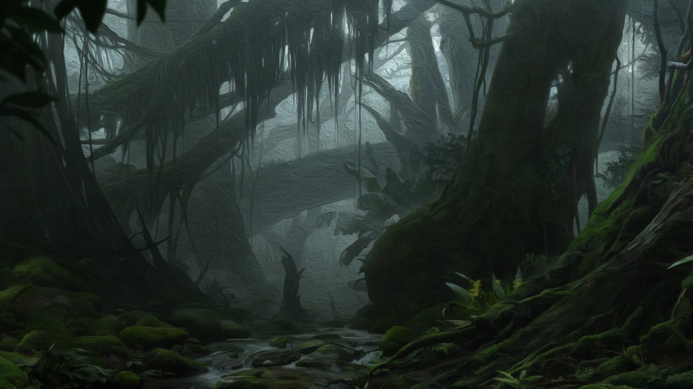
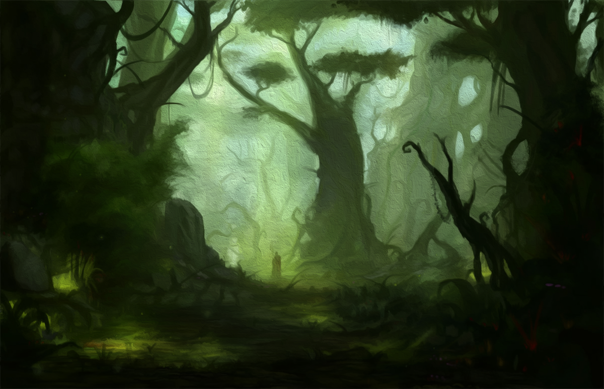
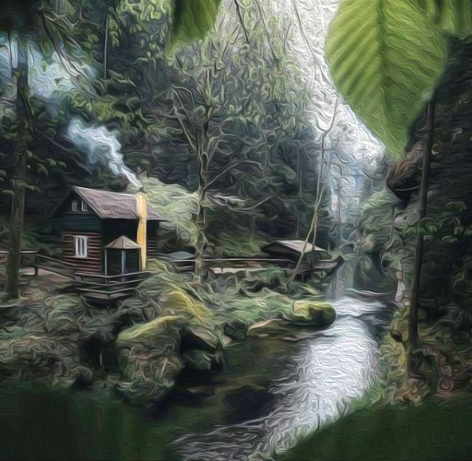
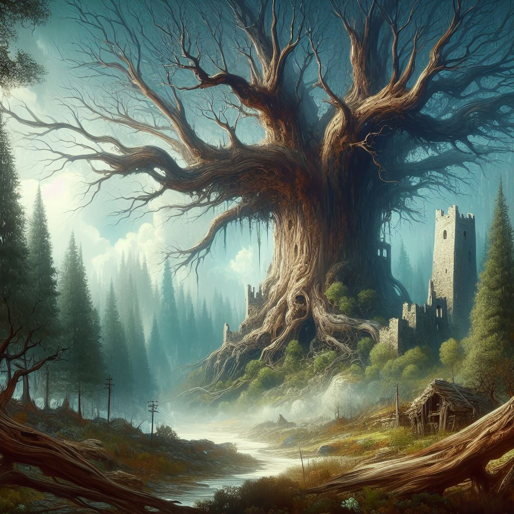
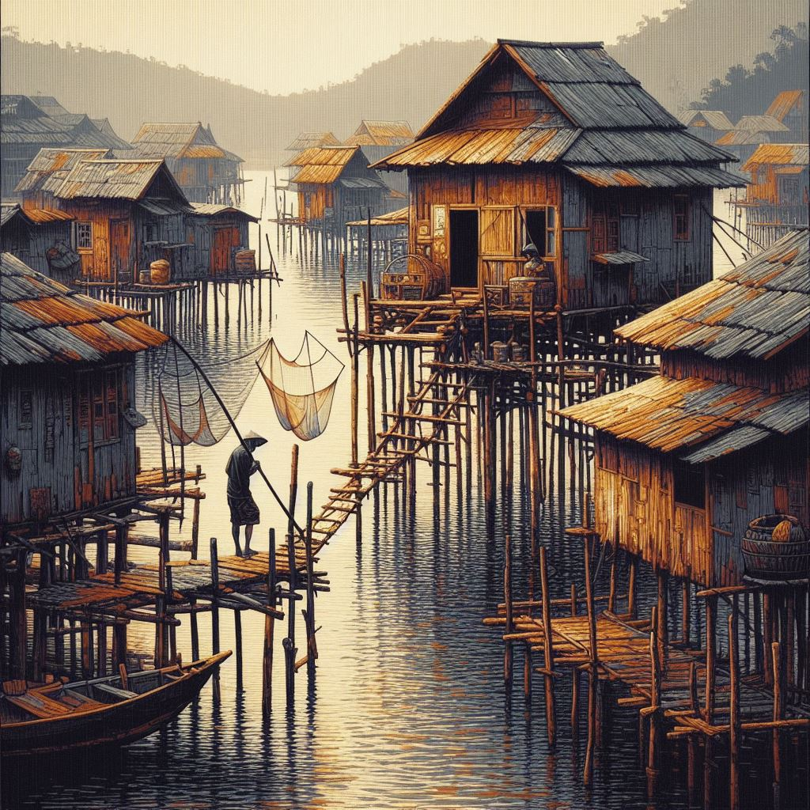

# [LOKACE a NPC] Hlubočina

## Post 664214

**Author:** Orákulum  
**Posted:** 2023-02-16T20:24:46+00:00  
**Source:** https://rpgforum.cz/forum/viewtopic.php?p=664214#p664214

Hlubočina

  * Nedotčený hvozd
  * Huste koruny halí lesní zemi do stínu
  * Všudypřítomné chuchvalce mlhy
  * Časté déště
  * Elfové, vždy ostražití
  * Starověké stromy pokryté tlustými vrstvami mechu
  * Divoké říčky prořezávající se zarostlým terénem
  * Skřípot, hučení a šumění

---

## Post 664215

**Author:** Orákulum  
**Posted:** 2023-02-16T20:26:55+00:00  
**Source:** https://rpgforum.cz/forum/viewtopic.php?p=664215#p664215

Rozcestník

**Lokace**  

  * [Bílá voda](https://rpgforum.cz/forum/viewtopic.php?p=685973#p685973)
  * [Essus](https://rpgforum.cz/forum/viewtopic.php?p=664217#p664217) (Orlí skály)
  * [Nabuma](https://rpgforum.cz/forum/viewtopic.php?p=664216#p664216)
  * [Karmínová věž](https://rpgforum.cz/forum/viewtopic.php?p=664218#p664218)

**Postavy**  

  * [Sidan](https://rpgforum.cz/forum/viewtopic.php?p=664217#p664217) \- vrchní kněz Essu
  * [Uktannu](https://rpgforum.cz/forum/viewtopic.php?p=664216#p664216) \- elfí šaman, pomohl postavám v Nabumě
  * [Elfí odpadlík](https://rpgforum.cz/forum/viewtopic.php?p=664218#p664218) \- unesl a zranil Ravela

**Hrozby**

  * [V Karmínové věži](https://rpgforum.cz/forum/viewtopic.php?p=664218#p664218) procitá Prastarý a láká k sobě následovníky; podporují ho elfí odpadlíci ➡️ Věž byla vypálena, odpadlíci a uctívači rozehnáni

---

## Post 664216

**Author:** Orákulum  
**Posted:** 2023-02-16T20:31:03+00:00  
**Source:** https://rpgforum.cz/forum/viewtopic.php?p=664216#p664216

Nabuma

  * Elfí osada v hustém lese
  * Jádro tvoří obrovské stromy padlé jeden přes druhý, v dutinách elfové žijí

**Objevy**

  * Při první návštěvě nebyly postavy vpuštěny dovnitř - moc toho nevíme
  * Pomohli Tristanovi s jeho nemocí
  * Mají lidský Kruh Essus jako zdroj obživy; ten se potýká s nějakou zhoubou a Tristan se zavázal to vyřešit
  * Tristan pro elfy očistil Essus od zhoubného vlivu Paní lovu a zavázal se, že pro elfy najde jiný zdroj života
  * Tristan dovedl do Nabumy Zlomeného jako náhradu místo lidí z Essu a zavázal se zjistit více o propojení Zlomených a nemoci ze Starého světa

**POSTAVY**

  * Šaman Uktannu - zachránil Tristanovi život; poradil Myrickovi, že Ravel najde pomoc u obrů; poradil Bjornovi, že elfího odpadlíka najde v Karmínové věži
  * Ukames - elf, který byl poslán do [Wulanovy ztracené soutěsky](https://rpgforum.cz/forum/viewtopic.php?p=690903#p690903), aby v ní získal část Wulana a k oslabení vůle Zlomených; Byl zajat v [Pískovišti](https://rpgforum.cz/forum/viewtopic.php?p=690803#p690803) a Tristan s Myrickem mu [pomohli](https://rpgforum.cz/forum/viewtopic.php?p=693976#p693976) na cestě do Wulanovy soutěsky

---

## Post 664217

**Author:** Orákulum  
**Posted:** 2023-02-16T20:34:37+00:00  
**Source:** https://rpgforum.cz/forum/viewtopic.php?p=664217#p664217

Essus

  * Elfí řečí Essus, lidskou Orlí skály
  * Lidský kruh ve skalnatém terénu na břehu divoké řeky Orlice
  * Nebývá tam bezpečno, nejenom kvůli tomu, že leží příliš blízko elfímu území
  * Tristan tam kdysi řešil problémy s divokými běsy
  * V Essusu uctívají něco, co považují za Paní Lesa. Při tom už dlouho dělali netradiční rituály, zahrnující lov zvěře. Cca před rokem začali lovit i lidi, nejprve usvědčené zločince, ale teď už nejspíš kohokoliv nepohodlného či v nesprávnou chvíli na nesprávném místě. Od té doby, co zapojili lidské oběti, moc uctívané bytosti roste. Díky tomu kněží mohli vyhnat elfy. _(Podrobně[zde](https://rpgforum.cz/forum/viewtopic.php?p=664437#p664437))_

**Objevy**

  * Zdroj obživy elfů z Nabumy
  * Postavy se setkaly na blatech s trojicí lovených uctívačů. Odmítly je vydat lovcům, dva lovce zabily a třetí utekl s tím, že za tohle zaplatí.
  * Essus byl dlouho pod útiskem elfů, kteří "mizeli" lidi z Kruhu. Po nějaké době přešel Kruh na dobrovolné oběti - děti, které elfům poskytoval. Postupně hlavní kněz získal moc skrz Paní lovu a dokázal s ní elfy zahnat, zároveň ale začali lovit lidské oběti dle nových zvyklostí. Podrobně [zde](https://rpgforum.cz/forum/viewtopic.php?p=664884#p664884) a [zde](https://rpgforum.cz/forum/viewtopic.php?p=664892#p664892).
  * Postavy přesvědčily místní, aby se zřekli Paní lovu a vrátili se ke starým pořádkům; Paní lovu posedla vesničanku Glynn a utekla.
  * Tristan narazil na Glynn a pár rodin v lese nedaleko Essu, vyhnul se jim
  * Tristan informoval Sidana a Kruh o osudu Padmy a rozhodnutí elfů, že na nějaký čas zkusí získávat život ze Zlomených
  * Elfové kolem Essu [vybudovali kruh ochranné magie](https://rpgforum.cz/forum/viewtopic.php?p=689571#p689571), která znesnadňuje cestu do hvozdu a zpět

**POSTAVY**

  * Yorath - Strážkyně z Šedé řeky, která se rozhodla Essu pomoct od elfů
  * Trojice uctívačů, se kterou se postavy setkaly v nedalekých bažinách (Edda, Gethon a Katja).
  * Sidan - Vrchní kněz, který nosil čelenku z paroží, skrz kterou k němu promlouvala Paní lovu (+má dceru Padmu)
  * Glynn - Vesničanka, kterou na útěku posedla Paní lovu
  * Artiga - dívka, které jsem v sebeobraně zabil posednutou matku a sehnali jsme pro ní stříbrné náramky

---

## Post 664218

**Author:** Orákulum  
**Posted:** 2023-02-16T20:35:42+00:00  
**Source:** https://rpgforum.cz/forum/viewtopic.php?p=664218#p664218

Karmínová věž

  * Dávno zapomenuté místo, ruiny, připomínající temnou historii elfího lidu
  * Pod Karmínovou věží jsou rozsáhlé prastaré ruiny a zastavěný chrám Pomsty
  * Samotná věž má podobu obrovského dutého stromu, který vyrůstá na zbytcích původní kamenné věže a je protkaný spletí lávek a žebříků

**Objevy**

  * Elfí odpadlíci tam vyvolávají nějakého [Prastarého](https://rpgforum.cz/forum/viewtopic.php?p=672497#p672497) a ne všem se to líbí
  * Odpadlíci [šíří](https://rpgforum.cz/forum/viewtopic.php?p=674626#p674626) slovo o Prastarém a vítají ty, kteří se k nim chtějí přidat
  * V podzemí původní svatyně Pomsty Tristan s Bjornem Pomstu "osvobodili" a odnesli s sebou v podobě Tristanovy přísahy
  * Tristan s Bjornem osvobodili zajatce, které tu přisluhovači Prastarého drželi
  * Tristan s Bjornem přerušili rituál povolání Prastarého a celou Karmínovou věž (obrovský strom) zapálili
  * Z hořící věže uprchla elfka, která pomáhala v kuchyni, a nejspíš v sobě nese Prastarého

**POSTAVY**

  * Elfka, která pomáhala v kuchyni a při útěku Tristana a Bjorna zradila - nese v sobě Prastarého

---

## Post 685973

**Author:** Orákulum  
**Posted:** 2023-12-28T20:30:02+00:00  
**Source:** https://rpgforum.cz/forum/viewtopic.php?p=685973#p685973

Bílá voda

  * Osada na jezeře, ze které pocházelo několik vězňů osvobozených v Karmínové věži
  * Na břehu jezera mají hlídky a loďky, které zajišťují spojení s osadou

**Objevy**

  * Tristan a Bjorn sem přivedli osvobozené vězně z Karmínové věže - pár místních a několik cizinců, kteří tu našli útočiště na zimu
  * Bjorn a Tristan se vydali na sever osvobodit ženy místních rybářů, které pravděpodobně darovali přisluhovači Prastarého jako otroky tajemné armádě
  * Bjorn a Tristan dovedli zpátky osvobozenou Miri a dopravili tělo zemřelé Ryany
  * Bjorn a Tristan za svou pomoc získali pouto s Kruhem

**POSTAVY**

  * Styrr - jeden z rybářů
  * Miri - žena rybáře zachráněná od otrokářů

---

## Post 690293

**Author:** Orákulum  
**Posted:** 2024-03-04T10:09:58+00:00  
**Source:** https://rpgforum.cz/forum/viewtopic.php?p=690293#p690293

Tajemná bažina

  * Mokřad plný mrtvých stromů a svůdných blikajících světýlek

**Objevy**

  * Bjorn tu [zahlédl](https://rpgforum.cz/forum/viewtopic.php?p=690150#p690150) Zplozence noci, stvůru podobné té z Karmínové věže. Zplozenci žijí v hlubinách moří, nebo pod zemí, v ruinách a chrání prastará tajemství a poklady; za zimních nocí, jako je tahle, někdy, jen někdy, vylézají na povrch.

**POSTAVY**

---

## Post 690295

**Author:** Orákulum  
**Posted:** 2024-03-04T10:25:46+00:00  
**Source:** https://rpgforum.cz/forum/viewtopic.php?p=690295#p690295

placeholder
