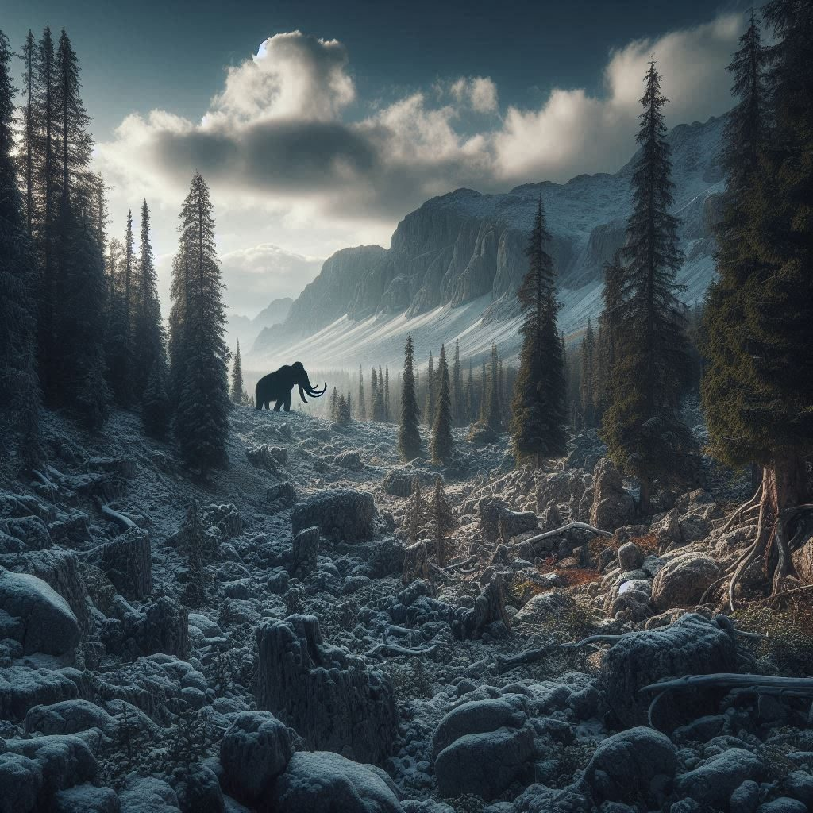

# [LOKACE a NPC] Bouřné vrchy

## Post 676333

**Author:** Orákulum  
**Posted:** 2023-07-15T17:15:52+00:00  
**Source:** https://rpgforum.cz/forum/viewtopic.php?p=676333#p676333

Bouřné vrchy  

  * Zakrslé lesy
  * Kvílení větru
  * Mlhou zahalené vodopády
  * Hornické osady
  * Tábory kočovníků na náhorních plošinách
  * Železné karavany táhnoucí náklad rudy.
  * Ostražití obři, kteří si udržují odstup
  * Mamuti pasoucí se na alpských loukách.

---

## Post 676334

**Author:** Orákulum  
**Posted:** 2023-07-15T17:17:26+00:00  
**Source:** https://rpgforum.cz/forum/viewtopic.php?p=676334#p676334

Rozcestník

**Lokace**

  * [Bukovec](https://rpgforum.cz/forum/viewtopic.php?p=701292#p701292)
  * [Kazeera](https://rpgforum.cz/forum/viewtopic.php?p=701932#p701932)
  * [Údolí kleče](https://rpgforum.cz/forum/viewtopic.php?p=698433#p698433)
  * [Útes záhad](https://rpgforum.cz/forum/viewtopic.php?p=690840#p690840)

**Postavy**  
  
  
**Hrozby**  

  * Na severu [umírají obři](https://rpgforum.cz/forum/viewtopic.php?p=675359#p675359). Ve velkém.

---

## Post 690840

**Author:** Orákulum  
**Posted:** 2024-03-13T09:44:13+00:00  
**Source:** https://rpgforum.cz/forum/viewtopic.php?p=690840#p690840

Útes záhad

  * Poloostrov na východním pobřeží Bouřných vrchů.
  * Žijí zde kameny [Rattle](https://rpgforum.cz/forum/viewtopic.php?p=690832#p690832)
  * Ostrá skaliska posetá zbytky ztroskotaných lodí
  * Po skalách se kolem nás motají malí mořští krabi a občas nějaká krysa nebo jiný hlodavec. Jsou pomalí, malátní a slabí. Krysy vypelichané, krabi se motají dokolečka a táhnou za sebou bezvládná klepeta. I racci tu krouží nízko, jako by se od skal nedokázali pořádně odtrhnout. Pro námořníky je tohle možná záhadné, pro mě to jsou jasné stopy po něčem temném.

**Objevy**

  * Myrick s Tristanem sem přišli hledat kameny Rattle

**POSTAVY**

---

## Post 698433

**Author:** Orákulum  
**Posted:** 2024-08-20T09:02:09+00:00  
**Source:** https://rpgforum.cz/forum/viewtopic.php?p=698433#p698433

Údolí kleče

  * Táhlé údolí vysoko v horách porostlé klečí
  * Žijí tu v okolí horníci, zimuje tu obryně Tenura
  * Je tu obřím hmyzem zamořený důl na černé železo

**Objevy**

  * Tristan a Myrick [přišli](https://rpgforum.cz/forum/viewtopic.php?p=698288#p698288) do údolí hledat zimující obryni Tenuru, narazili na opuštěnou hornickou karavanu se schovanými úmluvami mezi obry a horníky
  * Tristan a Myrick se vydali prozkoumat opuštěný důl na černé železo, ve kterém čekali horníky z karavany i Tenuru
  * Tristan a Myrick se přes všelijakou havěť probili a propadli až do propasti, kde narazili na obřího pavouka posetého jiskrami a [zbytek horníků](https://rpgforum.cz/forum/viewtopic.php?p=699363#p699363) z karavany, kteří tu přežívali
  * Tristan v doupěti obřího pavouka [našel](https://rpgforum.cz/forum/viewtopic.php?p=699545#p699545) elfí květinu, která roste z černého železa, a dokáže Nemocné proměnit ve Zlomené
  * Tristan a Myrick našli [obří zimoviště](https://rpgforum.cz/forum/viewtopic.php?p=699755#p699755), na které se dobývali horníci pod vedením Kalida z nedalekého Kruhu, kteří přišli o svůj důl a snažili se zabrat tento; v nastalém konfliktu s obryní Tenurou byla obryně Tristanem [zabita](https://rpgforum.cz/forum/viewtopic.php?p=700169#p700169) a horníci odešli hledat jiný důl
  * Myrick při rituálu "[oživil](https://rpgforum.cz/forum/viewtopic.php?p=700422#p700422)" Tenuru, ta jako nemrtvá obryně teď [terorizuje](https://rpgforum.cz/forum/viewtopic.php?p=700795#p700795) okolí

**POSTAVY**

  * 🧟‍♀️ Tenura - obryně obchodnice, nemrtvá, terorizuje okolí na východ odsud
  * Chandra, Fanir, Keelan - hornici z karavany, kteří v dolech přežili
  * Kalidas - vůdce horníků, který přísahal pro svůj Kruh získat nový důl; nedokázal porazit Tenuru a přesvědčili jsme ho, aby odešel zkusit štěstí jinam

---

## Post 701292

**Author:** Orákulum  
**Posted:** 2024-10-14T14:28:29+00:00  
**Source:** https://rpgforum.cz/forum/viewtopic.php?p=701292#p701292

Bukovec

  * Hrubou palisádou obehnaná osada na strmé skále
  * Kruh znovu získal svůj domov poté, co z něj v létě vyhnal varou

**Objevy**

  * Tristan s Myrickem tu [našli útočiště](https://rpgforum.cz/forum/viewtopic.php?p=701291#p701291) při cestě na východ
  * Místní [mlžili](https://rpgforum.cz/forum/viewtopic.php?p=701507#p701507), když došlo na [Kazeeru](https://rpgforum.cz/forum/viewtopic.php?p=701932#p701932) a nechtěli, aby se tam Myrick s Tristanem vydali

**POSTAVY**

---

## Post 701932

**Author:** Orákulum  
**Posted:** 2024-10-30T12:47:02+00:00  
**Source:** https://rpgforum.cz/forum/viewtopic.php?p=701932#p701932

Kazeera

  * Hrubou palisádou obehnaná osada na strmé skále
  * Vesnice zatopená jezerem

**Objevy**

  * Tristan s Myrickem se tu setkali s mamutí Oblačnou bohyní jménem Anunna a po krátké potyčce jim Anunna dovolila pokračovat dál
  * Myrick v polozatopeném domě našel a vyzvedl dědictví Halímy z Kamenobrodu

**POSTAVY**

  * Anunna - oblačná bohyně v mamutí podobě
