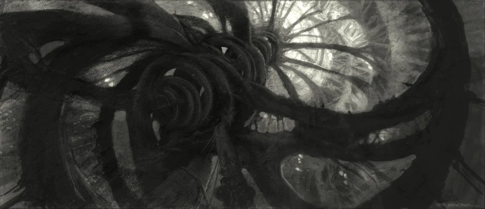
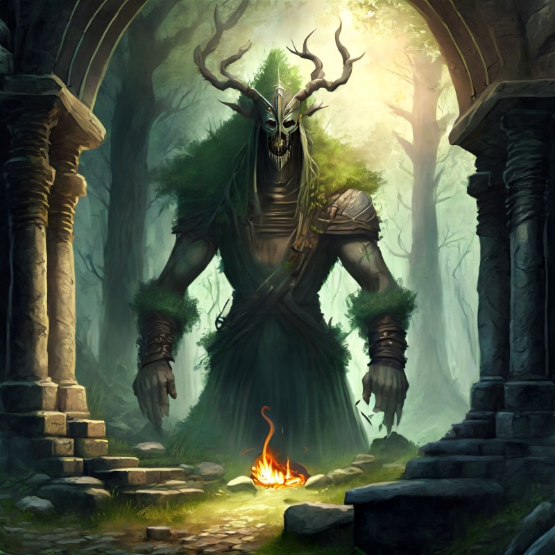

# [HRA] Karmínová věž

## Post 681264

**Author:** Tristan Baldurson  
**Posted:** 2023-09-29T08:44:51+00:00  
**Source:** https://rpgforum.cz/forum/viewtopic.php?p=681264#p681264

**_Bjorn, Finna a Tristan vyráží z[Bouřného lesa](https://rpgforum.cz/forum/viewtopic.php?p=681265#p681265)._  
**  
Jsem rád, že zůstaneme sami s Bjornem a Finnou. Cítím sílící nutkání si zalézt někam doprostřed hlubokého lesa a zůstat aspoň pár měsíců bez lidí. Nejlíp celou zimu.  
  
S tímhle návrhem ale nepřijdu. A nechám zatím bez odpovědi Bjornovu nabídku na Divokou Vodu. Nechci slibovat něco, čeho se nemusím dožít.  
  
Napiju se pálenky a načmárám do hlíny pár čar, které si vybavuju z útržků map Železných zemí.  
  
"Tady někde jsme my. Tady Karmínová věž. Mezi námi hory a Naděje. I když... Na severu trollové, Eric a vůbec. Na jihu nájezdníci, kteří plundrují Mokřiny. Hm... Nejsem jako ty, Bjorne. Nechci dávat nikomu do zubů, pokud nemusím. Šel bych na na západ, k horám. Buď je přejdeme, nebo ne. Když ne... pobavíme se dál."  
  
Přeberu svoji tornu a podělím se s Bjornem o nějaké jídlo a další vybavení. Na bolavých zádech toho teď stejně moc neunesu.  
  
_Zprůměrujeme společné zásoby na 2📦._  
  
Když si balím věci, přemýšlím pořád nad tím, co Bjorn vyprávěl o Ericovi. Nechci se s ním teď potkat. Nechci řešit, komu slouží a proč. Mám cíl a jasnou cestu, ze které nesmím uhnout. Karmínová věž a prastarý jsou důležitější. Ale Eric...   
  
Vyrazíme vstříc zapadajícímu slunci a Bouřný les necháme, konečně, za sebou. Bjorn zná osadu a její okolí líp než já a nechám ho nás vést. Držím se za ním po boku Finny. Vyptávám se jí, odkud pochází a co zatím s Bjornem zažila. Nechám si převyprávět všechno, co mi už říkal on. Ne, že bych mu nevěřil. Ale nutně potřebuju rozptýlit. Nedokážu myslet na to, co se to u všech bohů s Ericem stalo.  
  
_🚶‍♀️🚶 Cesta do Karmínové věže 🌑🌑🌑🌑🌑🌑🌑🌑🌑🌑  
Cestování více regiony nebo do sousedního regionu obtížným terénem - Formidable - 🌕 za milník  
  
**Vede a hází Bjorn:  
**🔀 Undertake a Journey **Začátek cesty**(Rozum)** Miss**   
🎲 Action Score 2 + 2 + 1 = 5 Challenge Dice 8, 5   
✍️ You are waylaid by a perilous event. Pay the Price.  
🔮 Pay the Price [52] It causes a delay or puts you at a disadvantage._  
  
Než se vymotáme z osady a přilehlého lesa, trvá to. Možná i proto, že se pořád nedokážu rozhodnout, že jdeme správně. Západ poznám, ale možná by vážně bylo lepší jít severní cestou. Nebo jižní. Nebo někam úplně jinam...  
  
Když se konečně dostaneme do míst, kde se ztratí vyšlapané stezky, a která ani Bjorn nezná, začne padat první sníh. A to ještě nejsme ani v podhůří.  
  
"Chtěl jsi strávit zimu v Divoké Vodě, jo? Budeme rádi, když do jara dojdeme do Karmínové věže," zabručím. A hned k tomu omluvně dodám: "Nevím, čím to je. Možná jsem příliš moc zim strávil na úpatí horké sopky v Šedé řece. Možná jsem se pořád ještě nesrovnal s tou lavinou. Možná jenom nemám rád zimu. Nevím."  
  
Navrhnu přečkat hned první noc tady. I když jsme toho moc neušli, tu není nejlepší místo a nemáme zásob na rozdávání. "Musíme si rozvrhnout síly, podívat se na to, co máme a co nám chybí. Potřebuju trochu plánovat. A bolí mě záda."  
  
Najdu zvířecí stopy a malou jeskyni. Tři se tam vejdeme. U vchodu rozkřešu malý oheň. Skrz plameny vidíme padající vločky. Ráno už bude asi všechno bílé.  
  
_🔀 Make Camp**Odpočineme si trochu a přeuspořádáme síly?**(🌲 Rozum)** Strong Hit**   
🎲 Action Score 6 + 2 + 0 = 8 Challenge Dice 5, 1   
✍️ Choose two (🌲 +1): Recuperate: Take +1 health for you and any companions. Relax: Take +1 spirit. Focus: Take +1 momentum.  
  
Bjorne, máš 3 volby a slovo. Co uděláme dál?_

---

## Post 681268

**Author:** Bjorn Olafsson  
**Posted:** 2023-09-29T10:58:06+00:00  
**Source:** https://rpgforum.cz/forum/viewtopic.php?p=681268#p681268

Tristan viditelně nemá moc dobrou náladu a něco ho tíží. Vůbec neodpoví na mou nabídku a hned začíná výčtem potíží a překážek. Zatím mi to nevadí, i když jsem trochu zklamaný. Přece jen, návštěvu mé rodné osady nenabízím jen tak někomu na potkání. Ale nevadí, třeba si to jen chce rozmyslet.  
  
„Pár hrdinských činů mi ještě zbývá, než budu moci stanout před staršími osady. Tak si při nejhorším chytím sněžného vlka a dojedu tam na něm,“ vtipkuji.  
  
V jeskyni je oproti vývratu, kde jsme strávili minulou noc, vlastně útulně. Rozděláme oheň a kontrolujeme zásoby.  
„Máme skoro všechno, co potřebujeme. Přikrývky, křesadla, měchy na vodu. Luk a šípy. Od Padmy mi ještě zbývá všechna léčivá mast i obvazy,“ zvednu důležitě ukazováček, protože to, že jsem za celou čtyřdenní výpravu na sever neutržil ani já ani Finna žádné vážné zranění je téměř zázrak.  
„Mám tu poslední lano a nějaké skoby. Pár pochodní. Jediné, co nám vážně chybí, je jídlo. Budeme muset něco ulovit hned zítra, nejpozději pozítří.“  
  
_✍️ Choose two (🌲 +1): Relax: Take +1 spirit. Focus: Take +1 momentum. Prepare: When you break camp, add +1 if you Undertake a Journey_  
  
...  
  
_🔀 Undertake a Journey**Začátek cesty**(Rozum)** Miss**   
🎲 Action Score 2 + 2 + 1 = 5 Challenge Dice 8, 9   
✍️ You are waylaid by a perilous event. Pay the Price._  
  
Další ráno nás však vůbec nenaplní nadějí. Nejen, že sněžilo celou noc, ale i teď sněžení pokračuje. A fujavice. Náhlé poryvy ledového větru. Jen vystrčím hlavu, že se podívám, jak to venku vypadá, a vracím se s rampouchy ve vousech a ruce si musím třít několik dlouhých minut nad ohněm, abych v nich měl zase cit.  
  
Sedět celý den v jeskyni už není tak pohodlné, navíc vidíme, jak nám jídla ubývá. Touhle dobou jsme si představovali, že budeme na druhé straně nízkého hřebenu v údolí, lovit hojnou zvěř a něco péct nad ohněm.   
  
_✍️ −1📦_  
  
Jestli se počasí rychle neumoudří a my něco neulovíme, budeme se muset vrátit jak spráskaní psi zpět do Bouřného Lesa.

---

## Post 681273

**Author:** Bjorn Olafsson  
**Posted:** 2023-09-29T13:31:19+00:00  
**Source:** https://rpgforum.cz/forum/viewtopic.php?p=681273#p681273

Když musíme trčet v jeskyni, nebudeme všechen čas trávit seděním na zadku a zíráním do ohně. Finně přistrčím klacek a svým praštím o štít.  
  
„Chceš cvičit tady?“ podívá se na mě nevěřícně.  
„A kolik místa myslíš, že bude v Karmínové věži? Jestli nechceš sedět před věží, vařit nám polívku a čekat, až se vrátíme, tak se budeš muset zlepšit, než tam dorazíme.“  
  
Postavíme se proti sobě a procvičujeme základní výpady.  
„Noha,“ zabručím. „Au.“  
„Pozor ruka.“ „Au!“  
„Postoj!“ „Auva.“  
„Kam se díváš?“ „Jau.“  
  
„Vůbec mě neposloucháš a děláš si to po svém.“  
„Dělám to podle tebe,“ oponuje, „nejsi dobrý učitel. Ale jsi dobrý bojovník, odkoukám to.“  
Dlaní se plesknu do obličeje: „Neokoukáš. Za prvé, budeš muset bojovat úplně jiným způsobem, než já. A za druhé, z počátku bojovat nebudeš, chápeš? Jen nám občas pomůžeš, jinak tě zabijou.“  
Finna protočí oči, jako že si vymýšlím.  
  
„Tak jo. Postav se tady, vem si štít, a braň se.“  
Rozzáří se jí oči, protože konečně děláme něco jiného, podle ní „opravdovou lekci“. Postaví se jakž takž, přikrčí se za štítem.  
Udělám dva rychlé kroky a vrazím do ní ramenem. Padne na zadek.  
„Teď ty,“ přikrčím se za štítem já.  
Vyrazí do útoku, vrazí do mého štítu vší silou, já ji odstrčím. Padne na zadek.  
  
„To není fér! Jsi větší, silnější, mohutnější!“  
„Přesně. Boj není fér. Takže poslouchej, co ti říkám, a nezkoušej mě napodobit. Když říkám, že máš útoky odrážet stranou a ne je zastavit silou, myslím to vážně. A když říkám, že musíš využít toho, že jsi rychlejší, ne silnější, tak to taky myslím vážně. Tak znovu...“

---

## Post 681275

**Author:** Tristan Baldurson  
**Posted:** 2023-09-29T15:13:36+00:00  
**Source:** https://rpgforum.cz/forum/viewtopic.php?p=681275#p681275

Sedím v koutě jeskyně a pozoruju Bjorna s Finnou. Chápu, o co se snaží. Vzpomínám na dívku z Naděje, která málem zařvala v červích ruinách. Dopadne Finna jinak? Pokud jenom málem zařve, bude to asi to nejlepší, co jí může potkat.  
  
Čím víc se ti dva dohadují, buší mi srdce a chci se do toho vložit. Ale co vím já o šermování mečem? Mám kopí, vždycky jsem ho měl. Na boj s netvory je lepší - má délku, pružnost, všestrannost. Dá se s ním rozumně vrhnout. Můžu se o něj opřít. Na násadu můžu navěšet amulety proti běsům. Co z toho zmůžu s mečem?  
  
Vím leda tak prd a tak vylezu na kraj jeskyně. Když došlápnu do čerstvého sněhu, cítím se... lépe. Je to první sníh po dlouhé době, ale jako by ke mně patřil. Ohlídnu se přes rameno, ale ti dva mají plné ruce svoji práce. Naberu sníh do dlaní a schladím si v něm hlavu. Je to skoro až příjemné. Popadnu luk a rozhodnu se vyrazit ven.  
  
I když fouká jako na ostrovech, je na zemi patrný každý pohyb, každá stopa. Vidím drobné zajíce, ptačí nožky i drobné rýhy, nejspíš po veverkách. O kus dál i psí nebo vlčí stopy - asi jeden zvědavec, který jenom nakoukl k jeskyni a šel si zase po svých. Odvážím se dál.   
  
Projdu kus lesa a shodím luk z ramene. Natáhnu a záda odmítnou pokračovat dál. Odvážu proto tětivu a s pár dalšími drobnostmi z torny udělám jednoduché oko. Ve sněhu vidím přesně, kam zajíci mířili a kde jsou zalezlí. Jenom je dostat ven.  
  
_🔀 Resupply**Doplním nějaké zásoby?**(Rozum)** Miss**   
🎲 Action Score 6 + 2 + 0 = 8 Challenge Dice 10, 8   
✍️ You find nothing helpful. Pay the Price. -1🧠  
  
🔀 Endure Stress **V jaké náladě se vrátím do jeskyně?**(Vůle)** Strong Hit with a Match**   
🎲 Action Score 5 + 4 + 0 = 9 Challenge Dice 7, 7   
✍️ Embrace the darkness: Take +1📈, protože match tak ještě +1📈._  
  
Nevím, kolik uběhne času, než to vzdám. Mám zamotanou tětivu, sníh v botách, pod košilí a ve vousech a sotva zvládám najít vlastní stopy, abysem se dostal zpátky k jeskyni. Chvíli jenom stojím mezi stromy a řvu. Doufám, že směrem od jeskyně pryč, nechcu je vyděsit. Ale řvu, než mě začnou bolet plíce a bolest v zádech trochu poleví. Pak pomalu vyrazím směrem, který je snad zpátky.  
  
"Mám tohle vůbec zapotřebí?" mručím si přes zmrzlé vousy, když hledám cestu skrz chladné a ostré stromky. "Mám," odpovím si hned. Přísahal jsem? Přísahal. Přijal jsem prokletí Měsíčního medvěda, běsu a laviny? Přijal. Tenhle lov je jenom jedna chyba v dlouhé řadě, už je ani nedokážu počítat. Ale poučil jsem se z nich? Poučil. Posunul. A teď posunu nás všechny. Když se tady nedá vydržet ani najíst, půjdeme jinam. Rozhodnuto.  
  
Dobloudím do jeskyně, setřepu ze sebe sníh a hodím Finně luk: "Máš šikovné prsty, oprav to," zavrčím. "A balit, honem, jdeme, než si to rozmyslím."  
  
_🔀 Undertake a Journey**Podaří se nám odejít?**(Rozum)** Miss**   
🎲 Action Score 2 + 2 + 0 = 4 Challenge Dice 10, 8  
✍️ -10📉 =>** Weak Hit**  
✍️ You reach a waypoint and mark progress, but suffer -1📦.   
✍️ Bjorne, máme 0📦 a Unprepared  
  
🚶‍♀️🚶 Cesta do Karmínové věže - Formidable 🌕🌑🌑🌑🌑🌑🌑🌑🌑🌑_  
  
Možná jsem si to měl rozmyslet. Cesta je drsná, postupujeme pomalu. Je hlad a není kde brát. Vyškrábeme z toren všechno, co máme. Upínám oči k západu a razím si cestu dopředu. Nepolevím, nezastavím, aby ani Bjorn a Finna nezastavili. Možná by ale měli. Možná bysem si měl pořídit meč.

---

## Post 681279

**Author:** Bjorn Olafsson  
**Posted:** 2023-09-29T20:00:02+00:00  
**Source:** https://rpgforum.cz/forum/viewtopic.php?p=681279#p681279

Když Tristan hodí Finně luk k nohám, napruží se, aby mu něco od srdce řekla. A když jsme tu celý den tvrdli, věřím, že by to bylo hodně od plic a hodně od srdce. Navíc je naštvaná, že jsem ji švihl klackem přes zadek a má tam podlitinu, že si den nebo dva nesedne. Měla se krýt lépe a víc poslouchat, co jí říkám. Takže vstane, dá si ruce v bok a ... já ji zarazím.  
  
Vím, jaké to je, když se nedaří. Když jde člověk lovit, ale jediné, co si donese, je špatná nálada, poničené náčiní, nějakou tu odřeninu a ještě větší hlad, než s jakým vyrazil. Nadávat mu může později.  
  
_🔮 Location Description [69]**Low** Location [30] **Road**_  
  
Tristan jde první trochu napřed, taktak mu stačíme. Na jednu stranu jsem rád, že objevil nový zápal a chuť jít, na druhou mám obavy, aby to nebylo přes mrtvoly. Naštěstí, když vyjdeme na hřeben, tak přestane sněžit a dokonce vysvitne slunce z poza těžkých mraků. Studený vítr však nepolevuje. Před námi se z mlhy vynoří několik sloupů, které označují stezku pro karavany. To je dobré znamení, když se jí budeme držet, měli bychom najít nejen schůdnou cestu do údolí, ale možná i nějakou osadu.  
  
Tristana dojdu a vyměním se s ním ve vedení. Sledovat stezku je pro mě snadnější a navíc, Tristan nás už dost dlouho zaštiťoval proti mrazivému větru.  
  
_🔀 Undertake a Journey**Cesta do Karmínové věže**(Rozum)** Strong Hit**   
🎲 Action Score 5 + 2 + 0 = 7 Challenge Dice 4, 6   
✍️ You reach a waypoint. You make good use of your resources: Mark progress.  
🌕🌕🌑🌑🌑🌑🌑🌑🌑🌑_  
  
_🔮 Location Description [42]**Savage** Location [88] **Hill**_  
  
Jdeme další den a přespíme jen ve skalní rozsedlině, sice chránění proti větru, ale jinak máme jen málo pohodlí. Jídla málo, pití ještě méně a roztápět ledový sníh se nikomu moc nechce.  
  
Pak narazíme na kopec, na jehož vrcholu je zřícenina monumentu. Obří socha je rozbitá a zbyly z ní jen kusy, přesto je tušit, že byla humanoidní postavou. Torzo, nohy, ty ještě stojí. Hlava leží opodál, a zbylé trosky, které jsou velké jako dům, musí být ruce. Vše je zasněžené, ale i tak je vidět, že socha je postavená z tmavého kamene, o mnoho tmavšího, než je skála kolem.  
  
„Slyšel jsem o tomhle místě,“ promluvím. „Vyprávěl mi o něm můj přítel, průvodce karavan. Někde poblíž musí být osada.“ S tím vyrazíme na kopec. Když nesněží, mohli bychom zahlédnout stopy po lidském osídlení.  
  
_🔀 Undertake a Journey**Cesta do Karmínové věže**(Rozum)** Weak Hit**   
🎲 Action Score 6 + 2 + 0 = 8 Challenge Dice 10, 3   
✍️ You reach a waypoint and mark progress, but suffer -1📦.  
🌕🌕🌕🌑🌑🌑🌑🌑🌑🌑  
✍️ Nemáme 📦, takže každý −1🩸, 🧠 nebo 📉  
✍️ Já beru omrzliny za −1🩸_  
  
Nehodlám se vzdát, než budu sedět o teplého krbu. Není možné, že bychom tu osadu nenašli. Pozdě si uvědomím, že přestávám cítit prsty na nohou, které mě posledních několik hodin pálí.  
  
_🔀 Endure Harm**Omrzliny?**(Zdraví)** Strong Hit**   
🎲 Action Score 2 + 4 + 0 = 6 Challenge Dice 2, 1   
✍️ Embrace the pain: Take +1📈._  
  
Na chvíli si sednu a zkřehlé prsty rozhýbu. Bolí to. A to je dobře. Pak konečně zahlédneme hledanou osadu a sejdeme do údolí.  
  
„Obrův Palec,“ ukážu k palisádě opevněné osady. „Odtud k horám povede snadná cesta údolím. To těžké nás teprve čeká.“  
„Jo... A ve skutečnosti se to tu jmenuje Skalisko, Skalní Věž, nebo tak nějak. Místní se prý nemůžou dohodnout. Tak tomu lidi od karavan říkají Obrův Palec, ale místním to neříkejte!“  
  
Zvláštní, tolikrát jsem slyšel mého přítele Kjella o tomto místě hovořit, ale nikdy jsem nevěřil, že existuje.

---

## Post 681314

**Author:** Tristan Baldurson  
**Posted:** 2023-09-30T21:54:02+00:00  
**Source:** https://rpgforum.cz/forum/viewtopic.php?p=681314#p681314

_Za Undertake a Journey -1🧠  
🔀 Endure Stress **Srovnám se s další osadou?**(Vůle)** Miss**   
🎲 Action Score 1 + 3 + 0 = 4 Challenge Dice 9, 8   
✍️ Suffer -1📉. If you are at 0 spirit, you must mark shaken or corrupted (if currently unmarked) or roll on the table._  
  
Nejsem vůbec nadšený, že už zase míříme mezi lidi. "Copak to všechno v Bouřném lese a na Rudém vrchu nestačilo? Copak nám v lese není dobře? Chápu, že nemáme skoro nic k jídlu, je zima a luk sotva drží pohromadě. Ale jsem si jistý, že s tím, co nabízí divočina, bysme to celkem dobře zvládli. Takhle si už zase jdeme koledovat o průšvih."  
  
Finna vypadá, že moje argumenty vůbec neposlouchá a nadšeně míří k palisádě. Někdy hlad zatmívá rozum.  
  
_Bjorne, můžeš._

---

## Post 681349

**Author:** Bjorn Olafsson  
**Posted:** 2023-10-01T18:29:38+00:00  
**Source:** https://rpgforum.cz/forum/viewtopic.php?p=681349#p681349

„Chápu tě. Z tebe je teď možná zálesák a samotář. V Bouřném Lese se ti to nevyvedlo, pro to mám taky pochopení. Obvykle jsem to já, koho odevšad ženou a ještě za ním ječí, ať už se nevracím. Ale my potřebujeme něco k jídlu. Tak se utáboř tady na okraji lesa, my skočíme do osady, vyměním něco za jídlo a pár dalších věcí, a zase vypadneme. Žádné dlouhé vysedávání, žádné potíže. Hned jsme zpátky.“  
  
S tím zrychlím a nechám Tristana za sebou. „Finno počkej!“  
  
_✍️ Pokud Tristan nepůjde dovnitř, stejně bych to bral jen jako color, Sojourn v osadě Tristana ovlivní tak nebo tak. Když se něco podělá, tak ho do toho namočíme , takže by měl dostat i bonus, když to náhodou vyjde._   
  
_🔮 Trouble [17]**Revolt against a leader**  
🔮 Action [72] **Find** Theme [75] **Mysticism**  
🔮 Ask the Oracle: Likely **Pustí nás bez problémů dovnitř?** Rolled 7 vs. 75: **Yes**_  
  
Dojdeme k bráně a ostražitý strážce nás přeletí pohledem.  
„Hej, vy nevypadáte jako předvoj karavany?“  
„Správně, my nejsme s karavanou,“ odpovím, „jdeme na západ a chceme jen vyměnit pár cenností za něco k jídlu, abychom mohli pokračovat dál.“  
„A odpočinout si,“ dodá Finna, s čímž sice nesouhlasím, ale její ztrápený hlas by mohl strážného obměkčit, kdyby měl nějaké výhrady. Zatvářím se jak nejmírumilovněji dokážu.  
„A nemoc, tam odkud jdete, žádná není?“  
Podíváme se na sebe: „Ne, žádné nemoci.“  
„Tak dobrá, můžete dovnitř, ale žádné potíže, jasné?“  
Přikývneme a projdeme branou.  
  
_🔮 Ask the Oracle: 50/50**Je tu nějaká karavana?** Rolled 95 vs. 50: **No**_  
  
Hned narazíme na velký hostinec se stájemi, podle toho, jak jsou prázdné tu bohužel na žádnou karavanu nenarazíme. Škoda, mohli jsme nejen vyměnit něco užitečného, ale s trochou štěstí se dozvědět novinky a třeba se k někomu připojit.  
  
Usadíme se a vezmeme za vděk svařeným vínem. Chvíli poslouchám místní. Prý před zimou vždy z hor schází jejích vědma, stará a zkušená léčitelka, aby tu přes zimu přebývala a pomáhala s léčením neduhů. První sníh napadl už před týdnem, ale ona nikde. Pár chlapů ji chce jít hledat, vůdce osady je proti a zakázal to. V současném zrádném počasí je to prý nebezpečné, s čímž se dá jen souhlasit. Nemám žádnou chuť se do místních záležitostí míchat, už proto, že jsem to slíbil Tristanovi. A tak vytáhnu pár stříbrných mincí z váčku a zkusím je směnit s hostinským nebo některým z hostů.  
  
_🔀 Sojourn**Obchod v hostinci**(Srdce)** Weak Hit**   
🎲 Action Score 5 + 1 + 1 = 7 Challenge Dice 10, 5   
✍️ You and your allies may each choose one from within the categories. If you share a bond, choose one more.  
✍️ Equip: Clear an unprepared debility and take +1 supply._  
  
Když ukážu stříbrnou minci, přitočí se nějaký obchodník a podaří se mi vyjednat slušnou cenu za sušené maso, chleba, sýr, a nějaké další dobroty. K tomu měch vína a pár chybějících věcí do naší výbavy.   
„Odkud máte takové zajímavé mince? Vypadají staře a velmi zachovale,“ snaží se obchodník.  
„Od jednoho stavitele mostů,“ mávnu rukou a odbudu ho dříve, než se do něčeho zamícháme.  
  
_🔮 Ask the Oracle: Small chance**Udělá Finna nějakou hloupost?** Rolled 1 vs. 10: **Yes**_  
  
„Trollího stavitele!“ pronese bezelstně Finna. To svařené víno jí jde rychle do hlavy. Celá hospoda utichne a všichni se podívají na nás. Mám takový nejistý pocit, že válka s trolly je téma, které se dostalo i sem.  
„Který už je po smrti,“ dodám temně, aby nebylo pochyb, kdo ho zabil.  
  
_🔀 Face Danger**Vylhat se ze spřízněnosti s trolly**(Stín)** Strong Hit with a Match**   
🎲 Action Score 6 + 2 + 0 = 8 Challenge Dice 3, 3   
✍️ You are successful: +1📈  
✍️ +1📈 za match_  
  
„Mrtvý troll, dobrý troll,“ přitaká hostinský a zbytek osazenstva jen souhlasně zamručí.  
„A na to se napijem,“ přidám a obrátím zbytek svařáku do sebe. Pak se vytratíme.  
  
_Je to tvoje Tristane_

---

## Post 681380

**Author:** Tristan Baldurson  
**Posted:** 2023-10-02T09:03:29+00:00  
**Source:** https://rpgforum.cz/forum/viewtopic.php?p=681380#p681380

_**... mezitím na kraji lesa ...  
**_  
"Utáboř se na kraji lesa?" zavrčím za Bjornem a hodím po něm sněhovou kouli. Přijdu s rozumným nápadem a chovají se ke mně jako k šutru na krku?  
  
Rozhodím kůži pod širokým smrkem a rozvalím se na ni. Chvíli si zkouším srovnat záda, ale moc se to nedaří. Budu potřebovat horký pramen nebo dobře mířenou ránu z druhé strany. A takovou důvěru v Bjorna zatím nemám. Zavřu oči a snažím se vybavit si tuhle část Železných zemí. Svoje cesty, vyprávění a příběhy, hvězdné nebe. Bez těch dvou na to mám klid, který potřebuju. A tuším, kudy nás vést dál.  
  
_✍️ Sojourn: Plan: Take +2 momentum._  
  
Sebevědomí mě zas postaví na nohy. Jsem pořád sám a mám nějaký čas. Nečekám, že teplo a sucho vymění za les příliš brzo. A přitom tu je všechno, co jeden potřebuje! Zima visela ve vzduchu dlouho, ale sníh přišel rychle. Určitě pod ním zůstaly nějaké bobule, kořínky nebo divoká zelenina. Stačí se podívat. A bude to určitě chutnat lépe, než nějaký vývar z kotlíku!  
  
_🔀 Resupply**Najdu něco použitelného?**(Rozum)** Weak Hit**   
🎲 Action Score 2 + 2 + 0 = 4 Challenge Dice 4, 2   
✍️ Take up to +2📦, but suffer -1📉 for each => +1📦 -1📉_  
  
  
Když o nějakou dobu později slyším Finnin smích, ještě se hrabu v hlíně. Není toho vůbec tolik, kolik jsem čekal. Na chvíli mě i napadne, jestli jsem neměl jít s nimi, ale... neměl! Ukážu Bjornovi náruč plnou jedlých hlíz a sladkých kořenů, on má chleba, sýr a maso. Chvíli na sebe mlčky hledíme a porovnáváme naše úlovky. Pak něco málo natlačíme do sebe a já nás nasměruju dál na západ.  
  
Sestupujeme po západním úbočí kopců do zalesněného údolí. Trochu se otepluje a sněhu ubývá, na zbytky po nočním sněžení narážíme jen zřídka. V Hlubočině nečekám sníh vůbec, ani kdybysme tam dorazili až za měsíc. V elfích lesích je zima zvláštní. Ale když se tam teď probouzí Prastarý... no, uvidíme. V tomhle kraji nevím o žádných velkých cestách a trasách karavan. Ale lidí tu žije dost - v osamělých osadách lesníci a uhlíři, dál na západ na planinách farmáři. Než začneme znovu pořádně stoupat, nebudeme nikdy tak úplně sami.  
  
_🚶‍♀️🚶 Cesta do Karmínové věže 🌕🌕🌕🌑🌑🌑🌑🌑🌑🌑  
🔀 Undertake a Journey **Dojdeme na další zajímavé místo?**(Rozum)** Miss**   
🎲 Action Score 4 + 2 + 0 = 6 Challenge Dice 10, 7   
✍️ You are waylaid by a perilous event. Pay the Price. 🔮It is stressful. 🔮 Theme [47] Freedom_  
  
  
Zanedlouho skutečně mineme malý dřevorubecký tábor. Statní chlapi kácí stromy s dřevem tvrdým jako kámen. Důležitý stavební materiál má cenu, kvůli které se vyplatí dřít do úmoru i v chladném počasí. Jejich ženy vaří na ohni společné jídlo a děti si hrají na schovávanou mezi obrovitými pařezy. Chtěl bych se k nim na chvíli přidat, ale musíme dál. Jen na sebe zamáváme a zmizíme jim v lese.  
  
Něco pojíme a dorazíme k široké řece. Teče spíš líně a na břehu několik lidí svazuje očištěné kmeny do vorů, na kterých se budou plavit někam na jih, možná až do Mokřin. Nabízí nám za trochu pomoci společnou plavbu, ale odmítnu. Sám ani nevím proč.   
  
V srdci cítím, že se k nim přidat chci, chci odložit železné runové kameny a kopí a zůstat s jednoduchou prací uprostřed pár milých lidí na tuhle zimu, možná na všechny zimy. Závidím jim tu možnost. A v duchu si nadávám za tuhle slabost.  
  
_🔀 Endure Stress**Padne na mě splín?**(Rozum)** Strong Hit**   
🎲 Action Score 6 + 2 + 0 = 8 Challenge Dice 5, 1   
✍️ Embrace the darkness: Take +1📈._  
  
Finna asi první pochopí, že se něco děje a i Bjorn si časem všimne, že se v táhlém kruhu stáčíme příliš na sever. Přiznám, že jsem se trochu ztratil v myšlenkách, ale víc nepovím. Něco málo pojím a nechám Bjorna převzít vedení. Pokračuju dál v závěsu a sotva vnímám, kudy jdeme. Je pošetilé myslet teď na budoucnost. Ale možná to je poslední klidná příležitost, aspoň v duchu nějakou budoucnost plánovat.  
  
_Bjorne, můžeš._

---

## Post 681382

**Author:** Bjorn Olafsson  
**Posted:** 2023-10-02T12:43:37+00:00  
**Source:** https://rpgforum.cz/forum/viewtopic.php?p=681382#p681382

Po krátkém odpočinku vyrážíme dál údolím na západ. Mám o Tristana starost. Vždycky byl připravený dát se s lidmi do řeči a pomoct jim, však i jeho nevyřčené povolání − lovec nestvůr − je hlavně o pomoci lidem. Teď však jen upírá oči k nebi nebo k západu, nepostojí a pořád chce jít dál. Sice nám vyprávěl, co vše ho potkalo, ale nejsem si jistý, co ho tak zasáhlo. Zatím se nezeptám, třeba o tom bude chtít mluvit sám, až přijde pravý čas. Nebo to z něj dostane Finna...  
  
_🔀 Undertake a Journey**Cesta ke Karmínové věži**(Rozum)** Miss**   
🎲 Action Score 1 + 2 + 0 = 3 Challenge Dice 8, 4   
✍️ −8📉 ➔ ** Weak Hit**  
✍️ You reach a waypoint and mark progress, but suffer -1📦.  
✍️ Máme 1📦  
🌕🌕🌕🌕🌑🌑🌑🌑🌑🌑_   
  
Cesta údolím a lesy je sice vcelku snadná, ale i tak úmorná. Jdeme dlouho a často musíme obcházet celé rozbahněné části. Pozitivní je, že v mlze na obzoru se čím dál více objevují vrcholky hor, které musíme překročit. Horší je, že už jdeme dva dny téměž bez zastavení, trochu bloudíme, a zásoby se nám zase povážlivě tenčí.  
  
Když se zastavíme v háji pod mohutnými duby a Tristan si, jako už obvykle, začne rozprostírat své kůže a zírá na oblohu, jen mu příkře sdělíme, že „jdeme lovit“ a necháme ho být. Stejně, jak ho znám, než přijdeme zpět, bude hořet oheň, na něm se opékat nebo péct něco z našich zásob, doplněné o čerstvé hřiby, kořínky, nebo něco původu, po kterém nechcete pátrat. Nevadí. O lov až tak nejde...  
  
„Nedrž tu tětivu tak dlouho, upadne ti ruka!“  
Tětiva zadrnčí a šíp skončí ve stromě. Vystřelím svůj a ten se zabodne jen kousek od jejího.  
„Minul jste, mistře,“ směje se mi.  
„Kušuj.“  
  
V boji zblízka se zlepšila, však taky cvičení, alespoň krátce, věnujeme každý den. Včera jsem dostal klackem přes obličej a podlitinu nosím hrdě. Znamená to, že nejsem až tak marný učitel, ale také, že už si nemůžu dovolit ten stejný přístup, jako když jsem bojoval se svou dvanáctiletou dcerou. Začíná být nebezpečná. A tak zkoušíme i střelbu z luku, abych si spravil sebevědomí.  
  
_🔀 Resupply**Lov v dubovém háji**(Rozum)** Strong Hit with a Match**   
🎲 Action Score 4 + 2 + 0 = 6 Challenge Dice 2, 2   
✍️ You bolster your resources. Take +2📦  
✍️ Máme 3📦_  
  
Ulovíme snad deset králíků, když se vracíme zpět.  
  
🔮 Location Description [89] **Expansive** Location [34] **Pond**  
  
Cestou zpět narazíme na další stopy zvěře a i když už máme naloveno, neodoláme a následujeme je. Přece jen, více zásob, zvláště na cestu přes hory, by se určitě hodilo. Pokud nechceme jíst brouky a ještěrky, při té myšlence se ušklíbnu. Dojdeme však pouze ke lesnímu jezírku, či snad studánce, ve které vyvěrá podzemní pramen. Břeh jezírka je očištěný od spadaného listí a ve stále ještě zelené trávě někdo postavil malý oltář s soškou. Na něm jsou zbytky bylin a svící, runový nápis mi nic neříká. Vzdáme tedy jen hold místním uctívaným silám a zamíříme zpět k Tristanovi. Musím mu o tom říct.  
  
_Tristane můžeš. Určitě ti řeknu o jezírku a oltáři, kdybys měl chuť to nějak rozvést. Hodil jsem match, tak to může být třeba i něco pozitivního._

---

## Post 681393

**Author:** Tristan Baldurson  
**Posted:** 2023-10-02T13:50:56+00:00  
**Source:** https://rpgforum.cz/forum/viewtopic.php?p=681393#p681393

Trvá mi, než se zvednu z kůží a nechám se odvést k jakémusi jezírku. Kdyby to byla temná jeskyně vystlaná suchou travou, bral bych ji hned. Na celou zimu. Ale takhle?  
  
Sotva ale uslyším zurčet vodu a uvidím malý oltář, vypadne mi kopí z ruky. Jedním pohybem shodím tornu s věcmi a rozeběhnu se k jezírku. Zastavím se až když jsem po pás v teplé vodě. Tuhle sošku znám, tyhle runy znám...  
  
_🔮 Theme [7] Survival_  
  
Přejedu rukou přes runový nápis a hned poznám nejdůležitější slovo **𝒢ᚱᛉ𝓛𝓛ᛇ**. A soška je zblízka taky jasná.  
  
"U Měsíčního medvěda!" zvolám a vyhodím plné dlaně horké vody nad hlavu. "Medvědí svatyně!" Vylezu z vody a začnu se rychle svlékat, ani Finna mě teď nezajímá. "Tyhle svatyně znám ze Zahalených hor! Železní lidé tam uctívají bůžka přežití - muže s medvědí hlavou a srstí. Nikdy jsem jejich svatyně neviděl jinde v Železných zemích, až dnes! A tady? To se někdo vydal na tak dlouhou výpravu? Je to jedno, vím zhruba, jaký rituál uvolní ještě víc síly. Shoďte ze sebe věci!"  
  
Jen v prádle se vrátím do vody. Okamžitě zapomenu, jaká je zima. Sednu si na dno a schovám se až po krk. Od sošky sesbírám popadané listí a větvičky a začnu je rozkládat kolem sebe na hladinu. Nesmím se skoro ani hnout, aby mi vlnky nerozbouraly obrazec. Je to blbá a úmorná práce, stejně jako blbá a úmorná snaha přežít v Zahalených horách. A bůžek přežití dává svou sílu těm, kteří to zkusí. Ať už doslova, nebo tímhle rituálem. Cítím, že se něco děje. Brzo se voda sama zčeří a listí a větvičky se mi nalepí na tělo.  
  
"Teď vy!" ženu Bjorna a Finnu do vody. "Ukážu vám to, honem!"   
  
Sám vylezu ven a začnu vedle vody rozdělávat oheň. Dnes se utáboříme tady a bude to nejlepší spánek za dlouhou dobu.  
  
_🔀 Make Camp**Pomůže nám rituál k poklidnému táboření?**(Rozum)** Strong Hit**   
🎲 Action Score 5 + 2 + 1 (🌲) = 8 Challenge Dice 4, 7   
✍️ Choose two (🌲 +1): Recuperate: Take +1🩸 for you and any companions. Relax: Take +1🧠. Focus: Take +1📈._  
  
  
Když padne noc, sedím už suchý u ohně a pomalu se zase oblékám. Najednou mi není zima, záda tolik nebolí a ani drobné vločky sněhu tolik nevadí. Cítím, že tohle jsem potřeboval a ráno bude ještě lépe.   
  
"Když jsme doma v zimě měli hlad," vzpomínám později při okusování pečeného králíka, "tak jsme jedli, co se dalo. A když ani to nebylo, vyráželi ti nejsilnější z nás do skal. V jeskyních tam přečkávali zimu lvi, ještěři a medvědi. Lvi chodili na lov a byli nebezpeční. Ještěry bylo skoro nemožné najít - hnízdili v nepřístupných skalách a celou zimu byli skoro jako mrtví, možná mrtví byli skutečně a na jaře obživli? Nevím. Ale medvědi... věděli jsme, kde je najít. A ti spali jen tak napůl. A když jsme je probudili, běsnili víc, než když někdo medvědici sáhl na mládě. Byly to kruté boje a krví zaplacené jídlo. Ale to maso i tuk nám pomohly přežít zimu. A všichni ti, co během boje padli, vlastně taky. Já... hm... teď už chápu, proč medvědi tak nesnáší zimu. Na tuhle si taky zvyknu, ale bude to trvat."  
  
  
Později té noci nechám Bjorna a Finnu spát a odejdu kus stranou, pod paží mám smotanou očištěnou jelení kůži. Na cestu mi svítí jasný měsíc. Od té nehody na Rudém vrchu, kde Měsíční medvěd přebral vládu nad knězem Ramim, jsem se bál spojení zkusit znovu. Ale dnes v noci, po rituálu a odpočinku, zase cítím naději. Na menším osvětleném plácku shodím z ramen ostatní kůže i košili a převážu si jen jelena. Zavřu oči a poslouchám rytmy nočního lesa - houkající sovy a vzdálený datel stačí, abych propadl divokému tanci mých předků ze Zahalených hor.  
  
_🔀 Bind**Spojím se bez nehody s kůží jelena?**(Rozum)** Weak Hit**   
🎲 Action Score 4 + 2 + 0 = 6 Challenge Dice 8, 4   
✍️ You or an ally may wear the pelt and add +1 when making moves with the related stat, but the wilds call as you dance; Endure Stress (2🧠)._  
  
Rituál je dnes dlouhý a bolestivý. Měsíční medvěd cítí můj strach a dává mi ho vyžrat. Pochopím, že s příchodem zimy jsou dny kratší, měsíc na nebi déle a Měsíční medvěd nabírá na síle. A já srab se přitom bojím ho požádat o sílu. Bojuju s vizemi nekonečné noci a zimy, sněhových bouří a smrtícího mrazu. Až když na konci přízračné vánice padnu vysílením, cítím z jelení kůže známé uklidňující teplo. Ale jsem vyčerpaný a netoužím po ničem jiném, než se pár dní pořádně vyspat.  
  
_🔀 Endure Stress**Ustojím to?**(Srdce)** Weak Hit**   
🎲 Action Score 4 + 2 + 1 = 7 Challenge Dice 10, 5   
✍️ You press on.  
  
Bjorne, můžeme dál._

---

## Post 681470

**Author:** Bjorn Olafsson  
**Posted:** 2023-10-03T14:05:54+00:00  
**Source:** https://rpgforum.cz/forum/viewtopic.php?p=681470#p681470

Nejdříve se leknu, že se Tristan zbláznil. Teprve až nám vysvětlí, o co jde, objeví se mi úsměv na tváři. Jestli je ta voda jen trochu teplá... Pokrčím rameny a shodím ze sebe šaty. Finna také, popravdě by mě velmi překvapilo, kdyby byla stydlivá.   
  
Chvíli na sebe jen tak hledíme. Já na její téměř dívčí postavu, přemýšlím, že ji sice vnímám jako ... sestru? Mohla by být moje dcera. Asi? Ona si zase prohlíží mé jizvy, kterými je poseté celé mé tělo. Rád bych řekl, že za každou se skrývá hrdinský příběh. Ve skutečnosti spíše příběhy chyb, zbrklostí, neuvážených rozhodnutí, blbostí a více-štěstí-než-rozumu. Jizva od harpyjí se ještě hojí.  
  
Z ničeho nic se zamyslím, jestli mi to štěstí brzy náhodou nedojde. Pak, když se podíváme sobě navzájem do očí, se oba trpce usmějeme a vlezeme do vody.  
  
Tristanovo nadšení je nakažlivé. Voda sice není nijak horká, ale stále je v ní tepleji, než venku. Finně to samozřejmě jde, je trpělivá a pečlivá. Já se občas vzteknu a plácnu dlaní do hladiny, větvičky a listí se rozletí do okolí. Přesto mám pocit jakéhosi nepřirozeného klidu a porozumění.  
  
Dnes se nám spí opravdu dobře.  
  
_✍️ Recuperate: Take +1🩸 for you and any companions. Focus: Take +1📈. Prepare: When you break camp, add +1 if you Undertake a Journey_  
  
...  
  
Vyrážíme vrzy ráno. Osvěžení a plní sil i elánu tušíme, že nám to dlouho nevydrží. Je jasno a před námi se tyčí hory. Štíty hor a skal jsou pokryté sněhem a najít cestu bude obtížné. Jestli se nám nepodaří najít nějaký průsmyk, je možné, že dojde na nejhorší: budeme muset hory obejít z jihu nebo severu. Ani jedna z těchto možností pro nás není lákavá.  
  
_🔀 Undertake a Journey**Cesta ke Karmínové věži**(Rozum)** Weak Hit**   
🎲 Action Score 1 + 2 + 1 = 4 Challenge Dice 10, 2   
✍️ You reach a waypoint and mark progress, but suffer -1📦.  
✍️ Máme 2📦.  
🌕🌕🌕🌕🌕🌑🌑🌑🌑🌑_   
  
_🔮 Location Description [91]**Settled** Location [74] **River**_  
  
Najdeme místo, kudy kdysi protékala řeka. Terén je schůdnější a vede nás jako lehce se klikatící cesta, přímo k průsmyku. Přespíme v malém lesíku a připravíme se na náročný výstup do sedla. Temná mračna, která zase zastírají oblohu nás pohánějí a tak brzy ráno, ještě než se zvedne vítr, vyrážíme.  
  
_🔀 Undertake a Journey**Cesta ke Karmínové věži**(Rozum)** Strong Hit with a Match**   
🎲 Action Score 4 + 2 + 0 = 6 Challenge Dice 2, 2   
✍️ You reach a waypoint. You make good use of your resources: Mark progress.  
🌕🌕🌕🌕🌕🌕🌑🌑🌑🌑_  
  
_🔮 Location Description [14]**Rough** Location [85] **Hill**  
🔮 Action [83] **Support** Theme [80] **Health**_  
  
Kolem poledne dorazíme na nejvyšší místo naší cesty a před námi se otevře pohled na další vrcholky a údolí, avšak postupně se zmenšující. Tam někde, již ne příliš daleko před námi, leží Naděje. Měli bychom se brzy stočit k jihu, abychom se vyhnuli dalšímu štítu hor a s trochou štěstí našli cestu, kterou jsme šli k Zlatoboru. Naše okolí je kamenité a členité, tak občas ve skalních průrvách a prasklinách najdeme již téměř suché byliny. Některé z nich poznávám a trhám. Katja sbírala podobné, třeba nám někdo pomůže vybrat z nich ty opravdu léčivé, až zase budeme v civilizaci.  
  
Tady na vrcholu je mír a klid, jen nad námi krouží dravec. Vzduch je čistý a voní podzimem, ale je také mrazivý a při hlubokém nádechu řeže do plic.  
„Říkal jsi, že do zimy nedojdu do Divoké Vody? S tímhle štěstím dojdu i zpět!“  
  
_Některé z dalších waypointů už by měly být Naděje, svatyně nevinnosti, nebo Roklina Hromu._

---

## Post 681482

**Author:** Tristan Baldurson  
**Posted:** 2023-10-03T18:59:24+00:00  
**Source:** https://rpgforum.cz/forum/viewtopic.php?p=681482#p681482

Moc toho neříkám. Přeju Bjornovi jeho nadšení. Možná je to tím, že o Prastarém toho tolik neví. Možná ví a jenom je blázen.   
  
"Já ale bojoval s jeho poskoky, slyšel jeho šepot a musím šířit jeho vliv. Nemáme vůbec žádné štěstí, že se ke Karmínové věži blížíme takhle rychle. Ale není to ani prokletí. A ty nejsi blázen," povím mu, když koukáme z vrcholu hor do dálky. Někde za horizontem jsou nekonečné lesy Hlubočiny. "Přísahal jsem, že pro Uktannu zjistím spojení mezi Zlomenými a nemocí Starého světa. Závisí na tom osud Essu, možná i dalších Kruhů. A vracím se s prázdnou. A nevím, jestli budu mít po Karmínové věži ještě síly tuhle zimu na něco dalšího. Nemám z toho dobrý pocit, to je celé."  
  
Vím moc dobře, jak se na mě dívá. Jak se mnou Finna nenápadně zkouší mluvit a točit rozhovory k mojemu spánku, vzpomínkám a pocitům. Možná jim vadí, že se nesměju tolik, jako oni. Možná se o mě bojí. Nebo se bojí mě. Nevím.  
  
  
Vydáme se širokým údolím dolů, ze všech stran jsme obklopení drsnými kopci. Sleduju stopy tažných zvířat a rozpadlé oltáře u zarostlých stezek. Někde tady jsou soutěsky až k Naději. A pak už budeme mít to nejhorší za sebou a to nejhrůznější před sebou.  
  
_🚶‍♀️🚶 Cesta do Karmínové věže 🌕🌕🌕🌕🌕🌕🌕🌑🌑🌑  
🔀 Undertake a Journey **Dojdeme do Naděje?**(Rozum)** Weak Hit**   
🎲 Action Score 3 + 2 + 0 = 5 Challenge Dice 6, 2   
✍️ You reach a waypoint and mark progress, but suffer -1📦.  
✍️ Máme 1📦_  
  
Jižní cesta nás nevede přes další hřeben, ale je o to delší. Už než se stočíme zpátky k severu, dochází některé zásoby. A ne jenom jídlo, ale křesadla, olej, oblečení. Všechno je potřeba opravit nebo doplnit. A že nic z toho nikdo z nás neuloví, rozhodneme se zastavit v Naději.  
  
  
Ještě v lesíku před Nadějí potkáme na zarostlé cestě skupinu lidí s plně naloženým vozem. Táhne ho jedna kráva, vypadá dost zuboženě. Asi museli balit hodně narychlo.  
  
Podíváme se na sebe s Bjornem a nakonec oba zastavíme a Finna jim vyjde naproti. Tuším, že jsou z Naděje a nás si přece jenom pamatují. A ne každý na nás vzpomíná v dobrém.  
  
_🔮**Na kolik procent se daří Naději?** d100 - 30 = **30%**  
🔮 **Trvá pořád spor rodin** , nebo je v tom něco nového? Rolled 49 vs. 75: Yes  
🔮**Je Beca pořád na výpravě?** Rolled 89 vs. 75: **No**_  
  
Nevydržím ale dlouho z dálky odposlouchávat, o čem se baví a přijdu blíž. Mladý chlapec na mě ukáže prstem a zatahá svojeho otce za rukáv. I ostatní se otočí. Vůbec nevypadají, že by mě rádi viděli. Odkašlu si, zopakuju svoje jméno a zeptám se na zprávy z Naděje. Už chápu, že se něco děje, ale ještě nevím, co.  
  
_🔀 Gather Information**Co se děje v Naději?**(Rozum)** Weak Hit**   
🎲 Action Score 5 + 2 + 0 = 7 Challenge Dice 5, 8   
✍️ The information complicates your quest or introduces a new danger. Take +1📈_  
  
Netrvá dlouho a pozorujeme zezadu vůz, jak se nám vzdaluje do lesa. Rodina míří do Temné studnice a já věřím, že to stihnou než naplno vypukne zima. A že jim tam bude lépe. Finna do mě šťouchne - dlužím ji vysvětlení. Nic z toho, o čem jsme se tu bavili, úplně nechápe.  
  
"Když tu byl Bjorn," pustím se do vyprávění, "měl Kruh dle tradice dvě vůdkyně - starší a rozvážnou Vesnu a mladou energickou Gwen. Bjorn na její energii málem doplatil životem - chtěla se ho zbavit. Za temné čáry ji vyhnali z Kruhu. A když jsem po nějaké době přišel já, vybírali zrovna její nástupkyni. O vedení usilovala Leela, mladší sestra Gwen, samolibá kněžka Khinara a Beca, která by nejradši vedla Kruh sama. Náhodou jsem zjistil, že Khinara sklouzla ke krvavým obětem a jediný, kdo se ničím neprovinil, byla Beca. Já pak šel dál a Beca krátce potom odešla taky, hledala nějaké staré důkazy, že Naději má vést jenom jedna žena. S těmi se teď vrátila, ale rodiny Khinary a Leely jsou už dlouho na nože a celý kruh je prakticky rozvrácený. Beca to chce řešit silou, ale Vesna ne, a... no a jestli tu chceme odpočinout a doplnit zásoby, musíme dávat velký pozor na to, s kým a o čem mluvíme. A komu co přísaháme..." dodám ještě polohlasem.  
  
_Bjorne, můžeš._

---

## Post 681519

**Author:** Bjorn Olafsson  
**Posted:** 2023-10-04T11:41:15+00:00  
**Source:** https://rpgforum.cz/forum/viewtopic.php?p=681519#p681519

„Prastarý,“ odplivnu si. „Jestli se ho nezbavíme tím, že mu rozhodíme jeho družinu vyznavačů, tak někde seženeme posily. Buď přemluvíme Marion, ať s ním poměří síly, nebo se stavím v Divoké Vodě. Naberu pár chlapů a uděláme to po starém, ohněm a železem. Jediné, čeho se bojím, že se nám do cesty budou plést nevinní lidé. A Myrickova dcera.“  
  
„Co se týká nemoci, budeme muset asi více na sever. Zvěsti o ní se šíří odtama. A nebude to žádný med, podle toho, co jsem slyšel. Ale myslím, že kruhy budou přes zimu v bezpečí, jediný nepřítel bude zima, sníh a hlad, ne nemoci a stvůry.“  
  
...  
  
Setkání s vesničany mě utvrdí v tom, že do Naděje se vracet nechci. Nezanechal jsem dobrý dojem a Tristan také ne, navíc to tam podle všeho vře. A k Roklině Hromu, kde je život drsný, ale jednodušší, je to jen další dva dny. Chvíli se o tom bavíme a nikdo neprotestuje. Raději den hladovět a pak sednout ke krbu s drsnými dřevorubci, než pohodlí Naděje a intriky, které by kolem nás splétali jako pavoučí sítě.  
  
_🔀 Undertake a Journey**Cesta ke Karmínové věži**(Rozum)** Strong Hit**   
🎲 Action Score 6 + 2 + 0 = 8 Challenge Dice 2, 4   
✍️ You reach a waypoint. You make good use of your resources: Mark progress.  
🌕🌕🌕🌕🌕🌕🌕🌕🌑🌑  
✍️ Stále máme 1📦_  
  
Opatrně si rozdělíme zásoby a naplánujeme cestu. Okolí Naděje já i Tristan známe. Trochu mě zamrzí, že protože spěcháme, tak se nestihneme zdržet v ruinách svatyně nevinnosti. Táhne mě to tam, ale později vidím, že by to bylo velké zdržení. Při první cestě jsme na místo narazili náhodou, nyní, když projdeme kolem Naděje více na jihu lesem, tak ji ani nezahlédneme.  
  
Najít Roklinu Hromu na hranici lesa je snadné. Několik dřevěných stavení chráněných jednoduchým valem, ale ostražitým strážcem, skomírající sloup kouře z nějakého stavení nebo ohniště. Přicházíme pozdě k večeru a tak nás zasmušilý muž s pochodní vesele přivítá až když si na nás posvítí.  
„Bjorne? Tristane?! Přátelé, kde se tady berete?“ chudáka Finnu úplně přehlédne, ale já vím, že to nevadí. Ta si umí srdce lidí získat jinak, než jako my dva staří blázni.  
„Kovo! Jsou tu Tristan a Bjorn!“ volá a z domů vylézají statní dřevorubci i jejich ženy, aby nás přivítali.  
  
_🔮 Ask the Oracle: Unlikely**Nastal tady za tak krátkou dobu nějaký problém?** Rolled 71 vs. 25: **No**_  
  
O něco později sedíme v jednom z větších domů. Finna klábosí s ženami, občas padne jméno jednoho z nás dvou a pak následuje smích. My sedíme s Kovou a dalšími, potřásáme si rukama, poplácáváme se po ramenou, a připíjíme medovinou. Potěší mě, že Roklině se zatím vyhýbají veškeré potíže, a tak pouze varujeme před Prastarým, nemocí, nájezdníky i trolly. Muži přikyvují, ale mám pocit, že jsou na nesnáze a tvrdý život prostě zvyklí.  
  
_🔀 Sojourn**Odpočinek mezi přáteli v Roklině Hromu**(Srdce)** Strong Hit**   
🎲 Action Score 6 + 1 + 2 = 9 Challenge Dice 5, 3   
✍️ You and your allies may each choose two from within the categories. If you share a bond, choose one more.  
✍️ Vyber tři 3.  
✍️ Equip: Clear an unprepared debility and take +1 supply.  
✍️ Provision: Take +2 supply.  
✍️ Plan: Take +2 momentum.  
✍️ Máme 4📦_  
  
V Roklině Hromu pobudeme několik dní. Když se zmíníme, že se chystáme konfrontovat Prastarého a jeho vyznavače, Kova a jeho muži nám pomohou se připravit. Doplníme si výbavu, opravíme, co je potřeba. Ženy nám zašijí šaty. Dostaneme jídlo a vyrobíme šípy, nabrousíme zbraně. Já s Finnou trpělivě a poctivě trénuji. Napětí je téměř hmatatelné.  
  
_⭐ Beru si pro Finnu**Shield-Kin**_  
  
_Tristane, poslední úsek cesty je na tobě._

---

## Post 681529

**Author:** Tristan Baldurson  
**Posted:** 2023-10-04T13:50:43+00:00  
**Source:** https://rpgforum.cz/forum/viewtopic.php?p=681529#p681529

Čas strávený v Roklině hromu mi nakonec připomene, že na světě není tak strašně. Nejsou tu jenom kolíkáři z Rojřina Stesku, Pavézova Brodu nebo Bouřného lesa, ale i vcelku milí lidi jako třeba tady. Je skoro radost s nimi sedět, pít a mluvit a nemít vlastně nic konkrétního na práci. Žádné jiné problémy krom trochu ztrouchnivělé sýpky a zatoulané ovce. Nemusím se bát, s čím budu muset pomáhat, a jestli mě nakonec stejně nepoženou vidlemi. Nadávám si, jak snadno zapomínám. Neměl bych.  
  
Soustředím se proto na to, že je mi tu vážně dobře. I když mluvíme o Karmínové věži a Prastarém, cítím tu podporu a porozumění. Čím dál tím víc věřím Bjornovi, že aspoň jeden z nás to přežije a zvládne. Snad on. Já nemám žádnou Divokou vodu, kam bych mohl zajít pro pomoc.  
  
Celkem překvapeně sleduju, jak rychle se Finna zlepšuje s mečem. Rozhodnu se zapojit do výcviku a vyzvu ji k několika krátkým zápasům proti kopí. On Bjorn je se sekerou i klackem machr, ale Finna musí být připravená i na jiné zbraně a techniky boje. Doufám, že ji to spíš pomůže, než naštve.  
  
Dlouho ale cvičit nedokážu, moje záda pořád ještě bolí jak ďas. Naštěstí se ukáže, že zrovna tyhle problémy znají dřevorubci celkem dobře, i když je nikdo nemlátí okovanou holí. Jedno odpoledne na lůžku z dřevěných špalků pod dohledem místní léčitelky stačí, aby se kosti srovnaly zpátky tam, kam patří. Zásoby, které Bjorn sehnal, tak zvládnu bez remcání táhnout i já.  
  
_🔮 Srovnal se už Shekhar s osudem? Rolled 30 vs. 90: Yes_  
  
Dva dny uhýbám před pohledy Shekhara, který na mě kouká ze stínů, ale zdráhá se mě oslovit. Bojím se, že jeho kontakt se smrtí nepřinese nic dobrého. Ale nakonec najdu sílu s ním hovořit. Rád slyším, že Nalii oplakal, pořád na ni vzpomíná, ale nechal ji v jiném světě. Cítím, jak mi spadl obrovský kámen ze srdce. A on snad nikdy nepřijde na to, jakou moc vlastně má.  
  
_Sojourn: Recuperate: Take +2🩸, Consort: Take +2🧠, Plan: Take +2📈  
  
🔀 Focus on Recover (Sojourn - Consort) **Nechám tu všechna trápení?**(Srdce)** Weak Hit**   
🎲 Action Score 3 + 2 + 1 = 6 Challenge Dice 1, 9   
✍️ Take +1 more for that action => +3🧠_  
  
"Vzhůru na západ, do lesů," povím rozhodně, když stojíme po ranním jídle na kraji osady a loučíme se. Kvůli takovýmhle Roklinám Hromu to celé děláme."  
  
Když pak odejdeme za první stromy, dodám ještě polohlasem: "Lesy Hlubočiny znám asi nejlépe. Nedokážu se tu pohybovat jako elfové, ale něco málo jsem pochytil. A znám i je, tak trochu. Kdyby přišlo na nejhorší, hlavně nebojovat. Jestli nás překvapí na jejich území, nemáme šanci."  
  
_🔀 Undertake a Journey**Dojdeme ke Karmínové věži?**(Rozum)** Miss**   
🎲 Action Score 3 + 2 + 0 = 5 Challenge Dice 9, 8   
✍️ You are waylaid by a perilous event. Pay the Price. 🔮 A new danger or foe is revealed.  
🔮 Je to Glynn nebo Gwen? Rolled 67 vs. 75: Yes  
🔮 **Je to** Glynn, nebo **Gwen**? Rolled 72 vs. 50: No  
🔮 Location [53] **Cliff** \+ Location Description [83] **Corrupted**_  
  
Zanoříme se do hlubokých lesů a brzy se prodíráme místy, kde možná nikdy lidská noha nešlápla. Promrzlé pahýly opadaných stromů z Útočiště vystřídají bujné mohutné stromy s korunami až v nebesích. Ledový vzduch vytlačí neznámé pachy a ze zeleného šera slyšíme zvuky ukrytých zvířat.  
  
Nejdeme daleko, když kolem nás začnou ze země stoupat kamenné sloupy. Nevidím na nich nic zvláštního, žádné stopy po elfí magii, a tak je beru jako obyčejné skály. Zjistím až pozdě, že se pletu. Najednou nás obklopí nepříjemný smrad a za nejbližšími stromy se začne něco hýbat. Jdu opatrně blíž, až narazím na širokou skálu. Zdá se, že se celá vlní, ale to z ní jenom vyrůstá podivný krvavě rudý mech, ze kterého teče páchnoucí tekutina. Skála je rozpraskaná a ve výši očí pomalovaná červenými znaky. Asi stejnými, o kterých mluvili v Naději. Těmi, u kterých Gwen obětovala svoje sousedy a málem i Bjorna.  
  
"Gwen..." procedím skrz zuby, "je někde poblíž. Nikdo jiný by si to na elfím území nedovolil. Nebo se spřáhla s nějakým odpadlíkem? Nevím. Ani nevím, jestli o nás už ví..." zašeptám a rozhlížím se po okolí. Doufám, že odněkud nepřiletí šíp nebo kletba.  
  
_Bjorne?_

---

## Post 681547

**Author:** Bjorn Olafsson  
**Posted:** 2023-10-05T11:12:19+00:00  
**Source:** https://rpgforum.cz/forum/viewtopic.php?p=681547#p681547

Finna překvapuje i mě, jak rychle se učí. Avšak stačí když si vzpomenu, jak málem podřízla chlapa u Zlatoboru, a hned mě to překvapení přejde. Tristan ji potrápí zápasem proti kopí a jí přibude pár modřin. To aby holka nezpychla. Pak jí ukážu, jak chlápka s kopím odrovnat ve dvou, aby to alespoň jeden z nás to přežil. Úplně nakonec, když se chystáme vyrazit dál, ke Karmínové věži, udělám to nejdůležitější.  
  
„Až půjde do tuhého, tak si nehrej na hrdinu. Nech boj na nás. Od opravdových nepřátel ti nehrozí jen sem tam nějaká podlitina, jasné? Drž se blízko, krej mi záda, jak jsme si zkoušeli. A pokud se ti podaří nepřítele rozptýlit, tak skvěle. Ale nikdy tak, abys ohrozila sebe, rozumíš?“  
Přikývne, cítí vážnost v mém hlase. Tak jen doufám, že jak se objeví první nebezpečí, tak se jí to nevykouří z hlavy.  
  
...  
  
Cesta lesem pod vedením Tristana nám ubíhá dobře a napětí se zvyšuje. Jak vypadá ta „věž“? Je to nějaká elfí ruina, zřícenina uprostřed lesa? Snad, alespoň takový pocit jsem měl z letmých popisů elfů. Ale co když je to nyní pevnost plná odhodlaných křivepřísežníků, elfích odpadlíků a žoldáků? Co pak?  
  
Z myšlenek mě vytrhne Tristanova nejistota a pak objev skály s krvavým mechem.   
„Hmmm, proč mám pocit, že jsme na tohle místo nenarazili náhodou?“ pátravě se rozhlížím a beru sekeru do ruky. Nejsem sám, i ostatní berou zbraně do rukou. „Gwen, ta zmije jedna jedovatá, nepřekvapuje mě, že by se spřáhla s Prastarým. Pojďme tenhle hnus spálit, taková zrůdnost!“  
  
_🔮 Ask the Oracle: Small chance**Je objev skály s mechem náhoda?** Rolled 58 vs. 10: **No**   
🔮 Ask the Oracle: 50/50 **Je to past?** Rolled 58 vs. 50: **No**  
🔮 Feature Oracle Result Aspect [24] **Guarded** Focus [91] **Resource**  
  
🔮 Ask the Oracle: Likely **Je místo hlídané?** Rolled 49 vs. 75: **Yes**  
🔮 Ask the Oracle: 50/50 **Překvapili jsme hlídku?** Rolled 36 vs. 50: **Yes**  
🔮 Ask the Oracle: 50/50 **Někdo ze starých známých?** Rolled 27 vs. 50: **Yes**  
🔮 Ask the Oracle: 50/50 **Je to šaman? (Jinak je to babizna)** Rolled 58 vs. 50: **No**_  
  
Z poza dalších kamenných sloupů vyjde babizna. Ta stejná čarodějnice, která pomáhala Gwen a které jsem probodl nohu její vlastní dýkou. Však na ni také stále pajdá. Cosi hnusného žvýká a ukusuje, a vykračuje si směrem ke krvavému mechu. Když nás zpozoruje, její oči se rozšíří překvapením.  
  
_🔮 Ask the Oracle: Sure thing**Bere nás jako nepřátele?** Rolled 73 vs. 90: **Yes**  
🔮 Ask the Oracle: Likely **Bude chtít utéct a varovat ostatní?** Rolled 64 vs. 75: **Yes**  
🔮 Ask the Oracle: Likely **Použije k tomu nějaký trik?** Rolled 41 vs. 75: **Yes**  
🔮 Ask the Oracle: 50/50 **Mech samotný?** Rolled 57 vs. 50: **No**_  
  
Čarodějnici málem zaskočí, jak zběsile polkne sousto. Pak se dá na útěk.  
„Chyťte ji!“ vyštěknu a rozběhnu se za ní. V tom obloha potemní a odkudsi se najednou vyrojí hejno malých netopýrů. Pištivá tělíčka se na nás slétnou, škrábou a vplétají se do vlasů, kouškou. Kryju si oči, chňapu po netopýrech, drtím je v dlaních nebo rozmačkám plácnutím, kterým lidé obvykle zabíjí komáry. A snažím se sledovat, kam babizna utíká.  
  
_🔀 Face Danger**Zbavit se netopýrů**(Železo)** Weak Hit**   
🎲 Action Score 6 + 3 + 0 = 9 Challenge Dice 9, 3   
✍️ You succeed, but you are delayed: -1📉_  
  
Když se konečně proderu z hejna ven, má babice náskok. Jak najednou běhá rychle, mrcha!

---

## Post 681572

**Author:** Tristan Baldurson  
**Posted:** 2023-10-05T14:31:38+00:00  
**Source:** https://rpgforum.cz/forum/viewtopic.php?p=681572#p681572

Nevím vlastně koho ani proč, jenom něco málo tuším, ale vyběhnu. Když chytit bábu, tak chytit bábu.  
  
Hejno netopýrů mě zaskočí. Čekal jsem jenom přelud, ale cítím kousance a pleskot křídel. Popadnu kopí obouruč, roztočím ho a rozmetám všechno, co na mě ještě letí. Zbytek strhnu a zahodím.  
  
_🔀 Face Danger**Zbavím se netopýrů?**(Železo)** Strong Hit**   
🎲 Action Score 4 + 3 + 0 = 7 Challenge Dice 1, 5   
✍️ You are successful: +1📈_  
  
Poslední dva zmrdy hodím po čarodějnici. Sotva doletí a plesknou, ale stačí to, aby se otočila. Vidí mě a lekne se. Skočím po ní.  
  
_🔀 Battle**Přemůžu čarodějnici?**(Železo)** Miss with a Match**   
🎲 Action Score 5 + 3 + 0 = 8 Challenge Dice 9, 9   
✍️ You are defeated and the objective is lost to you. Pay the Price 🔮 Mystic Backlash [49] You waste resources._  
  
Stařena uhne kopí a já dopadnu těsně vedle ní. Ucítím, jak páchne. Pak se její škaredý obličej objjví před mojim, rozevře dlaň a něco na mě foukne.  
  
Nestihnu nic. Nadechnu se a rozkašlu. Než si rukávem protřu oči, vytrhne mi kopí z ruky. Sotva zamžourám, vidím, že to nebyla ona, ale kopí samo. Před hrotem mu narostla blanitá křídla, zběsile mávají a těžce letí ke skále. Natáhnu se po kopí, ale ucítím cukání za krkem a na zádech. Moje kůže, torna i kalhoty - na všem raší malá křídla a snaží se rozletět do všech stran. Máchám kolem sebe rukama a marně se snažím něco chytit. Co se děje s babicí a Bjornem vůbec nevnímám.  
  
_Bjorne, bude to za -2📦 (zůstanou nám 2📦) a můžeš hrát. Tristanovi bude chvíli trvat, než aspoň něco chytne a bude pokračovat._

---

## Post 681692

**Author:** Bjorn Olafsson  
**Posted:** 2023-10-08T18:46:00+00:00  
**Source:** https://rpgforum.cz/forum/viewtopic.php?p=681692#p681692

Tolik magie najednou, beztak čerpá sílu z toho krvavého mechu. To je tak jediné, co mi probleskne hlavou. Tuhle babiznu už jsem jednou doběhl, tak snad to vyjde i tentokrát. Tristan se někde zdržel a ani Finnu nevidím, tak prostě zkusím zamakat a dohnat ji. Jak já běhání nesnáším...  
  
_🔀 Face Danger**Dohnat čarodějnici**(Ostří)** Weak Hit**   
🎲 Action Score 3 + 1 + 0 = 4 Challenge Dice 3, 7   
✍️ You succeed, but you are dispirited or afraid: Endure Stress (1 🧠)_  
  
Běžím, co to dá, a na starou ženskou získávám. Když už je můj dupot a supění zřetelné a ona se leda tak může ohlédnout přes rameno, z ničeho nic se otočí a vrhne po mě další zakletí. Vše potemní a na chvíli vidím záblesky znepokojivých obrazů a výjevů.  
  
_🔀 Endure Stress**Znepokojující výjevy a obrazy**(Rozum)** Weak Hit**   
🎲 Action Score 4 + 4 + 0 = 8 Challenge Dice 9, 1   
✍️ You press on._  
  
A pak po ní skočím, srazím ji k zemi. Magie doznívá, v uších mi buší, ale baba se už nebrání. Když konečně přejde zatmění mysli, vidím proč. Finna stojí nad námi a hrot meče jí drží na krku.  
„Ani se nehni, nebo tě podříznu jako husu,“ zasyčí a čarodějnici konečně dojdou nápady i síla. Začne fňukat.  
Promnu si pěst. Teď jí položím pár otázek a jsem připravený odpovědi z ní vymlátit, jestli to bude potřeba.  
  
„Co tu děláte? Co je tohle za zrůdnost? Mluv, nebo to z tebe vymlátím!“  
  
_🔀 Compel**Přinutit čarodějnici vypovídat**(Železo)** Strong Hit**   
🎲 Action Score 5 + 3 + 0 = 8 Challenge Dice 6, 5   
✍️ They’ll do what you want or share what they know. Take +1📈. If you use this exchange to Gather Information, make that move now and add +1🎲._  
  
_🔀 Gather Information**Vyslechnout čarodějnici**(Rozum)** Weak Hit**   
🎲 Action Score 5 + 2 + 1 = 8 Challenge Dice 1, 8   
✍️ The information complicates your quest or introduces a new danger. Take +1📈_   
  
„Spřáhla se s Prastarým. Gwen. Má obrovskou moc, větší než předtím. My... My ji musíme poslouchat, nemůžeme se jí vzepřít,“ fňuká. „Když ji hned neposlechneme ... ta bolest je příšerná. A kdo nevydrží, stane se částí ... toho mechu. Dává nám sílu, z krve padlých.“  
  
Nemůžu říct, že ji lituju, to určitě ne. Ale jestli Gwen ovládá své poskoky hrůzou a bolestí, dalo by se to využít.  
  
„Jak to teda vypadá v té věži?“ zkusím z ní vymámit něco užitečného.  
  
_🔮 Ask the Oracle: Likely**Je přímý vstup do věže příliš tuhý oříšek?** Rolled 25 vs. 75: **Yes**  
🔮 Ask the Oracle: Likely **Má to něco společného s armádou?** Rolled 83 vs. 75: **No**  
🔮 Ask the Oracle: 50/50 **Je ten někdo s armádou jeho spojenec?** Rolled 71 vs. 50: **No**_  
  
„Jsou tam elfové, temní, zvrácení. A temná magie. Prastarý ovládá staré bytosti, elementály, víly. Povolává odpadlíky, křivopřísežníky,“ vzlyká dál. Mám trochu pocit, že by dala přednost nějaké zapadlé chajdě v lese, kde by si mohla vařit lektvary a mít pokoj.  
  
„A kdybychom tě zbavili Gwen, pomůžeš nám, dostat se do věže, nepozorovaně?“ zkusím to.  
„Ano, ano, ano! Pod věží jsou staré chodby, ruiny, katakomby. Můžu vám ukázat, kudy dovnitř!“  
  
Podívám se na mé společníky, co si o tom myslí.

---

## Post 681695

**Author:** Tristan Baldurson  
**Posted:** 2023-10-08T19:44:22+00:00  
**Source:** https://rpgforum.cz/forum/viewtopic.php?p=681695#p681695

Dost se zadýchám, než chytím aspoň svoje kopí, kůže a nůž. Vzdám hledání obsahu torny a vyběhnu směrem, kterým nejspíš zmizel Bjorn. Najdu ho naštěstí nedaleko i s Finnou a čarodějnicí.  
  
"Já... omlouvám..." začnu, ale z Bjornova hlasu a pěsti pochopím, že teď má myšlenky jinde. Ztichnu a poslouchám, co nám čarodějnice vyklopí. Když kývne na Bjornovu nabídku, pokrčím jenom rameny.  
  
"Můžeme jí aspoň trochu věřit?" zeptám se. "Asi musíme, co?"  
"To je ta drzá ženská, která tě chtěla s tou Gwen a dalším chlapem zabít, že?" prohodí Finna s chladným úsměvem. "Já nevím, jestli by nebylo lepší ji oplatit její chování a pak se po té Gwen podívat sami."  
"Ne! Ne!" skoro zaječí ženská. "Nezabíjejte mě! Ne tady! Tady mrtví nedojdou klidu, ani duše, ani těla! Ne poblíž věže!"  
  
Cítím, že její strach je skutečný. Je snadné žít sám se sebou, když věříme, že po tomhle životě je další, a pak možná ještě další.  
  
Přejedu prsty přes runové kameny ve vousech a pomalu povím: "Nečekal jsem, že sem přijdeme, postavíme se přímo před Prastarého a pošleme ho do hlubin Železných zemí. Ne, počítal jsem s tím, že se budeme muset vypořádat s jeho... havětí. A že všechnu ani silou nepřemůžeme. Jestli je tu možnost, dostat se do věže bez plýtvání silami, jsem pro. A Gwen, co jsem slyšel, není plýtvání sil."  
"Na tom se shodneme," ušklíbne se Finna.  
"Ano, ano..." zaskřehotá nadšeně čarodějnice. "Gwen je nedaleko, kousek odsud vlastně. Hlouběji v těch skalách, pěstuje mech, prolévá krev, čerpá sílu. Ukážu vám, kudy dál."  
  
Znovu pokrčím rameny. Teď je to na znamení souhlasu. Štve mě akorát, že nevím skoro vůbec, do čeho jdeme a proti komu. Chci se nějak připravit, ale nic moc o Gwen nevím. Bjorn něco málo řekl a mluvil jsem s její rodinou a sestrou, ale nemám nic... v ruce.  
  
"Máš u sebe něco, co patřilo Gwen?" zeptám se tvrdě čarodějnice. "Nejlépe vlasy, nehty, však ty víš moc dobře, co chci a proč!"  
  
_🔮 Má u sebe něco? Rolled 10 vs. 25: Yes_  
  
"Já... já bych si ale nedovolila to použít. Je příliš silná a tvrdě trestá..."  
"Vím, slyšel jsem," křiknu a nastavím dlaň. Sem s tím!"  
  
Ženská sáhne za halenu a vytáhne několik kožených váčků. Vidím, že tihle lidi nezrazují jenom Bjorna a podobné, ale sotva věří i sobě navzájem. Přebere je a jeden váček mi podá.   
  
Vytáhnu z něj několik vlasů s bylinami převázaných lýkem. K tomu trocha krve na látce a oblázky. Rozhlídnu se po lese a skalách, kde je trocha čerstvé hlíny a nejlíp i vody. Dál už vím, co dělat. Ony mi Železné země s touhle Gwen rády pomohou.  
  
_🔀 Talisman**Připravím si účinnou ochranu?**(Rozum)** Strong Hit**   
🎲 Action Score 6 + 2 + 0 = 8 Challenge Dice 6, 3   
✍️ When the wearer opposes the target through a move, add +2🎲. If a 1 is rolled on the action die while making a move using the charm, the magic is spent._  
  
Netrvá dlouho a mám větší kožený váček zavěšený na krku. Menší dva svazky dám Finně a Bjornovi. "Proti kouzlům," vysvětlím.

---

## Post 681710

**Author:** Bjorn Olafsson  
**Posted:** 2023-10-09T09:34:39+00:00  
**Source:** https://rpgforum.cz/forum/viewtopic.php?p=681710#p681710

S vděkem přijmu ochranný talisman a navleču si ho na krk. Pokud to bude fungovat, tak tentokrát to bude Gwen, kdo bude nemile překvapen. Pak sebereme své věci, připravíme se.  
  
„Tak kudy, čarodějnice, ukaž!“ pobídnu ji.  
  
Stařena nás vede lesem a mezi malými skalami. Když se dostaneme na místo, kdy si přitiskne křivý ukazovák na rty, zaslechneme prozpěvování starým jazykem a do toho občas ... zachrčení? Občasné nelidské zvuky přehlušují jinak zpěv mladé ženy – to určitě bude Gwen.  
  
„Dobrá, dál už trefíme. Svaž ji,“ kývnu na Finnu. Jestli se někdo z nás umí vykroutit z pout, tak je to ona. Počítám, že svázat někoho tak, aby se z pout nedostal, dokáže taky. Já se mezitím přichystám udělat to, do čeho se mi vůbec nechce. Ale, co když nás čarodějnice zavedla do pasti? Sice vypadala, že se opravdu bojí a že Gwen zradila, ale co když je to právě naopak?  
  
_🔮 Ask the Oracle: Small chance**Zradí nás čarodějnice?** Rolled 24 vs. 10: **No**_  
  
Baba sice reptá, ale nastaví zápěstí. To ještě chudák netuší, že jí Finna nebo Tristan určitě zacpe hubu nějakým špinavým hadrem. Jistota je jistota. Já si mezitím sednu na paty a natáhnu se po svém stínu. Třeba se to tentokrát nepodělá a naopak nám to pomůže.  
  
_🔀 Shadow-walk**Proniknutí do stínů**(Stín)** Weak Hit**   
🎲 Action Score 5 + 2 + 0 = 7 Challenge Dice 7, 3   
✍️ Reroll any dice (one time only) when you make a move by ambushing, hiding, or sneaking.   
✍️ The shadows try to lead you astray. You must first Face Danger to find your way._   
  
Vnořím se do stínů a chci s sebou vzít i ostatní. Jenže, nemůžu. Přímo naproti mě stojí stínový Bjorn.  
„Dlouho jsme se neviděli, brachu,“ začne, „skoro, jako by se mnou nechtěl mluvit.“  
„Teď ne,“ zavrčím, „mám jiné věci na práci.“  
Ohlédnu se přes rameno a vidím, jako by čas plynul zpomaleně. Finna s Tristanem se sklánějí nad čarodějnicí, jejich pohyby jsou pomalé a vláčné.  
  
_🔀 Face Danger**Vyhnutí se mému stínovému já**(Rozum)** Miss with a Match**   
🎲 Action Score 1 + 2 + 0 = 3 Challenge Dice 8, 8   
✍️ Your progress is undermined by a dramatic and costly turn of events, Pay the Price_  
  
„Ne tak rychle. Sešel jsi z cesty svých předků, Bjorne Olafssone. Sešel jsi ze své vlastní cesty. Sešel jsi. Přísahej, že se vrátíš k tradicím Divoké Vody, kterým se vyhýbáš. Že zase budeš nájezdník tělem i duší. A já tě pustím, jinak tu zůstaneš,“ napřáhne ke mě stín pravici, abych si s ním potřásl. Je to lákavé.  
  
„NIKDY! Já jsem Bjorn Olafsson a ty? Ty jsi můj stín, který jsem překročil. Táhni a nikdy se nevracej. Já jsem Bjorn Olafsson z Divoké Vody, a půjdu si SVOU cestou. Nezkoušej mě zastavit!“  
  
_−3🧠_  
  
_🔀 Endure Stress**Odmítnout svůj stín**(Srdce)** Weak Hit**   
🎲 Action Score 3 + 1 + 0 = 4 Challenge Dice 1, 10   
✍️ You press on._  
  
Přízrak zakvílí, jeho rysy se změní na zrůdu, ošklivou karikaturu lidské postavy a roztrhaných stínů. Pak se rozpadne na kusy. Já dojdu k Finně a Tristanovi, přehodím přes ně závoj stínů.  
„Pojďte,“ pobídnu je, zatímco si zvykají na lezavý chlad a ztlumené zvuky, které jsou charakteristické pro hranici světa stínů a naší reality.  
  
_🔮 Ask the Oracle: 50/50**Je tu Gwen sama?** Rolled 26 vs. 50: **Yes**_  
  
Plížit se kolem skal je mnohem snadnější. Vcelku bych čekal další hlídku, nějaké elfy nebo jiné Gweniny pomocníky, ale až se přiblížíme, pochopím, že preferuje samotu – na to, co tu provádí. Možná tu nějaká hlídka je, o něco dál, ale my jsme ji minuli? Nebo nás babice přivedla ze správného směru? Nevím a na tom nesejde. Na další skále, kterou pokrývá rudý mech, je provazy přivázaný člověk. To on je zdrojem chrčivých zvuků. Cuká sebou, zajíká se, a mech z něj saje krev z tisíců malých ran. Už ani není poznat, jestli je to muž nebo žena.  
  
Jak jsem doteď plánoval, že Gwen možná porazíme a zajmeme, tak mě to rychle přejde. Připlížíme se z různých stran a pak se na ni vrhneme. Vynoříme se zdánlivě odnikud. Ona se k nám otočí a už není tak úplně člověkem. Z očí jí teče krev, ale na ústech má škodolibý úšklebek. Její ruce porůstají trny a naběhlé žíly pulzují mocí.  
  
_🔀 Enter the Fray**Útok ze stínů**(Stín)** Weak Hit**   
🎲 Action Score 4 + 2 + 0 = 6 Challenge Dice 6, 5   
✍️ Bolster your position: Take +2📈_  
  
_**Gwen** – služebnice Prastarého  
Úroveň: Formidable (1 🌕 za ⚔️, dává 3 ⚔️)  
Znaky_

  * _Odevzdaná zkažené síle Prastarého_
  * _Zaslepená touhou po moci a pomstě_
  * _Jedovatá démonická dýka_

_Impulsy_

  * _Předvést svou moc_
  * _Vyvolat zoufalství_

_Taktika_

  * _Překvapit svými nadlidskými fyzickými schopnostmi_
  * _Povolat sílu temnoty a krvavého mechu_
  * _Napadnout nejslabšího_

🌑🌑🌑🌑🌑🌑🌑🌑🌑🌑  
  
„Věděla jsem, že přijdeš. Nečekala jsem tě tak brzy, ale co. A přivedl sis kamarády?“  
„Drž hubu, čubko, teď s tebou skoncujeme. Měla sis vzít z Naděje ponaučení,“ zavrčím a zrychluju své kroky se sekerou a štítem v rukou.  
  
Ušklíbne se, přikrčí, jako kočka, namíří na mě tvou dýkou a pak z ní vyšlehne nečistá síla. Tak Tristane, doufám, že ta tvá cetka k něčemu je.  
  
_🔮 Turning Point Oracle Result Combat Action [51]**Ready an action.**_  
  
Cítím, jak mě chapadla temnoty, jak se mě snaží ovládnout a udělat ze mě poslušnou loutku. Mazané, udělat ze mě svého spojence, byť jen na chvíli, by bylo fatální. Zatnu zuby a věřím, že mou mysl nezlomí.  
  
_🔀 Face Danger**Překonat zakletí ovládnutí**(Rozum)** Strong Hit**   
🎲 Action Score 5 + 2 + 2 = 9 Challenge Dice 4, 8   
✍️ You are successful: +1📈  
✍️ Mám iniciativu_  
  
Sevřu pevně talisman, a vlákna temnoty popraskají. Gwen zaječí zklamáním a potupou.  
„Copak, nevyšel ti trik?“ zašklebím se a snažím se dávat jen pramálo najevo, jak moc úsilí mě to stálo.

---

## Post 681711

**Author:** Tristan Baldurson  
**Posted:** 2023-10-09T10:58:11+00:00  
**Source:** https://rpgforum.cz/forum/viewtopic.php?p=681711#p681711

Cesta stíny mi je bytostně nepříjemná. Nosím v sobě světlo měsíce, ne temnotu. Nemůžu se zbavit pocitu, že mě tu něco sleduje. Jdu poslední a pořád se ohlížím, i Finna se drží Bjorna blíž, než já. Možná je na tohle zvyklá, možná je jenom odvážnější.  
  
Když uvidím Gwen, smísí se neklid s úlevou. Už odsud můžu pryč a můžu se jí postavit tak, jak chci a umím. Vrátím se skrz neviděný závoj na světlo a hluboce se nadechnu. Gwen si mě všimne, ale už mluví s Bjornem a vrhne na něj svůj první úder. To je moje příležitost.  
  
Pravicí pevně stisknu kopí a v levé dlani sevřu kožený váček. Vyrazím přímo proti Gwen, zvolna, ale s každým dalším krokem zrychluju. Musím se dostat na délku kopí. A nesmím zastavit.  
  
_🔀 Enter the Fray**Nezaskočí mě Gwen ničím?**(Rozum)** Weak Hit**   
🎲 Action Score 2 + 2 + 3 (+1🧸 +2📿) = 7 Challenge Dice 3, 7   
✍️ Prepare to act: Take initiative._  
  
Gwen drží dýku proti Bjornovi a ohlédne se za mnou, skoro jako sově se jí krk otočí až za záda. Probodne mě krvavýma očima a mně se málem podlomí kolena. Cítím ale teplo a příjemné mručení, které se nese z mojeho talismanu a udržím se na nohou. Naopak udělám další krok. A další.  
  
Gwen pustí jednou rukou dýku a natáhne ji ke mně. Trny na paži pulzují a rostou. Ale ne dost rychle. Švihnu kopím nad hlavou a kružným sekem mířím na prsty. Ty chybí všem čarodějnicím nejvíc.  
  
_🔀 Strike**Podaří se první úder?**(Železo)** Miss**   
🎲 Action Score 1 + 3 + 2 = 6 Challenge Dice 8, 9   
✍️ Your attack fails and you must Pay the Price. Your foe has initiative. 🔮 You are separated from something or someone.  
✍️ Hod 1 => Talisman je vyčerpaný_  
  
Kopí zasviští vzduchem a zasáhne přesně na prsty. Zůstanu ale stát jako opařený - trním porostlá ruka Gwen se ani nehne, nic z ní neodpadne. Naopak mi popadne za ostří kopí a jedním škubnutím mi ho vytrhne a hodí za sebe ke skále. Teď už ucítím, jak se mi slabě třesou nohy. A síla talismanu je pryč. Čarodějnice začíná vyhrávat.

---

## Post 681712

**Author:** Bjorn Olafsson  
**Posted:** 2023-10-09T11:36:50+00:00  
**Source:** https://rpgforum.cz/forum/viewtopic.php?p=681712#p681712

Když se na Gwen vrhne i Tristan, je čím dál zřejmější, že čarodějka už není tak úplně člověkem. A že jsme ji asi podcenili. Kopí letí ke skále a já se jen chvilku zamyslím, jestli má Tristan náhradní zbraň. Nakonec, je to vlastně dobrá zpráva, že přišel o kopí a ne o ruku...  
  
Využiji chvilku její nepozornosti a toho, že zakletí selhalo, dokončím těch pár kroků k ní a seknu po ní sekerou. Čelem kouzlům, čárům a prokletím zatím kus poctivého železa nikdy nezklamal.  
  
_🔀 Strike**Rychlé seknutí**(Železo)** Strong Hit**   
🎲 Action Score 3 + 3 + 0 = 6 Challenge Dice 4, 5   
✍️ Inflict +1 harm. You retain initiative.  
✍️ 3🩸  
🌕🌕🌕🌑🌑🌑🌑🌑🌑🌑_  
  
Ruka porostlá trním je možná obrněná a něco vydrží, ale seknutí sekerou není zrovna příjemné. Vlastně se dostanu až někam do půlky, když musím sekeru vytrhnout, aby mě Gwen i se sekerou nehodila někam ke kopí nebo na skálu s mechem. Gwen si chystá další kouzlo, sbírá síly z okolí. Tráva si lehne. Její tělo porůstá dalšími a dalšími trny. Oběť na krvavém mechu sebou zacuká a znehybní. Její oči blesknou směrem k Tristanovi, který zvažuje své možnosti. Já škubnu za sekeru a kopnu při tom Gwen mezi nohy vší silou.  
  
_🔀 Aid Your Ally**Rozhodit Gwen koncentraci**(Železo)** Strong Hit with a Match**   
🎲 Action Score 4 + 3 + 0 = 7 Challenge Dice 4, 4   
✍️ When you Secure an Advantage in direct support of an ally, and score a hit, they (instead of you) can take the benefits of the move. If you are in combat and score a strong hit, you and your ally have initiative.  
✍️ **Tristan** ➔ You gain advantage. Take control: Make another move now (not a progress move), and add +1🎲. Prepare to act: Take +2📈.  
✍️ Máme oba iniciativu._

---

## Post 681716

**Author:** Tristan Baldurson  
**Posted:** 2023-10-09T13:43:01+00:00  
**Source:** https://rpgforum.cz/forum/viewtopic.php?p=681716#p681716

Bjorn je rychlejší než moje zoufalství. Jak se vrhne na Gwen se sekerou v ruce, skoro až tělo na tělo, probleskne mi hlavou, že možná máme šanci. Ona je tu sama a my dva... vlastně tři!  
  
Za zády uslyším ostré hvízdnutí a sotva se ohlídnu, letí ke mně u země meč. Přišlápnu ho a Finna se na mě zpoza úkrytu uculí. Vzdát se svojí zbraně... možná je fakt odvážná, nebo praštěná.  
  
"Díky!" chci na ni křiknout, ale spíš to jenom zachrčím. Cítím, že se se mnou zas něco děje.  
  
Mech kolem nás se chvěje stejně jako nakopnutá Gwen. Buď sdílí bolest, nebo z něj zrovna pije. Nenechám jí to dokončit. S mečem umím sotva zacházet, ale pevně ho držet zvládnu taky. Zvednu ho, napřáhnu a zamířím k bodu jako kopí. A pak mi probleskne hlavou, srdcem i svaly, že nemusím hledat slabé místo a něco vymýšlet. Zařvu, švihnu kolem hlavy a vrhnu se na Gwen s jedním kružným sekem za druhým, dokud mi ruce budou sloužit.  
  
_🔀 Strike**Posekám Gwen?**(Železo)** Weak Hit**   
🎲 Action Score 4 + 3 + 1 = 8 Challenge Dice 8, 4   
✍️ Inflict your harm and lose initiative.  
✍️ ⚔️2 => 🌕🌕🌕🌕🌕🌑🌑🌑🌑🌑_  
  
Netuším, jestli ji vůbec trefuju ostřím, nebo ji mlátím naplocho. Z Gwen lítají cucky kůže, trnů a možná i masa. Mám to v očích, pálí mě to na kůži, ale řvu a přidávám další a další sek. Až když mi ramena povolí a já se musím zastavit nadechnout, ucítím v hlavě ostrou bolest. Napadne mě, že to je tím svinstvem v ksichtu, ale pak uslyším vzdálený šepot. Gwen si půjčuje sílu přímo od Prastarého!  
  
Povolím meč a nahmatám ve vousech runový kámen, který jsem zapletl kvůli najádě. Najednou, poprvé, jsem rád, že ho mám.  
  
"Přísahal jsem, že tě zastavím, zmrde jeden, a platí to i pro tvoje pucfleky!" zařvu a do očí se mi nahrne krev.  
  
_🔀 Turn the Tide + ✊_  
  
Protáhnu se v zádech a zakloním. Hruď se napne jako na šířku té medvědí a meč napřáhnu za hlavu tak, že ucítím ostří na zádech. Pak zařvu, povyskočím a všechnu svoji tíhu vrazím do jednoho mocného seku.  
  
_🔀 Strike**Useknu Gwen něco?**(Železo)** Strong Hit**   
🎲 Action Score 4 + 3 + 2 = 9 Challenge Dice 6, 4   
✍️ Inflict +1 harm. You retain initiative.✍️   
✍️ ⚔️2 +1⚔️ => 🌕🌕🌕🌕🌕🌕🌕🌕🌑🌑_  
  
Dopadnu na kolena a ohodí mě sprška něčeho nechutného. U člověka bych čekal, že sem jí usekl hlavu i s ramenem, ale v tuhle chvíli fakt nevím a před očima vidím jenom sytě rudou mlhu...  
  
_Bjorne, můžeš. A popiš prosím, co s ní Tristan provedl, díky._

---

## Post 681718

**Author:** Bjorn Olafsson  
**Posted:** 2023-10-09T14:02:54+00:00  
**Source:** https://rpgforum.cz/forum/viewtopic.php?p=681718#p681718

Kopnutí mě na chvíli zdrželo, protože ačkoli spodní část těla je ještě na pohled lidská a Gwen se zkroutila bolestí, nebylo to, jako kopnout člověka. Ostrá bolest, jako když mě tehdy uštkla skalní zmije, projede nohou.   
  
Pak se za ní zjeví Tristan s mečem a osekává ji jako ostružinový keř, který vám před domem vyrostl až příliš. Buď je Gwen šílená, nebo si příliš věří, ale znovu začne sbírat síly. A pak, najednou, uslyším výkřik a zasvištění čepele, jak jí meč Tristan vrazí sekem do těla. Oproti tomu, co se stane, byly předešlé třísky, kusy kůže a masa, nic. Meč zajede ramenem, šikmo přes prsa, rozsekne tu zrůdnost, kterou se Gwen stala, až do pasu. Ona chytí meč oběma rukama a vypoulí na něj oči.  
  
Z otočky se rozmáchnu sekerou, mířím na krk.  
  
_🔀 Strike**Sek z otočky na krk**(Železo)** Strong Hit**   
🎲 Action Score 6 + 3 + 0 = 9 Challenge Dice 2, 3   
✍️ Inflict +1 harm. You retain initiative.  
✍️ 3🩸  
🌕🌕🌕🌕🌕🌕🌕🌕🌕🌕_  
  
_🔀 End the Fight**Setnout hlavu zrůdě**(Postup)** Strong Hit**   
🎲 Action Score 10 Challenge Dice 7, 4   
✍️ This foe is no longer in the fight. They are killed, out of action, flee, or surrender as appropriate to the situation and your intent._  
  
Ozve se zvuk káceného stromku, zapraští to. Krev a úlomky všeho možného vletí i mě do úst a očí. Pálí to a nic nevidím, ale zvuk odseknuté hlavy, která se válí po zemi, je uspokojující. Pak spadne i její tělo, nebo spíše torzo, které z něj Tristan vyrobil. Cuká se, hází sebou i po smrti. Sápe se nám po nohách a plazí se v krvavém mechu, který bez toho, že by dělal rozdíly, začíná pohlcovat svou předchozí paní.  
  
„To šlo ... vcelku dobře? Spálíme to, až půjdeme zpět,“ navrhnu.

---

## Post 681738

**Author:** Tristan Baldurson  
**Posted:** 2023-10-10T08:39:34+00:00  
**Source:** https://rpgforum.cz/forum/viewtopic.php?p=681738#p681738

Šepot utichne, křik Gwen taky. Zůstane jenom šelest listí a jakési škrábání a čvachání. Pomalu vstávám a snažím se protřít oči. Moc to nejde, i rukávy už mám celé nasáklé. Nakonec naberu do dlaní písek a hlínu ze země a utřu si s ní obličej.  
  
Bjorn vedle mě se taky utírá, je stejně zaprasený a zadýchaný, ale naštěstí v pořádku. Finna o kus dál klečí za kameny a asi zvrací. Já si kleknu vedle zbytků těla, dávám pozor na záškuby, a prohlížím si ho.  
  
_🔮 Byla Gwen ještě víc člověk? Rolled 20 vs. 50: Yes_  
  
"Kdybysem věděl, co je Gwen zač, líp bych se připravil," zabručím. Mám pocit, že jsme tohle podcenili. "Ale jak se koukám... byla furt spíš člověk, než běs nebo netvor. I tak se tohle může ještě hodit..." zamyslím se nahlas a seberu odseknutou hlavu ze země. Pak i podivnou zkroucenou dýku.   
  
"Chceš mít tu čest a nést to sám?" zeptám se Bjorna s hlavou v ruce. "Můžu si ji přivázat k torně, je teď bohužel lehčí," pokrčím rameny a nechám ho rozhodnout. Zbytky možná ani není potřeba pálit. V těhle částech Železných zemí se vždycky najde mrchožrout, který zklikviduje i takovýhle humus.  
  
Vezmu si svoje kopí a chvíli přemýšlím, jak je možné, že ho najednou tolik ztrácím. Že by to bylo jeho elfím původem a naší blízkostí u Karmínové věže? Nevím. Finně vrátím meč a poděkuju jí. Udělala víc, než na co ji Bjorn stihl připravit.  
  
  
Za chvíli vytahuju čarodějnici z huby slizkou houbu a rozříznu jí pouta. Ukážeme useknutou hlavu a kývnu na ni kopím: "Naše dohoda je splněná. Teď jsi na řadě ty."  
  
Baba si protáhne hnáty, něco k hlavě drmolí a pak zamíří dál do skal. Jdu pomalu za ní a snažím se nepropadnout přehnané důvěře. Zbavili jsme jí toho, čeho se nejvíc bála. Teď se bojí nás a může pro nás chystat stejný osud, jako pro Gwen.  
  
_🔀 Undertake a Journey**Dojdeme ke vstupu do Karmínové věže?**(Rozum)** Weak Hit**   
🎲 Action Score 6 + 2 + 0 = 8 Challenge Dice 1, 9   
✍️ You reach a waypoint and mark progress, but suffer -1📦 - Bjorne, máme 1📦  
🚶‍♀️🚶 Cesta do Karmínové věže 🌕🌕🌕🌕🌕🌕🌕🌕🌕🌑_  
  
Cesta se mi zdá delší, než by měla být, ale vím, že nejdeme nejkratší cestou k věži. Proplétáme se skalami, místy musím navázat lano na posledním prudkém úseku sklouzne kamsi do propasti. Místa, která nám ochrstla Gwen, nepříjemně svědí a během krátkého odpočinku si na ně namažeme něco málo bylin.  
  
"Moc už toho nemáme," zhodnotím skoro prázdné torny, "ale ve věži žijí lidi a další havěť. Hodně jich teď přišlo. Budou tu zásoby, stačí je najít."  
  
_🚶‍♀️🚶 Cesta do Karmínové věže 🌕🌕🌕🌕🌕🌕🌕🌕🌕🌑  
🔀 Reach Your Destination **Jak to vypadá u vstupu do Karmínové věže?**(Postup)** Weak Hit**   
🎲 Action Score 9 Challenge Dice 6, 9   
✍️ You arrive but face an unforeseen hazard or complication.  
🔮 Theme [40] **Opinion** \+ Action [99] **Charge**_  
  
Dojdeme až do spletitého bludiště skalních věží. Po krvavém mechu ani památky, kámen tu je holý a chladně šedý. Vlastně tu je celkově málo živého - ze stromů jen zkroucené pahýly, seschlá šedivá tráva a shnilé bobule v malých trsech povadlých keříků. Blížíme se k Prastarému. Pod širokým skalním převisem hnijí hromady listí a mezi nimi jsou pozůstatky po ohništi, už dávno nepoužitém. Za ním se otevírá temná jeskyně.  
  
"Jsme tady," zachraplá babice, "stará chodba, vede dál do ruin pod věží. A nikdo si vás nevšiml, že?" zeptá se s podivným šklebem.  
"Ne, nevšiml," přikývnu. Něco mi tu nesedí.  
"Přesně, jak jsme se domluvili," pokračuje baba úlisně. "A teď můžete jít dolů a já tam, kam budu chtít," zašklebí se znovu a uvědomím si, co je tu divně - čarodějnice už není zhroucenou osobou, kterou zalehl Bjorn a pevně svázala Finna, stojí rovně až uvolněně a prsty má pod sukní zkroucené do nějakého znamení. Cestou doplnila svoji sílu.  
"Půjdeš pryč odsud a s nikým o našem setkání nebudeš mluvit," povím tvrdě a trochu vycením zuby.  
"Na tom jsme se předtím ale nedohodli," uchechtne se babice. "Řekla jsem, že vás nikdo nezpozoruje cestou sem, ne, že nikomu nepovím, že jsem vás sem dovedla. Jestli chceš i tohle, musíme se dohodnout znovu."  
  
Její drzost mi nažene krev do žil. Jsme tu proti ní tři a ona bude pořád něco zkoušet?  
  
Napřáhnu ruku nad hlavu a její ruka vystřelí proti mě. Ze zkroucených prstů se vinou vzduchem temné pavučiny a pomalu se blíží ke mně. Nadechnu se a zařvu, tak, aby se jí roztřásla kolena a usmolila si suknici: "Roztrhám tě na sto kusů, ženská! Půjdu do hor, najdu mystiky a ti najdou zbytky duše Gwen a přitáhnou je zpátky! A prokleju s ní tebe, aby tě za tvou zradu mučila do konce světů!"  
  
_🔀 Compel**Přejdou čarodějnici její blbé nápady?**(Železo)** Strong Hit with a Match**   
🎲 Action Score 4 + 3 + 1 = 8 Challenge Dice 2, 2   
✍️ They’ll do what you want or share what they know. Take +1📈. If you use this exchange to Gather Information, make that move now and add +1🎲._   
  
"Nebudete staré ženské brát snahu přežít v tomhle tvrdém světě, ne?" vysouká ze sebe sebevědomě, ale vidím, jak se třese a těžko hledá slova. Protřepe si ruku a pavučiny zmizí. Vytáhne ze záňadří krátkou tenkou dýku a řízne se přes hřbet ruky. "Přísahám na železo, že nikomu o vás nepovím. A snad mě tahle přísaha ochrání před Prastarým na cestě pryč," dodá ještě spíš pro sebe.  
"Co mi brání tě..." začnu ještě zostra, ale zastaví mě natáhnutým prstem za hromady listí.  
"Jsou tam věci, které sem natahaly kdysi dávno stráže. Nechte mě už být a radši se podívejte, co se vám může hodit. Čeká vás těžký boj. Gwen byla zkažená a mocná, ale jenom pouhá služka a loutka Prastarého. Budete potřebovat každou pomoc."  
  
Nechám její varování bez odpovědi a vydám se pod skalní převis. Ať už si o té zrádné potvoře myslím cokoliv, má pravdu, že dál to bude všelijaké, ale určitě ne lehké.  
  
_🔀 Resupply**Seženem tu něco použitelného?**(Rozum)** Miss**   
🎲 Action Score 3 + 2 + 0 = 5 Challenge Dice 5, 9   
✍️ -10📉 =>** Strong Hit**  
✍️ You bolster your resources. Take +2📦 => Bjorne, máme 3📦_  
  
Prvně najdu pod listím jen zbytky shnilých dřevěných násad a rozežraných pytlů. Ale nevzdám to a po chvíli mám pár užitečných nástrojů, nějakou smolu, voskem zatavené váčky s bylinami a dalších pár věcí. Dlouze se podívám na Bjorna a Finnu. Máme poslední možnost se otočit zpátky.  
  
_Bjorne, můžeš._

---

## Post 681747

**Author:** Bjorn Olafsson  
**Posted:** 2023-10-10T10:24:15+00:00  
**Source:** https://rpgforum.cz/forum/viewtopic.php?p=681747#p681747

Gweninu hlavu přenechám Tristanovi. Nikdy jsem moc nebyl na trofeje.  
  
_🌗 Sprovodili jsme ze světa Gwen, přisluhovačku Prastarého a mého nepřítele_  
  
Když jsou konečně vyřešeny všechny otázky zrádné čarodějnice a ta zmizí jak pára nad hrncem ve chvíli, kdy se přehrabujeme ve věcech, které tu někdo nechal už před dlouhou dobou, můžeme vyrazit. Tristan vypadá nejistě a věnuje nám dlouhý pohled. Ale teď, když jsme urazili takovou cestu a překonali tolik obtíží, přece to nevzdáme? Navíc, má stará přísaha, že pomstím ty, jejichž smrt elfí odpadlíci zavinili, tíží jako železo, na které jsem přísahal.  
„Jdeme!“ pronesu rozhodně.  
  
_🌕🌕 Dorazil jsem do Karmínové věže_  
  
Zapálíme pochodně a postupujeme opatrně vpřed. To, že se jedná o jakési nepoužívané chodby vedoucí pod ruiny věže ještě nic neznamená. Třeba se tak vyhneme Prastarému a jeho přisluhovačům a hlídkám, ale to ještě neznamená, že je to místo bezpečné. Kdejaké zrůdy tu mohou žít, ať už působením temných sil nebo jen proto, že je to temné a zapomenuté místo. Stejně tak můžeme narazit na past nebo přírodní nebezpečné. Spadnout do jeskynního komína není o nic méně smrtelné, než sekera nepřítele. Je potřeba mít se na pozoru.  
  
_🔀 Discover Site**Karmínová věž**  
✍️ Hallowed Underkeep  
✍️ Formidable_   
  
_🔮 d100 22;**Carved passages**_  
  
_🔀 Delve the Depth**Postup chodbami pod věží**(Rozum)** Weak Hit**   
🎲 Action Score 3 + 2 + 0 = 5 Challenge Dice 8, 1   
✍️ Roll on table according to stat.  
🎲 d100 63  
✍️ Choose one: Mark progress or Find an Opportunity  
✍️ Mark progress  
🌕🌑🌑🌑🌑🌑🌑🌑🌑🌑_  
  
Z počátku vypadá chodba spíše jako jeskyně, je nepravidelná a kamenitá, ale velmi rychle začne mít podobu chodeb ražených lidmi. U vchodu ještě zahlédneme stopy po ohni a nějakých drobných zvířat, ale pár kroků hlouběji a je to jako vstoupit do hrobky. Možná kdysi byly ve stěnách vyryté i nějaké ornamenty, alespoň občas to tak vypadá, ale nyní jsou chodby prázdné, zapomenuté, a prohání se v nich průvan. Oheň pochodní se neklidně třepotá, my dáváme pozor a postupujeme hlouběji.  
  
_🔮 d100 82;**Shrine or temple**_  
  
_🔀 Delve the Depth**Postup chodbami pod věží**(Rozum)** Strong Hit**   
🎲 Action Score 4 + 2 + 0 = 6 Challenge Dice 1, 2   
✍️ Mark progress and Find an Opportunity.  
🌕🌕🌑🌑🌑🌑🌑🌑🌑🌑_  
  
_Tristane, jestli tě napadá jak interpretovat Shrine or temple + opportunity, směle do toho. Jinak časem něco vymyslím._

---

## Post 681805

**Author:** Tristan Baldurson  
**Posted:** 2023-10-10T16:19:39+00:00  
**Source:** https://rpgforum.cz/forum/viewtopic.php?p=681805#p681805

_🔮 Aspect [80]**Pillaged** \+ Focus [64] **Opening**_  
  
Na rohu jedné chodby průvan zesílí. V levé části je menší zával a nad ním stoupá prudce nahoru nějaké schodiště. Kývnu na Bjorna a vylezu na suť. Už tady vidím na schodišti úlomky keramiky a dokonce odlámané části sošek - nějaké ruce nebo jiné končetiny, možná i nějaká hlava. Lezu po schodech nahoru, skoro po čtyřech, jak jsou prudké, až se dostanu do široké místnosti, kde se zase můžu normálně postavit.  
  
Hned pochopím, odkud se bral ten průvan - místnost končí po pár krocích úzkou propastí nebo komínem, který vede přímo dolů do podzemí a ani světlo pochodně mi neprozradí, jak je vlastně hluboký. Kolem se povaluje spousta sutin, tak dolů skopnu kámen, ale ani to mi nic nenapoví - uslyším jenom pár ťuknutí o skálu, ale dopad žádný.  
  
Na hraně průrvy stojí kamenný sokl, opracovaný a s menšími schůdky. Někdo z něj urazil část schodiště a ulámal nějaké sloupky nebo sošky, které byly vytesané nahoře. Nad hlavou je strop místnosti pokrytý rytinami, které připomínají hvězdné nebe.  
  
"Tohle je nějaká svatyně," povím Bjornovi tiše. V tomhle zvláštním místě se mi nedaří mluvit moc nahlas. "Zdá se být vyrabovaná, někdo odnesl, co mohl. Možná posluhovači Prastarého? Nedivil bych se. Nezdá se mi, že by vedle sebe snesl nějaké jiné bohy, duchy nebo podobné síly. Nejspíš je zničil, nebo možná zotročil? Nevím. Ale jestli tu dříve něco bylo, a někdo to uctíval, možná tu tyhle síly ještě jsou. A možná nám můžou proti Prastarému pomoct."  
  
Podám Finně pochodeň a přejedu rukou přes oltář a mapu na stropě. Přivřu oči a vnímám každý záhyb, každou rýhu. Snažím se si vybavit odlámané kousky pod námi na schodišti a vzpomínám, co vím o starých zapomenutých silách Železných zemí. Kdyby se nám tu podařil jednoduchý obřad, možná bysme je mohli na krátko probudit.  
  
_🔀 Secure an Advantage**Podaří se probrat dříve uctívané síly?**(Rozum)** Weak Hit**   
🎲 Action Score 4 + 2 + 1 = 7 Challenge Dice 10, 1   
✍️ Prepare to act: Take +2📈 +1📈 (Find an Opportunity).  
  
🔮 Theme [42] Vengeance_  
  
"Pomsta..." vydere se mi na mysl. "Cítím nějakou zapomenutou část mojich vzpomínek, je to skoro jako proroctví. Nevím, odkud se to bere, možná ke mně mluví zotročení bohové? Uctívali tu Pomstu. Základní právo. Rovnováhu. Jak ty mně, tak já tobě. Jak vy nám, tak my vám. Házeli něco dolů do hlubin, asi oběti. Nevím, jak se s touhle... silou... spojit, nezůstal tu kámen na kameni, všechno vyrabovali a odnesli. Ale tuším, že tu Pomsta pořád hluboko je. A bude se chtít s Prastarým vypořádat. Měli bysme někde zjistit víc a získat ji na naši stranu."  
  
_Bjorne, co uděláš ty? Já tady už nic dalšího nemám a mohu se posunout dál._

---

## Post 681824

**Author:** Bjorn Olafsson  
**Posted:** 2023-10-10T20:23:00+00:00  
**Source:** https://rpgforum.cz/forum/viewtopic.php?p=681824#p681824

Následuju Tristana do větší místnosti. Rozhlížím se vcelku bez většího zájmu. Slepá cesta, ďoura až do prdele světa. Teprve jak začne Tristan hovořit o svatyni, bozích, mocných silách a pomstě, tak zpozorním. Jak to ten chlap sakra dělá? Být tady sám, otočím se na patě a na poslední křižovatce půjdu vpravo.   
  
„Hmm,“ okomentuju jeho výklad. Zkusím to, co udělal on. Zavřu oči, dotýkám se stěn a rozbitých model. No co, v jezírku to naposled vyšlo.   
  
_🔀 Secure an Advantage**Ucítím totéž, co Tristan?**(Rozum)** Strong Hit**   
🎲 Action Score 3 + 2 + 1 = 6 Challenge Dice 1, 3   
✍️ You gain advantage. Take control: Make another move now (not a progress move), and add +1🎲. Prepare to act: Take +2📈.  
✍️ +1📈_  
  
A opravdu! Je to téměř hmatatelné, jako bych cítil vlastní touhu po pomstě, odplatě. Vidím před svýma očima mrtvou ženu tam v srubu, co jsem našel Překvapení. Sharrise vyvolané elfím odpadlíkem, co ohrožovali Ravela. A ty neznabohy, co na příkaz Prastarého zničili tohle místo. Cítím to jako pachuť na patře, jen si odplivnout.  
  
A pak ucítím tah, uvidím cesty podzemím, vzpomínky, které nejsou moje, spojené s odhodláním a touhou po pomstě – která sice z větší části také není moje, ale to mi vůbec nevadí.  
  
„Pojďte!“ pobídnu je a nechám se vést, doufám, že nutkání jen tak nepomine.  
  
_🔮 d100 32;**Carved passages**_  
  
_🔀 Delve the Depth**Postup chodbami pod věží**(Rozum)** Strong Hit**   
🎲 Action Score 5 + 2 + 1 = 8 Challenge Dice 5, 6   
✍️ Mark progress and Find an Opportunity.  
🌕🌕🌕🌑🌑🌑🌑🌑🌑🌑_  
  
_🔀 Find an Opportunity  
🎲 d100 68; **A clue offers insight or direction.**  
✍️ Take action now: You and any allies may make a move (not a progress move) which directly leverages the opportunity. When you do, add +1 and take +1 momentum on a hit._  
  
Jdeme znovu stejnými chodbami, ale tentokrát neomylně zabočím do výklenku, který jsme přehlédli. Najednou jsou před námi schody vedoucí vzhůru. Kdesi z dálky zaslechnu náznaky hovoru. Přitisknu si ukazovák na rty a vydám se vzhůru o poznání obezřetněji a tišeji.  
  
_Změnil bych na Hallowed Ruins_  
  
_🔮 d100 90;**Something unusual or unexpected**_  
  
_🔀 Delve the Depth**Postup chodbami pod věží**(Stín)** Weak Hit**   
🎲 Action Score 4 + 2 + 1 = 7 Challenge Dice 9, 3   
✍️ Roll on table according to stat.  
🎲 d100 9; Mark progress and Reveal a Danger.  
🎲 d100 88; A resource is diminished, broken, or lost.  
🌕🌕🌕🌕🌑🌑🌑🌑🌑🌑_  
  
_A už mi to zase nemyslí, a orákulum mi moc nepomáhá. Something unusual or unexpected prej,._

---

## Post 681848

**Author:** Tristan Baldurson  
**Posted:** 2023-10-11T09:34:44+00:00  
**Source:** https://rpgforum.cz/forum/viewtopic.php?p=681848#p681848

Stoupáme pomalu do schodů. Snažím se zachytit hovor, ale nedaří se mi to. Spíš mám pocit, že se střídavě blíží a zase vzdaluje, je to jeden hlas a nejdnou zase víc. Dokud se nepřiblížíme, nic rozumného nezjistím.  
  
Při pomalém postupu si aspoň stihnu všimnout, že okolní stěny jsou prorostlé nějakými kořeny, které prorazily skrz skálu a pevně propnuly kusy zdiva. Opatrně přes ně přejedu rukou, ale s nebezpečným břečťanem z červích ruin nemají nic společného. Než vystoupáme na vrchol schodů, jsou kořeny i na schodech a ze stěn a stropu nevidíme skoro nic. A když nahoře vylezeme do širšího prostoru a já se rozhlédnu, dojde mi, kde vlastně jsme.  
  
Kam naše pochodně dosvítí, je všude jenom vrásčité drsné dřevo. Dokola za našimi zády se táhne dlouhá dřevěná stěna a před námi je další dřevěný masiv s provrtanými tunely, zavěšenými mostky a dlouhými železnými kramlemi, které to všechno drží pohromadě. Připadám si skoro jako v Nabumě, ale tohle je podstatně větší.  
  

  
"Jsme ve věži," zašeptám. "Elfí věž je... strom, samozřejmě. Asi dávno mrtvý, jak tak vidím. Bude obrovský, jako nic, co roste jinde v Železných zemích. Ale musíme být opatrní, tahle místa mají, nebo aspoň mívají, vlastní duši..."  
  
Chci pokračovat dál o tom, co znám od elfů, ale hlasy se zase ozvou blíž a z jejich směru se objeví i nazelenalé světlo. Rychle kouknu na naše pochodně, všechny popadnu a jedním mávnutím kůže uhasím. Sytě oranžové světlo plamenů zmizí a zůstaneme v nazelenalém šeru.   
  
"Smrdí!" špitne Finna a má pravdu. V kůži omotané pochodně dál čadí a za okamžik nás prozradí. Na nic nečekám a hodím je dolů do prohlubně dlouhých schodů, po kterých jsme sem vystoupali.   
  
"Co jsou zač?" šeptne znovu Finna a ukáže prstem k zelenkavému světlu. Pokrčím rameny, šťouchnu do Bjorna a zakroutím hlavou. Nevíme, kdo to je, ale potkat se s tím teď nechci. Musíme se tu trochu rozkoukat.   
  
Naznačím rukou spirálu a ukážu nad nás nahoru. Vidím tam pod otevřeným prostorem římsu, ze které vede do okolí několik visutých lávek dál. Z toho místa budeme mít rozhled a představu, kdo tu svítí a mluví.  
  
Bjorn a Finna přikývnou a tiše vyrazí. Já mám s nenápadností podstatně větší problémy. Jako obvykle chvíli jenom dýchám, snažím se uklidnit a chystám se na první krok. Pak za nimi rychle vyběhnu a doufám, že mě nic neprozradí.  
  
_🔀 Face Danger**Nepřilákáme pozornost?**(Stín)** Miss**   
🎲 Action Score 4 + 1 + 0 = 5 Challenge Dice 9, 8   
✍️ Your progress is undermined by a dramatic and costly turn of events, Pay the Price_  
  
Udělám jenom pár kroků k přírodnímu žebříku výš, když hlasy za mojimi zády zesílí. Zarazím se. Začít šplhat, nebo se otočit čelem k nebezpečí? Nestihnu se ani rozhodnout. Něco za mnou se pohne a hlas zesílí. Cuknu sebou.  
  
_🔮 Denizen matrix: d100 - 87: Random monstrosity  
🔮 Size: d100 - 5: **Tiny**(rodent-sized)  
🔮 Primary Form [18] **Humanoid**  
🔮 Characteristics [94]**Egg sac** / carried offspring + **Luminescent**  
🔮 Abilities [54] **Leaper** \+ Abilities [43] Flier / **glider**  
🔮 Jak moc jich je (< 33 **dva** , < 66 do pěti, tucet)? d100 - 7_  
  
Pár kroků ode mě uvidím dvě... věci. Vypadají jako žáby, ale hned si všimnu, že mě jenom matou oči. Jsou to spíš žabí lidi, malí jako ropuchy, podobně kožovití, na silných nožkách skáčou daleko nad sebe a před dopadem roztahují ručky a plachtí kus dopředu. Za hlavou jim bradavičnatá kůže plandá, přes celá záda je poloprůhledná a pod ní vidím tucty zeleně zářivých vajec. Už vím, odkud se bere to světlo, a když si mě všimnou, něco na sebe zamručí pro mě neznámou řečí, kterou jsme asi slyšeli i dřív na schodech. Netuším, jak moc jsou chytří, ale domluví se a ví o mně. To není dobré.  
  
_🔮**Jsou vyloženě agresivní?** Rolled 34 vs. 25: **No**  
🔮 **Jsou dost chytří, aby poznali vetřelce?** Rolled 87 vs. 50: **No**_  
  
Oba se zastaví a střídavě poskakují na místě, možná aby mi líp viděli do tváře. Stojím nehnutě, křečovitě držím kopí a přemýšlím, co udělat. Ale bojím se, co dřív udělá Finna nebo Bjorn. Takže nepřemýšlím a radši poslechnu instinkt.  
  
"Hhvvrrrrrrmm!" zabručím na ně temně a vycením zuby. Mávnu před sebou rukou se zaťatými prsty, jako medvěd nebo kočka, která loví otravnou havěť. "Hrrrrmmmm!" zavrčím a krátce na ně štěknu.  
  
_🔀 Compel**Zaženu ty potvory?**(Železo)** Weak Hit**   
🎲 Action Score 6 + 3 + 1 = 10 Challenge Dice 8, 10   
✍️ They’ll do what you want or share what they know. Take +1📈. But they ask something in return. Ask the Oracle if unsure._  
  
Obě potvory vyskočí až nade mě a odplachtí o kus dál. Vajíčka pod kůží se rozblikají a ti dva si vymění nějaké neklidné brblání. Sakra, co s nimi? To nemají pud sebezáchovy? Odfrknu si, nahmatám za sebou kus kořene a vytrhnu ho ze stromu. Rozmáchnu se s ním, ale ani to nestačí. Až když ho po potvorách hodím, kvíknou a odskáčou pryč. Dělají při tom ale takový kravál, že jestli je někdo aspoň trochu chytřejší poblíž, bude zle.   
  
Kouknu nad sebe na římsu a můj pohled se potká s Bjornem. Naznačím rukou problémy a rychle začnu šplhat k němu nahoru. Musíme pryč, než nás tu někdo objeví.  
  
_Features: d100 - 40: Crumbling corridors and chambers_  
  
Na římse se rozhlídnu a rychle vyrazím na nejbližší lávku, která vede někam pryč. Dřevo pod naší váhou praská a láme se, ale není času nazbyt. Přeběhneme nad otevřeným prostranstvím k masivní zdi a vrhnu se do úzkého dřevěného tunelu, který vypadá jako práce obrovského datla.   
  
_🔀 Delve the Depths**Podaří se nám utéct?**(Ostří)** Strong Hit with a Match**   
🎲 Action Score 3 + 1 + 0 = 4 Challenge Dice 1, 1   
✍️ Mark progress and Find an Opportunity.  
🌕🌕🌕🌕🌕🌑🌑🌑🌑🌑  
  
Bjorne, jestli máš nějaký nápad, popiš příležitost i match. Nejvíc by mi tu sedělo nějaké nápomocné NPC nebo možnost využít Pomstu._

---

## Post 682161

**Author:** Bjorn Olafsson  
**Posted:** 2023-10-15T21:06:01+00:00  
**Source:** https://rpgforum.cz/forum/viewtopic.php?p=682161#p682161

Naše cesta je stále více a více fascinující. Věž tvořená starým proschlým dřevem probudí v mém nitru jen jedinou ničitelskou myšlenku. Trochu mě zarazí představa, že by i tenhle mrtvý strom mohl být jistým způsobem živý a mít duši. Na druhou stranu, jak se pak asi cítí jako místo, kde elfí odpadlíci přísahají věrnost Prastarému, který zotročuje na co přijde?  
  
Setkání s podivnými, naivními, ale v podstatě neškodnými tvory je dobré. I když na sebe Tristan přilákal nechtěnou pozornost, vlastně je to dobře. Víme, že zatím můžeme stejnou cestou i utéct.  
  
Když společně přeběhneme lávku, která není zrovna ukázkou stabilní stavby (dal bych ji ale stále o stupínek výš, než je takový trollí opravený most), už nestihneme úplně zpomalit včas. Úzký tunel se stáčí do spirály a najednou prudce klesne. Nejdříve se Finna pokusí zastavit, pak do ní vrazím já, pak do nás obou Tristan. Zapraskají větve proschlého dřeva, proboříme se a nakonec přistaneme na podlaze v místnosti.  
  
První, co mě upoutá, je vůně. Vůně vařené zeleniny a masa. Vlhký vzduch, praskání hořícího dřeva. Ale i kamenná podlaha a stěny. Hned vzápětí si uvědomím, že nejsme sami. Ramenatý muž s velkou vařečkou na nás ní míří jako zbraní, vypadá odhodlaně. Za ním se krčí dívka.  
  
„To nejsou ... oni,“ pronese žena, která si nás zvědavě prohlédne. Její pohled je zneklidňující, mandlově oči mají něco z pohledu kočky i vílí královny Marion. Dojde mi, že je to elfka – jen bez masky. „Kdo jste?“ dodá zvědavě. Muž zakoulí očima, viditelně připraven nás vařechou majznout, když by bylo potřeba.  
  
Využiju chvilky, abych se rozkoukal. Místnost, ve které jsme, je kuchyní. Patrně jí vždycky byla, po desetiletí, možná i staletí, byla opuštěná. Teď ji někdo vymetl, opravil, a tahle dvojice zde znovu vaří. Ve dvou kotlích se vaří hustý vývar. Muž je silný v ramenou a s nevrlým pohledem, patrně vesničan, farmář. Ona je štíhlá světlovlasá elfka, pohyby ladné a vznešené, ale tvář kromě údivu neprozrazuje nic. Oba mají kolem krku kovový obojek a tenkým řetězem jsou připoutáni ke kruhu v podlaze. Otroci.  
  
„Jsme dobrodruzi, kteří přišli udělat přítrž tomuto ... šílenství. Odpadlým elfům, kteří zabíjí lidi pro zábavu, křivopřísežníkům, kteří se rozhodli vzývat Prastarého,“ zkusím to.   
„Osvobodit nevinné,“ přispěchá mi na pomoc Finna.  
  
_🔮 Ask the Oracle: 50/50**Myslí si, že máme šanci?** Rolled 84 vs. 50: **No**  
Ask the Oracle: 50/50 **Myslí si, že Prastarý se už probudil?** Rolled 79 vs. 50: **No**_  
  
Elfka zavzlyká: „To nedokážete. Jsou příliš silní, je jich moc. A Prastarý už se probouzí, utečte, dokud můžete!“  
„Tak to prr, děvče. Já jsem Bjorn Olafsson z Divoké Vody a já...“ začnu.  
„Se nikoho a ničeho nebojím. Víme,“ doplní Finna.  
„Ani jakéhosi Prastarého,“ dodám, abych neztratil všechnu vážnost. „A jestli ještě spí, tak máme šanci, no ne? Pomůžete nám? Řeknete nám, co víte?“  
  
_🔀 Gather Information**Vyptat se dvojice na nepřátele**(Rozum)** Weak Hit**   
🎲 Action Score 6 + 2 + 1 = 9 Challenge Dice 1, 10   
✍️ The information complicates your quest or introduces a new danger. Take +1📈_  
  
„Slyšela jsem velekněze. Říkal, že Prastarý se probudí dnes v noci. Chystají oběť. Bude úplněk. Obětní místo hlídají a jsou tu všichni. Stahují se z okolí. Elfové i lidé.“  
Při slovu úplněk se uchechtnu. Mám docela pocit, že Měsíční medvěd a Prastarý by si to třeba mohli rozdat v ringu. A jestli si mám vsadit, tak na starocha to nebude.  
  
_🔮 Ask the Oracle: 50/50**Je jich více než 30?** Rolled 68 vs. 50: **No**_  
  
„Zase jich nebude tolik. Podle toho, kolik vaříme. Nanejvýš tak třicet. Zaslechl jsem jednoho ze strážných, že část vyrazila na sever. Vyjednat podporu jakési armády. Spousty mužů ve zbrani. Ale víc nevím,“ pokračuje ramenatý kuchař.  
  
„Já bych to celé zapálil, celé tohle proklaté doupě!“ konečně to ze mě vypadne.  
„Né, to nemůžete!“ vyděsí se elfka. Čekal jsem to, zničení prastarého, ač mrtvého stromu, jí vadí.  
  
_🔮 Ask the Oracle: Unlikely**Bojí se o strom?** Rolled 80 vs. 25: **No**_  
  
„Ti všichni nevinní zajatci, jsou uvěznění nahoře. Uhořeli by zaživa!“ dodá.  
Dobře, alespoň vím, že strom má v paži.

---

## Post 682335

**Author:** Tristan Baldurson  
**Posted:** 2023-10-18T14:02:53+00:00  
**Source:** https://rpgforum.cz/forum/viewtopic.php?p=682335#p682335

Poslouchám Bjorna, jak se baví s dvojicí otroků v kuchyni. Mezitím si prohlížím okolí a vykouknu i masivními dveřmi ven. Zatím je klid, jsme sami. Překvapuje mě, že ani v kuchyni se nestrhne rvačka. Bjorn nejapně navrhne podpálit strom, ale jinak to se slovy celkem umí. Doufám, že se kvůli nim nezapomněl ohánět sekerou. Dostali jsme se daleko, ale bojím se, že tady to jinak nezvládneme.  
  
"Souhlasím, že zapálit to nemůžeme," přikývnu pak a dlouze se na elfku podívám. Potřebuju jejich podporu, pomoc. Musí nám věřit.  
  
"Pro začátek stačí zapálit přisluhovače Prastarého. Sám se neprobudí a i jeho poskoci potřebují sílu." Podívám se při tom na plné kotle. "Stačí je zpomalit, oslabit a zbytek už zvládneme. Tohle jídlo je skvělá příležitost, musíme ji využít."  
  
Hrábnu do torny a hledám něco, co bysme mohli použít. Nejsem travič, ale určitě nosíme dost věcí, které prostě nejsou určené k jídlu.  
  
_🔀 Check Your Gear**Najdeme vhodný jed?**(Postup)** Strong Hit**   
🎲 Action Score 6 + 3 + 0 = 9 Challenge Dice 6, 2   
✍️ You have it. Take +1🎲  
  
🔀 Přísahám na železo, že vyženu elfy z Karmínové věže.   
🌕🌕🌕🌕🌕🌕🌑🌑🌑🌑 Našli jsme ve věži příležitost, jak se přisluhovačů zbavit_  
  
Vytáhnu z torny lahev, kterou nosím už hodně dlouho. Byla prázdná, jen se zbytky tajemného jedu, ale na nich během dlouhých dní vyrostla hustá vrstva odporné plísně. Setřu z lahve špínu a odhalím tak zašlou značku Damuly.   
  
"Snad je nechcete otrávit?" vyjekne elfka a zakryje si rukama pusu. "Zbytky dávají ostatním zajatcům. Můžou taky umřít!"  
  
"Vidíš tuhle lahev?" ukážu ji elfce. "Nese znak kapitána Wynna, kterého jsem považoval za přítele. On s tímhle jedem a pomocí elfího odpadlíka otrávil nedaleko na Členitém pobřeží celý drakkar, neznámo proč. Stejný Wynne pak u Rojřina stesku podivným rituálem otevřel zemi a nechal povstat neklidné nemrtvé. Nedokázal jsem to pochopit a přijmout, co se stalo a proč, nedokázal jsem si přiznat něco jako Prastarého. Neposlouchal jsem Měsíčního medvěda, který mě k němu vedl. A spousta nevinných lidí kvůli tomu zemřela. Tuhle lahev s sebou nosím jako připomínku mojeho selhání. Chtěl jsem ji narvat Wynnemu do obličeje a pak mu probodnout srdce. Ale už chápu, že jsou v Železných zemích důležitější věci a větší síly, kterým se musím postavit. Takže tuhle lahev teď dám vám a vy z ní všechno, co vyškrábete, dáte do toho jídla. Protože jinak budou umírat další nevinní včetně nás všech, jak jsme tady."  
  
_🔀 Compel**Pomohou nám?**(Srdce)** Weak Hit**   
🎲 Action Score 1 + 2 + 1 = 4 Challenge Dice 4, 2   
✍️ They’ll do what you want or share what they know. Take +1📈. If you use this exchange to Gather Information, make that move now and add +1🎲. But they ask something in return. Ask the Oracle if unsure._  
  
"A jestli dávají zajatcům jenom zbytky, bude jim přinejhorším špatně, ne?" prohodí Finna s tak praktickou nevinností, že jí nejde vzdorovat.   
  
Kuchař pokrčí rameny, ale elfka nevypadá přesvědčeně. Je to jedna z těch, kteří než aby si vybrali menší zlo, neudělají nic a nechají svět shořet.  
  
"Pustíme vás odsud, samozřejmě," dodám rychle. "Můžete pomoct nám, nebo ostatním. Budou asi malátní, bude jim zle a vy dva je můžete odvést pryč. Moc dobře víš, že jestli chceš někomu pomoct a někoho před Prastarým zachránit, s řetězem na krku to nezvládneš."  
  
Elfka si povzdechne a mlčky přikývne. Usměju se na ni a kývnu na Bjorna. Společnými silami a s pořádným kusem železa nám netrvá dlouho, než povolíme pár ok na obou řetězech. Dokud nebude potřeba, jsou kuchař i elfka pořád zajatci, ale můžou kdykoliv utéct. Víc pro ně teď udělat nemůžeme.  
  
"Měli bysme jít," povím Bjornovi a Finně. "Tohle nám může pomoct, ale nemůžeme na to spoléhat. Musíme zjistit víc, připravit se a být ve správný čas na správném místě."  
  
Finna jako první ladně proklouzne skrz škvíru ve dveřích.  
  
"Až bude po všem, odveď ostatní do Nabumy," povím ještě elfce. "Budete tam v bezpečí."  
  
  
_🔮 Features: d100 - 34: Crumbling corridors and chambers  
🔮 Aspect [25] **Inaccessible** \+ Focus [59] **Message**_  
  
Od kuchyně stoupáme po krátkých schodech nahoru. Všechno kolem nás je zase dřevěné, ale máloco vypadá jako strom. Schody i lávka za ním jsou zbité z prohnilých prken a nahrubo otesaných trámů. Kamenné sloupky podpírají nejrozežranější části a všechno drží pohromadě jenom díky desítkám zrezlých kramlí, někdy silných jako noha a dlouhých jako obr.   
  
"Nechápu, jak v tomhle posvátném stromě mohl někdo vybudovat něco takového. Nebo je to jenom zkaženost Prastarého a neschopnost to pořádně opravit? Nebo na tom spíš už po dnešku nebude nikomu záležet?"  
  
Cestou nahoru postupujeme pomalu a opatrně. Pozvolna obtáčíme širokou vnitřní věž, která vypadá jako pozůstatek původního kmene, který se tu obtočil kolem vysoké černé skály. Mám pocit, že za rozpraskaným dřevem vidím trosky kamenných staveb i dřevěná vyřezávaná průčelí, úlomky soch a i něco dalšího. Možná místo, kde na původním chrámu Pomsty vyrostl elfí strom? Nevím a ani nevím, jak se k těm místům bezpečně dostat a zjistit víc. Snad někde výš.  
  
_🔀 Delve the Depths**Co tady najdeme?**(Rozum)** Weak Hit**   
🎲 Action Score 2 + 2 + 0 = 4 Challenge Dice 10, 2   
✍️ Roll on table according to stat. d100 - 60: Choose one: Mark progress or Find an Opportunity.  
  
Bjorne, s dovolením nechám rozhodnutí na tobě. Máš slovo._

---

## Post 682515

**Author:** Bjorn Olafsson  
**Posted:** 2023-10-22T09:11:56+00:00  
**Source:** https://rpgforum.cz/forum/viewtopic.php?p=682515#p682515

_🌕🌕 Zajatci v Karmínové věži nám pomohli_  
  
_✍️ Mark progress.  
🌕🌕🌕🌕🌕🌕🌑🌑🌑🌑_  
  
Tahle věž je fascinující. Chvíli si člověk připadá jako v minulosti, historie místa na něj téměř dýchá. Chvíli je vržen do přítomnosti vyznavačů Prastarého, pak si připadá jako v katakombách a hrobkách dávno zaniklé civilizace. To vše vnímám jen tak nějak na pozadí své přísahy, potrestat elfího odpadlíka. Má to vlastně vůbec smysl, s tím, jak se události vyvinuly?  
  
„Po dnešku na tomhle místě rozhodně nikomu záležet nebude,“ procedím tiše mezi zuby. Že existují důvody, proč nenechat tohle místo lehnout popelem nyní, ještě neznamená, že budou existovat, až tady skončíme. Až příliš často jsem viděl, jak místa temnoty lákají další a další přisluhovače, poskoky a vyznavače. Ne, nejlepší bude Karmínovou věž nadobro zničit.  
  
_✍️ Religious relic or idol_  
  
Postupujeme rychle, avšak tiše. O chvíli později najdeme vstup do chodeb vytesaných v černé skále. Už si říkáme, že v potemnělých chodbách bychom měli znovu zapálit pochodně, abychom se někde nepřerazili nebo se nezřítili do hlubin, ale najednou se před námi objeví světlo a slyšíme sice tiché, ale rozléhající se hlasy.   
  
Vstupujeme na ochoz poměrně rozsáhlé síně. V jejím středu stojí socha, kolem které prochází několik různorodých postav. Jsou zde nachystané stoly, či snad oltáře, potažené bílým plátnem. Rituální nástroje, jednoduché židle i vyřezávaná křesla. Dva lidé mají dlouhá roucha a z našeho místa není vidět, jestli jsou to muži, či ženy. Pak je vidět jednoho ozbrojeného muže, jak obchází sochu bez zájmu, a nakonec ostražitý elf, který právě vešel do síně na opačné straně ochozu.  
  
Pozorněji si prohlédnu sochu. Znázorňuje statného muže, opleteného řetězy a šlahouny ostnatých rostlin. Jeho oči jsou zakryté šátkem a ruce jsou spoutány za zády. Kolem jsou rozestavěné svíce. Pak si povšimnu, že postava muže nestojí na podstavci, že je to hromada lebek a mrtvol. Naštěstí je vše vytesané z kamene, ale množství detailů jako živých je znepokojující. Začínám mít pocit, že kámen vlastně vůbec nebyl temný dříve, než se tu ocitla tahle socha.  
  
_🔀 Delve the Depth**Sálem se sochou**(Stín)** Miss**   
🎲 Action Score 1 + 2 + 0 = 3 Challenge Dice 3, 8   
✍️ −10📉 ➔ **Strong Hit**  
✍️ Mark progress and Find an Opportunity.  
🌕🌕🌕🌕🌕🌕🌕🌑🌑🌑  
✍️ A clue offers insight or direction.  
✍️ Gain insight or prepare: Take +1 momentum._   
  
Skryjeme se za sloupovím v patře a opatrně se rozhlížíme. Zdá se, že odsud vede několik hlavních chodeb. Z jedné je slyšet nářek, křik dozorců a občasné rány o kovové mříže. Temné prastaré schodiště vede kamsi dolů, nejspíše k místům, které jsme viděli před chvílí – k troskám kamenných staveb, dřevěným průčelím a sochám. Jestli jsou někde ve věži pozůstatky Pomsty, tak tam. Třetí cesta je zvláštní jen tím, že je osvětlená, dobře hlídaná stráží, a vyzdobená. Odhaduji, že tam budou ti nejdůležitější, nejmocnější a nejoddanější. A někde tady musí být i další cesta ven.  
  
Čas obřadu se sice blíží, ale je ještě daleko. Musíme se rozhodnout, co dál. Máme čas a možnost si vše naplánovat. Jestli nám vyjde lest s jídlem, budeme mít šanci rozpoutat chaos, zmařit obřad, zachránit zajatce a vrátit se jako hrdinové. Ale spoléhat na to je bláhové. Stejně tak je možné, že nás Prastarý láká do pasti a jen kolem nás spřádá síť. Vrátíme se zpět do temné chodby, kterou jsme přišli. Podívám se tázavě na mé společníky, jestli má někdo představu, co teď. Měli bychom se rozdělit? Počkat na začátek obřadu? Nebo se probít s posvátné soše a zničit ji?

---

## Post 682558

**Author:** Tristan Baldurson  
**Posted:** 2023-10-23T13:49:09+00:00  
**Source:** https://rpgforum.cz/forum/viewtopic.php?p=682558#p682558

Chvíli se radíme s Bjornem a Finna spíš poslouchá. Možná se s námi nechce dohadovat, možná je ráda v pozici toho třetího, který se směje, když se dva hádají, nevím.   
  
Naše rozmluva netrvá dlouho. Ani jeden z nás nechce zabít nevinné a ani jeden z nás se nebrání tomu to tu nechat lehnout popelem. Starý seschlý strom k tomu přímo láká, jen to snad není nějaká lest Prastarého a cesta, jak ho probudit. Tak či onak se věž proplétá se skálou a prostory, které moc lehce nehoří. Musíme to dobře vymyslet a nachystat, aby požáru nedokázal nikdo zabránit.  
  
Protáhneme se přes ochoz k temnému schodišti a zamíříme po něm níž k místům, kde tuším bývalý chrám Pomsty. Chvílemi se na schodiště napojují rozlehlé plošiny s ruinami, které jsme viděli cestou vzhůru. Něco mě pořád táhne dolů. Je tu chladno a šero, jenom občas sem přichází prasklinami ve skále i dřevě šero zevnitř stromu. Přesto se mi nechce zapalovat pochodeň a radši mžourám před sebe a opatrně našlapuju krok za krokem a pohmatem se držím u zdi. Tuším, že oheň budeme ještě potřebovat, a že jestli chceme tohle temné místo pochopit, musíme ho aspoň trochu přijmout.  
  
_🔮 Features: d100 - 98: Something unusual or unexpected - Aspect [73]**Fragile** \+ Focus [51] **Person**  
Denizens: d100 - 6: Elfí odpadlíci_  
  
Až na poslední chvíli si všimnu, že je někdo na plošině vedle nás. Prvně jenom slyším slabý šelest, pak zachytím lehké kroky a nakonec se v úzkém pruhu světla mihne vyzáblá postava. Je tak hubená, že si ji prvně spletu s nemrtvou kostrou oblečenou v otrhaných šatech, ale pak uslyším dech a pochopím, že to je někdo živý. Zastavím za sebou Bjorna a s přivřenýma očima bedlivě poslouchám a přemýšlím, na koho jsme tu narazili. Kdo by se mohl potulovat v místech, která asi slouží Pomstě?  
  
_🔀 Delve the Depths**Na koho jsme narazili?**(Rozum)** Miss with a Match**   
🎲 Action Score 2 + 2 + 0 = 4 Challenge Dice 10, 10   
✍️ Reveal a Danger. d100 - 27: Protective ward or barrier_  
  
"Tak jste přece přišli," ozve se najednou zpěvný hlas z temnoty a já sebou cuknu. Namířím kopí směrem, odkud hlas přišel, ale pořád nikoho nevidím. "Koho sem vede pomsta, toho místní síly prozradí, stačí jim naslouchat. A tebe, no, o tobě jsem věděl už dlouho..."  
  
Kolem nás se najednou rozsvítí lehce nazelenalá světla. Zjistím, že stojíme uprostřed desítek drobných svíček, mezi kterými je černá skála pomalovaná jakýmisi znaky. Ani nemusím přemýšlet nad tím, k čemu tenhle obrazec slouží - jsme v pasti.  
  
A do světla svíček vstoupí vysoká vyzáblá postava. Elfího odpadlíka bez masky poznám hned. Je to ten hajzl, který...  
  
_Bjorne, nechávám rozhodnutí na tobě. Buď je to odpadlík, který zranil Ravela a přísahal jsi mu pomstu, nebo je to[odpadlík](https://rpgforum.cz/forum/viewtopic.php?p=674626#p674626), který se střetl s Tristanem a donutil ho šířit zvěsti o Prastarém. Kdo to je a co uděláš?_

---

## Post 682808

**Author:** Bjorn Olafsson  
**Posted:** 2023-10-27T21:51:59+00:00  
**Source:** https://rpgforum.cz/forum/viewtopic.php?p=682808#p682808

Potěžkám sekeru. Konečně je to tady. Elf, který bodl Ravela jen proto, aby mohl uniknout. Ten, kdo je zodpovědný za vraždění za domluvenou hranicí mezi světem lidí a světem elfů. Ten zmetek, kterému jsem přísahal pomstu. Nejen za Ravela, za ženu, která zemřela, když se snažila ochránit Překvapení, ale i za všechno ostatní bezpráví, které způsobil, když si zahrával se zvrácenou elfí magií. Teď už vím, že ve jménu Prastarého.  
  
Jenže, něco tady nehraje...  
  
„Přísahal jsem. Měl bys vědět, že lidé berou své přísahy velmi vážně. No nic, nějaká poslední slova?“ řeknu a zároveň tahám štít. Finna se taktéž chystá a snaží se získat prostor. Elf se ušklíbne a rozvažuje odpověď, kterou by mě pořádně setřel. A to je záměr, aby alespoň na chvíli zaváhal. Rozhlédnu se kolem, podívám se do stínů, zatímco mluvím.  
  
_🔀 Gather Information**Rozhlédnout se**(Rozum)** Weak Hit**   
🎲 Action Score 3 + 2 + 0 = 5 Challenge Dice 8, 4   
✍️ The information complicates your quest or introduces a new danger. Take +1📈_  
  
_🔮 Ask the Oracle:**Likely Jsou to další protivníci?** Rolled 32 vs. 75: **Yes**  
🔮 Ask the Oracle: 50/50 **Další elfové?** (Jinak Sharrisové nebo něco podobného) Rolled 95 vs. 50: **No**  
🔮 Ask the Oracle: 50/50 **Jsou to Sharrisové?** Rolled 96 vs. 50: **No**  
🔮 Ask the Oracle: Likely **Je to nějaká jiná Monstrosita?** Rolled 5 vs. 75: **Yes**  
  
🔮 10xd100 96 **Huge** 15 **Beast** 3 **Extra limbs** 40 **Tail** d100 54 **Stinger** 36 Tail d100 65 **Noxious smell** d100 68 Trap-setter d100 16 **Intelligent** d100 81 Control lesser creatures_  
  
Ze tmy, kam až svíce nedosvítí, se vynoří zrůda. Sakra veliká. Sharrisové byli proti tomuto jen dětskou hračkou. Nestvůra vypadá, jako by někdo poskládal co mu přišlo pod ruku. Lidské i zvířecí mrtvoly, ale i něco vytvořeného magií nebo nalezené v hlubinách země.   
  
Věc má několik desítek končetin, které se napojují na zrůdné tělo tvořené masou roztodivných svalů, šlach, cév a chitinu. To vše se pohybuje s nečekanou lehkostí a hbitostí, jako by se to přelévalo. Má to tři dlouhé ocasy, a ty, stejně jako některé náhodné části těla, jsou pokryté až metr dlouhými bodci, které chřestí o zem, když se to vše pohybuje. Několik obřích očí, jedno jistě ještěří, další skoro lidské, jiné složené s malých fasetek, to vše na nás zírá s odporem, ale i náznakem myšlení a krutosti. A aby toho nebylo dost, s pohybem přišel příšerný puch. Slyším, jak se Finna snaží potlačit dávení.  
  
„Nějaká poslední slova?“ zopakuje elf. „Ennuzeli, trhej!“  
  
„Já si beru toho ohavu, ty sejmi elfa,“ vykřiknu a vrhnu se do boje. Samozřejmě, že je to lest. Nikdy bych se nepřipravil o možnost vrátit elfovi utrpení, které způsobil. A byl bych idiot, kdybych nenechal nestvůru Tristanovi. Takže jakmile elf jen okem mrkne po Tristanovi, vrhnu se na něj.  
  
_Elfí odpadlík: Dangerous (2 🌕 za ⚔️, dává 2 ⚔️) 🌑🌑🌑🌑🌑🌑🌑🌑🌑🌑  
Ennuzel: Formidable (1 🌕 za ⚔️, dává 3 ⚔️) 🌑🌑🌑🌑🌑🌑🌑🌑🌑🌑 _  
  
_🔀 Enter the Fray**Nečekaně se vrhnout na elfa**(Stín)** Strong Hit**   
🎲 Action Score 6 + 2 + 0 = 8 Challenge Dice 1, 4   
✍️ Take +2📈 You have initiative._  
  
Zabralo to. Není tak chytrej, jak se dělal. Takový starý trik. Popoběhnu, změním směr, a zaútočím.  
  
_🔀 Strike**Útok na elfa**(Železo)** Weak Hit**   
🎲 Action Score 3 + 3 + 0 = 6 Challenge Dice 6, 2   
✍️ Inflict your harm and lose initiative.  
✍️ 2⚔️_  
  
_Elfí odpadlík: Dangerous (2 🌕 za ⚔️, dává 2 ⚔️) 🌕🌕🌕🌕🌑🌑🌑🌑🌑🌑  
Ennuzel: Formidable (1 🌕 za ⚔️, dává 3 ⚔️) 🌑🌑🌑🌑🌑🌑🌑🌑🌑🌑 _  
  
Odpadlík bleskově tasí štíhlý meč a srazí moji sekeru stranou. Tak mu alespoň dám štítem do zubů. Vytryskne krev z rozbitého obličeje. Čepel zavíří a zaleskne se v třepotavém světle svící. Musím ustoupit a krýt se, ale hned přejdu do protiútoku. Je to jen jeden muž a dokud nestihne sáhnout po nějaké té špinavé elfí magii, nějaké to říznutí přece vydržím.  
  
_🔀 Clash**Výměna ostrých a sakra rychlých názorů**(Železo)** Weak Hit**   
🎲 Action Score 3 + 3 + 1👩 = 7 Challenge Dice 5, 8   
✍️ Inflict 🩸, but then Pay the price. Your foe has inititative.  
✍️ 2 ⚔️, 2🩸_   
  
_Elfí odpadlík: Dangerous (2 🌕 za ⚔️, dává 2 ⚔️) 🌕🌕🌕🌕🌕🌕🌕🌕🌑🌑  
Ennuzel: Formidable (1 🌕 za ⚔️, dává 3 ⚔️) 🌑🌑🌑🌑🌑🌑🌑🌑🌑🌑 _  
  
Přesně, jak jsem chtěl. Finna se prosmýkne kolem mě, naznačí úder, ale drží se v uctivé vzdálenosti. Elfí čepel sice nalezne mé rameno a on mě bodne, ale rána je povrchní a já mu ji oplatím ošklivým sekem přes hrudník. Zapotácí se.  
  
_🔀 Endure Harm**Propíchnuté rameno**(Železo)** Strong Hit**   
🎲 Action Score 4 + 3 + 0 = 7 Challenge Dice 5, 4   
✍️ Embrace the pain: Take +1📈.  
✍️ Mám inicitativu_   
  
Udělám krok kupředu a vůbec nedbám toho, že hrot meče projde skrz. Zařvu a pořádně se rozmáchnu sekerou. Elf se nemůže krýt se svým mečem stále nyní hluboko v mé levé ruce.

---

## Post 682818

**Author:** Tristan Baldurson  
**Posted:** 2023-10-28T12:58:52+00:00  
**Source:** https://rpgforum.cz/forum/viewtopic.php?p=682818#p682818

Když se vedle elfa vynoří tahle stvůra, moc mě to nepřekvapí. Čekal jsem ale spíš sharrishe nebo nestvůrného vlka, tohle je nové. Nemám čas se připravit nebo si rozmyslet, jak na něj. Musím jenom najít...  
  
„Já si beru toho ohavu, ty sejmi elfa,“ vykřikne Bjorn a vrhne se do boje.  
  
"Cože?!" zařvu a zarazím se tak akorát dlouho, aby Bjorn zákeřně sekl sekerou po elfovi. Heh, ještě že nejsem bystřejší.  
  
Sevřu pevně kopí a namířím ho na nejbližší část stvůry. Zavlní se a drsně zabručí. Nevidím žádnou mordu, ale dostala povel 'trhej', tak nějaká bude. Já tu svoji otevřu dokořán a zavrčím jako smečka hladových vlků.  
  
_🔀 Enter the Fray**Kdo má větší koule, já nebo nestvůra?**(Srdce)** Strong Hit with a Match**   
🎲 Action Score 3 + 2 + 0 = 5 Challenge Dice 4, 4   
✍️ Take +2📈 You have initiative.  
🔮 Odhalím slabinu nebo **zbabělost**? Rolled 51 vs. 50: No  
🔮 **Stačí demonstrace síly**? Rolled 37 vs. 75: Yes_  
  
Od huby mi ukápnou sliny. Cítím, jak se mi třesou rty. Nestvůra pootevře mezi těly cosi, kde uvidím řady zubů a smrad se ještě zahustí, ale přestane bručet a naopak táhle zakňučí. Končetiny i bodce se zavlní a dlouhé tělo se stáhne do klubka, jako had zahnaný do kouta.   
  
Napadne mě, že je to lest, ale všimnu si, jak většina očí nekouká na mě, ale na krvácejícího elfa. Ta věc, Ennuzel, má strach. Je dost chytrý na to, aby pochopil, že Bjorn vyhrává a její pán brzo zařve. Furt ještě nevím, co je to vlastně zač, ale má pud sebezáchovy.  
  
Napřáhnu kopí vysoko nad hlavu a namířím hrot na elfa. Je zaklesnutý s Bjornem, stačí mi jedno silné bodnutí a Ennuzel tu zůstane sám a nejspíš prostě zkusí zdrhnout. Zavrčím a...  
  
...a stáhnu kopí zpátky. Tohle je Bjornova přísaha. Nesmím mu ji vzít.  
  
Skočím mezi Bjorna s elfem a nestvůru. Co nejdelším kopím držím krátkými švihy a výpady Ennuzela stranou.   
  
_🔀**Aid Your Ally** : Secure an Advantage **Dám Bjornovi prostor a čas?**(Železo)** Weak Hit**   
🎲 Action Score 4 + 3 + 0 = 7 Challenge Dice 10, 6   
✍️ Bjorne, vyber si, jestli chceš +1🎲 nebo +2📈 a doraž prosím elfa.._  
  
Potvora dál chaoticky mrká a smrdí, ale zatím neútočí. Nespouštím jí z očí a netuším, co se mi děje za zády. Ale doufám, že uslyším Bjornův vítězný křik a nedostanu mečem do zad.

---

## Post 682819

**Author:** Bjorn Olafsson  
**Posted:** 2023-10-28T13:45:47+00:00  
**Source:** https://rpgforum.cz/forum/viewtopic.php?p=682819#p682819

Zazubím se na elfa, stále překvapeného tím, co se děje. Natlačím se až k němu a seknu ho sekerou přes krk.  
  
_🔀 Strike**Sek přes krk**(Železo)** Strong Hit with a Match**   
🎲 Action Score 2 + 3 + 1 = 6 Challenge Dice 1, 1   
✍️ Inflict +1 harm. You retain initiative._  
  
_Elfí odpadlík: Dangerous (2 🌕 za ⚔️, dává 2 ⚔️) 🌕🌕🌕🌕🌕🌕🌕🌕🌕🌕  
Ennuzel: Formidable (1 🌕 za ⚔️, dává 3 ⚔️) 🌑🌑🌑🌑🌑🌑🌑🌑🌑🌑_  
  
_🔀 End the Fight**Ukončit to**(Postup)** Strong Hit**   
🎲 Action Score 10 Challenge Dice 7, 2   
✍️ This foe is no longer in the fight. They are killed, out of action, flee, or surrender as appropriate to the situation and your intent._  
  
Elf padne na zem a chytí se za krk. Jeho meč vztekle vyškubnu z mé ruky, příliš nedbám na zranění, a odhodím ho na zem. Nechávám ho dusit se vlastní krví a jen nad ním stojím. Přísahal jsem, že bude trpět, ale nyní mi to přijde ... malicherné? Zbytečné?  
  
_🌕🌕 Elfí odpadlík umírá_  
  
_🔀 Fulfill Your Vow**Přísahám, že má pomsta elfímu odpadlíkovi bude strašná!**(Postup)** Miss**   
🎲 Action Score 8 Challenge Dice 8, 10   
✍️ Your quest is undone. Envision what happens (Ask the Oracle if unsure), and give up: Forsake Your Vow._  
  
Dalším sekem ho dorazím. Bez emocí, bez zadostiučinění. Bez naplnění. Bez slíbeného utrpení, které mělo být pomstou. Přijde mi to stejně zbytečné a smutné, jako celá přísaha. Důvod, pro který jsem přišel do Karmínové věže pominul. Ale já si uvědomuji, že pominul už před mnohem delší dobou.   
  
Proč mám pocit, že se elf v poslední chvíli pousmál?  
  
_Forsake Your Vow (betray your promise): −2🧠, −1📉 protože už nemám_  
  
_🔀 Endure Stress**Moje přísaha byla zbytečná**(Srdce)** Miss with a Match**   
🎲 Action Score 1 + 1 + 0 = 2 Challenge Dice 3, 3   
✍️ −6📉 **➔ Strong Hit**  
✍️ Embrace the darkness: Take +1📈._[/i]

---

## Post 682821

**Author:** Tristan Baldurson  
**Posted:** 2023-10-28T18:39:18+00:00  
**Source:** https://rpgforum.cz/forum/viewtopic.php?p=682821#p682821

Uslyším chroptění a dávení. Finna je zticha, umírá elf. Ustoupím o krok od nestvůry a zavrčím na ni. Ennuzel vystřelí z klubka jako smyslů zbavený a zamíří pryč. Změť nohou a ostnů srazí několik svíček z kruhu a ocasy je rozmetají na všechny strany. Cítím, že kouzlo z obrazce vyprchává, jsme volní.  
  
"Dobrá práce," poplácám Bjorna po rameni a všimnu si, že mám ruku od krve.   
"V pořádku?" zeptám se. "Pomstil ses a za to ti patří čest. Ale musíme pokračovat dál. Zastavit ostatní odpadlíky a podobnou verbež. Aby byl v bezpečí Ravel, Masias i všichni ostatní, které chce Prastarý zničit. Musíme jít dál."  
  
Vím, že Bjornova rána potřebuje ošetřit, ale nevím, kam Ennuzel zmizel a tady není určitě bezpečné se zdržovat o moc déle. Kývnu na Finnu, aby mu pomohla a zamířím ke schodům dolů. Ještě jsme tu neskončili.  
  
_🔮 Features: d100 - 31: Crumbling corridors and chambers + Aspect [68]**Expansive** \+ Focus [69] **Illumination**_  
  
Pokračuju první po schodech dolů. Ze složitosti chodeb a prorostlého stromu tuším, že tohle není jediná cesta, kdyby mělo být zle. Ale že špatně už bylo, zapálím konečně zase pochodeň. Zbytečně.  
  
Sotva sestoupíme o patro nebo dvě níž, zaplaví nás zničeho nic silné světlo. Nestihl jsem si ani všimnout záře na konci schodiště nebo šera. Je tu hned a všude kolem nás, jako by nám snad šlo naproti. Zacloním si předloktím oči a opatrně vstoupím dál.  
  
_🔀 Delve the Depths**Co najdeme v chrámu Pomsty?**(Rozum)** Weak Hit**   
🎲 Action Score 4 + 2 + 0 = 6 Challenge Dice 4, 10   
✍️ Roll on table according to stat. d100 - 51: Mark progress.  
✍️ Karmínová věž 🌕🌕🌕🌕🌕🌕🌕🌕🌑🌑_  
  
Světlo mě zaplaví a já uslyším slabé vzdálené hučení. Zní jako když si vysoko v horách razí masy sněhu cestu do údolí. Pomalé, táhlé, nekonečné a zlověstné hučení. Pochodeň už držím jenom jako zbraň, na víc ji nepotřebuju. Oči si zatím přivykají na světlo a já se snažím rozkoukat, co se tu vlastně děje.  
  
_🔀 Gather Information**Je světlo spíš příležitost nebo hrozba?**(Rozum)** Weak Hit**   
🎲 Action Score 2 + 2 + 0 = 4 Challenge Dice 5, 2   
✍️ The information complicates your quest or introduces a new danger. Take +1📈  
  
🔮 Action [7] **Avenge** \+ Theme [53] **Land**_  
  
Až teď si všimnu, že stojím po kotníky ve vodě, nebo něčem na ten způsob. Podlaha pod schody je pokrytá nějakou tekutinou s oslnivě lesklou hladinou a táhne se kam až dohlédnu, jako by tu prostor neměl konce. Reflexivně cuknu zpátky na schody, ale narazím jenom do Finny a Bjorna, aniž bych se z vody dostal. Rozvířím při tom hladinu a uslyším šplouchavé cosi.  
  
Hned si uvědomím, že tomu šplouchání rozumím, že ke mně něco promlouvá. Ale stojí mě strašně moc sil se na ta slova soustředit a rozumět jim. Očima přitom pořád těkám okolo a hledám zdroj toho světla, ale nedaří se. A hlava mě strašně bolí, když se snažím porozumět. Chci to vzdát a nechat jenom šplouchat vodu, ale ani to nejde. S vypětím všech sil pochopím, co hlas říká.  
  
"Následovníci Prastarého," říká bez tónu nebo melodie, chladně, neosobně. "Vzali jste cizí místo, naše místo. Pomsta na vás čeká."  
"Nejsme následovníci," zadrmolím přes vousy. "Přišli jsme je zničit. Tady Bjorn se na nich vlastníma rukama pomstil, před chvílí, nahoře..."  
"Nepomstil se," uslyším hlas a otočím se na Bjorna.  
  
"Bjorne? Co se tam prosímtě stalo?"  
  
_Bjorne?_

---

## Post 682876

**Author:** Bjorn Olafsson  
**Posted:** 2023-10-29T20:15:56+00:00  
**Source:** https://rpgforum.cz/forum/viewtopic.php?p=682876#p682876

Na Tristanovu pochvalu jen zavrčím. Normálně by si nejspíše všiml, že něco není v pořádku, ale spěchá a je nervózní. Finna mi věnuje starostlivý pohled, ale Tristan má pravdu. Spěcháme. Vezmu kus obvazu, přiložím ho na ránu, a rychle převážu. Nic užitečného, kromě toho, že nevykrvácím. Tedy ne hned.  
  
Následuju Tristana do hlubin a doufám, že tam budeme mít klid a čas alespoň popadnout dech. Jak jsem se mýlil. O chvíli později mě nadpřirozený hlas osočí z toho, že jsem se nepomstil.  
  
...  
  
„Tak to není,“ zavrčím směrem k Tristanovi, ale zároveň dost nahlas, aby mě slyšel i původce otravného hlasu.  
„Pomstil jsem smrt, kterou způsobil elfí odpadlík, jehož jméno ani neznám. Ale má přísaha? Přísahal jsem, že bude trpět. Strašně a dlouho trpět. Přísahal jsem ve zlosti a bez rozmyslu. Ale než k tomu došlo, zjistil jsem, že to nemá smysl. Další utrpení neodčiní, ba ani nepomstí utrpení ostatních. Prostě jsem tomu učinil konec. Rychlý konec. Aby nemusel trpět jeho rukou nikdo v budoucnu. Nikdo nevinný.“  
  
„Jestli jsem svou přísahu nesplnil? Možná. Jsem křivopřísežník? Je mi to jedno a vám je po tom hovno. Já jsem Bjorn Olafsson z Divoké Vody. Já si volím sám svou cestu a nikoho a ničeho se nebojím. Jestli mi Prastarý začne šeptat v mysli, a volat mě? Fajn, tak si k němu dojdu, vykuchám ho a pošlu ho do země stínů, kam patří!“  
  
Pak se otočím přímo proti světlu a zacloním si oči: „A ty jsi kdo, že o mně pochybuješ?“  
  
_Tristane, můžeš pokračovat. Nebo budeme muset vykoumat, co nebo kdo to teda je._

---

## Post 682936

**Author:** Tristan Baldurson  
**Posted:** 2023-10-30T13:24:52+00:00  
**Source:** https://rpgforum.cz/forum/viewtopic.php?p=682936#p682936

_🔮 Stačí Bjornovo vysvětlení? Rolled 48 vs. 75: Yes  
🔮 Dá se tu získat nějaká podpora? Rolled 33 vs. 50: HELL YES!_  
  
"Jsi na rozcestí mezi Pomstou a Prastarým," uslyším ve šplouchání a pochopím, že nemluví ke mně. "Dokonči, co jsi začal. Přiveď Pomstu zpátky na svět."  
"Dokončíme," povím rychle do prázdna bez konce, dřív, než zase něco poví Bjorn. Jdu mělkou vodou několik kroků dál ke světlu, ale nezdá se mi, že bych se k něčemu vlastně posunul. Otáčím se kolem sebe, rozhlížím, ale krom Bjorna Finny nevidím nic dalšího, co by mělo tvar.  
"Chceme vyhnat následovníky a zničit svatyni Prastarého," dodám a udělám pár dalších kroků.  
"Ničíte ji," zavlní se lesklá hladina kolem mě. "Prastarý nás pohřbil a udusil. My ho stejně tak zničíme na popel a z něj povstaneme."  
  
Hladina se uklidní. Z mojí pochodně se najednou odloupne kus hořící smůly a koukám, jak padá dolů. Na vodě lehce zasyčí a kam dopadne, zahoří hladina jasným plamenem. Oheň se začne zvolna šířit a mě nezbývá, než rychle couvat zpátky.  
  
"Ne, ještě ne, potřebujeme víc času!" volám do světla. "Zemřeme tu a následovníci se akorát rozutečou. A musíme propustit vězně, které tu drží. Jestli tu zemřou, pomstí se jejich duše na kom? Na vás? To přece nejde!"  
  
_🔀 Compel**Dostaneme dost času?**(Srdce)** Weak Hit**   
🎲 Action Score 5 + 2 + 0 = 7 Challenge Dice 9, 6   
✍️ They’ll do what you want or share what they know. But they ask something in return. Ask the Oracle if unsure._  
  
"Odnes nás s sebou," uslyším z vody. "Pomsti se."  
"Komu?" zvolám zoufale a konečně narazím zády na schody. "Chtěl jsem se pomstít Měsíčnímu medvědovi za to, co udělal, ale už nechci..."  
"Pomsti se," rozumím dál z vln a oheň se dál šíří a splývá s všudypřítomným světlem.  
"Eh..." strhnu si z rukávu železný korál a stisknu ho v dlani, "přísahám na železo, že se pomstím Wynnemu! Wynnemu, který ve jménu Prastarého přinesl smrt do Rojřina stesku."  
  
_🔀 Swear an Iron Vow**Je tohle dobrý nápad?**(Srdce)** Miss**   
🎲 Action Score 1 + 2 + 0 = 3 Challenge Dice 8, 10   
✍️ You face a significant obstacle before you can begin your quest. Envision what stands in your way (Ask the Oracle if unsure) and... you press on: Suffer -2📉, and do what you must to overcome this obstacle._  
  
"Wynne," slyším šplouchat vodu, ale víc se už na hlas nesoustředím. Vrazím Finně do rukou pochodeň i kopí a rychle si vplétám železný korál do vousů.  
"Wynne..." opakuju po hlasu Pomsty, "... kde vůbec je? Žije ještě? Nevím, kudy se plaví. Neznám jeho kotviště. Mám jenom... vím, kde zimují kapitáni. Ano, od jednoho to zjistím. Jednoho přesvědčím. Nějak..."  
  
Když skončím, přijde mi, že plameny na lesklé hladině už nehoří tak jasně a celé světlo v sále bez konce pohasíná. Máme čas.   
  
"Nahoru k vězňům?" prohodím k Bjornovi a začnu se tlačit do schodů.   
  
_Bjorne?_

---

## Post 683049

**Author:** Bjorn Olafsson  
**Posted:** 2023-10-31T21:31:04+00:00  
**Source:** https://rpgforum.cz/forum/viewtopic.php?p=683049#p683049

Že bych byl moc moudrý z toho, co jsme to tady v ruinách potkali, se říct nedá. Ale to, že se mě to zaleklo a dalo to pokoj (ha!) a sdílíme stejný cíl, to mi prozatím stačí. Navíc se zdá, že mé vysvětlení Tristana ani Finnu nijak nerozhodilo. Takže, všechno dobrý?  
  
Přikývnu na Tristanovu otázku a vyrazíme po schodech nahoru. Sice bychom měli spěchat, ale pořád si říkám, že raději pomalu a opatrně. Když vycházíme zpět do sálu, tak si dám prst před ústa. Pak se snažím tiše proklouznout a provést i ostatní. Však se to moc neliší od přepadů, které jsme dělávali?  
  
_🔮 d100 - 18: Mark progress and Reveal a Danger.  
✍️ Karmínová věž 🌕🌕🌕🌕🌕🌕🌕🌕🌕🌑  
🔮 d100 - 22: Aspect of the faith beguiles you  
🔮 Oracle Result Action [64] **Acquire** Theme [82] **Enemy**_  
  
Plížíme se známou cestou ochozu ochozem kolem hlavní místnosti, cestou k místnostem se zajatci. Ubezpečím se, že Finna a Tristan už jsou v chodbě, když se naposled ohlédnu. A v tom to přijde. První zašeptání. Nejdříve to zní jen jako šelestění, pak sílí, tak netrpělivě potřesu hlavou a chci se otočit a vyběhnout za ostatními. Jenže najednou se mé oči zastaví na soše Prastarého. Nemůžu se od ní odtrhnout. A šepot zesílí a začne nabírat srozumitelných slov.  
  
_🔀 Face Danger**Odolání prvnímu šeptání**(Srdce)** Weak Hit**   
🎲 Action Score 5 + 1 + 0 = 6 Challenge Dice 7, 5   
✍️ You succeed, but you are dispirited or afraid: Endure Stress (1 🧠)  
✍️ Nemám, takže −1📉_  
  
_🔀 Endure Stress**Je to těžké, ale ne nemožné**(Srdce)** Weak Hit**   
🎲 Action Score 6 + 1 + 0 = 7 Challenge Dice 7, 3   
✍️ You press on._   
  
Potřesu hlavou, zasyčím, abych šepot přehlušil. Nečekaně povolí a ztichne. Tuším, že to není naposled a že příště to bude horší. Proč je to pro něj tak snadné? Můžu si za to sám? Znovu potřesu hlavou a doběhnu ostatní, kteří se už začínají netrpělivě ohlížet. Rozhlédnu se po místnosti.   
  
_🔮 Ask the Oracle: Unlikely**Jsou tady teď stráže?** Rolled 93 vs. 25: **No**_  
  
Místnost je poměrně velká, jsou tu velké kovové klece pro zajatce, ale i pár stolů a židlí. Nyní je tu ticho, křik dozorců a rány na mříže vystřídalo tiché naříkání. Podle počtu lidí, kteří jsou nyní u sochy, jsou buď všichni tam, nebo se šli najíst. Tak nebo tak, nikdo tady nehlídá, ale nebude to trvat věčně.  
  
Ztěžka si sednu na zem.  
„Potřebuju chvíli, podívejte se, co s nimi,“ povzbudím ostatní, třeba tu jsou někde klíče?  
Odkryju ránu a vidím, že je to o něco málo horší, než jsem čekal. Zahodím prosáklý obvaz a vytáhnu nový. Pokusím se čas využít k tomu, aby ránu lépe ošetřil.  
  
_🔀 Heal**Zastavit krvácení a ošetřit ránu**(Rozum)** Weak Hit**   
🎲 Action Score 3 + 2 + 0 = 5 Challenge Dice 9, 4   
✍️ Your care is helpful. If you (or the ally under your care) have the wounded condition, you may clear it. Then, take or give up to +2🩸, but you must suffer -1📦 or -1📉 (your choice).  
✍️ +2🩸, −1📦, máme 2📦_

---

## Post 683091

**Author:** Tristan Baldurson  
**Posted:** 2023-11-01T11:31:20+00:00  
**Source:** https://rpgforum.cz/forum/viewtopic.php?p=683091#p683091

Tuším, že se s Bjornem něco děje. Od jeho zaváhání, nebo snad nejistoty ohledně pomsty a přísahy až po pomalost, na kterou u něj nejsem zvyklý. Normálně je na krok přede mnou a teď na něj musím čekat. Je to jenom jeho zraněním, nebo už k němu vážně promlouvá Prastarý? Je bezpečné ho nechávat bez dozoru?  
  
"Nespouštěj ho z očí, prosím," syknu na Finnu, když Bjorn vytáhne obvazy a my postoupíme stranou. "Je to pro jeho dobro. Nesmí zůstat sám. Nesmí si myslet, že je sám."  
  
  
Vlezu sám mezi klece a začnu se rozhlížet. Slyším jenom sténání a v klecích se sotva někdo pohne. Chodí tu různá verbež, můžou si myslet, že jsem prostě nějaký další přisluhovač.  
  
_🔮**Dostali už vězni otrávené jídlo?** Rolled 58 vs. 25: **No**  
🔮**Je mezi vězni někdo známý?** Rolled 54 vs. 10: **No**  
🔮 **Jsou klece zamčené** tak, že nejdou odemknout? Rolled 12 vs. 50: **Yes**  
🔮**Jsou zámky otázka síly** nebo šikovnosti? Rolled 18 vs. 50: Yes_  
  
Rychle si všimnu, že všechny klece jsou propojené silnými lany. Provazy jsou natažené pod klenutým stropem na železných ocích a protáhnuté ke středu místnosti, kde je do dřevěné podlahy nahrubo přibytý mechanismus, který mi připomíná studnu. Kouknu se blíž ke klecím a dojde mi, že mříže jsou v jednom místě jednoduše zatížené balvany a zvedají se do výšky tou věcí uprostřed.  
  
Protáhnu si ruce a zaberu za největší kolo. Skoro se to nehne. Buď jsem něco přehlédl, nebo to dělají ve více lidech? Nevím. Nemám ale čas, Bjorn nevypadá nejlíp a štíhlá Finna mi tu sotva pomůže. Musím to zvládnout sám, dřív než někdo dojde, a dost potichu. Plivnu do dlaní a zaberu znovu.  
  
_🔀 Face Danger**Otevřu klece rychle a tiše?**(Železo)** Strong Hit**   
🎲 Action Score 5 + 3 + 0 = 8 Challenge Dice 6, 7   
✍️ You are successful: +1📈_  
  
V lanech zapraská, v mojich rukách a zádech taky, ale balvany se pomalu pohnout nahoru. Stačí mi vlastně jenom kousek, aby se pod každou mříží mohli vězni po břiše protáhnout ven. Během chvíle je mezera snad dost velká a já pod kolo vrazím kus židle, která to snad chvíli udrží.  
  
"Všichni ven," syknu tvrdě ke klecím. Bez odezvy.  
  
V jedné kleci se žena s třemi dětmi krčí v zadním rohu a silně se třese. V jiné urostlý a notně zbitý chlap přechází nervózně kolem mříže a nepříjemně si mě přeměřuje. V jiné se muž a žena modlí, vedle nich dva muži asi loučí či co.  
  
"Ven jsem řekl!" zavrčím znova. Nemůžu po nich řvát, ale nechcou mě vůbec poslouchat.  
"Ne," řekne prostě muž u mříže. "Nikdo se tu nebude plazit, abyste ho vy bastardi podřízli."  
"Nikdo vás nechce podříznout, sakra!" zabručím a cítím, jak mi buší srdce. "Jdete ven, všichni. Pryč a hned, dokud tu nikdo další není. Potichu, jasný?"  
"To je nějaký hnusný trik, co?" odplivne si chlap.  
"Trik?!" neudržím se. "Jestli okamžitě nevylezete ven, vytáhnu vás každýho za nohy, svážu a vyhodím nejbližším oknem do lesa, abysem vás dostal pryč, jasný?! Řek jsem ven!"  
  
Kde je sakra Finna, když ji potřebuju?  
  
_🔀 Compel**Poslechnou mě?**(Železo)** Weak Hit**   
🎲 Action Score 2 + 3 + 1 = 6 Challenge Dice 4, 8   
✍️ They’ll do what you want or share what they know. Take +1📈. If you use this exchange to Gather Information, make that move now and add +1🎲. But they ask something in return. Ask the Oracle if unsure._  
  
"Dokaž to," procedí chlap mezi zuby a i ostatní už mi věnují plnou pozornost.  
Dojdu až k mříži. "Vidíš tenhle korál?" zavrčím na chlapa a ukážu si do vousů. "Na tenhle kus černého železa jsem přísahal, že z tohohle prokletého místa vyženu všechny elfí odpadlíky a zastavím příchod Prastarého. A na ten samý kus železa teď přísahám, že vás odsud odvedu do bezpečí. A teď ven, všichni!"  
  
_🔀 Swear an Iron Vow**Jak těžké bude tohle provést?**(Srdce)** Miss**   
🎲 Action Score 4 + 2 + 0 = 6 Challenge Dice 6, 7  
✍️ -9📉 => ** Strong Hit**  
✍️ You are emboldened and it is clear what you must do next (Ask the Oracle if unsure). Take +2 📈._  
  
"Ženský napřed," sykne chlap do svojí klece a i v ostatních se začnou konečně hýbat.  
  
_🔮 Kolik jich je? 1d6 +9 = 15_  
  
Pomáhám těm nejslabším ven a a tlačím je doprostřed místnosti ke stolům. Celkem vyleze víc než tucet lidí, z toho několik děcek. Někteří jsou ranění, většina zbitých, ale víc se bojím o jejich duše, než těla. Žít na tomhle místě nemohlo být lehké.  
  
"Kudy na čerstvý vzduch?" zeptám se rychle. I kdyby neměli představu o tomhle stromě, budou vědět, kde to smrdí míň, než v klecích.  
  
_🔀 Gather Information**Jak je možné je odsud dostat pryč?**(Rozum)** Miss with a Match**   
🎲 Action Score 2 + 2 + 1 = 5 Challenge Dice 5, 5   
✍️ Your investigation unearths a dire threat or reveals an unwelcome truth that undermines your quest. Pay the Price.  
🔮 Major Plot Twist [59] You are too late._  
  
"Tam tou úzkou chodbou," ukáže žena roztřesenou rukou mezi klece, "tam se chodí... na potřebu. Tvůj druh se zrovna vrací."  
  
Kouknu se za její rukou a rozbušené srdce se na chvíli zastaví. Z chodby sice vylézá chlap, ale není to Bjorn. Je to někdo ze stráží.  
  
_Bjorne, můžeš._

---

## Post 683381

**Author:** Bjorn Olafsson  
**Posted:** 2023-11-07T20:25:49+00:00  
**Source:** https://rpgforum.cz/forum/viewtopic.php?p=683381#p683381

Chlap se podívá směrem k otevřeným klecím, zajatcům a Tristanovi. Patrně mu nestihne ihned dojít, že Tristan není jen další z dozorců. Nemá nad tím ale možnost přemýšlet, protože se ozve: „Nazdar fešáku!“  
  
Muž se otočí k Finně, která na něj míří mečem. Ta chvíle nepozornosti či snad zmatení mi stačí.  
  
_🔀 Enter the Fray**Útok ze zálohy**(Stín)** Weak Hit**   
🎲 Action Score 6 + 2 + 0 = 8 Challenge Dice 4, 8   
✍️ Prepare to act: Take initiative.  
🔮 Ask the Oracle: 50/50 **Je to Troublesome protivník?** Rolled 27 vs. 50: **Yes**  
✍️ Strážný: Troublesome (3 🌕 za ⚔️, dává 1 ⚔️) 🌑🌑🌑🌑🌑🌑🌑🌑🌑🌑_  
  
Vynořím se ze stínu a kopnu chlápka do zad.  
  
_🔀 Strike**Kopnutí do zad**(Železo)** Strong Hit**   
🎲 Action Score 3 + 3 + 0 = 6 Challenge Dice 5, 1   
✍️ Inflict +1 harm. You retain initiative.  
🌕🌕🌕🌕🌕🌕🌕🌕🌕🌑_  
  
Mocným kopnutím ho pošlu přímo na hrot Finnina meče. Nabodne se na něj, trochu vyjekne a chytí se za něj oběma rukama. Vytryskne krev. Finna statečně bojuje s tím, aby ji nestrhl k zemi. Nakonec zkrvavený meč vytrhne a ustoupí, stále ve střehu.  
  
_🔀 End the Fight**Stačilo mu?**(Postup)** Strong Hit**   
🎲 Action Score 9 Challenge Dice 7, 4   
✍️ This foe is no longer in the fight. They are killed, out of action, flee, or surrender as appropriate to the situation and your intent._  
  
Muž se zhroutí na zem, z probodnutého srdce chvíli tryská, poté už jen teče jasně červená krev. Je mrtev dříve, než si uvědomil, co se vlastně stalo.  
„Hloupé, nebezpečné a zbrklé,“ pokárám Finnu. Pak šťouchnu špičkou do mrtvého strážce. „Ale účinné.“  
  
„Takže přátelé,“ usměji se na propuštěné zajatce tak, že z mého úsměvu musí trnout krev v žilách. „Čím déle se budeme zdržovat a dohadovat, tím větší šance, že z vaší záchrany nic nebude. Přísahám, že mému příteli Tristanovi pomůžu vás dostat do bezpečí. Ale to platí jen pro ty, kteří tomu nebudou bránit. A teď jdeme!“

---

## Post 683415

**Author:** Tristan Baldurson  
**Posted:** 2023-11-08T10:37:36+00:00  
**Source:** https://rpgforum.cz/forum/viewtopic.php?p=683415#p683415

"Heh..." hlesnu, když mrtvý strážný padne k zemi. "Ti dva jsou se mnou..." prohodím k vězňům. Sám tomu nevěřím, jak rychle to Finna s Bjornem zvládli. A že já si ho včas nevšiml. Začínám tu ztrácet pozornost, je čas vypadnout.  
  
Lehce kývnu na Bjorna a ukážu do úzké chodby, ze které se strážný vynořil. Zamířím tam první, Bjorn v závěsu, Finna jako poslední za námi popohání ty nejpomalejší. Nevím přesně, kam míříme, ale kolem hajzlů nečekám nic překvapivého. Jenom další agresivní hajzly. Pevně věřím tomu, že si tu nenechávaj lidské zbytky hnít a padají spíš někam ven. Bude to vysoko? Kolik jsme už toho po různých schodech nastoupali nahoru a zase dolů? Jak vypadá les kolem nás? Uvidíme.  
  
_🔀 Delve the Depths**Jak to vypadá u hajzlů?**(Rozum)** Weak Hit**   
🎲 Action Score 1 + 2 + 0 = 3 Challenge Dice 1, 6   
✍️ Roll on table according to stat. _🔮 d100 - 52: Mark progress.  
✍️ Karmínová věž 🌕🌕🌕🌕🌕🌕🌕🌕🌕🌕  
  
🔮 Aspect [9] **Trapped** \+ Focus [16] **Trigger**__  
  
Je to divný pocit. Smrad výkalů se tu mísí s čerstvým průvanem a podivným vlhkým dusnem. Cítím něco sladkého a nedokážu to popsat.  
  
Dojdeme až do kulatého tunelu, sotva na výšku člověka. Všechno kolem nás je dřevěné. Jsme v jedné z větví prastarého stromu. Na konci už vidím jednoduché díry v zemi a cítím smrad. Jsme na konci a dál se nedá dostat. Tohle není dobré.  
  
Zakryju si noc a podívám se blíž. Ten průvan se tu někde musí brát. Ještě před jámami je zase z tlustých lan propletený mechanismus, který vede někam pod věž. Někdo zezadu sykne, že tím vyprazdňují jámy. Pověsím se do lana a skutečně se otvory otevřou a zespoda zavane čerstvý vzduch. Nakoukneme dál a pochopím, proč je tu tenhle systém - naplněná jáma je pod námi sotva na výšku tak čtyř chlapů. S trochou snahy by tudy někdo mohl vyšplhat až dovnitř. A je to i cesta ven.  
  
"Pocem," syknu na statného chlapa, který předtím zkoušel dělat ramena. "Jsou tu lana, není to vysoko. Když to otevřete, rozmotáte a jeden vás proleze první, může sešplhat dolů a nějak to navázat, ať se ostatní spustí po provaze. Je to nechutná práce, ale svoboda, chápeš? Měli bysme být uprostřed starých ruin, najděte nějaké bezpečné místo a počkejte tam na nás. Jestli najdete kuchaře, schovejte se s nimi. Odvedeme vás pak do bezpečí. Musíme ale prvně zastavit tohle šílenství."  
  
_🔮 Vidí v tom ještě nějaký problém? Rolled 58 vs. 25: No  
  
🔀 Přísahám, že vás odsud odvedu do bezpečí.   
🌕🌕🌕🌑🌑🌑🌑🌑🌑🌑 Našli jsme vězňům cestu k útěku_  
  
Chlap přikývne a začne si cárem látky ovazovat nos. Nezávidím mu, ale na nemrtvá těla to stejně nemá. Nechám ho s jeho odhodláním a vyklouznu s Bjornem a Finnou zpátky ke klecím.  
  
"Neznám přesně ten jed, ale myslím, že teď už by měli všichni, co jedli, být na tom dost zle. Dost možná ani proto nezvládl nikdo přinést zbytky vězňům. Uvidíme, nezbývá, než se přesvědčit.  
  
Přemýšlel jsem nad nějakou ochranou proti prastarému. Ale bojím se, že netuším, jak se proti něčemu jako je Prastarý vlastně chránit. Myslete na to, že to je jenom hlas. Výčitka, vzpomínka na neúspěchy. Ale my jsme došli navzdory všemu až sem. Teď je jedno, kolik přísah jsme vzdali. Teď musíme tuhle dokončit. Nesmíme se bát."  
  
_🔀**Aid Your Ally** Secure an Advantage **Dodat odvahu**(Srdce)** Strong Hit**   
🎲 Action Score 5 + 2 + 0 = 7 Challenge Dice 3, 6   
✍️ You gain advantage. Take control: Make another move now, and add +1🎲. Prepare to act: Take +2📈  
✍️ **Bjorne** , tady máš trochu podpory._  
  
Pomalu se vydám chodbou zpátky k velkému sálu se spoutanou sochou. Mám pocit, že dřevo kolem nás se divně kroutí a kámen se slabě třese. Něco se děje.  
  
_🔀 Locate Your Objective**Jak to vypadá u sochy Prastarého?**(Postup)** Strong Hit**   
🎲 Action Score 10 Challenge Dice 1, 7   
✍️ You locate your objective and the situation favors you. Take +1📈.  
  
Bjorne, situace nám přeje - měli by být z větší části otrávení a možná už postupuje i oheň Pomsty? Jak to tam vypadá?_

---

## Post 683720

**Author:** Bjorn Olafsson  
**Posted:** 2023-11-12T15:53:30+00:00  
**Source:** https://rpgforum.cz/forum/viewtopic.php?p=683720#p683720

Tristan mě povzbudí a to mi dodá odvahy. Již není čas dále váhat. Je potřeba splnit, proč jsme sem přišli.   
  
Vcházíme zpět do hlavní místnosti, kde se chystá obřad. Vše pokročilo, je tu mnoho lidí a nových věcí, jako jsou svíce, modly, nebo obětní dýky. Velekněz vede jakýsi nápěvek, při kterém zvedá svou dýku nad hlavu a poté noří v kalichu ze dřeva. Už od vrcholu schodiště je vidět, že někteří z přisluhovačů nejsou zrovna v dobré kondici. Někdo se opírá, někdo se klátí, někdo vypadá bílý jako stěna.   
  
Když pohlédnu směrem k soše, uslyším jemné zašeptání, ale to brzy přehluší můj vlastní tep. Jak říkal kuchař, je tu asi třicet přisluhovačů Prastarého. Elfové, lidé, nějaký ten šaman nebo čarodějnice. Sice většina trpí otravou, ale i přesto je jich poměrně velká přesila. Navíc, velekněz a dva muži z jeho osobní stráže vypadají (důležitě vypadající starší elfové), že s ostatními nejedli. Jestli se před obřadem postí, nebo je společné jídlo pod jejich úroveň, to už se nedozvíme.  
  
Velekněz právě skončil a vypadá naštvaně. Jakoby obřad nešel úplně podle jeho plánů. Mnoho očí se dívá jeho směrem s očekáváním a on tázavě zašeptá něco jednomu z elfů.  
  
„Jestli čekáte na oběti, musím vás zklamat,“ zakřičím na celou nyní ztichlou místnost a teatrálně shodím mrtvolu strážného ze schodů. S tupými ranami se skutálí pár schodů a poté se ještě sesune pár dalších.  
„Jak se opovažuješ!“ vyštěkne velekněz. Ostatní jsou natolik překvapení, či neschopní z otravy, že v danou chvíli jen zírají.  
  
„Já jsem Bjorn Olafsson, tohle je Tristan Baldurson a Finna. Přišli jsme svrhnout Prastarého zpět do stínů. Teď půjdeme dolů a každého zmetka, který se nám postaví do cesty, na místě popravíme a pošleme za ním. Dobře si rozmyslete, jestli vám stojí za to, se nám postavit. Nehledě na to, že i když byste nás porazili, tohle místo lehne popelem!“ ukážu směrem ke schodišti, odkud začíná stoupat sice ne příliš znatelný, ale přesto kouř.  
  
_🔀 Compel**Vnést zmatek do řad vyznavačů**(Železo)** Strong Hit**   
🎲 Action Score 5 + 3 + 1 = 9 Challenge Dice 4, 5   
✍️ They’ll do what you want or share what they know. Take +1📈. If you use this exchange to Gather Information, make that move now and add +1🎲._  
  
V davu vyznavačů to zašumí. Někdo se předkloní a začne zvracet. Velekněz je brunátný vzteky, ale zachová chladnou hlavu a přikáže elfům u něj a pár dalším, aby ho a sochu chránili. Velká většina dalších se dá za jeho nadávek k ústupu. My pozvedneme zbraně a za povzbuzujícího řevu se na něj vrhneme.  
  
_🔮 Ask the Oracle: 50/50**Jak moc velká síla zůstala bojovat za Prastarého? Extrémní?** Rolled 84 vs. 50: **No**_  
  
_🔀 Enter the Fray**Postavit se veleknězi a jeho nejvěrnějším**(Srdce)** Weak Hit**   
🎲 Action Score 5 + 1 + 0 = 6 Challenge Dice 9, 2   
✍️ Bolster your position: Take +2📈_   
_✍️ Velekněz a elfové: Formidable (1 🌕 za ⚔️, dává 3 ⚔️) 🌑🌑🌑🌑🌑🌑🌑🌑🌑🌑_  
  
Když sejdu schody, postavím se do střehu kryt štítem, Finna mi kryje záda, a čekáme, co bude. Zmatek, který nastal, vydrží jen chvíli. Nemusíme čekat dlouho. Velekněz začíná cosi vzývat a dva s elfů, jeden s mečem a druhý s kopím, zaútočí.  
  
_🔀 Face Danger**Vykrýt útoky elfů**(Železo)** Weak Hit**   
🎲 Action Score 3 + 3 + 2🛡️👩 = 8 Challenge Dice 9, 6   
✍️ You succeed, but lose advantage: -1📉_  
  
Jsou zkušení a snaží se nás oddělit. O Tristana strach nemám, proto se raději držím s Finnou. Tohle bude opravdová zkouška ohněm. Úder střídá úder a elfové kolem nás začnou tanec smrti. Zatím se nám daří, ale pokud se mi nepodaří najít slabinu, bude hůř. Jsou nechutně dobře sehraní, oproti nám dvěma, kteří po sobě téměř šlapeme.

---

## Post 683794

**Author:** Tristan Baldurson  
**Posted:** 2023-11-13T20:29:13+00:00  
**Source:** https://rpgforum.cz/forum/viewtopic.php?p=683794#p683794

Koukám k soše na uctívače a dostanu strach. Čekal jsem, že otrava s nimi zatočí víc. Na lodi, kde jsem lahev s jedem našel, zemřeli všichni skoro najednou. Ale je pravda, že jsem kuchařům dal jenom nějaké svinstvo, co v lahvi vyrostlo. Takže asi lepší než nic.  
  
Prohlížím si scénu dole a očima bloudím po uctívačích. Nestihl jsem se nijak pořádně připravit. Nemám ochrany ani talismany, neznám žádnou slabinu nebo příležitost. Čekám, že se Bjorn schová do stínů a skočí pak do jejich středu, ale on místo toho zařve a jde jim rovnou naproti. No co, aspoň je můžu překvapit... tak nemůžu. Ale možná je to takhle lepší, plížení mi nikdy nešlo. Ale vyhlazení kultu prastarého boha taky ne.  
  
Vyskočím z krytu a seběhnu z prvních schodů dolů.  
  
  
Rychle zhodnotím situaci. Nejsem voják, jsem lovec nestvůr. Ale tenhle chumel pode mnou - spousta nohou a hlav, čepelí a bodců, křiku a nenávisti. Je to jako stvůra, jenom musím potlačit strach a udeřit na slabé místo.  
  
_🔀 Enter the Fray**Střet s uctívači**(Srdce)** Weak Hit**   
🎲 Action Score 2 + 2 + 0 = 4 Challenge Dice 5, 3   
✍️ Prepare to act: Take initiative._  
  
Jen dva elfové se pustí do Bjorna a Finny, zbytek váhá. Vidím, jak se kněz krčí u sochy a ostatní ji chrání víc, než sami sebe. Mají čas přemýšlet, hodnotit, nebo si to aspoň myslí. Ale já už vím, že ta jejich socha není vytesaná ze země, jenom stojí na podstavci z černého kamene ve tvaru hromady lebek. A není tak velká, aby nešla shodit.  
  
Počkám na okamžik, kdy elfové ustoupí i s Bjornem stranou a rozeběhnu se ze schodů. Popadnu kopí na šíř, řvu z plých plic, až mi sliny lítají od huby a řítím se přímo na kněze. Pár lidí se kolem něj semkne, pár se rozestoupí. Tasí zbraně a namíří je na mě. Čekají šerm, ale já jenom oběma stranami kopí kryju sám sebe a ne jako bojovník, ale jako lavina v plné rychlosti vrazím přímo do sochy.  
  
_🔀 Secure an Advantage**Podaří se zhodit sochu a vnést zmatek?**(Železo)** Weak Hit**   
🎲 Action Score 2 + 3 + 1 = 6 Challenge Dice 8   
✍️ Take control: Make another move now (not a progress move), and add +1🎲._  
  
Dostanu lehký sekanec přes kůži a kopí zadrnčí pod úderem nějaké palice, ale to není nic proti nárazu, s jakým vlítnu přímo na sochu. Spoutaný muž se zakymácí a já přes něj přelítnu dopředu. Okamžitě vyskočím zpátky na nohy, ale Prastarý se válí u mojich bot přesně tak, jak si zaslouží.   
  
_🔮**Vnese to do uctívačů zmatek**? Rolled 35 vs. 75: Yes_  
  
Několik postav skočí ke mně, ale neútočí, jen se vrhají na zem k soše, hladí ji a začínají zvedat. Někdo dokonce zkouší zapálit pohaslé svíčky. Velekněz na ně marně křičí, jeho obrana se rozpadla. A já na nic nečekám, popadnu kopí na délku a s odrazem o odstavec z lebek ho do něj zabodnu tak hluboko, jak to jenom dokážu.  
  
_🔀 Strike**Probodnu kněze naskrz?**(Železo)** Strong Hit**   
🎲 Action Score 6 + 3 + 2 = 10 Challenge Dice 1, 8   
✍️ Inflict +1 harm. You retain initiative.  
✍️ 2⚔️ (kopí) + 2⚔️ (📌) + 1⚔️ (tah) = 5⚔️ => 🌕🌕🌕🌕🌕🌑🌑🌑🌑🌑  
🔮**Stačí tohle na vyřazení velekněze**? Rolled 87 vs. 75: **No**_  
  
Kopí projede róbou naskrz a za elfovými zády se zabodne do země. Velekněz vytřeští oči a obličej nekrytý tradiční maskou se mu zkroutí do výrazu, který Železný lid nezná. Ušklíbnu si, ale hned pochopím, že tohle nestačilo. Kněz popadne jednou rukou kopí a druhou mě za kůži. Kouká na mě výrazem, který jsem naposled viděl u dívky, když ji posedl Prastarý v Červích ruinách. Tohle bude jako s Gwen, možná horší. Ale vidím, jak těžce a trhaně se elf hýbe a jak velkou škodu jsem napáchal. Jenom se nezapomenout a nenechat zabít.   
  
Odstrčím ho k zemi, zaberu rukama a zkusím z něj kopí vyrvat. Lepší zbraň nemám.  
  
_🔀 Face Danger**Dostanu kopí zpátky?**(Železo)** Weak Hit**   
🎲 Action Score 5 + 3 + 0 = 8 Challenge Dice 8, 6  
🔮 **Zraní mě** nebo vystraší? Rolled 43 vs. 50: Yes  
✍️ You succeed, but you are tired or hurt: Endure Harm (1🩸)_   
  
Kopí z elfího křehkého těla vyjede lehce, až příliš. Nechtíc pomůžu knězi zpátky na nohy a ten na mě přepadne a zaryje mi do ramen prsty. Co prsty? Drápy! Syknu bolestí a trhnu sebou, abysem ho ze sebe dostal.   
  
_🔀 Endure Harm**Dostanu kopí zpátky?**(Zdraví)** Strong Hit with a Match**   
🎲 Action Score 5 + 4 + 0 = 9 Challenge Dice 5, 5   
✍️ Embrace the pain: Take +1📈._  
  
Elfí pařáty sjedou z mojich ramen a já nasaju pach vlastní krve. Něco ve mně se hne a já hrozivě zavrčím. A pak uslyším medvědí řev. Koukám zmateně kolem sebe, ale vidím jenom vyděšené výrazy uctívačů. Nikde tu žádný medvěd není. To řvu já. A není to jako jindy, neřvu jako medvěd. Teď slyším skutečně medvěda. Moje vnitřní prokletí, můj Měsíční medvěd je tu se mnou. A nevšiml jsem si toho sám.  
  
"To je on!" křikne někdo opodál. Nějaká žena popadne vedle stojícího chlapa za ruku a trhne si ním stranou. "To je ten chlap, co v doma s otcem dělal ten rituál! Musíme pryč!"  
  
Popadnu dech a kouknu na ni. Kdyby byla o dvacet let starší a zarostlá, viděl bych Myricka.  
  
_⭐ Advance: 😡 Berserker: Když během souboje provádíš _Endure Harm_ , a tvé 🩸 je větší než 0, můžeš skrz bolest podpořit svoji divokost (rozhodni se před hodem). Pokud pak máš silnou trefu a rozhodneš se přijmout bolest, získáš +📈 rovné tvému zbývajícímu 🩸. Slabá trefa se počítá jako miss.  
  
Bjorne, máš slovo. Nechť je Eos, Myrickova dcera, spolu Aedonem na útěku._

---

## Post 683798

**Author:** Bjorn Olafsson  
**Posted:** 2023-11-13T22:16:08+00:00  
**Source:** https://rpgforum.cz/forum/viewtopic.php?p=683798#p683798

Zaregistruji Tristana, jak se vrhne na dav nerozhodných přisluhovačů chránících sochu a velekněze. Strhne je jako lavina, pád sochy na sebe nenechá dlouho čekat. Jak jsem předpokládal, o Tristana se bát nemusím. Tak teď je čas na nás.  
  
Udělám opatrný krok, otočku a sek. Rozbiju elfy pracně spřádanou spirálu smrti. Zařvu, srazím štít s tím od Finny, a pak se do nich pustíme hlava nehlava. Finna si hlavně kryje tělo a hlavu, jak jsem ji to učil, já dělám výpady.  
  
_🔀 Clash**Společný nátlak na elfy**(Železo)** Strong Hit**   
🎲 Action Score 6 + 3 + 1👩 = 10 Challenge Dice 8, 1   
✍️ You find an opening. Inflict +1🩸. You have initiative.  
✍️+1📈🛡️  
✍️ 2⚔️ (sekera) + 1⚔️ (tah) = 3⚔️ ➔ 🌕🌕🌕🌕🌕🌕🌕🌕🌑🌑_  
  
Jejich sehranost rozhodíme, jednoho se mi podaří zranit. Bezchybný tanec je ten tam. Oddělím se od Finny a rychlým krokem se dostanu jednomu z bojujících do zad. Sice Finnu vystavím nebezpečí, ale ví, co dělat. Cvičili jsme to. Ustoupí, aby na ni nikdo hned nemohl. Buď bude v bezpečí, nebo někoho vyláká a to bude jeho konec. Tak jako tak, výhoda pro mě, proti tomu, kdybych bojoval sám.  
  
_🔀 Strike**Nacvičený manévr**(Železo)** Miss**   
🎲 Action Score 3 + 3 + 0 = 6 Challenge Dice 6, 9   
✍️ −7📉 ➔ ** Weak Hit**  
✍️ Inflict your harm and lose initiative.  
✍️ 🌕🌕🌕🌕🌕🌕🌕🌕🌕🌕_  
  
Vše jde podle plánu, než si uvědomím, že proti elfům s meči jsem příliš pomalý. Vrátit se včas do chumlu je těžší, než jsem si myslel a stojí mě to mnoho sil. Naštěstí proti mé spolubojovnici stihnou jen pár slabších výpadů, které odrazí štítem. Když vidí, že jsem zpět, přestanou si tolik dovolovat a já je lákám na oko neopatrnými kroky, ale přitom se precizně kryji. Rukou naznačím smluvený signál. Třeba si toho Finna všimne.  
  
_🔀 Face Danger**Nalákat elfy na mě a nechat Finnu, ať je vyřídí**(Železo)** Weak Hit**   
🎲 Action Score 1 + 3 + 2🛡️👩 = 6 Challenge Dice 9, 1   
✍️ You succeed, but you are tired or hurt: Endure Harm (1🩸)_  
  
Vykryju sérii ran, ale není mi to moc platné. Finna přehlédne signál, a přesně jak jsem ji učil, se drží dál. Do háje zelenýho! Elfí čepel najde mezeru a bodne mě do ramene. Jediné, co mě těší, že zraněný elf ztrácí hodně krve. Zůstává za ním kluzká a mazlavá stopa. Koutkem oka postřehnu, jak Tristan vytrhne kopí z velekněze. Alespoň někomu se daří.  
  
_🔀 Endure Harm**Zranění ramene**(Zdraví)** Weak Hit**   
🎲 Action Score 4 + 4 + 0 = 8 Challenge Dice 9, 4   
✍️ You press on._  
  
Napadne mě, že bych mohl zkusit něco riskantního a rozhodujícího, ale nakonec usoudím, že stačí se držet, bojovat a čekat. Zraněný elf dlouho nevydrží a najít slabinu v obraně druhého je jen otázka času. A tak prostě odrážím metodicky ránu za ránou a prokládám to jedním protiútokem za druhým.  
  
_🔀 Clash**Kdo vydrží déle**(Železo)** Miss with a Match**   
🎲 Action Score 3 + 3 + 1 = 7 Challenge Dice 10, 10   
✍️ You are outmatched and must Pay the price. Your foe has inititative.  
✍️ −3🩸_  
  
A pak Finna uklouzne na krvi a padne na zem. Přijde o štít. Elf nelení a jde jí po krku. Nezbude mi, než jít tělo na tělo a do rány vletět.  
  
_🔀 Endure Harm**Seknutí přes hrudník, bodnutí do nohy**(Železo)** Weak Hit**   
🎲 Action Score 6 + 3 + 0 = 9 Challenge Dice 2, 10   
✍️ You press on._   
  
Jedna rána šla přes hrudník, bodnutí někam do nohy. Bolí to, ale bylo už hůř. Přes adrenalin bolest necítím. To elfové neví. Zapotácím se a naznačím zaváhání. Oni ucítí šanci a skočí na to, jako vosa na lep.  
  
_✍️**Turn the tide!**  
🔀 Strike **Smrtící finta**(Železo)** Miss with a Match**   
🎲 Action Score 3 + 3 + 1 = 7 Challenge Dice 8, 8   
✍️ Your attack fails and you must Pay the Price. Your foe has initiative._  
  
A pak na tý zasraný elfský krvi uklouznu já. Jako amatér. Jako ten největší blbec a začátečník. Kdyby mě nebodl jeden z elfů do hrudníku a druhý do obličeje, tak bych si s chutí nafackoval.  
  
_✍️ −3🩸 = −1🩸 a −2📉_  
  
_🔀 Endure Harm**Bodnutí do hrudi a do obličeje**(Železo)** Weak Hit**   
🎲 Action Score 5 + 3 + 0 = 8 Challenge Dice 7, 9   
✍️ You press on._  
  
_Tristane, můžeš mě zachránit _

---

## Post 683807

**Author:** Tristan Baldurson  
**Posted:** 2023-11-14T09:47:03+00:00  
**Source:** https://rpgforum.cz/forum/viewtopic.php?p=683807#p683807

Žena s mužem se mi ztratí z očí v chumlu dalších těl. Všichni kolem křičí, padají soše nebo na kolena, drží se za uši a strašně trpí. Cítím, jak se Prastarý snaží z posledních sil zvrátit situaci, ale nemá tu svojeho velekněze a jeho... co je s Bjornem?!  
  
Uvidím ho, až když se nějací lidi odpotácí ke schodům. Leží na zemi, všude je krev, Finna vedle něj. Čí je to sakra krev?!  
  
"Přísahal jsi, že se mnou odvedeš vězně do bezpečí!" zařvu na něj a odstrčím stranou chlápka bledého jak stěna. "Opovaž se mi tu teď chcípnout, jasný?!"  
  
Nedohodli jsme se, že za tuhle výpravu někdo z nás zaplatí krví. Bál jsem se toho, ale nepočítal s tím. Přísahal jsem, že zastavím elfy. Že zachráním zajatce. A že budu chránit ty, kteří to potřebují. A při pohledu na Bjorna a Finnu cítím, že jsem selhal. Nebo zaváhal.  
  
Trhnu kopím a shodím z něj knězovy vnitřnosti, popadnu ho na šířku a vlítnu na elfy, kteří nad Bjornem stojí. Sotva se drží na nohou a já do nich udeřím plnou silou, jako by byli taky z kamene a ne z masa a kostí.  
  
_🔀 Turn the tide ✊ +2🎲 +1🎲 (📌)  
🔀 Strike **Rozpráším zbytek odporu?**(Železo)** Weak Hit**   
🎲 Action Score 6 + 3 + 3 = 10 Challenge Dice 10, 5   
✍️ Inflict your harm and lose initiative. +2📈_  
  
Jednoho elfa odhodím na tvrdě na zeď. Něco v něm praskne a on se skácí jako hadrová panenka. Druhému probodnu nohu, trhnu s ním stranou a hodím ho na velekněze. Měl už asi dost, z huby mu vystříkne krev a přestane se hýbat. Kněz ale ještě neřekl poslední slovo. I když mu z probodnutého břicha visí střeva, plazí se ke mně, drápy zarývá do dřevěné podlahy a šeptá cosi nechutného, co se ze všech sil snažím neslyšet. Napřáhnu kopí na hlavu, namířím na tu nechutnou držku a oči rudé vztekem a bodnu dolů.  
  
Nevím, jakou sílu mu Prastarý dal, ale nestačí to. Lebka praskne, kopí projede skrz a zabodne se do země.  
  
V tu chvíli místo krve a mozku začne z rány proudit šedivý kouř, podobný prokleté Filzově duši. A já v uších uslyším ten šepot, kterého jsem se tak bál. Bál, ale čekal ho. Napnu svaly, zapáčím kopím a odtrhnu elfovu hlavu od těla.  
  
_🔀 Face Danger**Dostanu zpátky svoje kopí?**(Železo)** Strong Hit**   
🎲 Action Score 6 + 3 + 0 = 9 Challenge Dice 2, 1   
✍️ You are successful: +1📈_  
  
Hlava odletí přes celý sál a rozbije se o protější zeď. Několik lidí nasaje černý dým a začne se dávit. Šepot zesílí, někdo si dokonce propíchne kusem železa uši. Zavřu oči a čekám, je po všem, tohle nemůže trvat dlouho.  
  
_🔀 End the Fight**Je dobojováno?**(Postup)** Weak Hit**   
🎲 Action Score 10 Challenge Dice 7, 10   
🔮 Stres nebo **pomsta**? Rolled 67 vs. 50: No  
✍️ This foe is no longer in the fight. They are killed, out of action and flee. But others won’t forget: You are marked for vengeance._  
  
Cítím šedý kouř na tvářích a ve vousech, cítím, jak se mi dere do plic. Do uší se vkrádá šepot, ale ne záludný a lákavý, jako jindy, teď je bouřlivý a nenávistný. Slyším Prastarého, jak na mě křičí ústy všech zbývajících uctívačů. Nerozumím všem těm hlasům, ale chápu, že jde po mně. Vidím svoje noční můry, děsy a bezesné noci. Temné stíny v lesích, vrahy na lůžku a lahve s otráveným vínem. Slyším křik a výčitky všech, kteří do Prastarého dali svoji víru.  
  
A já ten křik a zmatek přijímám. Snažím se udržet medvěda na uzdě, dýchat a před zavřenýma očima maluju táhlé prudké údolí vysoko v horách, ve kterém sídlil náš kruh. A hlasy Prastarého se promění ve vzdálené hučení laviny, která se utrhne ze svahu a smete všechno, co v údolí stálo, i můj domov. Znovu to všechno vidím a vím, že lavina se dole zastaví a bude zase ticho. Otevřu oči.  
  
_🔀 Přísahám na železo, že vyženu elfy z Karmínové věže.  
🌕🌕🌕🌕🌕🌕🌕🌕🌕🌕 Překazili jsme rituál a rozehnali uctívače  
  
🔀 Fulfill Your Vow **Vypořádal jsem se s elfy a Karmínovou věží?**(Postup)** Strong Hit**   
🎲 Action Score 10 Challenge Dice 1, 7   
✍️ Your quest is complete. Mark experience._  
  
Bledí a vyděšení uctívači na mě hází poslední nenávistné pohledy a utíkají, nebo se potácí všemi směry pryč. Kolem povalené sochy už nikdo není, Prastarý zůstal sám.  
  
Přiskočím k Bjornovi a pomůžu mu na nohy. Krvácí víc než Finna, ale i tak ta kaluž na zemi není jeho, naštěstí.   
  
"Musíme pryč, rychle," syknu na něj. "Cítím kouř. Rychle!"  
  
Opřu ho o zeď a natáhnu se pro Finnu a její štít. Ve třech se nám bude lépe podpírat.  
  
_Bjorne, jak se cítíš a co děláš?_

---

## Post 683808

**Author:** Bjorn Olafsson  
**Posted:** 2023-11-14T10:05:58+00:00  
**Source:** https://rpgforum.cz/forum/viewtopic.php?p=683808#p683808

„Už jsem je měl,“ zachrblám a plivu krev. Kus hadru si tlačím na hrudník, ani nevím, kde jsem ho vzal. Asi někomu mrtvému serval z oblečení. Svůj obličej nevidím, takže jediný, kdo je vyděšený, je Finna.   
„Už jsem je měl a pak jsem na jednom uklouz, kurva!“ vysvětluju Tristanovi když se odlepím od stěny, kde mě opřel. Je celá od krve – tedy více než předtím.  
  
Z batohu vytáhnu čutoru s vodičkou na čištění ran od léčitelky ... a pořádně si přihnu. Chutná to jako strašný hnus, ale je v tom alkohol. Pochvalně přikývnu. Kolem je chaos, zmatek, řev a nářek. Je cítit kouř. Jako za starých dobrých časů. Přesto mám pocit, jako by ke mně někdo šeptal. Potřepu hlavou a vychutnávám si okamžik.  
  
„Jsi zraněný!“ pronese Finna očividné, ale v jejím hlase je nefalšovaný děs a naléhavost. Trochu mě to zaskočí.  
„Děvče, je pravda, že se cítím, jako když celou noc chlastám a nad ránem se poperu, ale už mi bylo hůř, jasný?“ neochotně přikývne, ale uklidní se. Zazubím se na ni a ona ještě o trochu více zbledne. „Tak podepři starého muže, ať odtud můžeme vypadnout.“

---

## Post 683813

**Author:** Tristan Baldurson  
**Posted:** 2023-11-14T11:13:28+00:00  
**Source:** https://rpgforum.cz/forum/viewtopic.php?p=683813#p683813

Než se Bjorn zmátoří a posílí, mám čas se trochu rozhlédnout.   
  
Všude kolem je zmatek, krev a těla, od schodů dolů se sem valí hustý kouř. Ale vím, že tohle je jenom tady. Jinde jsou pořád ještě klidné místnosti, široká schodiště a průlez do ruin. A mezi tím vším lávky, římsy a žebříky. Jsme v prastarém elfím stromě, jaké jsem viděl i v Nabumě. Musím rychle vytěsnit zmatek, soustředit se a přemýšlet. Oheň bude stoupat nahoru, my chceme dolů. A bezpečná cesta tu určitě je.  
  
_🔀 Escape the Depths**Vypořádal jsem se s elfy a Karmínovou věží?**(Rozum)** Weak Hit**   
🎲 Action Score 2 + 2 + 0 = 4 Challenge Dice 5, 1   
✍️ You face a new complication as you emerge from the depths. _🔮 d100 - 26: Embodiment of a god or myth__  
  
Dostaneme se dolů až ke kuchyni a od ní dál po lávkách níž. Slyším pištění a vřeštění nějakých potvor, možná žabích mužíků nebo něčeho dalšího, ale moc se tím nezdržuju a hledám tichou a bezpečnou cestu dál. Na chvíli sestoupíme zpátky do kamenných ruin, ale podaří se mi nezabloudit moc hluboko a na konci krátké chladné chodby konečně uvidíme denní světlo. Vyšplháme nahoru po hromadě suti a spletitých kořenech, statečná Finna první, pak vytlačím Bjorna a já jako poslední. Když se vyškrábu nahoru a rozhlídnu, nemůžu věřit svým očím.  
  

_Zdroj: Adobe Firefily_

  
Mezi starobylými zarostlými ruinami stojí, nebo spíš se vznáší, obrovská postava jako stvořená elfími mýti a sny. Přes dřevěnou masku nic pořádně nevidím, ale okamžitě ucítím to samé, když jsem dole na nekonečné hladině mluvil s Pomstou. V tu chvíli postava pokyne hlavou a její paroží zpřeráží větve v korunách okolních stromů. Pak holou dlaní uhasí divoký oheň u svých nohou a rozplyne se do ztracena.   
  
Kouknu mlčky na Bjorna. Pochopil jsem, že když žádáme Pomstu o pomoc s Prastarým, očistíme tak možná i její starý chrám. Ale nenapadlo mě, že... mělo mě napadnout, že se Pomsta pomstí zrovna takhle. Že když si ji přísahou odnesu s sebou, dostane se i ona sama zpátky do Železných zemí.  
  
"Bjorne já... eh... musíme najít ty vězně, hned. Bojím se, že tahle síla nebude o nic lepší, než Prastarý."  
  
Předám Bjorna Finně a vyškrábu se na nejbližší polorozpadlou zídku. Očima bloudím po ruinách, sotva dýchám a ostražitě poslouchám, jestli vězně někde dál neuslyším. Hořící prastarý strom a požár, který se z něj šíří, mi to neusnadňuje. Ale musíme je rychle najít a vypadnout odsud pryč.  
  
_🔀 Gather Information**Kde jsou vězni a v jakém stavu?**(Rozum)** Strong Hit**   
🎲 Action Score 6 + 2 + 0 = 8 Challenge Dice 6, 5   
✍️ You discover something helpful and specific. The path you must follow or action you must take to make progress is made clear. Take +2📈_  
  
Konečně zahlídnu pohyb za stromy a nejsou to očouzená roucha uctívačů. Poznám ženu s malými dětmi a pak i ramenatého tvrdohlavého chlapa. Zdají se být v pořádku a hledí z úkrytu na tu zkázu za námi. Ukážu Finně prstem, seskočím a zamíříme za nimi.  
  
_Bjorne, máš slovo._

---

## Post 683999

**Author:** Bjorn Olafsson  
**Posted:** 2023-11-17T23:05:07+00:00  
**Source:** https://rpgforum.cz/forum/viewtopic.php?p=683999#p683999

Když dojdeme k osvobozeným vězňům, už se zase cítím unavený a Finna po mě zase vrhá ty své starostlivé pohledy. Žár bitvy je ten tam, už je jen cítit spáleniště. Sednu si ke skupině bývalých zajatců, kteří patrně ještě úplně nestihli pobrat skutečnost, že jsou volní. A že ti tři orvaní dobrodruzi, kteří se tak tak vláčí, jsou ti, kterým by měli být vděční.  
  
_🌗 Rozprášili jsme přisluhovače Prastarého a vypálili Karmínovou věž_  
  
„Musím ti to zašít,“ začne Finna a dotkne se mé nateklé tváře, kterou prošel hrot elfího meče. „Abys byl zase fešák,“ dodá, abych ji zase hned neodehnal. Přísahal bych, že ta díra v hrudníku, co si na ni tlačím zkrvavený hadr, je větší problém. Ale nehádám se.  
  
Zatímco ona si prohlíží mé zranění, promluvím k osvobozeným: „Jsme sice venku z věže, ale ne mimo nebezpečí. Překvapili jsme je, vyděsili, a způsobili chaos. Ale to neznamená, že se někdo nevrátí. Že si nedodají odvahy a nebudou chtít něco zkusit, nebo alespoň se pomstít za to, jak jsme jim překazili vidinu lepšího života.“ Odplivnu si, ale dojde mi, že vlastně nevím, co Prastarý křivopřísežníkům sliboval. Možná jsem měl více poslouchat.  
  
„Takže, měli bychom odtud co nejdříve vypadnout. Odkud jste? Je tu někde poblíž osada, kde bychom se mohli skrýt, získat útočiště? No?“  
  
_🔀 Gather Information**Vyptat se osvobozených vězňů**(Rozum)** Miss**   
🎲 Action Score 5 + 2 + 0 = 7 Challenge Dice 8, 10   
✍️ Your investigation unearths a dire threat or reveals an unwelcome truth that undermines your quest. Pay the Price._  
  
„Ano, je tu osada, nedaleko...“ začne jeden z nich.  
V tom se ale ozve ženský jekot: „To je ona! Samozřejmě! Poznávám ji, ona patří k nim!“  
  
Žena s dvěma dětmi ukazuje prstem na elfku bez masky, která nám pomohla s kuchařem otrávit přisluhovače. Hystericky při tom ječí a zbytek skupiny koulí zlobně očima. V rukou se objeví kameny, klacky. Chci něco namítnout, ale elfka jen sklopí oči a je připravená přijmou svůj osud. Možná se nechala z počátku zlákat Prastarým a pak se postavila na odpor? Jak jinak vysvětlit, že by byla přikovaná v kuchyni? Nebo to byla lest? Je elfí odpadlík? Nebo byla? Tak jako tak, pokud něco neudělám, pravdu se už nedozvíme.  
  
„Jestli se jí někdo dotkne, bude to poslední věc, kterou udělá,“ řeknu pevně, ale naprosto bez emocí. Jako bych říkal, že po noci zase vyjde slunce. Finna vstane a rázně zavrtí hlavou, naoko tak, abych to neviděl. Jakože jim dobře radí. Šikovná holka.  
  
_🔀 Compel**Zastavit krveprolití**(Železo)** Strong Hit**   
🎲 Action Score 3 + 3 + 1 = 7 Challenge Dice 5, 4   
✍️ They’ll do what you want or share what they know. Take +1📈. If you use this exchange to Gather Information, make that move now and add +1🎲._  
  
Hysterický křik ustane, pozvednuté ruce se svěsí podél těla. Elfka se překvapeně podívá mým směrem. Vesničané ani zdaleka nejsou spokojení, je pro ně nepřítel, nebezpečí. A my možná také. Nadšení ze záchrany rychle vystřídá podezíravost a strach. Tentokrát z nás.  
  
„Pokračuj,“ pobídnu muže, který začal o osadě. Ale jeho slova už nevnímám. Přihnu si trochu toho hnusu, co se nedá pít, od léčitelky, zatnu zuby, a nechám si sešít ksicht.  
  
_🔀 Heal**Šitíčko na obličej**(Rozum)** Miss**   
🎲 Action Score 2 + 2 + 0 = 4 Challenge Dice 6, 4   
✍️ Your aid is ineffective. Pay the Price._  
  
_Tristane, jestli tě napadá nějaká další událost, co by nás mohla vyrušit a zapříčinit, že čas na léčení nebude, sem s tím._

---

## Post 684180

**Author:** Tristan Baldurson  
**Posted:** 2023-11-21T10:46:18+00:00  
**Source:** https://rpgforum.cz/forum/viewtopic.php?p=684180#p684180

Muž začne popisovat nedalekou osadu:  
  
_🔮 Settlement: Landscape Feature [73] Whitefall  
🔮 Je **někdo přímo z tama**? Rolled 16 vs. 75: Yes_  
  
"Je to Bílá voda. Leží na jezeře na sever odsud, na kůlech, je tam bezpečí. Já a tam ti dva z Bílé vody pocházíme. Unesli nás i s našimi..." začne vzlykat, ale udrží se, "...ženami sem. Zbyli jsme jenom my."  
"Na jezeře na sever?" zamručím a podrbu se ve vousech, "o jednom vím, narazil jsem tam před několika měsíci na karavanu. Jak se vám daří přežít tak blízko elfům?"  
"Ano, ano! To bude určitě ono! Elfové, no, nechodí tam, nevíme proč," pokrčí rameny.  
Podívám se mlčky k elfce, ale nechci se jí teď před ostatními ptát na názor, už tak je to tu dost vypjaté.   
  
"Dobře, jdeme do Bílé vody," rozhodnu. "Poberte nějaké zásoby, co máte s sebou, ale žádné zbytečnosti."  
"Ale vemte zbraně," zaburácí špinavý chlap. "Budeme je potřebovat," dodá a začne brousit dlouhou větev o ostré kamení."  
"Cože?" zavrčím na něj. "Jaké zbraně? Na co?"  
"Na elfy a uctívače," odpoví a v očích mu vidím čirou nenávist. "Znají to místo, určitě tam někteří vyrazí taky. A my budeme mít konečně možnost se jim pomstít za všechno, co nám provedli!"  
"Ano, pomstíme se!" křičí další a mávají nad hlavami klacky a kameny.  
"Eh..." povzdechnu si a pochopím, že tady je každá snaha marná. Cítím, že i když obrovské ztělesnění Pomsty nevidím nikde kolem nás, je pořád tady. A i když asi nenašeptává, leze lidem do hlavy stejně, jako prastarý. Elfí kuchařce teď hned nebezpečí nehrozí, ale nemusí trvat dlouho, než se vězni rozhodnou pomstít někomu jinému. Musíme pryč a hned.  
  
"Jdeme," zavrčím na Bjorna a zvednu ho ze země. Finna sotva dokončila první steh a probodne mě zlým pohledem, ale nenechám se zastavit.  
"Musíme vypadnout Bjorne, okamžitě. Budeš fešák i tak, žádný strach. Ale ne hned."  
  
Podepřu si ho ramenem a nechám volnou rukou dál tlačit na krvácející ránu. Je mi jasné, že není ve stavu na dlouhý pochod, ale prostě nemáme jinou volbu. Hvízdnu na chlápka, který je z Bílé vody, a nechám si ukázat cestu. Pak s mrmlající Finnou v zádech a elfí kuchařkou před sebou, hezky na očích, zamířím z ruin pryč.  
  
_🔀 A na ten samý kus železa teď přísahám, že vás odsud odvedu do bezpečí.  
Odcházíme s vězni od Karmínové věže 🌕🌕🌕🌕🌕🌕🌑🌑🌑🌑  
  
🚶‍♀️🚶 Cesta do Bílé vody je významná v rámci regionu - Troublesome (🌕🌕🌕 za úsek)  
  
🔀 Undertake a Journey **Dostaneme se odsud do relativního bezpečí?**(Rozum)** Miss with a Match**   
🎲 Action Score 1 + 2 + 0 = 3 Challenge Dice 10, 10   
✍️ You are waylaid by a perilous event. Pay the Price. 🔮 **It wastes resources**.  
🔮 Major Plot Twist [65] **The true enemy is revealed**. 🔮 **Je to ta elfka**? Rolled 30 vs. 75: Yes  
🔮**Hraje to s Prastarým**? Rolled 33 vs. 50: HELL YES!_  
  
Vymotáme se z elfích ruin a pokračujeme vyšlapanými pěšinami na sever. Elfí kuchařka razí cestu jako první, v bezpečné vzdálenosti od pomstychtivých vězňů. Les se kolem nás brzy sevře a mám problém podpírat Bjorna a zároveň se s ním vlézt mezi větve a křoví.   
  
"Hej, počkejte!" ozve se zanedlouho zezadu. Jsme zapletení v trní, nestíháme!"  
  
Zastavím se a otočím. Několik lidí se skutečně vymotává ze šlahounů, které mně problém nedělaly. Do srdce mi bodne neklid a bezděčně hluboce zabručím. Ale je pozdě. Když pohledem trhnu zpátky dopředu, pustím Bjorna na Finnu a strhnu ze zad kopí, je elfka už kus cesty před námi. Stojí proti nám, na tváři ledový úsměv a les kolem ní se kroutí v typických elfích spirálách.  
  
"Jak dlouho budu ještě muset snášet tohle tělo?" poví hlubokým cizím hlasem, který mi ze všeho nejvíc připomíná zástup šeptajících lidí v hluboké jeskyni. "Určitě déle, než vy," dodá a semkne ruce nad hlavou. Les se na nás vrhne a zamotá. Elfku ztratím z očí.  
  
Rozetnu kopím první šlahouny a sápající se větve, trhnu nohami a zařvu. Musím se přikrčit a nastavit záda, abych mohl krýt Bjorna a ukázat Finně cestu ven. Peru se s lesem a netuším, jak jsou na tom ostatní.  
  
_🔀 Face Danger**Dostanu nás z nejhoršího?**(Železo)** Weak Hit**   
🎲 Action Score 1 + 3 + 0 = 4 Challenge Dice 6, 2   
✍️ You succeed, but you are delayed: -1📉  
  
🔮 **Ztratí vězni spíš jen zásoby** , nebo i zdraví? Rolled 32 vs. 75: Yes  
✍️ Bjorne, za ten miss na cestování jsme měli ztratit zásoby, navrhuju vzhledem k okolnostem je snížit na 0📦._  
  
Když se konečně vyrvu z nejhoršího a dostanu na volný prostor, sotva popadám dech. Moji tornu a spoustu věcí navázaných na kůžích sebral les. Kolem sebe vidím další vězně, otrhané, podrápané, ale živé. Bjorn se drží na nohou a Finna též. Elfka, nebo Prastarý, je pryč. Les se konečně uklidní.  
  
"Říkala jsem vám, že je s nimi!" ozve se hysterická ženská. Nemám sílu odpovědět.  
  
_Bjorne, můžeš._

---

## Post 684387

**Author:** Bjorn Olafsson  
**Posted:** 2023-11-25T21:37:04+00:00  
**Source:** https://rpgforum.cz/forum/viewtopic.php?p=684387#p684387

Vymotat se z trní bylo téměř nad naše síly. Ale co je horší, ztratil jsem i lahvičku hnusné vodičky na čištění ran od léčitelky. Ne, že by to na léčení byl nějaký zázrak, ale na otupení smyslů a bolesti to bylo dobré až až.  
  
_✍️ S 0📦 jsme Unprepared_  
  
Pak se zase ozve ta hysterická ženská. Sice mi pěkně leze na nervy, ale má pravdu. Tristan jen pokrčí rameny a soustředí se na cestu, tak odpověď zůstává na mě.  
  
„Možná byla, možná nebyla. Každopádně nám pomohla vás zachránit a za to si zaslouží uznání. Možná se Prastarému postavila sama, možná ne. Síly tak temné a tak mocné dokáží zatemnit jakoukoli mysl a vymanit se z jejich působení může být nemožné. Přísahám, při železe, že zjistím, co za tím je.“  
  
_🔀 Swear an Iron Vow**Přísahám, že zjistím, co je za elfčinou zradou!**(Srdce)** Weak Hit**   
🎲 Action Score 5 + 1 + 0 = 6 Challenge Dice 5, 8   
✍️ You are determined but begin your quest with more questions than answers. Take +1 📈, and envision what you do to find a path forward._   
  
Chvíli si říkám, že přísaha možná byla jedna z těch neuvážených, zbytečných a nakonec i příliš obtížných. Ale rychle mi dochází, že tentokrát mi intuice pomohla. Jestli byla elfka uvězněná a pomohla nám, ale pak se proti nám obrátila, může to znamenat několik věcí. Mohla být jen potrestána a na Prastarého naštvaná, ale nakonec zůstat věrná, když došlo na to, co jsme tam rozpoutali. Možná byla pro Prastarého jen nejlepší cesta ven. Možná Prastarého, jeho sílu a možnosti nechápeme. Možná, že Pomsta, kterou jsou patrně také osvobodili, možná ta přebrala moc nad jejím tělem. Možná se Prastarý a Pomsta ani tak neliší? Třeba jsou jen jiné projevy té stejné síly?  
  
Svěřím se Tristanovi s mými domněnkami, když kráčíme dál k Bílé Vodě.   
„Možná bychom měli zajít za tou tvou najádou. Nebo ji zkusit přivolat, jestli je to víla vody, třeba bychom ji dokázali přivolat v nějakém potoce či říčce? Podle toho, co jsi říkal, tak o Prastarém ví daleko víc, než ti řekla.“  
  
_🔀 Undertake a Journey**Cesta k Bílé Vodě**(Rozum)** Weak Hit**   
🎲 Action Score 5 + 2 + 0 = 7 Challenge Dice 5, 9   
✍️ You reach a waypoint and mark progress, but suffer -1📦.  
✍️ Nemáme, tak beru −1📉, protože už nemám nic    
🌕🌕🌕🌑🌑🌑🌑🌑🌑🌑_  
  
_🔮 Location Description [12]**Diverse** Location [99] **Woods**_  
  
Vstupujeme do smíšeného lesa žijícího pozdním podzimem. Téměř opadané listí, poprašek sněhu, slunce, které vychází z mraků. Dravec kroužící na obloze, srna, které se podívá naším směrem a pak odběhne dlouhými skoky někam za houští a zmizí nám z dohledu. Všichni jsme tak slabí a vyčerpaní, že si překrásné okolí ani neužíváme, ani nedokážeme něco ulovit. Doufáme, že pokračování ve vytyčeném směru nás dovede někam, kde to místní poznají.  
  
_🔀 Undertake a Journey**Cesta lesem**(Rozum)** Weak Hit**   
🎲 Action Score 5 + 2 + 0 = 7 Challenge Dice 8, 1   
✍️ You reach a waypoint and mark progress, but suffer -1📦.  
✍️ Dalších −1📉  
🌕🌕🌕🌕🌕🌕🌑🌑🌑🌑_  
  
Vyčerpání je téměř hmatatelné. Nikdo už nemluví, všichni se jen tak šinou. Občas někdo zavzlyká nebo upadne a někdo další mu pomůže vstát. Jestli nás teď přepadnou elfí odpadlíci nebo křivopřísežníci, je po nás. A většina z nás by asi ani nepomýšlela na odpor, tak špatně na tom jsme.  
  
_🔮 Location Description [55]**Wide** Location [81] **Coast**_  
  
A pak z ničeho nic vyjdeme na břeh velkého jezera. Lidé z Bílé Vody vypadají zmateně a ztraceně. Pokud je to jejich jezero, tak jsou ztracení a okolí nepoznávají. Možná proto, že tu roste husté rákosí a vrby, možná je to tou mlhou nad hladinou. Nebo něčím jiným.

---

## Post 684390

**Author:** Tristan Baldurson  
**Posted:** 2023-11-25T22:11:11+00:00  
**Source:** https://rpgforum.cz/forum/viewtopic.php?p=684390#p684390

"Vážně nevím, jestli je dobrý nápad se znova s tou najádou vůbec potkávat," utrousím Bjornovi cestou. "A to jsem na tyhle potvory odborník, řek bych. Ale chápu, chceš odpovědi a já ostatně taky. Přísaha mě vede za kapitánem Wynnem, ten je taky nějak s Prastarým zamotaný. Takže až najdem nějaký použitelný kus vody, něco vymyslím. Ale řeknu pravdu - sám ještě nevím, co. Celý život jsem nestvůry zabíjel a zaháněl, nikdo po mně nechtěl, abych nějakou někam přitáh. Třeba si mě najde sama, uvidíme."  
  
Cestou si lámu hlavu, co s tímhle provést. Pomáhá mi to nevnímat tolik mizerný stav celé naší výpravy. Když ale celkem brzo dojdeme na břeh zamlženého jezera, dojde mi, že na přemýšlení mi dochází čas.  
  
Navrhnu se utábořit. Potřebujeme nutně odpočinout, nabrat síly, aspoň v hlavě. Bez pomoci místních jejich ves nenajdeme.   
  
Nemáme s sebou skoro nic, ale i to stačí. Ukážu vězňům, jak z nalámaného rákosí poskládat prosté rohože. Kus suché kůry na rozdělání ohně a nějaká trocha dřeva se nedaleko taky najde. A kde je jezero, jsou i ryby. S jedním kopím a bodci z vrbových prutů nebudeme ani o hladu.  
  
_🔀 Make Camp**Odpočineme si trochu?**(🌲 Rozum)** Weak Hit**   
🎲 Action Score 3 + 2 + 0 = 5 Challenge Dice 3, 6   
✍️ Choose one (+1🌲): Relax: Take +1🧠. Prepare: When you break camp, add +1🎲 if you Undertake a Journey._  
  
Stačí pár hodin a všem nám je aspoň trochu líp. S něčím teplým v žaludku a měkkým pod zády člověk skoro ani víc nepotřebuje. Mně se dokonce podaří rozehnat neklidné myšlenky na najádu a zabřednout s pár lidmi do rozhovoru o tom, co bylo před únosem a věžněním, a co bude potom. Je příjemné vidět, že i po tom všem si někteří chovají naději.  
  
Když se zvedáme k odchodu, jsou si dva muži jistí, že jsme u správného jezera, jenom pořád ještě dost daleko od vsi. Přes mlžný opar toho kolem sebe moc nevidíme, takže nám nezbyde, než vyrazit podél břehu a čekat, než se to spraví.  
  
_🔀 Undertake a Journey**Dojdeme do cíle?**(Rozum)** Strong Hit**   
🎲 Action Score 2 + 2 + 1 = 5 Challenge Dice 3, 1   
✍️ You reach a waypoint. You make good use of your resources: Mark progress.  
🚶‍♀️🚶 Cesta do Bílé vody 🌕🌕🌕🌕🌕🌕🌕🌕🌕🌑  
  
🔀 Reach Your Destination **Jak to vypadá v Bílé vodě?**(Postup)** Strong Hit**   
🎲 Action Score 9 Challenge Dice 6, 7   
✍️ The situation at your destination favors you. Make another move now (not a progress move), and add +1🎲._  
  
Ještě než padne tma a ochladí se, zahlédneme na vodě první ohně. Jeden z mužů sebere poslední zbytky sil a vyběhne do mlhy. Snažím se ho zastavit, ale je tu víc slabších, kteří potřebují moji pomoc. A muž se zanedlouho vrátí s pochodní a dalším chlapem a ženskou. Nemůžou věřit svým očím, koho tu vidí. A nechtějí nám věřit, když se snažím vysvětlit, co tu děláme a proč. Že potřebujeme pomoc, i když přinášíme riziko. Ale doba je zlá a my vedeme domů jejich sousedy, to by mělo pomoct.  
  
_🔀 Sojourn**Přimou nás v Bílé vodě?**(Srdce)** Strong Hit**   
🎲 Action Score 3 + 2 + 1 = 6 Challenge Dice 5, 3   
✍️ You and your allies may each choose two from within the categories. If you share a bond, choose one more._   
  
Zanedlouho už nás postupně nakládají na štíhlé loďky a za světla luceren převáží po klidné bledé hladině směrem k ohňům na jezeře. Zvládli jsme to.  
  
_🔀 A na ten samý kus železa teď přísahám, že vás odsud odvedu do bezpečí.  
Dovedli jsme vězně do Bílé vody 🌕🌕🌕🌕🌕🌕🌕🌕🌕🌑  
  
🔀 Fulfill Your Vow **Je osvobození vězňů dokončené?**(Postup)** Weak Hit**   
🎲 Action Score 9 Challenge Dice 7, 9   
✍️ There is more to be done or you realize the truth of your quest. Envision what you discover (Ask the Oracle if unsure). Then, mark experience. You may Swear an Iron Vow to set things right. If you do, add +1🎲.  
  
Bjorne, máš slovo. Pokud máš nějaký nápad, co se mohlo nedokončit na naší přísaze, sem s ním._

---

## Post 684398

**Author:** Tristan Baldurson  
**Posted:** 2023-11-26T09:05:47+00:00  
**Source:** https://rpgforum.cz/forum/viewtopic.php?p=684398#p684398

První noc jsem na nohách. Počítám vězně, pomáhám jim u rodin najít střechu nad hlavou a něco teplého na sebe a do sebe. Sám toho nepotřebuju moc a o Bjorna se postará určitě Finna. Místní jsou tak rádi, že se jim aspoň někteří vrátili domů, že do svítání snesou velkou hromadu všelijakých víc či míň užitečných věcí, jídla, bylin a vůbec. Když už z toho nikdo nic dalšího nepotřebuje, proberu se zbytky a vcelku pohodlně najdu pár dobrých věcí, o které jsme cestou přišli. Není to jako předtím, ale už bych zas mohl jít divočinou s klidnější hlavou.  
  
_Bjorne, za Sojourn beru Equip: Clear an unprepared debility and take +1📦 a Provision: Take +2📦 = > Máme 3📦_

---

## Post 684408

**Author:** Bjorn Olafsson  
**Posted:** 2023-11-26T21:38:19+00:00  
**Source:** https://rpgforum.cz/forum/viewtopic.php?p=684408#p684408

_✍️ Make Camp: Relax: Take +1🧠. Recuperate: Take +1🩸 for you and any companions.  
✍️ Sojourn: Recuperate: Take +2🩸 for yourself and any companions. Consort: Take +2🧠._  
  
Pokračujeme v cestě a jsem rád, že se toho dál zhostí Tristan. Je v lese jako doma a tak nám ostatním pomůže. Konečně mohu trochu nabrat sil a hodit za halvu některé starosti. Rána se překvapivě dobře hojí, stačí odpočinek a hned je mi lépe. Vlastně ani nevím, jak je možné, že toho tolik po fyzické stránce vydržím, ale nestěžuji si.  
  
V Bílé Vodě nás přijmou sice obezřetně, ale s porozuměním a pomohou nám. Ubytují nás mezi sebou a tak má Finna konečně možnost podívat se na má zranění. No, vlastně na to, jak si ošetřím sám svá zranění, protože se už cítím lépe, ale je skvělé, když vám někdo podrží horkou vodu, nachystá čisté obvazy a tváří se starostlivě. A sešije vám obličej.  
  
_🔀 Heal**Léčení v klidu Bílé Vody**(Rozum)** Weak Hit**   
🎲 Action Score 4 + 2 + 0 = 6 Challenge Dice 8, 2   
✍️ Your care is helpful. If you (or the ally under your care) have the wounded condition, you may clear it. Then, take or give up to +2🩸, but you must suffer -1📦 or -1📉 (your choice).  
✍️ +2🩸, −1📦, máme 2📦_   
  
...  
  
Nakonec v Bílé Vodě strávíme několik málo dní. Obezřetně vyhlížíme možné problémy, pomáháme držet hlídky, ale nic zvláštního se nestane. Počasí je chladné, zamlžené a sychravé. Rozhodujeme se co dál a ačkoli chápu, že se Tristan nechce s najádou zaplétat více, než je nutné, potřebujeme odpovědi. Škoda, že s námi není Myrick. Ten by se podíval do ohně, zeptal někoho mrtvého, nebo tak něco. A věděl, co dělat.  
  
Z tohoto rozjímání mě vyruší jeden z mužů, které jsme zachránili.  
„Nerad ruším, pánové, ale ... no ten kuchař, co jste ho zachránili s námi ... říkal, že prý někteří z našich sousedů nemusí být nutně mrtví. Prý slyšel odpadlíky a přisluhovače, jak se bavili o nějaké armádě na severu. Chtěli tam poslat posly, někoho, kdo by vyjednal pomoc a podporu. A říkal, že prý některé ze zajatců tam poslali jako otroky. Jakože darem. No a my, teda jako já a Styrr ... no myslíme si, že naše ženy by mohly být naživu. Chápejte, jsme jen rybáři. Sami je nezachráníme, ale vy byste mohli...“  
  
Tázavě se podívám na Tristana. Vlastních problémů máme dost. Tolik věcí jsem slíbil a zima je téměř tu. Což o to, chtěl jsem do Divoké Vody, ale když padne sníh a přes hory nepůjde projít, tak to počká do jara. I problémy, se kterými jsem slíbil pomoci Jóře, čarodějce sloužící patrně nějakému neškodnému hmyzímu bůžkovi, počkají. Naproti tomu, vypátrat uprchlou elfku a poodhalit tajemství armády, třeba tyhle všechny věci nějak souvisí. Ale já chtěl jít sakra taky na jih, do svatyně Nevinnosti a pak do Zlatoboru. I když mě varovali, ať se nevracím.  
„Hmmm,“ zavrčím a nechám Tristana rozhodnout.  
  
_Tristane, tohle je možnost, jako rozšířit naši přísahu zachránit vězně._

---

## Post 684426

**Author:** Tristan Baldurson  
**Posted:** 2023-11-27T13:57:23+00:00  
**Source:** https://rpgforum.cz/forum/viewtopic.php?p=684426#p684426

Během pár dní na vodě skoro zapomenu, že se teprv blíží zima. Jasně, pořád mě otravuje vlezlý vítr a zima a dny jsou sakra krátké, ale měsíc na obloze a vřelost místních mi dovoluje usnout s pocitem, že se třeba probudím a bude hned jaro.   
  
Zatím mi při probouzení do tmy a mrazu musí stačit tak akorát vědomí, že jsem někomu pomohl. Nejen, že od Prastarého je snad aspoň přes zimu klid, ale že tu pár lidí místo smrti nalezlo život. S tím se i vstává dobře.  
  
_🔀 Při černém železe přísahám, že najdu smysl a cestu v ochraně potřebných.  
Pomohl jsem zachránit vězně z Karmínové věže 🌕🌕🌑🌑🌑🌑🌑🌑🌑_  
  
  
Když pak za námi přijdou rybáři, pozorně je poslouchám a drbu se při tom ve vousech. Korál z černého železa, který jsem do nich zaplétal kvůli Prastarému a pak vězňům, za dlouhý čas zarostl a ještě jsem ho nestihl vyplést. Cítím, jak se mi světě chodí lehce, když jsme zastavili ten proklatý rituál, ale cítím, že má ještě svoje místo a účel.  
  
Otočím se na Bjorna a Finnu: "Přísahal jsem, že se pomstím kapitánu Wynnemu, ale nevím, kde ho hledat. Nejspíš na pobřeží. A přísahal jsem, že vypátrám spojení mezi nemocí ze Starého světa a Zlomenými, a tahle přísaha mě stejně táhne do zapomenutých míst, do lesů a hor. Do míst, kde asi číhá tahle zpropadená armáda. Rád při tom někomu pomůžu, když budu moct."  
  
Pevně stisknu korál ve vousech a podívám se rybářům do očí: "Přísahám na černé železo, že vaše ženy najdu a zachráním." Odmlčím se. "Nebo najdeme a zachráníme."  
  
_🔀 Swear an Iron Vow**Víme, kam s tímhle cílem vyrazit?**(Srdce)** Strong Hit**   
🎲 Action Score 6 + 2 + 0 = 8 Challenge Dice 1, 6   
✍️ You are emboldened and it is clear what you must do next (Ask the Oracle if unsure). Take +2 📈._   
  
Rybáři se podlomí kolena a roztřese se. Styrrovi se dokonce zaleskne v koutku oka slza. Zdá se, že v Bílé vodě mají se svými ženami lepší vztahy, než je tomu v Železných zemích zvykem.  
  
"Děkujeme, děkujeme!" zvolají. "Povíme ti všechno, co jsme o otrocích a armádě slyšeli. Všechno, co by vám mohlo pomoct s hledáním."  
  
_Bjorne, můžeš. Já jsem jinak připravený vyrazit dál._

---

## Post 684720

**Author:** Bjorn Olafsson  
**Posted:** 2023-12-01T23:09:43+00:00  
**Source:** https://rpgforum.cz/forum/viewtopic.php?p=684720#p684720

„Také jsem přísahal, na spousty věcí. A jedna z nich je odhalit úmysly armády, o které hovoříte. Pomůžu Tristanovi najít vaše ženy...“ odmlčím se, když zapřemýšlím, že už nemusí být naživu, „a zachránit je. Přísahám u železa, které nosím!“  
Podám si s Tristanem ruku, zazubím se a dodám: „A když při tom budu moct někomu dát do zubů, jen dobře!“  
  
_✍️ 1XP za weak hit na Troublesome vow, protože jsme přísahali to „set things right“_  
  
„A teď pánové, sedněte si s námi, dejte si trochu medoviny a povídejte. Co jste o té takzvané armádě tedy slyšeli? Hezky popořádku, nic nevynechat, jasný?“  
  
_🔀 Gather Information**Získat informace o takzvané armádě**(Rozum)** Miss**   
🎲 Action Score 1 + 2 + 0 = 3 Challenge Dice 5, 4   
✍️ Your investigation unearths a dire threat or reveals an unwelcome truth that undermines your quest. Pay the Price._  
  
Posloucháme a Tristan je čím dál více zachmuřený. Já skřípám zuby a čím dál více piju. Vyšlo najevo, že vlastně nikdo neví, kde ta armáda je. Ale je velká. Organizovaná. Taky nikdo neví, kdo tomu velí. Ale je to někdo důležitý a prý bohatý. A není na severu. Nebo možná je. Možná je to spíše na severo-východ a určitě je v horách. Nebo údolí. A do toho všeho jsou nějak zamíchaní Zlomení, Nemoc, a obři. A Eric s jeho bandou kumpánů, kteří prý v horách něco hledají pro svého pána. Myslel jsem, že drancovat trollí pohřebiště vyrazil na vlastní pěst, ale zdá se, že kromě léku na své zmrzačení hledá i něco dalšího.  
  
Pak tomu ale rybáři dodají korunu: „No, a o vás dvou se taky ví...“  
„Jak jako ví?“ obořím se na ně.  
„No, Ciran říkal, že prý Útočištěm projíždí posel. Od jakéhosi Erica, jak jsem už říkal. Prý máme být na pozoru před Bjornem, řezníkem ze Zlatoboru. A jestli s ním je ještě jeden chlap, teda jakože někdo jako vy, že prý...“  
„Co sakra?!“  
„Že dá odměnu. Za živý nebo mrtvý.“

---

## Post 684733

**Author:** Tristan Baldurson  
**Posted:** 2023-12-02T11:10:07+00:00  
**Source:** https://rpgforum.cz/forum/viewtopic.php?p=684733#p684733

Výpověď rybářů mi přidělá vrásky na čele. Ale aspoň mám podstatně zjednoduší rozhodování.  
  
"Takže o té armádě nevíme pořád skoro nic," shrnu to nakonec. "Něco by se dalo zjistit u Erica, ale jestli na nás vypsal odměnu, vyhnul bych se mu obloukem. Chceme zachránit unesené ženy, ne si řešit osobní spory." Po téhhle větě se výrazně podívám na Bjorna. Už jsem si zvykl na jeho zálibu dávat lidem do zubů, ale v tuhle chvíli bysmě měli fakt dávat bachat.  
  
"Jestli má ta armáda vážně tolik lidí, nebude moc míst, kde by mohla přečkat zimu. V bouřných vrších a dál na sever přežije málokdo a pro větší Kruhy tam není dost zdrojů. Mohli zalézt do nějakého hlubokého údolí v Zázemí, tam jsou zimy tvrdé, ale snesitelné. Znám to, byl jsem tam doma. A vím dost dobře, že stejně se většina několikrát za zimu vydá do severních plání Útočiště pro nezbytné zásoby. Je tam několik kruhů, které se Zázemím dost obchodují. Jestli se tam fakt formuje armáda, budou o ní vědět. Musí, protože jestli ne oni, tak už nikdo. Bude to dlouhá cesta, ale máme asi všechno, co potřebujeme."  
  
_🔮 Přidá se někdo z rybářů k nám? Rolled 92 vs. 10: No_  
  
Rozloučím se s rybáři i všemi, kteří to s námi dotáhli z Karmínové věže až sem. Popřejeme si klidnou zimu. Všichni tušíme, že dřív než na jaře se asi nesetkáme.  
  
S východem slunce se necháme převést na loďce ke břehu jezera. Hladina je klidná, břehy a nebe též. Drobně padá sníh. A nejbližší Kruh, o kterém vím, je Pavézův brod, kde se mnou posledně těžce vyběhli. Nemám chuť se tam vracet, ale nesmíme pohrdnout žádným místem se zásobami. Aspoň, že jde s námi Finna.  
  
_🚶‍♀️🚶🏽‍♂️ Cesta na sever Útočiště - Formidable 🌑🌑🌑🌑🌑🌑🌑🌑🌑🌑  
  
🔀 Undertake a Journey **Cesta od Bílé vody**(Rozum)** Miss**   
🎲 Action Score 1 + 2 + 0 = 3 Challenge Dice 10, 8   
✍️ You are waylaid by a perilous event. Pay the Price.   
🔮 Narazíme na zbytky z Karmínové věže? Rolled 86 vs. 75: No  
🔮 A new danger or foe is revealed. Theme [51] **Stranger** \+ Action [46] **Mourn**_  
  
Sotva když obejdeme jezero a opustíme břeh, začnu Bjornovi a Finně popisovat moje útrapy v Pavézově brodu. Nedostanu se ale ani na začátek, když ve sněhu narazíme na stopy a zanedlouho zahlédneme i postavu zahalenou do tlustých kůží u paty vzrostlé borovice. Uslyší nás, postaví se a ohlédne. Uvidíme, že na zemi u jeho nohou leží někdo další. A sníh je nasáklý krví.  
  
"Vy, vy...!" procedí na nás cizinec skrz zuby a zvedne od pasu sekeru. "Co jste to provedli!? Za to zaplatíte?!"  
  
_Bjorne, chtěl jsi dát někomu do zubů?_

---

## Post 684760

**Author:** Bjorn Olafsson  
**Posted:** 2023-12-02T23:16:55+00:00  
**Source:** https://rpgforum.cz/forum/viewtopic.php?p=684760#p684760

_...ještě před odchodem..._  
  
Když se domluvíme s Tristanem na dalším postupu, nechám ho balit a jen mu řeknu, že si musím ještě něco zařídit. Procházím bezcílně osadou a poslouchám, jestli odněkud uslyším štěkot. Občas se někoho optám, jestli někdo v okolí nemá psy, nebo by nějakého neprodal.  
  
_🔀 Gather Information**Poptat se po psech**(Rozum)** Weak Hit**   
🎲 Action Score 5 + 2 + 0 = 7 Challenge Dice 10, 4   
✍️ The information complicates your quest or introduces a new danger. Take +1📈_  
  
Už se chystám to vzdát, když zaslechnu zakňučení spojené s bolestným štěknutím. Jdu po zvuku a najdu muže na malém dvorku, jak nadává psovi. Pes se krčí v rohu, vypadá hladově a vyzáble.  
„Ty jedna mrcho, krást mi budeš?“ v ruce drží klacek a chystá se psa udeřit. Vypadá to, že ne poprvé. Rozmáchne se a já ho za klacek chytím.  
  
_🔀 Compel**Zastavit chlápka**(Železo)** Strong Hit**   
🎲 Action Score 3 + 3 + 0 = 6 Challenge Dice 3, 2   
✍️ They’ll do what you want or share what they know. Take +1📈. If you use this exchange to Gather Information, make that move now and add +1🎲._  
  
Vztekle se podívá mým směrem, pak si uvědomí, kdo jsem. Vyděšený pohled a rozklepaná kolena, zdá se, že Bjorn, řezník ze Zlatoboru, se roznesl. Zazubím se na něj.  
„Čí je to pes, příteli?“ pronesu tak, že je rozhodně jasné, že on můj přítel není.  
„M ... m ... můj. Teda Arvala, ale ten padl. Takže, hmm, teď můj a...“  
„A co bys za něj chtěl?“  
„Za tu čubu? Vem si ji!“ fenka zvedne smutné oči a ušiska.  
Muž odhodí klacek, zavrtí hlavou, a odchází.  
„Hej! Jak se jmenuje?!“  
„Nevím!“  
  
„Pojď sem,“ dřepnu si a nabídnu fence něco z mých zásob. Pomalu a opatrně ke mě přijde a vezme si. Žvýká sušené maso a tlapkou si ho přidržuje. Přejedu jí rukou po drsném hřbetu a trochu ho rozcuchám. Přikrčí se, nemá ke mě důvěru. Je statná a silná, ale zesláblá a vyhublá. To napravíme.  
  
„Jak ti budu říkat, co?“ mluvím k ní. „Už to mám. Budu ti říkat Nami.“  
Psisko nastraží uši.  
„To znamená v jednom z jazyků mých předků Bezejmenná.“  
  
_✍️ Za 3 XP si beru asset Hound, Sharp_  
  
...  
  
Když toho večera sedím večer u ohně, hladím Nami a koukám na hvězdy, přemýšlím. Tolik se toho stalo. A jako vždy, tolik chyb, které mě pronásledují. Řezník ze Zlatoboru. Když se Finna zeptala, proč mi tak říkají, že prý jsem Zlatobor přece zachránil před nájezdníky, musel jsem s pravdou ven. O Luciovi. Vzpomínám na Torra. Chybí mi. S Nami by si určitě skvěle rozuměli. Nami hryže kost a neklidně se pod mou rukou zavrtí.  
  
_🔀 Learn from your Failures**Rozjímání u ohně**(Postup)** Strong Hit**   
🎲 Action Score 10 Challenge Dice 2, 6   
✍️ You commit to making a dramatic change. Take 3XP and clear all progress. Adjust your approach: Discard a single asset, and take 2XP for each marked ability._  
  
Když přijde Finna, aby se k nám na chvíli posadila, rozhodnu se. Cesta Stíny je nebezpečná. Ne jen pro mě, ale i pro všechny a všechno, na čem mi záleží. A někde tam je stále stínový Bjorn. Lákadlo mého minulého života. Nechci se tam vracet, už nikdy nechci přes sebe přetáhnout ten závoj a vstoupit do světa Stínů. Zříkám se ho ... nadobro.  
  
Raději položím ruku na mou sekeru. Chladné železo, které nese tíhu tolika přísah. Ano, na chladné železo se budu muset spolehnout, patrně více, než kdy předtím.  
  
_✍️ Zahazuji asset Shadow-walk a získávám 2 XP_  
_✍️ Za 3 XP si beru si asset Sunderer a za další 2 XP další ability_

---

## Post 684762

**Author:** Bjorn Olafsson  
**Posted:** 2023-12-02T23:28:48+00:00  
**Source:** https://rpgforum.cz/forum/viewtopic.php?p=684762#p684762

„Právě jsme přišli, příteli,“ procedím mezi zuby stejně, jako on před chvílí, a také sáhnu po sekeře, „ale jestli máme zaplatit, tak můžeme. Ale bude to tvá bolest a tvá krev, kterou zaplatím bohům.“  
Nami zavrčí a pak se přikrčí za mou nohou. Finna tasí meč a Tristanovo kopí je jistě výmluvné dost.  
„A nebo nám můžeš říct, co se stalo. Prolévat další krev je zbytečné, je jí tu už na zemi dost pro všechny žíznivé bohy Železných zemí.“  
  
_🔀 Compel**Zastavit neznámého výhružkou**(Železo)** Miss with a Match**   
🎲 Action Score 3 + 3 + 1🪓 = 7 Challenge Dice 10, 10   
✍️ They refuse or make a demand which costs you greatly. Pay the Price._

---

## Post 684799

**Author:** Tristan Baldurson  
**Posted:** 2023-12-03T16:22:25+00:00  
**Source:** https://rpgforum.cz/forum/viewtopic.php?p=684799#p684799

"Pozdě, sakra..." zahromuju. Bjorn to určitě nemyslel zle, ani nechtěl nic přivolat, ale...  
  
Ještě než dokončí větu, všimnu si, že krev kolem těla ve sněhu rychle mizí. Je to jakoby ji něco sálo do země a já vím po zkušenostech z domova a Šedé řeky celkem přesně, co to je. S těma žíznivýma bohama to Bjorn prostě trefil.   
  
A možná to ani není blbá náhoda a můžeme si za to sami. Možná nás teď bude pomsta pronásledovat na každém kroku, nevím.  
  
Je ale fakt, že sotva stihnu s Bjornem trhnout a ukázat za cizincova záda, v okamžiku roztaje kolem mrtvého těla sníh a odhalí pod ním šedivý kámen protkaný dlouhými prasklinami, do kterých se vpíjí krev. Cizinec k nám udělá první volné kroky a pod každým došlápnutím se sníh pod jeho botou zbarví do ruda, jako by snad šlápl do kaluže čerstvé krve. A krev se mu od bot vpije do kalhot a stoupá v rychlých proudech po kůžích nahoru, až se mu i oči zbarví do červena a já vím, že už proti sobě nemáme jenom obyčejného nasraného chlapa. Rozběhne se na nás.  
  
_Cizinec je hnaný silou krvavých bohů a pomsty. Je Formidable - ⚔️ za 🌕, dává 3🩸 🌑🌑🌑🌑🌑🌑🌑🌑🌑🌑  
  
🔀 Enter the Fray **Nenechám se zaskočit?**(Srdce)** Strong Hit**   
🎲 Action Score 5 + 2 + 0 = 7 Challenge Dice 5, 2   
✍️ Take +2📈 You have initiative._  
  
Když už se to sere, je dobře, že jsem v klidné řešení vlastně ani už nedoufal. Kopí držím pevně v rukách a s jeho délkou jsem první, kdo může útok cizince zbrzdit. Skočím před ostatní a bodnu prudce dopředu. Chlap nelidskou rychlostí ucukne a kopí o pár prstů mine jeho hlavu. Ožene se sekerou po ratišti a kdyby to nebyla elfí práce, přerazil by ho nejspíš napůl. Takhle mi zabrní prochladlé prsty a já ztratím rychlost. Zařvu, přitáhnu kopí k tělu a s úskokem dozadu zas bodnu mezi nás, abych si ho udržel od těla. Dostanu se dál od ostatních a díky tomu mi na okamžik odkryje svůj bok - ohání se sekerou hrůznou rychlostí, ale nemůže ji mít všude najednou. Zamířím mezi žebra a vrhnu se dopředu. Snad ho tím dostanu na zem.  
  
_🔀 Strike**Dostanu ho hlubokým bodnutím na zem?**(Železo)** Miss**   
🎲 Action Score 2 + 3 + 1 = 6 Challenge Dice 8, 7  
✍️ -10📉 =>** Strong Hit**   
✍️ Inflict +1 harm. You retain initiative. 2⚔️ (kopí) +2⚔️ (📌) +1⚔️ (tah) = 5⚔️ => 🌕🌕🌕🌕🌕🌑🌑🌑🌑🌑_  
  
Hrot kopí zmizí mezi žebry a z cizince vytryskne krev. Nevím, jestli je to v tuhle chvíli dobře nebo špatně. Aspoň dobře vědět, že je to pořád ještě člověk. Síla útoku ho lehce nadzvedne a pak s ním praštím do sněhu.   
  
Moh bych zkusit vytrhnout kopí zpátky, ale naopak využiju pozice, chytím pevné ratiště naširoko a opřu se do něj celou vahou těla. Cizinec se po mně ožene sekerou, ale nemá z leže dobrý dosah a trefí jenom kopí. Zase se rozdrnčí a mně je jasné, že ho takhle dlouho u země neudržím. Ale snad to bude stačit, než se do toho vloží ostatní.  
  
_🔀 Aid Your Ally: Secure an Advantage**Udržím cizince na zemi?**(Železo)** Strong Hit**   
🎲 Action Score 5 + 3 + 0 = 8 Challenge Dice 4, 7   
✍️ You gain advantage. Take control: Make another move now (not a progress move), and add +1🎲. Prepare to act: Take +2📈.  
  
Bjorne, držím cizince zabodnutým kopím na zemi ve sněhu a ty máš něco málo k dobru z pomoci. Co s tím uděláš?_

---

## Post 684820

**Author:** Bjorn Olafsson  
**Posted:** 2023-12-03T22:16:21+00:00  
**Source:** https://rpgforum.cz/forum/viewtopic.php?p=684820#p684820

V té chvíli, kdy se to stane a kdy ta věc ... snad Pomsta? ... vstoupí do neznámého muže, tak mi dochází, že možná říkal pravdu.  
„Co jsme to provedli?“ zašeptám pro sebe.  
  
Pak už není čas, ptát se kdo je kdo, Tristan se vrhne kupředu s kopím a připíchne zrůdu, která ještě před chvílí byla člověkem, k zemi. Já jsem trochu zaváhal, a teď je čas to napravit.  
  
_🔀 Enter the Fray**Vrhnout se na pomstou posedlého**(Srdce)** Weak Hit**   
🎲 Action Score 6 + 1 + 1 = 8 Challenge Dice 8, 1   
✍️ Prepare to act: Take initiative._  
  
Neváhám, gestem zastavím Finnu, aby se mi nebo snad mu nepřipletla do cesty. Nami se naštěstí krčí a vrčí, ale nevrhá se kupředu. Což je jedině dobře. A tak udělám několik rychlých kroků a seknu přímo na cizincův krk.  
  
_🔀 Strike**Useknout hlavu cizinci připíchnutému k zemi**(Železo)** Miss**   
🎲 Action Score 2 + 3 + 0 = 5 Challenge Dice 7, 6   
✍️ Your attack fails and you must Pay the Price. Your foe has initiative.  
✍️ It causes a delay or puts you at a disadvantage._  
  
A minu. Ne snad proto, že by úder nebyl dobrý, ale on se prostě cizinec s kopím skrz tělo postaví. Napůl zařve a napůl zachroptí, jeho tělo plně pod kontrolou neznámé moci. Já ztratím koordinaci a s tím jak minu, tak padnu na zem. Přímo pod něj, naštěstí mám štít, který nastavím první ráně. Válet se po krví kluzké zemi není nic moc. Nepřítel se chystá k další ráně a koutkem oka zahlédnu, jak Finna zaútočí a on její ránu snadno odrazí.  
  
_🔀 Clash**Boj ze země**(Železo)** Weak Hit**   
🎲 Action Score 1 + 3 + 1👩 = 5 Challenge Dice 1, 6   
✍️ Inflict 🩸, but then Pay the price. Your foe has inititative.  
✍️ 2⚔️ +1⚔️🪓 =3⚔️ ;−1📉  
🌕🌕🌕🌕🌕🌕🌕🌕🌑🌑_  
  
Zaútočím na jeho nohu sekerou, ale je to jako seknout do statného kmene. Rána jen málo krvácí a upřímně, měla mu tu nohu useknout. On obrátí svou pozornost ke mě a s obrovskou silou se rozmáchne. Ránu sice vykryju štítem, ale přesto je vedená s děsivou silou. Náraz mi vyrazí dech, bolí v celém těle, a hrana štítu mě praští do čela. Chvíli vidím jen tmu.  
  
_−3🩸_  
  
_🔀 Endure Harm**Rána až se zatmí**(Železo)** Weak Hit**   
🎲 Action Score 2 + 3 + 0 = 5 Challenge Dice 1, 8   
✍️ You press on._  
  
Krčím se pod štítem a schytávám jednu ránu za druhou. To vydržím, přece. Doufám, že jeho síla není nekonečná a že se něco stane. Finna na něj doráží, díky tomu nejsou rány tak dobře mířené.  
  
_🔀 Face Danger**Vydržet sérii ran, krytý za štítem**(Železo)** Strong Hit**   
🎲 Action Score 6 + 3 + 2🛡️👩 = 10 Challenge Dice 3, 6   
✍️ You are successful: +1📈  
✍️ Take initiative_  
  
A taky že jo, po několikáté ráně mu začne vadit kopí vražené do hrudi Tristanem. Zakoulí očima, na chvíli si mě přestane všímat. Na to jsem čekal. Vší silou ho kopnu do nohou oběma nohama.  
  
_🔀 Secure an Advantage**Vší silou kopnout do nohou**(Železo)** Miss with a Match**   
🎲 Action Score 3 + 3 + 0 = 6 Challenge Dice 7, 7   
✍️ You fail or your assumptions betray you. Pay the Price.  
✍️ It forces you to act against your best intentions.  
✍️ Your foe has inititative_  
  
Rána je tak silná, jak jsem nečekal. Jenže působí, jako bych kopl do skály. Skoro, jako bych kopl sám sebe. Rána projde mým tělem a vyrazí mi dech, zbraň i štít. Možná je čas začít se modlit.

---

## Post 684846

**Author:** Tristan Baldurson  
**Posted:** 2023-12-04T10:24:59+00:00  
**Source:** https://rpgforum.cz/forum/viewtopic.php?p=684846#p684846

U všech bohů! Čekal bych to u kostlivců, u zmrzlíků, u všech ostatních nemrtvých. Ale že se bude takhle cukat chlap, který byl před chvílí ještě normálně živý?! To těm krvavým bohům už fakt hráblo?!  
  
Konečně mám možnost se na kluzkém sněhu zapřít a vytrhnout z něj svoje kopí.   
  
_🔀 Face Danger**Dostanu svoje kopí?**(Železo)** Miss**   
🎲 Action Score 4 + 3 + 0 = 7 Challenge Dice 10, 7   
✍️ Your progress is undermined by a dramatic and costly turn of events, Pay the Price_  
  
Chlap se prudce otočí a kopí mi vyklouzne z rukou. Snažím se ho ještě zachytit, ale ratiště zabodnuté do jeho těla švihne půlkruhem stranou a já tu stojím s holýma rukama. Sáhnu rychle za pas pro dýku, než se na někoho z nás vrhne.  
  
_🔮 Combat Action [26] Shift focus to someone or something else.  
🔮 Finna nebo **Nami**? Rolled 67 vs. 50: No_  
  
Cizinec se vrhne dopředu tak rychle, že sotva uhnu kopí, abych jím nedostal přes žebra. Napřáhne se sekerou na Nami, která s vyceněnými zuby odhodlaně brání Bjorna.  
  
Skočím s dýkou v ruce chlapovi na záda. Nevím, jestli ho zastavím, ale nemám jinou možnost. Toho psa jsem si už stihl oblíbit.  
  
_🔀 Clash**Zastavím cizince?**(Železo)** Strong Hit**   
🎲 Action Score 4 + 3 + 0 = 7 Challenge Dice 2, 4   
✍️ You bolster your position. Take +1📈. You have initiative.  
✍️ 2⚔️ => 🌕🌕🌕🌕🌕🌕🌕🌕🌕🌕_  
  
Zabodnu mu ostří do ramene, a trhnu dozadu. Pustí sekeru vedle Nami, ale ožene se po mně druhou rukou a já musím pustit, abych nedostal pěstí do zubů. Otočí se proti mně, ruce prázdné, celé tělo od krve. Skrčím se, zařvu a skočím na něj. Dýkou mířím doprostřed hrudníku a tlačím na ni vahou svojeho těla. Cizinec udělá dva kroky nazad a spadne spadne i se mnou do sněhu. Neodvažuju se ho pustit, tlačím dýku hlouběji a hlouběji a čekám, jestli se přestane třást.  
  
_🔀 End the Fight**Hotovo?**(Postup)** Strong Hit**   
🎲 Action Score 10 Challenge Dice 7, 3   
✍️ This foe is no longer in the fight. They are killed._  
  
Nechám toho, až když mě Finna popadne za ramena a vytáhne na nohy. Pode mnou leží mrtvý chlap a sníh všude kolem do sebe nasává jeho krev. Jsme už dál od kamenů pod stromem, kde leží to druhé tělo, ale i tak tu nechcu moc dlouho zůstávat.  
  
"Dík, ale pomož Bjornovi," procedím na Finnu skrz zuby. "Poberu, co se dá, a mizíme odsud. Rány si budem lízat až pak."  
  
Prvně vyprostím svoje kopí a pak mrtvému rychle prohrábnu kůže. Potom přeběhnu k druhému tělu a rychle prošacuju i jeho. Na tohle se bohové neptají.  
  
_🔀 Resupply**Získáme nějaké vybavení?**(Rozum)** Strong Hit**   
🎲 Action Score 5 + 2 + 0 = 7 Challenge Dice 5, 6   
✍️ You bolster your resources. Take +2📦 => Bjorne, máme 4📦  
  
🔮 Má někdo z nich něco společného s Karmínovou věží? Rolled 13 vs. 50: Yes_  
  
Až když mám trochu klid, všimnu si, že cizinec v kůžích má na krku a zápěstích dlouhé tenké řetízky. Podobné jsem viděl na strážci vězení v Karmínové věži a na pár dalších uctívačích? Je to jeden z nich? Někdo, kdo přežil masakr a požár? A co ten druhý? Cestoval s ním? Je tu někde v lesích i Myrickova dcera?  
  
Mám víc otázek, než odpovědí, ale u krvavých obětních kamenů se prostě nechci zdržovat, i když jsou hluboko pod sněhem. Jakmile je Bjorn na nohách a já mám tornu nacpanou vším, co se vyplatí odnést, zamířím dál na sever.  
  
_🔀 Undertake a Journey**Dojdeme na nějaké klidné místo?**(Rozum)** Weak Hit**   
🎲 Action Score 2 + 2 + 0 = 4 Challenge Dice 2, 8   
✍️ You reach a waypoint and mark progress, but suffer -1📦. => Bjorne, máme 3📦  
🚶‍♀️🚶🏽‍♂️ Cesta na sever Útočiště - Formidable 🌕🌑🌑🌑🌑🌑🌑🌑🌑🌑_

---

## Post 685287

**Author:** Bjorn Olafsson  
**Posted:** 2023-12-13T18:24:47+00:00  
**Source:** https://rpgforum.cz/forum/viewtopic.php?p=685287#p685287

_🔮 Location Description [95]**Civilized** Location [59] **Moor**_  
  
Jdeme chvatně lesem mezi sněhovými jazyky i skrze ně. Obětiště i mrtvé necháváme za sebou. Po nějaké době dorazíme na mýtinu. Podle zbytků ohniště a rozbitého stanu nejsme první, kdo tu tábořil, ale už je to nějaká doba, kdy tu kdokoli byl. Místo je opuštěné, ale skýtá alespoň nějaké útočiště před skučícím větrem, který se prohání nad vrcholky stromů.  
  
„Co to sakra bylo?“ utrousím když konečně dorazíme na místo, kde si můžeme trochu odpočinout. „Mohl mít pravdu? Myslím tím, že je to naše chyba? Co jsme odešli z věže, cítím, jako by nás něco pronásledovalo.“  
„Chyba?“ odpoví Tristan a snaží se neznít moc podrážděně. „Nebyla chyba se zaplést s Prastarým a jeho... prohnilým, zvráceným šepotem. Viděl jsem, co ta věc dokáže a nelituju toho, že jsme ho zařízli. I kdyby jenom trochu. I kdyby za nějakou cenu.“  
Přikývnu a mlčím. Kdo mlčí, ten souhlasí.  
  
Finna rozdělává oheň a Nami čmuchá okolo. Já sedím na pařezu a konečně se dotknu prsty rozraženého čela. Bolí to jako po pitce za zimního slunovratu.   
„Hmm,“ zavrčím když si uvědomím, že už po několikáté v krátkém sledu jsem dostal slušnou nakládačku.  
  
Poté, co zapraská hořící oheň a Nami si lehne Finně k nohám (potvora jedna nevděčná), Finna zase vytáhne šití. Protočím oči, ale neříkám nic. Já bych řekl, že jizva jako jizva, ale když mi začne otírat obličej, uvědomím si, že to asi krvácí víc, než jsem myslel. Tak ji nechám a spíše dále nahlas přemýšlím.  
  
„Tristane, nemáš pocit, že to ve věži šlo nějak až moc snadno? Mám nejistý pocit, že nám něco uniká. Jako bychom byli jen pěšáci v něčí hře. Nemohlo být to, co jsme udělali, něčím plánem? Nemohl to Prastarý, ať už je to jakkoli divné, chtít, abychom provedli, co jsme provedli? A co ta divná bytost, ta Pomsta? Škoda, že tu není Myrick,“ zalituju.  
„Nešlo to snadno, nebylo to zadarmo. Však ten neživý-nemrtvý u obětního kamene je jasný důkaz, že Karmínová věž má následky. Ale jestli je tohle něčí plán? Vím já?“ odpoví Tristan. Poté chvíli mlčí.  
„Hele, žil jsem s tímhle pocitem příliš dlouho,“ pokračuje, „že mi něco uniká, že jsem prokletý. Utíkal jsem před tím, schovával se a nakonec se tomu musel postavit. Až pak jsem zjistil, do čeho jsem se vlastně zapletl, a jaké má se mnou Měsíční medvěd plány. Chápu to? Vůbec. Je v tom nějaký plán? Netuším. Vím akorát tak to, že Měsíční medvěd je se mnou na každém kroku, pořád. Jestli já jsem něčím pěšákem, tak ne Prastarého. A nebudu se za to omlouvat, ani nevím, jestli bych to dokázal. Vím akorát to, že bohové, nebo jak jim vlastně říkat, tu s náma v Železných zemích jsou a nekoukají na nás jenom z dálky, ne, mají svoje cíle a jdou si po nich. Prastarý je jenom jeden z nich, Pomsta další. Vy jste snad v Divoké vodě měli taky nějaké podobné bohy, síly či co, ne? Ty věříš čemu nebo komu, kdo tě vede? Nebude to nějaký Myrick, no ne?“  
„Hmm,“ zavrčím. „Čemu věřím, sám nevím. Ale tuším, že na to brzy přijdu. Ale žádný bohy nenechám se sebou vyjebávat!“  
Jak Finna protočí oči naštěstí nevidím.  
  
_🔀 Heal**Léčení u ohně**(Rozum)** Miss**   
🎲 Action Score 1 + 2 + 0 = 3 Challenge Dice 6, 10   
✍️ Your aid is ineffective. Pay the Price.  
✍️ −1📦, máme 2📦_   
  
Finna na mě vyplácá zbytek masti a notnou dávku obvazů. Ačkoli mi už krev neteče do očí, lépe mi není. Bolí to a nemůžu přemýšlet. Musím se pořádně vyspat, abychom mohli ráno vyrazit dál. Zachumlám se do kožešin a za praskání ohně usínám.  
  
...  
  
Ráno vyrazíme brzy. V hlavě sice stále cítím pulzující bolest, ale doufám, že bychom dnes mohli dorazit do Pavézova Brodu. Vím, že se tam Tristanovi moc nechce, ale odpočinek a zásoby potřebujeme, zvláště v tomto počasí. Možná jsme to měli někde zapíchnout a počkat do jara.  
  
_🔀 Undertake a Journey**Cesta k Pavézově Brodu**(Rozum)** Weak Hit**   
🎲 Action Score 5 + 2 + 0 = 7 Challenge Dice 9, 5   
✍️ You reach a waypoint and mark progress, but suffer -1📦.  
✍️ Máme 1📦  
🌕🌕🌑🌑🌑🌑🌑🌑🌑🌑_  
  
Opravdu, už kolem poledne narazíme na stezky a cestičky, nízké kamenné zídky, opuštěná pole a nakonec i osadu. V tomto nepěkném počasí je u palisády jen jeden strážný. Přehodíme Tristanovi přes hlavu kapuci, já s Finnou se tváříme jako zkroušení pocestní. Vyzáblá Nami se vleče vedle nás a dokresluje obraz pocestných, kteří potřebují pomoc.  
  
„Příteli, jsme pocestní, kteří míří na sever. Je toto Pavézův Brod? Místo pověstné svou pohostinností a slitováním s poutníky? Jen se ohřejeme, něco pojíme, zítra zase vyrazíme dál. Svůj díl si odpracujeme. Co říkáš?“  
Finna tentokrát neříká nic, jen nepřítomně hladí Nami. Nejspíš ví, co dělá.  
  
_🔀 Sojourn**Vnutit se do osady, jako chudáci**(Rozum)** Weak Hit**   
🎲 Action Score 1 + 1 + 1 = 3 Challenge Dice 1, 10   
✍️ You and your allies may each choose one from within the categories. If you share a bond, choose one more.  
✍️ Recuperate: Take +2 health for yourself and any companions._  
  
Strážný si nás prohlíží podezíravě a vlastně nás ani nechce pustit dovnitř, ale pak se slituje. Vedle palisády mají strážci velkou dřevěnou chajdu, něco na způsob kasáren. V jednoduché dřevěné boudě je stůl, pár židlí, kotlík nad ohněm, zápach nemytých mužských těl. Dva další muži, stejně nerudní, si zahřívají zkřehlé prsty a sprostě nadávají, že musí hlídat.  
  
Zapředu s nimi hovor na téma zbraní a dostaneme trochu slabého vývaru. Alespoň ta hlava mě už tak nebolí.

---

## Post 685331

**Author:** Tristan Baldurson  
**Posted:** 2023-12-14T15:07:25+00:00  
**Source:** https://rpgforum.cz/forum/viewtopic.php?p=685331#p685331

Dlouho sedím vedle Bjorna a Finny v chajdě, i když je tu tma a smrad. Mám toho pořád ještě dost na srdci o Prastarém, Pomstě a Měsíčním medvědovi, ale držím jazyk za zuby. Pavézův brod se zřekl víry v bohy a nechci tady provokovat. Vlastně tu nechci vůbec být.  
  
Skřípu zuby a snažím se nemyslet na to, jak tu se mnou vymetli, jak jsem složil přísahu, a jak se mnou kvůli ní hned nato vymetli elfové. Právě tu naposled nade mnou získal Prastarý moc. Jenom díky Měsíčnímu medvědovi jsem to ustál, ale na jak dlouho?  
  
Už bych se zvedal, když se rozletí dveře a s mrazem k nám vleze i mladý chlap. Houkne něco o tom, že jsme slíbili si svůj díl odpracovat. Nehádám se, kývnu na Finnu a vylezeme s ním ven. Zavede nás k menší skupině, která porcuje čerstvě dotažené stromy. Chopím se sekery a Finna skládá s dalšími ženami polena na hromady. Je to tvrdá práce a makáme za tři, ale aspoň nám není zima. Celou dobu si kryju tvář pod kapucí a sem rád, že jsem neměl cestou čas na tanec s měsícem a spojení s Měsíčním medvědem by si tentokrát neměl nikdo všimnout.  
  
_🔮**Pozná mě někdo?** Rolled 66 vs. 10: **HELL NO!**  
**V** dobrém nebo **špatném**? Rolled 63 vs. 50: No + Role [17] **Mercenary**_  
  
"Kdo sem pustil to hovado?!" uslyším během práce najednou za zády. Nemusím přemýšlet dlouho, aby mi došlo, o kom se mluví. Otočím se. "Nájezdník Hohen, vrah a násilník! Kdes vzal odvahu se sem vetřít?" pokračuje postarší muž zabalený do mnoha vrstev kůží.  
"Nejsem Hohen," zavrčím na něj. "Pleteš si mě."  
"Ten druhý vypadá taky jako nájezdník," přidá se jeden z dřevorubců. "Ksicht od krve, sekera a tak. Jenom ta ženská... tu asi s sebou táhnou proti její vůli, hajzli!"  
Všimnu si, jak Finna protočí oči. Neudržím se a dřevorubce okřiknu. "Tuhle sekeru jsem dostal od tebe, ne? Na práci, ne? A vypadá tahle holka, že by jí někdo ubližoval, no?!"  
"A jak se teda jmenuješ, no?" Pokračuje postarší muž horlivě. "Když nejsi nájezdník Hohen, kdo teda?!"  
  
Sakra práce už. Co jim mám teď říct?!  
  
"Do toho ti nic není," zařvu nakonec a naštvaně hodím sekeru stranou do odloženého zkáceného kmene. Samozřejmě se nezasekne, ale odrazí a zmizí ve sněhu. "Chtěli jsme trochu žrádla a nabídli práci. Jíst jsme dostali a práci odvedli, řek bych. Takže se můžeme pakovat a jít si po svých, co?! Nebo si tu sekeru mám zas podat?!"  
  
_🔀 Compel**Stačí výhružky, aby nám dali pokoj?**(Železo)** Weak Hit**   
🎲 Action Score 2 + 3 + 1 = 6 Challenge Dice 1, 6   
✍️ They’ll do what you want or share what they know. Take +1📈. If you use this exchange to Gather Information, make that move now and add +1🎲. But they ask something in return. Ask the Oracle if unsure._  
  
"Ne jen tak, cizinče," poví aspoň trochu smířlivěji dřevorubec. Věřím ti, že nejsi nájezdník. Ale chci vědět, co seš sakra zač."  
"Hrmmm... jmenuju se Tristan Baldurson. Navštívil jsem váš kruh na podzim a poslali jste mě do prdele. Přísahal jsem na železo, že vám vyřeším problém s čarodějníkem na kopci, a vysmáli jste se mi. Takže už víte, co sem zač. A teď mi koukejte vy vyklopit, co to pro vás znamená? Sere tu někoho, že jste mě vyhnali? Mrzí? Štve vás ještě ten čarodějník, nebo ne? Vyčítá mi někdo něco, nebo se můžeme sebrat a vypadnout?!"  
  
_🔀 Gather Information**Co zjistím o čarodějníkovi?**(Rozum)** Weak Hit**   
🎲 Action Score 5 + 2 + 1 = 8 Challenge Dice 7, 8   
✍️ The information complicates your quest or introduces a new danger. Take +1📈_   
  
"Tak to seš ty, ty..." vykřikne překvapeně dřevorubec a všimnu si, jak těžko hledá slova. Pak to rychle vzdá a radši svoje pocity ke mně popíše: "Nikdo ti tu nevyčítá, že jsi křivopřísežník. Nebo nejsi? Vlastně je nám to jedno. Čarodějník je zřící, říkali jsme ti to. Věděl o tvojí hrozbě a přísaze dřív, než jsi odsud odešel. Lekl se a odtáhl někam pryč, máme od něj pokoj. Ale rozneslo se po kraji, že ti slíbil pomstu. Někde v lesích na tebe něco čeká, jeho past, pomsta, smrtelné nebezpečí. Tak se jen seberte a jděte, čarodějník už na vás čeká," zakončí chladně a mávne rukou. Chlapi se sekerami se shodnou, že je čas na přestávku. A já rozhodnu, že je čas na odchod.  
  
Vyzvedneme Bjorna v chajdě a zatímco mu Finna vysvětluje situaci, poberu rychle zásoby špeku a tvrdého chleba, trochu troudu a dalších drobností, které nám slíbili a ještě nestihli sebrat.   
  
_✍️ Sojourn: Provision: Take +2📦 - Bjorne, máme 3📦_  
  
Z Pavézova Brodu zase odcházím nasraný. Vyprovází nás několik lidí, šeptají si mezi sebou. Vsadím se, že se hádají, jestli nás čarodějníkova nástraha zabije, nebo ne. Nedopřeju jim to zjistit. Sem se už nikdy nevrátím.  
  
_🔀 Undertake a Journey**Cesta k nástraze čarodějníka**(Rozum)** Weak Hit**   
🎲 Action Score 5 + 2 + 0 = 7 Challenge Dice 5, 9   
✍️ You reach a waypoint and mark progress, but suffer -1📦.  
✍️ Sojourn: Provision: Take +2📦 - Bjorne, máme 2📦  
🚶‍♀️🚶🏽‍♂️ Cesta na sever Útočiště - Formidable 🌕🌕🌕🌑🌑🌑🌑🌑🌑🌑  
  
**🔮 Location** [83] Coast => 76-79 **Forest** \+ Location **Description** [95] Civilized => **Dense** nebo Desolate? Rolled 40 vs. 50: Yes  
🔮 Theme [79] **Revenge** \+ Action [32] **Breach**_  
  
Vydáme se nejkratší cestou z území Kruhu a brzo se prodíráme hustým lesem. S napadaným sněhem je ještě těžší najít nějakou schůdnou stezku, takže pokračujeme hodně pomalu a naopak nám hodně rychle mizí těžce získané zásoby. Ale aspoň nemáme hlad.  
  
Uprostřed temného vysokého lesa, kde bílý sníh ostře hraničí s černými seschlými stromy, se přistihnu, že už zase nevím, kudy dál. Je normální, že s nedostatkem slunce a výhledu se těžko udržuje správný směr, ale tady cítím, že je moje zmatení jiné, nepřirozené. Napadne mě, že jsme už vlezli do čarodějníkovy pasti. Jestli je zřící a vidí svět i budoucnost, dokáže určitě lézt i lidem do hlavy. Zastavím se a chvíli jenom koukám kolem nás. Nevěřím, že by proti nám dokázal poštvat samotný les. Ne, někde tu nachystal nějaké obrazce, talismany, značky. Něco, očarovaného, co do lesa nepatří. Jenom to najít a zničit dřív, než mě to připraví o rozum.  
  
_🔀 Gather Information**Najdu nástrahu čarodějníka?**(Rozum)** Weak Hit**   
🎲 Action Score 2 + 2 + 1 = 5 Challenge Dice 1, 7   
✍️ The information complicates your quest or introduces a new danger. Take +1📈_   
  
Dlouho jenom hledím kolem sebe, chodím od stromu ke stromu a ztrácím se na malém kousku lesa. Zapomínám, kde jsme už byl, nepoznávám vlastní stopy a pochybuju o tom, kdo je Bjorn a Finna, jestli Nami není hladový vlk. Pak si ale konečně všimnu mihotání peří vysoko v koruně stromu. Na větvi v místech, kam by došplhala sotva veverka, vidím viset kruhový talisman spletený z větví a protkaný peřím a chomáčemi srsti. Tuhle věc tu nechal, přes tohle mi leze do hlavy. Ukážu nad sebe prstem Bjornovi a Finně. Ještě nevím, co s tím dělat, a jestli to vůbec zvládnu v tomhle stavu vymyslet.  
  
_Bjorne, můžeš._

---

## Post 685670

**Author:** Bjorn Olafsson  
**Posted:** 2023-12-19T21:19:50+00:00  
**Source:** https://rpgforum.cz/forum/viewtopic.php?p=685670#p685670

Když konečně vypadneme z Pavézova Brodu, ani si nevšimnu, že chodíme tak nějak v kruhu, jakmile vejdeme do toho temného lesa. Ze zamyšlení mě vytrhne až to, že Tristan upozorní na čarodějníkovu past. Než se rozkoukám, Tristan ji najde. Hledím na vrcholek stromu, kde se cosi třepotá. Tristan vypadá bezradně, asi na něj to zakletí nějak působí. Odplivnu si.  
  
„Nejsem žádný mystik, ale zlomit dvě prokletí jsem už zvládl,“ vyhrnu si rukávy, „hrubou silou. Ne nadarmo se říká – zlomit.“  
  
Obhlédnu si strom. Je vysoký, jako několik mužů. Úzký, že vyšplhat na vrchol by znamenalo riskovat, že se s Finnou urve nějaká větev. Já bych tam nemohl vylézt vůbec. A jak znám zaklínače, čarodějníky, mystiky a jiné vyvrhele, pak se zableskne, objeví se iluze, nebo nějaké další překvapení, a holka leda poletí dolů tak nebo tak.  
  
Plivnu si do dlaní, zvednu sekeru, a zaseknu ji do kmene první ranou.  
„Rozdělejte oheň. Já to svinstvo dostanu dolů a pak to spálíme.“  
S tím se dám do práce.  
  
_🔀 Face Danger**Porazit strom**(Železo)** Weak Hit**   
🎲 Action Score 3 + 3 + 0 = 6 Challenge Dice 6, 3   
✍️ You succeed, but you are delayed: -1📉_  
  
Nejsem ještě úplně v kondici, a tak musím odpočívat. Ale to nikomu viditelně nevadí. Dám si na čas. Tristan je zahloubaný do sebe, čumí do sněhu a cosi si brblá. Finna rozdělává oheň. Uplyne nějaký čas, kdy se soustředím jen na rytmické údery sekery, práci, kterou za mě zastali ostatní v Pavézově Brodu, zdatně doháním. Pak se ozve zapraskání, já do kmene vrazím, a strom se se zaduněním poroučí k zemi.  
  
Vezmu hořící větev a blížím se k talismanu z kostí, peří a něčeho, co vypadá, že to nejdříve vypelichalo, pak chcíplo, pak to někdo požvýkal. Hnus.  
„Jsi si jistý, že víš, co děláš?“ zeptá se Finna znepokojeně. Nami zakňučí.  
„Sleduj!“  
  
Sáhnu po vláknech světa stínů. Ne proto, abych do něj vstoupil, ale abych poznal, kudy vede pavučina spředeného zaklínadla a kudy se k talismanu dostat, abych se do ní sám nelapil. Pak napřáhnu pochodeň.  
  
_🔀 Face Danger**Spálit talisman na popel**(Rozum)** Strong Hit**   
🎲 Action Score 3 + 2 + 0 = 5 Challenge Dice 3, 2   
✍️ You are successful: +1📈_  
  
Zasmrdí to, shoří to jako sláma, zapraská, a je po všem. Lepkavá vlákna zakletí se rozplynou jako pára nad hrncem.  
„Lepším se,“ poznamenám trochu překvapeně a trochu s neskrývanou hrdostí.  
„Bjorn, lamač kleteb,“ zasním se.  
  
_🔮 Ask the Oracle: Likely**Je čarodějník někde poblíž?** Rolled 96 vs. 75: **No**_  
  
Z lesa vyletí několik vran a poděšeně krákají. Sekeru si držím blíž těla, ostatní také tasí zbraně. Rozhlížíme se a čekáme potíže. Bylo by s podivem, kdyby rány sekerou čaroděje nepřílákaly, natož jak jsem mu zničil kouzlo. Ale kde nic, tu nic. Nami přestane být napružená a začne bezcílně chodit kolem, očichávat a očůrávat kde co.  
„Hmm,“ zhodnotím situaci.  
  
_Tristane, nechávám na tobě, jestli chceš vypadnout, nebo se po bosorákovi podívat_

---

## Post 685703

**Author:** Tristan Baldurson  
**Posted:** 2023-12-20T13:51:30+00:00  
**Source:** https://rpgforum.cz/forum/viewtopic.php?p=685703#p685703

Až když mi nosem projede pach spáleniny a talisman zahoří jasným plamenem, opadne ze mě pocit jako po dvounoční pitce a v hlavě se mi zase rozjasní. Najednou dokážu poznat směr a z našich stop vidím, kudy jsme se kde motali. Vzpomenu si, odkud znám Finnu, a že s Bjornem není za trest. A pak se dokážu zase soustředit.  
  
"Díky, Bjorne," poplácám ho po ramenech, "dobrá práce. Věřím, že bys dokázal zlomit nejen kletbu, ale i čarodějníka. Nechci s ním ale ztrácet čas, jestli to není nutné," mávnu nad ním i starou přísahou rukou. "Nenechám se cloumat pomstou. Chceme zachránit ženské rybářů a to nepočká. Šel bych dál."  
  
Podrbu ještě Nami za ušima, dobře nás hlídá. A pak kouknu na nebe a lišejníky a navedu nás zpátky k severu.  
  
_🔀 Undertake a Journey**Posuneme se dál?**(Rozum)** Weak Hit**   
🎲 Action Score 4 + 2 + 0 = 6 Challenge Dice 3, 10   
✍️ You reach a waypoint and mark progress, but suffer -1📦. Máme 1📦  
🚶‍♀️🚶🏽‍♂️ Cesta na sever Útočiště - Formidable 🌕🌕🌕🌕🌑🌑🌑🌑🌑🌑  
  
🔮 Location [46] **Trail** \- Prefix [27] Axe + Suffix [82] brook  
🔮 **Je Kruh normálně funkční?** Rolled 55 vs. 25: **HELL NO!**  
🔮 Trouble [64] **A leader falls**_  
  
Držíme se v místech, kde planiny severního Útočiště zvolna přechází do hustých lesů Hlubočiny. V tomhle hraničním území žije poměrně dost lidí, kteří se do lesa neodváží a planiny jsou pro ně příliš otevřené a s nejistými zdroji.  
  
A skutečně zanedlouho narazíme na dlouhými kůly značenou stezku, která určitě vede k nějakému místu, nebo dokonce dvě spojuje. Držíme se našeho směru a cesta se tak stočí trochu na východ. Brzy za kopcem uvidíme první nízké domy roztroušené po údolí. Ale nikde žádný kouř, žádný oheň. Nevidíme dobytek a neslyšíme zvony. Něco je tu špatně.  
  
Držíme se všichni tři s i Nami při sobě a sledujeme stezku dál. Čím jsme blíž, tím pustěji všechno na první pohled vypadá. Až u prvních domů ukáže Finna na prvního člověka - je přivázaný ke kamennému menhiru o kus dál. A nehýbe se.  
  
"Co se tady u všech všudy stalo?" bručím pod vousy. "Na nájezd to nevypadá, nevidím tu jiné mrtvé. Nic nehoří... Jdu to obhlídnout. Kdyby cokoliv, řvěte."  
  
_🔀 Gather Information**Co tu zjistím?**(Rozum)** Miss**   
🎲 Action Score 4 + 2 + 0 = 6 Challenge Dice 7, 8   
✍️ Your investigation unearths a dire threat or reveals an unwelcome truth that undermines your quest. Pay the Price. A surprising development complicates your quest. -1📉_  
  
Chlap pověšený na kameni má nasazenou korunu z paroží, kterou v těhle částech Železných zemí občas nosí vůdcové Kruhů. Koruna je zlomená. Pár domů okolo je prázdných. Užitečné věci jsou na první pohled pryč, zásoby taky. Najdu stopy po saních, ale žádné saně. A pak v jedné chalupě hromadu oblečení, spíš letních rouch, a mezi nimi i tenký řetízek uctívačů Prastarého.  
  
"Všichni jsou pryč," povím pak Bjornovi a Finně, když dokončím obhlídku. "Našel jsem tu stopy po uctívačích, ale žádná další těla. Myslím, že sem dorazili z Karmínové věže před námi. Nějak přesvědčili místní, aby odvrhli svojeho vůdce a odešli. Vzali je s sebou na sever k té armádě? Nevím, ale dal bych ruku do ohně, že ano. Mysleli jsme si, že Prastarý ztratil svoji sílu a bude klid. Ale oni to nevzdali, nebo je dál táhne něco dalšího, o čem toho moc nevíme. Tak či onak to zachraňování bude těžší, než jsme si mysleli."  
  
  
Mám blbou náladu a ani nedoufám, žebysem tu našel něco užitečného, přitom se nám zásoby tenčí. Nechám v jedné chalupě svoje zbytné věci, poprosím Finnu, aby rozdělala oheň a vyrazím do nejbližšího lesíka s lukem a kopím sehnat aspoň něco k snědku.  
  
_🔀 Resupply**Najdu něco použitelného?**(Rozum)** Strong Hit**   
🎲 Action Score 3 + 2 + 0 = 5 Challenge Dice 2, 1   
✍️ You bolster your resources. Take +2📦 => Máme 3📦._  
  
Čím dál jsem od liduprázdné osady a mrtvoly na menhiru, tím líp se zas cítím. Les mě pohltí a já dám průchod loveckému instinktu. A možná mám jenom štěstí, možná mi Měsíční medvěd chce ulehčit těžkou cestu, ale zanedlouho narazím na čerstvé stopy divočáků, kteří se z hloubi lesa vydali k osadě, asi pátrat po nějakých zbytcích. Počkám si na ně na kraji houštiny a dobře mířenou ranou se mi podaří skolit statného samce. Masa, krve i kůže je víc, než zvládneme na místě sníst a s sebou odnést.  
  
_Bjorne, můžeš._

---

## Post 686372

**Author:** Bjorn Olafsson  
**Posted:** 2024-01-05T09:20:58+00:00  
**Source:** https://rpgforum.cz/forum/viewtopic.php?p=686372#p686372

Posilněni dobrým a vydatným jídlem, avšak neklidní z toho, co jsme v okolí viděli, vyrážíme dál. Doufám, že narazíme i na nějaká dobrá znamení, nebo alespoň lepší počasí.  
  
_🔀 Undertake a Journey**Vyrazit dál cestou**(Rozum)** Miss**   
🎲 Action Score 2 + 2 + 0 = 4 Challenge Dice 8, 7   
✍️ You are waylaid by a perilous event. Pay the Price._  
  
_🔮 Action [100]**Summon** Theme [54] **Creature**_  
  
Když už jdeme druhý den hranicí mezi Útočištěm a Hlubočinou, čím dál častěji se nám ztrácí směr. Brzy ráno totiž padne hustá mlha a slunce schované za hradbou mraků ji většinou nedokáže rozpustit ani do večera, kdy začíná namrzat. Chvíli jsme to vydrželi, ale les je tak tísnivý a natolik špatně se orientuje, že raději začneme hledat místo, kde bychom se mohli utábořit. Podaří se mi najít jakousi stezku, a tak se jí pokouším držet, doufám, že nás přivede k vodě.  
  
Mlha však zhoustne ještě více a v jeden okamžik přísahám, že v ní cítím krev. Zastavím se a hledím před sebe, jako bych doufal, že vytrvalým zíráním něco uvidím. A opravdu, v mlze před námi se objeví odlesk zvířecích očí. Nami se naježí a lehce zavrčí.  
  
„Nejste tu vítáni,“ ozve se šeptavý hlas. V lese kolem nás se ozve zapraskání z několika směrů. „Takové, jako jste vy, tady nechceme!“ ozve se z jiného směru, ale možná je to jen proto, že odlesk očí zmizel a bytost se přesunula. „Běžte pryč!“  
  
„Rádi bychom, ale ztratili jsme se,“ přiznám popravdě, ač nerad. „Nechceme nikomu ublížit, chceme jen projít, a tahle stezka je jediné, čeho se dá v té mlze držet.“  
  
_🔀 Compel**Přesvědčit bytost, ať nás nechá projít**(Rozum)** Miss**   
🎲 Action Score 5 + 1 + 0 = 6 Challenge Dice 6, 9   
✍️ They refuse or make a demand which costs you greatly. Pay the Price._   
  
„Lež,“ ozve se zasyčení z druhé strany. Mlha ještě zhoustne a znovu zahlédnu odlesk očí. Dravčích očí. „Ono to má meč, sekeru, kopí. Píchá, seká, bodá to. Chcete nás zabít. Ohavní lovci!“  
  
Pak nás mlha sevře nečekanou silou, těžko se dýchá, dusí to. Kapičky namrzají tak rychle, že to štípe na kůži. Začínám tušit, že ať už je to cokoli, není to jen něco v mlze, ale mlha je toho součástí nějakým těžko pochopitelným způsobem. Zavane vítr a kapičky se začínají zvětšovat, až jsou z nich kroupy. Ne příliš velké, ale ostré jako čepele.  
  
„Zpátky!“ zavelím a dýchání mě stojí stále více sil. Kryju si obličej a oči proti ledovým krystalům a téměř poslepu se snažím ustoupit.  
  
_🔀 Face Danger**Ustoupit před mlžnou bytostí bez zranění**(Železo)** Weak Hit**   
🎲 Action Score 5 + 3 + 0 = 8 Challenge Dice 8, 2   
✍️ You succeed, but you are tired or hurt: Endure Harm (1🩸)_  
  
Snažíme se vrátit, kudy jsme přišli, ale je to obtížné. Regulérní krupobití, doslova ostrý vítr a dusivá mlha nám to neusnadňuje. Snažím se udržet nás pohromadě i za cenu toho, že mi ruce a oči krvácí. Nakonec z nepřátelské husté mlhy vyjdeme ven, ale okolí vůbec nepoznávám. Jestli jsme předtím nebyli úplně ztracení, tak teď už teprve jsme.  
  
_🔀 Endure Harm**Oděrky na rukou a v obličeji, krvácející oči**(Železo)** Weak Hit**   
🎲 Action Score 2 + 3 + 0 = 5 Challenge Dice 3, 10   
✍️ You press on._

---

## Post 686664

**Author:** Tristan Baldurson  
**Posted:** 2024-01-08T13:40:07+00:00  
**Source:** https://rpgforum.cz/forum/viewtopic.php?p=686664#p686664

Napětí v Pavézově Brodu, nástrahy čarodějníka, mrtvý vůdce přivázaný na menhiru a teď tohle. Začínám se bát, že je tenhle kus Železných zemí prokletý. Nebo si to prokletí táhneme s sebou a naše cesta je odsouzena ke zmaru...  
  
Ne! Prodírám se po boku Bjorna ven z mlhy a krupobití a už zase jsem se nechal příliš pohltit černými myšlenkami. Kolikrát jsem si vyčítal, že jsem kvůli strachu z prokletí Měsíčního medvěda ztratil kus života? Proč se pořád takhle bojím, i když už jsem ušel kus cesty?  
  
Choulím se do tlustých kůží, klopýtám dopředu s hlavou skloněnou a ostré mlze nastavuju záda. Jsem rád, že má Bjorn víc rozumu než já a dokáže nás dostat do míst, kde se zas můžu rozhlídnout a nadechnout.  
  
_🔀 Face Danger**Odolám mlze?**(Železo)** Strong Hit**   
🎲 Action Score 6 + 3 + 0 = 9 Challenge Dice 3, 5   
✍️ You are successful: +1📈  
  
🔮 Pronásleduje nás mlha? Rolled 65 vs. 50: No_  
  
"Dík, žes nás nevymotal příliš rychle," procedím skrz zuby na Bjorna. "Občas potřebuju, aby mi trochu promrzla hlava a já zas začal myslet normálně. Dál to nech na mně."  
  
Ještě chvíli bručím a nadávám si, ale bezprostřední blízkost smrti a něčeho podivného v mlze rozpumpovala moji krev a zbystřila moje smysly.  
  
Skloním se k zemi a naberu do dlaní studený sníh. Prohrábnu se až ke zmrzlé zemi a zelenkavé trávě. Zvednu hlavu a rozhlídnu se po okolních stromech. Začínám si všímat olámaných větví a ohryzané kůry, hromádek bobků a o kus dál uvidím chuchvalec černého peří, které něco násilně vytrhlo z většího ptáka. Je tu dost stop, jak najít bezpečnou cestu pryč.  
  
_🔀 Secure an Advantage**Najdu bezpečnou cestu pryč?**(Rozum)** Weak Hit**   
🎲 Action Score 6 + 2 + 1 = 9 Challenge Dice 3, 10   
✍️ Take control: Make another move now (not a progress move), and add +1🎲._  
  
Sleduju drobné známky po místních zvířatech a táhnu Bjorna s Finnou za sebou. Nami pořád ještě vrčí do mlhy za námi, ale drží tempo. Všechny stopy se sbíhají z kopce dolů do míst, kde začínáme zapadat do sněhu, ale mlha slábne a po chvíli uslyším i zurčení potoka. Zabořím do ledové vody prsty a z drobného jehličí usoudím, že teče z lesa směrem do plání. Bjorn sice chtěl tábořit, ale musíme jít dál, než si nás mlha zase najde. Odpočívat budeme později.  
  
_🔀 Undertake a Journey**Posuneme se do bezpečného místa?**(Rozum)** Miss**   
🎲 Action Score 4 + 2 + 1 = 7 Challenge Dice 7, 9   
✍️ You are waylaid by a perilous event. Pay the Price._  
  
_🔮 Action [55]**Coordinate** \+ Theme [64] **Structure**  
🔮 Pay the Price [76] It is stressful._  
  
Pokračujeme podél potoka po mírném svahu dolů kamsi do údolí. Není tu nic, podle čeho bysme se mohli orientovat, ale věřím, že tahle voda teče do nějaké osady. Stačí vydržet.  
  
Jdeme dlouho, když konečně uvidím na kopci před námi ostře řezanou siluetu. "Černá věž!" vykřiknu nadšeně. "Tu znám! Nedaleko bude nejeden pastevecký Kruh! Dostaneme se k ní a rozhlédneme!"  
  
Zamířím od potoka do kopce. Prodíráme se sněhem a každý krok mě stojí víc sil, než cesta přes půl Šedé řeky. Přes stromy už věž nevidím a prostě pokračuju pořád nahoru, dokud na ni nenarazíme. Ale když konečně vylezeme až nahoru, najdu jenom širokou mýtinu, na které strojí starý mohutný strom, napříč ostře zlomený a sežehlý bleskem. Je to jediná ostrá silueta v okolí, po věži ani památky.  
  
Z vyčerpání padnu do sněhu.  
  
_🔀 Endure Stress (-2🧠)**Jak to ustojím?**(Vůle)** Weak Hit**   
🎲 Action Score 2 + 3 + 0 = 5 Challenge Dice 2, 8   
✍️ You press on._  
  
"Omlouvám se, Finno, Bjorne," vypadne pak ze mě. "Spletl jsem se. Vůbec to tu nepoznávám. Chybí tu kopce, skály nebo jezera, podle kterých bych se zorientoval. Tady je prostě všechno stejné, nekonečné a ještě ke všemu zasypané sněhem. Nevím, kudy dál. Snad bude ráno moudřejší večera."  
  
Protože nečekám bouři, rozhodím kůže rovnou u zlomeného stromu. Za padlým kmenem je závětří a podaří se mi rozdělat malý oheň. Není to nejlepší, ale musí to stačit.  
  
_🔀 Make Camp**Odpočineme si tu?**(Zásoby)** Strong Hit with a Match**   
🎲 Action Score 6 + 3 + 0 = 9 Challenge Dice 7, 7   
✍️ Choose two: Relax: Take +1🧠. Prepare: When you break camp, add +1🎲 if you Undertake a Journey._  
  
Trochu pojím a ohřeju se a nakonec mě napadne, že to tu není tak strašné. Naopak když padne hluboká noc, rozežene vítr na chvíli těžké mraky a já nad hlavou po dlouhé době uvidím zářit stříbrný měsíc. Pochopím to jako znamení a poslechnu volání Medvěda.  
  
Nechám v táboře svoje věci a svlečený jenom do půl pasu odejdu kus stranou na kraj mýtiny. V rukách držím kůži poloprůhledné lišky, která teď splývá se sněhovou pokrývkou, jako by tu patřila odjakživa. A když se mraky úplně rozplynou a měsíční světlo se začne odrážet od námrazy, připadám si jako sám Měsíční medvěd uprostřed hvězdného nebe. Cítím, že dneska v zimě na sněhové pláni má rituál zvláštní sílu.  
  
⭐ Advance: 🧸 Připoutání (Bind): Když provádíš tenhle rituál, máš +1🎲 a při trefě +1📈.  
  
_🔀 Bind**Navážu spojení s přízračnou liškou?**(Rozum)** Weak Hit**   
🎲 Action Score 6 + 2 + 1 = 9 Challenge Dice 9, 8   
✍️ You or an ally may wear the pelt and add +1 when making moves with the related stat, but the wilds call as you dance; Endure Stress (2 stress).  
  
🔀 Endure Stress **Ustojím to?**(Srdce)** Weak Hit**   
🎲 Action Score 4 + 2 + 0 = 6 Challenge Dice 2, 8   
✍️ You press on._  
  
Už během tance cítím, že ke mně přízračná liška promlouvá. Ukazuje mi zelený bohatý les, který vypadá jako ten, ve kterém jsem ji našel. Táhne mě ještě dál na jih, do tepla a bezpečí, k elfům. Cítím, že liščí moudrost mě nechce nechat pokračovat na sever k tajemné armádě, otrokům a nebezpečí. Já se ale nevzdám a rituál dokončím.  
  
Zpátky k táboru se vracím promrzlý, unavený a s neklidnou hlavou. Je vážně lepší se otočit a jít radši zpátky? Je. A máme to udělat? Ne. Přísahali jsme, že rybářům pomůžeme. Spoléhají na nás.  
  
Padnu vedle Bjorna a okamžitě usnu.

---

## Post 687124

**Author:** Bjorn Olafsson  
**Posted:** 2024-01-13T23:11:29+00:00  
**Source:** https://rpgforum.cz/forum/viewtopic.php?p=687124#p687124

Vedení se ujme Tristan a jsem za to rád. Oči mě pálí a pořádně se nadechnout mi stále činí potíže. Až mám problém popadnout dech, když objeví známí místo na kopci a my vyrazíme za ním a rádi se necháme nakazit jeho nadšením. Nadšení přejde, pochopitelně, když zjistíme, že věž není věž, ale zčernalý strom. Hnali jsme se jako blázni a nic z toho. Nejen, že nevíme, kde jsme, ale ani vlastně moc nemáme potuchy o našem směru. Nádhera. Tristan se omlouvá, ale normálně bych mu řekl, že to nevadí. Ale teď mě to fakt štve.  
„Hmmm,“ řeknu místo toho a svalím se do sněhu vedle něj. Pálenka už došla, teď by se hodila.  
  
_✍️ Recuperate: Take +1🩸 for you and any companions; Focus: Take +1📈._  
  
Odpočinek je nečekaně osvěžující. Vzbudím se brzy ráno a tak jen sedím a čekám až vyjde slunce a příroda se probudí. Nami zvědavě čenichá kolem a nemá stání. Nejdřív strká čumák do nějaké díry, pak zase opodál hrabe. Bojím se, že probudí ostatní, tak vstanu a jdeme se po okolí projít.  
  
Když se stejně flákáme kolem, pokusím se najít, stejně jako Tristan předtím, nějaké stopy, průsek mezi stromy, možná na nějaký vylezu. Třeba uvidím někde kouř z osady, možná něco uslyším, třeba si něčeho všimnu. A když ne, nebude hůř, než předtím, no ne? Co by se mohlo stát?  
  
_🔀 Secure an Advantage**Porozhlédnout se po ránu kolem**(Rozum)** Miss**   
🎲 Action Score 6 + 2 + 0 = 8 Challenge Dice 10, 8   
✍️ You fail or your assumptions betray you. Pay the Price._  
  
Neuplyne ani půl hodiny, když se Nami najednou zastaví a cení zuby. Dojdu k ní a dívám se, co ji vyrušilo. Sakra!  
  
Smíšená skupina lidí a elfů by byla velmi neobvyklá. Avšak ne po nedávných událostech. Jedna žena, muž, snad kněz, a dva elfové bez masek. Jdou po našich cestách. Právě asi ztratili stopu, trojice se hádá a jeden z elfů dřepí u země a přejíždí po ní dlaní. A jako na potvoru mým směrem něco zapraští a vyletí pták. Elf zvedne hlavu od země a přísahal bych, že se dívá mým směrem.  
  
_🔀 Face Danger**Odplížit se a utéct pronásledovatelům**(Stín)** Weak Hit**   
🎲 Action Score 5 + 2 + 0 = 7 Challenge Dice 8, 2   
✍️ You succeed, but lose advantage: -1📉_  
  
Chvíli se plížím, pak utíkám.  
  
„Vstávejte, dělejte, musíme vypadnout!“ agresivně šeptám, ale Tristan i Finna už jsou vzhůru a cosi ohřívají na ohni. Zašlapu ho a pokračuju: „Vyznavači s věže, jsou nám v patách. A vypadaj fakt nasraně. Sice jsou jen čtyři, ale jestli jdou po nás, určitě ví co dokážem a jsou připravení. Poďte!“  
  
Dobré je, že když vím, odkud přišli oni, tak i vím, kam máme jít. Přesně na druhou stranu.  
  
_🔀 Undertake a Journey**Pokračovat dál**(Rozum)** Miss**   
🎲 Action Score 1 + 2 + 0 = 3 Challenge Dice 3, 10   
✍️ Spálím 4📈 ➔ **Weak Hit**  
✍️ You reach a waypoint and mark progress, but suffer -1📦.  
Formidable 🌕🌕🌕🌕🌕🌑🌑🌑🌑🌑_  
  
_🔮 Location Description [70]**Low** Location [32] **Tree**_  
  
Jdeme poměrně rázně, rychle a rozhodně, celý den. Stromy začnou řídnout a růst menší, až z ničeho nic úplně zmizí a před námi se rozprostře údolí, planiny a kopce Útočiště, zahalené ve večerní mlze. Věřím, že pokud nás pronásledovatelé nedostihnou tady, možná to vzdají. Elfové jsou spjatí s lesem, ale tedy už stromů moc není a utrpí nejen jejich stopařské schopnosti, ale i sebevědomí. Pobídnu ostatní, ať nezastavujeme a jdeme dál.  
  
_🔀 Undertake a Journey**Dále do plání a Útočiště**(Rozum)** Weak Hit**   
🎲 Action Score 2 + 2 + 0 = 4 Challenge Dice 10, 1   
✍️ You reach a waypoint and mark progress, but suffer -1📦.  
✍️ Máme 1📦.  
Formidable 🌕🌕🌕🌕🌕🌕🌑🌑🌑🌑_  
  
_🔮 Location Description [48]**Mystical** Location [91] **Mountain**_

---

## Post 687212

**Author:** Tristan Baldurson  
**Posted:** 2024-01-15T15:52:26+00:00  
**Source:** https://rpgforum.cz/forum/viewtopic.php?p=687212#p687212

Nemůžeme si být moc jistí, jestli nám je pořád ještě někdo v patách, tak se ničím moc nezdržujeme a spěcháme kupředu tak rychle, jak to jenom jde. Jednu stráň střídá další, brodíme se mělkými potoky a odpočíváme v malých hustých lesících v údolích. Když už cítím, že si vážně potřebujeme pořádně vydechnout, přijde nám důvod naproti.  
  
Nejprve to vypadá, že se přes ranní mlhu prořezává slabé zimní slunce na špatné světové straně. Mihotavá záře někde za kopcem působí jako mohutný požár kdesi daleko, ale chladný vzduch není cítit žádnou spáleninou. Až když vylezeme na vršek a mlha se trochu rozptýlí, uvidíme slunce tam, kde má být, a na druhé straně, nedaleko od nás, blýštivé odlesky paprsků na temném kopci.  
  
"To je železná hora," povím tiše, jako by nás snad mohl slyšet kopec nebo někdo jiný. "O tomhle místě jsem slyšel, vážně," musím ubezpečit sám sebe. "Je to jedno z mála míst v Útočišti, kde se těžila železná ruda. Samotný vrch kopce je tak protkaný kovem, že vypadá, jako by svítil. Proto ta záře, ty odlesky slunce. Ale nenechte se zmást, zevnitř je prý hora provrtaná, špinavá a zkažená. Má být umazaná krví, jak se tu kdysi první Železného lidu snažili tavit černé železo. Nevím, co je na tom pravdy, ale během mých cest se lidi tomuhle kopci vyhýbali. Každopádně, na nás by tam mohly čekat nějaké zásoby, snad."  
  
Dobře si zkontroluju moji výbavu i kopí a pak pomalu vyrazím ke kopci. Dělí nás od něj jenom táhlá pláň s pár stromy a pak se už prudce zvedají šedivé a černé skaliska, a někde u jejich paty se do skal provrtávají staré tunely.  
  
_🔮 Obývá něco kopec? Rolled 61 vs. 50: No  
🔮 Je tu nějaké jiné nebezpečí? Rolled 92 vs. 50: No_  
  
Postupujeme pomalu a opatrně, ale zdá se, že tu není čeho se bát. Krajina je tichá, sice až příliš, ale nezdá se, že by tu někdo žil. Nevidíme žádné stopy po ohních, žádný kouř, neslyšíme hlasy. Dorazíme až k prvním skalám a krom mrazivého klidu a prázdnoty tu na nás nečeká vůbec nic.  
  
"Přijde mi, že se tu lidi báli víc vlastních příběhů, než nějakého skutečného nebezpečí. Zkusme se podívat po nějakých zásobách, mohly by tu být železné nástroje na výměnu a podobně. Ale hloub do tunelů bych nelezl, tam může přespávat zimu ledasco."   
  
_🔀 Resupply**Najdeme tu něco užitečného?**(Rozum)** Strong Hit**   
🎲 Action Score 1 + 2 + 1 = 4 Challenge Dice 1, 2   
✍️ You bolster your resources. Take +2📦 _  
  
Procházím mezi zbytky starých táborů u ústí tunelů. Překračuju zřícené kamenné domy, venkovní výhně a pece a hromady neodvezeného harampádí. Zajímalo by mě, kdy tu kdo naposledy těžil železo a co vedlo k tomu, že je místo opuštěné.  
  
Najdu sice nějakou použitelnou výbavu a dokonce křoviska s jedlými kořeny, ale mrazivá prázdnota na mě nepříjemně doléhá. Cítím, jak teplo z kůže přízračné lišky vyprchává a já ztrácím těžce získané spojení. Budu muset brzo zase vyrazit vstříc měsíci. Teď ale hledám cokoliv, co by nám ještě mohlo pomoct a přemýšlím, jestli je dobrý nápad tu zůstávat i přes noc.  
  
_🔮 Dá se tu najít nějaká stopa po armádě ze severu? Rolled 60 vs. 50: No_  
  
Je tu ale všude mrtvo. Jsme tu nejspíš první návštěvníci po dlouhé době, možná i za celý rok. Nevím, jestli mě to má uklidnit nebo vystrašit, ale nakonec usoudím, že bude lepší jít dál. Určitě najdeme i živější místo k odpočinku.  
  
_🔀 Undertake a Journey**Posuneme se v cestě dál?**(Rozum)** Weak Hit**   
🎲 Action Score 3 + 2 + 0 = 5 Challenge Dice 4, 8   
✍️ You reach a waypoint and mark progress, but suffer -1📦. => Máme 2📦  
🚶‍♀️🚶🏽‍♂️ Cesta na sever Útočiště - Formidable 🌕🌕🌕🌕🌕🌕🌕🌑🌑🌑  
  
🔮 Location Description [45] **Withered** \+ Location [20] **Waterfall**  
🔮 Dá se tu najít nějaká stopa po armádě ze severu? Rolled 84 vs. 75: No_  
  
Vyrazíme od železného kopce dál na severovýchod. Vedu nás podél nejširšího potoka a čekám, že časem narazíme na nějaké osídlení. Dřív nás ale koryto zavede do širokého údolí, které rychle zarůstá. Než se nadějeme, připadám si na chvíli zase jako v Hlubočině a sotva tuším, co se děje kolem nás. Zastavím se na hraně prudkého srázu, kde potok mizí pod krustou ledu někam dolů do hlubiny. Koryto dolů pokračuje dlouhým kamenitým spádem a na jaře tu voda musí padat dolů s ohlušujícím řevem. Teď je ale jasné, že dál se dostaneme jenom po náročném sestupu kolem vodopádu dolů a rozhodnu proto zůstat na noc na místě a doplnit trochu síly.  
  
_🔀 Make Camp**Odpočineme si?**(Zásoby)** Weak Hit**   
🎲 Action Score 2 + 2 + 0 = 4 Challenge Dice 1, 9   
✍️ Choose one: Relax: Take +1🧠_  
  
U ohně žvýkám kořeny a přehrabuju se v úlovku z železného kopce. Hromada nalezeného vybavení bude mít v osadách cenu, ale tady uprostřed ničeho je nám leda tak k prdu. Tiše přemýšlím o tom, jakou cenu pro nás jaké věci tady v Železných zemích mají.  
  
_Bjorne, můžeš._

---

## Post 687647

**Author:** Bjorn Olafsson  
**Posted:** 2024-01-22T22:26:09+00:00  
**Source:** https://rpgforum.cz/forum/viewtopic.php?p=687647#p687647

Jsem rád, že v okolí železné hory něco najdeme. Jedlé kořínky mě sice nenadchnou, ale na druhou stranu, lepší než to, co Tristan donesl minule. V poslední době je cestovat s ním těžké. A tak jsem rád, že tentokrát našel něco poživatelného a že máme i něco do zásoby a nebudeme se sevřenými žaludky zkoušet pozřít kdovíco zrovna najde.  
  
_✍️ Choose one: Relax: Take +1🧠_  
  
Při odpočinku si všímám, jak Nami zesílila. Pryč je ta vyzáblá fenka, kterou jsem vzal s sebou z Bílé Vody. Nabrala svaly a začíná být pěkně nevybouřená. Když ve hře povalí Finnu na zem, už je to legrace jen napůl. A když se spolu rveme my, mé oblečení, kožené opasky, a občas i ruka utrpí nějaký ten šrám. Musím ji stále více usměrňovat a dochází mi, že se na to budu muset zaměřit.  
  
_✍️ Za 2XP si beru Ferocious pro Hound_  
  
...  
  
Ráno, když chceme pokračovat, musíme slézt dolů. Chvíli stojím u začátku vodopádu, držím se mladého stromku, nakláním se nad prázdný prostor a „chrrrr, flust“. Plivnu dolů. Je to setsakra vysoko. Finna přihlíží mému lehkovážnému počínání s pobavením a klidem. Pochopila, že se nejspíše zabiju při něčem hloupém a lehkovážném. A už to přijala.  
  
„Měl bys dolů skočit a pak na nás zavolat, jestli je to mělký,“ popichuje.  
„Neprovokuj, nebo tě tam hodím,“ zavrčím žertem.  
„Kdežto já se snesu ladně a ty si nabiješ nos,“ vrátí mi. Nepochybuju o tom, že bude dole první a jestli si někdo nabije, tak to budu určitě já.  
„Hmm,“ odpovím a pak se nachystám k sestupu. Svážeme se lanem, já, jakožto nejvíce nemotorný uprostřed.  
  
„Co doporučuješ, ladná dívčino?“ zeptám se. Finna je zvěd, šplhání do nepřístupného terénu, to určitě nedělá poprvé. Zamyslí se a přiloží si ukazováček na ret, jak přemýšlí.  
„Tamhle ty kořeny nejsou podmáčené. Když budeme slézat tam, nebudou uhnilé a můžeme se jich chytit. Pak polezeme támhle,“ ukáže na několik zlomených stromků, „vedle je suť, ta by se mohla utrhnout. Je to sice delší, ale bezpečnější. No a nakonec přes ty šutry. Vidíš jak jsou zakleslé do země? Ty se určitě nevyrvou...“  
  
_🔀 Secure an Advantage**Poslechnout Finnu, jak sešplhat strž**(Rozum)** Strong Hit**   
🎲 Action Score 6 + 2 + 0 = 8 Challenge Dice 6, 3   
✍️ You gain advantage. Take control: Make another move now (not a progress move), and add +1🎲. Prepare to act: Take +2📈._  
  
Přikyvuju jako idiot a snažím se její rady zapamatovat. Moc nepomáhá, že s mým zrakem vidím jen polovinu toho, co popisuje. Zamnu si ruce, tak jdeme na to.  
  
_🔀 Face Danger**Sešplhat**(Ostří)** Strong Hit with a Match**   
🎲 Action Score 4 + 1 + 0 = 5 Challenge Dice 1, 1   
✍️ You are successful: +1📈_  
  
Slézt dolů je snadnější, než jsem si myslel. Vlastně je to i trochu zábava. Hučení vody a její tříšť, sebevědomé pořvávání na ostatní, když se mi daří se nezabít. Jako zamlada. Jako doma...  
  
A o to větší překvapení je, když slezeme dolů a dojdeme zase k lesu. Ve stínu starého dubu stojí malý stan, u kterého muž rozdělává oheň. Ten stan znám. I toho muže...  
  
„Hohó! Koho to sem bohové nesou! Snad to není sám Bjorn, svůdce krásných pannen a známý držkobijec?“  
Vousatý a ramenatý muž se napřímí a uhladí si kožešiny, jen tak ze zvyku. Stále vypadá jako divoch.  
„Hohó! Není to Kjell, svůdce vdaných žen a známý to horský vůdce? Teda ... pokud se zrovna neztratí?“  
Obejmeme se a poplácáme po ramenou, zasmějeme.  
„To je Finna, a ne, tu jsem nesvedl. Je skvělý zvěd. A tohle je Tristan, lovec nestvůr.“  
„A kdo je tohle?“ zeptá se, když rozcuchá fence ušiska. Nechá se, jako by to nebyl nikdo cizí. Tuším, že i mně by chňapla po prstech, tohle udělat.  
„Nami. Tak povídej, co děláš v těchto končinách?“  
  
_Tristane, nějaký nápad, co tu Kjell dělá a jak nám to může pomoct?_

---

## Post 687690

**Author:** Tristan Baldurson  
**Posted:** 2024-01-23T21:28:41+00:00  
**Source:** https://rpgforum.cz/forum/viewtopic.php?p=687690#p687690

'Lovec nestvůr, který se roky v Šedé řece za měsíčních nocí děsil vlastního stínu,' napadne mě, když mě Bjorn představí. Ale držím hubu. Sebelítosti už mám dost.  
  
"Co si myslíš, že tu tak dělám?" vycení Kjell zuby a ukáže nám svůj krásný čakan. "Přísahal jsem na tohle ohmatané železo, že převedu skupinu horalů přes tuhle oblast. Letos je zvláštní zima, zlá, tak jsem vyrazil napřed zmapovat stezky."  
Okamžitě zbystřím: "Hm, to bys mohl určitě vědět něco o skupině ... no, vojáků, sluhů, otroků a možná kněžích? Měli by se tu někde hemžit."  
"No jistě, že ano!..."  
  
_🔮**Ví o nich osobně** , nebo má jen zkazky? Rolled 33 vs. 50: HELL YES!  
🔮 **A míří teď** tam a nebo**z tama**? Rolled 89 vs. 50: No_  
  
"...zrovna pár těhle bastardů jsem přísahal přivést z kopců v Zázemí sem do jejich tábora. I když je to už spíš pevnost, to byste museli vidět sami. Právě se odtamtud vracím dál na sever, vyzvednu je a půjdu s nimi zpátky. Je to podivná směska lidí, co vám budu povídat, a radost z téhle práce vážně nemám. Ale když už jsem vzal nerozvážně železo do huby tak co mi zbývá, že? Něco mi říká, že od téhle přísahy bych vážně neměl utíkat. A tak ji dotáhnu do konce. Ale má to i světlé stránky - dali mi svůj řetízek, aby mě někdo z nich nepodřízl ještě před táborem. Takže se nemusím bát těch, ze kterých jde tady v okolí největší hrůza, a to se vyplatí, ne?"  
  
Mlčky se otočím na Bjorna. Tuším, že myslí na to samé, co já.  
  
"Přísahali jsme, že osvobodíme ženy, které drží v otroctví," povím Kjellovi napřímo. "Hledáme jejich tábor a budeme vděční, když nám k němu popíšeš cestu. Ať už tam uděláme jakýkoliv rozruch, budeme pryč, než se vrátíš s těmi horaly. Nehrozí ti od nás žádné nebezpečí."  
  
"Ty si Bjorne nedáš říct, co?" vycení se zase Kjell, ale cítím z tohohle úsměvu nervozitu. "Víš, s kým si zahráváš?"  
"Víme," odpovím pevně. "A i proto bys nám hodně pomohl, kdybys nám dal ten svůj řetízek. Cestou zpět ho už potřebovat nejspíš nebudeš a nám by pomohl se nenápadně dostat do tábora."  
  
_🔮**Dá nám ho sám?** Rolled 100 vs. 25: HELL **NO**!_  
  
"To sotva," pokrčí Kjell rameny a vyhrne si rukáv až k loktu.   
  
Kolem předloktí má omotaný na první pohled velejemný řetízek, neskutečná práce. Kdo vůbec má tak citlivé prsty? Kjell zatřese rukou a řetěz se ani nehne.  
  
"Je se mnou svázaný, doslova. Povolí, až splním svoji přísahu, nebo až zemřu. Takže až splním tu přísahu," zazubí se zas. "Takže kdybyste si chtěli nějaký opatřit, kolem tábora se potuluje dost hlídek, a ne všechny jsou obezřetné. Ale ukrást to nepůjde, leda s celou rukou."  
  
Kjell se odmlčí a já se zas dlouze podívám na Bjorna. Nevím, jak dobře tohohle chlapa zná, ale já mu kvůli naší přísaze ruku sekat nebudu. Působí přátelsky, mluví upřímně. Musí být i jiná cesta. A už tak nám hodně pomohl.  
  
_🔀**[Přísahám](https://rpgforum.cz/forum/viewtopic.php?p=684426#p684426) na černé železo, že vaše ženy najdu a zachráním.**   
🌕🌕🌑🌑🌑🌑🌑🌑🌑🌑 Získali jsme od Kjella cenné informace o poloze tábora a možné cestě dovnitř  
  
Bjorne, co na to říkáš ty?_

---

## Post 687836

**Author:** Bjorn Olafsson  
**Posted:** 2024-01-26T10:07:23+00:00  
**Source:** https://rpgforum.cz/forum/viewtopic.php?p=687836#p687836

„Hmmm,“ řeknu na to. Prokletí přívěsku by jistě šlo zlomit, ale v mém podání to znamená oheň a bolest. Také mě zaráží, kolik moci a síly stále mají přisluhovači Prastarého. Čekal bych, že po zničení Karmínové věže bude alespoň chvíli klid. Že se rozprchnou po okolí jako krysy a oni se naopak stahují do jakéhosi tábora. To může znamenat, že chtějí přečkat někde v klidu zimu, nebo taky, že se chystají někoho napadnout. A i pokud je to to první, tak dříve nebo později to nějaký kruh v okolí odnese. Udržet armádu přes zimu bude chtít hodně zásob.  
  
Necháme si od Kjella důkladně vysvětlit jak to vypadá v okolí tábora, kde chodí hlídky, jak se tam dostaneme. Strávíme nějaký čas nad kresbami v hlíně a Finna pokládá snad nekonečně mnoho doplňujících otázek. Až mi z toho třeští hlava, ale snad si něco zapamatuju. Já bych tam vtrhnul a rubal je hlava nehlava, ale jsem ochoten v tento okamžik přiznat, že to není zrovna nejšťastnější řešení. Nebo takové, které jednomu prodlouží šťastný a spokojený život.  
  
_🌕🌕 Zjistil jsem informace o tábořící armádě od Kjella_  
  
_🔀 Secure an Advantage**Vyzvídání informací o táboře od Kjella**(Rozum)** Strong Hit**   
🎲 Action Score 5 + 2 + 0 = 7 Challenge Dice 4, 1   
✍️ You gain advantage. Take control: Make another move now (not a progress move), and add +1🎲. Prepare to act: Take +2📈._  
  
Poté se ještě pobavím s Kjellem o našich společných známých a novinkách ze západních oblastí Železných zemí, ale už jen krátce. Den je sice ještě mladý, ale rád bych k táboru dorazil už dnes večer. Rozloučíme se a vyrazíme podle toho, jak nám Kjell poradil.  
  
Opravdu, k večeru se blížíme k údolí, kde proti siluetě tmavnoucího nebe stoupá kouř. Tábor je nedaleko a je třeba se dohodnout jak na to.  
„Co myslíte? Udělat to tak, jak říkal Kjell, sebrat přívěsek nějaké neopatrné hlídce? Ale bez ruky ho nedají, to nebude snadné. Nebo se můžeme proplížit přímo dovnitř. Lidí tam bude hodně a nejspíše se mezi nimi ztratíme. Stačí se jen vyhnout jedné nebo dvěma hlídkám a bude to. Pak už si nás nikdo nevšimne.“  
„A co tak tam prostě přijít,“ navrhne Finna. „Prostě že jsme žoldnéři a rádi se přidáme?“  
  
Pochybovačně si Finnu prohlédnu, ale pár dní v lese a horách jí vykouzlilo zarputilou vizáž, tak by to třeba prošlo.  
„Trochu se bojím, že by nás mohl někdo poznat. Nejspíše sem někdo z Karmínové věže už dorazil. Co říkáš ty, Tristane?“  
„Ty ruce s řetízky bysme potřebovali tři, pro každého jednu, a to už je celkem dost práce,“ ušklíbne se Tristan, „jako žoldnéři to zkusit můžeme, beztak by tam mělo být tolik lidí, že se mezi nimi snadno ztratíme.“  
„Tak dobrá. Zkusíme to po tvém,“ kývnu na Finnu a ta se nadme pýchou. Trošičku.  
  
...  
  
Vykračujeme a vůbec se nesnažíme být nenápadní. Vlastně děláme dost rámus. Začnu zpívat a Nami se to vůbec nelíbí, takže moje halekání doplňuje štěkotem a občasným vytím. Finna se uculuje. Tristan neříká nic, nejspíše lituje, že jsme potichu někde nekrouhli tři vyznavače.  
  
__

_...  
Pro oči krásných žen,  
jen s kopím a téměř bosý,  
Gethon farmář nebyl poražen,  
vlčí kůži teď nosí!  
  
Hej!  
..._

  
„Stát! Kdo je tam?! A proč u všech bohů děláte takový rámus?!“  
Ze tmy se vynoří hlídka. Dva muži s kopími, více překvapení a zmatení, než cokoli jiného. A za nimi jeden s lukem.  
  
„Chlapče,“ začnu poučujícím tónem, „já jsem Dargal Drtikost, tohle je Tavok Napichovač, a támhle Ziria zvaná Vdova.“  
Na chvíli se odmlčím, abych tomu dodal váhu a přinutil hlídku přemýšlet, jestli o nás už měli slyšet nebo ne. Tvářím se znuděně, Tristan něco zavrčí (patrně se mu nové jméno nelíbí) a Finna je zticha a tváří se krutě.  
„Jsme **známí** žoldnéři a doslechlo se nám, že je tu pro nás nějaká práce. Nebudu se ptát, kdo jsi sakra ty, protože mě to **zatím** nezajímá. Ale kdybys nám ukázal kudy k táboru, bodlo by to,“ píchnu jeho směrem prstem.  
  
_🔀 Face Danger**Obelhat hlídku a dostat se do tábora**(Stín)** Miss**   
🎲 Action Score 1 + 2 + 1 = 4 Challenge Dice 5, 6   
✍️ Pálím 7📉 ➔ ** Strong Hit**  
✍️ You are successful: +1📈_   
  
Muž se zamračí. Nenápadně sjedu rukou k sekeře. Tuším, že to postřehl.  
„Dobrá!“ kývne k mladšímu muži s lukem, „zaveď je do tábora.“  
„Proč zrovna já?“  
„Protože jsem řek!“

---

## Post 687934

**Author:** Tristan Baldurson  
**Posted:** 2024-01-27T17:04:12+00:00  
**Source:** https://rpgforum.cz/forum/viewtopic.php?p=687934#p687934

'Tavok, Tavok, Tavok,...' opakuju si pro sebe v duchu a snažím se to zapsat hluboko do hlavy. Pak mi dojde, že už ale vlastně nevím, jak mám říkat Bjornovi a Finně. Snad to jeden z nich vyklopí nahlas dřív, než se bude někdo ptát mě.  
  
"Kdo vás vlastně shání na tu práci?" ptá se nás mladík, který nás vede řídkým lesíkem.  
"Proč to tebe zajímá?" zabručím. Nevěří nám? Zkouší nás? Udělali jsme už někde chybu?  
"No já.." zakoktá se a pochopím, o co jde, "prostě nevím, kam vás vlastně vedu. Je tu hodně lidí, odevšad, různé skupiny. Každý něco nebo někoho shání. Kdo shání vás?"  
  
_🔮**Je tu ještě nějaká významná frakce krom "armády" a "kultistů"**? Rolled 3 vs. 25: Yes  
🔮 Jak velké má **zastoupení**? roll +20: d30 - 1 = **21%**  
🔮 Co jsou zač? Action [11] **Break** \+ Theme [86] **Desolation** \+ Goal [15] **Seek a truth**  
🔮 O kolik víc je tu "armády" než "kultistů"? Rolled 12 vs. 50: Yes => **Armády je tu výrazně více než uctívačů Prastarého**  
  
V táboře je především tajemná armáda ze severu. S ní tu je tu několik přisluhovačů Prastarého, nějací i z Karmínové věže. A pak je tu zhruba stejně zastoupená frakce Následovníků Vislaka, která má za cíl zničit zhoubu Nemoci ze Starého světa a Zlomených, hledají pravdu o podstatě nemoci i Zlomených. Zatím nevím, proč jsou tady a jak spolupracují s ostatními._  
  
"Zaveď nás k vůdci," zkusím to jednoduše a napřímo. Nečekám, že to udělá, ale pomůže nám to se nasměrovat.  
"Ke kterému?" opáčí mladík prostě. "Jsou tu válečníci a... no, vojáci, v různých skupinách. Pak věrní Prastarého, těch je o dost méně, i když v poslední době jich z jihu dost přišlo. Něco se tam stalo a moc o tom nemluví, ale víc vlastně nevím. Jen znám toho, kdo je tu vede. A pak jsou tu Následovníci Vislaka, taky pořád shání další kopí a sekery na ty svoje výpravy za Zlomenými."  
  
"Přísahal jsem pátrat u Zlomených," povím s vážnou tváří, aby se mladík přestal ptát. Je to pravda. A nechci riskovat, že narazíme na někoho z Karmínové věže. Nebo na Erika. Takže i když netuším, co jsou ti Následovníci nebo jejich Vislak zač, beru je.  
  
  
Ani nevylezeme z lesa a už se dostaneme na okraj tábora. Tady mezi stromy je to živelná směs přístřešků a stanů, ohňů, lidí, pachů a přízvuků. Potkáváme se s výhružnými i podezíravými pohledy, ale mladíka všichni zdá se znají a nikdo nás nezastavuje. Až když dojdeme k palisádě a tábor zhoustne, zastaví nás první stráže.  
  
"Známí žoldnéři přišli za prací," poví mladík strážným a ukáže na nás. "Drtikost, Nabodávač, a...? Nevím..."  
"Dargal Drtikost, Tavok Napichovač, a já jsem Ziria zvaná Vdova," vyštěkne rychle Finna a hodí na něj zlý pohled.  
"Ano, takhle," rozhodí mladík rukama. "Jdou k Následníkům, tenhle Tavok přísahal něco, že?"  
Mlčky přikývnu.  
  
_🔮 Bude nám někdo dělat problémy? Rolled 79 vs. 25: No_  
  
Stáže přikývnou a my se dostaneme za palisádu. Zvolním krok a začnu se už pořádně rozhlížet kolem sebe. Opatrně, ne moc nápadně, ale snažím se zachytit každý detail. Kdo se tu pohybuje, o čem se tu lidi baví, co mají na sobě a u sebe. Pořád to tu připomíná na noc rozbitý tábor nesourodé karavany, než pečlivě vybudovanou osadu. Najít tu ženy rybářů nebude jednoduché.  
  
_🔀 Gather Information**Co zjistím o místních?**(Rozum)** Miss**   
🎲 Action Score 4 + 2 + 0 = 6 Challenge Dice 9, 6   
✍️ -7📈 => ** Weak Hit**  
✍️ The information complicates your quest or introduces a new danger. Take +1📈_  
  
Po chvíli si uvědomím, že to zas tak složité nebude. I když, jak se to vezme. Chlap s jezevčím ksichtem kolem nás provede dva muže jen v lehkých přehozech. Nohy i ruce mají spoutané železem. O kus dál sedí před stanem ženská a chystá jídlo. Ruce jí taky poutá dlouhý řetěz.  
  
Nenápadně šťouchnu loktem do Bjorna: "Takže otroky tu mají jasně označené. Ženy rybářů poznáme od ostatních snadno. Akorát bude těžké je odsud nenápadně dostat. Jak je na tom Finna se zámky? Je šikovná i v tomhle?"  
  
_Bjorne, můžeš._

---

## Post 687939

**Author:** Bjorn Olafsson  
**Posted:** 2024-01-27T22:15:54+00:00  
**Source:** https://rpgforum.cz/forum/viewtopic.php?p=687939#p687939

Finna zaslechne Tristana a pokrčí rameny.  
„Ser na zámky,“ zasyčím tiše, „na otroky nikdo dobrým železem plýtvat nebude. Někde si půjčíme kovářské kladivo a to půjde na jednu nebo dvě rány. Pořádně to tu obhlídnem a něco vymyslíme. Hlídají to tu tupci, nějak se z toho vylžeme, jako vždy. Toho se nebojím. Spíše aby nás nepoznal nějaký vyznavač, nebo někdo od Erica. Nebo od Zlatoboru. No vlastně se tak trochu bojím, aby někdo nepoznal mě.“  
  
_🔮 Ask the Oracle: 50/50**Bude nás chtít průvodce představit Vislakovi osobně?** Rolled 14 vs. 50: **Yes**_  
  
Doufal jsem, že jakmile se přiblížíme k Vislakovi, tak že nás muž opustí a vypadne jak bude moct. To jsem se přepočítal. Vede nás dál a dál, až zastavíme před velkým stanem s třepotajícím se praporcem. Nechá nás stát venku a jde naše setkání domluvit. Jsem trochu nervózní, ale kdybychom se teď ztratili, upoutali bychom pozornost. Nehledě na to, že nás někdo sleduje.  
  
_🔮 Ask the Oracle: 50/50**Sleduje nás někdo důležitý?** Rolled 51 vs. 50: **No**  
🔮 Ask the Oracle: 50/50 **Je to někdo, kdo nás zná?** Rolled 81 vs. 50: **No**  
🔮 Ask the Oracle: 50/50 **Je to muž?** Rolled 58 vs. 50: **No**_  
  
Chvíli pátrám po okolí, až zjistím, že se na nás upřeně dívá stará žena. Přehrabuje se v ohništi pod kotlíkem a cosi v něm vaří, při tom pátravě sleduje okolí a až nepříjemně na nás zírá. Nevypadá, že by byla nebezpečná, ale jestli takhle zírá na všechny a všechno, může toho hodně vědět...  
  
„Pan Vislak vás přijme,“ sdělí nám náš průvodce a zavede nás do stanu. Vislak je starý ramenatý zachmuřený muž, oblečený v kůžích a viditelně zvyklý, že ho ostatní poslouchají. Jde z něj přirozená autorita, možná někdo urozený.  
„Takže,“ promluví jasným a pevným hlasem, „Dargal Drtikost, Tavok Napichovač, a Ziria zvaná Vdova. Nikdy jsem o vás neslyšel.“  
  
_🔮 Ask the Oracle: 50/50**Podezírá nás Vislak?** Rolled 46 vs. 50: **Yes**_  
_🔮 Ask the Oracle: Unlikely**Zná Vislak někoho z nás?** Rolled 39 vs. 25: **No**_  
  
„To je hrozná škoda,“ usoudím, „ale nechme toho. Jsme tu a prý bojujete proti Zlomeným. Ušlechtilý cíl. Samozřejmě, stříbro, jídlo, a jiná kořist taky není k zahození.“ Zazubím se aby bylo jasné, že kořist je hlavní a ušlechtilý cíl je spíše zbytečný bonus, který stojí v cestě. Jako správný žoldák.  
„Chceme se přidat. Prý se vám nějaká ta sekera, kopí, nebo meč vždycky sejde. A my máme seru, kopí i meč. A psa. Takže bych to viděl tak, že my si teď odpočinem po cestě, dáme něco z vašeho jídla, pobavíme se s vašimi lidmi, někde složíme hlavy. A až přijde na věc, budeme po ruce. A odměnu si domluvíme pak,“ drze si začnu diktovat podmínky. Jako správný žoldák. Je to Finny plán, tak musí vyjít. Sama mi to poradila.  
  
_🔀 Compel**Velhat se Vislakovi do přízně**(Stín)** Miss**   
🎲 Action Score 2 + 2 + 1 = 5 Challenge Dice 7, 8   
✍️ They refuse or make a demand which costs you greatly. Pay the Price._   
  
Vislak se usměje a řekne s klidem: „Leda tak hovno.“  
„Vy nejste žoldnéři, to pozná i děcko. Bojovníci, ano. Dobrodruzi, železopřísežníci, možná. Ale žoldnéři ne. Možná se chcete přidat z jiných důvodů, které tajíte, možná ne. Možná je v tom nějaký podraz. A já mám na lháře setsakra čuch. Takže teď mi hezky vyklopíte, kdo opravdu jste, co tu chcete a proč otravujete zrovna mě. Možná budeme kamarádi. A možná taky ne,“ dodá zlověstně.  
  
Usilovně přemýšlí, jak se z toho vykroutit. Říct mu celou pravdu nemůžeme, ale kterou část ano?  
  
_Má Tristan ostřejší nebo upřímnější jazyk?_

---

## Post 688053

**Author:** Tristan Baldurson  
**Posted:** 2024-01-31T09:48:50+00:00  
**Source:** https://rpgforum.cz/forum/viewtopic.php?p=688053#p688053

Poslouchám Bjorna a hledím do země. Možná jsme měli nechat mluvit Finnu. Když ale slyším, že vytáčky nám tu moc nepomůžou, vezmu si slovo já.  
  
Hrábnu si do vousů a nahmatám korál z černého železa: "Přísahal jsem, že objasním tajemství o propojení nemoci ze Starého světa a Zlomených. Cestoval jsem na zapomenutá místa a zjistil, že jich musím navštívit víc. A slyšel jsem, že Následovníci Vislaka mají stejné poslání. Jsem tu, abych svou přísahu naplnil."  
  
Není to celá pravda a asi mě zavede na cestu, na kterou jsem se nechtěl pustit. Ale věřím, že i tady železo něco znamená.  
  
_🔀 Compel**Stačí to pro spolupráci?**(Srdce)** Strong Hit**   
🎲 Action Score 6 + 2 + 0 = 8 Challenge Dice 2, 1   
✍️ They’ll do what you want or share what they know. Take +1📈. If you use this exchange to Gather Information, make that move now and add +1🎲._  
  
"Pche, železopřísežníci!," odfrkne si Vislak. "Neříkal jsem to? Říkal. Proč jste to nevyklopili hned a hrajete si na žoldáky?"  
"Protože nechci říkat, komu jsem tu přísahu složil," odpovím stejně upřímně a podívám se Vislakovi dlouze do očí.  
"Hm, odkud jste přišli? Od severu, nebo jihu? A chci slyšet pravdu. Víte, že lháře poznám."  
"Z jihu," povím a neuhýbám pohledem.  
"Tak to mi je jedno, komu jsi přísahal. Ale jste teď tady a chcete si umazat ruce? Dobře, takových není nikdy dost. Ale prvně si vás vyzkouším a až pak se budeme bavit o nějaké odměně, možná, když mě přesvědčíte. Domluveno?"  
Kouknu na Bjorna a pokrčím rameny. Tuším, že se po odměně tak sápal jenom kvůli předstírání žoldáka. Ale je to vážně tak?  
"Domluveno," povím nakonec. "Co bude teď?"  
"Stráže vás zavedly přímo sem, co?" dovtípí se zase Vislak. "Tak si odpočiňte, najezte se a ohřejte. Jste mi k ničemu, když nebudete mít dost sil. Pak si promluvíme. A varuju vás - jste žoldáci, jak jste chtěli. Nepatříte k nám, nemáte nárok na žádnou ochranu. Jestli se tu v táboře porvete s kýmkoliv krom mojich lidí, je mi to jedno. Nemám za vás žádnou zodpovědnost."  
"Domluveno," zopakuju a vylezu spolu s ostatními ze stanu.  
  
  
"Tak, to by bylo," oddechnu si. "Bjorne, zůstanu chvíli tady. Musím zjistit, co jsou tihle lidi zač a co se děje. Přísaha rybářům mě stále tíží a nezapomínám, proč jsme tu. Ale když už tu jsme... Podívejte se s Finnou po táboře po těch ženských, třeba i po nějakých zásobách. Já se budu motat tu a poptám se, o co tu vlastně jde. Aspoň nebude mít Vislak podezření, že jsme se hned vypařili jak pára nad kotlíkem. Jestli teda souhlasíte..."  
  
_🔮 Je tam ta žena pořád? Rolled 99 vs. 50: HELL NO!  
🔮 Major Plot Twist [95] Unexpected powers or abilities are revealed._  
  
Na odpověď čekám marně. Finna s Bjornem hledí upřeně k protějšímu stanu, k opuštěnému kotlíku nad doutnajícím ohništěm. Neseděl u něj někdo?  
  
"Přísežníci?!" ozve se za našimi zády skřípavý šepot.   
  
Trhnu sebou a málem omylem kopím přetáhnu Nami po čumáku. Z temného kouta u plachty Vislakova stanu na nás kouká stará ženská tvář. Její tělo se ztrácí v šeru a splývá s plachtou, jako by na nás vykukovala ze zvlněné hladiny. Prochází stíny, stejně jako Bjorn. Ale tak děsivě sebejistě a nenápadně, že jsem to ještě v životě neviděl.  
  
Krátce si nás všechny prohlídne, zakloní se a zmizí z dohledu. Nami krátce zavrčí a já promáchnu rukou do prázdna.  
  
"Co mělo tohle sakra znamenat?!" zavrčím pod vousy. "Proč chtěla, abysme ji viděli? Sleduje nás? Je to Vislakův špeh, nebo někoho jiného? Sakra..."  
  
Chvíli trvá, než si srovnám myšlenky. Pak se konečně trochu uklidním a pustím se do toho, co jsem vymyslel. "Popřemýšlím, jak ji najít, pak," dodám Bjornovi. "Něco vymyslíme, jako vždycky. Dávejte na sebe zatím pozor."  
  
  
Přisednu k většímu ohni nedaleko Vislakova stanu a zopakuju, proč jsem přišel. Železo tu má sílu, dostanu trochu řídké polívky a můžu se začít vyptávat na Zlomené, nemoc a opatrně i na Vislaka. Chci tohle všechno pochopit dřív, než nás ten chlap někam pošle prolévat krev.  
  
_🔀 Gather Information**Co zjistím o Následovnících Vislaka?**(Rozum)** Strong Hit**   
🎲 Action Score 5 + 2 + 0 = 7 Challenge Dice 6, 4   
✍️ You discover something helpful and specific. The path you must follow or action you must take to make progress is made clear. Take +2📈  
  
Zjištění sepíšu později. Bjorne, můžeš dělat cokoliv, co uznáš za vhodné. Ten předchozí plán byl jenom návrh.  
  
🔀 **[Přísahám](https://rpgforum.cz/forum/viewtopic.php?p=684426#p684426) na černé železo, že vaše ženy najdu a zachráním.**   
🌕🌕🌕🌕🌑🌑🌑🌑🌑🌑 Infiltrovali jsme tábor_

---

## Post 688122

**Author:** Bjorn Olafsson  
**Posted:** 2024-02-01T20:10:10+00:00  
**Source:** https://rpgforum.cz/forum/viewtopic.php?p=688122#p688122

Jsem rád, že to dopadlo, jak to dopadlo. Pousměju se ve chvíli, kdy Vislak zmíní „ochranu“. Cítím se mnohem lépe a to vždycky dopadá tak, že začnu mít chuť s někým poměřit síly. Chvíli také přemýšlím, že život žoldáka a nějaká ta pořádná odměna by nebyla k zahození. Pak ale tyhle myšlenky zaženu. Dobrodružství, sláva, hrdinství, čest, přátelství. To je mnohem důležitější. A zábavnější!  
  
Přikývnu na Tristanův návrh: „Podíváme se po nich. Zkus zjistit i o co tady jde. Vůbec se mi to nelíbí, však víš, že různé zkazky naznačují, že jde o něco víc. A že poskoci Prastarého jsou tu jen do počtu mě zrovna v klidu nenechává. A ta ženská byla vážně divná.“  
  
...  
  
S Finnou a Nami procházíme táborem a rozhlížíme se. Snažíme se vyhnout Prastarého přisluhovačům a zároveň něco zaslechnout, někam se vetřít, něco si přivlastnit, prostě co se namane. S Finnou to bude jistě snadnější.  
  
_🔀 Sojourn**Odpočinek v táboře**(Srdce)** Strong Hit**   
🎲 Action Score 5 + 1 + 1 = 7 Challenge Dice 2, 4   
✍️ You and your allies may each choose two from within the categories. If you share a bond, choose one more.  
✍️ Provision: Take +2📦. (máme 4📦 jestli mi něco neušlo); Plan: Take +2📈._  
  
Občas s někým prohodím pár slov, někde si přisedněme, s někým pokecáme nebo popijeme. Ale hlavně občas něco změní svého majitele. Zapomenuté lano? Nedopečené maso? Pálenka? Sušené byliny? Nová pokrývka? Jakmile se nikdo nedívá, tak to skončí v mém batohu, jakoby nic. Finna je v přisvojování si věcí taky zběhlá, takže se začneme předhánět v tom, kdo co ukořistí.  
  
O hodinu později už toho máme tolik, že se za prvé divím, že nás nikdo nechytil, ale už jen taktak se s tím vším vlečeme. Kromě toho jsme však taky obhlíželi osazenstvo tábora a snažili se najít ženy rybářů. Nutno dodat, že neúspěšně. Když už jsme z obcházení tábora nažraní skoro k prasknutí, máme pár nových přátel „na život a na smrt“, jsme trochu opilí, tak se v mé hlavě zrodí plán.  
  
„Hej příteli,“ oslovím familiérně největšího drsňáka v okolí, co se straní všech a rozhodně není ničí přítel. „Kde jsou tu nějaké ženské? Jakože volné, rozumíš? Kde by chlap jako já mohl ukojit své choutky, najít trochu rozpýlení? Nějaké navíc tu máte, ne?“ Svou otázku doplním poškrábáním se v rozkroku. Finna, co je mi v patách, vypadá, že bude zvracet.  
  
_🔀 Gather Information**Vyptávání se na trochu rozptýlení**(Rozum)** Weak Hit**   
🎲 Action Score 6 + 2 + 0 = 8 Challenge Dice 8, 3   
✍️ The information complicates your quest or introduces a new danger. Take +1📈_  
  
Muž se na mě podívá a pak se zasměje.  
„Támhle, na kraji až za táborem,“ ukáže kamsi za stany, „tam mají stany otrokáři. Ale nepustí tě tam.“  
„Pročpak?“ zeptám se se schválně hranou nevinností.  
„Za prvý, jednu ženskou máš. Taky vypadá jako volná. Co kdybych si ji na chvíli půjčil já?“  
„Jestli myslíš tu dvounohou, tak té říkají Vdova a ne bezdůvodně, dal bych ruce pryč. A jestli myslíš tu čtyřnohou...“ pokrčím významně rameny. Nami na mě hodí ztrápený psí pohled, jako by mi rozuměla.  
  
_🔮 Ask the Oracle: 50/50**Naštve ho urážka?** Rolled 85 vs. 50: **No**_  
  
Zjevná urážka muži nedojde i když se Finna potměšile hihňá a kazí si tak reputaci.   
„A za druhý, půjčujou je jen těm důležitým. Velitelům a tak. Ostatní musí zaplatit, když chtějí otroka.“  
  
S tím muže opustíme a zamíříme obhlédnout tábor otrokářů.  
  
_🔀 Gather Information**Obhlédnout tábor otrokářů**(Rozum)** Weak Hit**   
🎲 Action Score 1 + 2 + 0 = 3 Challenge Dice 1, 3   
✍️ The information complicates your quest or introduces a new danger. Take +1📈_  
  
Tak tohle bude oříšek. Otrokáři jsou samí drsní chlapi, patrně někde ze Zahalených hor nebo Pustiny. Vousatí, ozbrojení, ostražití. Kolem své oblasti si postavili jednoduchou palisádu, kromě velkých stanů mají i postavených několik dřevěných chýší. Drží hlídky.  
  
_🔮 Action and Theme Oracle Result Action [23]**Manipulate** Theme [1] **Risk**_  
  
Pak mě upoutá velký přístřešek, vlastně skoro stodola. Plná sena, pytlů a sudů. Patrně tam není nic cenného nebo zajímavého, protože ji nikdo nehlídá. Přiléhá z venku k hlavní části plotu a k večeru nebo v noci by se tam dalo nepozorovaně dostat. Pak buď uvolnit nějaké kůly a prkna a proniknout dovnitř – nebo to celé zapálit.  
  
„Hmmm,“ zhodnotím naše možnosti a zpovzdálí kývnu směrem k přístřešku, aby Finna věděla, nad čím přemýšlím. Je čas zkusit najít Tristana a dohodnout se, co dál.

---

## Post 688139

**Author:** Bjorn Olafsson  
**Posted:** 2024-02-02T13:11:43+00:00  
**Source:** https://rpgforum.cz/forum/viewtopic.php?p=688139#p688139

„Běž za Tristanem a řekni mu, co jsme zjistili,“ řeknu Finně. Hodí po mě podezíravý pohled.  
„Já se pokusím dostat dovnitř. Bylo by fakt hloupé něco provést, riskovat, a pak zjistit, že tam nejsou.“  
Finna pokrčí rameny: „Ale jestli se do něčeho přimotáš, šít tě nebudu.“  
„Vyhýbej se problémům, ano?“ šeptnu ještě za ní a pobídnu Nami, ať ji pohlídá. Obě si naštvaně odfrknout a v jeden okamžik jsou si svým způsobem podobné. Ušklíbnu se a vydám se k hlavnímu vstupu do tábořiště otrokářů.  
  
„Stát! Co tu chceš?“ oboří se na mě jeden z hlídajících chlapů.  
Napřímím se, ruce si dám panovačně v bok, jednu opřu za opaskem, druhou o sekeru.  
„Jdu pro svého pána obhlédnout zboží. Chce od vás něco vzít, ale nehodlá se sem táhnout zbytečně. Takže mi uhni z cesty, nebo si to můžeme vyříkat v kruhu a pak, až se budeš v krvi válet na zemi, tě k němu dovleču a můžeš mu vysvětlit, proč jsem se zpozdil,“ řeknu nanejvýš v klidu, jako bych zrovna popisoval, co jsem měl k snídani, nebo že je hezké počasí.  
  
_🔀 Compel**Zastrašit strážného**(Železo)** Miss**   
🎲 Action Score 4 + 3 + 1🪓 = 8 Challenge Dice 10, 8   
✍️ They refuse or make a demand which costs you greatly. Pay the Price._  
  
„Což o to, pustím tě, v tom problém nevidím,“ začne, ale už z tónu cítím, že jsem si pokazil dopoledne, „každý si může prohlédnout zboží.“  
„Ale já jsem Torgan Kladivo, z Pustiny. My držkou naprázdno nemeleme a slova o Kruhu jen tak nepliváme, když to nemyslíme vážně. Takže tě vyzývám, ať-si-kdo-si, uvidíme, kdo bude ležet v krvi na zemi.“   
Ostatní muži z okolí zaujal lomoz a přišli se podívat. Už kolem nás udělali kruh. Finna, kdyby tu byla, by významně protočila oči, což je její variace na „já jsem ti to říkala“ a „vidíš, kdybys to zkusil po dobrém“.  
Torgan vytáhne velké válečné kladivo a násadou nakreslí svou část kruhu.  
  
Hezké, Finna bude u vytržení. Zlomeniny a pohmožděniny se nešijí...

---

## Post 688162

**Author:** Bjorn Olafsson  
**Posted:** 2024-02-02T22:13:23+00:00  
**Source:** https://rpgforum.cz/forum/viewtopic.php?p=688162#p688162

_🔀 Draw the Circle**Souboj s Torganem**(Srdce)** Weak Hit**   
🎲 Action Score 3 + 1 + 0 = 4 Challenge Dice 6, 3   
✍️ You may choose one boast in exchange for +1📈.  
✍️ Beru boast: Grant first strike: Your foe has initiative. +1📈  
✍️ Torgan je Dangerous, ⚔️ za 🌕🌕, dává 2🩸_   
  
Dokreslím svou část kruhu a postavím se proti němu se štítem před sebou. Sekeru držím za zády, připravený.  
„Možná, že u vás držkou naprázdno nemelete, ale ty ní budeš rýt v zemi, jako to prase!“ povzbudím protivníka k prvnímu útoku. Ani se nemusím moc snažit, viditelně u nich neztrácejí čas. Ani přemýšlením, proč vlastně držím ten štít tak sakra nízko...  
  
_✍️ Turn the tide!_  
  
Naberu štítem bahno a hodím mu ho do obličeje.  
  
_🔀 Strike**Nečekaný a nefér útok**(Železo)** Strong Hit**   
🎲 Action Score 5 + 3 + 1 = 9 Challenge Dice 6, 3   
✍️ Inflict +1 harm. You retain initiative.  
✍️ 2 + 1 + 1🪓 = 4⚔️ 🌕🌕🌕🌕🌕🌕🌕🌕🌑🌑  
✍️ +1📈 turn the tide, −1📉🪓 _   
  
Torgan si naběhne přímo do toho bahna, rozprskne se mu po obličeji. Ztratí směr i přesnost, jak se rozmáchl tím svým kladivem. Uhnu a dlouhým obloukem ho tnu přes záda sekerou. Zařve jako zraněný medvěd, více zuřivostí než bolestí. Počítám, že mu ještě nedošlo, jak je zranění vážné. Kladivem práskne do země.  
  
_🔀 End the Fight**Dorážka**(Postup)** Weak Hit**   
🎲 Action Score 8 Challenge Dice 6, 8   
✍️ This foe is no longer in the fight. They are out of action.  
✍️ Your victory is short-lived: A new danger or foe appears, or an existing danger worsens._  
  
Já nelením a jedním pohybem ho z otočky kopnu do kolene, až to pěkně křupne. Padne na zem a já mu botou přišlápnu obličej do bláta. Dusí se jen chvíli, pak několikrát praští rukou do země, aby se vzdal. Povolím, aby se mohl nadechnout.  
  
Opájím se pocitem vítězství. Konečně, po takové době, konečně boj, ze kterého jsem vyšel jako vítěz a nezraněn. Dokonce ani neležím na zemi nebo nesedím někde opřený zády o zeď a nelapám po dechu. Spokojeně zařvu. Užívám si jásot přihlížejících, pochvalná zamručení nebo poplácání po rameni.  
  
„To je Bjorn,“ zaslechnu někde mezi tím křikem, jak někdo mluví polohlasem, ale je to jako facka. „Řezník od Zlatoboru.“  
Pátrám očima, kdo to byl, ale nedokážu na to přijít. Je tu moc lidí a moc povyku. Tohle se roznese a koukají z toho problémy. Alespoň si tedy nechám rychle ukázat, co otrokáři nabízejí, ať není všechna ta námaha k ničemu.  
  
_🔮 Ask the Oracle: Likely**Jsou tam ženy rybářů?** Rolled 1 vs. 75: **Yes**_  
  
Oddechnu si, když uvidím, že mezi zajatci a otroky jsou i dvě ženy, které musí být ženy rybářů. Oblečení, popis i věk odpovídá, stejně jako stav, který se podobá ostatním z Karmínové věže. Vyrazím najít Finnu a Tristana, abych jim řekl zprávy. Dobré i špatné.  
  
_🌕🌕 Zjistil jsem, kde drží ženy rybářů a jak se tam dá případně dostat_

---

## Post 688217

**Author:** Tristan Baldurson  
**Posted:** 2024-02-03T17:06:47+00:00  
**Source:** https://rpgforum.cz/forum/viewtopic.php?p=688217#p688217

_🔮 Jak rychle se nesou zvěsti o Řezníkovi od Zlatoboru (čím víc tím rychleji)? Rolled 22 vs. 50: HELL YES! = > Spíš pomalu  
🔮 Má v tom prsty stará žena? Rolled 40 vs. 75: Yes_  
  
Cestou táborem od Vislakova stanu se přimotám k hloučku lidí, kteří se sklání nad mrtvým umazaným chlapem. Leží v kaluži krve s prořízlým hrdlem.  
  
"Jak se to mohlo stát?" hořekuje vedle něj zhroucená ženská. "Sotva přiběhl, začal na mě chrlit něco o Zlatoboru a najednou byl mrtvý! Jenom jsem se na okamžik otočila! Jak se to mohlo stát? Kdo to mohl udělat?!"  
  
Odkašlu si a rychle vyrazím pryč. Je blbost, aby to mělo něco společného s námi. Bjorn určitě není tak blbý, aby se tu vychloubal svými pochybnými úspěchy od Zlatoboru. A ta divná ženská, co na nás číhala ve stínech nám určitě nekryje záda. Nebo... ne, Tristane, prostě ne.  
  
_Ano, ta žena nám z nějakého důvodu kryla záda. Co tím sleduje?_  
  
  
Konečně uslyším povědomý štěkot a zamířím k němu. Nami se s jiným psem přetahuje o flák masa a Finna se svým lišáckým úsměvem vysvětluje polonahému dřevorubci, že přece o nic nejde. A z prostoru mezi stany přichází i Bjorn. Oddechnu si, čepnu je a táhnu stranou.  
  
"Ještě, že vás tu mám. Dost jsem toho vyslechl a ne všechno je příjemné, ale aspoň to konečně do sebe všechno zapadá! Mám pocit, že s tímhle můžeme pracovat dál. Poslouchejte...:"  
  
_Sojourn: Consort: Take +2🧠, Plan: Take +2📈_  
  
"Seděl jsem nějakou dobu u ohně a poslouchal řeči Následovníků Vislaka. Připadají mi nečekaně normální! Žádní magoři jako uctívači Prastarého. Žádní násilníci, jaké bych čekal od tajemné armády potom, cos mi o ní říkal Bjorne ty. Naopak, je to zdá se skupina rozumných a zkušených lovců, bojovníků a léčitelů. Většinu času si vyprávěli příběhy z posledních měsíců z Útočiště i jiných koutů Železných zemí. A všechny měly dvě věci společné - Zlomené a nemoc.  
  
Vislakovcům vážně nejde o nic moc jiného, než o hledání spojení mezi Zlomenými a nemocí. Teda aspoň těmhle běžným ne. Jestli tím sleduje sám Vislak něco víc, to ještě nevím. Ale o čem se v Rojřině stesku jenom šeptá a čemu se v Šedé řece vysmívali, je skutečně pravda - nemoc, před kterou naší předci sem do Železných zemí utekli, je tady s námi. A nevybírá si.  
  
Nemoc kosí ve velkém obry a armádě to kazí plány. Nechápu přesně, jestli s nimi chtějí bojovat nebo spolupracovat, ale nechcou od nich nemoc chytit. A Následovníci jsou tu od toho, aby našli lék, nebo ochranu. A Vislak věří, že k tomu potřebuje lépe pochopit, co jsou Zlomení zač. Takže na ně pořádají hony, hledají jejich doupata a skrýše a sbírají stopy o tom, co se s nimi vlastně kdy stalo a jestli za to může nemoc, nebo ne. Protože podle všeho, co o nemoci víme, tak je nemilosrdná a zabíjí. Ale Zlomené jenom poznamenala a nechala žít. Takže i v téhle drastické temnotě vidí Vislak světlo. A chápu, že s prostředky a zázemím, které mu armáda poskytuje, jsou jeho Následovníci lepší, než kdyby pátrali na vlastní pěst.  
  
Mimochodem, přijde mi, že z uctívačů Prastarého tu mají všichni spíš jenom srandu. Berou je jako sílu, která nikoho nic nestojí, protože makají prostě kvůli svému bohu. Řek bych, že je dost podceňují, my jsme viděli svoje, co dokážou. Ale nejsem blbý a nikomu jsem to nevykládal.  
  
Zbývá zjistit, co tu vlastně chce ta armáda, ale hezky postupně. Co jste vyčmuchali vy?"  
  
  
Nechám Bjorna mi všechno vyklopit a dřív, než si to srovnám, dodám rychle můj postřeh s jedním mrtvým, který chtěl vykládat o Zlatoboru. Dlouze se na sebe podíváme. Na nějaké chytré tahání rozumů z armády teď není čas.  
  
🔀 _**[Přísahám](https://rpgforum.cz/forum/viewtopic.php?p=684426#p684426) na černé železo, že vaše ženy najdu a zachráním.**   
🌕🌕🌕🌕🌕🌕🌑🌑🌑🌑 Bjorn zjistil, kde drží ženy rybářů a jak se tam dá případně dostat_  
  
"Tlačí nás čas," shrnu nakonec situaci. "Můžeme počkat, než se setmí, a zkusit tam přes tu stodolu vlézt. Je dobré, že se stmívá brzo a noci jsou dlouhé. Je blbé, že je tam dost lidí a dalších otroků, sotva nás nechají odvézt jenom dvě z nich. Druhá možnost je jít tam hned a zkusit ty dvě koupit. Blbý je, že bych měl jít sám, vás už viděli, a nevím, co za ně nabídnout. Dobrý je... nevím, je na tom něco dobrýho?"  
  
_Bjorne, můžeš._

---

## Post 688246

**Author:** Bjorn Olafsson  
**Posted:** 2024-02-03T23:20:32+00:00  
**Source:** https://rpgforum.cz/forum/viewtopic.php?p=688246#p688246

Pozorně poslouchám Tristana a dávám si jeho slova do souvislosti s tím, co už vím.  
  
_🌕🌕 Tristan vyzvěděl další podrobnosti o armádě v táboře, které mi řekl_  
  
Chvíli přemýšlím, komu jsem vlastně dal přísahu vyzvědět o jakou armádu jde a co tu v Železných zemích pohledává. Není to hned, než mi dojde, že jsem to slíbil sám sobě. Armáda v železných zemích znamená nebezpečí, rozhození rovnováhy sil, velké potíže. Vidím už, že to není žádné tažení s cílem „sjednotit“ zemi a potlačit svobodu, která je mi drahá. Není to zkáza a nebezpečí, právě naopak. Zlomení a nemoc, proti které je tato síla jako štít, je opravdové nebezpečí.  
  
_🔀 Fulfill Your Vow**Zjistil jsem, jaká armáda je v Železných zemích**(Postup)** Strong Hit**   
🎲 Action Score 8 Challenge Dice 4, 1   
✍️ Your quest is complete. Mark experience.  
✍️ 2 XP_  
  
Z rozjímání mě vyruší Tristan. Ano, má pravdu, času je málo.  
„Pochybuju, že bychom je mohli koupit. Nevím, čím se tu platí, ale my to určitě nemáme. Nemáme totiž nic. Zkusíme to udělat takhle, poslouchejte...“ začnu a k oběma spiklencům se nakloním, ať můžeme mluvit tišeji. Nami se s nevrlým zavrčením vecpe mezi nás. Sice nám nerozumí (nebo jen my jí), ale alespoň nás na chvíli rozesměje. Jestli to nevyjde, do smíchu nám nebude...  
  
...  
  
„Hej!“ zařvu před ležením otrokářů z uctivé vzdálenosti. „Kde je Torgan Kladivo? Chci se usmířit! Bojoval čestně a statečně...“ i když trochu krátce, ušklíbnu se.  
„Řekněte mu, že tady je...“ rychle se zamyslím, jestli se představit vymyšleným jménem, nebo pravým. Obojí je špatně a navíc nevím, ke komu se co doneslo. „Tady je ten, co ho porazil! Nesu obvazy a léčivou mast. Sušené maso, uzené, medovinu. A pořádnou kořalku! Tak co, pustíte mě? Co jsme si to jsme si, no ne?“  
  
_🔮 Ask the Oracle: Likely**Je Torgan ve stavu, kdy by se mohl usmířit?** Rolled 18 vs. 75: **Yes**_  
_🔮 Ask the Oracle: 50/50**A chce se usmířit?** Rolled 51 vs. 50: **No**_  
  
Torgan se po chvíli opravdu objeví na palisádě. Má celý trup v obvazech a vypadá schváceně. V očích má ... nenávist? Ne tak docela.  
„Táhni! Že jsi vyhrál nevadí, ale ponížil jsi mě před chlapama. A to jsi nemusel!“  
  
„Ale no tak! Mám toho chlastu celý soudek. Pro tebe i pro ostatní chlapy. A žrádlo! To by byla škoda! Omlouvám se, vážně. Nebylo to nutné, přiznávám. Ale když jsem vyhrál, můžu něco žádat, takový je zvyk. Napij se se mnou, Torgane Kladivo!“  
  
_🔀 Compel**Přemluvit Torgana, ať se se mnou a ostatníma napije**(Stín)** Miss**   
🎲 Action Score 1 + 2 + 0 = 3 Challenge Dice 6, 4   
✍️ Pálím −9📉 ➔ ** Strong Hit**  
✍️ They’ll do what you want or share what they know. Take +1📈. If you use this exchange to Gather Information, make that move now and add +1🎲._   
  
Torgan se nadechne, aby mě poslal do háje. Pak ale lépe zaostří a ve světle pochodní vidí trochu víc. Na jednom rameni mám opravdu velký soudek. A na druhém kýtu, kterou by šlo chlapa zabít. A v obličeji ten nejlépe hraný upřímný výraz.  
„Ale u všech skalních obrů, tak jo. Pojď ty sráči, napijem se!“  
  
A tak se stalo, že mě otrokáři pustili dovnitř.  
  
...  
  
Jíme, pijeme, občas do jídla i pití přisypu trochu omamných bylin. Klábosíme, vyměňujeme si historky. Hrdinské, sprosté, pravdivé i vymyšlené. Večer utíká u ohně dobře.  
  
_🔀 Aid Your Ally**Chlastačka u otrokářů, krytí pro přátele**(Stín)** Strong Hit**   
🎲 Action Score 6 + 2 + 0 = 8 Challenge Dice 5, 4   
✍️ **Tristane:** You gain advantage. Take control: Make another move now (not a progress move), and add +1🎲. Prepare to act: Take +2📈._  
  
„Tááák,“ pronesu po dalším z řady přípitků. „Musím chcát! A zvracet!“  
Za veselého smíchu a odhánění se zvednu a opilecky zamířím kamsi mezi stany.  
  
_🔀 Face Danger**Vytratit se na dobu neurčitou**(Stín)** Strong Hit**   
🎲 Action Score 6 + 2 + 0 = 8 Challenge Dice 2, 3   
✍️ You are successful: +1📈_  
  
Jako stín se vyhnu všem, kdo by mě mohli zpozorovat, a zamířím tiše k chajdě s dřevěnou mříží, kde drží ženy rybářů.  
„Pst! Finno! Tristane!“ šeptám na místě, kde se máme setkat.

---

## Post 688257

**Author:** Tristan Baldurson  
**Posted:** 2024-02-04T17:59:29+00:00  
**Source:** https://rpgforum.cz/forum/viewtopic.php?p=688257#p688257

_**... mezitím v hlavním táboře ...**_  
  
Ještě za světla obcházím s Finnou a Nami palisádu v místech, kde je na ni zvenčí přilepená vratká stodola. Všímáme si pohybu v okolí, lidí i zvířat. Co říkal Bjorn, to sedí - nikde nikdo. Vytratíme se na jídlo, a když padne tma, vrátíme se.  
  
_🔮 Spí v ní někdo? Rolled 38 vs. 50: Yes_  
  
Až když vlezu mezi sudy a další harampádí, uslyším, jak tu někdo řeže dřevo. Pak mi dojde, že zvuk jde od hromady sena, a že je to chrápání. Mlčky na sebe s Finnou koukneme. Nechat to být a postupovat fakt potichu, nebo spáče hned zneškodnit? Nenápadní jsme chtěli být i tak, ale mít někoho v zádech...  
  
Popadnu kopí a tiše se přikradu k senu. Skoro po tmě a skrz bordel na zemi to není žádná sranda. Dostanu se až nad tlustého chlapa. Spí na zádech, v pravé ruce otevřená lahev. Zvednu kopí nad hlavu, namířím a...  
  
_🔀 Face Danger**Zlikvidujeme nenápadně spáče?**(Stín)** Weak Hit**   
🎲 Action Score 5 + 1 + 0 = 6 Challenge Dice 10, 1   
✍️ You succeed, but you are dispirited or afraid: Endure Stress (1 🧠)_  
  
... křísnu ho tupou stranou do čela. Jenom sebou cukne, hekne a přestane chrápat. Zanadávám si, přece jenom nás teď bude víc slyšet. Srdce mi bije jako na poplach a po zádech teče ledový pot, a to jsme ještě ani nevlezli k otrokářům. Měl jsem Bjornovi líp vysvětlit, jak mizerný jsem špeh.  
  
_🔀 Endure Stress**Ustojím to?**(Vůle)** Weak Hit**   
🎲 Action Score 1 + 4 + 0 = 5 Challenge Dice 3, 9   
✍️ You press on._  
  
Finna na mě sykne a kývne k zemi, zadřepnu a na poslední chvíli tak zmizím z očí nějakému kolemjdoucímu. Není čas mít strach.  
  
Přesuneme se přes seno a kolem sudů k zadní části stodoly. Není tu opravdu žádná teď nebo stěna, ale přímo otrokářská palisáda. Je v mizerném stavu, pochopitelně, tudy se útok nečeká. Přiložím ucho na prkna a chvíli poslouchám - u otrokářů je celkem klid, jen z jedné strany slyším několik hlasů vesele pokřikovat a smát se. Snad neslaví nový úlovek. Začneme tiše pracovat na prknech a věříme Nami, že nás v případě průšvihu varuje.  
  
_🔀 Face Danger**Dostaneme se do tábora nepozorovaně?**(Stín)** Weak Hit**   
🎲 Action Score 5 + 1 + 1 (z pomoci od Bjorna) = 7 Challenge Dice 4, 10   
✍️ You succeed, but you sacrifice resources: -1📦 => Bjorne, máme 3📦_  
  
Jsem fakt celý zpocený, když se nám podaří uvolnit díru dost velkou na to, abych prolezl skrz i já. Kdyby to bylo jenom na Finně, byli jsme hotoví už dávno. Protáhnu se nepříjemně úzkou škvírou a doufám, že bude dost široká i pro Bjorna. Sotva jsme všichni tři za palisádou a rozkoukáváme se, začne někde nedaleko štěkat pes.  
  
"To nás cítí až sem, sakra?" zavrčím nasraně.  
"To bude Nami," sykne Finna a vidím, že tohle už zná. "Vydrž."  
  
Sáhne do torny a vytáhne krásný flák masa. Nevím, jestli s tímhle počítala, nebo ho měla odložený pro nás na cestu. Odběhne s ním do tmy a mě zamrzí, o jakou baštu jsme přišli. Ale štěkot utichne a nahradí ho mlaskání. Zuřivě drbu Nami za ušima, aby se nepustila do štěkotu teď ona a spadne mi šutr ze srdce, když je Finna zpátky.  
  
Zamíříme k dřevěným boudám, o kterých nám říkal Bjorn. U té nejbližší ho už vidím postávat.  
  
  
"Promiň," zabručím. "Chtěli jsme být rychlejší."  
  
Všichni se schováme do tmavého kouta a chvíli pozorujeme okolí.  
  
_🔮 Jsou tu nějaké stráže? Rolled 28 vs. 25: No  
🔮 Jsou na klecích pořádné zámky? Rolled 15 vs. 75: Yes_  
  
Nikde se nikdo nehne. Ale jak pochopím od Bjorna, nemusí to tak vydržet dlouho. Přiběhnu k boudě a spíš pohmatem než očima najdu těžký zámek. Nedokázal bych ho nijak otevřít ani na poledním slunci, ale ani se o to nebudu snažit. Zámek drží ve dřevě a na to se zaměřím. Zasunu mezi prkna Finnin meč a začnu páčit.  
  
_🔮 Zvládne Finna sama uklidnit otroky? Rolled 89 vs. 75: No_  
  
Vevnitř se to začne hemžit. Finna se nakloní k mřížím a svým kouzelným hlasem sjednává klid. Nesmí nás nikdo prozradit. Ale nedaří se. Ženské začnou tiše brečet. Opřu se do meče, i kdybych si měl servat záda.  
  
_🔀 Face Danger**Vylomím mříž?**(Železo)** Miss with a Match**   
🎲 Action Score 4 + 3 + 0 = 7 Challenge Dice 7, 7   
✍️ -8📉 =>** Strong Hit**  
✍️ You are successful: +1📈_  
  
Ucítím strašné rupnutí pod lopatkou, na okamžik to vzdám, ale pak dveře povolí a zámek s těžkým žuchnutím spadne na zem. Rozrazím vrata a vlítnu dovnitř. Máchnu kolem nejbližší ženské mečem, že ji mine jenom o vlásek a zaseknu ho hluboko do trámu, ke kterému je přivázaná.  
  
"Huby držet! Můžete tu chcípnout, hned teď a hnusně pomalu, nebo držet klapačky a jít s námi! Nic jinýho není na výběr! No tak, kdo chce žít a kdo chcípnout?!"  
  
_🔀 Compel**Donutím otroknyě být potichu a spolupracovat?**(Železo)** Weak Hit**   
🎲 Action Score 1 + 3 + 1 = 5 Challenge Dice 2, 7   
✍️ They’ll do what you want or share what they know. Take +1📈. If you use this exchange to Gather Information, make that move now and add +1🎲. But they ask something in return. Ask the Oracle if unsure._  
  
Nestihnu ani přemýšlet, jestli jsem to nepřehnal a neřval moc nahlas. V uších mi hučí, srdce pumpuje a ruce se třesou. Ženské jsou v mrtvolném šoku a najednou konečně zticha. Ale pak zas začnou vzlykat.  
  
_Bjorne, s dovolením ti to zas předám. Kdyby tě nenapadlo, co budou otrokyně za poslušnost chtít, vem na to Orákulum._

---

## Post 688344

**Author:** Bjorn Olafsson  
**Posted:** 2024-02-06T22:44:28+00:00  
**Source:** https://rpgforum.cz/forum/viewtopic.php?p=688344#p688344

Jsem docela překvapený, jak se Tristan rozohní. Však která z nich nechce utíkat, tak přece nemusí, ne?  
„Klid, Tristane,“ zašeptám a položím mu ruku na rameno. Ale jeho slova nezpochybním. Alespoň je mezi otrokyněmi ticho a nehrozí, že nás prozradí.  
  
_🔮 Ask the Oracle: 50/50**Je žen hodně?** Rolled 87 vs. 50: **No** _  
_🔮 Ask the Oracle: Likely**Je jich 5?** Rolled 41 vs. 75: **Yes**_  
  
Přepočítám, kolik žen tady vlastně je. Naštěstí to není mnoho a mohli bychom všech pět vzít s sebou, pokud o to budou stát. Je to risk, mohou při tom zemřít. Ne pro každého je svoboda tak důležitá, aby riskoval smrt. A možná se některé nemají ani kam nebo ke komu vrátit.  
  
_🔮 Ask the Oracle: Likely**Chtějí utéct všechny?** Rolled 88 vs. 75: **HELL NO!**_  
  
„Nemůžeme utéct,“ konečně jedna z nich mezi vzlyky promluví, „nemáme teplé oblečení. Ani nemáme boty!“  
V tom šeru jsme si toho nevšimli, ale mají pravdu. Už i v boudě jim musí být zima a choulí se k sobě, aby se zahřály. V tom, co mají na sobě, venku vydrží možná pár hodin, víc ne.  
„A říkali, že když utečeme, tak to odnesou ostatní,“ pláče další, „oni, ..., oni říkali, co nám udělají, když někdo zkusí utéct. Za trest všem.“

---

## Post 688404

**Author:** Bjorn Olafsson  
**Posted:** 2024-02-07T22:27:56+00:00  
**Source:** https://rpgforum.cz/forum/viewtopic.php?p=688404#p688404

„Ryana a Miri, je to tak,“ oslovím dvě ženy, jejichž popis sedí s tím, co říkali rybáři. Neochotně přikývnou.  
„Vy dvě jdete s námi ať chcete nebo ne. Seženeme vám nějaké oblečení i boty. Zbytek ať zůstane. Řekněte strážcům, že neutekly, že jsme je unesli. Dříve než ráno to nezjistí.“  
  
Přeseknu provazy, kterými jsou přivázané. Dám si záležet, aby byl sek čistý, aby bylo jasné, že jim někdo pomohl a nedostaly se z toho samy. Více udělat nemůžu.  
  
_🔮 Ask the Oracle: Unlikely**Rozmyslí si to některá?** Rolled 48 vs. 25: **No**_  
  
Zbytek žen se ve strachu krčí a raději zůstanou na místě, než riskovat z jejich pohledu jistou smrt. Možná, že se jim zdáme o dost horší, než otrokáři. Těžko říct. Ani Ryana a Miri nevypadají lépe, než k smrti vyděšené, ale teď není čas něco vysvětlovat.  
  
„Vemte je ven a skryjte v táboře. Já zkusím zahladit alespoň nějaké stopy a sehnat nějaké oblečení a ty boty.“  
  
S tím zamířím k táboráku, odkud se ozývá opilecký smích.

---

## Post 688484

**Author:** Tristan Baldurson  
**Posted:** 2024-02-08T21:32:24+00:00  
**Source:** https://rpgforum.cz/forum/viewtopic.php?p=688484#p688484

"Klid Tristane?" vrčím na Bjorna a srdce mi bije až v krku. "Kolikrát v životě jsi někomu řekl, že se má uklidnit, a on se fakt uklidnil, co?!"  
  
Cítím, jak mi pulzuje čelo a potí se ruce. Jsem všechno jenom ne zvěd. Tady jde o hubu. Ale jak převezme kontrolu Bjorn, začínám v tom všem vidět i nějakou naději.  
  
"Zahlaď stopy a nenechej se zabít," sykne za Bjornem Finna. "O oblečení a boty se postarám."  
  
Pak popadne každou ženskou z jedné strany za loket a táhne je k díře, kterou jsme sem vlezli. Na mě hodí drsný pohled a pochopím, co se po mně chce. Vyrazím první, prolezu dírou ve stodole a pomáhám Ryaně a Miri za mnou. Za nimi se prosmýkne Nami a poslední je Finna. Znovu na mě tvrdě koukne: "Odpoledne jsme tu s Bjornem nakradli plnou tornu zásob. Sehnat teď potmě nějaké boty a pláště bude pro mě hračka. Ale můžu tě s nimi nechat? Nehrábne ti?"  
  
Sklopím oči k zemi a zavrtím mlčky hlavou. Finna ještě chvíli váhá, ale pak se vytratí do tmy. Já usilovně přemýšlím, kam se teď vrtnout. Tady pořád ještě leží omráčený chlap a jsme moc blízko otrokářům. Kde je ale tady v táboře bezpečno a klid? U Následovníků, v jiné stodole, nebo až v nějakém chladném lesíku za palisádou?  
  
_🔮 Zvládne Finna něco najít sama? Rolled 43 vs. 75: Yes_  
  
_🔀 Face Danger**Vymyslím bezpečnou zašívárnu?**(Rozum)** Miss**   
🎲 Action Score 2 + 2 + 0 = 4 Challenge Dice 9, 6   
✍️ Your progress is undermined by a dramatic and costly turn of events, Pay the Price  
🔮 Pay the Price [36] The current situation worsens._  
  
Nakonec se rozhodnu zamířit mezi ohrady s koňmi a dobytkem, které jsem viděl při příchodu. Nečekám tam teď žádný shon. A když se zanedlouho vrátí Finna s náručí plnou čehosi, povím jí můj nápad a ona přikývne. Nechám obě ženské jí na starost a já nás rychle vedu potemnělým, ale pořád hlučným táborem.  
  
_🔮**Poznají** mě, **Finnu** , nebo otrokyně (po třetinách)? Rolled 58_  
  
Snažím se sledovat Finnu a obě ženské, hledat cestu co nejvíc v přítmí, vyhýbat se skupinkám u ohňů, poslouchat ševel ve stanech. A to všechno najednou. Přelezeme nízký plot a dostaneme se až ke koňům, když si uvědomím, že mezi čtyřnohými stíny prochází i lidi. Stihnu se jenom rozhlídnout, kam by se tak dalo skočit, ale je pozdě. Jsme přikrčení na volné ploše s plotem v zádech a zpoza koňů vystoupí statní chlapi.  
  
"Hele, někdo nám tu přišel ukrást koně?" ukáže na nás širokou rukou chlap, co připomíná dub.  
"Možná si sem přišli jenom zašpásovat," prohodí druhý, menší tlouštík, který se opírá o těžké kladivo.   
"Tři na jednoho? To sotva," zabručí první. Nato vrznou panty a osvítí nás drobná lucerna. Zakryju si oči.  
  
"Podívejme se," odslabikuje pomalu první chlap, jako by měl všechen čas světa. "Neznáme tuhle holku?  
"Známe? Známe!" přikývne tlouštík a protáhne si ruce nad hlavou. "V Šedém srázu dělala vlny s tím drzým bastardem, že jo? Ale tohle není on, to není ten Bjorn, co si otevíral hubu na velitele, a co není v našem území vítaný. A tohle je teď taky naše území, že jo? Tak pověz, květinko, byl ten tvůj Bjorn blbej jako ty a vlezl, kam nemá? Kdepak ho máš?"  
"A ty zůstaň hezky na místě, škarohlíde," zavrčí na mě chlap s rukama jak duby. "Hneš se a zašlapeme tě do země, pak přivážeme k našim koňům a odtáhneme až na pobřeží, tak neser!"  
  
Zaskřípu zubama a divoce zamrkám. Cítím svojeho medvěda, kterému se tohle vůbec nelíbí. Bjorn by se s nimi pofackoval a pak ožral, ale já mám chuť je roztrhnout jak hady.  
  
_Bjorne, co zatím děláš ty?_

---

## Post 688597

**Author:** Bjorn Olafsson  
**Posted:** 2024-02-09T14:20:20+00:00  
**Source:** https://rpgforum.cz/forum/viewtopic.php?p=688597#p688597

Dorazím zpět k ohni. Byl jsem pryč jen chvíli, tak snad na mě nepadne žádné podezření.  
  
_🔮 Ask the Oracle: Unlikely**Podezírá mě někdo?** Rolled 78 vs. 25: **No**_  
  
Zábava je v plném proudu, stejně jako medovina. Je čas se rychle vypařit. Nenápadně přisypu rozdrcené byliny do pití a ještě si s každým připiju a těm silnějším vnutím dvakrát. Po tomhle budou spát jako mimina a ráno jim bude tak blbě, že po nějakých otrokyních se nebudou shánět minimálně do poledne, možná i déle.  
  
_🔀 Face Danger**Vylepšit otrokářům pití**(Stín)** Miss**   
🎲 Action Score 6 + 2 + 0 = 8 Challenge Dice 10, 8   
✍️ Your progress is undermined by a dramatic and costly turn of events, Pay the Price_  
  
„Přátelé,“ zahraju za pár dalších minut naprostou opilost, „je čas pro mě se odebrat kajsi... do postele. Hic.“  
„Máš pravdu, chutná to jak chcanky!“ dívá se podezřívavě jeden z chlapů do dřevěného poháru.  
„A ty hovno piješ, vod tý doby, cos to přines!“ přidá se další a nalije mi plno, právě z přiotráveného džbánu. „Tož na zdraví!“  
Zahlédnu několik podezřívavých pohledů. Široce se na ně usměju a kopnu to do sebe.  
  
_🔀 Face Danger**Jak mi bude, když vypiju ten hnus?**(Železo)** Strong Hit**   
🎲 Action Score 2 + 3 + 0 = 5 Challenge Dice 4, 1   
✍️ You are successful: +1📈_  
  
Sakra. Je to fakt hnusné, trpké, a je z toho na zvracení jen se ten sajrajt dotkne jazyka. Bylinkář ani travič ze mě nebude.  
„Áááh! To píše! Nalij ještě!“ povzbudím je a za chvíli se z toho stane hecovací chlastací hra. Kdo se zašklebí co nejvíc? Kdo vydrží s kamennou tváří a nešklebit se vůbec? Kdo to vyprskne? Kdo to v těle neudrží?  
  
Trvá to výrazně déle, než jsem chtěl, ale od půlky džbánu už mě nikdo nepodezírá. A když se propijeme na dno, už si mě nikdo nevšímá. Zvednu se a odejdu bez povšimnutí, nutno dodat, že ne zrovna přímou cestou. Vizáž drsňáka udržím až za palisádu, pak se ohnu v pase a zvracím.

---

## Post 688670

**Author:** Tristan Baldurson  
**Posted:** 2024-02-09T22:56:32+00:00  
**Source:** https://rpgforum.cz/forum/viewtopic.php?p=688670#p688670

**_... mezitím v ohradě ..._**  
  
Ohlídnu se přes rameno. Finna divoce těká očima sem a tam a hodnotí situaci. Ruku už má na meči, tohle pochytila holka rychle. Ale nevěřím tomu, že se s těmihle dvěma zvládneme bít. A mám strach, že i kdyby jo, nezvládneme to rychle a potichu, abysme Ryanu a Miri odsud nenápadně dostali.  
  
Vidím ty dvě, jak se třesou skrčené u plotu. Nejspíš by se rády vrátily do klece, kdyby měly tu možnost. Nami začíná vrčet a jezdci stejně tak. Bojím se, co jim Finna poví.  
  
"Tenhle škarohlíd se jmenuje Tristan Baldurson," zabručím a ztěžka se postavím do záře lucerny. Stisknu kopí tak pevně, že mi až v prstech zapraská. "A chci mluvit s Ericem. Tohle je mezi mnou a jím, tyhle tři s tím nemají nic společného. Doveďte mě k němu, hned," povím tvrdě a nesmlouvavě. Jezdci si vymění překvapený pohled.  
  
_🔮 Je tu Eric s nimi? Rolled 32 vs. 90: Yes  
🔮 Budou dělat problémy? Rolled 30 vs. 25: No_  
  
"Podívejme se," procedí pomalu dubový chlap mezi zuby. "Máš být mrtvý. A jsi tady a chceš mluvit s velitelem? Hm."  
"Chci," zopakuju znovu.  
Tlouštík odepne od pasu krátký roh. "Víš, co tohle umí, když do toho fouknu, že?"  
"Vím," přikývnu.  
"Dobře. Půjdeš se mnou za Ericem. Drab tu zůstane s koňmi a holkami. Nic se jim nestane, když se k nim zase vrátím. Rozumíme si?"  
"Rozumíme," zavrčím a podívám se Finně do očí. Zdá se, že mi věří. Snad nedělá strašnou chybu.  
  
  
Procházíme mezi štíhlými vysokými stany. I ony připomínají jezdce v sedle s dlouhými kopími v rukách. Ericovi muži posedávají u ohňů mezi stany a dohadují se. Ve vzduchu visí něco těžkého. Touštík mě vede dál k největšímu stanu. Začínají na mě viset první zvědavé pohledy.  
  
Mohutný zrzavý chlap se od ohně zvedne dřív, než mě tlouštík představí. V záři vatry se zaleskne železná maska.  
  
_🔮 Disposition [55] Wanting_  
  
"Co... co... co ty tu děláš?! Myslel jsem, že jsi mrtvý! Jaktože nejsi mrtvý?!" První slova sotva slyším, ale s každým dalším Eric víc křičí, až na konci řve. Ozvěna od masky je řezavá a nepříjemná, jako jizvy, které pod ní schovává. "Vysvětli mi to!" křičí a kopne mým směrem hořící poleno. Leknu se, že za mnou projde přímo skrz ohniště. Opravdu to udělá. Mohutnýma rukama uplácá jiskry na kůži a rázným krokem dojde až ke mně. Přijde mi tak dvakrát větší, než si ho pamatuju. "No tak! Vysvětli mi, jak je možné, že nejsi mrtvý! A že jsi tady! Najednou?! No tak, mluv!"  
  
Naprázdno polknu.  
  
"Já... já si myslel, že tě to dostalo. Nevěděl jsem, co s tebou je. A měl jsem strach to zjišťovat..."  
"Jak vidíš, tak mě to nedostalo! Sakra, chlape, vždyť si viděl, že žiju! A řekl, že budeme hledat spolu! Tak kam jsi na ty roky zmizel?! Musel jsem v tom hledání pokračovat sám! Víš, co jsem všechno musel udělat, abych došel až tam, kde teď jsem?!"  
"Tuším. A myslel jsem si, že tě právě tohle zabije, Ericu, ne ta nemoc."  
"O tomhle nemluv!" zařve a odstrčí mě daleko od sebe. "Mě zajímá, kdes byl ty! Pořád jsem neslyšel to vysvětlení!"  
"Mrzí mě, že jsem tu nebyl. Odpusť mi. Ale mám teď problémy a potřebuju, abys mě je nechal vyřešit. Všechno ti potom povím."  
  
_🔀 Compel**Odpustí mi Eric?**(Srdce)** Miss**   
🎲 Action Score 5 + 2 + 1 = 8 Challenge Dice 8, 9   
✍️ They refuse or make a demand which costs you greatly. Pay the Price._  
  
"Ne!" křikne, až mu poskočí maska na tváři a mně zazvoní v uších. "To sem přijdeš po těch letech a budeš se vymlouvat?! Chtěl jsem vysvětlení nedostal jsem ho! A jestli musím, tak ho z tebe vymlátím!"  
  
Jedním švihem tasí mohutný meč a zaryje ho do země.  
"Ericu, ne..." vydechnu zoufale. Ale je pozdě. Eric dokončí půlkruh a ztuhne. Všichni kolem nás už drží svoje zbraně a mlčky čekají, co udělám. Nemám jinou možnost.  
  
Zabodnu svoje kopí do země, shodím z ramen tornu a opíšu v bahně půlkruh.   
  
_🔀 Draw the Circle**Jak začne duel?**(Srdce)** Weak Hit**   
🎲 Action Score 3 + 2 + 1 = 6 Challenge Dice 4, 6   
✍️ You may choose one boast in exchange for +1📈. Grant first strike: Your foe has initiative.  
  
Eric je powerful warrior - formidable (dává 3🩸, 🌕 za ⚔️_  
  
Popadnu kopí obouruč a sklopím ho k zemi. Pořád ještě doufám, že si to Eric rozmyslí. Ale to jenom zapomínám, co pro něj znamená čest. Rozeběhne se přímo na mě, meč v obou rukách vysoko nad hlavou a míří mi přímo na krk.  
  
Cuknu sebou, trhnu kopím nahoru a nastavím ho ráně. Meč se po něm sveze, ale Eric neztratí nic ze síly a ožene se po mně okamžitě znovu. Ustupuju podél kruhu a držím si ho kopím od těla.  
  
_🔀 Face Danger**Udržím si Erica od těla?**(Železo)** Miss**   
🎲 Action Score 2 + 3 + 0 = 5 Challenge Dice 10, 7   
✍️ Your progress is undermined by a dramatic and costly turn of events, Pay the Price -3🩸  
  
🔀 Endure Harm **Co to se mnou udělá?**(Železo)** Miss**   
🎲 Action Score 2 + 3 + 0 = 5 Challenge Dice 9, 6   
✍️ Suffer -1📉. If you are at 0 🩸, you must mark wounded or maimed (if currently unmarked) or roll on the table._  
  
Daří se mi vykrýt prvních pár výpadů. Ale už jsem obešel celý kruh dokola a nevymyslel, co dál. Eric je naopak s každým dalším výpadem drsnější a prudší. První sekanec přes ruku jenom zabolí, ale druhý na ramenu mi málem vyrazí kopí u rukou. Zakopnu a spadnu na zem. Bodne mi nohách a prořízne kalhotu. Válím se v bahně a sotva zvládám uhýbat vířícímu meči. To mě vážně tak nenávidí? Nebo jsem ho tak strašně zklamal?  
  
Eric křikne a sekne mi přímo na obličej. Nastavím ráně kopí. Meč o něj křísne a zůstane na pár prstů od mojeho nosu. Ze všech sil tlačím kopím nahoru a Eric se celou vahou opírá o meč.  
  
Vidím nad sebou rozevláté rusé masky a chladně nehybnou masku, která se mě snaží zabít. A za Ericem se něco zaleskne. V temnotě nebe zahlídnu srpek měsíce. Kousek světla, které mě hnalo přes celé Železné země až sem. Pořád Měsíčnímu medvědovi něco dlužím. A nejenom jemu. Možná mám korály z černého železa od krve a bláta, ale pořád je nosím. A dnes tady nezemřu, mám ještě toho tolik co dokázat.  
  
_Turn the Tide ✊ + 😡  
🔀 Secure an Advantage **Vypustím ze sebe medvědí zuřivost?**(Železo)** Strong Hit**   
🎲 Action Score 3 + 3 + 3 = 9 Challenge Dice 6, 3   
✍️ You gain advantage. Take control: Make another move now (not a progress move), and add +1🎲. Prepare to act: Take +2📈. +1📈 (✊) +1📈 (😡)_  
  
Naposled ucítím, jak se mi zježí chlupy na zádech. Přeběhne přes ně mráz, který vytryskne z mojí huby a sebere teplo života všem okolo. Řvu jako medvědice zahnaná do kouta. Jako příliv burácející o skály za úplňku. Vidím rudě. Nemyslím, žene mě zvířecí pud.  
  
Meč padá stranou. Stojím na nohách. Na Erica letí bláto. Zhazuju ze zad kůže. Všechno, co mě brzí, letí pryč. Řvu. Mažu si krev z rukou a ramene přes tvář. Řvu. Eric couvá. Jeho maska se třese. Oženu se po něm kopím. A znovu. A znovu. Řvu. Přes kruh proletí hořící poleno. Eric couvá. Cítím křeč v celém těle. Oženu se po něm drápy, a kopím. Skočím po něm.  
  
_🔀 Strike**Probodnu Erica kopím?**(Železo)** Strong Hit**   
🎲 Action Score 4 + 3 + 2 = 9 Challenge Dice 7, 1   
✍️ Inflict +1 harm. You retain initiative.  
✍️ 2⚔️ +1⚔️ (tah) + 2⚔️ (📌) = 5⚔️ = 🌕🌕🌕🌕🌕🌑🌑🌑🌑🌑_  
  
Eric leží na zádech. Sedím na něm. Kopí mu trčí z ramene. Držím ho pod krkem. Řvu. Maska klouže stranou. Tahám z boty dýku. Sekám přes zbroj. Lítají kolem nás jiskry. Řvu.  
  
_🔀 Strike**Rozdrásám ho?**(Železo)** Weak Hit**   
🎲 Action Score 5 + 3 + 0 = 8 Challenge Dice 7, 10   
✍️ Inflict your harm and lose initiative.  
✍️ 2⚔️ = 🌕🌕🌕🌕🌕🌕🌕🌑🌑🌑  
  
🔮 Combat Action [63] Leverage the advantage of a weapon or ability._  
  
Eric popadne moji ruku a trhne stranou. Nemám rovnováhu. Překulím se na všechny čtyři. Eric vytrhne moje kopí. Namíří ho na mě. Řvu. Rozběhnu se na něj po čtyřech. Vrhnu se mu po nohách. Přímo proti kopí.  
  
_🔀 Clash**Budu rychlejší?**(Železo)** Miss**   
🎲 Action Score 4 + 3 + 0 = 7 Challenge Dice 7, 8   
✍️ -9📉 => ** Strong Hit**   
✍️ You find an opening. Inflict +1🩸. You have initiative.  
✍️ 2⚔️ +1⚔️ = 🌕🌕🌕🌕🌕🌕🌕🌕🌕🌕_  
  
Narazím ramenem do kolen. Kopí mine. Eric zas padá na záda. Já na něj. Řvu a dýkou sekám přes břicho. Železné rukavice se mě marně snaží zastavit. Odpor povoluje.  
  
Něco se mnou trhne. Oženu se dýkou za sebe a řvu. Dostanu ránu a proseknu něčí stehno. Někdo mě chytí za nohy a táhne. Dostanu ránu holí. Ryju hubou v blátě a zarývám prsty do země. Něco strašně těžkého na mě padá. Cítím se jako zasypaný lavinou. Nemůžu dýchat.  
  
_🔀 End the Fight**Je dobojováno?**(Postup)** Strong Hit**   
🎲 Action Score 10 Challenge Dice 4, 8   
✍️ This foe is no longer in the fight._   
  
"Nechte ho! No tak!" slyším křik. Poznám Erica. Jeho hlas je chraplavý, síla a vztek je pryč. "Vyhrál, nechejte ho!" volá dál.  
  
Sleze ze mě asi osm chlapů. Pomalu se zvedám a vytírám si bahno z očí. Proti mě stojí obrovský chlap s divokými rusými vlasy. Rovná si masku. Levou ruku má skleslou, rameno silně krvácí. Hrudní plát zdobí desítky tenkých spár. Zaklekne ke mě a chytí mě za předloktí.  
  
"Vstaň!" zachraptí a odežene někoho, kdo se mu snaží pomoct udržet na nohou. Kleknu vedle něj.  
  
"Utekl jsem," soukám ze sebe ztěžka. "Utekl jsem na konec Železných zemí. Měj jsem strach a nepomohl ti. Promiň mi to. A promiň, že teď potřebuju tvoji pomoc."  
"Zachránil jsi mi jednou život," zachrčí Eric. "Co jsme si, to jsme si," poví a vzájemně si pomůžeme vstát.  
  
_Bjorne, pokračovat budu později._

---

## Post 688710

**Author:** Bjorn Olafsson  
**Posted:** 2024-02-10T21:49:48+00:00  
**Source:** https://rpgforum.cz/forum/viewtopic.php?p=688710#p688710

Tak jo, teď najít ostatní. Kdybych byl Tristan a Finna, kteří se snaží schovat dvě otrokyně, kam bych šel?  
  
_🔀 Gather Information**Poznám, kam se schovali ostatní?**(Rozum)** Weak Hit**   
🎲 Action Score 2 + 2 + 0 = 4 Challenge Dice 3, 5   
✍️ The information complicates your quest or introduces a new danger. Take +1📈_  
  
Objedu tábor otrokářů a rozhlížím se. Nic mě nenapadá, ale pak se odněkud vynoří plíživý stín. A jakmile se přiblíží, tak po mě štěkne.  
„Nami! Kde jsou ostatní?“  
Fenka zavrčí, chytí mě za nohavici.  
„No však jdu s tebou! Jen mi ukaž kam! Běž!“  
  
...  
  
„Víš,“ začne Finna laškovně, „vlastně jsme si chtěli zašpásovat, jak říkal tvůj druh. Tři na jednoho.“  
Drab se na ni nedůvěřivě zadívá: „A to ti mám věřit jakože proč? Ty dvě se třesou jako osiky strachy.“  
„Tři na jednoho, neříkala jsem že všechny tři jsou v tom dobrovolně, chápeš?“  
Drab přelítne zvědavým pohledem obě otrokyně. Jedna se dá do pláče. Pak se zase podívá na Finnu, která se snaží o svůdnou a provokativní pózu. Nezabírá to.  
„Ech, zapomeň na to. Vlastně jsem jen chtěla, aby ses nedíval na druhou stranu...“  
  
„Dobrý večer vespolek,“ zazubím se. „Já jsem Dargal Drtikost. Nebo také Bjorn zvaný Řezník.“  
„Měl jsi ho vzít zezadu,“ zasyčí nespokojeně Finna.  
„Nešlo to. Všiml by si mě.“  
„Přijdou ostatní, budu řvát, nemáš šanci,“ začne Drab a sáhne po zbrani.  
  
„Možná. Podívej se, chlapče. Já chci jen svoje děvčata. Záleží mi na nich. Možná přijdou ostatní, možná ne. Ale to už budeš po smrti. Zbytečně, řekl bych. My teď odejdeme, a je mi vcelku jedno, jestli u toho překročím tvou mrtvolu.“  
„Jsi sám, my jsme dva,“ tasí Finna meč.  
  
_🔀 Compel**Zastrašit Draba**(Železo)** Weak Hit**   
🎲 Action Score 4 + 3 + 1 = 8 Challenge Dice 4, 10   
✍️ They’ll do what you want or share what they know. Take +1📈. If you use this exchange to Gather Information, make that move now and add +1🎲. But they ask something in return. Ask the Oracle if unsure._  
  
  
_Tristane, napadá tě, co by mohl chtít Drab na oplátku? Jinak to zítra vytáhnu z orákula._

---

## Post 688725

**Author:** Orákulum  
**Posted:** 2024-02-11T15:46:54+00:00  
**Source:** https://rpgforum.cz/forum/viewtopic.php?p=688725#p688725

Bjorne,  
  
Drab ustoupí stranou, zbraň nepouští z ruky. Levačkou při tom sáhne za pás a utrhne z řemenu krátký roh.  
  
"Nenechám se zabít," poví rozvážně, "ale nenechám vás jenom tak vypadnout, když nevím, jestli je Doul v pořádku a ten váš Tristan pod dohledem. Vem si ty svoje děvčata a vypadněte. Dám vám krátký náskok. A pak zatroubím a zjistím, jestli vás budeme pronásledovat, nebo ne. Bez koní nemáte šanci a ty vám nedám."  
  
_Bjorne, Draba zastrašíš a nechá vás všechny odejít, ale chce obratem zatroubit na poplach. Co uděláš?_

---

## Post 688726

**Author:** Tristan Baldurson  
**Posted:** 2024-02-11T17:06:48+00:00  
**Source:** https://rpgforum.cz/forum/viewtopic.php?p=688726#p688726

**_... mezitím u Erica ..._**  
  
Cestou do stanu nás doprovází křik a několik statných chlapů. Cítím, jak se na mě dívají. Že jsem porazil jejich velitele je teď zajímá míň, než jak jsem ho porazil. Když se za námi zavře vchod a já ucítím teplo vnitřního ohniště, je to taky první věc, na kterou se mě Eric zeptá. Ne na to, proč jsem tu, nebo co chci, ale jak jsem tohle přežil.  
  
Dlouho mlčím a přemýšlím. Mezitím dostaneme horkou vodu a nějaké látky, tak si umýváme bahno a krev. Eric má hlubokou ránu v rameni, ale myslím, že jsem trefil místo, kde už jednu měl. Já mám od jeho meče několik sekanců, ale že má nabroušenou zbraň, není to nijak hnusné, spíš jenom otravné.  
  
Pomalu ze sebe zase děláme lidi. I když Eric prohrál, je s tímhle hotový podstatně dřív, než já.  
  
"Pamatuješ na Měsíčního medvěda, o kterém jsem ti vyprávěl," vezmu to celkem napřímo. Eric mlčky přikývne. "Když jsem pátral po léku v mojem Kruhu, přidal jsem se k věcem, které se Medvědovi nelíbily. Věci vzaly rychlý spád, bylo v tom hodně krve, řevu, jeden dlouhý zmatený útěk a pak lavina, která to všechno pohřbila. Myslel jsem, že jsou všichni mrtví a Medvěd se pokusí dodělat, co začal. Bál jsem se, že jde po mně a utekl tak daleko, jak to šlo. Začal jsem nový život a zapomněl. Teda... kecám, promiň. Nezapomněl, jen jsem měl strach s tím něco dělat."  
  
Ericovi povolí ramena a posadí se do hlubokého předklonu. Přes masku nic nevidím, ale tuším, co se mu honí ve tváři. "To jsme na tom podobně," poví potom, "hodně krve a řevu, hodně zmatku, a teď jsem tady. Co ten Medvěd, pořád ti jde po krku?"  
"Ne," zakroutím hlavou, "našli jsme společnou řeč. Co tvoje nemoc?"  
"Pořád vypadám jako kus hovna. Tu masku nenosím na parádu."  
"Proto jezdíš krajem a hledáš s Následovníky Vislaka tajemství Zlomených a nemoci ze Starého světa? Pořád hledáš lék?"  
Eric mlčí a jen lehce zakroutí hlavou. "Ne, je v tom mnohem víc. Ale o tom nechci mluvit. Vyhrál jsi duel, řekni mi, co po mně chceš."  
"Budeš v pořádku?" zeptám se. "Přežiješ tuhle prohru?"  
"Nemusíš se tolik bát. Nejsem velitel proto, že jsem nejsilnější. I když myslím, že jsem. Je to v hlavě, zkušenostech. Pár jezdců teď bude pochybovat, pár možná něco zkusí, ale jedna prohra mě nebude stát místo ani život."  
Rozhodnu se to vyklopit: "Udělal jsem rozhodnutí, která mě život stát můžou. Nejenom mě. Vypálil jsem Karmínovou věž. Pobil hodně uctívačů Prastarého. A přišel osvobodit dvě otrokyně, které jsme sem přivedli. Potřebuju koně a volnou cestu z tábora."  
  
_🔮**Udělá Eric to, co chci** , nebo radši riskuje ztrátu cti? Rolled 48 vs. 90: Yes  
🔮**Jaký je jeho názor na uctívače?** (Skvělý až Nenávistný)? Rolled 76 vs. 50: No =>**Dost špatný**_  
  
"Patolízalové Prastarého jsou mi trnem v oku," poví odměřeně. "Kdyby bylo po mojem, rozehnal bych je po lesích. Ale nejsem tady ten, kdo rozhoduje. Mám jenom pár desítek jezdců a úkoly. Musím je tu tolerovat, ale nemusím jim pomáhat. Jestli ti jdou po krku, máš mít toho koně."  
"Ehm, aspoň tři koně, Ericu. Je nás celkem pět."  
"Kdybys mě neporazil... dostaneš tři koně."  
"Než odjedu," zkusím kout železo, dokud je žhavé, "vysvětli mi, co se tady vlastně děje. Proč jsi byl s jezdci na východě v Šedém srázu? Co jsi hledal u trollů? Kdo má tohle všechno na svědomí? Nechci bloudit světem s pocitem, že zahnání Prastarého nemělo žádný smysl. Nechci se s tebou někde znovu potkat s nožema v rukách, bez kruhu a beze cti. Chci pochopit, kam mě Měsíční medvěd vede."  
  
_🔀 Compel**Přesvedčím Erica, aby mi tohle všechno vysvětlil?**(Rozum)** Miss**   
🎲 Action Score 2 + 2 + 1 = 5 Challenge Dice 6, 8   
✍️ They refuse or make a demand which costs you greatly. Pay the Price._  
  
Cítím, co mi Eric poví ještě dřív, než dokončím myšlenku. Dívá se mi dlouze do očí, ani na okamžik neuhne, nezapochybuje. Co chci, nedostanu.  
  
"Ne," poví pak prostě. "Nemůžu ti to říct. A možná ani nechci, sám nevím. Dlouho jsme se neviděli. Nechápu pořád, co se s tebou stalo a ty nevíš nic o mně. A jestli se musíš na tohle všechno ptát, nechápeš vůbec nic o tom, co se tady děje. Slož železnou přísahu, že vstupuješ do mých služeb, staň se jedním z nás a povím ti to, co ví všichni ostatní. Nebo jdi za Vislakem a uvaž se přísahou k němu. Uctívačům se vyhni obloukem, ti prevíti za to nestojí. Ale bez přísahy pro tebe neudělám nic víc, než o co sis už řekl."  
  
Vstanu, odložím krví nasáklé hadry a začnu se oblíkat do kůží.  
  
"Chápu, v pořádku," povím mu. "Vím, kde tě najdu. Budeš příště hned zase kreslit kruh, nebo mi dáš třeba i možnost tu přísahu složit? Uvidíme se ještě někdy jako přátelé?"  
  
_🔀 Test Your Bond**Jsme vlastně ještě přátelé?**(Srdce)** Miss with a Match**   
🎲 Action Score 2 + 2 + 0 = 4 Challenge Dice 9, 9   
✍️ Clear the bond and Pay the Price: It's stressful -2🧠  
🔮 Major Plot Twist [90] Two seemingly unrelated situations are shown to be connected._   
  
"Byli jsme přátelé, Tristane. Ale je to dávno, možná to byl nějaký minulý život. Jestli se někdy vrátíš, budu s tebou jednat jako s každým jiným, kdo se uchází o místo v mojem oddíle. Nic víc, nic míň. Ale nemyslím si, že se vrátíš. Zlomení a nemoc jsou jenom jedním krokem na dlouhé cestě, trollové dalším. A před námi je toho ještě hodně a věz, že jedním z kroků na té cestě je i Měsíční medvěd. Radši se sem nevracej, protože by se ti to vůbec nemuselo líbit. Víc ti nemůžu říct, jdi."  
  
_🔀 Endure Stress**Jak to ustojím?**(Srdce)** Weak Hit**   
🎲 Action Score 4 + 2 + 0 = 6 Challenge Dice 8, 2   
✍️ You press on._   
  
Tiše zaskřípu zubama a oddechnu si. Napřáhnu k němu pravici, ale nedostanu jeho zpátky. Tiše vylezu ze stanu. V doprovodu tlouštíka Doula míříme k ohradám s koňmi. V zádech mám desítky naštvaných, nevěřícných i vystrašených pohledů. Mezi těmihle bych nikdy nedokázal být.  
  
Snažím se uklidnit dech a přestat se bát o Měsíčního medvěda. Přestat se bát o Finnu a Miri a Ryanu a Nami. Přestat se bát, jestli se odsud dostaneme živí. A nebát se o osud Erica. Důležitější je strach, jestli je v pořádku Bjorn.  
  
_Bjorne, můžeš._

---

## Post 688765

**Author:** Bjorn Olafsson  
**Posted:** 2024-02-12T15:00:59+00:00  
**Source:** https://rpgforum.cz/forum/viewtopic.php?p=688765#p688765

„Dobrá,“ zavrčím neochotně, „ale doporučil bych, abyste nás nepronásledovali. Dohnat nás sice doženete, ale nevsadil bych si na pár chlápků na koních, že nás porazíte.“  
  
S tím se sebereme, Finna vezme za ruku plačící Ryanu, a zmizíme ve tmě. Obhlédnu, jak na tom jsme. Jak Finna s Tristanem slíbili, ženám rybářů sehnaly oblečení i boty. Výborně. Vezmeme to tedy co nejkratší cestou z tábora, více méně cestou, jak jsme přišli. O Tristana se nebojím, umí se o sebe postarat.  
  
„Tristan šel mluvit s Ericem, když si nás v ohradě všimli,“ poznamená Finna, když se plížíme táborem.  
„Cože? Proč?“ přestávám věřit, že se o sebe Tristan postará a vlastně i že to má v hlavě v pořádku.  
„Nevím, znělo to jako zástěrka.“  
„Dobře, pohněme odtud. Buď má plán, nebo se pro něj vrátím, ale tak nebo tak by bylo pošetilé, zahodit šanci, jakou máme.“  
  
_🔀 Face Danger**Vytratit se z tábora**(Stín)** Miss**   
🎲 Action Score 1 + 2 + 0 = 3 Challenge Dice 3, 7   
✍️ Pálím −7📉, ** Weak Hit**  
✍️ You succeed, but you are dispirited or afraid: Endure Stress (1 🧠)_  
  
Cestou ven narazíme na hlídku, která se vrací do tábora. Zrovna tu, která nás pustila dovnitř. Dívají se podezíravě. Ruka nenápadně sjede k sekeře. Napětí by se dalo krájet. Nakonec mi však jen jeden z nich pokyne na pozdrav a minou nás bez dalšího zájmu. Třeba jsem si to podezření jen představoval...  
  
_🔀 Endure Stress**Napjatá situace na odchodu**(Vůle)** Weak Hit**   
🎲 Action Score 1 + 3 + 0 = 4 Challenge Dice 3, 9   
✍️ You press on._  
  
Když jsme konečně venku, zamíříme mezi stromy tak, abychom na tábor viděli. Děvčata se ukryjí mezi stromy, aby nebyly snadný cíl pro jezdce, já kus opodál, abych je mohl napadnou za zálohy. Založím šíp a čekám.

---

## Post 688804

**Author:** Tristan Baldurson  
**Posted:** 2024-02-12T22:38:50+00:00  
**Source:** https://rpgforum.cz/forum/viewtopic.php?p=688804#p688804

Ozve se roh, tlouštík se na mě překvapeně podívá a rozběhne se za zvukem. Jsem tak dobitý, že i jemu teď sotva stačím.  
  
Doběhneme k ohradě, kde jsem nechal Finnu. Není tam. Zato chlap s rukama jak duby troubí na roh a nechá toho, jakmile nás uvidí.  
  
Rychle vysvětlí, co se seběhlo. Tlouštík mu na oplátku poví, že si s sebou odvedu tři koně. Než mi je vyberou a nachystají, seběhne se další tucet jezdců. Mám pocit, že mezi nimi vidím i někoho dalšího, ale jsem domlácený a unavený. Popadnu koně za otěže a bez rozloučení zamířím nejkratší temnou cestou k palisádě. Přesně tím směrem, kam bych šel, kdybych byl Bron.  
  
_🔮**Ukáže se "Stínová žena"** hned nebo **až někdy jindy**? Rolled 79 vs. 50: No_  
  
Sotva se dostanu za palisádu a hluk tábora se utlumí, uslyším šelest mezi stromy. Skoro najednou vyběhne Nami a sykne na ni Finna.  
  
Jednou větou vysvětlím, že máme koně a nikdo z Jezdců nás nebude pronásledovat. Za Následovníky Vislaka ani uctívače Prastarého už ruku do ohně dát nemůžu, o otrokářích se ani nebavíme. Rychle nasedneme a zamíříme pryč od tábora. Postupně Bjornovi a Finně vysvětluju, co se stalo u Erica, ale rány mluví myslím za sebe. Události ze stanu shrnu do tří slov. Nikdo další nemusí vědět, co všechno jsem kvůli dvěma ženám od rybářů dneska ztratil.  
  
_Bjorne, můžeme na cestu. Nechal bych na Orákulech, jestli a jak po nás půjdou otrokáři._

---

## Post 688857

**Author:** Bjorn Olafsson  
**Posted:** 2024-02-13T17:10:06+00:00  
**Source:** https://rpgforum.cz/forum/viewtopic.php?p=688857#p688857

Jsem rád, že nemusíme nikoho hned zabít, a že se nemusím strachovat ani o naše přísahy, ani o své přátele, ani o nevinné ženy. Koně jsou další příjemný bonus, který mi vykouzlí na tváři úsměv.  
  
„Myslím, že dnes v noci jsme zvítězili,“ řeknu, když si uvědomím, že odcházíme s tím, že máme více, než když jsme přišli. Pak trochu zvážním, když si uvědomím, že události pravděpodobně mezi Tristana a Erica vložily nenapravitelné překážky. I když, podle toho, co Tristan říkal, je spíše jen odkryly a pravda o jejich starém přátelství jen vyšla napovrch.  
  
_🌕🌕 Ženy rybářů jsme úspěšně dostali z tábora_  
  
„Měli bychom ale vyrazit. Sice pochybuju, že otrokáři zjistí, co se stalo před polednem, ale raději bych už byl velmi velmi daleko,“ popoženu ostatní.  
  
_🔮 Ask the Oracle: Unlikely**Budou ještě otrokáři dělat problémy?** Rolled 94 vs. 25: **No**_  
  
Hned jak vyrazíme, obloha potemní (jakkoli je to v noci zvláštní) a začne se snášet sníh. Více sněhu a ještě více. Alespoň zakryje stopy a utne jakékoli pronásledování hned v začátku. Jen blázen by nás vyrazil hledat i ráno, natož někdo kolem poledne. Koně máme tři a tak se nějak střídáme. Ženy rybářů zabírají jednoho, já s Finnou se střídáme – nejspíše by nás unesl oba, ale nechceme zvíře schvátit. A zraněného Tristana navzdory jeho protestům necháme jet na posledním z nich.  
  
_🔀 Undertake a Journey**Cesta zpět do Bílé Vody**(Rozum)** Miss**   
🎲 Action Score 5 + 2 + 0 = 7 Challenge Dice 8, 7   
✍️ You are waylaid by a perilous event. Pay the Price.  
✍️ Troublesome journey 🌑🌑🌑🌑🌑🌑🌑🌑🌑🌑_  
  
_🔮 Pay the Price [52]**It causes a delay or puts you at a disadvantage.**_  
  
Radost z přívalu sněhu mě přejde ještě než začne svítat. Vše pokryje těžký a mokrý sníh, ve kterém se nejde dobře ani lidem, ani koním. Nakonec všichni sesedneme a brodíme se tou studenou nadílkou. Jakkoli ženy rybářů jsou odolné a silné, zajetí jim dost sil sebralo a vypětí noci situaci jen zhoršilo. Vítr zesílil a vlastně už ani pořádně nevidíme, kam dál. O další hodinu později začne mrznout a vše mokré na nás je jako tisíce jehel.  
  
„Musíme najít úkryt,“ zavrčím si jen tak pro sebe a s Nami se oddělím od ostatních. Něco tu musí být.  
  
_🔀 Gather Information**Najít nějaký úkryt před vánicí**(Rozum)** Weak Hit**   
🎲 Action Score 4 + 2 + 1🐺 = 7 Challenge Dice 4, 10   
✍️ The information complicates your quest or introduces a new danger. Take +1📈  
✍️ +1📈🐺_  
  
_🔮 Action [54]**Move** Theme [62] **Family**_  
  
Najít úzkou strž, která nás skryje před větrem a mrazem, je jako na zavolanou. Bohužel nejsme první, kdo se tam chce schovat.   
  
„…mají tam stan. Jsou to nomádi, rodina. Muž, žena, dva synové. Ozbrojení a nevypadají přátelsky,“ vysvětluju ostatním, co jsem našel a ledový vítr mi rve slova od úst. „Ale je to jediný úkryt, který jsem našel. Můžeme se zkusit s nimi domluvit, ale tihle lidé, no jsou nebezpeční. My budeme v nevýhodě, slabší. Divil bych se, kdyby něco nezkusili. Co myslíte?“

---

## Post 688960

**Author:** Tristan Baldurson  
**Posted:** 2024-02-14T15:27:07+00:00  
**Source:** https://rpgforum.cz/forum/viewtopic.php?p=688960#p688960

Jedu vzadu, sotva se držím v sedle. Jak se počasí rychle horší, mám pocit, že k němu doslova přimrzám. Snažím se aspoň tohle brát jako dobré znamení. Nevím, proč se mnou ostatní jednají, jako bych měl každou chvíli chcípnout. Pak se během krátké přestávky na sebe podívám v zamrzlé kaluži a pochopím to.  
  
  
Když Bjorn vyrazí s Nami na průzkum, mám čas si trochu srovnat myšlenky a zhodnotit možnosti. Je mi jasné, že takhle dál nemůžeme. Volba, co dál, je pak jednoduchá.  
  
"Zkusím to s nimi domluvit," povím a slezu z koně. Fina začne něco namítat a já ji zastavím. "Jasně, že bys to zvládla domluvit líp. Ale podívej se na mě - nechala bys mě zmrznout, nebo se slitovala?"  
  
Je mi ze sebe nanic, že to zkouším hrát na lítost. Ale jsme jenom lidi a to by prostě mohlo v tuhle chvíli stačit.  
  
Seberu ze sedla něco ze zásob na cestu, nechám tam naopak kopí a vyrazím skrz sníh ke strži. Z dálky do ní zavolám, představím se a prostě nabídnu výměnu jídla za odpočinek ve strži. Je mi jasné, že taková nabídka se normálně neodmítá, ale teď nejsou normální podmínky.  
  
_🔮 Stačí samotná nabídka zásob na sdílení úkrytu? Rolled 81 vs. 25: No_  
  
Z průrvy vyleze muž a přísně si mě přeměří. Namítne, že darované jídlo má stejnou hodnotu, jako ten, kdo ho nabízí - a já jsem cizinec, kterému nevěří. Dává to smysl.  
  
Zopakuju svoje jméno a vzpomenu na nedávné přísahy - jak jsem pomohl Essu, zachránil Rojřin Stesk a zbavil Zátiší obávané hrozby. A připojím přísahu na železo, že jim nezkřivíme ani vlásek.  
  
_🔀 Compel**Dopřejí nám útočiště?**(Srdce)** Weak Hit**   
🎲 Action Score 2 + 2 + 0 = 4 Challenge Dice 1, 4   
✍️ They’ll do what you want or share what they know. Take +1📈. But they ask something in return - dám jim ty zásoby -1📦 ➡️ Bjorne, máme 2📦_  
  
Muž chvíli váhá, slyším i nezřetelné hlasy jeho rodiny. Pravicí si sjedná klid a pak přísahá na železo i on, že nám neublíží, pokud se nebudou cítit ohrožení. Oddechnu si a zavolám na ostatní. Prorazím cestu sněhem a složím z náručí pytlíky s jídlem a suchým troudem. Rodina nám udělá trochu místa, a i když je strž poměrně úzká, dlouhá je pro nás všechny dost. Než si sednu k odpočinku, rozhlídnu se po okolí a přemýšlím, jak odpočinek co nejvíc zpříjemnit. Aspoň druhé ohniště by přišlo vhod.  
  
_🔮 Dá se tahle oblast považovat za les? Rolled 70 vs. 50: No_  
  
Okolí strže je ale jenom řídce zarostlá pláň pokrytá souvislou vrstvou sněhu. Nic tu teď nevykoukám, nic převratného nevymyslím. Nanosíme trochu dalšího promrzlého dřeva a zbytek musíme zvládnout s našimi zásobami.  
  
_🔀 Make Camp**Jaký bude náš odpočinek?**(Zásoby)** Strong Hit**   
🎲 Action Score 6 + 2 + 0 = 8 Challenge Dice 7, 6   
✍️ Choose two: Recuperate: Take +1🩸. Relax: Take +1🧠._  
  
Dřív, než se naděju, je tma. S nebem v mracích a hustým sněžením běží čas strašně rychle. Naše skupina sedí u jednoho ohně, rodina u druhého. Ženám se daří navázat trochu kontakt, my chlapi spíš mlčíme a dáváme na ty druhé bacha. Železná přísaha dokáže hodně, ale po tom všem s Prastarým a křivopřísežníky si tu jeden není ničím jistý. I tak dokážu nakonec i zavřít oči a trochu se prospat. Tělo mi za to poděkuje a cítím se i klidnější.  
  
Sotva je zase trochu vidět, chystáme se k odchodu. Pořád nemáme jistotu, že nemáme otrokáře v patách. A i když je zásob málo, zrovna tady není rozumné je shánět. Napneme síly k postupu k lesům a dáme do toho všechno.  
  
_🔀 Undertake a Journey**Posuneme se k nějakému významnějšímu místu?**(Rozum)** Miss**   
🎲 Action Score 2 + 2 + 0 = 4 Challenge Dice 6, 10   
✍️ You are waylaid by a perilous event. Pay the Price [16] You are separated from something or someone.  
🔮 Ztratíme se s Bjornem a Finnou navzájem, nebo **ztratíme ženy**? Rolled 77 vs. 50: HELL NO!_  
  
Cesta je ale drsnější, než na co nás noc ve strži připravila.  
  
_🔮 Location Description [97]**Desolate** \+ Location [70] **Foothills**_  
  
K silnému sněžení se přidá silný vítr, který znám jen z hor. Tady v Útočišti nemá co dělat, dokonce mě napadne, jestli v tom zas není nějaký mlžný běs nebo podobná nepřirozená stvůra. Projíždíme zrovna krajinou, která i bez vánice musí vypadat hrozbě - zvlněná krajina, kde není vidět dál než na hranu nejbližšího kopce, pahýly seschlých dávno mrtvých stromů, holá popraskaná skaliska se zbytky ožraných koster zaseklých v úzkých proláklinách.  
  
Než se nadějeme, obklopí nás nekonečná bílá tma jemného sněhu. Ze sedla nevidím ani pod sebe, ostatní sotva slyším a to jeli na dosah ruky ode mě. Chvíli trvá, než si uvědomím, v jakém průšvihu jsme a začnu z plných plic křičet. I když zastavím koně, mám v silném větru pocit, že se pořád hýbu. Nedokážu určit, jestli stojíme nebo ne a jak to kolem vypadá. Zdá se to jako celý rok, než se těsně vedle mě vyloupne z mlhy kůň s Finnou a vedle Bjorn. A pak kůň, na kterém jely Miri a Ryana. Ty ale nikde nejsou.  
  
Seskočím z koně a přilepím obličej ke zmrzlému sněhu. Najdu změť stop, jedny vedou k nejbližším skaliskům, druhé opačným směrem do míst, kde jsme se před chvíli proplétali mezi mrtvými stromy.  
  
"Každá se ztratila jinam," zařvu na Bjorna. "Musíme se taky rozdělit. Jdu ke skalám, vy se podívejte mezi stromy. Najdeme se pak... no, najdeme se! Nami mě vyčmuchá!"  
  
Stisknu mu pravici a s otěžemi v rukách se vydám po stopách do bílé tmy. Doufám, že jsem Nami nepřecenil.  
  
_🔀 Gather Information**Zjistím, kde je ztracená Miri?**(Rozum)** Weak Hit**   
🎲 Action Score 1 + 2 + 1 = 4 Challenge Dice 3, 7   
✍️ The information complicates your quest or introduces a new danger. Take +1📈  
  
Bjorne, máš slovo, pokračovat budu pak.  
Kdyby tebe nebo Myricka napadlo, v jaké komplikované situaci Tristan Miri najde, tak sem s tím, jinak se zeptám později Orákula._

---

## Post 688977

**Author:** Orákulum  
**Posted:** 2024-02-14T17:29:28+00:00  
**Source:** https://rpgforum.cz/forum/viewtopic.php?p=688977#p688977

Tristane, při prozkoumání stop je ti více méně jasné, co se stalo. Kůň možná zakopl, možná se něčeho lekl. A ženy, nezvyklé na koni jezdit, navíc promrzlé a vyčerpané, shodil, každou jinde. Jak se snažily najít směr a každá se vydala jinam, nejspíše křičely, ale ve větru a hustém sněžení je nikdo neslyšel.  
  
Po stopách dojdeš do skal až uvidíš Miri. Skála je pokrytá zrádným ledovým příkrovem a pak končí srázem. Miri, ve snaze ostatní dohnat, bez rozmyslu vběhla na ledovou plotnu a upadla. Nyní se snaží vstát, nedaří se jí to. Panikaří a nebezpečně s každým dalším pádem sklouzává k nenápadné, ale smrtící pasti.

---

## Post 688978

**Author:** Bjorn Olafsson  
**Posted:** 2024-02-14T17:37:21+00:00  
**Source:** https://rpgforum.cz/forum/viewtopic.php?p=688978#p688978

_✍️ Choose two: Recuperate: Take +1🩸. Relax: Take +1🧠._  
  
...  
  
„Zatraceně!“ zakleju, když se dívám na Tristanova záda, jak mizí v mlze, sněhu a větru. „Zůstaň tu! A hlídej koně! Sejdeme se,“ řvu do větru a pak jen mávnu rukou, že prostě nějak, Finna neochotně přikývne. Terén je zrádný a koně jsou nám teď spíše na obtíž, než že by nám pomohli. Musíme si věřit, že každý zvládne svůj díl.  
  
Pak vyrazím po stopách, které Tristan našel, směrem k mrtvým stromům.  
„Nami, hledej!“  
  
_🔀 Gather Information**Najít Ryanu mezi stromy**(Rozum)** Miss**   
🎲 Action Score 1 + 2 + 1 = 4 Challenge Dice 7, 10   
✍️ Your investigation unearths a dire threat or reveals an unwelcome truth that undermines your quest. Pay the Price._  
  
  
_Tak také, kdyby vás něco napadlo..._

---

## Post 689010

**Author:** Bjorn Olafsson  
**Posted:** 2024-02-15T09:40:35+00:00  
**Source:** https://rpgforum.cz/forum/viewtopic.php?p=689010#p689010

Prodírám se sněhovou vánicí a čím více se blížíme ke stromům, tím více slyším vrčení. Už už chci Nami okřiknout, že co jí je, když teprve zavrčí ona. Z mlhy a sněhu se vynoří scenérie jako z povídaček mé babičky. Ryana leží na zemi. Kolem ní je skupina vlků, kteří se teď zaměřili na nás. Vrčí, cení zuby, krčí se, oči se zalesknou. Jen jeden z nich stále škube za Ryaninu nohu. Žena je v šoku, ani nekřičí. Zem je pokrytá krví.  
  
Nami vrčí a štěká, já sundám štít a několikrát do něj sekerou praštím.  
„Hej!“ zařvu na vlky, ale nenechají se zastrašit. Vidina snadné kořisti, o kterou se nechtějí dělit, je silnější. A to i když je jen začátek zimy a smečka nevypadá zrovna vyhladověle. Ale když šelma cítí krev, je jako u vytržení.  
  
_Skupina vlků by normálně byla Formidable, ale počítám, že nejsou až tak odhodlaní o kořist bojovat.  
Takže Dangerous, 2🌕 per ⚔️, Inflicts 2🩸  
🌑🌑🌑🌑🌑🌑🌑🌑🌑🌑  
Features: Keen senses  
Drives: Fight rivals, Mark territory, Run with the pack  
Tactics: Stalk, Pack rush, Drag to the ground_  
  
Vlci nechali Ryanu být. To je dobré. Rozdělili se a chystají se na nás, to už je horší.  
„Tak pojďte, už jsem zabil větší bestie, než jste vy,“ odplivnu si.  
  
_🔀 Enter the Fray**Začátek bitky s vlky**(Srdce)** Miss**   
🎲 Action Score 5 + 1 + 0 = 6 Challenge Dice 9, 8   
✍️ Pay the price. Your foe has initiative.  
✍️ Price je, že **Ryanino zranění je vážnější, než jsem myslel**. Pokud se boj bude táhnout, vykrvácí._   
  
Do poslední chvíle jsem myslel, že se na nás nevrhnou. Že na sebe budeme chvíli vrčet a štěkat, pak že stáhnou ocasy mezi nohy a odběhnou. Mýlil jsem se. V okamžiku se na nás vrhnou, koordinovaně, jako skupina. Dva skočí po Nami a další dva po mně.   
  
_🔀 Face Danger**Ubránit nás prvnímu útoku vlků**(Železo)** Strong Hit**   
🎲 Action Score 4 + 3 + 1🛡️ = 8 Challenge Dice 5, 4   
✍️ You are successful: +1📈  
✍️ You have initiative._  
  
Nastavím štít a jakoukoli drzou vlčí mordu buď srazím jím nebo mocnou ranou sekerou. Nami mrštně uskočí a zahryzne se jednomu z vlků do šíje. Sice to není nijak silný zásah a prokousnout mu hrubou kůži nedokáže, ale smýká s ním a odráží tak i útok dalšího.  
  
_🔀 Strike**Posekat vlky**(Železo)** Weak Hit**   
🎲 Action Score 3 + 3 + 0 = 6 Challenge Dice 2, 10   
✍️ Inflict your harm and lose initiative.  
✍️ 2⚔️ + 1⚔️🪓 = 3⚔️, −1📉 + 1📈🐺  
🌕🌕🌕🌕🌕🌕🌑🌑🌑🌑_  
  
Jednoho nakopnu až zakňučí a vzápětí ho seknu sekerou přes plec, až padne krvácející do sněhu. Nami se překvapivě úspěšně dostala skrz a z krku vlka začíná téct krev. To nás ale zpomalí, zaměstná, a ostatní se na nás znovu nelítostně vrhnou.  
  
_🔀 Clash**Potyčka s vlky**(Železo)** Miss with a Match**   
🎲 Action Score 6 + 3 + 0 = 9 Challenge Dice 10, 10   
✍️ You are outmatched and must Pay the price. Your foe has inititative.  
✍️ −2🩸_  
  
Nedával jsem pozor. Jeden z vlků, kterého jsem si myslel, že zabavila Nami, se mi najednou dostane za záda. Otočím se pozdě, skočí po mě a srazí mě na zem. Druhý mi skočí po ruce, škube a trhá tak, že mi i sekera vypadne.  
  
_🔀 Endure Harm**Kousanec do ruky**(Železo)** Strong Hit with a Match**   
🎲 Action Score 6 + 3 + 0 = 9 Challenge Dice 6, 6   
✍️ Shake it off: If your health is greater than 0, suffer -1📉 in exchange for +1🩸.  
✍️ You have initiative._  
  
Kousanec nakonec nebyl tak hrozný, jen nečekaný. Zařvu a chytím vlka za mordu, pak ho několikrát praštím štítem do hlavy, až zaduní o zmrzlou zem. Druhého, jak doráží, několikrát kopnu.  
  
_🔀 Strike**Rány štítem a pár kopnutí**(Železo)** Strong Hit**   
🎲 Action Score 6 + 3 + 0 = 9 Challenge Dice 3, 8   
✍️ Inflict +1 harm. You retain initiative.  
✍️ 1⚔️ + 1⚔️🔀 = 2⚔️  
✍️ +1📈🐺  
🌕🌕🌕🌕🌕🌕🌕🌕🌕🌕_  
  
_🔀 End the Fight**Mají vlci dost?**(Postup)** Weak Hit**   
🎲 Action Score 10 Challenge Dice 1, 10   
✍️ This foe is no longer in the fight. They ... flee.  
✍️ You are overcome: Endure Stress_  
  
Nami konečně udolá jednoho z vlků, zůstává nehybně ležet na zemi a mělce dýchá. Nami ho svou mordou stále tlačí k zemi a po očku se dívá, jak jsem na tom. Hodná holka. Vstanu a doběhnu k Ryaně. Je bledá jako stěna, z nohy jí crčí krev, nevnímá. Sakra!  
„Podívej se na mě, ženská, tohle nemůžeš, jasný?“ hledám rychle něco, čím jí tu ránu zacpu.  
  
_−2🧠_  
  
_🔀 Endure Stress**Možná, že Ryanu nazachráním?**(Srdce)** Miss**   
🎲 Action Score 3 + 1 + 0 = 4 Challenge Dice 6, 7   
✍️ Suffer -1📉. If you are at 0 spirit, you must mark shaken or corrupted (if currently unmarked) or roll on the table._  
  
„Neumírej, do prdele, rozumíš?“ nadávám, jak se pokouším ve vánici zastavit krvácení. Nami jí zúčastněně olízne tvář.  
„Co bych řekl tvému manželovi? No?“  
  
_🔀 Heal**Zastavit krvácení**(Rozum)** Miss**   
🎲 Action Score 5 + 2 + 0 = 7 Challenge Dice 8, 7   
✍️ Your aid is ineffective. Pay the Price._  
  
Nedokážu to. Ruce mám příliš zmrzlé a rány od vlků to neusnadňují. A Ryana? Ta mi vůbec, ale vůbec nepomáhá!  
„Finno! Tristane! POMOC!“ křičím, ale nejspíš mě nikdo neuslyší.

---

## Post 689030

**Author:** Tristan Baldurson  
**Posted:** 2024-02-15T13:35:31+00:00  
**Source:** https://rpgforum.cz/forum/viewtopic.php?p=689030#p689030

**_... mezitím u skal ..._**  
  
"Stůj!" zařvu dolů na Miri. "Nehýbej se!" dodám o poznání tišeji. Cítím, jak s každým hlasitějším křikem lehce praská led a děsím se toho, že tu strhnu lavinu.  
  
Skoro po čtyřech se prodírám sněhem nahoru šikmo svahem. Dostanu se nad Miri, do místa, kde je na ledové plotně přímo pode mnou a já tu mám ostrý výčnělek skály, kde můžu přivázat lano. Není moc dlouhé, ale bude to stačit. I dostat se po něm dolů bude jednodušší, než by se mi líbilo. Těžký bude chytit Miri a dostat nás oba nějak do bezpečí. Bojím se, že na tohle nemám dost sil. Ale než bych se dočkal Bjornovy pomoci, zahučí dolů.  
  
Přehodím si lano přes záda, pod nohou a kolem pasu a spustím se dolů. Miri sebou trhne a sjede zas kousek dolů.  
  
_🔀 Face Danger**Dostanu Miri do bezpečí?**(Železo)** Weak Hit**   
🎲 Action Score 1 + 3 + 0 = 4 Challenge Dice 3, 6   
✍️ You succeed, but you are dispirited or afraid: Endure Stress (1 🧠)_  
  
Povolím lano, nohy mi podjedou na ledu a sklouznu až na Miri. Srazím ji nohama, oba sjedeme po ledu ještě kus vedle sebe a těsně nad hranou srázu ji volnou rukou popadnu kolem pasu a nohou prošlápnu lano. Prostý úvazek se mi zařízne do podpaží a třísel, cukne to s námi, ale držíme se na místě. Chvíli jenom dýchám a čekám, než Miri sebou přestane trhat. Zavrčím na ni, odplivnu si dolů do hlubiny a kouknu nad nás.  
  
"Vyšplhej nahoru, drž se lana, opři se o mě, nikam neujedu. Po laně až nahoru ke skále, rozumíš? Tam si sedni do sněhu, ať nikam neuklouzneš."  
  
Miri začne pomalu šplhat. Přišlápne mi při tom raněné rameno a hlavu a já ji za to málem kousnu do kotníku, ale udržím se. Sotva je kus výš, začnu pomalu povolovat úvazek a šplhat v něm za ní. Je to těžší než jízda na koni, ale vydržím dost dlouho, než se konečně můžu pustit a překulit do sněhu.   
  
Srdce mi divoce buší a dolů ze srázu se neopovážím ani kouknout.  
  
_🔀 Endure Stress**Udržím si soustředění?**(Srdce)** Weak Hit**   
🎲 Action Score 3 + 2 + 0 = 5 Challenge Dice 10, 3   
✍️ You press on._  
  
"Musíme zpátky, spolu," zavrčím na Miri. Pojď za mnou, jdeme po stopách, hledáme koně. Ryanu hledá Bjorn."  
  
Vidět je pořád velký prd, ale nesněží zas tak rychle. Malý kaňon, který jsem cestou sem vyšlapal, mě vede bezpečně zpátky. Když mám pocit, že slyším nějaký kravál, přidám do kroku.  
  
_🔀 Face Danger**Dostanu se skrz sníh k Bjornovi dost rychle?**(Železo)** Miss**   
🎲 Action Score 1 + 3 + 0 = 4 Challenge Dice 8, 6   
✍️ Your progress is undermined by a dramatic and costly turn of events, Pay the Price  
  
🔮 Slyšela Finna Bjorna? Rolled 81 vs. 25: No_  
  
Sotva se dostaneme ke koním, padne Miri vyčerpáním za zem a na mě se vrhne Finna. Chytne mě za tvář a zblízka na mě křičí: "Bjron je pryč! Nevrací se! Musíme ho najít!"  
"Promiň," zakroutím hlavou a padnu vedle Miri, "už na to nemám síly. Potřebuju si oddechnout, aspoň na chvíli, prosím..."  
  
_Bjorne, Finna ani Tristan ti včas na pomoc nepřijdou._

---

## Post 689140

**Author:** Bjorn Olafsson  
**Posted:** 2024-02-16T14:21:35+00:00  
**Source:** https://rpgforum.cz/forum/viewtopic.php?p=689140#p689140

Nikdo nepřijde, žádná záchrana, žádná pomoc. Zbývá jediná šance. Zvednu se ze sněhu a pak zvednu Ryanu. Je hrozně lehká a studená. Až se nabízí myšlenka, že zvedám Ryanino mrtvé tělo. Ale to je jedno. Zvednu ji a pevně stisknu přes zmačkané a zakrvácené obvazy ránu. Pak se vydám rozhodnými kroky zpět po mých stopách. Nebo po paměti.  
„Nami, najdi ostatní!“ spíše blábolím a vyčerpaně kráčím. Snažím se držet směr, držet se stop, pokud jdou zrovna vidět, nebo jít za psem. Cokoli pomůže.  
  
_🔀 Face Danger**Donést umírající Ryanu k ostatním**(Železo)** Weak Hit**   
🎲 Action Score 4 + 3 + 0 = 7 Challenge Dice 4, 9   
✍️ You succeed, but you are tired or hurt: Endure Harm (1🩸)_  
  
Teprve při dlouhé chůzi si uvědomím, jak málo jsem věnoval ošetření svých vlastních zranění. Také krvácím, sice ne tak moc, ale přece. A ten ledový vítr ze mě vysává veškerou sílu.  
  
_🔀 Endure Harm**Vyčerpání a krev**(Železo)** Miss with a Match**   
🎲 Action Score 1 + 3 + 0 = 4 Challenge Dice 8, 8   
✍️ Suffer -1📉. If you are at 0 🩸, you must mark wounded or maimed (if currently unmarked) or roll on the table._  
  
Kráčím dál a ani nevím, jak dlouho. Rozhodně ale pomaleji, než jsem chtěl. Pak zahlédnu siluety koní, nakonec Tristanova široká záda, Finnu, jak se ustaraně dívá do vánice, a nakonec i hromádka vyčerpaného neštěstí, což je Miri.  
„Myslím, že je, ..., že je...“ soukám ze sebe a snažím se popadnout dech. Nami zkroušeně a smutně zakňučí.  
  
Položím Ryanu na přikrývku a nahnu se k ní.  
  
_🔮 Ask the Oracle: 50/50**Je Ryana už mrtvá?** Rolled 35 vs. 50: **Yes**_  
  
Nedýchá.

---

## Post 689217

**Author:** Tristan Baldurson  
**Posted:** 2024-02-18T14:07:39+00:00  
**Source:** https://rpgforum.cz/forum/viewtopic.php?p=689217#p689217

Prohmatám rychle Ryanino tělo, udeřím ji pěstí několikrát do hrudníku. Miri se odvrátí, Finna mě stiskne za rameno. Ne, nestihli jsme to. Nesmím se tímhle nechat rozptýlit, ne teď. Nikdo další tu nesmí zemřít.  
  
Začnu rychle skládat naše věci na koně. Ryanino tělo přehodím na svoje sedlo. Svážu dohromady otěže. Vidím, že Bjorn dostal slušně do těla, posadím ho k Finně, aby ho držela v sedle. Ani na okamžik se při tom nesnažím dívat na Ryaninu tvář.   
  
_🔀 Face Danger**Rozhodí mě to hodně?**(Srdce)** Weak Hit**   
🎲 Action Score 4 + 2 + 0 = 6 Challenge Dice 9, 5   
✍️ You succeed, but you are dispirited or afraid: Endure Stress (1 🧠)  
  
🔀 Endure Stress **V jakém stavu budu pokračovat dál?**(Srdce)** Weak Hit**   
🎲 Action Score 2 + 2 + 0 = 4 Challenge Dice 7, 2   
✍️ You press on._  
  
Koně se dají pomalu do pohybu. Cítím, jak mě železný korál ve vousech táhne k zemi. Jedna moje část chce povolit, svalit se do sněhu a zůstat tu ležet až do jara. Druhá chce roztrhat sedlo i koně, pomazat se krví a pomstít vlkům, kteří se nám připletli do cestě. Z posledních sil mezi nimi hledám rovnováhu a mířím na západ.  
  
_🔀 Undertake a Journey**Dostaneme se konečně do bezpečí?**(Rozum)** Strong Hit with a Match**   
🎲 Action Score 4 + 2 + 0 = 6 Challenge Dice 3, 3   
✍️ You reach a waypoint. You move at speed: Mark progress and take +1📈, but suffer -1📦 => Máme 1📦  
🚶‍♀️ Cesta do Bílé Vody (Troublesome journey) 🌕🌕🌕🌑🌑🌑🌑🌑🌑🌑  
  
🔮 Location Description [34] **Hidden** \+ Location [56] **Grove**_   
  
Nedokážu přesně říct, jak dlouho jedeme zasněženými pláněmi. Bílou tmu střídá ta šedivá a temná, slunce nevidíme a sněžení nepřestává. Spíme u malých ohýnků obklopení koňmi a v lepším případě skalami, v horším řídkými lesíky. Až když začne les houstnout, cítím poprvé po dlouhé době zase vzdálenou vůni hub a květů. Sněžení zůstane v korunách vysoko nad námi. Procházíme jemným popraškem, ze kterého koukají zelené keře a kapradiny. Můžeme ze sebe shodit nejtlustší kůže, oteplilo se. Jsme v Hlubočině.  
  
Zrovna když chvíli stojíme, doplňujeme vodu z potůčku a Finna se snaží rozdělat oheň na ohřátí, ztratí se Nami z dohledu. Voláme na ni a hvízdáme, ale nevrací se. S Bjornem popadneme zbraně a vyrazíme po její stopě. Sotva ale uděláme pár kroků, ozve se štěkot a z křoví vystrčí Nami svoji chundelatou hlavu. Kolem krku má uvázaný věnec z můrovce a draceny. Za ní na nás vykouknou drobné dřevěné masky. Elfové.  
  
Nami přiběhne a nás obklopí skupina elfích dětí. Jsou skoro nazí, jako by po ránu nemrzla voda v kotlíku, a zvědaví. Houknu na Bjorna, aby odložil sekeru a zadupu rychle Finnin oheň. Netrvá dlouho a zpoza stromů vystoupí i štíhlá dospělá postava. Rychle se představím a poděkuju Adan za to, že nás sem dovedla živé. Ukážu na Ryanino tělo zabalené v látkách a kůžích a vysvětlím, jaká cesta nás sem vede. S nadějí, že Uktannu o mně řekl stromům, požádám o pomoc.  
  
_🔀 Sojourn**Dostane se nám pomoci?**(Srdce)** Strong Hit**   
🎲 Action Score 6 + 2 + 0 = 8 Challenge Dice 4, 3   
✍️ You and your allies may each choose two from within the categories. If you share a bond, choose one more._  
  
Elfí děti pohladí naše koně a ti se za nimi pomalu vydají do hloubi lesa. Nami nemusí nikdo ani hladit. Povzbudím ostatní a ztratíme se nehostinnému světu ve spleti prastarých stromů.  
  
  
Elfové nás dovedou do prastarého háje, který vyrůstá z jednoho z obrovských padlých kmenů. V podobném vyrostla Karmínová věž. Tady je všechno úplně jinak. Uprostřed háje pramení čirá voda, ve větvích jsou natažené sítě spletené z lýka a listí, v koších schne ovoce a lesní zelenina. Postupně se na nás chodí dívat další elfové. Oni sami bydlí hlouběji v lese, je to jako v Nabumě, do svých domovů nás cizince nevezmou. Ale máme tu všechno, co potřebujeme. Je čas odpočívat.  
  
Když konečně nemusím trávit celé dny v mrazu a sedle, začnou se pomalu hojit rány po Ericově meči. Na povrchu těla po tomhle setkání žádné jizvy nezůstanou.  
  
Máme tu čas poprvé sednout k ohni a uctít vzpomínkou Ryanu. S elfí pomocí její tělo namažu olejem, aby vydrželo cestu až do Bílé vody. Korál z černého železa mě přestane tak tížit. Miri by Ryanu nejradši pohřbila, ale chci ji vzít s sebou. Uvědomím si, že co jsem přísahal, můžeme ještě pořád splnit. Ryaně život už nikdo nevrátí, ale její tělo muži ano. Zkouším o tom mluvit i s ostatními. Není lehké přijmout smrt a není lehké ji mít každý den na očích.   
  
_Sojourn: Recuperate: Take +2🩸, Consort: Take +2🧠  
  
🔀 Focus on Recover 🧠 **Dám se tady dopořádku?**(Srdce)** Strong Hit**   
🎲 Action Score 6 + 2 + 0 = 8 Challenge Dice 6, 5   
✍️ Take +2 more for that action._   
  
Je to až krátce před odjezdem, kdy za mnou přijde jeden elf a předá mi malý balíček sušených květů. Jsou všechny rudě červené a převázané zelenou ostrou trávou. Je to poděkování za Karmínovou věž. I místní elfové už ví, co jsme v srdci Hlubočiny dokázali. Odcházím s pocitem, že tohle všechno má nějaký smysl. Doufám, že Finna a Bjorn tu taky našli sílu jít dál.  
  
_Bjorne, můžeš._

---

## Post 689322

**Author:** Bjorn Olafsson  
**Posted:** 2024-02-19T20:50:20+00:00  
**Source:** https://rpgforum.cz/forum/viewtopic.php?p=689322#p689322

Smrt Ryany je pro mě těžkým selháním. Bolí to, protože my jsme na ni měli dát pozor, ochránit ji. Přísahali jsme a teď začínám vážně přemýšlet, jestli uslyším našeptávání Prastarého, nebo ne.  
  
_−2🧠_  
  
_🔀 Endure Stress**Bolestné selhání**(Srdce)** Miss with a Match**   
🎲 Action Score 6 + 1 + 0 = 7 Challenge Dice 10, 10   
✍️ Suffer -1📉. If you are at 0 spirit, you must mark shaken or corrupted (if currently unmarked) or roll on the table.  
✍️ **Shaken**  
✍️ **Match:** Cítím se za smrt Ryany osobně zodpovědný a rozhodl jsem se to přesně takhle jejímu manželovi říct_  
  
...  
  
Tato návštěva Hlubočiny je oproti předchozím jiná. Minule to byla nespoutaná a děsivá divočina, ale nyní na mě působí jako klidné místo, kde je vše v pořádku. Elfové mě ani moc nepřekvapí, spíše jejich náklonnost. To Finna je jako u vytržení (Miri samozřejmě také). Její obvyklá ukecanost opadne a jen na všechno hledí. Je příjemné vidět, že i ji něco překvapí.  
  
Odpočinek je povzbuzující a léčí zraněnou duši. Nejhorší rány na těle se pokusím vyčistit, ošetřit bylinami a mastí, důkladně převázat. Čistá voda je jako živá, jako by sama chtěla pomoci.  
  
_🔀 Heal**Ošetřit zranění od vlků**(Rozum)** Strong Hit**   
🎲 Action Score 5 + 2 + 0 = 7 Challenge Dice 4, 5   
✍️ Your care is helpful. If you (or the ally under your care) have the wounded condition, you may clear it. Then, take or give up to +2🩸._  
  
_Sojourn: Hearten: Clear a shaken debility and take +1🧠; Consort: Take +2🧠._  
  
Velmi mě překvapí symbolické poděkování za Karmínovou věž. Uktannu říkal, že je to věc mezi lidmi a odpadlíky, že se do toho elfové nebudou míchat. Že to není jejich věc. Asi to nevidí všichni stejně...  
„Příteli, hledám jednu elfku, kterou jsme potkali v Karmínové věži. Nejdříve nám pomohla, pak nás zradila. Nenosí masku...“ pokračuji co nejpečlivěji popisem otrokyně. Nevěřím, že zradu plánovala, chci vědět, co za tím je.  
  
_🔀 Compel**Zkusit něco z elfa dostat o elfí zrádkyni**(Srdce)** Miss with a Match**   
🎲 Action Score 1 + 1 + 0 = 2 Challenge Dice 8, 8   
✍️ They refuse or make a demand which costs you greatly. Pay the Price.  
✍️ **Match:** Elf mi nejen neřekne, kam zmizela, ale naznačí, že světskými způsoby ji nedokážu nikdy najít._  
  
„Jako vítr ve větvích, který přestane vát. Kam odejde? Je pryč. Nehledej, protože i smutek na ni zapomněl. Ani tráva po které šla si ji nepamatuje,“ pokrčí rameny a odejde.  
  
...  
  
Hned jak vyrazíme a vyjdeme na okraj lesa, abychom neztratili směr, realita zimního počasí znovu udeří. Zalituju, že kromě rozjímání a odpočinku jsme nedoplnili zásoby. Nedá se nic dělat, musíme vystačit s tím, co máme, než se počasí umoudří a něco se nám podaří ulovit.  
  
_🔀 Undertake a Journey**Cesta do Bílé Vody**(Rozum)** Weak Hit**   
🎲 Action Score 6 + 2 + 0 = 8 Challenge Dice 4, 10   
✍️ You reach a waypoint and mark progress, but suffer -1📦.  
✍️ Máme 0📦 a jsme **Unprepared**  
🌕🌕🌕🌕🌕🌕🌑🌑🌑🌑_  
  
Když se konečně rozjasní – tedy v rámci možností, těžká ocelová mračna stále hrozí dalším přívalem sněhu – Pavézův Brod je pro nás skvělý orientační bod. Osada jako zakousnutá do Hlubočiny nás utvrdí ve správném směru. Vyhneme se jí a přidáme do kroku. do Bílé Vody je to už jen kousek. A opravdu, k večeru dorazíme k velkému jezeru zakrytému mlhou. Bohužel jsme na místě, které neznáme, kolem jsou mokřady a osadu ani stopy lidí z ní nevidíme. Ale musíme být blízko.  
  
_🔮 Location Description [96]**Civilized** Location [71]**Lake**_  
  
Nechci čekat, jídlo nám došlo a dalších zásob máme pomálu. Navíc se zvedá studený vítr a těžko říct, jestli ráno zase nebude vše pod sněhem.  
  
_🔀 Undertake a Journey**Cesta do Bílé Vody**(Rozum)** Miss**   
🎲 Action Score 1 + 2 + 0 = 3 Challenge Dice 7, 9   
✍️ You are waylaid by a perilous event. Pay the Price._  
  
Špatný nápad, jít takhle v noci. Začínám i pochybovat, jestli tu není jezer více.  
  
_🔮 Pay the Price [43]**A new danger** or foe is revealed._  
_🔮 Action [28]**Investigate** Theme [3] **Price**_

---

## Post 689428

**Author:** Bjorn Olafsson  
**Posted:** 2024-02-21T09:37:35+00:00  
**Source:** https://rpgforum.cz/forum/viewtopic.php?p=689428#p689428

Další cestu raději vzdáme, než někde zapadnout do bahna. Musíme tak noc přečkat ve vlhké a lezavé zimě, mezi nervózními koňmi a za nadávání těch, co nemohou pořádně usnout.  
  
Když se ráno rozední (že by vyšlo slunce si můžeme jen nechat zdát), rozhlédneme se kolem. Opravdu to vypadá, že jsme u správného jezera, ale úplně na špatné straně. Před námi je dlouhý a nebezpečný mokřad, který objetí by trvalo další den, možná dva. Někdo tady kdysi zbudoval zdánlivě nekonečné dřevěné chodníčky či lávky, aby se dala cesta zkrátit. Ale dřevo je staré, zetlelé na mnoha místech, neudržované. Nad mokřadem se snáší mlha a má ostražitost mě nabádá, abychom se místu vyhnuli, pokud nechceme riskovat. Ať to postavil kdokoli, z nějakého, a nejspíše dobrého, důvodu se rozhodl, že už to za to nestojí.  
  
„Hej, Miri, co ja to za místo?“  
  
_🔀 Gather Information**Zjistit něco o dřevěných lávkách**(Rozum)** Weak Hit**   
🎲 Action Score 4 + 2 + 0 = 6 Challenge Dice 10, 1   
✍️ The information complicates your quest or introduces a new danger. Take +1📈_  
  
„To postavili naši starší, před mnoha lety. Jako zkratku. Ale bahenní plyn prý způsoboval různé problémy. Dusil lidi, měli zvláštní představy, ztráceli se. Zvláště večer. Tak už tudy nikdo nechodí. Byla tady někde poblíž svatyně, ale ... asi už není? Nevím,“ řekne a já významně pokývnu k Tristanovi. V poslední době má myslím zálibu v podivných ztracených místech.  
„Hmm. Dobře, to nezní tak strašně. Je zima, beztak je to bezpečné,“ usoudím.  
  
Vyrazíme, opatrně a s rozvahou. Že bychom se otrávili se nebojím, spíše nějaké havěti, nebo, že se zetlelé prkno prolomí. A pak je tu ještě jedna možnost, že za tím vším je nějaká bytost, která nemá ráda, když se jí kolem lidé toulají. To by vysvětlilo všechny příznaky spíš, než nějaký bahenní plyn.  
  
_🔀 Face Danger**Projít přes močál po lávkách**(Rozum)** Weak Hit**   
🎲 Action Score 5 + 2 + 0 = 7 Challenge Dice 3, 8   
✍️ You succeed, but you are delayed: -1📉_  
  
Projdeme cestou, která se nám naskytla. Překvapivě největší problém byl s koňmi. Ne proto, že by je lávky neudržely, až na pár míst byly až překvapivě v dobrém stavu. Ale zvířata stále pociťovala jakýsi neklid, který jsme my lidé dokázali potlačit hluboko v nás. Cesta nám tak zabere skoro celý den a Bílou Vodu už zase hledáme na druhé straně jezera po tmě.  
  
_🔀 Undertake a Journey**Dojít do Bílé Vody**(Rozum)** Weak Hit**   
🎲 Action Score 5 + 2 + 0 = 7 Challenge Dice 6, 10   
✍️ You reach a waypoint and mark progress, but suffer -1📦.  
✍️ Nemám, takže -1📉  
🌕🌕🌕🌕🌕🌕🌕🌕🌕🌑_  
  
Stezka močálem skončí, ale nic na ni nenavazuje. Lezeme po okraji jezera, po neschůdných skalkách a bahnitých březích, než konečně najdeme jednoduché přístaviště.  
„Hej! Převezte nás do Bílé Vody,“ požádám rybáře. Když vysvětlíme, kdo jsme, rádi se nám tady postarají o koně a převezou nás na loďce.  
  
_🔀 Reach Your Destination**Jak nás přivítají v Bélé Vodě?**(Postup)** Strong Hit**   
🎲 Action Score 9 Challenge Dice 8, 2   
✍️ The situation at your destination favors you. Make another move now (not a progress move), and add +1🎲._  
  
V rybářské vesnici jsme hrdinové. Už jen to, že jsme se vrátili, je důvodem k oslavě. Miri se dojemně objímá s manželem, o to více dojemně pláče manžel Ryany nad jejím tělem. Všichni chápou, že jsme dělali, co jsme mohli. To jen my se užíráme tím, že stačilo málo a cesta mohla mít o hodně veselejší konec. Rmoutí mě to a vím, že mě čeká nepříjemný rozhovor, ke kterému jsem se rozhodl už když Ryana zemřela.  
  
_🌕🌕 Dopravili jsme Miri a Ryanino tělo do Bílé Vody_  
  
_🔀 Fulfill Your Vow**Je naše přísaha uzavřená?**(Postup)** Strong Hit**   
🎲 Action Score 10 Challenge Dice 2, 6   
✍️ Your quest is complete. Mark experience.  
✍️ 2 XP  _  
  
...  
  
Nutně potřebujeme odpočinek a doplnit zásoby. Počasí je mrazivé a zase sněží, takže se najíst a odpočinout si v relativním pohodí rybářských domů, v teple a suchu, je k nezaplacení. Místní nás pobízí, ať vyprávíme, a tak to uděláme. Události z počátku jsou zábavné, napínavé, až veselé. Až ke konci vyprávění zvážní a dostanou tragický nádech. Nedá se ale nic dělat, to je život v Železných zemích.  
  
_🔀 Forge a Bond**Pouto s Bílou Vodou**(Srdce)** Weak Hit**   
🎲 Action Score 3 + 1 + 0 = 4 Challenge Dice 7, 3   
🎲 Reroll 7 ➔ 2 ; ** Strong Hit**   
✍️ Make note of the bond, mark a tick on your bond progress track, and take +2📈._   
  
_🔀 Sojourn**Odpočinek v Bílé Vodě**(Srdce)** Strong Hit**   
🎲 Action Score 4 + 1 + 2🎲👩 = 7 Challenge Dice 2, 6   
✍️ You and your allies may each choose two from within the categories. If you share a bond, choose one more.  
✍️ Choose 3.  
✍️ Equip: Clear an unprepared debility and take +1📦, **máme 1📦** ; Consort: Take +2🧠 ; Plan: Take +2📈_

---

## Post 689495

**Author:** Tristan Baldurson  
**Posted:** 2024-02-21T22:00:44+00:00  
**Source:** https://rpgforum.cz/forum/viewtopic.php?p=689495#p689495

Bloudění kolem jezera je dlouhé a úmorné. Zapomněl jsem, jaké zimy v Železných zemích vlastně jsou. V Šedé řece bylo díky sopce pořád teplo. Jasně, hnusný ledový vítr ostrý jak břitva, ale jinak teplo. A tady je hnusně, furt. Ale i když kličkujeme bažinami, sotva udržím koně aby neshodil Ryanino tělo a cítím, jak se každým krokem blížíme místům, kde jsme vypustili ze země Pomstu, je mi tu líp. V Šedé řece byl klid, tady to má smysl.  
  
  
Během krátké přestávky se Miri ptám na tu zapomenutou svatyni, která by tu někde měla být. Jsem rád za každé další místo, které by mě mohlo dovést dál. A tohle aspoň nebude až do jara zasypané sněhem.  
  
  
V Bílé vodě se snažím držet poblíž Bjorna. Cítím, že si Ryaninu smrt vyčítá. Bere si to moc osobně, mohl jsem ji najít já a se smečkou vlků bych sotva něco zmohl. Těžko se mi to dává do slov, ale doufám, že to ví.  
  
_🔀 Při černém železe přísahám, že najdu smysl a cestu v ochraně potřebných.  
🌕 Dovedli jsme domů zotročenou rybářku_  
  
Hned první celou noc, co tu jsme, si vezmu malý člun a odpluju k opuštěnému břehu. S sebou mám jenom láhev s vodou, váček s drcenou kostí a kůži přízračné lišky. Na oblázkové pláži vyskládám z kamínků kruhy, které jsou možná až moc podobné těm elfím, a pak s kůží převázanou přes záda vztáhnu ruce k měsíci a padnu k zemi. Po tom všem zoufale toužím po medvědí síle a vedení.  
  
_🔀 Bind**Připoutám k sobě kůži a sílu přízračné lišky?**(Rozum)** Strong Hit**   
🎲 Action Score 4 + 2 + 1 = 7 Challenge Dice 5, 4   
✍️ You or an ally may wear the pelt and add +1🎲 when making moves with the related stat. +1📈 🧸_  
  
Zpátky do vsi se vracím za svítání a vesluju s energií, jakou jsem už dlouho necítil.  
  
Dál trávím dost času s Bjornem. Každý den mu to připomínám, pořád dokola. Radši ať nenávidí mě, než aby nenáviděl sebe. Náladu mi zvedají všichni ti, které jsme sem dovedli z Karmínové věže. Nebyli jsme pryč zas tak dlouho, ale přesto je většina z nich úplně jinačí, než když jsme se naposled loučili. Našli tu práci, domov, někteří klidný spánek, pár i náruč někoho blízkého. Když po nocích přecházím mezi domky na kůlech a koukám za rohože, vidím, že ne všichni mají bezbolestné sny. Chce to čas, Prastarý se zakousl hluboko. Ale teď je od něj pokoj a já jsem odhodlaný vypálit z Železných zemí všechno, co tu po něm zůstalo.  
  
Během krátkých dnů sbírám síly a zásoby. Sám ještě přesně nevím, kam se vydám. Láká mě opuštěná krypta na druhé straně jezera. Vím o dalších místech, která nesou stopy po Nemoci a Zlomených. Vím, že Následovníci Vislaka pátrali po dalších v okolí Tábora. Tolik možností, kde začít?  
  
A k tomu se kdesi pobřeží se schovává Wynne, kterému jsem přísahal pomstu. Poslední člověk spřažený s Prastarým, o kterém vím, kde ho hledat. Mám radši prvně zaříznout tuhle větev?  
  
Moc toho nevím a mám tu aspoň čas přemýšlet ve společnosti milých lidí a přátel. Víc teď asi ani nepotřebuju, ale zřetelně cítím, že celou zimu tohle určitě nevydržím. Můj vnitřní medvěd v zimě nespí, naopak mě žene do divočiny.  
  
_Sojourn: Provision: Take +2📦 ➡ Bjorne, máme 3📦; Plan: Take +2📈; Recuperate: Take +2🩸_

---

## Post 689498

**Author:** Bjorn Olafsson  
**Posted:** 2024-02-21T22:12:12+00:00  
**Source:** https://rpgforum.cz/forum/viewtopic.php?p=689498#p689498

V průběhu odpočinku mi zbývá poslední nemilá povinnost. Chci si promluvit s manželem Ryany, o tom, za jakých okolností zemřela. Přiznám, že veškerou vinu za její smrt nesu já, že jsem ji měl ochránit a selhal jsem. Chci aby slyšel pravdu, všechny podrobnosti, ne jen to, co jsme vyprávěli u ohně. Zaslouží si to, doufám že mu to pomůže uzavřít tuhle kapitolu života a jít dál.  
  
_🔀 Face Danger**Vysvětlit manželi Ryany všechny okolnosti její smrti**(Srdce)** Miss**   
🎲 Action Score 2 + 1 + 0 = 3 Challenge Dice 6, 4   
✍️ Your progress is undermined by a dramatic and costly turn of events, Pay the Price_  
  
Když vidím, jak se tváří, zalituju, že jsem s tím začal.  
  
„Víš, opravdu ti to nemám za zlé. Dělali jste, co jste mohli,“ povzdechne si, „jenže, je tu můj syn. Náš syn. Je mu čtrnáct a vzal si do hlavy, že zabije vlka. Aby ho vzali k lovcům. Chce se ukázat. A jistě chápeš, proč zrovna vlka.“  
Zase si povzdechne si.  
„Nechci přijít i o něj.“  
  
Vím, kam tím míří, a pranic se mi to nelíbí. Chvíli jen tiše sedíme. Pak mi dojde, že se vlastně vůbec nebojím, že by přišel i o syna. Když s ním nepůjdu, je šance ještě větší. Ale bojím se, že zase selžu.  
  
„Přísahám při železe, že tvému synovi pomůžu ulovit vlka. Dám na něj pozor.“  
  
_🔀 Swear an Iron Vow**Přísahám, že synovi rybáře pomůžu ulovit vlka**(Srdce)** Miss**   
🎲 Action Score 1 + 1 + 0 = 2 Challenge Dice 9, 5   
✍️ You face a significant obstacle before you can begin your quest. Envision what stands in your way (Ask the Oracle if unsure) and... you press on: Suffer -2 📈, and do what you must to overcome this obstacle._  
  
„Akorát si blbec vzal do hlavy, že si kopí vyrobí sám. Až ho uvidíš, nesměj se, prosím. Je na něj hrdý ... ale ... seženeš mu opravdovou zbraň, že?“

---

## Post 689528

**Author:** Tristan Baldurson  
**Posted:** 2024-02-22T10:20:11+00:00  
**Source:** https://rpgforum.cz/forum/viewtopic.php?p=689528#p689528

Nakonec to rozhodování, kterého jsem se tak bál, není zas tak složité.   
  
Odychtím si Bjorna na dlouhém molu na kraji osady. Sedneme si a koukáme na zamlženou hladinu jezera.  
  
"Díky za tu nabídku na společnou cestu do Divoké vody. Přemýšlel jsem nad ní dlouho, vážně. Dřív bych dal koně za možnost si přes zimu odpočinout v příjemném místě po boku přítele. Ale... ale to je dávno pryč. Cítím, že by to byl zas útěk a ten si teď nemůžu dovolit. Přijal jsem to, co mi Měsíční medvěd nabídl a moje cesta vede jinam, do všech těch zapadlých a ztracených míst, do divočiny, k elfům. A pak jednou možná i domů, do hor, podívat se, jestli z mojeho Kruhu vážně něco zbylo. Přeju ti šťastnou cestu, Bjorne, ať vám to s Finnou klape. A až někdy uslyším za lesem štěkat Nami, nezaváhám a rozběhnu se tím směrem, to mi věř. Na tvoji pádnost ani odvahu nezapomenu."  
  
_🔀 Forge a Bond**Zblížila nás společná cesta?**(Srdce)** Miss**   
🎲 Action Score 1 + 2 + 0 = 3 Challenge Dice 6, 8   
✍️ -8📉 ➡️ ** Weak Hit**   
✍️ They ask something more of you first. Envision what it is (Ask the Oracle if unsure), do it (or Swear an Iron Vow), and mark the bond. If you decline or fail, Pay the Price.  
  
Bjorne, co je potřeba udělat nebo přísahat (ideálně přísahat, popř. ti mohu propůjčit sílu Měsíčního medvěda a darovat liščí kůži, ke která je připoutaná síla měsíce +1🔎), aby to stmelilo naše přátelství?_

---

## Post 689538

**Author:** Tristan Baldurson  
**Posted:** 2024-02-22T12:13:10+00:00  
**Source:** https://rpgforum.cz/forum/viewtopic.php?p=689538#p689538

Naposled na dlouhou dobu koukám na Bjorna a přijde mi, že něco není v pořádku. Nikdy jsem mu přímo neslíbil, že s ním do Divoké vody půjdu, ale ani jsem to jasně neodmítl. A po tom všem, co se stalo s Ryanou, cítím, že bych teď spíš měl být po jeho boku, než ho nechat být.  
  
Shodím z ramen liščí kůži, kterou jsem jen před nedávnem propojil se silou měsíce. Chvíli ji žmoulám a vzpomínám na den, kdy jsem ji získal. Bude mi chybět, ale bezpečí přítele je důležitější.  
  
"Vem si ji," podám ji Bjornovi, "vem si ji a nos. Je spojená s moudrostí Měsíčního medvěda, a když se budeš soustředit, pomůže ti rozhodnout se v těžkých chvílích. A nedělej, že ji nemůžeš přijmout, můžeš. Já nosím svojeho medvěda v sobě, to mi už nikdo neodpáře. A bude se mi líp spát, když budu vědět, že dohlíží i na tebe. Nebo se snad chceš kvůli tomu porvat?"  
  
Nakonec se tomu zasmějeme, potřeseme si pravicí a já si jdu sbalit svoje věci. Doufám, že jednou se Bjornem porvu, a že to nebude stejné, jako s Ericem.  
  
_Bjorne, dostáváš[kůži zvláštní lišky](https://rpgforum.cz/forum/viewtopic.php?p=675924#p675924), poloprůhledné a s děsivým řevem; při tazích na 🔎 dává +1🎲  
  
**Příběh Tristana bude pokračovat v[Cestě měsíčním světlem](https://rpgforum.cz/forum/viewtopic.php?p=689544#p689544).**_

---

## Post 689550

**Author:** Bjorn Olafsson  
**Posted:** 2024-02-22T15:17:42+00:00  
**Source:** https://rpgforum.cz/forum/viewtopic.php?p=689550#p689550

Posezení z Tristanem na mole mi pomohlo urovnat si myšlenky. Zalituji, že mi nezbyla žádná pálenka, teď by se náramně hodila. Každého z nás táhnou přísahy jiným směrem a čas na odpočinek je omezený. Každý z nás musí udělat to, co musí udělat. A nedivil bych se, kdyby nás osud spíše dříve než později zase svedl dohromady.  
  
„Vlastně možná dobře děláš, sám nevím, co mě doma čeká. Mnoho štěstí Tristane, na tvých cestách. A až se zase vynoří nějaká potvora jako ten Prastarý, půjdeme jí dát společně přes tlamu, no ne?“ poplácám ho po rameni, schválně tak, aby málem sletěl do vody. Nerad se loučím. Sám se až podezřele často zapletu do průseru, ale já mám teď Finnu a Nami. Dají na mě pozor. Doufám, že na Tristana dá pozor ten Měsíční medvěd, ale ruku do ohně bych za to nedal.  
  
Když mi Tristan podá svou liščí kůži, nevím co říct. Asi by bylo opravdu nejsnazší se poprat, jak navrhl. Ale cítím, že je to pro něj velmi důležité gesto. Vážně přikývnu.  
„Díky příteli. Dej na sebe pozor,“ potřesu si s ním rukou a pak odejde. Sám se chystám odejít, ale až ráno.  
  
**_[Bjorn odchází ráno z Bílé Vody](https://rpgforum.cz/forum/viewtopic.php?p=689543#p689543)_**
