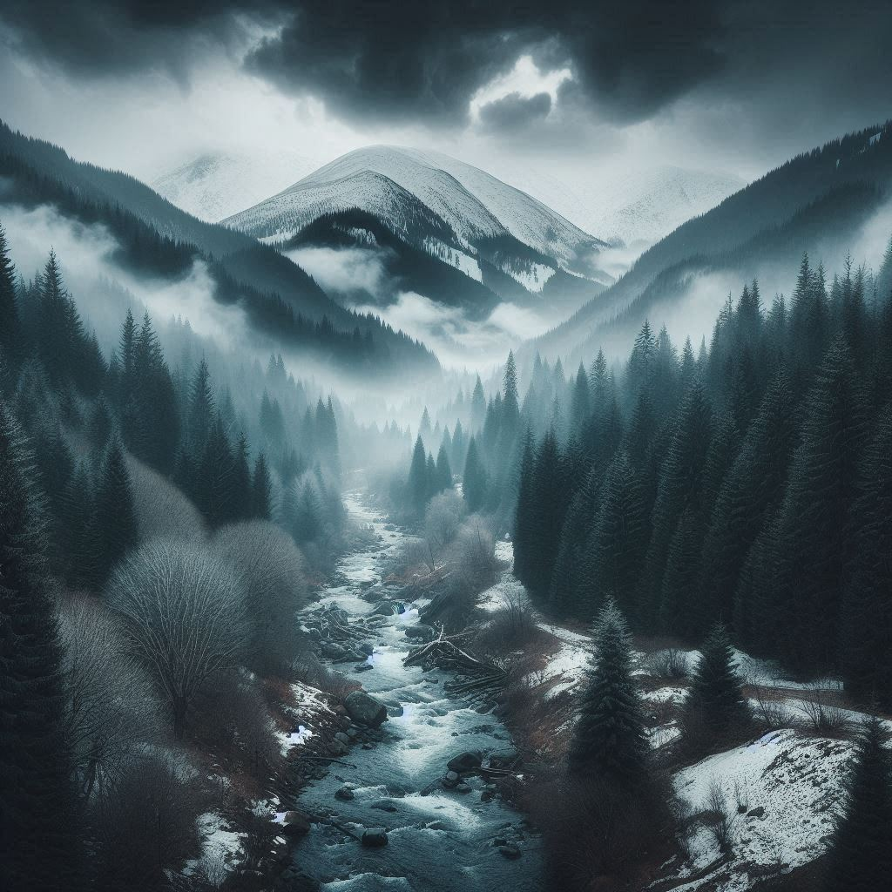

# [LOKACE a NPC] Zázemí

## Post 697240

**Author:** Orákulum  
**Posted:** 2024-07-09T09:21:41+00:00  
**Source:** https://rpgforum.cz/forum/viewtopic.php?p=697240#p697240

Zázemí

  * Husté lesy na pozadí členitého terénu
  * Lovecké tábory a odlehlé osady
  * Ptačí zpěv vystřídaný náhlým, znepokojivým tichem.
  * Železný lid, sbírající obživu a lovící zvěř.
  * Hladové slídící šelmy
  * Tlupy varou, vyjící svou válečnou píseň.

---

## Post 697241

**Author:** Orákulum  
**Posted:** 2024-07-09T09:24:23+00:00  
**Source:** https://rpgforum.cz/forum/viewtopic.php?p=697241#p697241

Rozcestník

**Lokace**  

  * [Kamenobrod](https://rpgforum.cz/forum/viewtopic.php?p=697243#p697243)

**Postavy**  
**Hrozby**

---

## Post 697243

**Author:** Orákulum  
**Posted:** 2024-07-09T09:26:25+00:00  
**Source:** https://rpgforum.cz/forum/viewtopic.php?p=697243#p697243

Kamenobrod

  * Místo, kde se potkávají obchodníci z jihu a horalové ze severu; jediné místo široko daleko, kde se dá překročit řeka
  * Na obou březích řeky leží palisádou obehnané domky a jednoduché dřevěné věže, strážící vchod na brod; Kamenobrod není jediná osada, ale hned dvojice spřátelených osad, strážících opačné strany brodu

**Objevy**

  * Myrick a Tristan [dorazili](https://rpgforum.cz/forum/viewtopic.php?p=697399#p697399) s [uprchlíky](https://rpgforum.cz/forum/viewtopic.php?p=697237#p697237) ve chvíli, kdy v Kamenobrodu probíhala svatba (Milla a Jihan); získali pro sebe i uprchlíky zázemí
  * Myrick sháněl informace o obří obchodnici Tenuře od obchodníka Ghalena a během rozhovoru byli [přepadeni](https://rpgforum.cz/forum/viewtopic.php?p=697465#p697465), Ghalen byl [unesen](https://rpgforum.cz/forum/viewtopic.php?p=697478#p697478)
  * Myrick s Tristanem [pomohli](https://rpgforum.cz/forum/viewtopic.php?p=698142#p698142) Strážcům Ghalena najít a zachránit. Tristan se dostal do [konfliktu](https://rpgforum.cz/forum/viewtopic.php?p=698164#p698164) s Kirou a byl vyhozen. Únosci zůstali v Kamenobrodu, kde budou souzeni.
  * Cestou z Kamenobrodu Myricka a Tristana [dostihl](https://rpgforum.cz/forum/viewtopic.php?p=698241#p698241) staršina Halíma a Myrick mu přísahal, že získá Halímovo rodinné dědictví.

**POSTAVY**

  * Delos - vůdkyně [uprchlíků](https://rpgforum.cz/forum/viewtopic.php?p=697237#p697237), které sem Myrick s Tristanem přivedli
  * Ghalen - obchodník, kterého přepadli a unesli
  * Halíma - stařešina, omluvil se Myrickovi za chování Kiry a zavázal ho najít a nechat si Halímovo rodinné dědictví
  * Kira - Strážkyně, vedla ostatní Strážce při hledání uneseného Ghalena, nemá ráda Tristana
  * Rosa - dcera vůdkyně Kruhu
